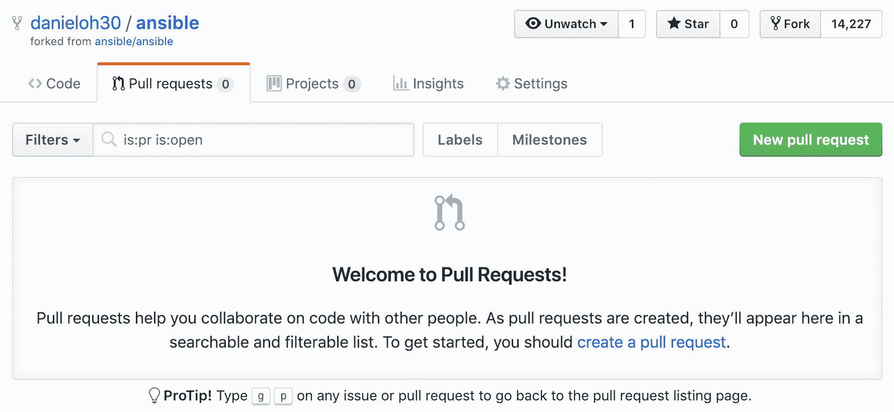

# 使用和创建插件

到目前为止，模块一直是我们在 Ansible 中旅程中非常明显和关键的一部分。它们用于执行明确定义的任务，可以用于一次性命令（使用临时命令）或作为更大的 playbook 的一部分。插件对于 Ansible 同样重要，迄今为止我们一直在使用它们，甚至没有意识到！虽然模块始终用于在 Ansible 中创建某种任务，但插件的使用方式取决于它们的用例。有许多不同类型的插件；我们将在本章中向您介绍它们，并让您了解它们的目的。但是，作为一个引子，您是否意识到当 Ansible 使用 SSH 连接到远程服务器时，连接插件提供了功能？这展示了插件发挥的重要作用。

在本章中，我们将为您提供对插件的深入介绍，并向您展示如何探索 Ansible 附带的各种插件。然后，我们将扩展这一点，演示如何创建自己的插件并在 Ansible 项目中使用它们，这与我们在上一章中使用自定义模块的方式非常相似。这将有助于您理解诸如 Ansible 等开源软件提供的无限可能性。

在本章中，我们将涵盖以下主题：

+   发现插件类型

+   查找包含的插件

+   创建自定义插件

# 技术要求

本章假设您已经按照第一章中详细介绍的方式设置了 Ansible 的控制主机，并且您正在使用最新版本。本章中的示例是使用 Ansible 2.9 进行测试的。本章还假设您至少有一个额外的主机进行测试；最好是基于 Linux 的主机。

尽管本章将给出主机名的具体示例，但您可以自由地用您自己的主机名和/或 IP 地址替换它们，如何做到这一点的详细信息将在适当的位置提供。本章涵盖的插件开发工作假设您的计算机上有 Python 2 或 Python 3 开发环境，并且您正在运行 Linux、FreeBSD 或 macOS。需要额外的 Python 模块时，它们的安装将有文档记录。构建模块文档的任务在 Python 3.5 或更高版本中有一些非常具体的要求，因此假设您可以安装一个合适的 Python 环境，如果您希望尝试这样做。

本章的代码包可以在[`github.com/PacktPublishing/Ansible-2-Cookbook/tree/master/Chapter%206`](https://github.com/PacktPublishing/Ansible-2-Cookbook/tree/master/Chapter%206)上找到。

# 查找包含的插件

正如我们在前一节中讨论的，插件在 Ansible 中并不像它们的模块对应物那样明显，然而迄今为止我们在每个单个 Ansible 命令中都在幕后使用它们！让我们在前一节的工作基础上继续，我们查看了插件文档，看看我们可以在哪里找到插件的源代码。这反过来将作为我们自己构建一个简单插件的前提。

如果您在 Linux 系统上使用软件包管理器（即通过 RPM 或 DEB 软件包）安装了 Ansible，则您的插件位置将取决于您的操作系统。例如，在我安装了来自官方 RPM 软件包的 Ansible 的测试 CentOS 7 系统上，我可以看到安装的插件在这里：

```
$ ls /usr/lib/python2.7/site-packages/ansible/plugins/
action    cliconf       httpapi        inventory    lookup     terminal
become    connection    __init__.py    loader.py    netconf    test
cache     doc_fragments __init__.pyc   loader.pyc   shell      vars
callback  filter        __init__.pyo   loader.pyo   strategy
```

注意插件是如何分成子目录的，所有子目录都以它们的类别命名。如果我们想查找我们在前一节中审查过文档的`paramiko_ssh`插件，我们可以在`connection/`子目录中查找：

```
$ ls -l /usr/lib/python2.7/site-packages/ansible/plugins/connection/paramiko_ssh.py
-rw-r--r-- 1 root root 23544 Mar 5 05:39 /usr/lib/python2.7/site-packages/ansible/plugins/connection/paramiko_ssh.py
```

但是，总的来说，我不建议您编辑或更改从软件包安装的文件，因为在升级软件包时很容易覆盖它们。由于本章的目标之一是编写我们自己的简单自定义插件，让我们看看如何在官方 Ansible 源代码中找到插件：

1.  从 GitHub 克隆官方 Ansible 存储库，就像我们之前做的那样，并将目录更改为克隆的位置：

```
$ git clone https://github.com/ansible/ansible.git
$ cd ansible
```

1.  在官方源代码目录结构中，您会发现所有插件都包含在`lib/ansible/plugins/`下（同样，以分类的子目录形式）：

```
$ cd lib/ansible/plugins
```

1.  我们可以通过查看`connection`目录来探索基于连接的插件：

```
$ ls -al connection/
```

此目录的确切内容将取决于您克隆的 Ansible 源代码的版本。在撰写本文时，它看起来如下，每个插件都有一个 Python 文件（类似于我们在第五章中看到的每个模块都有一个 Python 文件）：

```
$ ls -al connection/
total 176
drwxr-xr-x 2 root root 109 Apr 15 17:24 .
drwxr-xr-x 19 root root 297 Apr 15 17:24 ..
-rw-r--r-- 1 root root 16411 Apr 15 17:24 __init__.py
-rw-r--r-- 1 root root 6855 Apr 15 17:24 local.py
-rw-r--r-- 1 root root 23525 Apr 15 17:24 paramiko_ssh.py
-rw-r--r-- 1 root root 32839 Apr 15 17:24 psrp.py
-rw-r--r-- 1 root root 55367 Apr 15 17:24 ssh.py
-rw-r--r-- 1 root root 31277 Apr 15 17:24 winrm.py
```

1.  您可以查看每个插件的内容，以了解它们的工作原理，这也是开源软件的美妙之处的一部分：

```
$ less connection/paramiko_ssh.py
```

以下代码块显示了此文件开头的示例，以便让您了解如果此命令运行正确，您应该看到的输出类型：

```
# (c) 2012, Michael DeHaan <michael.dehaan@gmail.com>
# (c) 2017 Ansible Project
# GNU General Public License v3.0+ (see COPYING or https://www.gnu.org/licenses/gpl-3.0.txt)
from __future__ import (absolute_import, division, print_function)
__metaclass__ = type

DOCUMENTATION = """
 author: Ansible Core Team
 connection: paramiko
 short_description: Run tasks via python ssh (paramiko)
 description:
 - Use the python ssh implementation (Paramiko) to connect to targets
 - The paramiko transport is provided because many distributions, in particular EL6 and before do not support ControlPersist
 in their SSH implementations.
....
```

请注意`DOCUMENTATION`块，它与我们在处理模块源代码时看到的非常相似。如果您探索每个插件的源代码，您会发现其结构与模块代码结构有些相似。但是，下一节，让我们开始构建我们自己的自定义插件，通过一个实际的例子来学习它们是如何组合在一起的，而不是简单地接受这种说法。

# 创建自定义插件

在本节中，我们将带您完成创建自己插件的实际指南。这个例子必然会很简单。但是，希望它能很好地指导您了解插件开发的原则和最佳实践，并为您构建自己更复杂的插件奠定坚实的基础。我们甚至会向您展示如何将这些与您自己的 playbooks 集成，并在准备就绪时将它们提交给官方 Ansible 项目以供包含。

正如我们在构建自己的模块时所指出的，Ansible 是用 Python 编写的，它的插件也不例外。因此，您需要用 Python 编写您的插件；因此，要开始开发自己的插件，您需要确保已安装 Python 和一些基本工具。如果您的开发机器上已经运行了 Ansible，您可能已经安装了所需的软件包。但是，如果您从头开始，您需要安装 Python、Python 软件包管理器（`pip`）和可能一些其他开发软件包。具体的过程在不同的操作系统之间会有很大的不同，但是这里有一些示例供您参考：

+   在 Fedora 上，您可以运行以下命令来安装所需的软件包：

```
$ sudo dnf install python python-devel
```

+   同样，在 CentOS 上，您可以运行以下命令来安装所需的软件包：

```
$ sudo yum install python python-devel
```

+   在 Ubuntu 上，您可以运行以下命令来安装您需要的软件包：

```
$ sudo apt-get update
$ sudo apt-get install python-pip python-dev build-essential 
```

+   如果您正在使用 Homebrew 包装系统的 macOS，以下命令将安装您需要的软件包：

```
$ sudo brew install python
```

安装所需的软件包后，您需要将 Ansible Git 存储库克隆到本地计算机，因为其中有一些有价值的脚本，我们在模块开发过程中将需要。使用以下命令将 Ansible 存储库克隆到开发机器上的当前目录：

```
$ git clone https://github.com/ansible/ansible.git
$ cd ansible
```

有了所有这些先决条件，让我们开始创建您自己的插件。虽然编写模块和插件之间有许多相似之处，但也有根本的不同之处。实际上，Ansible 可以使用的不同类型的插件实际上是稍微不同编码的，并且有不同的建议。遗憾的是，我们在本书中没有空间来逐一介绍每一种插件，但您可以从官方 Ansible 文档中了解每种插件类型的要求。

对于我们的简单示例，我们将创建一个过滤器插件，用另一个字符串替换给定的字符串。如果您参考前面的文档链接，过滤器插件可能是一些最容易编码的插件，因为与模块一样，对文档没有严格的要求。但是，如果我们要创建一个`lookup`插件，我们将期望创建与我们在第五章中创建的`DOCUMENTATION`、`EXAMPLES`和`RETURN`文档部分相同的文档。我们还需要以相同的方式测试和构建我们的 web 文档。

我们已经涵盖了这一点，因此在本章中不需要重复整个过程。相反，我们将首先专注于创建一个过滤器插件。与其他 Ansible 插件和模块不同，您实际上可以在单个 Python 插件文件中定义多个过滤器。过滤器本质上是相当紧凑的代码。它们也是众多的，因此每个过滤器一个文件的方式不太适用。但是，如果您想编写其他类型的插件（如`lookup`插件），*您将*需要为每个插件创建一个 Python 文件。

让我们开始创建我们的简单过滤器插件。由于我们只创建一个，它将存在于自己的单独的 Python 文件中。如果您想将代码提交回 Ansible 项目，可以提出修改 Ansible 核心过滤器 Python 文件的建议；但现在，我们将把这个作为一个项目留给您自己完成。我们的过滤器文件将被称为`custom_filter.py`，它将存在于一个名为`filter_plugins`的目录中，该目录必须与您的 playbook 目录位于同一目录中。

执行以下步骤来创建和测试您的插件代码：

1.  在插件文件中以标题开始，以便人们知道谁编写了插件以及它发布的许可证。当然，您应该更新版权和许可字段，以适合您的插件的值，但以下文本作为一个示例供您开始使用：

```
# (c) 2020, James Freeman <james.freeman@example.com>
# GNU General Public License v3.0+ (see COPYING or https://www.gnu.org/licenses/gpl-3.0.txt)
```

1.  接下来，我们将添加一个非常简单的 Python 函数——您的函数可以像您想要的那样复杂，但对于我们来说，我们将简单地使用 Python 的`.replace`函数来替换`string`变量中的一个字符串为另一个字符串。以下示例查找`Puppet`的实例，并将其替换为`Ansible`：

```
def improve_automation(a):
 return a.replace("Puppet", "Ansible")
```

1.  接下来，我们需要创建`FilterModule`类的对象，这是 Ansible 将知道这个 Python 文件包含一个过滤器的方法。在这个对象中，我们可以创建一个`filters`定义，并将我们之前定义的过滤器函数的值返回给 Ansible：

```
class FilterModule(object):
       '''improve_automation filters'''
       def filters(self):
           return {'improve_automation': improve_automation}
```

1.  正如您所看到的，这段代码非常简单，我们可以使用内置的 Python 函数，比如`replace`，来操作字符串。在 Ansible 中没有特定的插件测试工具，因此我们将通过编写一个简单的 playbook 来测试我们的插件代码。以下 playbook 代码定义了一个包含单词`Puppet`的简单字符串，并使用`debug`模块将其打印到控制台，应用我们新定义的过滤器到字符串：

```
---
- name: Play to demonstrate our custom filter
  hosts: frontends
  gather_facts: false
  vars:
    statement: "Puppet is an excellent automation tool!"

  tasks:
    - name: make a statement
      debug:
        msg: "{{ statement | improve_automation }}"
```

现在，在我们尝试运行之前，让我们回顾一下目录结构应该是什么样子的。就像我们能够利用我们在第五章中创建的自定义模块一样，通过创建一个`library/`子目录来存放我们的模块，我们也可以为我们的插件创建一个`filter_plugins/`子目录。当你完成了前面代码块中各个文件的编码细节后，你的目录树结构应该是这样的：

```
.
├── filter_plugins
│   ├── custom_filter.py
├── hosts
├── myplugin.yml
```

现在让我们运行一下我们的小测试 playbook，看看我们得到了什么输出。如果一切顺利，它应该看起来像下面这样：

```
$ ansible-playbook -i hosts myplugin.yml

PLAY [Play to demonstrate our custom filter] ***********************************

TASK [make a statement] ********************************************************
ok: [frt01.example.com] => {
 "msg": "Ansible is an excellent automation tool!"
}

PLAY RECAP *********************************************************************
frt01.example.com : ok=1 changed=0 unreachable=0 failed=0 skipped=0 rescued=0 ignored=0
```

正如你所看到的，我们的新过滤器插件将我们变量的内容中的`Puppet`字符串替换为`Ansible`字符串。当然，这只是一个愚蠢的测试，不太可能被贡献回 Ansible 项目。然而，它展示了如何在只有六行代码和一点点 Python 知识的情况下，我们创建了自己的过滤器插件来操作一个字符串。我相信你可以想出更复杂和有用的东西！

其他插件类型需要比这更多的工作；虽然我们不会在这里详细介绍创建过滤器插件的过程，但你会发现编写过滤器插件更类似于编写模块，因为你需要做以下工作：

+   包括`DOCUMENTATION`、`EXAMPLES`和`RETURN`部分的适当文档。

+   确保你在插件中加入了适当和充分的错误处理。

+   彻底测试它，包括失败和成功的情况。

举个例子，让我们重复前面的过程，但是创建一个`lookup`插件。这个插件将基于一个简化版本的`lookup`插件文件。然而，我们希望调整我们的版本，只返回文件的第一个字符。你可以根据需要调整这个示例，也许从文件中读取头文件，或者你可以添加参数到插件中，允许你使用字符索引提取子字符串。我们将把这个增强活动留给你自己去完成。让我们开始吧！我们的新 lookup 插件将被称为`firstchar`，而`lookup`插件与它们的 Python 文件是一对一的映射，插件文件将被称为`firstchar.py`。（事实上，Ansible 将使用这个文件名作为插件的名称——你在代码中找不到对它的引用！）。如果你打算像之前执行的那样从 playbook 中测试这个插件，你应该在一个名为`lookup_plugins/`的目录中创建它：

1.  首先，像之前一样在插件文件中添加一个头部，以便维护者和版权细节清晰可见。我们从原始的`file.py` `lookup`插件代码中借用了大部分内容，因此我们需要包含相关的来源信息：

```
# (c) 2020, James Freeman <james.freeman@example.com>
# (c) 2012, Daniel Hokka Zakrisson <daniel@hozac.com>
# (c) 2017 Ansible Project
# GNU General Public License v3.0+ (see COPYING or https://www.gnu.org/licenses/gpl-3.0.txt)
```

1.  接下来，添加 Python 3 的头文件——如果你打算通过**Pull Request**（**PR**）提交你的插件到 Ansible 项目，这是绝对必需的。

```
from __future__ import (absolute_import, division, print_function)
__metaclass__ = type
```

1.  接下来，在你的插件中添加一个`DOCUMENTATION`块，以便其他用户能够理解如何与它交互：

```
DOCUMENTATION = """
    lookup: firstchar
    author: James Freeman <james.freeman@example.com>
    version_added: "2.9"
    short_description: read the first character of file contents
    description:
        - This lookup returns the first character of the contents from a file on the Ansible controller's file system.
    options:
      _terms:
        description: path(s) of files to read
        required: True
    notes:
      - if read in variable context, the file can be interpreted as YAML if the content is valid to the parser.
      - this lookup does not understand 'globing', use the fileglob lookup instead.
"""
```

1.  添加相关的`EXAMPLES`块，展示如何使用你的插件，就像我们为模块做的那样：

```
EXAMPLES = """
- debug: msg="the first character in foo.txt is {{lookup('firstchar', '/etc/foo.txt') }}"

"""
```

1.  还要确保你记录了插件的`RETURN`值：

```
RETURN = """
  _raw:
    description:
      - first character of content of file(s)
"""
```

1.  文档完成后，我们现在可以开始编写我们的 Python 代码了。我们将首先导入所有需要使我们的模块工作的 Python 模块。我们还将设置`display`对象，它用于详细输出和调试。如果你需要显示`debug`输出，应该在插件代码中使用这个对象，而不是`print`语句：

```
from ansible.errors import AnsibleError, AnsibleParserError
from ansible.plugins.lookup import LookupBase
from ansible.utils.display import Display

display = Display()
```

1.  我们现在将创建一个`LookupModule`类的对象。在其中定义一个名为`run`的默认函数（这是 Ansible `lookup`插件框架所期望的），并初始化一个空数组作为我们的返回数据：

```
class LookupModule(LookupBase):

    def run(self, terms, variables=None, **kwargs):

        ret = []
```

1.  有了这个，我们将开始一个循环，遍历每个术语（在我们的简单插件中，这将是传递给插件的文件名）。虽然我们只会在简单的用例上测试这个，但查找插件的使用方式意味着它们需要支持操作的`terms`列表。在这个循环中，我们显示有价值的调试信息，并且最重要的是，定义一个包含我们将要打开的每个文件的详细信息的对象，称为`lookupfile`：

```
      for term in terms:
            display.debug("File lookup term: %s" % term)

   lookupfile = self.find_file_in_search_path(variables, 'files', term)

      display.vvvv(u"File lookup using %s as file" % lookupfile)
```

1.  现在，我们将读取文件内容。这可能只需要一行 Python 代码，但我们从第五章中对模块的工作中知道，我们不应该认为我们会得到一个实际可以读取的文件。因此，我们将把读取文件内容的语句放入一个`try`块中，并实现异常处理，以确保插件的行为是合理的，即使在错误情况下，也能传递易于理解的错误消息给用户，而不是 Python 的回溯信息：

```
            try:
                if lookupfile:
               contents, show_data = self._loader._get_file_contents(lookupfile)
                    ret.append(contents.rstrip()[0])
                else:
                    raise AnsibleParserError()
            except AnsibleParserError:
                raise AnsibleError("could not locate file in lookup: %s" % term)
```

请注意，在其中，我们将文件内容的第一个字符（用`[0]`索引表示）附加到我们的空数组中。我们还使用`rstrip`删除任何尾随空格。

1.  最后，我们使用`return`语句将从文件中收集到的字符返回给 Ansible：

```
        return ret
```

1.  再次，我们可以创建一个简单的测试 playbook 来测试我们新创建的插件：

```
---
- name: Play to demonstrate our custom lookup plugin
  hosts: frontends
  gather_facts: false

  tasks:
    - name: make a statement
      debug:
        msg: "{{ lookup('firstchar', 'testdoc.txt')}}"
```

同样，我们使用 debug 模块将输出打印到控制台，并引用我们的`lookup`插件来获取输出。

1.  创建前面代码块中提到的文本文件，名为`testdoc.txt`。它可以包含任何你喜欢的内容——我的包含以下简单文本：

```
Hello
```

为了清晰起见，你的最终目录结构应该如下所示：

```
.
├── hosts
├── lookup_plugins
│   └── firstchar.py
├── myplugin2.yml
└── testdoc.txt
```

1.  现在，当我们运行我们的新 playbook 时，我们应该看到类似以下的输出：

```
$ ansible-playbook -i hosts myplugin2.yml

PLAY [Play to demonstrate our custom lookup plugin] ****************************

TASK [make a statement] ********************************************************
ok: [frt01.example.com] => {
 "msg": "H"
}

PLAY RECAP *********************************************************************
frt01.example.com : ok=1 changed=0 unreachable=0 failed=0 skipped=0 rescued=0 ignored=0
```

如果一切顺利，你的 playbook 应该返回你创建的文本文件的第一个字符。当然，我们可以做很多事情来增强这段代码，但这是一个很好的简单示例，可以让你开始。

有了这个基础，你现在应该对如何开始编写自己的 Ansible 插件有一个合理的想法。我们下一个逻辑步骤是更深入地了解如何测试我们新编写的插件，我们将在下一节中进行。

# 学习将自定义插件与 Ansible 源代码集成

到目前为止，我们只是以独立的方式测试了我们的插件。这一切都很好，但如果你真的想要将它添加到你自己的 Ansible 源代码分支，或者更好的是，提交给 Ansible 项目以便包含在 PR 中，那该怎么办呢？幸运的是，这个过程与我们在第五章中介绍的非常相似，只是文件夹结构略有不同。

与以前一样，你的第一个任务将是获取官方 Ansible 项目源代码的副本——例如，通过将 GitHub 存储库克隆到你的本地机器上：

```
$ git clone https://github.com/ansible/ansible.git
$ cd ansible
```

接下来，你需要将你的插件代码复制到一个适当的插件目录中。

1.  例如，我们的示例过滤器将被复制到你刚刚克隆的源代码中的以下目录中：

```
$ cp ~/custom_filter.py ./lib/ansible/plugins/filter/
```

1.  类似地，我们的自定义`lookup`插件将放在`lookup`插件的目录中，使用如下命令：

```
$ cp ~/firstchar.py ./lib/ansible/plugins/lookup/
```

将代码复制到位后，你需要像以前一样测试文档（即你的插件是否包含它）。你可以像我们在第五章中那样构建`webdocs`文档，所以我们不会在这里重复。不过，作为一个提醒，我们可以快速检查文档是否正确渲染，使用`ansible-doc`命令，如下所示：

```
$ . hacking/env-setup
running egg_info
creating lib/ansible.egg-info
writing requirements to lib/ansible.egg-info/requires.txt
writing lib/ansible.egg-info/PKG-INFO
writing top-level names to lib/ansible.egg-info/top_level.txt
writing dependency_links to lib/ansible.egg-info/dependency_links.txt
writing manifest file 'lib/ansible.egg-info/SOURCES.txt'
reading manifest file 'lib/ansible.egg-info/SOURCES.txt'
reading manifest template 'MANIFEST.in'
warning: no files found matching 'SYMLINK_CACHE.json'
writing manifest file 'lib/ansible.egg-info/SOURCES.txt'

Setting up Ansible to run out of checkout...

PATH=/home/james/ansible/bin:/usr/local/sbin:/usr/local/bin:/usr/sbin:/usr/bin:/root/bin
PYTHONPATH=/home/james/ansible/lib
MANPATH=/home/james/ansible/docs/man:/usr/local/share/man:/usr/share/man

Remember, you may wish to specify your host file with -i

Done!

$ ansible-doc -t lookup firstchar
> FIRSTCHAR (/home/james/ansible/lib/ansible/plugins/lookup/firstchar.py)

 This lookup returns the first character of the contents from a
 file on the Ansible controller's file system.

 * This module is maintained by The Ansible Community
OPTIONS (= is mandatory):

= _terms
 path(s) of files to read
```

到目前为止，您已经看到在 Ansible 中插件开发和模块开发之间有很多重叠。特别重要的是要注意异常处理和生成高质量、易于理解的错误消息，并遵守和维护 Ansible 的高标准文档。我们在这里没有涵盖的一个额外的项目是插件输出。所有插件必须返回 Unicode 字符串；这确保它们可以正确通过`jinja2`过滤器运行。更多指导信息可以在官方 Ansible 文档中找到：[`docs.ansible.com/ansible/latest/dev_guide/developing_plugins.html`](https://docs.ansible.com/ansible/latest/dev_guide/developing_plugins.html)。

有了这些知识，现在您应该可以开始自己的插件开发工作，甚至可以将您的代码提交回社区，如果您愿意的话。我们将在下一节简要回顾一下这一点。

# 与社区分享插件

您可能希望将您的新插件提交到 Ansible 项目，就像我们在第五章中考虑我们的自定义模块一样，*使用和创建模块*。这个过程与模块的过程几乎完全相同，这一部分将对此进行回顾。

使用以下流程将向 GitHub 上的 Ansible 项目提交一个真实的请求，将您提交的代码与他们的代码合并。除非您真的有一个准备提交到 Ansible 代码库的新模块，否则*不要*按照这个流程进行。

为了将您的插件作为 Ansible 存储库的 PR 提交，您首先需要 fork 官方 Ansible 存储库的`devel`分支。要做到这一点，在您的网络浏览器上登录 GitHub 账户（或者如果您还没有账户，创建一个），然后导航到[`github.com/ansible/ansible.git`](https://github.com/ansible/ansible.git)。点击页面右上角的 Fork：


一旦您将存储库 fork 到您自己的账户，我们将指导您运行所需的命令，将您的模块代码添加到其中，然后创建必需的 PRs，以便将您的新模块与上游 Ansible 项目合并：

1.  克隆您刚刚 fork 到本地计算机的`devel`分支。使用类似以下命令的命令，但一定要用符合您自己 GitHub 账户的 URL 替换它：

```
$ git clone https://github.com/<your GitHub account>/ansible.git
```

1.  将您的模块代码复制到适当的`plugins/`目录中。以下代码块中使用的`copy`命令只是一个示例，让您了解要做什么——实际上，您应该选择适当的类别子目录来放置您的插件，因为它不一定适合`lookup`类别。一旦您添加了 Python 文件，执行`git add`命令使 Git 知道新文件，然后用有意义的`commit`消息提交它。这里显示了一些示例命令：

```
$ cd ansible
$ cp ~/ansible-development/plugindev/firstchar.py ./lib/ansible/plugins/lookup
$ git add lib/ansible/plugins/lookup/firstchar.py
$ git commit -m 'Added tested version of firstchar.py for pull request creation'
```

1.  现在，请确保使用以下命令将代码推送到您 fork 的存储库：

```
$ git push
```

1.  在您的网络浏览器中返回 GitHub，并导航到 Pull Requests 页面，如下面的屏幕截图所示。点击 New pull request 按钮：



按照 GitHub 网站的指导，完成 PR 创建过程。一旦您成功提交了您的 PR，您应该能够导航到官方 Ansible 源代码存储库的 PR 列表，并在那里找到您的 PR。以下是一个 PR 列表的示例截图，供您参考：


如前所述，如果您的 PR 需要很长时间才能得到审查，不要感到惊慌 - 这仅仅是因为有很多 PR 需要审查和处理。您始终可以通过将插件代码添加到本地`*_plugins/`目录中来在本地使用您的插件代码，就像我们之前演示的那样，这样您的 PR 的处理速度不会妨碍您使用 Ansible。有关在本地工作时放置插件代码的更多详细信息，请参阅[`docs.ansible.com/ansible/latest/dev_guide/developing_locally.html`](https://docs.ansible.com/ansible/latest/dev_guide/developing_locally.html)。

我们完成了对插件创建的探讨，包括两个可工作的示例。希望您发现这段旅程是有益和有价值的，并且增强了您使用 Ansible 并在需要时扩展其功能的能力。

# 总结

Ansible 插件是 Ansible 功能的核心部分，在本章中，我们发现在整本书中一直在使用它们，甚至没有意识到！Ansible 的模块化设计使得无论您是使用模块还是当前支持的各种类型的插件，都可以轻松扩展和添加功能。无论是添加用于字符串处理的新过滤器，还是查找数据的新方法（或者甚至是连接到新技术的新连接机制），Ansible 插件提供了一个完整的框架，可以将 Ansible 的功能远远扩展到其已经广泛的能力之外。

在本章中，我们了解了 Ansible 支持的各种类型的插件，然后更详细地探讨了它们，并了解了如何获取现有插件的文档和信息。然后，我们完成了两个实际示例，为 Ansible 创建了两种不同类型的插件，同时探讨了插件开发的最佳实践以及这如何与模块开发重叠。最后，我们回顾了如何将我们的新插件代码作为 PR 提交回 Ansible 项目。

在下一章中，我们将探讨编写 Ansible playbook 时应遵循的最佳实践，以确保您生成可管理、高质量的自动化代码。

# 问题

1.  您可以使用以下哪个`ansible-doc`命令来列出所有缓存插件的名称？

A) `ansible-doc -a cache -l`

B) `ansible-doc cache -l`

C) `ansible-doc -a cache`

D) `ansible-doc -t cache -l`

E) `ansible-doc cache`

1.  您需要将哪个类添加到您的`lookup`插件代码中，以包括大部分插件代码，包括`run()`、`items`循环、`try`和`except`？

A) `LookupModule`

B) `RunModule`

C) `StartModule`

D) `InitModule`

E) `LoadModule`

1.  真或假 - 为了使用 Python 创建自定义插件，您需要在您的操作系统上安装带有相关依赖项的 Python：

A) True

B) False

# 进一步阅读

您可以通过直接访问 Ansible 存储库来找到所有插件，网址为[`github.com/ansible/ansible/tree/devel/lib/ansible/plugins`](https://github.com/ansible/ansible/tree/devel/lib/ansible/plugins)。
