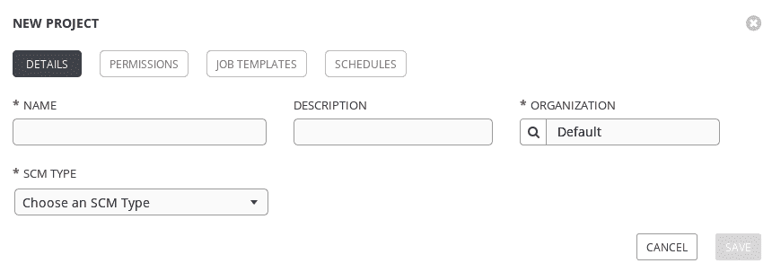
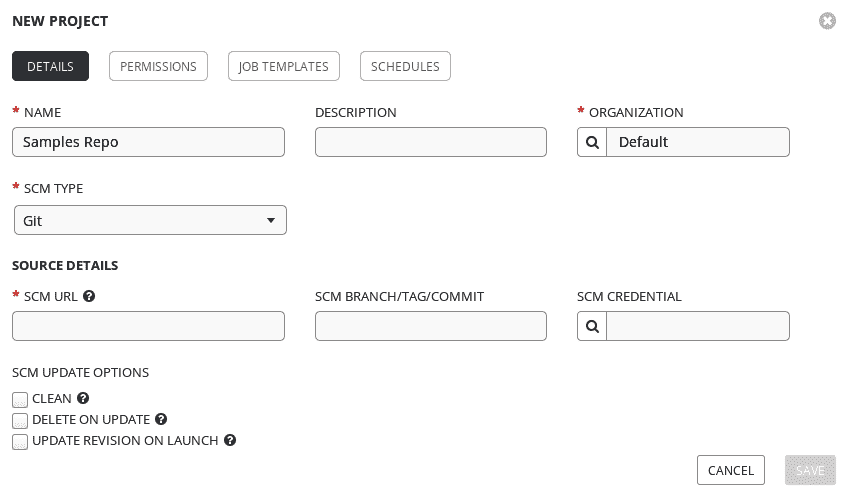
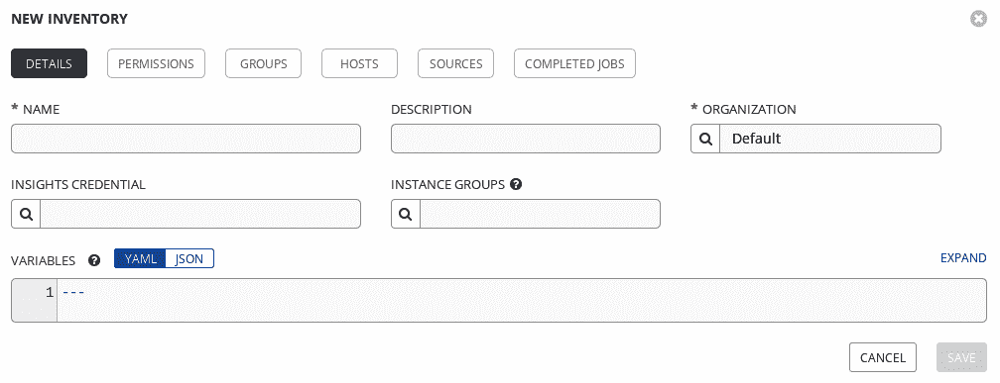
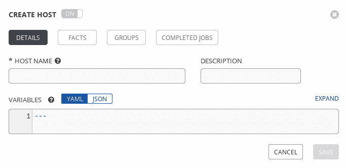
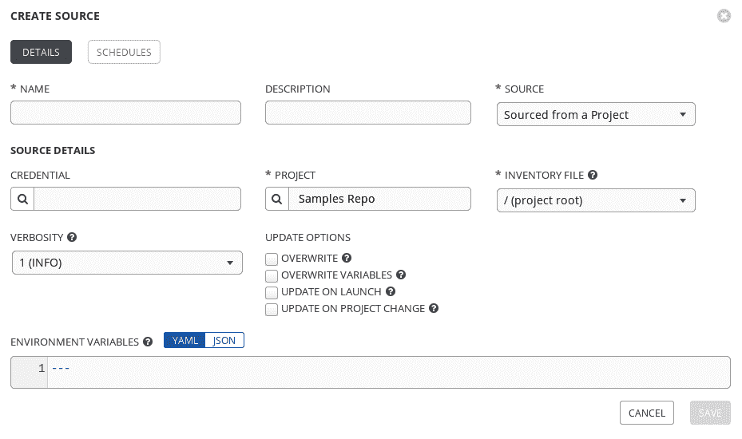
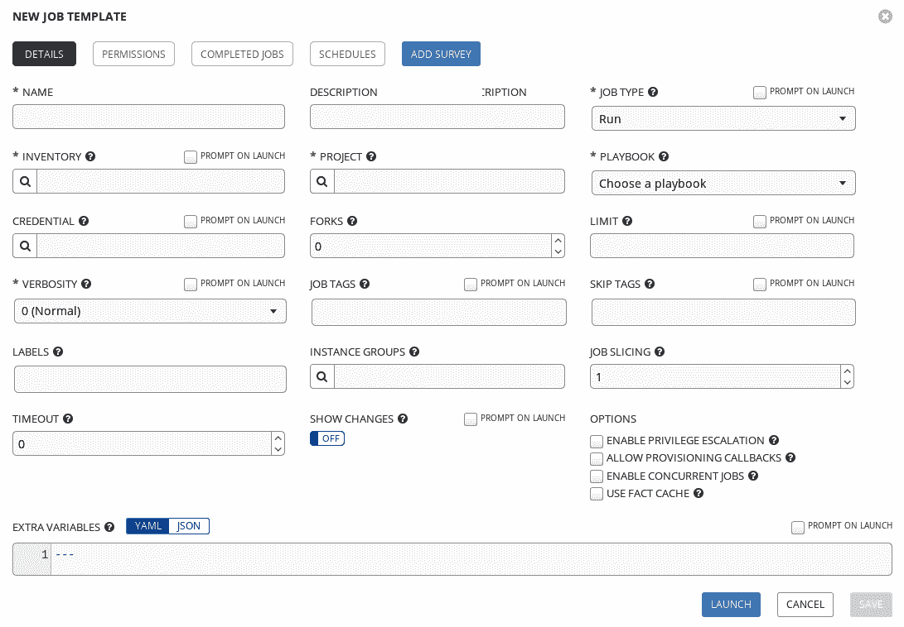
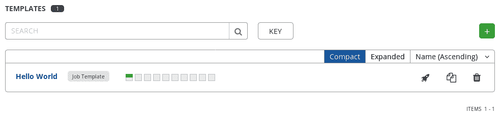
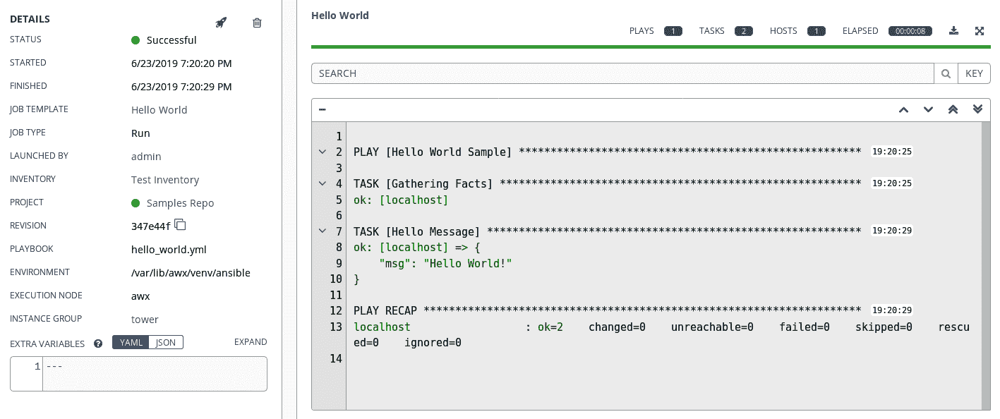
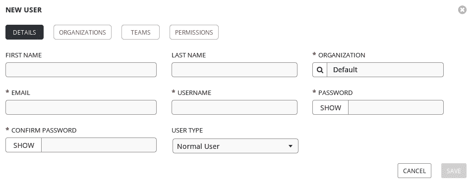
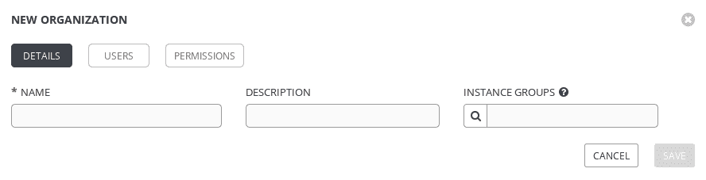

# 第十二章：开始使用 Ansible Tower

Ansible 非常强大，但它需要用户使用 CLI。在某些情况下，这不是最佳选择，比如在需要从另一个作业触发 Ansible 作业的情况下（API 可能更好），或者在应该触发作业的人只能触发特定作业的情况下。对于这些情况，AWX 或 Ansible Tower 是更好的选择。

AWX 和 Ansible Tower 之间唯一的区别是 AWX 是上游和开源版本，而 Ansible Tower 是红帽公司的下游产品，它是官方支持的，但需要付费，并且交付方式也不同。AWX 作为一个 Docker 容器可以在任何地方运行，而 Ansible Tower 安装在系统上，需要特定版本的 Linux——具体来说是 RHEL 7.4+，RHEL 8.0+和 CentOS 7.4+。在撰写本文时，我们将使用 AWX 并讨论 AWX，但我们讨论的一切也适用于 Ansible Tower。

本章涵盖以下主题：

+   安装 AWX

+   从 AWX 运行你的第一个 playbook

+   创建一个 AWX 项目

+   创建一个清单

+   创建一个作业模板

+   运行一个作业

+   控制对 AWX 的访问

+   创建一个用户

+   创建一个团队

+   创建一个组织

+   在 AWX 中分配权限

# 技术要求

虽然有几种安装 AWX 的方法，我们将使用建议的基于容器的 AWX 安装。因此，您的计算机上需要安装以下软件：

+   Ansible 2.4+。

+   Docker。

+   `docker` Python 模块。

+   `docker-compose` Python 模块。

+   如果您的系统使用**安全增强型 Linux**（**SELinux**），您还需要`libselinux` Python 模块。

本章假设您已经按照第一章中详细介绍的方式设置了 Ansible 的控制主机，并且您正在使用最新版本——本章的示例是使用 Ansible 2.9 进行测试的。虽然本章将给出特定的主机名示例，但您可以自由地用您自己的主机名和/或 IP 地址替换它们，如何做到这一点的细节将在适当的地方提供。Docker 的安装超出了本书的范围，但您可以安装您的 Linux 操作系统提供的版本或 Docker CE。必需的 Python 模块可以通过使用`pip`或者通过操作系统包进行安装。

# 安装 AWX

在我们进一步讨论 AWX 之前，最好是您已经在您的计算机上安装了它，这样您就可以跟随解释并立即开始使用 AWX。安装 AWX 的最方便的方法是按照以下步骤进行：

1.  首先，我们需要克隆 AWX Git 存储库，可以通过运行以下命令完成：

```
$ git clone https://github.com/ansible/awx.git
```

1.  通过设置`installer/inventory`文件来修改密码和秘密的合理值（如`pg_password`，`rabbitmq_password`，`admin_password`和`secret_key`）。

1.  现在我们已经下载了 Ansible AWX 代码和安装程序，我们可以进入安装程序文件夹，并通过运行以下代码执行安装：

```
$ cd awx/installer
$ ansible-playbook -i inventory install.yml
```

`install.yml` playbook 为我们执行整个安装。它首先检查可能的错误配置或缺少依赖项的环境。如果一切正常，它会继续下载几个 Docker 镜像（包括 PostgreSQL，memcached，RabbitMQ，AWX Web 和 AWX workers），然后运行它们。

一旦 playbook 完成，您可以通过发出`docker ps`命令来检查安装，它应该输出类似以下内容：

```
CONTAINER ID  IMAGE                      COMMAND                 CREATED        STATUS        PORTS     NAMES
7e388622a9a5  ansible/awx_task:5.0.0     "/tini -- /bin/sh ..."  2 minutes ago  Up 2 minutes  8052/tcp awx_task
03946e9f7a74  ansible/awx_web:5.0.0      "/tini -- /bin/sh ..."  2 minutes ago  Up 2 minutes  0.0.0.0:80->8052/tcp awx_web
d1134f5dc89a  ansible/awx_rabbitmq:3.7.4 "docker-entrypoint..."  2 minutes ago  Up 2 minutes  4369/tcp, 5671-5672/tcp, 15671-15672/tcp, 25672/tcp awx_rabbitmq
2184596d2584  postgres:9.6               "docker-entrypoint..."  2 minutes ago  Up 2 minutes  5432/tcp awx_postgres
dd6ebe2f8c8e  memcached:alpine           "docker-entrypoint..."  2 minutes ago  Up 2 minutes  11211/tcp awx_memcached
```

如上面的输出所示，我们的系统现在有一个名为`awx_web`的容器，它已经绑定到端口`80`。

现在，您可以通过浏览`http://<您的 AWX 主机的 IP 地址>/`并使用您在本节早期的`清单`文件中指定的凭据来访问 AWX。请注意，默认的管理员用户名是`admin`，除非您在清单中更改了它。

现在，您已经学会了安装 AWX 的必要步骤。让我们看看如何在 AWX 中创建项目。

# 从 AWX 运行您的第一个 playbook

与 Ansible 一样，在 AWX 中，目标是运行一个 Ansible playbook，每个运行的 playbook 称为**作业**。由于 AWX 比 Ansible 提供更多的灵活性和自动化，因此在运行第一个作业之前，需要进行一些配置，因此让我们开始创建 AWX 项目。

# 创建 AWX 项目

AWX 使用术语**项目**来标识 Ansible playbooks 的存储库。AWX 项目支持将 playbooks 放置在所有主要的**源代码管理**（**SCM**）系统中，例如 Git、Mercurial 和 SVN，还支持文件系统上的 playbooks 或由 Red Hat Insights 提供的 playbooks。要创建项目，请按照以下步骤操作：

1.  首先，您需要转到左侧菜单栏上的项目，然后单击屏幕左上部的绿色背景上带有白色加号的按钮。这将打开一个窗口，如下所示：



1.  通过填写名称（`样本库`）并选择`Git`作为`SCM 类型`，窗口会增加新的参数：



1.  现在，您可以添加 SCM URL（[`github.com/ansible/ansible-tower-samples`](https://github.com/ansible/ansible-tower-samples)）并单击现在应该可点击的`保存`按钮。

正如我们在本节开头提到的，项目是在 AWX 中存储和使用 playbooks 的系统。您可以想象，AWX 项目有许多有趣的附加配置，其中我认为最有趣的是`启动时更新版本`。

如果标记了此选项，这将指示 Ansible 在运行该项目中的任何 playbook 之前始终更新 playbook 的存储库。这确保它始终执行 playbook 的最新版本。这是一个重要的功能，如果您没有勾选它，就有可能（sooner or later，在您的环境中会发生）有人注意到 playbook 中存在问题并修复它，然后他们运行 playbook 时确信自己运行的是最新版本。然后他们忘记在运行 playbook 之前运行同步任务，实际上运行的是旧版本的 playbook。如果以前的版本非常有 bug，这可能会导致重大问题。

使用此选项的缺点是，每次执行 playbook 时，实际上会运行两个 playbook，从而增加了任务执行的时间。我认为这是一个非常小的缺点，不足以抵消使用此选项的好处。

现在，您已经学会了在 Ansible Tower 中创建项目的必要步骤。让我们看看如何在下一节中创建清单。

# 创建清单

与 Ansible Core 一样，为了使 AWX 了解您的环境中存在的机器，我们使用清单。在 AWX 世界中，清单与 Ansible Core 中的等效物并没有太大的不同。让我们看看如何通过以下步骤在 AWX 中创建您的第一个清单：

1.  单击左侧菜单栏中的清单选项。您将被重定向到清单窗口，在那里您可以通过单击屏幕左上部带有白色加号的按钮来创建您的第一个清单。这与我们创建新项目时不同，因为此按钮不会立即打开创建表单，而是会首先询问您是否要创建清单或智能清单。

1.  选择清单选项后，将出现以下框：



1.  在此窗口中，您需要设置一个名称，然后保存它。保存后，权限、组、主机、来源和已完成作业选项卡将变为可点击状态，因此您可以继续配置。

由于空清单毫无用处，我们将向其中添加`localhost`。

1.  要做到这一点，选择“主机”选项卡，然后单击屏幕左上角带有白色加号的绿色背景的按钮。这将打开一个窗口，如下所示：



1.  然后，我们需要添加主机名（`localhost`）并通过向“变量”框中添加以下代码来指示 Ansible 使用本地连接：

```
---
ansible_connection: local
ansible_python_interpreter: '{{ ansible_playbook_python }}'
```

1.  我们现在可以单击“保存”，保存我们的清单。

我们首先需要在创建清单或智能清单之间进行选择。这些选项之间有什么区别？在 AWX 中，清单与 Ansible Core 清单非常相似，但具有其他功能，例如内置的动态清单支持，这意味着您无需编辑配置文件或安装其他 Python 模块。要启用此功能，只需转到清单中的“来源”选项卡，选择从真实来源（例如公共云提供程序清单（**亚马逊网络服务**（**AWS**）、Azure 和**谷歌云平台**（**GCP**）都受支持），私有云清单（例如 VMWare 或 OpenStack）或其他系统，例如 Red Hat Satellite 或自定义脚本）自动填充清单的选项。

关于清单来源的特别说明是，如果选择了“从项目中获取”，将提供以下形式的表单：



在我看来，这是一个非常有趣的功能，因为它允许用户将自己设计的动态清单脚本检入到 Git 存储库中（可以是独立的存储库，也可以是您放入 playbook 的存储库），AWX 从存储库中提取该信息。

至于项目，当您向清单添加源时，您可能选择选择“启动时更新”选项，该选项的行为与项目的“启动时更新”选项的行为完全相同。因此，我强烈建议您也使用此选项。

智能清单是由 AWX 填充的清单，从其他清单中的主机开始，通过使用用户在创建过程中选择的特定智能主机过滤器对它们进行过滤。这对于动态创建具有特定类型主机的清单并根据过滤器保存手动创建许多不同组的需求或更糟糕的是不得不多次添加相同的主机非常有用。

现在，您已经学会了在 AWX 中创建清单所需的步骤。让我们看看如何创建作业模板。

# 创建作业模板

现在我们已经在项目中有了 playbook，在清单中有了主机，我们可以继续创建**作业模板**。

AWX 中的作业模板是执行作业所需的配置的集合。这与`ansible-playbook`命令行选项非常相似。我们需要创建作业模板的原因是，可以启动带有很少或没有用户输入的 playbook 运行，这意味着它们可以被委派给可能不知道 playbook 工作原理的团队，甚至可以在没有任何人在场的情况下定期运行：

1.  首先，您需要单击左侧菜单栏上的“模板”选项。

1.  现在，您可以通过单击屏幕左上角带有白色加号的绿色背景的按钮来创建新模板。它会询问您是否要创建作业模板或工作流模板-您需要选择作业模板。将出现以下窗口：



如您所见，此视图中有相当多的字段。继续所需的唯一信息是名称（我们将输入`Hello World`）、清单（我们将选择在本章节的*创建清单*部分中创建的“测试清单”）、项目（我们将选择在本章节的前一部分中创建的“示例库”项目）和 playbook（我们将选择`hello_world.yml`，这是唯一可用的 playbook）。然后，我们可以点击保存。请注意，因为我们使用本地连接到`localhost`运行它，所以不需要创建或指定任何凭据。但是，如果您要针对一个或多个远程主机运行作业模板，则需要创建一个机器凭据，并将其与您的作业模板关联。机器凭据，例如 SSH 用户名和密码或 SSH 用户名和私钥，这些都安全存储在 AWX 的后端数据库中，这意味着您可以再次将与 playbook 相关的任务委派给其他团队，而无需实际提供密码或 SSH 密钥。

我们首先要选择的是创建作业模板还是工作流模板。我们选择了作业模板，因为我们希望能够从这个模板创建简单的作业。也可以创建更复杂的作业，这些作业是由多个作业模板组成，其中一个作业和下一个作业之间具有流程控制功能。这允许更复杂的情况和场景，您可能希望有多个作业（例如创建实例、公司定制、设置 Oracle 数据库、设置 MySQL 数据库等），但您也希望有一个一键部署，例如设置机器、应用所有公司定制并安装 MySQL 数据库。显然，您可能还有另一个部署，使用所有相同的组件，除了最后一个组件，它使用 Oracle 数据库部分来创建 Oracle 数据库机器。这使您能够拥有极大的灵活性，并且可以重复使用许多组件，创建多个几乎相同的 playbook。

有趣的是，作业模板创建窗口中的许多字段都有一个带有“启动时提示”的选项。这是为了能够在创建作业模板时可选地设置此值，但也允许运行作业的用户在运行时输入/覆盖它。当每次运行时有一个字段发生变化时（也许是“限制”字段，它与`ansible-playbook`命令一起使用时的操作方式相同），或者可以用作健全性检查，因为它在实际运行 playbook 之前提示用户输入值（并让他们有机会修改它）。但是，这可能会阻止计划的作业运行，因此在启用此功能时要小心。

现在，您已经学会了在 AWX 中创建作业模板的必要步骤。让我们看看如何创建作业。

# 运行作业

作业是作业模板的一个实例，正如名称所示。这意味着要在我们的机器上执行任何操作，我们必须创建一个作业模板实例，或者更简单地说，一个作业，按照以下步骤进行：

1.  现在我们已经设置了作业模板，我们可以运行作业本身。要这样做，我们需要转到页面左侧的“模板”项目。

1.  找到你想要运行的作业模板（在我们的例子中，这将是`Hello World`），然后点击页面右侧对应正确作业模板的小火箭，如下面的截图所示：



当作业运行时，AWX 允许我们在作业的仪表板中跟踪作业执行，如下面的截图所示：



在屏幕的右侧，作业执行期间加载作业输出，而左侧提供有关作业的信息。AWX 和 Ansible Tower 的一个很棒的功能是它们在后端数据库中存档了作业执行输出，这意味着您可以在将来的任何时间回来查询作业运行，查看发生了什么变化。这对于审计和策略执行等场合非常强大和有用。

现在，您已经学会了在 AWX 中创建作业的必要步骤。让我们看看如何创建用户。

# 控制对 AWX 的访问

在我看来，AWX 相对于 Ansible 的最大优势之一是，AWX 允许多个用户连接和控制/执行操作。这使得公司可以为不同团队、整个组织甚至多个组织安装单个 AWX，这是非常有利的。

**基于角色的访问控制**（**RBAC**）系统用于管理用户的权限。

AWX 和 Ansible Tower 都可以链接到中央目录，例如**轻量级目录访问协议**（**LDAP**）和 Azure 活动目录，但我们也可以在 AWX 服务器本身上创建本地用户帐户。让我们从在本地创建我们的第一个用户帐户开始！

# 创建用户

AWX 的一个重要优势是能够管理多个用户。这使我们可以为每个使用 AWX 系统的人创建一个用户，以确保他们只被授予他们需要的权限。此外，通过使用个人帐户，我们可以确保通过审计日志查看谁执行了什么操作。要创建用户，请按照以下步骤进行：

1.  转到屏幕左侧的菜单栏，选择“用户”选项。

1.  现在您可以看到用户列表，并且可以通过单击屏幕左上角带有白色加号的绿色背景按钮来创建新用户。将出现以下表单：



通过添加电子邮件地址、用户名和密码（确认密码），您可以创建新用户。

用户可以分为三种类型：

+   **普通用户**：此类型的用户没有任何继承权限，他们需要被授予特定权限才能执行任何操作。

+   **系统审计员**：此类型的用户在整个 AWX 安装中具有完全只读权限。

+   **系统管理员**：此类型的用户在整个 AWX 安装中拥有完全权限。

现在，您已经学会了在 AWX 中创建用户的必要步骤。让我们简要了解一下团队。

# 创建团队

尽管拥有个人用户帐户是一种非常强大的工具，特别是对于企业用例，但对每个对象（例如作业模板或清单）逐个设置权限将非常不便和繁琐。每当有人加入团队时，他们的用户帐户必须手动配置为正确的权限，以对每个对象进行操作，并且如果他们离开，也必须手动删除。

AWX 和 Ansible Tower 具有与大多数其他 RBAC 系统中相同的用户分组概念。唯一的细微差别是，在用户界面中，它们被称为**团队**，而不是群组。但是，您可以简单轻松地创建团队，然后根据需要添加和删除用户。通过用户界面进行此操作非常简单直接，您会发现该过程类似于大多数 RBAC 系统处理用户组的方式，因此我们在这里不会进一步详细说明。

一旦您设置好团队，我建议您将权限分配给团队，而不是通过单个用户，因为随着组织的增长，这将使您更轻松地管理 AWX 对象权限。说到组织，让我们在下一节中看看 AWX 中组织的概念。

# 创建组织

有时，您可能需要管理多个独立的人员组，这些人员组需要管理独立的机器。对于这种情况，可以使用组织来帮助您。组织基本上是 AWX 的租户，拥有自己独特的用户帐户、团队、项目、清单和作业模板——这几乎就像拥有 AWX 的单独实例！要创建组织，您需要执行以下步骤：

1.  要创建新组织，您需要转到屏幕左侧的“组织”选项。

1.  然后，您可以查看现有的组织，并通过单击屏幕左上部分带有绿色背景的白色加号按钮来创建新的组织。

将出现以下窗口：



由于唯一的强制字段是名称，您只需填写名称并单击保存。

创建组织后，您可以将任何类型的资源分配给组织，例如项目、模板、清单、用户等。组织是一个简单的概念，但在 AWX 中在分隔角色和责任方面非常强大。最后，在完成本节之前，让我们看看如何在 AWX 中分配权限。

# 在 AWX 中分配权限

您可能已经注意到，在我们通过配置 AWX 中的第一个项目、清单和作业模板的过程中，我们导航到的大多数屏幕上都有一个名为“权限”的按钮。当我们使用管理员帐户导航用户界面时，我们可以看到所有选项，但当然，您不希望给每个用户都授予管理员权限。

可以根据对象授予个别用户（或他们所属的团队）权限。例如，您可以有一个数据库管理员团队，他们只能访问和执行特定于其角色的数据库服务器清单上的 playbook，并使用特定于其角色的作业模板。然后，Linux 系统管理员可以访问特定于其角色的清单、项目和作业模板。AWX 会隐藏用户没有权限的对象，这意味着数据库管理员永远看不到 Linux 系统管理员的对象，反之亦然。

您可以授予用户（或团队）多种不同的权限级别，包括以下内容：

+   管理员：这相当于系统管理员的组织级别等价物。

+   执行：这种用户只能执行组织中的模板。

+   项目管理员：这种用户可以更改组织中的任何项目。

+   清单管理员：这种用户可以更改组织中的任何清单。

+   凭证管理员：这种用户可以更改组织中的任何凭证。

+   工作流管理员：这种用户可以更改组织中的任何工作流。

+   通知管理员：这种用户可以更改组织中的任何通知。

+   作业模板管理员：这种用户可以更改组织中的任何作业模板。

+   审计员：这相当于系统审计员的组织级别等价物。

+   成员：这相当于普通用户的组织级别等价物。

+   读取：这种用户可以查看组织中的非敏感对象。

这就结束了我们对 AWX 中 RBAC 的简要介绍以及对这个强大工具的介绍。AWX 是 Ansible 在企业环境中强大功能的一个很好的补充，确实有助于确保用户可以以良好管理、安全和可审计的方式运行 Ansible playbooks。在本章中，我们只是触及了表面，但希望本章能让您了解 AWX 如何帮助您的团队或企业的自动化之旅。

# 摘要

AWX 和 Ansible Tower 是强大的、互补的工具，强力支持在企业或团队环境中使用 Ansible。它们可以帮助安全地存储凭据，否则你将不得不广泛分发，审计 playbook 运行的历史，并强制执行 playbook 的版本控制。这些工具的基于 Web 的用户界面为最终用户创建了一个低门槛，这意味着 playbook 运行可以轻松委托给否则对 Ansible 知识很少的团队（只要适当的升级路径被设置好，以防问题出现）。简而言之，在企业环境中实施 Ansible 时，如果没有添加 Ansible Tower 或 AWX，其使用就不应被视为完整。

在本章中，您学习了如何在 Linux 主机上安装 AWX，以及从 AWX 运行您的第一个 playbook 所需的步骤。您还了解了 AWX 中的 RBAC 以及它如何支持企业环境中的大型多用户环境。

我们现在已经到达了本书的结尾，因为这是最后一章，我想感谢您阅读整本书，希望它教会了您最初希望了解的有关 Ansible 的知识。

# 问题

1.  C) 作业模板

E) 项目

B) 假

A) 用户

在 Ansible Tower 中，您可以创建哪些对象？

B) 作业

1.  真或假 - AWX 是 Red Hat Ansible Tower 的上游和开源版本。

A) 真

D) 模块
