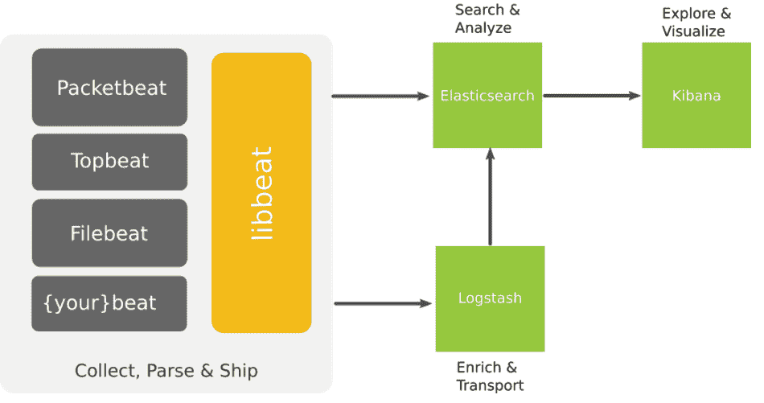
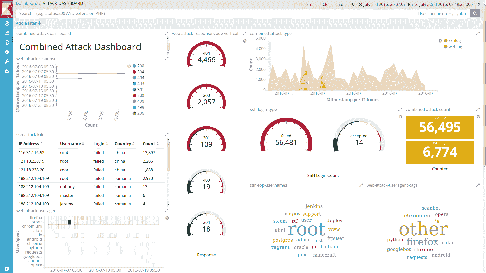

# 四、日志监控和无服务器自动防御（AWS 中的弹性栈）

日志监控是考虑安全自动化的最佳场所。为了使监控有效，需要做一些事情。我们应该能够将日志从不同的设备移动到一个中心位置。我们应该能够理解什么是常规日志条目，什么可能是攻击。我们应该能够存储日志，并对它们进行操作，例如聚合、规范化以及最终的分析。

但是，在开始设置栈和使用弹性栈构建集中式日志记录和监控之前，我们需要了解一下为什么我们需要使用和自动化设置来防御接近实时的攻击。成为万事通很难。传统的日志记录系统发现很难记录所有应用、系统和设备。时间格式、日志输出格式等的多样性使得任务相当复杂。

最大的障碍是找到一种能够集中日志的方法。这妨碍了实时或接近实时有效地处理日志条目。

一些问题如下:

*   获取往往很困难
*   需要挖掘数据方面的高专业知识
*   日志可能很难找到
*   日志数据是巨大的

在本章中，我们将讨论以下主题:

*   安装用于日志监控的弹性栈
*   在服务器上安装 Beats
*   设置和配置警报
*   设置一个 AWS Lambda 端点来进行自动防御

# 弹性叠层介绍

Elastic Stack 是一组来自 Elastic 公司的开源产品。它从任何类型的源和任何格式中获取数据，并实时搜索、分析和可视化这些数据。它由以下四个主要部分组成:

*   弹性搜索
*   logstash(日志记录)
*   马纳人
*   搜索



Elastic Stack architecture overview (image taken from https://www.elastic.co/blog/beats-1-0-0)

它帮助用户/管理员实时(接近)收集、分析和可视化数据。每个模块都适合您的用例和环境。

# 弹性搜索

Elasticsearch 是一个分布式的 RESTful 搜索和分析引擎，能够解决越来越多的用例。作为弹性栈的核心，它集中存储您的数据，因此您可以发现预期和发现意外

弹性堆叠的主要优点:

*   分布式高可用性搜索引擎，用 Java 编写，使用 Groovy
*   建立在 Lucene 之上
*   多租户，具有多种类型和一组应用编程接口
*   面向文档，提供(接近)实时搜索

# logstash(日志记录)

Logstash 是一个开源的服务器端数据处理管道，它从多个来源吸收数据，同时对其进行转换，然后将其发送到您最喜欢的 *stash。*

只是为了突出 Logstash 是:

*   用 Ruby 编写的管理事件和日志的工具
*   所有类型日志的集中数据处理
*   由以下三个主要组件组成:
    *   **输入**:传递日志，将日志处理成机器可理解的格式
    *   **过滤器**:对事件执行特定动作的一组条件
    *   **输出**:已处理事件/日志的决策者

# 马纳人

Kibana 允许您可视化弹性搜索数据并浏览弹性栈，因此您可以做任何事情，从了解为什么您会在凌晨 2:00 被寻呼到了解雨水可能对您的季度数字产生的影响。

Kibana 的功能列表:

*   强大的前端仪表板是用 JavaScript 编写的
*   基于浏览器的弹性搜索分析和搜索仪表板
*   灵活的分析和可视化平台
*   以图表、图形、计数、地图等形式实时提供数据

# 搜索

Beats 是单一目的数据托运人的平台。它们作为轻量级代理安装，并将数百或数千台机器的数据发送到 Logstash 或 Elasticsearch。

节拍是:

*   弹性搜索和日志存储的轻量级托运人
*   捕获各种操作数据，如日志或网络数据包数据
*   他们可以将日志发送到弹性搜索或日志存储

不同类型的节拍如下:

*   **Libbeat** :创建新 beat 的 Go 框架
*   **打包**:窃听你的有线数据
*   **文件节拍**:轻量级日志转发器到日志存储和弹性搜索
*   **Winlogbeat** :通过社区发送窗口事件日志和许多其他 beat

# 我们为什么要使用弹性栈进行安全监控和警报？

弹性栈解决了我们之前讨论过的大多数问题，例如:

*   能够存储大量数据
*   能够理解和阅读各种日志格式
*   能够几乎实时地将日志信息从各种设备运送到一个中心位置
*   用于日志分析的可视化仪表板

# 设置弹性栈的先决条件

让我们从先决条件开始。这里，我们使用`debconf`为交互输入添加值。然后我们安装 Java、nginx 和其他必需的包:

```
- name: install python 2
  raw: test -e /usr/bin/python || (apt -y update && apt install -y python-minimal)

- name: accepting oracle java license agreement
  debconf:
    name: 'oracle-java8-installer'
    question: 'shared/accepted-oracle-license-v1-1'
    value: 'true'
    vtype: 'select'

- name: adding ppa repo for oracle java by webupd8team
  apt_repository:
    repo: 'ppa:webupd8team/java'
    state: present
    update_cache: yes

- name: installing java nginx apache2-utils and git
  apt:
    name: "{{ item }}"
    state: present
    update_cache: yes

  with_items:
    - python-software-properties
    - oracle-java8-installer
    - nginx
    - apache2-utils
    - python-pip
    - python-passlib
```

# 设置弹性栈

该栈是以下各项的组合:

*   弹性搜索服务
*   日志存储服务
*   基巴纳服务
*   所有设备上的 Beats 服务

这个弹性栈可以用不同的方式设置。在本章中，我们将在一台机器上设置 Elasticsearch、Logstash 和 Kibana。

这是主要的日志收集机器:

*   它至少需要 4 GB 内存，因为我们使用一台机器来提供三种服务(弹性搜索、日志存储和基巴纳)
*   它至少需要 20 GB 的磁盘空间，根据您的日志大小，您可以添加磁盘空间

# Logstash 集成

Logstash 对以下内容提供了大量集成支持:

*   **输入**:一个输入插件可以让 Logstash 读取特定的事件源。输入插件有文件、伐木工、s3、Beats、stdin 等等。
*   **过滤器**:过滤器插件对事件进行中间处理。过滤器通常根据事件的特征有条件地应用。
*   **输出**:输出插件将事件数据发送到特定目的地。输出是事件管道的最后阶段。输出插件有弹性搜索、电子邮件、标准输出、s3、文件、HTTP 等等。

# 马纳人

Kibana 默认有不同种类的插件和集成，也有来自社区的插件和集成，可以在[https://www . elastic . co/guide/en/kiba na/current/known-plugins . html](https://www.elastic.co/guide/en/kibana/current/known-plugins.html)找到。

# 弹性纤维

弹性工具是一个 Python 工具，它还捆绑了不同类型的集成来支持警报和通知。其中包括命令、电子邮件、JIRA、OpsGenie、AWS SNS、HipChat、Slack、Telegram 等。它还提供了一种模块化的方法来创建我们自己的集成。

# 安装弹性搜索

用`gpg key`从存储库中安装 Elasticsearch，并将其添加到启动程序中:

```
- name: adding elastic gpg key for elasticsearch
  apt_key:
    url: "https://artifacts.elastic.co/GPG-KEY-elasticsearch"
    state: present

- name: adding the elastic repository
  apt_repository:
    repo: "deb https://artifacts.elastic.co/packages/5.x/apt stable main"
    state: present

- name: installing elasticsearch
  apt:
    name: "{{ item }}"
    state: present
    update_cache: yes

  with_items:
    - elasticsearch

- name: adding elasticsearch to the startup programs
  service:
    name: elasticsearch
    enabled: yes

  notify:
    - start elasticsearch
```

使用所需设置配置弹性搜索集群。此外，为弹性搜索集群设置 JVM 选项。此外，为弹性搜索集群备份和快照创建备份目录:

```
- name: creating elasticsearch backup repo directory at {{ elasticsearch_backups_repo_path }}
  file:
    path: "{{ elasticsearch_backups_repo_path }}"
    state: directory
    mode: 0755
    owner: elasticsearch
    group: elasticsearch

- name: configuring elasticsearch.yml file
  template:
    src: "{{ item.src }}"
    dest: /etc/elasticsearch/"{{ item.dst }}"

  with_items:
    - { src: 'elasticsearch.yml.j2', dst: 'elasticsearch.yml' }
    - { src: 'jvm.options.j2', dst: 'jvm.options' }

  notify:
    - restart elasticsearch
```

通知部分将触发`restart elasticsearch`处理程序，处理程序文件如下所示。一旦在处理程序目录中创建了处理程序，我们就可以在任务的任何地方使用它们:

```
- name: start elasticsearch
  service:
    name: elasticsearch
    state: started

- name: restart elasticsearch
  service:
    name: elasticsearch
    state: restarted
```

# 安装日志存储

用`gpg key`从存储库中安装 Logstash，并将其添加到启动程序中:

```
- name: adding elastic gpg key for logstash
  apt_key:
    url: "https://artifacts.elastic.co/GPG-KEY-elasticsearch"
    state: present

- name: adding the elastic repository
  apt_repository:
    repo: "deb https://artifacts.elastic.co/packages/5.x/apt stable main"
    state: present

- name: installing logstash
  apt:
    name: "{{ item }}"
    state: present
    update_cache: yes

  with_items:
    - logstash

- name: adding logstash to the startup programs
  service:
    name: logstash
    enabled: yes

  notify:
    - start logstash
```

使用输入、输出和过滤器设置配置 Logstash 服务。这允许接收日志、处理日志和向弹性搜索集群发送日志:

```
- name: logstash configuration files
  template:
    src: "{{ item.src }}"
    dest: /etc/logstash/conf.d/"{{ item.dst }}"

  with_items:
    - { src: '02-beats-input.conf.j2', dst: '02-beats-input.conf' }
    - { src: '10-sshlog-filter.conf.j2', dst: '10-sshlog-filter.conf' }
    - { src: '11-weblog-filter.conf.j2', dst: '11-weblog-filter.conf' }
    - { src: '30-elasticsearch-output.conf.j2', dst: '10-elasticsearch-output.conf' }

  notify:
    - restart logstash
```

# Logstash 配置

为了接收来自不同系统的日志，我们使用了来自 Elastic 的 Beats 服务。下面的配置是从不同的服务器接收日志到 Logstash 服务器。Logstash 运行在端口`5044`上，我们可以使用 SSL 证书来确保日志通过加密通道传输:

```
# 02-beats-input.conf.j2
input {
    beats {
        port => 5044
        ssl => true
        ssl_certificate => "/etc/pki/tls/certs/logstash-forwarder.crt"
        ssl_key => "/etc/pki/tls/private/logstash-forwarder.key"
    }
}
```

以下配置是使用`grok`过滤器解析系统 SSH 服务日志(`auth.log`)。它还应用像`geoip`这样的过滤器，同时提供像国家、位置、经度、纬度等附加信息:

```
#10-sshlog-filter.conf.j2
filter {
    if [type] == "sshlog" {
        grok {
            match => [ "message", "%{SYSLOGTIMESTAMP:syslog_date} %{SYSLOGHOST:syslog_host} %{DATA:syslog_program}(?:\[%{POSINT}\])?: %{WORD:login} password for %{USERNAME:username} from %{IP:ip} %{GREEDYDATA}",
            "message", "%{SYSLOGTIMESTAMP:syslog_date} %{SYSLOGHOST:syslog_host} %{DATA:syslog_program}(?:\[%{POSINT}\])?: message repeated 2 times: \[ %{WORD:login} password for %{USERNAME:username} from %{IP:ip} %{GREEDYDATA}",
            "message", "%{SYSLOGTIMESTAMP:syslog_date} %{SYSLOGHOST:syslog_host} %{DATA:syslog_program}(?:\[%{POSINT}\])?: %{WORD:login} password for invalid user %{USERNAME:username} from %{IP:ip} %{GREEDYDATA}",
            "message", "%{SYSLOGTIMESTAMP:syslog_date} %{SYSLOGHOST:syslog_host} %{DATA:syslog_program}(?:\[%{POSINT}\])?: %{WORD:login} %{WORD:auth_method} for %{USERNAME:username} from %{IP:ip} %{GREEDYDATA}" ]
        }

        date {
            match => [ "timestamp", "dd/MMM/YYYY:HH:mm:ss Z" ]
            locale => en
        }

        geoip {
            source => "ip"
        }
    }
}
```

下面的配置是解析 web 服务器日志(`nginx`、`apache2`)。我们还将为`geoip`和`useragent`应用过滤器。`useragent`过滤器允许我们获取有关代理、操作系统类型、版本信息等信息:

```
#11-weblog-filter.conf.j2
filter {
    if [type] == "weblog" {
        grok {
        match => { "message" => '%{IPORHOST:clientip} %{USER:ident} %{USER:auth} \[%{HTTPDATE:timestamp}\] "%{WORD:verb} %{DATA:request} HTTP/%{NUMBER:httpversion}" %{NUMBER:response:int} (?:-|%{NUMBER:bytes:int}) %{QS:referrer} %{QS:agent}' }
        }

        date {
        match => [ "timestamp", "dd/MMM/YYYY:HH:mm:ss Z" ]
        locale => en
        }

        geoip {
            source => "clientip"
        }

        useragent {
            source => "agent"
            target => "useragent"
        }
    }
}
```

以下配置将以每日索引格式将日志输出发送到弹性搜索集群:

```
#30-elasticsearch-output.conf.j2
output {
    elasticsearch {
        hosts => ["localhost:9200"]
        manage_template => false
        index => "%{[@metadata][beat]}-%{+YYYY.MM.dd}"
        document_type => "%{[@metadata][type]}"
    }
}
```

# 安装 Kibana

下面的剧本将安装 Kibana。默认情况下，我们不会在 Kibana 中进行任何更改，因为它与 Elasticsearch 一起开箱即用:

```
- name: adding elastic gpg key for kibana
  apt_key:
    url: "https://artifacts.elastic.co/GPG-KEY-elasticsearch"
    state: present

- name: adding the elastic repository
  apt_repository:
    repo: "deb https://artifacts.elastic.co/packages/5.x/apt stable main"
    state: present

- name: installing kibana
  apt:
    name: "{{ item }}"
    state: present
    update_cache: yes

  with_items:
    - kibana

- name: adding kibana to the startup programs
  service:
    name: kibana
    enabled: yes

  notify:
    - start kibana
```

By default Kibana doesn't have any authentication, X-Pack is the commercial plug-in by Elastic for RBAC (role-based access control) with security. Also, some open source options include [https://readonlyrest.com/](https://readonlyrest.com/) and Search Guard ([https://floragunn.com](https://floragunn.com)) to interact with Elasticsearch. Using TLS/SSL and custom authentication and aauthorization is highly recommended. Some of the open source options includes Oauth2 Proxy ([https://github.com/bitly/oauth2_proxy](https://github.com/bitly/oauth2_proxy)) and Auth0, and so on.

# 设置 nginx 反向代理

以下配置是使用`nginx`反向代理为 Kibana 启用基本身份验证:

```
server {
    listen 80;
    server_name localhost;
    auth_basic "Restricted Access";
    auth_basic_user_file /etc/nginx/htpasswd.users;
    location / {
        proxy_pass http://localhost:5601;
        proxy_http_version 1.1;
        proxy_set_header Upgrade $http_upgrade;
        proxy_set_header Connection 'upgrade';
        proxy_set_header Host $host;
        proxy_cache_bypass $http_upgrade;
    }
}
```

设置和配置 nginx 服务如下所示:

```
#command: htpasswd -c /etc/nginx/htpasswd.users
- name: htpasswd generation
  htpasswd:
    path: "/etc/nginx/htpasswd.users"
    name: "{{ basic_auth_username }}"
    password: "{{ basic_auth_password }}"
    owner: root
    group: root
    mode: 0644

- name: nginx virtualhost configuration
  template:
    src: "templates/nginxdefault.j2"
    dest: "/etc/nginx/sites-available/default"

  notify:
    - restart nginx
```

# 安装 Beats 将日志发送到弹性栈

正如我们所讨论的，节拍是不同的类型。在下面的剧本中，我们将安装 Filebeat 来将 SSH 和 web 服务器日志发送到弹性栈:

```
- name: adding elastic gpg key for filebeat
  apt_key:
    url: "https://artifacts.elastic.co/GPG-KEY-elasticsearch"
    state: present

- name: adding the elastic repository
  apt_repository:
    repo: "deb https://artifacts.elastic.co/packages/5.x/apt stable main"
    state: present

- name: installing filebeat
  apt:
    name: "{{ item }}"
    state: present
    update_cache: yes

  with_items:
    - apt-transport-https
    - filebeat

- name: adding filebeat to the startup programs
  service:
    name: filebeat
    enabled: yes

  notify:
    - start filebeat
```

现在，我们可以将文件节拍配置为将 SSH 和 web 服务器日志发送到弹性栈，以近乎实时的方式进行处理和索引:

```
filebeat:
  prospectors:
    -
      paths:
        - /var/log/auth.log
        # - /var/log/syslog
        # - /var/log/*.log
      document_type: sshlog
    -
      paths:
        - /var/log/nginx/access.log
      document_type: weblog

  registry_file: /var/lib/filebeat/registry

output:
 logstash:
   hosts: ["{{ logstash_server_ip }}:5044"]
   bulk_max_size: 1024
   ssl:
    certificate_authorities: ["/etc/pki/tls/certs/logstash-forwarder.crt"]

logging:
 files:
   rotateeverybytes: 10485760 # = 10MB
```

# 用于报警的弹性垫圈

首先，我们需要安装设置弹性过滤器的先决条件。然后，我们将添加配置文件，以根据规则执行警报:

```
- name: installing pre requisuites for elastalert
  apt:
    name: "{{ item }}"
    state: present
    update_cache: yes

  with_items:
    - python-pip
    - python-dev
    - libffi-dev
    - libssl-dev
    - python-setuptools
    - build-essential

- name: installing elastalert
  pip:
    name: elastalert

- name: creating elastalert directories
  file: 
    path: "{{ item }}"
    state: directory
    mode: 0755

  with_items:
    - /opt/elastalert/rules
    - /opt/elastalert/config

- name: creating elastalert configuration
  template:
    src: "{{ item.src }}"
    dest: "{{ item.dst }}"

  with_items:
    - { src: 'elastalert-config.j2', dst: '/opt/elastalert/config/config.yml' }
    - { src: 'elastalert-service.j2', dst: '/lib/systemd/system/elastalert.service' }
    - { src: 'elastalert-sshrule.j2', dst: '/opt/elastalert/rules/ssh-bruteforce.yml' }

- name: enable elastalert service
  service:
    name: elastalert
    state: started
    enabled: yes

```

我们还创建了一个简单的启动脚本，以便将弹性蛋白酶作为系统服务:

```
[Unit]
Description=elastalert
After=multi-user.target

[Service]
Type=simple
WorkingDirectory=/opt/elastalert
ExecStart=/usr/local/bin/elastalert --config /opt/elastalert/config/config.yml

[Install]
WantedBy=multi-user.target
```

# 配置加密服务

我们可以使用“让我们加密”提供的命令行工具，以开放、自动化的方式获取免费的 SSL/TLS 证书。

该工具能够读取和理解 nginx 虚拟主机文件，并完全自动生成相关证书，无需任何人工干预:

```
- name: adding certbot ppa
  apt_repository:
    repo: "ppa:certbot/certbot"

- name: install certbot
  apt:
    name: "{{ item }}"
    update_cache: yes
    state: present

  with_items:
    - python-certbot-nginx

- name: check if we have generated a cert already
  stat:
    path: "/etc/letsencrypt/live/{{ website_domain_name }}/fullchain.pem"
    register: cert_stats

- name: run certbot to generate the certificates
  shell: "certbot certonly --standalone -d {{ website_domain_name }} --email {{ service_admin_email }} --non-interactive --agree-tos"
  when: cert_stats.stat.exists == False

- name: configuring site files
  template:
    src: website.conf
    dest: "/etc/nginx/sites-available/{{ website_domain_name }}"

- name: restart nginx
  service:
    name: nginx
    state: restarted
```

# 弹性规则配置

假设您已经安装了弹性栈并记录 SSH 日志，请使用以下弹性规则触发 SSH 攻击 IP 黑名单:

```
es_host: localhost
es_port: 9200
name: "SSH Bruteforce attack alert"
type: frequency
index: filebeat-*
num_events: 20
timeframe:
  minutes: 1
# For more info: http://www.elasticsearch.org/guide/en/elasticsearch/reference/current/query-dsl.html

filter:
- query:
    query_string:
      query: '_type:sshlog AND login:failed AND (username: "ubuntu" OR username: "root")'

alert:
  - slack:
      slack_webhook_url: "https://hooks.slack.com/services/xxxxx"
      slack_username_override: "attack-bot"
      slack_emoji_override: "robot_face"
  - command: ["/usr/bin/curl", "https://xxxxxxxxxxx.execute-api.us-east-1.amazonaws.com/dev/zzzzzzzzzzzzzz/ip/inframonitor/%(ip)s"]

realert:
  minutes: 0
```

在前面的示例规则中，大多数参数都是可配置的，基于用例。

For more references, visit [https://elastalert.readthedocs.io/en/latest/running_elastalert.html](https://elastalert.readthedocs.io/en/latest/running_elastalert.html).

# Kibana 仪表板

我们可以将现有的仪表板文件(JSON 格式)导入 Kibana，通过上传 JSON 文件来查看不同的模式。


Index creation in Kibana dashboard


Importing existing dashboards and visualizations into Kibana dashboard



Attack dashboards from SSH and web server logs

# 自动防御？

如果我们可以收到攻击通知，我们可以设置并执行以下操作:

*   调用一个 AWS Lambda 函数
*   将攻击者的 IP 地址信息发送到这个 AWS Lambda 函数端点
*   使用 Lambda 函数中部署的代码来调用 VPC 网络访问列表 API 并阻止攻击者的 IP 地址

为了确保我们不会用攻击者的入侵防御系统填满 ACL，我们可以将这种方法与 AWS DynamoDB 结合起来，短期存储这些信息，并将其从阻止列表中删除。


# 安装中使用的 AWS 服务

一旦检测到攻击，警报器就会通过 HTTPS 请求将 IP 发送到黑名单 lambda 端点。使用网络访问控制列表阻止该 IP，其记录保存在动态数据库中。如果该 IP 当前已经被阻止，则规则的到期时间将在动态数据库中延长。

一个过期处理函数被定期触发，它相应地从动态数据库和访问控制列表中删除过期的规则。

# DynamoDB(动态模式)

DynamoDB 是中央数据库，规则映射到它们各自的 ACL 标识。通过适当的 lambda 函数在`blacklist_ip`表中添加和删除 IP 地址规则。

# 黑名单λ函数

黑名单功能是设置中唯一公开的端点。任何需要列入黑名单的知识产权都需要通过 HTTPS 请求提供给此功能。

# handle 到期 lambda 函数

HandleExpiry 功能每分钟触发一次，并根据`expirymin`字段从 ACL 和 DynamoDB 中删除过期的规则。

# Cloudwatch

Cloudwatch 用于周期性地触发 HandleExpiry lambda 函数。默认情况下，该功能每分钟触发一次。

# VPC 网络 ACL

VPC 网络 ACL 是添加和删除 ACL 规则的地方。ACL 标识必须在设置期间配置。

# 设置

设置包括以下步骤:

*   获取 IAM 凭据
*   在动态数据库中创建表格
*   根据需求配置 lambda 函数
*   将代码部署到 AWS Lambda
*   将 Cloudwatch 配置为定期调用

除了获取 IAM 凭证和根据需求配置功能之外，整个设置都是自动化的。

# 配置

部署前可配置以下参数:

*   `region`:要部署的 AWS 区域。这需要与 VPC 网络所在的区域相同。
*   `accessToken`:将用于向黑名单端点验证请求的接入令牌。
*   `aclLimit`:ACL 可以处理的最大规则数。默认情况下，AWS 中的最大限制是 20。
*   `ruleStartId`:ACL 中规则的起始标识。
*   `aclID`:将应用规则的网络的 ACL ID。
*   `tableName`:dynamo db 中唯一的表名，为每个要防御的 VPC 创建。
*   `ruleValidity`:规则有效的持续时间，超过该时间后，IP 将被解除阻塞。

在`config.js`文件中配置以下内容:

```
module.exports = {
    region: "us-east-1",                                        // AWS Region to deploy in
    accessToken: "YOUR_R4NDOM_S3CR3T_ACCESS_TOKEN_GOES_HERE",   // Accesstoken to make requests to blacklist
    aclLimit: 20,                                               // Maximum number of acl rules
    ruleStartId: 10,                                            // Starting id for acl entries
    aclId: "YOUR_ACL_ID",                                       // AclId that you want to be managed
    tableName: "blacklist_ip",                                  // DynamoDB table that will be created
```

```
    ruleValidity: 5                                             // Validity of Blacklist rule in minutes 
}
```

确保根据您的设置至少修改`aclId`、`accessToken`和`region`。要修改 lambda 部署配置，请使用`serverless.yml`文件:

```
...

functions:
  blacklist:
    handler: handler.blacklistip
    events:
     - http:
         path: blacklistip
         method: get

  handleexpiry:
    handler: handler.handleexpiry
    events:
     - schedule: rate(1 minute)

...
```

例如，可以使用 YML 文件修改到期函数的触发速率和黑名单函数的端点网址。但违约已经是最佳选择。

剧本如下:

```
- name: installing node run time and npm
  apt:
    name: "{{ item }}"
    state: present
    update_cache: yes

  with_items:
    - nodejs
    - npm

- name: installing serverless package
  npm:
    name: "{{ item }}"
    global: yes
    state: present

  with_items:
    - serverless
    - aws-sdk

- name: copy the setup files
  template:
    src: "{{ item.src }}"
    dest: "{{ item.dst }}"

  with_items:
    - { src: 'config.js.j2', dst: '/opt/serverless/config.js' }
    - { src: 'handler.js.j2', dst: '/opt/serverless/handler.js' }
    - { src: 'iamRoleStatements.json.j2', dst: '/opt/serverless/iamRoleStatements.json' }
    - { src: 'initDb.js.j2', dst: '/opt/serverless/initDb.js' }
    - { src: 'serverless.yml.j2', dst: '/opt/serverless/serverless.yml' }
    - { src: 'aws-credentials.j2', dst: '~/.aws/credentials' }

- name: create dynamo db table
  command: node initDb.js
  args:
    chdir: /opt/serverless/

- name: deploy the serverless
  command: serverless deploy
  args:
    chdir: /opt/serverless/
```

AWS Lambda 的当前设置是根据网络 ACL 阻止 IP 地址。这可以与其他应用编程接口端点一起重用，如防火墙动态阻止列表和其他安全设备。

As per the AWS documentation, the VPC network ACL rule limit is set to 20: [http://docs.aws.amazon.com/AmazonVPC/latest/UserGuide/VPC_Appendix_Limits.html#vpc-limits-nacls](http://docs.aws.amazon.com/AmazonVPC/latest/UserGuide/VPC_Appendix_Limits.html#vpc-limits-nacls)

# 用法-阻止一个 IP 地址

黑名单端点负责阻止一个 IP 地址。

# 请求

网址如下:`https://lambda_url/blacklistipaccessToken=ACCESS_TOKEN&ip=IP_ADDRESS`

查询参数如下:

*   `IP_ADDRESS`:这是要屏蔽的 IP 地址
*   `ACCESS_TOKEN`:认证请求的`accessToken`

# 反应

响应是标准的 HTTP 状态代码，解释如下:

| **状态代码** | **车身** | **解释** |
| `200` | 堵塞的 | 该 IP 已被添加到黑名单中 |
| `200` | 延伸的 | 黑名单规则的有效性已被延长 |
| `400` | 错误的请求 | 必填字段缺失 |
| `401` | 未经授权的 | 访问令牌无效或丢失 |
| `500` | 规则限制已达到 | 已达到 ACL 规则限制 |

# 自动防御行动

当弹性攻击者检测到 SSH 暴力攻击时，它将通过提供攻击者的 IP 地址来触发对 lambda 端点的请求。然后我们的自动化防御平台会触发一个网络 ACL 阻止列表规则。这可以配置为表示应该阻止多长时间。


# 摘要

这是一个很大的信息量。此外，我们对这个场景做了很多假设。但是，如果这促使您考虑将设备和服务器的各种日志合并到一个中心位置，并实现自动警报和防御，那么我们的工作做得很好。

正如本章所展示的，安全自动化有点像管道。只要我们能够理解如何让一堆不同的系统一起通信，我们就可以将它们添加到我们的行动手册中。在许多情况下，Ansible 已经有一个模块可供我们使用并开始运行。

既然我们已经了解了您对日志记录和攻击检测的兴趣，在下一章中，让我们深入了解一下设置自动化 web 安全测试设置需要什么。我们将选择功能强大、用途广泛的 OWASP ZAP 扫描仪和拦截代理，并使用它来扫描和测试网站和 API。