# 第二章：Ansible Tower、Jenkins 和其他自动化工具

Ansible 很强大。一旦你意识到写下配置和提供系统的方式的无数好处，你就再也不想回去了。事实上，你可能想要继续为复杂的云环境编写 playbooks，为数据科学家部署堆栈。经验法则是，如果你可以编写脚本，你就可以为其创建一个 playbook。

假设你已经这样做了。为各种场景构建不同的 playbooks。如果你看到了将基础架构的构建和配置编码化的优势，你显然会想要将你的 playbooks 放入版本控制下：

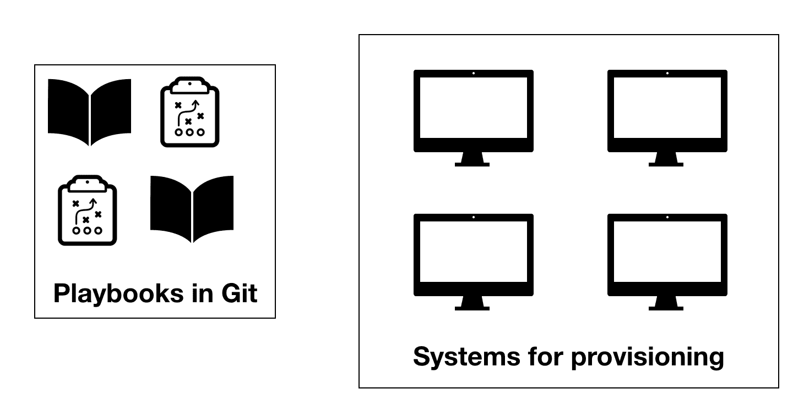

存储在版本控制下的多个 playbooks，准备部署到系统进行配置

到目前为止，我们已经解决了围绕自动化的有趣挑战：

+   现在我们有了对多个目标执行 *重放* 命令的能力

+   记住，如果 playbooks 是以幂等的方式，我们可以安全地对我们的目标运行它们 *n* 次而不必担心任何问题

+   凭借它们是基于文本的文档，我们获得了版本控制和由此带来的所有好处

现在仍然需要手动的是，我们需要某人或某物来执行 `ansible-playbook` 命令。不仅如此，这个某人或某物还需要执行以下操作：

+   记住何时执行 playbooks

+   相应地安排它们的时间表

+   安全存储秘密（通常我们需要 SSH 密钥才能登录）

+   存储输出或记住重新运行 playbook 如果出现失败的情况

当我们想起记住细微之处时，我们都可以渴望成为那样的壮观人物，或者我们可以接受，这些注重细节、基于调度的任务最好由称职的软件而不是超人来完成！

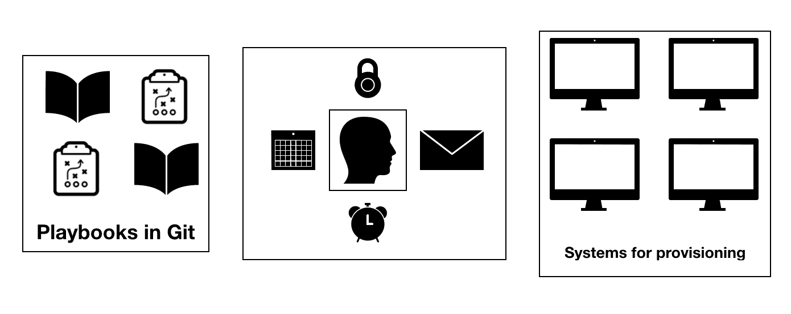

超人将有能力记住、安排、执行并通知有关 playbooks 的情况

原来我们并不都需要成为超人。我们可以简单地使用安排和自动化工具，比如 Ansible Tower、Jenkins 或 Rundeck 来完成我们之前定义的所有任务，以及更多。

在本章中，我们将查看我们提到的所有三个工具，以了解它们提供了什么，以便将我们的自动化提升到自动化的下一个抽象层次。

具体来说，我们将涵盖以下主题：

+   安装和配置 Ansible Tower

+   使用 Ansible Tower 管理 playbooks 和调度

+   安装和配置 Jenkins

+   安装和配置 Rundeck

# 使用调度工具来启用下一层次的自动化

调度和自动化工具使我们能够自动化诸如持续集成和持续交付等任务。它们能够通过提供以下相当标准的服务来实现这一点：

+   我们可以使用基于 web 的 UI 来配置它们

+   通常，这是一个基于 REST 的 API，以便我们可以以编程方式使用它们的功能

+   能够对其本地存储或可能是另一个服务（OAuth/**安全断言标记语言** (**SAML**)）进行身份验证

+   它们从根本上为我们提供了一种清晰的方式来自动化任务以适应我们的工作流程

大多数与安全相关的自动化归结为一遍又一遍地执行类似的任务并查看差异。当您从事安全运营和安全评估时，这一点尤为真实。

请记住，通过使用 Ansible 角色和包含它们的 playbooks，我们已经在朝着进行安全自动化的目标迈出了一步。现在我们的目标是消除记得执行那些 playbooks 的麻烦工作并开始进行。

有三个主要竞争对手用于这种类型的自动化。它们在这里列出并描述：

+   Ansible Tower

+   Jenkins

+   Rundeck

| **工具** | **我们的看法** | **许可证 ** |
| --- | --- | --- |
| Ansible Tower | 由 Ansible 制造商推出的出色工具，非常适合 IT 自动化的理念，我们将其扩展到我们的安全需求。 | 付费，有免费试用版 |
| Jenkins | 工作流引擎，很多 CI/CD 流水线的主力。有数百个插件来扩展其核心功能。如果考虑价格或许可证问题，这是最佳选择。 | 免费和开源  |
| Rundeck | 用于作业调度和自动化的优秀工具。  | 有付费的专业版本 |

在本章中，我们将安装和配置所有三个工具，以便让您开始使用。

红帽公司于 2015 年 10 月收购了 Ansible，他们表示计划开源 Ansible Tower。他们在 2016 年 AnsibleFest 上宣布了这一消息。您可以在 [`www.ansible.com/open-tower`](https://www.ansible.com/open-tower) 上关注该进展。

# 起步运行

让我们从设置我们提到的三个工具开始，看一下它们的一些特点。

# 设置 Ansible Tower

有多种方法可以安装 Ansible Tower 试用版。最简单的设置方式是使用它们现有的镜像从 [`www.ansible.com/tower-trial`](https://www.ansible.com/tower-trial) 获取。

您还可以使用他们的捆绑安装手动设置。在安装之前，请查看 [`docs.ansible.com/ansible-tower/3.1.4/html/installandreference/index.html`](http://docs.ansible.com/ansible-tower/3.1.4/html/installandreference/index.html) 的要求。

运行以下命令在 Ubuntu 16.04 操作系统中安装 Ansible Tower：

```
$ sudo apt-get install software-properties-common

$ sudo apt-add-repository ppa:ansible/ansible

$ wget https://releases.ansible.com/ansible-tower/setup/ansible-tower-setup-latest.tar.gz

$ tar xvzf ansible-tower-setup-latest.tar.gz

$ cd ansible-tower-setup-<tower_version>
```

然后编辑清单文件以更新密码和其他变量，并运行设置。 清单文件包含了用于塔管理员登录帐户的`admin_password`，如果我们正在设置多节点设置，则需要 Postgres 数据库的`pg_host`和`pg_port`。最后是用于排队操作的`rabbitmq`详情。

```
[tower]
localhost ansible_connection=local

[database]

[all:vars]
admin_password='strongpassword'

pg_host='' # postgres.domain.com
pg_port='' #5432

pg_database='awx'
pg_username='awx'
pg_password='postgrespasswordforuserawx'

rabbitmq_port=5672
rabbitmq_vhost=tower
rabbitmq_username=tower
rabbitmq_password='giverabitmqpasswordhere'
rabbitmq_cookie=cookiemonster

# Needs to be true for fqdns and ip addresses
rabbitmq_use_long_name=false
$ sudo ./setup.sh
```

如果您已经安装了 Vagrant，则可以简单地下载他们的 Vagrant box 来开始使用。

在运行以下命令之前，请确保您的主机系统上已安装了 Vagrant：

`$ vagrant init ansible/tower`

`$ vagrant up`

`$ vagrant ssh`

它会提示您输入 IP 地址、用户名和密码以登录到 Ansible Tower 仪表板。

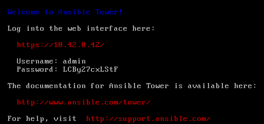

然后在浏览器中导航至 `https://10.42.0.42` 并接受 SSL 错误以继续。可以通过在 `/etc/tower` 配置中提供有效证书来修复此 SSL 错误，并需要重新启动 Ansible Tower 服务。输入登录凭据以访问 Ansible Tower 仪表板：

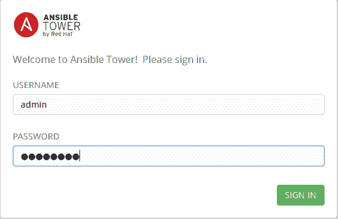

登录后，会提示您输入 Ansible Tower 许可证：

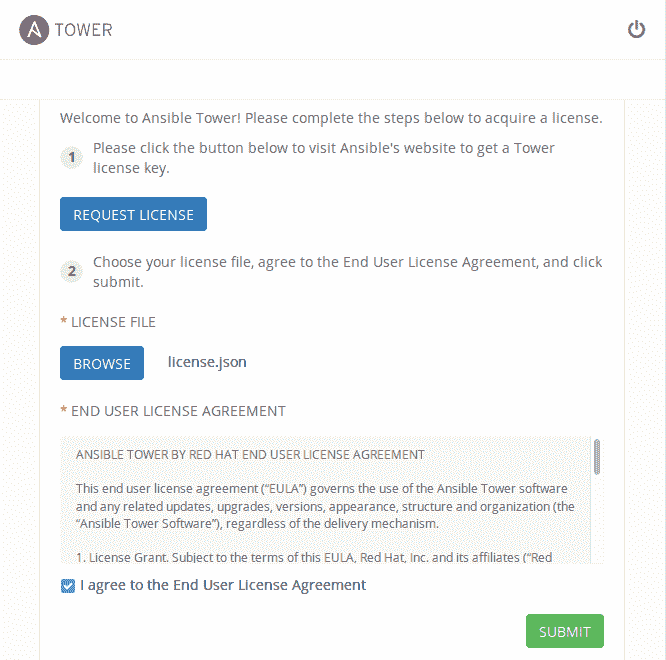

Ansible Tower 还提供了**基于角色的身份验证控制**（**RBAC**），为不同的用户和组提供了细粒度的控制，以管理 Tower。下面的截图显示了使用系统管理员权限创建新用户的过程：

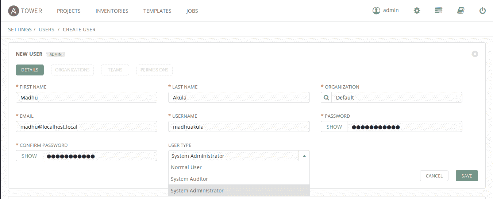

要将清单添加到 Ansible Tower 中，我们可以简单地手动输入它，还可以使用动态脚本从云提供商那里收集清单，方法是提供身份验证（或）访问密钥。下面的截图显示了我们如何将清单添加到 Ansible Tower 中，还可以通过在 YAML 或 JSON 格式中提供变量来为不同的主机提供变量：

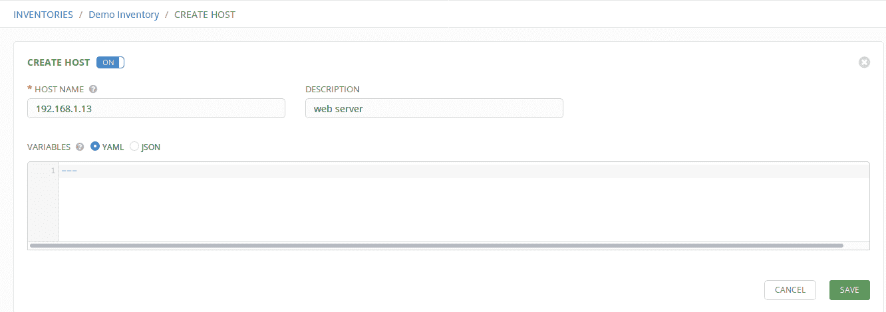

我们还可以通过在凭据管理中提供它们来向 tower 添加凭据（或）密钥，这些凭据也可以重复使用。

Ansible Tower 中存储的秘密信息使用每个 Ansible Tower 集群独有的对称密钥进行加密。一旦存储在 Ansible Tower 数据库中，凭据只能在 Web 界面中使用，而不能查看。Ansible Tower 可以存储的凭据类型包括密码、SSH 密钥、Ansible Vault 密钥和云凭据。

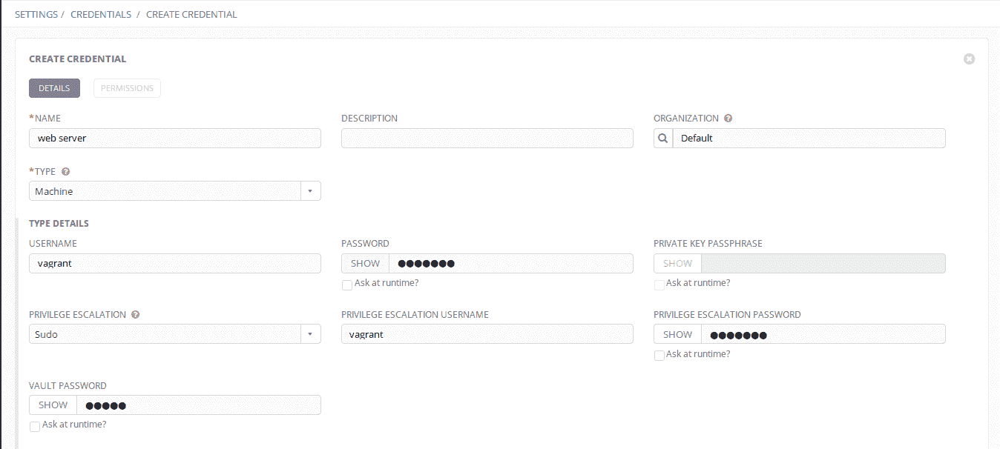

一旦我们收集了清单，就可以创建作业来执行 Playbook 或即席命令操作：

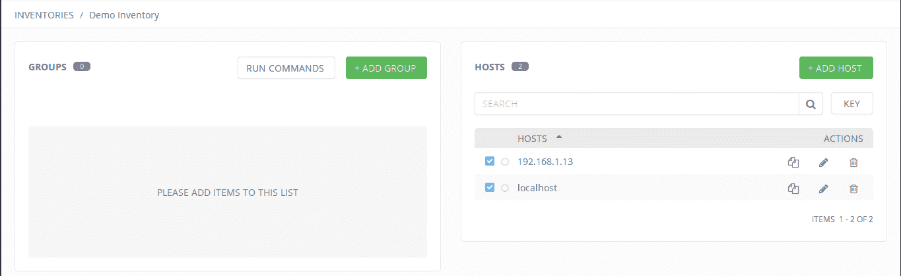

在这里，我们选择了 `shell` 模块，并针对两个节点运行了 `uname -a` 命令：

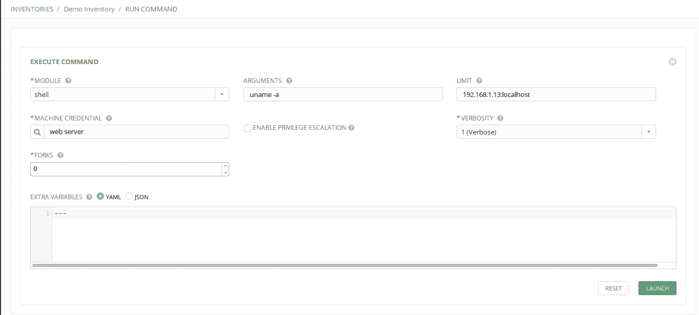

一旦启动执行，我们就可以在仪表板中看到标准输出。我们也可以使用 REST API 访问：

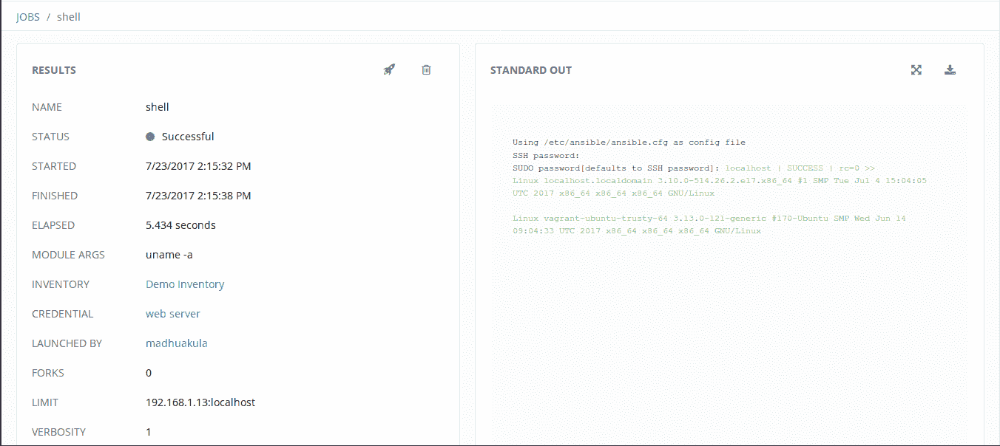

请参考 Ansible Tower 文档获取更详细的参考资料。

还有另一种使用 Ansible Tower 的方式：`tower-cli` 是 Ansible Tower 的命令行工具。可以通过 `pip install ansible-tower-cli` 命令开始使用。

Ansible Tower REST API 是与系统交互的一种非常强大的方式。

这基本上允许您使用易于遵循的 Web GUI 设计 Playbook 工作流程等，同时还可以从另一个 CI/CD 工具（如 Jenkins）调用此功能。顺便说一句，Jenkins 是接下来要设置和学习的软件。

# 设置 Jenkins

让我们使用一个 Ansible playbook 来安装 Jenkins 并开始使用它。

以下代码片段是我们为在 Ubuntu 16.04 操作系统中设置 Jenkins 编写的 Ansible playbook 的片段。

完成设置后，Playbook 将返回首次登录到应用程序所需的默认管理员密码：

```
- name: installing jenkins in ubuntu 16.04
  hosts: "192.168.1.7"
  remote_user: ubuntu
  gather_facts: False
  become: True

tasks:
  - name: install python 2
    raw: test -e /usr/bin/python || (apt -y update && apt install -y python-minimal)

  - name: install curl and git
    apt: name={{ item }} state=present update_cache=yes

    with_items:
      - curl
      - git

```

```
  - name: adding jenkins gpg key
    apt_key:
      url: https://pkg.jenkins.io/debian/jenkins-ci.org.key
      state: present

  - name: jeknins repository to system
    apt_repository:
      repo: http://pkg.jenkins.io/debian-stable binary/
      state: present

  - name: installing jenkins
    apt:
      name: jenkins
      state: present
      update_cache: yes

  - name: adding jenkins to startup
    service:
      name: jenkins
      state: started
      enabled: yes

  - name: printing jenkins default administration password
    command: cat /var/lib/jenkins/secrets/initialAdminPassword
    register: jenkins_default_admin_password

  - debug:
      msg: "{{ jenkins_default_admin_password.stdout }}"

```

要设置 Jenkins，请运行以下命令。其中 `192.168.1.7` 是 Jenkins 将被安装在的服务器 IP 地址：

```
ansible-playbook -i '192.168.1.7,' site.yml --ask-sudo-pass
```

现在我们可以配置 Jenkins 来安装插件、运行定期作业以及执行许多其他操作。首先，我们必须通过浏览到 `http://192.168.1.7:8080` 并提供自动生成的密码来导航到 Jenkins 仪表板。如果 Playbook 在没有任何错误的情况下运行，则会在操作结束时显示密码：

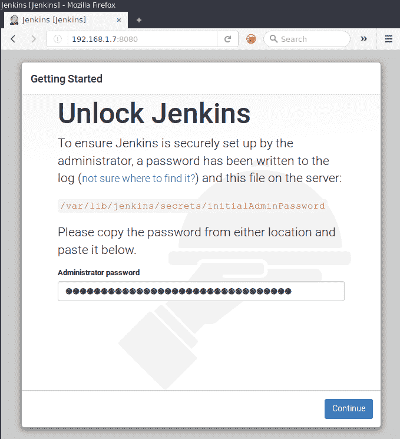

通过填写详细信息并确认登录到 Jenkins 控制台来创建新用户：

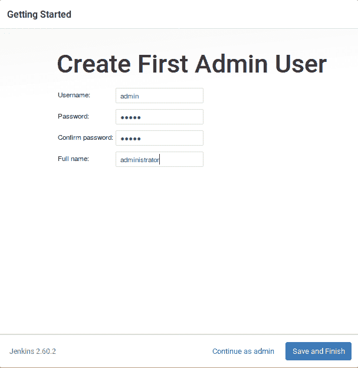

现在我们可以在 Jenkins 中安装自定义插件，导航至“管理 Jenkins”选项卡，选择“管理插件”，然后导航至“可用”选项卡。在“过滤器:”中输入插件名称为 `Ansible`。然后选中复选框，单击“安装但不重新启动”：

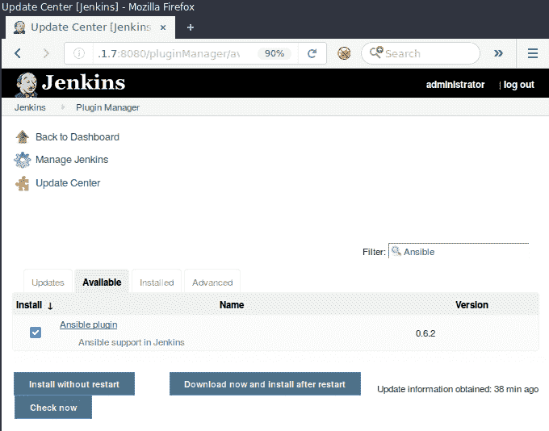

现在我们准备好使用 Jenkins 的 Ansible 插件了。在主仪表板中创建一个新项目，为其命名，然后选择自由风格项目以继续：

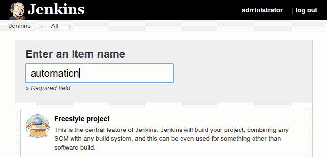

现在我们可以配置构建选项，这是 Jenkins 将为我们提供更大灵活性以定义我们自己的触发器、构建说明和后构建脚本的地方：

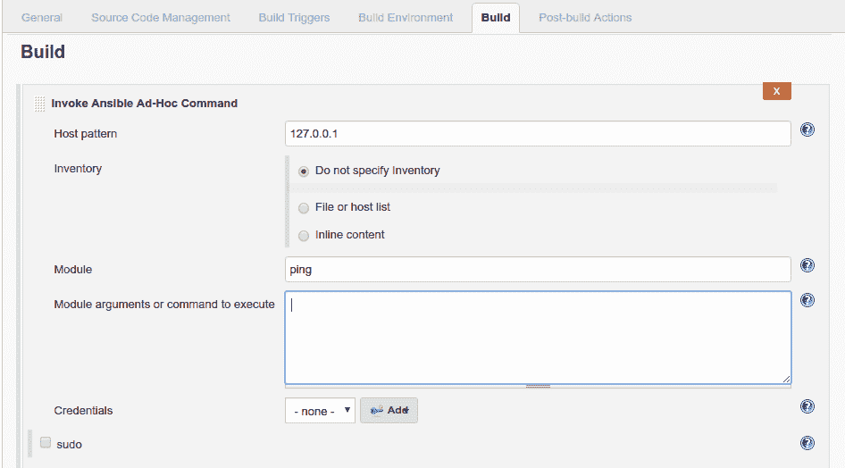

上述截图是一个构建调用 Ansible 临时命令的示例。这可以根据某些事件修改为 ansible-playbook 或基于特定事件的任何其他脚本。

Jenkins Ansible 插件还提供了有用的功能，例如从 Jenkins 本身配置高级命令和传递凭据、密钥。

一旦基于事件触发了构建，它可以被发送到某个构件存储中，也可以在 Jenkins 构建控制台输出中找到：

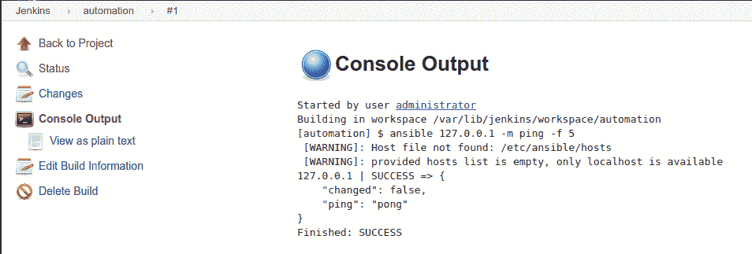

这是执行动态操作的非常强大的方式，例如基于对存储库的代码推送触发自动服务器和堆栈设置，以及定期扫描和自动报告。

# 设置 Rundeck

以下 Ansible playbook 将在 Ubuntu 16.04 操作系统上设置 Rundeck。它还添加了启动进程的 Rundeck 服务：

```
- name: installing rundeck on ubuntu 16.04
  hosts: "192.168.1.7"
  remote_user: ubuntu
  gather_facts: False
  become: True

  tasks:
    - name: installing python2 minimal
      raw: test -e /usr/bin/python || (apt -y update && apt install -y python-minimal)

    - name: java and curl installation
      apt:
        name: "{{ item }}"
        state: present
        update_cache: yes

      with_items:
        - curl
        - openjdk-8-jdk

    - name: downloading and installing rundeck deb package
      apt:
        deb: "http://dl.bintray.com/rundeck/rundeck-deb/rundeck-2.8.4-1-GA.deb"

    - name: add to startup and start rundeck
      service:
        name: rundeckd
        state: started
```

要设置 Rundeck，请运行以下命令。其中 `192.168.1.7` 是 Rundeck 将安装在的服务器 IP 地址：

```
ansible-playbook -i '192.168.1.7,' site.yml --ask-sudo-pass
```

成功执行后，在浏览器中导航至 `http://192.168.1.7:4440`，您将看到 Rundeck 应用程序的登录面板。登录到 Rundeck 的默认用户名和密码是 `admin`：

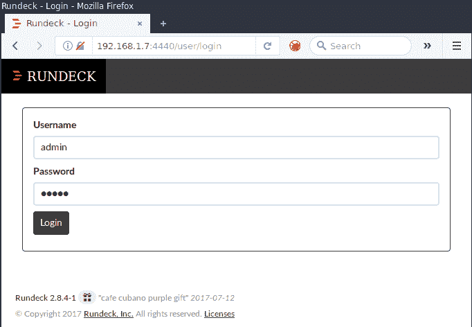

现在我们可以创建一个新项目开始工作。提供一个新的项目名称，并暂时使用默认设置：

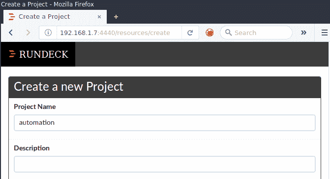

现在，我们可以将多个主机添加到 Rundeck 中执行多个操作。下面的屏幕截图显示了在多个节点上运行 `uname -a` 命令的示例，与 `osArch: amd64` 匹配，我们也可以为不同的用例创建过滤器：

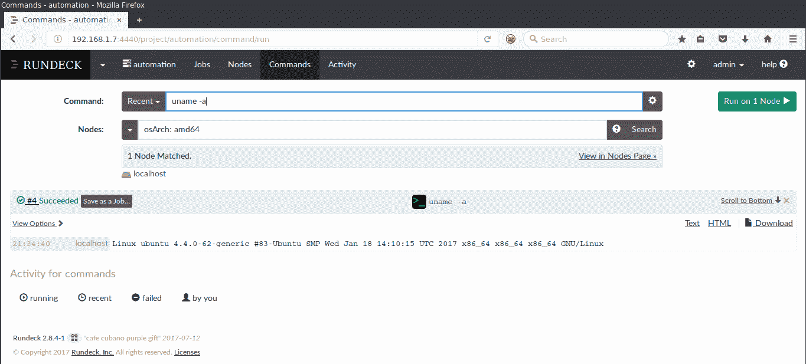

使用 Rundeck，我们还可以按照特定时间安排作业运行，并以不同的格式存储输出。Rundeck 还提供了可集成到现有工具集中的 REST API。

# 安全自动化用例。

现在，一旦我们设置好了工具，让我们来执行一些标准任务，以便让我们可以利用它们做一些有用的事情。如果你还没注意到，我们喜欢列表。以下是一些任务的列表，这些任务将使您能够为对您重要的事物构建自动化层：

1.  添加 playbooks 或连接您的源代码管理（SCM）工具，如 GitHub/GitLab/BitBucket。

1.  身份验证和数据安全。

1.  记录输出和管理自动化作业的报告。

1.  作业调度。

1.  警报、通知和 Webhooks。

# 添加 playbooks。

刚开始时，我们可能希望将自定义 playbooks 添加到 IT 自动化工具中，或者可能将它们添加到 SCM 工具，如 GitHub、GitLab 和 BitBucket 中。我们将配置并将我们的 playbooks 添加到这里讨论的所有三个工具中。

# Ansible Tower 配置。

Ansible Tower 有多个功能可添加 playbooks 进行调度和执行。我们将看看如何添加自定义编写的 playbooks（手动）以及从 Git 等版本控制系统添加 playbooks。还可以从 Ansible Galaxy 拉取 playbooks。Ansible Galaxy 是您查找、重用和共享最佳 Ansible 内容的中心。

要将 playbooks 添加到 Ansible Tower 中，我们必须首先创建项目，然后选择 SCM 类型为 Manual，并添加已经存在的 playbooks。

**警告**：`/var/lib/awx/projects` 中没有可用的 playbook 目录。要么该目录为空，要么所有内容已分配给其他项目。在那里创建一个新目录，并确保 `awx` 系统用户可以读取 playbook 文件，或者让 Tower 使用前面讨论过的 SCM 类型选项直接从源代码控制中检索您的 playbooks。

我们可以选择 SCM 类型设置为 Git，并提供指向 playbook 的 `github.com` URL：

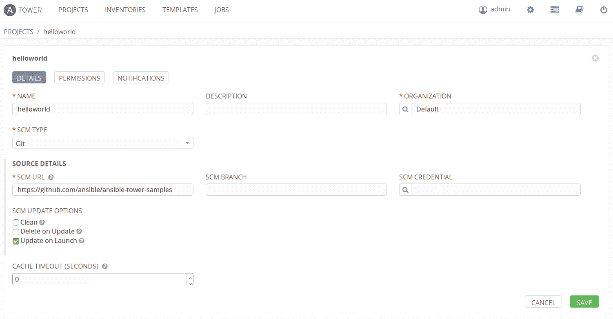

Git SCM 添加 playbooks 到项目中。

我们还可以在 CONFIGURE TOWER 下更改 `PROJECTS_ROOT` 来更改此位置。

添加的 playbooks 是通过创建作业模板来执行的。然后我们可以安排这些作业（或者）可以直接启动：

以下是为 playbook 执行创建的新作业模板的屏幕截图：

**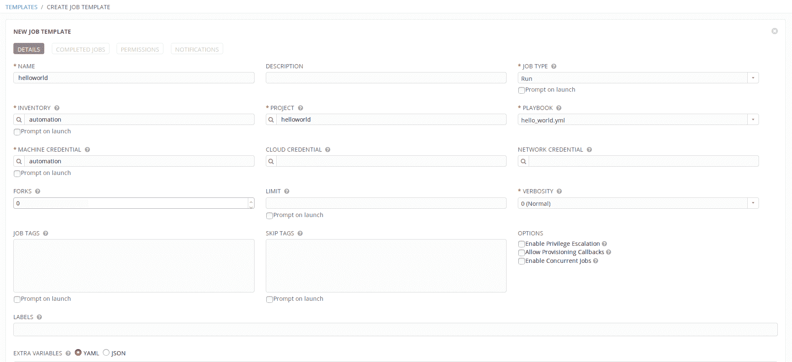**

Playbook 执行作业模板。

作业运行成功并显示输出如下截图：

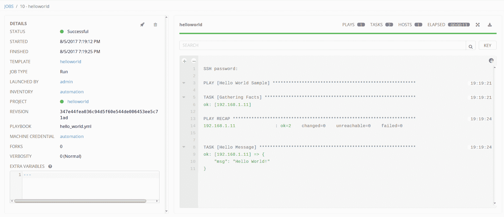

Ansible Tower 中的 Playbook 执行输出

# Jenkins Ansible 集成配置

毫不奇怪，Jenkins 支持 SCM 以使用 Playbook 和本地目录用于手动 Playbook。这可以通过构建选项进行配置。Jenkins 支持即席命令和 Playbook 作为构建（或）后置构建操作触发。

以下屏幕截图显示了我们如何指定我们的存储库并指定分支。如果要访问私有存储库，我们还可以指定凭据：

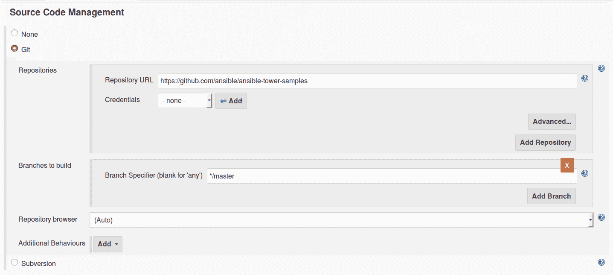

添加基于 Github（SCM）的 Playbooks 以进行构建

然后，我们可以通过指定 Playbook 的位置并根据需要定义清单和变量来添加 Playbook 路径：

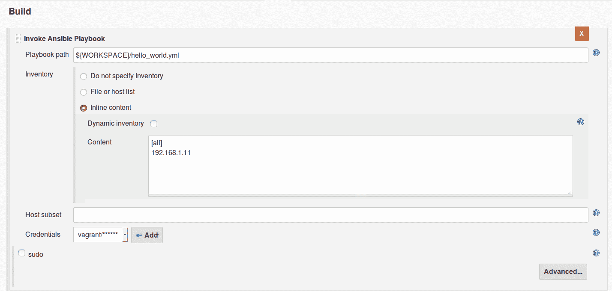

在构建触发器启动 Playbook 执行

最后，我们可以通过触发 Jenkins 构建来执行 Jenkins 作业（或者）我们可以将其与其他工具集成：

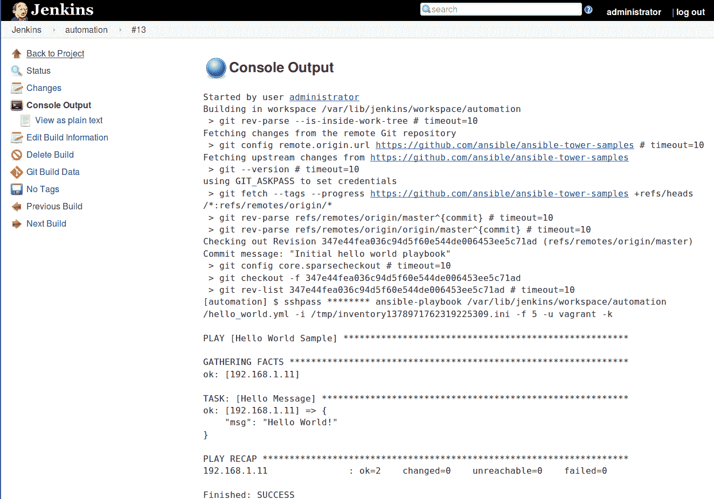

Playbook 执行的 Jenkins 构建输出

# Rundeck 配置

Rundeck 支持添加自定义 Playbook，以及 SCM 和许多其他选项。以下屏幕截图显示了使用作业功能在 Rundeck 中添加 Playbook 和模块的不同选项。

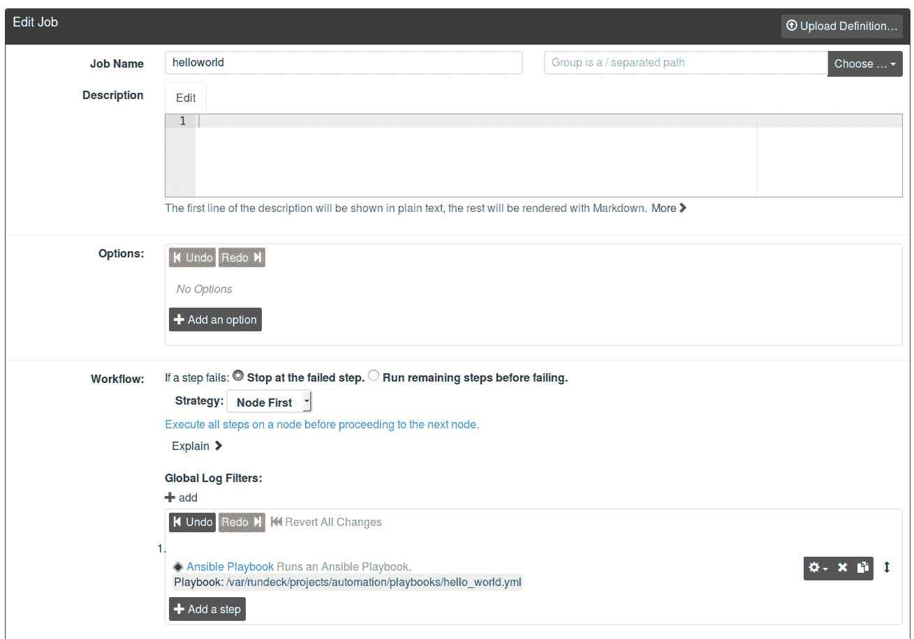

Rundeck 有多个选项供我们选择

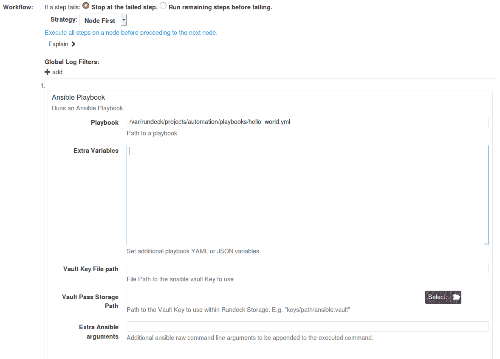

用于变量和密钥的 Rundeck Ansible Playbook 配置

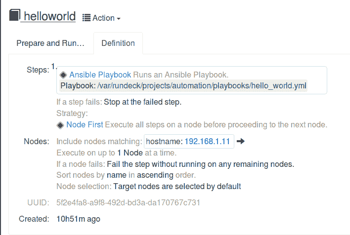

包括作业详情概述的 Rundeck 作业定义

# 身份验证和数据安全

当我们谈论自动化和与系统一起工作时，我们应该谈论安全性。我们将继续谈论安全自动化，因为这是本书的标题。

工具提供的一些安全功能包括：

+   RBAC（身份验证和授权）

+   Web 应用程序通过 TLS/SSL（数据在传输中的安全性）

+   用于存储密钥的加密（数据在静止时的安全性）

# Ansible Tower 的 RBAC

Ansible Tower 支持 RBAC 以管理具有不同权限和角色的多个用户。企业版还支持 **轻量目录访问协议** (**LDAP**) 集成以支持 Active Directory。此功能允许我们为访问 Ansible Tower 创建不同级别的用户。例如：

+   运维团队需要系统管理员角色来执行 Playbook 执行和其他活动，如监视

+   安全团队需要系统审计员角色来执行符合标准（如 **支付卡行业数据安全标准** (**PCI DSS**) 或甚至内部策略验证）的审计检查

+   普通用户，如团队成员，可能只想查看事物的进展，以状态更新和作业状态的成功或失败的形式

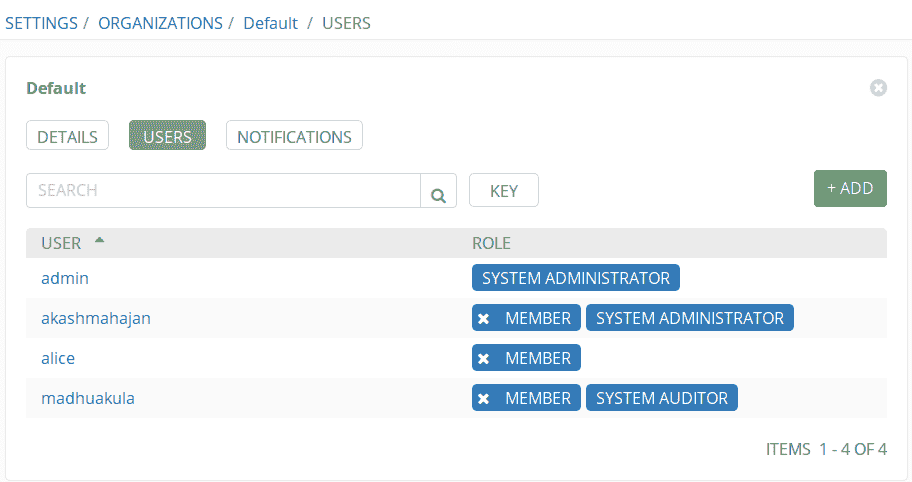

用户可以被分配到不同类型的角色

# Ansible Tower 的 TLS/SSL

默认情况下，Ansible Tower 使用自签名证书在 `/etc/tower/tower.cert` 和 `/etc/tower/tower.key` 上进行 HTTPS，这些可以在设置脚本中配置。以后我们也可以使用相同的文件名进行更新。

获取更多信息，请访问 [`docs.ansible.com/ansible-tower/latest/html/installandreference/install_notes_reqs.html#installation-notes`](http://docs.ansible.com/ansible-tower/latest/html/installandreference/install_notes_reqs.html#installation-notes)。

# Ansible Tower 的加密和数据安全

Ansible Tower 已经创建了内置安全性，用于处理包括密码和密钥在内的凭据的加密。它使用 Ansible Vault 执行此操作。它将数据库中的密码和密钥信息进行加密。

阅读更多请访问 [`docs.ansible.com/ansible-tower/latest/html/userguide/credentials.html`](http://docs.ansible.com/ansible-tower/latest/html/userguide/credentials.html)。

# Jenkins 的 RBAC

在 Jenkins 中，这是一个更通用的工具，我们可以通过使用插件来扩展其功能。Role Strategy Plugin 是一个管理 Jenkins 角色的社区插件。使用它，我们可以为用户和组创建不同的访问级别控制：

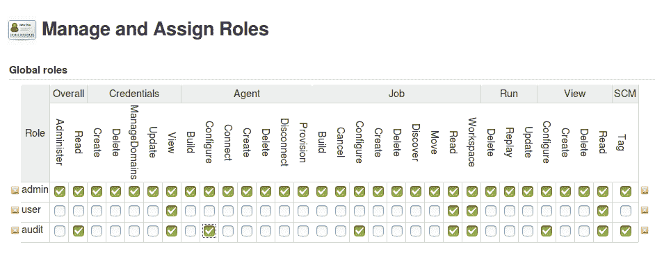

Jenkins 的角色策略插件

角色通常需要与团队设置和业务要求保持一致。您可能希望根据您的要求进行微调。

阅读更多请访问 [`wiki.jenkins.io/display/JENKINS/Role+Strategy+Plugin`](https://wiki.jenkins.io/display/JENKINS/Role+Strategy+Plugin)。

# Jenkins 的 TLS/SSL

默认情况下，Jenkins 作为普通的 HTTP 运行。要启用 HTTPS，我们可以使用反向代理，例如 Nginx，在 Jenkins 前端充当 HTTPS 服务。

有关参考，请访问 [`www.digitalocean.com/community/tutorials/how-to-configure-jenkins-with-ssl-using-an-nginx-reverse-proxy`](https://www.digitalocean.com/community/tutorials/how-to-configure-jenkins-with-ssl-using-an-nginx-reverse-proxy)。

# Jenkins 的加密和数据安全

我们正在使用 Jenkins 的默认凭据功能。这将把密钥和密码存储在本地文件系统中。还有不同的 Jenkins 插件可用于处理此问题，例如 [`wiki.jenkins.io/display/JENKINS/Credentials+Plugin`](https://wiki.jenkins.io/display/JENKINS/Credentials+Plugin)。

以下截图是一个参考，显示了我们如何在 Jenkins 中添加凭据：

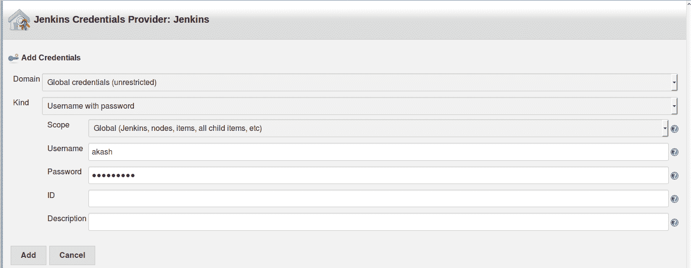

# Rundeck 的 RBAC

Rundeck 也提供了 RBAC，就像 Ansible Tower 一样。与 Tower 不同，在 `/etc/rundeck/` 中我们必须使用 YAML 配置文件进行配置。

以下代码片段是创建管理员用户策略的示例：

```
description: Admin, all access.
context:
 application: 'rundeck'
for:
 resource: 
 - allow: '*' # allow create of projects 
 project: 
 - allow: '*' # allow view/admin of all projects
 project_acl: 
 - allow: '*' # allow all project-level ACL policies
 storage: 
 - allow: '*' # allow read/create/update/delete for all /keys/* storage content 
by: group: admin 
```

有关创建不同策略的更多信息，请访问 [`rundeck.org/docs/administration/access-control-policy.html`](http://rundeck.org/docs/administration/access-control-policy.html)。

# Rundeck 的 HTTP/TLS

可以使用 `/etc/rundeck/ssl/ssl.properties` 文件为 Rundeck 配置 HTTPS： 

```
keystore=/etc/rundeck/ssl/keystore
keystore.password=adminadmin
key.password=adminadmin
truststore=/etc/rundeck/ssl/truststore
truststore.password=adminadmin
```

有关更多信息，请访问 [`rundeck.org/docs/administration/configuring-ssl.html`](http://rundeck.org/docs/administration/configuring-ssl.html)。

# Rundeck 的加密和数据安全

凭证，例如密码和密钥，存储在本地存储中并加密，使用 Rundeck 密钥存储进行加密和解密。这还支持使用不同的密钥存储插件来使用密钥存储，例如存储转换器插件。对存储设施中的密钥的访问受到 **访问控制列表** (**ACL**) 策略的限制。

# playbooks 的输出

一旦自动化作业完成，我们想知道发生了什么。它们是否完全运行，是否遇到任何错误等。我们想知道在哪里可以看到执行 playbooks 的输出以及是否创建了任何其他日志。

# Ansible Tower 的报告管理

默认情况下，Ansible Tower 本身是 playbooks、作业执行和清单收集状态的报告平台。Ansible Tower 仪表板提供了项目总数、清单、主机和作业状态的概览。

输出可以在仪表板、标准输出中使用，也可以通过 REST API 获取，并且我们也可以通过 `tower-cli` 命令行工具获取，这只是一个用于与 REST API 交互的预构建命令行工具。

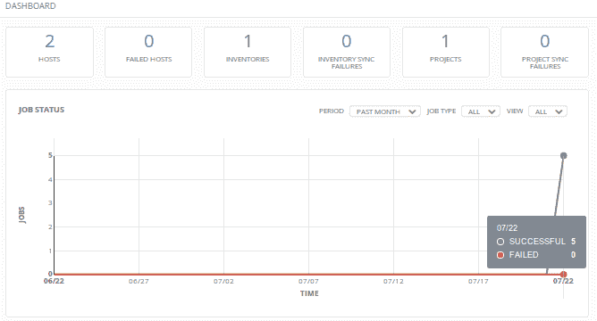

Ansible Tower 仪表板

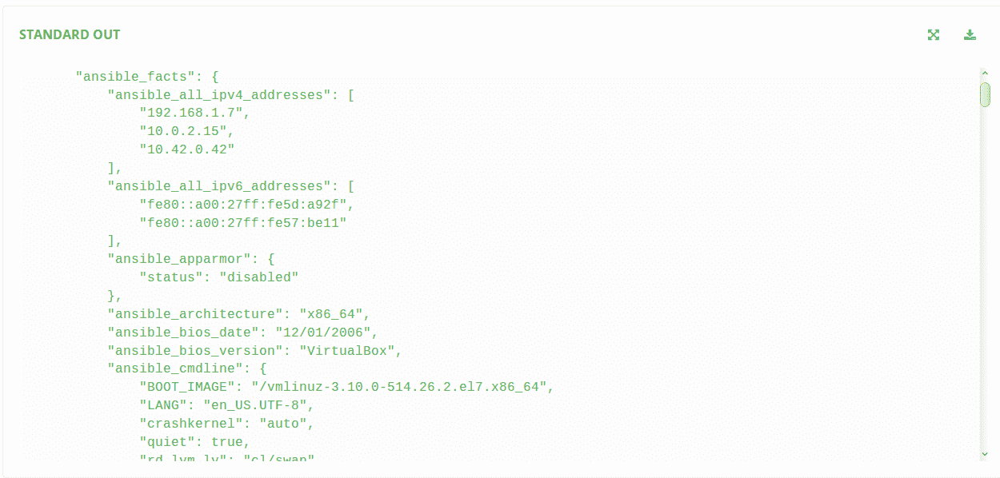

Ansible Tower 的标准输出

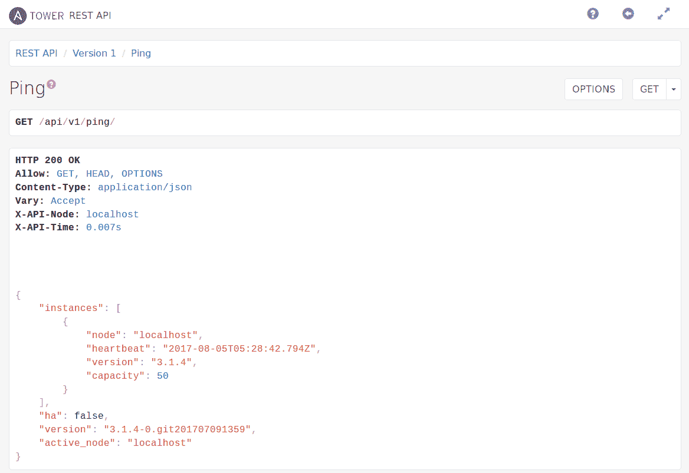

Ansible Tower REST API

# Jenkins 的报告管理

Jenkins 提供了用于管理报告的标准输出和 REST API。Jenkins 拥有一个庞大的社区，有多个可用的插件，例如 HTML Publisher Plugin 和 Cucumber Reports Plugin。

这些插件提供了输出的可视化表示：

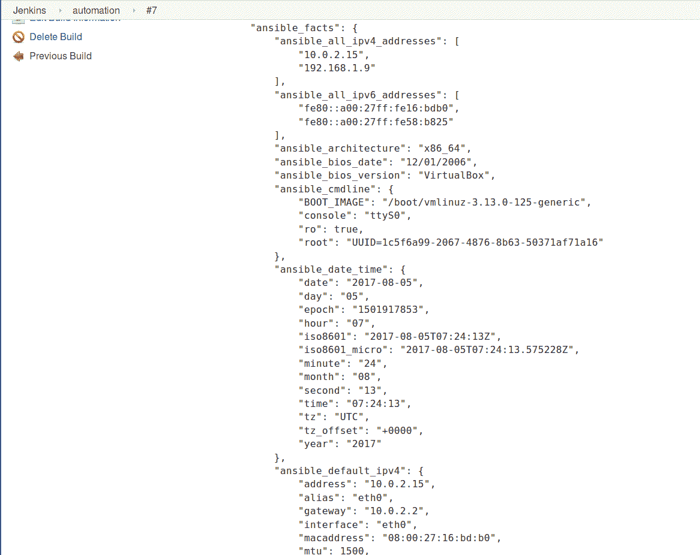

Jenkins 作业控制台的标准输出

# Rundeck 的报告管理

Rundeck 还提供了标准输出和 REST API 来查询结果：

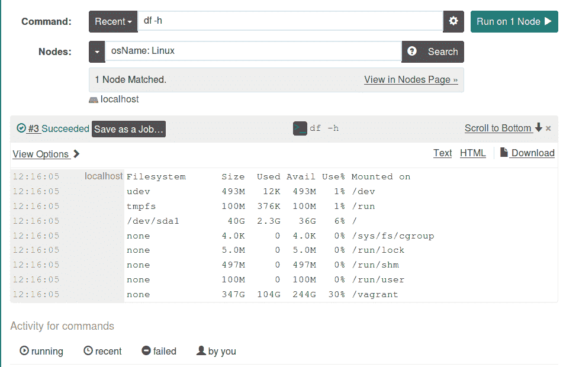

可以通过 stdout、TXT 和 HTML 格式消耗的作业输出

# 作业的调度

在 Ansible Tower 中，作业的调度简单而直接。对于一个作业，你可以指定一个时间表，选项大多类似于 cron。

例如，你可以说你有一个每天扫描的模板，并希望在未来三个月的每天上午 4 点执行它。这种类型的时间表使我们的元自动化非常灵活和强大。

# 警报、通知和 webhook

Tower 支持多种方式的警报和通知用户按配置。甚至可以配置它使用 webhook 向您选择的 URL 发送 HTTP `POST` 请求：

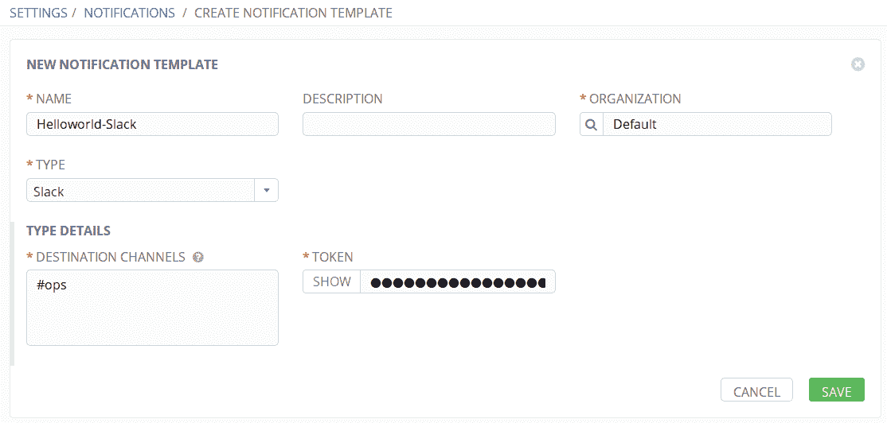

使用 slack webhook 的 Ansible Tower 通知

# 摘要

我们快速浏览了一些 IT 自动化和调度软件。我们的主要目的是介绍该软件并突出其一些常见功能。

这些功能包括以下内容：

+   为我们的秘密提供加密

+   根据我们的时间表要求运行

+   获得良好报告的能力

我们已经了解了允许我们重复使用和创建出色 playbooks 的 Ansible 角色。结合这些功能，我们有一个完整的自动化系统准备好了。我们不仅能够随意运行我们的任务和作业多次，还会得到关于它们运行情况的更新。此外，由于我们的任务在受保护的服务器上运行，因此重要的是我们分享的用于运行的秘密也是安全的。

在下一章中，我们将不再考虑 Ansible 自动化的机制，而是直接思考特定情况下的安全自动化。自动化服务器的补丁是最明显、可能也是最受欢迎的需求。我们将应用安全自动化技术和方法来设置一个强化的 WordPress，并启用加密备份。
