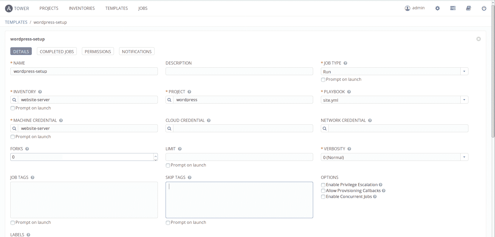
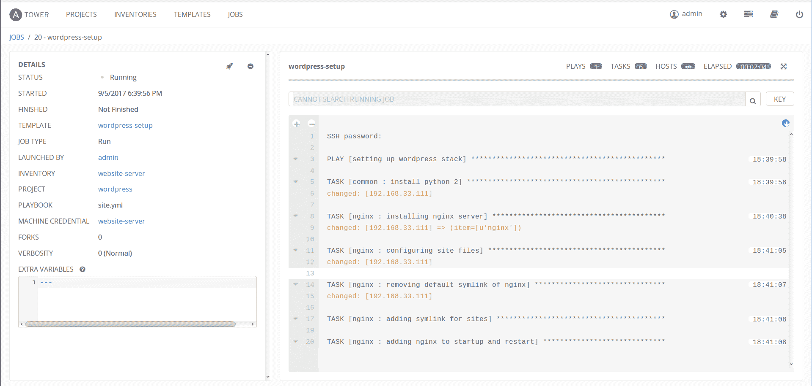
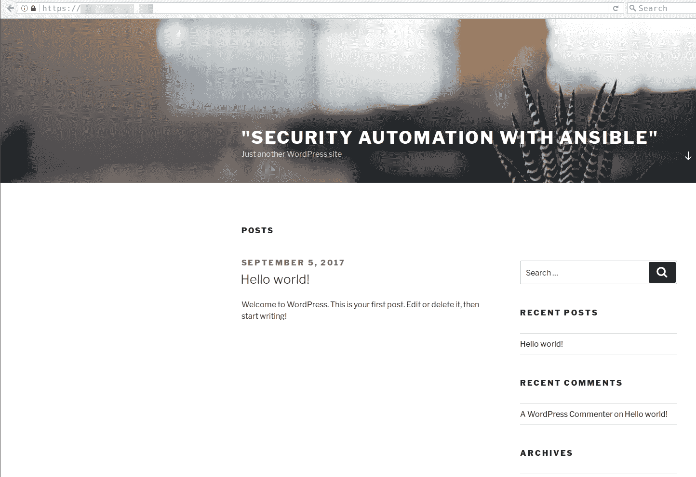
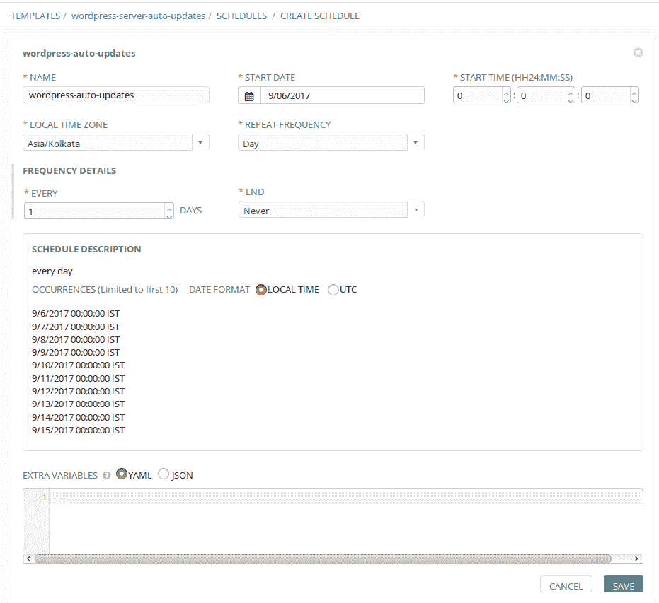
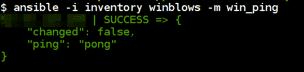
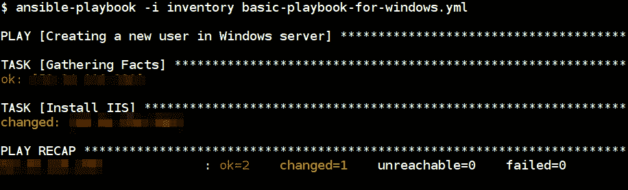

# 第三章：使用加密自动备份的强化 WordPress

现在基本设置已完成，让我们逐个讨论各种安全自动化场景，并一一查看它们。

每个人都会同意，建立一个安全的网站并保持其安全性是一个相当普遍的安全要求。由于这是如此普遍，因此对于那些负责构建和管理网站以保持安全的人来说，查看特定情景可能是有用的。

您是否知道，根据维基百科的数据，前 1000 万个网站中有 27.5%使用 WordPress？根据另一项统计数据，整个网络上所有已知软件中有 58.7%的网站在运行 WordPress。

如果有这么多，那么一种自动化的安全方式来设置和维护 WordPress 对一些读者应该是有用的。

即使 WordPress 不是您非常感兴趣的内容，也请记住，设置和保护 LAMP/LEMP 堆栈应用程序的整体步骤是普遍适用的。

对我们来说，使用加密自动备份的强化 WordPress 可以分解为以下步骤：

1.  设置带有安全措施的 Linux/Windows 服务器。

1.  设置 Web 服务器（Linux 上的 Apache/Nginx 和 Windows 上的 IIS）。

1.  在同一主机上设置数据库服务器（MySQL）。

1.  使用名为**WP-CLI**的命令行实用程序设置 WordPress。

1.  为网站文件和数据库设置增量、加密和最重要的自动化备份。

在本章中，我们将使用 Ansible playbook 和 roles 完成所有这些。我们将假设我们计划部署 WordPress 网站的服务器已经启动并运行，并且我们能够连接到它。我们将备份存储在已经配置好的 AWS S3 存储桶中，其中访问密钥和秘密访问密钥已经提供。

我们将讨论以下主题：

+   WordPress 的 CLI

+   为什么选择 Ansible 进行此设置？

+   逐步完成 WordPress 安装

+   设置 Apache2 Web 服务器

+   如果您不想自己构建，那么 Trellis 堆栈呢？

+   我们为什么要使用 Trellis，并且何时使用它是一个好主意？

+   使用 Let's Encrypt 启用 TLS/SSL

+   Windows 上的 WordPress

# WordPress 的 CLI

我们将使用一个名为 WP-CLI 的工具，它允许我们在 WordPress 中执行许多传统上需要使用 Web 浏览器的操作。

WP-CLI 是 WordPress 的 CLI。您可以更新插件、配置多站点安装等，而无需使用 Web 浏览器。有关 WP-CLI 的更多信息，请访问[`WP-CLI.org/`](https://wp-cli.org/)，有关 WordPress，请访问[`wordpress.org/`](https://wordpress.org/)。

例如，以下命令将下载并设置 WordPress：

```
wp core install # with some options such as url, title of the website etc. etc.
```

完整示例可在[`developer.WordPress.org/cli/commands/core/#examples`](https://developer.wordpress.org/cli/commands/core/#examples)找到：

```
wp core install --url=example.com --title=Example --admin_user=supervisor --admin_password=strongpassword --admin_email=info@example.com
```

此示例让我们一窥从 Ansible playbook 中调用 WP-CLI 工具的威力。

# 为什么选择 Ansible 进行此设置？

Ansible 专为安全自动化和硬化而设计。它使用 YAML 语法，帮助我们对重复任务的整个过程进行编码。通过使用这个，我们可以使用角色和播放书自动化基础架构的持续交付和部署过程。

模块化方法使我们能够非常简单地执行任务。例如，运维团队可以编写一个播放书来设置 WordPress 站点，安全团队可以创建另一个角色，用于加固 WordPress 站点。

使用模块实现可重复性非常容易，并且输出是幂等的，这意味着可以为服务器、应用程序和基础架构创建标准。一些用例包括使用内部政策标准为组织创建基础镜像。

Ansible 使用 SSH 协议，默认情况下使用加密传输和主机加密进行保护。而且，在处理不同类型的操作系统时不存在依赖性问题。它使用 Python 执行；根据我们的用例，这可以很容易地扩展。

# 逐步完成 WordPress 安装

在本节中，我们将继续完成 WordPress、所需的数据库服务器、硬化和备份的完整设置。我们选择的平台是 Linux（Ubuntu 16.04），使用 nginx Web 服务器和 PHP-FPM 作为 PHP 运行时。我们将使用 duply 设置备份，备份将存储在 AWS S3 中。

# 设置 nginx Web 服务器

设置 nginx 就像`sudo apt-get install nginx`这样简单，但是为我们的用例配置并管理配置的自动化方式是 Ansible 的强大之处。让我们看一下播放书中 nginx 角色的以下片段：

```
- name: adding nginx signing key
  apt_key:
    url: http://nginx.org/keys/nginx_signing.key
    state: present

- name: adding sources.list deb url for nginx
  lineinfile:
    dest: /etc/apt/sources.list
    line: "deb http://nginx.org/packages/mainline/ubuntu/ trusty nginx"

- name: update the cache and install nginx server
  apt:
    name: nginx
    update_cache: yes
    state: present

- name: updating customized templates for nginx configuration
  template:
    src: "{{ item.src }}"
    dest: "{{ item.dst }}"

  with_items:
    - { src: "templates/defautlt.conf.j2", dst: "/etc/nginx/conf.d/default.conf" }    

  notify
    - start nginx
    - startup nginx
```

在上述代码片段中，我们正在添加签名密钥，然后添加存储库，然后进行安装。这样可以确保我们在从存储库下载软件包时也可以执行完整性检查。

然后，我们使用 Jinja2 模板执行配置更改，这些更改可以在服务器更新之前预定义在我们的配置中。

# 设置先决条件

要设置 WordPress CMS，我们需要安装数据库和 PHP，因此我们将安装 MySQL 作为数据库，以及 PHP-FPM 用于处理。

# 设置 MySQL 数据库

我们已经在前一章中看到了如何设置 MySQL。在这里，我们将看到如何为 WordPress 应用程序创建新用户和数据库。然后，我们将通过 Ansible 模块应用硬化步骤：

```
- name: create WordPress database
    mysql_db:
      name: "{{ WordPress_database_name }}"
      state: present
      login_user: root
      login_password: "{{ mysql_root_password }}"

- name: create WordPress database user
    mysql_user:
      name: "{{ WordPress_database_username }}"
      password: "{{ WordPress_database_password }}"
      priv: '"{{ WordPress_database_name }}".*:ALL'
      state: present
      login_user: root
      login_password: "{{ mysql_root_password }}"
```

上述代码片段描述了使用`mysql_db`和`mysql_user`模块创建新数据库和用户，并分别将该用户赋予 WordPress 应用数据库完全权限。

# 为 WordPress 设置安装 PHP

以下代码片段使用不同的模块来执行 PHP 和其他所需包的安装。然后，它使用 `replace` 模块更新 PHP-FPM 配置。最后，它还使用 `template` 模块更新 nginx 配置以更新 PHP-FPM 处理，并重新启动服务以应用更改：

```
- name: installing php
  apt:
    name: "{{ item }}"
    state: present
    update_cache: yes

  with_items:
    - php
    - php-curl
    - php-fpm
    - php-mysql
    - php-xmlrpc

- name: configuring php.ini for php processor
  replace:
    path: /etc/php5/fpm/php.ini
    regex: ';cgi.fix_pathinfo=1'
    replace: 'cgi.fix_pathinfo=0'
    backup: yes

- name: enable and restart the php fpm service
  service:
    name: php7.0-fpm
    enabled: yes
    state: restarted

- name: update the nginx configuration to support php-fpm
  template:
    src: "{{ item.src }}"
    dest: "{{ item.dst }}"

  with_items:
    - { src: "defautlt.conf.j2", dst: "/etc/nginx/conf.d/default.conf" }

- name: restart the nginx
  service:
    state: restarted
    name: nginx
```

# 使用 WP-CLI 安装 WordPress

以下代码片段将安装和设置 WordPress，以便它能够正常运行：

```
- debug:
  msg: ensure you have installed lamp (or) lemp stack

- name: downloading WordPress cli aka wp-cli
  get_url:
    url: https://raw.githubusercontent.com/wp-cli/builds/gh-pages/phar/wp-cli.phar
    dest: /usr/local/bin/wp
    mode: 0755

- name: download latest WordPress locally
  command: wp core download
  become_user: "{{ new_user_name }}"
  args:
    chdir: /var/www/html/

- name: WordPress site configuration
  command: "wp core config --dbname={{ WordPress_database_name }} --dbuser={{ WordPress_database_username }} --dbpass={{ WordPress_database_password }}

- name: information for WordPress site
  command: "wp core install --url={{ WordPress_site_name }} --title={{ WordPress_site_title }} --admin_user={{ WordPress_admin_username }} --admin_password={{ WordPress_admin_password }} --admin_email={{ WordPress_admin_email }}"
```

# 强化 SSH 服务

这将是一个更传统的方法，采用现代化的自动化方法，使用 Ansible。这里包括的一些项目有：

+   禁用 `root` 用户登录，并创建一个不同的用户，如果需要，提供 `sudo` 权限：

```
    - name: create new user
      user:
        name: "{{ new_user_name }}"
        password: "{{ new_user_password }}"
        shell: /bin/bash
        groups: sudo
        append: yes
```

+   使用基于密钥的身份验证登录。与基于密码的身份验证不同，我们可以生成 SSH 密钥并将公钥添加到授权密钥中：

```
    - name: add ssh key for new user
      authorized_key:
        user: "{{ new_user_name }}"
        key: "{{ lookup('file', '/home/user/.ssh/id_rsa.pub') }}"
        state: present
```

+   使用 SSH 配置文件进行一些配置调整；例如，`PermitRootLogin`、`PubkeyAuthentication` 和 `PasswordAuthentication`：

```
    - name: ssh configuration tweaks
      lineinfile:
        dest: /etc/ssh/sshd_config
        state: present
        line: "{{ item }}"
        backups: yes

      with_items:
        - "PermitRootLogin no"
        - "PasswordAuthentication no"

      notify:
        - restart ssh
```

+   我们还可以设置诸如 `fail2ban` 之类的服务，以保护免受基本攻击。

+   此外，如果需要登录，则可以启用 MFA。欲了解更多信息，请访问 [`www.digitalocean.com/community/tutorials/how-to-set-up-multi-factor-authentication-for-ssh-on-ubuntu-16-04`](https://www.digitalocean.com/community/tutorials/how-to-set-up-multi-factor-authentication-for-ssh-on-ubuntu-16-04)。

下面的操作手册将由 dev-sec 团队提供更多关于 SSH 强化的高级功能：[`github.com/dev-sec/ansible-ssh-hardening`](https://github.com/dev-sec/ansible-ssh-hardening)

# 强化数据库服务

我们已经看到如何设置数据库。以下代码片段显示了如何通过将其绑定到 localhost 和与应用程序交互所需的接口来加固 MySQL 服务。然后，它移除了匿名用户和测试数据库：

```
- name: delete anonymous mysql user for localhost
  mysql_user:
    user: ""
    state: absent
    login_password: "{{ mysql_root_password }}"
    login_user: root

- name: secure mysql root user
  mysql_user:
    user: "root"
    password: "{{ mysql_root_password }}"
    host: "{{ item }}"
    login_password: "{{ mysql_root_password }}"
    login_user: root

  with_items:
    - 127.0.0.1
    - localhost
    - ::1
    - "{{ ansible_fqdn }}"

- name: removes mysql test database
  mysql_db:
    db: test
    state: absent
    login_password: "{{ mysql_root_password }}"
    login_user: root
```

# 强化 nginx

在这里，我们可以开始查看如何禁用服务器标记以不显示版本信息，添加诸如 `X-XSS-Protection` 之类的头部，以及许多其他配置调整。这些大多数更改都是通过配置更改完成的，Ansible 允许我们根据用户需求对这些更改进行版本控制和自动化： 

+   可以通过在配置中添加 `server_tokens off;` 来阻止 nginx 服务器版本信息

+   `add_header X-XSS-Protection "1; mode=block";` 将启用跨站点脚本 (XSS) 过滤器

+   可以通过添加 `ssl_protocols TLSv1 TLSv1.1 TLSv1.2;` 来禁用 SSLv3

+   这个列表可能会相当长，根据使用情况和场景而定：

以下代码片段包含了用于更新强化的 nginx 配置更改的 nginx 配置模板：

```
    - name: update the hardened nginx configuration changes
      template:
        src: "hardened-nginx-config.j2"
        dest: "/etc/nginx/sites-available/default"

      notify:
        - restart nginx
```

Mozilla 在 [`wiki.mozilla.org/Security/Server_Side_TLS`](https://wiki.mozilla.org/Security/Server_Side_TLS) 上提供了更新的有关 SSL/TLS 指导的网页。该指导提供了关于使用什么密码套件以及其他安全措施的建议。此外，如果您信任他们的判断，您还可以使用他们的 SSL/TLS 配置生成器快速生成您的 Web 服务器配置的配置。欲了解更多信息，请访问 [`mozilla.github.io/server-side-tls/ssl-config-generator/`](https://mozilla.github.io/server-side-tls/ssl-config-generator/)。

无论您决定使用哪种配置，模板都需要命名为 `hardened-nginx-config.j2`。

# 加固 WordPress

这包括对 WordPress 安全配置错误的基本检查。其中一些包括：

+   目录和文件权限：

```
    - name: update the file permissions
      file:
        path: "{{ WordPress_install_directory }}"
        recurse: yes
        owner: "{{ new_user_name }}"
        group: www-data

    - name: updating file and directory permissions
      shell: "{{ item }}"

      with_items:
        - "find {{ WordPress_install_directory }} -type d -exec chmod
         755 {} \;"
        - "find {{ WordPress_install_directory }} -type f -exec chmod 
        644 {} \;"
```

+   用户名和附件枚举阻止。以下代码片段是 nginx 配置的一部分：

```
    # Username enumeration block
    if ($args ~ "^/?author=([0-9]*)"){
        return 403;
    }

    # Attachment enumeration block
    if ($query_string ~ "attachment_id=([0-9]*)"){
        return 403;
    }
```

+   禁止在 WordPress 编辑器中编辑文件：

```
    - name: update the WordPress configuration
      lineinfile:
        path: /var/www/html/wp-config.php
        line: "{{ item }}"

      with_items:
        - define('FS_METHOD', 'direct');
        - define('DISALLOW_FILE_EDIT', true);
```

随着配置的更改和更新，我们可以添加许多其他检查。

# 加固主机防火墙服务

以下代码片段是用于安装和配置**简易防火墙**（**UFW**）及其所需的服务和规则。Ansible 甚至有一个用于 UFW 的模块，因此以下片段以安装此模块并启用日志记录开始。接着它添加了默认策略，比如默认拒绝所有入站流量并允许出站流量。

然后将添加 SSH、HTTP 和 HTTPS 服务以允许进入。这些选项是完全可配置的，根据需要。然后它将启用并添加到启动程序中以应用更改：

```
- name: installing ufw package
  apt:
    name: "ufw"
    update_cache: yes
    state: present

- name: enable ufw logging
  ufw:
    logging: on

- name: default ufw setting
  ufw:
    direction: "{{ item.direction }}"
    policy: "{{ item.policy }}"

  with_items:
    - { direction: 'incoming', policy: 'deny' }
    - { direction: 'outgoing', policy: 'allow' }

- name: allow required ports to access server
  ufw:
    rule: "{{ item.policy }}"
    port: "{{ item.port }}"
    proto: "{{ item.protocol }}"

  with_items:
    - { port: "22", protocol: "tcp", policy: "allow" }
    - { port: "80", protocol: "tcp", policy: "allow" }
    - { port: "443", protocol: "tcp", policy: "allow" }

- name: enable ufw
  ufw:
    state: enabled

- name: restart ufw and add to start up programs
  service:
    name: ufw
    state: restarted
    enabled: yes
```

# 在 AWS S3 中设置自动化的加密备份

备份始终是我们大多数人觉得应该完成的事情，但它们似乎相当繁琐。多年来，人们已经做了大量工作，以确保我们可以有足够简单的方式来备份和恢复我们的数据。

在当今这个时代，一个出色的备份解决方案/软件应该能够执行以下操作：

| **特性** | **备注** |
| --- | --- |
| 自动化 | 自动化允许围绕其进行流程 |
| 增量 | 尽管整体存储成本较低，但如果我们想要每五分钟备份一次，那么已更改的内容应该被备份 |
| 离开我们的服务器之前加密 | 这是为了确保数据在静止和运动中的安全性 |
| 便宜 | 尽管我们关心我们的数据，但一个好的备份解决方案会比需要备份的服务器便宜得多 |

对于我们的备份解决方案，我们将选择以下堆栈：

| **软件** | Duply - 一个包装在 duplicity 上的包装器，是一个 Python 脚本 |
| --- | --- |
| **存储** | 尽管 duply 提供了许多后端，但它与 AWS S3 非常兼容 |
| **加密** | 通过使用 GPG，我们可以使用非对称的公钥和私钥对 |

以下代码片段是为了在服务器和 AWS S3 之间设置 duply 进行加密的自动化备份：

```
- name: installing duply
  apt:
    name: "{{ item }}"
    update_cache: yes
    state: present

  with_items:
    - python-boto
    - duply

- name: check if we already have backup directory
  stat:
    path: "/root/.duply/{{ new_backup_name }}"
  register: duply_dir_stats

- name: create backup directories
  shell: duply {{ new_backup_name }} create
  when: duply_dir_stats.stat.exists == False

- name: update the duply configuration
  template:
    src: "{{ item.src }}"
    dest: "{{ item.dest }}"

  with_items:
    - { src: conf.j2, dest: /root/.duply/{{ new_backup_name }}/conf }
    - { src: exclude.j2, dest: /root/.duply/{{ new_backup_name }}/exclude }

- name: create cron job for automated backups
  template:
    src: duply-backup.j2
    dest: /etc/cron.hourly/duply-backup
```

# 使用 Ansible Tower 对 Ubuntu 16.04 服务器执行 playbook

一旦我们准备好 playbook 并根据需要更新变量，我们就可以继续执行 playbook。在那之前，我们必须在 Ansible Tower 中创建模板来执行此操作。



用于 WordPress 设置 playbook 的 Ansible Tower 作业模板



WordPress 设置 playbook 作业执行



使用 HTTPS 的 WordPress 网站

# 安全地自动化 WordPress 更新

以下代码片段是用于运行备份并更新 WordPress 核心、主题和插件的。可以通过 Ansible Tower 作业每天定时执行：

```
- name: running backup using duply
  command: /etc/cron.hourly/duply-backup

- name: updating WordPress core
  command: wp core update
  register: wp_core_update_output
  ignore_errors: yes

- name: wp core update output
  debug:
    msg: "{{ wp_core_update_output.stdout }}"

- name: updating WordPress themes
  command: wp theme update --all
  register: wp_theme_update_output
  ignore_errors: yes

- name: wp themes update output
  debug:
    msg: "{{ wp_theme_update_output.stdout }}"

- name: updating WordPress plugins
  command: wp plugin update --all
  register: wp_plugin_update_output
  ignore_errors: yes

- name: wp plugins update output
  debug:
    msg: "{{ wp_plugin_update_output.stdout }}"
```

# 通过 Ansible Tower 进行每日更新的调度

Ansible Tower 允许我们安排自动运行对服务器的作业。我们可以在模板中配置开始日期和重复频率以执行 playbook。



通过 Ansible Tower 进行自动化 WordPress 更新的作业调度

否则，我们可以使用 `cron` 作业模板每天执行此操作，并在部署 WordPress 设置时添加此模板：

```
#!/bin/bash

/etc/cron.hourly/duply-backup
wp core update
wp theme update --all
wp plugin update --all
```

# 设置 Apache2 web 服务器

我们在我们的 LEMP 栈设置中已经见过这个，它非常相似。但是在这里，我们必须使用与 WordPress 一起工作的所需模块。以下代码片段显示了我们如何使用模板来执行服务器上的配置更新：

```
- name: installing apache2 server
  apt:
    name: "apache2"
    update_cache: yes
    state: present

- name: updating customized templates for apache2 configuration
  template:
    src: "{{ item.src }}"
    dest: "{{ item.dst }}"
    mode: 0644

  with_tems:
    - { src: apache2.conf.j2, dst: /etc/apache2/conf.d/apache2.conf }
    - { src: 000-default.conf.j2, dst: /etc/apache2/sites-available/000-default.conf }
    - { src: default-ssl.conf.j2, dst: /etc/apache2/sites-available/default-ssl.conf }

- name: adding custom link for sites-enabled from sites-available
  file:
    src: "{{ item.src }}"
    dest: "{{ item.dest }}"
    state: link

  with_items:
    - { src: '/etc/apache2/sites-available/000-default.conf', dest: '/etc/apache2/sites-enabled/000-default.conf' }
    - { src: '/etc/apache2/sites-available/default-ssl.conf', dest: '/etc/apache2/sites-enabled/default-ssl.conf' }

  notify:
    - start apache2
    - startup apache2
```

# 使用 Let's Encrypt 启用 TLS/SSL

我们可以使用 Let's Encrypt 提供的命令行工具以开放、自动化的方式获取免费的 SSL/TLS 证书。

该工具能够完全自动地读取和理解一个 nginx 虚拟主机文件，并生成相关的证书，不需要任何手动干预：

```
- name: adding certbot ppa
  apt_repository:
    repo: "ppa:certbot/certbot"

- name: install certbot
  apt:
    name: "{{ item }}"
    update_cache: yes
    state: present

  with_items:
    - python-certbot-nginx

- name: check if we have generated a cert already
  stat:
    path: "/etc/letsencrypt/live/{{ website_domain_name }}/fullchain.pem"
  register: cert_stats

- name: run certbot to generate the certificates
  shell: "certbot certonly --standalone -d {{ website_domain_name }} --email {{ service_admin_email }} --non-interactive --agree-tos"
  when: cert_stats.stat.exists == False

- name: configuring site files
  template:
    src: website.conf
    dest: "/etc/nginx/sites-available/{{ website_domain_name }}"

- name: restart nginx
  service:
    name: nginx
    state: restarted

```

Let's Encrypt 已成为在网站上启用 SSL/TLS 的一种极其流行和安全的方式。

到 2017 年 6 月底，Let's Encrypt 已经以自动方式发布了超过 1 亿个免费的 SSL/TLS 证书。有关更多信息，请访问 [`letsencrypt.org/2017/06/28/hundred-million-certs.html`](https://letsencrypt.org/2017/06/28/hundred-million-certs.html)。

# 如果你不想自己动手怎么办？Trellis 栈

Trellis 栈是开发团队为 WordPress 网站建立本地临时和生产环境设置的一种方式。

Trellis 是一个为 WordPress LEMP 栈设计的一组开源 MIT 许可的 Ansible playbook。

# 我们为什么要使用 Trellis，以及什么时候使用它是一个好主意？

Trellis 是一个完整的项目，基于各种工具，由 Ansible 组合在一起。在许多方面，它是使用本章节的 playbook 的一个更好的选择的替代品。

如果你预期要构建/开发、部署，然后维护 WordPress 网站或网站的生产环境，那么 Trellis 是一个不错的选择。

唯一的注意事项是，如果有团队进行开发和部署，则许多可用功能更有用。否则，堆栈是有偏见的，你可能会被一些你不喜欢的软件选择所困扰。

# Windows 上的 WordPress

这是我们现在要执行的新事物之一。到目前为止，我们一直在 Linux 操作系统中设置东西。现在我们要在 Windows 操作系统中设置 IIS Web 服务器，这需要我们在 Windows 服务中启用`WinRM`功能以执行 Ansible playbook。

我们需要确保在控制机器上安装了`pywinrm`模块；我们可以通过执行以下`pip`命令来安装它：

```
pip install "pywinrm>=0.2.2"
```

# 如何在 Windows 中启用 WinRM

为了简化这个过程，Ansible 提供了一个 PowerShell 脚本，需要在 PowerShell 控制台中以管理员身份运行。从[`raw.githubusercontent.com/ansible/ansible/devel/examples/scripts/ConfigureRemotingForAnsible.ps1`](https://raw.githubusercontent.com/ansible/ansible/devel/examples/scripts/ConfigureRemotingForAnsible.ps1)下载 PowerShell 脚本。

在 Windows 机器上，以管理员身份打开命令提示符，并运行以下命令：

```
powershell.exe -File ConfigureRemotingForAnsible.ps1 -CertValidityDays 100
```

请确保在防火墙规则中为 Windows 机器打开了端口`5986`。有关 Windows 设置的更多参考信息，请访问[`docs.ansible.com/ansible/latest/intro_windows.html`](http://docs.ansible.com/ansible/latest/intro_windows.html)。

# 运行 Ansible 针对 Windows 服务器

现在，让我们通过执行简单的 ping 模块来测试针对 Windows 服务器的情况。

首先，我们需要创建包括连接 Windows `winrm`服务选项的`inventory`文件：

```
[windows]
192.168.56.120 ansible_user=Administrator ansible_password=strongpassowrd ansible_connection=winrm ansible_winrm_server_cert_validation=ignore ansible_port=5986
```

要执行 Windows ping 模块，我们可以运行以下 Ansible 命令：

```
ansible -i inventory windows -m win_ping
```



要了解有关 Windows 中可用模块的不同可用模块的更多信息，请参阅[`docs.ansible.com/ansible/latest/list_of_windows_modules.html`](http://docs.ansible.com/ansible/latest/list_of_windows_modules.html)。

# 使用 playbook 安装 IIS 服务器

以下代码片段解释了我们如何在 Windows 服务器操作系统中安装和启动 IIS 服务：

```
- name: Install and start IIS web server in Windows server
  hosts: winblows

  tasks:
    - name: Install IIS
      win_feature:
        name: "Web-Server"
        state: present
        restart: yes
        include_sub_features: yes
        include_management_tools: yes

```



我们将使用 Chocolatey（有关更多信息，请访问[`chocolatey.org/`](https://chocolatey.org/)），这是 Windows 的软件包管理器，用于在 Windows 中进行高级安装和设置。

下一步是安装 Web 平台安装程序。

Microsoft Web 平台安装程序（Web PI）是一个免费工具，可轻松获取 Microsoft Web 平台的最新组件，包括**Internet 信息服务**（**IIS**），SQL Server Express，.NET Framework 和 Visual Web 开发人员工具。有关更多信息，请访问[`www.microsoft.com/web/downloads/platform.aspx`](https://www.microsoft.com/web/downloads/platform.aspx)。

安装完毕后，我们可以使用此方法安装 MySQL 和 WordPress：

以下剧本运行了由[`gist.github.com/chrisloweau/8a15516d551a87b096620134c3624b73`](https://gist.github.com/chrisloweau/8a15516d551a87b096620134c3624b73)创建的 PowerShell 脚本。有关 PowerShell 脚本的更多详细信息，请参阅[`www.lowefamily.com.au/2017/04/11/how-to-install-wordpress-on-windows-server-2016/`](http://www.lowefamily.com.au/2017/04/11/how-to-install-wordpress-on-windows-server-2016/)。

此设置需要一些先决条件。其中包括设置 PowerShell 执行策略和支持的 Windows 版本。

+   首先，我们需要运行以下命令设置执行策略：

```
 Set-ExecutionPolicy RemoteSigned CurrentUser
```

+   此脚本仅支持 Windows Server 2016 操作系统和 Windows 10。

以下 Ansible 剧本正在执行 PowerShell 脚本，以在 Windows 操作系统中设置 WordPress。

```
- name: Windows Wordpress Setup Playbook
  hosts: winblows

  tasks:
    - name: download wordpress setup script
      win_get_url:
        url: https://gist.githubusercontent.com/chrisloweau/8a15516d551a87b096620134c3624b73/raw/b7a94e025b3cbf11c3f183d20e87c07de86124a3/wordpress-install.ps1
        dest: ~\Downloads\wordpress-install.ps1

    # This requires `Set-ExecutionPolicy RemoteSigned CurrentUser` to All
    - name: running windows wordpress script
      win_shell: ~\Downloads\wordpress-install.ps1
      args:
        chdir: ~\Downloads\wordpress-install.ps1
      register: output

    - debug:
        msg: "{{ output.stdout }}"
```

+   执行后，它会返回类似以下的输出。然后我们可以导航到 IP 地址并按照说明设置 WordPress 的最终配置。

```
Installation Complete!

MySQL Accounts
       root = 2*Bb!o4#4T2yy/*44ngb
  wordpress = B*OGGrg{{ghr$35nGt4rU

Connect your web browser to http://192.168.56.100/ to complete this WordPress
installation.
```

# 摘要

这一章主要讲解了 WordPress。我们使用 Ansible 默认创建了一个相当安全的 WordPress 安装。通过改变数据库、Web 服务器和 WordPress 的默认值，我们利用了使用 Ansible 剧本编码安全知识的能力。此外，通过设置自动、增量、加密备份，我们实现了对最坏情况的弹性和连续性。

我们简要介绍了如何启用 Windows 以便与 Ansible 一起使用。

在下一章中，我们将研究 Elastic Stack 用于设置集中式日志基础设施。这不仅适用于存储各种日志，而且还会在我们受到攻击时提醒和通知我们。我们还将学习如何部署无服务器防御以自动阻止攻击者。
