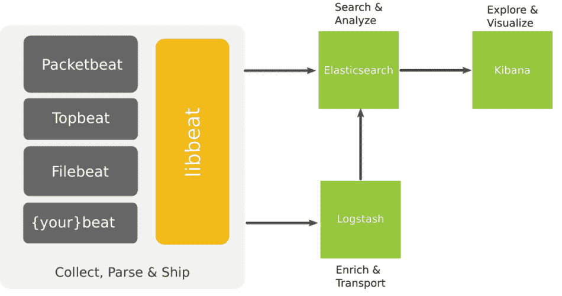
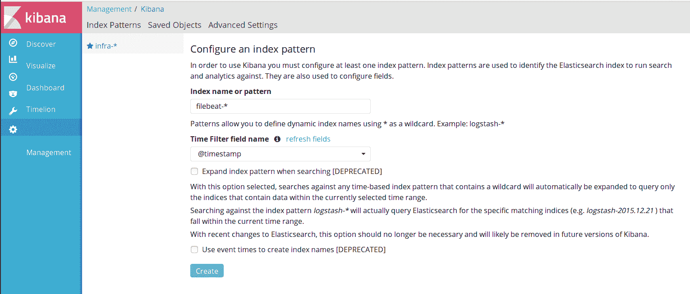
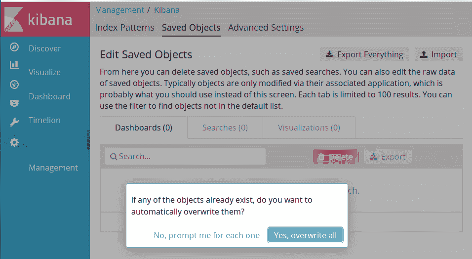
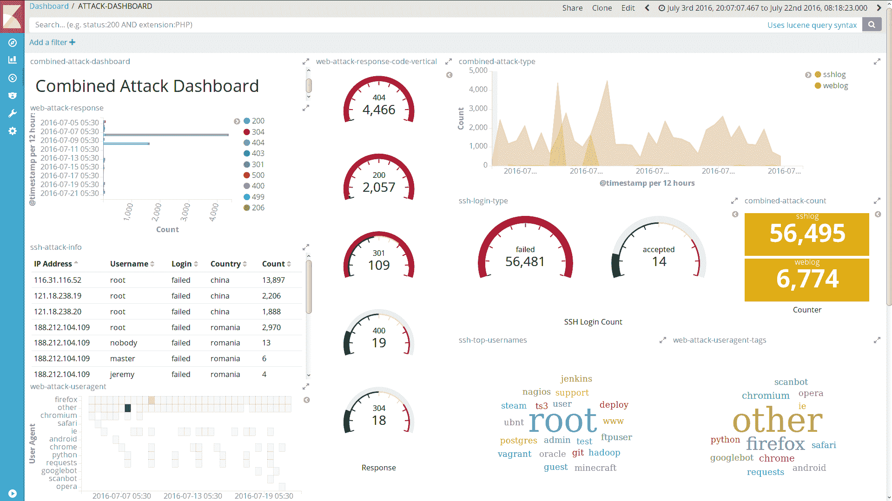
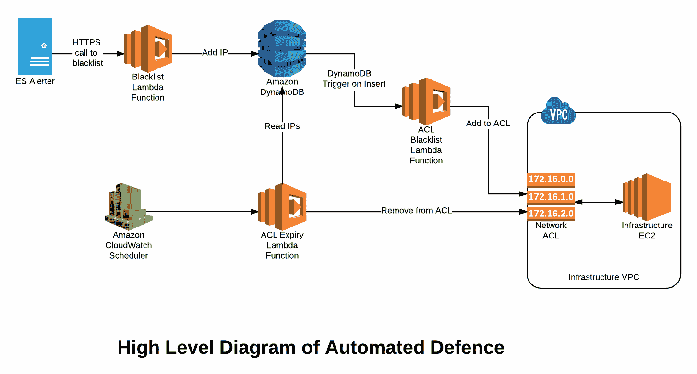
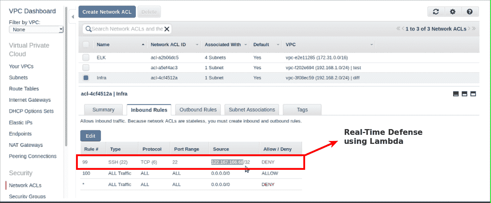

# 日志监控和无服务器自动防御（AWS 中的 Elastic Stack）

日志监控是考虑安全自动化的理想场所。要使监视有效，需要发生一些事情。我们应该能够将来自不同设备的日志移动到一个中心位置。我们应该能够理解什么是常规日志条目，以及可能是攻击的内容。我们应该能够存储日志，并对其进行诸如聚合、标准化以及最终分析等操作。

但是，在深入设置堆栈并使用 Elastic Stack 构建集中式日志记录和监控之前，我们需要了解一些关于为什么需要使用和自动设置来防御接近实时攻击的原因。成为万事通是困难的。传统的日志记录系统发现很难为所有应用程序、系统和设备记录日志。各种时间格式、日志输出格式等等使得这项任务变得非常复杂。

最大的障碍是找到一种方法能够集中日志。这妨碍了能够有效地实时或接近实时处理日志条目。

以下是一些问题点：

+   访问通常很困难

+   需要高度专业的挖掘数据技能

+   日志很难找到

+   日志数据庞大

在本章中，我们将讨论以下主题：

+   安装 Elastic Stack 进行日志监控

+   在服务器上安装 Beats

+   设置和配置警报

+   设置 AWS Lambda 终端点以进行自动化防御

# Elastic Stack 简介

Elastic Stack 是 Elastic 公司推出的一组开源产品。它可以从任何类型的来源和任何格式的数据中提取数据，并实时搜索、分析和可视化该数据。它由四个主要组件组成，如下：

+   Elasticsearch

+   Logstash

+   Kibana

+   节拍



Elastic Stack 架构概述（图片来源：https://www.elastic.co/blog/beats-1-0-0）

它帮助用户/管理员以（接近）实时的方式收集、分析和可视化数据。每个模块根据您的用例和环境进行调整。

# Elasticsearch

Elasticsearch 是一个分布式的、RESTful 的搜索和分析引擎，能够解决越来越多的使用案例。作为 Elastic Stack 的核心，它集中存储您的数据，以便您可以发现预期的内容并发现意外情况

Elastic Stack 的主要优点：

+   分布式和高可用搜索引擎，用 Java 编写，使用 Groovy

+   基于 Lucene 构建

+   多租户，具有多种类型和一组 API

+   面向文档的，提供（接近）实时搜索

# Logstash

Logstash 是一个开源的、服务器端的数据处理管道，它从多种来源摄取数据，同时对其进行转换，然后将其发送到您喜欢的 *stash*。

只是强调 Logstash 是：

+   一个用 Ruby 编写的管理事件和日志的工具

+   所有类型日志的集中式数据处理

+   包括以下三个主要组件：

    +   **输入**：传递日志以将其处理为机器可理解的格式

    +   **过滤器**：一组条件，用于对事件执行特定操作

    +   **输出**：已处理事件/日志的决策者

# Kibana

Kibana 让你可以可视化你的 Elasticsearch 数据并导航 Elastic Stack，这样你就可以做任何事情，从了解为什么在凌晨 2 点会被叫醒到理解雨水可能对你的季度数据造成的影响。

Kibana 的功能列表：

+   强大的前端仪表板是用 JavaScript 编写的

+   基于浏览器的 Elasticsearch 分析和搜索仪表板

+   一个灵活的分析和可视化平台

+   实时以图表、图形、计数、地图等形式提供数据

# Beats

Beats 是单一用途数据船的平台。它们安装为轻量级代理，并将数据从数百或数千台机器发送到 Logstash 或 Elasticsearch。

Beats 是：

+   为 Elasticsearch 和 Logstash 提供轻量级船员

+   捕获各种运营数据，比如日志或网络数据包

+   它们可以将日志发送到 Elasticsearch 或 Logstash

不同类型的 Beats 如下所示：

+   **Libbeat**：用于创建新 Beats 的 Go 框架

+   **Packetbeat**：窥探您的线路数据

+   **Filebeat**：轻量级日志转发器到 Logstash 和 Elasticsearch

+   **Winlogbeat**：发送 Windows 事件日志，以及许多其他由社区提供的 Beats

# 为什么我们应该使用 Elastic Stack 进行安全监控和警报？

Elastic Stack 解决了我们之前讨论过的大部分问题，比如：

+   能够存储大量数据

+   能够理解和读取各种日志格式

+   能够将日志信息从各种设备以近乎实时的方式发送到一个中央位置

+   日志分析的可视化仪表板

# 设置 Elastic Stack 的先决条件

让我们从先决条件开始。在这里，我们使用 `debconf` 来为交互式输入添加值。然后我们安装 Java、nginx 和其他必需的软件包：

```
- name: install python 2
  raw: test -e /usr/bin/python || (apt -y update && apt install -y python-minimal)

- name: accepting oracle java license agreement
  debconf:
    name: 'oracle-java8-installer'
    question: 'shared/accepted-oracle-license-v1-1'
    value: 'true'
    vtype: 'select'

- name: adding ppa repo for oracle java by webupd8team
  apt_repository:
    repo: 'ppa:webupd8team/java'
    state: present
    update_cache: yes

- name: installing java nginx apache2-utils and git
  apt:
    name: "{{ item }}"
    state: present
    update_cache: yes

  with_items:
    - python-software-properties
    - oracle-java8-installer
    - nginx
    - apache2-utils
    - python-pip
    - python-passlib
```

# 设置 Elastic Stack

栈是以下组合：

+   Elasticsearch 服务

+   Logstash 服务

+   Kibana 服务

+   所有设备上的 Beats 服务

这个 Elastic Stack 可以以不同的方式设置。在本章中，我们将在单台机器上设置 Elasticsearch、Logstash 和 Kibana。

这是主要的日志收集机器：

+   它至少需要 4 GB 的 RAM，因为我们在一台机器上为三个服务（Elasticsearch、Logstash 和 Kibana）提供服务

+   它需要至少 20 GB 的磁盘空间，并根据您的日志大小增加磁盘空间

# Logstash 集成

Logstash 为以下内容提供了非常大量的集成支持：

+   **输入**：输入插件使得 Logstash 能够读取特定事件源。输入插件有文件、lumberjack、s3、Beats、stdin 等等。

+   **过滤器**：过滤器插件对事件进行中间处理。根据事件的特征，通常会有条件地应用过滤器。

+   **输出**：输出插件将事件数据发送到特定目的地。输出是事件管道中的最后阶段。输出插件包括 Elasticsearch、电子邮件、标准输出、s3、文件、HTTP 等等。

# Kibana

Kibana 默认具有不同类型的插件和集成，以及社区提供的插件，可在[`www.elastic.co/guide/en/kibana/current/known-plugins.html`](https://www.elastic.co/guide/en/kibana/current/known-plugins.html)找到。

# ElastAlert

ElastAlert 是一个 Python 工具，还捆绑了不同类型的集成，用于支持警报和通知。其中一些包括命令、电子邮件、JIRA、OpsGenie、AWS SNS、HipChat、Slack、Telegram 等。它还提供了一种模块化的方法来创建我们自己的集成。

# 安装 Elasticsearch

从存储库安装 Elasticsearch，并将其添加到启动程序：

```
- name: adding elastic gpg key for elasticsearch
  apt_key:
    url: "https://artifacts.elastic.co/GPG-KEY-elasticsearch"
    state: present

- name: adding the elastic repository
  apt_repository:
    repo: "deb https://artifacts.elastic.co/packages/5.x/apt stable main"
    state: present

- name: installing elasticsearch
  apt:
    name: "{{ item }}"
    state: present
    update_cache: yes

  with_items:
    - elasticsearch

- name: adding elasticsearch to the startup programs
  service:
    name: elasticsearch
    enabled: yes

  notify:
    - start elasticsearch
```

配置 Elasticsearch 集群所需的设置。另外，为 Elasticsearch 集群备份和快照创建一个备份目录。为 Elasticsearch 集群设置 JVM 选项。 

```
- name: creating elasticsearch backup repo directory at {{ elasticsearch_backups_repo_path }}
  file:
    path: "{{ elasticsearch_backups_repo_path }}"
    state: directory
    mode: 0755
    owner: elasticsearch
    group: elasticsearch

- name: configuring elasticsearch.yml file
  template:
    src: "{{ item.src }}"
    dest: /etc/elasticsearch/"{{ item.dst }}"

  with_items:
    - { src: 'elasticsearch.yml.j2', dst: 'elasticsearch.yml' }
    - { src: 'jvm.options.j2', dst: 'jvm.options' }

  notify:
    - restart elasticsearch
```

通知部分将触发 `重启 elasticsearch` 处理程序，处理程序文件如下所示。一旦在处理程序目录中创建了处理程序，我们可以在任务中的任何地方使用处理程序：

```
- name: start elasticsearch
  service:
    name: elasticsearch
    state: started

- name: restart elasticsearch
  service:
    name: elasticsearch
    state: restarted
```

# 安装 Logstash

从存储库安装 Logstash，并将其添加到启动程序：

```
- name: adding elastic gpg key for logstash
  apt_key:
    url: "https://artifacts.elastic.co/GPG-KEY-elasticsearch"
    state: present

- name: adding the elastic repository
  apt_repository:
    repo: "deb https://artifacts.elastic.co/packages/5.x/apt stable main"
    state: present

- name: installing logstash
  apt:
    name: "{{ item }}"
    state: present
    update_cache: yes

  with_items:
    - logstash

- name: adding logstash to the startup programs
  service:
    name: logstash
    enabled: yes

  notify:
    - start logstash
```

配置 Logstash 服务的输入、输出和过滤器设置。这使得可以接收日志、处理日志并将日志发送到 Elasticsearch 集群：

```
- name: logstash configuration files
  template:
    src: "{{ item.src }}"
    dest: /etc/logstash/conf.d/"{{ item.dst }}"

  with_items:
    - { src: '02-beats-input.conf.j2', dst: '02-beats-input.conf' }
    - { src: '10-sshlog-filter.conf.j2', dst: '10-sshlog-filter.conf' }
    - { src: '11-weblog-filter.conf.j2', dst: '11-weblog-filter.conf' }
    - { src: '30-elasticsearch-output.conf.j2', dst: '10-elasticsearch-output.conf' }

  notify:
    - restart logstash
```

# Logstash 配置

为了从不同系统接收日志，我们使用 Elastic 的 Beats 服务。以下配置用于将来自不同服务器的日志发送到 Logstash 服务器。Logstash 运行在端口 `5044` 上，我们可以使用 SSL 证书来确保日志通过加密通道传输：

```
# 02-beats-input.conf.j2
input {
    beats {
        port => 5044
        ssl => true
        ssl_certificate => "/etc/pki/tls/certs/logstash-forwarder.crt"
        ssl_key => "/etc/pki/tls/private/logstash-forwarder.key"
    }
}
```

以下配置用于使用 `grok` 过滤器解析系统 SSH 服务日志（`auth.log`）。同时还应用了 `geoip` 等过滤器，提供额外的国家、地点、经度、纬度等信息：

```
#10-sshlog-filter.conf.j2
filter {
    if [type] == "sshlog" {
        grok {
            match => [ "message", "%{SYSLOGTIMESTAMP:syslog_date} %{SYSLOGHOST:syslog_host} %{DATA:syslog_program}(?:\[%{POSINT}\])?: %{WORD:login} password for %{USERNAME:username} from %{IP:ip} %{GREEDYDATA}",
            "message", "%{SYSLOGTIMESTAMP:syslog_date} %{SYSLOGHOST:syslog_host} %{DATA:syslog_program}(?:\[%{POSINT}\])?: message repeated 2 times: \[ %{WORD:login} password for %{USERNAME:username} from %{IP:ip} %{GREEDYDATA}",
            "message", "%{SYSLOGTIMESTAMP:syslog_date} %{SYSLOGHOST:syslog_host} %{DATA:syslog_program}(?:\[%{POSINT}\])?: %{WORD:login} password for invalid user %{USERNAME:username} from %{IP:ip} %{GREEDYDATA}",
            "message", "%{SYSLOGTIMESTAMP:syslog_date} %{SYSLOGHOST:syslog_host} %{DATA:syslog_program}(?:\[%{POSINT}\])?: %{WORD:login} %{WORD:auth_method} for %{USERNAME:username} from %{IP:ip} %{GREEDYDATA}" ]
        }

        date {
            match => [ "timestamp", "dd/MMM/YYYY:HH:mm:ss Z" ]
            locale => en
        }

        geoip {
            source => "ip"
        }
    }
}
```

以下配置用于解析 Web 服务器日志（`nginx`、`apache2`）。还将应用 `geoip` 和 `useragent` 过滤器。`useragent` 过滤器可帮助我们获取有关代理、操作系统类型、版本信息等的信息：

```
#11-weblog-filter.conf.j2
filter {
    if [type] == "weblog" {
        grok {
        match => { "message" => '%{IPORHOST:clientip} %{USER:ident} %{USER:auth} \[%{HTTPDATE:timestamp}\] "%{WORD:verb} %{DATA:request} HTTP/%{NUMBER:httpversion}" %{NUMBER:response:int} (?:-|%{NUMBER:bytes:int}) %{QS:referrer} %{QS:agent}' }
        }

        date {
        match => [ "timestamp", "dd/MMM/YYYY:HH:mm:ss Z" ]
        locale => en
        }

        geoip {
            source => "clientip"
        }

        useragent {
            source => "agent"
            target => "useragent"
        }
    }
}
```

以下配置将日志输出发送到 Elasticsearch 集群，并采用每日索引格式：

```
#30-elasticsearch-output.conf.j2
output {
    elasticsearch {
        hosts => ["localhost:9200"]
        manage_template => false
        index => "%{[@metadata][beat]}-%{+YYYY.MM.dd}"
        document_type => "%{[@metadata][type]}"
    }
}
```

# 安装 Kibana

以下 Playbook 将安装 Kibana。默认情况下，我们不会对 Kibana 进行任何更改，因为它与 Elasticsearch 相配合：

```
- name: adding elastic gpg key for kibana
  apt_key:
    url: "https://artifacts.elastic.co/GPG-KEY-elasticsearch"
    state: present

- name: adding the elastic repository
  apt_repository:
    repo: "deb https://artifacts.elastic.co/packages/5.x/apt stable main"
    state: present

- name: installing kibana
  apt:
    name: "{{ item }}"
    state: present
    update_cache: yes

  with_items:
    - kibana

- name: adding kibana to the startup programs
  service:
    name: kibana
    enabled: yes

  notify:
    - start kibana
```

默认情况下，Kibana 没有任何身份验证，X-Pack 是 Elastic 提供的商业插件，用于 RBAC（基于角色的访问控制）和安全性。此外，一些开源选项包括 [`readonlyrest.com/`](https://readonlyrest.com/) 和 Search Guard ([`floragunn.com`](https://floragunn.com)) 用于与 Elasticsearch 交互。强烈建议使用 TLS/SSL 和自定义身份验证和授权。一些开源选项包括 OAuth2 Proxy ([`github.com/bitly/oauth2_proxy`](https://github.com/bitly/oauth2_proxy)) 和 Auth0 等。

# 配置 nginx 反向代理

以下配置是使用 `nginx` 反向代理启用 Kibana 的基本身份验证：

```
server {
    listen 80;
    server_name localhost;
    auth_basic "Restricted Access";
    auth_basic_user_file /etc/nginx/htpasswd.users;
    location / {
        proxy_pass http://localhost:5601;
        proxy_http_version 1.1;
        proxy_set_header Upgrade $http_upgrade;
        proxy_set_header Connection 'upgrade';
        proxy_set_header Host $host;
        proxy_cache_bypass $http_upgrade;
    }
}
```

设置和配置 nginx 服务如下所示：

```
#command: htpasswd -c /etc/nginx/htpasswd.users
- name: htpasswd generation
  htpasswd:
    path: "/etc/nginx/htpasswd.users"
    name: "{{ basic_auth_username }}"
    password: "{{ basic_auth_password }}"
    owner: root
    group: root
    mode: 0644

- name: nginx virtualhost configuration
  template:
    src: "templates/nginxdefault.j2"
    dest: "/etc/nginx/sites-available/default"

  notify:
    - restart nginx
```

# 安装 Beats 以将日志发送到 Elastic Stack

正如我们讨论的那样，Beats 有不同类型。在下面的 playbook 中，我们将安装 Filebeat，以将 SSH 和 web 服务器日志发送到 Elastic Stack：

```
- name: adding elastic gpg key for filebeat
  apt_key:
    url: "https://artifacts.elastic.co/GPG-KEY-elasticsearch"
    state: present

- name: adding the elastic repository
  apt_repository:
    repo: "deb https://artifacts.elastic.co/packages/5.x/apt stable main"
    state: present

- name: installing filebeat
  apt:
    name: "{{ item }}"
    state: present
    update_cache: yes

  with_items:
    - apt-transport-https
    - filebeat

- name: adding filebeat to the startup programs
  service:
    name: filebeat
    enabled: yes

  notify:
    - start filebeat
```

现在我们可以配置 Filebeat，将 SSH 和 web 服务器日志发送到 Elastic Stack，以便实时处理和索引：

```
filebeat:
  prospectors:
    -
      paths:
        - /var/log/auth.log
        # - /var/log/syslog
        # - /var/log/*.log
      document_type: sshlog
    -
      paths:
        - /var/log/nginx/access.log
      document_type: weblog

  registry_file: /var/lib/filebeat/registry

output:
 logstash:
   hosts: ["{{ logstash_server_ip }}:5044"]
   bulk_max_size: 1024
   ssl:
    certificate_authorities: ["/etc/pki/tls/certs/logstash-forwarder.crt"]

logging:
 files:
   rotateeverybytes: 10485760 # = 10MB
```

# 用于警报的 ElastAlert

首先，我们需要安装设置 ElastAlert 的先决条件。然后我们将添加配置文件以根据规则执行警报：

```
- name: installing pre requisuites for elastalert
  apt:
    name: "{{ item }}"
    state: present
    update_cache: yes

  with_items:
    - python-pip
    - python-dev
    - libffi-dev
    - libssl-dev
    - python-setuptools
    - build-essential

- name: installing elastalert
  pip:
    name: elastalert

- name: creating elastalert directories
  file: 
    path: "{{ item }}"
    state: directory
    mode: 0755

  with_items:
    - /opt/elastalert/rules
    - /opt/elastalert/config

- name: creating elastalert configuration
  template:
    src: "{{ item.src }}"
    dest: "{{ item.dst }}"

  with_items:
    - { src: 'elastalert-config.j2', dst: '/opt/elastalert/config/config.yml' }
    - { src: 'elastalert-service.j2', dst: '/lib/systemd/system/elastalert.service' }
    - { src: 'elastalert-sshrule.j2', dst: '/opt/elastalert/rules/ssh-bruteforce.yml' }

- name: enable elastalert service
  service:
    name: elastalert
    state: started
    enabled: yes

```

我们还将创建一个简单的启动脚本，以便将 ElastAlert 用作系统服务：

```
[Unit]
Description=elastalert
After=multi-user.target

[Service]
Type=simple
WorkingDirectory=/opt/elastalert
ExecStart=/usr/local/bin/elastalert --config /opt/elastalert/config/config.yml

[Install]
WantedBy=multi-user.target
```

# 配置 Let's Encrypt 服务

我们可以使用 Let's Encrypt 提供的命令行工具以开放、自动化的方式获取免费的 SSL/TLS 证书。

该工具能够读取并理解 nginx 虚拟主机文件，并完全自动生成相关证书，无需任何手动干预：

```
- name: adding certbot ppa
  apt_repository:
    repo: "ppa:certbot/certbot"

- name: install certbot
  apt:
    name: "{{ item }}"
    update_cache: yes
    state: present

  with_items:
    - python-certbot-nginx

- name: check if we have generated a cert already
  stat:
    path: "/etc/letsencrypt/live/{{ website_domain_name }}/fullchain.pem"
    register: cert_stats

- name: run certbot to generate the certificates
  shell: "certbot certonly --standalone -d {{ website_domain_name }} --email {{ service_admin_email }} --non-interactive --agree-tos"
  when: cert_stats.stat.exists == False

- name: configuring site files
  template:
    src: website.conf
    dest: "/etc/nginx/sites-available/{{ website_domain_name }}"

- name: restart nginx
  service:
    name: nginx
    state: restarted
```

# ElastAlert 规则配置

假设您已经安装了 Elastic Stack 并记录了 SSH 日志，请使用以下 ElastAlert 规则触发 SSH 攻击 IP 黑名单：

```
es_host: localhost
es_port: 9200
name: "SSH Bruteforce attack alert"
type: frequency
index: filebeat-*
num_events: 20
timeframe:
  minutes: 1
# For more info: http://www.elasticsearch.org/guide/en/elasticsearch/reference/current/query-dsl.html

filter:
- query:
    query_string:
      query: '_type:sshlog AND login:failed AND (username: "ubuntu" OR username: "root")'

alert:
  - slack:
      slack_webhook_url: "https://hooks.slack.com/services/xxxxx"
      slack_username_override: "attack-bot"
      slack_emoji_override: "robot_face"
  - command: ["/usr/bin/curl", "https://xxxxxxxxxxx.execute-api.us-east-1.amazonaws.com/dev/zzzzzzzzzzzzzz/ip/inframonitor/%(ip)s"]

realert:
  minutes: 0
```

在上述示例规则中，大多数参数都是可配置的，根据使用情况而定。

欲了解更多参考，请访问 [`elastalert.readthedocs.io/en/latest/running_elastalert.html`](https://elastalert.readthedocs.io/en/latest/running_elastalert.html)。

# Kibana 仪表板

我们可以将现有的仪表板文件（JSON 格式）导入到 Kibana 中，通过上传 JSON 文件来查看不同的模式。



在 Kibana 仪表板中创建索引



将现有的仪表板和可视化内容导入到 Kibana 仪表板



来自 SSH 和 web 服务器日志的攻击仪表板

# 自动化防御？

如果我们能够收到攻击的通知，我们可以进行以下设置和操作：

+   调用 AWS Lambda 函数

+   将攻击者的 IP 地址信息发送到此 AWS Lambda 函数端点

+   使用部署在 Lambda 函数中的代码调用 VPC 网络访问列表 API，并阻止攻击者的 IP 地址

为了确保我们不会用攻击者的 IP 填满 ACL，我们可以将这种方法与 AWS DynamoDB 结合使用，将此信息存储一段时间并从阻止列表中删除。



# 在设置中使用的 AWS 服务

一旦检测到攻击，警报器会通过 HTTPS 请求将 IP 发送到黑名单 Lambda 端点。使用网络 ACL 阻止 IP，并在 DynamoDB 中维护其记录。如果 IP 已被阻止，则在 DynamoDB 中将为该规则的过期时间延长。

定期触发一个到期处理程序函数，从 DynamoDB 和 ACL 中相应地删除过期的规则。

# DynamoDB

DynamoDB 是规则映射到其相应 ACL ID 的中央数据库。通过适当的 Lambda 函数将 IP 地址的规则添加到`blacklist_ip`表中，并从中删除。

# 黑名单 Lambda 函数

黑名单函数是设置的唯一暴露的端点。需要通过 HTTPS 请求将需要列入黑名单的任何 IP 提供给此函数。

# HandleExpiry Lambda 函数

HandleExpiry 函数每分钟触发一次，并根据`expirymin`字段从 ACL 和 DynamoDB 中删除过期规则。

# 云监控

云监控定期触发 HandleExpiry Lambda 函数。默认情况下，该函数每分钟触发一次。

# VPC 网络 ACL

VPC 网络 ACL 是 ACL 规则添加和删除的地方。在设置时必须配置 ACL ID。

# 设置

设置涉及以下步骤：

+   获取 IAM 凭证

+   在 DynamoDB 中创建一个表

+   根据需求配置 Lambda 函数

+   将代码部署到 AWS Lambda

+   配置云监控定期调用

整个设置是自动化的，除了获取 IAM 凭证并根据需求配置函数之外。

# 配置

在部署之前可配置以下参数：

+   `region`：部署的 AWS 区域。这需要与 VPC 网络所在的区域相同。

+   `accessToken`：用于对黑名单端点进行身份验证的 accessToken。

+   `aclLimit`：ACL 可处理的规则数的最大限制。AWS 中默认的最大限制是 20。

+   `ruleStartId`：ACL 中规则的起始 ID。

+   `aclID`：规则将应用的网络的 ACL ID。

+   `tableName`：为每个要防御的 VPC 创建的唯一表名称。

+   `ruleValidity`：规则有效的持续时间，之后 IP 将被解除阻止。

在`config.js`文件中配置以下内容：

```
module.exports = {
    region: "us-east-1",                                        // AWS Region to deploy in
    accessToken: "YOUR_R4NDOM_S3CR3T_ACCESS_TOKEN_GOES_HERE",   // Accesstoken to make requests to blacklist
    aclLimit: 20,                                               // Maximum number of acl rules
    ruleStartId: 10,                                            // Starting id for acl entries
    aclId: "YOUR_ACL_ID",                                       // AclId that you want to be managed
    tableName: "blacklist_ip",                                  // DynamoDB table that will be created
    ruleValidity: 5                                             // Validity of Blacklist rule in minutes 
}
```

确保至少根据您的设置修改`aclId`、`accessToken`和`region`。要修改 Lambda 部署配置，请使用`serverless.yml`文件：

```
...

functions:
  blacklist:
    handler: handler.blacklistip
    events:
     - http:
         path: blacklistip
         method: get

  handleexpiry:
    handler: handler.handleexpiry
    events:
     - schedule: rate(1 minute)

...
```

例如，可以使用 YML 文件修改到期函数触发的速率以及黑名单函数的端点 URL。但默认值已经是最佳的。

播放手册如下：

```
- name: installing node run time and npm
  apt:
    name: "{{ item }}"
    state: present
    update_cache: yes

  with_items:
    - nodejs
    - npm

- name: installing serverless package
  npm:
    name: "{{ item }}"
    global: yes
    state: present

  with_items:
    - serverless
    - aws-sdk

- name: copy the setup files
  template:
    src: "{{ item.src }}"
    dest: "{{ item.dst }}"

  with_items:
    - { src: 'config.js.j2', dst: '/opt/serverless/config.js' }
    - { src: 'handler.js.j2', dst: '/opt/serverless/handler.js' }
    - { src: 'iamRoleStatements.json.j2', dst: '/opt/serverless/iamRoleStatements.json' }
    - { src: 'initDb.js.j2', dst: '/opt/serverless/initDb.js' }
    - { src: 'serverless.yml.j2', dst: '/opt/serverless/serverless.yml' }
    - { src: 'aws-credentials.j2', dst: '~/.aws/credentials' }

- name: create dynamo db table
  command: node initDb.js
  args:
    chdir: /opt/serverless/

- name: deploy the serverless
  command: serverless deploy
  args:
    chdir: /opt/serverless/
```

目前 AWS Lambda 的设置是针对网络 ACL 封锁 IP 地址。这可以在其他 API 端点上重用，比如防火墙动态封锁列表和其他安全设备。

根据 AWS 文档，VPC 网络 ACL 规则限制设置为 20：[`docs.aws.amazon.com/AmazonVPC/latest/UserGuide/VPC_Appendix_Limits.html#vpc-limits-nacls`](http://docs.aws.amazon.com/AmazonVPC/latest/UserGuide/VPC_Appendix_Limits.html#vpc-limits-nacls)

# 使用方法 - 封锁 IP 地址

黑名单端点负责封锁 IP 地址。

# 请求

URL 看起来像以下内容：`https://lambda_url/blacklistipaccessToken=ACCESS_TOKEN&ip=IP_ADDRESS`

查询参数如下：

+   `IP_ADDRESS`：要封锁的 IP 地址

+   `ACCESS_TOKEN`：用于验证请求的`accessToken`

# 响应

响应是标准的 HTTP 状态码，如下所述：

| **状态码** | **主体** | **解释** |
| --- | --- | --- |
| `200` | 已封锁 | 该 IP 已添加到黑名单 |
| `200` | 延长到期 | 黑名单规则的有效期已延长 |
| `400` | 错误请求 | 缺少必填字段 |
| `401` | 未经授权 | accessToken 无效或丢失 |
| `500` | 规则限制已达到 | 已达到 ACL 规则限制 |

# 自动化防御 lambda 在行动

当 ElastAlert 检测到 SSH 暴力攻击时，它将触发对 lambda 端点的请求，提供攻击者的 IP 地址。然后我们的自动化防御平台将触发网络 ACL 封锁列表规则。这可以配置为阻止多长时间。



# 摘要

这是很多信息需要消化的。此外，我们对场景做出了很多假设。但是，如果这激发了您考虑将设备和服务器的各种日志组合到一个中央位置并启用自动警报和防御措施，那我们的工作就做得很好。

正如本章所示，安全自动化有点像管道工作。只要我们能够理解如何让一堆不同的系统相互通信，我们就可以将它们添加到我们的 playbooks 中。在许多情况下，Ansible 已经为我们提供了可用于使用和启动的模块。

现在我们已经激发了您对日志记录和攻击检测的兴趣，在下一章中，让我们深入了解设置自动化网络安全测试的所需。我们将选择功能强大且多才多艺的 OWASP ZAP 扫描仪和拦截代理，并使用它扫描和测试网站和 API。
