# 第六章：使用 Nessus 进行漏洞扫描

漏洞扫描是安全团队在其计算机上进行的最为了解的定期活动之一。对于定期对计算机、网络、操作系统软件和应用软件进行漏洞扫描，都有充分记录的策略和最佳实践：

+   基本网络扫描

+   凭证补丁审核

+   将系统信息与已知漏洞相关联

对于网络系统，这种类型的扫描通常是从具有适当权限的连接主机执行的，以便扫描安全问题。

最流行的漏洞扫描工具之一是 Nessus。Nessus 最初是一个网络漏洞扫描工具，但现在还包括以下功能：

+   端口扫描

+   网络漏洞扫描

+   Web 应用程序特定扫描

+   基于主机的漏洞扫描

# Nessus 简介

Nessus 拥有的漏洞数据库是其主要优势。虽然我们知道了理解哪个服务正在运行以及正在运行该服务的软件版本的技术，但回答“此服务是否有已知漏洞”这个问题是重要的。除了定期更新的漏洞数据库外，Nessus 还具有有关应用程序中发现的默认凭据、默认路径和位置的信息。所有这些都在易于使用的 CLI 或基于 Web 的工具中进行了优化。

在深入研究我们将如何设置 Nessus 来执行对基础架构进行漏洞扫描和网络扫描之前，让我们看看为什么我们必须设置它以及它将给我们带来什么回报。

在本章中，我们将专注于使用 Nessus 进行漏洞扫描。我们将尝试执行所需的标准活动，并查看使用 Ansible 自动化这些活动需要哪些步骤：

1.  使用 playbook 安装 Nessus。

1.  配置 Nessus。

1.  运行扫描。

1.  使用 AutoNessus 运行扫描。

1.  安装 Nessus REST API Python 客户端。

1.  使用 API 下载报告。

# 为漏洞评估安装 Nessus

首先，获取从 [`www.tenable.com/products/nessus/select-your-operating-system`](https://www.tenable.com/products/nessus/select-your-operating-system) 下载 Nessus 的 URL，然后选择 Ubuntu 操作系统，然后对要设置 Nessus 的服务器运行以下 playbook 角色：

```
- name: installing nessus server
  hosts: nessus
  remote_user: "{{ remote_user_name }}"
  gather_facts: no
  vars:
    remote_user_name: ubuntu
    nessus_download_url: "http://downloads.nessus.org/nessus3dl.php?file=Nessus-6.11.2-ubuntu1110_amd64.deb&licence_accept=yes&t=84ed6ee87f926f3d17a218b2e52b61f0"

  tasks:
    - name: install python 2
      raw: test -e /usr/bin/python || (apt -y update && apt install -y python-minimal)

    - name: downloading the package and installing
      apt:
        deb: "{{ nessus_download_url }}"

    - name: start the nessus daemon
      service:
        name: "nessusd"
        enabled: yes
        state: started
```

# 配置 Nessus 进行漏洞扫描

执行以下步骤配置 Nessus 进行漏洞扫描：

1.  我们必须导航至 `https://NESSUSSERVERIP:8834` 以确认并启动服务：

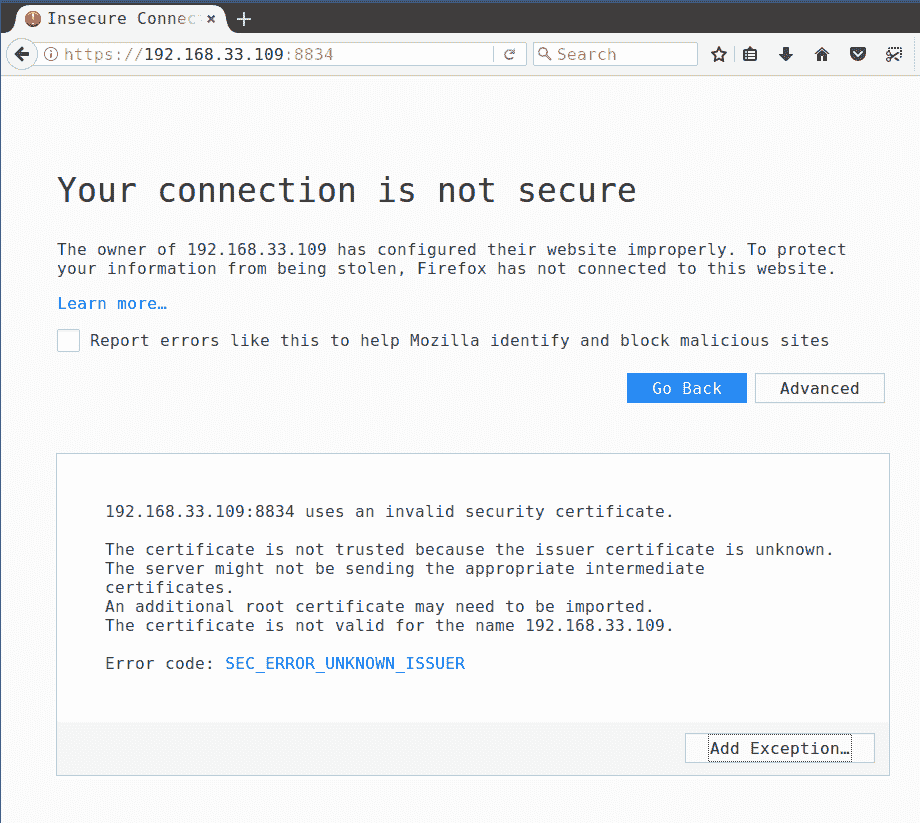

1.  如我们所见，它返回一个 SSL 错误，我们需要接受 SSL 错误并确认安全异常，并继续安装：

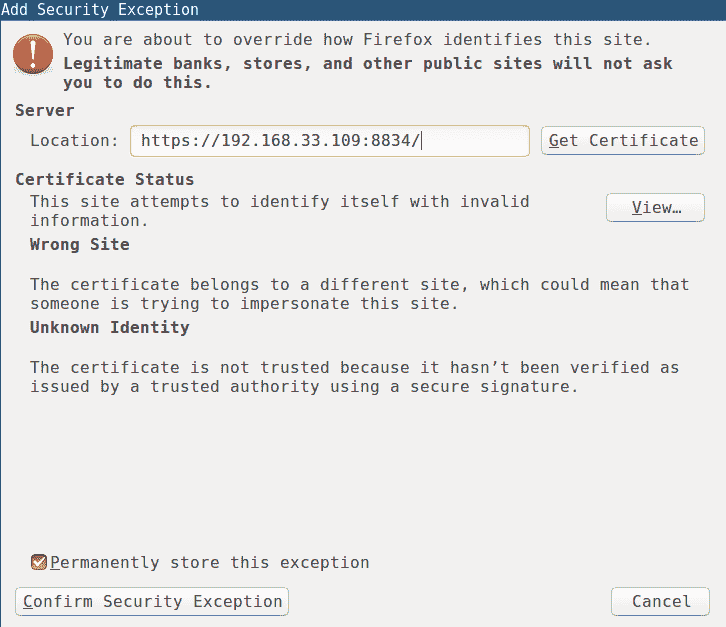

1.  单击确认安全异常并继续执行安装步骤：

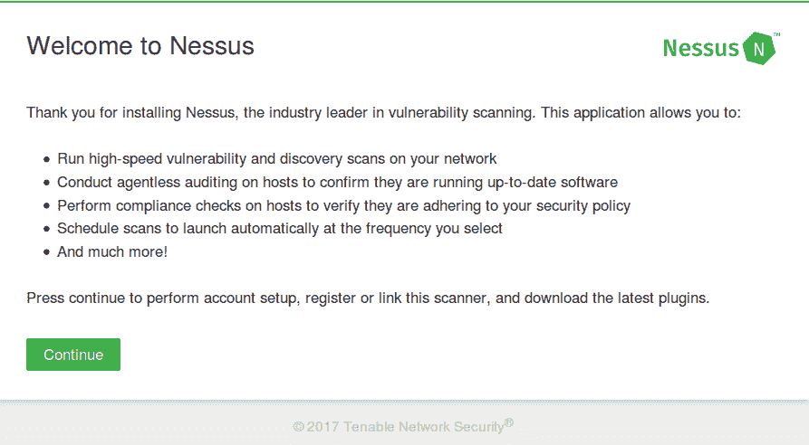

1.  点击继续并提供用户详细信息，该用户具有完整的管理员访问权限：

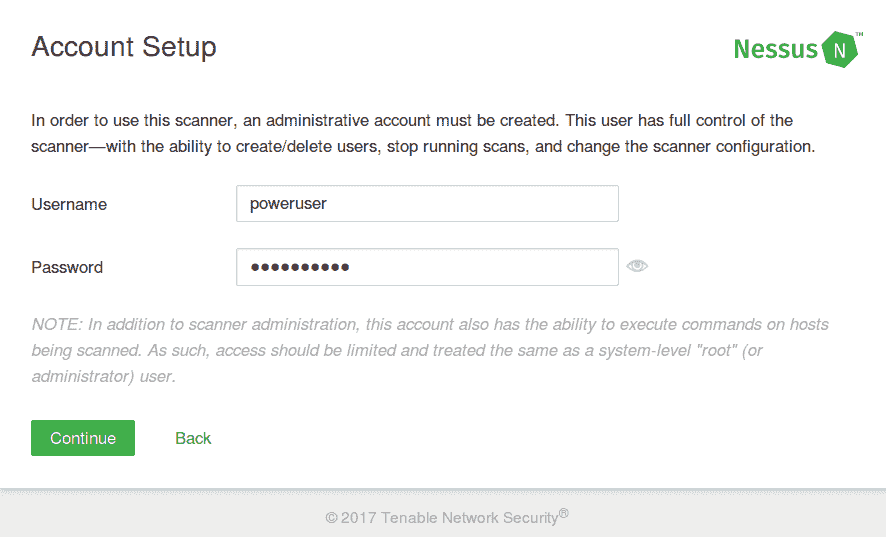

1.  最后，我们必须提供注册码（激活码），这可以从注册页面获取：[`www.tenable.com/products/nessus-home`](https://www.tenable.com/products/nessus-home)：

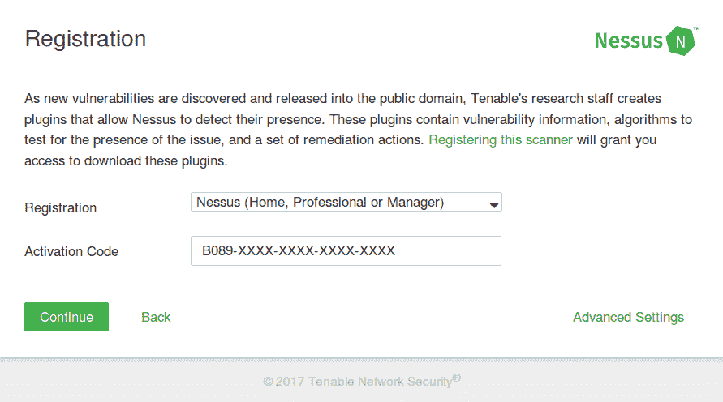

1.  现在，它将安装所需的插件。安装需要一段时间，一旦完成，我们就可以登录使用应用程序：

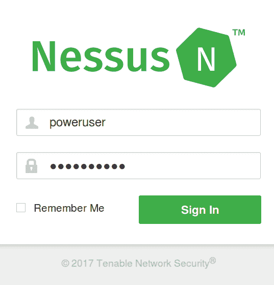

1.  现在，我们已成功设置了 Nessus 漏洞扫描器：

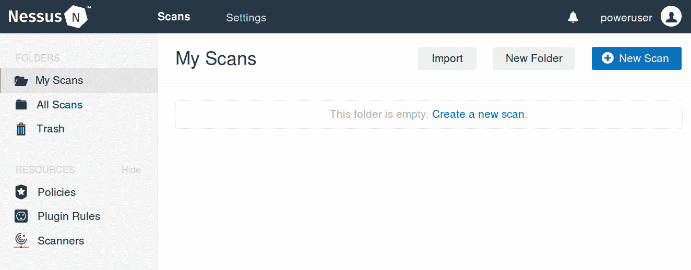

# 对网络执行扫描

现在，是时候使用 Nessus 执行一些漏洞扫描了。

# 基本网络扫描

Nessus 有各种各样的扫描，其中一些是免费的，一些只在付费版本中才可用。因此，我们也可以根据需要定制扫描。

下面是当前可用模板的列表：

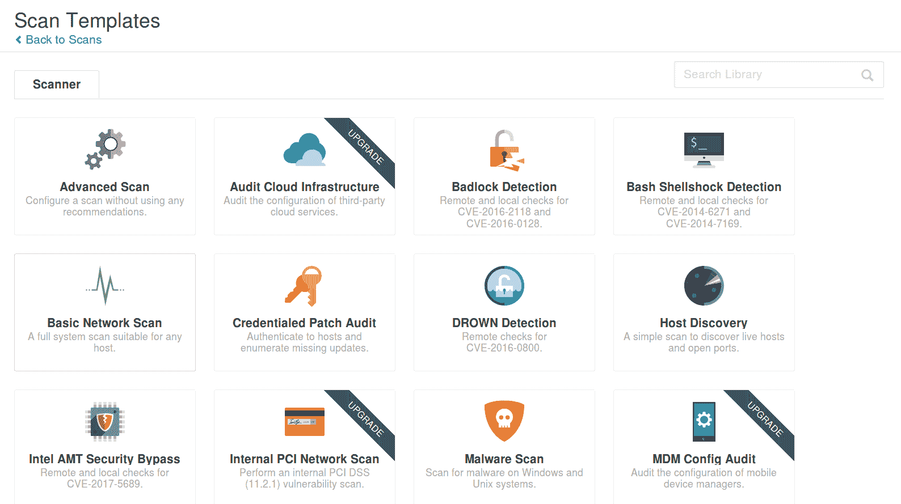

1.  我们可以从基本网络扫描开始，以查看网络中发生了什么。此扫描将为给定的主机执行基本的全系统扫描：

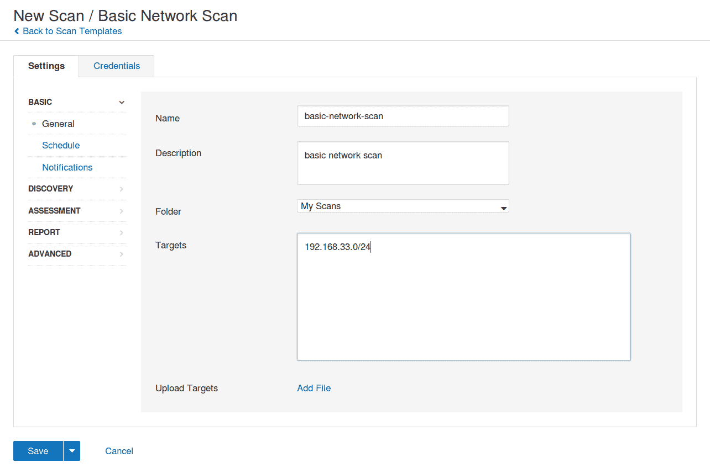

1.  正如您在前面的截图中所看到的，我们必须提到扫描名称和目标。目标只是我们想要的主机。

目标可以以不同格式给出，例如`192.168.33.1`表示单个主机，`192.168.33.1-10`表示主机范围，我们还可以从计算机上载入目标文件。

选择 New Scan / Basic Network Scan 以使用 Nessus 进行分析：

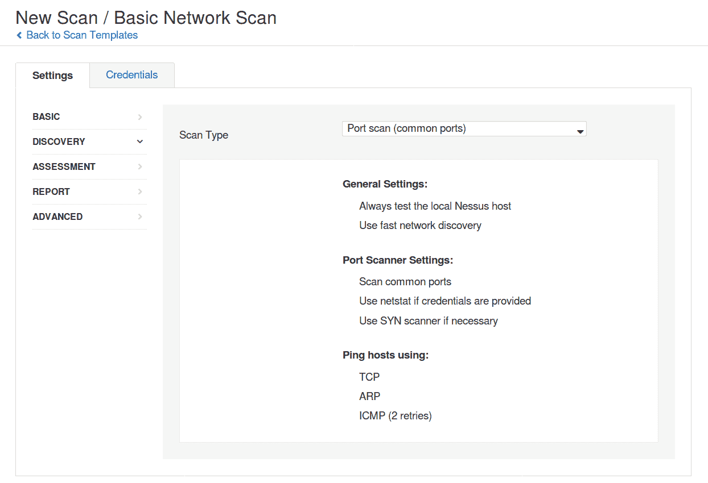

1.  我们也可以定制扫描类型。例如，我们可以执行常用端口扫描，该扫描将扫描已知端口，如果需要，我们还可以执行完整端口扫描：

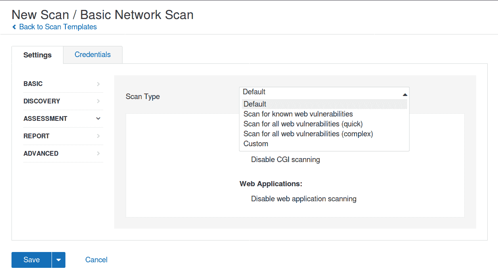

1.  然后，类似地，我们可以指定执行不同类型的 Web 应用程序扫描，如前所述：

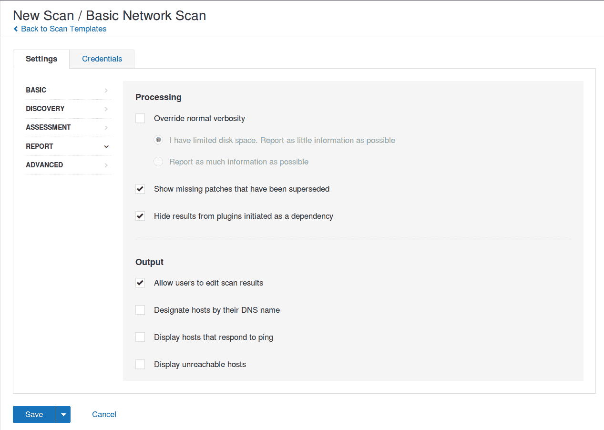

1.  报告也可以根据要求使用可用选项进行定制：

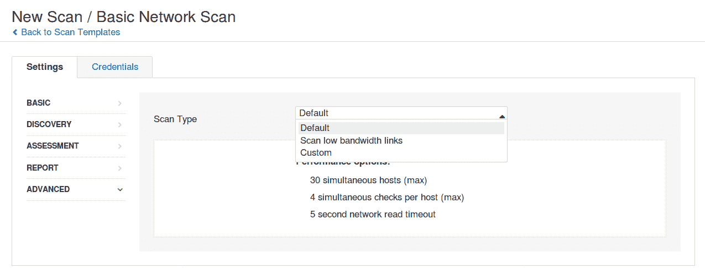

1.  在扫描关键基础设施时，前述选项非常重要。这些选项旨在确保我们不会在目标网络中产生大量流量和网络带宽。Nessus 允许我们根据使用情况和需求进行定制：

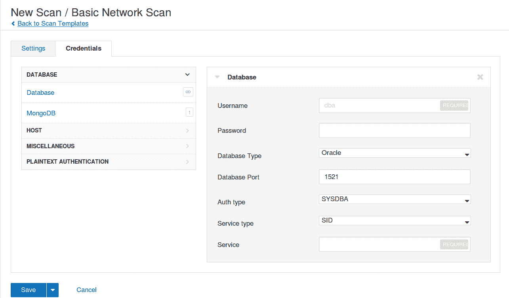

1.  前面的截图表示我们是否已经为任何服务拥有现有凭据，以及如果需要扫描，我们可以在此处提及它们。 Nessus 在扫描时将使用这些凭据进行身份验证，这样可以获得更好的结果。 Nessus 支持多种类型的身份验证服务！[](img/29a03e0e-e307-4f19-bea6-4171f3bd1250.png)

1.  如果需要，可以安排扫描，或者根据需要提供。 我们可以点击“启动”按钮（播放图标）以使用给定的配置参数开始扫描：

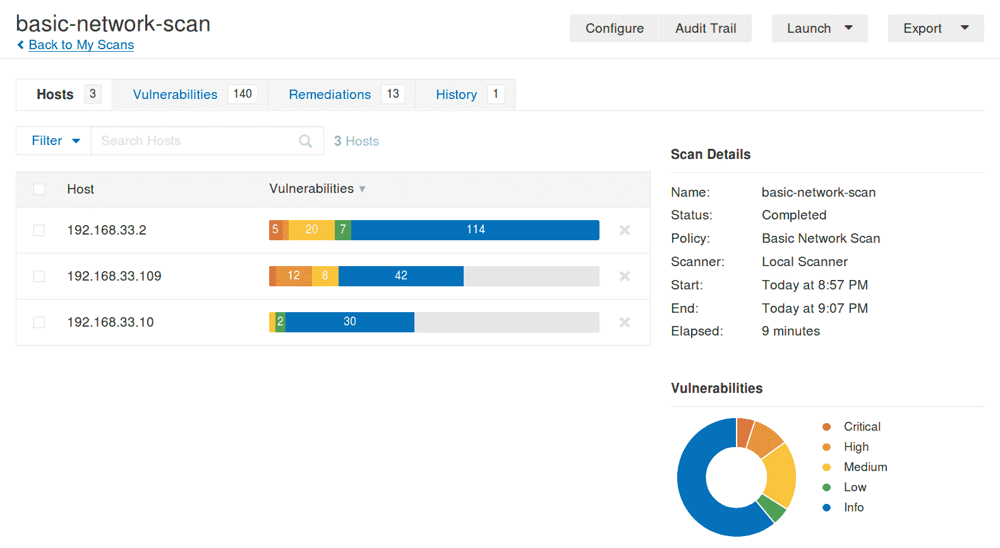

1.  扫描结果可以通过基于主机、漏洞、严重程度等的仪表板进行查看：

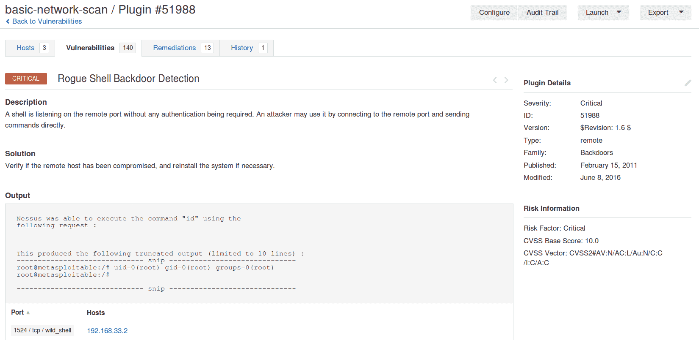

1.  上述截图显示了 Nessus 将如何生成现有漏洞的详细结果，包括样本**概念证明**（**POC**）或命令输出。 它还提供了修复、漏洞和参考的详细摘要。

# 使用 AutoNessus 运行扫描

使用 AutoNessus 脚本，我们可以执行以下操作：

+   列出扫描

+   列出扫描策略

+   对扫描执行操作，如启动、停止、暂停和恢复

AutoNessus 的最佳部分在于，由于这是一个命令行工具，因此可以轻松地成为定期任务和其他自动化工作流的一部分。

从[`github.com/redteamsecurity/AutoNessus`](https://github.com/redteamsecurity/AutoNessus)下载 AutoNessus。

# 设置 AutoNessus

以下代码是用于设置 AutoNessus 并配置其使用凭据的 Ansible playbook 片段。 此 playbook 将允许在路径中设置`autoNessus`工具，并且我们可以将其用作简单的系统工具：

```
- name: installing python-pip
  apt:
    name: python-pip
    update_cache: yes
    state: present

- name: install python requests
  pip:
    name: requests

- name: setting up autonessus
  get_url:
    url: "https://github.com/redteamsecurity/AutoNessus/raw/master/autoNessus.py"
    dest: /usr/bin/autoNessus
    mode: 0755

- name: updating the credentials
  replace:
    path: /usr/bin/autoNessus
    regexp: "{{ item.src }}"
    replace: "{{ item.dst }}"
    backup: yes
  no_log: True

  with_items:
    - { src: "token = ''", dst: "token = '{{ nessus_user_token }}'" }
    - { src: "url = 'https://localhost:8834'", dst: "url = '{{ nessus_url }}'" } 
    - { src: "username = 'xxxxx'", dst: "username = '{{ nessus_user_name }}'" }
    - { src: "password = 'xxxxx'", dst: "password = '{{ nessus_user_password }}'" }
```

`no_log: True`将在 Ansible 输出的日志控制台中对输出进行审查。 当我们在 playbooks 中使用密码和密钥时，这将非常有用。

# 使用 AutoNessus 运行扫描

以下的 playbook 代码片段可用于按需执行扫描以及定期执行的扫描。 这也可以在 Ansible Tower、Jenkins 或 Rundeck 中使用。

在使用 AutoNessus 进行自动化扫描之前，我们必须在 Nessus 门户中创建所需的自定义扫描，并且我们可以使用这些自动化 playbook 来执行任务。

# 列出当前可用的扫描和 ID

以下代码片段将返回当前可用的扫描并返回带有信息的 ID：

```
- name: list current scans and IDs using autoNessus
  command: "autoNessus -l"
  register: list_scans_output

- debug:
    msg: "{{ list_scans_output.stdout_lines }}"
```

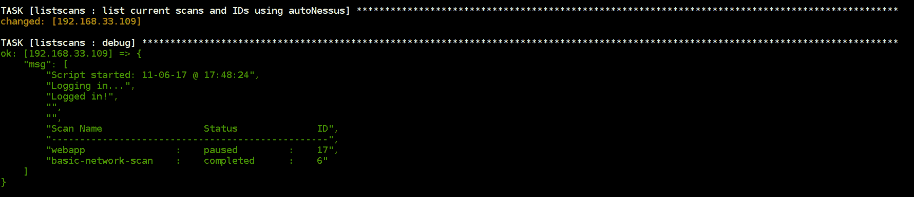

Ansible 输出返回可用扫描和 ID 信息的列表

# 使用扫描 ID 启动指定的扫描

以下代码片段将基于`scan_id`启动指定的扫描并返回状态信息：

```
- name: starting nessus scan "{{ scan_id }}" using autoNessus
  command: "autoNessus -sS {{ scan_id }}"
  register: start_scan_output

- debug:
    msg: "{{ start_scan_output.stdout_lines }}"
```

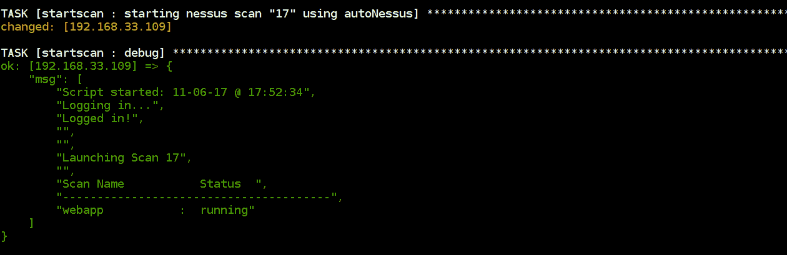

启动后，Ansible 输出返回扫描状态

同样，我们可以执行暂停、恢复、停止、列出策略等操作。 使用 AutoNessus 程序，这些 playbook 是可用的。 这可以通过改进 Nessus API 脚本来改进。

# 存储结果

我们还可以获取与漏洞相关的详细信息、解决方案和风险信息：

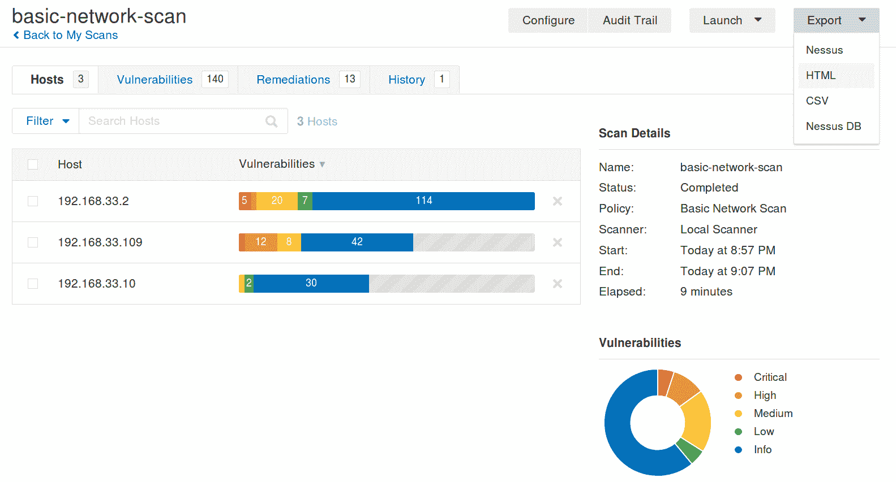

整个报告可以导出为多种格式，如 HTML、CSV 和 Nessus。 这有助于提供更详细的漏洞结构，带有风险评级的解决方案以及其他参考资料：

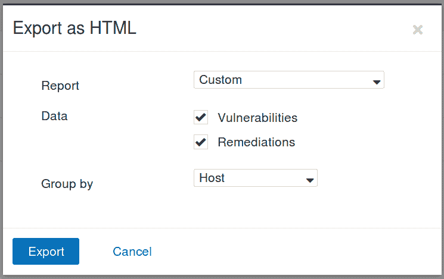

根据受众可以定制输出报告，如果发送给技术团队，我们可以列出所有漏洞和补救措施。例如，如果管理层想要报告，我们可以只得到问题的执行摘要。

报告也可以通过 Nessus 配置中的通知选项通过电子邮件发送。

以下截图是最近基本网络扫描的导出 HTML 格式的详细报告。这可以用来分析和修复基于主机的漏洞：

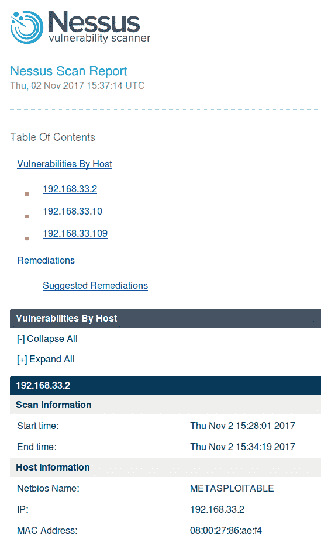

我们可以看到之前按主机分类的漏洞。我们可以在以下截图中详细查看每个漏洞：

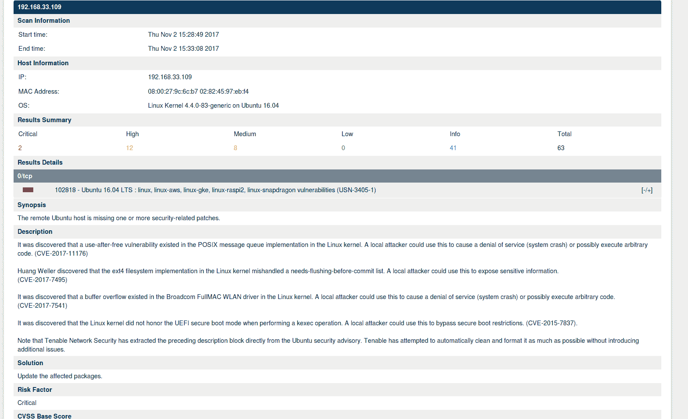

# 安装 Nessus REST API Python 客户端

官方 API 文档可以通过连接到您的 Nessus 服务器下的 `8834/nessus6-api.html` 获取。

要使用 Nessus REST API 执行任何操作，我们必须从门户获取 API 密钥。这可以在用户设置中找到。请务必保存这些密钥：

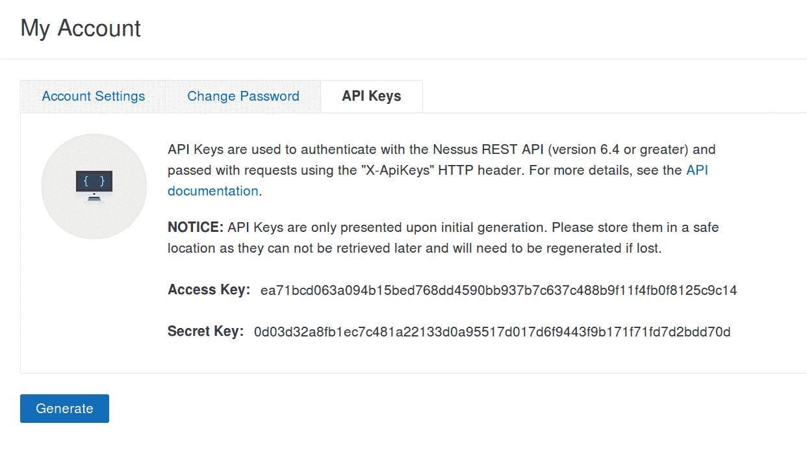

# 使用 Nessus REST API 下载报告

以下 playbook 将使用 Nessus REST API 执行对给定 `scan_id` 报告的导出请求。它将使用一个简单的 playbook 自动化整个过程。这将返回报告的 HTML 输出：

```
- name: working with nessus rest api
  connection: local
  hosts: localhost
  gather_facts: no
  vars:
    scan_id: 17
    nessus_access_key: 620fe4ffaed47e9fe429ed749207967ecd7a77471105d8
    nessus_secret_key: 295414e22dc9a56abc7a89dab713487bd397cf860751a2
    nessus_url: https://192.168.33.109:8834
    nessus_report_format: html

  tasks:
    - name: export the report for given scan "{{ scan_id }}"
      uri:
        url: "{{ nessus_url }}/scans/{{ scan_id }}/export"
        method: POST
        validate_certs: no
        headers:
            X-ApiKeys: "accessKey={{ nessus_access_key }}; secretKey={{ nessus_secret_key }}"
        body: "format={{ nessus_report_format }}&chapters=vuln_by_host;remediations"
      register: export_request

    - debug:
        msg: "File id is {{ export_request.json.file }} and scan id is {{ scan_id }}"

    - name: check the report status for "{{ export_request.json.file }}"
      uri:
        url: "{{ nessus_url }}/scans/{{ scan_id }}/export/{{ export_request.json.file }}/status"
        method: GET
        validate_certs: no
        headers:
            X-ApiKeys: "accessKey={{ nessus_access_key }}; secretKey={{ nessus_secret_key }}"
      register: report_status

    - debug:
        msg: "Report status is {{ report_status.json.status }}"

    - name: downloading the report locally
      uri:
        url: "{{ nessus_url }}/scans/{{ scan_id }}/export/{{ export_request.json.file }}/download"
        method: GET
        validate_certs: no
        headers:
          X-ApiKeys: "accessKey={{ nessus_access_key }}; secretKey={{ nessus_secret_key }}"
        return_content: yes
        dest: "./{{ scan_id }}_{{ export_request.json.file }}.{{ nessus_report_format }}"
      register: report_output

    - debug:
      msg: "Report can be found at ./{{ scan_id }}_{{ export_request.json.file }}.{{ nessus_report_format }}"
```

在 Nessus REST API  [`cloud.tenable.com/api#/overview`](https://cloud.tenable.com/api#/overview) 阅读更多。

使用 Nessus REST API 进行自动报告生成的 Ansible playbook：

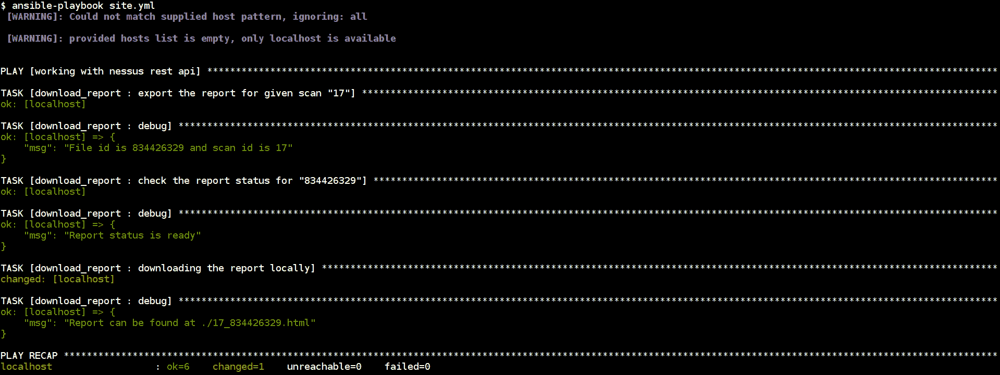

使用 Nessus REST API 进行自动报告生成和导出的 Ansible playbook

# Nessus 配置

Nessus 允许我们创建具有基于角色的认证的不同用户来执行扫描和以不同访问级别审查：

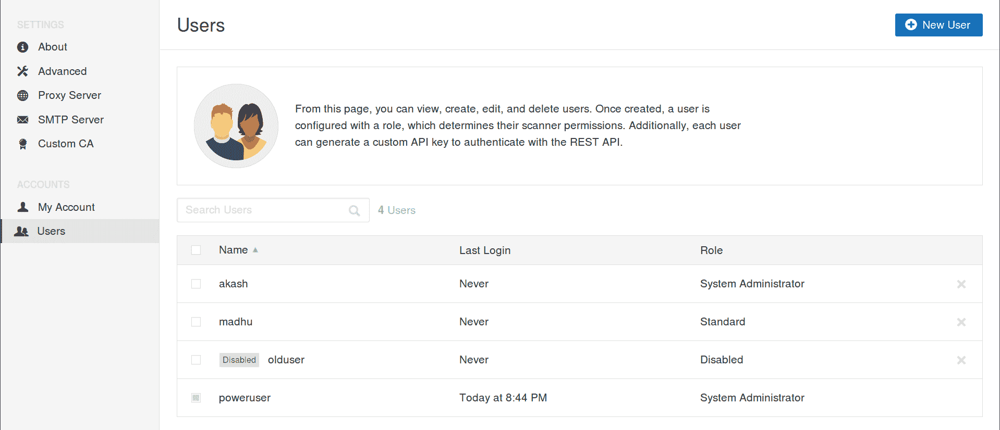

下图显示了如何创建一个具有执行 Nessus 活动权限的新用户的过程：

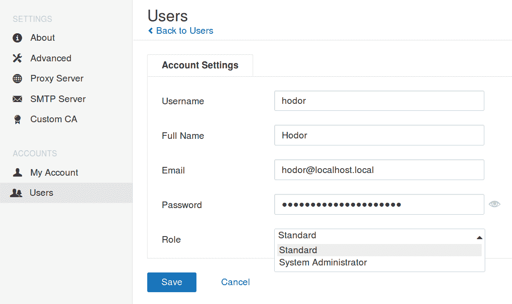

# 摘要

安全团队和 IT 团队依赖工具进行漏洞扫描、管理、补救和持续安全流程。由于 Nessus 是最流行和最有用的工具之一，它是作者尝试自动化的自动选择。

在本章中，我们看了漏洞扫描的主要活动，如能够安装和部署工具，启动扫描和下载报告。

在下一章中，我们将深入探讨系统安全和加固。我们将研究各种开放的安全倡议和基准项目，如 STIG、OpenSCAP 和**互联网安全中心**（**CIS**）。我们将学习如何将它们与我们的 playbooks 和自动化工具，如 Tower 和 Jenkins，集成起来。这一章关于漏洞扫描，以及下一章关于网络和应用程序安全加固，为探索更多关于安全自动化和保持系统安全和加固的思路奠定了坚实基础。
