# 应用程序和网络的安全加固

安全加固是任何注重安全的努力中最明显的任务。通过保护系统、应用程序和网络，可以实现多个安全目标，如下所述：

+   确保应用程序和网络没有受到威胁（有时）

+   使威胁难以长期隐藏

+   默认情况下进行安全加固，确保网络的一部分遭受威胁时不会进一步传播和蔓延

Ansible 在围绕安全自动化方面的思考方式非常适合用于自动化安全加固。在本章中，我们将介绍可以用于构建 playbook 的安全基准和框架，这些 playbook 将允许我们做以下事情：

+   确保我们的主镜像安全，以便应用程序和系统一旦成为网络的一部分，它们就提供了合适的安全性

+   执行审计过程，以便我们可以周期性地验证和测量应用程序、系统和网络是否符合组织所需的安全策略

这绝不是一个新的想法。在这个领域已经进行了大量工作。我们将看一些项目，如 dev-sec.io ([`dev-sec.io/`](http://dev-sec.io/)), 它们使我们可以简单地开始对应用程序和网络进行安全加固。

本章将涵盖的主题如下：

+   使用 CIS、STIG 和 NIST 等基准进行安全加固

+   使用 Ansible 自动化进行网络设备的安全审计检查

+   使用 Ansible 自动化进行应用程序的安全审计检查

+   使用 Ansible 进行自动打补丁的方法

# 使用 CIS、STIG 和 NIST 等基准进行安全加固

基准为任何人提供了获得其个人安全努力保证的好方法。这些基准由全球安全专家创建，或由安全成熟的政府部门如 NIST 领导，涵盖了各种系统、配置、软件等。

安全加固主要归结为以下几点：

1.  达成一致，确定最小配置集合何时符合安全配置的定义。通常将其定义为加固基准或框架。

1.  对受到此类配置影响的系统的所有方面进行更改。

1.  定期测量应用程序和系统是否仍与配置一致，或是否存在任何偏差。

1.  如果发现任何偏差，立即采取纠正措施修复它。

1.  如果没有发现任何偏差，记录下来。

1.  由于软件始终在升级，跟踪最新的配置指南和基准非常重要。

我们讨论的三个重要的基准/框架是：

+   CIS 基准

+   STIG 指南

+   NIST 的**国家检查清单计划**(**NCP**)

这些 CIS 基准通常以 PDF 文档的形式表达，任何想了解他们的系统与 CIS 专家对其安全性的看法相比有多安全的人都可以获得。

CIS 是一个非营利性组织，为互联网安全制定了非营利性标准，并被认可为全球标准和最佳实践，用于保护 IT 系统和数据免受攻击。CIS 基准是唯一由政府、企业、行业和学术界开发并接受的基于共识的最佳实践安全配置指南。更多信息，请访问 [`www.cisecurity.org/cis-benchmarks`](https://www.cisecurity.org/cis-benchmarks)。

STIG 与美国政府部门**DISA**的信息系统配置相关。

STIGs 包含了技术指导，用于**锁定**可能易受恶意计算机攻击影响的信息系统/软件。更多信息，请访问 [`iase.disa.mil/stigs/Pages/index.aspx`](https://iase.disa.mil/stigs/Pages/index.aspx)。

NIST 维护一个以符合**安全内容自动化协议**（**SCAP**）的文件形式表达的检查表程序。软件工具可以读取这些文件以自动化配置更改和审计运行配置。

SCAP 使得验证过的安全工具可以使用 SCAP 表达的 NCP 检查表来自动执行配置检查。更多信息请访问 [`www.nist.gov/programs-projects/national-checklist-program`](https://www.nist.gov/programs-projects/national-checklist-program)。

# 使用 Ansible 剧本对基线进行操作系统加固

到目前为止，我们已经创建了多个剧本来执行某些操作。现在，我们将看到如何使用社区提供的现有剧本（**Ansible Galaxy**）。

Hardening Framework 是德国电信的一个项目，用于管理成千上万台服务器的安全性、合规性和维护。该项目的目标是创建一个通用的层，以便轻松地加固操作系统和服务。

如果你的组织使用 chef 或 puppet 工具作为配置管理工具，那么这些概念完全相同。你可以在 [`dev-sec.io`](http://dev-sec.io) 找到相关的菜谱和详细信息。

以下的剧本提供了多种安全配置、标准以及保护操作系统免受不同攻击和安全漏洞的方法。

它将执行的一些任务包括以下内容：

+   配置软件包管理，例如，只允许签名软件包

+   删除已知问题的软件包

+   配置 `pam` 和 `pam_limits` 模块

+   Shadow 密码套件配置

+   配置系统路径权限

+   通过软限制禁用核心转储

+   限制 root 登录到系统控制台

+   设置 SUIDs

+   通过 `sysctl` 配置内核参数

从 galaxy 下载和执行 Ansible 剧本就像下面这样简单：

```
$ ansible-galaxy install dev-sec.os-hardening
- hosts: localhost
  become: yes
  roles:
    - dev-sec.os-hardening

```

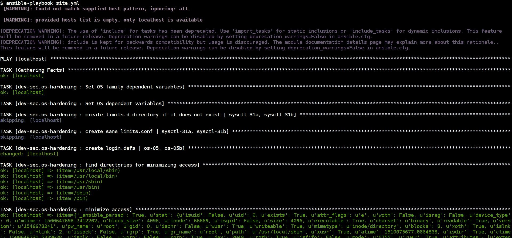

在执行中的 dev-sec.os-hardening 剧本

前面的 playbook 将检测操作系统，并根据不同的指南执行加固步骤。可以通过更新默认变量值来配置此内容。有关 playbook 的更多详细信息，请参阅 [`github.com/dev-sec/ansible-os-hardening`](https://github.com/dev-sec/ansible-os-hardening)。

# 用于 Linux 主机的自动化安全加固的 STIGs Ansible 角色

OpenStack 有一个名为 **ansible-hardening** 的令人敬畏的项目（[`github.com/openstack/ansible-hardening`](https://github.com/openstack/ansible-hardening)），它根据 STIGs 标准应用安全配置更改。有关 Unix/Linux 操作系统的 STIGs 基准的更多详细信息，请访问 [`iase.disa.mil/stigs/os/unix-linux/Pages/index.aspx`](https://iase.disa.mil/stigs/os/unix-linux/Pages/index.aspx)。

它为以下领域执行安全强化：

+   `accounts`: 用户帐户安全控制

+   `aide`: 高级入侵检测环境

+   `auditd`: 审计守护程序

+   `auth`: 认证

+   `file_perms`: 文件系统权限

+   `graphical`: 图形化登录安全控制

+   `kernel`: 内核参数

+   `lsm`: Linux 安全模块

+   `misc`: 杂项安全控制

+   `packages`: 软件包管理器

+   `sshd`: SSH 守护程序

`ansible-hardening` playbook 支持多个 Linux 操作系统

+   CentOS 7

+   Debian jessie

+   Fedora 26

+   openSUSE Leap 42.2 和 42.3

+   Red Hat Enterprise Linux 7

+   SUSE Linux Enterprise 12（实验性）

+   Ubuntu 16.04

有关项目和文档的更多详细信息，请参阅 [`docs.openstack.org/ansible-hardening/latest`](https://docs.openstack.org/ansible-hardening/latest)。

使用 `ansible-galaxy` 从 GitHub 存储库本身下载角色，如下所示：

```
$ ansible-galaxy install git+https://github.com/openstack/ansible-hardening

```

playbook 如下所示。与以前的 playbook 类似，可以通过更改默认变量值来配置它所需的内容：

```
- name: STIGs ansible-hardening for automated security hardening
  hosts: servers
  become: yes
  remote_user: "{{ remote_user_name }}"
  vars:
    remote_user_name: vagrant
    security_ntp_servers:
      - time.nist.gov
      - time.google.com

  roles:
    - ansible-hardening
```

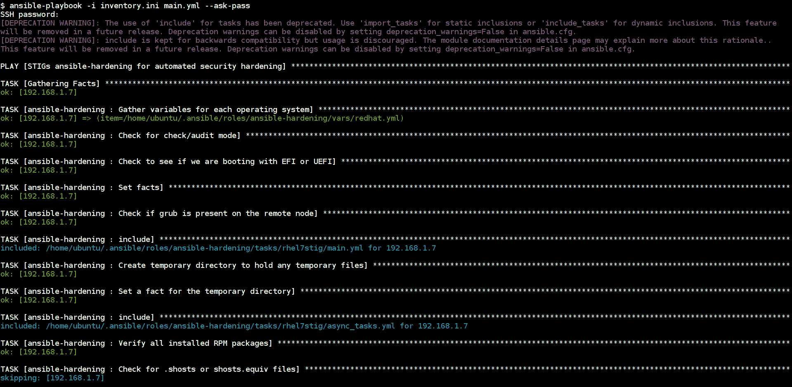

一个在 CentOS-7 上执行的 Ansible-hardening playbook 用于 STIGs checklist

前面的 playbook 在 CentOS-7 服务器上执行，用于执行 STIG checklist。

# 使用 Ansible Tower 进行 OpenSCAP 的持续安全扫描和报告

OpenSCAP 是一组安全工具、策略和标准，通过遵循 SCAP 对系统执行安全合规性检查。SCAP 是由 NIST 维护的美国标准。

SCAP 扫描器应用程序读取 SCAP 安全策略，并检查系统是否符合该策略。它逐个检查策略中定义的所有规则，并报告每个规则是否得到满足。如果所有检查都通过，则系统符合安全策略。

OpenSCAP 按照以下步骤对系统进行扫描：

+   安装 SCAP Workbench 或 OpenSCAP Base（有关更多信息，请访问 [`www.open-scap.org`](https://www.open-scap.org)）

+   选择一个策略

+   调整您的设置

+   评估系统

以下 playbook 将安装 `openscap-scanner` 和 `scap-security-guide` 软件来执行检查。然后，它将根据给定的配置文件和策略使用 `oscap` 工具执行扫描。

正如您所见，变量 `oscap_profile` 是从可用配置文件列表中选择配置文件，`oscap_policy` 是选择用于扫描系统的特定策略：

```
- hosts: all
  become: yes
  vars:
    oscap_profile: xccdf_org.ssgproject.content_profile_pci-dss
    oscap_policy: ssg-rhel7-ds

  tasks:
  - name: install openscap scanner
    package:
      name: "{{ item }}"
      state: latest
    with_items:
    - openscap-scanner
    - scap-security-guide

  - block:
    - name: run openscap
      command: >
        oscap xccdf eval
        --profile {{ oscap_profile }}
        --results-arf /tmp/oscap-arf.xml
        --report /tmp/oscap-report.html
        --fetch-remote-resources
        /usr/share/xml/scap/ssg/content/{{ oscap_policy }}.xml

    always:
    - name: download report
      fetch:
        src: /tmp/oscap-report.html
        dest: ./{{ inventory_hostname }}.html
        flat: yes
```

在[`medium.com/@jackprice/ansible-openscap-for-compliance-automation-14200fe70663`](https://medium.com/@jackprice/ansible-openscap-for-compliance-automation-14200fe70663)查看 playbooks 参考。

现在，我们可以使用此 playbook 使用 Ansible Tower 进行持续自动化检查：

1.  首先，我们需要在 Ansible Tower 服务器上创建一个目录，以便使用 `awx` 用户权限存储此 playbook 以添加自定义 playbook。

1.  在 Ansible Tower 中创建一个新项目，执行 OpenSCAP 设置并针对检查进行扫描：

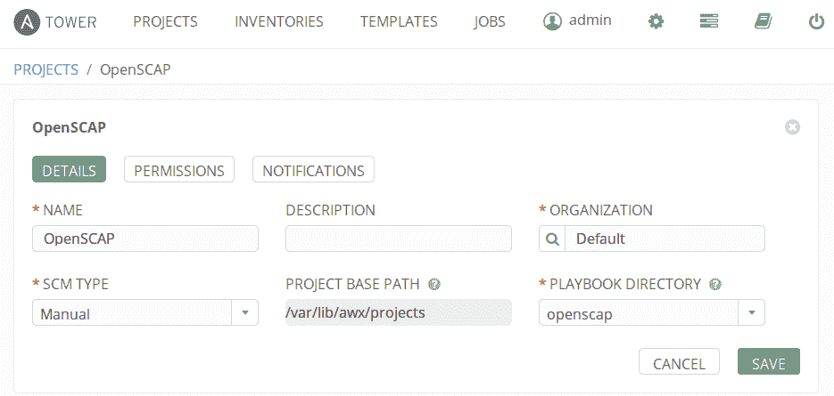

1.  然后，我们必须创建一个新作业来执行此 playbook。在这里，我们可以包含主机列表、登录凭据和执行所需的其他详细信息：

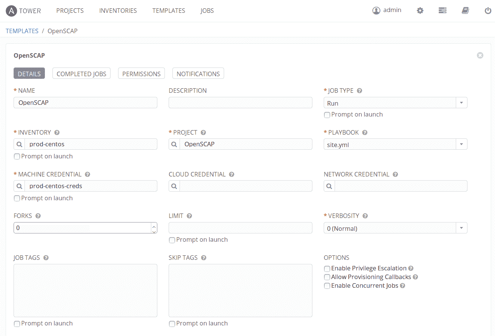

1.  可以定期安排执行此审核。在这里，您可以看到我们每天都安排，这可以根据合规性频率进行修改（安全合规性要求经常执行这些类型的审核）：

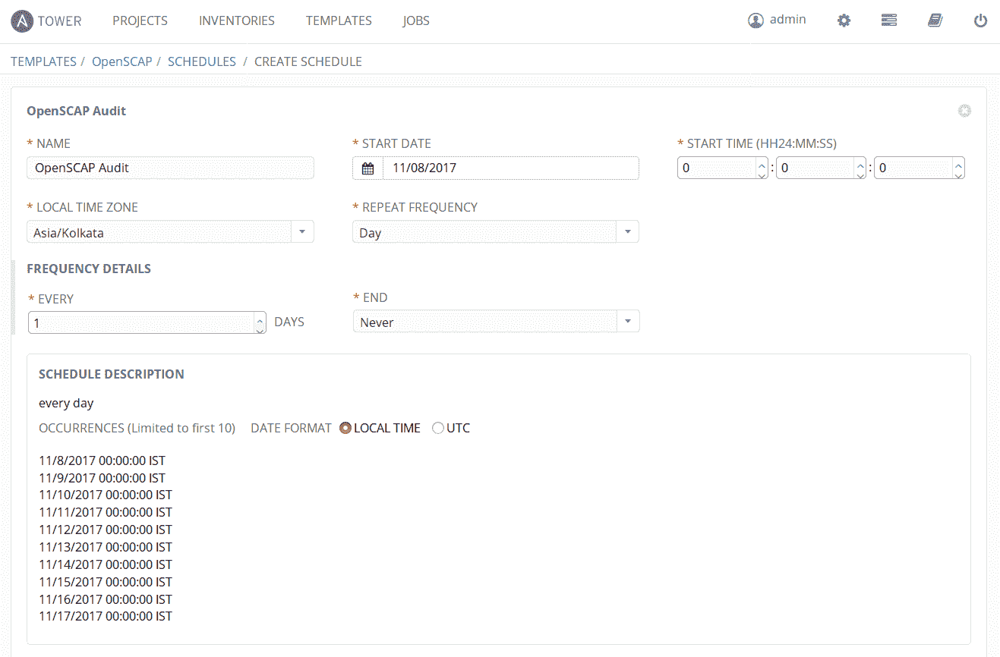

1.  我们也可以根据需要随时启动此作业。playbook 的执行如下所示：

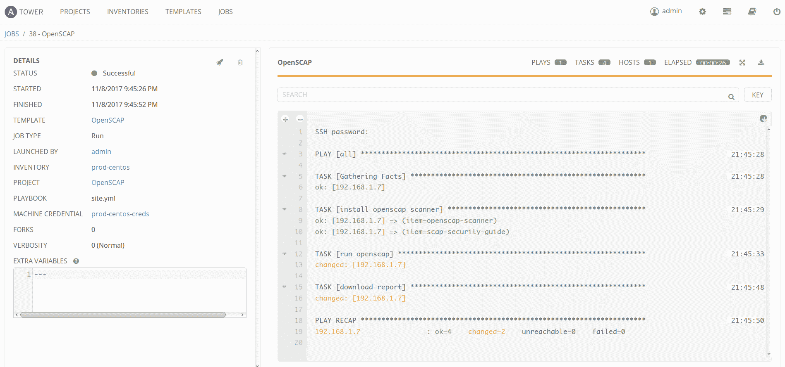

1.  playbook 的输出将生成 OpenSCAP 报告，并将其获取到 Ansible Tower。我们可以在 `/tmp/` 位置访问此 playbook。此外，如果需要，我们还可以将此报告发送到其他集中式报告服务器。

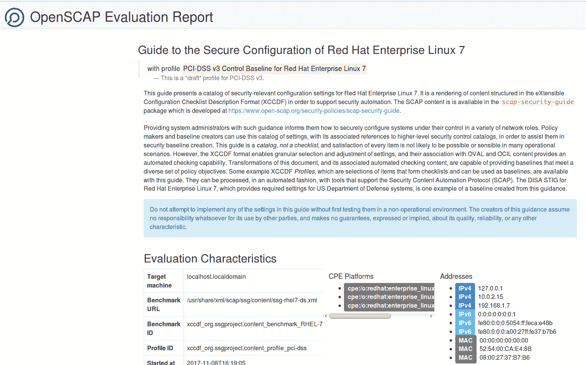

1.  我们还可以根据 playbook 执行结果设置通知。通过这样做，我们可以将此通知发送到相应的渠道，如电子邮件、slack 和消息。

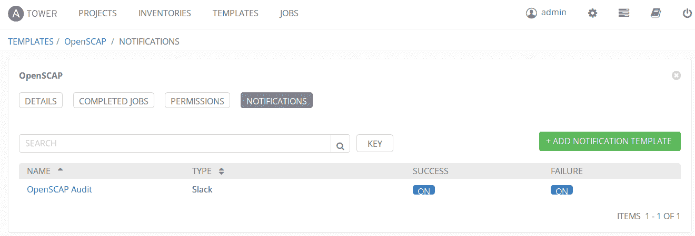

# CIS 基准

CIS 为不同类型的操作系统、软件和服务制定了基准。以下是一些高级分类：

+   桌面和网络浏览器

+   移动设备

+   网络设备

+   安全指标

+   服务器 – 操作系统

+   服务器 – 其他

+   虚拟化平台、云和其他

了解有关 CIS 基准的更多信息，请访问[`www.cisecurity.org`](https://www.cisecurity.org)。

# Ubuntu CIS 基准（服务器级别）

CIS 基准 Ubuntu 提供了为运行在 x86 和 x64 平台上的 Ubuntu Linux 系统建立安全配置姿态的指导方针。此基准适用于系统和应用程序管理员、安全专家、审计员、帮助台和计划开发、部署、评估或保护包含 Linux 平台的解决方案的平台部署人员。

这是 CIS Ubuntu 16.04 LTS 基准的六个高级域的概述:

+   初始设置:

    +   文件系统配置

    +   配置软件更新

    +   文件系统完整性检查

    +   安全引导设置

    +   附加进程强化

    +   强制访问控制

    +   警告横幅

+   服务:

    +   Inted 服务

    +   专用服务

    +   服务客户端

+   网络配置:

    +   网络参数（仅主机）

    +   网络参数（主机和路由器）

    +   IPv6

    +   TCP 包装器

    +   不常见的网络协议

+   日志和审计:

    +   配置系统会计（`auditd`）

    +   配置日志记录

+   访问、身份验证和授权:

    +   配置 cron

    +   SSH 服务器配置

    +   配置 PAM

    +   用户帐户和环境

+   系统维护:

    +   系统文件权限

    +   用户和组设置

这是分别用于 14.04 LTS 和 16.04 LTS 的 Ansible Playbooks:

+   [`github.com/oguya/cis-ubuntu-14-ansible`](https://github.com/oguya/cis-ubuntu-14-ansible)

+   [`github.com/grupoversia/cis-ubuntu-ansible`](https://github.com/grupoversia/cis-ubuntu-ansible)

```
$ git clone https://github.com/oguya/cis-ubuntu-14-ansible.git
$ cd cis-ubuntu-14-ansible
```

然后，更新变量和清单，并使用以下命令执行 playbook。除非我们想要根据组织自定义基准，否则大多数情况下不需要变量：

```
$ ansible-playbook -i inventory cis.yml
```

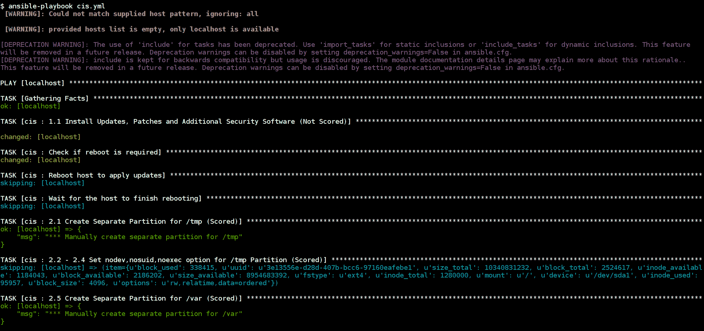

CIS Ubuntu 基准 Ansible playbook 执行

前述 playbook 将针对 Ubuntu 服务器执行 CIS 安全基准，并执行 CIS 指南中列出的所有检查。

# AWS 基准（云提供商级别）

AWS CIS 基准提供了针对 AWS 子集的安全选项配置的指导方针，重点是基础、可测试和与架构无关的设置。适用于计划在 AWS 中开发、部署、评估或保护解决方案的系统和应用程序管理员、安全专家、审计员、帮助台、平台部署和/或 DevOps 人员。

这是 AWS CIS 基准的高级域:

+   身份和访问管理

+   日志记录

+   监控

+   网络

+   额外

目前，有一个名为**prowler**的工具（[`github.com/Alfresco/prowler`](https://github.com/Alfresco/prowler)），它基于 AWS-CLI 命令用于 AWS 帐户安全评估和加固。

这些工具遵循 CIS Amazon Web Services Foundations Benchmark 1.1 的准则

在运行 playbook 之前，我们必须提供 AWS API 密钥以执行安全审核。这可以使用 AWS 服务中的 IAM 角色创建。如果您已经有一个具有所需权限的现有帐户，则可以跳过这些步骤：

1.  在您的 AWS 帐户中创建一个具有编程访问权限的新用户:

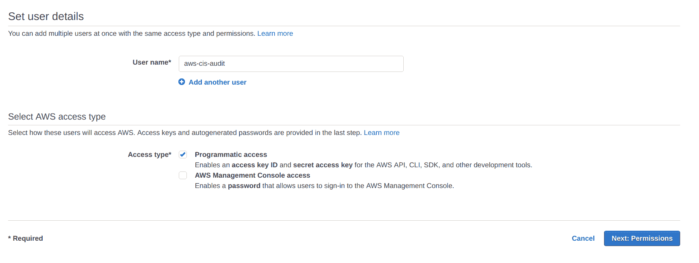

1.  为用户从 IAM 控制台中的现有策略应用 SecurityAudit 策略：

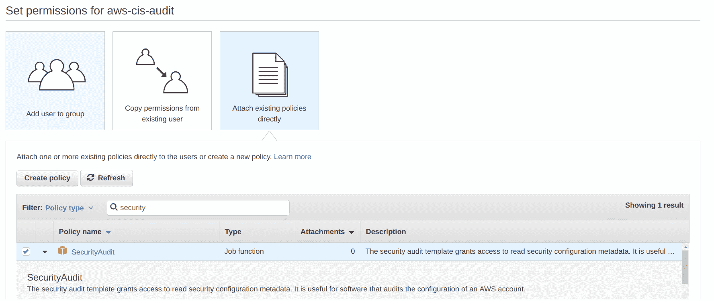

1.  然后，按照步骤创建新用户。确保安全保存访问密钥 ID 和秘密访问密钥以供以后使用：

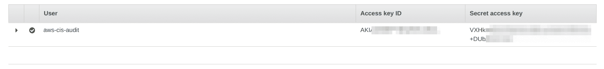

1.  这是使用 prowler 工具设置和执行检查的简单 playbook。从前面的步骤提供访问密钥和秘密密钥。

1.  以下 playbook 假定您已经在本地系统中安装了`python`和`pip`：

```
        - name: AWS CIS Benchmarks playbook
          hosts: localhost
          become: yes
          vars:
            aws_access_key: XXXXXXXX
            aws_secret_key: XXXXXXXX

          tasks:
            - name: installing aws cli and ansi2html
              pip:
                name: "{{ item }}"

            with_items:
              - awscli
              - ansi2html

            - name: downloading and setting up prowler
              get_url:
                url:         https://raw.githubusercontent.com/Alfresco/prowler/master
        /prowler
                dest: /usr/bin/prowler
                mode: 0755

            - name: running prowler full scan
              shell: "prowler | ansi2html -la > ./aws-cis-report-{{         ansible_date_time.epoch }}.html"
              environment:
                AWS_ACCESS_KEY_ID: "{{ aws_access_key }}"
                AWS_SECRET_ACCESS_KEY: "{{ aws_secret_key }}"

            - name: AWS CIS Benchmarks report downloaded
              debug:
                msg: "Report can be found at ./aws-cis-report-{{         ansible_date_time.epoch }}.html"
```

1.  该 playbook 将使用 prowler 工具触发 AWS CIS 基准的设置和安全审计扫描：

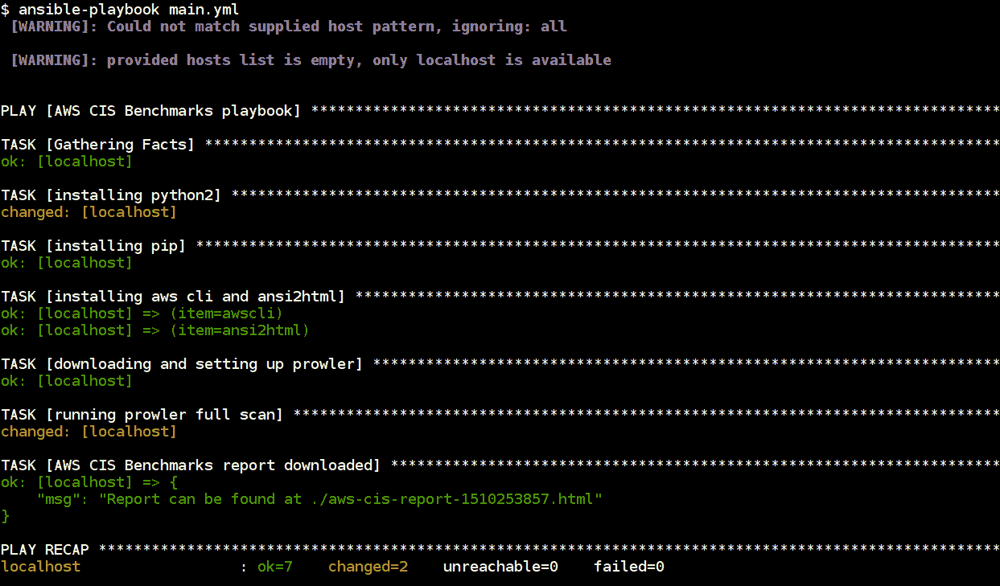

1.  Prowler 生成的 HTML 报告如下，报告可以按需下载为不同格式，并且扫描检查可以根据需要配置：

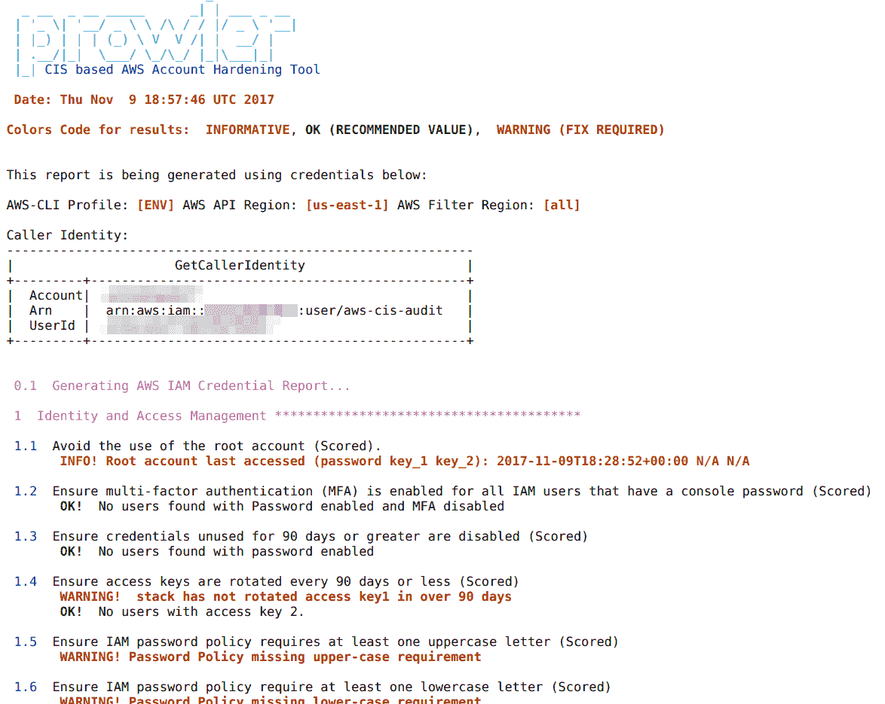

有关该工具的更多参考资料可以在[`github.com/Alfresco/prowler`](https://github.com/Alfresco/prowler)找到。

# Lynis - 用于 Unix/Linux 系统的开源安全审计工具

Lynis 是一个开源安全审计工具。被系统管理员、安全专业人员和审计员使用，评估他们的 Linux 和基于 Unix 的系统的安全防御。它在主机上运行，因此执行的安全扫描比漏洞扫描器更加广泛。

支持的操作系统：Lynis 几乎可以在所有基于 Unix 的系统和版本上运行，包括以下系统：

+   AIX

+   FreeBSD

+   HP-UX

+   Linux

+   macOS

+   NetBSD

+   OpenBSD

+   Solaris 和其他系统

如[`cisofy.com/lynis`](https://cisofy.com/lynis)所述：

"甚至可以在像树莓派或 QNAP 存储设备等系统上运行。"

该 playbook 如下所示：

```
- name: Lynis security audit playbook
  hosts: lynis
  remote_user: ubuntu
  become: yes
  vars:
    # refer to https://packages.cisofy.com/community
    code_name: xenial

  tasks:
    - name: adding lynis repo key
      apt_key:
        keyserver: keyserver.ubuntu.com
        id: C80E383C3DE9F082E01391A0366C67DE91CA5D5F
        state: present

    - name: installing apt-transport-https
      apt:
        name: apt-transport-https
        state: present

    - name: adding repo
      apt_repository:
        repo: "deb https://packages.cisofy.com/community/lynis/deb/ {{ code_name }} main"
        state: present
        filename: "cisofy-lynis"

    - name: installing lynis
      apt:
        name: lynis
        update_cache: yes
        state: present

    - name: audit scan the system
      shell: lynis audit system > /tmp/lynis-output.log

    - name: downloading report locally
      fetch:
        src: /tmp/lynis-output.log
        dest: ./{{ inventory_hostname }}-lynis-report-{{ ansible_date_time.date }}.log
        flat: yes

    - name: report location
      debug:
        msg: "Report can be found at ./{{ inventory_hostname }}-lynis-report-{{ ansible_date_time.date }}.log"
```

上述 playbook 将设置 Lynis，对其进行系统审计扫描，最后在本地获取报告：

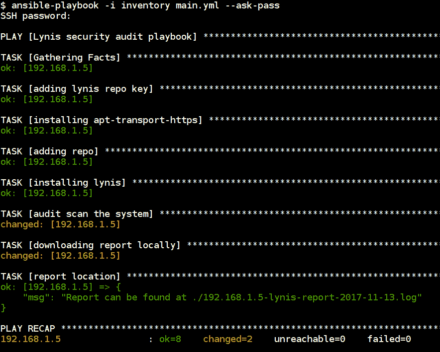

Lynis 系统审计扫描 playbook 正在执行

以下屏幕截图是最近审计扫描的报告：

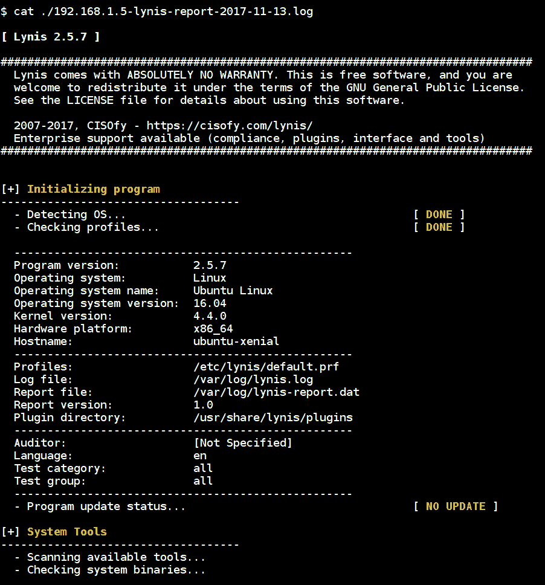

Lynis 系统审计扫描报告

可以通过 Ansible Tower 和其他自动化工具运行此项，以执行使用 Lynis 进行审计扫描的系统的周期性检查。

# Lynis 命令和高级选项

Lynis 具有多个选项和命令，可用于执行不同的选项。例如，我们可以使用`audit dockerfile <filename>`来执行 Dockerfiles 的分析，使用`--pentest`选项来执行与渗透测试相关的扫描。

>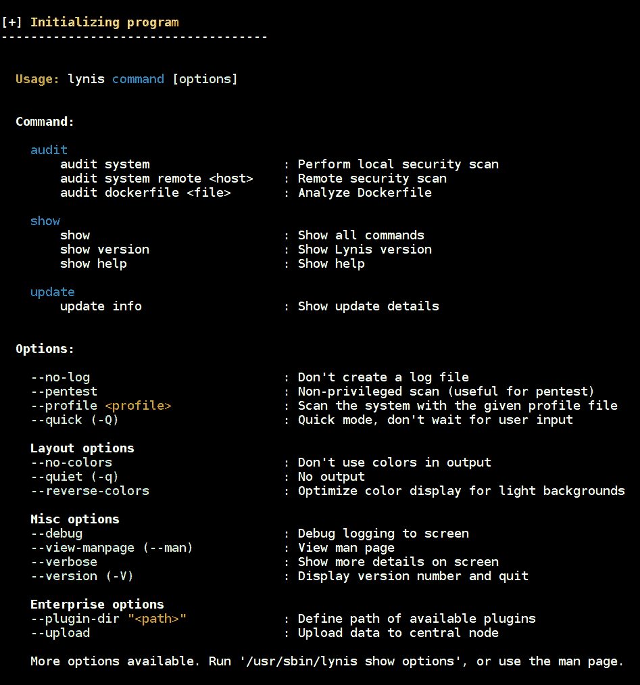

# 使用 Ansible playbooks 进行 Windows 服务器审计

大多数企业使用 Windows 通过 Active Directory 类型的功能集中管理其政策和更新，这也是保护组织并检查安全问题的非常关键的资产。我们知道 Ansible 支持使用 WinRM 执行配置更改的 Windows 操作系统。让我们看一些示例，通过 Ansible playbooks 为您的 Windows 服务器添加安全性。

# Windows 安全更新 playbook

下面的 playbook 是从 Ansible 文档中简单引用的参考，网址为 [`docs.ansible.com/ansible/devel/windows_usage.html#installing-updates`](https://docs.ansible.com/ansible/devel/windows_usage.html#installing-updates)：

```
- name: Windows Security Updates
  hosts: winblows

  tasks:
    - name: install all critical and security updates
      win_updates:
        category_names:
        - CriticalUpdates
        - SecurityUpdates
        state: installed
      register: update_result

    - name: reboot host if required
      win_reboot:
      when: update_result.reboot_required
```

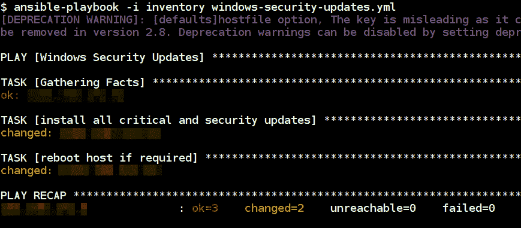

Windows 更新 playbook 正在运行

前面的 playbook 将自动执行临界严重性的 Windows 安全更新，并在需要时重新启动计算机以应用更新后的更改。

# Windows 工作站和服务器审计

下面的 Ansible playbook 是基于 [`github.com/alanrenouf/Windows-Workstation-and-Server-Audit,`](https://github.com/alanrenouf/Windows-Workstation-and-Server-Audit) 创建的，它将对系统进行审计并生成详细的 HTML 报告。这是一个我们可以使用 PowerShell 脚本执行审计的示例。可以通过添加更多检查和其他安全审计脚本来扩展此功能。

Playbook 如下所示：

```
- name: Windows Audit Playbook
  hosts: winblows

  tasks:
    - name: download audit script
      win_get_url:
        url: https://raw.githubusercontent.com/alanrenouf/Windows-Workstation-and-Server-Audit/master/Audit.ps1
        dest: C:\Audit.ps1

    - name: running windows audit script
      win_shell: C:\Audit.ps1
      args:
        chdir: C:\
```

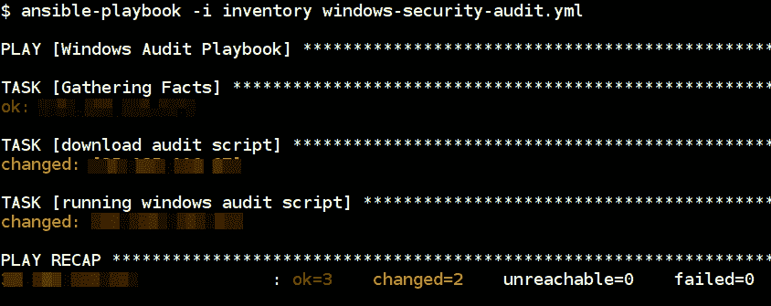

Windows 审计 playbook 正在运

一旦 playbook 执行完成，我们可以在 HTML 格式的输出报告中看到有关运行服务、安全补丁、事件、日志记录和其他配置详细信息。

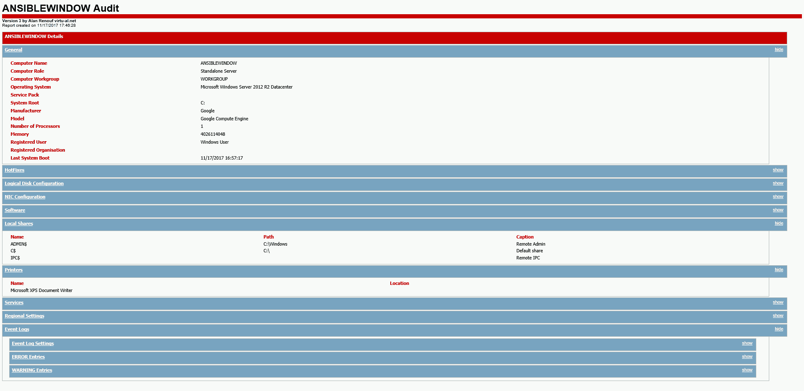

# 使用 Ansible 自动化进行网络设备的安全审计检查

我们已经看到 Ansible 很适合与各种工具一起使用，我们可以利用它来进行网络设备的安全审计检查。

# Nmap 扫描和 NSE

**网络映射器**（**Nmap**）是一个免费的开源软件，用于进行网络发现、扫描、审计等。它具有各种功能，如操作系统检测、系统指纹识别、防火墙检测等。**Nmap 脚本引擎**（**Nmap NSE**）提供了高级功能，如扫描特定的漏洞和攻击。我们还可以编写和扩展自己的自定义脚本来使用 Nmap。Nmap 是渗透测试人员（安全测试人员）和网络安全团队的瑞士军刀。

在 [`nmap.org`](https://nmap.org) 上了解更多关于 Nmap 的信息。Ansible 还有一个模块可以使用 Nmap 执行清单 [`github.com/ansible/ansible/pull/32857/files`](https://github.com/ansible/ansible/pull/32857/files)。

下面的 playbook 将在必要时安装 Nmap 并使用指定的标志执行基本网络端口扫描：

```
- name: Basic NMAP Scan Playbook
  hosts: localhost
  gather_facts: false
  vars:
    top_ports: 1000
    network_hosts:
      - 192.168.1.1
      - scanme.nmap.org
      - 127.0.0.1
      - 192.168.11.0/24

  tasks:
    - name: check if nmap installed and install
      apt:
        name: nmap
        update_cache: yes
        state: present
      become: yes

    - name: top ports scan
      shell: "nmap --top-ports {{ top_ports }} -Pn -oA nmap-scan-%Y-%m-%d {{ network_hosts|join(' ') }}"
```

+   `{{ network_hosts|join(' ') }}` 是一个名为 **filter arguments** 的 Jinja2 功能，用于通过空格分隔解析给定的 `network_hosts`

+   `network_hosts` 变量保存要使用 Nmap 扫描的 IP 列表、网络范围（CIDR）、主机等。

+   `top_ports` 是一个范围从 `0` 到 `65535` 的数字。Nmap 默认选择常见的顶级端口

+   `-Pn` 指定如果 ping（ICMP）不起作用，则扫描主机

+   `-oA` 将输出格式设置为所有格式，其中包括 gnmap（可 greppable 格式）、Nmap 和 XML

+   更多关于 nmap 的选项和文档信息可以在[`nmap.org/book/man.html`](https://nmap.org/book/man.html)找到。

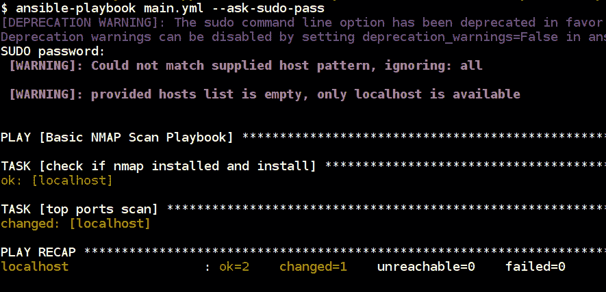

Nmap 基本端口扫描 playbook 执行

运行基本 Nmap 扫描的 playbook 的输出为：

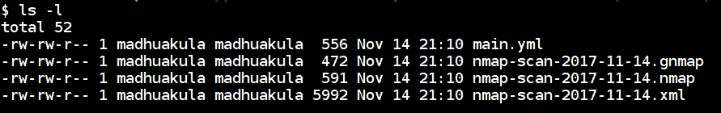

图：playbook 以三种不同的格式进行扫描输出

执行 playbook 后，生成了 Nmap 支持的三种格式的报告：

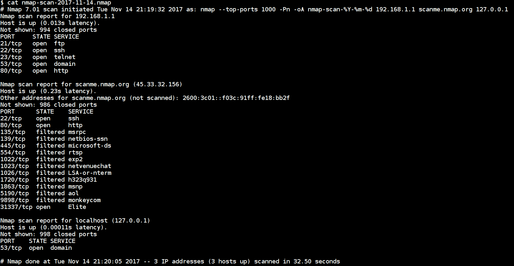

图：nmap 格式的 playbook 扫描输出

通过查看`.nmap`文件的输出，我们可以轻松地看到 Nmap 扫描发现了什么。

# Nmap NSE 扫描 playbook

以下 playbook 将使用 Nmap 脚本执行对常用 Web 应用和服务器使用的目录进行枚举，并使用 Nmap 脚本查找 HTTP 服务器支持的选项。

更多关于 Nmap NSE 的信息可以在[`nmap.org/book/nse.html`](https://nmap.org/book/nse.html)找到。

以下的 playbook 将对`scanme.nmap.org`的端口`80`和`443`进行`http-enum`和`http-methods`扫描：

```
- name: Advanced NMAP Scan using NSE
  hosts: localhost
  vars:
    ports:
      - 80
      - 443
    scan_host: scanme.nmap.org 

  tasks:
    - name: Running Nmap NSE scan
      shell: "nmap -Pn -p {{ ports|join(',') }} --script {{ item }} -oA nmap-{{ item }}-results-%Y-%m-%d {{ scan_host }}"

      with_items:
        - http-methods
        - http-enum
```

以下的 playbook 将使用 Ansible playbook 执行 Nmap NSE 脚本进行 HTTP 枚举和方法检查：

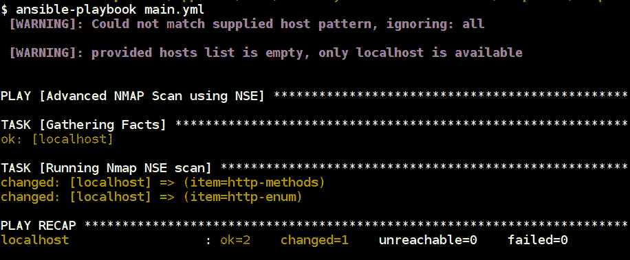

执行 Nmap NSE playbook

运行简单的 NSE 脚本时，playbook 的输出如下所示：

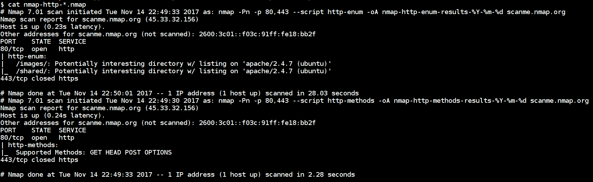

Nmap NSE 扫描的.nmap 格式输出

`http-enum`脚本在检测到网络端口上有 Web 服务器时会运行额外的测试。在前面的截图中，我们可以看到脚本发现了两个文件夹，并且还枚举了所有支持的 HTTP 方法。

# 使用 Scout2 进行 AWS 安全审计

Scout2 是一款开源的 AWS 安全审计工具，它使用 AWS Python API 来评估 AWS 环境的安全状况。扫描输出将以 JSON 格式存储，并且 Scout2 的最终结果将以简单的 HTML 网站的形式呈现，其中包含了关于 AWS 云安全状况的详细信息。它根据现有的规则集和测试用例执行扫描和审核，并且可以根据我们的自定义脚本和场景进行扩展。

更多关于该工具的详细信息可以在[`github.com/nccgroup/Scout2`](https://github.com/nccgroup/Scout2)找到。此工具需要 AWS IAM 凭证来执行扫描；请参考[`github.com/nccgroup/AWS-recipes/blob/master/IAM-Policies/Scout2-Default.json`](https://github.com/nccgroup/AWS-recipes/blob/master/IAM-Policies/Scout2-Default.json)以创建用户策略。

使用以下 playbook 安装 AWS Scout2 非常简单：

```
- name: AWS Security Audit using Scout2
  hosts: localhost
  become: yes

  tasks:
    - name: installing python and pip
      apt:
        name: "{{ item }}"
        state: present
        update_cache: yes

      with_items:
        - python
        - python-pip

    - name: install aws scout2
      pip:
        name: awsscout2
```

配置了多个规则来进行审核，以下代码片段是 IAM 密码策略规则的示例：

```
# https://raw.githubusercontent.com/nccgroup/Scout2/master/tests/data/rule-configs/iam-password-policy.json
{
    "aws_account_id": "123456789012",
    "services": {
        "iam": {
            "password_policy": {
                "ExpirePasswords": false,
                "MinimumPasswordLength": "1",
                "PasswordReusePrevention": false,
                "RequireLowercaseCharacters": false,
                "RequireNumbers": false,
                "RequireSymbols": false,
                "RequireUppercaseCharacters": false
            }
        }
    }
}
```

以下的 playbook 会执行 AWS Scout2 扫描，并以 HTML 格式返回报告：

```
- name: AWS Security Audit using Scout2
  hosts: localhost
  vars:
    aws_access_key: XXXXXXXX
    aws_secret_key: XXXXXXXX

  tasks:
    - name: running scout2 scan
      # If you are performing from less memory system add --thread-config 1 to below command
      command: "Scout2"
      environment:
        AWS_ACCESS_KEY_ID: "{{ aws_access_key }}"
        AWS_SECRET_ACCESS_KEY: "{{ aws_secret_key }}"

    - name: AWS Scout2 report downloaded
      debug:
        msg: "Report can be found at ./report.html"
```

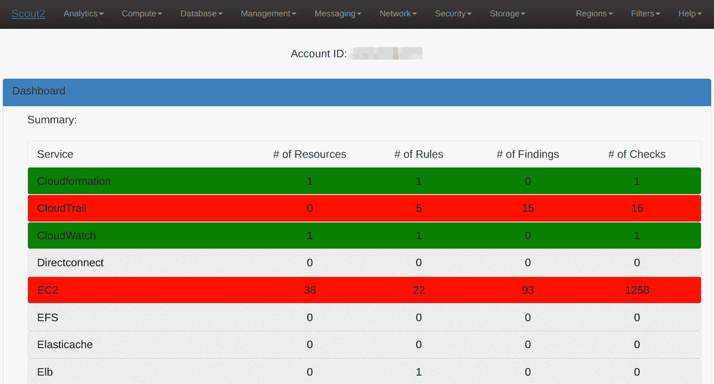

AWS Scout2 报告高级概览

上述屏幕截图是高级报告，详细报告如下：

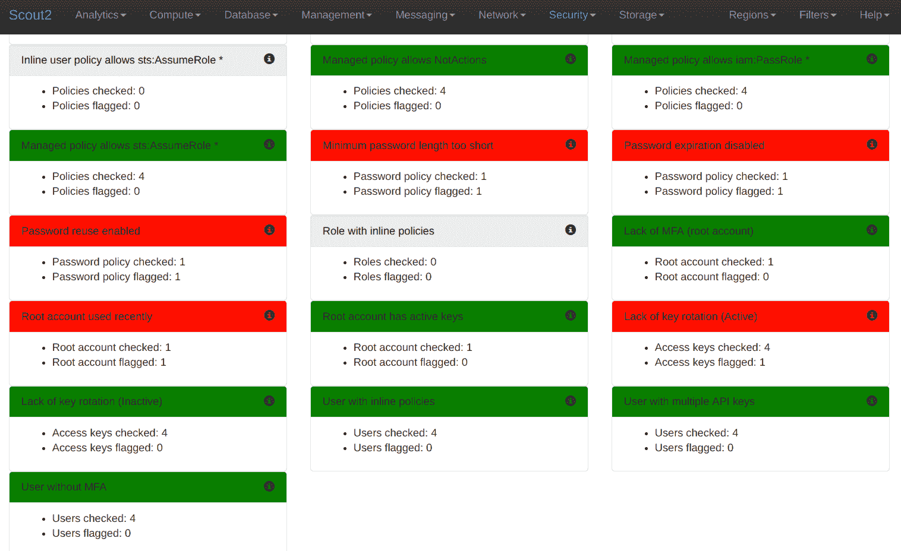

AWS Scout2 报告 IAM 部分的详细结果

# 使用 Ansible 对应用程序进行自动化安全审计检查

现代应用程序很快就会变得非常复杂。拥有运行自动化执行安全任务的能力几乎是一个强制性要求。

我们可以进行的不同类型的应用程序安全扫描包括以下内容：

1.  对源代码运行 CI/CD 扫描（例如，RIPS 和 brakeman）。

1.  依赖项检查扫描器（例如，OWASP 依赖项检查器和 snyk.io ([`snyk.io/`](https://snyk.io/))）。

1.  一旦部署，然后运行 Web 应用程序扫描器（例如，Nikto、Arachni 和 w3af）。

1.  针对特定框架的安全扫描器（例如，WPScan 和 Droopscan）以及许多其他。

# 源代码分析扫描器

这是在应用程序即将投入生产时最早和常见的减少安全风险的方式之一。源代码分析扫描器，也称为**静态应用程序安全测试**（**SAST**），将通过分析应用程序的源代码来帮助发现安全问题。这种工具和测试方法允许开发人员在**持续集成/持续交付**（**CI/CD**）的过程中反复自动地扫描其代码以查找安全漏洞。

我们可以引入这些工具的多个阶段来有效地识别安全漏洞，比如与 IDE 集成（诸如 Eclipse、Visual Studio Code 等代码编辑器）以及与 CI/CD 过程工具集成（Jenkins、Travis CI 等）。

源代码分析是一种白盒测试，它查看代码。这种测试方法可能无法发现 100% 的安全漏洞覆盖率，而且还需要手动测试。例如，要找到逻辑漏洞，需要某种用户交互，如动态功能。

在市场上有许多开源和商业工具可用于执行静态代码分析。此外，一些工具是针对您使用的技术和框架的。例如，如果您正在扫描 PHP 代码，则使用 RIPS ([`rips-scanner.sourceforge.net/`](http://rips-scanner.sourceforge.net/))；如果是 Ruby on Rails 代码，则使用 Brakeman ([`brakemanscanner.org/`](https://brakemanscanner.org/))；如果是 Python，则使用 Bandit ([`wiki.openstack.org/wiki/Security/Projects/Bandit`](https://wiki.openstack.org/wiki/Security/Projects/Bandit))；依此类推。

更多参考，请访问 [`www.owasp.org/index.php/Source_Code_Analysis_Tools`](https://www.owasp.org/index.php/Source_Code_Analysis_Tools)。

# Brakeman 扫描器 - Rails 安全扫描器

Brakeman 是一个开源工具，用于对 Ruby on Rails 应用程序进行静态安全分析。 这可以应用于开发和部署流程的任何阶段，包括分期、QA、生产等。

用于执行 Brakeman 对我们应用程序的简单 playbook 如下：

```
- name: Brakeman Scanning Playbook
  hosts: scanner
  remote_user: ubuntu
  become: yes
  gather_facts: false
  vars:
    repo_url: https://github.com/OWASP/railsgoat.git
    output_dir: /tmp/railsgoat/
    report_name: report.html

  tasks:
    - name: installing ruby and git
      apt:
        name: "{{ item }}"
        update_cache: yes
        state: present

      with_items:
        - ruby-full
        - git

    - name: installing brakeman gem
      gem:
        name: brakeman
        state: present

    - name: cloning the {{ repo_url }}
      git:
        repo: "{{ repo_url }}"
        dest: "{{ output_dir }}"

    - name: Brakeman scanning in action
      # Output available in text, html, tabs, json, markdown and csv formats
      command: "brakeman -p {{ output_dir }} -o {{ output_dir }}report.html"
      # Error handling for brakeman output
      failed_when: result.rc != 3
      register: result

    - name: Downloading the report
      fetch:
        src: "{{ output_dir }}/report.html"
        dest: "{{ report_name }}"
        flat: yes

    - debug:
        msg: "Report can be found at {{ report_name }}"
```

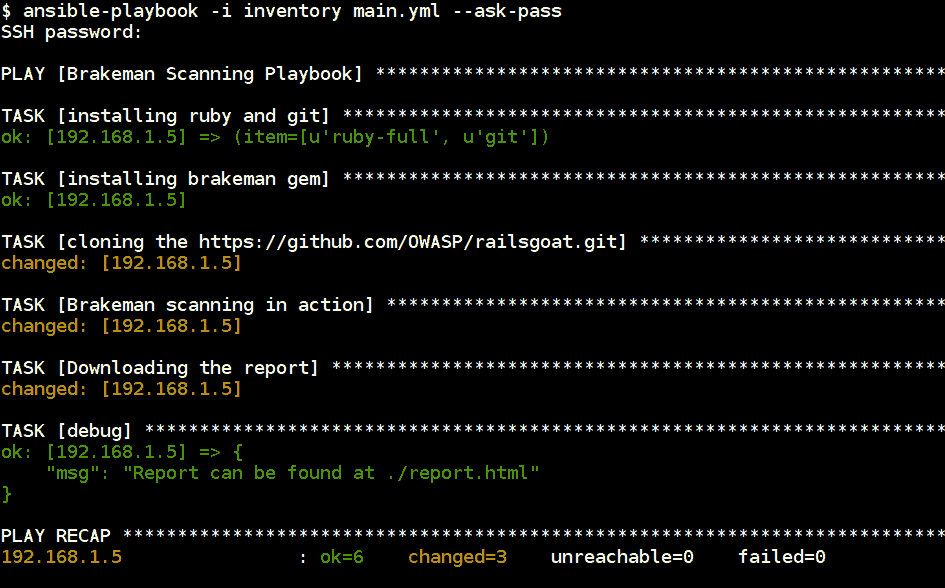

Brakeman Playbook 在 Rails goat 项目中的操作

Brakeman 报告的概述是：

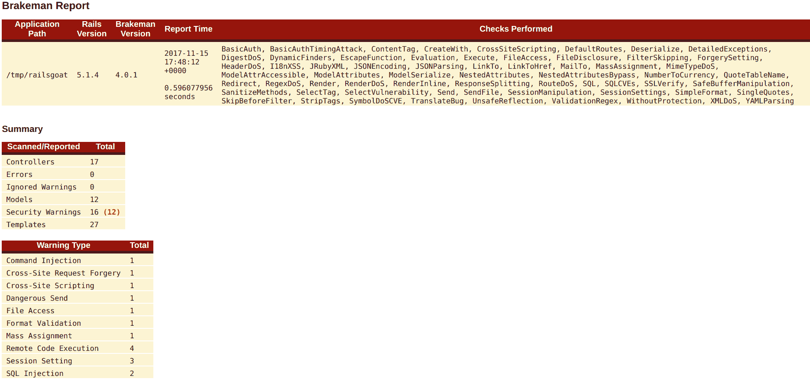

Brakeman 报告的高级概述

这是 Brakeman 报告的详细情况：

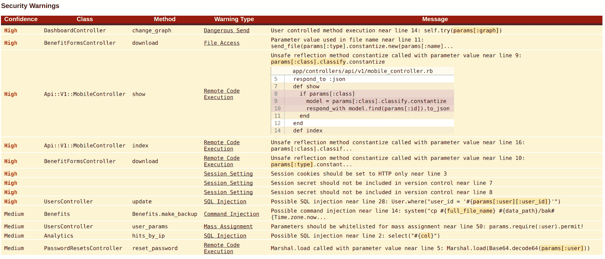

这是一个包含代码和问题级别的详细报告。

有关 Brakeman 工具和选项的参考信息可在 [`brakemanscanner.org`](https://brakemanscanner.org) 找到。

# 依赖检查扫描器

大多数开发人员在开发应用程序时使用第三方库，使用开源插件和模块在其代码中非常常见。 许多开源项目可能容易受到已知攻击的影响，如跨站脚本和 SQL 注入。 如果开发人员不知道所使用库中存在的漏洞，那么他们的整个应用程序就会因为使用了糟糕的库而变得容易受到攻击。

因此，依赖性检查将允许我们通过扫描库来查找应用程序代码中存在的已知漏洞（OWASP A9）问题，并与 CVE 和 NIST 漏洞数据库进行比较。

市场上有多个项目可用于执行这些检查，其中一些包括以下内容：

+   OWASP Dependency-Check

+   Snyk.io ([`snyk.io/`](https://snyk.io/))

+   Retire.js

+   [:] SourceClear 以及许多其他

# OWASP Dependency-Check

OWASP Dependency-Check 是一个开源工具，主要用于检查 Java 和 .NET 应用程序中已知的漏洞。 它还支持其他平台，如 Node.js 和 Python 作为实验分析器。 这也可能产生误报，并可以根据需要进行配置以调整扫描。

这个工具也可以以多种方式运行，比如 CLI、构建工具（Ant、Gradle、Maven 等）和 CI/CD（Jenkins）流程。

有关项目的更多详细信息，请访问 [`www.owasp.org/index.php/OWASP_Dependency_Check`](https://www.owasp.org/index.php/OWASP_Dependency_Check)。

以下代码片段用于在易受攻击的 Java 项目上设置和使用 OWASP Dependency-Check 工具进行扫描：

```
- name: OWASP Dependency Check Playbook
  hosts: scanner
  remote_user: ubuntu
  become: yes
  vars:
    repo_url: https://github.com/psiinon/bodgeit.git
    output_dir: /tmp/bodgeit/
    project_name: bodgeit
    report_name: report.html

  tasks:
    - name: installing pre requisuites
      apt:
        name: "{{ item }}"
        state: present
        update_cache: yes

      with_items:
        - git
        - unzip
        - mono-runtime
        - mono-devel
        - default-jre

    - name: downloading owasp dependency-check
      unarchive:
        src: http://dl.bintray.com/jeremy-long/owasp/dependency-check-3.0.2-release.zip
        dest: /usr/share/
        remote_src: yes

    - name: adding symlink to the system
      file:
        src: /usr/share/dependency-check/bin/dependency-check.sh
        dest: /usr/bin/dependency-check
        mode: 0755
        state: link

    - name: cloning the {{ repo_url }}
      git:
        repo: "{{ repo_url }}"
        dest: "{{ output_dir }}"

    - name: updating CVE database
      command: "dependency-check --updateonly"

    - name: OWASP dependency-check scanning in action
      # Output available in XML, HTML, CSV, JSON, VULN, ALL formats
      command: "dependency-check --project {{ project_name }} --scan {{ output_dir }} -o {{ output_dir }}{{ project_name }}-report.html"

    - name: Downloading the report
      fetch:
        src: "{{ output_dir }}{{ project_name }}-report.html"
        dest: "{{ report_name }}"
        flat: yes

    - debug:
        msg: "Report can be found at {{ report_name }}" 
```

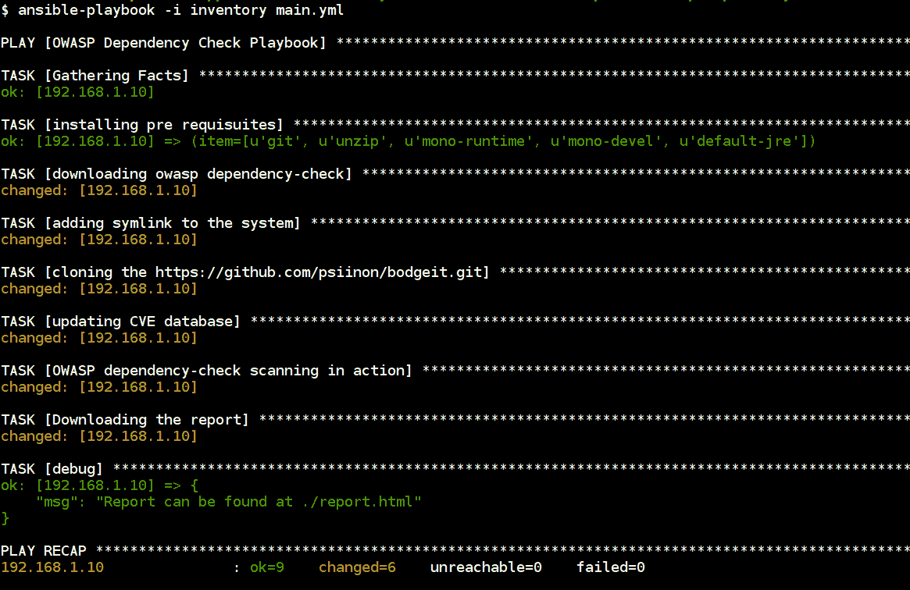

使用 Ansible playbook 对 Bodgeit 项目执行 OWASP Dependency-Check 扫描

高级 OWASP Dependency-Check 报告：

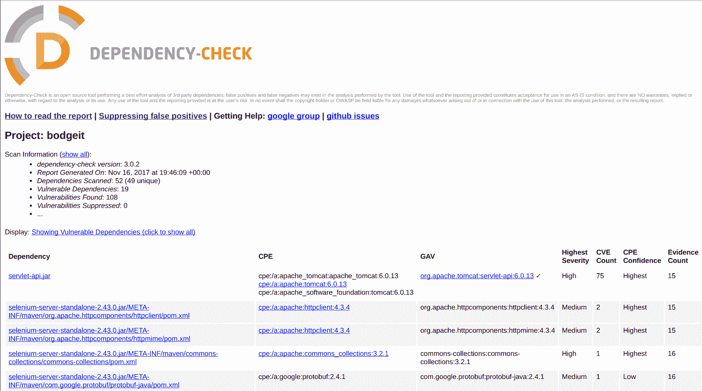

OWASP Dependency-Check 工具的高级报告

这是一个包含漏洞、修复措施和参考资料的详细报告：

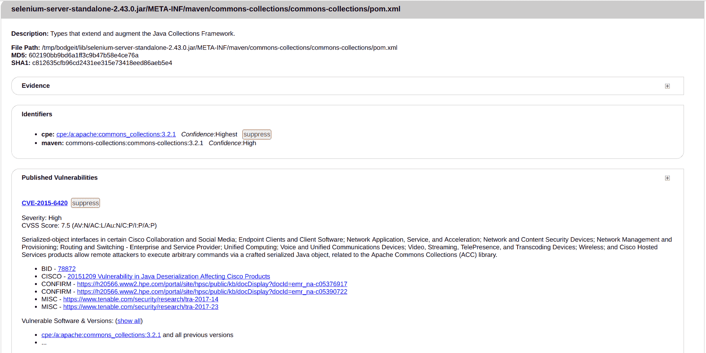

包含漏洞、修复措施和参考资料的详细报告

高级报告格式如下：

+   **依赖项**：扫描的依赖项的文件名

+   **CPE**：发现的任何通用平台枚举标识符

+   **GAV**: Maven 组、Artifact 和版本（GAV）

+   **最高严重性**：任何相关 CVE 的最高严重性

+   **CVE 数量**：相关 CVE 的数量

+   **CPE 确信度**：Dependency-check 确定已正确识别 CPE 的可信度排名

+   **证据数量**：从用于识别 CPE 的依赖项中提取的数据量

可以在[`jeremylong.github.io/DependencyCheck`](https://jeremylong.github.io/DependencyCheck)找到更详细的文档。

# 运行 Web 应用程序安全扫描器

这是应用程序上线到 QA、阶段（或）生产环境的阶段。然后，我们希望像攻击者一样执行安全扫描（黑盒视图）。在此阶段，应用程序将应用所有动态功能和服务器配置。

这些扫描器的结果告诉我们服务器配置得有多好以及在将复制品发布到生产环境之前是否存在任何其他应用程序安全问题。

在这个阶段，大多数扫描器只能在某个特定水平上工作。我们需要通过人脑进行一些手动测试，以发现逻辑漏洞和其他安全漏洞，这些漏洞无法被安全扫描器和工具检测到。

正如我们在其他部分中所看到的，市场上有许多工具可以代替您执行这些工作，无论是开源还是商业。其中一些包括以下内容：

+   Nikto

+   Arachni

+   w3af

+   Acunetix 和许多其他工具

# Nikto - web 服务器扫描器

Nikto 是一个用 Perl 编写的开源 Web 服务器评估工具，用于执行安全配置检查和 Web 服务器和应用程序扫描，使用其要扫描的条目清单。

Nikto 进行的一些检查包括以下内容：

+   服务器和软件配置错误

+   默认文件和程序

+   不安全的文件和程序

+   过时的服务器和程序

Nikto 设置和执行 Ansible playbook 如下所示：

```
- name: Nikto Playbook
  hosts: scanner
  remote_user: ubuntu
  become: yes
  vars:
    domain_name: idontexistdomainnamewebsite.com # Add the domain to scan
    report_name: report.html

  tasks:
    - name: installing pre requisuites
      apt:
        name: "{{ item }}"
        state: present
        update_cache: yes

      with_items:
        - git
        - perl
        - libnet-ssleay-perl
        - openssl
        - libauthen-pam-perl
        - libio-pty-perl
        - libmd-dev

    - name: downloading nikto
      git:
        repo: https://github.com/sullo/nikto.git
        dest: /usr/share/nikto/

    - name: Nikto scanning in action
      # Output available in csv, html, msf+, nbe, txt, xml formats
      command: "/usr/share/nikto/program/nikto.pl -h {{ domain_name }} -o /tmp/{{ domain_name }}-report.html"

    - name: downloading the report
      fetch:
        src: "/tmp/{{ domain_name }}-report.html"
        dest: "{{ report_name }}"
        flat: yes

    - debug:
        msg: "Report can be found at {{ report_name }}"
```

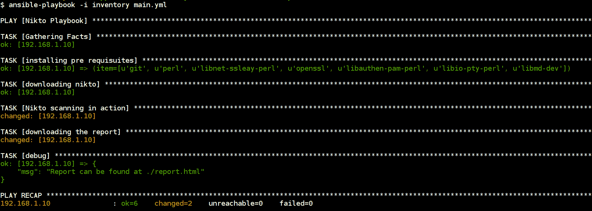

Nikto Playbook 实例

用于下载、安装和运行带有报告输出的 Nikto 的 Playbook 如下：

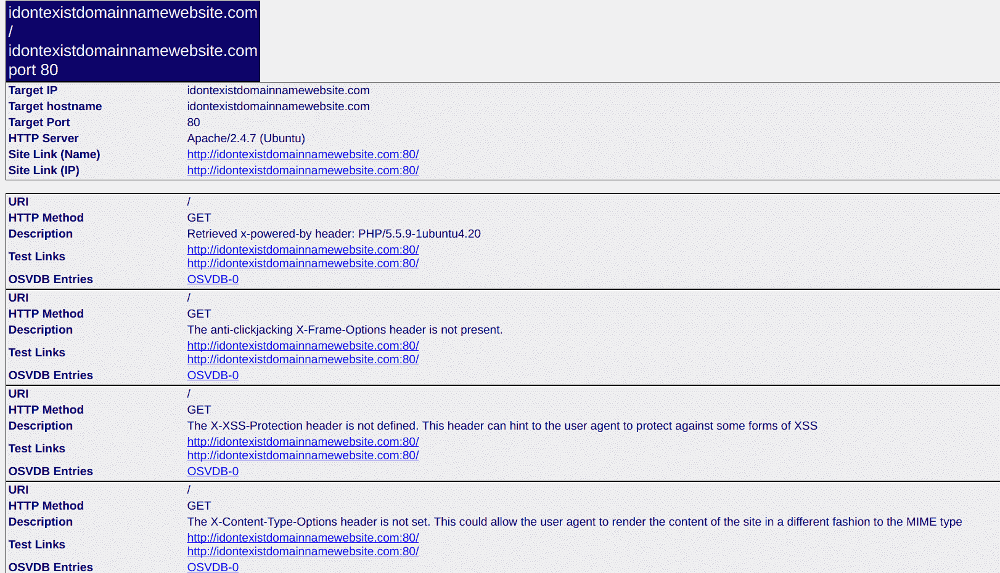

Nikto HTML 扫描报告

了解更多关于 Nikto 选项和文档的信息：[`cirt.net/Nikto2.`](https://cirt.net/Nikto2)

# 特定框架的安全扫描器

这种类型的检查和扫描是针对特定的框架、CMS 和平台进行的。它允许通过对多个安全测试案例和检查进行验证来获得更详细的结果。同样，在开源和商业世界中有多种工具和扫描器可用。

一些示例包括以下内容：

+   使用 WPScan 对 WordPress CMS 进行扫描：[`github.com/wpscanteam/wpscan`](https://github.com/wpscanteam/wpscan)

+   使用 Retire.js 对 JavaScript 库进行扫描：[`retirejs.github.io/retire.js`](https://retirejs.github.io/retire.js)

+   使用 Droopescan 扫描针对 Drupal CMS - [`github.com/droope/droopescan`](https://github.com/droope/droopescan) 和其他许多工具

# WordPress 漏洞扫描器 – WPScan

WPScan 是一个用 Ruby 编写的黑盒 WordPress 漏洞扫描器，用于针对 WordPress CMS 使用 WPScan 漏洞数据库 ([`wpvulndb.com`](https://wpvulndb.com)) 进行安全扫描和漏洞检查。

它执行的一些检查包括但不限于以下内容：

+   WordPress 核心

+   WordPress 插件和主题

+   已知的旧软件漏洞

+   用户名，附件枚举

+   暴力破解攻击

+   安全配置错误等等

以下 Playbook 将根据给定的域执行 WPScan，并生成带有问题列表和参考信息的扫描报告。

根据需要更新 Playbook 中的`domain_name`和`output_dir`值。此外，以下 Playbook 假定您已在系统中安装了 Docker：

```
- name: WPScan Playbook
  hosts: localhost
  vars:
    domain_name: www.idontexistdomainnamewebsite.com # Specify the domain to scan
    wpscan_container: wpscanteam/wpscan
    scan_name: wpscan
    output_dir: /tmp # Specify the output directory to store results

  tasks:
    # This playbook assumes docker already installed
    - name: Downloading {{ wpscan_container }} docker container
      docker_image:
        name: "{{ wpscan_container }}"

    - name: creating output report file
      file:
        path: "{{output_dir }}/{{ domain_name }}.txt"
        state: touch

    - name: Scanning {{ domain_name }} website using WPScan
      docker_container:
        name: "{{ scan_name }}"
        image: "{{ wpscan_container }}"
        interactive: yes
        auto_remove: yes
        state: started
        volumes: "/tmp/{{ domain_name }}.txt:/wpscan/data/output.txt"
        command: ["--update", "--follow-redirection", "--url", "{{ domain_name }}", "--log", "/wpscan/data/output.txt"]

    - name: WPScan report downloaded
      debug:
        msg: "The report can be found at /tmp/{{ domain_name }}.txt"
```

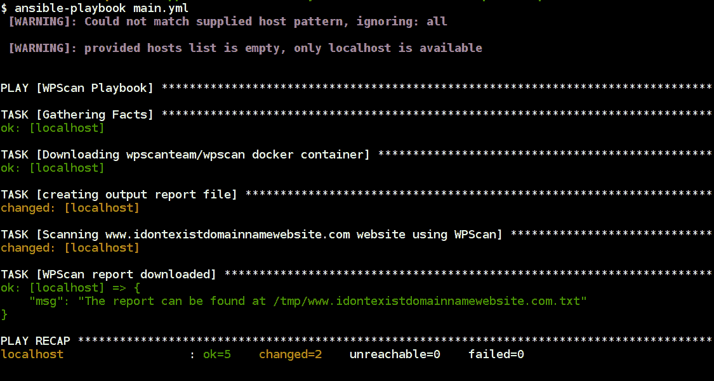

WPScan Ansible playbook 执行

下载、执行和存储 WPScan 扫描结果的 Playbook 输出：

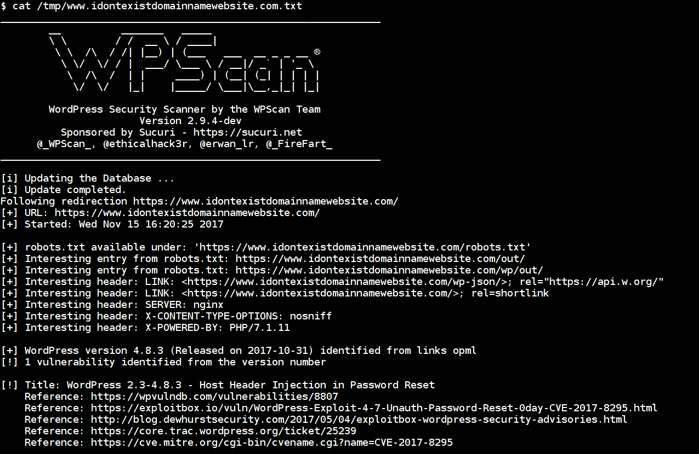

带有问题详情和参考信息的 WPScan 输出报告

这些扫描可以集成到我们的 CI/CD 管道中，并在部署完成后执行以验证安全检查和配置检查。此外，根据需要可以根据 WPScan 定制此扫描；有关更多参考，请参阅 WPScan 文档 [`github.com/wpscanteam/wpscan`](https://github.com/wpscanteam/wpscan)。

# 使用 Ansible 的自动修补方法

补丁和更新是每个必须管理生产系统的人都必须处理的任务。我们将看到的两种方法如下：

+   滚动更新

+   蓝绿部署

# 滚动更新

想象一下我们在负载均衡器后面有五台 web 服务器。我们想要做的是对我们的 Web 应用进行零停机升级。使用 Ansible 中提供的某些关键字，我们可以实现这一点。

在我们的示例中，我们希望实现以下目标：

+   告诉负载均衡器 web 服务器节点已经宕机

+   将该节点上的 web 服务器关闭

+   将更新后的应用程序文件复制到该节点

+   在该节点上启动 web 服务器

我们首先要查看的关键字是`serial`。让我们从 Ansible 文档中看一个例子：

```
- name: test play
  hosts: webservers
  serial: 1
```

该示例来自 [`docs.ansible.com/ansible/latest/playbooks_delegation.html#rolling-update-batch-size`](http://docs.ansible.com/ansible/latest/playbooks_delegation.html#rolling-update-batch-size)。

这确保了 Playbook 的执行是串行而不是并行进行的。因此，我们先前列出的步骤可以逐个节点完成。负载均衡器将流量分发到正在运行的节点上的网站，并且我们实现了滚动更新。

除了给 serial 一个数字之外，我们还可以使用百分比。因此，示例变为以下形式：

```
- name: test play
  hosts: webservers
  serial: "20%"
```

示例来自 [`docs.ansible.com/ansible/latest/playbooks_delegation.html#rolling-update-batch-size`](http://docs.ansible.com/ansible/latest/playbooks_delegation.html#rolling-update-batch-size)。

我们可以选择为 serial 提供百分比值或数字值。在这种情况下，play 将针对 1 个节点运行，然后是剩余节点的 20%，最后是所有剩余节点。

```
# The batch sizes can be a list as well
- name: test play
  hosts: webservers
  serial:
    - "1"
    - "20%"
    - "100%"
```

示例来自 [`docs.ansible.com/ansible/latest/playbooks_delegation.html#rolling-update-batch-size`](http://docs.ansible.com/ansible/latest/playbooks_delegation.html#rolling-update-batch-size)。

这种更新方式的一个很好的示例在下面的链接中给出

*第 47 集 - 使用 Ansible 进行零停机部署*：[`sysadmincasts.com/episodes/47-zero-downtime-deployments-with-ansible-part-4-4`](https://sysadmincasts.com/episodes/47-zero-downtime-deployments-with-ansible-part-4-4)

# 蓝绿部署

蓝绿的概念归功于马丁·福勒。一个很好的参考是这篇文章 [`martinfowler.com/bliki/BlueGreenDeployment.html`](http://martinfowler.com/bliki/BlueGreenDeployment.html)。其想法是将我们当前的生产工作负载视为蓝色。现在我们想要做的是升级应用程序。因此，在相同的负载均衡器后面启动蓝色的副本。基础设施的副本具有更新的应用程序。

一旦它启动并运行，负载均衡器配置将从当前的蓝色切换到指向绿色。蓝色保持运行，以防有任何操作问题。一旦我们对进展满意，就可以关闭旧主机。下面的 playbook 以非常简单的方式演示了这一点：

+   第一个 playbook 启动三个主机。两个运行 nginx 的 Web 服务器在负载均衡器后面

+   第二个 playbook 将当前正在运行的内容（蓝色）切换为绿色

# 蓝绿部署设置 playbook

以下 playbook 将设置三个节点，包括负载均衡器和两个 Web 服务器节点。请参阅 [`www.upcloud.com/support/haproxy-load-balancer-ubuntu`](https://www.upcloud.com/support/haproxy-load-balancer-ubuntu) 创建一个 playbook。

下面的代码片段是 `inventory` 文件：

```
[proxyserver]
proxy ansible_host=192.168.100.100 ansible_user=ubuntu ansible_password=passwordgoeshere

[blue]
blueserver ansible_host=192.168.100.10 ansible_user=ubuntu ansible_password=passwordgoeshere

[green]
greenserver ansible_host=192.168.100.20 ansible_user=ubuntu ansible_password=passwordgoeshere

[webservers:children]
blue
green

[prod:children]
webservers
proxyserver
```

然后，`main.yml` playbook 文件如下所示，描述了在哪些节点上执行哪些角色和流程：

```
- name: running common role
  hosts: prod
  gather_facts: false
  become: yes
  serial: 100%
  roles:
    - common

- name: running haproxy role
  hosts: proxyserver
  become: yes 
  roles:
    - haproxy

- name: running webserver role
  hosts: webservers
  become: yes 
  serial: 100% 
  roles:
    - nginx

- name: updating blue code
  hosts: blue
  become: yes 
  roles:
    - bluecode

- name: updating green code
  hosts: green
  become: yes 
  roles:
    - greencode
```

每个角色都有其自己的功能要执行；以下是在所有节点上执行的常见角色：

```
- name: installing python if not installed
  raw: test -e /usr/bin/python || (apt -y update && apt install -y python-minimal)

- name: updating and installing git, curl
  apt:
    name: "{{ item }}"
    state: present
    update_cache: yes

  with_items:
    - git
    - curl

# Also we can include common any monitoring and security hardening tasks
```

然后，代理服务器角色如下所示，用于设置和配置 `haproxy` 服务器：

```
- name: adding haproxy repo
  apt_repository:
    repo: ppa:vbernat/haproxy-1.7

- name: updating and installing haproxy
  apt:
    name: haproxy
    state: present
    update_cache: yes

- name: updating the haproxy configuration
  template:
    src: haproxy.cfg.j2
    dest: /etc/haproxy/haproxy.cfg

- name: starting the haproxy service
  service:
    name: haproxy
    state: started
    enabled: yes
```

`haproxy.cfg.j2` 如下所示，其中包含执行设置所需的所有配置。根据我们想要添加（或）移除的配置，可以进行改进，如 SSL/TLS 证书和暴露 `haproxy` 统计信息等：

```
global
  log /dev/log local0
  log /dev/log local1 notice
  chroot /var/lib/haproxy
  stats socket /run/haproxy/admin.sock mode 660 level admin
  stats timeout 30s
  user haproxy
  group haproxy
  daemon

  # Default SSL material locations
  ca-base /etc/ssl/certs
  crt-base /etc/ssl/private

  # Default ciphers to use on SSL-enabled listening sockets.
  # For more information, see ciphers(1SSL). This list is from:
  # https://hynek.me/articles/hardening-your-web-servers-ssl-ciphers/
  # An alternative list with additional directives can be obtained from
  # https://mozilla.github.io/server-side-tls/ssl-config-generator/?server=haproxy
  ssl-default-bind-ciphers ECDH+AESGCM:DH+AESGCM:ECDH+AES256:DH+AES256:ECDH+AES128:DH+AES:RSA+AESGCM:RSA+AES:!aNULL:!MD5:!DSS
  ssl-default-bind-options no-sslv3

defaults
  log global
  mode http
  option httplog
  option dontlognull
        timeout connect 5000
        timeout client 50000
        timeout server 50000
  errorfile 400 /etc/haproxy/errors/400.http
  errorfile 403 /etc/haproxy/errors/403.http
  errorfile 408 /etc/haproxy/errors/408.http
  errorfile 500 /etc/haproxy/errors/500.http
  errorfile 502 /etc/haproxy/errors/502.http
  errorfile 503 /etc/haproxy/errors/503.http
  errorfile 504 /etc/haproxy/errors/504.http

frontend http_front
   bind *:80
   stats uri /haproxy?stats
   default_backend http_back

backend http_back
   balance roundrobin
   server {{ hostvars.blueserver.ansible_host }} {{ hostvars.blueserver.ansible_host }}:80 check
   #server {{ hostvars.greenserver.ansible_host }} {{ hostvars.greenserver.ansible_host }}:80 check
```

下面的代码片段将服务器添加为负载均衡器的一部分，并在用户请求时提供服务。我们也可以添加多个服务器。`haproxy`还支持 L7 和 L4 负载平衡：

```
server {{ hostvars.blueserver.ansible_host }} {{ hostvars.blueserver.ansible_host }}:80 check
```

Web 服务器是非常简单的 nginx 服务器设置，用于安装并将服务添加到启动过程中：

```
- name: installing nginx
  apt:
    name: nginx
    state: present
    update_cache: yes

- name: starting the nginx service
  service:
    name: nginx
    state: started
    enabled: yes
```

最后，以下代码片段分别是`blue`和`green`服务器的代码：

```
<html>
    <body bgcolor="blue">
       <h1 align="center">Welcome to Blue Deployment</h1>
    </body>
</html>
<html>
    <body bgcolor="green">
        <h1 align="center">Welcome to Green Deployment</h1>
    </body>
</html>
```

以下是整个设置的 playbook 执行的参考截图：

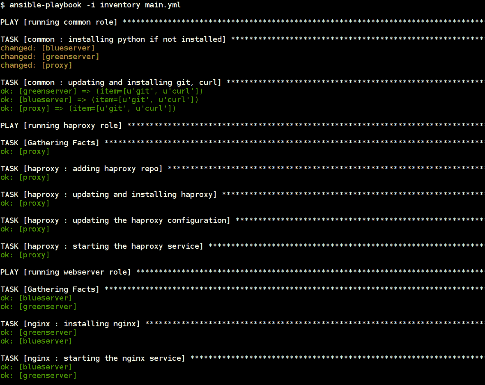

一旦 playbook 完成，我们就可以在负载均衡器 IP 地址上检查生产站点，查看蓝色部署：

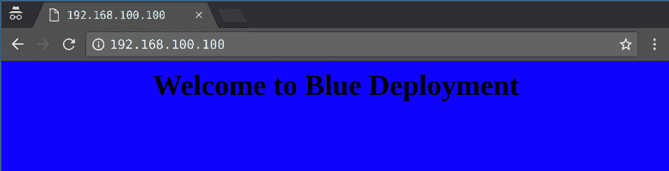

# BlueGreen 部署更新 playbook

现在，开发人员已经更新了代码（或者）服务器已经修补了一些安全漏洞。我们希望使用绿色部署部署生产站点的新版本。

playbook 看起来非常简单，如下所示，它将更新配置并重新加载 `haproxy` 服务以服务新的生产部署：

```
- name: Updating to GREEN deployment
  hosts: proxyserver
  become: yes 

  tasks:
    - name: updating proxy configuration
      template:
        src: haproxy.cfg.j2
        dest: /etc/haproxy/haproxy.cfg

    - name: updating the service
      service:
        name: haproxy
        state: reloaded

    - debug:
        msg: "GREEN deployment successful. Please check your server :)"
```

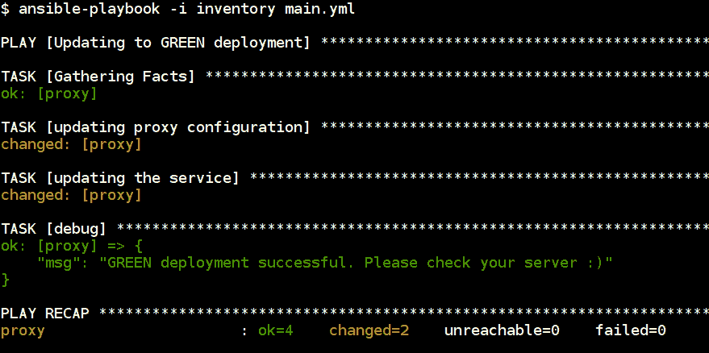

然后，我们可以再次检查我们的生产站点，通过导航到负载均衡器 IP 地址来查看更新的部署：


现在，我们可以看到我们的生产站点正在运行新的更新部署。HAProxy 中有多个高级选项可用于执行不同类型的更新，并且可以根据需要进行配置。

# 摘要

本章涉及了应用程序和网络安全的各种用例。通过将各种工具与 Ansible playbook 的强大功能相结合，我们在这个领域创建了强大的安全自动化工作流程。根据需求，您可以使用基准来启用安全默认值或定期检查合规性并满足审计要求。我们研究了允许我们对 AWS 云执行相同操作的工具。从应用程序安全扫描器到以安全配置驱动的软件更新和补丁方法，我们尝试涵盖一系列任务，这些任务通过 Ansible 自动化变得强大。

在下一章中，我们将专注于 IT 和运维中最激动人心的新兴领域之一，即容器。Docker 作为容器的代名词，已经成为开发人员、系统管理员广泛部署的技术，也是现代软件开发和部署流程的核心组成部分。让我们探索 Ansible 与 Docker 容器配合使用的秘密。
