# 第八章：Docker 容器的持续安全扫描

Docker 容器是开发人员打包应用程序的新方法。容器最好的特性是它们包含了代码、运行时、系统库以及应用程序工作所需的所有设置。由于易于使用和部署，越来越多的应用程序正在以容器形式部署用于生产。

由于有这么多的活动部分，我们迫切需要有能力持续扫描 Docker 容器以寻找安全问题。在本章中，我们将看到各种做到这一点的方法。从使用 Ansible 调用的熟悉的 CIS 基准脚本开始，我们将转向 clair-scanner，这是一个用于扫描现有漏洞并与现有的 CI/CD 工作流程很好地集成的工具，如果需要的话。

在本章中，我们将详细探讨以下主题：

+   理解持续安全的概念

+   使用 Ansible 自动化 Docker 容器的漏洞评估

+   使用 Ansible Tower 对 Docker 安全进行定期扫描

+   使用 Ansible Tower 对操作系统和内核安全进行定期扫描

+   使用 Ansible 进行文件完整性检查和主机级监控的定期扫描，以满足各种合规性要求

# 理解持续安全的概念

DevOps 中出现的一个关键方法是不可变基础设施的概念。这意味着每当需要进行运行时更改，无论是应用程序代码还是配置，都会重新构建和部署容器，并且会销毁现有的运行容器。

由于这样可以实现可预测性、弹性，并简化运行时的部署选择，因此毫无疑问，许多运维团队正在朝着这个方向发展。伴随而来的问题是这些容器应该何时进行安全和合规性测试。通过接受本章讨论的持续安全扫描和监控的流程，您可以自动化各种工作负载和工作流程。

# 使用 Ansible 自动化 Docker 容器的漏洞评估

容器无处不在。让我们看一些使用 Ansible 进行扫描和评估 Docker 容器和环境的技术和工具。

评估容器安全有许多不同的方法。在本章中，我们将看一些方法以及它们如何与 Ansible 结合使用：

| **工具** | **描述** |
| --- | --- |
| Docker Bench | 基于 CIS 进行检查的安全 Shell 脚本 |
| Clair | 基于 CVE 数据库进行漏洞分析的工具 |
| Anchore | 用于执行安全评估并做出运行时策略决策的工具 |
| `vuls` | 一种无需代理的漏洞扫描器，具有 CVE、OVAL 数据库 |
| `osquery` | 用于进行 OS 分析的 OS 仪表化框架，以执行 HIDS 类型的活动 |

# Docker 安全检查

**Docker 安全工作台**是一个 shell 脚本，用于对 Docker 容器环境进行多项检查。它将根据 CIS 基准提供更详细的安全配置视图。由于它是基于符合 POSIX 2004 标准构建的，所以该脚本支持大多数 Unix 操作系统。

有关工具信息的更多详细信息，请访问[`github.com/docker/docker-bench-security`](https://github.com/docker/docker-bench-security)。

以下是此脚本将执行的检查的高级区域：

+   主机

+   Docker 守护程序配置和文件

+   Docker 容器映像

+   Docker 运行时

+   Docker 安全操作

+   Docker 集群配置

以下 Playbook 将针对 Docker 环境执行 Docker 安全检查，并返回详细的报告：

```
- name: Docker bench security playbook
  hosts: docker
  remote_user: ubuntu
  become: yes

  tasks:
    - name: make sure git installed
      apt:
        name: git
        state: present

    - name: download the docker bench security
      git:
        repo: https://github.com/docker/docker-bench-security.git
        dest: /opt/docker-bench-security

    - name: running docker-bench-security scan
      command: docker-bench-security.sh -l /tmp/output.log
      args:
        chdir: /opt/docker-bench-security/

    - name: downloading report locally
      fetch:
        src: /tmp/output.log
        dest: "{{ playbook_dir }}/{{ inventory_hostname }}-docker-report-{{ ansible_date_time.date }}.log"
        flat: yes

    - name: report location
      debug:
        msg: "Report can be found at {{ playbook_dir }}/{{ inventory_hostname }}-docker-report-{{ ansible_date_time.date }}.log"</mark>
```

Docker 安全检查 Ansible Playbook 的执行：

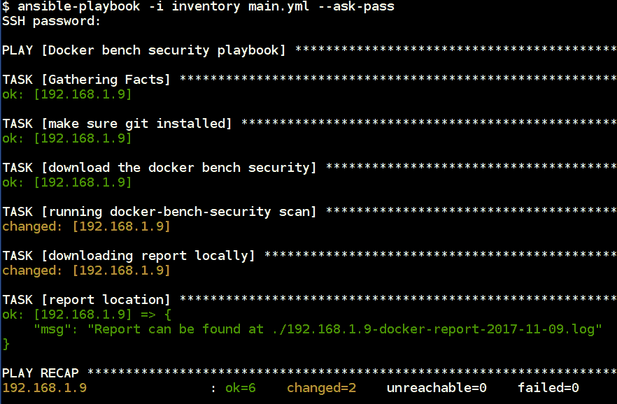

Docker 安全检查 Ansible Playbook 的执行

Playbook 的输出将下载并扫描基于 CIS 基准的容器，并将结果存储在`log`文件中，其输出可以在此处看到：

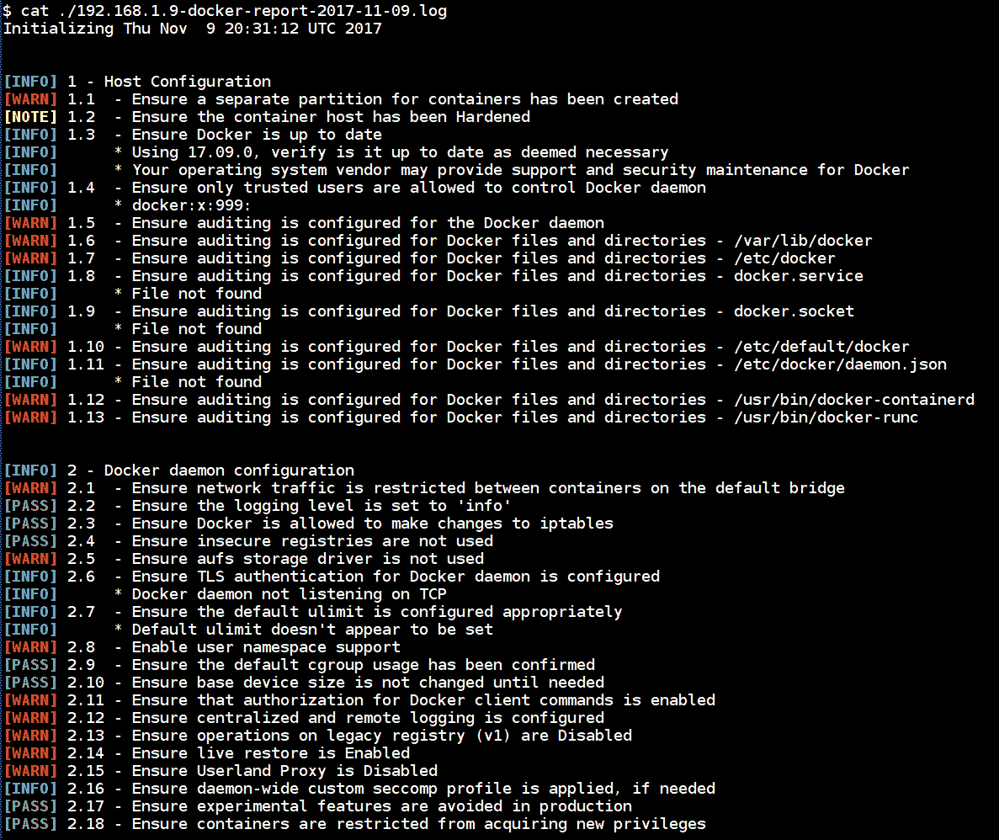

详细的 Docker 安全检查分析报告

# Clair

Clair 允许我们通过与现有漏洞数据库进行检查来对容器执行静态漏洞分析。它允许我们使用 Clair 数据库对我们的 Docker 容器映像执行漏洞分析检查。有关 Clair 的更多详细信息，请访问[`github.com/coreos/clair`](https://github.com/coreos/clair)。

设置 Clair 本身真的很困难，并且使用 Docker 映像的 API 进行扫描会使得情况更加复杂。这就是 clair-scanner 的用武之地，它使得通过 REST API 进行设置和执行扫描变得非常简单。

请在[`github.com/arminc/clair-scanner`](https://github.com/arminc/clair-scanner)中阅读更多关于 clair-scanner 的信息。

Clair-scanner 可以根据某些事件触发对容器进行简单扫描，以检查现有的漏洞。此外，该报告可以转发给负责修复等工作的团队。

以下 Playbook 将设置所需的 Docker 容器和配置以执行 clair-scanning。它假设目标系统已安装了 Docker 和所需的库：

```
- name: Clair Scanner Server Setup
  hosts: docker
  remote_user: ubuntu
  become: yes

  tasks:
    - name: setting up clair-db
      docker_container:
        name: clair_db
        image: arminc/clair-db
        exposed_ports:
          - 5432

    - name: setting up clair-local-scan
      docker_container:
        name: clair
        image: arminc/clair-local-scan:v2.0.1
        ports:
          - "6060:6060"
        links:
          - "clair_db:postgres"
```

以下截图展示了使用 Ansible 设置 clair-scanner 与 Docker 容器的执行。

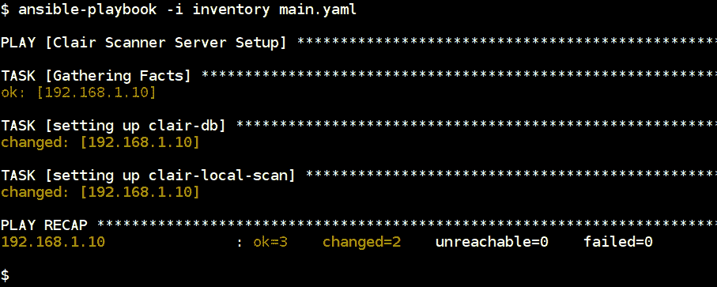

使用 Ansible 设置 clair-scanner 与 Docker 容器

在执行 Playbook 后，下载和设置 CVE 数据库将需要一段时间。

以下 Playbook 将用于运行 clair-scanner，通过向服务器发出 API 请求对容器进行分析：

```
- name: Scanning containers using clair-scanner
  hosts: docker
  remote_user: ubuntu
  become: yes
  vars:
    image_to_scan: "debian:sid"   #container to scan for vulnerabilities
    clair_server: "http://192.168.1.10:6060"    #clair server api endpoint

  tasks:
    - name: downloading and setting up clair-scanner binary
      get_url:
        url: https://github.com/arminc/clair-scanner/releases/download/v6/clair-scanner_linux_amd64
        dest: /usr/local/bin/clair-scanner
        mode: 0755

    - name: scanning {{ image_to_scan }} container for vulnerabilities
      command: clair-scanner -r /tmp/{{ image_to_scan }}-scan-report.json -c {{ clair_server }} --ip 0.0.0.0 {{ image_to_scan }}
      register: scan_output
      ignore_errors: yes

    - name: downloading the report locally
      fetch:
        src: /tmp/{{ image_to_scan }}-scan-report.json
        dest: {{ playbook_dir }}/{{ image_to_scan }}-scan-report.json
        flat: yes
```

以下截图展示了针对请求的 Docker 映像执行 clair-scanner 的情况。正如您所看到的致命错误，所以当它发现 Docker 映像存在任何问题时，它会返回错误，我们可以使用`ignore_errors`来处理它。

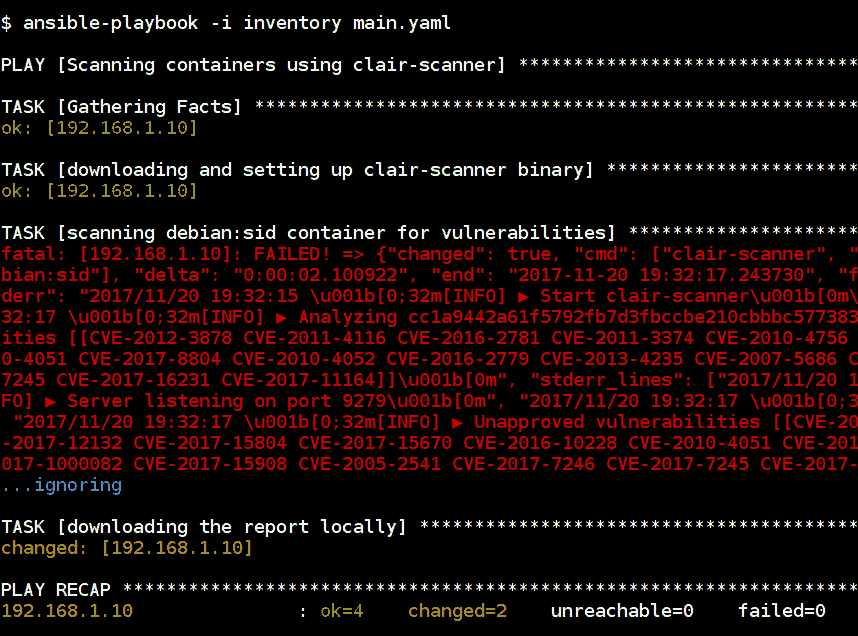

Clair-scanner 执行过程

这是运行 clair-scanner 的 playbook 输出以及 JSON 格式的报告输出：

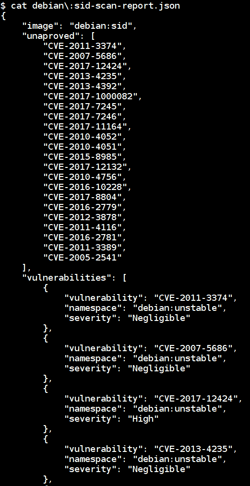

报告的输出包括漏洞 CVE 和严重程度

# 使用 Ansible Tower 进行定期扫描 Docker 安全性

持续安全性流程涉及计划、执行、测量和行动的循环：

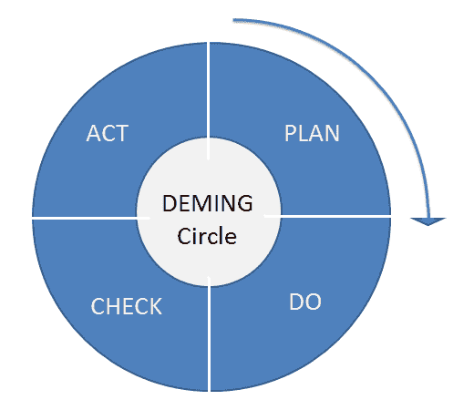

来自维基共享的 Deming 循环

通过遵循标准的检查表和基准，并使用 Ansible 在容器上执行它们，我们可以检查安全问题并对其采取行动。Anchore 是一个用于容器的分析和检查平台。

# Anchore - 开放式容器合规性平台

Anchore 是执行容器镜像分析、检查和认证的最流行的工具和服务之一。它提供多个服务和平台进行设置，最稳定和强大的方式是使用 Anchore Engine 设置本地服务，可以通过 REST API 访问。在以下文档中，我们将看到如何使用 Anchore Engine 设置服务以及如何使用这个 REST API 执行 Docker 容器的持续安全扫描和分析。

以下是 Anchore 可执行的高级操作：

+   策略评估操作

+   图像操作

+   策略操作

+   注册操作

+   订阅操作

+   系统操作

在[`github.com/anchore/anchore-engine`](https://github.com/anchore/anchore-engine)了解更多关于 Anchore 引擎服务的信息。

# 设置 Anchore 引擎服务

以下 playbook 将设置 Anchore 引擎服务，其中包含引擎容器以及用于存储数据库信息的 `postgres`。`admin_password` 变量是访问 Anchore REST API 的管理员用户密码：

```
- name: anchore server setup
  hosts: anchore
  become: yes
  vars:
    db_password: changeme
    admin_password: secretpassword

  tasks:
    - name: creating volumes
      file:
        path: "{{ item }}"
        recurse: yes
        state: directory

      with_items:
        - /root/aevolume/db
        - /root/aevolume/config

    - name: copying anchore-engine configuration
      template:
        src: config.yaml.j2
        dest: /root/aevolume/config/config.yaml

    - name: starting anchore-db container
      docker_container:
        name: anchore-db
        image: postgres:9
        volumes:
          - "/root/aevolume/db/:/var/lib/postgresql/data/pgdata/"
        env:
          POSTGRES_PASSWORD: "{{ db_password }}"
          PGDATA: "/var/lib/postgresql/data/pgdata/"

    - name: starting anchore-engine container
      docker_container:
        name: anchore-engine
        image: anchore/anchore-engine
        ports:
          - 8228:8228
          - 8338:8338
        volumes:
          - "/root/aevolume/config/config.yaml:/config/config.yaml:ro"
          - "/var/run/docker.sock:/var/run/docker.sock:ro"
        links:
          - anchore-db:anchore-db
```

以下截图是执行 Anchore 引擎服务设置的 Ansible playbook 执行过程：

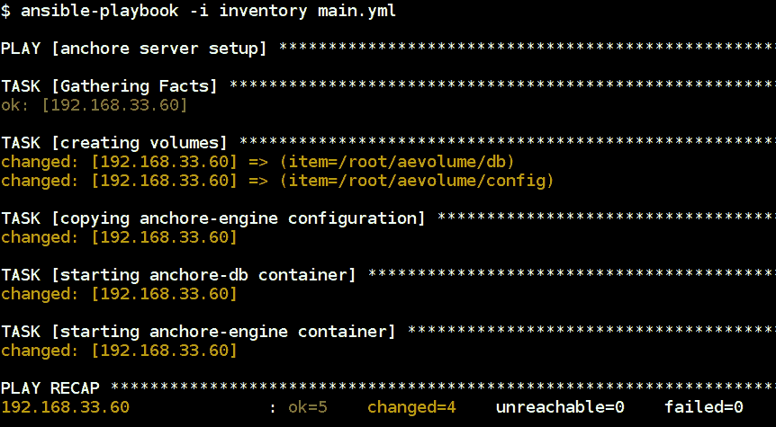

使用 Ansible playbook 设置 Anchore 引擎服务

# Anchore CLI 扫描器

现在我们已经拥有了 Anchore 引擎服务的 REST API 访问详情，我们可以利用这一点在任何主机上执行容器镜像的扫描。以下步骤是配置 Ansible Tower 来执行持续的容器镜像漏洞扫描。

用于扫描容器镜像的 playbook 如下所示：

```
- name: anchore-cli scan
  hosts: anchore
  become: yes
  vars:
    scan_image_name: "docker.io/library/ubuntu:latest"
    anchore_vars:
      ANCHORE_CLI_URL: http://localhost:8228/v1
      ANCHORE_CLI_USER: admin
      ANCHORE_CLI_PASS: secretpassword

  tasks:
    - name: installing anchore-cli
      pip:
        name: "{{ item }}"

      with_items:
        - anchorecli
        - pyyaml

    - name: downloading image
      docker_image: 
        name: "{{ scan_image_name }}"

    - name: adding image for analysis
      command: "anchore-cli image add {{ scan_image_name }}"
      environment: "{{anchore_vars}}"

    - name: wait for analysis to compelte
      command: "anchore-cli image content {{ scan_image_name }} os"
      register: analysis
      until: analysis.rc != 1
      retries: 10
      delay: 30
      ignore_errors: yes
      environment: "{{anchore_vars}}"

    - name: vulnerabilities results
      command: "anchore-cli image vuln {{ scan_image_name }} os"
      register: vuln_output
      environment: "{{anchore_vars}}"

    - name: "vulnerabilities in {{ scan_image_name }}"
      debug:
        msg: "{{ vuln_output.stdout_lines }}"
```

可以根据需要自定义执行 `anchore-cli` 的选项，请参阅[`github.com/anchore/anchore-cli`](https://github.com/anchore/anchore-cli)的文档。

现在，我们必须在 Ansible Tower 中创建新项目以添加 playbook。然后我们可以从版本控制中选择 playbook 源，或者提供详细信息：

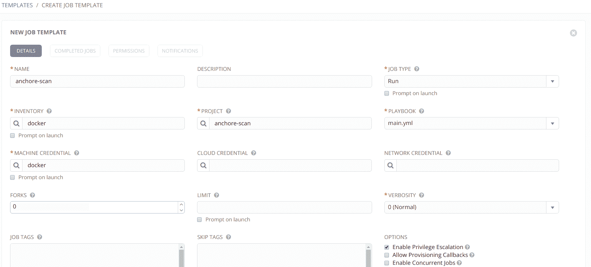

我们也可以通过 Ansible Tower UI 传递变量。正如您所见，我们正在传递一些秘密，我们将看到如何利用 Ansible Vault 安全存储和使用它们：

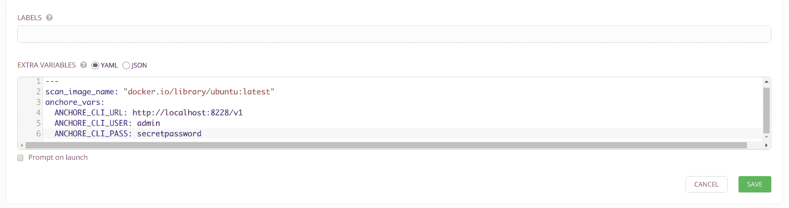

我们还可以按需安排此 Playbook 每周或每月运行，根据需要进行设置。还请注意，这可以根据用例进行定制：

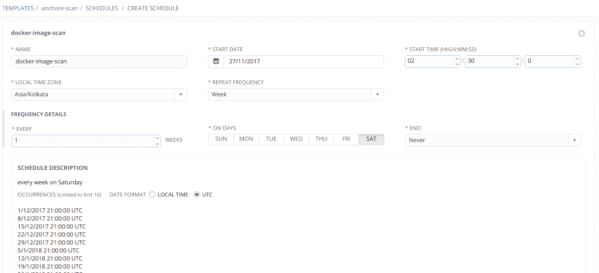

然后，我们还可以通过启动作业执行按需扫描。以下截图是关于 `ubuntu:latest` Docker 镜像漏洞的参考，其中包含 CVE 详细信息和易受攻击的软件包列表：

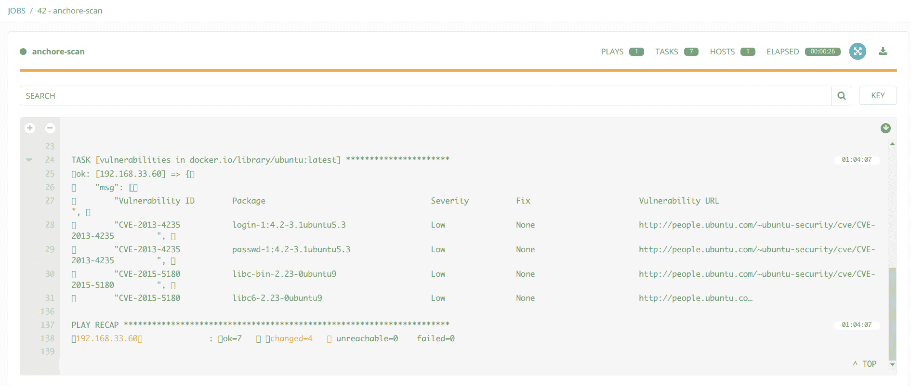

# 使用 Ansible Tower 定期扫描操作系统和内核安全

持续的安全扫描要求我们在类似 Ansible Tower 的软件中进行管理。虽然大多数讨论的工具都可用于扫描和维护安全基准，但我们应考虑事故响应和威胁检测工作流程的整个过程：

1.  准备工作

1.  检测和分析

1.  遏制、根除和恢复

1.  事后活动

设置所有这些扫描器是我们的准备工作。使用这些扫描器的输出使我们能够进行检测和分析。遏制和恢复都超出了这些工具的范围。对于恢复和事后活动的流程，您可能需要考虑可以销毁当前基础架构并按原样重新创建的 Playbook。

作为准备的一部分，熟悉以下术语可能很有用，因为您会在漏洞扫描器和漏洞管理工具的世界中反复看到它们的使用：

| **术语** | **全称（如果有）** | **术语描述** |
| --- | --- | --- |
| CVE | 通用漏洞和暴露 | 这是一个网络安全漏洞标识符列表。通常使用 CVE ID。 |
| OVAL | 开放式漏洞和评估语言 | 用于发现和命名计算机系统中的漏洞和配置问题的语言。 |
| CWE | 通用弱点枚举 | 软件安全弱点的通用列表。 |
| NVD | 国家漏洞数据库 | 美国政府的漏洞管理数据库，以 XML 格式公开供公众使用。 |

# Vuls - 漏洞扫描器

**Vuls** 是一个用 golang 编写的无代理扫描器。它支持各种不同的 Linux 操作系统。它执行完整的端到端安全系统管理任务，如扫描安全漏洞和安全软件更新。它根据 CVE 分数对系统进行所需的安全漏洞分析，通过 Slack 和电子邮件发送通知，并提供具有历史数据的简单 Web 报告。

在 [`github.com/future-architect/vuls`](https://github.com/future-architect/vuls) 了解更多关于 vuls 的信息。

# Vuls 设置 Playbook

以下 playbook 用于在 Ubuntu 16.04 系统上使用 Docker 容器设置`vuls`。 以下 playbook 假定您已经安装了 docker 和所需的软件包。

playbook 主要有两个角色，用于使用 Docker 容器设置`vuls`。

+   `vuls_containers_download`

+   `vuls_database_download`

```
- name: setting up vuls using docker containers
  hosts: vuls
  become: yes

  roles:
    - vuls_containers_download
    - vuls_database_download
```

使用`docker_image`模块在本地拉取 Docker 容器：

```
- name: pulling containers locally
  docker_image:
    name: "{{ item }}"
    pull: yes

  with_items:
    - vuls/go-cve-dictionary
    - vuls/goval-dictionary
    - vuls/vuls
```

然后下载所需操作系统和分发版本的 CVE 和 OVAL 数据库：

```
- name: fetching NVD database locally
  docker_container:
    name: "cve-{{ item }}"
    image: vuls/go-cve-dictionary
    auto_remove: yes
    interactive: yes
    state: started
    command: fetchnvd -years "{{ item }}"
    volumes:
      - "{{ vuls_data_directory }}:/vuls"
      - "{{ vuls_data_directory }}/go-cve-dictionary-log:/var/log/vuls"
  with_sequence: start=2002 end="{{ nvd_database_years }}"

- name: fetching redhat oval data
  docker_container:
    name: "redhat-oval-{{ item }}"
    image: vuls/goval-dictionary
    auto_remove: yes
    interactive: yes
    state: started
    command: fetch-redhat "{{ item }}"
    volumes:
      - "{{ vuls_data_directory }}:/vuls"
      - "{{ vuls_data_directory }}/goval-dictionary-log:/var/log/vuls"
  with_items: "{{ redhat_oval_versions }}"

- name: fetching ubuntu oval data
  docker_container:
    name: "ubuntu-oval-{{ item }}"
    image: vuls/goval-dictionary
    auto_remove: yes
    interactive: yes
    state: started
    command: "fetch-ubuntu {{ item }}"
    volumes:
      - "{{ vuls_data_directory }}:/vuls"
      - "{{ vuls_data_directory }}/goval-dictionary-log:/var/log/vuls"
  with_items: "{{ ubuntu_oval_versions }}"
```

全局变量文件如下所示。 我们可以添加更多`redhat_oval_versions`，例如`5`。 `nvd_database_years`将下载 CVE 数据库直到 2017 年底：

```
vuls_data_directory: "/vuls_data"
nvd_database_years: 2017
redhat_oval_versions:
  - 6
  - 7
ubuntu_oval_versions:
  - 12
  - 14
  - 16
```

以下屏幕截图是用于 vuls 设置的 Ansible playbook 执行示例：

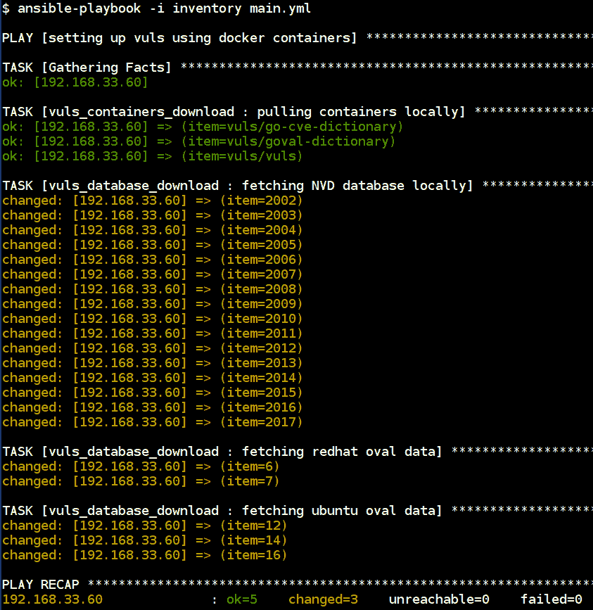

Vuls 设置 playbook 生效

# Vuls 扫描 playbook

现在，是时候使用`vuls` Docker 容器执行扫描和报告了。 以下 playbook 包含了执行针对虚拟机和容器的`vuls`扫描以及将报告发送到 slack 和 web 的简单步骤：

```
- name: scanning and reporting using vuls
  hosts: vuls
  become: yes
  vars:
    vuls_data_directory: "/vuls_data"
    slack_web_hook_url: https://hooks.slack.com/services/XXXXXXX/XXXXXXXXXXXXXXXXXXXXX
    slack_channel: "#vuls"
    slack_emoji: ":ghost:"
    server_to_scan: 192.168.33.80
    server_username: vagrant
    server_key_file_name: 192-168-33-80

  tasks:
    - name: copying configuraiton file and ssh keys
      template:
        src: "{{ item.src }}"
        dest: "{{ item.dst }}"
        mode: 0400

      with_items:
         - { src: 'config.toml', dst: '/root/config.toml' }
         - { src: '192-168-33-80', dst: '/root/.ssh/192-168-33-80' } 

    - name: running config test
      docker_container:
        name: configtest
        image: vuls/vuls
        auto_remove: yes
        interactive: yes
        state: started
        command: configtest -config=/root/config.toml
        volumes:
          - "/root/.ssh:/root/.ssh:ro"
          - "{{ vuls_data_directory }}:/vuls"
          - "{{ vuls_data_directory }}/vuls-log:/var/log/vuls"
          - "/root/config.toml:/root/config.toml:ro"

    - name: running vuls scanner
      docker_container:
        name: vulsscan
        image: vuls/vuls
        auto_remove: yes
        interactive: yes
        state: started
        command: scan -config=/root/config.toml
        volumes:
          - "/root/.ssh:/root/.ssh:ro"
          - "{{ vuls_data_directory }}:/vuls"
          - "{{ vuls_data_directory }}/vuls-log:/var/log/vuls"
          - "/root/config.toml:/root/config.toml:ro"
          - "/etc/localtime:/etc/localtime:ro"
        env:
          TZ: "Asia/Kolkata"

    - name: sending slack report
      docker_container:
        name: vulsreport
        image: vuls/vuls
        auto_remove: yes
        interactive: yes
        state: started
        command: report -cvedb-path=/vuls/cve.sqlite3 -ovaldb-path=/vuls/oval.sqlite3 --to-slack -config=/root/config.toml
        volumes:
          - "/root/.ssh:/root/.ssh:ro"
          - "{{ vuls_data_directory }}:/vuls"
          - "{{ vuls_data_directory }}/vuls-log:/var/log/vuls"
          - "/root/config.toml:/root/config.toml:ro"
          - "/etc/localtime:/etc/localtime:ro"

    - name: vuls webui report
      docker_container:
        name: vulswebui
        image: vuls/vulsrepo
        interactive: yes
        volumes:
          - "{{ vuls_data_directory }}:/vuls"
        ports:
          - "80:5111"
```

以下文件是`vuls`执行扫描的配置文件。 这保存了 slack 警报的配置以及执行扫描的服务器。 可以根据`vuls`文档非常有效地进行配置：

```
[slack]
hookURL = "{{ slack_web_hook_url}}"
channel = "{{ slack_channel }}"
iconEmoji = "{{ slack_emoji }}"

[servers]

[servers.{{ server_key_file_name }}]
host = "{{ server_to_scan }}"
user = "{{ server_username }}"
keyPath = "/root/.ssh/{{ server_key_file_name }}"
```

以下屏幕截图是用于 vuls 扫描的 Ansible playbook 执行示例：

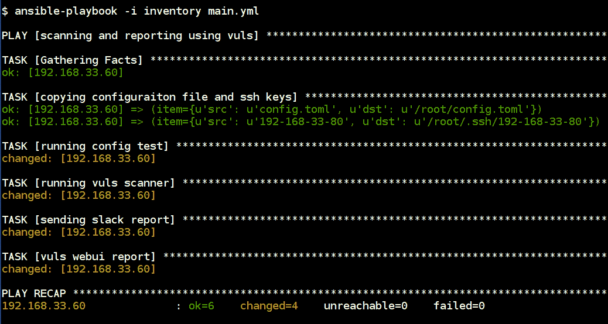

Vuls 扫描 playbook 生效

一旦报告容器执行完毕，根据配置选项，`vuls`将问题通知到相应的 slack 频道：

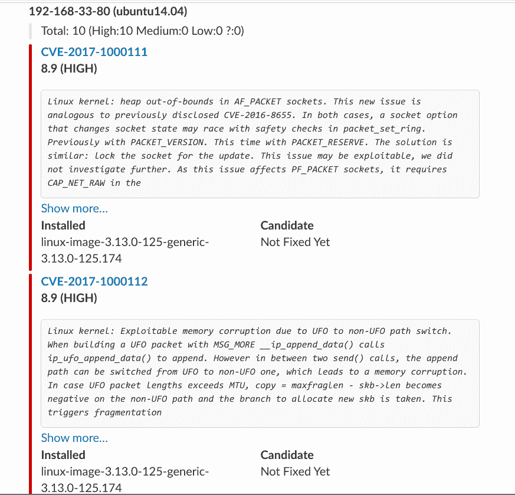

我们还可以访问`vuls`服务器 IP 地址的 Web UI 界面，以查看表格和便携格式的详细结果。 这对于管理大量服务器和规模化补丁非常有用：

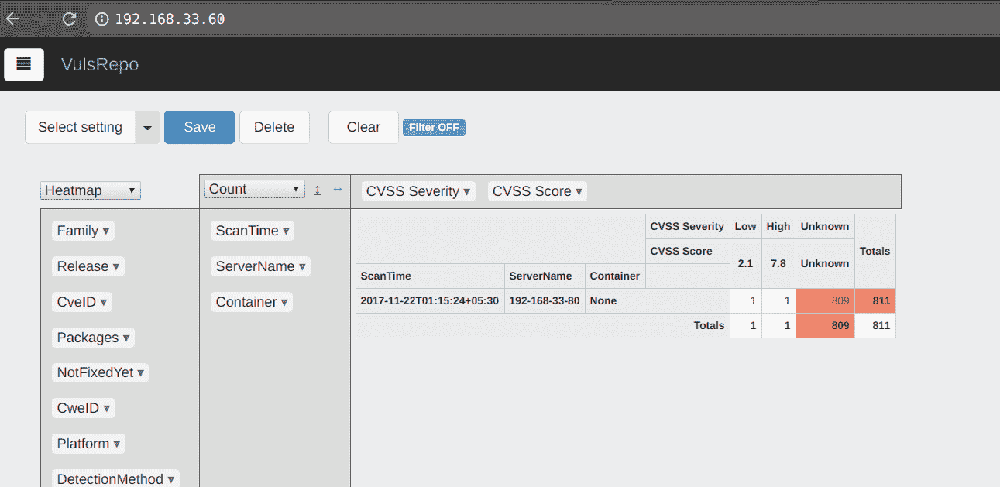

我们还可以通过报告深入了解问题、严重性、操作系统等：

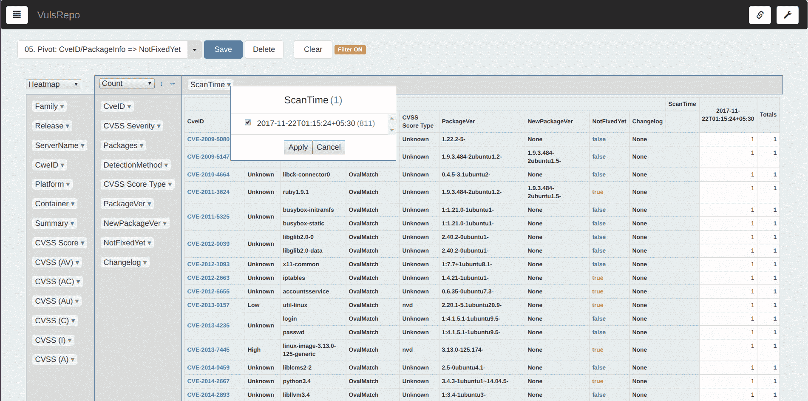

这可以作为基础架构代码的 CI/CD 生命周期的一部分，然后我们可以使用 Ansible Tower 或 Jenkins 作为计划扫描运行它。

# 为各种合规性倡议进行文件完整性检查和主机级监视的计划扫描

使用 Ansible 在主机上执行命令的许多优点之一是能够获取内部系统信息，例如：

+   文件哈希值

+   网络连接

+   正在运行的进程列表

它可以作为轻量级**主机入侵检测系统**（**HIDS**）。虽然在许多情况下这可能不能完全替代专门设计的 HIDS，但我们可以使用像 Facebook 的`osquery`这样的工具与 Ansible 一起执行相同类型的安全任务。

# osquery

`osquery`是 Facebook 开发的操作系统仪表化框架，用 C++编写，支持 Windows、Linux、OS X（macOS）和其他操作系统。它提供了使用类似 SQL 语法的接口来查询操作系统的功能。通过使用这个，我们可以执行诸如运行进程、内核配置、网络连接和文件完整性检查等低级活动。总的来说，它就像一个**主机入侵检测系统**（**HIDS**）端点安全。它提供`osquery`作为服务、系统交互 shell 等。因此我们可以使用它来执行集中监控和安全管理解决方案。更多关于`osquery`的信息请访问[`osquery.io`](https://osquery.io)。

这里是对`osquery`的高层次概述：

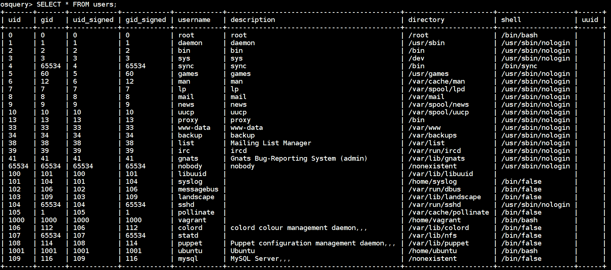

使用 SQL 查询获取用户列表及其组和其他信息的`osquery`

以下操作手册是为了在 Linux 服务器上设置和配置`osquery`代理，以监视和查找漏洞、文件完整性监控和许多其他合规性活动，然后将它们记录下来发送到集中日志监控系统：

```
- name: setting up osquery
  hosts: linuxservers
  become: yes

  tasks:
    - name: installing osquery
      apt:
        deb: https://pkg.osquery.io/deb/osquery_2.10.2_1.linux.amd64.deb
        update_cache: yes

    - name: adding osquery configuration
      template:
        src: "{{ item.src }}"
        dest: "{{ item.dst }}"

      with_items:
        - { src: fim.conf, dst: /usr/share/osquery/packs/fim.conf }
        - { src: osquery.conf, dst: /etc/osquery/osquery.conf }

    - name: starting and enabling osquery service
      service:
        name: osqueryd
        state: started
        enabled: yes
```

以下`fim.conf`代码片段是用于文件完整性监控的包，它每 300 秒监视`/home`、`/etc`和`/tmp`目录中的文件事件。它使用**安全哈希算法**（**SHA**）校验来验证更改。这可用于查找攻击者是否添加了自己的 SSH 密钥或对系统配置更改进行合规性和其他活动的审核日志更改：

```
{
  "queries": {
    "file_events": {
      "query": "select * from file_events;",
      "removed": false,
      "interval": 300
    }
  },
  "file_paths": {
    "homes": [
      "/root/.ssh/%%",
      "/home/%/.ssh/%%"
    ],
      "etc": [
      "/etc/%%"
    ],
      "home": [
      "/home/%%"
    ],
      "tmp": [
      "/tmp/%%"
    ]
  }
}
```

以下配置由`osquery`守护程序使用，以基于指定选项、包和自定义查询执行检查和监控。我们还使用不同的包（包含多个查询）来查找不同的监控和配置检查。

默认情况下，`osquery`具有多个包，用于事件响应、漏洞管理、合规性、rootkit、硬件监控等。更多详情请访问[`osquery.io/schema/packs`](https://osquery.io/schema/packs)。

以下代码片段是`osquery`服务配置。根据需要可以进行修改以监视和记录`osquery`服务：

```
{
  "options": {
    "config_plugin": "filesystem",
    "logger_plugin": "filesystem",
    "logger_path": "/var/log/osquery",
    "disable_logging": "false",
    "log_result_events": "true",
    "schedule_splay_percent": "10",
    "pidfile": "/var/osquery/osquery.pidfile",
    "events_expiry": "3600",
    "database_path": "/var/osquery/osquery.db",
    "verbose": "false",
    "worker_threads": "2",
    "enable_monitor": "true",
    "disable_events": "false",
    "disable_audit": "false",
    "audit_allow_config": "true",
    "host_identifier": "hostname",
    "enable_syslog": "true",
    "audit_allow_sockets": "true",
    "schedule_default_interval": "3600" 
  },
  "schedule": {
    "crontab": {
      "query": "SELECT * FROM crontab;",
      "interval": 300
    },
    "system_profile": {
      "query": "SELECT * FROM osquery_schedule;"
    }, 
    "system_info": {
      "query": "SELECT hostname, cpu_brand, physical_memory FROM system_info;",
      "interval": 3600
    }
  },
  "decorators": {
    "load": [
      "SELECT uuid AS host_uuid FROM system_info;",
      "SELECT user AS username FROM logged_in_users ORDER BY time DESC LIMIT 1;"
    ]
  },
  "packs": {
     "fim": "/usr/share/osquery/packs/fim.conf",
     "osquery-monitoring": "/usr/share/osquery/packs/osquery-monitoring.conf",
     "incident-response": "/usr/share/osquery/packs/incident-response.conf",
     "it-compliance": "/usr/share/osquery/packs/it-compliance.conf",
     "vuln-management": "/usr/share/osquery/packs/vuln-management.conf"
  }
}
```

参考教程可在[`www.digitalocean.com/community/tutorials/how-to-monitor-your-system-security-with-osquery-on-ubuntu-16-04`](https://www.digitalocean.com/community/tutorials/how-to-monitor-your-system-security-with-osquery-on-ubuntu-16-04)处查看。

可以执行该操作手册来设置 Linux 服务器上的`osquery`配置，以设置和记录`osquery`代理生成的事件：

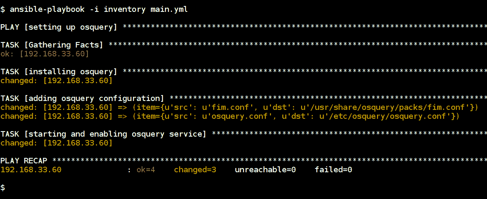

`osquery`设置操作手册在执行中

目标不仅仅是设置`osquery`，我们可以使用日志来构建一个使用我们的 Elastic 堆栈的集中式实时监控系统。我们可以使用 Filebeat 代理将这些日志转发到我们的 Elastic 堆栈，然后我们可以查看它们并构建一个用于警报和监控的集中式仪表板。

以下是`osquery`生成的日志的示例，我们可以看到`authorized_keys`文件在 2017 年 11 月 22 日 23:59:21.000 被 Ubuntu 用户修改：

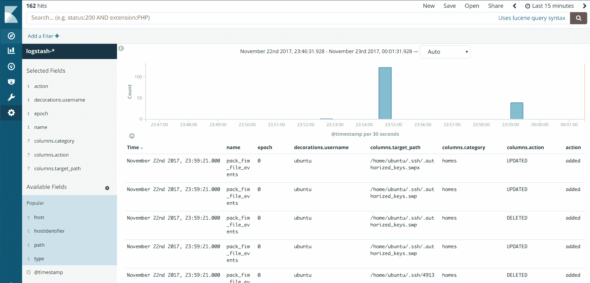

这个想法可以通过利用自动化 Ansible playbooks 对已知行动采取行动来构建一些自动化防御措施。

世界正在向容器迈进，这种监控方法可以让我们看到诸如内核安全检查和主机级文件完整性检查等底层事物。当攻击者试图绕过容器并访问主机以提升权限时，我们可以使用这种设置来检测并防御它们。

# 总结

容器正在迅速改变开发人员和运维团队的世界。变化的速度正在加快，在这个新世界中，安全自动化将起到重要作用。通过利用我们使用 Ansible 编写逐条命令的知识以及优秀的工具，如 Archore 和`osquery`，我们可以测量、分析和基准我们的容器的安全性。这使我们能够构建端到端的自动化流程，以确保、扫描和修复容器。

在下一章中，我们将探讨安全自动化的专用用例。我们将研究如何通过自动化部分任务来改进恶意软件分析。我们将特别关注集成了 Cuckoo 沙箱的轻量级动态分析工作流程，Cuckoo 沙箱是当前最流行的恶意软件分析工具之一。
