# 第九章：自动化取证收集和恶意软件分析的实验室设置

恶意软件是安全社区面临的最大挑战之一。它影响着所有与信息系统互动的人。尽管在保护操作系统免受恶意软件侵害方面需要付出大量努力，但在恶意软件防御方面的大部分工作都是关于理解它们的来源和能力。

这是 Ansible 可以用于自动化和启用恶意软件分析专家的部分。在本章中，我们将研究各种工作流程，这些工作流程都是为了使用像 Cuckoo Sandbox 等工具对恶意软件进行分类和分析。此外，我们还将研究为隔离环境创建 Ansible Playbooks 的各种用途，以及用于收集和存储取证工件的安全备份。

# 为隔离环境创建 Ansible Playbooks

我们将从使用 VirusTotal 开始，并转向具有 Windows 虚拟机的隔离网络中的 Cuckoo。恶意软件分析的另一个重要方面是能够使用**恶意软件信息共享平台**（**MISP**）共享威胁。我们还设置了 Viper（二进制管理和分析框架）来执行分析。

# 收集文件和域名恶意软件识别和分类

恶意软件分析的最初阶段之一是识别和分类。最流行的来源之一是使用 VirusTotal 进行扫描并获取恶意软件样本、域名信息等的结果。它拥有非常丰富的 API，并且许多人编写了利用该 API 进行自动扫描的自定义应用程序，使用 API 密钥来识别恶意软件类型。以下示例是在系统中设置 VirusTotal 工具、针对 VirusTotal API 扫描恶意软件样本，并识别其是否真的是恶意软件。它通常使用 60 多个杀毒扫描器和工具进行检查，并提供详细信息。

# 设置 VirusTotal API 工具

以下 playbook 将设置 VirusTotal API 工具（[`github.com/doomedraven/VirusTotalApi`](https://github.com/doomedraven/VirusTotalApi)），它在 VirusTotal 页面本身得到了官方支持：

```
- name: setting up VirusTotal
  hosts: malware
  remote_user: ubuntu
  become: yes

  tasks:
    - name: installing pip
      apt:
        name: "{{ item }}"

      with_items:
        - python-pip
        - unzip

    - name: checking if vt already exists
      stat:
        path: /usr/local/bin/vt
      register: vt_status

    - name: downloading VirusTotal api tool repo
      unarchive:
        src: "https://github.com/doomedraven/VirusTotalApi/archive/master.zip"
        dest: /tmp/
        remote_src: yes
      when: vt_status.stat.exists == False 

    - name: installing the dependencies
      pip:
        requirements: /tmp/VirusTotalApi-master/requirements.txt
      when: vt_status.stat.exists == False 

    - name: installing vt
      command: python /tmp/VirusTotalApi-master/setup.py install
      when: vt_status.stat.exists == False
```

Playbook 的执行将下载存储库并设置 VirusTotal API 工具，这将使我们准备好扫描恶意软件样本：

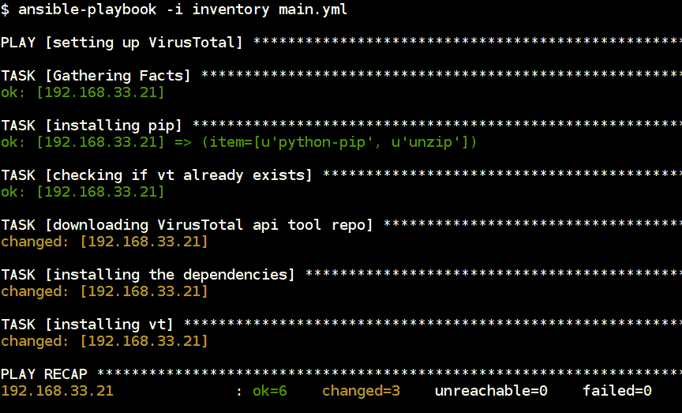

# 用于恶意软件样本的 VirusTotal API 扫描

一旦我们准备好设置，使用 Ansible playbook 运行扫描一系列恶意软件样本就像使用 Ansible playbook 一样简单。以下 playbook 将查找并将本地恶意软件样本复制到远程系统，并对其进行递归扫描并返回结果。完成扫描后，它将从远程系统中删除样本：

```
- name: scanning file in VirusTotal
  hosts: malware
  remote_user: ubuntu
  vars:
    vt_api_key: XXXXXXXXXXXXXXXXXXXXXXXXXXXXXXXXX #use Ansible-vault
    vt_api_type: public # public/private
    vt_intelligence_access: False # True/False
    files_in_local_system: /tmp/samples/
    files_in_remote_system: /tmp/sample-file/

  tasks:
    - name: creating samples directory
      file:
        path: "{{ files_in_remote_system }}"
        state: directory

    - name: copying file to remote system
      copy:
        src: "{{ files_in_local_system }}"
        dest: "{{ files_in_remote_system }}"
        directory_mode: yes

    - name: copying configuration
      template:
        src: config.j2
        dest: "{{ files_in_remote_system }}/.vtapi"

    - name: running VirusTotal scan
      command: "vt -fr {{ files_in_remote_system }}"
      args:
        chdir: "{{ files_in_remote_system }}"
      register: vt_scan

    - name: removing the samples
      file:
        path: "{{ files_in_remote_system }}"
        state: absent

    - name: VirusTotal scan results
      debug:
        msg: "{{ vt_scan.stdout_lines }}"
```

使用 VirusTotal API 对恶意软件样本进行扫描的结果如下。它返回恶意软件扫描报告的哈希值和指针，以获取详细结果：

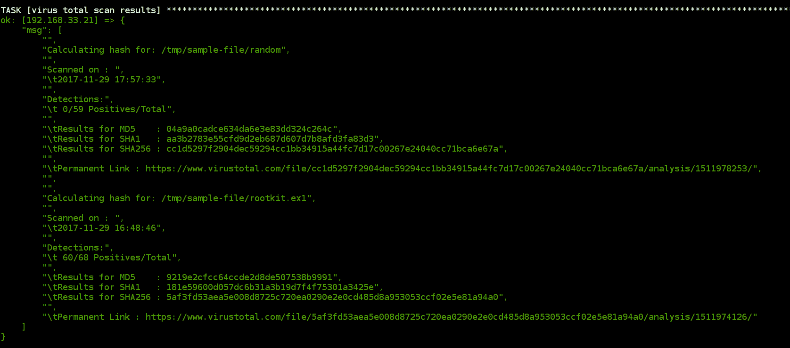

# 部署布谷鸟沙箱环境

**布谷鸟沙箱**是最流行的开源自动化恶意软件分析系统之一。它有很多集成来执行可疑文件的恶意软件分析。其设置要求包括依赖项和其他软件，如 VirtualBox、yara、ssdeep 和 volatility。此外，VM 分析是 Windows，需要一些先决条件才能进行分析。

阅读更多有关布谷鸟沙箱的信息，请访问[`cuckoosandbox.org`](https://cuckoosandbox.org)。

# 设置 Cuckoo 主机

以下 Ansible Playbook 将设置主机操作系统和 Cuckoo Sandbox 工作所需的依赖关系。这有不同的角色以安装 Ubuntu 操作系统中的所有必需软件包。

以下角色包括设置主机系统：

```
- name: setting up cuckoo
  hosts: cuckoo
  remote_user: ubuntu
  become: yes

  roles:
    - dependencies
    - virtualbox
    - yara
    - cuckoo
    - start-cukcoo
```

依赖关系角色具有很多必须安装的`apt`软件包以执行其他安装。然后，我们将为`tcpdump`软件包设置功能，以便 Cuckoo 可以访问它们进行分析：

```
- name: installing pre requirements
  apt:
    name: "{{ item }}"
    state: present
    update_cache: yes

  with_items:
    - python
    - python-pip
    - python-dev
    - libffi-dev
    - libssl-dev
    - python-virtualenv
    - python-setuptools
    - libjpeg-dev
    - zlib1g-dev
    - swig
    - tcpdump
    - apparmor-utils
    - mongodb
    - unzip
    - git
    - volatility
    - autoconf
    - libtool
    - libjansson-dev
    - libmagic-dev
    - postgresql
    - volatility
    - volatility-tools
    - automake
    - make
    - gcc
    - flex
    - bison

- name: setting capabilitites to tcpdump
  capabilities:
    path: /usr/sbin/tcpdump
    capability: "{{ item }}+eip"
    state: present

  with_items:
    - cap_net_raw
    - cap_net_admin
```

然后我们将安装 VirtualBox，以便 VM 分析可以安装在 VirtualBox 中。Cuckoo 使用 VirtualBox API 与 VM 分析进行交互以执行操作：

```
- name: adding virtualbox apt source
  apt_repository:
    repo: "deb http://download.virtualbox.org/virtualbox/debian xenial contrib"
    filename: 'virtualbox'
    state: present

- name: adding virtualbox apt key
  apt_key:
    url: "https://www.virtualbox.org/download/oracle_vbox_2016.asc"
    state: present

- name: install virtualbox
  apt:
    name: virtualbox-5.1
    state: present
    update_cache: yes
```

之后，我们将安装一些额外的软件包和工具供 Cuckoo 在分析中使用：

```
- name: copying the setup scripts
  template:
    src: "{{ item.src }}"
    dest: "{{ item.dest }}"
    mode: 0755

  with_items:
    - { src: "yara.sh", dest: "/tmp/yara.sh" }
    - { src: "ssdeep.sh", dest: "/tmp/ssdeep.sh" }

- name: downloading ssdeep and yara releases
  unarchive:
    src: "{{ item }}"
    dest: /tmp/
    remote_src: yes

  with_items:
    - https://github.com/plusvic/yara/archive/v3.4.0.tar.gz
    - https://github.com/ssdeep-project/ssdeep/releases/download/release-2.14.1/ssdeep-2.14.1.tar.gz

- name: installing yara and ssdeep
  shell: "{{ item }}"
  ignore_errors: yes

  with_items:
    - /tmp/yara.sh
    - /tmp/ssdeep.sh

- name: installing M2Crypto
  pip:
    name: m2crypto
    version: 0.24.0
```

自定义脚本具有安装`yara`和`ssdeep`软件包的构建脚本：

```
# yara script
#!/bin/bash

cd /tmp/yara-3.4.0
./bootstrap
./configure --with-crypto --enable-cuckoo --enable-magic
make
make install
cd yara-python
python setup.py build
python setup.py install

# ssdeep script
#!/bin/bash

cd /tmp/ssdeep-2.14.1
./configure
./bootstrap
make
make install
```

最后，我们将安装 Cuckoo 和其他必需的设置，例如将用户创建到`vboxusers`组。配置文件取自模板，因此这些将根据 VM 分析环境进行修改：

```
  - name: adding cuckoo to vboxusers
    group:
      name: cuckoo
      state: present

  - name: creating new user and add to groups
    user:
      name: cuckoo
      shell: /bin/bash
      groups: vboxusers, cuckoo
      state: present
      append: yes

  - name: upgrading pip, setuptools and cuckoo
    pip:
      name: "{{ item }}"
      state: latest

    with_items:
      - pip
      - setuptools
      - pydeep
      - cuckoo
      - openpyxl
      - ujson
      - pycrypto
      - distorm3
      - pytz
      - weasyprint

  - name: creating cuckoo home direcotry
    command: "cuckoo"
    ignore_errors: yes

  - name: adding cuckoo as owner
    file:
      path: "/root/.cuckoo"
      owner: cuckoo
      group: cuckoo
      recurse: yes
```

以下 playbook 将复制配置并启动 Cuckoo 和 Web 服务器以执行 Cuckoo 分析：

```
- name: copying the configurationss
  template:
    src: "{{ item.src }}"
    dest: /root/.cuckoo/conf/{{ item.dest }}

  with_items:
    - { src: "cuckoo.conf", dest: "cuckoo.conf"}
    - { src: "auxiliary.conf", dest: "auxiliary.conf"}
    - { src: "virtualbox.conf", dest: "virtualbox.conf"}
    - { src: "reporting.conf", dest: "reporting.conf"}

- name: starting cuckoo server
  command: cuckoo -d
  ignore_errors: yes

- name: starting cuckoo webserver
  command: "cuckoo web runserver 0.0.0.0:8000"
    args:
      chdir: "/root/.cuckoo/web"
  ignore_errors: yes
```

# 设置 Cuckoo Guest

大多数设置将需要在 Windows 操作系统中执行。以下指南将帮助您为 Cuckoo 分析设置 Windows Guest VM。请参阅[`cuckoo.sh/docs/installation/guest/index.html`](https://cuckoo.sh/docs/installation/guest/index.html)。

以下截图是参考，第一个适配器是 Host-only 适配器：

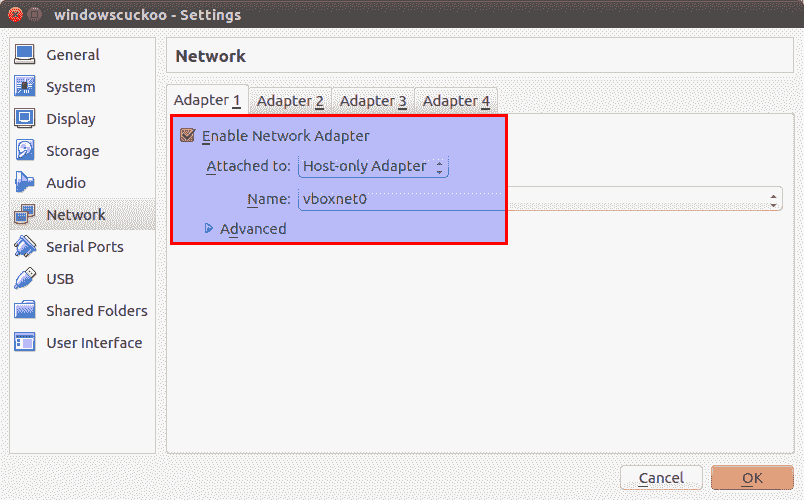

第二个适配器是 NAT：

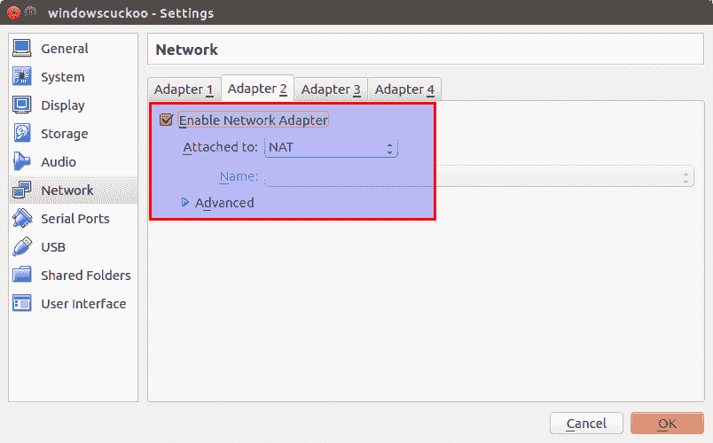

一旦 Windows VM 启动，我们需要安装 VirtualBox Guest Addition 工具。这允许 Cuckoo 使用名为 VBoxManage 的命令行实用程序执行分析：

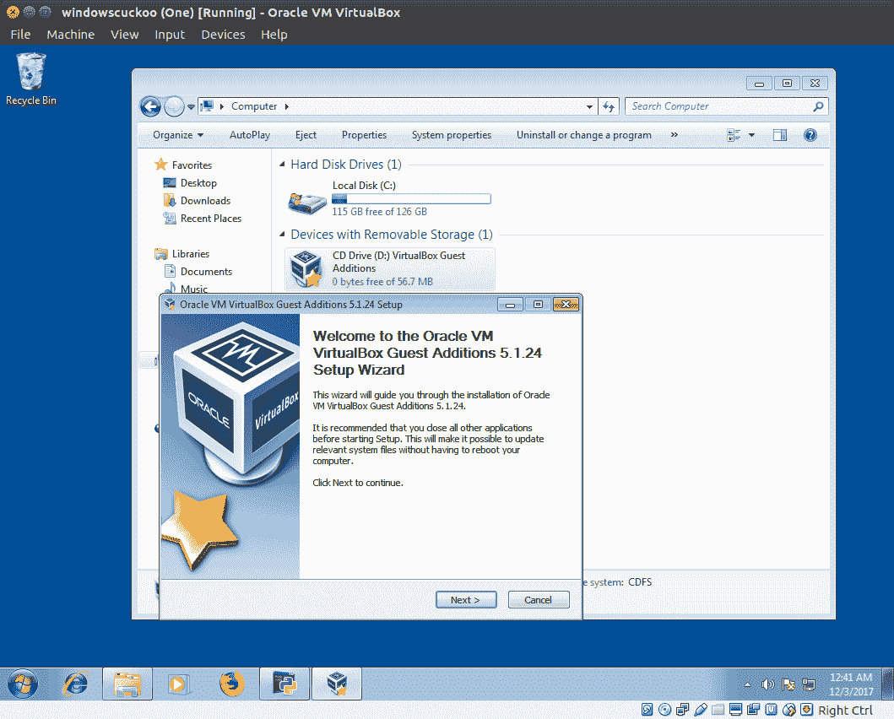

接下来，我们必须在本地安装 Python 以启动本地 Cuckoo 代理，我们可以从官方 Python 网站安装 Python：[`www.python.org/downloads/release/python-2714`](https://www.python.org/downloads/release/python-2714)。

现在从布谷鸟主机下载代理，在 Cuckoo 工作目录中的`agent`文件夹中可用。我们需要将其保留在 Windows VM 中，以便 Cuckoo 服务器与之交互：

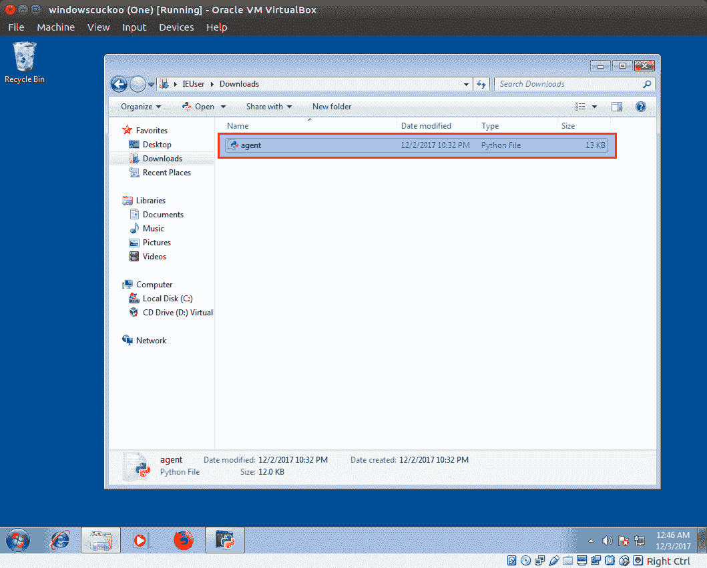

然后，我们必须使用`regedit`命令将 Python 文件路径添加到系统启动项中。这可以通过导航到`HKEY_LOCAL_MACHINE\SOFTWARE\Microsoft\Windows\Current\Version\Run`来完成。然后，在注册表编辑器的右侧添加新的字符串，名称为 Cuckoo，并在值部分中提供`agent.py`文件的完整路径： 

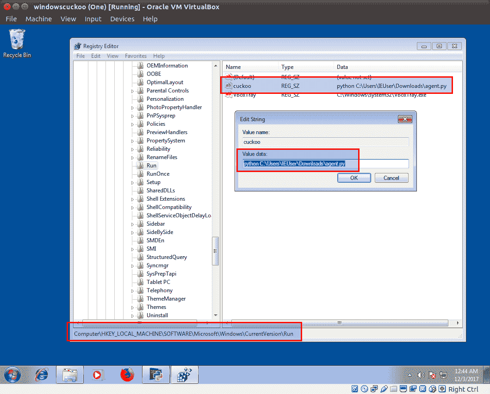

现在，我们可以拍摄快照并更新 Cuckoo 主机中的配置。完成后，我们准备启动 Cuckoo 服务器和 Web 服务器。

以下截图是 Cuckoo Web 服务器的首页。一旦我们提交了恶意软件样本，我们就可以点击“分析”开始：

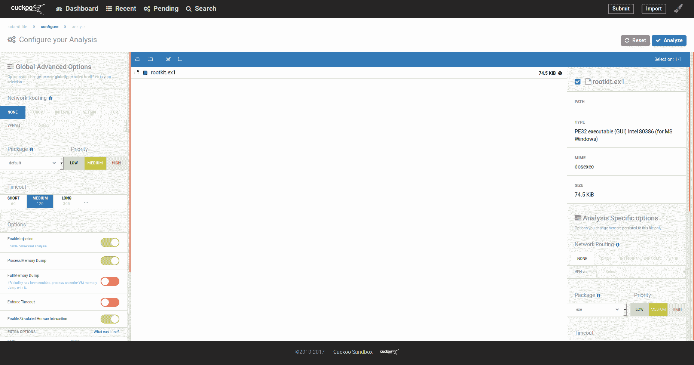

然后，将花费一些时间使用 VirtualBox Windows 虚拟机执行分析。这将根据您选择的选项执行分析：

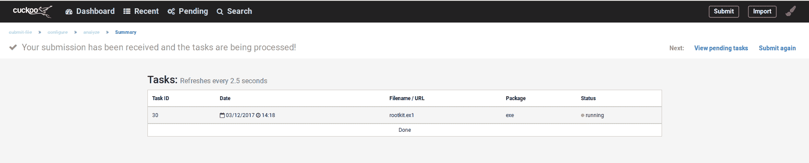

然后，它将提供有关样本的完整详细信息。其中包括已提交文件的校验和、Cuckoo 执行分析时的运行时执行截图和其他信息：

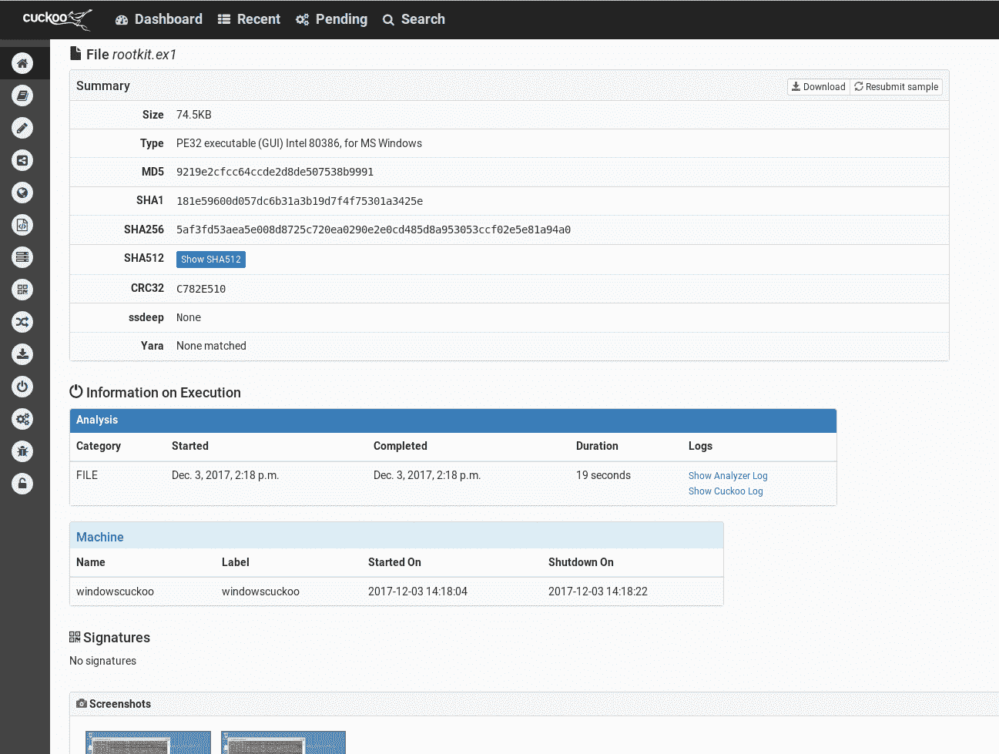

下面的截图是恶意软件样本的行为分析，其中包括进程树的详细分析。左侧菜单包含不同的选项，如放置文件、内存转储分析和数据包分析：

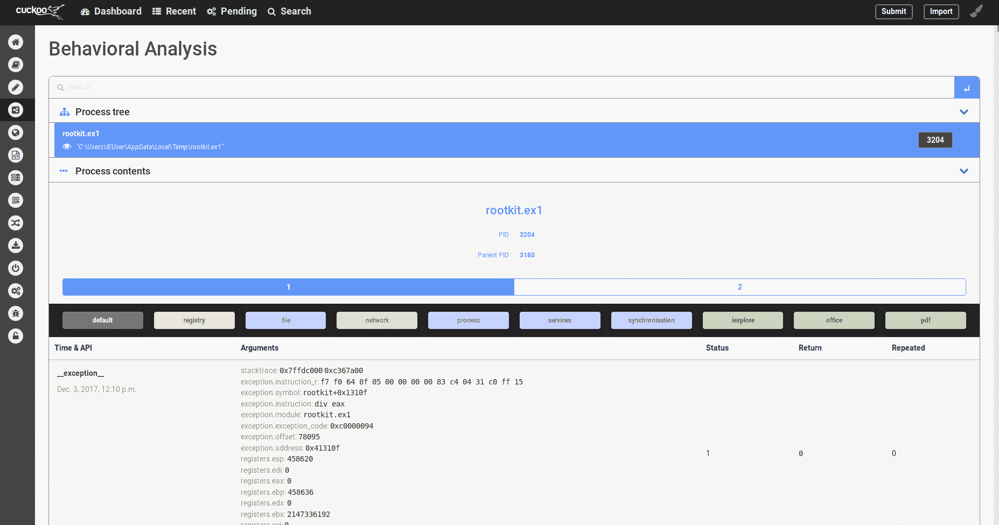

在 Cuckoo 文档中了解更多有关 Cuckoo 使用的信息：[`docs.cuckoosandbox.org/en/latest/usage`](http://docs.cuckoosandbox.org/en/latest/usage)。

# 使用 Ansible playbook 提交样本和报告

以下 playbook 将在本地系统路径中执行给定恶意软件样本文件的分析，并将报告返回给 使用 Ansible playbook：

```
- name: Cuckoo malware sample analysis
  hosts: cuckoo
  vars:
    local_binaries_path: /tmp/binaries

  tasks:
    - name: copying malware sample to cuckoo for analysis
      copy:
        src: "{{ local_binaries_path }}"
        dest: "/tmp/binaries/{{ Ansible_hostname }}"

    - name: submitting the files to cuckoo for analysis
      command: "cuckoo submit /tmp/binaries/{{ Ansible_hostname }}"
      ignore_errors: yes
```

下面的截图将恶意样本复制到 Cuckoo 分析系统，并使用 Ansible playbook 将这些文件提交进行自动化分析：

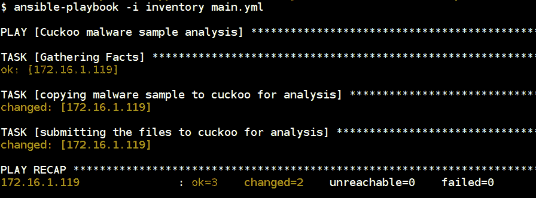

上面的截图将本地二进制文件复制到远程 Cuckoo 主机，并使用 Cuckoo 提交功能提交它们进行分析：

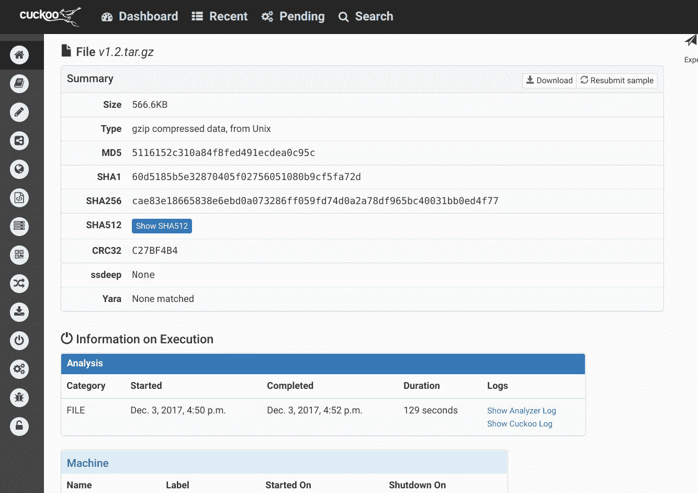

上述截图是我们的 Cuckoo 扫描提交使用 Ansible Playbook 提交的分析报告。

# 使用 Docker 容器设置 Cuckoo

这将允许我们使用 Docker 容器简化 Cuckoo 的设置。以下命令将允许我们使用 Docker 容器设置 Cuckoo 沙箱：

```
$ git clone https://github.com/blacktop/docker-cuckoo
$ cd docker-cuckoo
$ docker-compose up -d
```

下载 Docker 容器并配置它们以协同工作需要一些时间。安装完成后，我们可以使用`http://localhost`访问 Cuckoo：

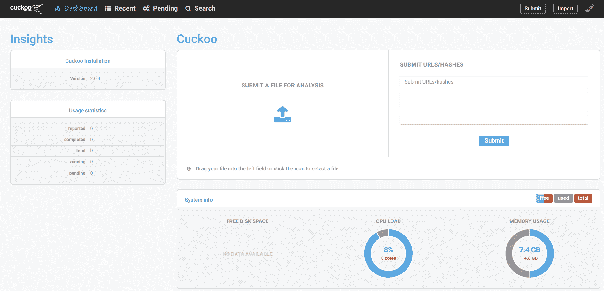

现在，我们可以将恶意软件样本或可疑文件提交给 Cuckoo 进行分析，使用工具集进行分析，它将返回详细的分析结果。在提交样本之前，我们还可以通过选择配置选项来选择进行哪些分析。

# 设置 MISP 和威胁共享

**恶意软件信息共享平台（MISP）**是一个开源的威胁共享平台（[`www.misp-project.org`](http://www.misp-project.org)）。它允许我们在已知的社区和组织内交换关于**高级持续威胁（APT）**和有针对性攻击的**威胁指标（IOCs）**。通过这样做，我们可以更多地了解不同的攻击和威胁，组织可以更容易地防御这些攻击。

使用**卢森堡计算机事件响应中心**（**CIRCL**）定制的虚拟机是开始使用这个平台的最简单方法，其中包括完整设置的最新版本。这个虚拟机经过定制，适用于不同的环境。

VM 和培训材料可在 [`www.circl.lu/services/misp-training-materials`](https://www.circl.lu/services/misp-training-materials) 找到。

# 使用 Ansible playbook 设置 MISP

我们也可以使用 Ansible playbooks 进行设置。根据我们的定制使用，社区中有多个可用的 playbooks：

+   [`github.com/juju4/Ansible-MISP`](https://github.com/juju4/Ansible-MISP)

+   [`github.com/StamusNetworks/Ansible-misp`](https://github.com/StamusNetworks/Ansible-misp)

使用现有的 Ansible playbooks 设置 MISP 就像克隆存储库并更新所需更改和配置的变量一样简单。在执行 playbook 之前，请确保更新变量：

```
$ git clone https://github.com/StamusNetworks/Ansible-misp.git
$ cd Ansible-misp
$ Ansible-playbook -i hosts misp.yaml
```

# MISP Web 用户界面

以下是 MISP 虚拟机的 Web 界面。以下是 MISP 虚拟机的默认凭据：

```
For the MISP web interface -> admin@admin.test:admin
For the system -> misp:Password1234
```

以下截图是**恶意软件信息共享平台**（**MISP**）的主页，带有登录面板：

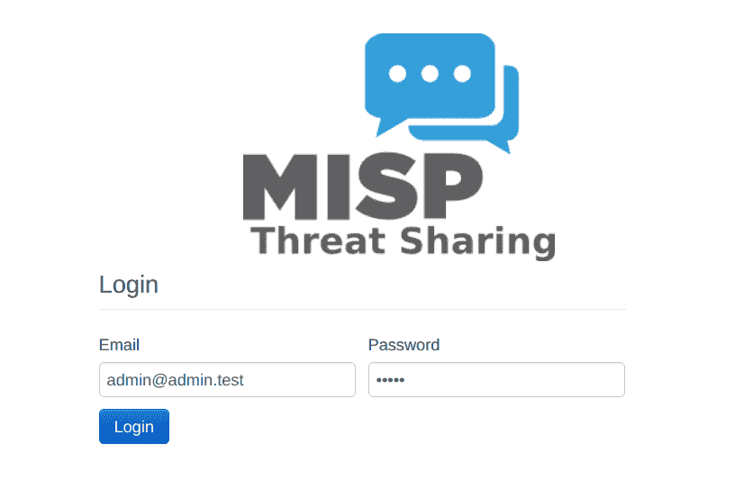

以下截图是 MISP 平台网页界面的主界面，包含了共享 IOCs、添加组织和执行访问控制等功能选项：

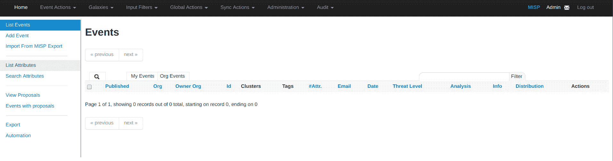

通过阅读 MISP 的文档了解不同的功能，可在 [`www.circl.lu/doc/misp/`](https://www.circl.lu/doc/misp/) 找到更多信息。

# 设置 Viper - 二进制管理和分析框架

**Viper**（[`viper.li`](http://viper.li)）是一个专为恶意软件和漏洞研究人员设计的框架。它提供了一个简单的解决方案，可以轻松地组织恶意软件和漏洞样本的集合。它为研究人员提供了 CLI 和 Web 界面，用于对二进制文件和恶意软件样本进行分析。

以下 playbook 将设置整个 Viper 框架。 它有两个角色，一个是设置运行 Viper 框架所需的依赖项，另一个是主要设置：

```
- name: Setting up Viper - binary management and analysis framework
  hosts: viper
  remote_user: ubuntu
  become: yes

  roles:
    - dependencies
    - setup
```

以下代码片段是用于设置依赖项和其他所需软件包的：

```
- name: installing required packages
  apt:
    name: "{{ item }}"
    state: present
    update_cache: yes

  with_items:
    - gcc
    - python-dev
    - python-pip
    - libssl-dev
    - swig

- name: downloading ssdeep release
  unarchive:
    src: https://github.com/ssdeep-project/ssdeep/releases/download/release-2.14.1/ssdeep-2.14.1.tar.gz
    dest: /tmp/
    remote_src: yes

- name: copy ssdeep setup script
  template:
    src: ssdeep.sh
    dest: /tmp/ssdeep.sh
    mode: 0755

- name: installing ssdeep
  shell: /tmp/ssdeep.sh
  ignore_errors: yes

- name: installing core dependencies
  pip:
    name: "{{ item }}"
    state: present

  with_items:
    - SQLAlchemy
    - PrettyTable
    - python-magic
    - pydeep
```

在这里，我们正在使用自定义 shell 脚本来设置`ssdeep`，它必须执行编译和构建：

```
#!/bin/bash

cd /tmp/ssdeep-2.14.1
./configure
./bootstrap
make
make install
```

设置角色将安装 Viper 软件包，所需的依赖项，并将启动 web 服务器以访问 Viper web 用户界面：

```
- name: downloading the release
  unarchive:
    src: https://github.com/viper-framework/viper/archive/v1.2.tar.gz
    dest: /opt/
    remote_src: yes

- name: installing pip dependencies
  pip:
    requirements: /opt/viper-1.2/requirements.txt

- name: starting viper webinterface
  shell: nohup /usr/bin/python /opt/viper-1.2/web.py -H 0.0.0.0 &
  ignore_errors: yes

- debug:
    msg: "Viper web interface is running at http://{{ inventory_hostname }}:9090"
```

以下截图指的是 Viper 框架设置的 playbook 执行。并返回 web 界面 URL 以进行访问：

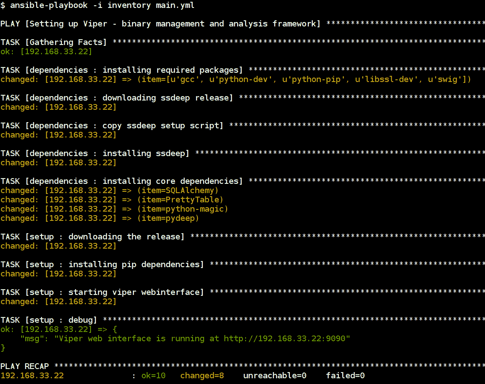

如果我们导航到`http://192.18.33.22:9090`，我们可以看到具有许多选项的 web 界面以使用此框架：

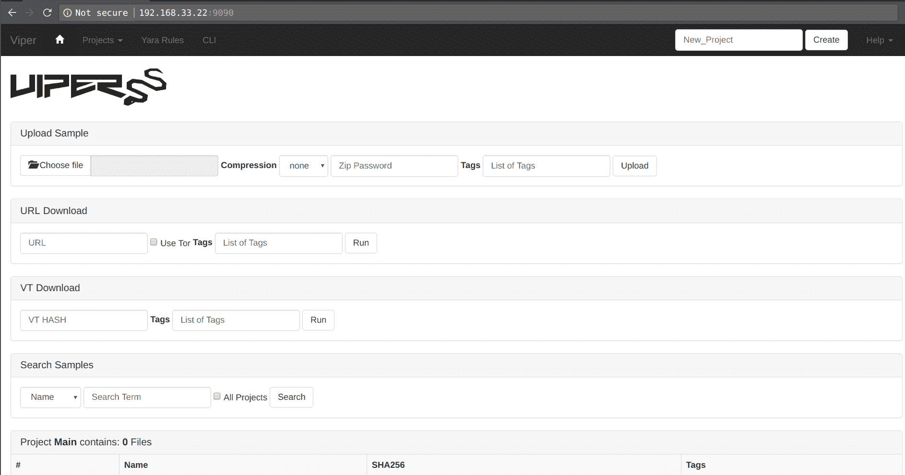

以下截图是我们分析的示例恶意软件的输出。此 Viper 框架还具有 YARA 规则集，VirusTotal API 和其他模块的模块支持，可以根据用例执行深度分析：

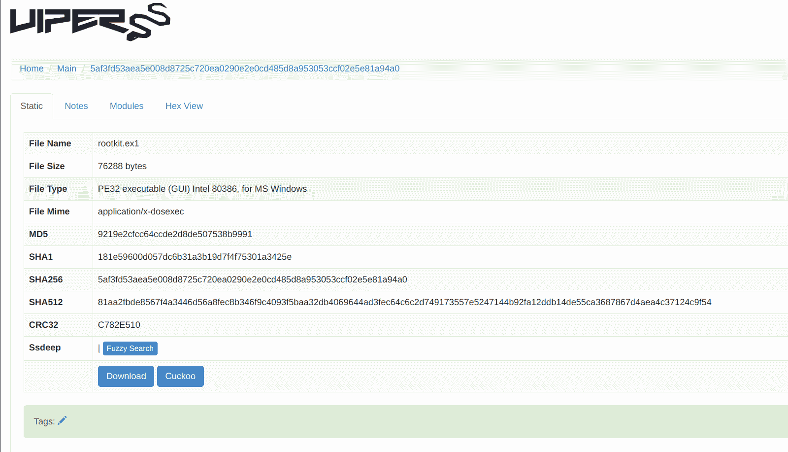

# 为收集和存储创建 Ansible playbook，同时安全备份取证工件

Ansible 是各种 bash 脚本的合适替代品。通常，对于大多数需要分析的活动，我们遵循一套固定模式：

1.  收集正在运行的进程的日志到已知路径的文件中

1.  定期将这些日志文件的内容复制到本地安全存储区或通过 SSH 或网络文件共享远程访问

1.  成功复制后，旋转日志

由于涉及一些网络活动，我们的 bash 脚本通常编写为在网络连接方面具有容错性并很快变得复杂。 Ansible playbook 可以用于执行所有这些操作，同时对每个人都很容易阅读。

# 收集用于事件响应的日志工件

事件响应中的关键阶段是**日志分析**。以下 playbook 将收集所有主机的日志并将其存储到本地。这使得响应者可以进行进一步分析：

```
# Reference https://www.Ansible.com/security-automation-with-Ansible

- name: Gather log files
  hosts: servers
  become: yes

  tasks:
    - name: List files to grab
      find:
        paths:
          - /var/log
        patterns:
          - '*.log*'
        recurse: yes
      register: log_files

    - name: Grab files
      fetch:
        src: "{{ item.path }}"
        dest: "/tmp/LOGS_{{ Ansible_fqdn }}/"
      with_items: "{{ log_files.files }}"
```

以下 playbook 执行将使用 Ansible 模块在远程主机中的指定位置收集日志列表，并将其存储在本地系统中。 playbook 的日志输出如下：

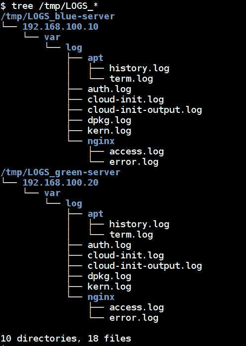

# 数据收集的安全备份

当从服务器中收集多组数据时，将其安全地存储并进行加密备份至关重要。这可以通过将数据备份到 S3 等存储服务来实现。

以下 Ansible playbook 允许我们安装并将收集的数据复制到启用了加密的 AWS S3 服务中：

```
- name: backing up the log data
  hosts: localhost
  gather_facts: false
  become: yes
  vars:
    s3_access_key: XXXXXXX # Use Ansible-vault to encrypt
    s3_access_secret: XXXXXXX # Use Ansible-vault to encrypt
    localfolder: /tmp/LOGS/ # Trailing slash is important
    remotebucket: secretforensicsdatausingAnsible # This should be unique in s3

  tasks:
    - name: installing s3cmd if not installed
      apt:
        name: "{{ item }}"
        state: present
        update_cache: yes

      with_items:
        - python-magic
        - python-dateutil
        - s3cmd

    - name: create s3cmd config file
      template:
        src: s3cmd.j2
        dest: /root/.s3cfg
        owner: root
        group: root
        mode: 0640

    - name: make sure "{{ remotebucket }}" is avilable
      command: "s3cmd mb s3://{{ remotebucket }}/ -c /root/.s3cfg"

    - name: running the s3 backup to "{{ remotebucket }}"
      command: "s3cmd sync {{ localfolder }} --preserve s3://{{ remotebucket }}/ -c /root/.s3cfg"
```

`s3cmd`配置的配置文件如下所示：

```
[default]
access_key = {{ s3_access_key }}
secret_key = {{ s3_access_secret }}
host_base = s3.amazonaws.com
host_bucket = %(bucket)s.s3.amazonaws.com
website_endpoint = http://%(bucket)s.s3-website-%(location)s.amazonaws.com/
use_https = True
signature_v2 = True
```

以下截图是上传数据到 S3 存储桶的 Ansible playbook 执行：

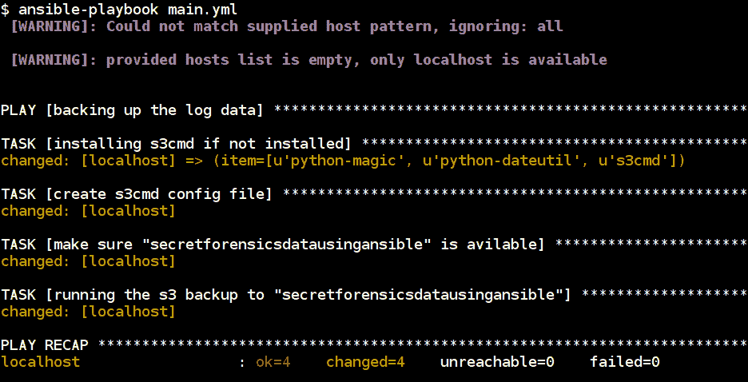

前面的屏幕截图显示了 Ansible 播放书安装`S3cmd`，创建了名为`secretforensicsdatausingAnsible`的新桶，并将本地日志数据复制到远程 S3 存储桶。

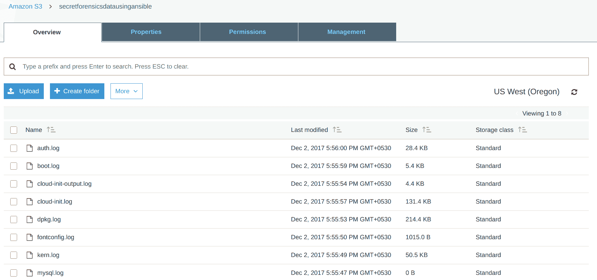

前面的屏幕截图是播放书的结果。我们可以看到日志已成功上传到 AWS S3 中的`secretforensicsdatausingAnsible` S3 存储桶中。

# 摘要

能够自动化用于恶意软件分析的各种工作流程，使我们能够扩展分析恶意软件的数量以及进行此类大规模分析所需的资源。这是解决每天在互联网上释放的恶意软件洪流并创建有用的防御措施的一种方式。

在下一章中，我们将继续创建一个用于安全测试的 Ansible 模块。我们将从理解基础知识开始，逐步学习创建模块，并利用 OWASP ZAP 的 API 来扫描网站。到本章结束时，您将拥有一个完整的模块，可用于 Ansible CLI 或 Ansible 播放书。
