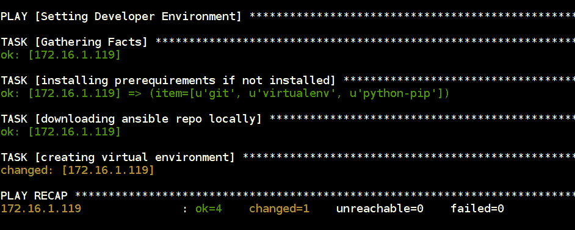
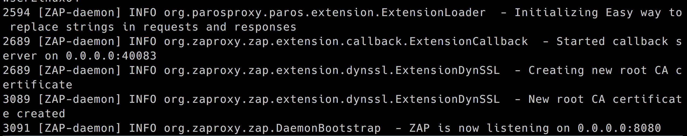
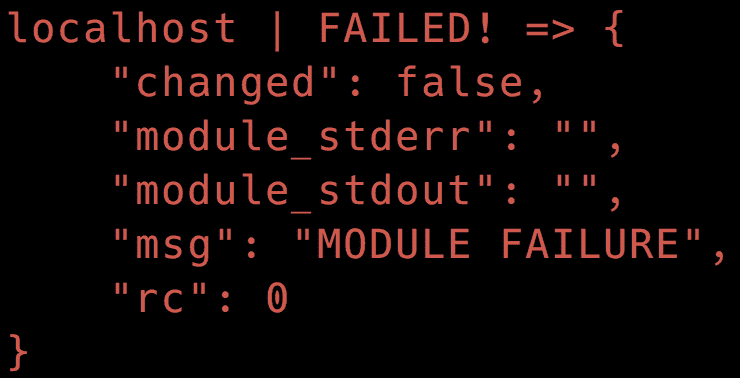
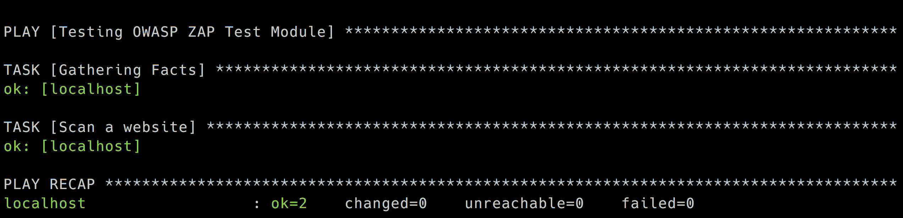

# 为安全测试编写 Ansible 模块

Ansible 主要通过将小块代码推送到其连接的节点来工作。这些代码/程序就是我们所知的 Ansible 模块。通常在 Linux 主机的情况下，这些代码通过 SSH 复制，执行，然后从节点中删除。

正如 Ansible 开发人员指南中所述（这是所有与 Ansible 相关事物的最佳资源）：

"Ansible 模块可以用任何可以返回 JSON 的语言编写。"

模块可以由 Ansible 命令行，在 playbook 中或通过 Ansible API 使用。Ansible 版本 2.4.x 已经内置了数百个模块。

查看 Ansible 文档网站上的模块索引：[`docs.ansible.com/ansible/latest/modules_by_category.html`](http://docs.ansible.com/ansible/latest/modules_by_category.html)。

目前，模块有 20 多个类别，包括云、存储、远程管理和 Windows 等类别。

有时候，尽管有了所有这些模块，您可能仍然需要编写自己的模块。本章将带您编写一个可以与 Ansible playbook 一起使用的模块。

Ansible 有一个非常详细的开发指南（[`docs.ansible.com/ansible/latest/dev_guide/index.html`](http://docs.ansible.com/ansible/latest/dev_guide/index.html)），如果您计划贡献您的模块以与 Ansible 一起发布，这是开始的最佳位置。

本章完全不打算取代它。考虑到，如果您计划为内部使用编写模块，并且您不介意分发它们，那么本章为您提供了一个简单易行的路径，我们最终将获得一个可用的模块，用于启用安全自动化，这一直是我们的目标。

我们将研究以下内容：

+   如何设置开发环境

+   编写一个 Ansible hello world 模块以了解基础知识

+   寻求进一步帮助的地方

+   定义一个安全问题陈述

+   通过编写我们自己的模块来解决这个问题

除此之外，我们将尝试理解并试图回答以下问题：

+   模块的良好使用案例是什么？

+   何时使用角色才有意义？

+   模块与插件有何不同？

让我们从一个简单的 hello world 模块开始。

# 开始使用一个简单的 hello world Ansible 模块

我们将向自定义模块传递一个参数，并根据此参数的执行情况显示模块执行成功或失败。

由于这一切对我们来说都是新的，我们将查看以下内容：

+   hello world 模块的源代码

+   该模块的成功和失败输出

+   我们将用来调用它的命令

在我们开始之前，所有这些都基于 Ansible 开发人员指南！以下代码是用 Python 编写的。

# 代码

我们在许多脚本任务中使用 Python，但我们并不是专家。但我们相信这段代码足够简单易懂：

```
from ansible.module_utils.basic import AnsibleModule

module = AnsibleModule(
    argument_spec=dict(
        answer=dict(choices=['yes', 'no'], default='yes'),
    )
)

answer = module.params['answer']
if answer == 'no':
    module.fail_json(changed=True, msg='Failure! We failed because we answered no.')

module.exit_json(changed=True, msg='Success! We passed because we answered yes.')
```

1.  我们正在导入一些模块。

1.  第二部分只是我们需要声明模块将接受的参数。

1.  在我们的代码中，我们可以引用参数的方式就像我们取得了 `answer` 变量的值一样。

1.  基于答案，如果是 `no`，我们表示失败。

1.  如果答案是 `yes`，我们表示成功。

让我们看看如果我们提供答案为 `yes` 时的输出是什么样子：

```
$ ANSIBLE_LIBRARY=. ansible -m ansible_module_hello_world.py -a answer=yes localhost

 [WARNING]: provided hosts list is empty, only localhost is available

localhost | SUCCESS => {
    "changed": true,
    "msg": "Success! We passed because we answered yes."
}
```

如果答案是 `no`：

```
$ ANSIBLE_LIBRARY=. ansible -m ansible_module_hello_world -a answer=no localhost

 [WARNING]: provided hosts list is empty, only localhost is available

localhost | FAILED! => {
    "changed": true,
    "failed": true,
    "msg": "Failure! We failed because we answered no."
}
```

输出中的主要区别是指示的 `SUCCESS` 或 `FAILED` 状态以及我们提供的消息。

由于到目前为止我们还没有设置开发环境，所以我们为此命令设置了一个环境变量：

+   `ANSIBLE_LIBRARY=.` 表示在当前目录中搜索要执行的模块

+   使用 `-m`，我们调用我们的模块

+   使用 `-a`，我们传递模块参数，在这种情况下是可能值为 `yes` 或 `no`

+   我们以我们要在其上运行模块的主机结束，对于此示例，它是本地的

尽管 Ansible 是用 Python 编写的，请注意模块可以用任何能够返回 JSON 消息的语言编写。对于 Ruby 程序员来说，一个很好的起点是 Github 上的 Ansible for Rubyists ([`github.com/ansible/ansible-for-rubyists`](https://github.com/ansible/ansible-for-rubyists)) 仓库。Packt 出版的《Learning Ansible》第五章也涵盖了这一点。

# 设置开发环境

Ansible 2.4 的主要要求是 Python 2.6 或更高版本和 Python 3.5 或更高版本。如果你安装了其中之一，我们可以按照简单的步骤进行开发环境设置。

来自 Ansible 开发者指南：

1.  克隆 Ansible 仓库：`$ git clone https://github.com/ansible/ansible.git`

1.  切换到仓库根目录：`$ cd ansible`

1.  创建虚拟环境：`$ python3 -m venv venv`（或对于 Python 2 `$ virtualenv venv`

1.  注意，这需要你安装 `virtualenv` 包：`$ pip install virtualenv`

1.  激活虚拟环境：`$ . venv/bin/activate`

1.  安装开发要求：`$ pip install -r requirements.txt`

1.  对每个新的 dev shell 进程运行环境设置脚本：`$ . hacking/env-setup`

此时你应该得到一个 `venv` 提示符。以下是设置开发环境的一个简单 Playbook。

以下 Playbook 将通过安装和设置虚拟环境来设置开发环境：

```
- name: Setting Developer Environment
  hosts: dev
  remote_user: madhu
  become: yes
  vars:
    ansible_code_path: "/home/madhu/ansible-code"

  tasks:
    - name: installing prerequirements if not installed
      apt:
        name: "{{ item }}"
        state: present
        update_cache: yes

      with_items:
        - git
        - virtualenv
        - python-pip

    - name: downloading ansible repo locally
      git:
        repo: https://github.com/ansible/ansible.git
        dest: "{{ ansible_code_path }}/venv"

    - name: creating virtual environment
      pip:
        virtualenv: "{{ ansible_code_path }}"
        virtualenv_command: virtualenv
        requirements: "{{ ansible_code_path }}/venv/requirements.txt"
```

以下屏幕截图显示了使用 Python 虚拟环境编写自己的 Ansible 模块设置开发环境的 Playbook 执行：



# 计划和需要注意的事项

Ansible 开发者指南中有一个关于如何开发模块的部分 ([`docs.ansible.com/ansible/latest/dev_guide/developing_modules.html#should-you-develop-a-module`](http://docs.ansible.com/ansible/latest/dev_guide/developing_modules.html#should-you-develop-a-module)).

在该部分中，他们有多个关于继续开发模块前需要注意的要点。

是否已经存在类似的模块？检查当前的模块是否已经做了你计划构建的事情总是一个好主意。好消息是，到目前为止还没有人建立一个**开放式 Web 应用程序安全项目**（**OWASP**）**Zed Attack Proxy**（**ZAP**）模块。

是否有人已经在类似的 *Pull Request* 上工作？再次强调，也许这个模块还没有发布，但这并不意味着人们还没有在上面工作。文档提供了三个方便的链接，以检查是否已经有类似的 PR 存在。

另外，它询问是否应该查看一个动作插件或角色，而不是一个模块。我们认为开发模块对我们来说是有道理的主要原因是它将在节点上运行。如果 ZAP 已经在运行，ZAP 提供了一个 API 端点，我们打算让我们的模块可以方便地在托管的 ZAP 实例上运行 ZAP 扫描。

所以，现在的计划是：

1.  创建一个模块，将连接到托管的 ZAP 实例。

1.  为模块提供两个主要信息：

    +   托管 ZAP 的 IP 地址

    +   扫描目标 URL

1.  通过调用该模块，我们将有一个任务来扫描目标应用程序。

# OWASP ZAP 模块

OWASP ZAP 有一个我们可以使用的 API。此外，有一个用于消费 API 的 Python 模块。我们将尝试使用它来学习如何编写自己的 Ansible 模块。

# 使用 Docker 创建 ZAP

对于我们的开发，让我们使用一个 Docker 容器来启动 ZAP。由于我们计划使用 API，我们将在无头模式下运行容器：

```
$ docker run -u zap -p 8080:8080 -i owasp/zap2docker-stable zap.sh -daemon -host 0.0.0.0 -port 8080 -config api.disablekey=true -config api.addrs.addr.name=.* -config api.addrs.addr.regex=true
```

命令的解释

+   当我们进行开发时，我们可以禁用 API 密钥：`-config api.disablekey=true`

+   允许从任何 IP 访问 API：`-config api.addrs.addr.name=.* -config api.addrs.addr.regex=true`

+   监听端口 `8080`

如果一切正常，你将看到以下输出：

****

# 创建一个易受攻击的应用程序

对于一个易受攻击的应用程序，我们可以托管一个自己的，但让我们使用同一个在线易受攻击的应用程序，我们在 第五章 中用于 OWASP ZAP + Jenkins 集成的：*自动化* *Web 应用程序安全测试使用 OWASP ZAP - *[`testphp.vulnweb.com/`](http://testphp.vulnweb.com/)

# Ansible 模块模板

我们将使用模块开发指南中给出的示例代码来开始：[`docs.ansible.com/ansible/latest/dev_guide/developing_modules_general.html#new-module-development`](http://docs.ansible.com/ansible/latest/dev_guide/developing_modules_general.html#new-module-development)。

这个模板有一个注释齐全的代码，写得让我们很容易开始。代码分为以下几部分：

+   元数据

+   文档化模块

+   我们将要使用的函数

# 元数据

这个部分包含有关模块的信息：

```
ANSIBLE_METADATA = {
    'metadata_version': '1.1',
    'status': ['preview'],
    'supported_by': 'community'
}
```

这个模块没有官方支持，因此使用了 `community`。

# 文档化模块

模块文档是从模块代码本身生成的。 现在创建的模块必须有 `DOCUMENTATION` 文档字符串。

开始的最简单方法是查看此示例：[`github.com/ansible/ansible/blob/devel/examples/DOCUMENTATION.yml`](https://github.com/ansible/ansible/blob/devel/examples/DOCUMENTATION.yml)。

此处所需的字段清单为：

+   `module`：模块名称

+   `short_description`：简短描述

+   `description`：描述

+   `version_added`：由 `X.Y` 指示

+   `author`：您的姓名和 Twitter/GitHub 用户名

+   `options`：模块支持的每个选项

+   `notes`：模块用户应该注意的任何其他事项

+   `requirements`：我们列出额外的包要求

有关字段的更多详细信息，请访问[`docs.ansible.com/ansible/latest/dev_guide/developing_modules_documenting.html#fields`](http://docs.ansible.com/ansible/latest/dev_guide/developing_modules_documenting.html#fields)。

# 源代码模板

这里有一些我们将用来编写模块的源代码片段。我们已经讨论了元数据和文档部分。我们还需要为示例和模块将返回的内容编写文档字符串。

我们的导入模块 - 我们可以在这里导入构建模块所需的所有模块：

```
from ansible.module_utils.basic import AnsibleModule
```

主要代码块 - 在函数 `run_module` 中，我们进行以下工作：

1.  定义模块正常工作所需的所有参数。

1.  初始化结果字典。

1.  创建 `AnsibleModule` 对象并传递可能需要的公共属性：

```
def run_module():
    # define the available arguments/parameters that a user can pass to
    # the module
    module_args = dict(
        name=dict(type='str', required=True),
        new=dict(type='bool', required=False, default=False)
    )

    # seed the result dict in the object
    # we primarily care about changed and state
    # change is if this module effectively modified the target
    # state will include any data that you want your module to pass back
    # for consumption, for example, in a subsequent task
    result = dict(
        changed=False,
        original_message='',
        message=''
    )

    # the AnsibleModule object will be our abstraction working with Ansible
    # this includes instantiation, a couple of common attr would be the
    # args/params passed to the execution, as well as if the module
    # supports check mode
    module = AnsibleModule(
        argument_spec=module_args,
        supports_check_mode=True
    )
```

1.  处理异常和结果：

```
 # during the execution of the module, if there is an exception or a
    # conditional state that effectively causes a failure, run
    # AnsibleModule.fail_json() to pass in the message and the result
    if module.params['name'] == 'fail me':
        module.fail_json(msg='You requested this to fail', **result)

    # in the event of a successful module execution, you will want to
    # simple AnsibleModule.exit_json(), passing the key/value results
    module.exit_json(**result)
```

只需记住以下几点：

+   如果遇到任何错误或异常，我们调用 `AnsibleModule` 对象的 `fail_json` 函数

+   如果一切顺利，我们调用相同对象的 `exit_json` 函数

调用我们的功能完成代码：

```
def main():
    run_module()

if __name__ == '__main__':
    main()
```

目前，我们已经准备好了以下工作，并准备进行下一步：

| 模块代码模板 | 就绪 |
| --- | --- |
| 我们需要扫描的易受攻击应用程序（目标） | 就绪 |
| 启用 API 并在无头模式下运行的 OWASP ZAP 代理（主机和端口） | 就绪 |
| 我们可以参考的 OWASP ZAP Python API 代码 | 待定 |

我们希望专注于编写 Ansible 模块，而不是花时间学习完整的 OWASP ZAP API。虽然我们建议您这样做，但等到模块正常工作后再学习也可以。

# OWASP ZAP Python API 示例脚本

OWASP ZAP Python API 包带有一个非常实用的脚本，完整涵盖了对 Web 应用程序进行爬行和主动扫描的代码。

从[`github.com/zaproxy/zaproxy/wiki/ApiPython#an-example-python-script`](https://github.com/zaproxy/zaproxy/wiki/ApiPython#an-example-python-script)下载代码进行学习。

这里有一些我们目前感兴趣的样本代码片段。 导入用于 OWASP ZAP 的 Python API 客户端。 这通过 `pip install python-owasp-zap-v2.4` 安装：

```
from zapv2 import ZAPv2
```

现在，我们连接到 ZAP 实例 API 端点。我们可以将主机和端口提供给我们模块的 OWASP ZAP 实例作为参数：

```
zap = ZAPv2(apikey=apikey, proxies={'http': 'http://127.0.0.1:8090', 'https': 'http://127.0.0.1:8090'})
```

提供我们想要扫描的网站的主机/IP 地址：

```
zap.urlopen(target)
# Give the sites tree a chance to get updated
time.sleep(2)

print 'Spidering target %s' % target
scanid = zap.spider.scan(target)

# Give the Spider a chance to start
time.sleep(2)
while (int(zap.spider.status(scanid)) < 100):
    print 'Spider progress %: ' + zap.spider.status(scanid)
    time.sleep(2)

print 'Spider completed'
# Give the passive scanner a chance to finish
time.sleep(5)

print 'Scanning target %s' % target
scanid = zap.ascan.scan(target)
while (int(zap.ascan.status(scanid)) < 100):
    print 'Scan progress %: ' + zap.ascan.status(scanid)
    time.sleep(5)

print 'Scan completed'

# Report the results

print 'Hosts: ' + ', '.join(zap.core.hosts)
print 'Alerts: '
pprint (zap.core.alerts())
```

此代码是我们在模块中使用的一个很好的起始模板。

在这里，我们准备好了可以参考的 OWASP ZAP Python API 代码。

连接到 ZAP 实例。此时，我们复制了代码的重要部分，即：

1.  连接到目标。

1.  启动爬虫和主动安全扫描。

但是我们很快遇到了一个错误。在异常期间我们返回了一个字符串，这显然不符合 Ansible 所需的 JSON 格式。

这导致了一个错误，我们没有足够的信息来采取行动



Ansible 模块应该只返回 JSON，否则您可能会看到像上面那样的难以理解的错误

在[`docs.ansible.com/ansible/latest/dev_guide/developing_modules_best_practices.html#conventions-best-practices-and-pitfalls`](http://docs.ansible.com/ansible/latest/dev_guide/developing_modules_best_practices.html#conventions-best-practices-and-pitfalls)中快速阅读惯例、最佳实践和陷阱为我们解释了问题。

如果您在编写模块过程中遇到任何问题，我们强烈建议您阅读本指南：[`docs.ansible.com/ansible/latest/dev_guide/developing_modules_best_practices.html#conventions-best-practices-and-pitfalls`](http://docs.ansible.com/ansible/latest/dev_guide/developing_modules_best_practices.html#conventions-best-practices-and-pitfalls)。

使用 OWASP ZAP API 文档来了解更多信息：[`github.com/zaproxy/zaproxy/wiki/ApiGen_Index`](https://github.com/zaproxy/zaproxy/wiki/ApiGen_Index)。

# 完整的代码清单

此代码也可以在 GitHub 上找到（[`github.com/appsecco/ansible-module-owasp-zap`](https://github.com/appsecco/ansible-module-owasp-zap)）。所有注释、元数据和文档字符串都已从此列表中删除：

```
try: 
    from zapv2 import ZAPv2
    HAS_ZAPv2 = True
except ImportError:
    HAS_ZAPv2 = False 

from ansible.module_utils.basic import AnsibleModule
import time
def run_module():
    module_args = dict(
        host=dict(type='str', required=True),
        target=dict(type='str', required=True)
    )

    result = dict(
        changed=False,
        original_message='',
        message=''
    )

    module = AnsibleModule(
        argument_spec=module_args,
        supports_check_mode=True
    )

    if not HAS_ZAPv2:
        module.fail_json(msg = 'OWASP python-owasp-zap-v2.4 required. pip install python-owasp-zap-v2.4')

if module.check_mode:
    return result
host = module.params['host']
target = module.params['target']
apikey = None
zap = ZAPv2(apikey=apikey, proxies={'http':host,'https':host})
zap.urlopen(target)
try:
    scanid = zap.spider.scan(target)
    time.sleep(2)
    while (int(zap.spider.status(scanid)) < 100):
        time.sleep(2)
except:
    module.fail_json(msg='Spidering failed')
time.sleep(5)

try:
    scanid = zap.ascan.scan(target)
    while (int(zap.ascan.status(scanid)) < 100):
        time.sleep(5)
except:
    module.fail_json(msg='Scanning failed')

result['output'] = zap.core.alerts()
result['target'] = module.params['target']
result['host'] = module.params['host']
module.exit_json(**result)

def main():
    run_module()
if __name__ == '__main__':
    main()
```

根据被爬取和扫描的网站不同，这可能需要一些时间来完成。在执行结束时，您将在`results['output']`中获得扫描结果。

# 运行模块

我们运行模块的选择如下：

1.  我们将其复制到 Ansible 库的标准路径。

1.  每当我们有我们的模块文件时，我们都会提供一个路径到 Ansible 库。

1.  通过 playbook 运行此文件。

以下命令将调用我们的模块以供我们测试并查看结果：

```
ansible -m owasp_zap_test_module localhost -a "host=http://172.16.1.102:8080 target=http://testphp.vulnweb.com" -vvv
```

命令的解释

+   `ansible`命令行

+   `-m`用于提供模块名称，即`owasp_zap_test_module`

+   它将在`localhost`上运行

+   `-a`允许我们传递`host`和`target`模块参数

+   `-vvv` 用于输出的详细程度。

# 模块的 playbook

这是一个简单的 playbook，用于测试一切是否正常运行：

```
- name: Testing OWASP ZAP Test Module
  connection: local
  hosts: localhost
  tasks:
  - name: Scan a website
    owasp_zap_test_module:
      host: "http://172.16.1.102:8080"
      target: "http://testphp.vulnweb.com"
```

使用此命令执行 playbook：

```
ansible-playbook owasp-zap-site-scan-module-playbook.yml
```



重要的一点要记住的是，仅仅因为我们有一个可用的模块，并不意味着 Ansible 的优秀工程师们会自动接受我们的模块并将其随软件的下一个版本一起发布。我们的模块要能够被所有人使用，还需要进行大量的额外工作。

通常，最好的指南是本章前面提到的开发人员指南。

我们的模块中可以添加的一个简单的功能是能够将 API 密钥作为参数发送。大多数用于常规扫描的 ZAP 实例已经配置了这个。此外，当在 playbook 中存储时，此密钥可以由 Ansible vault 保护。

# 添加 API 密钥作为参数

只需做出以下更改，我们就能够将`apikey`添加为一个参数：

+   首先，我们将其添加到第 76-78 行的`module_args`字典中：`apikey=dict(type='str',required=False,default=None)`

+   然后，我们检查 `module.params['apikey']` 是否设置为`None`的值

+   如果不是，将其设置为 `apikey = module.params['apikey']`

+   现在，如果模块与 Ansible 命令行工具一起使用，请将其与 `target` 和 `host` 一起传递，如果在 playbook 中使用，请在那里传递

# 将扫描类型添加为参数

如果你迄今为止一直在跟进，你可能意识到我们运行的扫描是一个主动扫描。扫描器会对目标发送攻击流量进行主动扫描。

由于这个事实，有时如果网站很大，完成可能需要很长时间。

有关主动扫描的更多信息，请访问[`github.com/zaproxy/zap-core-help/wiki/HelpStartConceptsAscan`](https://github.com/zaproxy/zap-core-help/wiki/HelpStartConceptsAscan)。

我们希望添加一个参数，以便能够提供要运行的扫描类型。到目前为止，我们有两种类型：

+   **主动**：发送攻击流量

+   **被动扫描**：在蜘蛛爬取阶段下载的所有站点文件都会被解析

我们首先将其作为`module_args`的一部分添加：

```
module_args = dict(
    host=dict(type='str', required=True),
    target=dict(type='str', required=True),
    apikey=dict(type='str',required=False,default=None),
    scantype=dict(default='passive', choices=['passive','active'])
)
```

新添加的行已加粗以突出显示更改。请注意，我们现在定义了默认值，并且当前只允许这个参数有两个选择。因此，如果未设置任何值，则执行更快、更少侵入性的被动扫描。

我们需要将模块参数的值放入名为`scantype`的变量中：

```
scantype = module.params['scantype']
```

现在逻辑改变以适应两个可能的值：

```
if scantype == 'active':
    try:
        scanid = zap.ascan.scan(target)
        while (int(zap.ascan.status(scanid)) < 100):
            time.sleep(5)
    except:
        module.fail_json(msg='Active Scan Failed')
else:
    try:
        while (int(zap.pscan.records_to_scan) > 0):
            time.sleep(2)
    except:
        module.fail_json(msg='Passive Scan Failed')
```

如果`scantype`已设置且值为`active`，那么它才会进行主动扫描。这个改进使我们的模块更加灵活：

```
Using the new and improved module in our playbook
- name: Testing OWASP ZAP Test Module
  connection: local
  hosts: localhost
  tasks:
  - name: Scan a website
    owasp_zap_test_module:
      host: "http://172.16.1.102:8080"
      target: "http://testphp.vulnweb.com"
      scantype: passive
    register: output
  - name: Print version
    debug:
      msg: "Scan Report: {{ output }}"
```

# 使用 Ansible 作为 Python 模块

直接在您的 Python 代码中使用 Ansible 是一种与其交互的强大方式。请注意，使用 Ansible 2.0 及更高版本时，这并不是最简单的方法。

在继续之前，我们应该告诉你核心 Ansible 团队对直接使用 Python API 的看法

从 http://docs.ansible.com/ansible/latest/dev_guide/developing_api.html

请注意，虽然我们提供了此 API，但它不适用于直接使用，它在这里是为了支持 Ansible 命令行工具。我们尽量不会进行破坏性更改，但如果对 Ansible 工具集有意义，我们保留随时进行更改的权利。

以下文档提供给那些仍然希望直接使用 API 的人，但请注意，这不是 Ansible 团队支持的内容。

以下代码来自 Ansible 开发者指南文档：[`docs.ansible.com/ansible/latest/dev_guide/developing_api.html`](http://docs.ansible.com/ansible/latest/dev_guide/developing_api.html)：

```
import json
from collections import namedtuple
from ansible.parsing.dataloader import DataLoader
from ansible.vars.manager import VariableManager
from ansible.inventory.manager import InventoryManager
from ansible.playbook.play import Play
from ansible.executor.task_queue_manager import TaskQueueManager
from ansible.plugins.callback import CallbackBase
```

一旦所有的初始工作都完成了，任务将会这样执行：

```
try</span>:
    tqm = TaskQueueManager(
              inventory=inventory,
              variable_manager=variable_manager,
              loader=loader,
              options=options,
              passwords=passwords,
              stdout_callback=results_callback,  # Use our custom callback instead of the ``default`` callback plugin
          )
    result = tqm.run(play)
```

在 Ansible 2.0 之前，整个过程要简单得多。但是这段代码现在不再适用了：

```
import ansible.runner

runner = ansible.runner.Runner(
   module_name='ping',
   module_args='',
   pattern='web*',
   forks=10
)
datastructure = runner.run()
```

# 总结

在这一章中，我们创建了一个用于安全自动化的工作中的 Ansible 模块。我们首先创建了一个类似于 hello world 的模块，虽然功能不多，但帮助我们理解了一个模块文件可能是什么样子的布局。我们按照 Ansible 开发者指南的说明设置了一个能够进行模块开发的环境。我们阐述了我们对模块的需求，并选择了 OWASP ZAP 作为创建模块的可能候选者。

使用开发者文档中的模板等辅助工具，我们创建了该模块，并学习了如何使用 Ansible CLI 或 playbook 使用它。我们在原始代码中添加了几个选项，以使模块更加实用和灵活。现在我们有了一个能够连接到任何允许使用 API 密钥访问并在目标上执行被动或主动扫描的 OWASP ZAP Ansible 模块。

这是本书的倒数第二章。在下一章中，我们将查看额外的参考资料，使用 Ansible Vault 保护我们的机密信息，以及一些已经使用 Ansible 实现的世界级安全自动化的参考资料。
