# Ansible 安全最佳实践、参考资料和深入阅读

上一章。我们终于到达了这里。是时候反思我们一起学到了什么了。是时候列出你应该从哪里开始了。最重要的是，有一些主题将增强您使用 Ansible 的体验。

本章中我们将涵盖的一些主题如下：

+   使用 Ansible Vault 以及为什么应该将所有机密信息存储在 vault 中

+   使用 Ansible Galaxy 分享 playbooks 和角色

+   保护主控制器

+   附加参考资料

+   期待 Ansible 2.5 中的新功能和即将推出的内容。

# 使用 Ansible Vault

Ansible Vault 是一个命令行实用程序，默认与 Ansible 一起安装。它允许我们加密诸如密钥、凭据、密码等机密信息以包含在我们的 playbooks 中。通过这样做，我们还可以使用这些加密文件与他人共享，因为它们包含密码保护以访问加密数据。我们可以使用此功能在我们的 playbooks 中加密变量、模板和文件。

Ansible 版本 2.3 支持使用 Ansible 单个加密变量以及带有 `!vault` 标签的 Ansible 单个加密变量来加密单个变量。我们将在下一节中看到一些示例，了解我们将如何在 playbooks 中使用它。

在 [`docs.ansible.com/ansible/latest/vault.html`](https://docs.ansible.com/ansible/latest/vault.html) 中了解更多关于 Ansible Vault 的信息。

由于这是一种非常简单而强大的存储和管理机密数据的方式，因此在我们的 playbooks 中使用 Ansible Vault 存储所有机密信息非常重要。

一些非常好的用例包括我们如何在不更改版本控制系统、CI/CD 集成管道等情况下使用这些 playbooks。

# 如何在变量和文件中使用 Ansible Vault

以下示例演示了如何在我们的 playbook 变量文件中使用机密。

让我们以在 Ubuntu 操作系统中安装 MySQL 服务器为例，使用以下 playbook。根据 Ansible 文档，最好将 Vault 变量和普通变量分开存储。

以下代码片段是安装 MySQL 服务器的高级文件结构，包括根密码：

```
├── group_vars
│   └── mysql.yml # contains vault secret values
├── hosts
├── main.yml
└── roles
    └── mysqlsetup
        └── tasks
            └── main.yml

```

现在我们可以看到 `mysqlsetup` 角色包含以下任务，需要 `mysql_root_password` 变量，该变量包含 MySQL 服务器的根密码：

```
- name: set mysql root password
  debconf:
    name: mysql-server
    question: mysql-server/root_password
    value: "{{ mysql_root_password | quote }}"
    vtype: password

- name: confirm mysql root password
  debconf: 
    name: mysql-server
    question: mysql-server/root_password_again
    value: "{{ mysql_root_password | quote }}"
    vtype: password

- name: install mysqlserver
  apt:
    name: "{{ item }}"
    state: present
    update_cache: yes

  with_items:
   - mysql-server
   - mysql-client
```

现在，如果我们查看 `group_vars/main.yml` 文件，其内容如下所示。它包含用于 playbook 中的 secrets 变量，称为 `mysql_root_password`：

```
mysql_root_password: supersecretpassword​
```

要加密 vault 文件，我们将使用以下命令，然后提示输入密码进行保护：

```
$ ansible-vault encrypt group_vars/mysql.yml

New Vault password: 
Confirm New Vault password: 
Encryption successful
```

现在，如果我们查看 vault 内容，它看起来如下，使用给定密码进行 `AES256` 加密：

```
$ cat group_vars/main.yml 

$ANSIBLE_VAULT;1.1;AES256
30356164636532373531656636666330316330373764323938653462376630653038386531303362
3631623330663939666235326638343164393564303630320a383338613635623533383236613339
65333164663262626565333231343861613764383238363136333639643637353439623832356263
3038343830373137650a633261653037306438633030326165356436623832386230373030326131
34353534313337616561643333613435396636363836396239306139383330333539653138343231
6430656638626162306463333736666536336139643637376636
```

现在，要执行 playbook，请运行以下命令，它将提示输入 vault 密码：

```
$ ansible-playbook --ask-vault-pass -i hosts main.yml
```

以下截图显示我们在执行 Ansible Playbook 时提供了 Vault 密码。

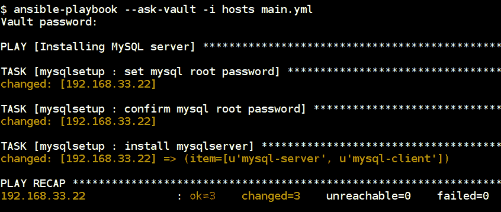

+   我们还可以通过指定标志在 playbook 执行中传递 `ansible-vault` 密码文件，这有助于我们的持续集成和流水线平台。

+   以下文件包含用于加密 `mysql.yml` 文件的密码：

```
$ cat ~/.vaultpassword

thisisvaultpassword
```

确保为此文件提供适当的权限，以便其他人无法使用 `chmod` 访问该文件。另外，将该文件添加到你的 `.gitignore` 中是一个好习惯，这样在推送 playbook 时不会进行版本控制。

保险库密码文件可以是可执行脚本，它可以检索存储在安全位置的数据，而不必在磁盘上以明文形式保存密钥，并依赖文件权限来保护它。

要通过命令行传递保险库密码文件，请在执行 playbook 时使用以下命令：

```
$ ansible-playbook --vault-password-file ~/.vaultpassword -i hosts main.yml
```

我们还可以使用系统环境变量，例如 `ANSIBLE_VAULT_PASSWORD_FILE=~/.vaultpassword`，Ansible 在执行 playbook 时会使用它。

我们可以使用 `ansible-vault` 进行多个操作，例如使用 `create` 参数创建文件。这默认情况下会加密文件的内容。它还将打开默认文本编辑器来编辑文件：

```
$ ansbile-vault create vault.yml

New Vault password: 
Confirm New Vault password: 
```

我们可以使用 `view` 命令来查看明文中的保险库加密信息。

```
$ ansible-vault view vault.yml
Vault password: 
API_KEY: KANGEG4TNG434G43HG43H9GH344FEGEW
```

要更改内容，我们可以使用 `ansible-vault` 中的 `edit` 子命令

```
$ ansible-vault edit vault.yml

Vault password: 
```

我们还可以使用以下命令解密秘密信息

```
$ ansible-vault decrypt vault.yml

Vault password: 
Decryption successful
```

要更改密钥轮换的保险库密码，我们可以使用 `rekey` 选项：

```
$ ansible-vault rekey vault.yml
Vault password: 
New Vault password: 
Confirm New Vault password: 
Rekey successful
```

# Ansible Vault 单个加密变量

此功能可从 Ansible 版本 2.3 开始使用。它允许我们在 YAML 文件中使用带有 `!vault` 标记的保险库变量；我们将看到一个简单的示例和用例。

以下 playbook 用于使用 `ViewDNS` API 执行反向 IP 查找。

我们想要保护 `api_key`，因为它包含敏感信息。我们使用 `ansible-vault encrypt_string` 命令执行此加密。在这里，我们使用了 `echo` 与 `-n` 标志来删除换行符：

```
$ echo -n '53ff4ad63849e6977cb652763g7b7c64e2fa42a' | ansible-vault encrypt_string --stdin-name 'api_key'
```

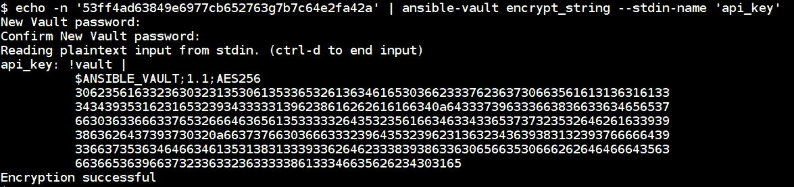

然后，我们可以像以下代码块中所示，将变量放在 playbook 变量中，并使用 `ansible-playbook` 普通执行 playbook，使用 `--ask-vault-pass` 选项：

```
- name: ViewDNS domain information
  hosts: localhost
  vars:
    domain: google.com
    api_key: !vault |
          $ANSIBLE_VAULT;1.1;AES256
          36623761316238613461326466326162373764353437393733343334376161336630333532626465
          6662383435303930303164353664643639303761353664330a393365633237306530653963353764
          64626237313738656530373639653739656564316161663831653431623832336635393637653330
          6632663563363264340a323537356166653338396135376161323435393730306133626635376539
          37383861653239326336613837666237636463396465393662666561393132343166666334653465
          6265386136386132363534336532623061646438363235383334
    output_type: json

  tasks:
    - name: "getting {{ domain }} server info"
      uri:
        url: "https://api.viewdns.info/reverseip/?host={{ domain }}&apikey={{ api_key }}&output={{ output_type }}"
        method: GET
      register: results

    - debug:
        msg: "{{ results.json }}"
```

然后，在我们提供给它指定的密码后，将自动解密执行的 playbook。

下面的截图显示了在提示输入保险库密码后执行 playbook。

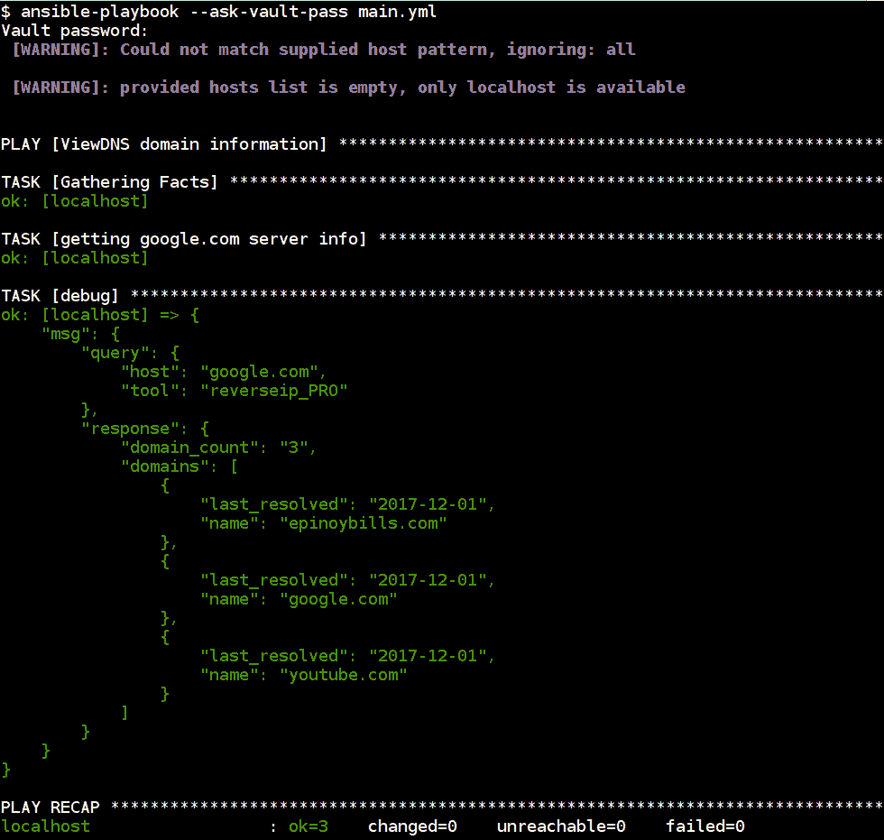

在 [`docs.ansible.com/ansible/2.4/vault.html#use-encrypt-string-to-create-encrypted-variables-to-embed-in-yaml`](https://docs.ansible.com/ansible/2.4/vault.html#use-encrypt-string-to-create-encrypted-variables-to-embed-in-yaml) 阅读有关 `encrypt_string` 选项的更多信息。

# Ansible Tower 中的 Ansible Vault 使用

Ansible Tower 已经与 Ansible Vault 集成。

下面的截图指的是在 Ansible Tower 中创建新凭据。我们还可以添加 Vault 密码，这样用户就可以使用更安全的方式存储和检索密钥。

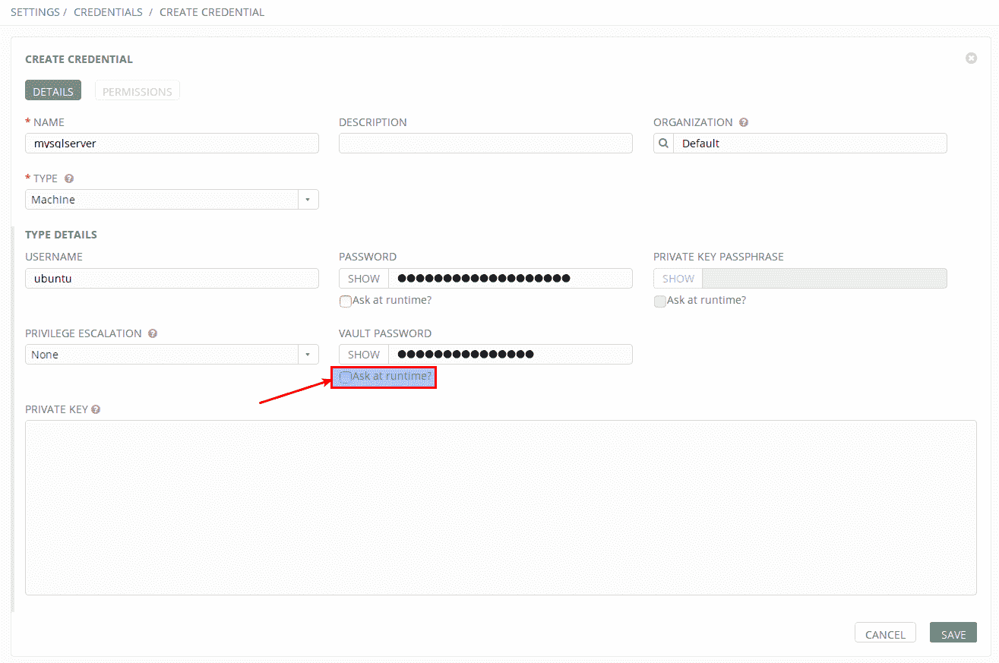

# 设置和使用 Ansible Galaxy

Ansible Galaxy，也称为 Galaxy，是一个官方集中式中心，用于查找、共享和重用 Ansible 角色。这允许社区分享和合作使用 Ansible playbook，并允许新用户快速开始使用 Ansible。要与社区共享我们自定义编写的角色，我们可以使用 GitHub 认证将它们发布到 Ansible Galaxy。

这些角色也可以在 [`galaxy.ansible.com`](https://galaxy.ansible.com) 上访问，也可以使用一个名为 `ansible-galaxy` 的命令行工具进行访问，该工具随 Ansible 一起安装：

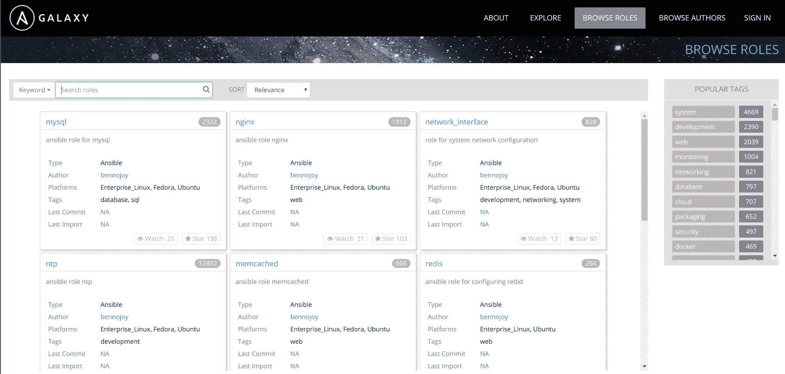

我们可以使用不同的参数（如作者、平台、标签等）查找角色。这使用户能够了解此角色是否适用于其分发和版本，需要哪个 Ansible 版本以及其他信息。

下面的截图展示了如何使用 `ansible-galaxy` CLI 执行不同的操作，比如搜索和安装：

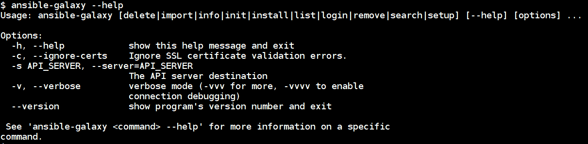

从文档中阅读有关 Ansible Galaxy 的更多信息 [`docs.ansible.com/ansible/latest/galaxy.html`](http://docs.ansible.com/ansible/latest/galaxy.html)。

了解更多有关 Galaxy 使用的信息，请访问 [`galaxy.ansible.com/intro`](https://galaxy.ansible.com/intro)。

# 使用 Ansible Galaxy 角色

要从 Ansible Galaxy 网站下载角色，我们可以运行以下命令，其中 `username` 和 `role_name` 是选项：

```
$ ansible-galaxy install username.role_name
```

下面的命令将由用户 `angstwad` 下载 `docker_ubuntu` 角色：

```
$ ansible-galaxy install angstwad.docker_ubuntu

- downloading role 'docker_ubuntu', owned by angstwad
- downloading role from https://github.com/angstwad/docker.ubuntu/archive/v3.3.4.tar.gz
- extracting angstwad.docker_ubuntu to /home/ubuntu/.ansible/roles/angstwad.docker_ubuntu
- angstwad.docker_ubuntu (v3.3.4) was installed successfully
```

要在 Ubuntu 上使用此角色安装 Docker，只需在我们的 playbook 中包含此角色并执行它即可：

```
- name: Run docker.ubuntu
 hosts: docker
 become: yes

 roles:
 - angstwad.docker_ubuntu $ ansible-playbook -i hosts main.yml
```

我们可以通过指定 GitHub URL 直接从 GitHub 安装或包含角色。这允许使用私有版本控制系统作为 playbook 角色的本地清单：

```
$ ansible-galaxy install git+https://github.com/geerlingguy/ansible-role-composer.git
```

# 将我们的角色发布到 Ansible Galaxy

要将我们自己的角色发布到 Ansible Galaxy，我们需要一个 GitHub 账户，该账户将用于验证 Ansible Galaxy，GitHub 中的版本控制存储库将是存储我们角色的地方。

以下步骤用于在 Ansible Galaxy 中创建和共享新角色：

1.  首先，在 GitHub 中创建一个新存储库，然后使用以下命令将其克隆到本地：

```
$ git clone https://username@github.com/username/ansible-role-docker.git docker
```

1.  然后，我们可以使用 `ansible-galaxy` 命令创建角色结构：

```
$ ansible-galaxy init docker --force
- docker was created successfully

# The structure looks like below
├── defaults
│   └── main.yml
├── files
├── handlers
│   └── main.yml
├── meta
│   └── main.yml
├── README.md
├── tasks
│   └── main.yml
├── templates
├── tests
│   ├── inventory
│   └── test.yml
└── vars
 └── main.yml
```

1.  现在，我们可以像之前创建它们一样添加任务和其他步骤。以下是 Ansible Galaxy 自身的一些良好实践（[`galaxy.ansible.com/intro#good`](https://galaxy.ansible.com/intro#good)）：

    1.  在 `README.md` 中提供清晰的文档。

    1.  在 `meta/main.yml` 中提供准确的信息。

    1.  在 `meta/main.yml` 中包含依赖项。

    1.  以角色名为变量名加上前缀。

    1.  将您的角色与 Travis CI 集成。

1.  元文件包含将在 Ansible Galaxy 中发布角色所使用的信息；我们可以根据需要修改它。以下是一个示例：

```
---
galaxy_info:
  author: USERNAME
  description: Quick and easy docker installer.
  company: ORG
  license: MIT
  min_ansible_version: 1.9
  platforms:
  - name: Ubuntu
    versions:
    - xenial
    - trusty
  galaxy_tags:
    - docker
    - installer
    - ubuntu
dependencies:
  - { role: username.common, some_parameter: 3 }
```

1.  然后，我们可以将角色推送到 GitHub，并通过在门户中添加新角色来导入到 Ansible Galaxy 中：

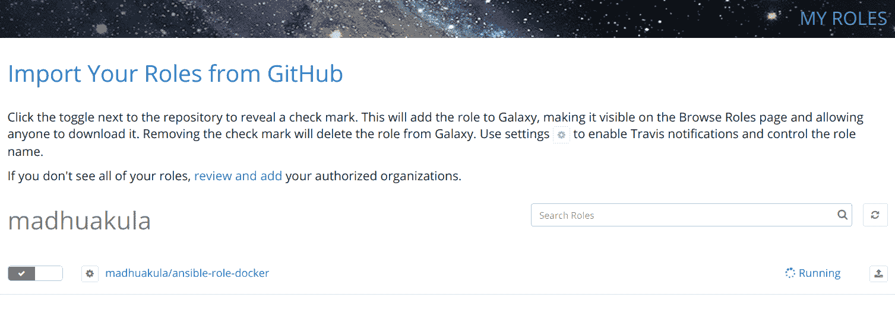

有关如何编写可重用角色以及有关编写社区角色的更多详细信息，请参阅 [`docs.ansible.com/ansible/latest/playbooks_reuse.html`](http://docs.ansible.com/ansible/latest/playbooks_reuse.html)。

# Ansible Galaxy 本地设置

要在本地设置 Ansible Galaxy，我们有不同的方法。大多数安装在幕后使用容器。以下步骤描述了如何使用 `docker` 和 `docker-compose` 安装 Ansible Galaxy 本地设置。

在继续之前，我们需要以下先决条件：

+   Ansible 2.4+

+   Docker

+   `docker-py` Python 模块

+   `docker-compose` Python 模块

+   GNU make

+   Git

我们可以通过运行以下 `git` 命令来克隆 `galaxy` 存储库，该存储库由 Ansible 维护：

```
$ git clone https://github.com/ansible/galaxy.git
$ cd galaxy/installer
```

在 galaxy playbook 中更改所需的变量；默认情况下，它将假定安装在 localhost 上。还要在 `inventory` 文件中更新密码和其他变量：

然后执行以下命令启动 Ansible playbook 设置以启动本地 Ansible Galaxy

```
$ ansible-playbook -i inventory galaxy.yml --tags start
```

这将花费一些时间，因为它必须在本地下载多个 Docker 容器并使用 `docker-compose` 设置它们之间的集成。

一旦 Playbook 执行完成，我们可以看到有关运行 Docker 容器的以下输出。执行数据库迁移和启动 Web 服务器应用程序仍需要一些时间：

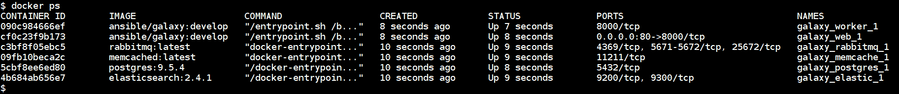

安装完成后，我们可以导航到 `http://localhost` 查看 web 界面：

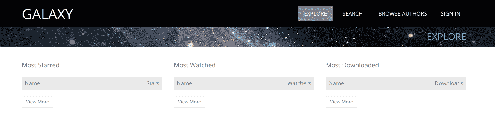

请阅读更多关于 Ansible Galaxy 本地设置以及其他身份验证和部署选项的信息，请访问 [`github.com/ansible/galaxy/blob/develop/INSTALL.md`](https://github.com/ansible/galaxy/blob/develop/INSTALL.md)。

# Ansible 控制器机器安全性

Ansible 控制器机器需要安装和配置 SSH 和 Python。Ansible 的攻击面非常低。在 2017 年 1 月，一家名为 Computest 的公司发现了多个安全问题。

请阅读更多关于他们在 [`www.computest.nl/advisories/CT-2017-0109_Ansible.txt`](https://www.computest.nl/advisories/CT-2017-0109_Ansible.txt) 发现的信息。

此漏洞被称为“拥有农场”，因为攻击控制器将意味着所有节点可能被攻击。

控制器机器应该是一个经过加固的服务器，并且应该被认真对待。在已经公开的漏洞中，如果一个节点被攻击者利用，攻击者可以利用它来攻击并访问控制器。一旦他们获得访问权限，他们可以扩展他们对控制器管理的所有其他节点的控制。

由于攻击面已经非常有限，我们能做的最好的事情就是确保服务器保持安全和加固。

有两个值得关注和调查的项目：

+   [`docs.openstack.org/ansible-hardening/latest/getting-started.html#usage`](https://docs.openstack.org/ansible-hardening/latest/getting-started.html#usage)

+   [`github.com/dev-sec/ansible-os-hardening`](https://github.com/dev-sec/ansible-os-hardening)

# 解释 Ansible 操作系统加固剧本

我们已经看到了多个剧本和指南，用于遵循不同标准在 第七章中，*应用程序和网络的安全加固*。这可以根据您的环境完全定制，但是遵循某些准则将确保其得到良好的保护。

以下剧本是由 DevSec 创建的 Linux 基线。它涵盖了大多数所需的加固检查，基于多个标准，包括 Ubuntu 安全特性，NSA 安全配置指南，ArchLinux 系统加固等。如果需要，可以通过添加更多任务（或）角色来改进。

Ansible 操作系统加固剧本涵盖

+   配置软件包管理，即只允许签名软件包

+   移除已知问题的软件包

+   配置 `pam` 和 `pam_limits` 模块

+   Shadow 密码套件配置

+   配置系统路径权限

+   通过软限制禁用核心转储

+   限制 root 登录到系统控制台

+   设置 SUIDs

+   通过 `sysctl` 配置内核参数

以下命令是从 Ansible Galaxy 下载 `os-hardening` 角色：

```
$ ansible-galaxy install dev-sec.os-hardening
```

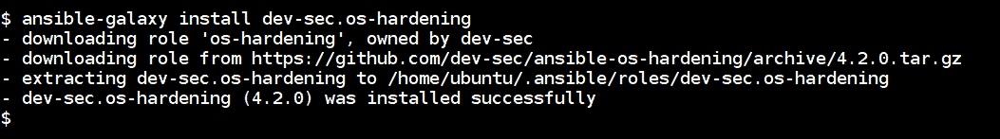

然后在您的剧本中调用该角色并执行它来执行基线加固，并根据需要更改变量。有关更详细的选项，请参阅[`galaxy.ansible.com/dev-sec/os-hardening`](https://galaxy.ansible.com/dev-sec/os-hardening)：

```
- hosts: localhost
 become: yes

 roles:
 - dev-sec.os-hardening
$ ansible-playbook main.yml
```

以下截图是剧本执行的参考，列出了它在 Ansible 控制器机器上执行的一系列检查：

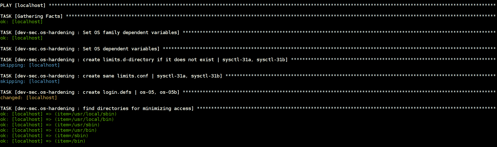

以下是通过更新系统中的配置参数来最小化系统访问的检查：

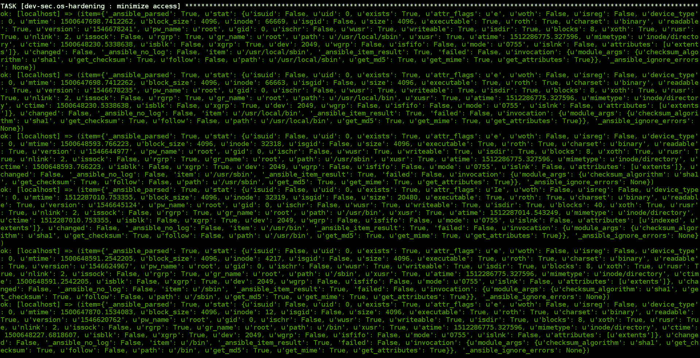

以下截图是升级密码哈希算法、更新 `suid` 和超级用户二进制文件指南的参考：

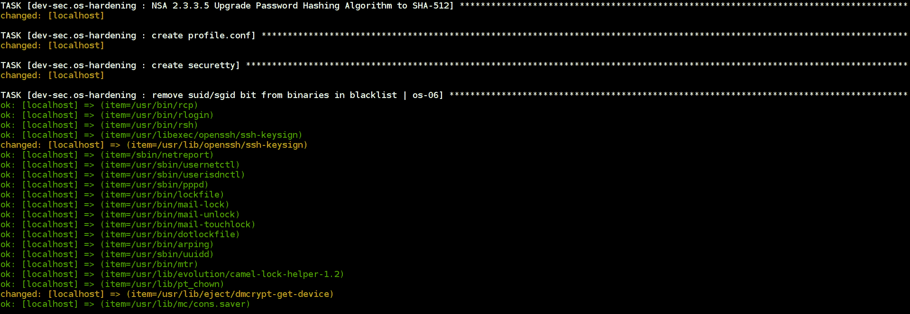

要了解此剧本执行的更多检查，请访问[`github.com/dev-sec/ansible-os-hardening/blob/master/tasks/main.yml`](https://github.com/dev-sec/ansible-os-hardening/blob/master/tasks/main.yml)。

# 最佳实践和参考剧本项目

Ansible 强大且灵活。人们以许多不同的方式使用它，了解如何将其用于安全自动化的其中一种方式是追踪并阅读为特定用例创建的 playbooks。

诸如 Algo、DebOps 和 OpenStack 等项目是大型 Ansible playbook 项目，默认情况下受到良好维护和保护。

# DebOps – 基于 Debian 的一站式数据中心

DebOps ([`debops.org`](https://debops.org)) 是由 Maciej Delmanowski 创建的项目。它包含各种用于 Debian 和 Ubuntu 主机的 Ansible playbooks 集合。这个项目有超过 128 个 Ansible 角色，针对生产用例进行了定制，并与多个环境配合使用。

我们可以在 [`github.com/debops/debops-playbooks`](https://github.com/debops/debops-playbooks) 看到可用的 playbooks 服务列表：

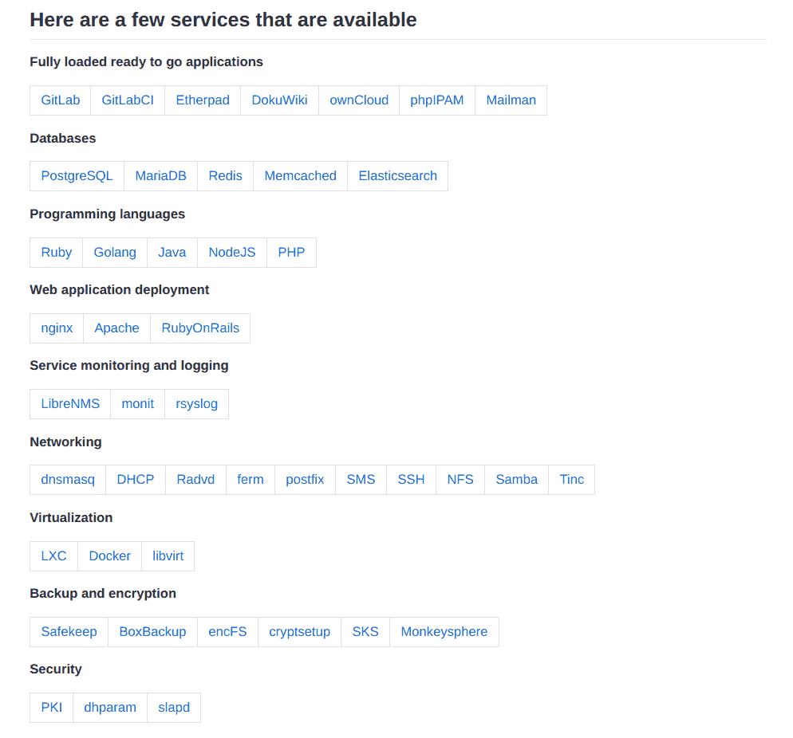

# 设置 DebOps 控制器

我们可以通过两种不同的方式快速开始使用 DebOps 设置：

+   Vagrant 设置

+   Docker 设置

运行以下命令以启动由 DebOps 创建的 Docker 容器：

```
$ docker run --name debops -it debops/debops
```

我们可以通过 DebOps playbooks 创建和执行不同的角色来执行不同的操作。请参考主要文档在 [`docs.debops.org/en/latest/index.html`](https://docs.debops.org/en/latest/index.html)。

# Algo – 在云中设置个人 IPSEC VPN

Trail of Bits 的 Algo 提供了 Ansible 角色和脚本，以自动化个人 IPSEC VPN 的安装。

通过运行 Ansible playbooks，您可以获得一个完整的加固 VPN 服务器，并且已经配置了所有主要云提供商的部署（[`github.com/trailofbits/algo/blob/master/docs/deploy-from-ansible.md`](https://github.com/trailofbits/algo/blob/master/docs/deploy-from-ansible.md)）。

# OpenStack-Ansible

OpenStack-Ansible 是使用 Ansible playbooks 部署和配置 OpenStack 的官方项目。

从这里开始了解 OpenStack-Ansible: [`github.com/openstack/openstack-ansible`](https://github.com/openstack/openstack-ansible)。

这个项目不仅广泛使用 Ansible playbooks，而且他们的安全文档值得阅读和效仿。最好的部分是所有的安全配置都是在 Ansible playbooks 中以声明性方式编码的安全性。

此项目的文档可在 [`docs.openstack.org/project-deploy-guide/openstack-ansible/latest/app-security.html`](https://docs.openstack.org/project-deploy-guide/openstack-ansible/latest/app-security.html) 上找到。

# 其他参考文献

我们在为这本书进行研究时找到的一些很好的关于 Ansible 的在线参考文献和链接有：

+   **Streisand**：自动安装和配置反审查软件

+   **Sovereign**：使用 Ansible playbooks 维护您自己的私有云

+   **AWX**：Ansible Tower 的开源版本

# Streisand – 自动安装和配置反审查软件

使用 Ansible playbooks，Streisand 可以设置一个充满软件的云服务器，以规避互联网限制和在线审查。设置的工具包括基于 IPSEC 的 VPN、OpenVPN、OpenConnect、Tor 和 WireGuard。

在这里开始使用 Streisand：[`github.com/StreisandEffect/streisand`](https://github.com/StreisandEffect/streisand).

# Sovereign – 使用 Ansible playbooks 维护您自己的私有云

使用 Ansible playbooks，Sovereign 使用开源软件设置了你自己的私有云。这使你能够控制你的数据，服务包括电子邮件、日历、文件同步、RSS 阅读器、Git 托管、稍后阅读和聊天。

在这里开始使用 Sovereign：[`github.com/sovereign/sovereign`](https://github.com/sovereign/sovereign).

# AWX – Ansible Tower 的开源版本

AWX 提供了基于 web 的用户界面、REST API 和建立在 Ansible 之上的任务引擎。AWX 可以与 tower-CLI 工具和客户端库一起使用。

在这里开始使用 AWX：[`github.com/ansible/awx`](https://github.com/ansible/awx).

从这里开始使用 tower-cli：[`github.com/ansible/tower-cli/`](https://github.com/ansible/tower-cli/).

# 即将推出的 Ansible 2.5

预计 Ansible 版本 2.5 将于 2018 年 3 月发布。与当前稳定版本 2.4.2 相比，没有主要变化。由于软件世界总是一个不断变化的目标，跟踪可能会发生的变化或不发生的变化的好地方是遵循路线图和移植指南：

+   **Ansible 2.5 移植指南** (https://docs.ansible.com/ansible/devel/porting_guide_2.5.html)

+   **Ansible 2.5 路线图** (https://github.com/ansible/ansible/blob/devel/CHANGELOG.md#2.5)

# 概要

在本章中，我们介绍了如何使用 Ansible Vault，在托管的 Ansible Galaxy 网站上使用它，甚至自行托管它。我们还讨论了保持控制节点安全的必要性。

除了这些主题，我们还查看了一些以各种方式使用 Ansible 的最全面的软件项目。在所有这些项目中，Ansible 是它们编排和提供软件及相关服务的核心。突出所有这些项目的主要思想是扩展本书的主题，同时让你了解 Ansible 在自动化领域，特别是在安全工作负载方面的使用方式之多。我们还看了下一年即将发布的 Ansible 2.5 中会有什么内容，并得出结论，即到目前为止，我们介绍的任何内容在它稳定后都不会发生变化。

我们期待着看到在与我们共同走过这段旅程后，大家将构建出怎样的安全自动化工作流。
