# 第一章：1. 无服务器介绍

## 学习目标

本章结束时，您将能够：

+   识别无服务器架构的好处

+   在无服务器平台上创建和调用简单函数

+   使用 Kubernetes 创建云原生无服务器函数并将其打包为容器

+   创建 Twitter Bot 后端应用程序并将其打包到 Docker 容器中

在本章中，我们将解释无服务器架构，然后创建我们的第一个无服务器函数并将其打包为容器。

## 无服务器介绍

当前，云技术正处于不断变革的状态，以创建可扩展、可靠和强大的环境。为了创建这样的环境，云技术的每一项改进都旨在提高最终用户体验和开发人员体验。最终用户要求快速、强大的应用程序，可以从世界各地访问。与此同时，开发人员要求更好的开发环境来设计、部署和维护他们的应用程序。在过去的十年中，云技术的旅程始于云计算，其中服务器在云数据中心中进行配置，并在服务器上部署应用程序。向云数据中心的过渡降低了成本，并消除了对数据中心的责任。然而，随着数十亿人访问互联网并要求更多服务，可扩展性已成为必需。为了扩展应用程序，开发人员创建了可以独立扩展的较小的微服务。微服务被打包成容器，作为软件架构的构建块，以改善开发人员和最终用户的体验。微服务通过提供更好的可维护性来增强开发人员体验，同时为最终用户提供高可扩展性。然而，微服务的灵活性和可扩展性无法满足巨大的用户需求。例如，今天，每天进行数百万笔银行交易，并向后端系统发出数百万笔业务请求。

最后，无服务器开始引起人们的关注，用于创建“未来可靠”和“即时可扩展”的应用程序。无服务器设计专注于创建比微服务更小的服务，并且它们被设计为更持久地存在于未来。这些“纳米服务”或函数帮助开发人员创建更灵活、更易于维护的应用程序。另一方面，无服务器设计是即时可扩展的，这意味着如果您采用无服务器设计，您的服务会随着用户请求自然地扩展或缩小。无服务器的这些特性使其成为行业中最新的大趋势，它现在正在塑造云技术的格局。在本节中，将介绍无服务器技术的概述，重点关注无服务器的演变、起源和用例。

在深入研究无服务器设计之前，让我们了解一下云技术的演变。在过去，部署应用程序的预期流程始于硬件的采购和部署，即服务器。随后，在服务器上安装操作系统，然后部署应用程序包。最后，执行应用程序包中的实际代码以实现业务需求。这四个步骤如*图 1.1*所示：

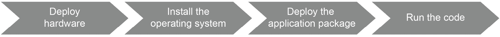

###### 图 1.1：传统软件开发

组织开始将其数据中心运营外包给云提供商，以改善服务器的可伸缩性和利用率。例如，如果您正在开发一个在线购物应用程序，您首先需要购买一些服务器，等待它们的安装，并每天操作它们并处理由电力、网络和错误配置引起的潜在问题。很难预测服务器的使用水平，也不可行大规模投资于服务器来运行应用程序。因此，初创公司和大型企业开始将数据中心运营外包给云提供商。这清除了与硬件部署的第一步相关的问题，如*图 1.2*所示：


###### 图 1.2：云计算软件开发

随着云计算中虚拟化的开始，操作系统变得虚拟化，以便多个虚拟机（VMs）可以在同一台裸机上运行。这种转变消除了第二步，服务提供商按照*图 1.3*所示提供 VMs。在同一硬件上运行多个 VMs，服务器运行成本降低，操作灵活性增加。换句话说，软件开发人员的底层问题得到解决，因为硬件和操作系统现在都是别人的问题：


###### 图 1.3：虚拟化软件开发

VMs 使得在同一硬件上运行多个实例成为可能。然而，使用 VMs 需要为每个应用程序安装完整的操作系统。即使对于基本的前端应用程序，您也需要安装操作系统，这导致操作系统管理的开销，从而导致可扩展性受限。应用程序开发人员和现代应用程序的高级使用需要比创建和管理 VMs 更快速、更简单、更具隔离性的解决方案。容器化技术通过在同一操作系统上运行多个“容器化”应用程序来解决这个问题。通过这种抽象级别，与操作系统相关的问题也被解决，容器被作为应用程序包交付，如*图 1.4*所示。容器化技术实现了微服务架构，其中软件被设计为小型且可扩展的服务，彼此之间进行交互。

这种架构方法使得能够运行现代应用程序，如 Google Drive 中的协作电子表格，YouTube 上的体育赛事直播，Skype 上的视频会议等等：


###### 图 1.4：容器化软件开发

下一个架构现象，无服务器，消除了管理容器的负担，专注于运行实际的代码本身。无服务器架构的基本特征是临时可伸缩性。无服务器架构中的应用程序是临时可伸缩的，这意味着它们在需要时会自动扩展或缩减。它们也可以缩减到零，这意味着没有硬件、网络或运营成本。在无服务器应用程序中，所有低级别的问题都被外包和管理，重点是最后一步——**运行代码**——如图 1.5 所示。无服务器设计的重点是传统软件开发的最后一步。在接下来的部分中，我们将专注于无服务器的起源和宣言，以便更深入地介绍：


###### 图 1.5：使用无服务器进行软件开发

### 无服务器起源和宣言

**无服务器**是一个令人困惑的术语，因为在会议、书籍和博客中有各种定义。尽管从理论上讲它意味着没有任何服务器，但实际上它意味着将服务器的责任留给第三方组织。换句话说，它并不意味着摆脱服务器，而是服务器操作。当你运行无服务器时，其他人会处理服务器操作的采购、运输和安装。这降低了你的成本，因为你不需要运营服务器甚至数据中心；此外，它让你专注于实现核心业务功能的应用逻辑。

无服务器的最初用途出现在 2010 年左右与持续集成相关的文章中。当它首次讨论时，无服务器被认为是用于在云服务提供商的服务器上构建和打包应用程序。随着 2014 年**亚马逊网络服务**（**AWS**）推出**Lambda**，其受欢迎程度急剧增加。此外，2015 年，AWS 推出了**API Gateway**用于管理和触发 Lambda 函数，作为多个函数的单一入口点。因此，无服务器函数在 2014 年开始受到关注，并且在 2015 年可以使用**AWS API Gateway**创建无服务器架构应用程序。

然而，对无服务器的最明确和完整的解释是在 2016 年在 AWS 开发者大会上提出的，称为*无服务器计算宣言*。它包括八条严格的规则，定义了无服务器架构背后的核心思想：

#### 注意

尽管在 AWS Summit 2016 年会议的各种讨论中讨论过，但无服务器计算宣言没有官方网站或文档。宣言详细内容的完整列表可以在 Tim Wagner 博士的演示中看到：[`www.slideshare.net/AmazonWebServices/getting-started-with-aws-lambda-and-the-serverless-cloud`](https://www.slideshare.net/AmazonWebServices/getting-started-with-aws-lambda-and-the-serverless-cloud)。

+   **作为构建块的功能**：在无服务器架构中，开发、部署和扩展的构建块应该是函数。每个函数应该独立部署和扩展，与其他函数无关。

+   **没有服务器、虚拟机或容器**：服务提供商应该为无服务器函数操作所有计算抽象，包括服务器、虚拟机和容器。无服务器架构的用户不需要了解底层基础设施的任何进一步信息。

+   **没有存储**：无服务器应用程序应设计为临时工作负载，每个请求都有一个新鲜的环境。如果它们需要保留一些数据，它们应该使用远程服务，如**数据库即服务**（**DbaaS**）。

+   **隐式容错函数**：无服务器基础架构和部署的应用程序都应该是容错的，以创建一个强大、可扩展和可靠的应用程序环境。

+   **请求的可伸缩性**：包括计算和网络资源在内的基础架构应该能够实现高度的可伸缩性。换句话说，当请求增加时，无服务器环境不应该无法扩展。

+   **空闲时间没有成本**：无服务器提供商只有在无服务器工作负载运行时才会产生成本。如果您的函数长时间没有收到 HTTP 请求，您不应该为空闲支付任何费用。

+   **自带代码**（**BYOC**）：无服务器架构应该能够运行由最终用户开发和打包的任何代码。如果您是 Node.Js 或 Go 开发人员，应该可以在您喜欢的语言中部署您的函数到无服务器基础架构中。

+   **仪器仪表**：应该向开发人员提供有关函数日志和函数调用收集的指标。这使得能够调试和解决与函数相关的问题。由于它们已经在远程服务器上运行，仪器仪表不应该在分析潜在问题方面产生进一步的负担。

原始宣言介绍了一些最佳实践和限制；然而，随着云技术的发展，无服务器应用程序的世界也在不断发展。这种演变将使宣言中的一些规则过时，并增加新规则。在接下来的部分中，讨论了无服务器应用程序的用例，以解释无服务器在行业中的应用情况。

### 无服务器用例

无服务器应用程序和设计似乎是前卫的技术；然而，它们在行业中被广泛采用，用于可靠、强大和可伸缩的应用程序。如果您希望获得无服务器设计的好处，任何在 VM、Docker 容器或 Kubernetes 上运行的传统应用程序都可以设计为无服务器运行。以下是一些无服务器架构的知名用例：

+   **数据处理**：解释、分析、清洗和格式化数据是大数据应用中必不可少的步骤。借助无服务器架构的可伸缩性，您可以快速过滤数百万张照片并计算其中的人数，例如，而无需购买任何昂贵的服务器。根据一份案例报告（[`azure.microsoft.com/en-in/blog/a-fast-serverless-big-data-pipeline-powered-by-a-single-azure-function/`](https://azure.microsoft.com/en-in/blog/a-fast-serverless-big-data-pipeline-powered-by-a-single-azure-function/)），可以使用 Azure Functions 创建一个无服务器应用程序，以检测来自多个来源的欺诈交易。为了处理 800 万个数据处理请求，无服务器平台将是适当的选择，因为它们具有临时可伸缩性。

+   Webhooks：Webhooks 是向第三方服务发送实时数据的 HTTP API 调用。与为 Webhook 后端运行服务器不同，可以利用无服务器基础架构以更低的成本和更少的维护。

+   结账和付款：可以将购物系统创建为无服务器应用程序，其中每个核心功能都设计为独立的组件。例如，您可以集成 Stripe API 作为远程支付服务，并在无服务器后端中使用 Shopify 服务进行购物车管理。

+   实时聊天应用程序：集成到 Facebook Messenger、Telegram 或 Slack 等应用程序的实时聊天应用程序非常受欢迎，用于处理客户操作、分发新闻、跟踪体育比赛结果，或者只是用于娱乐。可以创建临时无服务器函数来响应消息或根据消息内容采取行动。无服务器实时聊天的主要优势在于，当许多人在使用时，它可以扩展。当没有人使用聊天应用程序时，它也可以缩减到零成本。

这些用例说明了无服务器架构可以用于设计任何现代应用程序。还可以将单体应用程序的某些部分移动并转换为无服务器函数。如果您当前的在线商店是打包为 JAR 文件的单个 Java Web 应用程序，可以将其业务功能分离并转换为无服务器组件。将巨大的单体应用程序分解为小的无服务器函数有助于同时解决多个问题。首先，无服务器应用程序的可扩展性永远不会成为问题。例如，如果在假期期间无法处理大量付款，无服务器平台将根据使用水平自动扩展付款功能。其次，您不需要局限于单体的编程语言；您可以使用任何编程语言开发函数。例如，如果您的数据库客户端最好使用 Node.js 实现，您可以使用 Node.js 编写在线商店的数据库操作。

最后，您可以重用在您的单体中实现的逻辑，因为现在它是一个共享的无服务器服务。例如，如果您将在线商店的支付操作分离出来并创建无服务器支付功能，您可以在下一个项目中重用这些支付功能。所有这些好处使得创业公司和大型企业都愿意采用无服务器架构。在接下来的部分中，将更深入地讨论无服务器架构，特别关注一些实现。

可能的答案：

+   具有高延迟的应用程序

+   当可观察性和指标对业务至关重要时

+   当供应商锁定和生态系统依赖成为问题时

## 无服务器架构和函数即服务（FaaS）

**无服务器**是一种云计算设计，云提供商处理服务器的供应。在前一节中，我们讨论了操作方面的分层和移交。在本节中，我们将重点讨论无服务器架构和使用无服务器架构的应用程序设计。

在传统软件架构中，应用程序的所有组件都安装在服务器上。例如，假设您正在用 Java 开发一个电子商务网站，您的产品信息存储在**MySQL**中。在这种情况下，前端、后端和数据库都安装在同一台服务器上。预期最终用户将通过服务器的 IP 地址访问购物网站，因此服务器上应该运行应用服务器，比如**Apache Tomcat**。此外，用户信息和安全组件也包含在安装在服务器上的软件包中。图 1.6 显示了一个单体电子商务应用程序，包括前端、后端、安全和数据库部分：

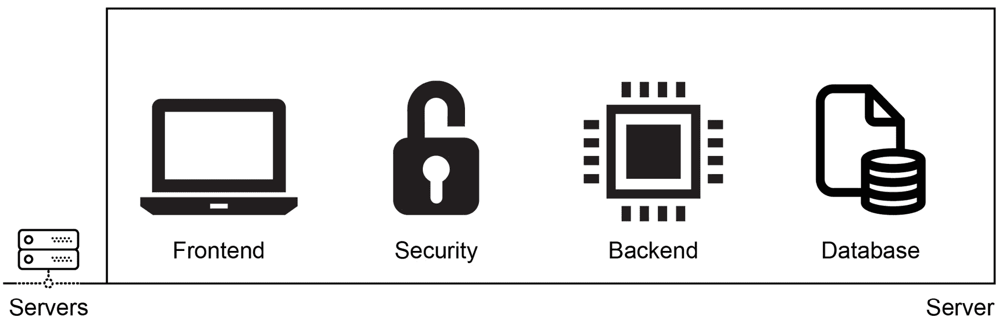

###### 图 1.6：传统软件架构

**微服务**架构侧重于创建松散耦合且可独立部署的服务集合。对于同一个电子商务系统，您仍然会有前端、后端、数据库和安全组件，但它们将是隔离的单元。此外，这些组件将被打包为容器，并由诸如 Kubernetes 之类的容器编排器进行管理。这使得能够独立安装和扩展组件，因为它们分布在多台服务器上。在图 1.7 中，相同的四个组件安装在服务器上，并通过 Kubernetes 网络相互通信：

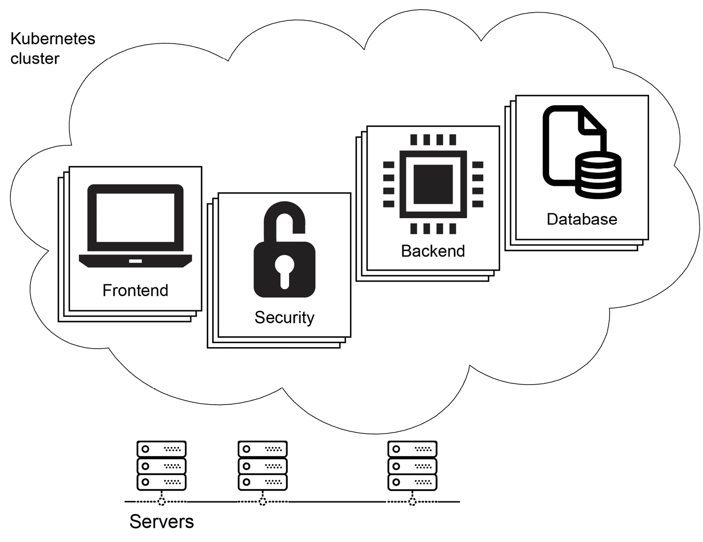

###### 图 1.7：微服务软件架构

微服务部署到服务器上，仍然由运维团队管理。采用无服务器架构后，这些组件将转换为第三方服务或函数。例如，电子商务网站的安全性可以由诸如**Auth0**之类的身份验证即服务提供商来处理。**AWS 关系型数据库服务（RDS）**可以用作系统的数据库。后端逻辑的最佳选择是将其转换为函数，并部署到无服务器平台，如**AWS Lambda**或**Google Cloud Functions**。最后，前端可以由存储服务提供，如**AWS 简单存储服务（S3）**或**Google Cloud 存储**。

采用无服务器设计，只需为您定义这些服务，您就可以拥有可扩展、强大和管理良好的应用程序，如图 1.8 所示。

#### 注意

`Auth0`是一个用于为 Web、移动和传统应用程序提供身份验证和授权的平台。简而言之，它提供**身份验证和授权即服务**，您可以连接任何使用任何语言编写的应用程序。更多详细信息可以在其官方网站上找到：[`auth0.com`](https://auth0.com)。

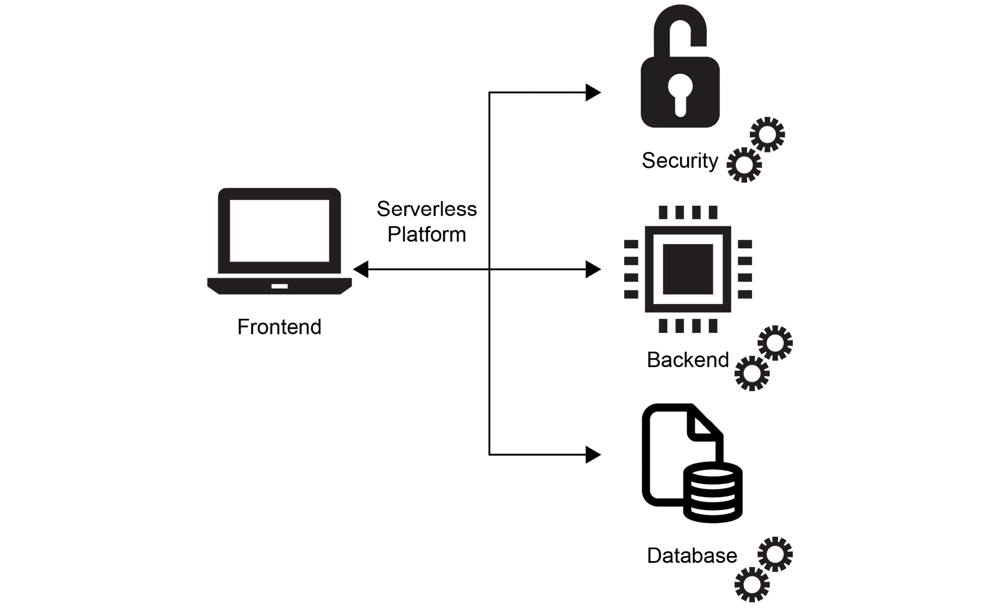

###### 图 1.8：无服务器软件架构

从单体架构开始，首先将其分解为微服务，然后再转换为无服务器组件，这样做有多种好处：

+   **成本**：无服务器架构有助于通过两种关键方式降低成本。首先，服务器的管理被外包，其次，只有在使用无服务器应用程序时才会产生费用。

+   **可扩展性**：如果预计应用程序会增长，当前最佳选择是将其设计为无服务器应用程序，因为这样可以消除与基础设施相关的可扩展性约束。

+   **灵活性**：当部署单元的范围减少时，无服务器提供更多灵活性，可以选择更好的编程语言，并且可以用更小的团队进行管理。

这些维度以及它们在软件架构之间的变化在*图 1.9*中可视化。

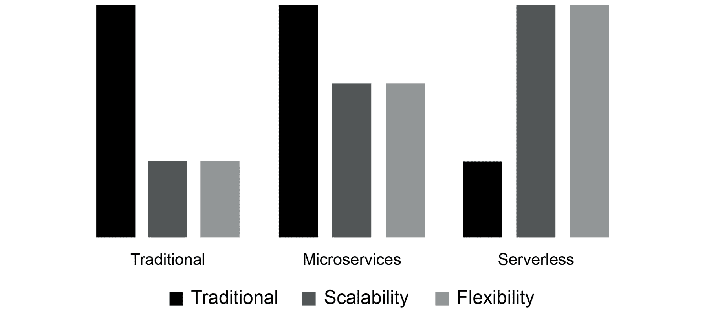

###### 图 1.9：从成本到无服务器过渡的好处

当您从传统的软件开发架构开始时，转向微服务会增加可扩展性和灵活性。然而，它并没有直接降低运行应用程序的成本，因为您仍然在处理服务器。进一步转向无服务器可以提高可扩展性和灵活性，同时降低成本。因此，了解并实施无服务器架构对于未来的应用程序至关重要。在接下来的部分中，将介绍无服务器架构的实现，即**函数即服务**（**FaaS**）。

### 函数即服务（FaaS）

**FaaS**是最受欢迎和广泛采用的无服务器架构实现。所有主要的云提供商都有 FaaS 产品，如 AWS Lambda、Google Cloud Functions 和 Azure Functions。顾名思义，在 FaaS 中，部署和管理的单位是函数。在这种情况下，函数与任何其他编程语言中的函数没有区别。它们预期接受一些参数并返回值以实现业务需求。FaaS 平台处理服务器的管理，并且可以运行事件驱动的可扩展函数。FaaS 提供的基本属性如下：

+   **无状态**：函数被设计为无状态和短暂的操作，不会将文件保存到磁盘，也不会管理缓存。每次调用函数时，它都会快速启动一个新环境，并在完成时被移除。

+   **事件触发**：函数设计为直接触发，并基于事件，如`cron`时间表达式、HTTP 请求、消息队列和数据库操作。例如，可以在启动新聊天时通过 HTTP 请求调用`startConversation`函数。同样，可以在向数据库添加新用户时启动`syncUsers`函数。

+   **可扩展**：函数被设计为能够并行运行，以便每个传入请求都得到响应，每个事件都得到处理。

+   **托管**：函数受其平台管理，因此服务器和基础设施不是 FaaS 用户的关注点。

这些函数的属性由云提供商的产品提供，如**AWS Lambda**、**Google Cloud Functions**和**Azure Functions**；以及本地产品，如**Kubeless**、**Apache OpenWhisk**和**OpenFass**。由于其高度的流行度，术语 FaaS 通常与无服务器术语互换使用。在接下来的练习中，我们将创建一个处理 HTTP 请求的函数，并说明如何开发无服务器函数。

### 练习 1：创建一个 HTTP 函数

在这个练习中，我们将创建一个 HTTP 函数，作为无服务器平台的一部分，然后通过 HTTP 请求来调用它。为了执行练习的步骤，您将使用 Docker、文本编辑器和终端。

#### 注意

本章练习的代码文件可以在这里找到：[`github.com/TrainingByPackt/Serverless-Architectures-with-Kubernetes/tree/master/Lesson01/Exercise1`](https://github.com/TrainingByPackt/Serverless-Architectures-with-Kubernetes/tree/master/Lesson01/Exercise1)。

要成功完成这个练习，我们需要确保执行以下步骤：

1.  在您喜欢的文本编辑器中创建一个名为`function.go`的文件，并包含以下内容：

```
package main
import (
    "fmt"
    "net/http"
)
func WelcomeServerless(w http.ResponseWriter, r *http.Request) {
	fmt.Fprintf(w, "Hello Serverless World!")
}
```

在这个文件中，我们已经创建了一个实际的函数处理程序，以便在调用该函数时做出响应。

1.  创建一个名为`main.go`的文件，并包含以下内容：

```
package main
import (
    "fmt"
    "net/http"
)
func main() {
    fmt.Println("Starting the serverless environment..")
    http.HandleFunc("/", WelcomeServerless)
    fmt.Println("Function handlers are registered.")
    http.ListenAndServe(":8080", nil)
}
```

在这个文件中，我们已经创建了用于提供该函数的环境。一般来说，这部分应该由无服务器平台来处理。

1.  在您的终端中使用以下命令启动一个 Go 开发环境：

```
docker run -it --rm -p 8080:8080 -v "$(pwd)":/go/src --workdir=/go/src golang:1.12.5
```

通过该命令，将在 Go 版本`1.12.5`的 Docker 容器内启动一个 shell 提示符。此外，主机系统的端口`8080`被映射到容器，并且当前工作目录被映射到`/go/src`。您将能够在启动的 Docker 容器内运行命令：

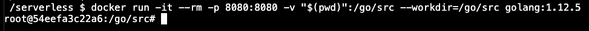

###### 图 1.10：容器内的 Go 开发环境

1.  在*步骤 3*中打开的 shell 提示符中使用以下命令启动函数处理程序：`go run *.go`。

随着应用程序的启动，您将看到以下行：


###### 图 1.11：函数服务器的开始

这些行表明`main.go`文件中的`main`函数正在运行

预期。

1.  在浏览器中打开`http://localhost:8080`：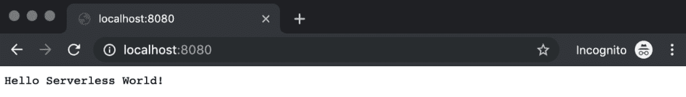

###### 图 1.12：WelcomeServerless 输出

网页上显示的消息显示`WelcomeServerless`函数通过 HTTP 请求成功调用，并且已检索到响应。

1.  按*Ctrl + C*退出函数处理程序，然后输入`exit`停止容器：

###### 图 1.13：退出函数处理程序和容器

通过这个练习，我们演示了如何创建一个简单的函数。此外，展示了无服务器环境如何提供和调用函数。在接下来的部分中，将介绍 Kubernetes 和无服务器环境，以连接这两个云计算现象。

## Kubernetes 和无服务器

无服务器和 Kubernetes 大约在 2014 年同时出现在云计算领域。AWS 通过 AWS Lambda 支持无服务器，而 Kubernetes 在 Google 的支持下成为开源，并在容器管理方面拥有悠久而成功的历史。组织开始为他们的短暂临时任务创建 AWS Lambda 函数，许多初创公司专注于在无服务器基础设施上运行的产品。另一方面，Kubernetes 在行业中获得了巨大的采用，并成为事实上的容器管理系统。它能够在容器内运行无状态应用程序，如 Web 前端和数据分析工具，以及有状态应用程序，如数据库。应用程序和微服务架构的容器化已被证明对大型企业和初创公司都是有效的。

因此，运行微服务和容器化应用是成功、可扩展和可靠的云原生应用的关键因素。此外，以下两个重要元素加强了 Kubernetes 和无服务器架构之间的联系：

+   供应商锁定：Kubernetes 隔离了云提供商，并为运行无服务器工作负载创建了托管环境。换句话说，如果您想明年转移到新的提供商，要在 Google Cloud Functions 中运行您的 AWS Lambda 函数并不是一件简单的事情。然而，如果您使用基于 Kubernetes 的无服务器平台，您将能够快速在云提供商之间甚至本地系统之间进行迁移。

+   **服务重用**：作为主流的容器管理系统，Kubernetes 在您的云环境中运行大部分工作负载。它提供了一个机会，可以将无服务器函数与现有服务并行部署。这使得操作、安装、连接和管理无服务器和容器化应用变得更加容易。

云计算和部署策略一直在不断发展，以创造更具开发者友好性和更低成本的环境。Kubernetes 和容器化的采用已经赢得了市场和开发者的喜爱，以至于在很长一段时间内，没有 Kubernetes 的云计算将不会被看到。通过提供相同的好处，无服务器架构正在变得越来越受欢迎；然而，这并不构成对 Kubernetes 的威胁。相反，无服务器应用程序将使容器化更易于访问，因此 Kubernetes 将受益。因此，学习如何在 Kubernetes 上运行无服务器架构以创建未来可靠、云原生、可扩展的应用程序至关重要。在接下来的练习中，我们将结合函数和容器，并将我们的函数打包为容器。

可能的答案：

+   无服务器 – 数据准备

+   无服务器 – 短暂的 API 操作

+   Kubernetes – 数据库

+   Kubernetes – 与服务器相关的操作

### 练习 2：将 HTTP 函数打包为容器

在这个练习中，我们将把*练习 1*中的 HTTP 函数打包为一个容器，作为 Kubernetes 工作负载的一部分。此外，我们将运行容器，并通过容器触发函数。

#### 注意

本章练习的代码文件可以在此处找到：[`github.com/TrainingByPackt/Serverless-Architectures-with-Kubernetes/tree/master/Lesson01/Exercise2`](https://github.com/TrainingByPackt/Serverless-Architectures-with-Kubernetes/tree/master/Lesson01/Exercise2)。

要成功完成练习，我们需要确保执行以下步骤：

1.  在与*练习 1*相同的文件夹中创建一个名为`Dockerfile`的文件。

```
FROM golang:1.12.5-alpine3.9 AS builder
ADD . .
RUN go build *.go
FROM alpine:3.9
COPY --from=builder /go/function ./function
RUN chmod +x ./function
ENTRYPOINT ["./function"]
```

在这个多阶段的`Dockerfile`中，函数是在`golang:1.12.5-alpine3.9`容器内构建的。然后，将二进制文件复制到`alpine:3.9`容器中作为最终的应用程序包。

1.  在终端中使用以下命令构建 Docker 镜像：`docker build . -t hello-serverless`。

`Dockerfile`的每一行都是按顺序执行的，最后，通过最后一步，Docker 镜像被构建并标记为：`Successfully tagged hello-serverless:latest`：

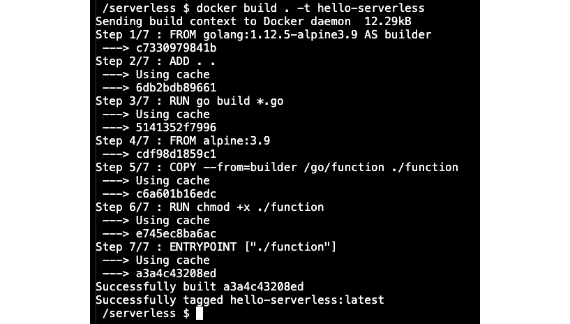

###### 图 1.14：Docker 容器的构建

1.  使用以下命令在终端中从`hello-serverless`镜像启动 Docker 容器：`docker run -it --rm -p 8080:8080 hello-serverless`。

通过该命令，使用端口`8080`实例化 Docker 镜像，将主机系统映射到容器。此外，`--rm`标志将在退出时删除容器。日志行表明函数的容器正在按预期运行：


###### 图 1.15：函数容器的启动

1.  在浏览器中打开`http://localhost:8080`：

###### 图 1.16：WelcomeServerless 输出

它显示了在容器中运行的`WelcomeServerless`函数通过 HTTP 请求成功调用，并且已检索到响应。

1.  按下*Ctrl + C*退出容器：

###### 图 1.17：退出容器

在这个练习中，我们看到了如何将一个简单的函数打包为一个容器。此外，容器已启动，并且借助 Docker 的网络功能触发了函数。在接下来的练习中，我们将实现一个参数化函数，以展示如何向函数传递值并返回不同的响应。

### 练习 3：参数化 HTTP 函数

在这个练习中，我们将把*Exercise 2*中的`WelcomeServerless`函数转换为参数化的 HTTP 函数。此外，我们将运行容器，并通过容器触发函数。

#### 注意

本章练习的代码文件可以在这里找到：[`github.com/TrainingByPackt/Serverless-Architectures-with-Kubernetes/tree/master/Lesson01/Exercise3`](https://github.com/TrainingByPackt/Serverless-Architectures-with-Kubernetes/tree/master/Lesson01/Exercise3)。

为了成功完成练习，我们需要确保执行以下步骤：

1.  将`function.go`的内容从*Exercise 2*更改为以下内容：

```
package main
import (
	"fmt"
	"net/http"
)
func WelcomeServerless(w http.ResponseWriter, r *http.Request) {
	names, ok := r.URL.Query()["name"]

    if ok && len(names[0]) > 0 {
        fmt.Fprintf(w, names[0] + ", Hello Serverless World!")
	} else {
		fmt.Fprintf(w, "Hello Serverless World!")
	}
}
```

在新版本的`WelcomeServerless`函数中，我们现在接受 URL 参数并相应返回响应。

1.  在终端中使用以下命令构建 Docker 镜像：`docker build . -t hello-serverless`。

`Dockerfile`的每一行都按顺序执行，最后一步，Docker 镜像被构建并标记为：`Successfully tagged hello-serverless:latest`：

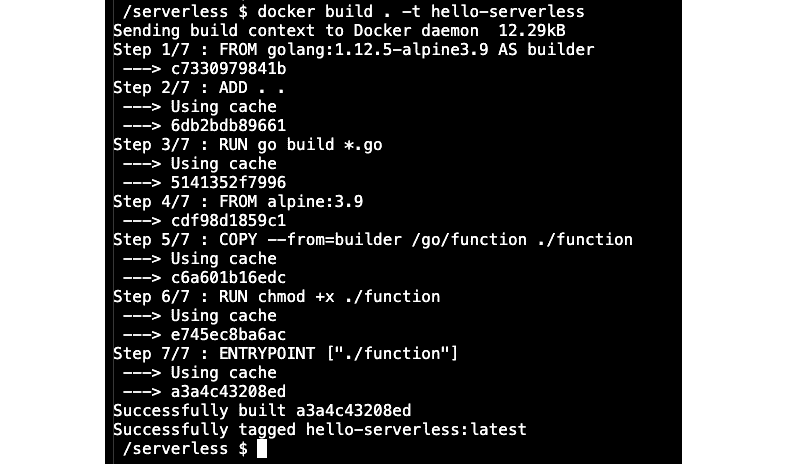

###### 图 1.18：Docker 容器的构建

1.  在终端中使用以下命令从`hello-serverless`镜像启动 Docker 容器：`docker run -it –rm -p 8080:8080 hello-serverless`。

使用该命令，函数处理程序将在主机系统的端口`8080`上启动：


###### 图 1.19：函数容器的开始

1.  在浏览器中打开`http://localhost:8080`：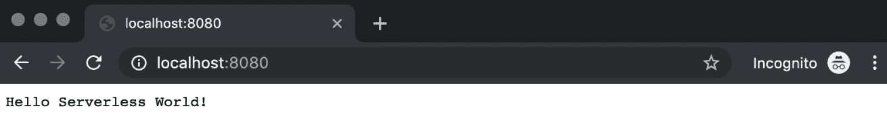

###### 图 1.20：WelcomeServerless 输出

它显示与上一个练习中相同的响应。如果我们提供 URL 参数，我们应该会得到个性化的`Hello Serverless World`消息。

1.  将地址更改为`http://localhost:8080?name=Ece`并重新加载页面。我们现在期望看到一个带有 URL 参数中提供的名称的个性化`Hello Serverless World`消息：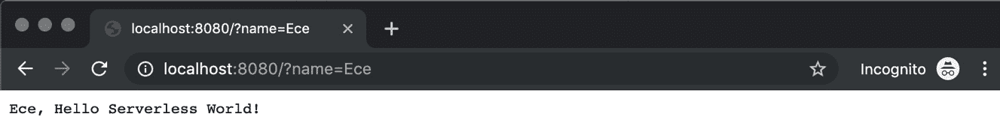

###### 图 1.21：个性化的 WelcomeServerless 输出

1.  按下*Ctrl + C*退出容器：

###### 图 1.22：退出容器

在这个练习中，展示了如何使用不同参数的通用函数。我们部署的单个函数返回了基于输入值的个人消息。在接下来的活动中，将创建一个更复杂的函数，并将其作为容器进行管理，以展示它们在现实生活中的实现方式。

### 活动 1：伦敦自行车点的 Twitter 机器人后端

这项活动的目的是为 Twitter 机器人后端创建一个真实的功能。Twitter 机器人将用于搜索伦敦的可用自行车点和相应位置的可用自行车数量。机器人将以自然语言形式回答；因此，您的函数将接受街道名称或地标的输入，并输出完整的人类可读句子。

伦敦的交通数据是公开可用的，并且可以通过**伦敦交通局**（**TFL**）**统一 API**（[`api.tfl.gov.uk`](https://api.tfl.gov.uk)）进行访问。您需要使用 TFL API 并在容器内运行您的函数。

完成后，您将有一个运行函数的容器：


###### 图 1.23：容器内运行的函数

当您通过 HTTP REST API 查询时，如果找到可用的自行车点，它应返回类似以下的句子：

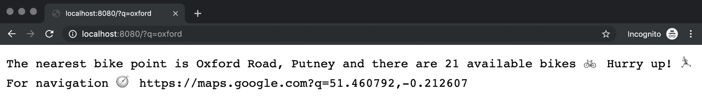

###### 图 1.24：当自行车可用时的功能响应

当找不到自行车点或这些位置没有可用的自行车时，函数将返回类似以下的响应：

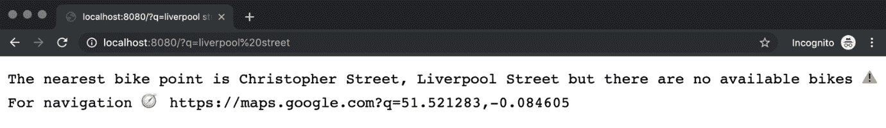

###### 图 1.25：当找到自行车点但没有找到自行车时的功能响应

函数还可能提供以下响应：

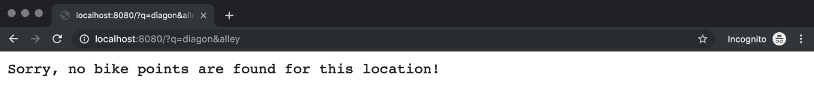

###### 图 1.26：当找不到自行车点或自行车时的功能响应

执行以下步骤完成此活动：

1.  创建一个`main.go`文件来注册函数处理程序，就像*练习 1*中一样。

1.  为`FindBikes`函数创建一个`function.go`文件。

1.  为构建和打包函数创建一个`Dockerfile`，就像*练习 2*中一样。

1.  使用 Docker 命令构建容器映像。

1.  作为 Docker 容器运行容器映像，并使端口从主机系统可用。

1.  使用不同的查询测试函数的 HTTP 端点。

1.  退出容器。

#### 注意

文件`main.go`，`function.go`和`Dockerfile`可以在这里找到：[`github.com/TrainingByPackt/Serverless-Architectures-with-Kubernetes/tree/master/Lesson01/Activity1`](https://github.com/TrainingByPackt/Serverless-Architectures-with-Kubernetes/tree/master/Lesson01/Activity1)。

活动的解决方案可以在第 372 页找到。

在这个活动中，我们构建了 Twitter 机器人的后端。我们首先定义了`main`和`FindBikes`函数。然后我们将这个无服务器后端构建和打包为 Docker 容器。最后，我们用各种输入测试它，以找到最近的自行车站。通过这个现实生活中的例子，展示了无服务器平台的后台操作以及如何编写无服务器函数。

## 摘要

在本章中，我们首先描述了从传统软件开发到无服务器软件开发的过程。我们讨论了多年来软件开发如何改变，以创造一个更加开发者友好的环境。在此之后，我们介绍了无服务器技术的起源及其官方宣言。由于无服务器是行业中流行的术语，定义一些规则有助于设计更好的无服务器应用程序，使其能够轻松集成到各种平台中。然后，我们列举了无服务器技术的用例，以说明无服务器架构如何用于创建任何现代应用程序。

在介绍无服务器之后，探讨了 FaaS 作为无服务器架构的一种实现。我们展示了应用程序在传统、微服务和无服务器设计中的设计方式。此外，还详细讨论了过渡到无服务器架构的好处。

最后，讨论了 Kubernetes 和无服务器技术，以展示它们如何相互支持。作为主流的容器管理系统，介绍了 Kubernetes，涉及了在其上运行无服务器平台的优势。容器化和微服务在工业界得到了广泛采用，因此涵盖了作为容器运行无服务器工作负载的内容，并提供了相关练习。最后，探讨了将函数作为 Twitter 机器人的后端的真实案例。在这个活动中，函数被打包为容器，以展示基于微服务、容器化和 FaaS 支持设计之间的关系。

在下一章中，我们将介绍云中的无服务器架构，并使用云服务进行工作。
