# 第三章： 无服务器框架简介

## 学习目标

通过本章的学习，你将能够：

+   比较并有效地利用不同的无服务器函数

+   建立一个与云无关且容器本地的无服务器框架

+   使用 Fn 框架创建、部署和调用一个函数

+   使用无服务器框架将无服务器函数部署到云提供商

+   在未来在多个云平台上创建一个真实的无服务器应用程序并运行它

在本章中，我们将解释无服务器框架，使用这些框架创建我们的第一个无服务器函数，并将它们部署到各种云提供商。

## 介绍

让我们想象一下，你正在开发一个在一个云提供商中有许多函数的复杂应用程序。即使新的云提供商更便宜、更快或更安全，也可能无法迁移。这种供应商依赖的情况在行业中被称为**供应商锁定**，这在长期来看是一个非常关键的决策因素。幸运的是，无服务器框架是供应商锁定的一个简单而有效的解决方案。

在上一章中，讨论了所有三个主要的云提供商及其无服务器产品。这些产品是基于它们的编程语言支持、触发能力和成本结构进行比较的。然而，所有三个产品之间仍然存在一个看不见的关键差异：*运维*。在每个云提供商中，创建函数、部署它们以及它们的管理都是不同的。换句话说，你不能在 AWS Lambda、Google Cloud Functions 和 Azure Functions 中使用相同的函数。需要进行各种更改，以满足云提供商及其运行时的要求。

无服务器框架是用于运行无服务器应用程序的开源、与云无关的平台。云提供商和无服务器产品之间的第一个区别是，它们的无服务器框架是开源和公开的。它们可以免费安装在云上或本地系统上，并且可以独立运行。第二个特点是无服务器框架是与云无关的。这意味着可以在不同的云提供商或自己的系统上运行相同的无服务器函数。换句话说，函数将在哪个云提供商上执行只是无服务器框架中的一个配置参数。所有云提供商都在共享 API 后面被平等化，以便无服务器框架可以开发和部署与云无关的函数。

像 AWS Lambda 这样的云无服务器平台增加了无服务器架构的热度，并促进了其在行业中的采用。在前一章中，深入讨论了多年来云技术产品的演变和重要的云无服务器平台。在本章中，我们将讨论开源无服务器框架，并谈论它们的特色和功能。市场上有许多受欢迎的和即将推出的无服务器框架。然而，我们将重点关注两个在优先级和架构方面有所不同的杰出框架。在本章中，将介绍一个容器本地化的无服务器框架，即 Fn。随后，将深入讨论一个具有多个云提供商支持的更全面的框架，即 Serverless Framework。尽管这两个框架都为运行无服务器应用程序创建了一个与云无关且开源的环境，但它们在实施和开发者体验方面的差异将被说明。

## Fn 框架

Fn 是由 Oracle 在 2017 年的 JavaOne 2017 大会上宣布的，是一个面向事件驱动和开源的函数即服务（FaaS）平台。该框架的关键特点如下：

+   开源：Fn 项目的所有源代码都可以在[`github.com/fnproject/fn`](https://github.com/fnproject/fn)上公开获取，并且该项目托管在[`fnproject.io`](https://fnproject.io)上。它在 GitHub 上有一个活跃的社区，有超过 3300 次提交和 1100 次发布，如下面的截图所示：

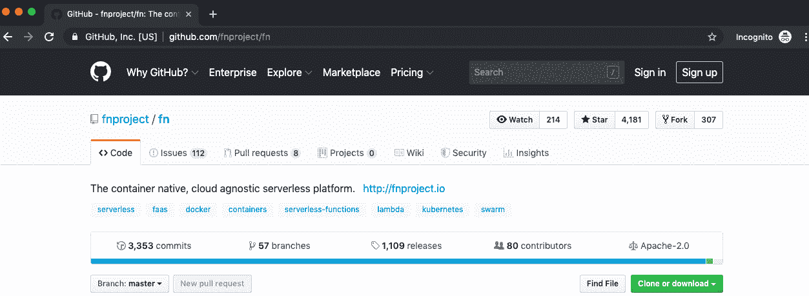

###### 图 3.1：Fn 在 GitHub 上

+   **容器本地：** 容器和微服务改变了软件开发和运维的方式。`Fn`是容器本地的，意味着每个函数都被打包并部署为 Docker 容器。此外，您可以创建自己的 Docker 容器并将其作为函数运行。

+   **语言支持：** 该框架正式支持**Go**，**Java**，**Node.js**，**Ruby**和**Python**。此外，**C#**由社区支持。

+   **与云无关：** 只要安装并运行 Docker，`Fn`就可以在每个云提供商或本地系统上运行。这是`Fn`最关键的特性，因为它完全避免了供应商锁定问题。如果函数不依赖于任何特定于云的服务，就可以快速在云提供商和本地系统之间移动。

作为一个与云无关和容器本地的平台，`Fn`是一个面向开发人员的框架。它增强了开发人员的体验和灵活性，因为您可以在本地开发、测试和调试，并使用相同的工具部署到云端。在接下来的练习中，我们将安装和配置`Fn`，以便开始使用该框架。

#### 注意

在开始下一个练习之前，您的计算机上应安装并运行 Docker `17.10.0-ce`或更高版本，因为这是`Fn`的先决条件。

### 练习 7：使用 Fn 框架入门

在这个练习中，您将在本地计算机上安装和配置一个与云无关和容器本地的无服务器框架。此练习的目的是演示配置和安装 Fn 框架是多么简单，以便您可以开始使用无服务器框架。

要成功完成此练习，我们需要确保执行以下步骤：

1.  在您的终端中，键入以下命令：

```
curl -LSs https://raw.githubusercontent.com/fnproject/cli/master/install | sh
```

此命令将下载并安装 Fn 框架。完成后，版本号将被打印出来，如下截图所示：

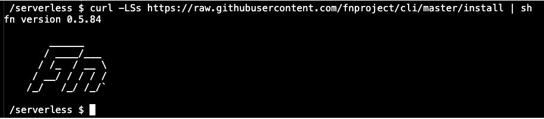

###### 图 3.2：Fn 的安装

1.  使用以下命令在您的终端中启动`Fn`服务器：

```
fn start -d
```

此命令将下载`Fn`服务器的 Docker 镜像，并在容器内启动，如下截图所示：

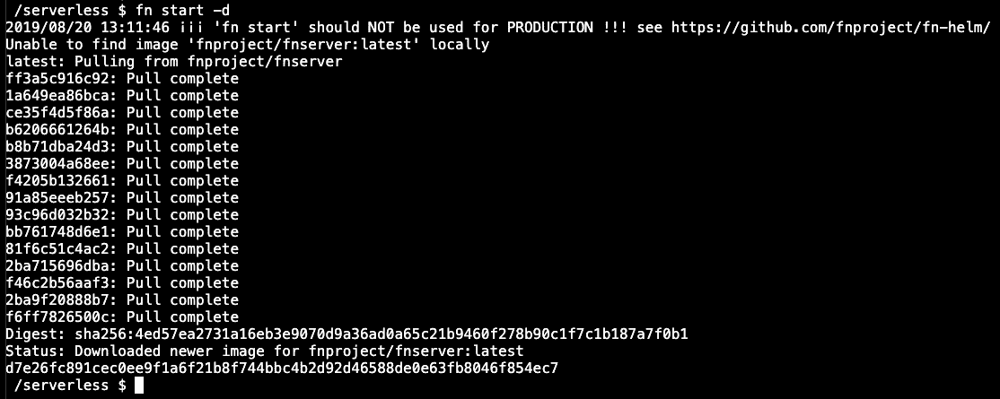

###### 图 3.3：启动 Fn 服务器

1.  使用以下命令在您的终端中检查客户端和服务器版本：

```
fn version
```

输出应如下所示：


###### 图 3.4：Fn 服务器和客户端版本

这个输出显示客户端和服务器端都在运行并相互交互。

1.  更新当前的 Fn 上下文并设置本地开发注册表：

```
fn use context default && fn update context registry serverless
```

输出如下截图所示：

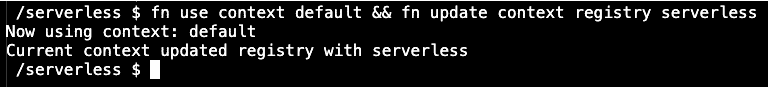

###### 图 3.5：当前上下文的注册表设置

如输出所示，设置了`default`上下文，并将注册表更新为`serverless`。

1.  使用以下命令在终端中启动`Fn`仪表板：

```
docker run -d --link fnserver:api -p 4000:4000 -e "FN_API_URL=http://api:8080" fnproject/ui
```

这个命令下载`fnproject/ui`镜像并以`detached`模式启动。此外，它将`fnserver:api`链接到自身并发布`4000`端口，如下截图所示：

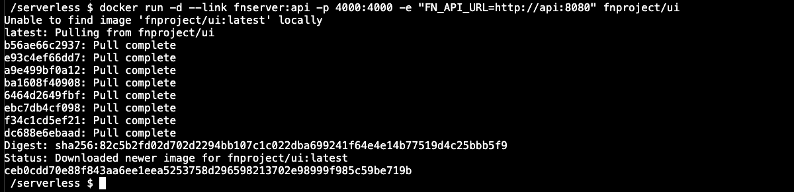

###### 图 3.6：启动 Fn UI

1.  使用以下命令检查正在运行的 Docker 容器：

```
docker ps
```

如预期的那样，有两个运行中的`Fn`容器，分别使用镜像名称`fnproject/ui`和`fnproject/fnserver:latest`，如下截图所示：

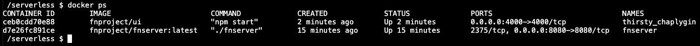

###### 图 3.7：Docker 容器

1.  在浏览器中打开`http://localhost:4000`来检查 Fn UI。

Fn 仪表板列出了应用程序和函数统计信息，作为一个 web 应用程序，如下截图所示：

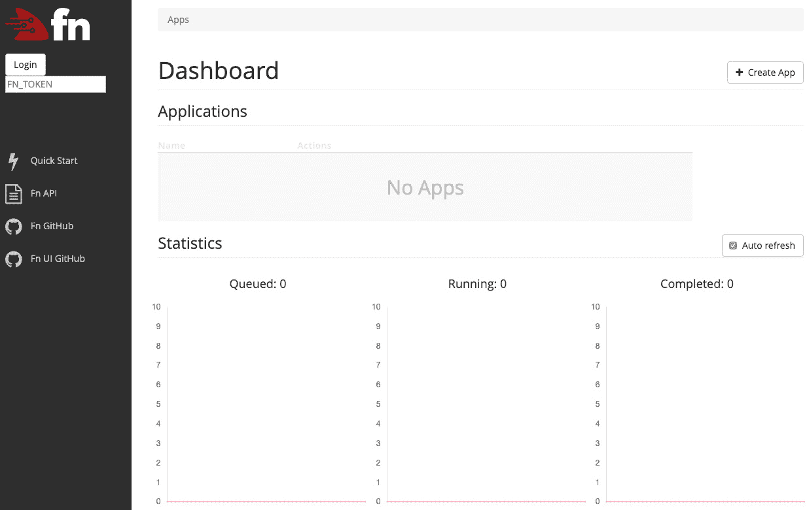

###### 图 3.8：Fn 仪表板

通过这个练习，我们已经安装了`Fn`框架，以及它的客户端、服务器和仪表板。由于`Fn`是一个与云无关的框架，可以使用所示步骤安装任何云或本地系统。我们将继续讨论`Fn`框架，讨论函数如何配置和部署。

`Fn`框架设计用于处理应用程序，其中每个应用程序都是一组具有自己路由映射的函数。例如，假设您已将函数分组到一个文件夹中，如下所示：

```
- app.yaml
- func.yaml
- func.go
- go.mod
- products/
  - func.yaml
  - func.js
- suppliers/
  - func.yaml
  - func.rb
```

在每个文件夹中，都有一个`func.yaml`文件，用于定义对应的`Ruby`、`Node.js`或其他支持的语言的函数实现。此外，根文件夹中还有一个`app.yaml`文件用于定义应用程序。

让我们从检查`app.yaml`的内容开始：

```
name: serverless-app
```

`app.yaml`用于定义无服务器应用程序的根目录，并包括应用程序的名称。根文件夹中还有三个额外的文件用于函数：

+   `func.go`：Go 实现代码

+   `go.mod`：Go 依赖定义

+   `func.yaml`：函数定义和触发器信息

对于带有 HTTP 触发器和 Go 运行时的函数，定义了以下`func.yaml`文件：

```
name: serverless-app
version: 0.0.1
runtime: go
entrypoint: ./func
triggers:
- name: serverless-app
  type: http
  source: /serverless-app
```

当您将所有这些函数部署到 Fn 时，它们将通过以下 URL 可访问：

```
http://serverless-kubernetes.io/ 		-> root function
http://serverless-kubernetes.io/products 	-> function in products/ directory
http://serverless-kubernetes.io/suppliers 	-> function in suppliers/ directory
```

在下一个练习中，将用一个真实的例子来说明`app.yaml`和`func.yaml`文件的内容以及它们的函数实现。

### 练习 8：在 Fn 框架中运行函数

在这个练习中，我们的目标是使用`Fn`框架创建、部署和调用一个函数。

要成功完成这个练习，我们需要确保执行以下步骤：

1.  在您的终端中，运行以下命令来创建一个应用程序：

```
mkdir serverless-app
cd serverless-app
echo "name: serverless-app" > app.yaml
cat app.yaml
```

输出应该如下所示：


###### 图 3.9：创建应用程序

这些命令创建一个名为`serverless-app`的文件夹，然后更改目录，使其位于此文件夹中。最后，创建一个名为`app.yaml`的文件，其中包含内容`name: serverless-app`，用于定义应用程序的根目录。

1.  在您的终端中运行以下命令，以创建一个在应用程序 URL 的`"/"`处可用的根函数：

```
fn init --runtime ruby --trigger http
```

该命令将在应用程序的根目录创建一个带有 HTTP 触发器的 Ruby 函数，如下面的屏幕截图所示：


###### 图 3.10：Ruby 函数创建

1.  使用以下命令在终端中创建一个子函数：

```
fn init --runtime go --trigger http hello-world
```

该命令在应用程序的`hello-world`文件夹中初始化一个带有 HTTP 触发器的 Go 函数，如下面的屏幕截图所示：


###### 图 3.11：Go 函数创建

1.  在终端中使用以下命令检查应用程序的目录：

```
ls -l ./*
```

该命令列出了根文件夹和子文件夹中的文件，如下面的屏幕截图所示：

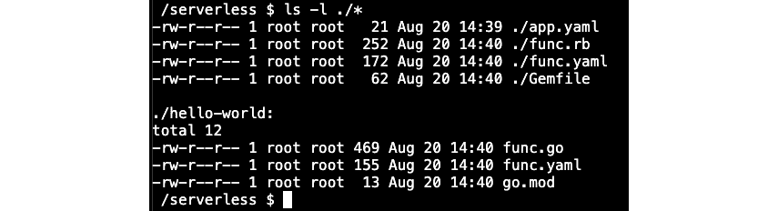

###### 图 3.12：文件夹结构

如预期的那样，在根文件夹中有一个 Ruby 函数，包含三个文件：`func.rb`用于实现，`func.yaml`用于函数定义，`Gemfile`用于定义 Ruby 函数依赖。

同样，在`hello-world`文件夹中有一个 Go 函数，包含三个文件：`func.go`用于实现，`func.yaml`用于函数定义，`go.mod`用于 Go 依赖。

1.  使用以下命令在终端中部署整个应用程序：

```
fn deploy --create-app --all --local
```

此命令通过创建应用程序并使用本地开发环境部署所有函数，如下截图所示：

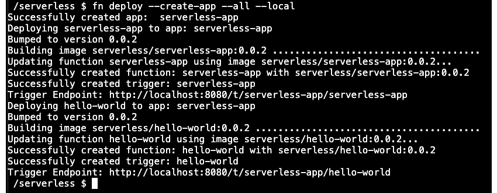

###### 图 3.13：应用程序部署到 Fn

首先，构建`serverless-app`的函数，然后创建函数和触发器。同样，构建并部署`hello-world`函数以及相应的函数和触发器。

1.  使用以下命令列出应用程序的触发器，并复制`serverless-app-trigger`和`hello-world-trigger`的`Endpoints`：

```
fn list triggers serverless-app
```

此命令列出了`serverless-app`的触发器，以及函数、类型、源和端点信息，如下截图所示：

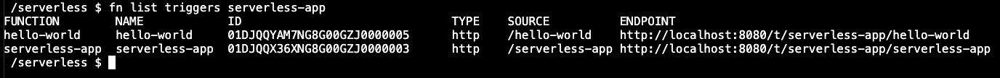

###### 图 3.14：触发器列表

1.  使用以下命令在终端中触发端点：

#### 注意

对于`curl`命令，请不要忘记使用我们在*步骤 5*中复制的端点。

```
curl -d Ece http://localhost:8080/t/serverless-app/serverless-app
```

输出应该如下所示：

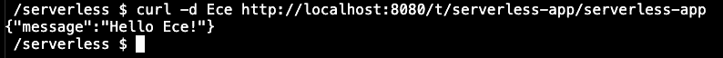

###### 图 3.15：调用 serverless-app 触发器

此命令将调用位于应用程序`root`处的`serverless-app`触发器。由于它是以`name`负载触发的，它会响应个人消息：`Hello Ece!`：

```
curl http://localhost:8080/t/serverless-app/hello-world
```

此命令将调用`hello-world`触发器，没有任何负载，如预期的那样，它会响应`Hello World`，如下截图所示：

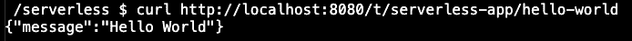

###### 图 3.16：调用 hello-world 触发器

1.  通过在浏览器中打开`http://localhost:4000`，从`Fn`仪表板中检查应用程序和函数统计信息。

在主屏幕上，可以看到您的应用程序及其整体统计信息，以及自动刷新的图表，如下截图所示：

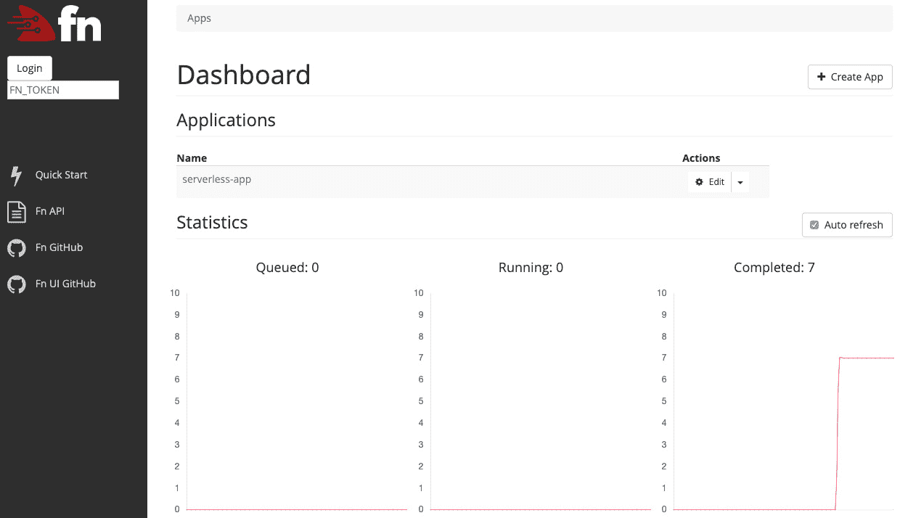

###### 图 3.17：Fn 仪表板-主页

单击应用程序列表中的`serverless-app`以查看有关应用程序功能的更多信息，如下截图所示：

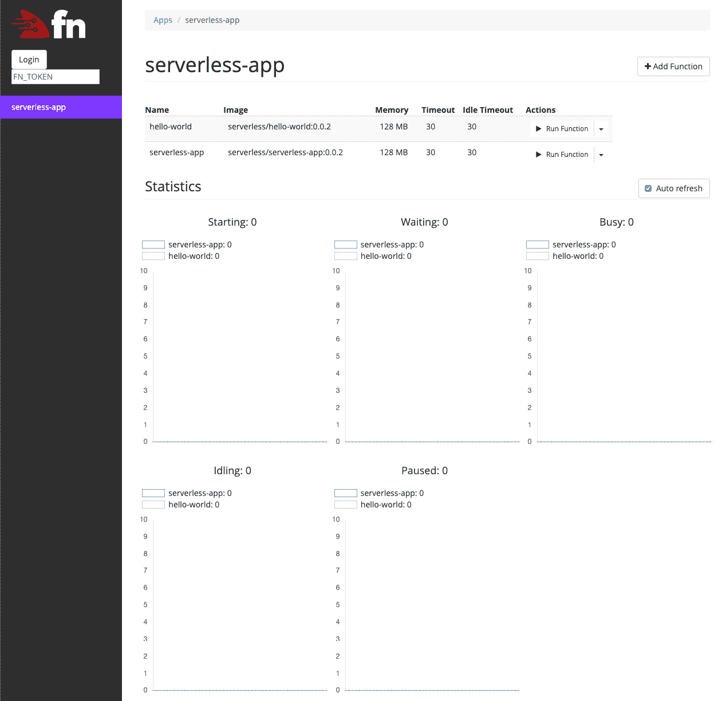

###### 图 3.18：Fn 仪表板-应用程序

1.  在终端中使用以下命令停止`Fn`服务器：

```
fn stop
```

此命令将停止`Fn`服务器，包括所有函数实例，如下截图所示：


###### 图 3.19：Fn 服务器停止

在本练习中，我们在`Fn`框架中创建了一个双函数应用程序并部署了它。我们向您展示了如何使用`fn`客户端将函数构建为 Docker 容器，并通过创建函数来调用函数的触发器。此外，还从`Fn`仪表板检查了函数的统计信息。作为一个面向容器的、与云无关的框架，该框架的函数是 Docker 容器，可以在任何云提供商或本地系统上运行。在下一节中，将介绍另一个无服务器框架，即**Serverless Framework**，它更专注于云提供商集成。

## Serverless Framework

Serverless Framework 在 2015 年以**JavaScript Amazon Web Services (JAWS)**的名字宣布。最初是在 Node.js 中开发的，以使人们更容易开发 AWS Lambda 函数。同年，它将名称更改为**Serverless Framework**，并将其范围扩大到其他云提供商和无服务器框架，包括**Google Cloud Functions**，**Azure Functions**，**Apache OpenWhisk**，**Fn**等等。

Serverless Framework 是开源的，其源代码可在 GitHub 上找到：[`github.com/serverless/serverless`](https://github.com/serverless/serverless)。如下截图所示，这是一个非常受欢迎的存储库，拥有超过 31,000 颗星：

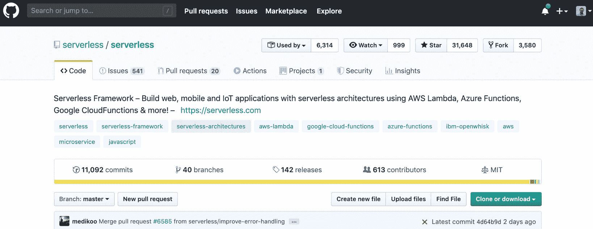

###### 图 3.20：Serverless Framework GitHub 存储库

该框架的官方网站可在[`serverless.com`](https://serverless.com)上找到，并提供广泛的文档、用例和示例。Serverless Framework 的主要特点可以分为四个主要主题：

+   **与云无关**：Serverless Framework 旨在创建一个与云无关的无服务器应用程序开发环境，因此供应商锁定不是一个问题。

+   **可重用组件**：在 Serverless Framework 中开发的无服务器函数是开源的并可用。这些组件帮助我们快速创建复杂的应用程序。

+   **基础设施即代码**：在 Serverless Framework 中开发的所有配置和源代码都是明确定义的，并且可以通过单个命令部署。

+   **开发者体验**：Serverless Framework 旨在通过其 CLI、配置参数和活跃的社区来增强开发者体验。

Serverless Framework 的这四个特点使其成为创建云中无服务器应用程序最知名的框架。此外，该框架专注于管理无服务器应用程序的完整生命周期：

+   **开发**：可以在本地开发应用程序，并通过框架 CLI 重用开源插件。

+   **部署**：Serverless Framework 可以部署到多个云平台，并从开发到生产中推出和回滚版本。

+   **测试**：该框架支持使用命令行客户端函数直接测试函数。

+   **安全性**：该框架处理运行函数的秘密和部署的特定于云的身份验证密钥。

+   **监控**：无服务器应用程序的指标和日志可通过无服务器运行时和客户端工具获得。

在接下来的练习中，将使用 Serverless Framework 在 Docker 容器内创建、配置和部署一个无服务器应用程序到 AWS，以展示使用无服务器应用程序有多么容易。

#### 注意

Serverless Framework 可以通过`npm`下载并安装到本地计算机上。在接下来的练习中，将使用包含 Serverless Framework 安装的 Docker 容器，以便我们拥有快速且可重复的设置。

在接下来的练习中，将使用 Serverless Framework 将`hello-world`函数部署到 AWS Lambda。为了完成这个练习，您需要拥有一个活跃的亚马逊网络服务账户。您可以在[`aws.amazon.com/`](https://aws.amazon.com/)上创建一个账户。

### 练习 9：使用 Serverless Framework 运行函数

在这个练习中，我们的目标是配置 Serverless 框架并使用它部署我们的第一个函数。使用 Serverless 框架，可以创建与云无关的无服务器应用程序。在这个练习中，我们将把函数部署到 AWS Lambda。但是，也可以将相同的函数部署到不同的云提供商。

要成功完成这个练习，我们需要确保执行以下步骤：

1.  在你的终端中，运行以下命令启动 Serverless 框架开发环境：

```
docker run -it --entrypoint=bash onuryilmaz/serverless
```

该命令将以交互模式启动一个 Docker 容器。在接下来的步骤中，将在这个 Docker 容器内执行操作，如下截图所示：

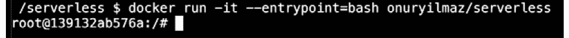

###### 图 3.21：启动无服务器的 Docker 容器

1.  运行以下命令检查框架版本：

```
serverless version
```

该命令列出了框架、插件和 SDK 版本，并且完整的输出表明一切都设置正确，如下截图所示：


###### 图 3.22：框架版本

1.  运行以下命令以交互方式使用框架：

```
serverless
```

按下**Y**创建一个新项目，并从下拉菜单中选择**AWS Node.js**，如下截图所示：

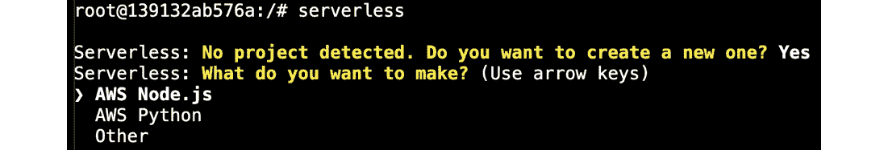

###### 图 3.23：在框架中创建一个新项目

1.  将项目名称设置为`hello-world`，然后按下**Enter**。输出如下：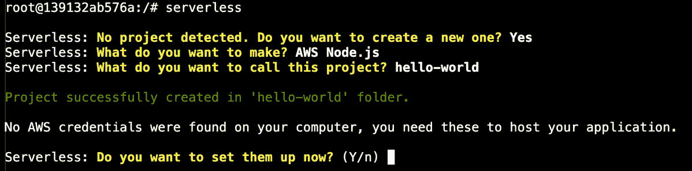

###### 图 3.24：成功创建项目

1.  按下**Y**回答 AWS 凭证设置问题，然后再次按下**Y**回答**您是否有 AWS 账户？**的问题。输出如下：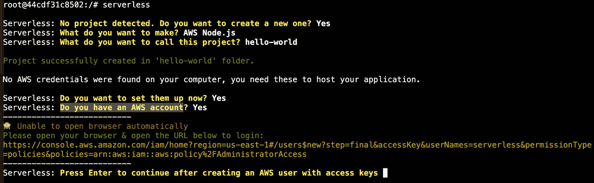

###### 图 3.25：AWS 账户设置

现在你有一个用于创建无服务器用户的 URL。复制并保存这个 URL；我们以后会用到它。

1.  在浏览器中打开*步骤 4*中的 URL，并开始向 AWS 控制台添加用户。该 URL 将打开预定义选择的**添加用户**屏幕。点击屏幕末尾的**下一步：权限**，如下截图所示：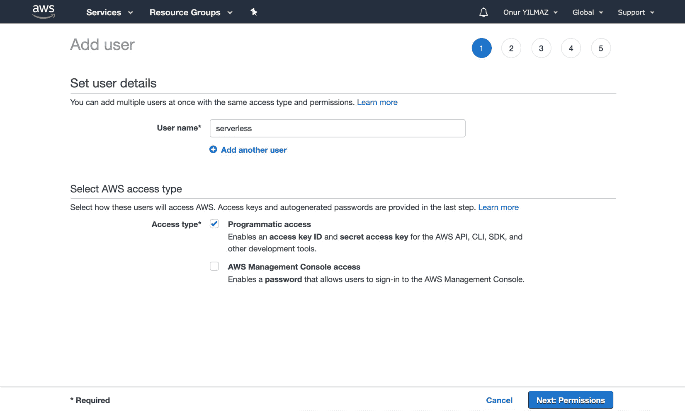

###### 图 3.26：AWS 添加用户

1.  **AdministratorAccess**策略应该会自动选择。如下面的屏幕截图所示，单击屏幕底部的“下一步：标签”：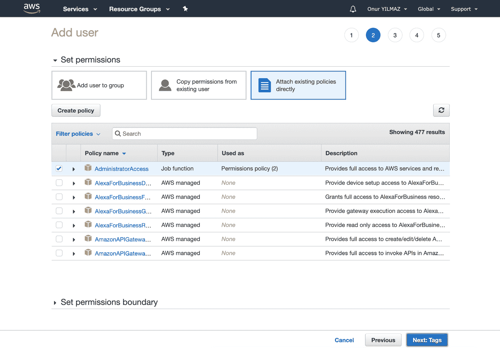

###### 图 3.27：AWS 添加用户-权限

1.  如果您想要给用户打标签，您可以在此视图中添加可选标签。单击“下一步：审核”，如下面的屏幕截图所示：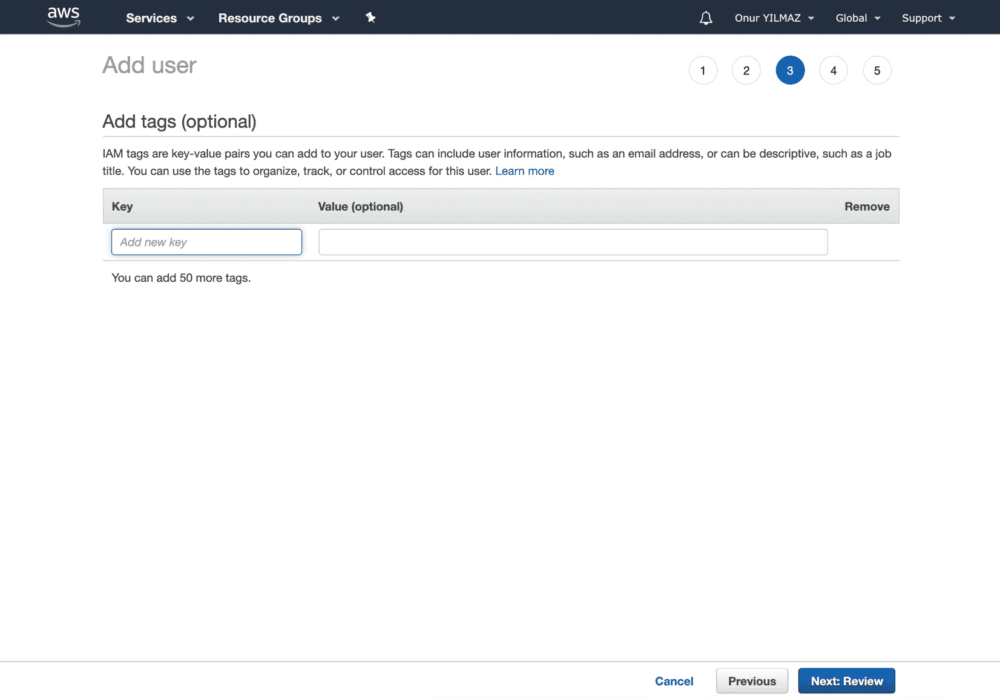

###### 图 3.28：AWS 添加用户-标签

1.  此视图显示了新用户的摘要。如下面的屏幕截图所示，单击“创建用户”：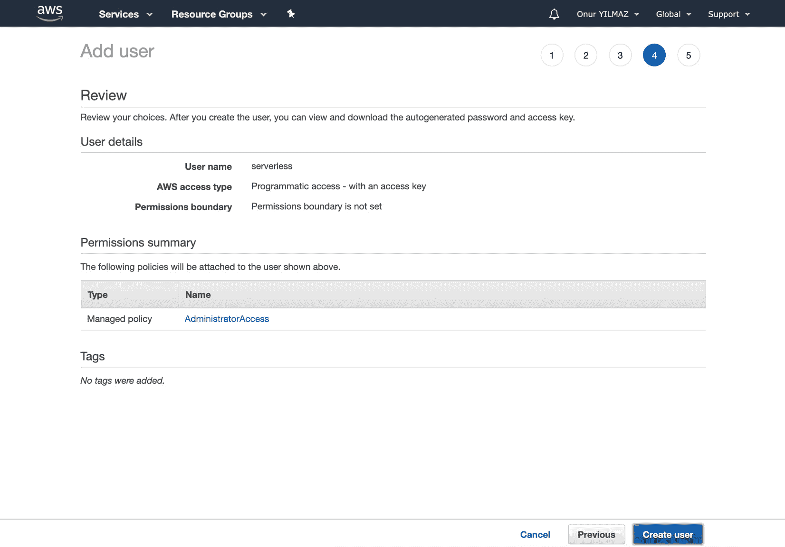

###### 图 3.29：AWS 添加用户-审核

您将被重定向到一个成功页面，显示**访问密钥 ID**和**秘密**，如下面的屏幕截图所示：

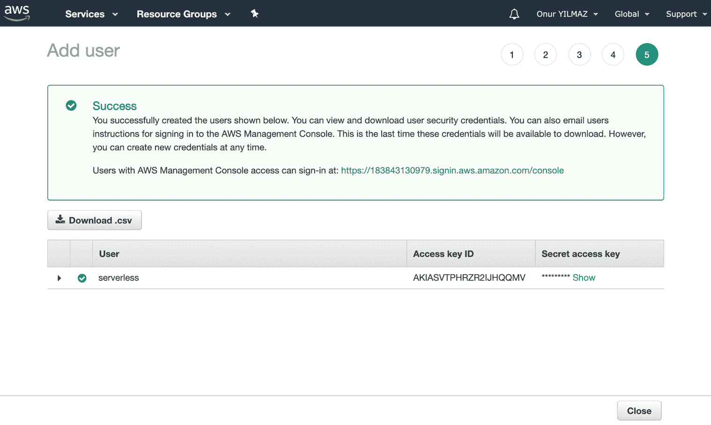

###### 图 3.30：AWS 添加用户-成功

1.  复制密钥 ID 和秘密访问密钥，以便您可以在本练习的后续步骤和本章的活动中使用它。您需要单击“显示”以显示秘密访问密钥。

1.  返回到您的终端并按**Enter**输入密钥 ID 和秘密信息，如下面的屏幕截图所示：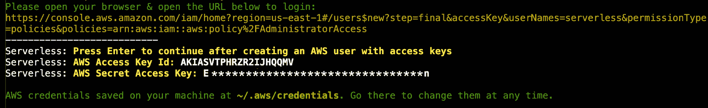

###### 图 3.31：框架中的 AWS 凭据

1.  按下**Y**回答 Serverless 账户启用问题，并从下拉菜单中选择**注册**，如下面的屏幕截图所示：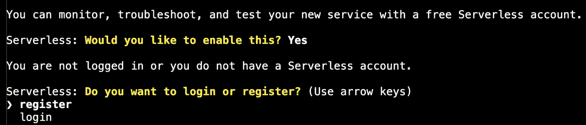

###### 图 3.32：Serverless 账户已启用

1.  输入您的电子邮件和密码以创建 Serverless 框架账户，如下面的屏幕截图所示：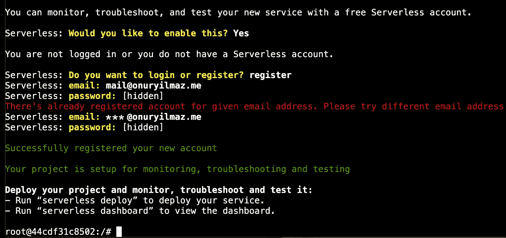

###### 图 3.33：Serverless 账户注册

1.  运行以下命令以更改目录并部署函数：

```
cd hello-world
serverless deploy -v 
```

这些命令将使 Serverless Framework 将函数部署到 AWS，如下面的屏幕截图所示：

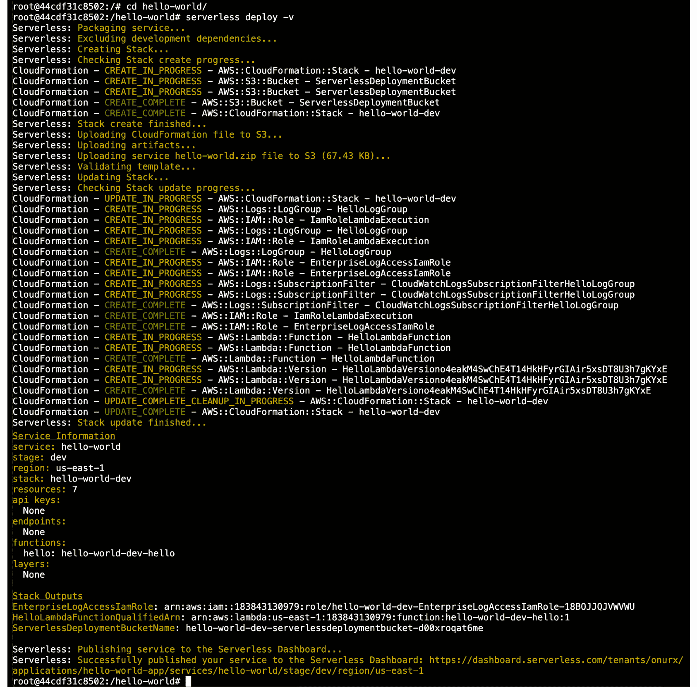

###### 图 3.34：Serverless 框架部署输出

#### 注意

输出日志从打包服务和为源代码、工件和函数创建 AWS 资源开始。在创建了所有资源之后，“服务信息”部分将提供函数和 URL 的摘要。

在屏幕底部，您将找到部署函数的**无服务器仪表板 URL**，如下截图所示：

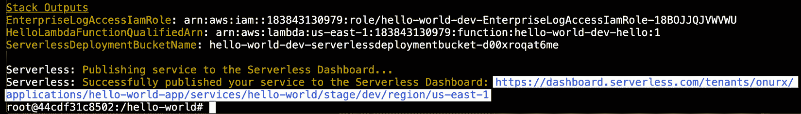

###### 图 3.35：堆栈输出

复制仪表板 URL，以便在接下来的步骤中检查函数指标。

1.  使用以下命令在终端中调用函数：

```
 serverless invoke --function hello
```

此命令调用部署的函数并打印出响应，如下截图所示：

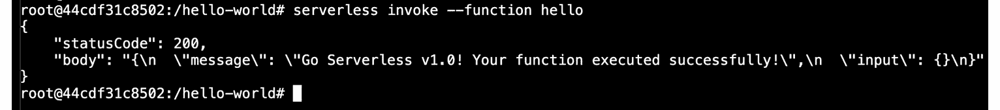

###### 图 3.36：函数输出

如输出所示，`statusCode`为`200`，响应的正文表明函数已成功响应。

1.  在浏览器中打开您在第 8 步末尾复制的无服务器仪表板 URL，如下截图所示：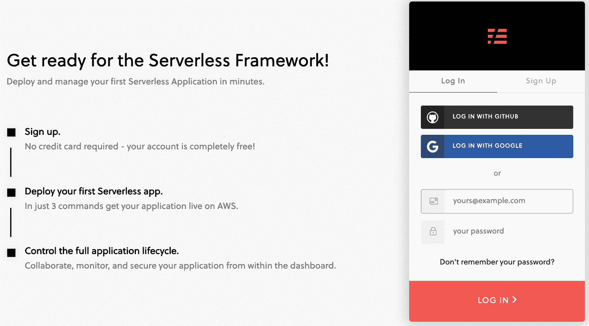

###### 图 3.37：无服务器仪表板登录

1.  使用您在*步骤 5*中创建的电子邮件和密码登录。

您将被重定向到应用程序列表。展开**hello-world-app**并点击**成功部署**行，如下截图所示：

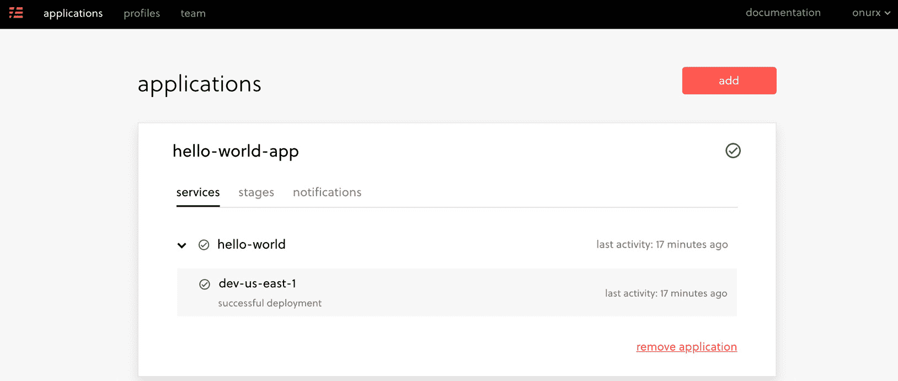

###### 图 3.38：无服务器仪表板应用程序列表

在函数视图中，所有运行时信息，包括 API 端点、变量、警报和指标都可用。向下滚动以查看调用次数。输出应如下所示：

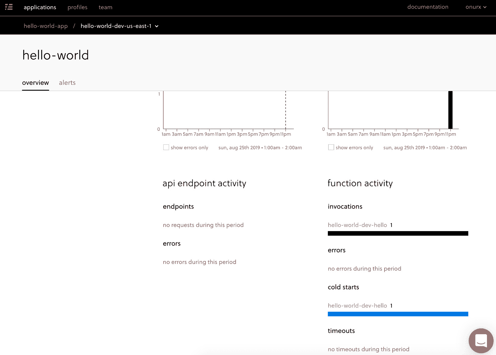

###### 图 3.39：无服务器仪表板函数视图

由于我们只调用了函数一次，因此在图表中只会看到**1**。

1.  返回到您的终端，并使用以下命令删除函数：

```
serverless remove
```

此命令将删除部署的函数及其所有依赖项，如下截图所示：

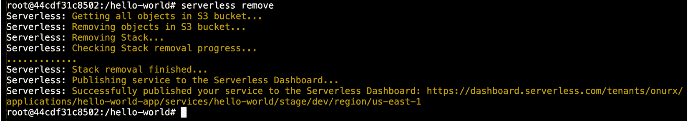

###### 图 3.40：移除函数

通过在终端中输入`exit`退出无服务器框架开发环境容器，如下截图所示：


###### 图 3.41：退出容器

在这个练习中，我们使用 Serverless Framework 创建、配置和部署了一个无服务器函数。此外，该函数是通过 CLI 调用的，并且可以从 Serverless Dashboard 检查其指标。Serverless Framework 为云提供商创建了一个全面的抽象，因此它只作为凭据传递给平台。换句话说，部署在哪里只是借助无服务器框架的帮助进行配置的问题。

在接下来的活动中，将开发一个真实的无服务器每日天气应用程序。您将创建一个带有调用计划的无服务器框架应用程序，并将其部署到云提供商。此外，天气状况消息将发送到一个名为*Slack*的基于云的协作工具。

#### 注意

为了完成接下来的活动，您需要能够访问 Slack 工作区。您可以使用现有的 Slack 工作区，也可以免费创建一个新的工作区，网址为[`slack.com/create`](https://slack.com/create)。

### 活动 3：Slack 的每日天气状况功能

本活动的目的是创建一个真实的无服务器应用程序，可以在特定的*Slack*频道中发送天气状况消息。该函数将使用**Serverless Framework**开发，以便将来可以在多个云平台上运行。该函数将被设计为在团队特定时间运行，以便他们了解天气状况，比如在早上上班前。这些消息将发布在*Slack*频道上，这是团队内的主要沟通工具。

为了获取天气状况以在团队内共享，您可以使用**wttr.in**（[`github.com/chubin/wttr.in`](https://github.com/chubin/wttr.in)），这是一个免费使用的天气数据提供商。完成后，您将已经将一个函数部署到了云提供商，即**AWS Lambda**：

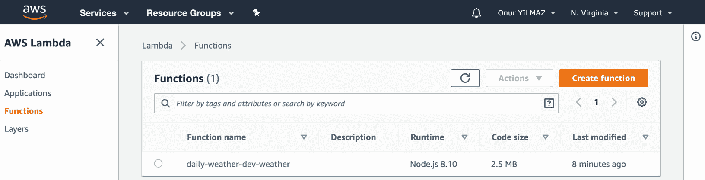

###### 图 3.42：每日天气功能

最后，当调度程序调用该函数，或者当您手动调用它时，您将在 Slack 频道中收到有关当前天气状况的消息：

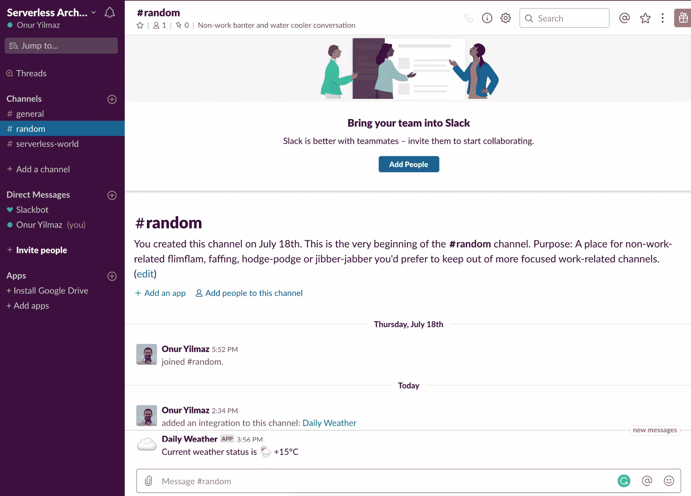

###### 图 3.43：Slack 消息显示当前天气状况

#### 注意

为了完成这个活动，您应该按照 Slack 设置步骤配置 Slack。

**Slack 设置**

执行以下步骤配置 Slack：

1.  在您的 Slack 工作区中，单击您的用户名，然后选择**自定义 Slack**。

1.  在打开的窗口中单击**配置应用程序**。

1.  单击**浏览应用程序目录**以从目录中添加新应用程序。

1.  在应用程序目录的搜索框中找到**传入 WebHooks**。

1.  单击**设置**以设置**传入 WebHooks**应用程序。

1.  使用您特定的频道名称和图标填写传入 Webhooks 的配置。

1.  打开您的 Slack 工作区和您在第 6 步中配置的频道，以便检查集成消息。

#### 注意

在第 387 页可以找到 Slack 设置步骤的详细截图。

执行以下步骤以完成此活动。

1.  在您的终端中，在名为`daily-weather`的文件夹中创建一个 Serverless Framework 应用程序结构。

1.  创建一个`package.json`文件来定义`daily-weather`文件夹中的 Node.js 环境。

1.  创建一个`handler.js`文件来实现`daily-weather`文件夹中的实际功能。

1.  为无服务器应用程序安装 Node.js 依赖项。

1.  将 AWS 凭据导出为环境变量。

1.  使用 Serverless Framework 将无服务器应用程序部署到 AWS。

1.  在 AWS 控制台中检查已部署函数的 AWS Lambda。

1.  使用 Serverless Framework 客户端工具调用函数。

1.  检查发布的天气状态的 Slack 频道。

1.  返回到您的终端并使用 Serverless Framework 删除函数。

1.  退出 Serverless Framework 开发环境容器。

#### 注意

此活动的解决方案可以在第 387 页找到。

## 摘要

在本章中，我们通过讨论云提供商的无服务器产品之间的差异，提供了无服务器框架的概述。在此之后，我们深入讨论了一个基于容器的原生框架和一个基于云的原生框架。首先讨论了`Fn`框架，这是一个开源的、基于容器的、与云无关的平台。其次介绍了 Serverless Framework，这是一个更加注重云和更全面的框架。此外，我们还在本地安装和配置了这两个框架。在两个无服务器框架中创建、部署和运行了无服务器应用程序。使用无服务器框架的功能进行调用，并检查必要的指标以进行进一步分析。在本章的最后，我们实现了一个真实的、每日天气 Slack 机器人，作为一个明确定义的、与云无关的应用程序，使用了无服务器框架。无服务器框架以其与云无关和开发者友好的特性，对无服务器开发世界至关重要。
