# 第四章： Kubernetes 深入探讨

## 学习目标

到本章结束时，您将能够：

+   在计算机上设置本地 Kubernetes 集群

+   使用仪表板和终端访问 Kubernetes 集群

+   识别基本的 Kubernetes 资源，Kubernetes 应用程序的构建模块

+   在 Kubernetes 集群上安装复杂的应用程序

在本章中，我们将解释 Kubernetes 架构的基础知识，访问 Kubernetes API 的方法以及基本的 Kubernetes 资源。除此之外，我们还将在 Kubernetes 中部署一个真实的应用程序。

## Kubernetes 简介

在上一章中，我们学习了无服务器框架，使用这些框架创建了无服务器应用程序，并将这些应用程序部署到主要的云提供商。

正如我们在前几章中所看到的，Kubernetes 和无服务器架构在行业中开始同时受到关注。Kubernetes 以其基于可扩展性、高可用性和可移植性的设计原则获得了高度的采用，并成为事实上的容器管理系统。对于无服务器应用程序，Kubernetes 提供了两个基本的好处：**消除供应商锁定**和**服务的重复使用**。

Kubernetes 创建了一个基础设施抽象层，以消除供应商锁定。供应商锁定是指从一个服务提供商转移到另一个服务提供商非常困难甚至不可行的情况。在上一章中，我们学习了无服务器框架如何轻松开发与云无关的无服务器应用程序。假设您正在**AWS EC2**实例上运行您的无服务器框架，并希望迁移到**Google Cloud**。尽管您的无服务器框架在云提供商和无服务器应用程序之间创建了一层，但您仍然对基础设施的云提供商有很深的依赖。Kubernetes 通过在基础设施和云提供商之间创建一个抽象来打破这种联系。换句话说，在 Kubernetes 上运行的无服务器框架对基础设施一无所知。如果您的无服务器框架在 AWS 上运行 Kubernetes，则预计它也可以在**Google Cloud Platform**（**GCP**）或 Azure 上运行。

作为事实上的容器管理系统，Kubernetes 管理云中和本地系统中的大多数微服务应用程序。假设您已经将大型单体应用程序转换为云原生微服务，并在 Kubernetes 上运行它们。现在，您已经开始开发无服务器应用程序或将一些微服务转换为无服务器*纳米服务*。在这个阶段，您的无服务器应用程序将需要访问数据和其他服务。如果您可以在 Kubernetes 集群中运行您的无服务器应用程序，您将有机会重复使用服务并接近您的数据。此外，管理和操作微服务和无服务器应用程序将更容易。

作为解决供应商锁定问题，并为了数据和服务的潜在重复使用，学习如何在 Kubernetes 上运行无服务器架构至关重要。在本章中，将介绍 Kubernetes 的概述，介绍 Kubernetes 的起源和设计。接下来，我们将安装一个本地 Kubernetes 集群，您将能够通过仪表板或使用`kubectl`等客户端工具访问集群。除此之外，我们还将讨论 Kubernetes 应用程序的构建模块，最后，我们将在集群中部署一个真实的应用程序。

## Kubernetes 设计和组件

Kubernetes，也被称为**k8s**，是一个用于管理容器的平台。它是一个复杂的系统，专注于容器的完整生命周期，包括配置、安装、健康检查、故障排除和扩展。通过 Kubernetes，可以以可伸缩、灵活和可靠的方式运行微服务。假设您是一家金融科技公司的 DevOps 工程师，专注于为客户提供在线银行服务。

您可以以安全和云原生的方式配置和安装在线银行应用程序的完整后端和前端到 Kubernetes。通过 Kubernetes 控制器，您可以手动或自动地扩展服务，以满足客户需求。此外，您可以检查日志，对每个服务执行健康检查，甚至可以 SSH 到应用程序的容器中。

在本节中，我们将重点关注 Kubernetes 的设计以及其组件如何和谐地工作。

Kubernetes 集群由一个或多个服务器组成，每个服务器分配了一组逻辑角色。集群的服务器分配了两个基本角色：**master**和**node**。如果服务器处于**master**角色，则 Kubernetes 的控制平面组件运行在这些节点上。控制平面组件是用于运行 Kubernetes API 的主要服务集，包括 REST 操作、身份验证、授权、调度和云操作。在最新版本的 Kubernetes 中，有四个服务作为控制平面运行：

+   **etcd**：`etcd`是一个开源的键/值存储，它是所有 Kubernetes 资源的数据库。

+   **kube-apiserver**：API 服务器是运行 Kubernetes REST API 的组件。这是与飞机其他部分和客户端工具交互的最关键组件。

+   **kube-scheduler**：调度程序根据工作负载的要求和节点状态将工作负载分配给节点。

+   **kube-controller-manager**：`kube-controller-manager`是用于管理 Kubernetes 资源的核心控制器的控制平面组件。*控制器*是 Kubernetes 资源的主要生命周期管理器。对于每个 Kubernetes 资源，都有一个或多个控制器在*图 4.1*中的**观察**、**决策**和**执行**循环中工作。控制器在观察阶段检查资源的当前状态，然后分析并决定达到所需状态所需的操作。在执行阶段，它们执行操作并继续观察资源。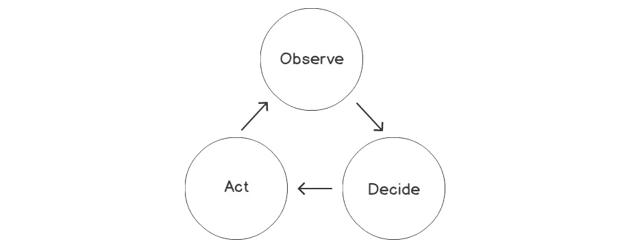

###### 图 4.1：Kubernetes 中的控制器循环

具有**node**角色的服务器负责在 Kubernetes 中运行工作负载。因此，每个节点都需要两个基本的 Kubernetes 组件：

+   **kubelet**：`kubelet`是节点中控制平面的管理网关。`kubelet`与 API 服务器通信并在节点上实施所需的操作。例如，当将新的工作负载分配给节点时，`kubelet`通过与容器运行时（如 Docker）交互来创建容器。

+   **kube-proxy**：容器在服务器节点上运行，但它们在统一的网络设置中相互交互。`kube-proxy`使容器能够通信，尽管它们在不同的节点上运行。

控制平面和角色（如主节点和工作节点）是组件的逻辑分组。然而，建议使用具有多个主节点角色服务器的高可用控制平面。此外，具有节点角色的服务器连接到控制平面，以创建可扩展和云原生环境。控制平面与主节点服务器和节点服务器的关系和交互如下图所示：

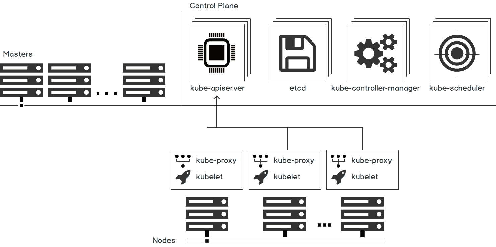

###### 图 4.2：Kubernetes 集群中的控制平面、主节点和节点服务器

在接下来的练习中，将在本地创建一个 Kubernetes 集群，并检查 Kubernetes 组件。Kubernetes 集群是具有主节点或工作节点的服务器集合。在这些节点上，控制平面组件和用户应用程序以可扩展和高可用的方式运行。借助本地 Kubernetes 集群工具，可以创建用于开发和测试的单节点集群。`minikube`是官方支持和维护的本地 Kubernetes 解决方案，并将在接下来的练习中使用。

#### 注意：...]

在接下来的练习中，您将使用`minikube`作为官方本地 Kubernetes 解决方案，并在虚拟化程序上运行 Kubernetes 组件。因此，您必须安装虚拟化程序，如**Virtualbox**、**Parallels**、**VMWareFusion**、**Hyperkit**或**VMWare**。有关更多信息，请参阅此链接：

[`kubernetes.io/docs/tasks/tools/install-minikube/#install-a-hypervisor`](https://kubernetes.io/docs/tasks/tools/install-minikube/#install-a-hypervisor)

### 练习 10：启动本地 Kubernetes 集群

在本练习中，我们将安装`minikube`并使用它启动一个单节点 Kubernetes 集群。当集群启动并运行时，将可以检查主节点和节点组件。

为完成练习，需要确保执行以下步骤：

1.  在终端中运行以下命令将`minikube`安装到本地系统：

```
# Linux
curl -Lo minikube https://storage.googleapis.com/minikube/releases/latest/minikube-linux-amd64
# MacOS
curl -Lo minikube https://storage.googleapis.com/minikube/releases/latest/minikube-darwin-amd64 
chmod +x minikube 
sudo mv minikube /usr/local/bin
```

这些命令下载`minikube`的二进制文件，使其可执行，并将其移动到`bin`文件夹以供终端访问。

1.  通过运行以下命令启动`minikube`集群：

```
minikube start
```

此命令下载镜像并创建单节点虚拟机。随后，它配置该机器并等待 Kubernetes 控制平面启动，如下图所示：

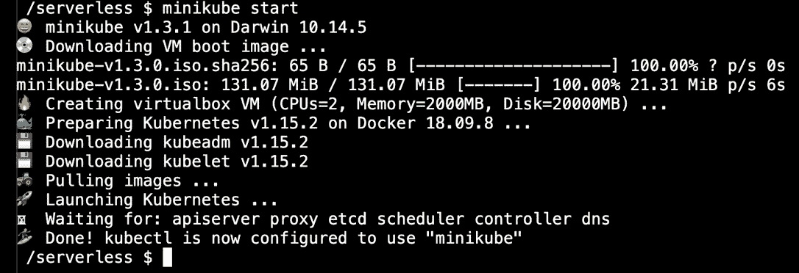

###### 图 4.3：在 minikube 中启动新集群

1.  检查 Kubernetes 集群的状态：

`minikube status`

如下图中的输出所示，主机系统、`kubelet`和`apiserver`正在运行：

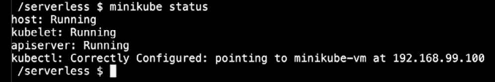

###### 图 4.4：Kubernetes 集群状态

1.  通过运行以下命令连接到`minikube`的虚拟机：

```
minikube ssh
```

您应该看到以下图中显示的输出：


###### 图 4.5：minikube 虚拟机

1.  使用以下命令检查四个控制平面组件：

```
pgrep -l etcd && pgrep -l kube-apiserver && pgrep -l kube-scheduler && pgrep -l controller
```

此命令列出进程并捕获所提到的命令名称。每个控制平面组件及其进程 ID 对应四行，如下图所示：

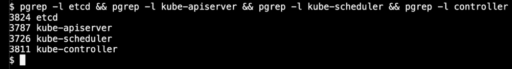

###### 图 4.6：控制平面组件

1.  使用以下命令检查节点组件：

```
pgrep -l kubelet && pgrep -l kube-proxy
```

此命令列出了在节点角色中运行的两个组件及其进程 ID，如下图所示：


###### 图 4.7：节点组件

1.  使用以下命令退出*步骤 4*中启动的终端：

```
exit
```

您应该看到以下图中显示的输出：


###### 图 4.8：退出 minikube 虚拟机

在本练习中，我们使用`minikube`安装了单节点 Kubernetes 集群。在下一节中，我们将讨论使用 Kubernetes 的官方客户端工具连接到并操作前面练习中的集群。

## Kubernetes 客户端工具：kubectl

Kubernetes 控制平面运行一个 REST API 服务器，用于访问 Kubernetes 资源和进行操作活动。Kubernetes 配备了一个名为`kubectl`的官方开源命令行工具，以便消费 REST API。它安装在本地系统上，并配置为安全可靠地连接远程集群。`kubectl`是 Kubernetes 中运行应用程序的完整生命周期的主要工具。例如，假设您在集群中部署了一个**WordPress**博客。首先，您可以使用`kubectl`创建数据库密码作为 secrets。然后，您部署博客应用程序并检查其状态。除此之外，您还可以跟踪应用程序的日志，甚至可以 SSH 到容器进行进一步分析。因此，它是一个强大的 CLI 工具，可以处理基本的**创建、读取、更新和删除（CRUD）**操作和故障排除。

除了应用程序管理外，`kubectl`还是集群操作的强大工具。可以使用`kubectl`检查 Kubernetes API 状态或集群中服务器的状态。假设您需要重新启动集群中的服务器，并且需要将工作负载移动到其他节点。使用`kubectl`命令，您可以将节点标记为*不可调度*，并让 Kubernetes 调度程序将工作负载移动到其他节点。完成维护后，您可以将节点标记为**Ready**，并让 Kubernetes 调度程序分配工作负载。

`kubectl`是日常 Kubernetes 操作的重要命令行工具。因此，学习基础知识并获得`kubectl`的实际经验至关重要。在接下来的练习中，您将安装和配置`kubectl`以连接到本地 Kubernetes 集群。

### 练习 11：使用客户端工具 kubectl 访问 Kubernetes 集群

在这个练习中，我们旨在使用`kubectl`访问 Kubernetes API 并探索其功能。

为了完成练习，我们需要确保执行以下步骤：

1.  通过在终端中运行以下命令下载`kubectl`可执行文件：

```
# Linux
curl -LO https://storage.googleapis.com/kubernetes-release/release/v1.15.0/bin/linux/amd64/kubectl
# MacOS
curl -LO https://storage.googleapis.com/kubernetes-release/release/v1.15.0/bin/darwin/amd64/kubectl
chmod +x kubectl
sudo mv kubectl /usr/local/bin
```

这些命令下载`kubectl`的二进制文件，使其可执行，并将其移动到`bin`文件夹以供终端访问。

1.  配置`kubectl`以连接到`minikube`集群：

```
kubectl config use-context minikube
```

此命令配置`kubectl`以使用`minikube`上下文，该上下文是用于连接到`kubectl`集群的一组凭据，如下图所示：


###### 图 4.9：kubectl 上下文设置

1.  使用以下命令检查可用节点：

```
 kubectl get nodes
```

此命令列出了连接到集群的所有节点。作为单节点集群，只有一个名为`minikube`的节点，如下图所示：


###### 图 4.10：kubectl get nodes

1.  使用以下命令获取有关`minikube`节点的更多信息：

`kubectl describe node minikube`

此命令列出有关节点的所有信息，从其元数据开始，例如`Roles`、`Labels`和`Annotations`。此节点的角色在**Roles**部分中被指定为`master`，如下图所示：

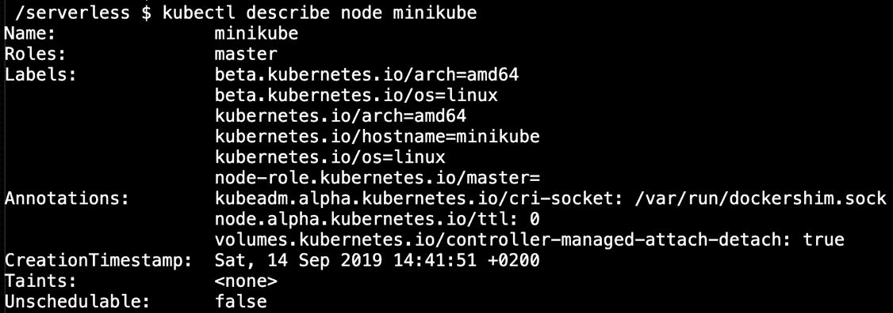

###### 图 4.11：节点元数据

在元数据之后，`Conditions` 列出了节点的健康状态。可以以表格形式检查可用内存、磁盘和进程 ID，如下图所示。

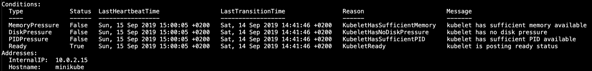

###### 图 4.12：节点条件

然后，列出可用和可分配的容量以及系统信息，如下图所示：

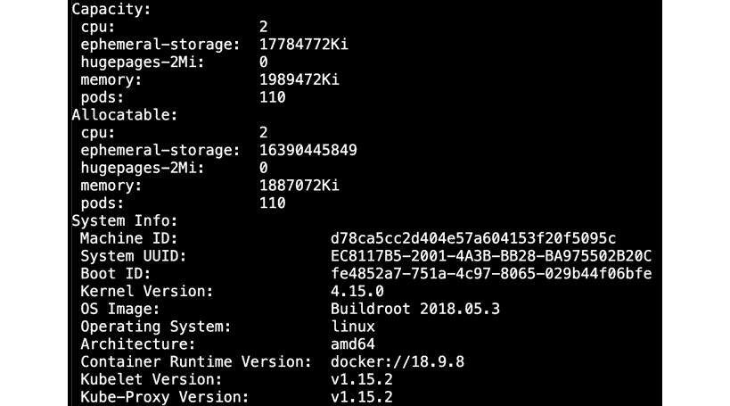

###### 图 4.13：节点容量信息

最后，列出了节点上运行的工作负载和分配的资源，如下图所示：

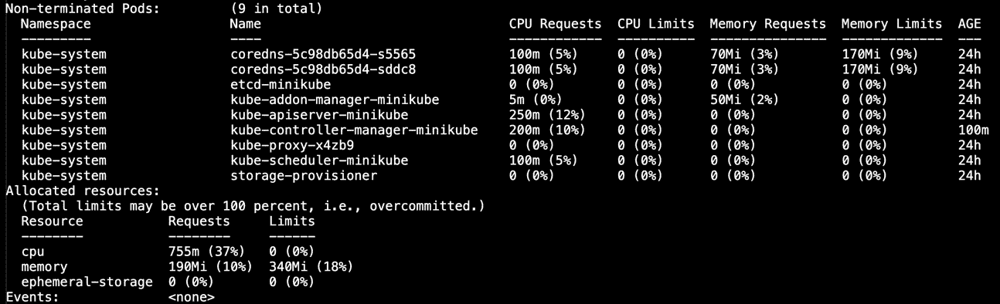

###### 图 4.14：节点工作负载信息

1.  使用以下命令获取支持的 API 资源：

```
kubectl api-resources -o name
```

您应该看到以下图中显示的输出：

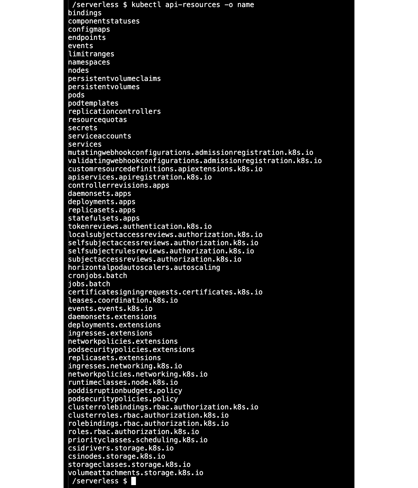

###### 图 4.15：kubectl api-resources 的输出

此命令列出 Kubernetes 集群支持的所有资源。列表的长度表示了 Kubernetes 在应用程序管理方面的强大和全面性。在本练习中，安装、配置和探索了官方 Kubernetes 客户端工具。在接下来的部分中，将介绍资源列表中的核心构建块资源。

## Kubernetes 资源

Kubernetes 配备了丰富的资源来定义和管理云原生应用程序作为容器。在 Kubernetes API 中，每个容器、秘钥、配置或自定义定义都被定义为资源。控制平面管理这些资源，而节点组件则尝试实现应用程序的期望状态。期望状态可能是运行 10 个应用程序实例或者挂载磁盘卷到数据库应用程序。控制平面和节点组件协同工作，使集群中的所有资源达到其期望状态。

在本节中，我们将学习用于运行无服务器应用程序的基本 Kubernetes 资源。

### Pod

`pod`是 Kubernetes 中用于计算的基本资源。一个 pod 由安排在同一节点上运行的容器组成，作为单个应用程序。同一 pod 中的容器共享相同的资源，如网络和内存资源。此外，pod 中的容器共享生命周期事件，如扩展或缩减。可以使用`ubuntu`镜像和`echo`命令定义一个 pod，如下所示：

```
apiVersion: v1
kind: Pod
metadata:
 name: echo
spec:
 containers:
 - name: main
   image: ubuntu
   command: ['sh', '-c', 'echo Serverless World! && sleep 3600']
```

当在 Kubernetes API 中创建`echo` pod 时，调度程序将其分配给一个可用节点。然后，相应节点中的`kubelet`将创建一个容器并将网络连接到它。最后，容器将开始运行`echo`和`sleep`命令。Pod 是创建应用程序的基本 Kubernetes 资源，并且 Kubernetes 将它们用作更复杂资源的构建块。在接下来的资源中，pod 将被封装以创建更复杂的云原生应用程序。

### 部署

部署是管理高可用应用程序的最常用的 Kubernetes 资源。部署通过扩展 pod，使其能够进行扩展、缩减或者部署新版本。部署定义看起来类似于一个带有两个重要附加项的 pod：标签和副本。

考虑以下代码：

```
apiVersion: apps/v1
kind: Deployment
metadata:
 name: webserver
 labels:
   app: nginx
spec:
 replicas: 5
 selector:
   matchLabels:
     app: server
 template:
   metadata:
     labels:
       app: server
   spec:
     containers:
     - name: nginx
       image: nginx:1.7.9
       ports:
       - containerPort: 80 
```

名为`webserver`的部署定义了应用程序的五个`副本`，这些副本带有标签`app:server`。在`模板`部分，应用程序使用完全相同的标签和一个`nginx`容器进行定义。控制平面中的部署控制器确保集群内运行着这个应用程序的五个实例。假设你有三个节点，A、B 和 C，分别运行着一个、两个和两个 webserver 应用程序的实例。如果节点 C 下线，部署控制器将确保丢失的两个实例在节点 A 和 B 中重新创建。Kubernetes 确保可伸缩和高可用的应用程序作为部署可靠地运行。在接下来的部分中，将介绍用于有状态应用程序的 Kubernetes 资源，如数据库。

### 有状态集

Kubernetes 支持运行无状态的短暂应用程序和有状态的应用程序。换句话说，可以以可伸缩的方式在集群内运行数据库应用程序或面向磁盘的应用程序。`StatefulSet`的定义与部署类似，但有与卷相关的附加内容。

考虑以下代码片段：

```
apiVersion: apps/v1
kind: StatefulSet
metadata:
  name: mysql
spec:
  selector:
    matchLabels:
      app: mysql
  serviceName: mysql
  replicas: 1
  template:
    metadata:
      labels:
        app: mysql
    spec:
      containers:
      - name: mysql
        image: mysql:5.7
        env:
        - name: MYSQL_ROOT_PASSWORD
          value: "root"
        ports:
        - name: mysql
          containerPort: 3306
        volumeMounts:
        - name: data
          mountPath: /var/lib/mysql
          subPath: mysql
  volumeClaimTemplates:
  - metadata:
      name: data
    spec:
      accessModes: ["ReadWriteOnce"]
      resources:
        requests:
          storage: 1Gi
```

`mysql` `StatefulSet`状态创建了一个带有 1GB 卷数据的 MySQL 数据库。卷是由 Kubernetes 创建并附加到容器的`/var/lib/mysql`目录。通过`StatefulSet`控制器，可以以可伸缩和可靠的方式创建需要磁盘访问的应用程序。在接下来的部分中，我们将讨论如何在 Kubernetes 集群中连接应用程序。

### 服务

在 Kubernetes 中，多个应用程序在同一个集群中运行并相互连接。由于每个应用程序在不同节点上运行着多个 pod，因此连接应用程序并不是一件简单的事情。在 Kubernetes 中，`Service`是用于定义一组 pod 的资源，并且可以通过`Service`的名称来访问它们。Service 资源是使用 pod 的标签来定义的。

考虑以下代码片段：

```
apiVersion: v1
kind: Service
metadata:
  name: my-database
spec:
  selector:
    app: mysql
  ports:
    - protocol: TCP
      port: 3306
      targetPort: 3306
```

使用`my-database`服务，具有标签`app: mysql`的 pod 被分组在一起。当调用`my-database`地址的`3306`端口时，Kubernetes 网络将连接到具有标签`app:mysql`的 pod 的`3306`端口。服务资源在应用程序之间创建了一个抽象层，并实现了解耦。假设您的应用程序中有三个后端实例和三个前端实例。前端 pod 可以使用`Service`资源轻松连接到后端实例，而无需知道后端实例运行在何处。它在集群中运行的应用程序之间创建了抽象和解耦。在接下来的部分中，将介绍关注任务和定时任务的资源。

### Job 和 CronJob

Kubernetes 资源，如`deployments`和`StatefulSets`，专注于运行应用程序并保持其运行。但是，Kubernetes 还提供了`Job`和`CronJob`资源来完成应用程序的运行。例如，如果您的应用程序需要执行一次性任务，可以创建一个`Job`资源，如下所示：

```
apiVersion: batch/v1
kind: Job
metadata:
  name: echo
spec:
  template:
    spec:
      restartPolicy: OnFailure
      containers:
      - name: echo
        image: busybox
        args:
         - /bin/sh
         - -c
         - echo Hello from the echo Job!
```

当创建`echo` Job 时，Kubernetes 将创建一个 pod，对其进行调度并运行。当容器在执行`echo`命令后终止时，Kubernetes 不会尝试重新启动它或保持其运行。

除了一次性任务外，还可以使用`CronJob`资源来运行定时作业，如下面的代码片段所示。

```
apiVersion: batch/v1beta1
kind: CronJob
metadata:
  name: hourly-echo
spec:
  schedule: "0 * * * *"
  jobTemplate:
    spec:
      template:
        spec:
          containers:
          restartPolicy: OnFailure
          - name: hello
            image: busybox
            args:
            - /bin/sh
            - -c
            - date; echo It is time to say echo!
```

使用`hourly-echo` CronJob，提供了一个额外的`schedule`参数。使用`"0 * * * *"`的计划，Kubernetes 将创建此 CronJob 的新 Job 实例，并每小时运行一次。Job 和 CronJob 是处理应用程序所需的手动和自动化任务的 Kubernetes 本机方式。在接下来的练习中，将使用`kubectl`和本地 Kubernetes 集群来探索 Kubernetes 资源。

### 练习 12：在 Kubernetes 内部安装有状态的 MySQL 数据库并进行连接

在这个练习中，我们将安装一个 MySQL 数据库作为`StatefulSet`，检查其状态，并使用一个用于创建表的作业连接到数据库。

要完成练习，我们需要确保执行以下步骤：

1.  在本地计算机上创建一个名为`mysql.yaml`的文件，并包含以下内容：

```
apiVersion: apps/v1
kind: StatefulSet
metadata:
  name: mysql
spec:
  selector:
    matchLabels:
      app: mysql
  serviceName: mysql
  replicas: 1
  template:
    metadata:
      labels:
        app: mysql
    spec:
      containers:
      - name: mysql
        image: mysql:5.7
        env:
        - name: MYSQL_ROOT_PASSWORD
          value: "root"
        - name: MYSQL_DATABASE
          value: "db"
        - name: MYSQL_USER
          value: "user"
        - name: MYSQL_PASSWORD
          value: "password"
        ports:
        - name: mysql
          containerPort: 3306
        volumeMounts:
        - name: data
          mountPath: /var/lib/mysql
          subPath: mysql
  volumeClaimTemplates:
  - metadata:
      name: data
    spec:
      accessModes: ["ReadWriteOnce"]
      resources:
        requests:
          storage: 1Gi
```

#### 注意

`mysql.yaml`可在 GitHub 上找到[`github.com/TrainingByPackt/Serverless-Architectures-with-Kubernetes/blob/master/Lesson04/Exercise12/mysql.yaml`](https://github.com/TrainingByPackt/Serverless-Architectures-with-Kubernetes/blob/master/Lesson04/Exercise12/mysql.yaml)。

1.  在终端中使用以下命令部署`StatefulSet` MySQL 数据库：

```
kubectl apply -f mysql.yaml
```

这个命令提交了`mysql.yaml`文件，其中包括一个名为`mysql`的`StatefulSet`和一个 1GB 的卷索赔。输出如下：


###### 图 4.16：StatefulSet 创建

1.  使用以下命令检查 pod：

`kubectl get pods`

这个命令列出了运行中的 pod，我们期望看到一个`mysql`实例，如下图所示：


###### 图 4.17：Pod 列表

#### 注意

如果 pod 状态为`Pending`，请等待几分钟直到变为`Running`，然后再继续下一步。

1.  使用以下命令检查持久卷：

```
kubectl get persistentvolumes
```

这个命令列出了持久卷，我们期望看到为`StatefulSet`创建的单卷实例，如下图所示：

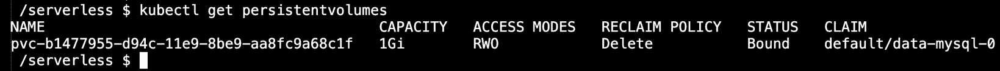

###### 图 4.18：持久卷列表

1.  使用以下内容创建`service.yaml`文件：

```
apiVersion: v1
kind: Service
metadata:
  name: my-database
spec:
  selector:
    app: mysql
  ports:
    - protocol: TCP
      port: 3306
      targetPort: 3306
```

#### 注意

`service.yaml`可在 GitHub 上找到[`github.com/TrainingByPackt/Serverless-Architectures-with-Kubernetes/blob/master/Lesson04/Exercise12/service.yaml`](https://github.com/TrainingByPackt/Serverless-Architectures-with-Kubernetes/blob/master/Lesson04/Exercise12/service.yaml)。

1.  使用以下命令在终端中部署`my-database`服务：

`kubectl apply -f service.yaml`

这个命令提交了名为`my-database`的`Service`，以便将标签为`app:mysql`的 pod 分组：


###### 图 4.19：服务创建

1.  使用以下内容创建`create-table.yaml`文件：

```
apiVersion: batch/v1
kind: Job
metadata:
  name: create-table
spec:
  template:
    spec:
      restartPolicy: OnFailure
      containers:
      - name: create
        image: mysql:5.7
        args:
         - /bin/sh
         - -c
         - mysql -h my-database -u user -ppassword db -e 'CREATE TABLE IF NOT EXISTS messages (id INT)';
```

#### 注意

`create-table.yaml`可在 GitHub 上找到[`github.com/TrainingByPackt/Serverless-Architectures-with-Kubernetes/blob/master/Lesson04/Exercise12/create-table.yaml`](https://github.com/TrainingByPackt/Serverless-Architectures-with-Kubernetes/blob/master/Lesson04/Exercise12/create-table.yaml)。

1.  使用以下命令部署作业：

```
kubectl apply -f create-table.yaml
```

此命令提交名为`create-table`的作业，并在几分钟内，将创建一个 pod 来运行`CREATE TABLE`命令，如下图所示：


###### 图 4.20：作业创建

1.  使用以下命令检查 pod：

`kubectl get pods`

此命令列出正在运行的 pod，我们期望看到一个`create-table`的实例，如下图所示：


###### 图 4.21：Pod 清单

#### 注意

如果 pod 状态为**Pending**或**Running**，请等待几分钟，直到它变为**Completed**，然后再继续下一步。

1.  运行以下命令来检查 MySQL 数据库中的表格：

```
kubectl run mysql-client --image=mysql:5.7 -i -t --rm --restart=Never \
-- mysql -h my-database -u user -ppassword  db -e "show tables;"
```

此命令运行一个临时实例的`mysql:5.7`镜像，并运行`mysql`命令，如下图所示：

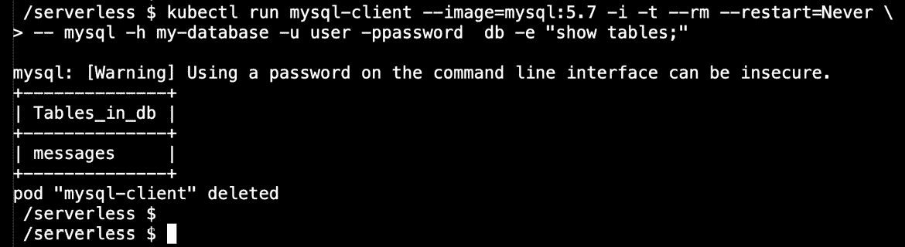

###### 图 4.22：表格清单

在 MySQL 数据库中，有一个名为`messages`的表格，如前面的输出所示。它显示`MySQL` `StatefulSet`已经成功运行数据库。此外，`create-table`作业已经创建了一个连接到数据库的 pod，并创建了表格。

1.  通过运行以下命令清理资源：

```
kubectl delete -f create-table.yaml,service.yaml,mysql.yaml
```

您应该看到下图所示的输出：

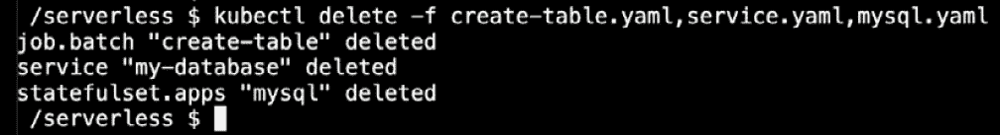

###### 图 4.23：清理

在接下来的活动中，数据库将被自动化任务在 Kubernetes 中检索到的信息填充。

#### 注意

在接下来的活动中，您将需要一个 Docker Hub 账户将图像推送到注册表中。Docker Hub 是一个免费的服务，您可以在[`hub.docker.com/signup`](https://hub.docker.com/signup)注册。

### 活动 4：在 Kubernetes 中收集 MySQL 数据库中的黄金价格

这个活动的目的是创建一个在 Kubernetes 集群中运行的真实无服务器应用程序，使用 Kubernetes 本地资源。无服务器函数将从实时市场获取黄金价格，并将数据推送到数据库。该函数将以预定义的间隔运行，以保留历史记录并进行统计分析。黄金价格可以从*CurrencyLayer* API 中检索，该 API 提供免费的汇率 API。完成后，您将拥有一个每分钟运行的 CronJob：

#### 注意

为了完成以下活动，您需要拥有 CurrencyLayer API 访问密钥。这是一个免费的货币和汇率服务，您可以在官方网站上注册。

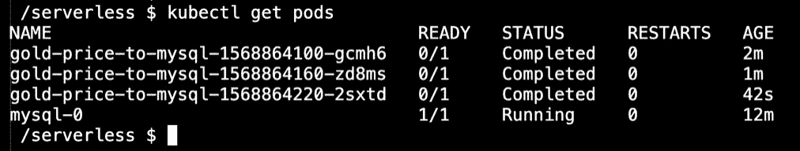

###### 图 4.24：用于黄金价格的 Kubernetes 作业

最后，每次运行 Kubernetes 作业时，您将在数据库中获得实时黄金价格：

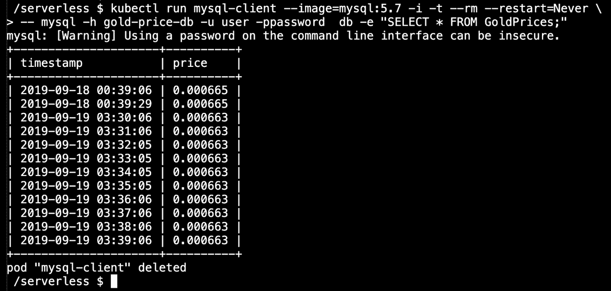

###### 图 4.25：数据库中的价格数据

执行以下步骤来完成这个活动：

1.  创建一个应用程序，从*CurrencyLayer*检索黄金价格并将其插入到 MySQL 数据库中。可以在`main.go`文件中使用以下结构来实现这个功能：

```
//only displaying the function here//
func main() {
    db, err := sql.Open("mysql", ...
    r, err := http.Get(fmt.Sprintf(„http://apilayer.net/api/...
    stmt, err := db.Prepare("INSERT INTO GoldPrices(price) VALUES(?)")_,       err = stmt.Exec(target.Quotes.USDXAU)
    log.Printf("Successfully inserted the price: %v", target.Quotes.
USDXAU)
}
```

在`main`函数中，首先需要连接到数据库，然后从*CurrencyLayer*检索价格。然后需要创建一个 SQL 语句并在数据库连接上执行。main.go 的完整代码可以在这里找到：[`github.com/TrainingByPackt/Serverless-Architectures-with-Kubernetes/blob/master/Lesson04/Activity4/main.go`](https://github.com/TrainingByPackt/Serverless-Architectures-with-Kubernetes/blob/master/Lesson04/Activity4/main.go)。

1.  将应用程序构建为 Docker 容器。

1.  将 Docker 容器推送到 Docker 注册表。

1.  将 MySQL 数据库部署到 Kubernetes 集群中。

1.  部署一个 Kubernetes 服务来暴露 MySQL 数据库。

1.  部署一个`CronJob`，每分钟运行一次。

1.  等待几分钟并检查`CronJob`的实例。

1.  连接到数据库并检查条目。

1.  从 Kubernetes 中清除数据库和自动化任务。

#### 注意

活动的解决方案可以在第 403 页找到。

## 总结

在本章中，我们首先描述了 Kubernetes 的起源和特点。接着，我们研究了 Kubernetes 的设计和组件，包括主控组件和节点组件的细节。然后，我们安装了一个本地单节点的 Kubernetes 集群，并检查了 Kubernetes 的组件。在集群设置之后，我们学习了官方的 Kubernetes 客户端工具`kubectl`，它用于连接到集群。我们还看到了`kubectl`如何用于管理集群和应用程序的生命周期。最后，我们讨论了用于无服务器应用程序的基本 Kubernetes 资源，包括 pod、部署和`StatefulSets`。除此之外，我们还学习了如何使用服务在集群中连接应用程序。使用`Jobs`和`CronJobs`来呈现一次性和自动化任务的 Kubernetes 资源。在本章的最后，我们使用 Kubernetes 本地资源开发了一个实时数据收集功能。

在下一章中，我们将学习 Kubernetes 集群的特性，并使用流行的云平台来部署它们。
