# 第五章： 生产就绪的 Kubernetes 集群

## 学习目标

本章结束时，您将能够：

+   识别 Kubernetes 集群设置的要求

+   在 Google Cloud Platform（GCP）中创建一个生产就绪的 Kubernetes 集群

+   管理集群自动缩放以向 Kubernetes 集群添加新服务器

+   迁移生产集群中的应用程序

在本章中，我们将学习关于设置 Kubernetes 的关键考虑因素。随后，我们还将研究不同的 Kubernetes 平台选项。然后，我们将继续在云平台上创建一个生产就绪的 Kubernetes 集群，并执行管理任务。

## 介绍

在上一章中，我们为开发环境创建了 Kubernetes 集群，并将应用程序安装到其中。在本章中，重点将放在生产就绪的 Kubernetes 集群上，以及如何管理它们以获得更好的可用性、可靠性和成本优化。

Kubernetes 是在云中管理作为容器运行的微服务的事实标准系统。它被行业广泛采用，包括初创公司和大型企业，用于运行各种类型的应用程序，包括数据分析工具、无服务器应用程序和数据库。可伸缩性、高可用性、可靠性和安全性是 Kubernetes 的关键特性，使其能够被广泛采用。假设您已决定使用 Kubernetes，因此您需要一个可靠且可观察的集群设置用于开发和生产。在选择 Kubernetes 提供商以及如何操作应用程序之前，有一些关键的考虑因素取决于您的需求、预算和团队。有四个关键考虑因素需要分析：

+   **服务质量：** Kubernetes 以*高可用*和可靠的方式运行微服务。然而，安装和可靠地操作 Kubernetes 至关重要。假设您已将 Kubernetes 控制平面安装到集群中的单个节点，并且由于网络问题而断开连接。由于您已经失去了 Kubernetes API 服务器的连接，您将无法检查应用程序的状态和操作它们。因此，评估您在生产环境中所需的 Kubernetes 集群的服务质量至关重要。

+   **监控：** Kubernetes 运行分布到节点的容器，并能够检查它们的日志和状态。假设您昨天推出了应用程序的新版本。今天，您想要检查最新版本的运行情况，是否有错误、崩溃和响应时间。因此，您需要一个集成到 Kubernetes 集群中的监控系统来捕获日志和指标。收集的数据对于生产就绪的集群中的故障排除和诊断至关重要。

+   **安全性：** Kubernetes 组件和客户端工具以安全的方式工作，以管理集群中运行的应用程序。然而，您需要为您的组织定义特定的角色和授权级别，以安全地操作 Kubernetes 集群。因此，选择一个可以安全连接并与客户和同事共享的 Kubernetes 提供者平台至关重要。

+   **运维：** Kubernetes 是所有应用程序的主机，包括具有数据合规性、审计和企业级要求的服务。假设您正在 Kubernetes 上运行在线银行应用系统的后端和前端。对于您所在国家的特许银行，应用程序的审计日志应该是可访问的。由于您已经在 Kubernetes 上部署了整个系统，平台应该能够获取审计日志、存档和存储它们。因此，Kubernetes 平台的运维能力对于生产就绪的集群设置至关重要。

为了决定如何安装和操作您的 Kubernetes 集群，本章将讨论这些考虑因素，以选择 Kubernetes 平台选项。

## Kubernetes 设置

Kubernetes 是一个灵活的系统，可以安装在各种平台上，从**树莓派**到**数据中心**中的高端服务器。每个平台在服务质量、监控、安全性和运营方面都有其优势和劣势。Kubernetes 将应用程序作为容器进行管理，并在基础架构上创建一个抽象层。假设你在地下室的三台旧服务器上安装了 Kubernetes，然后安装了你的新项目的**概念验证**（**PoC**）。当项目取得成功后，你想要扩展你的应用程序并迁移到**亚马逊网络服务**（**AWS**）等云服务提供商。由于你的应用程序是设计运行在 Kubernetes 上，并且不依赖于基础设施，因此迁移到另一个 Kubernetes 安装是直接的。

在上一章中，我们学习了使用`minikube`作为 Kubernetes 的官方方法来设置开发环境。在本节中，将介绍生产级别的 Kubernetes 平台。生产级别的 Kubernetes 平台可以分为三种，具有以下抽象层：

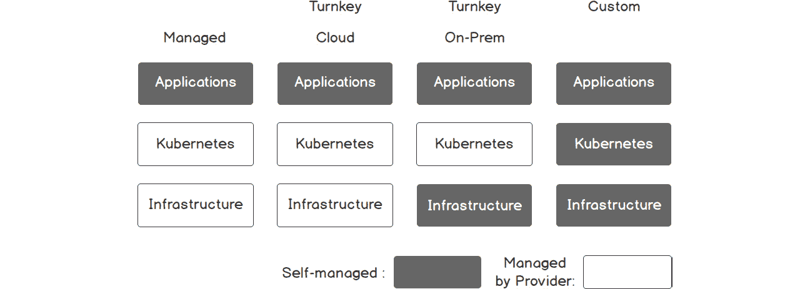

###### 图 5.1：Kubernetes 平台

现在让我们逐个看看这些类型。

### 托管平台

托管平台提供**Kubernetes 作为服务**，所有底层服务都在云提供商的控制下运行。由于云提供商处理所有基础设施操作，因此设置和扩展这些集群非常容易。领先的云提供商，如 GCP、AWS 和 Microsoft Azure，都提供了托管的 Kubernetes 解决方案应用程序，旨在集成其他云服务，如容器注册表、身份服务和存储服务。最受欢迎的托管 Kubernetes 解决方案如下：

+   **Google Kubernetes Engine (GKE):** GKE 是市场上最成熟的托管服务，谷歌将其作为 GCP 的一部分提供。

+   **Azure Kubernetes Service (AKS):** AKS 是微软提供的作为 Azure 平台一部分的 Kubernetes 解决方案。

+   **Amazon 弹性容器服务（EKS）：** EKS 是 AWS 的托管 Kubernetes。

### 即插即用平台

即插即用解决方案专注于在云端或内部系统中安装和操作 Kubernetes 控制平面。即插即用平台的用户提供有关基础设施的信息，即插即用平台处理 Kubernetes 设置。即插即用平台在设置配置和基础设施选项方面提供更好的灵活性。这些平台大多由在 Kubernetes 和云系统方面拥有丰富经验的组织设计，如**Heptio**或**CoreOS**。

如果将即插即用平台安装在 AWS 等云提供商上，基础设施由云提供商管理，即插即用平台管理 Kubernetes。然而，当即插即用平台安装在内部系统上时，内部团队应处理基础设施运营。

### 自定义平台

如果您的用例不适用于任何托管或即插即用解决方案，则可以进行自定义安装 Kubernetes。例如，您可以使用**Gardener**（https://gardener.cloud）或**OpenShift**（https://www.openshift.com）在云提供商、内部数据中心、内部虚拟机（VM）或裸金属服务器上安装 Kubernetes 集群。虽然自定义平台提供更灵活的 Kubernetes 安装，但也需要特殊的运营和维护工作。

在接下来的章节中，我们将在 GKE 中创建一个托管的 Kubernetes 集群并对其进行管理。GKE 提供了市场上最成熟的平台和卓越的客户体验。

## Google Kubernetes Engine

GKE 提供了一个由 Google 在运行容器化服务方面拥有十多年经验支持的托管 Kubernetes 平台。GKE 集群已经准备就绪并且可扩展，并支持上游 Kubernetes 版本。此外，GKE 专注于通过消除 Kubernetes 集群的安装、管理和运营需求来改善开发体验。

虽然 GKE 改善了开发者体验，但它试图最小化运行 Kubernetes 集群的成本。它只收取集群中的节点费用，并免费提供 Kubernetes 控制平面。换句话说，GKE 提供了一个可靠、可扩展和强大的 Kubernetes 控制平面，而没有任何费用。对于运行应用程序工作负载的服务器，通常适用 GCP 计算引擎定价。例如，假设您将从两个`n1-standard-1` **（vCPUs：1，RAM：3.75 GB）**节点开始：

计算如下：

每月总计 1,460 小时

**实例类型**：n1-standard-1

**GCE 实例成本**：48.54 美元

**Kubernetes Engine 成本**：0.00 美元

**预估组件成本**：每月 48.54 美元

如果您的应用程序需要随着更高的使用量而扩展，如果您需要 10 台服务器而不是 2 台，成本也会线性增加：

每月总共 7300 小时

**实例类型**：n1-standard-1

**GCE 实例成本**：242.72 美元

**Kubernetes Engine Cost**: USD 0.00

**预估组件成本**：每月 242.72 美元

这个计算表明，GKE 不会为 Kubernetes 控制平面收费，并为每个集群提供可靠、可扩展和强大的 Kubernetes API。此外，扩展集群的成本是线性增加的，这使得规划和操作 Kubernetes 集群变得更加容易。

在接下来的练习中，您将在 GKE 中创建一个托管的 Kubernetes 集群并连接到它。

#### 注意

为了完成这个练习，您需要有一个活跃的 GCP 账户。您可以在其官方网站上创建一个账户：https://console.cloud.google.com/start。

### 练习 13：在 GCP 上创建 Kubernetes 集群

在这个练习中，我们将在 GKE 中创建一个 Kubernetes 集群，并安全地连接到它以检查节点状态。Google Cloud Platform 的仪表板和 CLI 工具保持了高水平的开发者体验。因此，如果您需要一个生产就绪的 Kubernetes 集群，您将在不到 10 分钟内拥有一个完全运行的控制平面和服务器节点。

为了完成练习，我们需要确保执行以下步骤：

1.  在 Google Cloud Platform 主页的**计算**下的左侧菜单中点击**Kubernetes Engine**，如下图所示：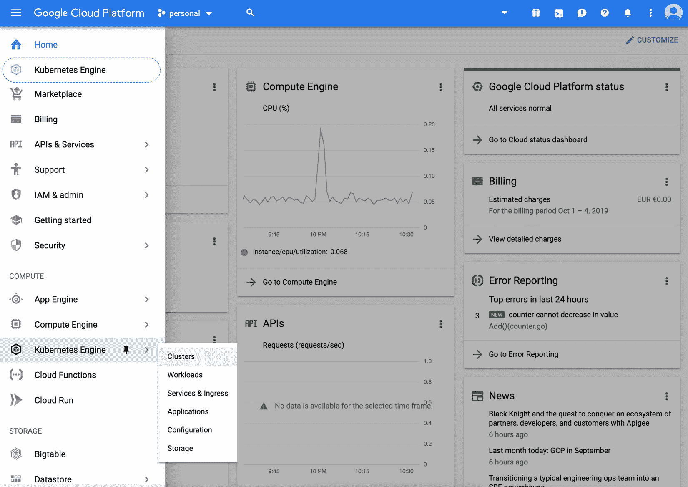

###### 图 5.2：Google Cloud Platform 主页

1.  在**集群**页面上点击**创建集群**，如下图所示：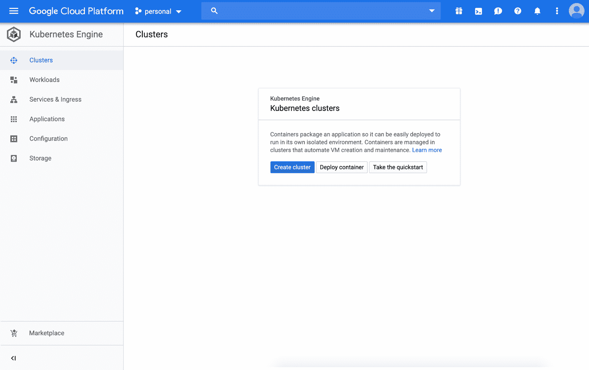

###### 图 5.3：集群视图

1.  在**集群模板**中从左侧选择**您的第一个集群**，并将`serverless`作为名称。点击页面底部的**创建**，如下图所示：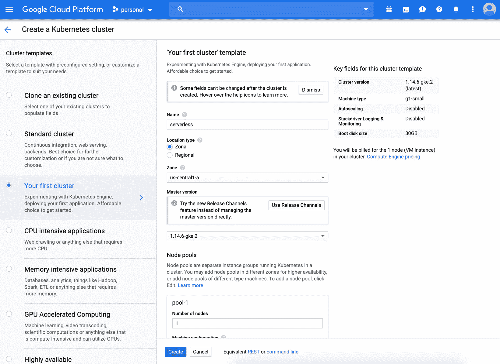

###### 图 5.4：集群创建

1.  等待几分钟，直到集群图标变成绿色，然后点击**连接**按钮，如下图所示：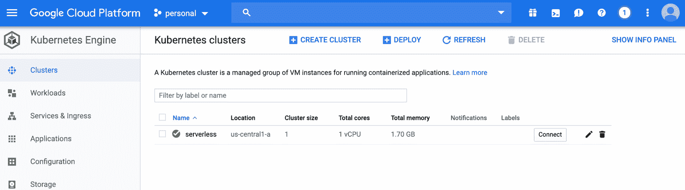

###### 图 5.5：集群列表

1.  点击**在云 shell 中运行**在**连接到集群**窗口中，如下图所示：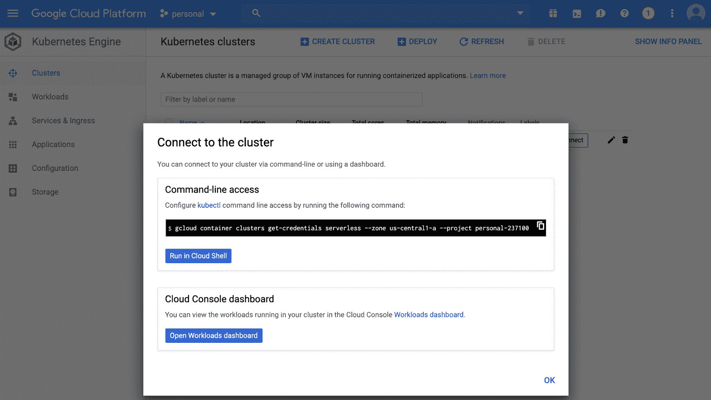

###### 图 5.6：连接到集群视图

1.  等到云 shell 打开并可用时，按下*Enter*，当命令显示时，如下图所示：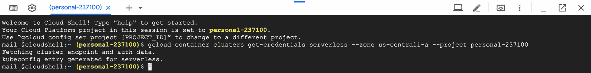

###### 图 5.7：云 shell

输出显示，集群的认证数据已被获取，**kubeconfig**条目已准备就绪。

1.  在云 shell 中使用以下命令检查节点：

```
kubectl get nodes
```

由于集群是使用一个节点池创建的，只有一个节点连接到集群，如下图所示：

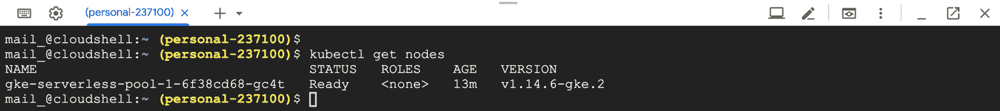

###### 图 5.8：节点列表

1.  在云 shell 中使用以下命令检查集群中运行的 pod：

```
kubectl get pods --all-namespaces
```

由于 GKE 管理控制平面，在`kube-system`命名空间中没有`api-server`、`etcd`或`scheduler`的 pod。集群中只有网络和指标的 pod 在运行，如下截图所示：

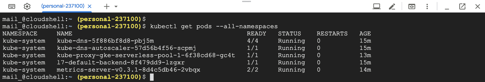

###### 图 5.9：Pod 列表

通过这个练习，您已经在 GKE 上创建了一个生产就绪的 Kubernetes 集群。在几分钟内，GKE 创建了一个托管的 Kubernetes 控制平面，并将服务器连接到了集群。在接下来的章节中，将讨论管理生产环境中的集群，并扩展这个练习中的 Kubernetes 集群。

## 自动缩放 Kubernetes 集群

Kubernetes 集群旨在可靠地运行可扩展的应用程序。换句话说，如果 Kubernetes 集群今天运行您的应用程序的**10 个实例**，它也应该支持在未来运行**100 个实例**。有两种主流方法可以达到这种灵活性水平：*冗余*和*自动缩放*。假设您的应用程序的 10 个实例正在集群中的 3 台服务器上运行。通过冗余，您至少需要 27 台额外的空闲服务器来在未来运行 100 个实例。这也意味着支付空闲服务器的费用以及运营和维护成本。通过自动缩放，您需要自动化程序来创建或删除服务器。自动缩放确保没有过多的空闲服务器，并最大程度地减少成本，同时满足可扩展性要求。

**GKE 集群自动缩放器**是处理 Kubernetes 集群中自动缩放的开箱即用解决方案。启用后，如果工作负载没有剩余容量，它会自动添加新服务器。同样，当服务器利用率不足时，自动缩放器会删除多余的服务器。此外，自动缩放器还定义了服务器的最小和最大数量，以避免无限增加或减少。在以下练习中，将为 Kubernetes 集群启用 GKE 集群自动缩放器。然后通过更改集群中的工作负载来演示服务器的自动缩放。

### 练习 14：在生产环境中为 GKE 集群启用自动缩放

在本练习中，我们将在生产集群中启用并利用 GKE 集群自动缩放器。假设您需要在集群中运行大量应用的副本。但是，由于服务器数量较少，目前不可能实现。因此，您需要启用自动缩放，并查看如何自动创建新服务器。

要成功完成练习，我们需要确保执行以下步骤：

1.  通过在云 shell 中运行以下命令在集群中安装`nginx`：

```
kubectl create deployment workload --image=nginx 
```

此命令从`nginx`镜像创建名为`workload`的部署，如下图所示：

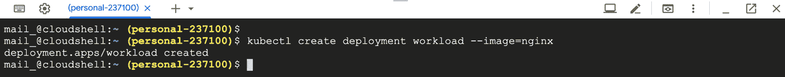

###### 图 5.10：部署创建

1.  通过在云 shell 中运行以下命令将`workload`部署扩展到 25 个副本：

```
kubectl scale deployment workload --replicas=25
```

此命令增加了 workload 部署的副本数量，如下图所示：

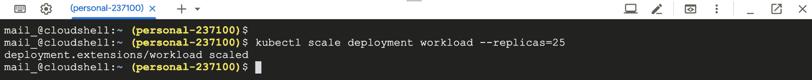

###### 图 5.11：部署扩展

1.  使用以下命令检查运行中的 pod 数量：

```
kubectl get deployment workload
```

由于集群中只有 1 个节点，因此无法在集群中运行 25 个`nginx`的副本。相反，目前只有 5 个实例正在运行，如下图所示：

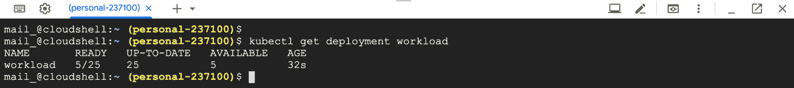

###### 图 5.12：部署状态

1.  使用以下命令为集群的节点池启用自动扩展：

```
gcloud container clusters update serverless --enable-autoscaling  \
 --min-nodes 1 --max-nodes 10 --zone us-central1-a  \
 --node-pool pool-1
```

#### 注意

如果您的集群在另一个区域运行，请更改`zone`参数。

此命令启用了 Kubernetes 集群的自动扩展，最小节点数为 1，最大节点数为 10，如下图所示：

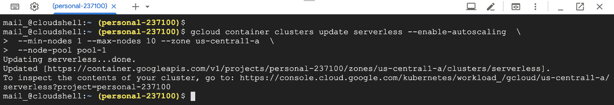

###### 图 5.13：启用自动缩放器

此命令可能需要几分钟的时间来创建所需的资源，并显示“正在更新无服务器...”提示。

1.  等待几分钟，然后使用以下命令检查节点数：

```
kubectl get nodes
```

启用自动缩放后，GKE 确保集群中有足够的节点来运行工作负载。节点池扩展到四个节点，如下图所示：

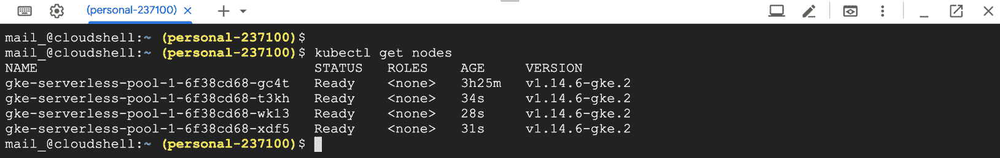

###### 图 5.14：节点列表

1.  使用以下命令检查运行中的 pod 数量：

```
kubectl get deployment workload
```

由于集群中有 4 个节点，因此可以在集群中运行 25 个`nginx`的副本，如下图所示：

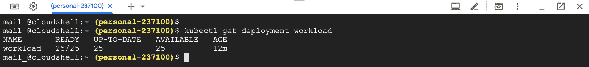

###### 图 5.15：部署状态

1.  使用以下命令删除部署：

```
kubectl delete deployment workload
```

输出应该如下所示：

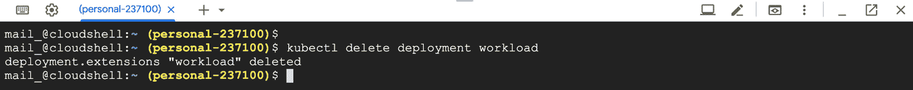

###### 图 5.16：部署删除

1.  使用以下命令禁用集群的节点池的自动缩放：

```
gcloud container clusters update serverless --no-enable-autoscaling \
--node-pool pool-1 --zone us-central1-a
```

#### 注意

如果您的集群在另一个区域运行，请更改`zone`参数。

您应该看到以下图中显示的输出：

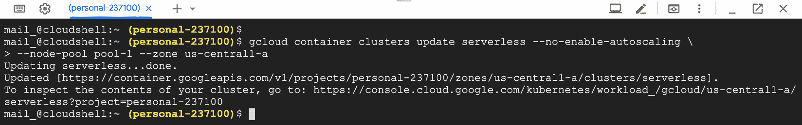

###### 图 5.17：禁用自动缩放

在这个练习中，我们看到了 GKE 集群自动缩放器的运行情况。当自动缩放器启用时，它会在集群对当前工作负载容量不足时增加服务器数量。尽管看起来很简单，但这是 Kubernetes 平台的一个引人注目的特性。它消除了手动操作的负担，以检查集群利用率并采取行动。对于用户需求变化很大的无服务器应用程序来说，这一点甚至更为关键。

假设您已经在 Kubernetes 集群中部署了一个启用了自动缩放的无服务器函数。当您的函数频繁调用时，集群自动缩放器将自动增加节点数量，然后在您的函数不被调用时删除节点。因此，检查 Kubernetes 平台对无服务器应用程序的自动缩放能力是至关重要的。在接下来的部分中，将讨论在生产环境中迁移应用程序，这是另一个重要的集群管理任务。

## Kubernetes 集群中的应用迁移

Kubernetes 将应用程序分发到服务器并保持它们可靠和稳健地运行。集群中的服务器可以是具有不同技术规格的 VM 或裸金属服务器实例。假设您只连接了标准 VM 到您的 Kubernetes 集群，并且它们正在运行各种类型的应用程序。如果您即将使用的数据分析库需要 GPU 来更快地运行，您需要连接具有 GPU 的服务器。同样，如果您的数据库应用程序需要 SSD 磁盘来进行更快的 I/O 操作，您需要连接具有 SSD 访问权限的服务器。这些应用程序要求导致在集群中有不同的节点池。此外，您需要配置 Kubernetes 工作负载在特定节点上运行。除了标记一些节点保留给特殊类型的工作负载外，还使用了污点。同样，如果 pod 运行特定类型的工作负载，它们将被标记为容忍。Kubernetes 支持使用污点和容忍度协同工作来将工作负载分发到特殊节点。

+   污点是应用于节点的，表示该节点不应该有任何不容忍污点的 pod。

+   容忍度被应用于 pod，允许 pod 被调度到具有污点的节点上。

例如，如果您只想在具有 SSD 的节点上运行数据库实例，您需要首先对节点进行污点处理：

```
kubectl taint nodes disk-node-1 ssd=true:NoSchedule
```

使用这个命令，`disk-node-1`将只接受具有以下容忍度的 pod：

```
tolerations:
- key: "ssd"
  operator: "Equal"
  value: "true"
  effect: "NoSchedule"
```

污点和容忍度协同工作，作为 Kubernetes 调度器的一部分，将 pod 分配给特定的节点。此外，Kubernetes 支持使用`kubectl drain`命令安全地从集群中移除服务器。如果您想对一些节点进行维护或退役，这将非常有帮助。在下面的练习中，运行在 Kubernetes 集群中的应用程序将迁移到一组特定的新节点。

### 练习 15：迁移在 GKE 集群中运行的应用程序

这个练习旨在教我们在生产集群中执行迁移活动。假设您在 Kubernetes 集群中运行一个后端应用程序。随着最近的变化，您已经改进了应用程序的内存管理，并希望在具有更高内存优化的服务器上运行。因此，您将创建一个新的节点池，并将应用程序实例迁移到其中。

为了成功完成练习，我们需要确保执行以下步骤：

1.  通过在云 shell 中运行以下命令将后端应用程序安装到集群中：

```
kubectl create deployment backend --image=nginx 
```

此命令从`nginx`镜像创建名为`backend`的部署，如下图所示：

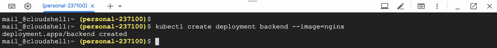

###### ![图 5.18：部署创建 1.  通过在云 shell 中运行以下命令，将`backend`部署的副本数扩展到`10`：```    kubectl scale deployment backend --replicas=10    ```此命令增加了后端部署的副本数，如下图所示：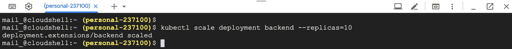

###### 图 5.19：部署扩展

1.  使用以下命令检查正在运行的`pods`数量及其节点：

```
kubectl get pods -o wide
```

部署的所有 10 个副本都在 4 个节点上成功运行，如下图所示：

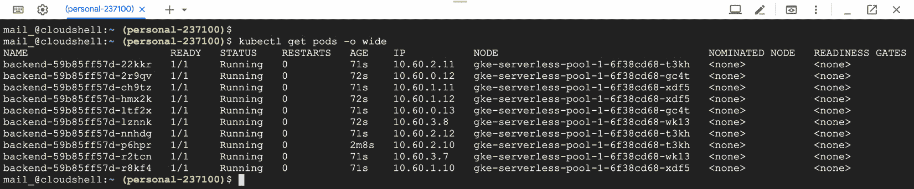

###### 图 5.20：部署状态

1.  在 GCP 中创建一个具有更高内存的节点池：

```
gcloud container node-pools create high-memory-pool --cluster=serverless \
--zone us-central1-a --machine-type=n1-highmem-2 --num-nodes=2
```

#### 注意

如果您的集群在另一个区域运行，请更改`zone`参数。

此命令在无服务器集群中创建了一个名为`high-memory-pool`的新节点池，机器类型为`n1-highmem-2`，有两个服务器，如下图所示：

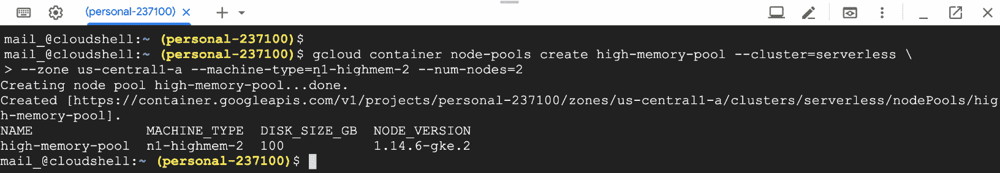

###### 图 5.21：节点池创建

此命令可能需要几分钟来创建所需的资源，并显示**创建节点池高内存池**提示。

1.  等待几分钟并检查集群中的节点：

```
kubectl get nodes
```

此命令列出了集群中的节点，我们期望看到两个额外的`high-memory`节点，如下图所示：

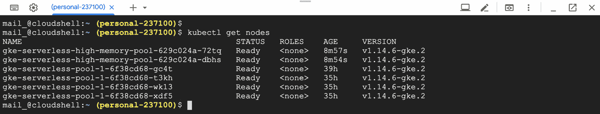

###### 图 5.22：集群节点

1.  排空旧节点，以便 Kubernetes 将应用程序迁移到新节点：

```
kubectl drain -l cloud.google.com/gke-nodepool=pool-1
```

此命令从所有带有标签`cloud.google.com/gke-nodepool=pool-1`的节点中删除工作负载，如下图所示：

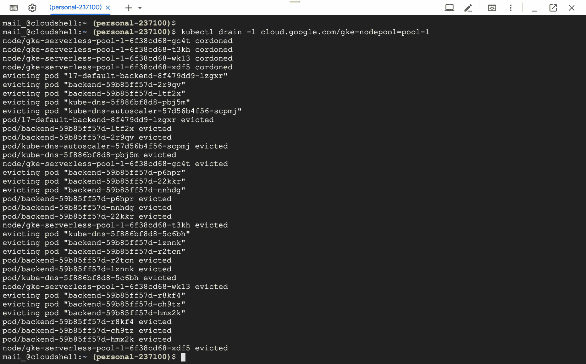

###### 图 5.23：节点移除

1.  使用以下命令检查正在运行的 pods 及其节点：

```
kubectl get pods -o wide
```

部署的所有 10 个副本都成功运行在新的`high-memory`节点上，如下图所示：

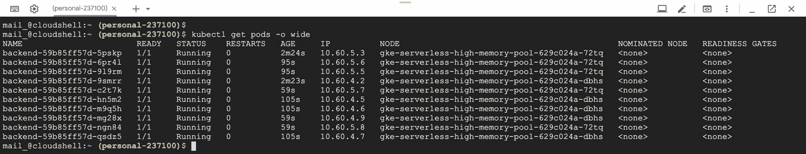

###### 图 5.24：部署状态

1.  使用以下命令删除旧的节点池：

```
gcloud container node-pools delete pool-1 --cluster serverless --zone us-central1-a 
```

#### 注意

更改`zone`参数，如果您的集群在另一个区域运行。

此命令将删除未使用的旧节点池，如下图所示：

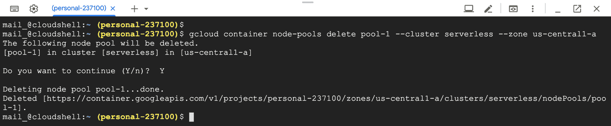

###### 图 5.25：节点池删除

在这个练习中，我们已经将正在运行的应用迁移到了具有更好技术规格的新节点。使用 Kubernetes 原语和 GKE 节点池，可以在没有停机时间的情况下将应用迁移到特定的节点集。在接下来的活动中，您将使用自动缩放和 Kubernetes 污点来运行无服务器函数，同时最大限度地降低成本。

### 活动 5：在 GKE 集群中最大限度地降低无服务器函数的成本

本活动的目的是在生产集群上执行管理任务，以运行无服务器函数，同时最大限度地降低成本。假设您的后端应用已经在 Kubernetes 集群中运行。现在，您希望安装一些无服务器函数来连接后端。然而，后端实例正在运行内存优化的服务器，这对于运行无服务器函数也是昂贵的。因此，您需要添加*可抢占*服务器，这些服务器更便宜。可抢占 VM 已经在 GCP 中可用；然而，它们具有较低的服务质量和最长寿命为 24 小时。因此，您应该配置节点池为自动缩放，并且只运行无服务器函数。否则，您的后端实例也可能被调度到可抢占 VM 上，并降低整体性能。

活动结束时，您将拥有连接到后端实例的函数，如下图所示：

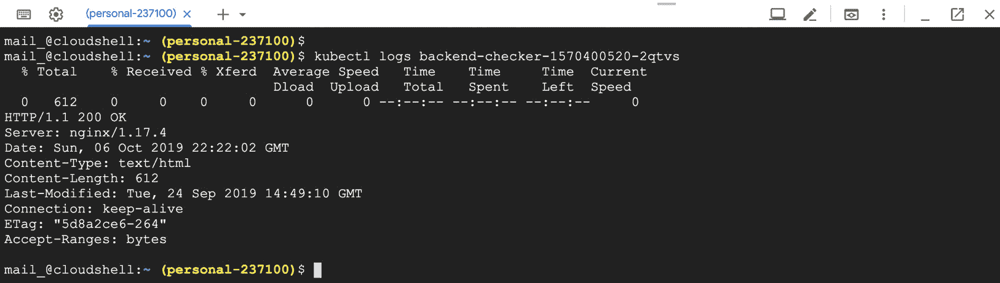

###### 图 5.26：后端检查器功能

后端实例将在高内存节点上运行，功能实例将在可抢占服务器上运行，如下图所示：

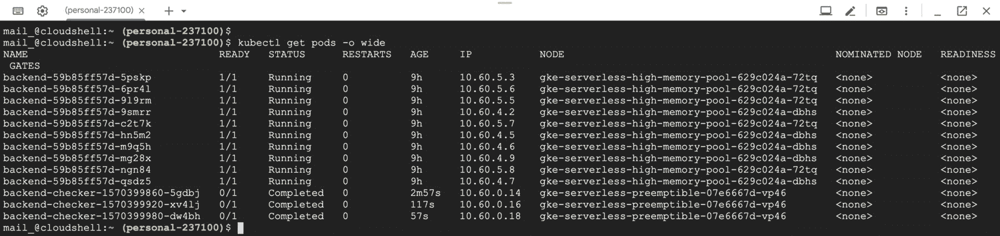

###### 图 5.27：Kubernetes pods 和相应的节点

#### 注意

为了完成活动，您应该使用来自*练习 15*的集群，其中运行着后端部署。

执行以下步骤完成活动：

1.  创建一个具有可抢占服务器的新节点池。

1.  给可抢占服务器打上标记，只运行无服务器函数。

1.  创建一个 Kubernetes 服务以访问后端 pod。

1.  创建一个 CronJob，每分钟连接到后端服务。CronJob 定义应该具有容忍性，可以在可抢占服务器上运行。

1.  检查 CronJob 函数的节点分配。

1.  检查 CronJob 函数实例的日志。

1.  清理后端部署和无服务器函数。

1.  如果不再需要 Kubernetes 集群，请将其删除。

#### 注意

活动的解决方案可以在第 412 页找到。

## 摘要

在本章中，我们首先描述了分析 Kubernetes 集群设置要求的四个关键考虑因素。然后我们研究了三组 Kubernetes 平台：托管、即插即用和定制。每个 Kubernetes 平台都有解释，以及它们在基础设施、Kubernetes 和应用程序上的责任水平。在那之后，我们在 GKE 上创建了一个可投入生产的 Kubernetes 集群。由于 Kubernetes 旨在运行可扩展的应用程序，我们研究了如何通过自动缩放来处理工作负载的增加或减少。此外，我们还研究了在生产集群中无需停机的应用程序迁移，以说明如何将应用程序移动到具有更高内存的服务器。最后，我们在生产集群中运行无服务器函数来执行自动缩放和迁移活动，以最大程度地降低成本。Kubernetes 和无服务器应用程序共同工作，创建可靠、强大和可扩展的未来环境。因此，了解如何安装和操作生产环境的 Kubernetes 集群至关重要。

在下一章中，我们将研究 Kubernetes 中即将推出的无服务器功能。我们还将详细研究虚拟 kubelet，并在 GKE 上部署无状态容器。
