# 6. Kubernetes 中即将推出的无服务器功能

## 学习目标

在本章结束时，您将能够：

+   利用 Knative 的概念和组件部署应用程序

+   在 GKE 集群上设置 Knative

+   在 Knative 上部署应用程序并配置自动缩放

+   在谷歌云运行上部署应用程序

+   在 Azure 上设置虚拟 Kubelet

+   使用虚拟 Kubelet 部署应用程序

本章涵盖了 Knative、谷歌云运行和虚拟 Kubelet，它们在 Kubernetes 集群之上提供了无服务器的优势。

## 介绍 Kubernetes 的无服务器功能

在上一章中，我们广泛研究了 Kubernetes 中使用的各种设置选项和平台。我们还涵盖了 Kubernetes 的自动缩放功能，并在集群上部署的应用程序中实施了它。

Kubernetes 和无服务器是 IT 行业中的两个热门话题，但这两个话题经常被独立讨论。Kubernetes 是一个管理容器化应用程序的平台，而无服务器是一种执行模型，它抽象了基础设施，使软件开发人员可以专注于他们的应用逻辑。然而，这两个概念的结合将实现同样的目标，使软件开发人员的生活变得更加轻松。

最近出现了一些平台，通过抽象管理容器和任何基础架构的复杂性，为容器带来了无服务器特性。这些平台在 Kubernetes 集群上运行无服务器工作负载，并提供许多好处，包括自动缩放、零缩放、按使用量计费、事件驱动功能、集成监控和集成日志记录功能。

在本章中，我们将讨论三种技术，它们在 Kubernetes 集群之上提供了无服务器的好处：

+   Knative

+   谷歌云运行

+   虚拟 Kubelet

### Knative 简介

Knative 是由谷歌发起的开源项目，得到了包括 Pivotal、Red Hat、IBM 和 SAP 在内的 50 多家其他公司的贡献。Knative 通过引入一组组件来扩展 Kubernetes，从而构建和运行无服务器应用程序。这个框架非常适合已经在使用 Kubernetes 的应用开发人员。Knative 为他们提供了工具，让他们专注于他们的代码，而不用担心 Kubernetes 的底层架构。它引入了自动化容器构建、自动缩放、零缩放和事件框架等功能，使开发人员能够在 Kubernetes 之上获得无服务器的好处。

Knative 框架在 Knative 网站上被描述为“*基于 Kubernetes 的平台，用于部署和管理现代无服务器工作负载*”。该框架通过引入无服务器特性，如自动缩放和零缩放，来弥合容器化应用程序和无服务器应用程序之间的差距。

Knative 由三个主要组件组成：

+   构建

+   服务

+   事件

#### 注意

在最新版本的 Knative 中，构建组件已被弃用，而是更倾向于使用 Tekton Pipelines。Knative 构建组件的最终版本可在 0.7 版本中获得。

构建是从源代码构建容器映像并在 Kubernetes 集群上运行它们的过程。Knative Serving 组件允许部署无服务器应用程序和函数。这使得可以向容器提供流量，并根据请求的数量进行自动缩放。该服务组件还负责在对代码和配置进行更改时进行快照。Knative Eventing 组件帮助我们构建事件驱动的应用程序。该组件允许应用程序为事件流产生事件，并从事件流中消费事件。

以下图示了 Knative 框架及其依赖项以及每个组件的利益相关者：

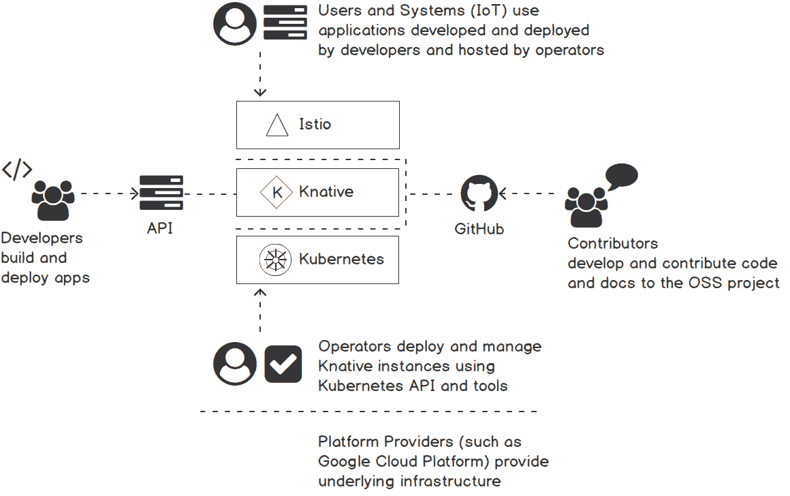

###### 图 6.1：Knative 依赖项和利益相关者

底层代表了 Kubernetes 框架，它作为 Knative 框架的容器编排层使用。Kubernetes 可以部署在任何基础设施上，例如 Google Cloud Platform 或本地系统。接下来，我们有**Istio**服务网格层，它管理集群内的网络路由。这一层提供了许多好处，包括流量管理、可观察性和安全性。在顶层，Knative 在**Istio**上运行在 Kubernetes 集群上。在 Knative 层，一端我们可以看到通过 GitHub 项目向 Knative 框架贡献代码的贡献者，另一端我们可以看到构建和部署应用程序在 Knative 框架之上的应用程序开发人员。

#### 注意

有关 Istio 的更多信息，请参阅[`istio.io/`](https://istio.io/)。

现在我们对 Knative 有了这样的理解，让我们在下一节中看看如何在 Kubernetes 集群上安装 Knative。

### 在 GKE 上开始使用 Knative

在本节中，我们将带您完成在 Kubernetes 集群上安装 Knative 的过程。我们将使用 Google Kubernetes Engine（GKE）来设置一个 Kubernetes 集群。GKE 是 Google 云中的托管 Kubernetes 集群服务。它允许我们在不安装、管理和操作自己的集群的负担下运行 Kubernetes 集群。

我们需要安装和配置以下先决条件才能继续本节：

+   一个 Google Cloud 账户

+   gcloud CLI

+   kubectl CLI（v1.10 或更新版本）

首先，我们需要设置一些环境变量，这些变量将与**gcloud** CLI 一起使用。您应该使用您的 GCP 项目的名称更新`<your-gcp-project-name>`。我们将使用`us-central1-a`作为 GCP 区域。在您的终端窗口中执行以下命令以设置所需的环境变量：

```
$ export GCP_PROJECT=<your-gcp-project-name>
$ export GCP_ZONE=us-central1-a
$ export GKE_CLUSTER=knative-cluster
```

输出应该如下：


###### 图 6.2：设置环境变量

将我们的 GCP 项目设置为`gcloud` CLI 命令要使用的默认项目：

```
$ gcloud config set core/project $GCP_PROJECT
```

输出应该如下：


###### 图 6.3：设置默认的 GCP 项目

现在我们可以使用`gcloud`命令创建 GKE 集群。Knative 需要一个版本为 1.11 或更新的 Kubernetes 集群。我们将使用 GKE 提供的**Istio**插件来为这个集群提供支持。以下是运行 Knative 组件所需的 Kubernetes 集群的推荐配置：

+   Kubernetes 版本 1.11 或更新

+   具有四个 vCPU（n1-standard-4）的 Kubernetes 节点

+   启用最多 10 个节点的节点自动缩放

+   `cloud-platform`的 API 范围

执行以下命令来创建一个符合这些要求的 GKE 集群：

```
     $ gcloud beta container clusters create $GKE_CLUSTER \
    --zone=$GCP_ZONE \
    --machine-type=n1-standard-4 \
    --cluster-version=latest \
    --addons=HorizontalPodAutoscaling,HttpLoadBalancing,Istio \
    --enable-stackdriver-kubernetes \
    --enable-ip-alias \
    --enable-autoscaling --min-nodes=1 --max-nodes=10 \
    --enable-autorepair \
    --scopes cloud-platform
```

输出应该如下：

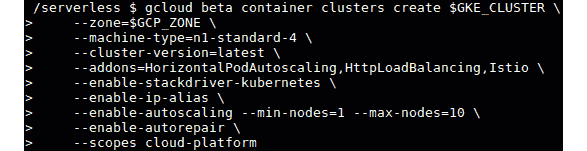

###### 图 6.4：创建一个 GKE 集群

设置 Kubernetes 集群可能需要几分钟的时间。一旦集群准备好，我们将使用命令`gcloud container clusters get-credentials`来获取新集群的凭据，并配置**kubectl** CLI，如下面的代码片段所示：

```
$ gcloud container clusters get-credentials $GKE_CLUSTER --zone $GCP_ZONE --project $GCP_PROJECT
```

输出应该如下：

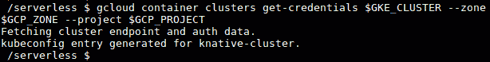

###### 图 6.5：获取 GKE 集群的凭据

现在您已成功创建了带有**Istio**的 GKE 集群，并配置了`kubectl`以访问新创建的集群。我们现在可以继续进行下一步，安装 Knative。我们将安装 Knative 版本 0.8，这是撰写本书时可用的最新版本。

我们将使用`kubectl` CLI 将 Knative 组件应用到 Kubernetes 集群上。首先，运行`kubectl apply`命令，并使用`-l knative.dev/crd-install=true`标志来防止安装过程中的竞争条件：

```
$ kubectl apply --selector knative.dev/crd-install=true \
   -f https://github.com/knative/serving/releases/download/v0.8.0/serving.yaml \
   -f https://github.com/knative/eventing/releases/download/v0.8.0/release.yaml \
   -f https://github.com/knative/serving/releases/download/v0.8.0/monitoring.yaml
```

接下来，再次运行命令，不带`-l knative.dev/crd-install=true`标志来完成安装：

```
$ kubectl apply -f https://github.com/knative/serving/releases/download/v0.8.0/serving.yaml \
   -f https://github.com/knative/eventing/releases/download/v0.8.0/release.yaml \
   -f https://github.com/knative/serving/releases/download/v0.8.0/monitoring.yaml
```

一旦命令完成，执行以下命令来检查安装的状态。确保所有的 pod 都有**Running**的状态：

```
$ kubectl get pods --namespace knative-serving
$ kubectl get pods --namespace knative-eventing
$ kubectl get pods --namespace knative-monitoring
```

输出应该如下：

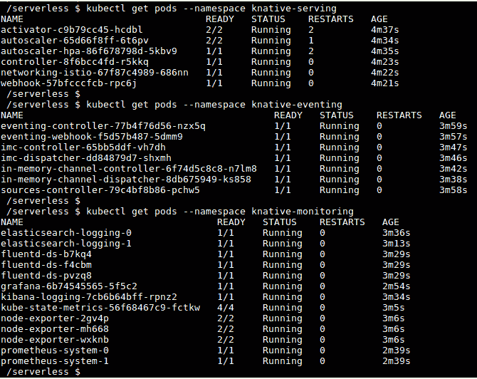

###### 图 6.6：验证 Knative 安装

在这个阶段，您已经在 GKE 上设置了一个 Kubernetes 集群并安装了 Knative。现在我们准备在 Knative 上部署我们的第一个应用程序。

### 练习 16：在 Knative 上部署一个示例应用程序

在前面的部分中，我们成功在 Kubernetes 和**Istio**之上部署了 Knative。在这个练习中，我们将在 Knative 框架上部署我们的第一个应用程序。为了进行这次部署，我们将使用一个用 Node.js 编写的示例 Web 应用程序。这个应用程序的 Docker 镜像可以在 Google 容器注册表中找到，地址为`gcr.io/knative-samples/helloworld-nodejs`。这些步骤可以适应部署我们自己的 Docker 镜像到 Docker Hub 或任何其他容器注册表。

这个示例的“hello world”应用程序将读取一个名为`TARGET`的环境变量，并打印`Hello <VALUE_OF_TARGET>!`作为输出。如果未为`TARGET`环境变量定义值，则它将打印`NOT SPECIFIED`作为输出。

让我们首先创建应用程序的服务定义文件。这个文件定义了与应用程序相关的信息，包括应用程序名称和应用程序 Docker 镜像：

#### 注意

Knative 服务对象和 Kubernetes 服务对象是两种不同的类型。

1.  创建一个名为`hello-world.yaml`的文件，其中包含以下内容。这个 Knative 服务对象定义了部署此服务的命名空间、用于容器的 Docker 镜像以及任何环境变量等数值：

```
          apiVersion: serving.knative.dev/v1alpha1 
kind: Service
metadata:
  name: helloworld-nodejs 
  namespace: default 
spec:
  runLatest:
    configuration:
      revisionTemplate:
        spec:
          container:
            image: gcr.io/knative-samples/helloworld-nodejs 
            env:
              - name: TARGET 
                value: "Knative NodeJS App"
```

1.  一旦`hello-world.yaml`文件准备好，我们可以使用`kubectl apply`命令部署我们的应用程序：

```
$ kubectl apply -f hello-world.yaml
```

输出应该如下所示：


###### 图 6.7：部署 helloworld-nodejs 应用程序

1.  上一个命令将创建多个对象，包括 Knative 服务、配置、修订、路由和 Kubernetes 部署。我们可以通过列出新创建的对象来验证应用程序，就像以下命令一样：

```
$ kubectl get ksvc
$ kubectl get configuration
$ kubectl get revision
$ kubectl get route
$ kubectl get deployments
```

输出应该如下所示：

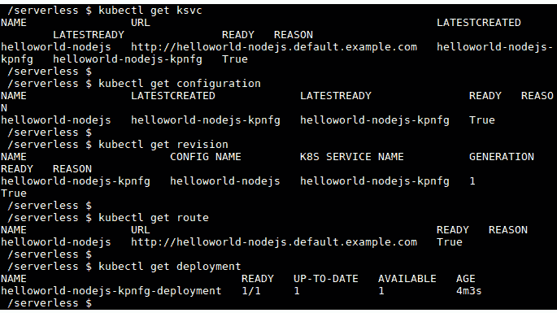

###### 图 6.8：验证 helloworld-nodejs 应用程序部署

1.  一旦我们的应用程序成功部署，我们可以使用 HTTP 请求调用这个应用程序。为此，我们需要确定 Kubernetes 集群的外部 IP 地址。执行以下命令将`EXTERNAL-IP`的值导出到名为`EXTERNAL_IP`的环境变量中：

```
$ export EXTERNAL_IP=$(kubectl get svc istio-ingressgateway --namespace istio-system --output 'jsonpath={.status.loadBalancer.ingress[0].ip}')
```

输出应该如下所示：

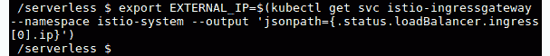

###### 图 6.9：导出 istio-ingressgateway 服务的外部 IP

接下来，我们需要找到`helloworld-nodejs`应用程序的主机 URL。执行以下命令并注意**URL**列的值。此 URL 采用以下形式：`http://<application-name>.<namespace>.example.com:`

```
$ kubectl get route helloworld-nodejs
```

输出应该如下所示：

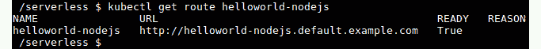

###### 图 6.10：列出 helloworld-nodejs 路由

1.  现在我们可以使用我们在之前步骤中记录的`EXTERNAL_IP`和`URL`值来调用我们的应用程序。让我们使用以下命令进行`curl`请求：

```
$ curl -H "Host: helloworld-nodejs.default.example.com" http://${EXTERNAL_IP}
```

输出应该如下所示：

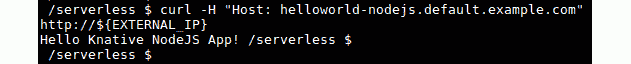

###### 图 6.11：调用 helloworld-nodejs 应用程序

您应该收到预期的输出为**Hello Knative NodeJS App!**。这表明我们已成功在 Knative 平台上部署和调用了我们的第一个应用程序。

## Knative 服务组件

在前一节中，我们使用服务类型的 YAML 文件部署了我们的第一个 Knative 应用程序。在部署服务时，它创建了多个其他对象，包括配置、修订和路由对象。在本节中，让我们讨论每个这些对象：

Knative 服务组件中有四种资源类型：

+   **配置**：定义应用程序的期望状态

+   **修订**：只读快照，跟踪配置的更改

+   **路由**：提供到修订的流量路由

+   **服务**：路由和配置的顶层容器

以下图示说明了每个这些组件之间的关系：

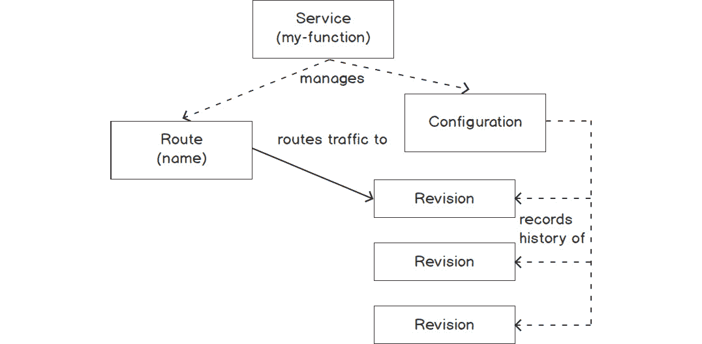

###### 图 6.12：Knative 服务、路由、配置和修订之间的关系

**配置**用于定义应用程序的期望状态。这将定义用于应用程序的容器映像和任何其他所需的配置参数。每次更新**配置**时都会创建一个新的**修订版**。**修订版**指的是代码和**配置**的快照。这用于记录**配置**更改的历史。**路由**用于定义应用程序的流量路由策略，并为应用程序提供 HTTP 端点。默认情况下，**路由**将流量发送到**配置**创建的最新**修订版**。**路由**还可以配置更高级的场景，包括将流量发送到特定的**修订版**或根据定义的百分比将流量分配到不同的修订版。**服务**对象用于管理应用程序的整个生命周期。在部署新应用程序时，需要手动创建**配置**和**路由**对象，但**服务**可以通过自动创建和管理**配置**和**路由**对象来简化这一过程。

在接下来的部分，我们将使用金丝雀部署来部署 Knative 应用程序。让我们首先了解一下金丝雀部署到底是什么。

### 金丝雀部署

金丝雀部署是一种部署策略，用于在生产环境中推出新版本的代码。这是一种安全的部署新版本代码到生产环境并将一小部分流量切换到新版本的过程。这样，开发和部署团队可以在对生产流量影响最小的情况下验证新版本的代码。一旦验证完成，所有流量将切换到新版本。除了金丝雀部署之外，还有几种其他部署类型，例如大爆炸部署、滚动部署和蓝绿部署。

在我们在*练习 16*中部署的`helloworld-nodejs`应用程序中，我们使用了带有`spec.runLatest`字段的服务对象，该字段将所有流量定向到最新可用的修订版。在接下来的练习中，我们将使用单独的配置和路由对象，而不是服务对象。

#### 注意：

有关金丝雀部署技术的更多信息，请参阅[`dev.to/mostlyjason/intro-to-deployment-strategies-blue-green-canary-and-more-3a3`](https://dev.to/mostlyjason/intro-to-deployment-strategies-blue-green-canary-and-more-3a3)。

### 练习 17：Knative 的金丝雀部署

在这个练习中，我们将实施金丝雀部署策略来部署 Knative 应用程序。首先，我们将部署应用程序的初始版本（版本 1），并将 100%的流量路由到该版本。接下来，我们将创建应用程序的第 2 个版本，并将 50%的流量路由到版本 1，剩下的 50%路由到版本 2。最后，我们将更新路由，将 100%的流量发送到版本 2。

以下步骤将帮助您完成练习：

1.  首先，从创建应用程序的初始版本（`v1`）开始。创建一个名为`canary-deployment.yaml`的文件，内容如下。这个应用程序使用与我们之前使用的相同的 Docker 镜像（`gcr.io/knative-samples/helloworld-nodejs`），并将`TARGET`环境变量设置为`This is the first version - v1`：

```
apiVersion: serving.knative.dev/v1alpha1
kind: Configuration
metadata:
  name: canary-deployment
  namespace: default
spec:
  template:
    spec:
      containers:
        - image: gcr.io/knative-samples/helloworld-nodejs
          env:
            - name: TARGET
              value: "This is the first version - v1"
```

1.  使用在上一步中创建的 YAML 文件，使用`kubectl apply`命令部署应用程序的第一个版本：

```
$ kubectl apply -f canary-deployment.yaml
```

输出应该如下所示：


###### 图 6.13：创建金丝雀部署

1.  让我们获取此配置创建的修订名称，因为我们在下一步中需要这个值。执行`kubectl get configurations`命令，并检索`latestCreatedRevisionName`字段的值：

```
$ kubectl get configurations canary-deployment -o=jsonpath='{.status.latestCreatedRevisionName}'
```

输出应该如下所示：

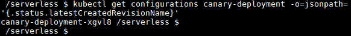

###### 图 6.14：获取金丝雀部署配置的最新修订版本

对我来说，从前面的命令返回的值是`canary-deployment-xgvl8`。请注意，你的值将会不同。

1.  接下来的步骤是创建路由对象。让我们创建一个名为`canary-deployment-route.yaml`的文件，内容如下（请记得用你在上一步中记录的修订名称替换`canary-deployment-xgvl8`）。在`spec.traffic`部分下，你可以看到 100%的流量被路由到我们之前创建的修订版本：

```
apiVersion: serving.knative.dev/v1alpha1
kind: Route
metadata:
  name: canary-deployment
  namespace: default 
spec:
  traffic:
    - revisionName: canary-deployment-xgvl8
      percent: 100 
```

1.  使用`kubectl apply`命令创建路由对象：

```
$ kubectl apply -f canary-deployment-route.yaml
```

输出应该如下所示：


###### 图 6.15：创建 canary-deployment 路由

1.  对应用程序发出请求，并观察`Hello This is the first version - v1!`的预期输出：

```
$ curl -H "Host: canary-deployment.default.example.com" "http://${EXTERNAL_IP}"
```

输出应如下所示：


###### 图 6.16：调用 canary-deployment

1.  一旦应用程序成功调用，我们可以部署应用程序的第 2 个版本。使用以下内容更新`canary-deployment.yaml`。在应用程序的第 2 个版本中，我们只需要将`TARGET`环境变量的值从`This is the first version - v1`更新为`This is the second version - v2`：

```
apiVersion: serving.knative.dev/v1alpha1
kind: Configuration
metadata:
  name: canary-deployment
  namespace: default
spec:
  template:
    spec:
      containers:
        - image: gcr.io/knative-samples/helloworld-nodejs
          env:
            - name: TARGET
              value: "This is the second version - v2"
```

1.  使用`kubectl apply`应用更新的配置：

```
$ kubectl apply -f canary-deployment.yaml
```

输出应如下所示：


###### 图 6.17：将 canary-deployment 更新为版本 2

1.  现在我们可以使用`kubectl get revisions`命令检查创建的修订版本，同时更新配置：

```
$ kubectl get revisions
```

输出应如下所示：

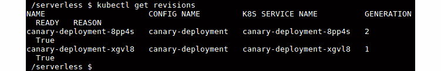

###### 图 6.18：获取 canary-deployment 的修订版本

1.  让我们获取由`canary-deployment`配置创建的最新修订版本：

```
$ kubectl get configurations canary-deployment -o=jsonpath='{.status.latestCreatedRevisionName}'
```

输出应如下所示：

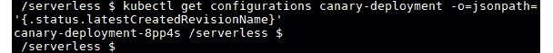

###### 图 6.19：获取 canary-deployment 配置的最新修订版本

1.  现在是时候向我们应用程序的新版本发送一些流量了。更新`canary-deployment-route.yaml`的`spec.traffic`部分，将 50%的流量发送到旧修订版本，50%发送到新修订版本：

```
apiVersion: serving.knative.dev/v1alpha1
kind: Route
metadata:
  name: canary-deployment
  namespace: default 
spec:
  traffic:
    - revisionName: canary-deployment-xgvl8
      percent: 50 
    - revisionName: canary-deployment-8pp4s
      percent: 50 
```

1.  使用以下命令对路由进行更改：

```
$ kubectl apply -f canary-deployment-route.yaml
```

输出应如下所示：


###### 图 6.20：更新 canary-deployment 路由

1.  现在我们可以多次调用应用程序，观察流量如何在两个修订版本之间分配：

```
$ curl -H "Host: canary-deployment.default.example.com" "http://${EXTERNAL_IP}" 
```

1.  一旦我们成功验证了应用程序的第 2 个版本，我们可以将`canary-deployment-route.yaml`更新为将 100%的流量路由到最新的修订版本：

```
apiVersion: serving.knative.dev/v1alpha1
kind: Route
metadata:
  name: canary-deployment
  namespace: default 
spec:
  traffic:
    - revisionName: canary-deployment-xgvl8
      percent: 0 
    - revisionName: canary-deployment-8pp4s
      percent: 100 
```

1.  使用以下命令对路由进行更改：

```
$ kubectl apply -f canary-deployment-route.yaml
```

输出应如下所示：


###### 图 6.21：更新 canary-deployment 路由

1.  现在多次调用应用程序，以验证所有流量都流向应用程序的第 2 个版本：

```
$ curl -H "Host: blue-green-deployment.default.example.com" "http://${EXTERNAL_IP}" 
```

在这个练习中，我们成功地使用配置和路由对象来执行 Knative 的金丝雀部署。

## Knative 监控

Knative 预先安装了 Grafana，这是一个开源的度量分析和可视化工具。Grafana pod 可在`knative-monitoring`命名空间中找到，并且可以使用以下命令列出：

```
$ kubectl get pods -l app=grafana -n knative-monitoring
```

输出应该如下所示：

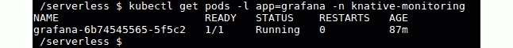

###### 图 6.22：列出 Grafana pod

我们可以使用`kubectl port-forward`命令暴露 Grafana UI，该命令将本地端口`3000`转发到 Grafana pod 的端口`3000`。打开一个新的终端并执行以下命令：

```
$ kubectl port-forward $(kubectl get pod -n knative-monitoring -l app=grafana -o jsonpath='{.items[0].metadata.name}') -n knative-monitoring 3000:3000
```

输出应该如下所示：

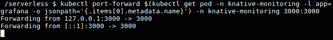

###### 图 6.23：将端口转发到 Grafana pod

现在我们可以从我们的网络浏览器上的`http://127.0.0.1:3000`导航到 Grafana UI。

输出应该如下所示：

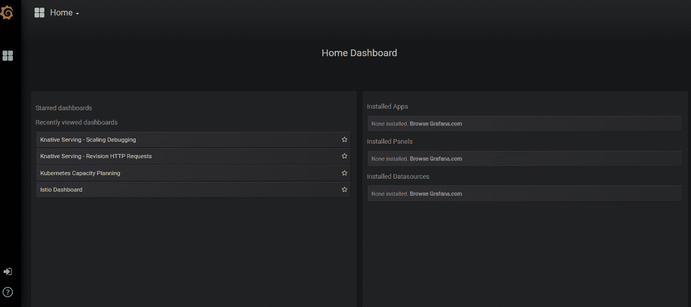

###### 图 6.24：Grafana UI

Knative 的 Grafana 仪表板带有多个仪表板，包括以下内容：

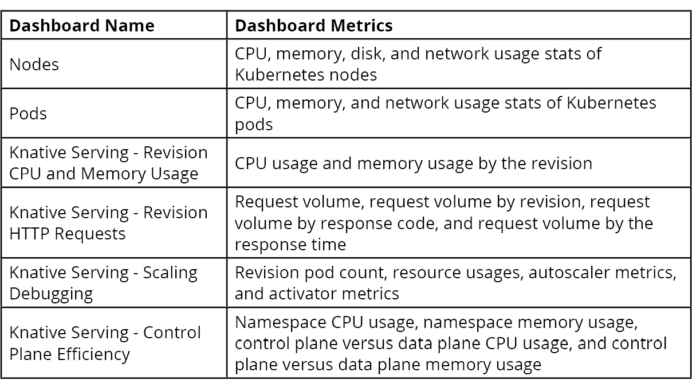

###### 图 6.25：仪表板

## Knative 自动缩放器

Knative 具有内置的自动缩放功能，根据接收到的 HTTP 请求的数量自动调整应用程序 pod 的数量。当需求增加时，它将增加 pod 数量，当需求减少时，它将减少 pod 数量。当 pod 处于空闲状态且没有传入请求时，pod 数量将缩减为零。

Knative 使用两个组件，自动缩放器和激活器，来实现前面提到的功能。这些组件部署为`knative-serving`命名空间中的 pod，如下面的代码片段所示：

```
NAME                          READY   STATUS    RESTARTS   AGE
activator-7c8b59d78-9kgk5     2/2     Running   0          15h
autoscaler-666c9bfcc6-vwrj6   2/2     Running   0          15h
controller-799cd5c6dc-p47qn   1/1     Running   0          15h
webhook-5b66fdf6b9-cbllh      1/1     Running   0          15h
```

激活器组件负责收集有关修订版的并发请求数量的信息，并将这些值报告给自动缩放器。自动缩放器组件将根据激活器报告的指标增加或减少 pod 的数量。默认情况下，自动缩放器将尝试通过扩展或缩减 pod 来维持每个 pod 的 100 个并发请求。所有 Knative 与自动缩放器相关的配置都存储在`knative-serving`命名空间中名为`config-autoscaler`的配置映射中。Knative 还可以配置为使用 Kubernetes 提供的**水平 Pod 自动缩放器**（**HPA**），HPA 将根据 CPU 使用情况自动调整 pod 的数量。

### 练习 18：使用 Knative 进行自动缩放

在这个练习中，我们将通过部署一个示例应用程序来执行 Knative pod 自动缩放：

1.  创建一个名为`autoscale-app.yaml`的服务定义文件，内容如下。该文件定义了一个名为`autoscale-app`的服务，该服务将使用`gcr.io/knative-samples/autoscale-go:0.1`示例 Docker 镜像。`autoscaling.knative.dev/target`用于配置每个 pod 的目标并发请求数量：

```
apiVersion: serving.knative.dev/v1alpha1
kind: Service
metadata:
  name: autoscale-app
spec:
  runLatest:
    configuration:
      revisionTemplate:
        metadata:
          annotations:
            autoscaling.knative.dev/target: "10"
        spec:
          container:
            image: "gcr.io/knative-samples/autoscale-go:0.1"
```

1.  使用`kubectl apply`命令应用服务定义：

```
$ kubectl apply -f autoscale-app.yaml
```

输出应如下所示：


###### 图 6.26：创建 autoscale-app

1.  一旦应用程序准备就绪，我们可以生成一个负载到**autoscale-app**应用程序以观察自动缩放。为此，我们将使用一个名为`hey`的负载生成器。使用以下`curl`命令下载`hey`二进制文件。

```
$ curl -Lo hey https://storage.googleapis.com/hey-release/hey_linux_amd64
```

输出应如下所示：

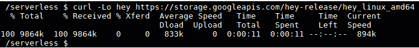

###### 图 6.27：安装 hey

1.  为`hey`二进制文件添加执行权限，并将其移动到`/usr/local/bin/`路径中：

```
$ chmod +x hey
$ sudo mv hey /usr/local/bin/
```

输出应如下所示：


###### 图 6.28：将 hey 移动到/usr/local/bin

1.  现在我们准备使用`hey`工具生成负载。`hey`工具在生成负载时支持多个选项。对于这种情况，我们将使用并发数为 50（使用`-c`标志）持续 60 秒（使用`-z`标志）的负载：

```
$ hey -z 60s -c 50 \
   -host "autoscale-app.default.example.com" \
   "http://${EXTERNAL_IP?}?sleep=1000" 
```

1.  在单独的终端中，观察负载期间创建的 pod 数量：

```
$ kubectl get pods --watch
```

您将看到类似以下的输出：

```
     NAME                                             READY   STATUS    RESTARTS   AGE
autoscale-app-7jt29-deployment-9c9c4b474-4ttl2   3/3     Running   0          58s
autoscale-app-7jt29-deployment-9c9c4b474-6pmjs   3/3     Running   0          60s
autoscale-app-7jt29-deployment-9c9c4b474-7j52p   3/3     Running   0          63s
autoscale-app-7jt29-deployment-9c9c4b474-dvcs6   3/3     Running   0          56s
autoscale-app-7jt29-deployment-9c9c4b474-hmkzf   3/3     Running   0          62s
```

1.  打开 Grafana 中的**Knative Serving - Scaling Debugging**仪表板，观察自动缩放如何在负载期间增加了 pod 数量，并在负载停止后将 pod 数量减少到零，如下面的截图所示：

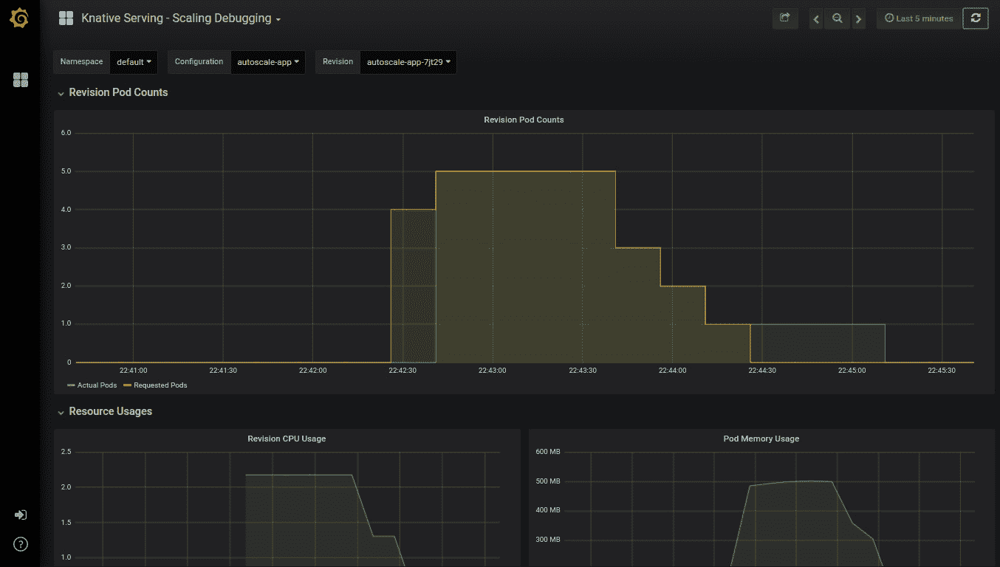

###### 图 6.29：修订 pod 计数指标

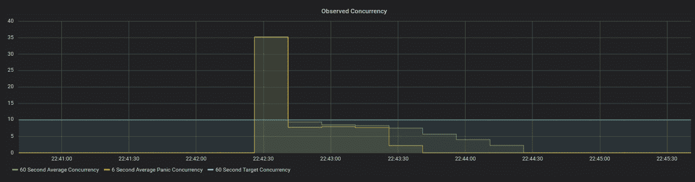

###### 图 6.30：观察并发度指标

我们已成功配置了 Knative 的自动缩放器，并通过 Grafana 仪表板观察到了自动缩放。

### Google Cloud Run

在前面的部分中，我们讨论了 Knative。我们学习了如何在 Kubernetes 集群上安装 Istio 和 Knative，以及如何使用 Knative 运行 Docker 镜像。但是 Knative 平台的优势伴随着管理底层 Kubernetes 集群和 Istio 的运营开销。来自 Google Cloud 的托管 Kubernetes 服务 GKE 将帮助我们管理 Kubernetes 主控组件，但是我们仍然必须自己管理所有的 Kubernetes 节点。

为了将开发人员的所有基础设施管理任务抽象出来，Google 推出了一个名为 Cloud Run 的新服务。这是一个完全托管的平台，建立在 Knative 项目之上，用于运行无状态的 HTTP 驱动容器。Cloud Run 提供与 Knative 相同的功能集，包括自动缩放、零缩放、版本控制和事件。Cloud Run 在 Google Cloud Next '19 大会上作为 Google Cloud 无服务器计算堆栈的最新成员推出。在撰写本书时，Cloud Run 服务仍处于测试阶段，仅在有限数量的地区提供。

现在让我们进行一个练习，在 Google Cloud Run 上部署容器。

### 练习 19：在 Google Cloud Run 上部署容器

在这个练习中，我们将在 Google Cloud Run 平台上部署一个预构建的 Docker 镜像。

以下步骤将帮助您完成练习：

1.  从浏览器导航到您的 GCP 控制台，并从菜单中选择**Cloud Run**（在**计算**类别中），如下图所示：

###### 图 6.31：Cloud Run 的 GCP 菜单

1.  单击**创建服务**按钮以创建新服务。

1.  使用以下值填写创建服务表单：

容器镜像 URL：[gcr.io/knative-samples/helloworld-nodejs](http://gcr.io/knative-samples/helloworld-nodejs)

部署平台：**Cloud Run**（完全托管）

位置：从选项中选择任何您喜欢的地区

服务名称：**hello-world**

身份验证：**允许未经身份验证的调用**

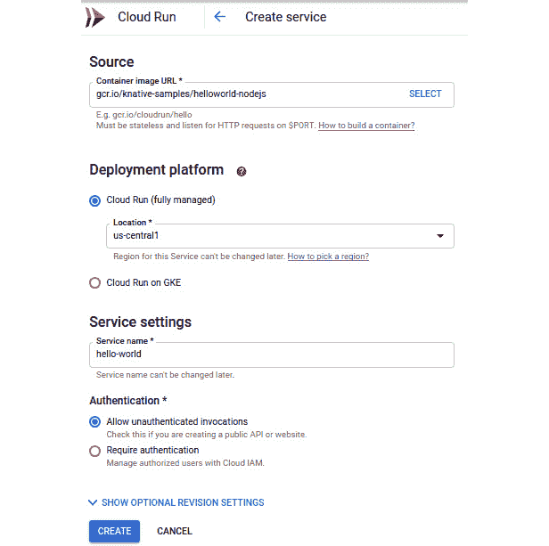

###### 图 6.32：Cloud Run 创建服务表单

1.  单击**创建**按钮。

1.  现在我们将被重定向到部署的服务页面，其中包括关于新部署的**hello-world**服务的详细信息。我们可以看到已创建一个名为**hello-world-00001**的修订版本，如下图所示：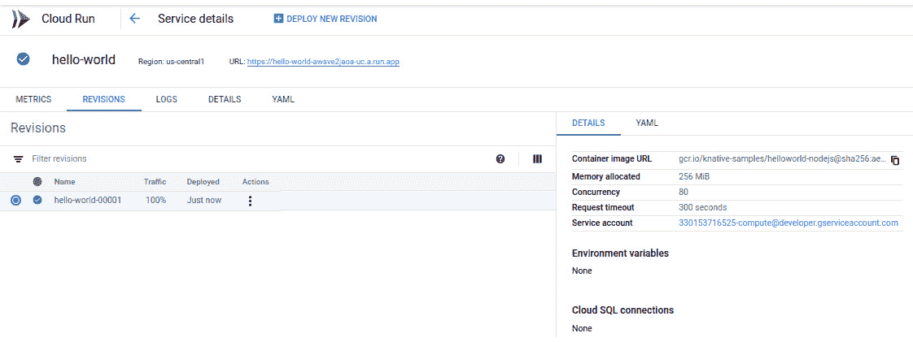

###### 图 6.33：服务详细信息页面

1.  点击显示的 URL 链接来运行容器。请注意，每个新实例的 URL 都会有所不同：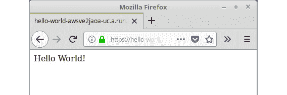

###### 图 6.34：调用 hello-world 应用程序

1.  接下来，我们将通过更新**TARGET**环境变量来部署应用程序的新修订版。返回**GCP**控制台，点击**部署新修订版**按钮。

1.  从**部署修订版到 hello-world（us-central1）**表单中，点击**显示可选修订设置**链接，这将指向我们到附加设置部分：

###### 图 6.35：可选修订设置

1.  在环境变量部分，创建一个名为`TARGET`的新环境变量，值为`Cloud Run Deployment`：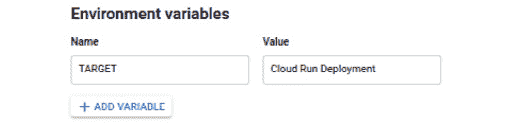

###### 图 6.36：设置 TARGET 环境变量

1.  点击**部署**按钮。

1.  现在我们可以看到**hello-world**应用程序的新修订版名为`hello-world-00002`，100%的流量被路由到最新的修订版：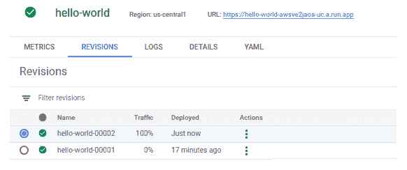

###### 图 6.37：hello-world 应用程序的新修订版

1.  再次点击 URL 来运行更新的修订版：

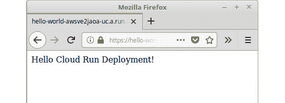

###### 图 6.38：调用 hello-world 应用程序

我们已成功在 Google Cloud Run 平台上部署了预构建的 Docker 镜像。

## 介绍 Virtual Kubelet

Virtual Kubelet 是 Kubernetes kubelet 的开源实现，充当 kubelet。这是来自**Cloud Native Computing Foundation**（**CNCF**）的沙箱项目，Virtual Kubelet 的第一个主要版本（v 1.0）于 2019 年 7 月 8 日发布。

在进一步深入 Virtual Kubelet 之前，让我们回顾一下 Kubernetes 架构中的 kubelet 是什么。kubelet 是在 Kubernetes 集群中每个节点上运行的代理，负责管理节点内的 pod。kubelet 从 Kubernetes API 接收指令，以识别要在节点上调度的 pod，并与节点的底层容器运行时（例如 Docker）交互，以确保所需数量的 pod 正在运行并且它们是健康的。

除了管理 pod 外，kubelet 还执行几项其他任务：

+   更新 Kubernetes API 与 pod 的当前状态

+   监控和报告节点的健康指标，如 CPU、内存和磁盘利用率，到 Kubernetes 主节点

+   从 Docker 注册表中拉取分配的 pod 的 Docker 镜像

+   为 pod 创建和挂载卷

+   为 API 服务器提供一个接口，以执行诸如`kubectl logs`、`kubectl exec`和`kubectl attach`等命令，用于 pod

以下图显示了一个具有标准和虚拟 kubelet 的 Kubernetes 集群：

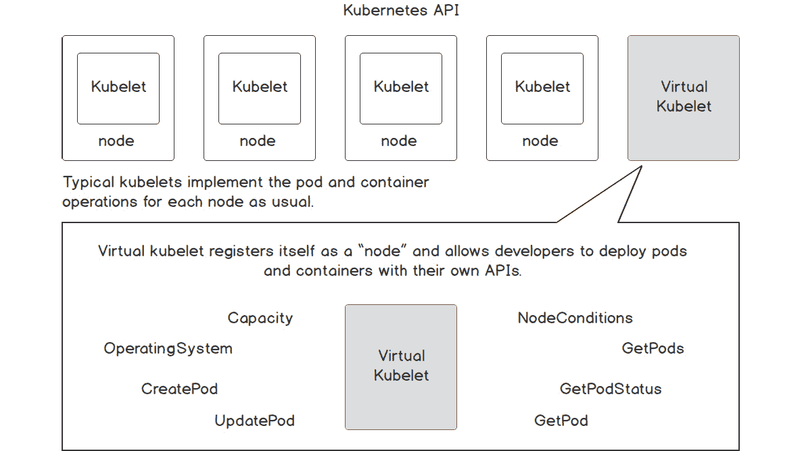

###### 图 6.39：具有标准 kubelet 和虚拟 kubelet 的 Kubernetes 集群

从 Kubernetes API 的视角来看，Virtual Kubelet 将会像传统的 kubelet 一样。它将在现有的 Kubernetes 集群中运行，并在 Kubernetes API 中注册自己为一个节点。Virtual Kubelet 将以与 kubelet 相同的方式运行和管理 pod。但与在节点内运行 pod 的 kubelet 相反，Virtual Kubelet 将利用外部服务来运行 pod。这将把 Kubernetes 集群连接到其他服务，如无服务器容器平台。Virtual Kubelet 支持越来越多的提供者，包括以下：

+   阿里巴巴云弹性容器实例（ECI）

+   AWS Fargate

+   Azure Batch

+   Azure 容器实例（ACI）

+   Kubernetes 容器运行时接口（CRI）

+   华为云容器实例（CCI）

+   HashiCorp Nomad

+   OpenStack Zun

在这些平台上运行 pod 带来了无服务器世界的好处。我们不必担心基础架构，因为它由云提供商管理。Pod 将根据收到的请求数量自动扩展和缩减。此外，我们只需为使用的资源付费。

### 练习 20：在 AKS 上部署 Virtual Kubelet

在这个练习中，我们将在 Azure Kubernetes Service（AKS）上配置 Virtual Kubelet，并使用 ACI 提供程序。在这个练习中，我们将使用 Azure 中提供的以下服务。

+   AKS：AKS 是 Azure 上的托管 Kubernetes 服务。

+   ACI：ACI 提供了在 Azure 上运行容器的托管服务。

+   Azure Cloud Shell：一个交互式的基于浏览器的 shell，支持 Bash 和 PowerShell。

您需要具备以下先决条件才能进行这个练习：

+   Microsoft Azure 账户

+   Azure CLI

+   kubectl CLI

+   Helm

我们将使用 Azure Cloud Shell，其中预先安装了所有先前提到的 CLI：

1.  转到[`shell.azure.com/`](https://shell.azure.com/)在浏览器窗口中打开 Cloud Shell。从“欢迎使用 Azure Cloud Shell”窗口中选择**Bash**：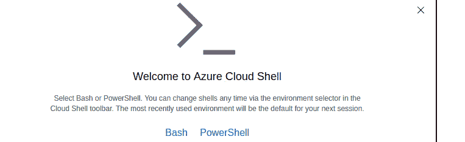

###### 图 6.40：欢迎使用 Azure Cloud Shell 窗口

1.  单击“创建存储”按钮以为 Cloud Shell 创建存储账户。请注意，这是一个一次性任务，仅在我们第一次使用 Cloud Shell 时需要执行：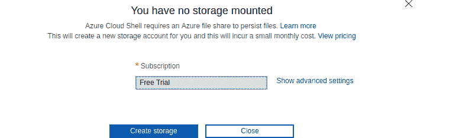

###### 图 6.41：为 Cloud Shell 挂载存储

Cloud Shell 窗口将如下所示：

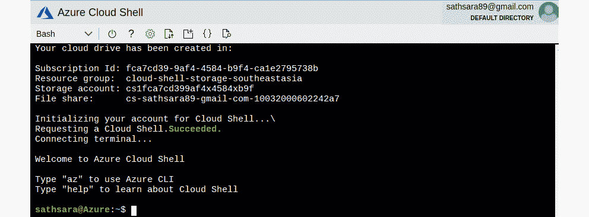

###### 图 6.42：Cloud Shell 窗口

1.  一旦 Cloud Shell 准备就绪，我们就可以开始创建 AKS 集群。

首先，我们需要创建一个 Azure 资源组，以便逻辑上将相关的 Azure 资源分组。执行以下命令，在 West US（`westus`）地区创建一个名为`serverless-kubernetes-group`的资源组：

```
$ az group create --name serverless-kubernetes-group --location westus
```

输出应该如下所示：

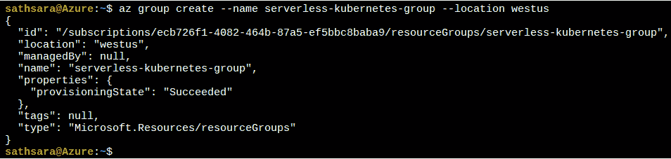

###### 图 6.43：创建 Azure 资源组

1.  注册您的订阅以使用`Microsoft.Network`命名空间：

```
$ az provider register --namespace Microsoft.Networks
```

输出应该如下所示：

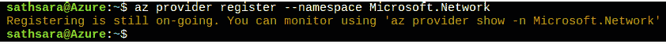

###### 图 6.44：注册订阅

1.  接下来，我们将创建一个 Azure Kubernetes 集群。以下命令将创建一个名为`virtual-kubelet-cluster`的 AKS 集群，其中包含一个节点。此命令将需要几分钟来执行：

```
$ az aks create --resource-group serverless-kubernetes-group --name virtual-kubelet-cluster --node-count 1 --node-vm-size Standard_D2 --network-plugin azure --generate-ssh-keys
```

AKS 集群创建成功后，上述命令将返回一些 JSON 输出，其中包含集群的详细信息：

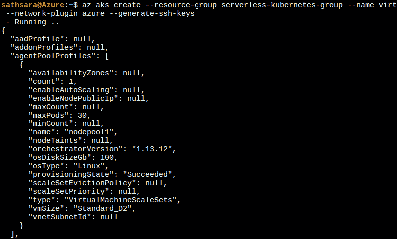

###### 图 6.45：创建 AKS 集群

1.  接下来，我们需要配置 kubectl CLI 以与新创建的 AKS 集群通信。执行`az aks get-credentials`命令来下载凭据并配置 kubectl CLI 以与`virtual-kubelet-cluster`集群一起工作的命令如下：

#### 注意

我们不需要安装 kubectl CLI，因为 Cloud Shell 已经预装了 kubectl。

```
$ az aks get-credentials --resource-group serverless-kubernetes-group --name virtual-kubelet-cluster
```

输出应该如下所示：

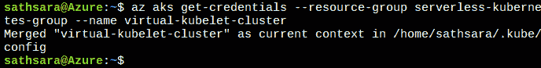

###### 图 6.46：配置 kubectl

1.  现在我们可以通过执行 `kubectl get nodes` 命令来验证从 Cloud Shell 到集群的连接，该命令将列出 AKS 集群中可用的节点：

```
$ kubectl get nodes
```

输出应如下所示：

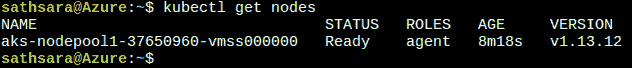

###### 图 6.47：列出 Kubernetes 节点

1.  如果这是您第一次使用 ACI 服务，您需要在订阅中注册 `Microsoft.ContainerInstance` 提供程序。我们可以使用以下命令检查 `Microsoft.ContainerInstance` 提供程序的注册状态：

```
$ az provider list --query "[?contains(namespace,'Microsoft.ContainerInstance')]" -o table
```

输出应如下所示：

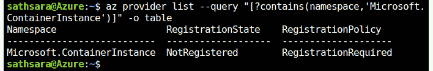

###### 图 6.48：检查 Microsoft.ContainerInstace 提供程序的注册状态

1.  如果 **RegistrationStatus** 列包含值 **NotRegistered**，则执行 `az provider register` 命令来注册 `Microsoft.ContainerInstance` 提供程序。如果 **RegistrationStatus** 列包含值 **Registered**，则可以继续下一步：

```
$ az provider register --namespace Microsoft.ContainerInstance
```

输出应如下所示：

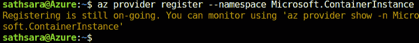

###### 图 6.49：注册 Microsoft.ContainerInstance 提供程序

1.  下一步是为 tiller 创建必要的 `ServiceAccount` 和 `ServiceAccount` 对象。创建一个名为 `tiller-rbac.yaml` 的文件，其中包含以下代码：

```
apiVersion: v1
kind: ServiceAccount
metadata:
  name: tiller
  namespace: kube-system
---
apiVersion: rbac.authorization.k8s.io/v1
kind: ClusterRoleBinding
metadata:
  name: tiller
roleRef:
  apiGroup: rbac.authorization.k8s.io
  kind: ClusterRole
  name: cluster-admin
subjects:
  - kind: ServiceAccount
    name: tiller
    namespace: kube-system
```

1.  然后执行 `kubectl apply` 命令来创建必要的 `ServiceAccount` 和 `ClusterRoleBinding` 对象：

```
$ kubectl apply -f tiller-rbac.yaml
```

输出应如下所示：


###### 图 6.50：创建 ServiceAccount 和 ClusterRoleBinding 对象

1.  现在我们可以配置 Helm 使用我们在上一步中创建的 tiller 服务账户：

```
$ helm init --service-account tiller
```

输出应如下所示：

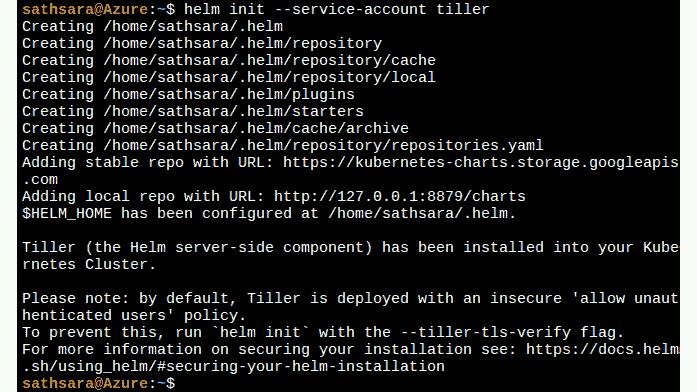

###### 图 6.51：配置 tiller

1.  一旦所有配置都完成，我们可以使用 `az aks install-connector` 命令安装虚拟 Kubelet。我们将使用以下命令部署 Linux 和 Windows 连接器：

```
$ az aks install-connector \
    --resource-group serverless-kubernetes-group \
    --name virtual-kubelet-cluster \
    --connector-name virtual-kubelet \
    --os-type Both
```

输出应如下所示：

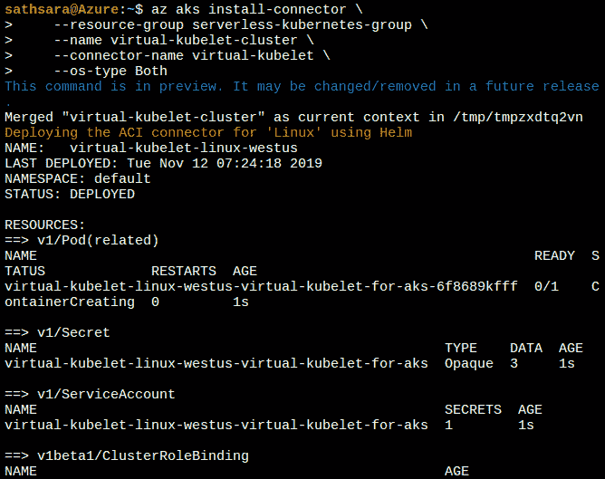

###### 图 6.52：安装虚拟 Kubelet

1.  安装完成后，我们可以通过列出 Kubernetes 节点来验证它。将会有两个新节点，一个用于 Windows，一个用于 Linux：

```
$ kubectl get nodes
```

输出应如下所示：

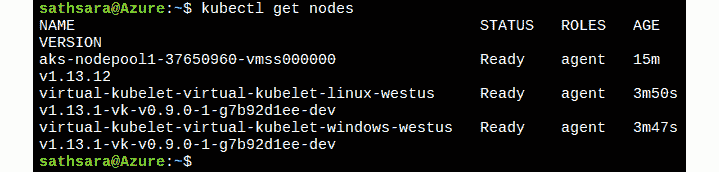

###### 图 6.53：列出 Kubernetes 节点

1.  现在我们已经在 AKS 集群中安装了 Virtual Kubelet。我们可以将一个应用程序部署到 Virtual Kubelet 引入的新节点上。我们将创建一个名为`hello-world`的 Kubernetes Deployment，使用`microsoft/aci-helloworld` Docker 镜像。

我们需要添加一个**nodeSelector**，将此 pod 专门分配给 Virtual Kubelet 节点。请注意，Virtual Kubelet 节点默认会被标记，以防止意外的 pod 在其上运行。我们需要为 pod 添加 tolerations，以允许它们被调度到这些节点上。

让我们创建一个名为`hello-world.yaml`的文件，内容如下：

```
     apiVersion: apps/v1
kind: Deployment
metadata:
  name: hello-world
spec:
  replicas: 1
  selector:
    matchLabels:
      app: hello-world
  template:
    metadata:
      labels:
        app: hello-world
    spec:
      containers:
      - name: hello-world
        image: microsoft/aci-helloworld
        ports:
        - containerPort: 80
      nodeSelector:
        kubernetes.io/role: agent
        type: virtual-kubelet
        beta.kubernetes.io/os: linux
      tolerations:
      - key: virtual-kubelet.io/provider
        operator: Equal
        value: azure
        effect: NoSchedule
```

1.  使用`kubectl apply`命令部署`hello-world`应用程序：

```
$ kubectl apply -f hello-world.yaml
```

输出应如下所示：


###### 图 6.54：创建 hello-world 部署

1.  使用`kubectl get pods`命令和`-o wide`标志执行，以输出一个包含各个 pod 及其相应节点的列表。请注意，`hello-world-57f597bc59-q9w9k` pod 已被调度到`virtual-kubelet-virtual-kubelet-linux-westus`节点上：

```
$ kubectl get pods -o wide
```

输出应如下所示：

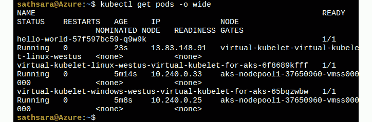

###### 图 6.55：使用-o wide 标志列出所有 pod

因此，我们已成功在 AKS 上配置了带有 ACI 的 Virtual Kubelet，并在 Virtual Kubelet 节点上部署了一个 pod。

现在让我们完成一个活动，我们将在无服务器环境中部署一个容器化应用程序。

### 活动 6：在无服务器环境中部署容器化应用程序

假设你在一家初创公司工作，你的经理希望你创建一个可以根据给定时区返回当前日期和时间的应用程序。在初始阶段，预计该应用程序只会收到少量请求，但从长远来看将收到数百万个请求。该应用程序应能根据收到的请求数量自动扩展，无需进行任何修改。此外，你的经理不希望承担管理基础设施的负担，并希望该应用程序以尽可能低的成本运行。

执行以下步骤完成此活动：

1.  创建一个应用程序（使用任何你想要的语言），可以根据给定的`timezone`值提供当前日期和时间。

以下是用 PHP 编写的一些示例应用程序代码：

```
     <?php
if ( !isset ( $_GET['timezone'] ) ) {
    // Returns error if the timezone parameter is not provided
    $output_message = "Error: Timezone not provided"; 
} else if ( empty ( $_GET['timezone'] ) ) {
    // Returns error if the timezone parameter value is empty
    $output_message = "Error: Timezone cannot be empty"; 
} else {
    // Save the timezone parameter value to a variable
    $timezone = $_GET['timezone'];

    try {
        // Generates the current time for the provided timezone
        $date = new DateTime("now", new DateTimeZone($timezone) );
        $formatted_date_time = $date->format('Y-m-d H:i:s');
        $output_message = "Current date and time for $timezone is $formatted_date_time";
    } catch(Exception $e) {
        // Returns error if the timezone is invalid
        $output_message = "Error: Invalid timezone value"; 
    }
}
// Return the output message
echo $output_message;
```

1.  根据 Google Cloud Run 提供的指南对应用程序进行容器化。

以下是一个示例 Dockerfile 的内容：

```
# Use official PHP 7.3 image as base image
FROM php:7.3-apache
# Copy index.php file to the docker image
COPY index.php /var/www/html/
# Replace port 80 with the value from PORT environment variable in apache2 configuration files
RUN sed -i 's/80/${PORT}/g' /etc/apache2/sites-available/000-default.conf /etc/apache2/ports.conf
# Use the default production configuration file
RUN mv "$PHP_INI_DIR/php.ini-production" "$PHP_INI_DIR/php.ini"
```

1.  将 Docker 镜像推送到 Docker 注册表。

1.  使用 Cloud Run 运行应用程序。

输出应该如下所示：

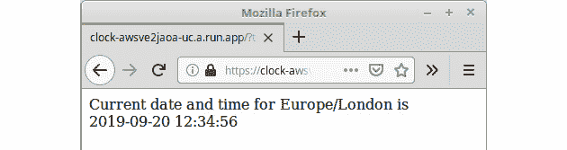

###### 图 6.56：在无服务器环境中部署应用程序

#### 注意

活动的解决方案可以在第 417 页找到。

## 摘要

在本章中，我们讨论了在 Kubernetes 上使用无服务器的优势。我们讨论了三种技术，它们在 Kubernetes 集群之上提供了无服务器的好处。这些技术是 Knative、Google Cloud Run 和 Virtual Kubelet。

首先，我们创建了一个带有 Istio 的 GKE 集群，并在其上部署了 Knative。然后我们学习了如何在 Knative 上部署应用程序。接下来，我们讨论了 Knative 的 serving 组件，以及如何使用配置和路由对象执行金丝雀部署。然后我们讨论了 Knative 上的监控，并观察了 Knative 根据收到的请求数进行自动扩展的工作原理。

我们还讨论了 Google Cloud Run，这是一个完全托管的平台，建立在 Knative 项目之上，用于运行无状态的 HTTP 驱动容器。然后我们学习了如何使用 Cloud Run 服务部署应用程序。

在最后一节中，我们学习了 Virtual Kubelet，这是 Kubernetes kubelet 的开源实现。我们了解了普通 kubelet 和 Virtual Kubelet 之间的区别。最后，我们在 AKS 集群上部署了 Virtual Kubelet，并将应用程序部署到了 Virtual Kubelet 节点。

在接下来的三章中，我们将专注于三种不同的 Kubernetes 无服务器框架，分别是 Kubeless、OpenWhisk 和 OpenFaaS。
