# 第七章： 使用 Kubeless 的 Kubernetes 无服务器

## 学习目标

到本章结束时，您将能够：

+   使用 Minikube 创建 Kubernetes 集群

+   在 Kubernetes 上安装 Kubeless 框架

+   创建、更新、调用和删除 Kubeless 函数

+   列出、描述、调试和监视 Kubeless 函数

+   为 Kubeless 函数创建 HTTP 和 PubSub 触发器

在本章中，我们将首先了解 Kubeless 架构。然后，我们将创建我们的第一个 Kubeless 函数，部署它并调用它。您还将学习如何在 Kubeless 函数失败的情况下进行调试。

## Kubeless 简介

**Kubeless**是一个开源的、基于 Kubernetes 的无服务器框架，运行在 Kubernetes 之上。这使软件开发人员可以将代码部署到 Kubernetes 集群中，而不必担心底层基础设施。**Kubeless**是 Bitnami 的一个项目，Bitnami 是任何平台上打包应用程序的提供商。Bitnami 为超过 130 个应用程序提供软件安装程序，这使您可以快速高效地将这些软件应用程序部署到任何平台。

**Kubeless**函数支持多种编程语言，包括 Python、PHP、Ruby、Node.js、Golang、Java、.NET、Ballerina 和自定义运行时。这些函数可以通过 HTTP(S)调用以及使用 Kafka 或 NATS 消息系统的事件触发器来调用。Kubeless 还支持 Kinesis 触发器，将函数与 AWS Kinesis 服务关联起来，这是 AWS 提供的托管数据流服务。Kubeless 函数甚至可以使用定时触发器在指定的时间间隔内被调用。

Kubeless 配备了自己的命令行界面（CLI），名为`kubeless`，类似于 Kubernetes 提供的**kubectl** CLI。我们可以使用这个`kubeless` CLI 来创建、部署、列出和删除 Kubeless 函数。Kubeless 还有一个图形用户界面，使函数的管理更加容易。

在本章中，我们将使用 Kubeless 在 Kubernetes 上创建我们的第一个无服务器函数。然后，我们将使用多种机制调用此函数，包括 HTTP 和 PubSub 触发器。一旦我们熟悉了 Kubeless 的基础知识，我们将创建一个更高级的函数，可以向 Slack 发布消息。

### Kubeless 架构

Kubeless 框架是 Kubernetes 框架的扩展，利用了原生 Kubernetes 概念，如**自定义资源定义**（**CRDs**）和自定义控制器。由于 Kubeless 是建立在 Kubernetes 之上的，它可以利用 Kubernetes 中可用的所有出色功能，如自愈、自动扩展、负载平衡和服务发现。

#### 注意

自定义资源是 Kubernetes API 的扩展。您可以在官方 Kubernetes 文档中找到有关 Kubernetes 自定义资源的更多信息，网址为[`kubernetes.io/docs/concepts/extend-kubernetes/api-extension/custom-resources/`](https://kubernetes.io/docs/concepts/extend-kubernetes/api-extension/custom-resources/)。

让我们来看看 Kubernetes 架构，以了解其背后的核心概念：

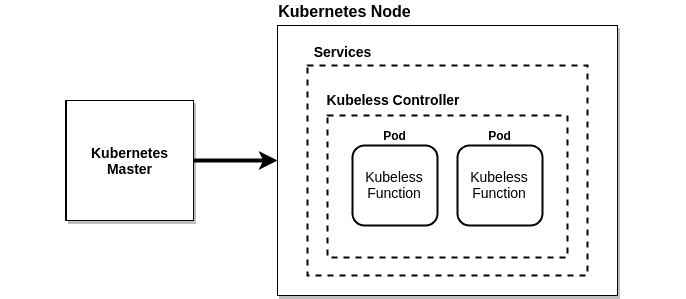

###### 图 7.1：Kubeless 架构图

前面的图表类似于标准的 Kubernetes 架构，包括 Kubernetes 主节点和节点。可以有一个或多个负责集群整体决策的 Kubernetes 主节点。Kubernetes 节点用于托管 Kubernetes pod。这些 pod 包含软件开发人员编写的函数。函数的源代码将由控制器使用**ConfigMaps**注入到 pod 中。

这些 pod 将由**Kubeless 控制器**管理。在 Kubeless 框架安装过程中，它将启动一个集群内控制器，该控制器将持续监视函数资源。当部署函数时，该控制器将使用提供的运行时创建相关的服务、部署和 pod。

Kubeless 框架有三个核心概念：

+   功能

+   触发器

+   运行时

函数代表 Kubeless 框架执行的代码块。在安装过程中，将创建一个名为`functions.kubeless.io`的 CRD 来表示 Kubeless 函数。

触发器代表函数的调用机制。当接收到触发器时，Kubeless 函数将被调用。一个触发器可以关联一个或多个函数。在 Kubeless 上部署的函数可以使用五种可能的机制进行触发：

+   HTTP 触发器：这是通过基于 HTTP(S)的调用执行的，比如 HTTP GET 或 POST 请求。

+   CronJob 触发器：这是通过预定义的时间表执行的。

+   Kafka 触发器：当消息发布到 Kafka 主题时执行。

+   NATS 触发器：当消息发布到 NATS 主题时执行。

+   Kinesis 触发器：当记录发布到 AWS Kinesis 数据流时执行。

运行时代表可以用于编写和执行 Kubeless 函数的不同编程语言。单个编程语言将根据版本进一步分为多个运行时。例如，Python 2.7、Python 3.4、Python 3.6 和 Python 3.7 是支持 Python 编程语言的运行时。Kubeless 支持稳定阶段和孵化器阶段的运行时。一旦满足 Kubeless 指定的某些技术要求，运行时将被视为稳定。孵化器运行时被视为处于开发阶段。一旦满足指定的技术要求，运行时维护者可以在 Kubeless GitHub 存储库中创建一个“pull”请求，将运行时从孵化器阶段移至稳定阶段。在撰写本书时，Ballerina、.NET、Golang、Java、Node.js、PHP 和 Python 运行时在稳定阶段可用，JVM 和 Vertx 运行时在孵化器阶段可用。

#### 注意

以下文档定义了稳定运行时的技术要求：[`github.com/kubeless/runtimes/blob/master/DEVELOPER_GUIDE.md#runtime-image-requirements`](https://github.com/kubeless/runtimes/blob/master/DEVELOPER_GUIDE.md#runtime-image-requirements)。

## 创建 Kubernetes 集群

我们需要一个工作的 Kubernetes 集群才能安装 Kubeless 框架。您可以使用 Minikube、Kubeadm 和 Kops 等工具创建自己的 Kubernetes 集群。您还可以使用公共云提供商提供的托管 Kubernetes 集群服务，如 Google Kubernetes Engine（GKE）、Microsoft 的 Azure Kubernetes Service（AKS）和 Amazon Elastic Kubernetes Service（Amazon EKS）来创建 Kubernetes 集群。在接下来的章节中，我们将使用 Minikube 创建自己的 Kubernetes 集群。

### 使用 Minikube 创建 Kubernetes 集群

首先，我们将使用 Minikube 创建我们的 Kubernetes 集群。Minikube 是一个工具，可以在您的个人电脑上安装和运行 Kubernetes。这将在**虚拟机**（**VM**）内创建一个单节点 Kubernetes 集群。Minikube 被软件开发人员用来在本地尝试 Kubernetes，但不建议用于运行生产级别的 Kubernetes 集群。我们将通过以下步骤开始创建我们的 Kubernetes 集群：

1.  安装 VirtualBox。

由于 Minikube 作为虚拟机运行，我们需要安装一个支持虚拟机的 hypervisor。我们将安装由 Oracle Corporation 开发的免费虚拟化软件 Oracle VirtualBox。

#### 注意

可以通过在终端中执行以下命令在 Ubuntu 18.04 上使用 APT 软件包管理器安装 VirtualBox：

`$ sudo apt install virtualbox -y`

1.  执行`virtualbox`命令启动**Oracle VM VirtualBox Manager**，如下截图所示：

```
$ virtualbox
```

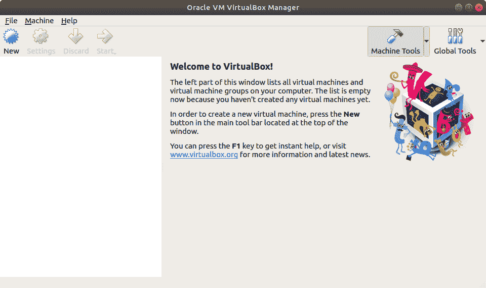

###### 图 7.2：Oracle VM VirtualBox Manager

1.  安装`minikube`。

现在，我们将安装`Minikube`版本 1.2.0，这是撰写本书时的最新版本。首先，将`minikube`二进制文件下载到本地机器：

```
$ curl -Lo minikube https://storage.googleapis.com/minikube/releases/v1.2.0/minikube-linux-amd64
```

输出如下：

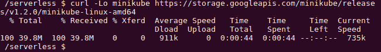

###### 图 7.3：下载 Minikube 二进制文件

1.  然后，为`minikube`二进制文件添加执行权限：

```
$ chmod +x minikube 
```

输出如下：


###### 图 7.4：为 Minikube 二进制文件添加执行权限

1.  最后，将 Minikube 二进制文件移动到`/usr/local/bin/`路径位置：

```
$ sudo mv minikube /usr/local/bin/
```

结果如下截图所示：


###### 图 7.5：将 Minikube 二进制文件移动到路径

1.  验证安装：

```
$ minikube version
```

结果如下截图所示：


###### 图 7.6：验证 Minikube 版本

1.  使用`minikube start`命令启动 Minikube 集群：

```
$ minikube start
```

这将在 VirtualBox 中为 Minikube 创建一个虚拟机，如下所示：

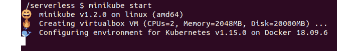

###### 图 7.7：启动 Minikube

现在，在**VirtualBox Manager**窗口中，您可以看到一个名为`minikube`的虚拟机处于运行状态：

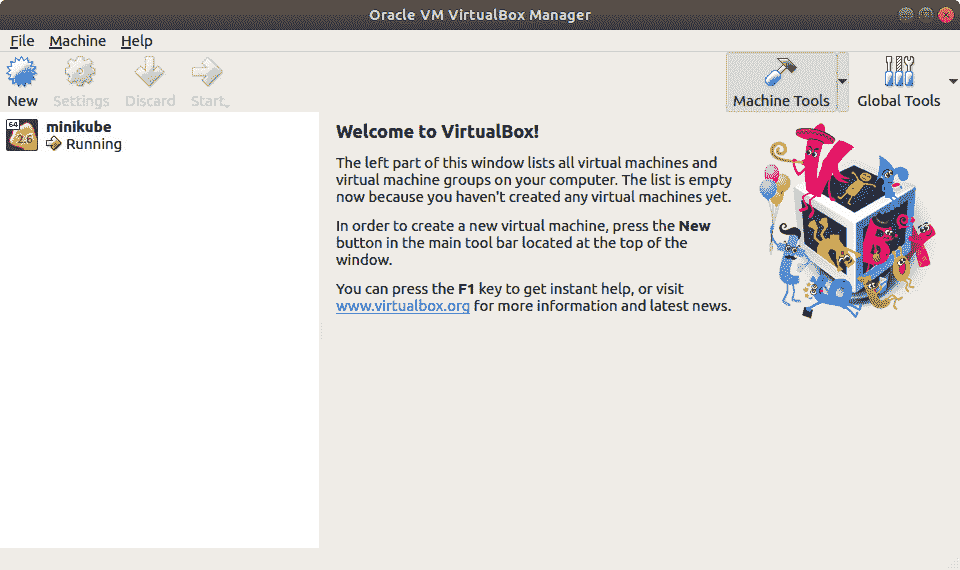

###### 图 7.8：带有 Minikube VM 的 Oracle VirtualBox

1.  安装`kubectl`。

现在，我们将安装`kubectl`版本 1.15.0，这是撰写本书时可用的最新版本。首先，将`kubectl`二进制文件下载到您的本地机器：

```
$ curl -LO https://storage.googleapis.com/kubernetes-release/release/v1.15.0/bin/linux/amd64/kubectl
```

这将显示以下输出：

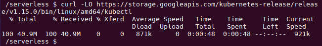

###### 图 7.9：下载 kubectl 二进制文件

1.  然后，为 Minikube 二进制文件添加执行权限：

```
$ chmod +x kubectl
```

以下截图显示了结果：


###### 图 7.10：为 kubectl 二进制文件添加执行权限

1.  最后，将 Minikube 二进制文件移动到`/usr/local/bin/`路径位置：

```
$ sudo mv kubectl /usr/local/bin/kubectl
```

输出如下：


###### 图 7.11：将 kubectl 二进制文件移动到路径

1.  验证安装：

```
$ kubectl version
```

屏幕上将显示以下内容：

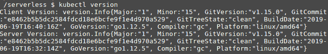

###### 图 7.12：验证 kubectl 版本

1.  验证`kubectl` CLI 是否正确指向 Minikube 集群：

```
$ kubectl get pods
```

您应该看到以下输出：


###### 图 7.13：验证 kubectl 是否指向 Minikube 集群

## 安装 Kubeless

一旦 Minikube Kubernetes 环境准备就绪，我们可以在 Kubernetes 集群之上安装 Kubeless。安装 Kubeless 包括安装三个组件：

+   Kubeless 框架

+   Kubeless CLI

+   Kubeless UI

Kubeless 框架将在 Kubernetes 之上安装所有扩展以支持 Kubeless 功能。这包括 CRD、自定义控制器和部署。Kubeless CLI 用于与 Kubeless 框架交互，执行任务如部署函数、调用函数和创建触发器。Kubeless UI 是 Kubeless 框架的 GUI，可帮助您查看、编辑和运行函数。

### 安装 Kubeless 框架

我们将安装 Kubeless 版本 1.0.3，这是撰写本书时可用的最新版本。

首先，我们需要使用`kubectl create namespace`创建`kubeless`命名空间。这是 Kubeless 使用的默认命名空间，用于存储所有对象：

```
$ kubectl create namespace kubeless
```

结果如下：


###### 图 7.14：创建 kubeless 命名空间

在下一步中，我们将安装 Kubeless 框架。我们将使用 Kubeless 提供的 YAML 清单之一来安装框架。Kubeless 提供了多个`yaml`文件，我们必须根据 Kubernetes 环境（例如`rbac`、`non-rbac`或`openshift`）选择正确的`yaml`文件：

```
$ kubectl create -f https://github.com/kubeless/kubeless/releases/download/v1.0.3/kubeless-v1.0.3.yaml 
```

屏幕将显示以下内容：

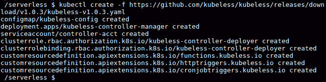

###### 图 7.15：安装 Kubeless 框架

上一步将在`kubeless`命名空间中创建多个 Kubernetes 对象。这将创建一个函数对象作为**自定义资源定义**和 Kubeless 控制器作为部署。您可以通过执行以下命令验证这些对象是否正在运行：

```
$ kubectl get pods -n kubeless
$ kubectl get deployment -n kubeless
$ kubectl get customresourcedefinition
```

您将在屏幕上看到以下内容：

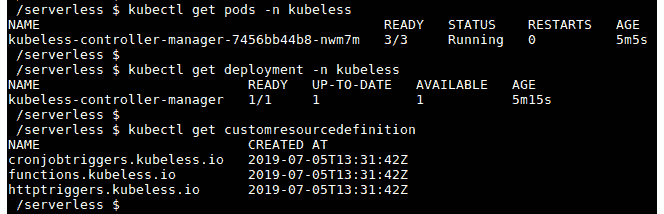

###### 图 7.16：验证 Kubeless 安装

现在，我们已成功完成了 Kubeless 框架的安装。在下一节中，我们将安装 Kubeless CLI。

### 安装 Kubeless CLI

**Kubeless CLI**是针对 Kubeless 框架运行命令的命令行界面。`kubeless function`是最常见的命令，因为它允许您执行诸如部署、调用、更新或删除函数等任务。此外，您还可以通过`kubeless function`命令列出和描述函数。还支持通过`kubeless function`命令检查日志或指标。您还可以通过 Kubeless CLI 管理 Kubeless 触发器、主题和自动缩放。

安装成功 Kubeless 框架后，下一步是安装 Kubeless CLI。我们将使用 Kubeless CLI 版本 1.0.3，这与我们在上一节中安装的 Kubeless 框架版本相同。

首先，我们需要下载 Kubeless CLI zip 文件：

```
$ curl -OL https://github.com/kubeless/kubeless/releases/download/v1.0.3/kubeless_linux-amd64.zip 
```

结果如下：

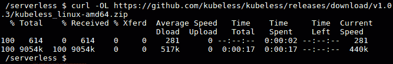

###### 图 7.17：下载 Kubeless 二进制文件

接下来，我们将提取 zip 文件：

```
$ unzip kubeless_linux-amd64.zip
```

要更好地理解这一点，请参考以下输出：


###### 图 7.18：提取 Kubeless 二进制文件

然后，将 Kubeless 可执行文件移动到`/usr/local/bin/`路径位置：

```
$ sudo mv bundles/kubeless_linux-amd64/kubeless /usr/local/bin/
```

以下是您在屏幕上看到的内容：


###### 图 7.19：将 Kubeless 二进制文件移动到路径

现在，我们已经成功安装了 Kubeless CLI。您可以通过运行以下命令来验证：

```
$ kubeless version
```

参考以下截图：


###### 图 7.20：验证 Kubeless 版本

### Kubeless UI

**Kubeless UI** 是 Kubeless 的图形用户界面。它允许您使用易于使用的 UI 创建、编辑、删除和执行 Kubeless 函数。执行以下命令在 Kubernetes 集群中安装 Kubeless UI：

```
$ kubectl create -f https://raw.githubusercontent.com/kubeless/kubeless-ui/master/k8s.yaml
```

这将给你以下输出：

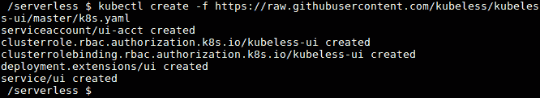

###### 图 7.21：安装 Kubeless UI

安装成功后，执行以下命令在浏览器窗口中打开 Kubeless UI。如果 Kubeless UI 没有显示出来，可以重新加载浏览器窗口，因为创建服务可能需要几分钟时间：

```
$ minikube service ui --namespace kubeless
```

如下所示：

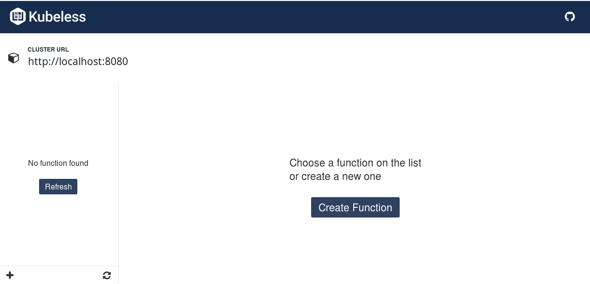

###### 图 7.22：Kubeless GUI

我们刚刚完成了 Kubeless UI 的安装，它可以用来创建、编辑、删除和执行类似于 Kubeless CLI 的 Kubeless 函数。

## Kubeless 函数

一旦 Kubeless 成功安装，您现在可以忘记底层基础设施，包括虚拟机和容器，只专注于您的函数逻辑。Kubeless 函数是用其中一种支持的语言编写的代码片段。正如我们之前讨论的，Kubeless 支持多种编程语言和版本。您可以执行 `kubeless get-server-config` 命令来获取您的 Kubeless 版本支持的语言运行时列表：

```
$ kubeless get-server-config 
```

结果如下截图所示：

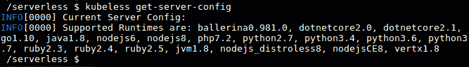

###### 图 7.23：Kubeless 服务器配置

在接下来的章节中，我们将创建、部署、列出、调用、更新和删除 Kubeless 函数。

### 创建 Kubeless 函数

每个 Kubeless 函数，无论语言运行时如何，都具有相同的格式。它接收两个参数作为输入，并返回一个字符串或对象作为响应。函数的第一个参数是一个事件，其中包括有关事件源的所有信息，例如事件 ID、事件时间和事件类型。`event`对象内的`data`字段包含函数请求的主体。函数的第二个参数命名为`context`，其中包含有关函数的一般信息，例如其名称、超时、运行时和内存限制。

以下是一个返回文本`Welcome to Kubeless World`作为响应的示例 Python 函数：

```
def main(event, context):
    return "Welcome to Kubeless World"  
```

您可以将文件保存为`hello.py`。

### 部署 Kubeless 函数

一旦函数准备就绪，您可以将其部署到 Kubeless 框架中。您可以使用`kubeless function deploy`命令将函数注册到 Kubeless 框架中。为了部署函数，您需要提供一些信息，包括函数名称、函数的运行时、包含函数源代码的文件以及在调用函数时要执行的方法名称：

```
kubeless function deploy hello --runtime python3.7 \
                           --from-file hello.py \
                           --handler hello.main
```

输出如下：

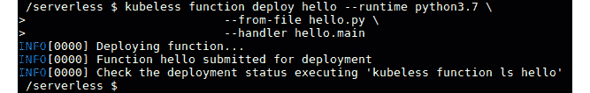

###### 图 7.24：部署 Kubeless 函数

让我们将这个命令分解成几个部分，以便了解命令的每个部分的作用：

+   `kubeless function deploy hello`：这告诉 Kubeless 注册一个名为`hello`的新函数。我们可以在以后使用这个名称来调用这个函数。

+   `--runtime python3.7`：这告诉 Kubeless 使用 Python 3.7 运行时来运行此函数。

+   `--from-file hello.py`：这告诉 Kubeless 使用`hello.py`文件中可用的代码来创建`hello`函数。如果在执行命令时不在当前文件路径中，需要指定完整的文件路径。

+   `--handler hello.main`：这指定了在调用此函数时要执行的代码文件的名称和方法的名称。这应该是`<file-name>.<function-name>`的格式。在我们的情况下，文件名是`hello`，文件内的函数名是`main`。

您可以通过执行`kubeless function deploy --help`命令找到在部署函数时可用的其他选项。

### 列出 Kubeless 函数

部署函数后，您可以使用`kubeless function list`命令列出函数，以验证函数是否成功部署。您应该看到所有注册函数的详细信息如下：

```
$ kubeless function list
```

以下截图反映了结果：

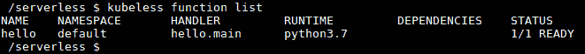

###### 图 7.25：使用 Kubeless CLI 列出 Kubeless 函数

#### 注意

同样可以使用`kubeless function ls`命令实现。

如果您希望获取有关特定函数的更详细信息，可以使用`kubeless function describe`命令：

```
$ kubeless function describe hello
```

它产生以下输出：

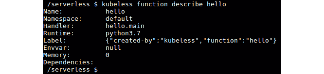

###### 图 7.26：描述 Kubeless 函数

由于 Kubeless 函数被创建为 Kubernetes 对象（即自定义资源），您还可以使用 Kubectl CLI 获取有关可用函数的信息。以下是`kubectl get functions`命令的输出：

```
$ kubectl get functions
```

您将得到以下输出：


###### 图 7.27：使用 kubectl CLI 列出 Kubeless 函数

### 调用 Kubeless 函数

现在是时候调用我们的`hello`函数了。您可以使用`kubeless function call`方法来调用 Kubeless 函数。`hello`函数将返回文本`Welcome to Kubeless World`作为响应：

```
$ kubeless function call hello
```

输出如下：


###### 图 7.28：使用 kubeless CLI 调用 Kubeless 函数

恭喜！您已成功执行了您的第一个 Kubeless 函数。

您还可以使用 Kubeless UI 调用 Kubeless 函数。打开 Kubeless UI 后，您可以在左侧看到可用函数的列表。您可以点击`hello`函数以打开它。然后，点击**Run**函数按钮来执行函数。您可以在**Response**部分下看到预期的**Welcome to Kubeless World**响应：

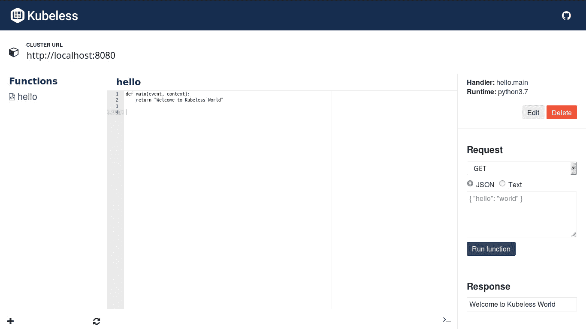

###### 图 7.29：使用 Kubeless UI 调用 Kubeless 函数

#### 注意

Kubeless 函数也可以使用 Kubeless UI 进行更新或删除。

### 更新 Kubeless 函数

成功调用我们的`hello`函数后，现在我们将对其进行更新，以向任何人说*hello*。您可以按照以下方式更新`hello.py`文件：

```
def main(event, context):
   name = event['data']['name']
   return "Hello " +  name
```

然后，您可以执行`kubeless function update`命令来更新我们之前创建的`hello`函数：

```
$ kubeless function update hello --from-file hello.py
```

这将产生以下输出：

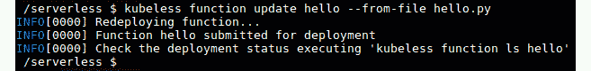

###### 图 7.30：使用 Kubeless CLI 更新 Kubeless 函数

现在在调用`hello`函数时，您必须传递所需的数据：

```
$ kubeless function call hello --data '{"name":"Kubeless World!"}'
```

这是上述代码的输出：

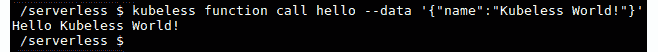

###### 图 7.31：调用更新后的 Kubeless 函数

您应该能够在上述命令的输出中看到`Hello Kubeless World!`。

### 删除 Kubeless 函数

如果您想要删除该函数，可以执行`kubeless function delete`命令：

```
$ kubeless function delete hello
```

这将产生以下结果：


###### 图 7.32：删除 kubeless 函数

一旦函数被删除，尝试再次列出函数。它应该会抛出一个错误，如下所示：

```
$ kubeless function list hello
```

我们将看到以下结果：

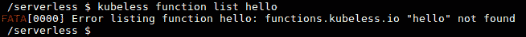

###### 图 7.33：验证删除 kubeless 函数

上述的`kubeless function delete`命令不仅会删除`kubeless`函数，而且在创建 Kubeless 函数时，框架会创建诸如 pod 和 deployment 之类的 Kubernetes 对象。当我们删除 kubeless 函数时，这些对象也将被删除。您可以使用以下命令进行验证：

```
$ kubectl get pods -l function=hello
```

您可以按照以下方式查看结果：


###### 图 7.34：验证删除

现在我们已经学会了如何创建、部署、列出、调用、更新和删除 Kubeless 函数。让我们继续进行一个关于创建您的第一个 Kubeless 函数的练习。

### 练习 21：创建您的第一个 Kubeless 函数

在这个练习中，我们将创建、部署、调用，然后删除一个 Kubeless 函数。执行以下步骤来完成练习：

#### 注意

此练习的代码文件可以在[`github.com/TrainingByPackt/Serverless-Architectures-with-Kubernetes/tree/master/Lesson07/Exercise21`](https://github.com/TrainingByPackt/Serverless-Architectures-with-Kubernetes/tree/master/Lesson07/Exercise21)找到。

1.  创建一个带有示例`hello`函数的文件：

```
$ cat <<EOF >my-function.py
def main(event, context):
    return "Welcome to Serverless Architectures with Kubernetes"
EOF
```

这将呈现以下输出：

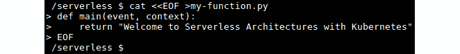

###### 图 7.35：创建 my-function.py 文件

1.  创建`lesson-7`命名空间并部署之前创建的`my-function.py`文件：

```
$ kubectl create namespace lesson-7
$ kubeless function deploy my-function --runtime python3.7 \
                                  --from-file my-function.py \
                                  --handler my-function.main \
                                  --namespace lesson-7
```

输出如下：

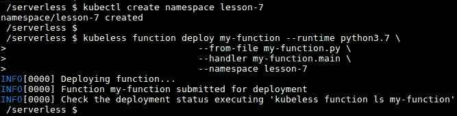

###### 图 7.36：部署 my-function

1.  验证`my-function`是否已正确部署：

```
$ kubeless function list my-function --namespace lesson-7
```

输出如下：

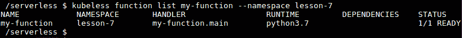

###### 图 7.37：验证 my-function 已成功部署

1.  使用`kubeless` CLI 调用`my-function`：

```
$ kubeless function call my-function --namespace lesson-7
```

它看起来像这样：


###### 图 7.38：使用 Kubeless CLI 调用 my-function

1.  删除`my-function`和`lesson-7`命名空间：

```
$ kubeless function delete my-function --namespace lesson-7
$ kubectl delete namespace lesson-7
```

以下是我们得到的：

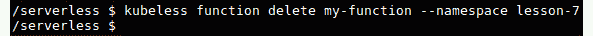

###### 图 7.39：使用 Kubeless CLI 删除 my-function

在这个练习中，首先，我们创建了一个简单的 Python 函数，它返回`Welcome to Serverless Architectures with Kubernetes`字符串作为输出，并将其部署到 Kubeless。然后，我们列出函数以确保它已成功创建。然后，我们调用了`my-function`并成功返回了预期的响应`Welcome to Serverless Architectures with Kubernetes`。最后，我们通过删除函数进行清理。

## Kubeless HTTP 触发器

在前面的部分中，我们讨论了如何使用 Kubeless CLI 调用 Kubeless 函数。在本节中，我们将演示如何通过创建 HTTP 触发器向所有人公开这些函数。

HTTP 触发器用于通过基于 HTTP(S)的调用（如 HTTP `GET`或`POST`请求）执行 Kubeless 函数。当函数部署时，Kubeless 将创建一个与函数关联的 Kubernetes 服务，服务类型为`ClusterIP`；然而，这些服务是不可公开访问的。为了使函数公开可用，我们需要创建一个 Kubeless HTTP 触发器。这将通过使用 Kubernetes 入口规则向所有人公开 Kubeless 函数。

为了运行 HTTP 触发器，您的 Kubernetes 集群必须有一个运行中的入口控制器。一旦入口控制器在 Kubernetes 集群中运行，您可以使用`kubeless trigger http create`命令创建一个 HTTP 触发器：

```
$ kubeless trigger http create <trigger-name> --function-name <function-name>
```

`--function-name`标志用于指定将与 HTTP 触发器关联的函数的名称。

#### 注意

Kubernetes 有许多可用的 ingress 控制器插件，包括 NGINX、Kong、Traefik、F5、Contour 等。您可以在[`kubernetes.io/docs/concepts/services-networking/ingress-controllers/`](https://kubernetes.io/docs/concepts/services-networking/ingress-controllers/)找到它们。

### 练习 22：为 Kubeless 函数创建 HTTP 触发器

在这个练习中，我们将首先为 Minikube 启用 ingress 插件。然后，我们将创建一个要与 HTTP 触发器一起执行的函数。最后，我们将创建一个 HTTP 触发器并使用 HTTP 触发器调用此函数。

#### 注意

此练习的代码文件可以在[`github.com/TrainingByPackt/Serverless-Architectures-with-Kubernetes/tree/master/Lesson07/Exercise22`](https://github.com/TrainingByPackt/Serverless-Architectures-with-Kubernetes/tree/master/Lesson07/Exercise22)找到。

执行以下步骤完成练习：

1.  首先，我们需要在 Minikube 集群中启用`ingress`插件：

```
$ minikube addons enable ingress
```

这显示以下输出：


###### 图 7.40：启用 Minikube 插件

1.  几分钟后，您应该能够看到`kube-system`命名空间中已创建了`nginx-ingress-controller`容器，这是 Kubernetes 系统创建的对象的命名空间：

```
$ kubectl get pod -n kube-system -l app.kubernetes.io/name=nginx-ingress-controller
```

它显示如下：

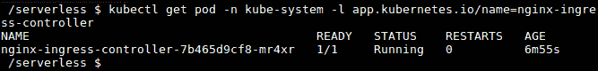

###### 图 7.41：列出 nginx-ingress-controller pod

1.  一旦`nginx-ingress-controller`容器处于运行状态，我们将创建要与 HTTP 触发器一起执行的函数。创建一个名为`greetings.py`的 Python 文件，内容如下：

```
import datetime as dt
def main(event, context):
    currentHour = dt.datetime.now().hour
    greetingMessage = ''
    if currentHour < 12:
        greetingMessage = 'Hello, Good morning!'
    elif currentHour < 18:
        greetingMessage = 'Hello, Good afternoon!'
    else:
        greetingMessage = 'Hello, Good evening!'
    return greetingMessage
```

1.  创建`lesson-7`命名空间并部署之前创建的`greetings.py`：

```
$ kubectl create namespace lesson-7
$ kubeless function deploy greetings --runtime python3.7 \
                                  --from-file greetings.py \
                                  --handler greetings.main \
                                  --namespace lesson-7
```

参考以下输出：

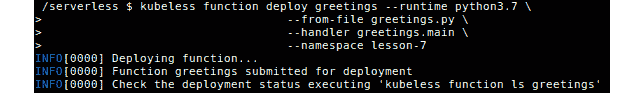

###### 图 7.42：使用 HTTP 触发器执行函数

1.  调用函数并验证函数是否提供了预期的输出：

```
$ kubeless function call greetings --namespace lesson-7
```

一旦调用，屏幕将显示以下内容：


###### 图 7.43：函数输出

1.  现在我们可以为`hello`函数创建`http`触发器：

```
$ kubeless trigger http create greetings \
                       --function-name greetings \
                       --namespace lesson-7
```

结果如下：

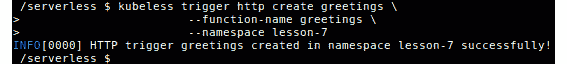

###### 图 7.44：创建 HTTP 触发器

1.  列出`http`触发器；您应该能够看到`hello`函数的`http`触发器：

```
$ kubeless trigger http list --namespace lesson-7
```

列表将看起来像这样：


###### 图 7.45：列出 HTTP 触发器

1.  这将在 Kubernetes 层创建一个`ingress`对象。我们可以使用`kubectl` CLI 列出`ingress`对象：

```
$ kubectl get ingress --namespace lesson-7
```

这将返回以下内容：


###### 图 7.46：列出入口对象

1.  您可以看到带有`.nip.io`域名的主机名，我们可以使用它通过 HTTP 访问`greetings`函数。

在这种情况下，主机名是`greetings.192.168.99.100.nip.io`。一旦在 Web 浏览器中打开此主机名，您应该能够在浏览器窗口中看到问候消息（请注意，根据您的本地时间，您的输出可能会有所不同）：

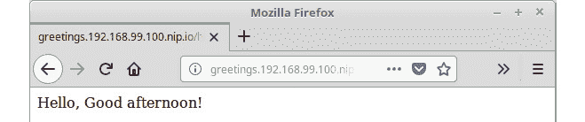

###### 图 7.47：使用 HTTP GET 请求调用函数

## Kubeless PubSub 触发器

Kubeless 函数可以通过向消息系统中的`topics`发送输入消息来调用。这种方法称为 PubSub 机制。目前，Kubeless 支持两种消息系统，即 Kafka 和 NATS。

为了在 Kubeless 中创建 PubSub 触发器，我们需要运行 Kafka 集群或 NATS 集群。一旦 Kafka 或 NATS 集群准备就绪，我们可以使用`kubeless trigger kafka create`来创建 Kafka 触发器，或者使用`kubeless trigger nats create`来创建 NATS 触发器，并将我们的 PubSub 函数与新触发器关联：

```
$ kubeless trigger <trigger-type> create <trigger-name> \
                             --function-selector <label-query> \
                             --trigger-topic <topic-name>
```

让我们讨论命令的每个部分都做了什么：

+   `kubeless trigger <trigger-type> create <trigger-name>`：这告诉 Kubeless 使用提供的名称和触发器类型创建一个 PubSub 触发器。有效的触发器类型是**kafka**和**nats**。

+   `--function-selector <label-query>`：这告诉我们应该将哪个函数与此触发器关联。Kubernetes 标签用于定义这种关系（例如，`--function-selector key1=value1,key2=value2`）。

+   `--trigger-topic <topic-name>`：Kafka 代理将监听此主题，并在向其发布消息时触发函数。

主题是生产者发布消息的地方。Kubeless CLI 允许我们使用`kubeless topic`命令创建主题。这使我们可以轻松地创建、删除、列出主题，并向主题发布消息。

### 练习 23：为 Kubeless 函数创建 PubSub 触发器

在这个练习中，我们将首先在 Minikube 环境中创建一个 Kafka 和 Zookeeper 集群。一旦 Kafka 和 Zookeeper 集群准备就绪，我们将创建一个要执行的函数，并使用 PubSub 触发器。接下来，我们将创建 PubSub 主题。发布消息到创建的主题将执行 Kubeless 函数。执行以下步骤完成练习。

让我们使用 Kafka 的**PubSub**机制调用 Kubeless 函数：

1.  首先，我们将在 Kubernetes 集群中部署**Kafka**和**Zookeeper**：

```
$ kubectl create -f https://github.com/kubeless/kafka-trigger/releases/download/v1.0.2/kafka-zookeeper-v1.0.2.yaml
```

输出将如下所示：

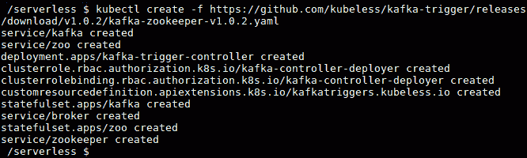

###### 图 7.48：安装 Kafka 和 Zookeeper

1.  验证在`kubeless`命名空间中是否运行了名为`kafka`和`zoo`的两个`statefulset`，用于 Kafka 和 Zookeeper：

```
$ kubectl get statefulset -n kubeless
$ kubectl get services -n kubeless
$ kubectl get deployment -n kubeless
```

将看到以下输出：

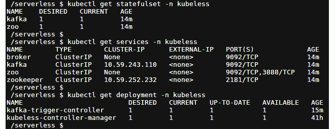

###### 图 7.49：验证 Kafka 和 Zookeeper 安装

1.  一旦我们的 Kafka 和 Zookeeper 部署准备就绪，我们可以创建并部署要由`PubSub`触发器触发的函数。创建一个名为`pubsub.py`的文件，并添加以下内容：

```
def main(event, context): 
    return "Invoked with Kubeless PubSub Trigger"  
```

1.  现在让我们部署我们的函数：

```
$ kubeless function deploy pubsub --runtime python3.7 \
                           --from-file pubsub.py \
                           --handler pubsub.main
```

部署将产生以下结果：

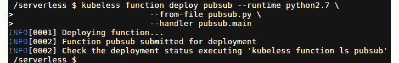

###### 图 7.50：部署 pubsub 函数

1.  一旦函数部署完成，我们可以通过列出函数来验证函数是否成功：

```
$ kubeless function list pubsub 
```

列出的函数将如下所示：

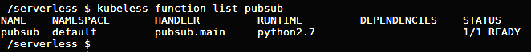

###### 图 7.51：验证 pubsub 函数

1.  现在，让我们使用`kubeless trigger kafka create`命令创建`kafka`触发器，并将我们的`pubsub`函数与新触发器关联起来：

```
$ kubeless trigger kafka create my-trigger \
                             --function-selector function=pubsub \
                             --trigger-topic pubsub-topic
```

它将如下所示：

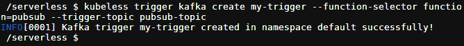

###### 图 7.52：为 pubsub 函数创建 kafka 触发器

1.  现在我们需要一个 Kubeless 主题来发布消息。让我们使用`kubeless topic create`命令创建一个主题。我们需要确保主题名称与我们在上一步中创建`kafka`触发器时提供的`--trigger-topic`相似：

```
$ kubeless topic create pubsub-topic
```

1.  好的。现在是时候测试我们的`pubsub`函数，通过发布事件到`pubsub-topic`来测试：

```
$ kubeless topic publish --topic pubsub-topic --data "My first message"
```

1.  检查`logs`函数以验证`pubsub`函数是否成功调用：

```
$ kubectl logs -l function=pubsub
```

您应该在`output`日志中看到已发布的消息：

```
...
My first message
...
```

要更好地理解这一点，请查看以下输出：

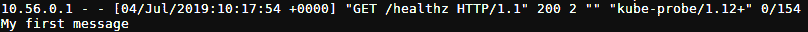

###### 图 7.53：pubsub 函数的日志

## 监视 Kubeless 函数

当我们成功部署了 Kubeless 函数后，我们需要监视我们的函数。可以使用`kubeless function top`命令来实现。此命令将为我们提供以下信息：

+   `NAME`：Kubeless 函数的名称

+   `NAMESPACE`：函数的命名空间

+   `METHOD`：调用函数时的 HTTP 方法类型（例如，GET/POST）

+   `TOTAL_CALLS`：调用次数

+   `TOTAL_FAILURES`：函数失败的次数

+   `TOTAL_DURATION_SECONDS`：此函数执行的总秒数

+   `AVG_DURATION_SECONDS`：此函数执行的平均秒数

+   `MESSAGE`：任何其他消息

以下是`hello`函数的`kubeless function top`输出：

```
$ kubeless function top hello
```

输出将如下所示：

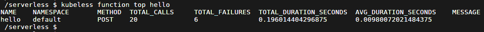

###### 图 7.54：查看 hello 函数的指标

现在我们已经监视了函数，是时候开始调试了。

## 调试 Kubeless 函数

Kubeless 函数可能在函数生命周期的不同阶段失败（例如，从部署时间到函数执行时间），原因有很多。在本节中，我们将调试一个函数，以确定失败的原因。

为了演示多个错误场景，首先，我们将在`debug.py`文件中创建一个包含以下代码块的示例函数：

```
def main(event, context)
    name = event['data']['name']
    return "Hello " +  name
```

**错误场景 01**

现在，让我们尝试使用`kubeless function deploy`命令部署此函数：

```
$ kubeless function deploy debug --runtime python \
                           --from-file debug.py \
                           --handler debug.main
```

这将导致`Invalid runtime error`，Kubeless 将显示支持的运行时。经过进一步检查，我们可以看到`kubeless function deploy`命令的`--runtime`参数中存在拼写错误。

结果输出将如下所示：

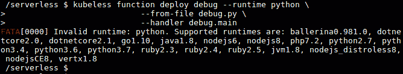

###### 图 7.55：部署调试函数-错误

让我们纠正这个拼写错误，并使用`python3.7`运行时重新运行`kubeless function deploy`命令：

```
$ kubeless function deploy debug --runtime python3.7 \
                           --from-file debug.py \
                           --handler debug.main
```

这次，函数将成功部署到 Kubeless 环境中。它应该看起来像下面这样：

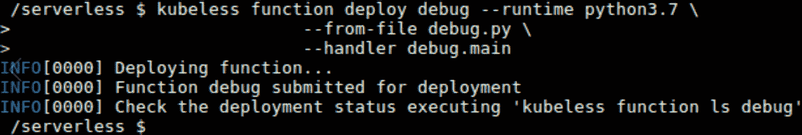

###### 图 7.56：部署 debug 函数-成功

**错误场景 02**

现在，让我们使用`kubeless function ls`命令来检查函数的状态：

```
$ kubeless function ls debug
```

为了更好地理解这一点，请参考以下输出：

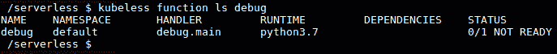

###### 图 7.57：列出 debug 函数

您可以看到状态为`0/1 NOT READY`。现在，让我们使用`kubectl get pods`命令来检查 debug pod 的状态：

```
$ kubectl get pods -l function=debug
```

现在，参考以下截图输出：

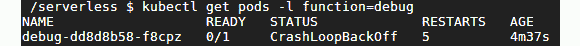

###### 图 7.58：列出 debug 函数 pods

在这里，debug `pod` 处于`CrashLoopBackOff`状态。这种错误通常是由函数中的语法错误或我们指定的依赖关系引起的。

仔细检查后，我们发现函数头部缺少一个冒号（`:`）来标记函数头部的结束。

让我们纠正这个问题并更新我们的函数。

打开`debug.py`文件，在函数头部添加一个冒号：

```
def main(event, context):
    name = event['data']['name']
    return  "Hello " +  name
```

我们现在将执行`kubeless function update`命令来使用新的代码文件更新函数：

```
$ kubeless function update debug --from-file debug.py
```

输出如下：

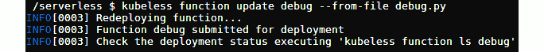

###### 图 7.59：更新 debug 函数

当再次执行`kubeless function ls` debug 时，您应该能够看到函数现在处于`1/1 READY`状态：

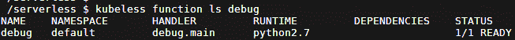

###### 图 7.60：列出 debug 函数

**错误场景 03**

让我们创建一个带有`hello`函数的示例错误场景。为此，您可以通过将`data`部分的键名替换为`username`来调用`hello`函数：

```
$ kubeless function call debug --data '{"username":"Kubeless"}'
```

现在，让我们看看它在屏幕上的样子：

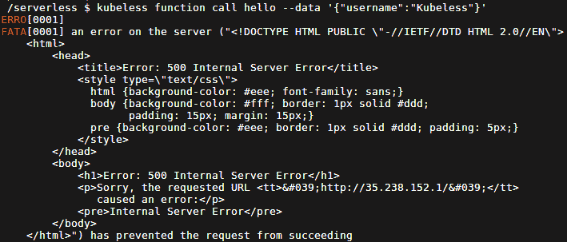

###### 图 7.61：调用 debug 函数-错误

为了找到此失败的可能原因，我们需要检查函数日志。您可以执行`kubeless function logs`命令来查看`hello`函数的日志：

```
$ kubeless function logs debug 
```

输出如下：

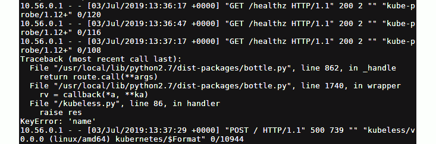

###### 图 7.62：检查 debug 函数日志

输出的前几行显示类似于以下代码块的行，这些是内部健康检查。根据日志，我们可以看到对`/healthz`端点的所有调用都成功返回了`200` HTTP 成功响应代码：

```
10.56.0.1 - - [03/Jul/2019:13:36:17 +0000] "GET /healthz HTTP/1.1" 200 2 "" "kube-probe/1.12+" 0/120
```

接下来，您可以看到错误消息的堆栈跟踪，如下所示，可能的原因是`KeyError: 'name'`错误。函数期望一个`'name'`键，在函数执行期间未找到：

```
Traceback (most recent call last):
  File "/usr/local/lib/python3.7/dist-packages/bottle.py", line 862, in _handle
    return route.call(**args)
  File "/usr/local/lib/python3.7/dist-packages/bottle.py", line 1740, in wrapper
    rv = callback(*a, **ka)
  File "/kubeless.py", line 86, in handler
    raise res
KeyError: 'name'
```

错误消息的最后一行表示函数调用返回了 HTTP 错误`500`：

```
10.56.0.1 - - [03/Jul/2019:13:37:29 +0000] "POST / HTTP/1.1" 500 739 "" "kubeless/v0.0.0 (linux/amd64) kubernetes/$Format" 0/10944
```

#### 注意

`HTTP 500`是 HTTP 协议返回的错误代码，表示**内部服务器错误**。这意味着服务器由于意外情况而无法满足请求。

除了`kubeless function logs`之外，您还可以使用`kubectl logs`命令，它将返回类似的输出。您需要传递`-l`参数，表示标签，以便仅获取特定函数的日志：

```
$ kubectl logs -l function=hello
```

以下将是输出：

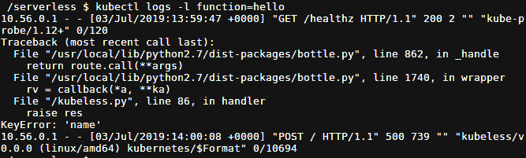

###### 图 7.63：检查调试函数日志

使用`kubectl get functions --show-labels`命令查看与 Kubeless 函数关联的标签。

这将产生以下结果：


###### 图 7.64：列出函数标签

让我们纠正错误，并向`debug`函数传递正确的参数：

```
$ kubeless function call debug --data '{"name":"Kubeless"}'
```

现在我们的函数已成功运行，并生成了`Hello Kubeless`作为其输出：

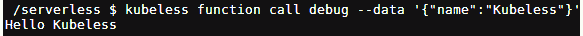

###### 图 7.65：调用调试函数-成功

## Kubeless 的 Serverless 插件

Serverless Framework 是一个通用的框架，用于在不同的无服务器提供商上部署无服务器应用程序。Kubeless 的无服务器插件支持部署 Kubeless 函数。除了 Kubeless 的插件之外，Serverless Framework 还支持 AWS Lambda、Azure Functions、Google Cloud Functions、Apache OpenWhisk 和 Kubeless 等无服务器应用程序。

在本节中，我们将安装无服务器框架，并使用无服务器框架提供的 CLI 创建 Kubeless 函数。

在我们开始安装无服务器框架之前，我们需要安装 Node.js 版本 6.5.0 或更高版本作为先决条件。所以，首先让我们安装 Node.js：

```
$ curl -sL https://deb.nodesource.com/setup_12.x | sudo -E bash -
$ sudo apt-get install nodejs -y
```

输出如下：

图 7.66：安装 Node.js 版本 6.5.0

](image/C12607_07_66.jpg)

###### 图 7.66：安装 Node.js 版本 6.5.0

安装后，通过执行以下命令验证 Node.js 版本：

```
$ nodejs -v
```

以下是输出：


###### 图 7.67：Node.js 版本验证

一旦 Node.js 安装成功，我们将通过执行以下命令安装 Serverless 框架：

```
$ sudo npm install -g serverless
```

接下来，我们将验证 serverless 版本：

```
$ serverless -v
```

检查输出，如下所示：


###### 图 7.68：Serverless 版本验证

我们已经成功完成了 Serverless 框架的安装。现在我们可以开始使用它创建函数。

我们可以使用`serverless create`命令从模板创建一个基本服务。让我们创建一个名为`my-kubeless-project`的项目，如下所示：

```
$ serverless create --template kubeless-python --path my-kubeless-project
```

让我们把命令拆分成几部分以便理解：

+   `--template kubeless-python`：目前，Kubeless 框架有两个模板可用。`kubeless-python`创建一个 Python 函数，`kubeless-nodejs`创建一个 Node.js 函数。

+   `--path my-kubeless-project`：这定义了该函数应该在`my-kubeless-project`目录下创建。查看输出以更好地理解它：

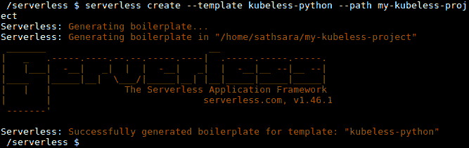

###### 图 7.69：创建 my-kubeless-project

这个命令将创建一个名为`my-kubeless-project`的目录，并在该目录中创建几个文件。首先，让我们通过执行以下命令进入`my-kubeless-project`目录：

```
$ cd my-kubeless-project
```

以下文件位于`my-kubeless-project`目录中：

+   handler.py

+   serverless.yml

+   package.json

`handler.py`文件包含一个示例 Python 函数，如下所示。这是一个简单的函数，返回一个 JSON 对象和状态码 200：

```
import json
def hello(event, context):
    body = {
        "message": "Go Serverless v1.0! Your function executed successfully!",
        "input": event['data']
    }
    response = {
        "statusCode": 200,
        "body": json.dumps(body)
    }
    return response
```

它还创建了一个`serverless.yml`文件，告诉 serverless 框架在`handler.py`文件中执行`hello`函数。在`provider`部分中，提到这是一个带有`python2.7`运行时的 Kubeless 函数。在`plugins`部分中，它定义了所需的自定义插件，比如`serverless-kubeless`插件：

```
# Welcome to Serverless!
#
# For full config options, check the kubeless plugin docs:
#    https://github.com/serverless/serverless-kubeless
#
# For documentation on kubeless itself:
#    http://kubeless.io
# Update the service name below with your own service name
service: my-kubeless-project
# Please ensure the serverless-kubeless provider plugin is installed globally.
# $ npm install -g serverless-kubeless
#
# ...before installing project dependencies to register this provider.
# $ npm install
provider:
  name: kubeless
  runtime: python2.7
plugins:
  - serverless-kubeless
functions:
  hello:
    handler: handler.hello
```

最后，`package.json`文件包含了`npm`打包信息，比如`dependencies`：

```
{
  "name": "my-kubeless-project",
  "version": "1.0.0",
  "description": "Sample Kubeless Python serverless framework service.",
  "dependencies": {
    "serverless-kubeless": "⁰.4.0"
  },
  "scripts": {
    "test": "echo \"Error: no test specified\" && exit 1"
  },
  "keywords": [
    "serverless",
    "kubeless"
  ],
  "author": "The Kubeless Authors",
  "license": "Apache-2.0"
}
```

您可以根据需要更新这些文件以匹配您的业务需求。在本例中，我们不会更改这些文件。

现在，我们将执行`npm install`命令，安装所有`npm`依赖，比如`kubeless-serverless`插件：

```
$ npm install
```

这个输出如下：

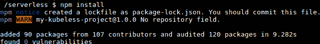

###### 图 7.70：安装 npm 依赖项

一旦依赖项准备好，让我们部署服务：

```
$ serverless deploy -v
```

部署服务会为我们提供以下输出：

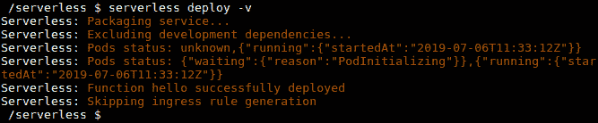

###### 图 7.71：部署服务

然后，我们可以使用以下命令部署函数：

```
$ serverless deploy function -f hello
```

以下截图显示了输出：


###### 图 7.72：部署函数

当函数成功部署后，我们可以使用`serverless invoke`命令调用函数：

```
$ serverless invoke --function hello -l
```

调用函数会产生以下输出：

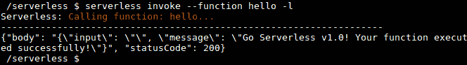

###### 图 7.73：调用函数

您还可以使用`kubeless function call`命令来调用此函数：

```
$ kubeless function call hello
```

这样做将提供以下输出：

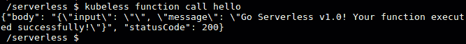

###### 图 7.74：使用 kubeless 函数调用来调用函数

完成函数后，使用`serverless remove`来删除函数。

```
$ serverless remove
```

以下是前面代码的输出：


###### 图 7.75：删除函数

#### 注意

如果在调用函数时遇到任何错误，请执行`serverless logs -f hello`命令。

### 活动 7：使用 Kubeless 向 Slack 发布消息

想象一下，您需要一个 Slackbot 来向您的 Slack 频道发布消息。这个 Slackbot 应该能够使用传入的 webhook 集成方法向特定的 Slack 频道发布消息。如果成功向 Slack 发布消息，此机器人将打印成功消息；否则，如果在向 Slack 发送消息时出现任何错误，它将打印错误消息。在这个活动中，我们将创建一个能够向特定 Slack 频道发布消息的 Kubeless 函数。

作为此活动的先决条件，我们需要一个 Slack 工作区，并集成传入的 webhook。执行以下步骤创建一个 Slack 工作区并集成传入的 webhook：

**解决方案-Slack 设置**

1.  创建一个 Slack 工作区。

1.  访问[`slack.com/create`](https://slack.com/create)创建一个工作区。输入您的电子邮件地址，然后单击**创建**。

1.  您应该收到一个六位数的确认码，发送到您在上一页输入的电子邮件中。在工作区中输入收到的代码。

1.  为我们的工作区和 Slack 频道添加合适的名称。

1.  您将被要求填写其他与您合作在同一项目上的人的电子邮件 ID。您可以跳过此部分，或者填写详细信息然后继续。

1.  现在您的 Slack 频道已准备就绪，请点击“在 Slack 中查看您的频道”。

1.  一旦点击，我们应该看到我们的频道。

1.  现在我们将向 Slack 添加`Incoming Webhook`应用程序。从左侧菜单中，在“应用程序”部分下选择“添加应用程序”。

1.  在搜索字段中输入“传入 Webhooks”，然后点击“安装”以安装`Incoming Webhook`应用程序。

1.  点击“添加配置”。

1.  点击“添加传入 WebHooks 集成”。

1.  保存 webhook URL。在编写 Kubeless 函数时，我们会需要它。

#### 注意

有关使用传入 webhook 集成创建 Slack 工作区的详细步骤，以及相应的屏幕截图，请参阅第 422 页。

现在我们准备开始这项活动。执行以下步骤完成此活动：

**活动解决方案**

1.  在任何语言中创建一个函数（由 Kubeless 支持），可以将消息发布到 Slack。在这个活动中，我们将编写一个 Python 函数，执行以下步骤。

1.  使用`requests`库作为依赖项。

1.  向传入的 webhook（在步骤 2 中创建）发送一个`POST`请求，带有输入消息。

1.  打印 post 请求的响应，

1.  将该函数部署到 Kubeless 框架中。

1.  调用该函数。

1.  转到您的 Slack 工作区，验证消息是否成功发布到 Slack 频道。最终输出应如下所示：


###### 图 7.76：验证消息是否成功发布

#### 注意

活动的解决方案可以在第 422 页找到。

## 摘要

在本章中，我们学习了如何使用 Minikube 部署单节点 Kubernetes 集群。然后，我们在 Minikube 集群上安装了 Kubeless 框架、Kubeless CLI 和 Kubeless UI。一旦 Kubernetes 集群和 Kubeless 框架准备就绪，我们就用 Python 创建了我们的第一个 Kubeless 函数，并将其部署到 Kubeless 上。然后，我们讨论了多种调用 Kubeless 函数的方式，包括使用 Kubeless CLI、Kubeless UI、HTTP 触发器、定时触发器和 PubSub 触发器。接下来，我们讨论了在部署 Kubeless 函数时遇到的常见错误场景的调试方法。然后，我们讨论了如何使用无服务器框架部署 Kubeless 函数。最后，在活动中，我们学习了如何使用 Kubeless 函数向 Slack 频道发送消息。

在下一章中，我们将介绍 OpenWhisk，并涵盖 OpenWhisk 动作和触发器。
