# 第八章：8\. Apache OpenWhisk 简介

## 学习目标

在本章结束时，您将能够：

+   在 IBM Cloud Functions 中运行 OpenWhisk

+   创建、列出、调用、更新和删除 OpenWhisk 操作

+   利用和调用 OpenWhisk web 操作和序列

+   使用 feeds、触发器和规则自动化 OpenWhisk 操作调用

本章涵盖了 Apache OpenWhisk 以及如何处理其操作、触发器和包。

## OpenWhisk 简介

到目前为止，在本书中，我们已经了解了**Kubeless**框架，这是一个开源的基于 Kubernetes 的无服务器框架。我们讨论了**Kubeless**架构，并创建并使用了**Kubeless**函数和触发器。在本章中，我们将学习**OpenWhisk**，这是另一个可以部署在 Kubernetes 之上的开源无服务器框架。

**OpenWhisk**是 Apache 软件基金会的一部分的开源无服务器框架。最初在 IBM 开发，项目代号为 Whisk，后来在源代码开源后更名为**OpenWhisk**。**Apache OpenWhisk**支持许多编程语言，包括 Ballerina、Go、Java、JavaScript、PHP、Python、Ruby、Swift 和.NET Core。它允许我们调用用这些编程语言编写的函数来响应事件。OpenWhisk 支持许多部署选项，例如本地部署和云基础设施。

OpenWhisk 有四个核心组件：

+   **Actions**：这些包含用支持的语言编写的应用程序逻辑，将在响应事件时执行。

+   **序列**：这些将多个操作链接在一起，以创建更复杂的处理流水线。

+   **触发器和规则**：这些通过将它们绑定到外部事件源来自动调用操作。

+   **Packages**：这些将相关的操作组合在一起进行分发。

以下图表说明了这些组件如何相互交互：

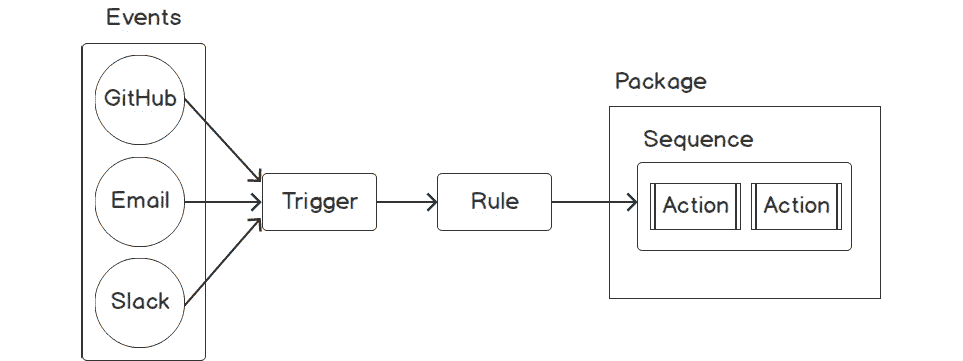

###### 图 8.1：OpenWhisk 核心组件

在下一节中，我们将学习如何在 IBM Cloud Functions 中运行 Apache OpenWhisk。

## 在 IBM Cloud Functions 中运行 OpenWhisk

OpenWhisk 是一个可以部署在本地或云基础设施上的框架。然而，OpenWhisk 也可以作为 IBM 的托管服务提供，IBM 是 OpenWhisk 项目的创建者。**IBM Cloud Functions**是 IBM Cloud 基础设施上托管 OpenWhisk 实现的名称。本书将使用此服务来部署我们的无服务器函数，因为 IBM Cloud Functions 是开始使用 OpenWhisk 的最简单方式。我们首先要设置一个 IBM Cloud 账户。

### 练习 24：设置 IBM Cloud 账户

在这个练习中，我们将在 IBM Cloud 上设置一个账户。

#### 注意

注册 IBM Cloud 不需要信用卡。

以下步骤将帮助您完成练习：

1.  首先，我们需要在 IBM Cloud 上注册[`cloud.ibm.com/registration`](https://cloud.ibm.com/registration)。然后，填写必需的数据并提交表单。它应该类似于以下截图：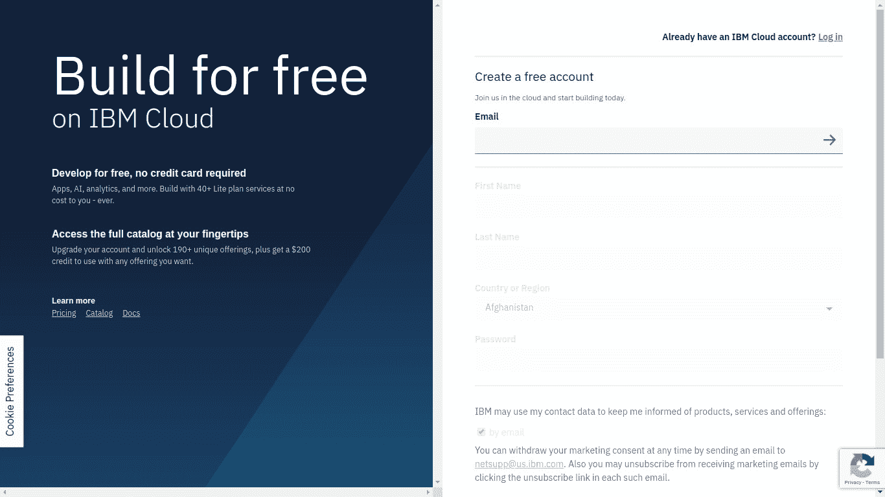

###### 图 8.2：IBM Cloud 注册页面

注册完成后，您应该会看到以下内容：

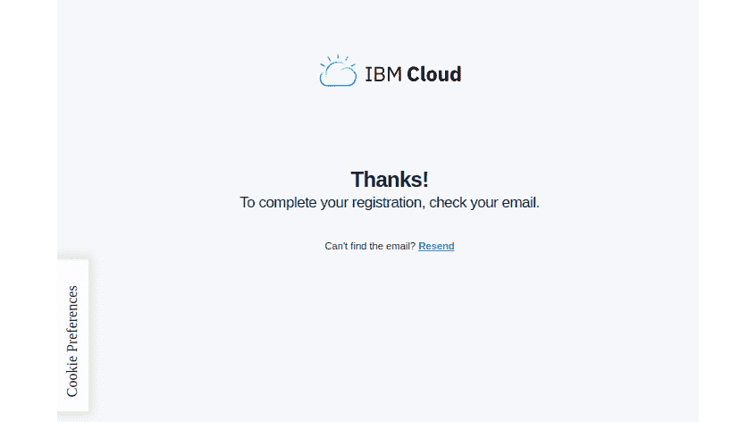

###### 图 8.3：IBM Cloud 注册完成页面

1.  此时，我们将收到一封带有激活链接的电子邮件。点击**确认账户**按钮来激活您的账户，如下图所示：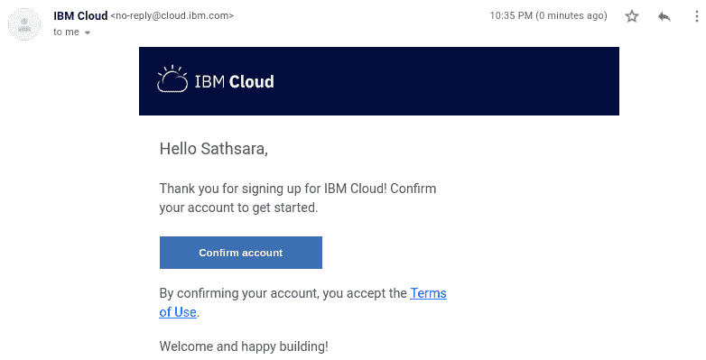

###### 图 8.4：IBM Cloud 激活邮件

1.  当您点击邮件中的**确认账户**按钮时，我们将被带到 IBM Cloud 欢迎页面。点击**登录**按钮，使用注册 IBM Cloud 时使用的凭据登录，如下图所示：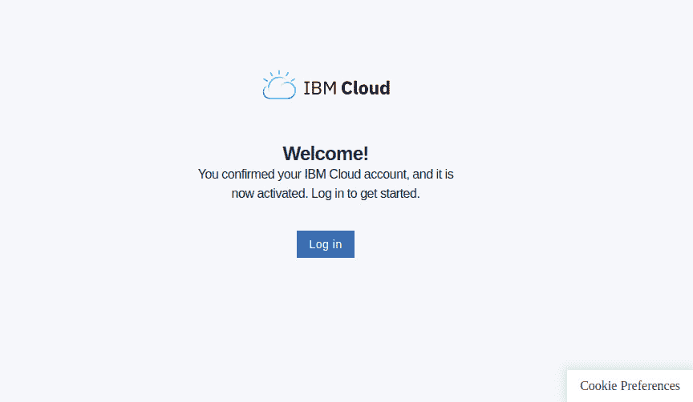

###### 图 8.5：IBM Cloud 欢迎页面

1.  通过点击**继续**按钮来确认隐私数据，如下图所示：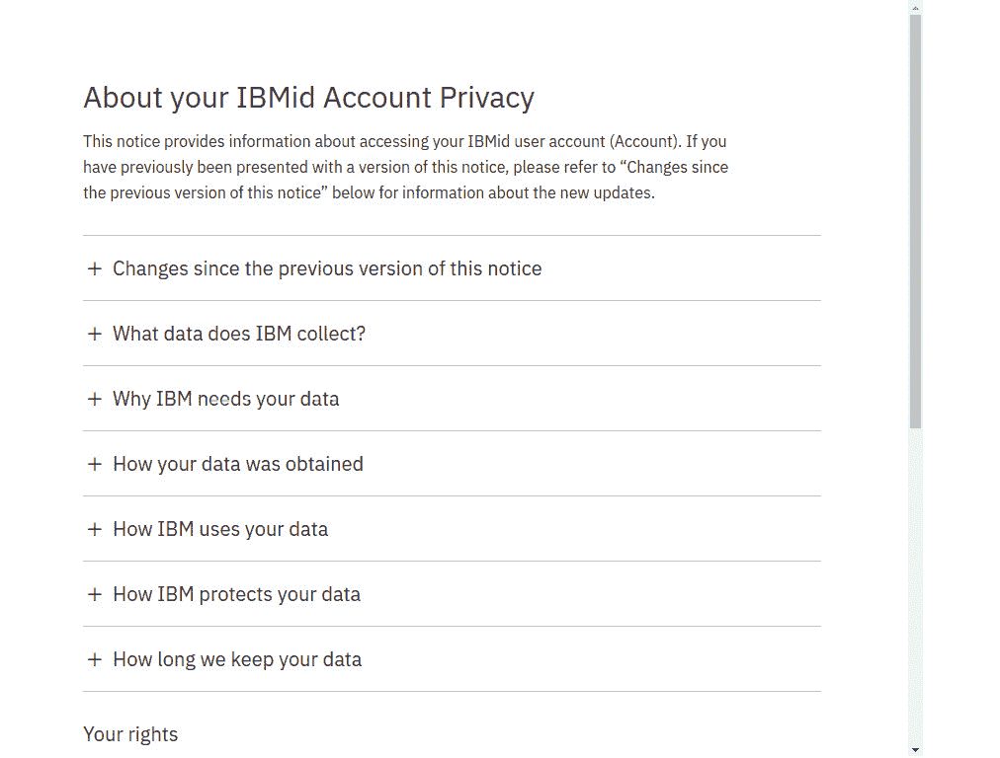

###### 图 8.6：IBM Cloud 隐私政策

1.  您可以跳过介绍视频，然后转到首页。现在，您可以点击屏幕左上角的**汉堡包**图标（），然后从菜单中选择**函数**，如下图所示：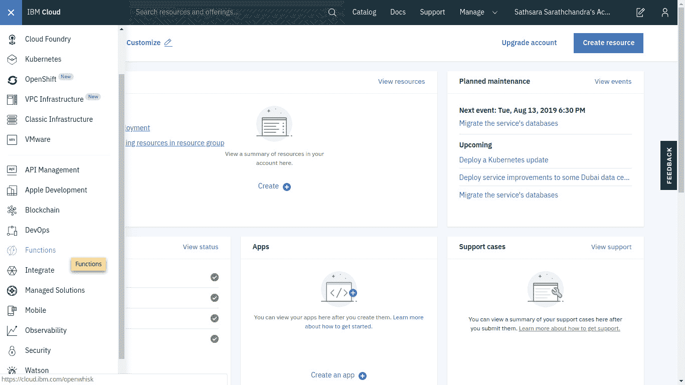

###### 图 8.7：IBM Cloud 首页

1.  这将带您到**IBM Cloud**函数页面（https://cloud.ibm.com/functions/），如下图所示：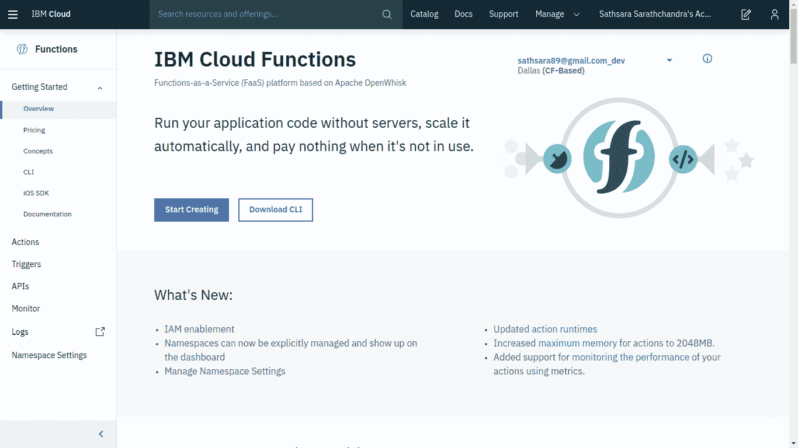

###### 图 8.8：IBM Cloud 函数页面

OpenWhisk 提供了一个名为`wsk`的 CLI 来创建和管理 OpenWhisk 实体。接下来，我们将安装**OpenWhisk CLI**，它将用于与 OpenWhisk 平台交互。

### 练习 25：安装 IBM Cloud CLI

在这个练习中，我们将安装带有 Cloud Functions 插件的 IBM Cloud CLI，该插件支持 OpenWhisk：

1.  首先，我们需要下载压缩的 IBM Cloud CLI 文件。使用`curl`命令和`-Lo`标志下载 CLI，如下所示：

```
$ curl -Lo ibm-cli.tar.gz  https://clis.cloud.ibm.com/download/bluemix-cli/0.18.0/linux64 
```

输出应如下所示：

图 8.9：下载 IBM Cloud CLI

](image/C12607_08_09.jpg)

###### 图 8.9：下载 IBM Cloud CLI

1.  接下来，我们将使用`tar`命令提取`tar.gz`文件，如下所示：

```
$ tar zxvf ibm-cli.tar.gz
```

输出应如下所示：

图 8.10：提取 IBM Cloud CLI

](image/C12607_08_10.jpg)

###### 图 8.10：提取 IBM Cloud CLI

1.  然后将`ibmcloud`可执行文件移动到`/usr/local/bin/`路径，如下命令所示：

```
$ sudo mv Bluemix_CLI/bin/ibmcloud /usr/local/bin/ibmcloud
```

输出应如下所示：

图 8.11：将 ibmcloud 移动到/usr/local/bin

](image/C12607_08_11.jpg)

###### 图 8.11：将 ibmcloud 移动到/usr/local/bin

1.  现在我们将使用 IBM Cloud CLI 登录 IBM Cloud。执行以下命令，将`<YOUR_EMAIL>`替换为注册 IBM Cloud 时使用的电子邮件地址。在提示时提供注册阶段使用的电子邮件和密码，并将区域号设置为**5**（**us-south**），如下命令所示：

```
$ ibmcloud login -a cloud.ibm.com -o "<YOUR_EMAIL>" -s "dev"
```

输出应如下所示：

图 8.12：登录 IBM Cloud

](image/C12607_08_12.jpg)

###### 图 8.12：登录 IBM Cloud

1.  现在我们将使用`ibmcloud` CLI 安装 Cloud Functions 插件，如下命令所示。在处理 OpenWhisk 实体时，将使用此插件：

```
$ ibmcloud plugin install cloud-functions
```

输出应如下所示：

图 8.13：安装 Cloud Functions

](image/C12607_08_13.jpg)

###### 图 8.13：安装 Cloud Functions

1.  接下来，我们将使用以下命令提供目标组织（组织名称为您的电子邮件地址）和空间（默认为`dev`）：

```
$ ibmcloud target -o <YOUR_EMAIL> -s dev
```

输出应如下所示：

图 8.14：设置目标组织和空间

](image/C12607_08_14.jpg)

###### 图 8.14：设置目标组织和空间

1.  现在配置完成了。我们可以使用`ibmcloud wsk`与 OpenWhisk 实体交互，如下命令所示：

```
$ ibmcloud wsk action list
```

输出应如下所示：


###### 图 8.15：列出 OpenWhisk 操作

#### 注意

在本书中，我们将使用`wsk`命令来管理 OpenWhisk 实体，而不是 IBM Cloud Functions 提供的`ibmcloud wsk`命令。它们两者提供相同的功能。唯一的区别是`wsk`是 OpenWhisk 的标准 CLI，而`ibmcloud fn`来自 IBM Cloud Functions 插件。

1.  让我们创建一个 Linux 别名，`wsk="ibmcloud wsk"`。首先，用您喜欢的文本编辑器打开`~/.bashrc`文件。在下面的命令中，我们将使用`vim`文本编辑器打开文件：

```
vim ~/.bashrc
```

在文件末尾添加以下行：

```
alias wsk="ibmcloud wsk"
```

1.  源`~/.bashrc`文件以应用更改，如下命令所示：

```
$ source ~/.bashrc
```

输出应该如下：


###### 图 8.16：获取 bashrc 文件

1.  现在我们应该能够使用`wsk`命令调用 OpenWhisk。执行以下命令以验证安装：

```
$ wsk --help
```

这将打印`wsk`命令的帮助页面，如下图所示：

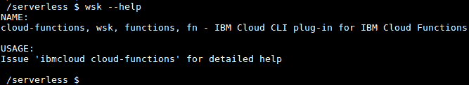

###### 图 8.17：wsk 命令的输出

现在，让我们继续进行下一节关于 OpenWhisk 动作的部分。

## OpenWhisk 动作

在 OpenWhisk 中，动作是由开发人员编写的代码片段，将在响应事件时执行。这些动作可以用 OpenWhisk 支持的任何编程语言编写：

+   Ballerina

+   Go

+   Java

+   JavaScript

+   PHP

+   Python

+   Ruby

+   Swift

+   .NET Core

此外，如果我们喜欢的语言运行时尚未得到 OpenWhisk 的支持，我们可以使用自定义的 Docker 镜像。这些动作将接收一个 JSON 对象作为输入，然后在动作内执行必要的处理，最后返回一个包含处理结果的 JSON 对象。在接下来的章节中，我们将重点介续如何使用`wsk` CLI 编写、创建、列出、调用、更新和删除 OpenWhisk 动作。

### 为 OpenWhisk 编写动作

在使用您喜欢的语言编写 OpenWhisk 动作时，有一些标准必须遵循。它们如下：

+   每个动作应该有一个名为`main`的函数，这是动作的入口点。源代码可以有额外的函数，但一旦触发动作，`main`函数将被执行。

+   函数必须返回一个 JSON 对象作为响应。

#### 注意

在本章中，我们将主要使用 JavaScript 来创建函数代码。

让我们看一个例子，我们创建一个符合我们刚才提到的规则的 JavaScript 代码（`random-number.js`）。这是一个简单的函数，它生成 0 到 1 之间的随机数，并将生成的数字作为函数的响应返回：

```
function main() {
    var randomNumber = Math.random();
    return { number: randomNumber };
} 
```

这是一个符合规则的 PHP 函数：

```
<?php
function main()
{
    $randomNumber = rand();
    return ["number" => $randomNumber];
}
```

### 在 OpenWhisk 框架上创建操作

现在是时候使用在上一节中编写的操作代码在 OpenWhisk 框架上创建一个操作了。我们将使用`wsk action create`命令，其格式如下：

```
$ wsk action create <action-name> <action-file-name>
```

`<action-name>`是操作的标识符。它应该是唯一的，以防止命名冲突。`<action-file-name>`是包含操作源代码的文件。让我们执行以下命令，使用`random-number.js`文件中的操作源代码创建一个名为`randomNumber`的 OpenWhisk 操作：

```
$ wsk action create randomNumber random-number.js
```

我们从这个命令接收到的输出如下所示：

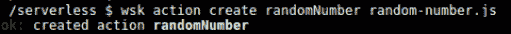

###### 图 8.18：创建一个 randomNumber 操作

正如我们在输出中看到的，每当成功创建一个操作时，CLI 提示都会适当地通知读者操作的状态。

OpenWhisk 框架将根据源代码文件的扩展名确定执行操作的运行时。在前面的场景中，将为提供的`.js`文件选择 Node.js `10`运行时。如果要覆盖 OpenWhisk 框架选择的默认运行时，可以在`wsk action create`命令中使用`--kind`标志：

```
 $ wsk action create secondRandomNumber random-number.js --kind nodejs:8
```

输出应该如下所示：

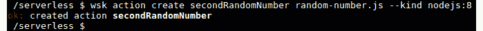

###### 图 8.19：使用 nodejs:8 运行时创建一个 randomNumber 操作

前面的输出表明`secondRandomNumber`已成功创建。在本节结束时，我们已部署了两个 OpenWhisk 操作。

学会了如何在 OpenWhisk 框架上创建操作后，接下来我们将继续列出 OpenWhisk 操作。

### 列出 OpenWhisk 操作

在本节中，我们将使用以下命令在我们的环境中使用`wsk` CLI 列出 OpenWhisk 操作：

```
$ wsk action list
```

输出应该如下所示：

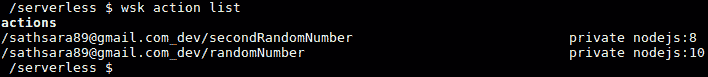

###### 图 8.20：列出所有操作

从上述输出中，我们可以看到我们之前创建的两个操作，名称分别为`randomNumber`和`secondRandomNumber`。`wsk action list`命令列出操作及其运行时，如`nodejs:8`或`nodejs:10`。默认情况下，操作列表将根据最后更新时间进行排序，因此最近更新的操作将位于列表顶部。如果我们希望列表按字母顺序排序，可以使用`--name-sort`（或`-n`）标志，如下所示：

```
$ wsk action list --name-sort
```

输出应该如下所示：


###### 图 8.21：按名称升序列出所有操作

### 调用 OpenWhisk 操作

现在我们的操作已经准备好被调用了。OpenWhisk 操作可以通过`wsk` CLI 以两种方式被调用：

+   请求-响应

+   触发-忘记

**请求-响应**方法是同步的；操作调用将等待结果可用。另一方面，**触发-忘记**方法是异步的。这将返回一个称为激活 ID 的 ID，稍后可以用来获取结果。

以下是调用操作的`wsk`命令的标准格式：

```
$ wsk action invoke <action-name> 
```

**请求-响应调用方法**

在**请求-响应**方法中，`wsk action invoke`命令与`--blocking`（或`-b`）标志一起使用，该标志要求`wsk` CLI 等待调用结果：

```
$ wsk action invoke randomNumber --blocking 
```

上述命令将在终端中返回以下输出，其中包含从方法返回的结果以及有关方法调用的其他元数据：

```
ok: invoked /_/randomNumber with id 002738b1acee4abba738b1aceedabb60
{
    "activationId": "002738b1acee4abba738b1aceedabb60",
    "annotations": [
        {
            "key": "path",
            "value": "your_email_address_dev/randomNumber"
        },
        {
            "key": "waitTime",
            "value": 79
        },
        {
            "key": "kind",
            "value": "nodejs:10"
        },
        {
            "key": "timeout",
            "value": false
        },
        {
            "key": "limits",
            "value": {
                "concurrency": 1,
                "logs": 10,
                "memory": 256,
                "timeout": 60000
            }
        },
        {
            "key": "initTime",
            "value": 39
        }
    ],
    "duration": 46,
    "end": 1564829766237,
    "logs": [],
    "name": "randomNumber",
    "namespace": "your_email_address_dev",
    "publish": false,
    "response": {
        "result": {
            "number": 0.6488215545330562
        },
        "status": "success",
        "success": true
    },
    "start": 1564829766191,
    "subject": "your_email_address",
    "version": "0.0.1"
}
```

我们可以在返回的 JSON 对象的`response`部分中看到输出(`"number": 0.6488215545330562`)，这是我们之前编写的 JavaScript 函数生成的随机数。返回的 JSON 对象包含一个激活 ID(`"activationId": "002738b1acee4abba738b1aceedabb60")`，我们可以稍后用来获取结果。此输出包括其他重要值，如操作调用状态(`"status": "success"`)，开始时间(`"start": 156482976619`)，结束时间(`"end": 1564829766237`)和执行持续时间(`"duration": 46`)。

#### 注意

我们将讨论如何在**触发-忘记调用方法**部分使用`activationId`获取激活结果。

如果我们需要获取动作的结果而不包括其他元数据，可以使用`--result`（或`-r`）标志，如下面的代码所示：

```
$ wsk action invoke randomNumber --result 
```

输出应该如下：

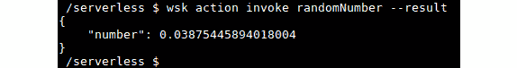

###### 图 8.22：使用请求和响应方法调用 randomNumber 动作

**点火和忘记调用方法**

使用**点火和忘记**方法的动作调用不会等待动作的结果。相反，它们返回一个激活 ID，我们可以使用它来获取动作的结果。这种调用方法使用类似的命令来请求响应方法，但没有`--blocking`（或`-b`）标志：

```
$ wsk action invoke randomNumber 
```

输出应该如下：

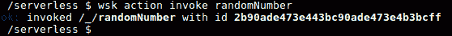

###### 图 8.23：使用点火和忘记方法调用 randomNumber 动作

在上述结果中，我们可以看到返回的激活 ID 为`2b90ade473e443bc90ade473e4b3bcff`（请注意，您的激活 ID 将不同）。

现在我们可以使用`wsk activation get`命令获取给定激活 ID 的结果：

```
$ wsk activation get "<activation_id>"
```

您需要用`wsk action invoke`命令调用函数时返回的值替换`<activation_id>`：

```
$ wsk activation get 2b90ade473e443bc90ade473e4b3bcff
ok: got activation 2b90ade473e443bc90ade473e4b3bcff
{
    "namespace": "sathsara89@gmail.com_dev",
    "name": "randomNumber",
    "version": "0.0.2",
    "subject": "sathsara89@gmail.com",
    "activationId": "2b90ade473e443bc90ade473e4b3bcff",
    "start": 1564832684116,
    "end": 1564832684171,
    "duration": 55,
    "statusCode": 0,
    "response": {
        "status": "success",
        "statusCode": 0,
        "success": true,
        "result": {
            "number": 0.05105974715780626
        }
    },
    "logs": [],
    "annotations": [
        {
            "key": "path",
            "value": "sathsara89@gmail.com_dev/randomNumber"
        },
        {
            "key": "waitTime",
            "value": 126
        },
        {
            "key": "kind",
            "value": "nodejs:10"
        },
        {
            "key": "timeout",
            "value": false
        },
        {
            "key": "limits",
            "value": {
                "concurrency": 1,
                "logs": 10,
                "memory": 256,
                "timeout": 60000
            }
        },
        {
            "key": "initTime",
            "value": 41
        }
    ],
    "publish": false
}
```

如果您希望仅检索激活的摘要，应该在`wsk activation get`命令中提供`--summary`（或`-s`）标志：

```
$ wsk activation get <activation-id> --summary
```

上述命令的输出将打印激活详细信息的摘要，如下面的截图所示：

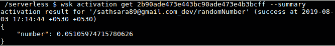

###### 图 8.24：激活摘要

`wsk activation result`命令仅返回动作的结果，省略任何元数据：

```
$ wsk activation result <activation-id> 
```

输出应该如下：

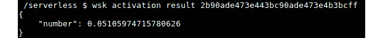

###### 图 8.25：激活结果

`wsk activation list`命令可用于列出所有激活：

```
$ wsk activation list 
```

输出应该如下：

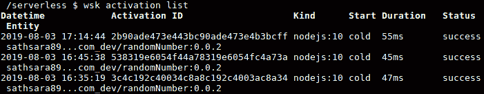

###### 图 8.26：列出激活

上述命令返回按激活的**日期时间**排序的激活列表。以下表格描述了每列提供的信息：

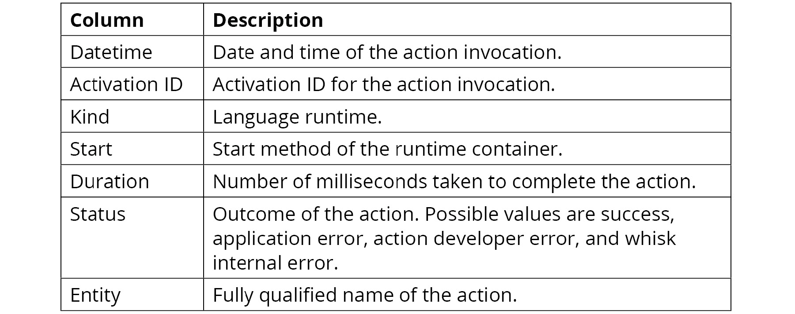

###### 图 8.27：列描述

### 更新 OpenWhisk 操作

在本节中，我们将学习如何在 OpenWhisk 平台上创建操作后更新操作的源代码。我们可能希望出于几个原因更新操作。代码中可能存在错误，或者我们可能只是想增强代码。可以使用`wsk action update`命令使用`wsk` CLI 来更新 OpenWhisk 操作：

```
$ wsk action update <action-name> <action-file-name>
```

我们已经有一个打印随机数的操作，它在`random-number.js`函数中定义。这个函数打印一个 0 到 1 之间的值，但是如果我们想要打印一个 1 到 100 之间的随机数呢？现在可以使用以下代码来实现：

```
function main() {
    var randomNumber = Math.floor((Math.random() * 100) + 1);
    return { number: randomNumber };
} 
```

然后，我们可以执行`wsk action update`命令来更新`randomNumber`操作：

```
$ wsk action update randomNumber random-number.js
```

输出应该如下：

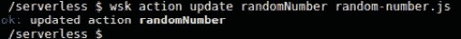

###### 图 8.28：更新 randomNumber 操作

现在我们可以通过执行以下命令来验证更新后操作的结果：

```
$ wsk action invoke randomNumber --result
```


###### 图 8.29：调用 randomNumber 操作

正如我们所看到的，`randomNumber`操作返回了 1 到 100 之间的数字。我们可以多次调用`randomNumber`函数来验证它是否返回 1 到 100 之间的输出数字。

### 删除 OpenWhisk 操作

在本节中，我们将讨论如何删除 OpenWhisk 操作。使用`wsk action delete`命令来删除 OpenWhisk 操作：

```
$ wsk action delete <action-name> 
```

让我们执行`wsk action delete`命令来删除我们在前面部分创建的`randomNumber`和`secondRandomNumber`操作：

```
$ wsk action delete randomNumber 
$ wsk action delete secondRandomNumber 
```

输出应该如下：

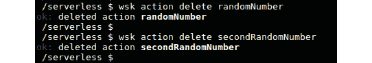

###### 图 8.30：删除 randomNumber 和 secondRandomNumber 操作

现在我们已经学会了如何编写、创建、列出、调用、更新和删除 OpenWhisk 操作。让我们继续进行一个练习，在这个练习中，您将创建您的第一个 OpenWhisk 操作。

### 练习 26：创建您的第一个 OpenWhisk 操作

在这个练习中，我们将首先创建一个 JavaScript 函数，该函数接收考试分数作为输入，并根据以下标准返回考试结果：

+   如果分数等于或高于 60，则返回`Pass`。

+   如果分数低于 60，则返回`Fail`。

接下来，我们将在 OpenWhisk 框架中创建一个名为`examResults`的操作，使用先前提到的 JavaScript 函数代码。然后，我们将调用该操作以验证它是否按预期返回结果。一旦验证了操作的响应，我们将根据以下标准更新操作以返回考试成绩与结果：

+   如果分数等于或高于 80，则返回`Pass with grade A`。

+   如果分数等于或高于 70，则返回`Pass with grade B`。

+   如果分数等于或高于 60，则返回`Pass with grade C`。

+   如果分数低于 60，则返回`Fail`。

再次，我们将调用该动作以验证结果，最后删除该动作。

#### 注意

此练习的代码文件可以在[`github.com/TrainingByPackt/Serverless-Architectures-with-Kubernetes/tree/master/Lesson08/Exercise26`](https://github.com/TrainingByPackt/Serverless-Architectures-with-Kubernetes/tree/master/Lesson08/Exercise26)找到。

执行以下步骤完成练习：

1.  首先，在`exam-result.js`文件中创建一个 JavaScript 函数，根据提供的考试分数返回考试结果：

```
function main(params) {
    var examResult = '';
    if (params.examMarks < 0 || params.examMarks > 100) {
        examResult = 'ERROR: invalid exam mark';
    } else if (params.examMarks >= 60) {
        examResult = 'Pass';
    } else {
      examResult = 'Fail';
    }

    return { result: examResult };
}
```

1.  现在，让我们从*步骤 1*中创建的`exam-result.js`文件中创建名为`examResult`的 OpenWhisk 动作：

```
$ wsk action create examResult exam-result.js
```

输出应该如下：

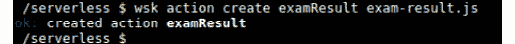

###### 图 8.31：创建 examResult 动作

1.  一旦动作创建成功，我们可以通过将值发送到`examMarks`参数来调用`examResult`动作，值的范围在 0 到 100 之间：

```
$ wsk action invoke examResult --param examMarks 72 –result
```

输出应该如下：

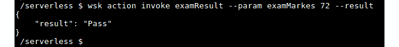

###### 图 8.32：调用 examResult 动作

1.  在这一步，我们将在`exam-result-02.js`中创建一个新的 JavaScript 函数，以`grade`参数返回考试结果：

```
function main(params) {
    var examResult = '';
    if (params.examMarks < 0 || params.examMarks > 100) {
        examResult = 'ERROR: invalid exam mark';
    } else if (params.examMarks > 80) {
        examResult = 'Pass with grade A';
    } else if (params.examMarks > 70) {
        examResult = 'Pass with grade B';
    } else if (params.examMarks > 60) {
        examResult = 'Pass with grade C';
    } else {
        examResult = 'Fail';
    }

    return { result: examResult };
}
```

1.  现在，让我们使用先前更新的`exam-result-02.js`文件更新 OpenWhisk 动作：

```
$ wsk action update examResult exam-result-02.js
```

输出应该如下：

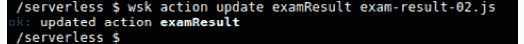

###### 图 8.33：更新 examResult 动作

1.  一旦动作更新完成，我们可以多次调用该动作，并使用不同的考试分数作为参数来验证功能：

```
$ wsk action invoke examResult --param examMarks 150 --result
$ wsk action invoke examResult --param examMarks 75 --result
$ wsk action invoke examResult --param examMarks 42 –result
```

输出应该如下：

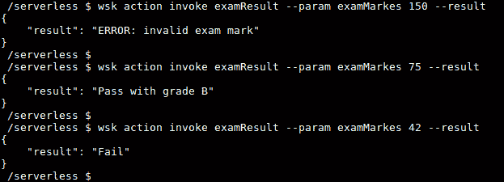

###### 图 8.34：使用不同的参数值调用 examResult 动作

1.  最后，我们将删除`examResult`动作：

```
$ wsk action delete examResult 
```

输出应该如下：


###### 图 8.35：删除 examResult 动作

在这个练习中，我们学习了如何创建一个遵循 OpenWhisk 操作标准的 JavaScript 函数。然后我们创建了这个操作并使用`wsk` CLI 调用了它。之后，我们改变了函数代码的逻辑，并用最新的函数代码更新了操作。最后，我们通过删除操作来进行清理。

### OpenWhisk 序列

在 OpenWhisk 中，以及一般的编程中，函数（在 OpenWhisk 中称为操作）被期望执行单一的专注任务。这将有助于通过重用相同的函数代码来减少代码重复。但创建复杂的应用程序需要连接多个操作以实现期望的结果。OpenWhisk 序列用于链接多个 OpenWhisk 操作（可以是不同编程语言运行时）并创建更复杂的处理流水线。

以下图表说明了如何通过链接多个操作来构建序列：

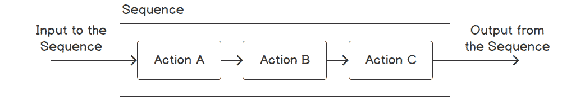

###### 图 8.36：OpenWhisk 序列

我们可以向序列传递参数（如果有的话），这些参数将被用作第一个操作的输入。然后，每个操作的输出将作为下一个操作的输入，序列的最终操作将返回其结果作为序列的输出。不同编程语言编写的操作也可以通过序列链接在一起。

可以使用`wsk action create`命令创建序列，并使用`--sequence`标志提供一个逗号分隔的操作列表来调用：

```
$ wsk action create <sequence-name> --sequence <action-01>,<action-02>
```

为了演示 OpenWhisk 序列的概念，我们将在下一节中创建一个名为`login`的序列，其中包括两个操作，名为**authentication**和**authorization**。当用户尝试登录应用程序时，将调用`login`操作。如果用户在登录时提供了正确的凭据，他们可以查看系统上的所有内容。但如果用户未能提供正确的登录凭据，他们只能查看系统的公共内容。

#### 注意

认证是验证用户的身份，授权是授予系统所需级别的访问权限。

首先，让我们创建 `authentication.js` 函数。这个函数将接收两个参数，名为 `username` 和 `password`。如果用户名和密码与 `admin`（对于 `username` 参数）和 `openwhisk`（对于 `password` 参数）的硬编码值匹配，函数将返回 `authenticationResult` 为 `true`。否则，`authenticationResult` 将为 `false`：

```
function main(params) {
    var authenticationResult = '';
    if (params.username == 'admin' && params.password == 'openwhisk') {
        authenticationResult = 'true';
    } else {
        authenticationResult = 'false';
    }
    return { authenticationSuccess: authenticationResult };
}
```

接下来的函数是 `authorization.js`，它以 `authenticationSuccess` 值作为输入，并向用户显示适当的内容。如果用户成功通过认证（`authenticationSuccess = true`），将显示 `'Authentication Success! You can view all content'` 消息。如果认证失败（`authenticationSuccess != true`），将显示 `'Authentication Failed! You can view only public content'` 消息：

```
function main(params) {
    var contentMessage = '';
    if (params.authenticationSuccess == "true") {
        contentMessage = 'Authentication Success! You can view all content';
    } else {
        contentMessage = 'Authentication Failed! You can view only public content';
    }
    return { content: contentMessage };
}
```

现在，让我们使用 `wsk action create` 命令部署这两个操作：

```
$ wsk action create authentication authentication.js 
$ wsk action create authorization authorization.js 
```

输出应该如下：

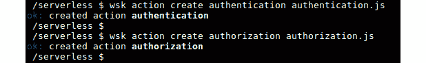

###### 图 8.37：创建认证和授权操作

现在认证和授权操作都准备好了。让我们通过组合 `authentication` 和 `authorization` 操作来创建一个名为 `login` 的序列：

```
$ wsk action create login --sequence authentication,authorization
```

输出应该如下：

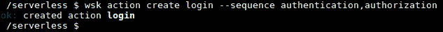

###### 图 8.38：创建登录序列

现在是测试登录序列的时候了。首先，我们将通过发送正确的凭据（`username` = `admin` 和 `password` = `openwhisk`）来调用登录序列：

```
$ wsk action invoke login --param username admin --param password openwhisk –result
```

输出应该如下：

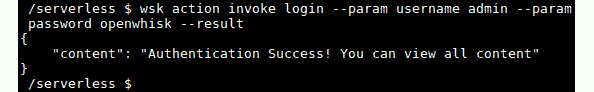

###### 图 8.39：使用有效凭据调用登录序列

成功登录的预期结果显示在上面的截图中。现在，让我们通过发送不正确的凭据（`username` = `hacker` 和 `password` = `hacker`）来调用登录序列。这次我们期望收到一个认证失败的消息：

```
$ wsk action invoke login --param username hacker --param password hacker –result
```

输出应该如下：

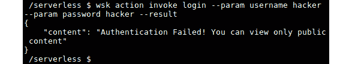

###### 图 8.40：使用无效凭据调用登录序列

在本节中，我们学习了关于 OpenWhisk 序列的知识。我们创建了多个操作，使用序列将它们链接在一起，并通过发送所需的参数来调用序列。

### 练习 27：创建 OpenWhisk 序列

在这个练习中，我们将创建一个包含两种不同语言编写的操作的序列。第一个操作用 Python 编写，接收两次考试的分数并返回平均分。第二个操作用 JavaScript 编写，接收平均分并返回通过或失败。

#### 注意

此练习的代码文件可以在[`github.com/TrainingByPackt/Serverless-Architectures-with-Kubernetes/tree/master/Lesson08/Exercise27`](https://github.com/TrainingByPackt/Serverless-Architectures-with-Kubernetes/tree/master/Lesson08/Exercise27)找到。

以下步骤将帮助您完成练习：

1.  编写第一个函数（`calculate-average.py`），计算平均分。此函数将接收两次考试的分数作为输入：

```
def main(params):
    examOneMarks = params.get("examOneMarks")
    examTwoMarks = params.get("examTwoMarks")

    fullMarks = examOneMarks + examTwoMarks
    averageMarks =  fullMarks / 2

    return {"averageMarks": averageMarks}
```

1.  从`calculate-average.py`创建一个名为`calculateAverage`的 OpenWhisk 操作：

```
$ wsk action create calculateAverage calculate-average.py
```

输出应如下所示：

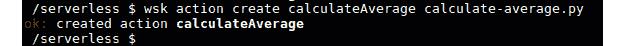

###### 图 8.41：创建 calculateAverage 操作

1.  通过调用检查`calculateAverage`操作是否按预期工作：

```
$ wsk action invoke calculateAverage --param examOneMarks 82 --param examTwoMarks 68 –result
```

1.  输出应如下所示：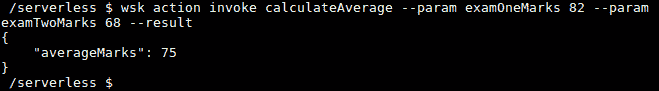

###### 图 8.42：调用 calculateAverage 操作

1.  创建第二个函数（`show-result.js`），根据平均分返回考试结果（`通过`或`失败`）。考试结果将基于逻辑，即分数小于 0 或大于 100 将返回`错误`；分数大于或等于 60 将返回`通过`；否则将返回`失败`。

代码如下：

```
function main(params) {
    var examResult = '';

    if (params.averageMarks < 0 || params.averageMarks > 100) {
        examResult = 'ERROR: invalid average exam mark';
    } else if (params.averageMarks >= 60) {
        examResult = 'Pass';
    } else {
        examResult = 'Fail';
    }

    return { result: examResult };
}
```

1.  从`show-result.js`创建一个名为`showResult`的 OpenWhisk 操作：

```
$ wsk action create showResult show-result.js
```

输出应如下所示：


###### 图 8.43：创建 showResult 操作

1.  检查`showResult`操作是否按预期工作，通过调用它来验证：

```
$ wsk action invoke showResult --param averageMarks 75 –result
```

输出应如下所示：

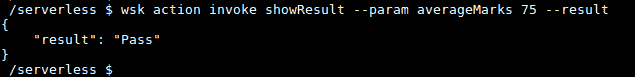

###### 图 8.44：调用 showResult 操作

1.  创建`getExamResults`序列，其中包括`calculateAverage`和`showResult`操作：

```
$ wsk action create getExamResults --sequence calculateAverage,showResult
```

输出应如下所示：

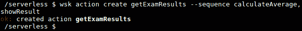

###### 图 8.45：创建 getExamResults 序列

1.  调用`getExamResults`序列并验证结果：

```
$ wsk action invoke getExamResults --param examOneMarks 82 --param examTwoMarks 68 –result
```

输出应如下所示：

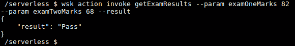

###### 图 8.46：调用 getExamResults 序列

### OpenWhisk Web 动作

到目前为止，我们已经通过`wsk` CLI 和`wsk action invoke`命令调用了我们的 OpenWhisk 动作。尽管这种调用方法非常简单，并且在开发阶段非常适合我们，但`wsk` CLI 不能被外部方使用，比如外部应用程序或用户，来调用我们的动作。作为解决方案，我们可以使用 OpenWhisk web 动作，这将允许通过公开可用的 URL 通过 HTTP 请求调用动作。

当调用动作时，OpenWhisk 标准动作需要身份验证（这由**wsk** CLI 在内部处理），并且必须将 JSON 有效负载作为响应。相比之下，web 动作可以在没有身份验证的情况下被调用，并且可以返回额外的信息，比如 HTTP 头和非 JSON 有效负载，比如 HTML 和二进制数据。

通过在创建（`wsk action create`）或更新（`wsk action update`）动作时发送`--web true`（或`--web yes`）标志，可以将 OpenWhisk 标准动作转换为 web 动作。

让我们创建一个 JavaScript 函数（`web-action.js`）作为 web 动作被调用。如果我们没有为名称参数传递值，这个函数将返回**Hello, Stranger**，当我们通过 web 动作 URL 为`name`参数传递值时，它将返回`Hello`与名称：

```
function main(params) {
    var helloMessage = ''
    if (params.name) {
        helloMessage = 'Hello, ' + params.name;
    } else {
        helloMessage = 'Hello, Stranger';
    }

    return { result: helloMessage };
}
```

现在我们可以通过发送`--web true`标志和`wsk action create`命令来创建一个 web 动作：

```
$ wsk action create myWebAction web-action.js --web true
```

输出应该如下：


###### 图 8.47：将 myWebAction 创建为 web 动作

然后，我们可以使用 web 动作 URL 来调用创建的 web 动作。web 动作 URL 的一般格式如下：

```
https://{APIHOST}/api/v1/web/{QUALIFIED_ACTION_NAME}.{EXT}
```

让我们讨论一下这个 URL 的每个组件：

+   `APIHOST`：IBM Cloud Functions 的`APIHOST`值为`openwhisk.ng.bluemix.net`。

+   `QUALIFIED_ACTION_NAME`：web 动作的完全限定名称，格式为`<namespace>/<package-name>/<action-name>`。如果动作不在命名的`package`中，请使用`default`作为`<package-name>`的值。

+   `EXT`：代表 web 动作预期响应类型的扩展。

我们可以使用`wsk action get`命令的`--url`标志来检索 web 动作的 URL：

```
$ wsk action get myWebAction –url
```

输出应该如下：

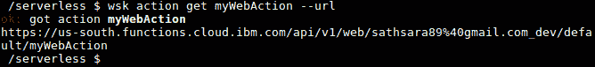

###### 图 8.48：检索 myWebAction 的公共 URL

由于我们的 web action 正在响应 JSON 有效负载，我们需要在前面的 URL 中附加`.json`作为扩展名。现在我们可以在网页浏览器中打开此 URL，或者使用`curl`命令检索输出。

让我们在前面的 URL 中使用网页浏览器调用：

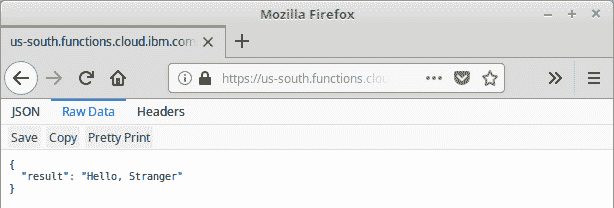

###### 图 8.49：从网页浏览器中调用 myWebAction 而没有 name 参数

**你好，陌生人**是预期的响应，因为我们没有在查询中为`name`参数传递值。

现在，让我们通过在 URL 末尾附加`?name=OpenWhisk`来调用相同的 URL：

[`us-south.functions.cloud.ibm.com/api/v1/web/sathsara89%40gmail.com_dev/default/myWebAction.json?name=OpenWhisk`](https://us-south.functions.cloud.ibm.com/api/v1/web/sathsara89%40gmail.com_dev/default/myWebAction.json?name=OpenWhisk)

输出应该如下：

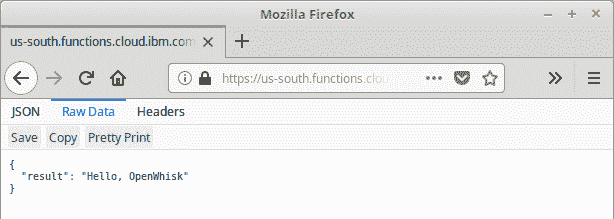

###### 图 8.50：从网页浏览器中调用 myWebAction 而有 name 参数

我们可以使用以下命令将相同的 URL 作为`curl`请求调用：

```
$ curl https://us-south.functions.cloud.ibm.com/api/v1/web/sathsara89%40gmail.com_dev/default/myWebAction.json?name=OpenWhisk
```

输出应该如下：

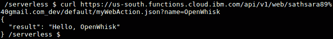

###### 图 8.51：使用 name 参数作为 curl 命令调用 myWebAction

这个命令将产生与我们在网页浏览器中看到的相同的输出。

正如我们之前讨论的，OpenWhisk web actions 可以配置为返回附加信息，包括 HTTP 标头、HTTP 状态码和使用 JSON 响应中的一个或多个字段的不同类型的主体内容：

+   `headers`：此字段用于在响应中发送 HTTP 标头。一个示例是将`Content-Type`发送为`text/html`。

+   `statusCode`：这将发送一个有效的 HTTP 响应代码。除非明确指定，否则将发送**200 OK**的状态代码。

+   `body`：这包含响应内容，可以是纯文本、JSON 对象或数组，或者是用于二进制数据的 base64 编码字符串。

现在我们将更新`web-action.js`函数以按照我们之前讨论的格式发送响应：

```
function main(params) {
    var helloMessage = ''

    if (params.name) {
        username = params.name;
        httpResponseCode = 200;
    } else {
        username = 'Stranger';
        httpResponseCode = 400;
    }

    var htmlMessage = '<html><body><h3>' + 'Hello, ' + username + '</h3></body></html>';

    return {
        headers: {
            'Set-Cookie': 'Username=' + username + '; Max-Age=3600',
            'Content-Type': 'text/html'
        },
        statusCode: httpResponseCode,
        body: htmlMessage 
    };
}
```

然后，我们将使用最新的函数代码更新`myWebAction`动作：

```
$ wsk action update myWebAction web-action.js
```

输出应该如下：


###### 图 8.52：更新 myWebAction

让我们使用以下`curl`命令调用更新后的动作。我们将在 URL 中提供`name=OpenWhisk`作为查询参数。此外，使用`-v`选项打印详细输出，这将帮助我们验证我们添加到响应中的字段：

```
$ curl https://us-south.functions.cloud.ibm.com/api/v1/web/sathsara89%40gmail.com_dev/default/myWebAction.http?name=OpenWhisk -v
```

这是在前述`curl`命令之后收到的响应：

```
     *   Trying 104.17.9.194...
* Connected to us-south.functions.cloud.ibm.com (104.17.9.194) port 443 (#0)
* * * 
* * * 
> GET /api/v1/web/sathsara89%40gmail.com_dev/default/myWebAction.http?name=OpenWhisk HTTP/1.1
> Host: us-south.functions.cloud.ibm.com
> User-Agent: curl/7.47.0
> Accept: */*
> 
< HTTP/1.1 200 OK
< Date: Sun, 04 Aug 2019 16:32:56 GMT
< Content-Type: text/html; charset=UTF-8
< Transfer-Encoding: chunked
< Connection: keep-alive
< Set-Cookie: __cfduid=d1cb4dec494fb11bd8b60a225c218b3101564936375; expires=Mon, 03-Aug-20 16:32:55 GMT; path=/; domain=.functions.cloud.ibm.com; HttpOnly
< X-Request-ID: 7dbce6e92b0a90e313d47e0c2afe203b
< Access-Control-Allow-Origin: *
< Access-Control-Allow-Methods: OPTIONS, GET, DELETE, POST, PUT, HEAD, PATCH
< Access-Control-Allow-Headers: Authorization, Origin, X-Requested-With, Content-Type, Accept, User-Agent
< x-openwhisk-activation-id: f86aad67a9674aa1aaad67a9674aa12b
< Set-Cookie: Username=OpenWhisk; Max-Age=3600
< IBM_Cloud_Functions: OpenWhisk
< Expect-CT: max-age=604800, report-uri="https://report-uri.cloudflare.com/cdn-cgi/beacon/expect-ct"
< Server: cloudflare
< CF-RAY: 5011ee17db5d7f2f-CMB
< 
* Connection #0 to host us-south.functions.cloud.ibm.com left intact
<html><body><h3>Hello, OpenWhisk</h3></body></html>
```

如预期的那样，我们收到了`HTTP/1.1 200 OK`作为 HTTP 响应代码，`Content-Type: text/html`作为头部，一个 cookie，以及`<html><body><h3>Hello, OpenWhisk</h3></body></html>`作为响应的主体。

现在，让我们在不带`name=OpenWhisk`查询参数的情况下调用相同的`curl`请求。这次，预期的响应代码是`HTTP/1.1 400 Bad Request`，因为我们没有为查询参数传递值。此外，`curl`命令将以`<html><body><h3>Hello, Stranger</h3></body></html>`作为 HTTP 响应体代码做出响应：

```
$ curl https://us-south.functions.cloud.ibm.com/api/v1/web/sathsara89%40gmail.com_dev/default/myWebAction.http -v
```

这是在前述`curl`命令之后收到的响应：

```
*   Trying 104.17.9.194...
* Connected to us-south.functions.cloud.ibm.com (104.17.9.194) port 443 (#0)
* * * 
* * * 
* ALPN, server accepted to use http/1.1
> GET /api/v1/web/sathsara89%40gmail.com_dev/default/myWebAction.http HTTP/1.1
> Host: us-south.functions.cloud.ibm.com
> User-Agent: curl/7.47.0
> Accept: */*
> 
< HTTP/1.1 400 Bad Request
< Date: Sun, 04 Aug 2019 16:35:09 GMT
< Content-Type: text/html; charset=UTF-8
< Transfer-Encoding: chunked
< Connection: keep-alive
< Set-Cookie: __cfduid=dedba31160ddcdb6791a04ff4359764611564936508; expires=Mon, 03-Aug-20 16:35:08 GMT; path=/; domain=.functions.cloud.ibm.com; HttpOnly
< X-Request-ID: 8c2091fae68ab4b678d835a000a21cc2
< Access-Control-Allow-Origin: *
< Access-Control-Allow-Methods: OPTIONS, GET, DELETE, POST, PUT, HEAD, PATCH
< Access-Control-Allow-Headers: Authorization, Origin, X-Requested-With, Content-Type, Accept, User-Agent
< x-openwhisk-activation-id: 700916ace1d843e78916ace1d813e7c3
< Set-Cookie: Username=Stranger; Max-Age=3600
< IBM_Cloud_Functions: OpenWhisk
< Expect-CT: max-age=604800, report-uri="https://report-uri.cloudflare.com/cdn-cgi/beacon/expect-ct"
< Server: cloudflare
< CF-RAY: 5011f1577b7a7f35-CMB
< 
* Connection #0 to host us-south.functions.cloud.ibm.com left intact
<html><body><h3>Hello, Stranger</h3></body></html>
```

在本节中，我们介绍了 OpenWhisk web 动作，并讨论了标准动作和 web 动作之间的区别。然后，我们使用`wsk` CLI 创建了一个 web 动作。接下来，我们了解了 web 动作暴露的 URL 的格式。我们使用 web 浏览器和`curl`命令调用了 web 动作。然后，我们讨论了 web 动作可以返回的附加信息。最后，我们更新了我们的 web 动作以包括响应中的头部、**statusCode**和主体，并使用`curl`命令调用了 web 动作以验证响应。

## OpenWhisk Feeds、触发器和规则

在前几节中，我们学习了如何使用**wsk** CLI 或使用 web 动作的 HTTP 请求来调用动作。在本节中，我们将学习如何使用 OpenWhisk feeds、触发器和规则自动调用动作。以下图解说明了如何使用 feeds、触发器和规则从外部事件源的事件调用动作：

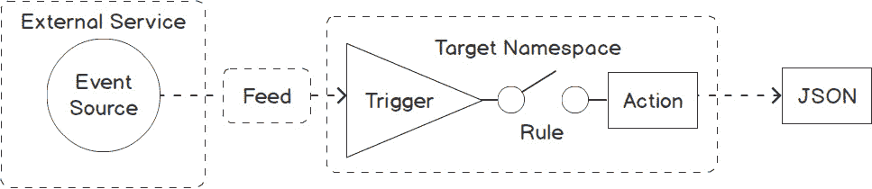

###### 图 8.53：OpenWhisk Feeds、触发器和规则

触发器是从事件源发送的不同类型的事件。这些触发器可以通过`wsk` CLI 手动触发，也可以自动从外部事件源发生的事件中触发。事件源的一些例子包括 Git 存储库、电子邮件帐户或 Slack 频道。如前图所示，feeds 用于将触发器连接到外部事件源。feeds 的示例如下：

+   向 Git 存储库提交。

+   发送到特定帐户的传入电子邮件消息。

+   通过 Slack 频道收到的消息。

如图所示，规则是连接触发器和动作的组件。规则将一个触发器连接到一个动作。创建此链接后，触发器的每次调用都将执行关联的动作。通过创建适当的规则集，还可以实现以下情景：

+   执行多个动作的单个触发器

+   单个动作以响应多个触发器

让我们从创建一个简单的动作开始，以便与触发器和规则一起调用。创建一个名为`triggers-rules.js`的文件，并添加以下 JavaScript 函数：

```
function main(params) {
    var helloMessage = 'Invoked with triggers and rules';
    return { result: helloMessage };
}
```

然后我们将创建动作：

```
$ wsk action create triggersAndRules triggers-rules.js
```

现在是创建我们的第一个触发器的时候了。我们将使用`wsk trigger create`命令使用`wsk` CLI 创建触发器：

```
$ wsk trigger create <trigger-name>
```

让我们创建一个名为`myTrigger`的触发器：

```
$ wsk trigger create myTrigger
```

输出应如下所示：


###### 图 8.54：创建 myTrigger

我们可以列出可用的触发器，以确保`myTrigger`已成功创建：

```
$ wsk trigger list
```

输出应如下所示：

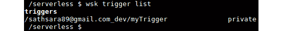

###### 图 8.55：列出所有触发器

触发器在通过规则连接到动作之前是无用的。现在我们将使用`wsk rule create`命令创建一个 OpenWhisk 规则，其格式如下：

```
$ wsk rule create <rule-name> <trigger-name> <action-name>
```

让我们创建一个名为`myRule`的规则，将`myTrigger`和`triggerAndRules`动作连接在一起：

```
$ wsk rule create myRule myTrigger triggersAndRules
```

输出应如下所示：

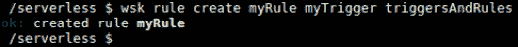

###### 图 8.56：创建 myRule 以连接 myTrigger 与 triggersAndRules 动作

我们可以获取有关`myRule`的详细信息，其中显示了与规则关联的触发器和动作：

```
$ wsk rule get myRule
```

此命令将打印有关`myRule`的详细输出，如下面的屏幕截图所示，其中包括**命名空间**、**版本**、**状态**以及**规则**的关联**触发器**和**动作**。

输出应如下所示：

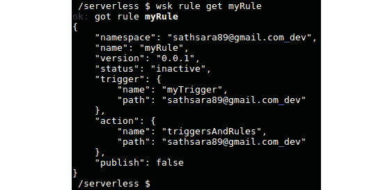

###### 图 8.57：获取 myRule 的详细信息

一旦**动作**、**触发器**和**规则**准备就绪，就是时候看到触发器的作用了。使用`wsk trigger fire`命令触发触发器：

```
$ wsk trigger fire myTrigger
```

输出应如下所示：


###### 图 8.58：触发 myTrigger

这将打印触发器的激活 ID。

让我们执行以下命令来列出最后两次激活：

```
$ wsk activation list --limit 2
```

输出应该如下：

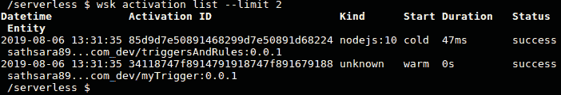

###### 图 8.59：列出最后两次激活

在上述截图中，我们可以看到`myTrigger`触发器激活被记录，然后是`triggersAndRules`动作激活。

我们可以打印`triggersAndRules`动作激活的结果，以确保触发器正确调用了该动作：

```
$ wsk activation get 85d9d7e50891468299d7e50891d68224 –summary
```

输出应该如下：

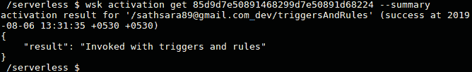

###### 图 8.60：打印激活的结果

在本节中，我们讨论了如何使用提要、触发器和规则自动调用动作。我们创建了一个动作，一个触发器，然后创建了一个规则来连接它们。最后，我们通过触发器来调用动作。

### OpenWhisk CronJob 触发器

在前面的部分中，我们讨论了如何使用`wsk trigger fire`命令触发触发器。然而，有些情况下我们需要自动触发触发器。一个例子是执行定期任务，比如运行系统备份、日志归档或数据库清理。OpenWhisk 提供了基于 cron 的触发器，可以在固定间隔调用无服务器函数。OpenWhisk 提供的`/whisk.system/alarms`软件包可以用来在预定的间隔触发触发器。

此软件包包括以下提要：

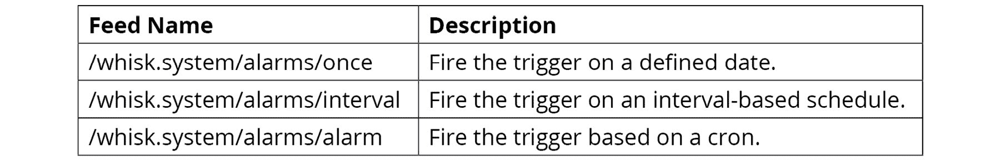

###### 图 8.61：警报软件包中可用的提要

在接下来的练习中，让我们学习如何创建基于 cron 作业的触发器。

### 练习 28：创建 CronJob 触发器

在本练习中，我们将创建一个 OpenWhisk 动作，该动作将使用提要、触发器和规则每分钟被调用。函数代码将打印当前日期和时间作为输出，以便我们可以验证 cron 作业触发器是否正确调用了该动作。

#### 注意

此练习的代码文件可以在[`github.com/TrainingByPackt/Serverless-Architectures-with-Kubernetes/tree/master/Lesson08/Exercise28`](https://github.com/TrainingByPackt/Serverless-Architectures-with-Kubernetes/tree/master/Lesson08/Exercise28)找到。

以下步骤将帮助您完成本练习：

1.  让我们从创建函数代码开始。此函数将返回当前日期和时间。创建一个名为`date-time.js`的文件，其中包含以下代码，并创建一个名为`dateTimeAction`的动作：

```
function main() {
    var currentDateTime = new Date();
    return { currentDateTime: currentDateTime };
}
$ wsk action create dateTimeAction date-time.js
```

输出应该如下所示：


###### 图 8.62：创建 dateTimeAction

1.  下一步是使用`/whisk.system/alarms/alarm` feed 创建一个触发器。 cron 值为`"* * * * *"`，旨在每分钟触发此动作：

```
$ wsk trigger create dateTimeCronTrigger \
                            --feed /whisk.system/alarms/alarm \
                            --param cron "* * * * *" 
```

以下是`wsk trigger create`命令的响应。确保输出的末尾有`ok: created trigger dateTimeCronTrigger`，这表示成功创建了`dateTimeCronTrigger`：

```
ok: invoked /whisk.system/alarms/alarm with id 06f8535f9d364882b8535f9d368882cd
{
    "activationId": "06f8535f9d364882b8535f9d368882cd",
    "annotations": [
        {
            "key": "path",
            "value": "whisk.system/alarms/alarm"
        },
        {
            "key": "waitTime",
            "value": 85
        },
        {
            "key": "kind",
            "value": "nodejs:10"
        },
        {
            "key": "timeout",
            "value": false
        },
        {
            "key": "limits",
            "value": {
                "concurrency": 1,
                "logs": 10,
                "memory": 256,
                "timeout": 60000
            }
        },
        {
            "key": "initTime",
            "value": 338
        }
    ],
    "duration": 594,
    "end": 1565083299218,
    "logs": [],
    "name": "alarm",
    "namespace": "sathsara89@gmail.com_dev",
    "publish": false,
    "response": {
        "result": {
            "status": "success"
        },
        "status": "success",
        "success": true
    },
    "start": 1565083298624,
    "subject": "sathsara89@gmail.com",
    "version": "0.0.152"
}
ok: created trigger dateTimeCronTrigger
```

1.  创建规则（`dateTimeRule`）以将动作（`dateTimeAction`）与触发器（`dateTimeCronTrigger`）连接起来：

```
$ wsk rule create dateTimeRule dateTimeCronTrigger dateTimeAction
```

输出应该如下所示：

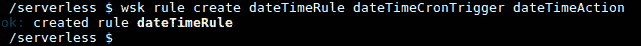

###### 图 8.63：创建 dateTimeRule 以连接 dateTimeCronTrigger 和 dateTimeAction

1.  该动作现在将每分钟被触发。让 cron 作业触发器运行大约 5 分钟。我们可以使用以下命令列出最近 6 次激活：

```
$ wsk activation list --limit 6
```

输出应该如下所示：

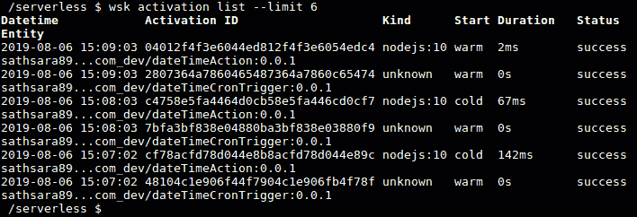

###### 图 8.64：列出最近六次激活

1.  列出`dateTimeAction`的激活摘要，以确保它已经每分钟打印了当前日期时间：

```
$ wsk activation get 04012f4f3e6044ed812f4f3e6054edc4 --summary
$ wsk activation get c4758e5fa4464d0cb58e5fa446cd0cf7 --summary
$ wsk activation get cf78acfd78d044e8b8acfd78d044e89c –summary
```

输出应该如下所示：

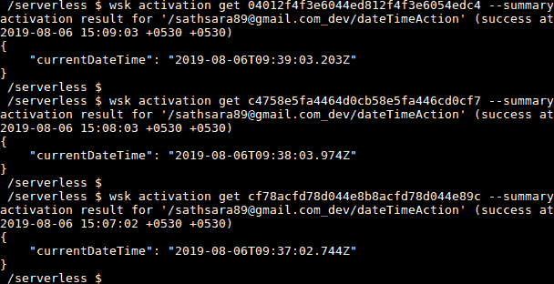

###### 图 8.65：打印 dateTimeAction 激活的摘要

检查`currentDateTime`字段的值，打印每次调用以验证该动作是否按计划每分钟被调用。在前面的截图中，我们可以看到该动作在**09:37:02**被调用，然后在**09:38:03**再次被调用，最后在**09:39:03**被调用。

在这个活动中，我们创建了一个简单的函数，用于打印当前日期和时间。然后，我们创建了一个 cron 作业触发器，以便每分钟调用此动作。

### OpenWhisk Packages

OpenWhisk 包允许我们通过将相关动作捆绑在一起来组织我们的动作。举个例子，假设我们有多个动作，比如`createOrder`、`processOrder`、`dispatchOrder`和`refundOrder`。当应用用户创建订单、处理订单、派送订单和退款订单时，这些动作将执行相关的应用逻辑。在这种情况下，我们可以创建一个名为`order`的包来将所有与订单相关的动作分组在一起。

正如我们之前学到的，动作名称应该是唯一的。包有助于防止命名冲突，因为我们可以通过将它们放入不同的包中来创建具有相同名称的多个动作。举个例子，来自`order`包的`retrieveInfo`动作可能会检索有关订单的信息，但来自 customer 包的`retrieveInfo`动作可以检索有关客户的信息。

到目前为止，我们已经创建了许多动作，而不用担心包。这是如何可能的？这是因为如果我们在创建动作时没有提及任何特定的包，OpenWhisk 会将动作放入默认包中。

OpenWhisk 有两种类型的包：

+   内置包（OpenWhisk 自带的包）

+   用户定义的包（用户创建的其他包）

可以使用`wsk package list <namespace>`命令检索命名空间中的所有包。

输出应如下所示：

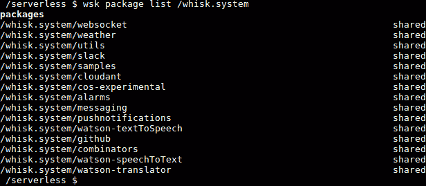

###### 图 8.66：列出/whisk.system 命名空间中的包

使用`wsk package create`命令可以创建包：

```
$ wsk package create <package-name>
```

在本节中，我们介绍了包的概念，并讨论了 OpenWhisk 的内置包和用户定义的包。在下一个练习中，我们将创建一个包并将一个动作添加到新创建的包中。

### 练习 29：创建 OpenWhisk 包

在本练习中，我们将创建一个名为`arithmetic`的包，其中包含所有与算术相关的动作，如加法、减法、乘法和除法。我们将创建一个接收两个数字作为输入并通过将数字相加返回结果的函数。然后，我们将在`arithmetic`包中创建此动作：

1.  让我们从创建一个名为`arithmetic`的包开始：

```
$ wsk package create arithmetic
```

输出应如下所示：


###### 图 8.67：创建算术包

1.  现在我们将创建一个操作，将其添加到我们的`arithmetic`包中。创建一个名为`add.js`的文件，内容如下：

```
function main(params) {
    var result = params.firstNumber + params.secondNumber;
    return { result: result };
}
```

1.  我们可以使用`wsk action create`命令同时创建操作并将其添加到`arithmetic`包中。这只需要我们在操作名称前加上包名称。执行以下命令：

```
$ wsk action create arithmetic/add add.js
```

在输出中，我们可以看到操作已成功创建在`arithmetic`包中。

输出应该如下所示：


###### 图 8.68：向算术包添加 add 操作

1.  现在我们可以使用`wsk action list`命令来验证我们的`add`操作是否已放置在算术包中。

```
$ wsk action list --limit 2
```

输出应该如下所示：

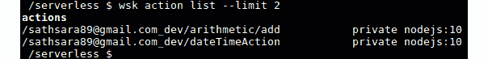

###### 图 8.69：列出操作

1.  `wsk package get`命令将返回描述包的 JSON 输出：

```
$ wsk package get arithmetic
```

输出应该如下所示：


###### 图 8.70：获取算术包的详细描述

1.  如果我们想要查看包描述的摘要，列出包内的操作，我们可以使用`--summary`标志：

```
$ wsk package get arithmetic –summary
```

输出应该如下所示：


###### 图 8.71：获取算术包的摘要描述

### 活动 8：通过电子邮件接收每日天气更新

想象一下，你正在为灾害管理中心工作，需要及时了解天气信息。你决定创建一个应用程序，可以在指定的时间间隔通过电子邮件向你发送天气更新。为了实现这一目标，你决定部署一个应用程序，可以获取特定城市的当前天气，并在每天上午 8 点向指定的电子邮件地址发送当前天气信息。在这个活动中，我们将使用外部服务来检索天气信息（OpenWeather）并发送电子邮件（SendGrid）。

在开始这个活动之前，我们需要准备以下内容：

+   一个 OpenWeather 账户（用于检索当前天气信息）

+   一个 SendGrid 账户（用于发送电子邮件）

+   `npm`已安装

+   `zip`已安装

执行以下步骤来创建一个 OpenWeather 账户和一个 SendGrid 账户：

1.  创建一个**OpenWeather**（[`openweathermap.org/`](https://openweathermap.org/)）账户以检索当前天气信息并保存 API 密钥。在[`home.openweathermap.org/users/sign_up`](https://home.openweathermap.org/users/sign_up)创建一个**OpenWeather**账户。

转到**API 密钥**选项卡（[`home.openweathermap.org/api_keys`](https://home.openweathermap.org/api_keys)）并保存 API 密钥，因为这个 API 密钥是从 OpenWeather API 获取数据所必需的。

在 Web 浏览器中使用`https://api.openweathermap.org/data/2.5/weather?q=London&appid=<YOUR-API-KEY>`来测试 OpenWeather API。请注意，您需要用*步骤 1*中的 API 密钥替换**<YOUR-API-KEY>**。

1.  创建一个 SendGrid（[`sendgrid.com`](https://sendgrid.com)）账户并保存 API 密钥。这用于发送电子邮件。在[`signup.sendgrid.com/`](https://signup.sendgrid.com/)创建一个 SendGrid 账户。

转到**设置 > API 密钥**，然后单击**创建 API 密钥**按钮。

在**API 密钥名称**字段中提供一个名称，选择**完全访问**单选按钮，然后单击**创建和查看**按钮以创建具有完全访问权限的 API 密钥。

生成密钥后，复制 API 密钥并将其保存在安全的地方，因为您只能看到这个密钥一次。

#### 注意

有关创建**OpenWeather**账户和 SendGrid 账户的详细步骤，请参阅第 432 页的*附录*部分。

现在我们准备开始这项活动。执行以下步骤以完成这项活动：

1.  在您熟悉的任何语言中创建一个函数（并且受 OpenWhisk 框架支持），该函数将以城市名称作为参数，并从 OpenWeather API 中检索的天气信息返回一个 JSON 对象。

#### 注意

对于这个解决方案，我们将使用 JavaScript 编写的函数。但是，您可以使用任何您熟悉的语言来编写这些函数。

以下是一个用 JavaScript 编写的示例函数：

```
const request = require('request');
function main(params) {
    const cityName = params.cityName
    const openWeatherApiKey = '<OPEN_WEATHER_API_KEY>';
    const openWeatherUrl = 'https://api.openweathermap.org/data/2.5/weather?q=' + cityName + '&mode=json&units=metric&appid=' + openWeatherApiKey ;
    return new Promise(function(resolve, reject) {
        request(openWeatherUrl, function(error, response, body) {   
            if (error) {
                reject('Requesting weather data from provider failed ' 
                        + 'with status code ' 
                        + response.statusCode + '.\n' 
                        + 'Please check the provided cityName argument.');
            } else {
                try {
                    var weatherData = JSON.parse(body);
                    resolve({weatherData:weatherData});
                } catch (ex) {
                    reject('Error occurred while parsing weather data.');
                }
            }
        });
    });
}
```

1.  创建第二个函数（在您熟悉的任何语言中，并且受 OpenWhisk 框架支持），该函数将以消息作为输入，并使用 SendGrid 服务将输入消息发送到指定的电子邮件地址。

以下是一个用 JavaScript 编写的示例函数：

```
const sendGridMailer = require('@sendgrid/mail');
function main(params) {
    const sendGridApiKey = '<SEND_GRID_API_KEY>';
    const toMail = '<TO_EMAIL>';
    const fromMail = '<FROM_EMAIL>';
    const mailSubject = 'Weather Information for Today';
    const mailContent = params.message;
    return new Promise(function(resolve, reject) {
        sendGridMailer.setApiKey(sendGridApiKey);
        const msg = {
            to: toMail,
            from: fromMail,
            subject: mailSubject,
            text: mailContent,
        };
        sendGridMailer.send(msg, (error, result) => {
            if (error) {
                reject({msg: "Message sending failed."});
            } else {
                resolve({msg: "Message sent!"});
            }
        });
    });
}
exports.main = main;
```

1.  创建第三个函数（在您熟悉的任何语言中，并且受 OpenWhisk 框架支持），该函数将以天气数据的 JSON 对象，并将其格式化为字符串消息，以便作为电子邮件正文发送。

以下是一个用 JavaScript 编写的示例函数：

```
     function main(params) {
    return new Promise(function(resolve, reject) {
        if (!params.weatherData) {
            reject("Weather data not provided");
        }
        const weatherData = params.weatherData;
        const cityName = weatherData.name;
        const currentTemperature = weatherData.main.temp;
        weatherMessage = "It's " + currentTemperature
                                 + " degrees celsius in " + cityName;
        resolve({message: weatherMessage});
   });
}
```

1.  接下来，创建一个连接所有三个动作的序列。

1.  最后，创建触发器和规则，在每天上午 8 点调用序列。

#### 注意

活动的解决方案可以在第 432 页找到。

## 摘要

在本章中，我们首先了解了 Apache OpenWhisk 的历史和核心概念。然后，我们学习了如何使用 CLI 设置 IBM Cloud Functions 来运行我们的无服务器函数。之后，介绍了 OpenWhisk 动作，这些是用 OpenWhisk 支持的语言之一编写的代码片段。我们讨论了如何使用`wsk` CLI 编写、创建、列出、调用、更新和删除 OpenWhisk 动作。接下来，我们介绍了 OpenWhisk 序列，用于将多个动作组合在一起，创建更复杂的处理流水线。接下来，我们学习了如何使用 Web 动作公开动作，通过 URL 返回动作的附加信息，如 HTTP 标头和非 JSON 有效载荷，包括 HTML 和二进制数据。下一部分是关于饲料、触发器和规则，它们使用来自外部事件源的事件自动化动作调用。最后，我们讨论了 OpenWhisk 包，它们用于通过捆绑它们来组织相关动作。

在下一章中，我们将学习关于 OpenFaaS，并使用 OpenFaaS 函数。
