# 第九章： 使用 OpenFaaS 进行无服务器操作

## 学习目标

在本章结束时，您将能够：

+   在 Minikube 集群上设置 OpenFaaS 框架

+   使用 OpenFaaS CLI 创建、构建、部署、列出、调用和删除函数

+   从 OpenFaaS 门户部署和调用 OpenFaaS 函数

+   从 OpenFaaS 函数返回 HTML 网页

+   设置 Prometheus 和 Grafana 仪表板以监视 OpenFaaS 函数

+   配置函数自动缩放以根据需求调整函数计数

在本章中，我们的目标是在 Minikube 集群上设置 OpenFaaS 框架，并学习如何使用 OpenFaaS 函数，同时使用 OpenFaaS CLI 和 OpenFaaS 门户。我们还将研究 OpenFaaS 的可观察性和自动缩放等功能。

## OpenFaaS 简介

在上一章中，我们了解了 OpenWhisk，这是一个开源的无服务器框架，它是 Apache 软件基金会的一部分。我们学习了如何创建、列出、调用、更新和删除 OpenWhisk 动作。我们还讨论了如何使用 feeds、triggers 和 rules 自动化动作调用。

在本章中，我们将学习 OpenFaas，这是另一个用于在容器之上构建和部署无服务器函数的开源框架。这是由 Alex Ellis 于 2016 年 10 月作为概念验证项目开始的，框架的第一个版本是用 Golang 编写的，并于 2016 年 12 月提交到 GitHub。

OpenFaaS 最初设计用于与 Docker Swarm 一起工作，这是 Docker 容器的集群和调度工具。后来，OpenFaaS 框架被重新设计为支持 Kubernetes 框架。

OpenFaaS 带有一个名为**OpenFaaS 门户**的内置 UI，可以用于在 Web 浏览器中创建和调用函数。该门户还提供了一个名为`faas-cli`的 CLI，允许我们通过命令行管理函数。OpenFaaS 框架内置支持自动缩放。这将在需求增加时扩展函数，并在需求减少时缩小，甚至在函数空闲时缩小到零。

现在，让我们来看看 OpenFaaS 框架的组件：

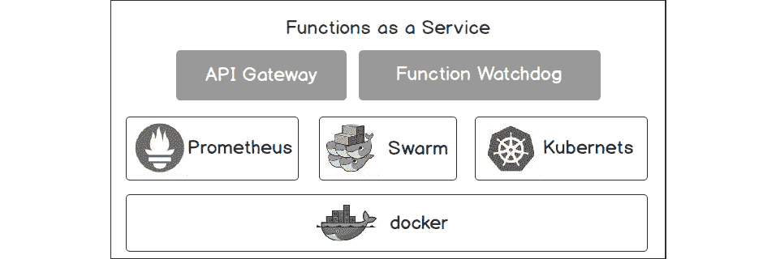

###### 图 9.1：OpenFaaS 组件

OpenFaaS 由以下组件组成，这些组件正在底层的 Kubernetes 或 Docker Swarm 上运行：

+   **API 网关**：

API 网关是 OpenFaaS 框架的入口点，可以在外部公开函数。它还负责收集函数指标，如函数调用次数、函数执行持续时间和函数副本数量。API 网关还通过根据需求增加或减少函数副本来处理函数自动扩展。

+   **Prometheus**：

Prometheus 是一个开源的监控和警报工具，与 OpenFaaS 框架捆绑在一起。它用于存储 API 网关收集的函数指标信息。

+   **函数看门狗**：

函数看门狗是一个微小的 Golang Web 服务器，运行在每个函数容器旁边。这个组件位于 API 网关和您的函数之间，负责在 API 网关和函数之间转换消息格式。它将 API 网关发送的 HTTP 消息转换为函数可以理解的“标准输入”（stdin）消息。它还通过将函数发送的“标准输出”（stdout）响应转换为 HTTP 响应来处理响应路径。

以下是函数看门狗的示例：

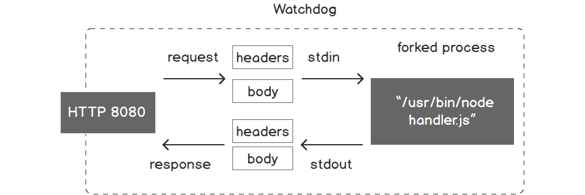

###### 图 9.2：OpenFaaS 函数看门狗

Docker Swarm 或 Kubernetes 可以作为容器编排工具与 OpenFaaS 框架一起使用，用于管理底层 Docker 框架上运行的容器。

### 在本地 Minikube 集群上开始使用 OpenFaaS

在本节中，我们将在本地 Minikube 集群上设置 OpenFaaS 框架和 CLI。在开始安装之前，我们需要确保满足以下先决条件：

+   已安装 Minikube

+   安装 Docker（版本 17.05 或更高）

+   已安装 Helm

+   创建 Docker Hub 帐户

一旦这些先决条件准备就绪，我们就可以继续安装 OpenFaaS。OpenFaaS 的安装可以大致分为三个步骤，如下所示：

1.  安装 OpenFaaS CLI

1.  安装 OpenFaaS 框架（在 Minikube 集群上）

1.  设置环境变量

让我们更深入地看看这些步骤：

**安装 OpenFaaS CLI**

**faas-cli**是 OpenFaaS 框架的命令行实用程序，可用于从终端创建和调用 OpenFaaS 函数。我们可以使用以下命令安装最新版本的`faas-cli`：

```
$ curl -sL https://cli.openfaas.com | sudo sh
```

输出应如下所示：

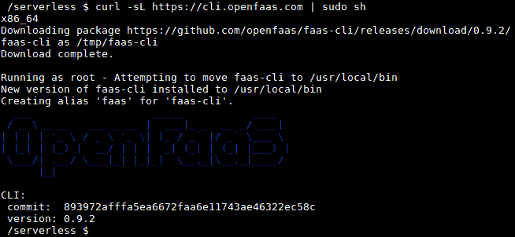

###### 图 9.3：安装 faas-cli

安装完成后，我们可以使用`faas-cli version`命令验证安装：

```
$ faas-cli version
```

输出应如下所示：

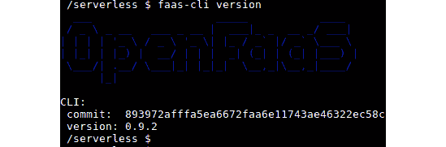

###### 图 9.4：faas-cli 版本

如您所见，我们已在集群上安装了`faas-cli`实用程序，并且还可以检查版本号。

**安装 OpenFaaS 框架**

接下来，我们需要使用 OpenFaaS `helm`存储库安装 OpenFaaS 框架。首先，我们需要添加`openfaas` `helm`存储库并更新以拉取任何新版本。使用以下命令：

```
$ helm repo add openfaas https://openfaas.github.io/faas-netes/
$ helm repo update
```

输出应如下所示：

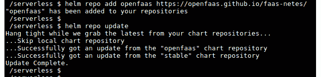

###### 图 9.5：添加和更新 helm 图表

安装 OpenFaaS 需要两个 Kubernetes 命名空间。`openfaas`命名空间用于 OpenFaaS 框架的核心服务，`openfaas-fn`命名空间用于 OpenFaaS 函数。运行以下命令创建命名空间：

```
$ kubectl create namespace openfaas
$ kubectl create namespace openfaas-fn
```

输出将如下所示：

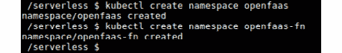

###### 图 9.6：创建命名空间

现在我们将创建 Kubernetes 密钥，这是启用 OpenFaaS 网关的基本身份验证所需的。首先，我们将创建一个随机字符串，将用作密码。生成密码后，我们将`echo`生成的密码并将其保存在安全的位置，因为我们稍后需要用它登录到 API 网关。运行以下命令生成密码：

```
$ PASSWORD=$(head -c 12 /dev/urandom | shasum| cut -d' ' -f1)
$ echo $PASSWORD
```

输出将如下所示：

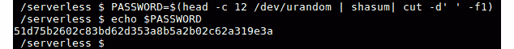

###### 图 9.7：生成密码

生成密码后，我们将创建一个 Kubernetes **secret**对象来存储密码。

#### 注意：

Kubernetes **secret**对象用于存储诸如密码之类的敏感数据。

执行以下命令创建名为`basic-auth`的 Kubernetes 密钥：

```
$ kubectl -n openfaas create secret generic basic-auth \
    --from-literal=basic-auth-user=admin \
    --from-literal=basic-auth-password="$PASSWORD"
```

输出将如下所示：

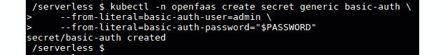

###### 图 9.8：创建 basic-auth 密钥

现在我们可以从`helm`图表部署 OpenFaaS 框架。`helm upgrade openfaas`命令开始部署 OpenFaaS，并将在本地 Minikube 集群上开始部署 OpenFaaS 框架。这将根据网络速度需要 5 到 15 分钟。运行以下命令安装`OpenFaaS`：

```
$ helm upgrade openfaas \
    --install openfaas/openfaas \
    --namespace openfaas \
    --set functionNamespace=openfaas-fn \
    --set basic_auth=true
```

上述命令会打印出一长串的输出，在底部提供了一个命令来验证安装，如下截图所示：

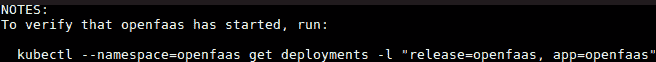

###### 图 9.9：OpenFaaS 安装

您可以使用以下命令验证部署状态：

```
$ kubectl --namespace=openfaas get deployments -l "release=openfaas, app=openfaas"
```

输出将显示如下：

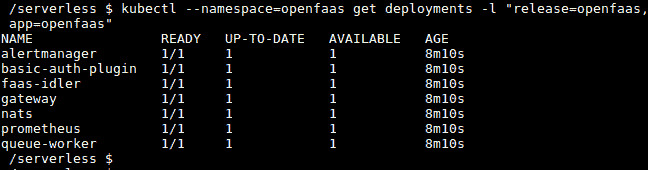

###### 图 9.10：验证 OpenFaaS 安装

安装成功完成并且所有服务正在运行后，我们需要使用在前面步骤中创建的凭据登录到 OpenFaaS 网关。运行以下命令登录到 OpenFaas 网关：

```
$ faas-cli login --username admin --password $PASSWORD
```

输出应如下所示：

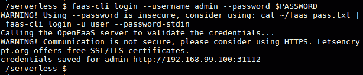

###### 图 9.11：登录到 OpenFaaS 网关

设置环境变量

本节中有几个与 OpenFaaS 相关的环境变量，我们将设置两个环境变量。如果需要，这些环境变量可以使用`faas-cli`的命令行标志进行覆盖。

+   `OPENFAAS_URL`：这应该指向 API 网关组件。

+   `OPENFAAS_PREFIX`：这是您的 Docker Hub 帐户的 Docker ID。

用您喜欢的文本编辑器打开`~/.bashrc`文件，并在文件末尾添加以下两行。在以下命令中用您的 Docker ID 替换`<your-docker-id>`：

```
export OPENFAAS_URL=$(minikube ip):31112
export OPENFAAS_PREFIX=<your-docker-id>
```

然后，您需要源`~/.bashrc`文件以重新加载新配置的环境变量，如下命令所示：

```
$ source ~/.bashrc
```

命令应如下所示：


###### 图 9.12：源 bashrc 文件

## OpenFaaS 函数

OpenFaaS 函数可以用 Linux 或 Windows 支持的任何语言编写，然后可以使用 Docker 容器将其转换为无服务器函数。这是 OpenFaaS 框架与其他仅支持预定义语言和运行时的无服务器框架相比的主要优势。

OpenFaaS 函数可以使用`faas-cli`或 OpenFaaS 门户部署。在接下来的几节中，我们首先将讨论如何使用`faas-cli`命令行工具构建、部署、列出、调用和删除 OpenFaaS 函数。然后，我们将讨论如何使用 OpenFaaS 门户部署和调用函数。

### 创建 OpenFaaS 函数

正如我们之前讨论的，OpenFaaS 函数可以用 Linux 和 Windows 支持的任何语言编写。这需要我们创建函数代码，添加任何依赖项，并创建一个**Dockerfile**来构建 Docker 镜像。这需要一定程度上对 OpenFaaS 平台的理解，以便能够执行前面提到的任务。作为解决方案，OpenFaaS 有一个模板存储库，其中包括一组支持的语言的预构建模板。这意味着你可以从模板存储库下载这些模板，更新函数代码，然后 CLI 会完成其余的工作来构建 Docker 镜像。

首先，我们需要使用`faas-cli template pull`命令拉取 OpenFaaS 模板。这将从官方 OpenFaaS 模板存储库[`github.com/openfaas/templates.git`](https://github.com/openfaas/templates.git)获取模板。

现在，让我们使用以下命令创建一个新文件夹，并将模板拉到新创建的文件夹中：

```
$ mkdir chapter-09
$ cd chapter-09/
$ faas-cli template pull
```

输出将如下所示：

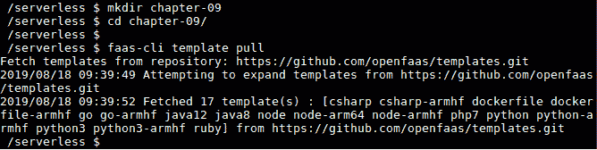

###### 图 9.13：创建目录

让我们使用`tree -L 2`命令来检查文件夹结构，该命令将打印出两层深度的文件夹**树**，如下截图所示：

图 9.14：文件夹的树形视图

](image/C12607_09_14.jpg)

###### 图 9.14：文件夹的树形视图

在模板文件夹中，我们可以看到 17 个文件夹，每个文件夹都是针对特定语言模板的。

现在，我们可以使用`faas-cli new`命令使用下载的模板创建新函数的结构和文件，如下所示：

```
$ faas-cli new <function-name> --lang=<function-language>
```

`<function-language>`可以被 OpenFaaS 模板支持的任何编程语言替换。`faas-cli new --list`可以用来获取支持的编程语言的列表，如下图所示：

图 9.15：列出支持的编程语言模板

](image/C12607_09_15.jpg)

###### 图 9.15：列出支持的编程语言模板

让我们使用以下命令创建我们的第一个 OpenFaaS 函数，名为`hello`，并使用`go`语言模板：

```
$ faas-cli new hello --lang=go
```

输出将如下所示：

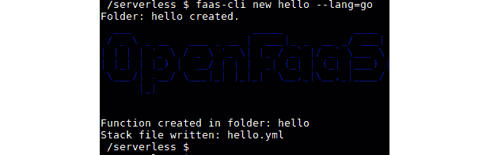

###### 图 9.16：创建 hello 函数模板

根据输出，上述命令将在当前文件夹内创建多个文件和目录。让我们再次执行`tree -L 2`命令，以识别新创建的文件和目录：

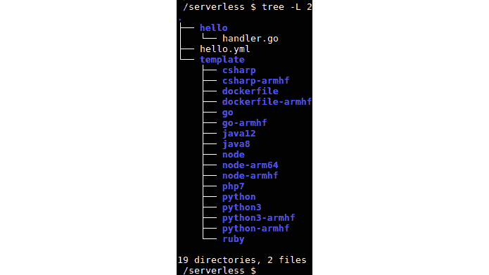

###### 图 9.17：文件夹的树状视图

我们可以看到一个名为`hello.yml`的文件，一个名为`hello`的文件夹，以及`hello`文件夹内的`handler.go`文件。

首先，我们将查看`hello.yml`文件，它被称为**函数** **定义**文件：

```
version: 1.0
provider:
  name: openfaas
  gateway: http://192.168.99.100:31112
functions:
  hello:
    lang: go
    handler: ./hello
    image: sathsarasa/hello:latest
```

这个文件有三个顶层，分别是`version`、`provider`和`functions`。

在`provider`部分内，有一个`name: faas`标签，它将提供者名称定义为`faas`。这是`name`标签的默认且唯一有效的值。接下来是`gateway`标签，它指向 API 网关运行的 URL。这个值可以在部署时用`--gateway`标志或`OPENFAAS_URL`环境变量进行覆盖。

接下来是`functions`部分，用于定义一个或多个要使用 OpenFaaS CLI 部署的函数。在前面的代码中，`hello.yml`文件有一个名为`hello`的函数，用 Go 语言（`lang: go`）编写。函数的处理程序是用`handler: ./hello`部分定义的，它指向`hello`函数的源代码（`hello/handler.go`）所在的文件夹。最后，有一个`image`标签，指定了输出 Docker 镜像的名称。Docker 镜像名称以您使用`OPENFAAS_PREFIX`环境变量配置的 Docker 镜像 ID 为前缀。

接下来，我们将讨论在`hello`文件夹内创建的`handler.go`文件。这个文件包含用 Go 语言编写的函数的源代码。这个函数接受一个字符串参数，并通过在其前面加上`Hello, Go. You said:`来返回这个字符串，就像下面的代码片段中显示的那样：

```
package function
import (
	"fmt"
)
// Handle a serverless request
func Handle(req []byte) string {
	return fmt.Sprintf("Hello, Go. You said: %s", string(req))
}
```

这只是一个由模板生成的示例函数。我们可以用我们的函数逻辑来更新它。

### 构建 OpenFaaS 函数

一旦函数定义文件（`hello.yml`）和函数源代码（`hello/handler.go`）准备好，下一步就是将函数构建为 Docker 镜像。使用`faas-cli build` CLI 命令来构建 Docker 镜像，其格式如下：

```
$ faas-cli build -f <function-definition-file>
```

这将启动构建 Docker 镜像的过程，并将在内部调用`docker build`命令。在这一步中将创建一个名为`build`的新文件夹，其中包含构建过程所需的所有文件。

现在，让我们构建在上一节中创建的`hello`函数：

```
$ faas-cli build -f hello.yml
```

我们将收到类似以下的输出：

```
     [0] > Building hello.
Clearing temporary build folder: ./build/hello/
Preparing ./hello/ ./build/hello/function
Building: sathsarasa/hello with go template. Please wait..
Sending build context to Docker daemon  6.656kB
Step 1/24 : FROM openfaas/classic-watchdog:0.15.4 as watchdog
 ---> a775beb8ba9f
...
...
Successfully built 72c9089a7dd4
Successfully tagged sathsarasa/hello:latest
Image: sathsarasa/hello built.
[0] < Building hello done.
[0] worker done.
```

一旦我们收到构建成功的消息，我们可以使用`docker images`命令列出 Docker 镜像，如下所示：

```
$ docker images | grep hello
```

输出如下：

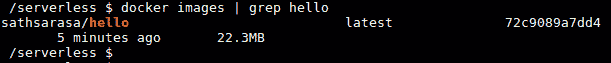

###### 图 9.18：验证 Docker 镜像

### 推送 OpenFaaS 函数镜像

该过程的下一步是将函数的 Docker 镜像推送到 Docker 注册表或 Docker Hub。我们可以使用`faas-cli push`或`docker push`命令来推送镜像。

#### 注意

Docker Hub 是一个免费的用于存储和共享 Docker 镜像的服务。

让我们使用`faas-cli push`命令推送镜像：

```
$ faas-cli push -f hello.yml
```

输出将如下所示：

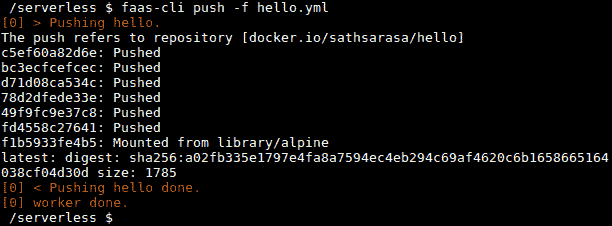

###### 图 9.19：推送 Docker 镜像

我们可以通过访问 Docker Hub 页面[`hub.docker.com/`](https://hub.docker.com/)来验证镜像是否成功推送。

输出应如下所示：

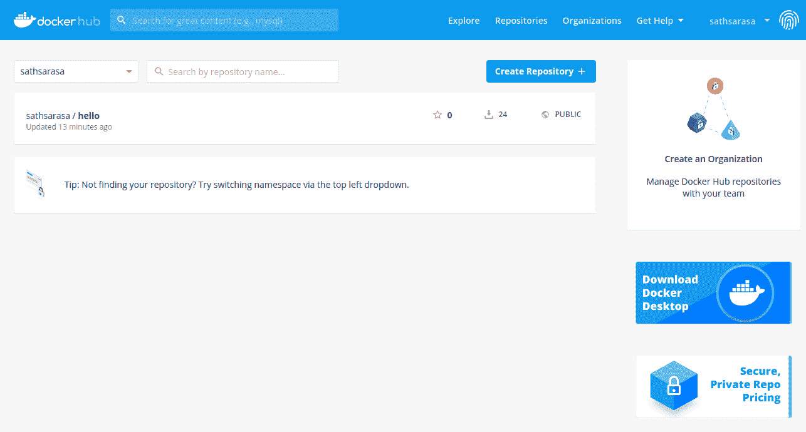

###### 图 9.20：从 Docker Hub 验证

因此，我们已成功将 Docker 镜像功能推送到 Docker Hub。

### 部署 OpenFaaS 函数

现在，我们准备使用`faas-cli deploy`命令将`hello`函数部署到 OpenFaaS 框架中。该命令还需要使用`-f`标志的函数规范文件，类似于我们之前执行的其他`faas-cli`命令：

```
$ faas-cli deploy -f hello.yml
```

输出应如下所示：


###### 图 9.21：部署 hello 函数

我们将收到一个**202 Accepted**的输出，以及函数 URL，我们可以用它来调用函数。

在这一步，将在`openfaas-fn`命名空间中创建一些 Kubernetes 对象，包括 pod、service、deployment 和 replica set。我们可以使用以下命令查看所有这些 Kubernetes 对象：

```
$ kubectl get all -n openfaas-fn
```

输出应如下所示：

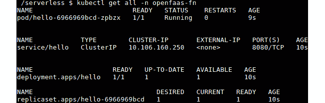

###### 图 9.22：验证 Kubernetes 对象

因此，我们已成功将`hello`函数部署到 OpenFaaS 框架中。

### 列出 OpenFaaS 函数

`faas-cli list`命令用于列出部署在 OpenFaaS 框架上的所有函数：

```
$ faas-cli list
```

输出应如下所示：


###### 图 9.23：列出 OpenFaaS 函数

`faas-cli list`命令的输出将包括以下列：

+   **函数** - 函数的名称

+   **调用** - 函数被调用的次数

+   **副本** - 函数的 Kubernetes pod 副本数

**调用**列的值每次调用函数时都会增加。如果调用率增加，**副本**列的值将自动增加。

如果您想要获取额外的列名为**Image**的附加列，可以在`faas-cli list`命令中使用`--verbose`标志，该列会列出用于部署函数的 Docker 镜像，如下命令所示：

```
$ faas-cli list --verbose
```

输出应该如下所示：

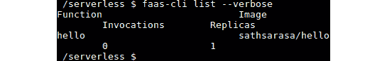

###### 图 9.24：列出 OpenFaaS 函数并显示详细输出

如果我们想要获取关于特定函数的详细信息，可以使用`faas-cli describe` CLI 命令：

```
$ faas-cli describe hello
```

输出应该如下所示：

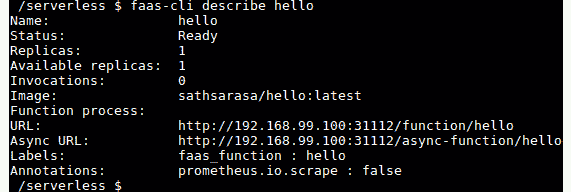

###### 图 9.25：描述一个 OpenFaaS 函数

### 调用 OpenFaaS 函数

现在，函数已部署并准备好被调用。函数可以通过`faas-cli invoke`命令来调用，格式如下：

```
$ faas-cli invoke <function-name>
```

现在，让我们调用在上一步中部署的`hello`函数。

运行以下命令来调用`hello`函数：

```
$ faas-cli invoke hello
```

一旦函数被调用，它将要求您输入输入参数并按*Ctrl + D*停止从标准输入读取。输出应该如下所示：


###### 图 9.26：调用 hello 函数

我们也可以将输入数据发送到函数中，如下命令所示：

```
$ echo "Hello with echo" | faas-cli invoke hello
```

输出应该如下所示：

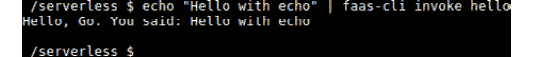

###### 图 9.27：使用管道输入调用 hello 函数

`curl`命令也可以用来调用函数，如下所示：

```
$ curl http://192.168.99.100:31112/function/hello -d "Hello from curl"
```

输出应该如下所示：

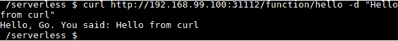

###### 图 9.28：使用 curl 调用 hello 函数

因此，我们已成功使用`faas-cli invoke`命令和`curl`命令调用了`hello`函数。

### 删除 OpenFaaS 函数

`faas-cli remove`命令用于从 OpenFaaS 集群中删除函数，可以通过使用`-f`标志指定函数定义文件，或者显式指定函数名称，如下命令所示：

```
$ faas-cli remove <function-name>
```

或者，使用以下命令：

```
$ faas-cli remove -f <function-definition-file>
```

我们可以使用以下命令删除我们之前创建的`hello`函数：

```
$ faas-cli remove hello
```

输出应如下所示：


###### 图 9.29：删除 hello 函数

在这些部分中，我们学习了如何使用`faas-cli`命令行创建、部署、列出、调用和删除 OpenFaaS 函数。现在，让我们继续进行一个练习，我们将创建我们的第一个 OpenFaaS 函数。

### 练习 30：创建具有依赖关系的 OpenFaaS 函数

在这个练习中，我们将创建一个 Python 函数，通过调用外部 API 来打印源 IP 地址。我们将使用`requests` Python 模块来调用这个 API：

1.  使用**Python3**模板创建一个名为`ip-info`的新函数：

```
$ faas-cli new ip-info --lang=python3 
```

输出应如下所示：

图 9.30：创建 ip-info 函数模板

](image/C12607_09_30.jpg)

###### 图 9.30：创建 ip-info 函数模板

1.  更新`ip-info/requirements.txt`文件，添加我们需要从函数中调用 HTTP 请求的`requests` `pip`模块：

```
requests
```

1.  更新`ip-info/handler.py`文件以调用[`httpbin.org/ip`](https://httpbin.org/ip)端点。这个端点是一个简单的服务，将返回发起请求的 IP。以下代码将向[`httpbin.org/ip`](https://httpbin.org/ip)端点发送 HTTP GET 请求，并返回原始 IP 地址：

```
import requests
import json
def handle(req):
    api_response = requests.get('https://httpbin.org/ip')
    json_object = api_response.json()
    origin_ip = json_object["origin"]
    return "Origin IP is " + origin_ip
```

1.  使用`faas-cli up`命令构建、推送和部署`ip-info`函数。`faas-cli up`命令将在后台执行`faas-cli build`、`faas-cli push`和`faas-cli deploy`命令，构建函数，将 Docker 镜像推送到 Docker 注册表，并在 OpenFaaS 框架上部署函数：

```
$ faas-cli up -f ip-info.yml
```

`faas-cli up`命令将打印以下输出，列出构建、推送和部署`ip-info`函数的步骤：

```
[0] > Building ip-info.
Clearing temporary build folder: ./build/ip-info/
Preparing ./ip-info/ ./build/ip-info//function
Building: sathsarasa/ip-info:latest with python3 template. Please wait..
Sending build context to Docker daemon  9.728kB
...
Successfully built 1b86554ad3a2
Successfully tagged sathsarasa/ip-info:latest
Image: sathsarasa/ip-info:latest built.
[0] < Building ip-info done.
[0] worker done.
[0] > Pushing ip-info [sathsarasa/ip-info:latest].
The push refers to repository [docker.io/sathsarasa/ip-info]
... 
latest: digest: sha256:44e0b0e1eeca37f521d4e9daa1c788192cbc0ce6ab898c5e71cb840c6d3b4839 size: 4288
[0] < Pushing ip-info [sathsarasa/ip-info:latest] done.
[0] worker done.
Deploying: ip-info.
WARNING! Communication is not secure, please consider using HTTPS. Letsencrypt.org offers free SSL/TLS certificates.
Deployed. 202 Accepted.
URL: http://192.168.99.100:31112/function/ip-info
```

1.  使用以下`curl`命令调用`ip-info`函数：

```
$ curl http://192.168.99.100:31112/function/ip-info
```

输出应如下所示：


###### 图 9.31：调用 ip-info 函数模板

1.  最后，删除`ip-info`函数：

```
$ faas-cli remove ip-info
```

因此，我们已经创建、部署和调用了一个名为`ip-info`的 OpenFaaS 函数，它将打印函数调用者的源 IP 地址。

### 使用 OpenFaaS Portal 部署和调用函数

OpenFaaS 框架配备了一个内置的 UI，允许我们从 Web 浏览器部署和调用功能。它可以用于部署自定义功能或功能存储库中的功能。OpenFaaS 功能存储库是一组免费提供的预构建功能。这些功能可以轻松部署到我们现有的 OpenFaaS 集群上。

OpenFaaS 门户网址的格式是`http://<openfaas-gateway-endpoint>/ui`。让我们使用以下命令从我们之前设置的`$OPENFAAS_URL`环境变量中获取 OpenFaaS 门户网址：

```
echo $OPENFAAS_URL/ui/
```

输出应该如下所示：


###### 图 9.32：生成 OpenFaaS 门户网址

让我们导航到`http://192.168.99.100:31112/ui/`的输出网址。

您应该能够看到类似以下的门户网址，我们将在接下来的步骤中使用它来部署和调用 OpenFaaS 功能：

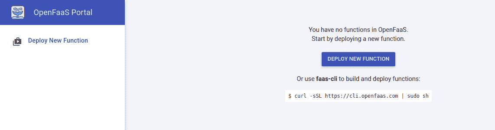

###### 图 9.33：导航到 OpenFaaS 门户网址

部署功能从功能存储

在本节中，我们将学习如何从功能存储库部署功能。首先，在 OpenFaaS 门户网站中点击**部署新功能**按钮。这将提示您显示一个对话框，其中列出了功能存储库中所有可用的功能。在本节中，我们将部署**Figlet**功能，它可以从提供的字符串输入生成 ASCII 标志。从功能列表中选择**Figlet**，然后点击**部署**按钮，如下图所示：

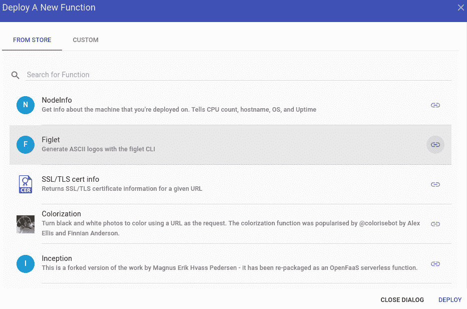

###### 图 9.34：部署 figlet 功能

这就是您需要做的全部！这将在我们现有的 OpenFaaS 集群中部署**Figlet**功能。现在，您将能够在 OpenFaaS 门户网站的左侧边栏中看到一个名为**figlet**的新功能，如下图所示：

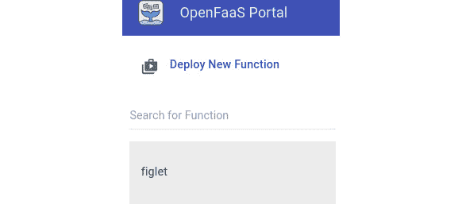

###### 图 9.35：验证 figlet 功能

让我们从 OpenFaaS 门户网站调用功能。您需要点击功能名称，然后屏幕的右侧面板将显示有关功能的信息，包括功能状态、调用计数、副本计数、功能图像和功能网址：

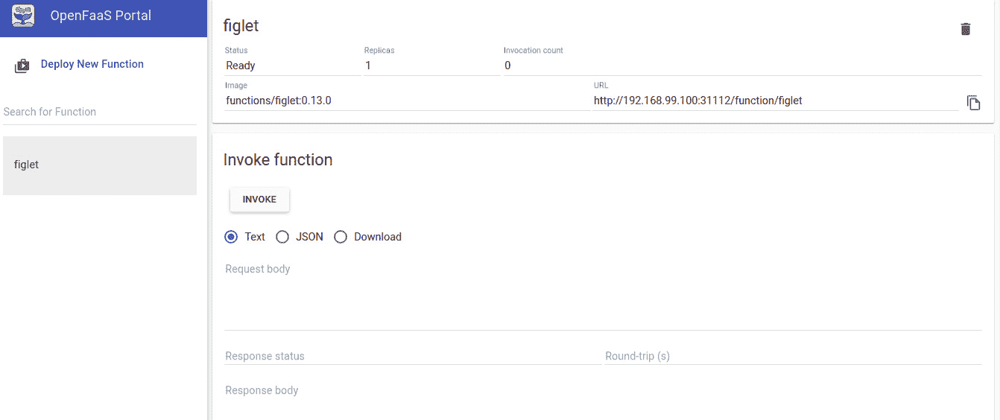

###### 图 9.36：Figlet 功能描述

我们可以通过单击**调用**按钮来调用此函数，该按钮位于**调用函数**部分下方。如果函数需要输入值，您可以在调用函数之前在**请求体**部分提供输入值。

让我们通过提供**OpenFaaS**字符串作为请求体来调用**figlet**函数，如下图所示：

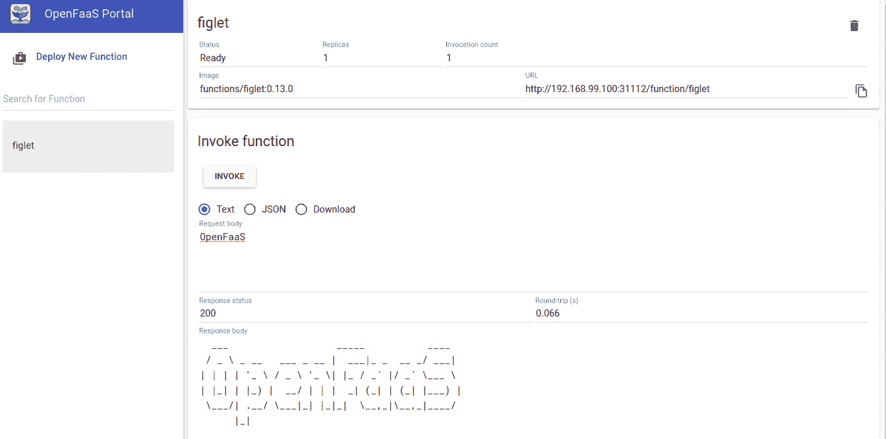

###### 图 9.37：调用 figlet 函数

现在，您可以看到函数的预期输出。这将是我们在调用函数时提供的输入值的 ASCII 标志。此外，UI 将为您提供函数调用的响应状态代码和执行持续时间。

**部署自定义函数**

现在，让我们使用我们之前构建的 Docker 镜像部署一个名为`hello`的自定义函数。在从 OpenFaaS 门户部署函数之前，我们应该编写我们的函数，并使用`faas-cli`命令构建和推送 Docker 镜像。

再次单击**部署新函数**按钮，然后从对话框中选择**CUSTOM**选项卡。现在，我们需要提供 Docker 镜像名称和函数名称作为必填字段。让我们提供我们之前构建的`hello` Docker 镜像（<your-docker-id>/hello）并提供`hello-portal`作为函数名称，然后单击**DEPLOY**按钮：

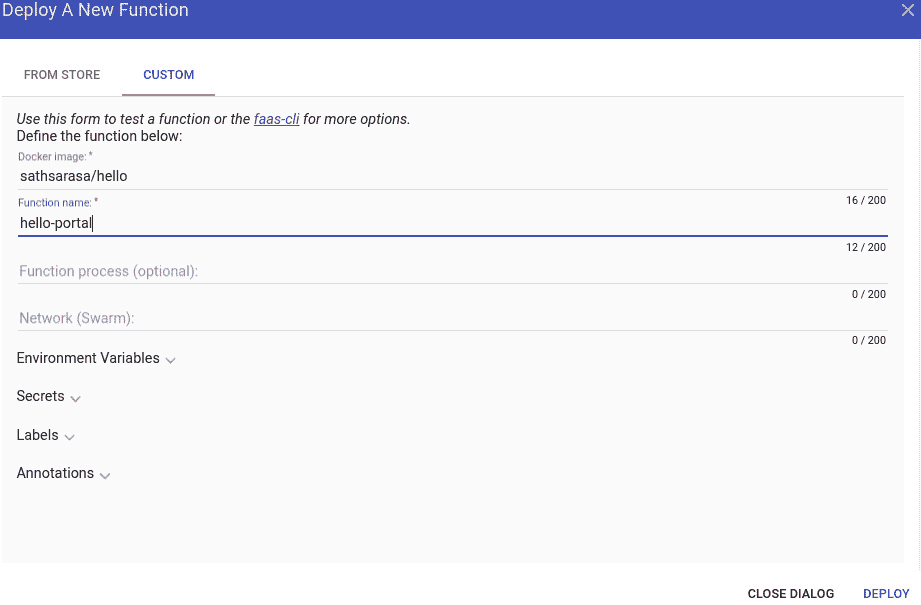

###### 图 9.38：部署 hello-portal 函数

然后，您将看到**hello-portal**函数添加到 OpenFaaS 门户的左侧菜单中：

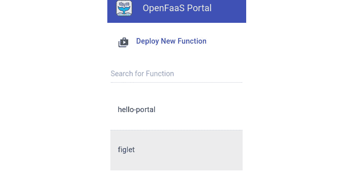

###### 图 9.39：验证 hello-portal 函数

现在，您可以按照我们之前讨论的类似步骤来调用`hello-portal`函数。

### 具有 HTML 输出的 OpenFaaS 函数

在本节中，我们将设置一个 OpenFaaS 函数来返回 HTML 内容。这使我们能够使用 OpenFaaS 框架创建静态和动态网站。

首先，我们将使用**php7**模板创建`html-output`函数，如下命令所示：

```
$ faas-cli new html-output --lang=php7
```

输出应该如下所示：

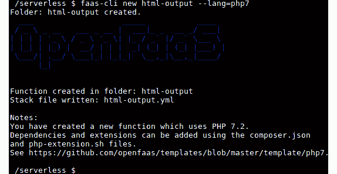

###### 图 9.40：创建 html-output 函数

然后，我们将更新生成的`Handler.php`文件，以使用以下命令返回硬编码的 HTML 字符串：

使用您喜欢的文本编辑器打开`html-output/src/Handler.php`文件。以下命令将使用`vi`编辑器打开此文件：

```
$ vi html-output/src/Handler.php
```

将以下内容添加到文件中。这是一个简单的 PHP 代码，将返回文本`OpenFaaS HTML Output`，格式化为 HTML 标题文本：

```
<?php
namespace App;
/**
 * Class Handler
 * @package App
 */
class Handler
{
    /**
     * @param $data
     * @return
     */
    public function handle($data) {
        $htmlOutput = "<html><h1>OpenFaaS HTML Output</h1></html>";
        return $htmlOutput;
    }
}
```

现在，PHP 函数已经准备好输出 HTML。下一步是将函数的`Content-Type`配置为`text/html`。这可以通过更新函数定义文件的`environment`部分来完成。让我们在`html-output.yml`文件中更新`environment`部分，添加`content_type: text/html`，如下所示：

```
$ vi html-output.yml
provider:
  name: faas
  gateway: http://192.168.99.100:31112
functions:
  html-output:
    lang: php7
    handler: ./html-output
    image: sathsarasa/html-output:latest
    environment:
      content_type: text/html
```

现在，让我们使用`faas-cli up`命令构建、推送和部署`html-output`函数：

```
$ faas-cli up -f html-output.yml
```

执行上述命令后，我们将收到类似以下的输出：

```
[0] > Building html-output.
Clearing temporary build folder: ./build/html-output/
Preparing ./html-output/ ./build/html-output//function
Building: sathsarasa/html-output:latest with php7 template. Please wait..
Sending build context to Docker daemon  13.31kB
...
Successfully built db79bcf55f33
Successfully tagged sathsarasa/html-output:latest
Image: sathsarasa/html-output:latest built.
[0] < Building html-output done.
[0] worker done.
[0] > Pushing html-output [sathsarasa/html-output:latest].
The push refers to repository [docker.io/sathsarasa/html-output]
b7fb7b7178f2: Pushed 
06f1d60fbeaf: Pushed 
b2f016541c01: Pushed 
1eb73bc41394: Pushed 
dc6f559fd649: Mounted from sathsarasa/php7 
e50d92207970: Mounted from sathsarasa/php7 
9bd686c066e4: Mounted from sathsarasa/php7 
35b76def1bb4: Mounted from sathsarasa/php7 
34986ef73af3: Mounted from sathsarasa/php7 
334b08a7c2ef: Mounted from sathsarasa/php7 
5833c19f1f2c: Mounted from sathsarasa/php7 
98d2cfd0a4c9: Mounted from sathsarasa/php7 
24291ffdb574: Mounted from sathsarasa/php7 
eb2c5ec03df0: Pushed 
3b051c6cbb79: Pushed 
99abb9ea3d15: Mounted from sathsarasa/php7 
be22007b8d1b: Mounted from sathsarasa/php7 
83a68ffd9f11: Mounted from sathsarasa/php7 
1bfeebd65323: Mounted from sathsarasa/php7 
latest: digest: sha256:ec5721288a325900252ce928f8c5f8726c6ab0186449d9414baa04e4fac4dfd0 size: 4296
[0] < Pushing html-output [sathsarasa/html-output:latest] done.
[0] worker done.
Deploying: html-output.
WARNING! Communication is not secure, please consider using HTTPS. 
Letsencrypt.org offers free SSL/TLS certificates.
Deployed. 202 Accepted.
URL: http://192.168.99.100:31112/function/html-output
```

函数现在已经成功部署。现在，我们可以从 Web 浏览器访问函数 URL，网址为 http://192.168.99.100:31112/function/html-output，以查看输出，如下图所示：

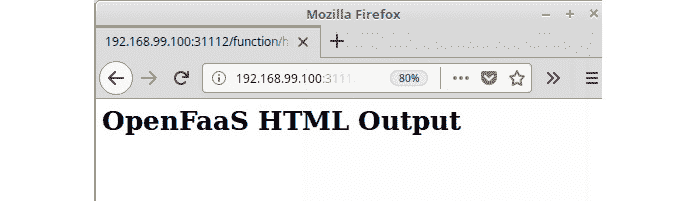

###### 图 9.41：调用 html-output 函数

### 练习 31：基于路径参数返回 HTML

在这个练习中，我们将创建一个函数，根据函数 URL 的路径参数之一返回两个静态 HTML 文件：

1.  创建一个名为`serverless-website`的新函数，基于`php7`模板：

```
$ faas-cli new serverless-website --lang=php7
```

输出应该如下所示：

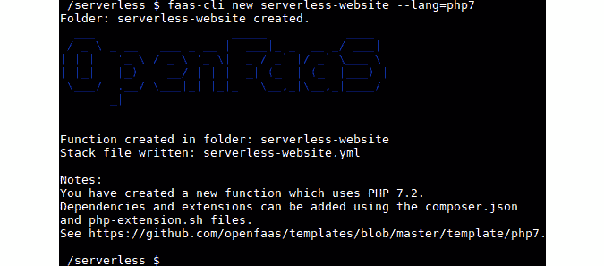

###### 图 9.42：创建 serverless-website 函数

1.  在`serverless-website`内创建 HTML 文件夹，用于存储所有 HTML 文件：

```
$ mkdir serverless-website/src/html
```

1.  创建主页的第一个 HTML 文件（`serverless-website/src/html/home.html`），包含以下代码。这个 HTML 页面将输出文本`Welcome to OpenFaaS Home Page`作为页面标题，以及`OpenFaaS Home`作为页面标题：

```
<!DOCTYPE html>
<html>
  <head>
    <title>OpenFaaS Home</title>
 </head>
 <body>
    <h1>Welcome to OpenFaaS Home Page</h1>
 </body>
</html> 
```

1.  为登录页面创建第二个 HTML 文件（`serverless-website/src/html/login.html`）。这个 HTML 页面将输出一个简单的登录表单，包括`用户名`和`密码`两个字段，以及一个**登录**按钮用于提交表单：

```
<!DOCTYPE html>
<html>
 <head>
    <title>OpenFaaS Login</title>
 </head>
 <body>
    <h1>OpenFaaS Login Page</h1>
    <form id="contact_us_form">
       <label for="username">Username:</label>
       <input type="text" name="username" required>
       <label for="password">Password:</label>
       <input type="text" name="password" required>
       <input type="submit" value="Login">
    </form>
 </body>
</html> 
```

1.  更新处理程序文件（`serverless-website/src/Handler.php`），根据函数 URL 的路径参数返回相应的 HTML 文件，使用以下代码。该函数将接收**home**或**login**作为路径参数进行调用。然后读取路径参数，并根据提供的路径参数相应地设置 HTML 页面名称。下一步是打开 HTML 文件，读取文件内容，最后将文件内容作为函数响应返回：

```
<?php
namespace App;
class Handler
{
    public function handle($data) {
	     // Retrieve page name from path params
		$path_params = getenv('Http_Path');
		$path_params_array = explode('/',$path_params);
		$last_index = count($path_params_array);
		$page_name = $path_params_array[$last_index-1];

		// Set the page name
		$current_dir = __DIR__;
		$html_file_path = $current_dir . "/html/" . $page_name . ".html";

		// Read the file
		$html_file = fopen($html_file_path, "r") or die("Unable to open HTML file!");
		$html_output = fread($html_file,filesize($html_file_path));
		fclose($html_file);

		// Return file content
		return $html_output;	
    }
}
```

1.  在`serverless-website.yml`中将`content_type`设置为`text/html`：

```
version: 1.0
provider:
  name: openfaas
  gateway: http://192.168.99.100:31112
functions:
  serverless-website:
    lang: php7
    handler: ./serverless-website
    image: sathsarasa/serverless-website:latest
    environment:
      content_type: text/html
```

1.  使用以下命令构建、推送和部署`serverless-website`函数：

```
$ faas-cli up -f serverless-website.yml
```

以下是前述命令的输出：

```
[0] > Building serverless-website.
Clearing temporary build folder: ./build/serverless-website/
Preparing ./serverless-website/ ./build/serverless-website//function
Building: sathsarasa/serverless-website:latest with php7 template. Please wait..
Sending build context to Docker daemon  16.38kB
...
Successfully built 24fd037ce0d0
Successfully tagged sathsarasa/serverless-website:latest
Image: sathsarasa/serverless-website:latest built.
[0] < Building serverless-website done.
[0] worker done.
[0] > Pushing serverless-website [sathsarasa/serverless-website:latest].
The push refers to repository [docker.io/sathsarasa/serverless-website]
...
latest: digest: sha256:991c02fa7336113915acc60449dc1a7559585ca2fea3ca1326ecdb5fae96f2fc size: 4298
[0] < Pushing serverless-website [sathsarasa/serverless-website:latest] done.
[0] worker done.
Deploying: serverless-website.
WARNING! Communication is not secure, please consider using HTTPS. Letsencrypt.org offers free SSL/TLS certificates.
Deployed. 202 Accepted.
URL: http://192.168.99.100:31112/function/serverless-website
```

1.  通过以下 URL 验证调用主页和登录页面：

`http://192.168.99.100:31112/function/serverless-website/home`

主页应如下所示：

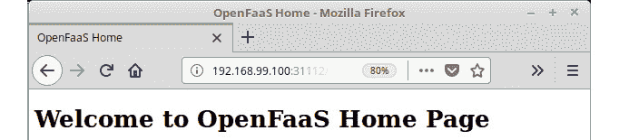

###### 图 9.43：调用无服务器网站功能的主页

接下来，运行以下 URL：`http://192.168.99.100:31112/function/serverless-website/login`。

登录页面应如下所示：

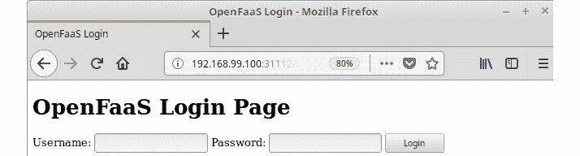

###### 图 9.44：调用无服务器网站功能的登录页面

因此，我们已成功根据路径参数解析了 HTML。

### OpenFaaS 函数可观测性

可观测性是每个生产系统的关键特性。这使我们能够观察系统的健康状况和执行的活动。一旦我们的应用程序部署并在生产环境中运行，我们需要确保它们在功能和性能方面按预期运行。任何服务停机都可能对组织产生负面影响。因此，非常重要观察重要的应用程序指标，如 CPU 使用率、内存使用率、请求计数、响应持续时间等，然后分析是否存在异常。

OpenFaaS 内置了**Prometheus**，可用于收集函数指标。Prometheus 包含时间序列数据库，可用于随时间存储各种指标。OpenFaaS API 网关收集与函数调用相关的指标，并将其存储在 Prometheus 中。以下表显示了 OpenFaaS API 网关公开的指标，并存储在 Prometheus 中：

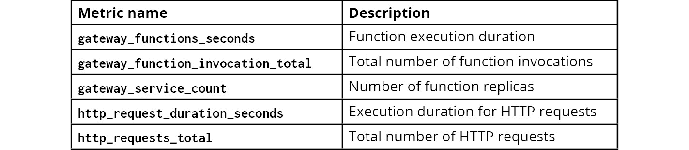

###### 图 9.45：带有描述的函数指标

我们可以使用**Prometheus**仪表板来可视化这些指标。

首先，我们需要暴露安装过程中创建的**Prometheus**部署。执行以下命令将 Prometheus 暴露为`NodePort`服务：

```
$ kubectl expose deployment prometheus -n openfaas --type=NodePort --name=prometheus-ui
```

这将在**30,000**以上的随机端口上暴露 Prometheus 部署。执行以下命令以获取**Prometheus** UI 的 URL：

```
$ MINIKUBE_IP=$(minikube ip)
$ PROMETHEUS_PORT=$(kubectl get svc prometheus-ui -n openfaas -o jsonpath="{.spec.ports[0].nodePort}")
$ PROMETHEUS_URL=http://$MINIKUBE_IP:$PROMETHEUS_PORT/graph
$ echo $PROMETHEUS_URL
```

输出应如下所示：

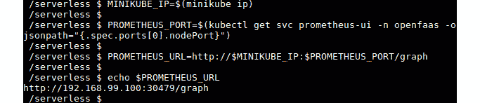

###### 图 9.46：生成 Prometheus URL

对我来说，`PROMETHEUS_URL`输出值为 http://192.168.99.100:30479/graph。但是`<minikube-ip>`和`<node-port>`的值可能不同。

我们可以使用 UI 查看 Prometheus 公开的指标，如下图所示：

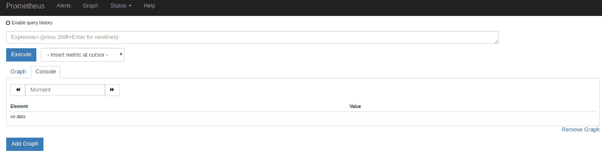

###### 图 9.47：Prometheus UI

在**Expression**区域中键入`gateway_function_invocation_total`，然后单击**Execute**按钮。这将在**Console**选项卡下列出结果。如果需要在线图中查看函数调用次数，请单击**Graph**选项卡。如果要将此图永久添加到 Prometheus 仪表板中，请单击左下角的**Add Graph**按钮，如下图所示：

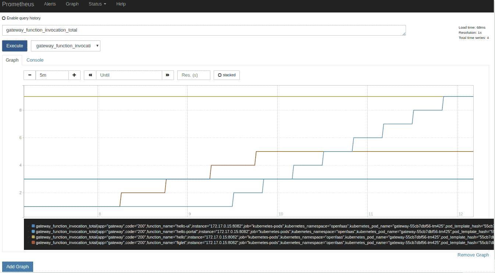

###### 图 9.48：gateway_function_invocation_total 指标的 Prometheus 图

#### 注意

多次调用可用函数，以便我们可以从 Prometheus 仪表板中查看这些调用的统计信息。

除了我们讨论过的 Prometheus 仪表板之外，我们还可以使用**Grafana**来可视化存储在 Prometheus 中的指标。**Grafana**是一个开源工具，用于分析和可视化一段时间内的指标。它可以与多个数据源集成，如**Prometheus**、**ElasticSearch**、**Influx DB**或**MySQL**。在下一个练习中，我们将学习如何使用 OpenFaaS 设置 Grafana 并创建仪表板，以监视存储在 Prometheus 数据源中的指标。

### 练习 32：安装 OpenFaaS Grafana 仪表板

在这个练习中，我们将安装一个 Grafana 仪表板，以查看来自**Prometheus**数据源的指标。然后，我们将在 Grafana 中导入另一个 OpenFaaS 仪表板：

1.  使用`stefanprodan/faas-grafana:4.6.3` Docker 镜像在`openfaas`命名空间中创建`grafana`部署：

```
kubectl run grafana -n openfaas \
    --image=stefanprodan/faas-grafana:4.6.3 \
    --port=3000
```

输出应如下所示：

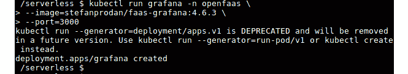

###### 图 9.49：创建 Grafana 部署

1.  使用`NodePort`服务暴露`grafana`部署：

```
kubectl expose deployment grafana -n openfaas  \
    --type=NodePort \
    --name=grafana
```

输出应如下所示：

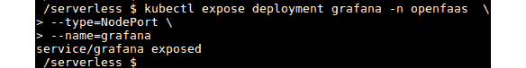

###### 图 9.50：暴露 grafana 端口

1.  使用以下命令找到`grafana`仪表板的 URL：

```
$ MINIKUBE_IP=$(minikube ip)
$ GRAFANA_PORT=$(kubectl get svc grafana -n openfaas -o jsonpath="{.spec.ports[0].nodePort}")
$ GRAFANA_URL=http://$MINIKUBE_IP:$GRAFANA_PORT/dashboard/db/openfaas
$ echo $GRAFANA_URL
```

输出应如下所示：

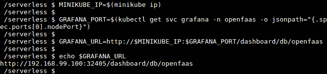

###### 图 9.51：生成 grafana URL

1.  使用上一步中打印的 URL 导航到`grafana` URL：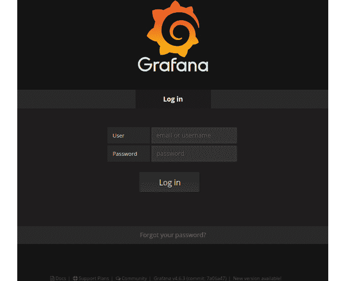

###### 图 9.52：Grafana UI

1.  使用默认凭据（用户名为`admin`，密码为`admin`）登录**Grafana**。

1.  密码是`admin`）。输出应如下所示：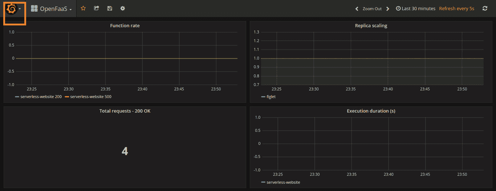

###### 图 9.53：Grafana 仪表板

从左上角的**Grafana 菜单（）**中，如*图 9.53*中所示，选择**仪表板** > **导入**。在**Grafana.com 仪表板**输入框中提供 ID **3434**，然后等待几秒钟以加载仪表板数据：

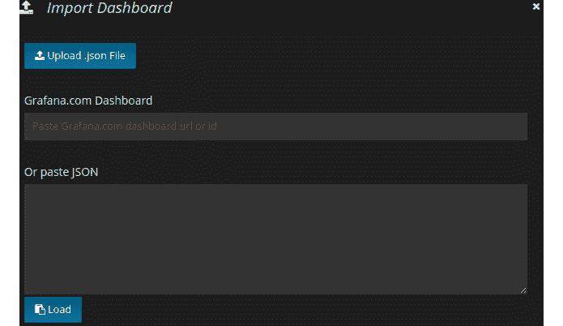

###### 图 9.54：导入新仪表板

1.  从此屏幕中，选择**faas**作为 Prometheus 数据源，然后单击**导入**，如下图所示：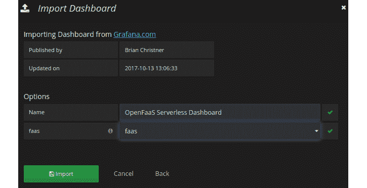

###### 图 9.55：导入新仪表板

1.  现在您可以在新仪表板中看到指标：

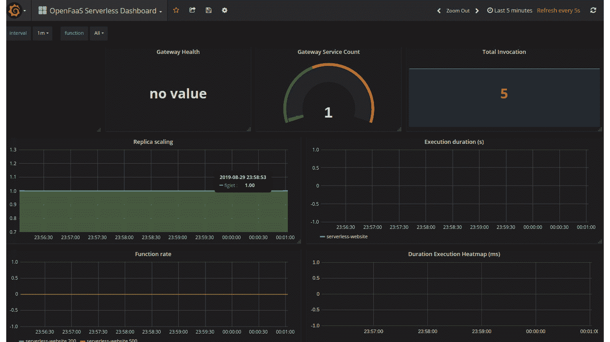

###### 图 9.56：OpenFaaS 无服务器 Grafana 仪表板

因此，我们已成功设置了 Grafana 仪表板，以可视化存储在 Prometheus 中的指标。

### OpenFaaS 函数自动缩放

自动缩放是 OpenFaaS 中可用的一个功能，它根据需求扩展或缩小函数副本。该功能是使用 OpenFaaS 框架提供的**Prometheus**和**Alert Manager**组件构建的。当函数调用频率超过定义的阈值时，Alert Manager 将触发警报。

在部署函数时，使用以下标签来控制函数的最小副本数、最大副本数以及增加/减少函数的因子：

+   `com.openfaas.scale.min` – 这定义了初始副本数，默认为 1。

+   `com.openfaas.scale.max` – 这定义了最大副本数。

+   `com.openfaas.scale.factor` - 这定义了当警报管理器触发警报时，pod 副本增加（或减少）的百分比。默认情况下，这设置为**20%**，应该在**0**和**100**之间。

当 OpenFaaS 部署在 Kubernetes 上时，可以使用 Kubernetes 框架的水平 Pod 自动缩放功能来根据需求自动缩放函数，作为 OpenFaaS 框架提供的内置自动缩放功能的替代方案。

现在让我们部署 OpenFaaS 函数商店中的`figlet`函数，以检查自动缩放功能的运行情况：

```
faas-cli store deploy figlet \
    --label com.openfaas.scale.min=1 \
    --label com.openfaas.scale.max=5
```

输出应该如下所示：

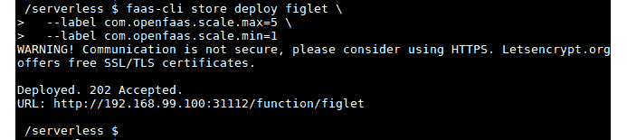

###### 图 9.57：部署 figlet 函数

现在我们可以通过调用它 1,000 次来对`figlet`函数施加负载，如下面的代码所示。以下脚本将通过为函数提供`OpenFaaS`字符串作为输入，并在每次调用之间休眠 0.1 秒，来调用`figlet`函数 1,000 次：

```
for i in {1..1000}
do
   echo "Invocation $i"
   echo OpenFaaS | faas-cli invoke figlet
   sleep 0.1
done
```

转到**Grafana**门户，并观察`figlet`函数的副本数量增加。一旦负载完成，副本计数将开始缩减，并返回到`com.openfaas.scale.min`计数为 1 个函数副本。

输出应该如下所示：

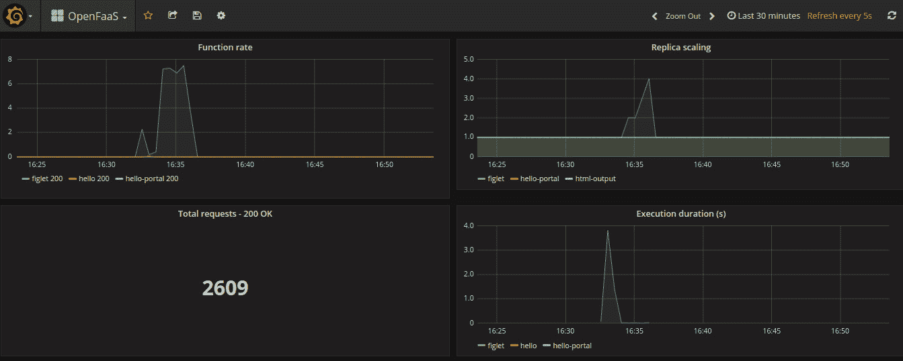

###### 图 9.58：验证自动缩放功能

在本节中，我们介绍了函数自动缩放，讨论了函数自动缩放是什么，以及我们可以使用的配置来设置最小副本计数、最大副本计数和缩放因子。最后，我们部署了一个示例函数，对函数进行了负载，并在 Grafana 仪表板上观察了自动缩放功能。

### 活动 9：OpenFaaS 表单处理器

在这个活动中，我们将为一个品牌创建一个网站，该网站将有一个联系表单，供潜在客户联系品牌人员。我们将广泛使用**OpenFaas**来完成这个网站。

假设你是一名自由职业者，你想创建一个网站来增加你的品牌知名度。这个网站需要有一个“联系我们”表单，让潜在客户联系你。你决定使用无服务器技术创建这个网站，选择 OpenFaaS 作为这项任务的框架。

执行以下步骤完成此活动：

1.  创建一个 SendGrid ([`sendgrid.com`](https://sendgrid.com)) 账户来发送电子邮件并保存 API 密钥。

1.  使用 HTML 创建“联系我们”表格，并使用 OpenFaaS 函数返回 HTML。以下是实现具有`name`、`email`和`message`输入字段以及`submit`按钮功能的 HTML 表单的示例代码；CSS 用于为 HTML 表单添加样式；以及一个 JavaScript 函数，当用户单击`Submit`按钮时将触发该函数，并将表单数据作为`POST`请求发送到`form-processor`函数：

```
<!DOCTYPE html>
<html>
  <head>
    <meta charset="UTF-8">
    <title>OpenFaaS Contact Us  Form</title>         
    <style>
      /** Page  background colour */
      body  {
        background-color: #f2f2f2;
      }  
      /** Style the h1  headers */
      h1 {  
        text-align: center;
        font-family: Arial;

      /** CSS for the input box and textarea */
      input[type=text], input[type=email], textarea {
        width: 100%; 
        margin-top: 10px;   
        margin-bottom: 20px; 
        padding: 12px; 
        box-sizing: border-box; 
        resize: vertical 
      } 
      /** Style the submit  button */
      input[type=submit] {
        color: white;
        background-color: #5a91e8;
        padding: 10px 20px;
        border: none;
        border-radius: 4px;
        cursor: pointer;
      }
      /** Change submit button  color for mouse hover */
      input[type=submit]:hover  {
        background-color: #2662bf;
      } 
      /** Add padding around the form */
       container {
        padding: 20px;
        border-radius: 5px;
      }
     /** Bold font for response and add margin */
  #response { 
    font-weight: bold;
margin-bottom: 20px; 
  }
      </style>
    </head>
    <body>
      <h1>OpenFaaS Contact Form</h1>
      <div class="container">
		<!-- Placeholder for the response -->
        <div id='response'></div>  
        <form id="contact_us_form">
          <label for="name">Name:</label>
          <input type="text" id="name" name="name" required>
          <label for="email">Email:</label>
          <input type="email" id="email" name="email" required>
          <label for="message">Message:</label>
          <textarea id="message" name="message" required></textarea>
          <input type="submit" value="Send Message">
          </form>
      </div>
      <script src="http://code.jquery.com/jquery-3.4.1.min.js"></script>
      <script>     
        $(document).ready(function(){
        $('#contact_us_form').on('submit', function(e){
          // prevent form from submitting.
            e.preventDefault(); 
$('#response').html('Sending message...');
            // retrieve values from the form field
            var name = $('#name').val();
            email = $('#email').val();
            var message = $('#message').val();
            var formData = {
              name: name,
              email: email,
              message: message
            };
            // send the ajax POST request         
            $.ajax({
              type: "POST",
              url: './form-processor',
              data: JSON.stringify(formData)
            })
             done(function(data) {
              $('#response').html(data);
            })
             fail(function(data) {
              $('#response').html(data);
            });
          });
        });
        </script>  
    </body>
</html>
```

1.  创建`form-processor`函数，该函数从联系我们表格中获取表单数值，并将信息发送到指定的电子邮件地址。

1.  使用 Web 浏览器调用**联系我们**表格函数，并验证电子邮件发送。

联系表格应如下图所示：

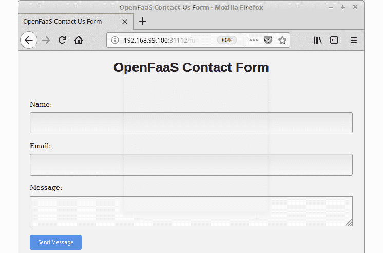

###### 图 9.59：联系我们表格

从联系表格收到的电子邮件应如下截图所示：

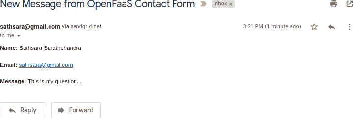

###### 图 9.60：从联系我们表格收到的电子邮件

#### 注意

活动的解决方案可在第 444 页找到。

## 总结

我们从介绍 OpenFaaS 框架开始本章，并继续概述了 OpenFaaS 框架提供的组件。接下来，我们看了如何在本地的`Minikube`集群上安装`faas-cli`和**OpenFaaS**框架。

然后，我们开始研究**OpenFaaS**函数。我们讨论了如何使用`faas-cli`创建函数模板，构建和推送函数 Docker 镜像，并将函数部署到**OpenFaaS**框架。然后，我们学习了如何使用`faas-cli`命令和`curl`命令调用已部署的函数。接下来，我们介绍了**OpenFaaS**门户，这是 OpenFaaS 框架的内置 UI。

我们还学习了如何设置**OpenFaaS**函数来返回 HTML 内容，并根据提供的参数返回不同的内容。我们配置了**Prometheus**和**Grafana**仪表板来可视化函数指标，包括调用次数、调用持续时间和副本计数。然后，我们讨论了函数自动缩放功能，根据需求扩展或缩小函数副本。我们对函数进行了负载测试，并观察了 Grafana 仪表板上的自动缩放功能。

最后，在这个活动中，我们使用**OpenFaaS**框架构建了一个网站的联系我们表单的前端和后端。

通过本书中介绍的概念、各种练习和活动，我们已经为您提供了使用无服务器架构和最先进的容器管理系统 Kubernetes 所需的所有技能。

我们相信您将能够运用这些知识来构建更健壮、更有效的系统，并将它们托管在**AWS Lambda**、**Google Cloud Function**等云提供商上。您还将能够使用**OpenFaaS**、**OpenWhisk**、**Kubeless**等一流框架的高效功能。
