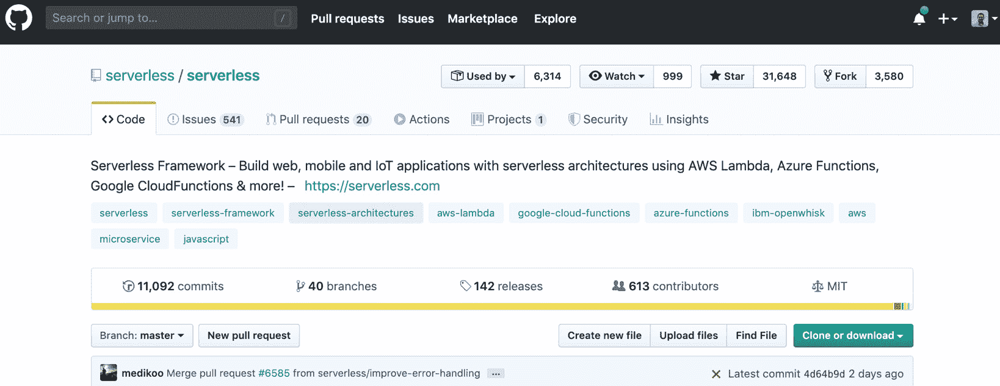
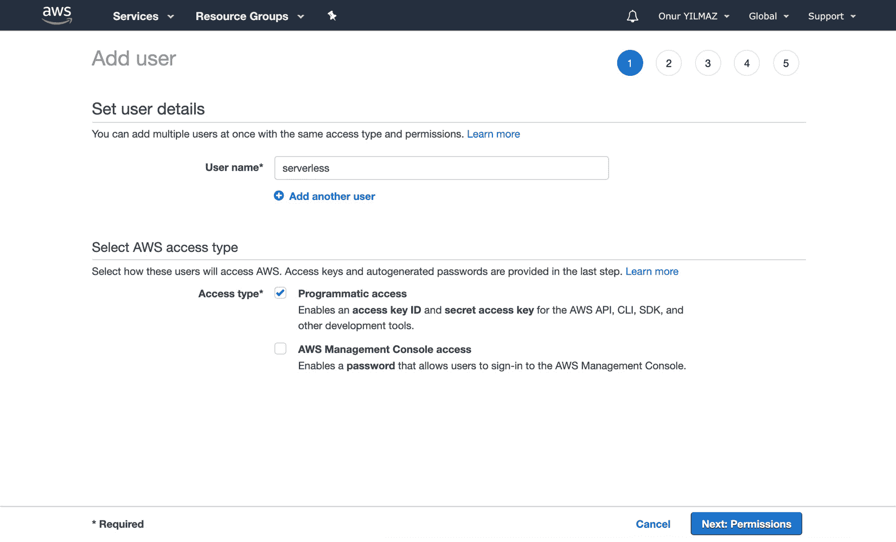
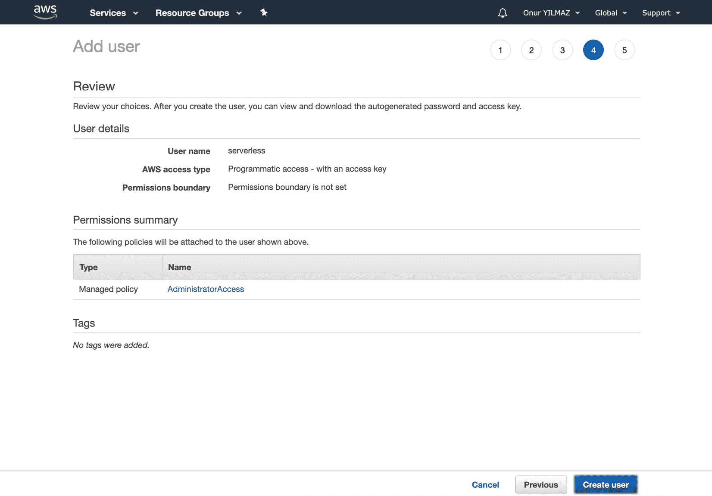
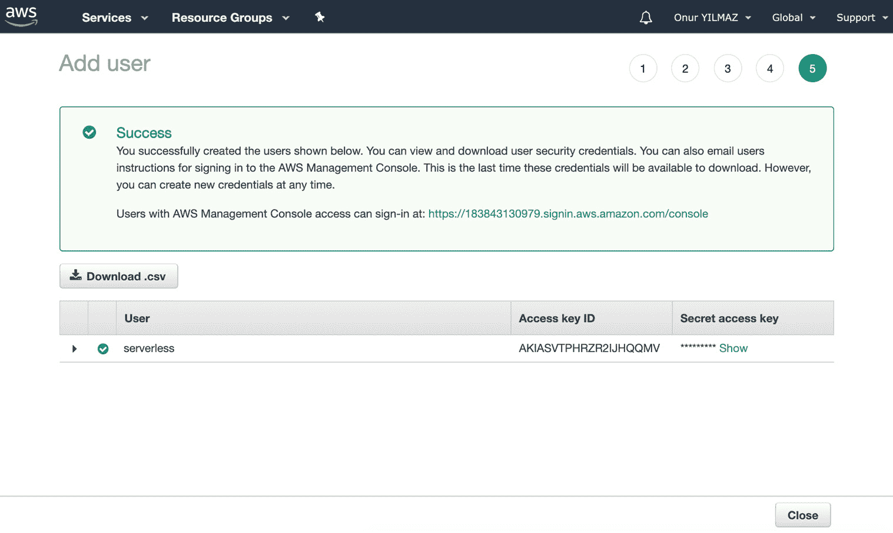
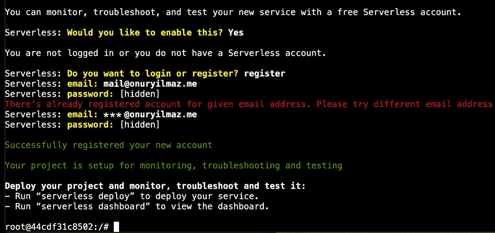
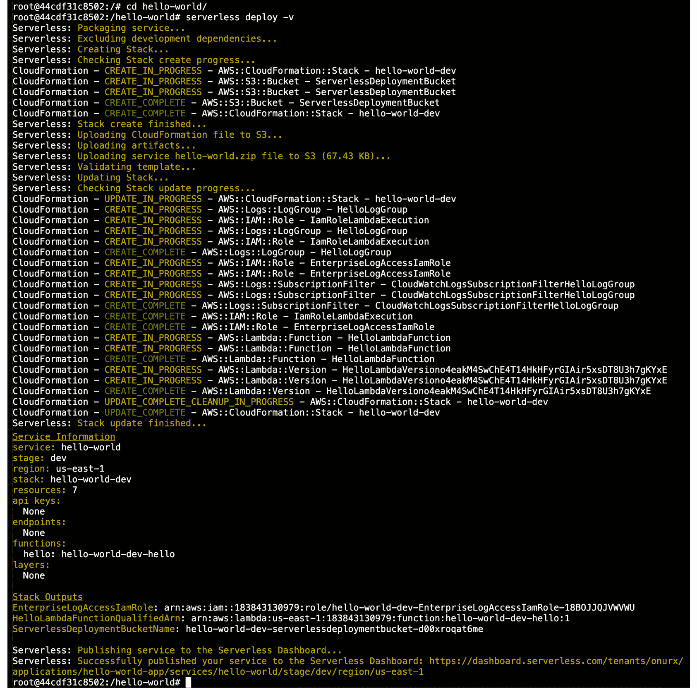
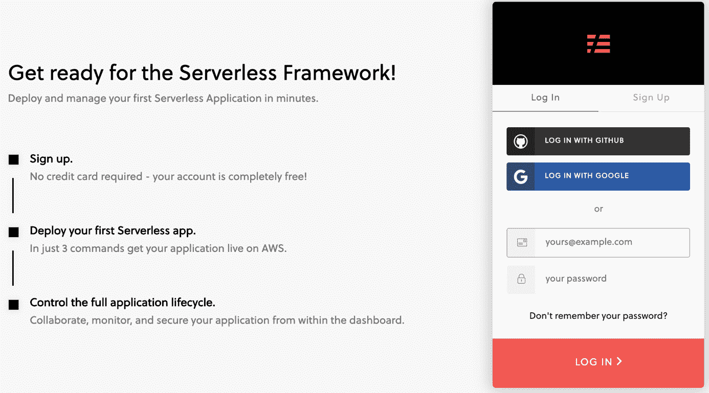

# 3.无服务器框架介绍

## 学习目标

本章结束时，您将能够:

*   比较并有效利用不同的无服务器功能
*   建立一个不依赖云和容器的无服务器框架
*   使用 Fn 框架创建、部署和调用函数
*   使用无服务器框架向云提供商部署无服务器功能
*   创建一个真实的无服务器应用，并在未来的多个云平台上运行它

在本章中，我们将解释无服务器框架，使用这些框架创建我们的第一个无服务器功能，并将其部署到各种云提供商。

## 简介

让我们想象一下，您正在一个云提供商中开发一个具有许多功能的复杂应用。即使新的云提供商更便宜、更快或更安全，转移到另一个云提供商可能也不可行。这种厂商依赖的情况在业内被称为**厂商锁定**，从长远来看是一个非常关键的决策因素。幸运的是，无服务器框架是解决供应商锁定的简单有效的方法。

在前一章中，讨论了三大云提供商及其无服务器产品。这些产品根据其编程语言支持、触发功能和成本结构进行了比较。然而，这三种产品之间仍然有一个看不见的关键区别:*操作*。创建功能、将它们部署到云提供商，以及它们的管理对于每个云提供商都是不同的。换句话说，您不能在 AWS Lambda、谷歌云函数和 Azure 函数中使用相同的函数。需要进行各种更改，以便我们能够满足云提供商及其运行时的要求。

无服务器框架是运行无服务器应用的**开源**、**云不可知**平台。云提供商和无服务器产品之间的第一个区别是它们的无服务器框架是开源的和公共的。他们可以自由地安装在云或内部系统上，并自行操作。第二个特点是无服务器框架是**云不可知的**。这意味着可以在不同的云提供商或您自己的系统上运行相同的无服务器功能。换句话说，将在其中执行功能的云提供商只是无服务器框架中的一个配置参数。所有的云提供商都在一个共享的应用编程接口后面，这样云无关的功能可以由无服务器框架开发和部署。

像 AWS Lambda 这样的云无服务器平台增加了无服务器架构的宣传，并促进了它们在行业中的采用。在前一章中，我们深入讨论了云技术产品多年来的发展以及重要的云无服务器平台。在本章中，我们将讨论开源无服务器框架，并讨论它们的特性和功能。市场上有许多流行的和即将推出的无服务器框架。然而，我们将重点关注两个在优先级和架构方面存在差异的突出框架。在本章中，将介绍一个容器原生无服务器框架，即 **Fn** 。接下来，我们将深入讨论一个支持多个云提供商的更全面的框架，即**无服务器框架**。虽然这两个框架都为运行无服务器应用创建了一个与云无关的开源环境，但它们在实现和开发人员体验方面的差异将会得到说明。

## Fn 框架

Fn 于 2017 年由**甲骨文**在 *JavaOne 2017* 大会上宣布，作为一个事件驱动和开源的**功能即服务** ( **FaaS** )平台。该框架的主要特点如下:

*   **开源:**所有 **Fn** 项目的源代码在[https://github.com/fnproject/fn](https://github.com/fnproject/fn)公开，项目托管在 [https://fnproject.io](https://fnproject.io) 。它在 GitHub 上有一个活跃的社区，有超过 3，300 个提交和 1，100 个发布，如下图截图所示:


###### 图 3.1:GitHub 上的 Fn

*   **容器原生:**容器和微服务改变了软件开发和操作的方式。 **Fn** 是容器原生的，这意味着每个功能都被打包并部署为 Docker 容器。此外，还可以创建自己的 Docker 容器，并将其作为函数运行。
*   **语言支持:**框架正式支持 **Go** 、 **Java** 、 **Node.js** 、 **Ruby** 、 **Python** 。另外， **C#** 得到了社区的支持。
*   **云不可知:** **Fn** 可以在每个云提供商或内部部署系统上运行，只要安装并运行 Docker 即可。这是 **Fn** 最关键的特点，因为它完全避免了厂商锁定的问题。如果这些功能不依赖于任何特定于云的服务，就有可能在云提供商和内部系统之间快速移动。

作为一个云不可知和容器原生的平台， **Fn** 是一个以开发人员为中心的框架。它增强了开发人员的体验和敏捷性，因为您可以在本地开发、测试和调试，并使用相同的工具部署到云中。在下面的练习中，我们将安装并配置 **Fn** ，以便开始使用该框架。

#### 注意

在开始下一个练习之前，应在您的计算机上安装并运行 Docker **17.10.0-ce** 或更高版本，因为这是 **Fn** 的先决条件。

### 练习 7:开始使用 Fn 框架

在本练习中，您将在本地计算机上安装和配置一个不依赖于云和容器的无服务器框架。本练习的目的是说明配置和安装 Fn 框架是多么简单，这样您就可以开始使用无服务器框架了。

要成功完成本练习，我们需要确保执行以下步骤:

1.  In your Terminal, type the following command:

    ```
    curl -LSs https://raw.githubusercontent.com/fnproject/cli/master/install | sh
    ```

    该命令下载并安装 Fn 框架。完成后，会打印出版本号，如下图所示:

    

    ###### 图 3.2:Fn 的安装

2.  Start the **Fn** server by using the following command in your Terminal:

    ```
    fn start -d
    ```

    该命令下载 **Fn** 服务器的 Docker 映像，并在容器内启动，如下图所示:

    

    ###### 图 3.3:启动 Fn 服务器

3.  Check the client and server version by using the following command in your Terminal:

    ```
    fn version
    ```

    输出应如下所示:

    

    ###### 图 3.4: Fn 服务器和客户端版本

    该输出显示客户端和服务器端都在运行并相互交互。

4.  Update the current Fn context and set a local development registry:

    ```
    fn use context default && fn update context registry serverless
    ```

    输出如下图所示:

    

    ###### 图 3.5:当前上下文的注册表设置

    如输出所示，**默认**上下文被设置，注册表被更新为**无服务器**。

5.  Start the **Fn** dashboard by using the following command in your Terminal:

    ```
    docker run -d --link fnserver:api -p 4000:4000 -e "FN_API_URL=http://api:8080" fnproject/ui
    ```

    该命令下载 **fnproject/ui** 映像，并在**分离**模式下启动。此外，它将 **fnserver:api** 链接到自身，并发布 **4000** 端口，如下图截图所示:

    

    ###### 图 3.6:启动 Fn 用户界面

6.  Check the running Docker containers with the following command:

    ```
    docker ps
    ```

    不出所料，两个容器分别运行 **Fn** ，映像名称分别为 **fnproject/ui** 和 **fnproject/fnserver:最新**，如下图截图所示:

    

    ###### 图 3.7: Docker 容器

7.  Open **http://localhost:4000** in your browser to check the Fn UI.

    Fn 仪表板将应用和功能统计作为网络应用列出，如下图所示:


###### 图 3.8: Fn 仪表板

在本练习中，我们安装了 **Fn** 框架，以及它的客户端、服务器和仪表板。由于 **Fn** 是一个与云无关的框架，因此可以通过图示的步骤安装任何云或内部系统。我们将继续讨论 **Fn** 框架如何配置和部署功能。

**Fn** 框架旨在与应用一起工作，其中每个应用都是一组具有自己的路由映射的函数。例如，假设您已经将您的功能分组到一个文件夹中，如下所示:

```
- app.yaml
- func.yaml
- func.go
- go.mod
- products/
  - func.yaml
  - func.js
- suppliers/
  - func.yaml
  - func.rb
```

在每个文件夹中，都有一个 **func.yaml** 文件，该文件用 **Ruby** 、 **Node.js** 或任何其他支持的语言定义了具有相应实现的函数。此外，在根文件夹中还有一个 **app.yaml** 文件来定义应用。

先来看看 **app.yaml** 的内容:

```
name: serverless-app
```

**app.yaml** 用于定义无服务器应用的根目录，包括应用的名称。根文件夹中还有该函数的三个附加文件:

*   **func.go** : Go 实现代码
*   **go.mod** : Go 依赖项定义
*   **功能说明**:功能定义和触发信息

对于带有 HTTP 触发器和 Go 运行时的函数，定义了以下 **func.yaml** 文件:

```
name: serverless-app
version: 0.0.1
runtime: go
entrypoint: ./func
triggers:
- name: serverless-app
  type: http
  source: /serverless-app
```

当您将所有这些功能部署到 Fn 时，可以通过以下网址访问它们:

```
http://serverless-kubernetes.io/ 		-> root function
http://serverless-kubernetes.io/products 	-> function in products/ directory
http://serverless-kubernetes.io/suppliers 	-> function in suppliers/ directory
```

在下面的练习中， **app.yaml** 和 **func.yaml** 文件的内容以及它们的功能实现将通过一个真实的例子来说明。

### 练习 8:在 Fn 框架中运行函数

在本练习中，我们旨在使用 **Fn** 框架创建、部署和调用一个函数。

要成功完成本练习，我们需要确保执行以下步骤:

1.  In your Terminal, run the following commands to create an application:

    ```
    mkdir serverless-app
    cd serverless-app
    echo "name: serverless-app" > app.yaml
    cat app.yaml
    ```

    输出应如下所示:

    

    ###### 图 3.9:创建应用

    这些命令创建一个名为**无服务器应用**的文件夹，然后更改目录，使其位于该文件夹中。最后，创建一个名为 **app.yaml** 的文件，内容为**名称:无服务器 app** ，用于定义应用的根。

2.  Run the following command in your Terminal to create a root function that's available at the **"/"** of the application URL:

    ```
    fn init --runtime ruby --trigger http
    ```

    该命令将在应用的根目录下创建一个带有 HTTP 触发器的 Ruby 函数，如下图所示:

    

    ###### 图 3.10: Ruby 函数创建

3.  Create a subfunction by using the following commands in your Terminal:

    ```
    fn init --runtime go --trigger http hello-world
    ```

    该命令在应用的 **hello-world** 文件夹中用 HTTP 触发器初始化一个 Go 函数，如下图截图所示:

    

    ###### 图 3.11: Go 函数创建

4.  Check the directory of the application by using the following command in your Terminal:

    ```
    ls -l ./*
    ```

    此命令列出根文件夹和子文件夹中的文件，如下图所示:

    

    ###### 图 3.12:文件夹结构

    不出所料，根文件夹中有一个 Ruby 函数，有三个文件: **func.rb** 用于实现， **func.yaml** 用于函数定义， **Gemfile** 用于定义 Ruby 函数依赖关系。

    同样的， **hello-world** 文件夹中有一个 go 函数，有三个文件: **func.go** 用于实现， **func.yaml** 用于函数定义， **go.mod** 用于 Go 依赖项。

5.  Deploy the entire application by using the following command in your Terminal:

    ```
    fn deploy --create-app --all --local
    ```

    该命令通过创建应用并使用本地开发环境来部署所有功能，如下图所示:

    

    ###### 图 3.13:应用部署到 Fn

    首先建立**无服务器 app** 的函数，然后创建函数和触发器。同样的， **hello-world** 功能也是用相应的功能和触发器来构建和部署的。

6.  List the triggers of the application with the following command and copy the **Endpoints** for **serverless-app-trigger** and **hello-world-trigger**:

    ```
    fn list triggers serverless-app
    ```

    该命令列出了**无服务器应用**的触发器，以及功能、类型、来源和端点信息，如下图所示:

    

    ###### 图 3.14:触发列表

7.  Trigger the endpoints by using the following commands in your Terminal:

    #### 注意

    对于**卷曲**命令，不要忘记使用我们在*步骤 5* 中复制的端点。

    ```
    curl -d Ece http://localhost:8080/t/serverless-app/serverless-app
    ```

    输出应如下所示:

    

    ###### 图 3.15:无服务器应用触发器的调用

    该命令将调用位于应用**根**的**无服务器应用**触发器。由于它是由**名称**有效载荷触发的，它以个人信息回应:**你好，欧洲经委会！**:

    ```
    curl http://localhost:8080/t/serverless-app/hello-world
    ```

    该命令将调用 **hello-world** 触发器，没有任何有效载荷，正如预期的那样，它以**Hello-World**响应，如下图所示:

    

    ###### 图 3.16:hello-world 触发器的调用

8.  Check the application and function statistics from the **Fn** Dashboard by opening **http://localhost:4000** in your browser.

    在主屏幕上，可以看到您的应用及其总体统计数据，以及自动刷新的图表，如下图所示:

    

    ###### 图 3.17: Fn 仪表板–主页

    点击应用列表中的**无服务器应用**，查看更多关于应用功能的信息，如下图截图所示:

    

    ###### 图 3.18: Fn 仪表板-应用

9.  Stop the **Fn** server by using the following command in your Terminal:

    ```
    fn stop
    ```

    该命令将停止 **Fn** 服务器，包括所有功能实例，如下图所示:


###### 图 3.19: Fn 服务器停止

在本练习中，我们在 **Fn** 框架中创建了一个双功能应用并进行部署。我们已经向您展示了如何使用 **fn** 客户端并通过创建函数将函数构建为 Docker 容器。此外，通过 HTTP 调用函数的触发器，并从 **Fn** 仪表盘查看统计数据。作为一个容器本机和云无关的框架，框架的功能是 Docker 容器，它们可以在任何云提供商或本地系统上运行。在下一节中，将介绍另一个无服务器框架，即**无服务器框架**，它更侧重于云提供商集成。

## 无服务器框架

无服务器框架于 2015 年宣布，名称为 **JavaScript 亚马逊网络服务(JAWS)** 。它最初是在 Node.js 中开发的，目的是让人们更容易开发 AWS Lambda 函数。同年，更名为**无服务器框架**并将其范围扩大到其他云提供商和无服务器框架，包括**谷歌云功能**、 **Azure 功能**、**Apacheopen 晶须**、 **Fn** 等。

无服务器框架是开源的，其源代码可在 GitHub:[https://github.com/serverless/serverless](https://github.com/serverless/serverless)获得。它是一个非常受欢迎的存储库，拥有超过 31，000 颗星，如下图所示:



###### 图 3.20:无服务器框架 GitHub 存储库

该框架的官方网站位于[https://serverless.com](https://serverless.com)，提供了大量的文档、用例和示例。无服务器框架的主要特性可以分为四个主要主题:

*   **云不可知**:无服务器框架旨在创建一个云不可知的无服务器应用开发环境，这样供应商锁定就不会成为问题。
*   **可重用组件**:在无服务器框架中开发的无服务器功能是开源的，是可用的。这些组件帮助我们快速创建复杂的应用。
*   **基础设施即代码**:在无服务器框架中开发的所有配置和源代码都是明确定义的，并且可以通过一个命令进行部署。
*   **开发人员体验**:无服务器框架旨在通过其 CLI、配置参数和活跃社区来增强开发人员体验。

无服务器框架的这四个特征使其成为在云中创建无服务器应用的最著名的框架。此外，该框架侧重于无服务器应用整个生命周期的管理:

*   **开发**:可以通过框架 CLI 在本地开发应用，重用开源插件。
*   **部署**:无服务器框架可以部署到多个云平台，从开发到生产都可以铺开和回滚版本。
*   **测试**:框架支持使用命令行客户端功能开箱测试功能。
*   **安全**:框架处理运行功能的秘密和部署的云特定认证密钥。
*   **监控**:无服务器运行时和客户端工具提供无服务器应用的指标和日志。

在下面的练习中，将使用无服务器框架创建、配置无服务器应用，并将其部署到 AWS。该框架将在 Docker 容器中使用，以显示开始使用无服务器应用有多容易。

#### 注意

无服务器框架可以通过 **npm** 下载并安装到本地计算机上。Docker 容器，包括无服务器框架安装，将在下面的练习中使用，以便我们有一个快速和可复制的设置。

在下面的练习中， **hello-world** 功能将使用无服务器框架部署到 AWS Lambda。为了完成本练习，您需要有一个活动的亚马逊网络服务帐户。您可以在[https://aws.amazon.com/](https://aws.amazon.com/)创建账户。

### 练习 9:使用无服务器框架运行函数

在本练习中，我们旨在配置无服务器框架，并使用它部署我们的第一个功能。使用无服务器框架，可以创建与云无关的无服务器应用。在本练习中，我们将把这些功能部署到 AWS Lambda 中。但是，可以将相同的功能部署到不同的云提供商。

为了成功完成本练习，我们需要确保执行以下步骤:

1.  In your Terminal, run the following command to start the Serverless Framework development environment:

    ```
    docker run -it --entrypoint=bash onuryilmaz/serverless
    ```

    该命令将以交互模式启动 Docker 容器。在下面的步骤中，将在这个 Docker 容器中执行操作，如下图所示:

    

    ###### 图 3.21:为无服务器启动 Docker 容器

2.  Run the following command to check the framework version:

    ```
    serverless version
    ```

    该命令列出了框架、插件和 SDK 版本，获得完整的输出表明一切设置正确，如下图所示:

    

    ###### 图 3.22:框架版本

3.  Run the following command to use the framework interactively:

    ```
    serverless
    ```

    按 **Y** 新建项目，下拉选择 **AWS Node.js** ，如下图截图所示:

    

    ###### 图 3.23:在框架中创建新项目

4.  Set the name of the project to **hello-world** and press **Enter**. The output is as follows:

    

    ###### 图 3.24:项目成功创建

5.  Press **Y** for the AWS credential setup question, and then press **Y** again for the **Do you have an AWS account?** question. The output will be as follows:

    

    ###### 图 3.25: AWS 帐户设置

    您现在有了一个创建无服务器用户的网址。复制并保存网址；我们以后会需要的。

6.  Open the URL from *Step 4* in your browser and start adding users to the AWS console. The URL will open the **Add user** screen with predefined selections. Click **Next: Permissions** at the end of the screen, as shown in the following screenshot:

    

    ###### 图 3.26:自动气象站添加用户

7.  The **AdministratorAccess** policy should be selected automatically. Click **Next: Tags** at the bottom of the screen, as shown in the following screenshot:

    

    ###### 图 3.27: AWS 添加用户–权限

8.  If you want to tag your users, you can add optional tags in this view. Click **Next: Review**, as shown in the following screenshot:

    

    ###### 图 3.28:自动气象站添加用户标签

9.  This view shows the summary of the new user. Click **Create User**, as shown in the following screenshot:

    

    ###### 图 3.29:自动气象站添加用户–审查

    您将被重定向到具有**访问密钥 ID** 和**密码**的成功页面，如下图所示:

    

    ###### 图 3.30:自动气象站添加用户-成功

10.  复制密钥标识和秘密访问密钥，以便您可以在本练习的后续步骤和本章的活动中使用它。您需要点击**显示**来显示秘密访问密钥。
11.  Return to your Terminal and press **Enter** to enter the key ID and secret information, as shown in the following screenshot:

    

    ###### 图 3.31:框架中的 AWS 凭证

12.  Press **Y** for the Serverless account enable question and select **register** from the dropdown, as shown in the following screenshot:

    

    ###### 图 3.32:启用无服务器帐户

13.  Write your email and a password to create a Serverless Framework account, as shown in the following screenshot:

    

    ###### 图 3.33:无服务器帐户注册

14.  Run the following commands to change the directory and deploy the function:

    ```
    cd hello-world
    serverless deploy -v 
    ```

    这些命令将使无服务器框架将该功能部署到 AWS 中，如下图所示:

    

    ###### 图 3.34:无服务器框架部署输出

    #### 注意

    输出日志从打包服务和为源代码、工件和函数创建 AWS 资源开始。创建所有资源后，**服务信息**部分将提供功能和网址的摘要。

    在屏幕的最后，你会发现已部署功能的**无服务器仪表盘 URL** ，如下图截图所示:

    

    ###### 图 3.35:堆栈输出

    复制仪表板网址，以便您可以在接下来的步骤中检查功能指标。

15.  Invoke the function by using the following command in your Terminal:

    ```
     serverless invoke --function hello
    ```

    该命令调用部署的函数并输出响应，如下图所示:

    

    ###### 图 3.36:功能输出

    如输出所示，**状态显示**为 **200** ，响应体表示功能响应成功。

16.  Open the Serverless Dashboard URL you copied at the end of Step 8 into your browser, as shown in the following screenshot:

    

    ###### 图 3.37:无服务器仪表板登录

17.  Log in with the email and password you created in *Step 5*.

    您将被重定向到应用列表。展开 **hello-world-app** ，点击**成功部署**行，如下图截图所示:

    

    ###### 图 3.38:无服务器仪表板应用列表

    在函数视图中，包括 API 端点、变量、警报和度量在内的所有运行时信息都是可用的。向下滚动查看调用次数。输出应如下所示:

    

    ###### 图 3.39:无服务器仪表板功能视图

    因为我们只调用了一次函数，所以在图表中你只会看到 **1** 。

18.  Return to your Terminal and delete the function with the following command:

    ```
    serverless remove
    ```

    该命令将删除已部署的函数及其所有依赖项，如下图所示:


###### 图 3.40:删除功能

通过在终端写**退出**退出无服务器框架开发环境容器，如下图截图所示:


###### 图 3.41:退出容器

在本练习中，我们使用无服务器框架创建、配置和部署了一个无服务器功能。此外，通过命令行界面调用该函数，并从无服务器仪表板检查其指标。无服务器框架为云提供商创建了一个全面的抽象，因此它只作为凭证传递给平台。换句话说，在无服务器框架的帮助下，部署到哪里只是一个配置问题。

在下面的活动中，将开发一个真实的无服务器日常天气应用。您将创建一个带有调用时间表的无服务器框架应用，并将其部署到云提供商。此外，天气状态消息将被发送到名为 *Slack* 的基于云的协作工具。

#### 注意

为了完成以下活动，您需要能够访问“松弛”工作区。您可以在[https://slack.com/create](https://slack.com/create)免费使用您现有的 Slack 工作区或创建一个新的工作区。

### 活动 3:松弛状态的每日天气状态功能

本活动的目的是创建一个真实的无服务器应用，在特定的 *Slack* 通道中发送天气状态消息。该功能将使用**无服务器框架**开发，以便将来可以在多个云平台上运行。该功能将被设计为在特定时间为您的团队运行，以便他们了解天气状况，例如早上通勤前的清晨。这些信息将发布在 *Slack* 频道，这是团队内部的主要沟通工具。

为了在团队内共享天气状态，您可以使用([https://github.com/chubin/wttr.in](https://github.com/chubin/wttr.in))中的 **wttr，这是一个免费使用的天气数据提供商。完成后，您将向云提供商部署一项功能，即 **AWS Lambda** :**


###### 图 3.42:每日天气功能

最后，当调度程序调用该函数时，或者当您手动调用它时，您将在您的 Slack 通道中获得关于当前天气状态的消息:


###### 图 3.43:当前天气状态的松弛消息

#### 注意

为了完成本练习，您应该按照“可宽延时间”设置步骤配置可宽延时间。

**松弛设置**

执行以下步骤来配置松弛时间:

1.  在您的可宽延工作区中，单击您的用户名并选择**自定义可宽延时间**。
2.  在打开的窗口中点击**配置应用**。
3.  点击**浏览应用目录**从目录中添加新的应用。
4.  从应用目录的搜索框中找到**传入的网络钩子**。
5.  点击**为**传入网络钩子**应用设置**。
6.  用您特定的频道名称和图标填写传入网络挂钩的配置。
7.  Open your Slack workspace and the channel you configured in Step 6 to be able to check the integration message.

    #### 注意

    松弛设置步骤的详细截图可在第 387 页找到。

执行以下步骤完成本活动。

1.  在您的终端中，在名为**每日天气**的文件夹中创建一个无服务器框架应用结构。
2.  创建一个**包. json** 文件，在**每日天气**文件夹中定义 Node.js 环境。
3.  创建一个 **handler.js** 文件来实现**每日天气**文件夹中的实际功能。
4.  为无服务器应用安装 Node.js 依赖项。
5.  将 AWS 凭据作为环境变量导出。
6.  使用无服务器框架将无服务器应用部署到 AWS。
7.  检查 AWS Lambda 在 AWS 控制台中部署的功能。
8.  使用无服务器框架客户端工具调用该函数。
9.  检查松弛频道的天气状态。
10.  返回您的终端，使用无服务器框架删除该功能。
11.  Exit the Serverless Framework development environment container.

    #### 注意

    这个活动的解决方案可以在第 387 页找到。

## 总结

在本章中，我们通过讨论云提供商的无服务器产品之间的差异来概述无服务器框架。随后，深入讨论了一个容器原生和一个云原生无服务器框架。首先，讨论了 **Fn** 框架，这是一个开源的、容器原生的、与云无关的平台。其次，提出了无服务器框架，这是一个更加面向云的综合框架。此外，两个框架都是在本地安装和配置的。无服务器应用是在两个无服务器框架中创建、部署和运行的。使用无服务器框架的功能调用这些函数，并检查必要的度量以进行进一步分析。在这一章的最后，一个真实的日常天气 Slack 机器人被实现为一个云无关的、使用无服务器框架明确定义的应用。无服务器框架具有云不可知和开发人员友好的特点，对于无服务器开发世界来说至关重要。