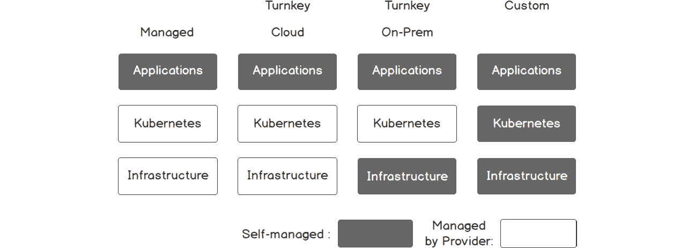
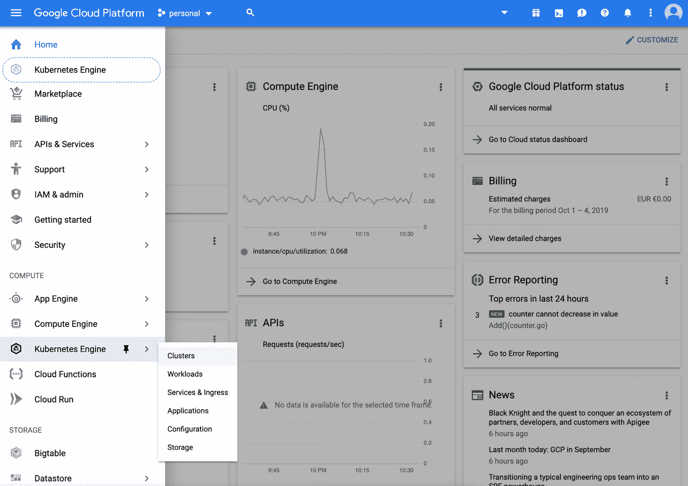
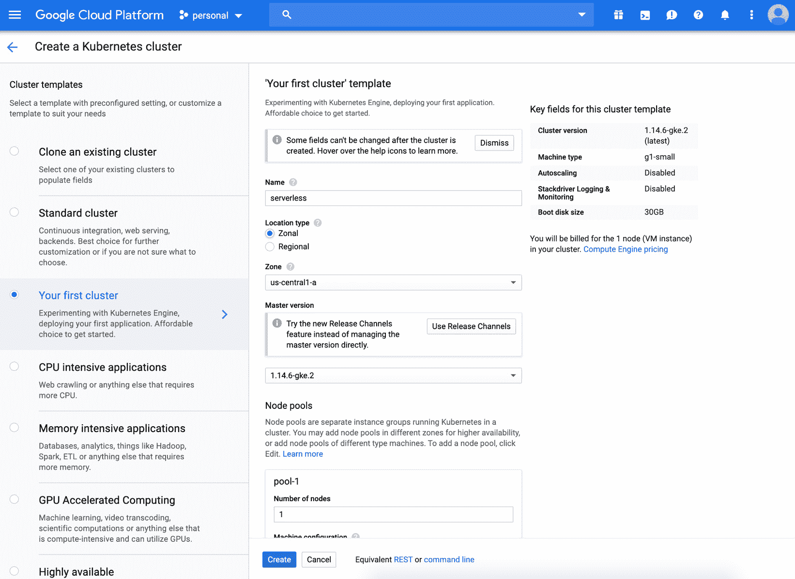
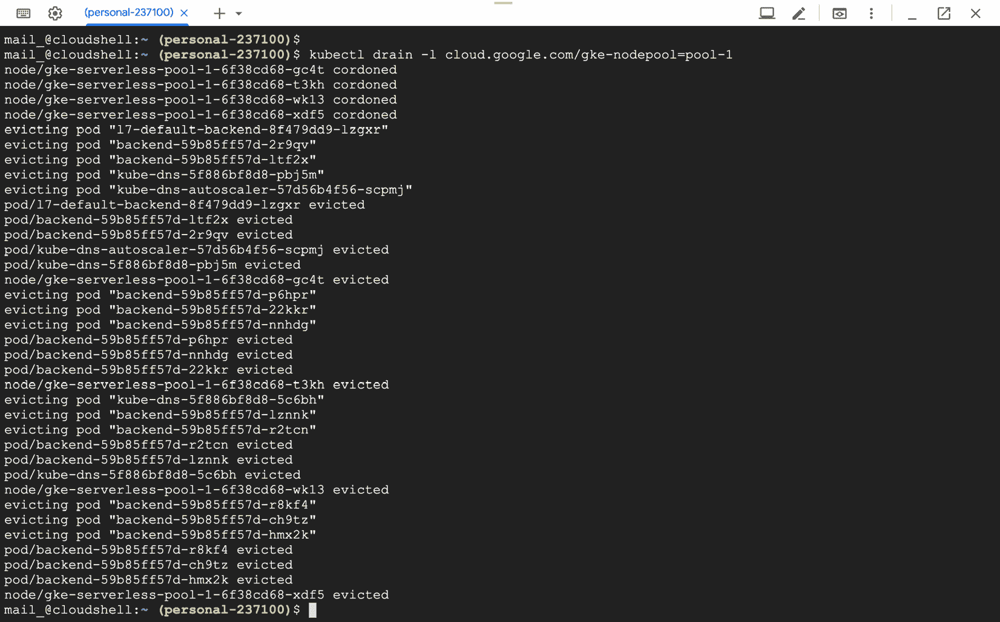

# 5。生产就绪库群集

## 学习目标

本章结束时，您将能够:

*   确定 Kubernetes 集群设置的要求
*   在谷歌云平台(GCP)创建一个生产就绪的 Kubernetes 集群
*   管理集群自动缩放以向 Kubernetes 集群添加新服务器
*   迁移生产集群中的应用

在本章中，我们将了解 Kubernetes 设置的关键注意事项。接下来，我们还将研究不同的 Kubernetes 平台选项。然后，我们继续在云平台中创建一个生产就绪的 Kubernetes 集群，并执行管理任务。

## 简介

在前一章中，我们为开发环境创建了 Kubernetes 集群，并在其中安装了应用。在本章中，重点将放在生产就绪的 Kubernetes 集群以及如何管理它们以获得更好的可用性、可靠性和成本优化。

Kubernetes 是管理在云中作为容器运行的微服务的事实系统。无论是初创企业还是大型企业，都广泛采用它来运行各种应用，包括**数据分析工具**、**无服务器应用**和**数据库**。可伸缩性、高可用性、可靠性和安全性是 Kubernetes 采用它的关键特性。让我们假设您已经决定使用 Kubernetes，因此您需要一个可靠且可观察的集群设置来进行开发和生产。在选择 Kubernetes 提供商和如何操作应用之前，有一些关键的考虑因素取决于您的需求、预算和团队。需要分析四个关键因素:

*   **服务质量:** Kubernetes 以*高可用*可靠的方式运行微服务。然而，可靠、稳健地安装和操作 Kubernetes 至关重要。让我们假设您已经将 Kubernetes 控制平面安装到集群中的单个节点中，并且它由于网络问题而被断开。由于您已经失去了 Kubernetes API 服务器连接，您将无法检查应用的状态并操作它们。因此，评估生产环境所需的 Kubernetes 集群的服务质量至关重要。
*   **监控:** Kubernetes 运行分发到节点的容器，并允许检查它们的日志和状态。让我们假设您昨天推出了应用的新版本。今天，您想要检查最新版本如何处理任何错误、崩溃和响应时间。因此，您需要一个集成到 Kubernetes 集群中的监控系统来捕获日志和指标。收集的数据对于生产就绪集群中的故障排除和诊断至关重要。
*   **安全性:** Kubernetes 组件和客户端工具以安全的方式工作，管理集群中运行的应用。但是，您需要为您的组织定义特定的角色和授权级别，以便安全地操作 Kubernetes 集群。因此，选择一个可以安全连接到客户和同事并与之共享的 Kubernetes 提供商平台至关重要。
*   **运营:** Kubernetes 是所有应用的宿主，包括具有数据合规性、审计和企业级需求的服务。让我们假设您正在 Kubernetes 上运行在线银行应用系统的后端和前端。对于您所在国家的特许银行，您的申请的审计日志应该是可访问的。由于您已经在 Kubernetes 上部署了整个系统，因此该平台应该能够获取审计日志、对它们进行归档和存储。因此，Kubernetes 平台的操作能力对于生产就绪的集群设置至关重要。

为了决定如何安装和操作 Kubernetes 集群，本章将针对 Kubernetes 平台选项讨论这些注意事项。

## 立方设置

Kubernetes 是一个灵活的系统，可以安装在从**树莓 Pi** 到**数据中心**的高端服务器的各种平台上。每个平台在服务质量、监控、安全和运营方面都有其优缺点。Kubernetes 将应用作为容器进行管理，并在基础设施上创建一个抽象层。假设您在地下室的三台旧服务器上设置了 Kubernetes，然后安装了新项目的 **概念** ( **PoC** )的**证明** **。当项目成功时，您希望扩展您的应用，并转移到云提供商，如**亚马逊网络服务** ( **AWS** )。由于您的应用是为在 Kubernetes 上运行而设计的，并且不依赖于基础设施，因此移植到另一个 Kubernetes 安装是很简单的。**

在前一章中，我们研究了使用 Kubernetes 官方方法 **minikube** 的开发环境设置。在本节中，将介绍生产级 Kubernetes 平台。Kubernetes 生产平台可以分为三类，具有以下抽象层:



###### 图 5.1:互连平台

现在让我们一个接一个地看看这些类型。

### 托管平台

托管平台提供 **Kubernetes 即服务**，所有底层服务都在云提供商的控制下运行。设置和扩展这些集群很容易，因为云提供商处理所有基础设施运营。GCP、AWS 和微软 Azure 等领先的云提供商已经管理了 Kubernetes 解决方案应用，打算集成其他云服务，如容器注册、身份服务和存储服务。最受欢迎的托管 Kubernetes 解决方案如下:

*   **谷歌 Kubernetes Engine (GKE):** GKE 是市场上最成熟的托管服务，谷歌作为 GCP 的一部分提供。
*   **Azure Kubernetes 服务(AKS):** AKS 是微软作为 Azure 平台的一部分提供的 Kubernetes 解决方案。
*   **亚马逊为 Kubernetes (EKS)提供的弹性容器服务:** EKS 是 AWS 的托管 Kubernetes。

### 交钥匙平台

交钥匙解决方案专注于在云端或内部系统中安装和操作 Kubernetes 控制平面。统包平台的用户提供关于基础设施的信息，统包平台处理 Kubernetes 设置。统包平台在设置配置和基础设施选项方面提供了更好的灵活性。这些平台大多由在 Kubernetes 和云系统方面有丰富经验的组织设计，如**hepio**或 **CoreOS** 。

如果交钥匙平台安装在 AWS 等云提供商上，基础设施由云提供商管理，交钥匙平台管理 Kubernetes。但是，当统包平台安装在内部系统上时，内部团队应该处理基础架构操作。

### 定制平台

如果您的用例不适合任何托管或统包解决方案，那么可以定制安装 Kubernetes。例如，您可以使用**Gardener**(https://Gardener . cloud)或**OpenShift**(https://www.openshift.com)将 Kubernetes 集群安装到云提供商、内部数据中心、内部虚拟机或裸机服务器。虽然定制平台提供了更灵活的 Kubernetes 安装，但它们也有特殊的操作和维护工作。

在下面的部分中，我们将在 GKE 创建一个托管的 Kubernetes 集群并对其进行管理。GKE 提供市场上最成熟的平台和卓越的客户体验。

## 谷歌库柏发动机

GKE 提供了一个托管的 Kubernetes 平台，该平台得到了谷歌十多年来运行容器化服务的经验的支持。GKE 集群是生产就绪和可扩展的，它们支持上游的 Kubernetes 版本。此外，GKE 专注于通过消除 Kubernetes 集群的安装、管理和操作需求来改善开发体验。

虽然 GKE 提高了开发人员的体验，但它试图将运行 Kubernetes 集群的成本降至最低。它只对集群中的节点收费，并免费提供一个 Kubernetes 控制平面。换句话说，GKE 提供了一个可靠的，可扩展的，健壮的 Kubernetes 控制平面，没有任何成本。对于运行应用工作负载的服务器，将采用通常的 GCP 计算引擎定价。例如，让我们假设您将从两个**n1-standard-1****(vCPUs:1，RAM: 3.75 GB)** 节点开始:

计算如下:

每月总计 1，460 小时

**实例类型**:n1-标准-1

**GCE 实例成本**:48.54 美元

**增韧发动机成本**:0.00 美元

**预计组件成本**:每 1 个月 48.54 美元

如果您的应用需要更高使用率的可扩展性，并且您需要 10 台服务器而不是 2 台，则成本也会呈线性增长:

每月总计 7，300 小时

**实例类型**:n1-标准-1

**GCE 实例费用**:242.72 美元

**增韧发动机成本**:0.00 美元

**预计组件成本**:每 1 个月 242.72 美元

该计算表明，GKE 不对 Kubernetes 控制平面收费，并为每个集群提供可靠、可扩展和健壮的 Kubernetes API。此外，扩展集群的成本线性增加，这使得 Kubernetes 集群的规划和运营更加容易。

在下面的练习中，您将在 GKE 创建一个托管 Kubernetes 集群并连接到它。

#### 注意

为了完成本练习，您需要有一个活跃的 GCP 帐户。你可以在它的官方网站上创建一个账户:https://console.cloud.google.com/start.

### 练习 13:在 GCP 创建Kubernetes集群

在本练习中，我们将在 GKE 创建一个 Kubernetes 集群，并安全地连接到它以检查节点状态。谷歌云平台仪表板和命令行界面工具保持了高水平的开发人员体验。因此，如果您需要一个生产就绪的 Kubernetes 集群，您将在不到 10 分钟的时间内拥有一个功能齐全的控制平面和服务器节点。

为了完成练习，我们需要确保执行以下步骤:

1.  Click **Kubernetes Engine** in the left menu under **Compute** on the Google Cloud Platform home page, as shown in the following figure:

    

    ###### 图 5.2:谷歌云平台主页

2.  Click **Create Cluster** on the **Clusters** page, as shown in the following figure:

    

    ###### 图 5.3:集群视图

3.  Select **Your first cluster** in the left from **Cluster templates** and write **serverless** as the name. Click **Create** at the end of the page, as shown in the following figure:

    

    ###### 图 5.4:集群创建

4.  Wait a couple of minutes until the cluster icon becomes green and then click the **Connect** button, as you can see in the following figure:

    

    ###### 图 5.5:集群列表

5.  Click **Run in Cloud Shell** in the **Connect to the cluster** window, as shown in the following figure:

    

    ###### 图 5.6:连接到集群视图

6.  Wait until the cloud shell is open and available and press *Enter* when the command is shown, as you can see in the following figure:

    

    ###### 图 5.7:云外壳

    输出显示集群的认证数据被提取，并且 **kubeconfig** 条目准备使用。

7.  Check the nodes with the following command in the cloud shell:

    ```
    kubectl get nodes
    ```

    由于群集是用一个节点的单个节点池创建的，因此只有一个节点连接到群集，如下图所示:

    

    ###### 图 5.8:节点列表

8.  Check for the pods running in the cluster with the following command in the cloud shell:

    ```
    kubectl get pods --all-namespaces
    ```

    由于 GKE 管理控制平面，因此在 **kube-system** 命名空间中没有 **api 服务器**、 **etcd** 或**调度器**的容器。群集中仅运行网络和指标单元，如下图所示:


###### 图 5.9: Pod 列表

通过本练习，您已经在 GKE 创建了一个生产就绪的 Kubernetes 集群。几分钟后，GKE 创建了一个托管的 Kubernetes 控制平面，并将服务器连接到集群。在接下来的部分中，将讨论管理生产环境的集群，并将扩展本练习中的 Kubernetes 集群。

## 自动校准立方簇

Kubernetes 集群旨在可靠地运行可扩展的应用。换句话说，如果 Kubernetes 集群今天运行您的应用的 **10 个实例**，那么它将来也应该支持运行 **100 个实例**。达到这种灵活性水平的主流方法有两种:*冗余*和*自动缩放*。让我们假设应用的 10 个实例运行在集群中的 3 台服务器上。有了冗余，您至少需要 27 台额外的空闲服务器，以便将来能够运行 100 个实例。这也意味着要支付空服务器以及运营和维护成本。通过自动缩放，您需要自动化过程来创建或删除服务器。自动缩放确保没有过多的空闲服务器，并在满足可伸缩性要求的同时最小化成本。

**GKE 集群自动缩放器**是现成的解决方案，用于处理 Kubernetes 集群中的自动缩放。启用后，如果工作负载没有剩余容量，它会自动添加新服务器。同样，当服务器利用率不足时，自动缩放器会删除冗余服务器。此外，自动缩放器定义了最小和最大服务器数量，以避免无限增加或减少。在下面的练习中，将为 Kubernetes 集群启用 GKE 集群自动缩放器。然后，将通过更改集群中的工作负载来演示服务器的自动扩展。

### 练习 14:在生产中自动缩放 GKE 集群

在本练习中，我们将在生产集群中启用和利用 GKE 集群自动缩放器。让我们假设您需要集群中运行的应用的大量副本。但是，由于您的服务器数量很少，目前这是不可能的。因此，您需要启用自动缩放，并查看如何自动创建新服务器。

为了成功完成练习，我们需要确保执行以下步骤:

1.  Install **nginx** in the cluster by running the following command in the cloud shell:

    ```
    kubectl create deployment workload --image=nginx 
    ```

    该命令从 **nginx** 映像创建名为**工作负载**的部署，如下图所示:

    

    ###### 图 5.10:部署创建

2.  Scale the **workload** deployment to 25 replicas by running the following command in the cloud shell:

    ```
    kubectl scale deployment workload --replicas=25
    ```

    此命令会增加工作负载部署的副本数量，如下图所示:

    

    ###### 图 5.11:部署扩展

3.  Check the number of running pods with the following command:

    ```
    kubectl get deployment workload
    ```

    由于集群中只有 1 个节点，因此 **nginx** 的 25 个副本无法在集群中运行。相反，当前只有 5 个实例在运行，如下图所示:

    

    ###### 图 5.12:部署状态

4.  Enable autoscaling for the node pool of the cluster using the following command:

    ```
    gcloud container clusters update serverless --enable-autoscaling  \
     --min-nodes 1 --max-nodes 10 --zone us-central1-a  \
     --node-pool pool-1
    ```

    #### 注意

    如果您的集群在另一个区域运行，请更改**区域**参数。

    此命令启用 Kubernetes 集群的自动缩放，最少 1 个节点，最多 10 个节点，如下图所示:

    

    ###### 图 5.13:启用自动缩放器

    这个命令可能需要几分钟的时间来创建所需的资源**更新无服务器...**提示。

5.  Wait a couple of minutes and check for the number of nodes by using the following command:

    ```
    kubectl get nodes
    ```

    启用自动缩放后，GKE 确保集群中有足够的节点来运行工作负载。节点池最多可扩展到四个节点，如下图所示:

    

    ###### 图 5.14:节点列表

6.  Check the number of running pods with the following command:

    ```
    kubectl get deployment workload
    ```

    由于集群中有 4 个节点，集群中可以运行 25 个 **nginx** 的副本，如下图所示:

    

    ###### 图 5.15:部署状态

7.  Delete the deployment with the following command:

    ```
    kubectl delete deployment workload
    ```

    输出应如下所示:

    

    ###### 图 5.16:部署删除

8.  Disable autoscaling for the node pool of the cluster by using the following command:

    ```
    gcloud container clusters update serverless --no-enable-autoscaling \
    --node-pool pool-1 --zone us-central1-a
    ```

    #### 注意

    如果您的集群在另一个区域运行，请更改**区域**参数。

    您应该会看到下图所示的输出:


###### 图 5.17:禁用自动缩放

在本练习中，我们看到 GKE 集群自动缩放器正在运行。当启用自动缩放器时，当集群超出当前工作负载的容量时，它会增加服务器的数量。虽然看起来很简单，但它是 Kubernetes 平台的一个引人注目的特性。它消除了手动操作检查集群利用率并采取措施的负担。对于用户需求变化很大的无服务器应用来说，这一点更为关键。

让我们假设您已经将无服务器功能部署到启用了自动缩放的 Kubernetes 集群中。当您的函数被频繁调用时，集群自动缩放器将自动增加节点数，然后当您的函数未被调用时删除节点。因此，检查 Kubernetes 平台对无服务器应用的自动缩放能力是至关重要的。在下一节中，将讨论在生产环境中迁移应用，因为这是另一项重要的集群管理任务。

## Kubernetes 集群中的应用迁移

Kubernetes 将应用分发到服务器，并保持它们可靠、健壮地运行。群集中的服务器可以是虚拟机或具有不同技术规格的裸机服务器实例。让我们假设您只将标准虚拟机连接到 Kubernetes 集群，并且它们正在运行各种类型的应用。如果您即将推出的某个数据分析库需要**图形处理器**来加快运行速度，您需要将服务器与**图形处理器**连接起来。同样，如果您的数据库应用需要**固态硬盘**磁盘来实现更快的输入/输出操作，您需要连接具有**固态硬盘**访问权限的服务器。这些类型的应用需求导致集群中有不同的节点池。此外，您需要将 Kubernetes 工作负载配置为在特定节点上运行。除了标记一些为特殊类型的工作负载保留的节点外，还使用了**污点**。类似地，如果吊舱运行特定类型的工作负载，它们会被标记为**容忍**。Kubernetes 支持将工作负载分配到具有**污点**和**容错**的特殊节点，协调工作:

*   **污点**应用于节点，表示该节点不应该有任何不容忍污点的豆荚。
*   **容忍**被应用于荚，以允许在有污点的节点上调度荚。

例如，如果您只想使用**固态硬盘**在您的节点上运行数据库实例，您需要首先污染您的节点:

```
kubectl taint nodes disk-node-1 ssd=true:NoSchedule
```

使用此命令，**磁盘节点 1** 将只接受在其定义中具有以下容差的豆荚:

```
tolerations:
- key: "ssd"
  operator: "Equal"
  value: "true"
  effect: "NoSchedule"
```

污点和容忍协调工作，将豆荚分配给特定的节点，作为Kubernetes调度程序的一部分。此外，Kubernetes 支持使用 **kubectl drain** 命令从集群中安全删除服务器。如果你想带一些节点进行维护或退役，这特别有帮助。在下面的练习中，在 Kubernetes 集群中运行的应用将被迁移到一组特定的新节点。

### 练习 15:迁移在 GKE 集群中运行的应用

本练习旨在教我们如何在生产集群中执行迁移活动。让我们假设您正在 Kubernetes 集群中运行一个后端应用。通过最近的更改，您已经通过更好的内存管理增强了您的应用，并且希望在具有更高内存优化的服务器上运行。因此，您将创建一个新的节点池，并将应用实例迁移到其中。

为了成功完成练习，我们需要确保执行以下步骤:

1.  Install the backend application to the cluster by running the following command in the cloud shell:

    ```
    kubectl create deployment backend --image=nginx 
    ```

    该命令从一个 **nginx** 映像创建一个名为**后端**的部署，如下图所示:

    

    ###### 图 5.18:部署创建

2.  Scale the **backend** deployment to **10** replicas by running the following command in the cloud shell:

    ```
    kubectl scale deployment backend --replicas=10
    ```

    此命令增加后端部署的副本数量，如下图所示:

    

    ###### 图 5.19:部署扩展

3.  Check the number of running **pods** and their nodes with the following command:

    ```
    kubectl get pods -o wide
    ```

    部署的所有 10 个副本都在 4 个节点上成功运行，如下图所示:

    

    ###### 图 5.20:部署状态

4.  Create a node pool in GCP with a higher memory:

    ```
    gcloud container node-pools create high-memory-pool --cluster=serverless \
    --zone us-central1-a --machine-type=n1-highmem-2 --num-nodes=2
    ```

    #### 注意

    如果您的集群在另一个区域运行，请更改**区域**参数。

    该命令在无服务器集群中创建新的名为**高内存池**的节点池，机器类型为 **n1-highmem-2** 和两台服务器，如下图所示:

    

    ###### 图 5.21:节点池创建

    该命令可能需要几分钟的时间来创建所需的资源，并出现**创建节点池高内存池**提示。

5.  Wait for a couple of minutes and check the nodes in the cluster:

    ```
    kubectl get nodes
    ```

    该命令列出了集群中的节点，我们预计会看到两个额外的**高内存**节点，如下图所示:

    

    ###### 图 5.22:集群节点

6.  Drain the old nodes so that Kubernetes will migrate applications to new nodes:

    ```
    kubectl drain -l cloud.google.com/gke-nodepool=pool-1
    ```

    该命令删除标签为**cloud.google.com/gke-nodepool=pool-1**的所有节点的工作负载，如下图所示:

    

    ###### 图 5.23:节点移除

7.  Check the running pods and their nodes with the following command:

    ```
    kubectl get pods -o wide
    ```

    部署的所有 10 个副本都在新的**高内存**节点上成功运行，如下图所示:

    

    ###### 图 5.24:部署状态

8.  Delete the old node pool with the following command:

    ```
    gcloud container node-pools delete pool-1 --cluster serverless --zone us-central1-a 
    ```

    #### 注意

    如果您的集群在另一个区域运行，请更改**区域**参数。

    此命令删除未被使用的旧节点池，如下图所示:


###### 图 5.25:节点池删除

在本练习中，我们将正在运行的应用迁移到了具有更好技术规格的新节点上。使用 Kubernetes 原语和 GKE 节点池，可以在不停机的情况下将应用迁移到一组特定的节点。在下面的活动中，您将使用自动缩放和 Kubernetes 污点来运行无服务器函数，同时最小化成本。

### 活动 5:最小化 GKE 集群中无服务器功能的成本

本活动的目的是在生产集群上执行管理任务，以运行无服务器功能，同时最大限度地降低成本。让我们假设您的后端应用已经在 Kubernetes 集群中运行。现在您想安装一些无服务器功能来连接到后端。但是，后端实例运行的是内存优化的服务器，这对于运行无服务器功能来说成本很高。所以需要增加*可抢占的*服务器，比较便宜。GCP 已经有可抢占的虚拟机；但是，它们的服务质量较低，最长寿命为 24 小时。因此，您应该将节点池配置为自动扩展，并且只运行无服务器功能。否则，您的后端实例也可能被安排在可抢占的虚拟机上，从而降低整体性能。

在活动结束时，您将拥有连接到后端实例的功能，如下图所示:


###### 图 5.26:后端检查器功能

后端实例将在高内存节点上运行，函数实例将在可抢占的服务器上运行，如下图所示:


###### 图 5.27: Kubernetes 豆荚和相应的节点

#### 注意

为了完成活动，您应该在后端部署运行的情况下使用来自*练习 15* 的集群。

执行以下步骤完成活动:

1.  使用可抢占的服务器创建新的节点池。
2.  污染可抢占的服务器，使其只运行无服务器功能。
3.  创建一个 Kubernetes 服务来到达后端吊舱。
4.  创建一个每分钟连接到后端服务的克隆作业。CronJob 定义应该允许在可抢占的服务器上运行。
5.  检查 CronJob 函数的节点分配。
6.  检查 CronJob 函数实例的日志。
7.  清理后端部署和无服务器功能。
8.  Remove the Kubernetes cluster if you do not need it anymore.

    #### 注意

    活动的解决方案可以在第 412 页找到。

## 总结

在本章中，我们首先描述了分析 Kubernetes 集群设置需求的四个关键注意事项。然后我们研究了三组 Kubernetes 平台:托管平台、统包平台和定制平台。已经解释了每个 Kubernetes 平台，以及它们在基础设施、Kubernetes 和应用上的责任级别。之后，我们在 GKE 创建了一个生产就绪的 Kubernetes 集群。由于 Kubernetes 旨在运行可伸缩的应用，我们研究了如何通过自动伸缩来处理增加或减少的工作负载。此外，我们还研究了生产集群中不停机的应用迁移，以说明如何将应用移动到内存更高的服务器。最后，我们使用在生产集群中运行的无服务器功能来执行自动缩放和迁移活动，以最大限度地降低成本。Kubernetes 和无服务器应用协同工作，创建可靠、健壮和可扩展的面向未来的环境。因此，了解如何安装和操作 Kubernetes 集群进行生产是至关重要的。

在下一章中，我们将研究 Kubernetes 即将推出的无服务器特性。我们还将详细研究虚拟 kubelets，并在 GKE 部署无状态容器。