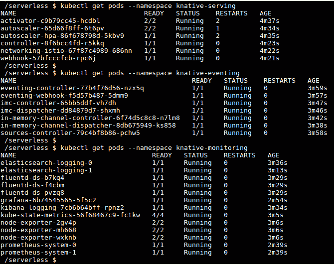
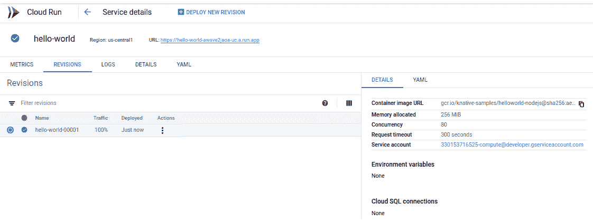
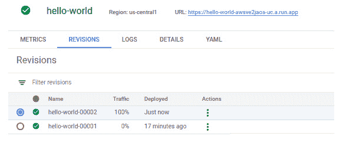
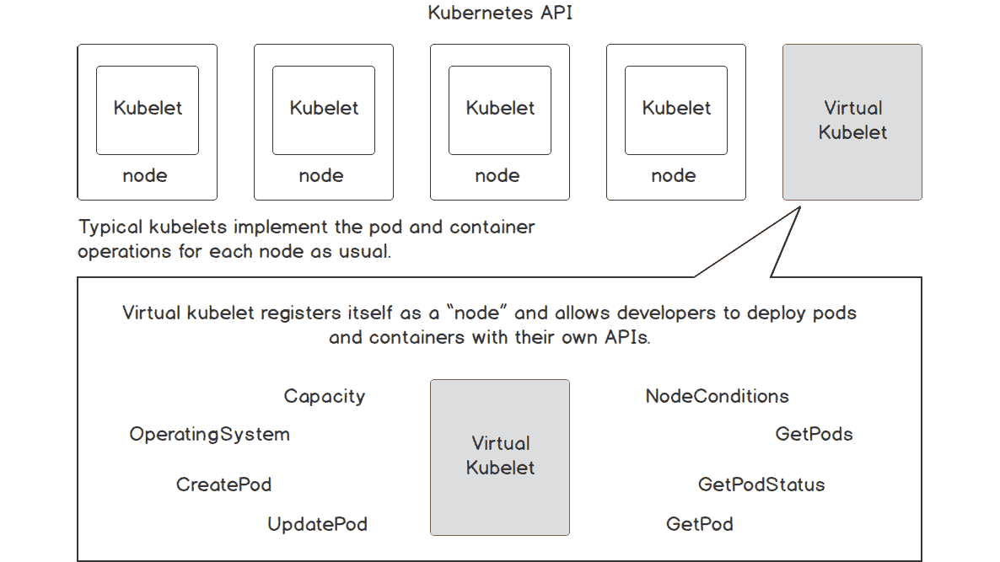
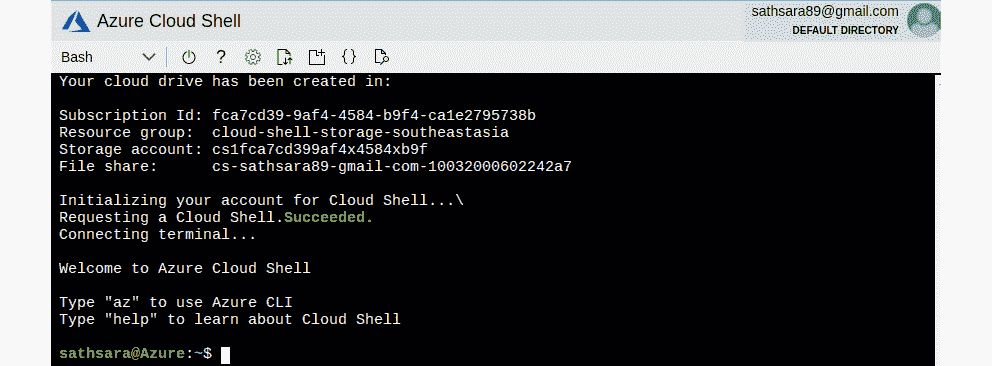

# 6。Kubernetes 即将推出的无服务器功能

## 学习目标

本章结束时，您将能够:

*   利用 Knative 的概念和组件来部署应用
*   在 GKE 群集上设置群集
*   在 Knative 上部署应用并配置自动缩放
*   在谷歌云上部署应用
*   在 Azure 上设置虚拟库布雷
*   使用虚拟库元素部署应用

本章涵盖了 Knative、Google Cloud Run 和 Virtual Kubelet，它们在 Kubernetes 集群的基础上提供了无服务器的优势。

## 【Kubernetes 无服务器简介

在前一章中，我们广泛研究了 Kubernetes 中使用的各种设置选项和平台。我们还介绍了 Kubernetes 的自动缩放功能，并在部署在集群上的应用中实现了它。

Kubernetes 和 serverless 是 IT 行业的两个热门话题，但这两个话题往往是相互独立讨论的。Kubernetes 是一个管理容器化应用的平台，而无服务器是一个抽象基础设施的执行模型，这样软件开发人员就可以专注于他们的应用逻辑。然而，这两个概念的结合将实现相同的目标，即让软件开发人员的生活更加轻松。

最近出现了一些平台，通过抽象出管理容器和任何底层基础设施的复杂性，为容器带来了无服务器特性。这些平台在 Kubernetes 集群上运行无服务器工作负载，并提供许多优势，包括自动缩放、缩放至零、每次使用计费、事件驱动功能、集成监控和集成日志功能。

在本章中，我们将讨论在 Kubernetes 集群上提供无服务器优势的三种技术:

*   当地的
*   谷歌云运行
*   虚拟库布雷

### kna tive 简介

Knative 是由谷歌发起的一个开源项目，由 50 多家其他公司贡献，包括 Pivotal、红帽、IBM 和思爱普。Knative 通过引入一组组件在其上构建和运行无服务器应用来扩展 Kubernetes。这个框架对于已经在使用 Kubernetes 的应用开发人员来说非常棒。Knative 为他们提供了专注于代码的工具，而不用担心 Kubernetes 的底层架构。它引入了自动容器构建、自动缩放、缩放到零以及事件框架等功能，允许开发人员在 Kubernetes 之上获得无服务器的好处。

Knative 框架被描述为基于 Kubernetes 的平台，用于在 Knative 网站上部署和管理现代无服务器工作负载。该框架通过引入无服务器功能(如自动缩放和缩放到 Kubernetes 平台的零)来帮助弥合容器化应用和无服务器应用之间的差距。

Knative 由三个主要组件组成:

*   建设
*   服务
*   Eventing

    #### 注意

    在最新版本的 Knative 中，构建组件已被弃用，转而使用 Tekton 管道。Knative Build 组件的最终版本在 0.7 版本中提供。

构建是从源代码构建容器映像并在 Kubernetes 集群上运行它们的过程。知识服务组件允许部署无服务器应用和功能。这使得能够向容器提供流量，并根据请求的数量自动缩放。每当对代码和配置进行更改时，服务组件还负责拍摄它们的快照。Knative Eventing 组件帮助我们构建事件驱动的应用。该组件允许应用为事件流生成事件和使用事件流中的事件。

下图说明了一个 Knative 框架及其依赖项和每个组件的利益相关者:


###### 图 6.1:知识依赖和涉众

最底层代表 Kubernetes 框架，它被 Knative 框架用作容器编排层。Kubernetes 可以部署在任何基础设施上，如谷歌云平台或内部系统。接下来，我们有 **Istio** 服务网格层，它管理集群内的网络路由。这一层提供了许多好处，包括流量管理、可观察性和安全性。在顶层，Knative 运行在一个Kubernetes集群的顶部，拥有 **Istio** 。在 Knative 层，一端我们可以看到通过 GitHub 项目向 Knative 框架贡献代码的贡献者，另一端我们可以看到在 Knative 框架之上构建和部署应用的应用开发人员。

#### 注意

更多关于 Istio 的信息，请参考[https://istio.io/](https://istio.io/)。

现在我们已经对 Knative 有了这样的理解，接下来让我们看看如何在 Kubernetes 集群上安装 Knative。

### 开始学习 GKE 的知识

在本节中，我们将带您完成在 Kubernetes 集群上安装 Knative 的过程。我们将使用谷歌 Kubernetes 引擎(GKE)来建立一个 Kubernetes 集群。GKE 是谷歌云中受管理的 Kubernetes 集群服务。它允许我们运行 Kubernetes 集群，而无需安装、管理和操作我们自己的集群。

我们需要安装并配置以下先决条件才能继续本节:

*   谷歌云账户
*   绿色命令行界面
*   kubectl 命令行界面(1.10 版或更高版本)

首先，我们需要设置一些环境变量，我们将使用 **gcloud** CLI。您应该用您的 gcp 项目的名称更新您的-GCP-项目名称> 。我们将使用美国中部 T4 作为 GCP 区。在终端窗口中执行以下命令来设置所需的环境变量:

```
$ export GCP_PROJECT=<your-gcp-project-name>
$ export GCP_ZONE=us-central1-a
$ export GKE_CLUSTER=knative-cluster
```

输出应如下所示:


###### 图 6.2:设置环境变量

将我们的 GCP 项目设置为 **gcloud** 命令行界面命令使用的默认项目:

```
$ gcloud config set core/project $GCP_PROJECT
```

输出应如下所示:


###### 图 6.3:设置默认的 GCP 项目

现在我们可以使用 **gcloud** 命令创建 GKE 集群。Knative 需要 1.11 版或更高版本的 Kubernetes 集群。我们将使用 GKE 为这个集群提供的 **Istio** 插件。以下是运行 Knative 组件的 Kubernetes 集群的建议配置:

*   Kubernetes 版或更高版本
*   带四个虚电路的 Kubernetes 节点(n1-标准-4)
*   最多为 10 个节点启用节点自动缩放
*   **云平台**的应用编程接口范围

执行以下命令创建符合这些要求的 GKE 群集:

```
     $ gcloud beta container clusters create $GKE_CLUSTER \
    --zone=$GCP_ZONE \
    --machine-type=n1-standard-4 \
    --cluster-version=latest \
    --addons=HorizontalPodAutoscaling,HttpLoadBalancing,Istio \
    --enable-stackdriver-kubernetes \
    --enable-ip-alias \
    --enable-autoscaling --min-nodes=1 --max-nodes=10 \
    --enable-autorepair \
    --scopes cloud-platform
```

输出应如下所示:


###### 图 6.4:创建 GKE 集群

设置 Kubernetes 集群可能需要几分钟时间。一旦集群准备就绪，我们将使用命令 **gcloud 容器集群 get-credentials** 来获取新集群的凭据，并配置 **kubectl** CLI，如以下代码片段所示:

```
$ gcloud container clusters get-credentials $GKE_CLUSTER --zone $GCP_ZONE --project $GCP_PROJECT
```

输出应如下所示:


###### 图 6.5:获取 GKE 集群的凭据

现在，您已经使用 **Istio** 成功创建了 GKE 集群，并配置了 **kubectl** 来访问新创建的集群。我们现在可以继续下一步安装 Knative 了。我们将安装 Knative 版本 0.8，这是在撰写本书时可用的最新版本。

我们将使用 **kubectl** 命令行界面将知识组件应用于 Kubernetes 集群。首先，使用**-l knative.dev/crd-install=true**标志运行 **kubectl apply** 命令，以防止安装过程中出现争用情况:

```
$ kubectl apply --selector knative.dev/crd-install=true \
   -f https://github.com/knative/serving/releases/download/v0.8.0/serving.yaml \
   -f https://github.com/knative/eventing/releases/download/v0.8.0/release.yaml \
   -f https://github.com/knative/serving/releases/download/v0.8.0/monitoring.yaml
```

接下来，在没有**-l knative.dev/crd-install=true**标志的情况下再次运行命令，完成安装:

```
$ kubectl apply -f https://github.com/knative/serving/releases/download/v0.8.0/serving.yaml \
   -f https://github.com/knative/eventing/releases/download/v0.8.0/release.yaml \
   -f https://github.com/knative/serving/releases/download/v0.8.0/monitoring.yaml
```

命令完成后，执行以下命令检查安装状态。确保所有吊舱都处于**运行状态**:

```
$ kubectl get pods --namespace knative-serving
$ kubectl get pods --namespace knative-eventing
$ kubectl get pods --namespace knative-monitoring
```

输出应如下所示:



###### 图 6.6:验证可耐特安装

在这个阶段，您已经在 GKE 建立了一个 Kubernetes 集群并安装了 Knative。现在，我们准备在 Knative 上部署我们的第一个应用。

### 练习 16:在 Knative 上部署示例应用

在前面的部分中，我们成功地在 Kubernetes 和 **Istio** 之上部署了 Knative。在本练习中，我们将在 Knative 框架上部署我们的第一个应用。对于这个部署，我们将使用一个用 Node.js 编写的示例 web 应用。这些步骤可以适用于在 Docker Hub 或任何其他容器注册表上部署我们自己的 Docker 映像。

这个示例“hello world”应用将读取名为 **TARGET** 的环境变量，并打印 **Hello < VALUE_OF_TARGET >！**为输出。如果没有为**目标**环境变量定义值，它将打印**未指定**作为输出。

让我们从为应用创建服务定义文件开始。该文件定义了应用相关信息，包括应用名称和应用 Docker 映像:

#### 注意

Knative 服务对象和 Kubernetes 服务对象是两种不同的类型。

1.  创建一个名为 **hello-world.yaml** 的文件，内容如下。这个 knactivity 服务对象定义了一些值，例如部署这个服务的名称空间、用于容器的 Docker 映像以及任何环境变量:

    ```
              apiVersion: serving.knative.dev/v1alpha1 
    kind: Service
    metadata:
      name: helloworld-nodejs 
      namespace: default 
    spec:
      runLatest:
        configuration:
          revisionTemplate:
            spec:
              container:
                image: gcr.io/knative-samples/helloworld-nodejs 
                env:
                  - name: TARGET 
                    value: "Knative NodeJS App"
    ```

2.  Once the **hello-world.yaml** file is ready, we can deploy our application with the **kubectl apply** command:

    ```
    $ kubectl apply -f hello-world.yaml
    ```

    输出应如下所示:

    

    ###### 图 6.7:部署 helloworld-nodejs 应用

3.  The previous command will create multiple objects, including the Knative service, configuration, revision, route, and Kubernetes Deployment. We can verify the application by listing the newly created objects as in the following commands:

    ```
    $ kubectl get ksvc
    $ kubectl get configuration
    $ kubectl get revision
    $ kubectl get route
    $ kubectl get deployments
    ```

    输出应如下所示:

    

    ###### 图 6.8:验证 helloworld-nodejs 应用部署

4.  Once our application is deployed successfully, we can invoke this application using an HTTP request. For this, we need to identify the external IP address of the Kubernetes cluster. Execute the following command to export the value of **EXTERNAL-IP** into an environment variable named **EXTERNAL_IP**:

    ```
    $ export EXTERNAL_IP=$(kubectl get svc istio-ingressgateway --namespace istio-system --output 'jsonpath={.status.loadBalancer.ingress[0].ip}')
    ```

    输出应如下所示:

    

    ###### 图 6.9:导出 istio-Ingres gateway 服务的外部 IP

    接下来，我们需要找到 **helloworld-nodejs** 应用的主机 URL。执行以下命令，记下**网址**列的值。该网址采用 **http:// <应用名称>的形式。<命名空间>**

    ```
    $ kubectl get route helloworld-nodejs
    ```

    输出应如下所示:

    

    ###### 图 6.10:列出 helloworld-nodejs 路由

5.  Now we can invoke our application using the **EXTERNAL_IP** and **URL** values that we noted in the earlier steps. Let's make a **curl** request with the following command:

    ```
    $ curl -H "Host: helloworld-nodejs.default.example.com" http://${EXTERNAL_IP}
    ```

    输出应如下所示:


###### 图 6.11:调用 helloworld-nodejs 应用

你应该会收到预期的输出**你好 Knative NodeJS App！**。这表明我们已经成功地在 Knative 平台上部署并调用了第一个应用。

## 活性服务成分

在前一节中，我们使用服务类型的 YAML 文件部署了我们的第一个 Knative 应用。部署服务时，它创建了多个其他对象，包括配置、修订和路由对象。在本节中，让我们讨论这些对象:

知识服务组件中有四种资源类型:

*   **配置**:定义应用的期望状态
*   **修订版**:跟踪配置变化的只读快照
*   **路线**:为修订版提供交通路线
*   **服务**:路线和配置的顶级容器

下图说明了这些组件之间的关系:


###### 图 6.12:知识服务、路线、配置和版本之间的关系

**配置**用于定义应用的期望状态。这将定义应用使用的容器映像以及所需的任何其他配置参数。每次更新**配置**时，都会创建一个新的**版本**。**修订版**是指代码和**配置**的快照。用于记录**配置**变化的历史。一条**路由**用于定义应用的流量路由策略，为应用提供一个 HTTP 端点。默认情况下，**路线**会将流量发送到由**配置**创建的最新**版本**。**路线**也可以配置为更高级的场景，包括将流量发送到特定的**版本**或根据定义的百分比将流量拆分到不同的版本。**服务**对象用于管理应用的整个生命周期。部署新应用时，需要手动创建**配置**和**路由**对象，但是**服务**可以通过自动创建和管理**配置**和**路由**对象来简化这一点。

在下一节中，我们将使用 canary 部署来部署带有 Knative 的应用。让我们首先了解金丝雀部署到底是什么。

### 金丝雀部署

Canary 部署是向生产环境推出新版本代码时使用的一种部署策略。这是一个将新版本的代码部署到生产环境中并将一小部分流量切换到新版本的防故障过程。这样，开发和部署团队可以在对生产流量影响最小的情况下验证新版本的代码。一旦验证完成，所有流量将切换到新版本。除了 canary 部署之外，还有其他几种部署类型，例如大爆炸部署、滚动部署和蓝绿色部署。

在我们在*练习 16* 、*中部署的 **helloworld-nodejs** 应用中，我们使用了带有 **spec.runLatest** 字段的服务对象，该字段将所有流量定向到最新的可用版本。在下面的练习中，我们将使用单独的配置和路由对象，而不是服务对象。*

#### 注意

有关 canary 部署技术的更多信息，请参考[https://dev . to/mostly Jason/部署策略介绍-蓝-绿-canary-and-more-3a3](https://dev.to/mostlyjason/intro-to-deployment-strategies-blue-green-canary-and-more-3a3) 。

### 练习 17:带 kna activity 的金丝雀部署

在本练习中，我们将实施一个加那利部署策略来使用 Knative 部署应用。首先，我们将部署应用的初始版本(版本 1)，并将 100%的流量路由到该版本。接下来，我们将创建应用的版本 2，并将 50%的流量路由到版本 1，剩余的 50%路由到版本 2。最后，我们将更新路由，将 100%的流量发送到版本 2。

以下步骤将帮助您完成练习:

1.  首先，从创建应用的初始版本( **v1** )开始。创建一个名为**的文件，包含以下内容。该应用使用了与我们之前使用的相同的 Docker 映像(**gcr.io/knative-samples/helloworld-nodejs**)并将 **TARGET** 环境变量设置为**这是第一个版本- v1** :

    ```
    apiVersion: serving.knative.dev/v1alpha1
    kind: Configuration
    metadata:
      name: canary-deployment
      namespace: default
    spec:
      template:
        spec:
          containers:
            - image: gcr.io/knative-samples/helloworld-nodejs
              env:
                - name: TARGET
                  value: "This is the first version - v1"
    ```** 
2.  Deploy the first version of the application with the **kubectl apply** command using the YAML file created in the previous step:

    ```
    $ kubectl apply -f canary-deployment.yaml
    ```

    输出应如下所示:

    

    ###### 图 6.13:创建加那利部署

3.  Let's get the revision name created by this configuration as we need this value in the next step. Execute the **kubectl get configurations** command and retrieve the value of the **latestCreatedRevisionName** field:

    ```
    $ kubectl get configurations canary-deployment -o=jsonpath='{.status.latestCreatedRevisionName}'
    ```

    输出应如下所示:

    

    ###### 图 6.14:获取加那利部署配置的最新版本

    对我来说，从前面的命令返回的值是 **canary-deployment-xgvl8** 。请注意，您的价值会有所不同。

4.  下一步是创建路线对象。让我们用以下内容创建一个名为**canary-deployment-route . YAML**的文件(请记住用您在上一步中注意到的修订名称替换 **canary-deployment-xgvl8** )。在**规范流量**部分，您可以看到 100%的流量被路由到我们之前创建的版本:

    ```
    apiVersion: serving.knative.dev/v1alpha1
    kind: Route
    metadata:
      name: canary-deployment
      namespace: default 
    spec:
      traffic:
        - revisionName: canary-deployment-xgvl8
          percent: 100 
    ```

5.  Create the route object with the **kubectl apply** command:

    ```
    $ kubectl apply -f canary-deployment-route.yaml
    ```

    输出应如下所示:

    

    ###### 图 6.15:创建金丝雀部署路线

6.  Make a request to the application and observe the expected output of **Hello This is the first version - v1!**:

    ```
    $ curl -H "Host: canary-deployment.default.example.com" "http://${EXTERNAL_IP}"
    ```

    输出应如下所示:

    

    ###### 图 6.16:调用加那利部署

7.  一旦应用被成功调用，我们就可以部署应用的版本 2。用以下内容更新 **canary-deployment.yaml** 。在应用的版本 2 中，我们只需要将 **TARGET** 环境变量的值从**更新，这是第一个版本- v1** 到**这是第二个版本-v2**:T0
8.  Apply the updated configuration with **kubectl apply**:

    ```
    $ kubectl apply -f canary-deployment.yaml
    ```

    输出应如下所示:

    

    ###### 图 6.17:将 canary 部署更新到版本 2

9.  Now we can check the revisions created, while updating the configuration, using the **kubectl get revisions** command:

    ```
    $ kubectl get revisions
    ```

    输出应如下所示:

    

    ###### 图 6.18:获取加那利部署的修订

10.  Let's get the latest revision created by the **canary-deployment** configuration:

    ```
    $ kubectl get configurations canary-deployment -o=jsonpath='{.status.latestCreatedRevisionName}'
    ```

    输出应如下所示:

    

    ###### 图 6.19:获取加那利部署配置的最新版本

11.  现在是时候给我们新版本的应用发送一些流量了。更新**加那利-部署-路线. yaml** 的**规范流量**部分，将 50%的流量发送到旧版本，50%的流量发送到新版本:

    ```
    apiVersion: serving.knative.dev/v1alpha1
    kind: Route
    metadata:
      name: canary-deployment
      namespace: default 
    spec:
      traffic:
        - revisionName: canary-deployment-xgvl8
          percent: 50 
        - revisionName: canary-deployment-8pp4s
          percent: 50 
    ```

12.  Apply changes to the route using the following command:

    ```
    $ kubectl apply -f canary-deployment-route.yaml
    ```

    输出应如下所示:

    

    ###### 图 6.20:更新加那利部署路线

13.  现在，我们可以多次调用该应用来观察流量如何在两个版本之间分割:

    ```
    $ curl -H "Host: canary-deployment.default.example.com" "http://${EXTERNAL_IP}" 
    ```

14.  一旦我们成功验证了应用的版本 2，我们就可以更新**canary-deployment-route . YAML**将 100%的流量路由到最新版本:

    ```
    apiVersion: serving.knative.dev/v1alpha1
    kind: Route
    metadata:
      name: canary-deployment
      namespace: default 
    spec:
      traffic:
        - revisionName: canary-deployment-xgvl8
          percent: 0 
        - revisionName: canary-deployment-8pp4s
          percent: 100 
    ```

15.  Apply the changes to the route using the following command:

    ```
    $ kubectl apply -f canary-deployment-route.yaml
    ```

    输出应如下所示:

    

    ###### 图 6.21:更新加那利部署路线

16.  现在多次调用应用，以验证所有流量都流向应用的版本 2:

    ```
    $ curl -H "Host: blue-green-deployment.default.example.com" "http://${EXTERNAL_IP}" 
    ```

在本练习中，我们成功地使用了配置和路由对象来执行 Knative 的 canary 部署。

## 主动监控

Knative 预装了 Grafana，这是一个开源的度量分析和可视化工具。Grafana pod 在**活动监控**名称空间中可用，可通过以下命令列出:

```
$ kubectl get pods -l app=grafana -n knative-monitoring
```

输出应如下所示:


###### 图 6.22:列出格拉夫纳豆荚

我们可以用 **kubectl port-forward** 命令暴露 Grafana UI，该命令将本地端口 **3000** 转发到 Grafana 吊舱的端口 **3000** 。打开新终端并执行以下命令:

```
$ kubectl port-forward $(kubectl get pod -n knative-monitoring -l app=grafana -o jsonpath='{.items[0].metadata.name}') -n knative-monitoring 3000:3000
```

输出应如下所示:


###### 图 6.23:端口转发到格拉夫纳吊舱

现在我们可以在 **http://127.0.0.1:3000** 上从我们的网页浏览器导航到 Grafana UI。

输出应如下所示:


###### 图 6.24:格拉夫纳用户界面

Knative 的 Grafana 仪表板配备了多个仪表板，包括以下内容:


###### 图 6.25:仪表板

## 主动自动缩放器

Knative 有一个内置的自动缩放功能，可以根据接收到的 HTTP 请求的数量自动缩放应用盒。这将在需求增加时增加料盒数量，在需求减少时减少料盒数量。当吊舱空闲且没有传入请求时，吊舱计数将缩放至零。

Knative 使用自动缩放器和激活器两个组件来实现前面提到的功能。这些组件被部署为**命名空间中的荚，正如您在下面的代码片段中看到的:**

```
NAME                          READY   STATUS    RESTARTS   AGE
activator-7c8b59d78-9kgk5     2/2     Running   0          15h
autoscaler-666c9bfcc6-vwrj6   2/2     Running   0          15h
controller-799cd5c6dc-p47qn   1/1     Running   0          15h
webhook-5b66fdf6b9-cbllh      1/1     Running   0          15h
```

activator 组件负责收集关于某个修订的并发请求数量的信息，并将这些值报告给 autoscaler。自动缩放组件将根据激活器报告的指标增加或减少 pods 的数量。默认情况下，自动缩放器将尝试通过向上或向下扩展 pod 来维持每个 pod 100 个并发请求。所有与可耐特自动缩放器相关的配置都存储在**可耐特服务**命名空间中名为**配置-自动缩放器**的配置映射中。Knative 也可以配置为使用由 Kubernetes 提供的**水平吊舱自动缩放器** ( **HPA** )。HPA 将根据 CPU 使用情况自动缩放吊舱。

### 练习 18:用 kna activity 自动缩放

在本练习中，我们将通过部署一个示例应用来执行 knactivity pod 自动缩放:

1.  创建一个包含以下内容的**自动缩放-app.yaml** 服务定义文件。该文件定义了一个名为**自动缩放应用**的服务，该服务将使用**gcr.io/knative-samples/autoscale-go:0.1**Docker 示例映像。**autoscaling.knative.dev/target**用于配置每个 pod 并发请求的目标数量:

    ```
    apiVersion: serving.knative.dev/v1alpha1
    kind: Service
    metadata:
      name: autoscale-app
    spec:
      runLatest:
        configuration:
          revisionTemplate:
            metadata:
              annotations:
                autoscaling.knative.dev/target: "10"
            spec:
              container:
                image: "gcr.io/knative-samples/autoscale-go:0.1"
    ```

2.  Apply the service definition with the **kubectl apply** command:

    ```
    $ kubectl apply -f autoscale-app.yaml
    ```

    输出应如下所示:

    

    ###### 图 6.26:创建自动缩放应用

3.  Once the application is ready, we can generate a load to the **autoscale-app** application to observe the autoscaling. For this, we will use a load generator named **hey**. Download the **hey** binary using the following **curl** command.

    ```
    $ curl -Lo hey https://storage.googleapis.com/hey-release/hey_linux_amd64
    ```

    输出应如下所示:

    

    ###### 图 6.27:安装嘿

4.  Add execution permission to the **hey** binary and move it into the **/usr/local/bin/** path:

    ```
    $ chmod +x hey
    $ sudo mv hey /usr/local/bin/
    ```

    输出应如下所示:

    

    ###### 图 6.28:移动到/usr/local/bin

5.  现在我们准备使用**嘿**工具生成负载。**嘿**工具在生成负载时支持多个选项。对于这个场景，我们将使用并发 50 的负载(带有 **-c 标志**)持续 60 秒(带有 **-z 标志** ):

    ```
    $ hey -z 60s -c 50 \
       -host "autoscale-app.default.example.com" \
       "http://${EXTERNAL_IP?}?sleep=1000" 
    ```

6.  In a separate terminal, watch for the number of pods created during the load:

    ```
    $ kubectl get pods --watch
    ```

    您将看到类似如下的输出:

    ```
         NAME                                             READY   STATUS    RESTARTS   AGE
    autoscale-app-7jt29-deployment-9c9c4b474-4ttl2   3/3     Running   0          58s
    autoscale-app-7jt29-deployment-9c9c4b474-6pmjs   3/3     Running   0          60s
    autoscale-app-7jt29-deployment-9c9c4b474-7j52p   3/3     Running   0          63s
    autoscale-app-7jt29-deployment-9c9c4b474-dvcs6   3/3     Running   0          56s
    autoscale-app-7jt29-deployment-9c9c4b474-hmkzf   3/3     Running   0          62s
    ```

7.  从 Grafana 打开**Knative Serving-Scaling debug**仪表盘，观察装载过程中自动缩放如何增加料盒计数，以及装载停止后如何将料盒计数减少回零，如下图截图所示:


###### 图 6.29:修订窗格计数指标


###### 图 6.30:观察到的并发度量

我们已经成功配置了 Knative 的自动缩放器，并使用 Grafana 仪表板观察到自动缩放。

### 谷歌云跑

在前几节中，我们讨论了 Knative。我们学习了如何在 Kubernetes 集群上安装 Istio 和 Knative，以及如何使用 Knative 运行 Docker 映像。但是 Knative 平台的优势来自于使用 Istio 管理底层 Kubernetes 集群的操作开销。GKE 是来自谷歌云的受管 Kubernetes 服务，它将帮助我们管理 Kubernetes 主组件，但我们仍然必须自己管理所有的 Kubernetes 节点。

为了从开发人员那里抽象出所有的基础设施管理任务，谷歌引入了一项名为“云运行”的新服务。这是一个完全托管的平台，构建在 Knative 项目上，用于运行无状态的 HTTP 驱动的容器。云运行提供了与 Knative 相同的功能集，包括自动缩放、缩放到零、版本控制和事件。云运行作为谷歌云无服务器计算堆栈的最新成员，在谷歌云 Next '19 大会上推出。在撰写本书时，云运行服务仍处于测试阶段，仅在有限的几个地区可用。

现在让我们执行一个在谷歌云上部署容器的练习。

### 练习 19:在谷歌云上部署容器

在本练习中，我们将在谷歌云运行平台上部署一个预构建的 Docker 映像。

以下步骤将帮助您完成练习:

1.  Navigate to your GCP console from your browser and select **Cloud Run** from the menu (in the **Compute** category) as shown in the following figure:

    

    ###### 图 6.31:云跑的 GCP 菜单

2.  点击**创建服务**按钮创建新服务。
3.  Fill the create service form with the following values:

    容器图片网址:[gcr.io/knative-samples/helloworld-nodejs](http://gcr.io/knative-samples/helloworld-nodejs)

    部署平台:**云运行**(全托管)

    位置:从选项中选择您喜欢的任何地区

    服务名称: **hello-world**

    认证:**允许未经认证的调用**

    

    ###### 图 6.32:云运行创建服务表单

4.  点击**创建**按钮。
5.  Now we will be redirected to the deployed service page, which includes details about the newly deployed **hello-world** service. We can see that a revision has been created called **hello-world-00001**, as shown in the following figure:

    

    ###### 图 6.33:服务详细信息页面

6.  Click on the URL link displayed to run the container. Note that the URL will be different for every new instance:

    

    ###### 图 6.34:调用 hello-world 应用

7.  接下来，我们将通过更新 **TARGET** 环境变量来部署应用的新版本。导航回 **GCP** 控制台，点击**部署新版本**按钮。
8.  From the **Deploy revision to hello-world (us-central1)** form, click on the **SHOW OPTIONAL REVISION SETTINGS** link, which will point us to the additional setting section:

    

    ###### 图 6.35:可选修订设置

9.  Under the environment variables section, create a new environment variable named **TARGET** with the value **Cloud Run Deployment**:

    

    ###### 图 6.36:设置目标环境变量

10.  点击**部署**按钮。
11.  Now we can see the new revision of the **hello-world** application called **hello-world-00002** with 100% of traffic being routed to the latest revision:

    

    ###### 图 6.37:hello-world 应用的新版本

12.  再次单击网址运行更新的版本:


###### 图 6.38:调用 hello-world 应用

我们已经在谷歌云运行平台上成功部署了一个预构建的 Docker 映像。

## 虚拟库布雷介绍

Virtual Kubelet 是 Kubernetes 的 Kubelet 的开源实现，它充当一个 kubelet。这是来自**云原生计算基金会** ( **CNCF** )的沙盒项目，2019 年 7 月 8 日发布了 Virtual Kubelet 的第一个主版本(v 1.0)。

在深入探讨虚拟库贝莱之前，让我们回顾一下库贝莱在库贝内特斯架构中是什么。kubelet 是运行在 Kubernetes 集群中每个节点上的代理，负责管理节点内的 pods。kubelet 从 Kubernetes API 获取指令，以识别要在节点上调度的 pods，并与节点的底层容器运行时(例如，Docker)交互，以确保所需数量的 pods 正在运行，并且它们是健康的。

除了管理吊舱，kubelet 还执行其他几项任务:

*   用吊舱的当前状态更新 Kubernetes 应用编程接口
*   监控并向 Kubernetes 主节点报告节点运行状况指标，如 CPU、内存和磁盘利用率
*   从指定吊舱的 Docker 注册表中提取 Docker 映像
*   为吊舱创建和安装卷
*   为 API 服务器提供一个接口来执行命令，例如用于吊舱的 **kubectl 日志**、 **kubectl exec** 和 **kubectl attach**

下图显示了一个具有标准和虚拟 Kubernetes 的 Kubernetes 集群:



###### 图 6.39:带有标准库波莱和虚拟库波莱的库波内特集群

从 Kubernetes API 的角度来看，虚拟 Kubelet 将作为传统的 kubelet 出现。这将在现有的 Kubernetes 集群中运行，并将自己注册为 Kubernetes API 中的一个节点。虚拟库贝莱将以与库贝莱相同的方式运行和管理吊舱。但与在节点内运行 pods 的 kubelet 相反，Virtual Kubelet 将利用外部服务来运行 pods。这将 Kubernetes 集群连接到其他服务，如无服务器容器平台。Virtual Kubelet 支持越来越多的提供商，包括:

*   阿里巴巴云**弹性容器实例** ( **ECI** )
*   AWS Fargate
*   天青批次
*   **蔚蓝色容器实例** ( **ACI** )
*   立方〔t0〕容器运行时接口〔t1〕(〔T2〕喊〔T3〕
*   华为**云容器实例** ( **CCI** )
*   HashiCorp Nomad
*   OpenStack Zun

在这些平台上运行豆荚带来了无服务器世界的好处。我们不必担心基础设施，因为它由云提供商管理。Pods 将根据收到的请求数量自动上下扩展。此外，我们只需为已利用的资源付费。

### 练习 20:在 AKS 上部署虚拟库布雷

在本练习中，我们将与 ACI 提供商一起在 **Azure Kubernetes 服务** ( **AKS** )上配置虚拟 Kubelet。在本练习中，我们将使用 Azure 中提供的以下服务。

*   AKS: AKS 是 Azure 上托管的 Kubernetes 服务。
*   ACI: ACI 为在 Azure 上运行容器提供托管服务。
*   Azure Cloud Shell:一个交互式的、基于浏览器的 Shell，同时支持 Bash 和 PowerShell。

本练习需要具备以下先决条件:

*   微软 Azure 帐户
*   蓝色命令行界面
*   忽必烈 CLI
*   舵

我们将使用 Azure Cloud Shell，它预装了前面提到的所有 CLIs:

1.  Navigate to [https://shell.azure.com/](https://shell.azure.com/) to open Cloud Shell in a browser window. Select **Bash** from the **Welcome to Azure Cloud Shell** window:

    

    ###### 图 6.40:欢迎使用 Azure 云外壳窗口

2.  Click on the **Create storage** button to create a storage account for Cloud Shell. Note that this is a one-time task purely for when we are using Cloud Shell for the first time:

    

    ###### 图 6.41:为云外壳安装存储

    “云壳”窗口将如下所示:

    

    ###### 图 6.42:外壳窗口中的 Cl

3.  Once Cloud Shell is ready, we can start creating the AKS cluster.

    首先，我们需要创建一个 Azure 资源组，允许我们对相关的 Azure 资源进行逻辑分组。执行以下命令，在美国西部(**西部**地区创建一个名为**的无服务器Kubernetes资源组**:

    ```
    $ az group create --name serverless-kubernetes-group --location westus
    ```

    输出应如下所示:

    

    ###### 图 6.43:创建一个 Azure 资源组

4.  Register your subscription to use the **Microsoft.Network** namespace:

    ```
    $ az provider register --namespace Microsoft.Networks
    ```

    输出应如下所示:

    

    ###### 图 6.44:注册订阅

5.  Next, we will create an Azure Kubernetes cluster. The following command will create an AKS cluster named **virtual-kubelet-cluster** with one node. This command will take a few minutes to execute:

    ```
    $ az aks create --resource-group serverless-kubernetes-group --name virtual-kubelet-cluster --node-count 1 --node-vm-size Standard_D2 --network-plugin azure --generate-ssh-keys
    ```

    一旦 AKS 集群创建成功，前面的命令将返回一些包含集群详细信息的 JSON 输出:

    

    ###### 图 6.45:创建 AKS 集群

6.  Next, we need to configure the kubectl CLI to communicate with the newly created AKS cluster. Execute the **az aks get-credentials** command to download the credentials and configure the kubectl CLI to work with the **virtual-kubelet-cluster** cluster with the following command:

    #### 注意

    我们不需要安装 kubectl 命令行界面，因为 Cloud Shell 预装了 kubectl。

    ```
    $ az aks get-credentials --resource-group serverless-kubernetes-group --name virtual-kubelet-cluster
    ```

    输出应如下所示:

    

    ###### 图 6.46:配置 kubectl

7.  Now we can verify the connection to the cluster from Cloud Shell by executing the **kubectl get nodes** command, which will list the nodes available in the AKS cluster:

    ```
    $ kubectl get nodes
    ```

    输出应如下所示:

    

    ###### 图 6.47:列出 Kubernetes 节点

8.  If this is the first time you are using the ACI service, you need to register the **Microsoft.ContainerInstance** provider with your subscription. We can check the registration state of the **Microsoft.ContainerInstance** provider with the following command:

    ```
    $ az provider list --query "[?contains(namespace,'Microsoft.ContainerInstance')]" -o table
    ```

    输出应如下所示:

    

    ###### 图 6.48:检查微软的注册状态。容器堆栈提供程序

9.  If the **RegistrationStatus** column contains a value of **NotRegistered**, execute the **az provider register** command to register the **Microsoft.ContainerInstance** provider. If the **RegistrationStatus** column contains a value of **Registered**, you can continue to the next step:

    ```
    $ az provider register --namespace Microsoft.ContainerInstance
    ```

    输出应如下所示:

    

    ###### 图 6.49:注册微软。容器实例提供程序

10.  下一步是为舵柄创建必要的**服务帐户**和**服务帐户**对象。创建一个名为 **tiller-rbac.yaml** 的文件，代码如下:

    ```
    apiVersion: v1
    kind: ServiceAccount
    metadata:
      name: tiller
      namespace: kube-system
    ---
    apiVersion: rbac.authorization.k8s.io/v1
    kind: ClusterRoleBinding
    metadata:
      name: tiller
    roleRef:
      apiGroup: rbac.authorization.k8s.io
      kind: ClusterRole
      name: cluster-admin
    subjects:
      - kind: ServiceAccount
        name: tiller
        namespace: kube-system
    ```

11.  Then execute the **kubectl apply** command to create the necessary **ServiceAccount** and **ClusterRoleBinding** objects:

    ```
    $ kubectl apply -f tiller-rbac.yaml
    ```

    输出应如下所示:

    

    ###### 图 6.50:创建服务帐户和集群角色绑定对象

12.  Now we can configure Helm to use the tiller service account that we created in the previous step:

    ```
    $ helm init --service-account tiller
    ```

    输出应如下所示:

    

    ###### 图 6.51:配置舵杆

13.  Once all configurations are done, we can install Virtual Kubelet using the **az aks install-connector** command. We will be deploying both Linux and Windows connectors with the following command:

    ```
    $ az aks install-connector \
        --resource-group serverless-kubernetes-group \
        --name virtual-kubelet-cluster \
        --connector-name virtual-kubelet \
        --os-type Both
    ```

    输出应如下所示:

    

    ###### 图 6.52:安装虚拟库贝莱

14.  Once the installation is complete, we can verify it by listing the Kubernetes nodes. There will be two new nodes, one for Windows and one for Linux:

    ```
    $ kubectl get nodes
    ```

    输出应如下所示:

    

    ###### 图 6.53:列出 Kubernetes 节点

15.  Now we have Virtual Kubelet installed in the AKS cluster. We can deploy an application to a new node introduced by Virtual Kubelet. We will be creating a Kubernetes Deployment named **hello-world** with the **microsoft/aci-helloworld** Docker image.

    我们需要添加一个**节点选择器**来将这个 pod 专门分配给虚拟库元素节点。请注意，默认情况下，Virtual Kubelet 节点会被污染，以防止在其上运行意外的 pods。我们需要给豆荚增加容忍度，以便为这些节点安排它们。

    让我们创建一个名为 **hello-world.yaml** 的文件，内容如下:

    ```
         apiVersion: apps/v1
    kind: Deployment
    metadata:
      name: hello-world
    spec:
      replicas: 1
      selector:
        matchLabels:
          app: hello-world
      template:
        metadata:
          labels:
            app: hello-world
        spec:
          containers:
          - name: hello-world
            image: microsoft/aci-helloworld
            ports:
            - containerPort: 80
          nodeSelector:
            kubernetes.io/role: agent
            type: virtual-kubelet
            beta.kubernetes.io/os: linux
          tolerations:
          - key: virtual-kubelet.io/provider
            operator: Equal
            value: azure
            effect: NoSchedule
    ```

16.  Deploy the **hello-world** application with the **kubectl apply** command:

    ```
    $ kubectl apply -f hello-world.yaml
    ```

    输出应如下所示:

    

    ###### 图 6.54:创建 hello-world 部署

17.  Execute the **kubectl get pods** command with the **-o wide** flag to output a list of pods and their respective nodes. Note that the **hello-world-57f597bc59-q9w9k** pod has been scheduled on the **virtual-kubelet-virtual-kubelet-linux-westus** node:

    ```
    $ kubectl get pods -o wide
    ```

    输出应如下所示:


###### 图 6.55:列出所有带有-o 宽标志的豆荚

因此，我们已经成功地在带有 ACI 的 AKS 上配置了 Virtual Kubelet，并在 Virtual Kubelet 节点中部署了一个 pod。

现在，让我们完成一项活动，在无服务器环境中部署容器化应用。

### 活动 6:在无服务器环境中部署容器化应用

假设您在一家初创公司工作，您的经理希望您创建一个应用，可以返回给定时区的当前日期和时间。该应用预计在初始阶段只接收几个请求，但从长远来看将接收数百万个请求。应用应该能够根据收到的请求数量自动扩展，无需任何修改。此外，您的经理不想承担管理基础架构的负担，希望该应用以尽可能低的成本运行。

执行以下步骤完成本活动:

1.  Create an application (in any language you want) that can provide the current date and time based on the given **timezone** value.

    以下是一些用 PHP 编写的示例应用代码:

    ```
         <?php
    if ( !isset ( $_GET['timezone'] ) ) {
        // Returns error if the timezone parameter is not provided
        $output_message = "Error: Timezone not provided"; 
    } else if ( empty ( $_GET['timezone'] ) ) {
        // Returns error if the timezone parameter value is empty
        $output_message = "Error: Timezone cannot be empty"; 
    } else {
        // Save the timezone parameter value to a variable
        $timezone = $_GET['timezone'];

        try {
            // Generates the current time for the provided timezone
            $date = new DateTime("now", new DateTimeZone($timezone) );
            $formatted_date_time = $date->format('Y-m-d H:i:s');
            $output_message = "Current date and time for $timezone is $formatted_date_time";
        } catch(Exception $e) {
            // Returns error if the timezone is invalid
            $output_message = "Error: Invalid timezone value"; 
        }
    }
    // Return the output message
    echo $output_message;
    ```

2.  Containerize the application according to the guidelines provided by Google Cloud Run.

    以下是示例 Dockerfile 的内容:

    ```
    # Use official PHP 7.3 image as base image
    FROM php:7.3-apache
    # Copy index.php file to the docker image
    COPY index.php /var/www/html/
    # Replace port 80 with the value from PORT environment variable in apache2 configuration files
    RUN sed -i 's/80/${PORT}/g' /etc/apache2/sites-available/000-default.conf /etc/apache2/ports.conf
    # Use the default production configuration file
    RUN mv "$PHP_INI_DIR/php.ini-production" "$PHP_INI_DIR/php.ini"
    ```

3.  将坞站映像推送到坞站注册表。
4.  Run the application with Cloud Run.

    输出应如下所示:


###### 图 6.56:在无服务器环境中部署应用

#### 注意

活动的解决方案可以在第 417 页找到。

## 总结

在本章中，我们讨论了在 Kubernetes 上使用无服务器的优势。我们讨论了在 Kubernetes 集群上提供无服务器优势的三种技术。这些是 Knative、谷歌云运行和虚拟库布雷。

首先，我们用 Istio 创建了一个 GKE 集群，并在其上部署了 Knative。然后我们学习了如何在 Knative 上部署应用。接下来，我们讨论了 Knative 的服务组件，以及如何使用配置和路由对象执行 canary 部署。然后，我们讨论了对 Knative 的监控，并观察了 Knative 如何根据接收到的请求数量进行自动缩放。

我们还讨论了谷歌云运行，这是一个完全托管的平台，建立在 Knative 项目上，运行无状态的 HTTP 驱动的容器。然后，我们学习了如何使用云运行服务部署应用。

在最后一节，我们研究了 Virtual Kubelet，它是 Kubernetes 的 Kubelet 的开源实现。我们了解了正常库波莱和虚拟库波莱的区别。最后，我们在 AKS 集群上部署了 Virtual Kubelet，并在 Virtual Kubelet 节点上部署了一个应用。

在接下来的三章中，我们将重点介绍三种不同的 Kubernetes 无服务器框架，即 Kubeless、open 晶须和 OpenFaaS。