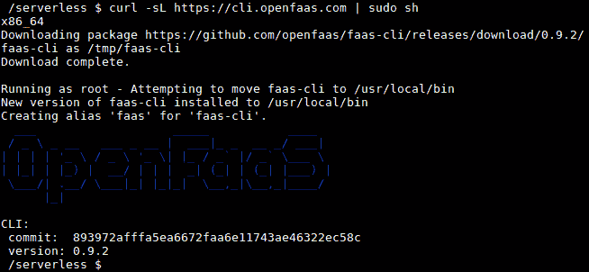
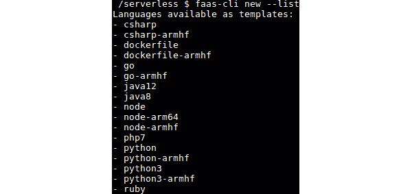
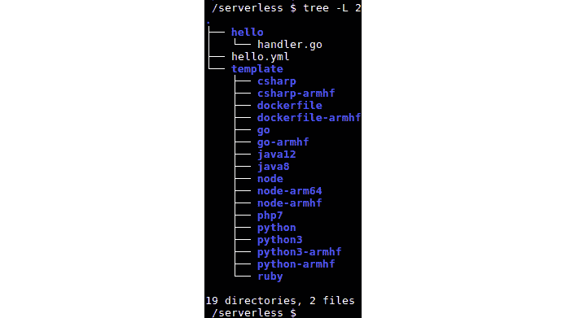
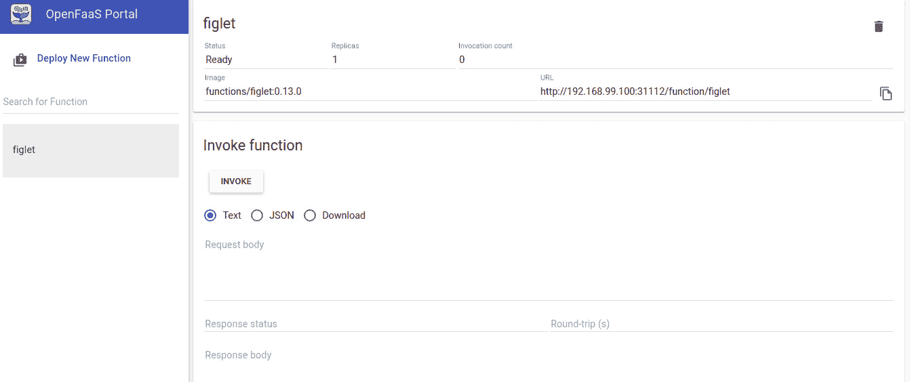
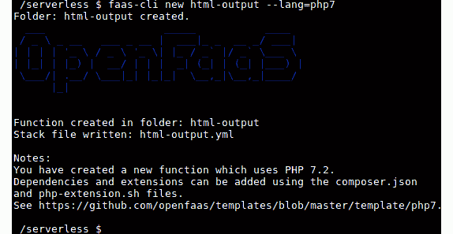
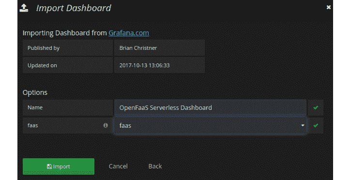

# 九、使用 OpenFaaS 实现无服务器

## 学习目标

本章结束时，您将能够:

*   在 minikube 集群上设置 openfans 框架
*   使用 OpenFaaS CLI 创建、构建、部署、列出、调用和删除函数
*   从 OpenFaaS 门户部署和调用 OpenFaaS 功能
*   从 OpenFaaS 函数返回一个 HTML 网页
*   设置普罗米修斯和格拉夫纳仪表盘来监控 OpenFaaS 功能
*   配置功能自动缩放，根据需求调整功能计数

在本章中，我们的目标是在 Minikube 集群的基础上建立 OpenFaaS 框架，并研究如何使用 OpenFaaS CLI 和 OpenFaaS 门户来使用 OpenFaaS 功能。我们还将研究 OpenFaaS 的可观测性和自动缩放等特性。

## OpenFaaS 简介

在上一章中，我们了解了 OpenWhisk，一个开源的无服务器框架，它是 Apache 软件基金会的一部分。我们学习了如何创建、列出、调用、更新和删除 OpenWhisk动作。我们还讨论了如何使用提要、触发器和规则来自动化操作调用。

在这一章中，我们将研究 OpenFaas，这是另一个用于在容器之上构建和部署无服务器功能的开源框架。这是亚历克斯·埃利斯在 2016 年 10 月作为概念验证项目启动的，框架的第一个版本用 Golang 编写，并于 2016 年 12 月交付给 GitHub。

OpenFaaS 最初是为了与 Docker Swarm 合作而设计的，Docker Swarm 是 Docker 容器的集群和调度工具。后来，OpenFaaS 框架被重新构建，以支持 Kubernetes 框架。

OpenFaaS 自带一个名为 **OpenFaaS Portal** 的内置 UI，可以用来从网页浏览器创建和调用功能。该门户还提供名为 **faas-cli** 的 CLI，允许我们通过命令行管理功能。OpenFaaS 框架内置了对自动缩放的支持。这将在需求增加时扩大功能，在需求减少时缩小功能，甚至在功能空闲时缩小到零。

现在，让我们来看看 OpenFaaS 框架的组件:


###### 图 9.1: OpenFaaS 组件

OpenFaaS 由运行在底层 Kubernetes 或 Docker Swarm 上的以下组件组成:

*   **API Gateway**:

    应用编程接口网关是 OpenFaaS 框架的入口点，它向外部公开功能。它还负责收集函数度量，如函数调用计数、函数执行持续时间和函数副本数量。应用编程接口网关还通过根据需求增加或减少函数副本来处理函数自动缩放。

*   **Prometheus**:

    Prometheus 是一个开源的监控和警报工具，与 OpenFaaS 框架捆绑在一起。这用于存储关于由应用编程接口网关收集的功能度量的信息。

*   **Function Watchdog**:

    函数看门狗是一个小型的 Golang 网络服务器，与每个函数容器一起运行。该组件位于应用编程接口网关和您的函数之间，负责在应用编程接口网关和函数之间转换消息格式。它将 API Gateway 发送的 HTTP 消息转换为“标准输入”( **stdin** )消息，函数可以理解。这还通过将函数发送的“标准输出”( **stdout** )响应转换为 HTTP 响应来处理响应路径。

    以下是功能看门狗的图示:


###### 图 9.2: OpenFaaS 函数看门狗

Docker Swarm 或 Kubernetes 可以与 OpenFaaS 框架一起用作容器编排工具，它管理在底层 Docker 框架上运行的容器。

### 在本地 Minikube 集群上开始使用 OpenFaas

在本节中，我们将在本地 Minikube 集群上设置一个 OpenFaaS 框架和 CLI。在开始安装之前，我们需要确保满足以下先决条件:

*   Minikube 已安装
*   安装了 Docker(版本 17.05 或更高版本)
*   头盔已安装
*   创建一个码头工人中心帐户

一旦这些先决条件准备就绪，我们就可以继续安装 OpenFaaS 了。OpenFaas 的安装可以大致分为三个步骤，如下所示:

1.  安装 openfans cli
2.  安装 OpenFaaS 框架(在 Minikube 集群上)
3.  设置环境变量

让我们更深入地看看这些步骤:

**安装 OpenFaaS 命令行界面**

**faas-cli** 是 OpenFaaS 框架的命令行实用程序，可用于从终端创建和调用 OpenFaaS 功能。我们可以使用以下命令安装最新版本的 **faas-cli** :

```
$ curl -sL https://cli.openfaas.com | sudo sh
```

输出应如下所示:



###### 图 9.3:安装 faas-cli

安装完成后，我们可以使用 **faas-cli 版本**命令验证安装:

```
$ faas-cli version
```

输出应如下所示:


###### 图 9.4:联邦航空局命令行界面版本

如您所见，我们已经在集群上安装了 **faas-cli** 实用程序，并且还可以检查版本号。

**安装 OpenFaaS 框架**

接下来，我们需要使用 OpenFaaS **掌舵**存储库安装 OpenFaaS 框架。首先，我们需要添加 **openfaas** **helm** 存储库，并更新它以获取任何新版本。使用以下命令:

```
$ helm repo add openfaas https://openfaas.github.io/faas-netes/
$ helm repo update
```

输出应如下所示:


###### 图 9.5:添加和更新舵角图

安装 OpenFaaS 需要两个 Kubernetes 命名空间。 **openfaas** 命名空间是针对 openfaas 框架的核心服务的， **openfaas-fn** 命名空间是针对 OpenFaaS 函数的。运行以下命令来创建命名空间:

```
$ kubectl create namespace openfaas
$ kubectl create namespace openfaas-fn
```

输出如下:


###### 图 9.6:创建名称空间

现在我们将创建 Kubernetes 秘密，这是为 OpenFaaS 网关启用基本身份验证所必需的。首先，我们将创建一个随机字符串作为密码。一旦生成密码，我们将**回显**生成的密码，并将其保存在安全的地方，因为我们稍后需要它来登录应用编程接口网关。运行以下命令来生成密码:

```
$ PASSWORD=$(head -c 12 /dev/urandom | shasum| cut -d' ' -f1)
$ echo $PASSWORD
```

输出如下:


###### 图 9.7:生成密码

生成密码后，我们将创建一个 Kubernetes **secret** 对象来存储密码。

#### 注意:

Kubernetes **秘密**对象用于存储密码等敏感数据。

执行以下命令创建一个名为 **basic-auth** 的 Kubernetes 秘密:

```
$ kubectl -n openfaas create secret generic basic-auth \
    --from-literal=basic-auth-user=admin \
    --from-literal=basic-auth-password="$PASSWORD"
```

输出如下:


###### 图 9.8:创建基本授权秘密

我们现在可以从**掌舵**图部署 OpenFaaS 框架。**掌舵升级 openfaas** 命令开始部署 openfaas，并将开始在本地 Minikube 集群上部署 OpenFaaS 框架。这将需要 5 到 15 分钟，具体取决于网络速度。运行以下命令安装 **OpenFaaS** :

```
$ helm upgrade openfaas \
    --install openfaas/openfaas \
    --namespace openfaas \
    --set functionNamespace=openfaas-fn \
    --set basic_auth=true
```

前面的命令打印了一个很长的输出，在底部，它提供了一个验证安装的命令，如下面的屏幕截图所示:


###### 图 9.9: OpenFaaS 安装

您可以通过以下命令验证部署状态:

```
$ kubectl --namespace=openfaas get deployments -l "release=openfaas, app=openfaas"
```

输出将显示如下:


###### 图 9.10:验证 OpenFaaS 安装

一旦安装成功完成，所有服务都在运行，我们就必须使用前面步骤中创建的凭据登录到 OpenFaaS 网关。运行以下命令登录 OpenFaas 网关:

```
$ faas-cli login --username admin --password $PASSWORD
```

输出应如下所示:


###### 图 9.11:登录到 OpenFaaS 网关

**设置环境变量**

有几个与 OpenFaaS 相关的环境变量，我们将在本节中设置两个环境变量。如有必要，可以使用 **faas-cli** 的命令行标志覆盖这些环境变量。

*   **OPENFAAS_URL** :这个应该指向 API 网关组件。
*   **OPENFAAS_PREFIX** :这是你的 Docker Hub 账户的 Docker ID。

打开 **~/。bashrc** 文件用你喜欢的文本编辑器并在文件末尾添加以下两行。在以下命令中，用您的码头工人编号替换您的码头工人编号> :

```
export OPENFAAS_URL=$(minikube ip):31112
export OPENFAAS_PREFIX=<your-docker-id>
```

然后，你需要来源 **~/。bashrc** 文件重新加载新配置的环境变量，如下命令所示:

```
$ source ~/.bashrc
```

该命令应如下所示:


###### 图 9.12: 获取 bashrc 文件

## OpenFaaS 功能

OpenFaaS 函数可以用 Linux 或 Windows 支持的任何语言编写，然后可以使用 Docker 容器将其转换为无服务器函数。与其他只支持预定义语言和运行时的无服务器框架相比，这是 OpenFaaS 框架的主要优势。

OpenFaaS 功能可以通过 **faas-cli** 或 OpenFaaS 门户进行部署。在接下来的章节中，我们将首先讨论如何使用 **faas-cli** 命令行工具构建、部署、列出、调用和删除 OpenFaaS 函数。然后，我们将讨论如何使用 OpenFaaS 门户部署和调用函数。

### 创建操作 nFaaS 函数

正如我们之前讨论的，OpenFaaS 函数可以用 Linux 和 Windows 支持的任何语言编写。这需要我们创建函数代码，添加任何依赖项，并创建一个 **Dockerfile** 来构建 Docker 映像。为了能够执行前面提到的任务，需要对 OpenFaaS 平台有一定的了解。作为一个解决方案，OpenFaaS 有一个模板库，其中包含一组支持的语言的预构建模板。这意味着您可以从模板存储中下载这些模板，更新函数代码，然后命令行界面完成其余工作来构建 Docker 映像。

首先，我们需要用 **faas-cli 模板拉**命令拉 OpenFaaS 模板。这将从位于[https://github.com/openfaas/templates.git](https://github.com/openfaas/templates.git)的官方 OpenFaaS 模板库中获取模板。

现在，让我们创建一个新文件夹，并使用以下命令将模板拉至新创建的文件夹:

```
$ mkdir chapter-09
$ cd chapter-09/
$ faas-cli template pull
```

输出如下:


###### 图 9.13:创建目录

让我们用 **tree -L 2** 命令检查文件夹结构，该命令将以两级深度打印文件夹 **tree** ，如下图所示:


###### 图 9.14:文件夹的树形视图

在模板文件夹中，我们可以看到 17 个文件夹，每个文件夹对应一个特定的语言模板。

现在，我们可以使用 **faas-cli new** 命令，使用下载的模板创建新函数的结构和文件，如下所示:

```
$ faas-cli new <function-name> --lang=<function-language>
```

**<函数语言>** 可以被 OpenFaaS 模板支持的任何编程语言替代。 **faas-cli new - list** 可用于获取支持的编程语言列表，如下图所示:



###### 图 9.15:列出支持的编程语言模板

让我们使用以下命令创建第一个名为 **hello** 的 OpenFaaS 函数，并使用 **go** 语言模板:

```
$ faas-cli new hello --lang=go
```

输出如下:


###### 图 9.16:创建 hello 函数模板

根据输出，前面的命令将在当前文件夹中创建多个文件和目录。让我们再次执行**树-L 2** 命令来识别新创建的文件和目录:



###### 图 9.17:文件夹的树形视图

我们可以在 **hello** 文件夹中看到一个名为 **hello.yml** 的文件、一个名为 **hello** 的文件夹和一个 **handler.go** 文件。

首先，我们将查看 **hello.yml** 文件，该文件被称为**函数** **定义**文件:

```
version: 1.0
provider:
  name: openfaas
  gateway: http://192.168.99.100:31112
functions:
  hello:
    lang: go
    handler: ./hello
    image: sathsarasa/hello:latest
```

该文件有三个顶级版本，分别为**版本**、**提供者**和**功能**。

在**提供商**部分，有一个**名称:faas** 标签，它将提供商名称定义为 **faas** 。这是名称标签的默认且唯一的有效值。下一个是**网关**标签，指向 API 网关运行的 URL。该值可以在部署时用 **-网关**标志或 **OPENFAAS_URL** 环境变量覆盖。

接下来是**功能**部分，用于定义一个或多个要用 OpenFaaS 命令行界面部署的功能。在前面的代码中， **hello.yml** 文件有一个用 Go 语言( **lang: go** )编写的名为 **hello** 的函数。函数的处理程序由**处理程序定义:。/hello** 部分，指向 **hello** 函数( **hello/handler.go** )的源代码所在的文件夹。最后，还有指定输出 Docker 映像名称的**映像**标签。Docker 映像名称前面有您的 Docker 映像标识，该标识使用 **OPENFAAS_PREFIX** 环境变量配置。

接下来，我们将讨论在 **hello** 文件夹中创建的 **handler.go** 文件。该文件包含用 Go 语言编写的函数的源代码。这个函数接受一个字符串参数，并通过在前面加上**返回字符串。你好，开始。您说:**，如下面的代码片段所示:

```
package function
import (
	"fmt"
)
// Handle a serverless request
func Handle(req []byte) string {
	return fmt.Sprintf("Hello, Go. You said: %s", string(req))
}
```

这只是模板生成的一个示例函数。我们可以用我们的函数逻辑来更新它。

### 构建 OpenFaa 的功能

一旦函数定义文件( **hello.yml** )和函数源代码( **hello/handler.go** )准备就绪，下一步就是将函数构建为 Docker 映像。 **faas-cli build** CLI 命令用于构建 Docker 映像，其格式如下:

```
$ faas-cli build -f <function-definition-file>
```

这将启动构建 Docker 映像的过程，并将在内部调用 **docker 构建**命令。在此步骤中将创建一个名为 **build** 的新文件夹，其中包含构建过程所需的所有文件。

现在，让我们构建上一节中创建的 **hello** 函数:

```
$ faas-cli build -f hello.yml
```

我们将收到类似如下的输出:

```
     [0] > Building hello.
Clearing temporary build folder: ./build/hello/
Preparing ./hello/ ./build/hello/function
Building: sathsarasa/hello with go template. Please wait..
Sending build context to Docker daemon  6.656kB
Step 1/24 : FROM openfaas/classic-watchdog:0.15.4 as watchdog
 ---> a775beb8ba9f
...
...
Successfully built 72c9089a7dd4
Successfully tagged sathsarasa/hello:latest
Image: sathsarasa/hello built.
[0] < Building hello done.
[0] worker done.
```

收到构建成功消息后，我们可以使用 **docker images** 命令列出 Docker 映像，如下所示:

```
$ docker images | grep hello
```

输出如下:


###### 图 9.18:验证 Docker 映像

### 按下 OpenFa 作为功能映像

该过程的下一步是将该函数的 Docker 映像推送到 Docker 注册表或 Docker Hub。我们可以使用 **faas-cli 推送**或 **docker 推送**命令来推送映像。

#### 注意

Docker Hub 是一项免费服务，用于存储和共享 Docker 映像。

让我们用 **faas-cli 推送**命令推送映像:

```
$ faas-cli push -f hello.yml
```

输出如下:


###### 图 9.19:推送 Docker 映像

我们可以通过访问位于[https://hub.docker.com/](https://hub.docker.com/)的 Docker Hub 页面来验证映像推送成功。

输出应如下所示:


###### 图 9.20:从 Docker 集线器验证

因此，我们已经成功地将 Docker 映像功能推送到 Docker Hub。

### 部署 OpenFa aS 功能

现在，我们准备使用 **faas-cli 部署**命令将 **hello** 功能部署到 OpenFaaS 框架中。该命令还需要带有 **-f** 标志的功能规范文件，类似于我们之前执行的其他 **faas-cli** 命令:

```
$ faas-cli deploy -f hello.yml
```

输出应如下所示:


###### 图 9.21:部署 hello 功能

我们将收到一个 **202 Accepted** 输出以及函数 URL，我们可以用它来调用函数。

在这一步，将有许多 Kubernetes 对象，包括在 **openfaas-fn** 命名空间中创建的 pods、服务、部署和副本集。我们可以使用以下命令查看所有这些 Kubernetes 对象:

```
$ kubectl get all -n openfaas-fn
```

输出应如下所示:


###### 图 9.22:验证 Kubernetes 对象

因此，我们已经成功地将 **hello** 功能部署到了 OpenFaaS 框架中。

### 列出 OpenFaaS 功能

**faas-cli list** 命令用于列出 OpenFaaS 框架上部署的所有功能:

```
$ faas-cli list
```

输出应如下所示:


###### 图 9.23:列出了 OpenFaaS 的功能

**faas-cli 列表**命令的输出将包括以下几列:

*   **功能**–功能的名称
*   **调用**–函数被调用的次数
*   **副本**–该功能的 Kubernetes pod 副本的数量

每次我们调用函数时，**调用**列的值都会增加。如果调用率增加，**副本**列的值将自动增加。

如果您想获得名为**映像**的附加列，该列列出了用于部署该功能的 Docker 映像，则 **- verbose** 标志可以与 **faas-cli 列表**一起使用，如下命令所示:

```
$ faas-cli list --verbose
```

输出应如下所示:


###### 图 9.24:列出带有详细输出的 OpenFaaS 函数

如果我们想获得特定功能的详细信息，我们可以使用 **faas-cli 描述** CLI 命令:

```
$ faas-cli describe hello
```

输出应如下所示:


###### 图 9.25:描述一个 OpenFaaS 函数

### 调用 OpenFaaS 功能 ns

现在，该函数已经部署并准备好被调用。可以使用 **faas-cli invoke** 命令调用函数，该命令的格式如下:

```
$ faas-cli invoke <function-name>
```

现在，让我们调用上一步中部署的 **hello** 功能。

运行以下命令调用**您好**功能:

```
$ faas-cli invoke hello
```

一旦调用该功能，它会要求您输入输入参数，并按 *Ctrl + D* 停止从标准输入读取。输出应如下所示:


###### 图 9.26:调用 hello 函数

我们也可以将输入数据发送给函数，如下命令所示:

```
$ echo "Hello with echo" | faas-cli invoke hello
```

输出应如下所示:


###### 图 9.27:通过管道输入调用 hello 函数

**卷曲**命令也可以用来调用函数，如下所示:

```
$ curl http://192.168.99.100:31112/function/hello -d "Hello from curl"
```

输出应如下所示:


###### 图 9.28:用 curl 调用 hello 函数

因此，我们使用 **faas-cli 调用**命令和 **curl** 命令成功调用了 **hello** 功能。

### 删除 OpenFaaS 功能

**faas-cli remove** 命令用于通过使用 **-f** 标志指定函数定义文件，或者通过显式指定函数名称，从 OpenFaaS 集群中删除函数，如下命令所示:

```
$ faas-cli remove <function-name>
```

或者，使用以下命令:

```
$ faas-cli remove -f <function-definition-file>
```

我们可以使用以下命令删除之前创建的 **hello** 功能:

```
$ faas-cli remove hello
```

输出应如下所示:


###### 图 9.29:删除 hello 功能

在这些部分中，我们学习了使用 **faas-cli** 命令行创建、部署、列出、调用和删除 OpenFaaS 函数。现在，让我们继续练习，我们将创建我们的第一个 OpenFaaS 函数。

### 练习 30:创建一个开放的依赖 FaaS 函数

在本练习中，我们将创建一个 Python 函数，该函数可以通过调用外部应用编程接口来打印源 IP 地址。我们将使用**请求** Python 模块来调用这个应用编程接口:

1.  Create a new function named **ip-info** using the **Python3** template:

    ```
    $ faas-cli new ip-info --lang=python3 
    ```

    输出应如下所示:

    

    ###### 图 9.30:创建 ip-info 功能模板

2.  更新 **ip-info/requirements.txt** 文件，添加**请求** **pip** 模块，我们需要从函数

    ```
    requests
    ```

    调用 HTTP 请求
3.  更新 **ip-info/handler.py** 文件以调用[https://httpbin.org/ip](https://httpbin.org/ip)端点。这个端点是一个简单的服务，它将返回发起请求的 IP。以下代码将向[https://httpbin.org/ip](https://httpbin.org/ip)端点发送一个 HTTP GET 请求，并返回起始 IP 地址:

    ```
    import requests
    import json
    def handle(req):
        api_response = requests.get('https://httpbin.org/ip')
        json_object = api_response.json()
        origin_ip = json_object["origin"]
        return "Origin IP is " + origin_ip
    ```

4.  Build, push, and deploy the **ip-info** function with the **faas-cli up** command. The **faas-cli up** command will execute the **faas-cli build**, **faas-cli push**, and **faas-cli deploy** commands in the background to build the function, push the Docker images to the Docker registry, and deploy the function on the OpenFaaS framework:

    ```
    $ faas-cli up -f ip-info.yml
    ```

    **faas-cli up** 命令将打印以下输出，其中列出了构建、推送和部署 **ip-info** 功能的步骤:

    ```
    [0] > Building ip-info.
    Clearing temporary build folder: ./build/ip-info/
    Preparing ./ip-info/ ./build/ip-info//function
    Building: sathsarasa/ip-info:latest with python3 template. Please wait..
    Sending build context to Docker daemon  9.728kB
    ...
    Successfully built 1b86554ad3a2
    Successfully tagged sathsarasa/ip-info:latest
    Image: sathsarasa/ip-info:latest built.
    [0] < Building ip-info done.
    [0] worker done.
    [0] > Pushing ip-info [sathsarasa/ip-info:latest].
    The push refers to repository [docker.io/sathsarasa/ip-info]
    ... 
    latest: digest: sha256:44e0b0e1eeca37f521d4e9daa1c788192cbc0ce6ab898c5e71cb840c6d3b4839 size: 4288
    [0] < Pushing ip-info [sathsarasa/ip-info:latest] done.
    [0] worker done.
    Deploying: ip-info.
    WARNING! Communication is not secure, please consider using HTTPS. Letsencrypt.org offers free SSL/TLS certificates.
    Deployed. 202 Accepted.
    URL: http://192.168.99.100:31112/function/ip-info
    ```

5.  Invoke the **ip-info** function using the **curl** command as follows:

    ```
    $ curl http://192.168.99.100:31112/function/ip-info
    ```

    输出应如下所示:

    

    ###### 图 9.31:调用 ip-info 函数模板

6.  最后，删除 **ip-info** 功能:

    ```
    $ faas-cli remove ip-info
    ```

因此，我们创建、部署并调用了一个名为 **ip-info** 的 OpenFaaS 函数，它将打印函数调用程序的源 ip 地址。

### 使用 OpenFaaS 门户部署和调用功能

OpenFaaS 框架带有内置的用户界面，允许我们从网络浏览器部署和调用功能。它可用于部署自定义函数或函数存储中的函数。OpenFaaS 函数存储是一组免费提供的预建函数。这些功能可以在我们现有的 OpenFaaS 集群上轻松部署。

OpenFaaS 门户网址的格式为**http://<OpenFaaS-网关-端点> /ui** 。让我们使用以下命令从我们之前设置的 **$OPENFAAS_URL** 环境变量中导出 OpenFaaS 门户 URL:

```
echo $OPENFAAS_URL/ui/
```

输出应如下所示:


###### 图 9.32:生成 OpenFaaS 门户网址

我们导航到**的输出 URL http://192 . 168 . 99 . 100:31112/ui/**。

您应该能够看到类似于下面的门户，我们将在下面的步骤中使用它来部署和调用 OpenFaaS 函数:


###### 图 9.33:导航到 OpenFaaS 门户网址

**从功能存储中部署功能**

在本节中，我们将学习如何从函数存储中部署函数。首先，点击 OpenFaaS 门户中的**部署新功能**按钮。这将提示您一个对话框，列出函数存储中所有可用的函数。在本节中，我们将部署 **Figlet** 功能，该功能可以根据提供的字符串输入生成 ASCII 徽标。从功能列表中选择**小图**，点击**部署**按钮，如下图所示:


###### 图 9.34:部署 figlet 功能

这就是你需要做的！这将把 **Figlet** 功能部署到我们现有的 OpenFaaS 集群中。现在，您将能够在 OpenFaaS 门户的左侧栏中看到一个名为 **figlet** 的新功能，如下图所示:


###### 图 9.35:验证 figlet 功能

让我们从 OpenFaaS 门户调用该函数。您需要单击函数名，然后屏幕的右侧面板将显示关于函数的信息，包括函数状态、调用计数、副本计数、函数映像和函数 URL:



###### 图 9.36: Figlet 函数描述

我们可以通过点击**调用功能**部分下的**调用**按钮来调用该功能。如果函数需要输入值，可以在调用函数前在**请求正文**部分提供。

让我们通过提供 **OpenFaaS** 字符串作为请求体来调用 **figlet** 函数，如下图所示:


###### 图 9.37:调用 figlet 函数

现在，您可以看到函数的预期输出。这将是我们在调用函数时提供的输入值的 ASCII 标志。此外，用户界面将为您提供函数调用的响应状态代码和执行持续时间。

**部署自定义功能**

现在，让我们使用之前构建的 Docker 映像部署一个名为 **hello** 的自定义函数。在从 OpenFaaS 门户部署功能之前，我们应该编写我们的功能，并使用 **faas-cli** 命令构建和推送 Docker 映像。

再次点击**部署新功能**按钮，这次从对话框中选择**自定义**选项卡。现在，我们需要提供 Docker 映像名称和函数名称作为必填字段。让我们提供我们之前构建的 **hello** Docker 映像**(<your-Docker-id>/hello**)并提供 **hello-portal** 作为功能名称，然后点击 **DEPLOY** 按钮:


###### 图 9.38:部署你好门户功能

然后，你会看到 **hello-portal** 功能被添加到 OpenFaaS 门户的左侧菜单中:


###### 图 9.39:验证 hello-portal 功能

现在，您可以按照我们之前讨论的类似步骤来调用 **hello-portal** 功能。

### 带有 HTML 输出的 OpenFaaS 函数

在本节中，我们将设置一个 OpenFaaS 函数来返回 HTML 内容。这允许我们使用 OpenFaaS 框架创建静态和动态网站。

首先，我们将使用 **php7** 模板创建 **html 输出**函数，如下命令所示:

```
$ faas-cli new html-output --lang=php7
```

输出应如下所示:



###### 图 9.40:创建 html 输出函数

然后，我们将使用以下命令更新生成的**Handler.php**文件，以返回硬编码的 HTML 字符串:

使用您喜欢的文本编辑器打开**html-output/src/Handler . PHP**文件。以下命令将使用 **vi** 编辑器打开该文件:

```
$ vi html-output/src/Handler.php
```

将以下内容添加到文件中。这是一个简单的 PHP 代码，将返回文本 **OpenFaaS HTML 输出**，格式为 HTML 标题文本:

```
<?php
namespace App;
/**
 * Class Handler
 * @package App
 */
class Handler
{
    /**
     * @param $data
     * @return
     */
    public function handle($data) {
        $htmlOutput = "<html><h1>OpenFaaS HTML Output</h1></html>";
        return $htmlOutput;
    }
}
```

现在，PHP 函数已经准备好了 HTML 输出。下一步是将功能的**内容类型**配置为**文本/html** 。这可以通过更新函数定义文件的**环境**部分来完成。让我们用 **content_type: text/html** 更新环境部分内部的 **html-output.yml** 文件，如下代码所示:

```
$ vi html-output.yml
provider:
  name: faas
  gateway: http://192.168.99.100:31112
functions:
  html-output:
    lang: php7
    handler: ./html-output
    image: sathsarasa/html-output:latest
    environment:
      content_type: text/html
```

现在，让我们用 **faas-cli up** 命令构建、推送和部署 **html 输出**功能:

```
$ faas-cli up -f html-output.yml
```

一旦执行了前面的命令，我们将收到类似如下的输出:

```
[0] > Building html-output.
Clearing temporary build folder: ./build/html-output/
Preparing ./html-output/ ./build/html-output//function
Building: sathsarasa/html-output:latest with php7 template. Please wait..
Sending build context to Docker daemon  13.31kB
...
Successfully built db79bcf55f33
Successfully tagged sathsarasa/html-output:latest
Image: sathsarasa/html-output:latest built.
[0] < Building html-output done.
[0] worker done.
[0] > Pushing html-output [sathsarasa/html-output:latest].
The push refers to repository [docker.io/sathsarasa/html-output]
b7fb7b7178f2: Pushed 
06f1d60fbeaf: Pushed 
b2f016541c01: Pushed 
1eb73bc41394: Pushed 
dc6f559fd649: Mounted from sathsarasa/php7 
e50d92207970: Mounted from sathsarasa/php7 
9bd686c066e4: Mounted from sathsarasa/php7 
35b76def1bb4: Mounted from sathsarasa/php7 
34986ef73af3: Mounted from sathsarasa/php7 
334b08a7c2ef: Mounted from sathsarasa/php7 
5833c19f1f2c: Mounted from sathsarasa/php7 
98d2cfd0a4c9: Mounted from sathsarasa/php7 
24291ffdb574: Mounted from sathsarasa/php7 
eb2c5ec03df0: Pushed 
3b051c6cbb79: Pushed 
99abb9ea3d15: Mounted from sathsarasa/php7 
be22007b8d1b: Mounted from sathsarasa/php7 
83a68ffd9f11: Mounted from sathsarasa/php7 
1bfeebd65323: Mounted from sathsarasa/php7 
latest: digest: sha256:ec5721288a325900252ce928f8c5f8726c6ab0186449d9414baa04e4fac4dfd0 size: 4296
[0] < Pushing html-output [sathsarasa/html-output:latest] done.
[0] worker done.
Deploying: html-output.
WARNING! Communication is not secure, please consider using HTTPS. 
Letsencrypt.org offers free SSL/TLS certificates.
Deployed. 202 Accepted.
URL: http://192.168.99.100:31112/function/html-output
```

该功能现已成功部署。现在，我们可以从 web 浏览器访问函数 URL http://192 . 168 . 99 . 100:31112/function/html-output 来查看输出，如下图所示:


###### 图 9.41:调用 html 输出函数

### 练习 31:基于路径参数返回 HTML

在本练习中，我们将创建一个函数，该函数可以基于函数 URL 的路径参数返回两个静态 HTML 文件之一:

1.  Create a new function named **serverless-website** based on the **php7** template:

    ```
    $ faas-cli new serverless-website --lang=php7
    ```

    输出应如下所示:

    

    ###### 图 9.42:创建无服务器网站功能

2.  在**无服务器网站**中创建一个 HTML 文件夹来存储所有的 HTML 文件:

    ```
    $ mkdir serverless-website/src/html
    ```

3.  使用以下代码创建主页的第一个 HTML 文件(**无服务器网站/src/html/home.html** )。该 HTML 页面将输出文本，**欢迎来到 OpenFaaS 主页**作为页面标题， **OpenFaaS 主页**作为页面标题:

    ```
    <!DOCTYPE html>
    <html>
      <head>
        <title>OpenFaaS Home</title>
     </head>
     <body>
        <h1>Welcome to OpenFaaS Home Page</h1>
     </body>
    </html> 
    ```

4.  为登录页面创建第二个 HTML 文件(**无服务器网站/src/html/login.html** )。这个 HTML 页面将输出一个简单的登录表单，其中有两个字段用于**用户名**和**密码**以及一个**登录**按钮来提交表单:

    ```
    <!DOCTYPE html>
    <html>
     <head>
        <title>OpenFaaS Login</title>
     </head>
     <body>
        <h1>OpenFaaS Login Page</h1>
        <form id="contact_us_form">
           <label for="username">Username:</label>
           <input type="text" name="username" required>
           <label for="password">Password:</label>
           <input type="text" name="password" required>
           <input type="submit" value="Login">
        </form>
     </body>
    </html> 
    ```

5.  使用以下代码更新处理程序文件(**无服务器网站/src/Handler.php** )以基于函数 URL 的路径参数返回适当的 HTML 文件。调用时，该功能将接收**主页**或**登录**作为路径参数。然后，它将读取路径参数，并根据提供的路径参数相应地设置 HTML 页面名称。下一步打开 HTML 文件，读取文件内容，最后返回文件内容作为函数响应:

    ```
    <?php
    namespace App;
    class Handler
    {
        public function handle($data) {
    	     // Retrieve page name from path params
    		$path_params = getenv('Http_Path');
    		$path_params_array = explode('/',$path_params);
    		$last_index = count($path_params_array);
    		$page_name = $path_params_array[$last_index-1];

    		// Set the page name
    		$current_dir = __DIR__;
    		$html_file_path = $current_dir . "/html/" . $page_name . ".html";

    		// Read the file
    		$html_file = fopen($html_file_path, "r") or die("Unable to open HTML file!");
    		$html_output = fread($html_file,filesize($html_file_path));
    		fclose($html_file);

    		// Return file content
    		return $html_output;	
        }
    }
    ```

6.  在**无服务器网站. yml** :

    ```
    version: 1.0
    provider:
      name: openfaas
      gateway: http://192.168.99.100:31112
    functions:
      serverless-website:
        lang: php7
        handler: ./serverless-website
        image: sathsarasa/serverless-website:latest
        environment:
          content_type: text/html
    ```

    中将**内容类型**设置为**文本/html**
7.  Build, push, and deploy the **serverless-website** function using the following command:

    ```
    $ faas-cli up -f serverless-website.yml
    ```

    以下是前面命令的输出:

    ```
    [0] > Building serverless-website.
    Clearing temporary build folder: ./build/serverless-website/
    Preparing ./serverless-website/ ./build/serverless-website//function
    Building: sathsarasa/serverless-website:latest with php7 template. Please wait..
    Sending build context to Docker daemon  16.38kB
    ...
    Successfully built 24fd037ce0d0
    Successfully tagged sathsarasa/serverless-website:latest
    Image: sathsarasa/serverless-website:latest built.
    [0] < Building serverless-website done.
    [0] worker done.
    [0] > Pushing serverless-website [sathsarasa/serverless-website:latest].
    The push refers to repository [docker.io/sathsarasa/serverless-website]
    ...
    latest: digest: sha256:991c02fa7336113915acc60449dc1a7559585ca2fea3ca1326ecdb5fae96f2fc size: 4298
    [0] < Pushing serverless-website [sathsarasa/serverless-website:latest] done.
    [0] worker done.
    Deploying: serverless-website.
    WARNING! Communication is not secure, please consider using HTTPS. Letsencrypt.org offers free SSL/TLS certificates.
    Deployed. 202 Accepted.
    URL: http://192.168.99.100:31112/function/serverless-website
    ```

8.  Verify by invoking both the home page and login page on the following URLs:

    **http://192 . 168 . 99 . 100:31112/函数/无服务器-网站/首页**

    主页应该如下所示:


###### 图 9.43:调用无服务器网站功能的主页

接下来运行以下网址:**http://192 . 168 . 99 . 100:31112/函数/无服务器-网站/登录**。

登录页面应该如下所示:


###### 图 9.44:调用无服务器网站功能的登录页面

因此，我们已经成功地基于路径参数解析了 HTML。

### OpenFaaS 功能可观测性

可观察性是每个生产系统的关键特征。这允许我们观察系统的健康状况和在其上执行的活动。一旦我们的应用在生产环境中部署并运行，我们需要确保它们在功能和性能方面按预期运行。任何服务宕机都会对组织产生负面影响。因此，观察重要的应用指标非常重要，例如 CPU 使用情况、内存使用情况、请求计数、一段时间内的响应持续时间，然后分析任何异常情况。

OpenFaaS 内置 **Prometheus** ，可以用来收集功能度量。普罗米修斯包含一个时间序列数据库，可以用来存储不同时间的各种指标。OpenFaaS API 网关收集与函数调用相关的度量，并将其存储在普罗米修斯中。下表显示了由 OpenFaaS 应用编程接口网关公开并与普罗米修斯一起存储的指标:


###### 图 9.45:带有描述的功能度量

我们可以使用**普罗米修斯**仪表盘来可视化这些指标。

首先，我们需要暴露安装过程中创建的**普罗米修斯**部署。执行以下命令将普罗米修斯暴露为**节点端口**服务:

```
$ kubectl expose deployment prometheus -n openfaas --type=NodePort --name=prometheus-ui
```

这将暴露普罗米修斯在高于 **30，000** 的随机端口上的部署。执行以下命令获取**普罗米修斯**用户界面的网址:

```
$ MINIKUBE_IP=$(minikube ip)
$ PROMETHEUS_PORT=$(kubectl get svc prometheus-ui -n openfaas -o jsonpath="{.spec.ports[0].nodePort}")
$ PROMETHEUS_URL=http://$MINIKUBE_IP:$PROMETHEUS_PORT/graph
$ echo $PROMETHEUS_URL
```

输出应如下所示:


###### 图 9.46:生成普罗米修斯网址

对我来说， **PROMETHEUS_URL** 输出值为 http://192 . 168 . 99 . 100:30479/graph。但是 **< minikube-ip >** 和 **<节点-端口>** 的值可能不同。

我们可以使用用户界面查看普罗米修斯公开的指标，如下图所示:


###### 图 9.47:普罗米修斯用户界面

在**表达式**区域输入**gateway _ function _ invoke _ total**，点击**执行**按钮。这将在**控制台**选项卡下列出结果。我们可以点击**图表**选项卡，因为我们需要查看折线图中的函数调用计数。如果您想将此图形永久添加到普罗米修斯仪表板，请点击左下角的**添加图形**按钮，如下图所示:


###### 图 9.48:网关函数调用总度量的普罗米修斯图

#### 注意

多次调用可用的函数，以便我们可以从普罗米修斯仪表板查看这些调用的统计数据。

除了我们讨论的普罗米修斯仪表盘之外，我们还可以使用 Grafana T2 来可视化存储在普罗米修斯中的指标。 **Grafana** 是一个开源工具，用于分析和可视化一段时间内的指标。可与 **Prometheus** 、 **ElasticSearch** 、**influence DB**或 **MySQL** 等多个数据源集成。在下一个练习中，我们将学习如何使用 OpenFaaS 设置 Grafana，并创建仪表板来监控普罗米修斯数据源中存储的指标。

### Exe rcise 32:安装 OpenFaaS Grafana 仪表板

在本练习中，我们将安装一个 Grafana 仪表板来查看来自**普罗米修斯**数据源的指标。然后，我们将把另一个 OpenFaaS 仪表板导入 Grafana:

1.  Create the **grafana** deployment in the **openfaas** namespace using the **stefanprodan/faas-grafana:4.6.3** Docker image:

    ```
    kubectl run grafana -n openfaas \
        --image=stefanprodan/faas-grafana:4.6.3 \
        --port=3000
    ```

    输出应如下所示:

    

    ###### 图 9.49:创建格拉夫纳部署

2.  Expose the **grafana** deployment using the **NodePort** service:

    ```
    kubectl expose deployment grafana -n openfaas  \
        --type=NodePort \
        --name=grafana
    ```

    输出应如下所示:

    

    ###### 图 9.50:暴露格拉夫纳端口

3.  Find the URL of the **grafana** dashboard using the following commands:

    ```
    $ MINIKUBE_IP=$(minikube ip)
    $ GRAFANA_PORT=$(kubectl get svc grafana -n openfaas -o jsonpath="{.spec.ports[0].nodePort}")
    $ GRAFANA_URL=http://$MINIKUBE_IP:$GRAFANA_PORT/dashboard/db/openfaas
    $ echo $GRAFANA_URL
    ```

    输出应如下所示:

    

    ###### 图 9.51:生成格拉夫纳网址

4.  Navigate to the **grafana** URL using the URL printed in the previous step:

    

    ###### 图 9.52: Grafana UI

5.  使用默认凭据(用户名为**管理员**和
6.  password is **admin**). The output should be as follows:

    

    ###### 图 9.53: Grafana 控制板

    从左上角的 **Grafana 菜单()**中，如*图 9.53* 所示，选择**仪表盘** > **导入**。在**Grafana.com 仪表盘**输入框中提供 **3434** 的 ID，等待几秒钟加载仪表盘数据:

    

    ###### 图 9.54:导入新仪表板

7.  From this screen, select **faas** as the Prometheus data source and click on **Import**, as shown in the following figure:

    

    ###### 图 9.55:导入新的仪表板

8.  现在，您可以在新仪表板中看到这些指标:


###### 图 9.56: OpenFaaS 无服务器 Grafana 仪表盘

因此，我们成功地建立了格拉夫纳仪表板，以可视化普罗米修斯中存储的指标。

### OpenFaaS 功能自动缩放

自动缩放是 OpenFaaS 中的一项功能，可以根据需求放大或缩小功能副本。这个特性是使用 OpenFaaS 框架中的**普罗米修斯**和**警报** **管理器**组件构建的。当函数调用频率超过定义的阈值时，警报管理器将触发警报。

部署功能时，以下标签用于控制最小副本数、最大副本数以及功能的增减系数:

*   **com . open FAAS . scale . min**–这定义了副本的初始数量，默认为 1。
*   **com . open FAAS . scale . max**–这定义了副本的最大数量。
*   **com . open FAAS . scale . factor**–这定义了警报管理器触发警报时 pod 副本增加(或减少)的百分比。默认情况下，该值被设置为 **20%** ，其值应介于 **0** 和 **100** 之间。

当 OpenFaaS 部署在 Kubernetes 上时，Kubernetes 框架中的水平POD自动缩放功能也可以用于根据需求自动缩放功能，作为 OpenFaaS 框架中内置自动缩放功能的替代。

现在让我们从 OpenFaaS 功能存储中部署 **figlet** 功能，以检查正在运行的自动缩放功能:

```
faas-cli store deploy figlet \
    --label com.openfaas.scale.min=1 \
    --label com.openfaas.scale.max=5
```

输出应如下所示:


###### 图 9.57:部署 figlet 功能

现在我们可以通过调用 **figlet** 函数 1000 次来加载它，如下面的代码所示。以下脚本将通过提供 **OpenFaaS** 字符串作为函数的输入来调用 **figlet** 函数 1000 次，并在每次调用之间休眠 0.1 秒:

```
for i in {1..1000}
do
   echo "Invocation $i"
   echo OpenFaaS | faas-cli invoke figlet
   sleep 0.1
done
```

导航至 **Grafana** 门户，观察**小图**功能副本数量的增加。一旦加载完成，副本计数将开始缩减，并返回到 1 个功能副本的**计数。**

输出应如下所示:


###### 图 9.58:验证自动缩放功能

在本节中，我们介绍了函数自动缩放，讨论了什么是函数自动缩放，以及可以用来设置最小副本数、最大副本数和缩放因子的配置。最后，我们部署了一个示例函数，对该函数进行了加载，并在 Grafana 仪表板上观察到了自动缩放功能。

### 活动 9: OpenFaaS 表单处理器

在本活动中，我们将为一个品牌创建一个网站，该网站将有一个联系表，供潜在客户与品牌人员联系。我们将在这个网站上广泛使用 **OpenFaas** 。

想象一下，你是一个自由职业者，你想创建一个网站来提高你的品牌知名度。这个网站需要有一个“联系我们”的表格，让潜在客户联系你。您决定使用无服务器技术创建此网站，OpenFaaS 被选为此任务的框架。

执行以下步骤完成本活动:

1.  创建一个发送网格([https://sendgrid.com](https://sendgrid.com))帐户来发送电子邮件和保存应用编程接口密钥。
2.  使用 HTML 创建“联系我们”表单，并使用 OpenFaaS 函数返回 HTML。以下示例代码实现了一个 HTML 表单的功能，该表单具有用于输入**名称**、**电子邮件**、**消息**和**提交**按钮的字段；向 HTML 表单添加样式的 CSS 以及一个 JavaScript 函数，当用户点击**提交**按钮，将表单数据作为 **POST** 请求发送给**表单处理器**时会触发该函数:

    ```
    <!DOCTYPE html>
    <html>
      <head>
        <meta charset="UTF-8">
        <title>OpenFaaS Contact Us  Form</title>         
        <style>
          /** Page  background colour */
          body  {
            background-color: #f2f2f2;
          }  
          /** Style the h1  headers */
          h1 {  
            text-align: center;
            font-family: Arial;

          /** CSS for the input box and textarea */
          input[type=text], input[type=email], textarea {
            width: 100%; 
            margin-top: 10px;   
            margin-bottom: 20px; 
            padding: 12px; 
            box-sizing: border-box; 
            resize: vertical 
          } 
          /** Style the submit  button */
          input[type=submit] {
            color: white;
            background-color: #5a91e8;
            padding: 10px 20px;
            border: none;
            border-radius: 4px;
            cursor: pointer;
          }
          /** Change submit button  color for mouse hover */
          input[type=submit]:hover  {
            background-color: #2662bf;
          } 
          /** Add padding around the form */
           container {
            padding: 20px;
            border-radius: 5px;
          }
         /** Bold font for response and add margin */
      #response { 
        font-weight: bold;
    margin-bottom: 20px; 
      }
          </style>
        </head>
        <body>
          <h1>OpenFaaS Contact Form</h1>
          <div class="container">
    		<!-- Placeholder for the response -->
            <div id='response'></div>  
            <form id="contact_us_form">
              <label for="name">Name:</label>
              <input type="text" id="name" name="name" required>
              <label for="email">Email:</label>
              <input type="email" id="email" name="email" required>
              <label for="message">Message:</label>
              <textarea id="message" name="message" required></textarea>
              <input type="submit" value="Send Message">
              </form>
          </div>
          <script src="http://code.jquery.com/jquery-3.4.1.min.js"></script>
          <script>     
            $(document).ready(function(){
            $('#contact_us_form').on('submit', function(e){
              // prevent form from submitting.
                e.preventDefault(); 
    $('#response').html('Sending message...');
                // retrieve values from the form field
                var name = $('#name').val();
                email = $('#email').val();
                var message = $('#message').val();
                var formData = {
                  name: name,
                  email: email,
                  message: message
                };
                // send the ajax POST request         
                $.ajax({
                  type: "POST",
                  url: './form-processor',
                  data: JSON.stringify(formData)
                })
                 done(function(data) {
                  $('#response').html(data);
                })
                 fail(function(data) {
                  $('#response').html(data);
                });
              });
            });
            </script>  
        </body>
    </html>
    ```

3.  创建**表单处理器**功能，该功能从“联系我们”表单中获取表单值，并根据提供的信息向指定的电子邮件地址发送电子邮件。
4.  Invoke the **Contact Us** form function using a web browser and verify the email delivery.

    联系人表单应该如下图所示:


###### 图 9.59:联系我们表单

从联系人表单收到的电子邮件应该如下图所示:


###### 图 9.60:从联系我们表单收到的电子邮件

#### 注意

活动的解决方案可以在第 444 页找到。

## 总结

本章首先介绍了 OpenFaaS 框架，然后概述了 OpenFaaS 框架的可用组件。接下来，我们看一下如何在本地 **Minikube** 集群上安装 **faas-cli** 和 **OpenFaaS** 框架。

然后，我们开始关注 **OpenFaaS** 功能。我们讨论了如何使用 **faas-cli** 创建功能模板，构建并推送功能 Docker 映像，并将功能部署到 **OpenFaaS** 框架。然后，我们学习了如何使用 **faas-cli** 命令和 **curl** 命令调用部署的功能。接下来，我们介绍了 **OpenFaaS** 门户，它是 OpenFaaS 框架的内置 UI。

我们还学习了如何设置 **OpenFaaS** 函数来返回 HTML 内容，并根据提供的参数返回不同的内容。我们配置了**普罗米修斯**和**格拉夫纳**仪表盘来可视化功能度量，包括调用计数、调用持续时间和副本计数。然后，我们讨论了函数自动缩放功能，它可以根据需求放大或缩小函数副本。我们对一个函数进行了负载测试，并观察到 Grafana 仪表盘的自动缩放功能。

最后，在活动中，我们使用 **OpenFaaS** 框架构建了一个网站的 Contact Us 表单的前端和后端。

通过本书中介绍的概念以及各种练习和活动，我们为您提供了使用无服务器架构和最先进的容器管理系统 Kubernetes 所需的所有技能。

我们相信，您将能够将这些知识应用于构建更强大、更有效的系统，并将其托管在云提供商上，如 **AWS Lambda** 、**谷歌云功能**等。您还将能够使用同类最佳框架的高效功能，如 **OpenFaaS** 、**OpenWhisk**、**无库**等。