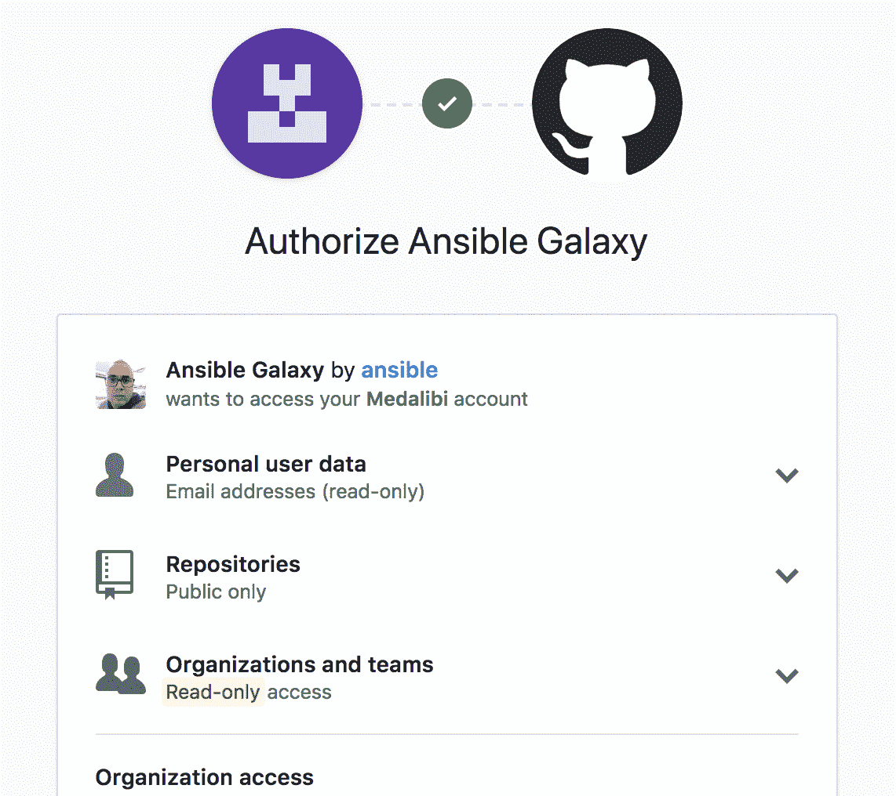
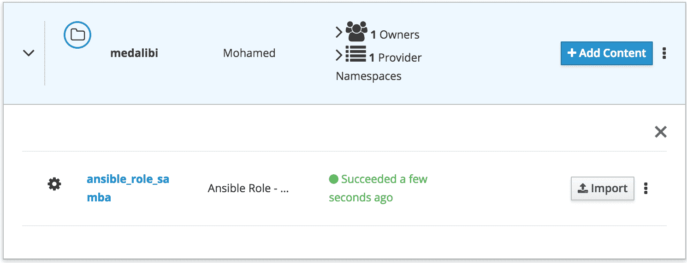

# 七、Ansible 的集群和社区角色

在前一章中，我们向您展示了如何在 Ansible 规范和最佳实践的指导下创建您自己的角色。没有必要重新发明轮子；相反，我们可以寻找已经创建的东西，并使用它或改变它来适应我们的需求。本章将简要介绍 Ansible Galaxy，包括命令和存储库。我们将学习如何将我们创建的角色上传到存储库中，搜索要下载、设置和使用的流行社区角色，并对它们进行故障排除。

本章涵盖以下主题:

*   易逝集群介绍
*   将角色上传到 Ansible Galaxy
*   搜索社区角色的最佳实践
*   设置和使用社区角色
*   角色疑难解答

# 易逝集群

Ansible Galaxy 是 Ansible 为其社区创建的平台。它允许其成员创建和提交自己的角色，供其他成员使用、更改、升级、增强和优化。

Ansible Galaxy 的构建允许开发人员更容易提交角色，用户更容易导入角色。在控制器主机上安装 Ansible 时，在`ansible-galaxy`命令行中添加。该命令允许终端与 Ansible Galaxy 存储库进行交互。

Ansible Galaxy 给了 Ansible 巨大的优势，让它比其他任何自动化工具都发展得更快。由有经验的用户编写的大量代码的存在对于经验不足的用户来说是无价的，可以方便地访问和学习。该供应由精心编写的基于 Ansible 的项目和工作流组成。

# 可扩展的银河枢纽

Ansible Galaxy hub 是一个承载大量社区角色的门户网站。它被分成几个组，以便更容易地搜索角色，并提供由 Ansible 用户开发和维护的各种角色。有些角色比其他角色编码和维护得更好。Ansible Galaxy hub 还提供了关于如何导入和使用每个角色的有用信息，其中大部分由作者填写。每个角色还应该包含一个指向其 GitHub 项目的源代码链接。除此之外，信息还应该包括每个角色的下载数量、明星、观察者和分叉。该界面还提供了注册到该中心的所有作者的列表。

它的 web 界面如下所示:


Ansible Galaxy 使用 GitHub 访问一个 API，该 API 要求您登录其作者或贡献者服务。通过登录，界面会发生变化，增加一些额外的选项。登录界面如下:



Ansible does not require authentication to access its roles and use them. The login is only for authors and contributors to be able to submit their code as a contribution to the community.

Ansible Galaxy 存储库由标记组织，标记指示每个角色的类别和服务。标签不限于主页上的标签。可以根据角色进行个性化。然而，在你的角色中加入一个主屏幕标签，会让它更容易被发现。

# Ansible 的银河命令行

Ansible Galaxy 命令行`ansible-galaxy`是在本地用于初始化角色的工具。

在前一章中，我们使用选项`init`启动了一个角色，如下所示:

```
ansible-galaxy init lab-edu.samba
```

该命令将使用角色名称创建一个文件夹，其中包含基本文件夹和必要的文件。然后需要对这些进行编辑，并填充适当的代码和文件，以使角色发挥作用。

Ansible Galaxy 命令行管理 Ansible 控制主机中的所有角色。它还允许您浏览中心内的角色。该命令行最常用的选项如下。

Ansible Galaxy 命令行允许使用以下命令从本地 Ansible 安装中删除一个或多个不再需要的角色:

```
ansible-galaxy remove lab-edu.ntp
```

它还允许您通过关键字或标签来搜索角色，并查看关于他们的有用信息，以便在不使用网络界面的情况下再次检查他们的评分或了解更多信息。这可以使用以下命令来完成:

```
ansible-galaxy search geerlingguy.ntp
ansible-galaxy search --galaxy-tags system
ansible-galaxy info geerlingguy.ntp
```

以下屏幕截图显示了角色信息的示例输出:


如果需要找到的角色，可以使用`install`选项进行安装。使用`list`选项，您总能看到已安装角色的列表。以下命令显示了如何做到这一点:

```
ansible-galaxy install geerlingguy.ntp
ansible-galaxy list
```

下面的屏幕截图显示了前面命令的输出示例:


我们将在后面的章节中讨论这个命令的更多功能和选项。

To be able to use a locally created role that has not been uploaded to the Galaxy hub within your Ansible installation, you just need to copy its folder to the assigned role folder within the Ansible configuration. Ansible is currently developing a new command-line tool called `mazer`. It is an open source project made to manage Ansible content. It is currently an experimental tool that should not replace the `ansible-galaxy` command-line tool.

# 银河贡献-角色导入

在 Ansible Galaxy hub 上向公众免费提供的角色数量和质量方面，Ansible 社区的影响非常明显。来自世界各地的用户为了他人的利益贡献他们的代码。这就是开源的精神，它帮助构建了伟大的工具。跟随前人的步伐，贡献我们认为不可用的、可能有助于某人应对挑战的每一点代码是很重要的。

# 角色提交前要做什么

为了能够上传和贡献给 Ansible Galaxy，你需要有一个 GitHub 账号。这有两个原因:登录到 Galaxy hub 门户，并将角色代码作为项目上传到 Galaxy hub。

首次登录 Ansible Galaxy hub 后，我们会看到各种项目访问权限配置。这将允许 Galaxy 将项目链接到您的组织。

The access permission configurations can always be altered later from within the GitHub account option interface.

“我的内容”菜单将出现在银河中心主页中。这可用于列出已从您的帐户中写入的角色。该菜单允许您添加、删除和编辑版本，以及升级角色。如果角色由多个作者维护，它还允许您添加贡献者。下面的截图显示了 web 界面的样子:


在本地机器上，建议您使用一种形式的 Git 工具，要么是通常适用于 macOS 和 Windows OS 的花哨图形界面，要么是不错的老式`git`命令行。我们需要在本地登录我们的 GitHub 存储库，以便于上传:

```
git tag 0.1
git push lab-edu.samba
```

You can always create a role from the GitHub web interface. It can be a bit clumsy to use, but it does the job perfectly.

# 角色存储库

将代码上传到 GitHub 后，我们现在可以将角色导入到 Ansible Galaxy hub。从“我的内容”页面中，选择“添加内容”按钮。将出现一个包含与该帐户相关联的所有 GitHub 项目的框。我们选择要导入的角色，然后按“确定”。菜单如下所示:


该角色随后被添加到内容列表中，如下图所示:



该方法允许您向 GitHub 帐户添加任意多的角色。这一步是角色的实际导入，其中 Ansible Galaxy 根据`meta`文件夹文件中的元数据执行一些静态分析。

After adding a role, we can link organizations that have been imported from our GitHub account. This helps with indicating collaborations and as a search tag.

可以管理用户帐户中的每个角色来添加作者，并赋予他们某些权限，例如管理员权限。这可以在“编辑”属性菜单中更改。通过此菜单添加的任何用户都可以编辑、禁用、启用、删除和更新角色及其内容。

最后，在 Galaxy 上更新角色的最佳方式是为其内容设置版本方案。这个过程是在 GitHub 标签的帮助下发生的。每当 Ansible Galaxy 从 GitHub 导入角色代码时，它都会扫描项目中的标签，寻找一个格式化为包含版本化语法的标签。

# Ansible 的银河角色管理

现在让我们来看看 Ansible Galaxy 库能提供什么。在本节中，我们将探讨如何找到一个角色，以及与其他具有相同功能的角色相比，我们应该在什么基础上使用它。我们还将了解一些关于如何安装角色以及如何对其安装和导入进行故障排除的推荐方法。

# Ansible 的银河角色搜索

在本小节中，我们将讨论如何使用 Galaxy 门户网站来查找 Ansible 角色。为此，我们将使用标签页面或通用搜索页面。我们建议将其中一个标签页用于分类列表。

一旦我们选择了一个类别，我们就可以查看过滤器，这是一种确定角色特定方面的方法。可以从下拉菜单中选择类别使用的过滤器。一个类别可以是一个简单的关键字，如投稿人或平台，也可以是一个标签。通过选择关键字或标签以外的类别，我们可以访问第二个下拉菜单，其中包含该类别中可供我们选择的所有可用选项。

过滤器可以跨类别组合，也可以作为同一过滤器类别的多个条目组合。这将进一步缩小返回的结果。您也可以通过从搜索栏下方的过滤器列表中删除不再需要的过滤器来删除它们。过滤器功能可用于门户上的任何类别页面。它也可以在所有作者列表所在的社区页面上使用。

找到与我们的搜索匹配的角色列表并不意味着我们已经完成。然后，我们需要选择执行所需任务的角色。从匹配我们搜索的角色列表中，我们可以再次使用其他 Ansible 用户的帮助。Ansible Galaxy 提供了一个由不同变量组成的评级系统。你可以通过看一个角色有多少明星来判断这个角色的质量和用户的满意度。我们还可以看看有多少人在关注这个角色，以跟踪正在发生的变化，这很好地表明了它的维护情况。一个特定角色被下载的次数也很有用，但是你应该将其与已经给出的星级进行比较，因为它没有显示一个角色是否被同一用户多次下载。

了解角色的作者也很重要。一些 Ansible Galaxy 作者以其高质量的角色和持续的维护而闻名。

# Ansible 的银河角色安装

我们可以通过多种方式安装 Ansible 角色。最简单的方法是使用带有选项`install`的命令行，如下所示:

```
ansible-galaxy install geerlingguy.ntp
```

或者，我们可以通过选择我们希望从哪个来源获得哪个版本来个性化我们的安装命令。这可以通过以下方式实现:

```
ansible-galaxy install geerlingguy.ntp,v1.6.0
ansible-galaxy install git+https://github.com/geerlingguy/ansible-role-ntp.git
```

我们还可以使用 YAML 需求文件一次安装多个角色。命令行如下所示:

```
ansible-galaxy install -r requirements.yml
```

需求文件有一个 YAML 结构化文件，其中包含如何安装所需不同角色的说明。这是一个示例需求文件:

```
# install NTP from Galaxy hub
- src: geerlingguy.ntp

# install Apache from GitHub repo
- src: https://github.com/geerlingguy/ansible-role-apache
  name: apache

# install NFS version 1.2.3 from GitHub
- src: https://github.com/geerlingguy/ansible-role-nfs
  name: nfs4
  version: 1.2.3
```

需求文件可以调用其他需求文件来安装原始需求文件中已经声明的额外角色。如下所示:

```
- include: ~/role_req/haproxy_req.yml
```

安装多个角色的另一种方式是依赖角色的`meta`文件夹的依赖部分。在说明某个角色的来源和版本时，依赖项部分遵循与需求文件相同的规则。

# Ansible 的银河角色故障排除

从用户的角度来看，在 Ansible 控制机器中设置角色可能会导致一些问题，这些问题主要与没有访问角色所需的权限或角色出现故障有关。大多数错误的原因是 Ansible 的安装方式。默认的 Ansible 安装将其所有配置文件、清单、角色和变量放在一个根拥有的文件夹(`/etc/ansible`)中。因此，作为普通用户使用它可能会导致一些问题。这就是为什么我们总是建议拥有一个用户个性化的 Ansible 配置文件，该文件指向用户有权访问的文件夹。安装角色需要创建多个文件夹和文件；如果不在授权位置进行，安装将会失败。

我们还需要仔细检查每个角色的系统需求。他们可能需要特定版本的 Ansible 或特定文件中的特定配置。如果某个角色的某项要求没有得到适当满足，该角色将无法正常工作。

关于将角色导入到 Galaxy hub，用户得到的主要错误是导入失败，这通常与剧本或`meta`文件夹中保存的角色信息中的错误有关。Galaxy hub 给出了错误的详细日志，甚至可以显示发生错误的特定文件的确切行。修复错误后，您可以轻松地重新启动导入并继续。

# 摘要

Ansible Galaxy hub 是 Ansible 加速发展和取得成功的巨大资产。有了这个资源，大部分日常任务已经被转换成有组织的和资源优化的角色，供公众使用。在本章中，我们介绍了 Ansible Galaxy，并介绍了如何在社区中进行协作。然后，我们研究了如何搜索、安装和排除角色故障。

在[第 8 章](8.html)*Ansible 高级功能*中，我们将简要介绍 ansi ble 的一些更高级的功能，这些功能在安全性和更高级用户的需求方面非常方便。

# 参考

可获得的银河文件:[https://galaxy.ansible.com/docs/](https://galaxy.ansible.com/docs/)

可获得的文件:[https://docs.ansible.com/ansible/latest/](https://docs.ansible.com/ansible/latest/)