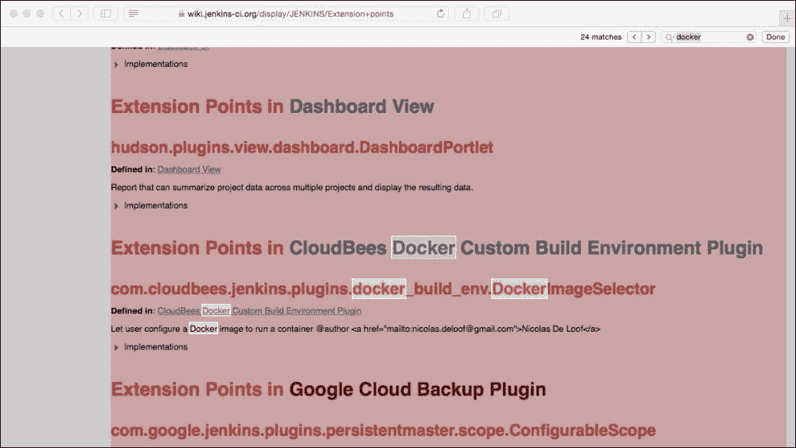
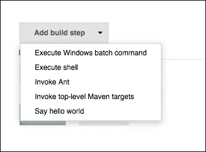
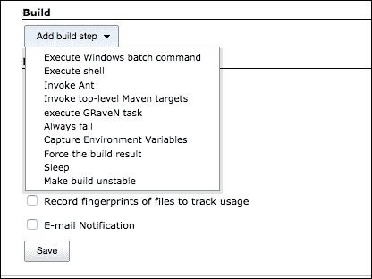

# 七、扩展 Jenkins 插件

到目前为止，对于 Jenkins 插件的开发，我们已经了解了以下内容:

*   采用的方法—尽可能重用，避免不必要的重复
*   协作—流程和社区如何工作
*   使用的设计方法和 Java 模式
*   设置开发环境和构建工具
*   开发第一个简单的插件
*   在本地和远程部署和测试我们的插件

我们现在将看一下帮助你整理前一章中缺少的中间部分的方法，并实现代码，使你的插件能够做它能做的事情…不管是什么！

这里的目的是引导您完成自己插件的开发，并演示您可以(并且应该)使用现有资源的方法。

这意味着，当你想出一个自己的插件的想法并想开发它时，你将能够通过遵循最佳实践并通过避免在 Jenkins 和插件代码库中添加不必要的重复来尽可能快且容易地做到这一点。

在这样做的同时，我们还将探索 Jenkins 插件使用和可用的一些附加框架和技术。这些包括果冻、订书机、本地化和国际化；当一起使用时，这些工具和实践使插件开发人员能够重用 Jenkins 的内置功能，以便通过保持与用户界面其余部分相同的外观和感觉，使他们的插件看起来像是“属于”Jenkins 的，而不是简单地添加的东西。

遵循这种让自己开始并知道如何使用这些框架的方法将会为你节省很多时间和挫折。一旦你知道如何着手研究和重用已经由现有插件和 Jenkins 提供的代码和功能，你也将为自己节省大量的开发工作。

在开发`Hello World`插件的过程中，我们覆盖了大量的新信息，并引入了一些新概念。这一切都是在相当高的水平上完成的，并且使用了最少的编码和配置，因此我们可以保持对整个过程的关注，并了解事情是如何工作的。实际的代码就像插件一样简单；它所做的只是在每次运行构建时向控制台日志中写入一条消息。

毫无疑问，正如您所知，Jenkins 插件已经被创建来执行各种各样的任务，并且它们以各种各样的方式实现——其中一些与 Jenkins 用户界面无缝集成，而另一些则在后台以几乎看不见的方式工作。一些扩展了现有的功能，另一些增加了全新的功能。插件看起来是有凝聚力的——它们都有大致相同的外观和感觉，而不是看起来是由不同的人开发的，他们对配色方案、导航、对话框等有自己的想法。他们甚至能够根据用户指定的首选项，响应区域设置的变化，提供不同语言的对话框。虽然 Jenkins 的大部分功能来自大量插件，其中许多已经被吸收到 Jenkins 的核心，但印象和用户体验是一个相当光滑和有凝聚力的整体，而不是一个碎片化和不同的添加的集合。

在这一章中，我们将看看 Jenkins 插件中的其他元素，并扩展您可以充实自己插件的方式。我们还将研究如何找到并重用现有的代码/插件来让您快速入门，我们将浏览一个插件的内容，该插件提供的功能类似于我们希望开始开发的一个假设的新插件。

# 从哪里开始？

因此，在检查了 Jenkins 网站和社区后，我们决定编写一个新的插件，因为外面(或目前正在开发中)没有任何东西可以做我们想要做的事情；我们从哪里开始？

我们可以从一个新的空白 Eclipse 项目开始，如果我们真的想的话，我们可以自己编写所有的东西，但是这需要很长时间。

我们可以使用骨架`Hello World`项目，删除其中的内容，并开始向其中添加我们的代码，但这听起来不像是我们期望遵循的方法，因为我们已经讨论了一段时间的所有代码重用和避免重复。

即使你对一个插件有一个完全新颖的想法，肯定已经有一些和它大致相关的东西了；即使这没有提供我们想要的功能，它也可能以类似的方式工作，或者使用我们已经确定为感兴趣的许多相同的扩展点，因此值得一探究竟。

# 查看现有插件列表

通常，首先要看的是可用插件的列表。如果您的 Jenkins 实例是最新的，您可以浏览 Jenkins **可用插件**页面中当前可用的选项。

转到**管理 Jenkins**，然后选择**管理插件**，并选择**可用**选项卡，查看不断增长的插件列表供选择。

请注意，该屏幕允许您通过特定的词进行过滤，并提供每个插件的简要描述。

或者，Jenkins**插件** 页面提供了一个更容易浏览且稍微详细的列表:

[https://wiki.jenkins-ci.org/display/JENKINS/Plugins](https://wiki.jenkins-ci.org/display/JENKINS/Plugins)

这列出了插件按其一般类别或功能分组，并为每个插件提供了到相应的 Jenkins 主页的链接。反过来，主页提供了进一步的信息，包括指向 GitHub 上该插件源代码的链接，您可以在线浏览或本地下载。

如果你能在这里找到与你的插件相似的东西，那么浏览 GitHub 上的源代码将使你能够详细了解每个插件是如何工作的。你也可以找到这个插件使用的扩展点。

另一个要考虑的选项是直接进入**扩展点**索引页面这里:

[https://wiki . JENKINS-ci . org/display/JENKINS/Extension+积分](https://wiki.jenkins-ci.org/display/JENKINS/Extension+points)

该列表由**扩展索引器**程序自动生成和维护，该程序在可用:

[https://github.com/jenkinsci/backend-extension-indexer](https://github.com/jenkinsci/backend-extension-indexer)

这个程序解析所有声明的扩展点的当前代码库，然后在它生成的**扩展点**页面上列出它们，以及进一步的细节，比如项目主页和使用它们的插件列表。

无论哪个起点对你有用，插件列表还是扩展点列表，你都应该有希望在同一个地方结束——有一个大致类似于你想要结束的东西的想法，这应该是一个让你开始的好地方。

例如，如果我的插件连接到 Docker，我可以从我的本地 Jenkins 开始搜索现有插件列表:


或者，我可以去[https://wiki . JENKINS-ci . org/display/JENKINS/Extension+points](https://wiki.jenkins-ci.org/display/JENKINS/Extension+points)，在这里搜索 Docker 参考资料:



这两条路线最终都通向所讨论插件的主页，例如:


这告诉你关于这个插件你需要知道的一切，并且包括一个链接到 GitHub 上托管的这个插件的源代码和配置文件。

为了说明过程的其余部分，并介绍您可能想要使用的其他框架和文件，我们将考虑一个我们想要开始开发的新插件。我们将尝试找到一些已经存在的东西，使用它来让我们开始，然后查看代码、配置文件和扩展点，这些将用于让我们开始添加自己的代码。

# 需要新的构建类型

对于这个假设的例子，我将从为 Docker 构建创建一个新的构建步骤开始。这将允许用户创建这种类型的构建，添加一些信息，然后最终按照 Docker 构建的思路使用它做一些事情。

您通常可以选择添加这些类型的构建步骤(添加我们的**问好世界**示例):



这个惊人的新插件将增加一个额外的条目来启动 Docker 构建。

通过查看添加额外构建步骤的类似项目以及`Hello World`示例，我可以猜测我的新插件也想要扩展`Builder`、`BuildStep`和`AbstractProject`类。

在浏览了之前列出的链接和资源后，我可以看到有一个现有的 Graven Plugin 项目，它执行的步骤与我们正在寻找的非常相似，并且恰好包含了我们在本章中想要检查的所有新资源。另外，这里有一些方便的文档:

[https://wiki . JENKINS-ci . org/display/JENKINS/Create+a+new+Plugin+with+a+custom+build+Step](https://wiki.jenkins-ci.org/display/JENKINS/Create+a+new+Plugin+with+a+custom+build+Step)

让我们来看看。源代码可以在这里从 GitHub 下载，然后提取到本地目录:

[https://github . com/jenkinci/graven 插件](https://github.com/jenkinsci/graven-plugin)

这为我们提供了开始使用自己的插件所需的一切，这应该比从头开始容易得多——我们可以检查并重用这里使用的扩展点，看看插件如何创建新的构建类型，并调整属性文件和其他资源，因为它们执行的步骤与我们想要做的相同。

# 装载和建造我们的起点

让我们把这个项目导入到 Eclipse 中。同样，过程相当简单；正如我们在前一章中所做的，我们将为我们的 Eclipse 项目创建一个目录，使用`cd`进入包含我们项目的 POM 文件的目录，然后再次运行`eclipse:configure-workspace`目标，如下所示:

```
mvn -DdownloadSources=true -DdownloadJavadocs=true -DoutputDirectory=target/eclipse-classes -Declipse.workspace=/Users/donaldsimpson/Documents/GravenPluginMasterWorkspace eclipse:eclipse eclipse:configure-workspace
```

这将下载所有依赖项，并允许您将项目导入到您的 IDE 中(导航到**文件** | **导入** | **常规** | **现有项目到工作区**，与我们在上一章中所做的相同。

现在，您应该已经将构成这个插件的所有资源和源代码加载到您的 IDE 中，它应该大致如下所示:


我们现在将快速浏览这些文件和文件类型，解释它们的功能，并探索它们为这个插件提供的附加插件组件和选项，以及可能给我们的新插件带来的潜在好处。

# 建造者类和订书机

第一堂课是`GravenBuilder.java`。类声明扩展了`Builder`类:

```
public class GravenBuilder extends Builder {
```

正如我们在[http://javadoc.jenkins-ci.org/hudson/tasks/Builder.html](http://javadoc.jenkins-ci.org/hudson/tasks/Builder.html)的 JavaDoc 中所看到的，扩展`Builder`类会将这个类注册到 Jenkins 作为 **自定义构建器**，这就是我们所追求的。

### 类型

这个扩展声明就是**扩展点**页面的更新方式——构建索引的程序会在代码中找到这个引用，并自动为我们创建关联。

`GravenBuilder`类也包含这个简单的方法:

```
@DataBoundConstructor
public GravenBuilder(String task) {
  this.task = task;
}
```

通过使用`@DataBoundConstructor`注释，当用户决定创建这个新的构建类型时，这个方法将注册这个任务/构建类型的选择。这是通过订书机框架自动完成的，Jenkins 用它来序列化和转换 Java 对象。您可以在这里找到更多关于订书机的信息，它是如何工作的，以及如何在您的插件中使用它:

[http://stapler.kohsuke.org/what-is.html](http://stapler.kohsuke.org/what-is.html)

同样，在`GravenBuilder`类中，有一个名为`Descriptor`的内部类。这扩展了`BuildStepDescriptor`，其功能是为 Jenkins 提供一种管理`GravenBuilder`实例及其生命周期的方法。

`GravenInstallation`类包含所有需要的安装和注册设置；这将设置工具提示，并定义用于该插件的显示名称，等等。

# 果冻和 Jenkins

`config.jelly`配置文件是一个简单的果冻模板。你可以在 Jenkins 的以下链接找到更多关于果冻的信息:

[https://wiki . JENKINS-ci . org/display/JENKINS/Basic+guide+to+Jelly+用法+in+Jenkins](https://wiki.jenkins-ci.org/display/JENKINS/Basic+guide+to+Jelly+usage+in+Jenkins)

一般来说，你可以在 http://commons.apache.org/proper/commons-jelly/ T2 阅读更多关于果冻的内容。该条规定如下:

> *Jelly 是一个基于 Java 和 XML 的脚本和处理引擎。*

在这种情况下，Jelly 的主要目的是为开发人员提供一个高度灵活的标签库，通过该标签库，他们可以快速轻松地创建和处理 UI 视图更改。

从开发人员的角度来看，Jelly 文件与 Java 代码交互，以在运行时获取和设置声明的值，并通过用户界面将其呈现给用户。

# 救命

`help*.html`文件向用户提供上下文相关的帮助信息。这些消息在`<div>`标签中简单定义，并将在 Jenkins 用户界面中显示为标准外观的工具提示。这种方法允许你指导你的用户，建议他们什么能做什么不能做，并解释你的插件做什么和需要什么。

`index.jelly`文件为用户提供了这个插件所做工作的一般高级描述——我们将在 Jenkins 中看到这个文本作为插件描述显示，当我们稍后查看正在运行的插件时。

# 属性文件和消息

`Messages.properties`和`config_fr.properties`文件是为了给用户提供国际化的 i18n ，正如在这里描述的:

[https://wiki . Jenkins-ci . org/display/JENKINS/国际化](https://wiki.jenkins-ci.org/display/JENKINS/Internationalization)

这个环节有更多关于本地化和国际化的细节:

[http://www.w3.org/International/questions/qa-i18n](http://www.w3.org/International/questions/qa-i18n)

在 Jenkins 插件开发中，我们真正需要做的就是提供`config_LOCALE.properties`文件来迎合每一种语言。例如，如果用户的`LOCALE`变量设置为`fr`，将使用`config_fr.properties`文件中的消息，可以根据需要添加其他`LOCALE`文件以支持其他语言。

您的插件代码能够在运行时使用和引用属性，如下所示:

```
Messages.GravenBuilder_Task()
```

目标目录中的`Messages.java`类是在构建时基于这些属性文件生成的。

# POM 文件

剩下的最后一个文件`pom.xml`是我们之前看过的 Maven 设置文件。这一个是我们在这里使用的插件所特有的，它包含了将被用来构建、运行和打包项目的组、工件和版本信息，我们现在就要做。

右键单击`pom.xml`文件并选择**作为**运行，然后选择**Maven Build……**允许您再次指定`hpi:run`目标，该目标应该使用编译并部署到这个新实例的这个插件，以及该插件包含的所有资源和本地化设置来启动 Jenkins 的一个新本地实例。

当实例启动时，我们可以通过浏览器进行连接，并看到我们在理论上审查过的各种设置和代码正在实践中使用。

我们可以检查并看到插件被列为已安装，以及从`index.jelly`获取的消息文本:


当我们创建一个新的自由式作业并查看我们可以添加的可用**构建**步骤时，该插件将显示为一个新选项— **执行从**消息.属性**中选取的 GRaveN 任务**:



当我们选择此选项时，我们将看到对话框、本地化工具提示和输入框，这些都是在我们刚刚查看的配置和代码中定义的:


这个示例插件看起来是我们假设的一个很好的起点。它可能不会做我们想做的所有事情，但是我们可以调整和重用设置文件以及它用来让我们开始的一些代码和扩展点，并且我们可以非常快地启动和运行我们自己的插件的基础知识。

这个假设插件的实现，或者你自己的插件，当你开始关注细节的时候，可能会有不同的需求，但是希望，这将说明你可以遵循的方法和路线，让你的插件快速启动和运行。

如果你想知道一个插件是如何工作的，或者如何改变一个插件，或者修复一个插件中的一个错误，了解你对各种资源文件的理解，以及如何从源代码开始加载和运行任何基于本地的插件是一个非常有用的技能。

# 插件进度

我们搜索并确定了一些事情，它们大致完成了我们想要做的事情，至少开始是这样的。我们已经确定了扩展点，这些扩展点提供了我们正在寻找的一些功能，我们已经有了一个功能非常全面的插件的开端，它看起来和感觉都像 Jenkins 的一个正常部分。它将为用户提供内置的帮助，甚至会说用户喜欢的语言……只要我们添加相应的配置文件。

# 总结

这个插件的下一步将是实现更多我们自己的代码，执行 Docker 构建，或者我们想要执行的任何功能。同样，这个功能可以进一步利用可用的扩展点，或者如果没有可用的扩展点来实现我们想要的功能，我们应该考虑声明它们的接口，并在编写自己的实现后与社区共享它们。

在下一章中，我们将探索可用于测试插件的工具、选项和资源。当我们探索如何处理、解决和避免插件问题时，我们还将进一步研究调试。