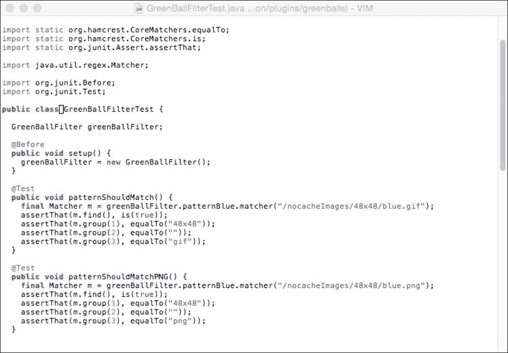
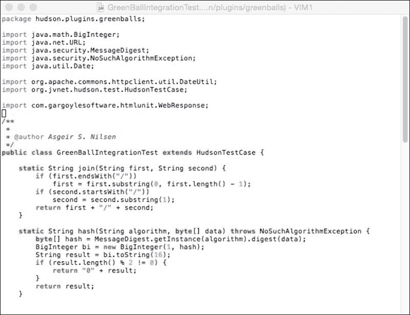

# 八、测试和调试Jenkins插件

在这一章中，我们将看看Jenkins插件的测试和调试。我们将探讨目前可用的几种流行选项和方法，并回顾每种方法的优势和适用性。

如果您喜欢简单地运行标准的 Java 单元测试，那么测试 Jenkins 插件是相当简单的，但是如果您希望通过用户界面测试和模拟交互，那么测试可以变得稍微复杂一些。我们将从一个简单的例子开始，然后看一些方法和工具，您可能想进一步研究更复杂的场景。

能够调试一个Jenkins插件对你的开发技能是一个有价值的补充——它可以帮助你在开发自己的插件时了解它是怎么回事，它也可以帮助你解决其他插件或Jenkins本身的问题。

在本章中，我们将了解以下主题:

*   测试:在测试下，我们将涵盖以下主题:
    *   为现有项目运行测试
    *   自己写测试
    *   可用工具
    *   技术——HTML 抓取、嘲讽等等
*   调试:在调试下，我们将讨论以下主题:
    *   标准日志文件
    *   使用本地Jenkins调试会话
    *   从集成开发环境连接
    *   `mvnDebug`命令

# 用 Maven 运行测试

当我们在早期探索插件开发时，我们学习了在哪里寻找以及如何为任何给定的 Jenkins 插件获取源代码。

大多数插件的完整源代码可以从 GitHub 上快速方便地下载，然后构建在您的本地机器上。在许多情况下，这也包括单元测试，单元测试与源代码捆绑在一起，可以在`src/test`的预期(按照 Maven 惯例)位置找到。检查一些流行的插件将为你提供有用的信息和一个很好的起点来编写你自己的测试用例。

Maven `test`目标将执行所有测试，并通过详细说明所有常规统计数据(如运行的测试数量、失败和错误数量以及跳过的测试数量)来生成结果摘要。

为了演示这个过程，我们将看看非常流行的`Green Balls`插件，它只是用绿色的球替换了Jenkins中的标准蓝色球。

### 类型

此链接解释了为什么Jenkins将蓝色球作为默认值:

[http://Jenkins-ci . org/content/为什么-Jenkins-有-蓝球](http://jenkins-ci.org/content/why-does-jenkins-have-blue-balls)

绿球插件主页链接到这个 GitHub 位置，在这里您可以下载 zip 文件中的源文件和配置文件，或者使用提供的网址克隆它:

[https://github.com/jenkinsci/greenballs-plugin](https://github.com/jenkinsci/greenballs-plugin)

我们正在看这个示例插件，因为它包含了各种各样的测试，涵盖了测试的主要主题和风格——我们将很快仔细看看内容。一旦您将源代码下载到本地机器上，您应该能够通过简单地运行 Maven `test`目标来启动测试:

```
mvn test

```

该目标将在执行所有测试之前运行所有先决条件设置步骤，然后报告如下结果:


请注意，通过指定测试的名称，可以运行单个测试，如下所示:

```
mvn test -Dtest=GreenBallIntegrationTest

```

这将导致运行一个测试，或者您可以使用通配符，例如:

```
mvn test -Dtest=*ilter*

```

前面的代码导致在这种情况下运行四个测试。

这种方法可以用来将您的测试分类为逻辑套件—集成测试、夜间测试、回归测试或单元测试—无论您喜欢什么，只需对您的测试类应用一致的命名约定，然后设置 Jenkins 作业，或者运行将执行相应操作的 Maven 目标，例如:

```
mvn test –Dtest=*Integration*

```

`Green B`all plugin 包含两个测试类:`GreenBallFilterTest`和`GreenBallIntegrationTest`，它们说明了插件测试的两种不同方法——浏览它们的源代码应该有助于您了解如何开发自己的测试。

`GreenBallFilterTest`执行一些简单的模式匹配测试，以确保正确的图像到位:



`GreenBallIntegrationTest`，如下图截图所示，扩展 `HudsonTestCase`，使用`com.gargoylesoftware.htmlunit.WebResponse`直接测试部署的 web 组件并与之交互，断言其返回预期结果:



这个Jenkins页面为进一步阅读提供了有用的资源，这将迎合更详细和复杂的测试场景:

[https://wiki.jenkins-ci.org/display/JENKINS/Unit+Test](https://wiki.jenkins-ci.org/display/JENKINS/Unit+Test)

该链接涵盖了诸如嘲讽、HTML 抓取、提交表单、JavaScript 和网页断言等主题。

# 调试Jenkins

本章的剩余部分着重于以多种不同的方式进行调试，以帮助进一步理解应用程序及其在运行时的行为。

主要的焦点是使用 Jenkins 的本地实例和 IDE 来调试开发会话；但是，了解通过 Jenkins 中的内置日志选项提供的选项仍然很有用，这些选项非常复杂，并且高度可定制。对于任何类型的问题来说，这些通常都是一个很好的起点，所以我们将从这里的选项的快速概述开始，然后继续进行调试类型，您可能会希望在开发自己的代码时设置并使用。

## 服务器调试–快速回顾

Jenkins使用`java.util.logging`包进行测井；这方面的细节可以在这里找到:

[https://docs . Oracle . com/javase/7/docs/API/Java/util/logging/package-summary . html](https://docs.oracle.com/javase/7/docs/api/java/util/logging/package-summary.html)

关于日志记录的Jenkins文档可在此处获得:

[https://wiki.jenkins-ci.org/display/JENKINS/Logging](https://wiki.jenkins-ci.org/display/JENKINS/Logging)

本页解释如何开始设置你自己的自定义日志记录器——这对于分离和过滤所有日志输出非常有用，有助于找到你感兴趣的内容，因为*的所有内容*通常都被传输到默认日志，这可能会使分析变得困难。

Jenkins系统日志可以通过用户界面**管理Jenkins** | **系统日志** | **所有Jenkins日志**查看，页面底部还有 RSS 源链接:


这些可以帮助识别和过滤系统中不同类型的事件。

对于从节点的问题，在以下位置有可用的日志文件:`~/.jenkins/logs/slaves/{slavename}`。

对于作业问题，历史日志文件保存在`~/.jenkins/jobs/{jobname}/builds/{jobnumber}`处。

您也可以通过在启动过程中添加额外的`–D`参数，在特定的日志级别启动 Jenkins:

```
-Djava.util.logging.loglevel={level}
```

这里，`level`是下列之一:

*   `SEVERE (highest value)`
*   `WARNING`
*   `INFO`
*   `CONFIG`
*   `FINE`
*   `FINER`
*   `FINEST (lowest value)`

`Off`和`All`级别也是可用的——更多详细信息和选项请参见本页:

[http://docs . Oracle . com/javase/7/docs/API/Java/util/logging/Level . html](http://docs.oracle.com/javase/7/docs/api/java/util/logging/Level.html)

## 用 IntelliJ 调试

要从 IntelliJ 中进行调试，请将 IntelliJ 指向项目的`pom.xml`文件，然后从“运行”菜单中选择选项以创建新的运行/调试配置。这将引导您进入类似以下的屏幕:


IntelliJ 将已经解析了 POM 文件，并将知道它包含的可用目标。一旦您开始键入，例如，`hpi`，您将看到一个下拉列表，其中包含所有匹配选项供您选择。

从下拉菜单中选择并运行所需目标( **hpi:再次运行**)，然后点击**调试**。

您应该在控制台中看到熟悉的 Jenkins 启动过程，然后能够在以下位置连接到本地调试会话:

`http://localhost:8080/jenkins`

在我们之前更改“Hello World”文本的相同位置向代码添加一个调试点(双击表示**Hello World……**的行的左边距，然后运行 Jenkins 作业)。这应该会达到您设置的断点并产生以下内容:


然后，您可以使用调试箭头和按钮来完成调试过程:


这些允许您进入、越过或离开当前调试点，并且您应该能够检查列出的正在更新的变量，以反映正在调试的应用程序的实时状态。

有关使用智能调试的更多信息，请参见以下链接:

[https://www . jet brains . com/idea/help/单步执行程序. html](https://www.jetbrains.com/idea/help/stepping-through-the-program.html)

## 用 Eclipse 调试

用 Eclipse 进行调试与前面为 IntelliJ 描述的过程非常相似。

要设置断点，请在代码窗口中双击左边距，如下所示:


接下来，右键单击 Eclipse 项目中的 POM 文件，并选择**调试为…** ，出现以下窗口:


指定`hpi:run`目标，然后点击**调试**；Jenkins 应该像往常一样在 Eclipse 控制台窗口中启动。

像以前一样，将浏览器指向`http://localhost:8080/jenkins`，然后创建或运行一个符合您之前设置的断点的作业——当到达该代码/点时，Jenkins 将冻结，焦点将切换到 Eclipse，在这里您可以检查变量和属性的当前状态，并在各种调试步骤中导航以进一步深入问题，或者跳过区域以查看发生了什么变化。

## mvnDebug

`mvnDebug`工具提供了一个你可能感兴趣的替代方法。要使用此功能，请在命令行中运行`mvnDebug hpi:run`。

这应该在调试模式下启动 Maven，并在本地主机的端口`8000`上启动一个侦听器，如下所示:


现在切换到您的集成开发环境，并将调试会话连接到这个端口。例如，在 Eclipse 中，选择**运行** | **调试配置…**

这将产生以下窗口，您可以从中选择**远程 Java 应用程序**。检查主机和端口是否匹配:


接下来，选择**调试**连接到您在控制台中启动的`mvnDebug`会话。此时，`hpi:run` 目标将启动(在控制台中)，并在 Maven 中以调试模式运行 Jenkins，同时连接到您选择的调试器，例如 Eclipse。

如果您检查`mvnDebug`可执行文件，您会看到它只是在运行正常的`mvn`二进制文件之前设置`MAVEN_DEBUG_OPTS`，如下所示:

```
MAVEN_DEBUG_OPTS="-Xdebug -Xrunjdwp:transport=dt_socket,server=y,suspend=y,address=8000"
echo Preparing to Execute Maven in Debug Mode
env MAVEN_OPTS="$MAVEN_OPTS $MAVEN_DEBUG_OPTS" $(dirname $0)/mvn "$@"
```

这表明，如果您愿意的话，可以很容易地指定一个不同的端口，或者您可以调整这个脚本来添加您可能想要包括的任何附加参数或设置。

# Jenkins记录器控制台

本章的最后一个主题是Jenkins调试版本内置的 **记录器控制台**。

当您通过 Maven(无论是通过命令行还是 IDE)启动 Jenkins 的本地开发实例时，您会注意到屏幕左侧包含的附加**记录器控制台**框:


展开此框将显示一个**实况**日志输出窗口，您可以实时自定义该窗口，以调整和过滤出您想要查看或隐藏的日志项目的类型和严重性。

保持**信息**处于选中状态提供了非常详细的输出，包括鼠标悬停事件和其他用户界面交互的信息。这些在调试用户界面问题时非常有用。

取消选中**信息**框只留下**警告**和**错误**信息。可以通过暂停和可选地清除输出以及调整过滤器来管理日志输出，以满足您的需要。以下截图显示了**记录器控制台**:


# 总结

正如您所看到的，在 Jenkins 中有大量的选项和方法可用于测试和调试。本章介绍了一些主要的工具和方法，希望对您自己的开发过程有用。

知道如何测试和调试您的代码，并建立一个适合您的需求和偏好的高效开发环境，应该会提高您自己的开发质量。当您考虑发布自己的插件并考虑替代开发选项时，这也将使事情变得更加容易。我们将在下一章研究一些替代技术和语言。