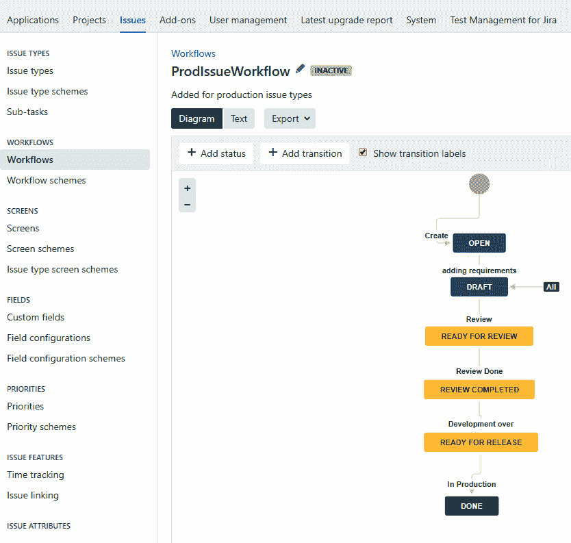
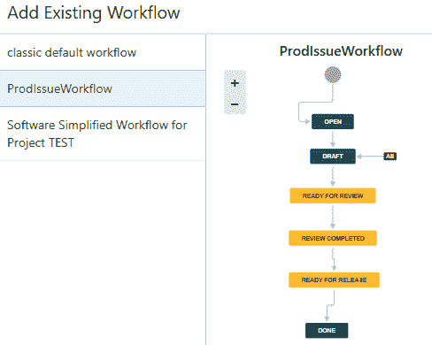
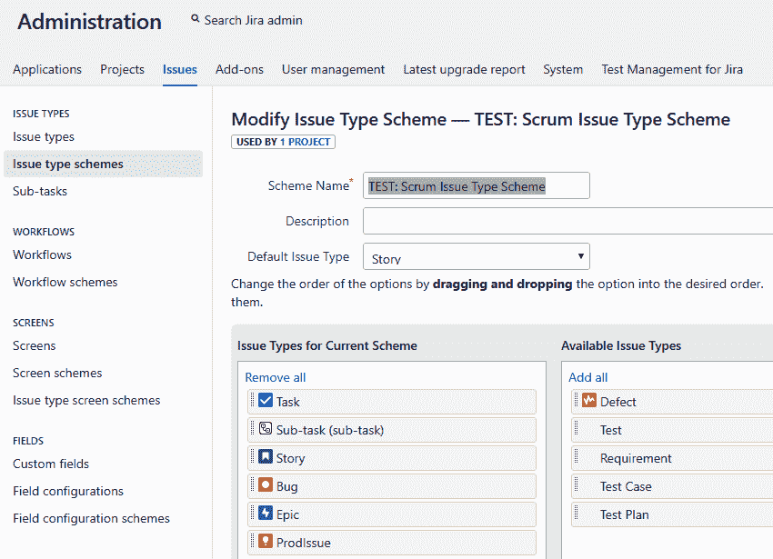
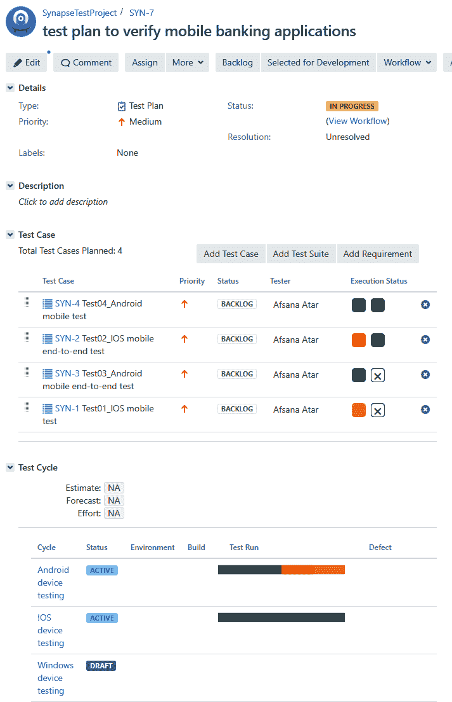
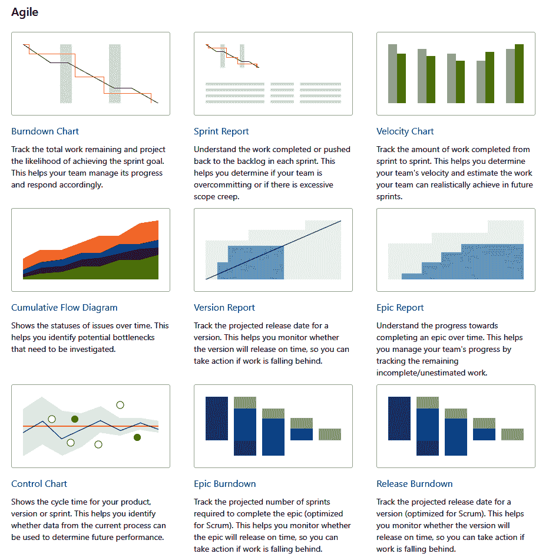
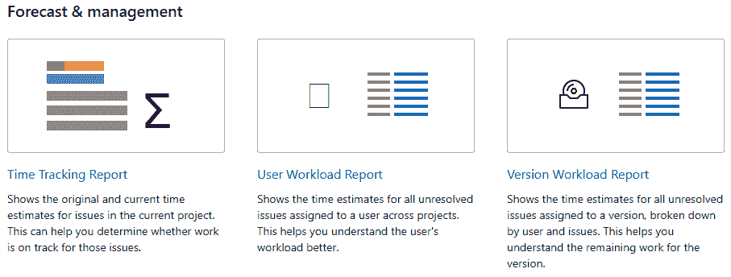

# 三、了解 JIRA 测试的组成部分

需求、测试套件、测试计划、可追溯性和报告是作为 JIRA 测试管理解决方案的一部分提供的测试的主要组成部分。测试套件，也称为测试库，用于组织测试用例。在我们进入测试执行阶段之前，测试计划是一个重要的因素。可追溯性和报告帮助我们跟踪项目发布周期中测试工作的覆盖范围和进度。

在本章中，我们将介绍在 JIRA 使用插件进行测试管理的方法。首先，我们将了解测试计划的需求和一些基础知识，以及问题类型，包括每个问题类型在 JIRA 经历的默认工作流。我们将学习创建定制的工作流，并使用工作流方案将它们添加到项目中。然后，我们将创建自己的问题类型，并将这个新创建的工作流应用于该问题类型。我们还将详细研究问题类型，并比较所有三个插件提供的测试套件特性。我们将从了解测试计划的一些基础知识以及它在 JIRA 插件中的位置开始。

在本章中，我们将详细讨论以下主题:

*   要求是什么？
*   问题类型
*   什么是测试套件，它有什么优势？
*   什么是测试计划？
*   什么是可追溯性矩阵，它有什么好处？
*   报告及其类型

# 要求

需求基本上是解决方案的一部分，可以帮助您解决最终用户的问题。它们也可能是吸引最终用户使用产品或服务的理想项目。此外，需求还可能包含市场上现有产品中可能广泛使用的功能，这使得新产品进入市场至关重要。

# 要求是什么？

需求可以是功能性/非功能性和隐含/显式的特性列表。无论是哪种方式，他们基本上都被归类为核心需求或满足客户需求的产品或服务的好东西。规格因目标受众和组织开发的产品类型而异。

在软件行业中，一旦项目正式启动并分配给软件开发团队，项目涉众的首要任务就是收集需求。收集需求有助于团队了解项目的范围、时间表、预算、支持的技术、其局限性、所需的资源数量、请求的功能、客户的愿望清单等。

在需求被收集和记录之后，项目协调员(作为最终用户和软件开发团队之间的联络人)从最终用户那里获得批准。在获得开发阶段的许可后，需求被分析并分解成更小的工作包，成为团队的任务。JIRA 提供了一种有效的方法来帮助团队组织和管理这些任务。

JIRA 是作为一个基于票证的系统而建立的，其中每个任务都表示为一张票证。因此，作为团队任务的需求在 JIRA 成为了一张入场券。JIRA 还允许利用问题类型对任务进行分类(这基本上有助于对需求进行分类以分离工作)。默认情况下，每个 JIRA 项目都支持问题类型。现在，如果您想知道您的项目是否支持问题类型，这可以在创建新项目时的第一个屏幕上确认:

在前面的截图中看到的默认问题类型是 Bug、任务、子任务、故事和史诗。JIRA 还通过添加、编辑和/或删除问题类型以及工作流，为项目定制支持的问题类型提供了灵活性。如果项目或组织需要对项目中的项目进行进一步的隔离和分类，超出了默认的范围，那么团队成员也可以创建他们自己的问题类型，我们将在下一节中看到。

在[第 9 章](09.html)、*需求管理*中，我们将学习如何将 JIRA 问题类型配置为测试需求。我们还将使用这些问题类型来链接使用 JIRA 插件的相关测试用例。

# 问题类型

创建和使用新的问题类型包括以下六个步骤:

1.  以`Admin`身份登录，导航至管理|问题|添加问题类型，按照官方文档中的步骤(*定义问题类型字段值*:[https://convergence . atlassian . com/adminjiraserver/Defining-issue-type-field-values-938847087 . html](https://confluence.atlassian.com/adminjiraserver/defining-issue-type-field-values-938847087.html))添加新的问题类型。我们创建了一个名为`ProdIssue`的新问题类型:

2.  让我们为`ProdIssue`创建一个新的工作流程。要创建新的工作流，请以`Admin`身份登录，导航至管理|工作流|添加工作流，并按照官方文档中的步骤操作(*使用工作流*:[https://confluence . atlassian . com/adminjiraserver 072/使用工作流-828787890.html](https://confluence.atlassian.com/adminjiraserver072/working-with-workflows-828787890.html) ):

3.  让我们导航到管理|工作流方案|添加工作流方案并创建新的工作流方案:

4.  选择需要的工作流方案，点击【添加工作流|添加现有】按钮，将我们的`ProdIssueWorkflow`工作流添加到工作流方案中。

5.  从列表中选择`ProdIssue`问题类型，您要将该问题类型分配给该工作流:

6.  让我们通过导航到管理|问题|问题类型方案并为您当前的项目选择方案，将新的`ProdIssue`问题类型添加到该项目中:

别忘了点击**发布工作流**来反映你项目中的变化。现在，如果你检查你的项目，你会看到新的`ProdIssue`问题类型:

# 测试套件

当一个软件开发公司得到一个大项目时，它必须将项目拆分成更小的组件，这样它才能应用*各个击破*的策略。然后通过集成这些较小的组件来创建最终产品。划分较大项目的一般程序是将一个共同特征的需求组合在一起，形成较小的项目。然后，这些较小的项目中的每一个都被分配给一个开发团队。因此，每个团队都致力于交付部分较大的最终产品:

这些项目的测试工作从测试人员创建测试场景和测试用例开始。测试用例的数量和复杂性随着规模、持续时间、复杂性、使用的测试工具和测试策略而变化。然而，最大的挑战是隔离这些测试用例，以便它们易于访问，并且可以跨项目或组织范围引用或重用。这就是测试套件概念派上用场的地方。

# 什么是测试套件？

一个**测试套件**只是一个桶，里面装着一组行为或目标相似的测试用例。每个测试套件都有由底层测试用例定义的共同特征，并且在数量上有所不同。

各种特征有助于识别和区分测试套件的模式，即:

*   要求。
*   优先级:
    *   高的
    *   低的
    *   批评的
*   组件。
*   测试环境:
    *   发展
    *   试验
    *   生产
*   测试输入参数或类型。这些包括不同的值集合或类型，例如`.csv`文件、图像、变量、对象，甚至函数返回值。
*   预期行为。
*   测试类型:
    *   回归
    *   烟
    *   特定于浏览器
*   团队用于测试的特定工具，例如用于性能测试的 Fiddler，以及用于自动化测试的 Selenium 或 TestComplete。
*   先决条件是可以开始测试的状态；例如，必须创建一个帐户才能登录。

测试套件通常是通过将与需求相关的测试用例分组来创建的。由于更大的项目已经基于共同的需求被分割，测试套件也应该根据那些相同的模块被创建。这将帮助我们识别与需求相关的测试用例。

因此，如果在将来，某些需求得到了改变，那么相应的测试用例就可以很容易地被识别出来，并以维护和质量为目标。因此，当基于前面列出的其他类别组织测试用例时，同样的思想过程也适用。

让我们考虑一个网上银行网站的例子。它有多个部分，每个部分都有自己的模块，如下所示:

*   银行业:
    *   检查
    *   节约
*   保险:
    *   汽车
    *   主页
    *   个人的
*   贷款:
    *   汽车
    *   主页
    *   个人抵押贷款
*   投资:
    *   经纪帐户
    *   403K 和 401K 的退役计划
    *   共同基金
*   卡片:
    *   信用卡
    *   借记卡

在这种情况下，根据前面的因素对它们进行分类不仅是构建管理良好的测试套件的有效方法，也是组织和重用测试套件的有效方法。因此，创建一个主类别和它下面的一些子类别是一个很好的策略，以分别区分每个测试组件。因此，让我们来看一个在 JIRA 的测试套件的例子，用于下面几节中的每个插件。

# synapseRT 中的测试套件

在 synapseRT 中，测试套件选项卡显示在项目页面的左侧面板上。从这个部分，我们可以以主测试套件和子测试套件的形式创建和管理测试用例。下面的截图显示了主测试套件`Mobile banking App Tests`，它总共有四个测试用例，被组织成两个子测试套件— `IOS device test`和`Android device test`。我们还可以选择将测试用例从一个测试套件克隆到另一个测试套件，删除甚至导出测试用例:

# 泽法的测试套件

泽法提供了一种借助测试周期来管理测试执行的方法。然而，它没有提供按测试套件组织测试用例的功能。“测试摘要”屏幕提供了按版本、组件或标签组织的测试用例数量及其执行状态的详细视图:

# 测试管理中的测试套件

单击测试选项卡，并在文件夹部分创建一个新文件夹。这些文件夹将是您的测试套件。您可以通过单击屏幕上的+New 按钮来添加新的测试用例。我们为我们的银行示例创建了一些测试套件和测试用例，如下所示:

对于前面的银行示例，测试人员还可以基于移动测试、web 应用测试、信用卡测试、个人银行测试、帐户类型测试、负载类型测试等，在较高层次上创建测试套件。

# 测试套件的优势

出于以下原因，组织测试套件对测试专业人员是有益的:

*   它有助于将验证需求所需执行的任务类型分开
*   时间和资源需求方面的工作量估算变得很容易
*   它充当知识库
*   这使得识别测试用例以降低风险变得很容易
*   以前发布的组件的识别和重新测试变得很容易

测试套件通常随着项目的进展而增长。组织良好的测试套件对于有效的测试管理至关重要。

# 测试计划

如果你想成功交付一个项目，计划是很重要的。我们在开发过程的每个阶段都计划每个活动。测试也不例外。为了确保产品质量并进行验证，测试计划至关重要。

# 什么是测试计划？

测试计划是概述您验证和测试软件产品的方法的文档。这是一份由测试经理或测试主管准备的详细文档，强调了需要验证的特性、测试策略、资源的可用性以及他们的角色。它还包含关于测试范围、不属于测试阶段的组件、支持的浏览器类型和版本、用于测试的工具的限制等详细信息。

软件开发生命周期的每个阶段都会生成一组可交付成果。例如，需求收集阶段生成 BRD，设计阶段生成高级和低级系统和组件设计计划，测试规划阶段生成测试计划。测试专家在测试用例创建阶段使用测试计划和 BRD 一起创建用例和测试场景。拥有质量认证的组织，如 CMMI，通常拥有此类文档的标准模板。组织还建议在跨多个部门进行测试的情况下，制定高水平的测试计划和测试级别。

考虑升级整个组织的数据库，这可能会影响几个部门，如人力资源、财务、技术、销售、支持和前台。在这种情况下，测试专业人员为同一个升级项目的每个部门准备一个主测试计划和几个其他测试计划是有益的。让我们看看这个测试计划部分在每个 JIRA 插件中的位置。

# synapseRT 中的测试计划

测试计划是 synapseRT 中的另一个问题类型。单击创建按钮，我们可以选择问题类型作为测试计划。一旦我们输入了所有的细节并创建了我们的测试计划，我们就可以添加测试用例和测试周期，如下图所示。synapseRT 提供了一种使用测试计划管理测试周期的有效方法。在开始执行之前，您总是可以在选定的周期中添加或删除测试用例。

但是，一旦周期开始，用户只能向测试周期添加新的测试用例:

# 泽法的测试计划

泽法使用周期总结来计划测试周期。一旦计划了周期，测试团队就可以根据需要在周期中添加和移除测试用例。测试用例针对内容和细节进行验证，并分配给团队进行同行评审。在同行评审之后，它可以被标记为准备测试，并被分配给负责测试用例执行的团队成员。一旦更新测试用例的周期准备好了，它就可以被移到目标发布测试周期下，团队就可以开始执行阶段。下面的截图显示了测试周期是如何计划的:

# 测试管理中的测试计划

测试管理提供了一个名为计划的选项卡，用于创建和管理测试计划:

一旦创建了测试计划，就可以添加测试周期，其中包含测试用例，如下图所示。这可以从测试计划的可追溯性部分查看:

# 可追踪性

需求通常记录在 BRD、**软件需求和规范** ( **SRS** )文档中，或者记录在团队正在使用的项目管理工具(如 JIRA)的需求部分。创建测试场景和测试用例是为了验证所陈述的需求。重要的是要确保和跟踪所有的需求都有相应的测试用例，并且涵盖在测试和验证阶段。这就是可追溯性矩阵帮助我们管理的东西。

# 什么是可追溯性矩阵？

可追溯性矩阵，也称为**需求可追溯性矩阵** ( **RTM** )，是一个帮助测试专业人员在他们被要求测试的内容和测试阶段涵盖的内容之间建立关联的文档。它在需求和所识别的测试场景或测试用例之间建立了多对多的关系，这将被用来验证链接的需求。可追溯性矩阵帮助我们识别质量中的任何漏洞，并确保完整的测试覆盖范围，这样测试中就不会遗漏需求的任何部分。

一旦执行阶段开始，测试专业人员就按照测试用例中提到的详细步骤开始应用验证过程。主要目标是确定模块是否满足条件并满足预期结果。如果是，测试通过，如果不是，我们称之为**缺陷**。缺陷的数量可能因执行周期而异。

对于项目涉众来说，了解测试执行的状态是很重要的，这样他们就能理解哪些需求还没有被验证，并能及时解决障碍。当在系统中提出一个缺陷时，如果它链接到相关的测试用例，那么很容易将缺陷追溯到测试用例，然后可以追溯到给定的需求。通常，在跟踪矩阵的情况下，添加测试执行状态以及链接缺陷的细节是很重要的。有各种各样的 RTM 格式可以帮助建立被测试的需求和测试用例以及相关缺陷之间的关系。

# 溯源矩阵的类型

以下示例显示了最常见的 RTM 类型:

*   **向前追溯矩阵:**这是需求链接到测试用例的地方:

| **业务需求 ID#** | **用例 ID#** | **优先级** | **测试用例 ID#** |
| BR_1 | UC_1 | 高的 | TC#001 |
|  | UC_2 | 高的 | TC#002TC#005 |
| BR_2 | UC_3 | 中等 | TC#003TC#004 |

*   **向后追溯矩阵**:这是测试用例映射到需求的地方；

| **测试用例 ID#** | **用例 ID#** | **优先级** | **业务需求 ID#** |
| TC#001 | UC_1 | 高的 | BR_1 |
| TC#002 | UC_2 | 高的 | BR_1 |
| TC#003 | UC_3 | 中等 | BR_2 |
| TC#004 | UC_3 | 中等 | BR_2 |
| TC#005 | UC_1 | 高的 | BR_1 |

*   **双向追溯矩阵:**这是向前和向后追溯都可能的地方，这使得跟踪需求到测试用例变得容易，反之亦然:

|  | **业务需求 ID#** | br _ 1 | br _ 2 |
| **用例 ID#** | **UC#1** | **UC#2** | **UC#3** |
| **优先级** | **测试用例 ID#** |  |
| 高的 | TC#001 | × |  |  |
| 高的 | TC#002 |  | × |  |
| 中等 | TC#003 |  |  | × |
| 中等 | TC#004 |  |  | × |
| 高的 | TC#005 | × |  |  |

# 可追溯性矩阵的优势

以下是可追溯性矩阵的优势:

*   这使得跟踪测试执行的状态变得很容易
*   它有助于确保测试场景在测试执行开始之前提供完整的测试覆盖
*   它确定了在资源分配、时间、调试或缺陷解决时间方面哪些需求需要更多的测试工作
*   它提前处理和解决问题，以减少它们对项目的影响
*   它监控项目进度，并通过降低失败风险提前估计完成时间

在[第 8 章](08.html)、*缺陷管理阶段、*我们将看到如何将缺陷链接到测试用例，在[第 9 章](09.html)、*需求管理、*我们将学习如何将需求链接到测试用例。现在，让我们看看每个 JIRA 插件如何生成可追溯性报告。

# 突触中的可追溯性

synapseRT 中的可追溯性矩阵可以从页面左侧面板的可追溯性选项卡中生成。我们必须输入细节，例如需求(Epic、Task、Story 或 Requirement)或项目，以及相关的测试计划(如果存在)，我们希望为其生成可追溯性矩阵。下面的截图显示了在 synapseRT 中生成的向前追溯矩阵。它显示了细节，例如需求、它们相关的测试用例、它们当前的执行状态以及任何链接的缺陷。我们还可以选择将可追溯性视为矩阵或树:

# 泽法的可追溯性

泽法提供向前和向后追溯报告。让我们详细了解如何创建它们:

1.  要创建向前追溯矩阵，请指定当前版本并从列表中选择需求问题类型，如“史诗”、“故事”或“任务”，然后单击搜索图标。根据输入的参数，泽法在页面上列出了相关的问题类型。选择要为其生成可追溯性矩阵的问题和缺陷要求的复选框:

2.  在泽法生成的向前追溯矩阵显示了需求、它们的链接测试用例、它们的执行状态和链接缺陷之间的关系。我们有一个需求，`ZP-1`，在这个需求上增加了三个测试用例。“执行”列显示了每个测试用例执行状态的更多细节，例如，作为一个测试用例，`ZP-9`有两次执行，两次都失败了。它还有一个链接缺陷，`ZP-11`，在缺陷栏中添加:

3.  使用前面的步骤生成向后追溯矩阵。在这种情况下，我们将选择问题类型为 bug，我们希望为泽法生成一个可追溯性矩阵，在屏幕上显示所有相关的 Bug 问题—选择您希望为其生成可追溯性的问题，选择类型为缺陷到需求，然后单击生成按钮:

4.  如下面的截图所示，我们有一个向后的可追溯矩阵，它建立了一个测试用例的缺陷和它的相关需求之间的关系。该矩阵包含“缺陷”、“执行”、“测试”和“需求”列以及相关的 JIRA 问题。在这两种情况下，我们都可以选择以 HTML 或 Excel 格式导出可追溯性:

# 测试管理中的可追溯性

在测试管理插件中，跟踪报告详细描述了覆盖率，它显示了需求；测试用例和测试执行结果，显示关于测试用例的细节；和问题，详细说明了测试执行过程中发现的缺陷:

# 报告

报告是一种正式的方式，可以有效和定期地传达项目进展的状态。他们在项目管理过程中起着关键作用。报告中提供的细节有助于识别和减轻可能导致项目失败的风险。

报告起到项目健康检查者的作用，并帮助经理跟踪任何偏离约定范围、时间、成本、预算以及满足质量所需的规定资源要求的情况。这些报告还作为参考文档，作为可在组织内维护和共享的知识库的一部分。

# 报告类型

报告需求因目标受众而异。JIRA 报告有助于确定项目的统计数据，并且可以根据我们将在此探讨的人员、项目、版本或问题类型进行定制。在[第 10 章](10.html)、*测试执行状态报告*中，我们将探讨 JIRA 插件支持的不同类型的报告。现在，让我们看看 JIRA 支持的报告类型:

*   **敏捷**:通过生成各种类型的报告，敏捷报告对于跟踪项目进度非常有用。它提供了对项目的更多见解，并帮助项目团队及时解决问题。它有助于比较和约定项目的预计时间表。
    *   **燃耗图**:该图有助于区分所选项目已完成的总工作和需要完成的工作。
    *   **冲刺报告**:如果项目有一个或多个冲刺，通过使用冲刺报告，团队可以估计所选冲刺的努力。它有助于根据时间表和资源能力重新组织工作。
    *   **速度图**:这有助于预测团队的速度，并根据团队在之前的冲刺中所达到的能力来规划未来的冲刺。
    *   **累积流程图**:这有助于跟踪项目期间问题的进展。如果有任何障碍导致项目进度的延迟，识别这些障碍会很有帮助。
    *   **版本报告**:如果一个项目正在以不同的版本发布，版本报告有助于跟踪所选产品版本的进度。
    *   **史诗报告**:该报告有助于跟踪史诗随时间的进展。
    *   **控制图**:这有助于识别特定问题在特定状态下花费的平均时间。
    *   **史诗燃耗**:这将跟踪为所选项目计划的所有冲刺的进度。
    *   **发布燃耗**:有针对性的发布可以有助于了解项目进度。

上述报告可以从报告|敏捷部分生成，如下图所示。除了报告名称，它还有一个简短的描述和示例图形图像，向用户提供有关报告的更多详细信息:

*   **问题分析**:问题分析报告有助于跟踪从创建到关闭阶段的问题进度。它有助于了解详细信息，如日志记录时间、分辨率详细信息以及自创建以来的持续时间等。
    *   **平均年龄报告**:跟踪处于相同状态的待处理项目的状态。
    *   **已创建与已解决的问题报告**:该报告有助于将问题与已创建和已完成的状态进行比较。
    *   **饼图报告** **t** :借助饼图报告，我们可以查看所选冲刺或项目的问题状态(按受理人分组)或其他过滤条件。
    *   **最近创建的问题报告**:该报告有助于比较所选项目处于创建和完成状态时的问题。
    *   **解决时间报告**:这有助于跟踪团队成员解决/完成所选问题所花费的时间。
    *   **单级按报表分组**:顾名思义。此报告有助于添加条件，并根据所选条件查看报告的状态。这有助于进一步缩小搜索结果的范围。
    *   **自问题报告以来的时间**:这显示了一个条形图，根据添加的条件，如创建日期或解决日期，显示了问题的数量。

如下图所示，报告的问题分析部分列出了前面讨论过的报告。除了报告名称，它还提供了简短的描述和示例图形图像，以便清楚地了解报告类型:

*   **预测管理报告**:预测管理报告有助于跟踪项目进度和检查时间表。它有助于跟踪时间、项目团队的工作量等等。
    *   **时间跟踪报告**:该报告有助于区分所选项目问题的计划和实际估计
    *   **用户工作量报告**:帮助跟踪基于资源的工作量
    *   **版本工作量报告**:生成特定于版本的报告，其中包含分配的用户和相关问题

如下图所示，预测和管理报告可以从报告|预测和管理部分生成。除了报告名称之外，它还添加了关于报告的简短描述和示例图，以便更清楚地了解报告类型和样式:

# 摘要

在本章中，我们介绍了如何使用 JIRA 的测试管理插件来执行测试管理的每个阶段。我们还比较了每个插件提供的特性。需求是最终用户的记录需求，在 JIRA 使用问题类型获取。我们学会了添加和修改问题类型和工作流，以便在 JIRA 的项目中使用。可以使用测试套件基于组件或需求来组织测试用例。我们看到了如何使用插件在 JIRA 创建测试套件。规划对于管理测试阶段至关重要。测试计划使我们能够制定测试如何执行的策略。我们比较了每个插件如何提供测试计划功能。可追溯性报告帮助我们回溯缺陷到测试用例和需求。我们探索了每个插件如何提供其版本的可追溯性报告。最后，我们熟悉了 JIRA 的报告部分，将在[第 10 章](10.html)、*测试执行状态报告*中详细介绍。

在下一章中，我们将根据项目的需求，研究选择各种项目执行工作流的最佳方法。