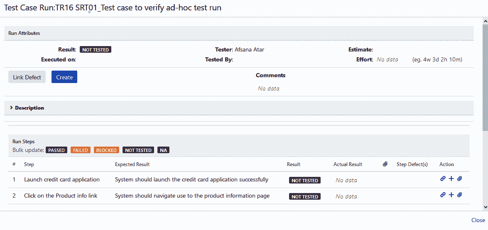

# 四、测试管理方法

测试管理方法中的执行策略在决定测试周期的成败中起着至关重要的作用。该战略有助于确定最佳途径，以尽早降低风险。在本章中，我们将详细介绍根据项目需求选择各种项目执行工作流的最佳方法。作为测试计划的一部分，我们将学习如何创建特定的测试运行，并在测试周期中执行测试用例。然后，我们将了解每种执行类型的重要性，以及它的好处和目标目的。让我们从**测试管理方法** ( **天猫**)开始结构化测试的执行策略。

在本章中，我们将涵盖以下主题:

*   TMap 结构化测试的执行策略
*   在选定版本的测试周期中执行
*   测试管理的最佳实践

# TMap 结构化测试的执行策略

随着软件行业及其标准的发展，重点是流程由业务目标驱动，而不是流程驱动业务目标。这导致了以下两种评估测试过程的方法的产生:

*   **说明性的**:在这种方法中，模型提供了一个框架以及**关键绩效指标** ( **关键绩效指标**)和每个测试单元要问的问题。这有助于您确定效率低下的根本原因。它还提供了解决这些低效问题以改进流程的顺序。
*   **非规定性**:在这种方法中，模型为每个测试单元提供了一个框架以及要问的关键绩效指标和问题；它没有规定解决这些问题的顺序。相反，组织需要评估从解决每个问题中获得的商业价值，并首先解决提供最高回报的问题。

规定性方法的一个例子是**测试成熟度模型** ( **TMM** ，它补充了 CMMI 模型。我们将使用一种非规定性的方法，比如由 Sogeti 的荷兰测试实践部门提出的 TMap。它基于**业务驱动的测试管理** ( **BDTM** )，强调业务优先级来驱动测试工作，利用结构化的生命周期方法，并提供清单和模板，同时提供适应变化和情况的灵活性。最新版本的 TMap 和 TMap NEXT 在其业务驱动的方法中提供了以下步骤:

1.  测试经理建立并创建测试目标，该目标详细描述了需求、用例和变更请求，以及与每个被测试项目的客户端相关的特征。
2.  主测试计划风险表由测试经理创建，它为每个被测试的单元和特性分配一个风险等级，以及测试的级别，例如单元测试、系统测试和回归测试。
3.  一旦主测试计划风险表准备就绪，测试经理将根据风险等级确定每个测试单元的测试强度。测试强度范围从轻度(·)、中度(·)、彻底(·)到 I **mplicit** ( **I** )—其中正在测试的特性，例如可用性和响应性，将作为其他测试用例执行的一部分进行记录，或者**静态**(**S**)—使用清单代替编写测试用例。这个迭代步骤的输出是主测试计划策略表。
4.  基于主测试计划策略表中提供的指导方针，我们通过测试级别来确定测试的深度。这在输出中被捕获，称为**测试计划策略表**。此表用于估计测试成本，并有助于平衡测试工作和识别的风险。
5.  一旦工作评估被确认并且涉众被告知，测试设计表就通过利用基于测试计划策略表和测试基础的测试规范技术来生成，即需求规范文档。该表稍后用于设计将在测试过程中执行的实际测试用例和脚本。测试的执行可以根据工作及其范围进行分解。交付特定任务的紧迫性可以帮助团队决定测试和验证其功能的最佳方法。

在接下来的章节中，我们将介绍业务驱动方法中的每个步骤。关于 TMap 方法的更多细节，请查看[http://www.tmap.net](http://www.tmap.net)。核对表和其他模板也提供了示例案例，可在[http://www.tmap.net/checklists-and-templates](http://www.tmap.net/checklists-and-templates)下载。

基于上述方法，执行可以遵循以下两种类型的测试策略之一:

*   临时测试运行
*   在选定版本的测试周期中执行

让我们详细看看这些方法。

# 临时测试运行

测试团队在测试过程中面临着各种各样的情况，这些情况是基于组织中按照时间表交付产品所遵循的过程的成熟度。以下是这些情况的一些例子:

*   周转时间很短，如以下示例所示:
    *   在产品上线后测试错误修复，需要快速修复
    *   维护阶段需要快速处理的小变更请求
*   要验证的工作流不太复杂，例如以下示例:
    *   测试范围最小且需要较少测试的需求，例如向表单添加验证弹出窗口以提示最终用户填写所有字段
    *   修饰性更改，例如将用户界面中按钮上的文本从“确定”更改为“接受”

在这些情况下，潜在的因素是变化不是剧烈的，测试的范围非常有限。因此，在这种情况下，我们可以采用专门的测试方法。

**特别测试**过程是一个理解需求、为测试需求构建测试用例并根据需要执行它们的三步过程。在这种方法中，测试专家只需创建尽可能少的测试用例，将它们链接到相关的需求，然后在测试用例级别执行测试。在测试执行期间，测试人员可以用所需的工件来更新执行的状态。这在安排会议、准备测试计划、测试周期、等待测试计划的签核等方面节省了大量开销和时间。

让我们看看如何在 synapseRT、泽法和测试管理工具中执行测试用例，作为特别测试运行的一部分。

# 突触支持

作为临时执行的一部分，测试用例可以在需要的时候被执行。在 synapseRT 中，您可以将测试用例创建为JIRA票证。因为测试用例只是JIRA票证的另一种类型，所以它像详细信息部分中的任何其他问题类型一样具有默认字段。但是，它确实包含测试步骤、自动化和临时测试运行部分，如下图所示:

现在，单击“创建”按钮，为选定的测试用例创建一个特别的测试运行。测试人员可以执行每个步骤并更新执行状态，添加新的缺陷或链接现有缺陷，附加工件，等等，如下图所示:

您可以多次执行选定的测试用例，并且可以进行多次临时运行，如下图所示，在临时测试运行部分:

# 泽法

泽法将测试用例作为临时运行或者临时测试周期的一部分来执行。为了做到这一点，用户只需要创建一个测试用例问题类型，并输入所有需要的细节。创建后，您可以在测试用例摘要字段下看到执行按钮，如下图所示:

或者，我们也可以通过导航到“测试|周期摘要”选项卡来创建临时测试周期。它为我们提供了一个选项来添加或删除多个测试用例，作为特定测试周期的一部分:

将测试用例添加到临时周期后，它看起来像下面的截图。正如您所看到的，它为我们提供了一个选项来根据您的版本组织特定的测试周期。它还显示了添加的测试用例的详细摘要，包括它们的票标识、摘要、当前执行状态和链接的缺陷:

# 测试管理

测试管理工具不支持临时测试执行选项。但是，它确实支持测试周期中的执行，我们将在下一节中详细介绍。

# 在选定版本的测试周期中执行

临时测试是测试较短工作流的一种灵活、快速的方法。然而，当您想要计划整个版本或者想要覆盖几个测试类型/特性，例如性能、安全性、可接受性和集成时，这种方法是无效的。在这种情况下，我们可以考虑准备测试周期，然后按照测试计划中定义的测试策略执行测试用例。让我们考虑一下测试团队在使用临时方法时面临的一些情况:

*   周转时间较长，如以下示例所示:
    *   该团队正在构建一个新项目，目标是在年底前发布产品。
    *   该产品的升级版计划在本季度发布。
*   要验证的工作流步骤多且/或复杂，例如以下示例:
    *   一个客户请求了一个具有大量复杂需求的变更，它需要更彻底的测试。
    *   当测试一个报告的错误以影响一个应用程序的几个组件时，这需要严格的测试。

在这些情况下，我们需要分析问题并计划我们的测试策略。在周期中计划和执行测试用例是最有效的方法，可以确保我们已经覆盖了所需产品或应用程序所需的所有类型的测试。因此，我们在测试周期中采用*执行方法，这给了我们一个机会来准备一个详细的测试计划，该计划做以下事情:*

*   调出所有依赖项
*   列出执行测试用例所需的输入和输出参数
*   定义通过测试的成功标准
*   定义缺陷跟踪和测试策略
*   根据用例设计和执行端到端工作流
*   计划不同类型的测试，并根据测试周期整合它们
*   为冒烟、健全、集成、跨浏览器甚至环境测试等设计测试用例

因为变化是巨大的，作为它的影响，我们对前面的方法有更好的准备。让我们详细看看JIRA插件如何被用来计划我们在不同类型的周期中的执行。

# 突触支持

测试周期是 synapseRT 中测试计划单的一部分。因此，为了创建测试周期，我们需要首先创建一个测试计划。一旦测试计划准备就绪，您就可以添加测试用例或测试套件，然后可以根据它们的类型、优先级或其他执行标准将它们归类到测试周期中。

下面的截图显示了一个包含三个测试周期的测试计划——`Credit Card type A`、`Credit Card type B`和`Regression Test`:

我们将在[第 7 章](07.html)、*测试执行阶段*中详细介绍如何跟踪和执行这些测试周期。

# 泽法

另一方面，如果您想根据测试需求创建不同类型的测试周期，泽法将它们分类在“测试”部分的“周期摘要”选项卡下。下图显示了两个主要的测试周期— `Loan Testing`和`Ad hoc`。`Loan testing`具有`Education loan`、`Personal loan`、`Car loan`和`Home loan`子测试周期:

测试用例票还有一个测试执行部分，它显示了这个测试已经被特别执行了多少次，或者作为任何其他测试周期的一部分。如下面的截图所示，如果我们展开测试执行部分，它会显示所有的测试运行及其执行的测试周期。它还显示了链接的缺陷和执行日期:

# 测试管理

在测试管理工具中，可以从周期选项卡创建测试周期。如下图截图所示，对于一个银行应用，我们以`Credit Score Release`为主要测试周期。在这种情况下，我们有三个子测试周期-`Acceptance Tests`、`Functional Tests`和`Regression Tests`。每个周期包含所需的一组测试用例，它们的执行状态可以从“进度”列中查看:

# 测试管理的最佳实践

TMap 为在组织中实施结构化测试方法提供了指导。这里有几个重要的因素可以帮助你为建立测试管理实践打下坚实的基础:

*   利用基于开发过程的测试活动模型。在我们的例子中，我们使用 STLC 模型，它是用于测试活动的 SDLC 模型的子集。TMap 生命周期模型可以用于测试管理活动。
*   确保采用适当的测试工具和技术，如检查表，来识别、执行、跟踪和交流进展和结果。沟通对于快速及时地识别和解决障碍至关重要。
*   利用满足软件和硬件要求的基础设施建立所需的测试环境，以便在测试中操作产品。这也包括建立测试数据库和测试数据。这将使执行阶段更加顺利。
*   为了有效的测试管理，测试团队应该是一个拥有测试技能和产品知识的正确组合的团队。这也意味着组织应该确保员工得到培训，过程得到改进，从而达到建立可扩展和可重复的成功故事所必需的成熟度水平。用成熟的流程建立一个坚实的组织，确保团队遵循通用的术语、方法、工具、技术、进入和退出标准、每周或每天的电话以及报告格式。这有助于高层管理人员生成标准的报告工件。
*   自动化是关键，因此组织必须尝试结合开源或付费的测试工具来帮助测试人员更有效地执行他们的工作。自动化重复活动可以帮助测试人员专注于探索性测试，而测试工具执行回归测试。在采用这些工具之前，应该进行成本效益分析，因为这些工具需要大量的时间来培训和获得技能，然后工作人员才能有效地使用它们。
*   利用来自 BDTM 过程的每一步的工件来确保测试目标是清晰的，并且特定于测试需求。这有助于彻底分析测试基础，及时实施策略，并实现良好的测试覆盖率。

*   测试的目的是对产品的功能和需求进行可行的测试覆盖。项目越大，测试级别和测试单元越多。因此，使用测试套件来组织它们是非常重要的。此外，通过添加大量测试步骤，避免在一个测试用例中合并和覆盖大型复杂需求，而是将它们添加到单独的测试用例中，以更准确地验证功能。

# 摘要

在本章中，我们介绍了选择各种项目执行策略的最佳方法，以及在测试执行阶段执行测试用例的不同方法。TMap 为测试提供了一种结构化的方法。我们了解了 BDTM 方法。对于较短且不太复杂的需求，可以使用特定的测试策略来有效地测试和验证需求。我们学习了如何使用JIRA插件实现特别测试。为了组织和管理更大和更复杂项目的测试用例，需要在测试周期中执行。我们学习了如何使用JIRA插件创建和组织测试周期。最后，我们讨论了为有效的测试管理建立坚实基础的最佳实践。

在下一章中，我们将了解测试计划和测试策略的不同方面，同时了解需求和测试计划之间的关系。