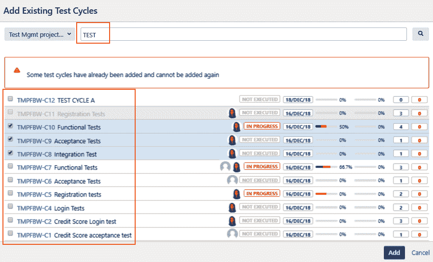
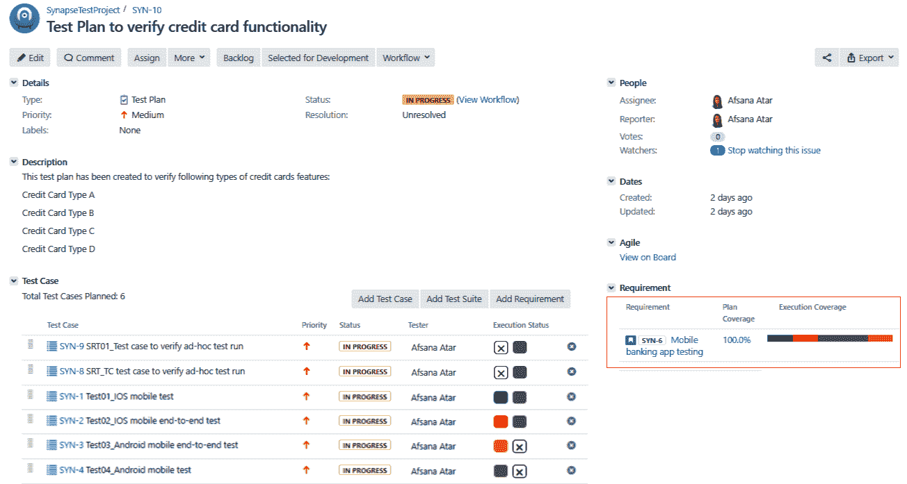
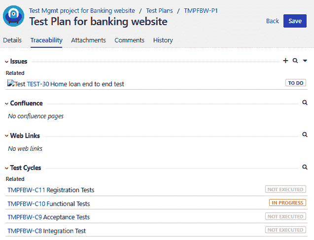

# 五、测试计划

测试计划是 STLC 中最重要的阶段。计划给了测试专业人员机会，让他们从需求的复杂性角度来理解问题。这是通过基于用例分析工作流，然后从中导出测试用例来实现的。需求文档是指定应用程序功能的测试基础。然后，测试计划通过使用几个工件，包括测试分配、方法和测试策略，来指定这些项目将如何在测试中被覆盖。测试策略是测试过程中一个特别重要的工件。

我们将涵盖测试计划和测试策略的不同方面，同时理解需求和测试计划之间的关系。我们还将研究JIRA如何使用泽法的 synapseRT 和JIRA测试管理工具来帮助我们定义和比较测试需求的策略。

在本章中，我们将了解以下主题:

*   使用JIRA插件创建和组织测试计划
*   定义和实施测试策略
*   建立需求和测试计划之间的关系

# 使用JIRA插件创建和组织测试计划

测试计划阶段涉及各种工作流。如果使用 TMap 方法，测试计划阶段对应于 TMap 生命周期中的计划和控制阶段。规划阶段包括使用产品风险分析、评估和规划来创建测试策略，而控制阶段旨在通过监控、报告和调整来实现测试目标，从而实现持续的质量改进。让我们深入学习测试计划阶段的活动。

一旦测试任务被确认，团队就开始在计划会议中讨论所陈述的规范，在会议中，团队试图将模糊和复杂的陈述分解成逻辑和清晰的单元，这些单元可以被添加到产品构建和测试过程中。开发和测试团队与业务分析师一起，创建需要构建的网页或应用程序的样本模型或原型。需求规格文档、功能文档和原型因此形成了测试基础——测试人员的基线文档。

在明确了测试基础之后，测试经理开始准备测试计划。测试计划是定义所选项目的规划和执行策略的文档。它有以下几个部分:

| **目的或背景** | **项目的原因或目的以及测试的需要** |
| 测试范围 | 这概述了作为测试准备或执行阶段的一部分，将被考虑用于测试的所有商定特性或组件。 |
| 超出范围 | 这列出了所有不需要测试的组件。 |
| 资源 | 本节描述了当前分配的资源数量、他们的专业知识和技能水平，以及他们的角色和职责。 |
| 时间表 | 本节详细介绍了项目时间表、测试阶段的开始和结束时间，以及每个测试周期/迭代的时间表(如果可能)。 |
| 属国 | 如果没有任何依赖关系，团队无法开始测试，那么在这一部分列出它们总是一个好主意；例如，在测试人员可以开始测试之前，构建应该部署在正确的环境中。 |
| 出入境标准 | 本节强调了测试执行的开始和结束标准，在此基础上测试结果将被接受。 |
| 每个阶段结束时的交付成果 | 这列出了将要生成、签署并添加到项目存储库中以供参考的工件类型。 |
| 风险 | 这突出了产品或应用中风险概率高或低的领域。基于它们的影响，测试人员可以设计额外类型的测试或测试用例来提前缓解它们。本节将详细介绍**产品风险分析** ( **PRA** )。 |
| 测试策略 | 使用 PRA 和测试目标，建立测试策略，以确保基于风险级别/类别为所有功能实现适当的测试覆盖。 |
| 工具和技术 | 根据测试策略和项目测试需求，团队可以选择适当的工具进行测试管理、自动化、团队协作、创建知识库，甚至比较、验证或分析数据。这些工具包括JIRA、汇流、Selenium、惠普 ALM、Jenkins、Visual Studio、Eclipse 或 Toad for Oracle 以及 Tableau。 |
| 环境详细信息 | 在单独的环境中对每个级别执行测试总是一个好主意。因此，根据测试的类型，测试人员可以拥有测试环境，如测试版或 UAT 环境，或者自动化环境，这些环境将与生产和开发环境分开。 |
| 测试数据要求 | 测试需要一组输入数据，以便验证计划工作流的准确性以及通过遵循该工作流而产生的结果。有时，测试数据准备是由不同的团队完成的，因此，它会产生依赖关系，或者可能依赖于运行生成所需数据的特定类型的作业。在这种情况下，测试人员需要在测试计划和测试用例中记录这种依赖关系。 |
| 需求文档详细信息 | 测试基础或基线文档可能由用例文档、布局和设计文档、需求规格文档、数据流文档和技术设计文档等文档组成。这些文档详细地给出了对组件或特征的清晰理解。在测试计划中添加这些文档的链接是很好的做法。 |
| 关闭和批准 | 本节规定了我们可以将测试标记为已完成以结束阶段或周期的条件。它还列出了作为关闭过程的一部分需要生成的文档，以及将签署文档的批准者和批准者的列表，包括测试计划。 |

不同组织的测试计划准备方法不同。然而，思维过程是一样的。一些组织强调使用标准模板创建适当的测试计划文档，而其他组织更喜欢在项目管理工具中创建和管理它，同时描述所有必要的细节。您可以访问以下链接下载基于 TMap 方法的测试计划模板:[http://www.tmap.net/building-blocks/test-plan](http://www.tmap.net/building-blocks/test-plan)。

现在我们知道了测试计划的内容，是时候使用JIRA创建一个了。让我们看看如何使用JIRA来帮助我们使用JIRA插件创建和组织我们的测试计划。

# 突触支持

synapseRT 中的测试计划只不过是另一种问题类型。一旦我们创建了测试计划票，就该添加细节了，比如优先级、描述和当前状态。之后，我们可以创建一个新的测试用例，或者添加带有所需测试用例的测试套件。此外，我们还可以创建测试周期来隔离这些测试用例，并使它们成为所选周期的一部分:

Creating a test plan using synapseRT

# 泽法

测试计划选项仅适用于泽法企业版，用户可以使用测试周期创建和管理测试计划。

Please feel free to explore the Zephyr Enterprise version from this link: [https://zephyrdocs.atlassian.net/wiki/spaces/ZE6/pages/149455000/Test+Planning](https://zephyrdocs.atlassian.net/wiki/spaces/ZE6/pages/149455000/Test+Planning).

# 测试管理工具

为了在测试管理工具中创建测试计划，我们需要遵循以下步骤:

1.  导航至测试|计划部分。单击+新建按钮创建新计划。左侧面板上有一个选项，可以创建多个文件夹，并在主文件夹或子文件夹下组织测试计划:

2.  一旦我们添加了包含一些基本细节的测试计划，如名称、目标、状态或所有者，我们就可以进入可追溯性选项卡:

3.  在可追溯性选项下，我们可以搜索现有的测试周期，并选择一个或多个测试周期将其添加到测试计划中。在搜索现有测试周期时，它还会显示每个测试周期的执行状态以及所有者的详细信息、日期和已识别的缺陷:

# 定义和实施测试策略

您的测试策略完全取决于应用程序的测试需求；主要是每个需求的风险等级。例如，如果要求验证一个应用程序是否可以同时处理来自 1，000 个访问该应用程序的用户的请求，那么我们需要将性能测试添加到我们的测试策略中。作为测试策略的一部分，我们可以通过发现超过允许阈值的断点来执行压力测试。我们还可以通过分析应用程序的性能来执行负载测试，这是基于并发地影响应用程序的允许用户限制。我们还可以测量应用程序的响应时间，以便呈现具有不同负载范围的所有页面组件/对象。

让我们了解创建测试策略来测试银行应用程序的过程。这是一个四步流程:

1.  如我们在[第 1 章](01.html)、*软件质量保证概述*中所见，将功能性和可用性等特性与测试基础或测试目标表中的用例(如果可用)对应起来。
2.  基于此，为每个用例分配了适当的风险等级。风险级别会根据您组织中设置的标准而有所不同。在我们的示例中，我们考虑风险级别 A(最高)到 I(最低)，每个子风险级别中有 3 个级别:高(A、B 和 C)、中(D、E 和 F)和低(G、H 和 I)。
3.  我们还确定了五个测试级别——**单元测试**(**UT**)**系统测试**(**ST**)**用户验收测试**(**UAT**)**生产前测试** ( **生产前测试**)**生产后测试** ( **生产后测试**)。
4.  现在，基于风险等级，我们可以将适当的测试强度定义为:

*   **光**:表示为()
*   **中**:表示为()
*   **彻底**:表示为()
*   **隐式** ( **I** ):它具有可用性和响应性等特性，被测试的将作为其他测试用例执行的一部分被记录下来
*   **Static** ( **S** ):它使用清单而不是编写分配给每个用例的测试用例

现在，在分配这些测试强度时，必须注意具有高风险的用例至少有一个测试级别完全覆盖测试，而具有中等风险的用例至少需要一个中等覆盖的测试级别。

根据 TMap 方法，这一步的目的是创建一个测试策略表。让我们看一个测试银行应用程序的示例测试策略表:

| **特性/用例(UC)** | **风险等级** | **出** | **ST** | **UAT** | **预 PT** | **PT 后** |
| **功能** |  |  |  |  |  |  |
| UC . 1.1–信用卡、住房贷款和个人银行部分的所有模块都按预期运行。 | A | • | ••• | •• | • | • |
| UC . 1.2–账户持有人可以申请房屋贷款和信用卡。 | B | • | ••• | • | • | • |
| UC . 1.3–用户不能为同一个模块开立多个账户。 | C | • | ••• | • | • | • |
| **性能** |  |  |  |  |  |  |
| UC . 1.4–对于所有网站模块，页面的所有组件都应在 30 秒内呈现。 | C | • | ••• | •• | • | • |
| UC . 1.2–在 10，000 个用户同时访问应用程序的阈值限制下，网站应该运行良好。 | A |  | ••• | •• |  | • |
| **兼容性** |  |  |  |  |  |  |
| UC . 2.1–应用程序应该可以在不同类型的操作系统上正常工作，例如 Windows 和 Linux。 | B | • | ••• | •• | • | • |
| UC . 2 . 2–移动应用程序应该可以在不同的操作系统上正常运行，例如 Windows、iOS 和 Android。 | B | • | ••• | •• | • | • |
| UC . 1.4–应用程序应与第三方信用评分应用程序配合使用。 | D | • | •• | • |  | • |
| **可用性** |  |  |  |  |  |  |
| UC . 3 . 5–用户界面上的所有文本都应该清晰可见，并有帮助文本供用户使用。 | E |  | •• | • | • |  |
| UC . 1.5–每个部分都应该可以在三次点击后到达，并且用户应该能够导航到他们想要的页面。 | G | 我 | 我 |  |  |  |
| UC . 3 . 2 . 1–所有警告和错误信息应以指定的颜色突出显示(警告:黄色，错误:红色)。 | H | • | 我 |  |  |  |
| **本地化** |  |  |  |  |  |  |
| UC . 3.1–用户应该能够以支持的语言查看页面内容，例如中文、日语、法语、西班牙语和英语。 | B | • | ••• | •• | • | • |
| UC . 3.2–所有文本都应正确翻译，包括警告和错误消息。 | H | • | • | • | • | • |
| UC . 3.3–在所有支持的语言中，应用程序的功能应该保持不变。 | A | • | ••• | •• | • | • |

一旦确定了这一点，就有各种测试类型或技术来根据所需的测试强度进行测试。让我们看几个可以用于我们的银行应用程序的测试类型的例子:

*   **功能测试**:为了保证设计好的网站服务于目的，进行功能测试，涵盖所有的阳性、阴性、冒烟、健全性测试案例，在这里我们检查功能是否符合要求。
*   **UI 测试**:如果应用程序预计会面对很多用户，那么关注网页上列出的每一个 UI 元素、特性和功能是至关重要的。这包括按钮、链接、文本、警告消息、文本对齐、外观等的验证。
*   **集成测试**:银行应用由不同的页面、模块和组件组成。因此，检查最终的集成产品是否能顺利工作是很重要的。在这种情况下，检查数据流和准确性非常重要。例如，在银行应用程序中，它由个人帐户部分、贷款部分、保险部分、信用卡部分等组成。现在，在这种情况下，重要的是验证工作流程，在该流程中，当前账户持有人可以查看信用卡优惠，并且能够申请这些优惠，而无需单独开立新账户。
*   **兼容性测试**:测试应用是否兼容不同的环境很重要，包括不同的操作系统、数据库、设备。检查应用程序是否与其他受支持的供应商产品顺利集成并给出预期的结果也很重要。
*   **浏览器测试**:如果应用被各种浏览器支持，测试人员应该考虑用支持的浏览器版本在不同的浏览器中测试 web 应用。
*   **本地化测试**:如果应用程序是在不同国家以当地语言推出的，那么就需要进行本地化测试。您应该验证单词从英语到所选语言的翻译，以及应用程序的行为。
*   **探索性测试**:为了识别任何隐藏的缺陷，探索性测试是一个有用的工具。它只是随机验证应用程序的任何功能、工作流或任何部分。它可以是高或低的水平，由测试人员选择。
*   **性能测试**:检查应用程序的性能是很有用的，因为它将开放给大量的观众访问。因此，您应该测试应用程序是否能够承受巨大的负载。性能测试包括压力和负载测试。

除了这些技术之外，如果需要，您可以根据您的项目需求在测试策略中加入其他类型。

# 建立需求和测试计划之间的关系

正如我们在[第 3 章](03.html)、*与JIRA*、一起理解测试的组成部分中所看到的，可追溯性矩阵有助于获得对项目进度的清晰理解，并识别需要更多测试工作或有更多缺陷的需求。可追溯性矩阵还指出了测试策略、测试活动的类型，以及测试专业人员为验证规定的需求而定义和计划的任务。这是在早期阶段创建的，以便项目涉众可以对其进行审查，这提供了足够的时间来监控它，提供反馈，并根据团队的要求调整测试过程以实现测试目标。

建立需求和测试计划之间的关系是创建可追溯矩阵的第一部分。无论何时在JIRA创建需求票，测试专业人员都可以准备一个测试计划票并将其链接到需求。一个需求可能有一个主测试计划，和/或多个子测试计划，这取决于测试需求。这为项目经理提供了一个机会来跟踪所选需求的测试计划细节。这些需求可以从具有目标发布期限的 Epic 或 Story，到客户报告的任何需要大量测试的 bug。

让我们理解如何使用JIRA插件建立需求和测试计划之间的关系。

# 突触支持

使用测试用例很容易在需求和测试计划之间建立关系。在前一节创建测试计划时，我们看到了如何将测试用例添加到我们的测试计划中。同样，您也可以将相同的测试用例添加到需求清单中。下面的截图描述了一个故事问题类型，在测试用例部分下添加了四个测试用例:

一旦我们将相同的测试用例添加到测试计划中，我们就可以在需求部分下看到需求覆盖，如下面的截图所示。这表明，为了验证需求，测试人员添加了四个测试用例，并且在这个测试计划中考虑了所有的测试用例。因此，需求覆盖率为 100.0%。

# 泽法

由于测试计划功能仅在泽法企业中可用，我们可以将测试用例链接到需求，以便在它们之间建立关系。如下图所示，打开现有的测试用例，导航到更多操作|链接选项。然后，搜索相关需求问题单并链接，如下所示:

# 测试管理工具

在测试管理工具的情况下，转到测试|计划并选择您想要为其添加需求的测试计划。然后，转到可追溯性部分，在那里您可以搜索现有的用户故事或需求，并将它们链接到测试计划，如下所示:

正如您在下面的截图中看到的，问题部分显示了已经为其创建了测试计划的相关需求，以及为了完成验证过程需要执行的测试周期:

# 摘要

在本章中，我们讨论了测试计划和测试策略的不同方面，同时了解了需求和测试计划之间的关系。我们理解了在测试计划过程中可以使用的一般测试计划的组成部分。我们还学习了如何使用JIRA插件编写测试计划。

定义测试策略有多种方法。我们看了一个使用 TMap 方法为银行应用程序创建测试策略的例子。为了创建可追溯矩阵，我们需要在测试用例和测试计划以及测试需求之间建立关系。在这一章中，我们准确地看到了如何将测试计划与其相关需求联系起来。

在下一章中，我们将学习测试用例设计和创建的过程。我们还将学习组织测试用例，并磨练我们重用测试用例和测试数据的技能。