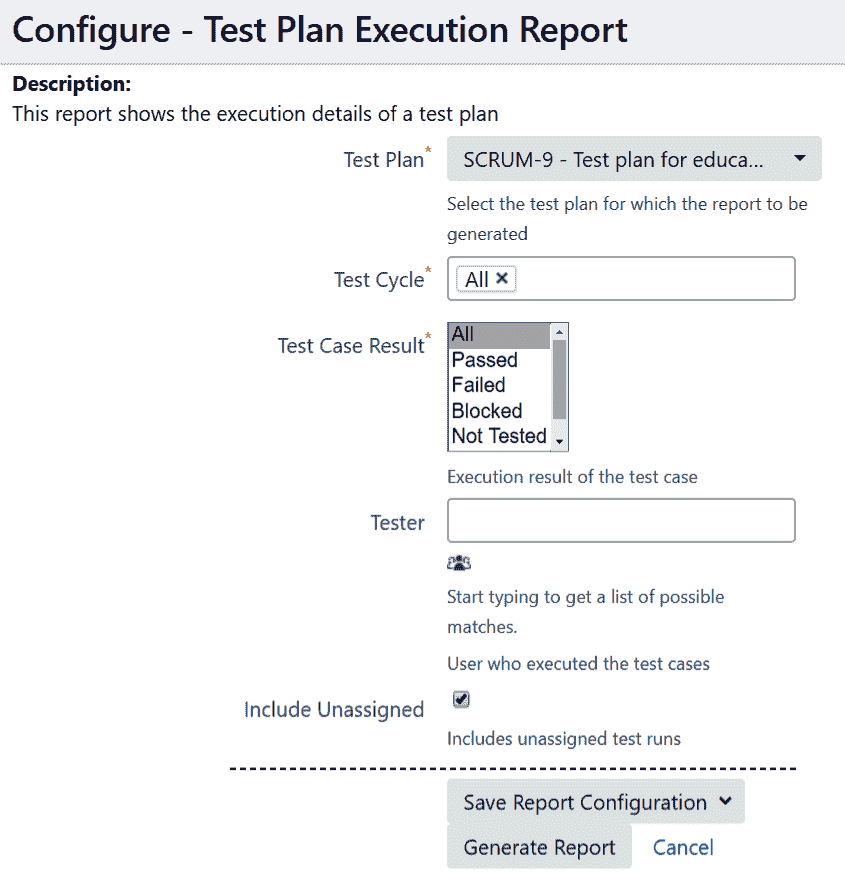
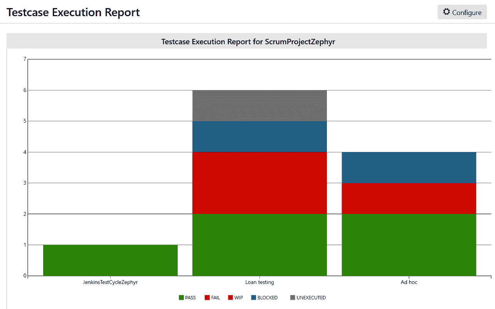
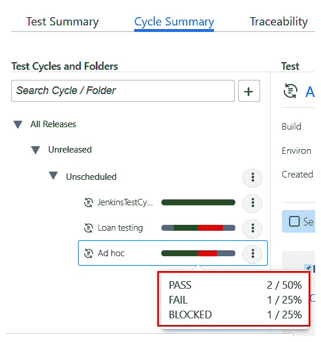
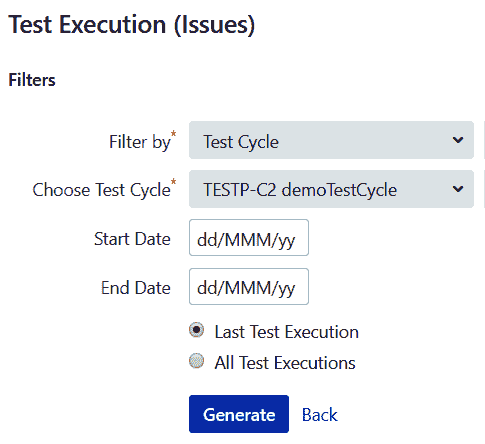
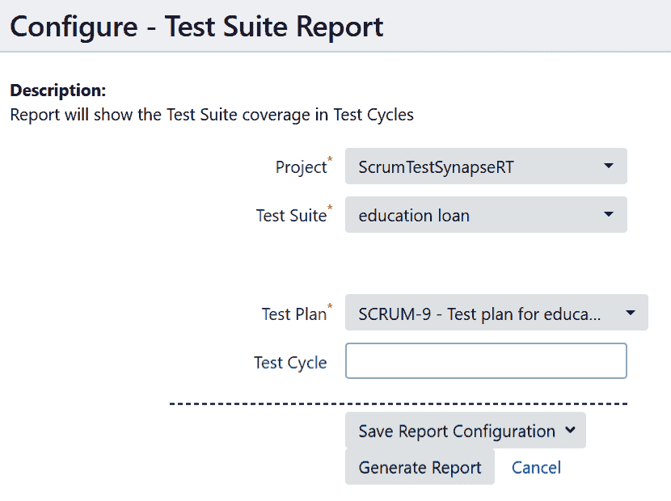
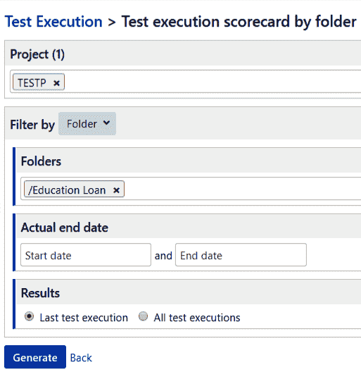
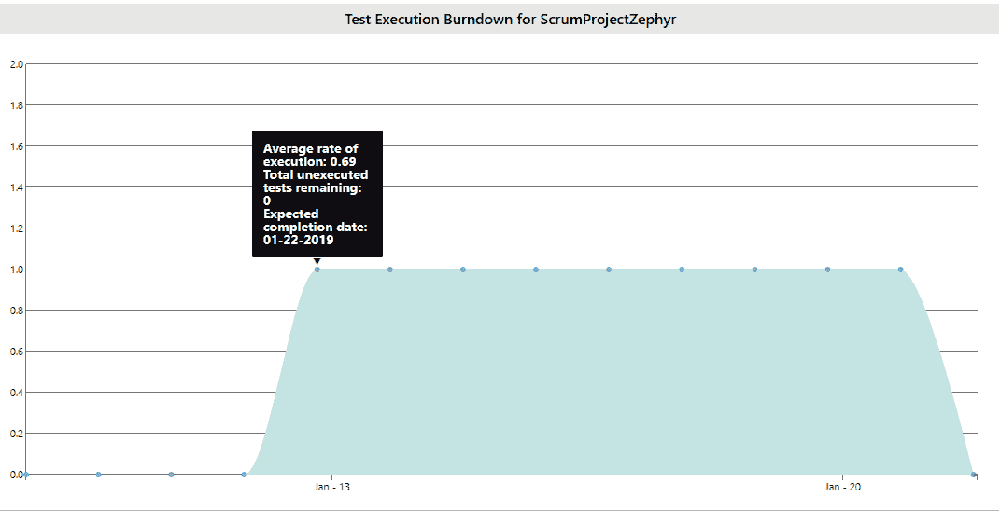
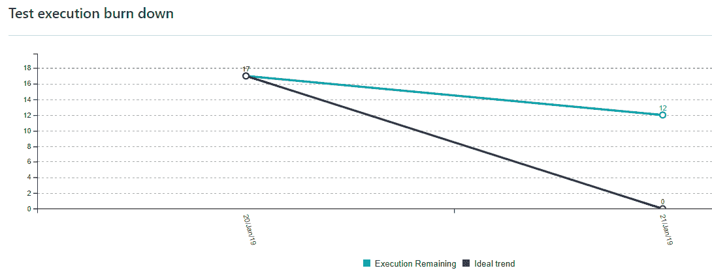

# 测试执行状态报告

项目状态报告让我们在整个项目开发阶段深入了解项目的健康状况。这有助于监控和控制项目进度，以便交付符合要求的质量标准和期限。通过吉拉可以获得各种类型的报告。报告的主要目标是识别任何需要实现的运行时问题和障碍或最后一刻的更改。报告有助于所有项目利益相关者对项目的当前状态保持一致，并允许他们在控制任何偏离计划的情况下做出民主决策。

项目经理提前计划，以便识别风险并制定风险缓解策略。它们还涉及变革管理和沟通管理方面的活动。报告是沟通管理的一部分。

在本章中，我们将涵盖以下主题:

*   测试计划执行报告
*   临时测试运行报告
*   基于需求的报告
*   缺陷矩阵报告
*   测试套件报告
*   燃尽图

我们还将介绍在项目测试执行阶段创建的报告，因为吉拉插件对于生成这些报告非常有用。

# 测试计划执行报告

在测试执行阶段，测试执行是按照测试周期或迭代来执行的。每个迭代或测试周期都有一组计划好的测试用例。根据周期或迭代来跟踪测试执行的进度是很有用的。如果迭代或测试周期是测试计划的一部分，那么生成测试计划执行报告可以让我们清楚当前执行的测试用例及其状态。

让我们使用吉拉插件生成一个测试计划执行报告。

# 突触支持

synapseRT 有一个生成测试计划执行报告的选项，在它的帮助下，项目团队可以跟踪当前执行的进度:

1.  synapsertt 有一个 SynapseRT Reports 选项卡，我们可以从中选择测试计划执行报告选项来定制和生成测试计划执行报告。
2.  如下图所示，我们可以选择测试计划和特定的周期，或者所有的周期，以及测试用例的执行状态。选择所有适当的值后，单击生成报告按钮创建报告:

3.  这将创建如下图所示的报告。该报告列出了属于所选测试周期的所有测试用例，它们在“结果”列中的当前状态，测试用例已分配给的测试人员，以及已执行测试用例的测试人员(在“测试人”列中)。还有一些细节，如执行日期(指定执行的日期和时间)、缺陷、评估和工作。我们还可以选择以 Excel 格式提取此报告:

4.  通过测试计划部分，我们还可以查看测试计划当前执行的状态。导航至“测试计划”选项卡，并转至“未解决的计划”部分。它列出了所有没有关闭状态的测试计划。只需点击下拉图标，它就会显示按测试周期划分的执行进度。如下图所示，我们有两个状态为“活动”的测试周期。它还显示了测试运行、缺陷及其当前状态等详细信息:

# 泽法

在泽法，我们可以生成一个测试用例执行报告来查看每个周期及其相关测试用例的进度:

1.  要生成报告，请导航到吉拉的报告部分。有两个主要部分—所有报告和其他。测试用例执行报告列在其他部分下。点击它创建一个。如下图所示，这样做显示了根据项目、测试周期、版本等定制报告的配置页面。提供适当的值，然后单击下一步。在下面的截图中，我们已经将测试周期数设置为`3`:

2.  然后生成以下报告。它在 y 轴上列出了测试用例的数量，并在 x 轴上按周期将它们组合在一起。例如，`Loan testing`测试周期共有六个测试案例，其中两个测试案例的状态为“通过”，因此颜色为绿色，两个测试案例的状态为红色(失败)，一个测试案例被阻止，一个测试案例未执行:

# 测试管理

测试管理可以选择创建由测试周期组成的测试计划:

1.  要按测试计划生成测试报告，请导航到“测试”选项卡并转到“报告”部分。这显示了生成报告的许多选项；选择“按测试计划测试执行结果”选项。它允许您根据项目、开始和结束日期以及基于最近或全部的执行来自定义报告。选择所有必需选项后，单击生成按钮:

2.  它生成以下报告。 *y* 轴表示选择的测试计划的数量， *x* 轴表示当前执行状态的测试用例的数量。下面的截图显示，我们总共计划了八个测试用例，其中一个被阻止，一个通过，两个失败，四个测试用例没有被执行。我们还可以选择打印或导出 Excel 格式的报告:

# 临时测试运行报告

临时测试运行报告表明作为临时测试运行的一部分，所选测试用例已经被执行的次数。在这种情况下，测试用例不是任何测试计划的一部分，而是独立执行的。跟踪其状态变化也很有用。如果在特别测试运行期间附加了任何工件，例如测试数据、截图或日志，测试人员可以使用这些信息来比较上次执行的结果。吉拉插件可以选择生成这样的报告。让我们逐一创建它们。

# 突触支持

synapseRT 可以选择从特定测试运行部分查看单个测试用例级别的特定测试运行细节。如下图所示，所选测试用例已经执行了三次，其状态从 BLOCKED 变为 FAILED 和 PASSED。它还显示了详细信息，如测试运行的 ID、执行人、执行日期和时间以及相关缺陷(如果有):

可以为所有测试用例生成特定的测试运行报告:

1.  要生成此类报告，请导航至**突触支持报告**选项卡，并选择“特别测试运行报告”选项。如下图所示，输入所需的详细信息，如执行类型、开始日期和结束日期，点击**生成报告**按钮:

2.  如下图所示，生成了临时测试运行报告。它显示了细节，比如测试用例的名称；它们在**结果**列中的当前状态；谁测试了它，在测试者栏；**执行日期和时间在**执行；以及**缺陷**栏中的关联缺陷(如果有):

# 泽法

泽法有一个特别的测试周期，测试用例可以被添加和执行。我们可以从**周期汇总**选项卡查看所选周期的状态:

1.  导航至测试|测试摘要|周期摘要选项卡。它显示了所有版本的所有测试周期。
2.  将鼠标悬停在特定周期上，观察它列出了该周期中所有测试用例的当前状态。它还指示一个颜色条，以绿色、红色和蓝色显示状态的进度，以指示状态为通过、失败和阻止。如下图所示，临时测试周期共有四个测试用例，其中两个(占总测试用例的 50%)处于通过状态，一个处于失败状态，一个处于阻塞状态:

3.  它还提供了从测试用例|测试执行查看单个测试用例状态的选项。下面的截图显示了所选的测试用例已经执行了三次，其中两次执行是临时执行的一部分，一次执行是测试周期的`Loan testing`的一部分。它还显示每次执行后的执行状态，依此类推:

# 测试管理

在测试管理工具的情况下，我们可以通过导航到报告|测试执行|测试执行结果(列表)报告来查看所选测试用例的执行次数:

1.  要创建此报告，请导航到测试|报告|测试执行选项卡，并选择测试执行结果(列表)选项。输入所需的详细信息，例如要测试的周期。如下图所示，我们已经选择了测试周期和项目。输入所有必需的详细信息后，单击生成按钮:

这将生成如下图所示的报告。它具有在所选测试周期下添加的测试用例列表。在我们的例子中，我们有`TESTP-T2`测试用例，作为测试周期`TESTP-C1`的一部分，它已经被执行了总共四次。“状态”列指示其在每次执行期间的状态，还有其他列提供其他详细信息:

# 基于需求的报告

基于需求的报告帮助我们了解所选需求的当前执行状态。在有多个需求的项目中，这些报告是有帮助的，因为它们基于吉拉的需求票对测试用例进行分组。让我们使用吉拉插件创建一个。

# 突触支持

synapseRT 可以生成基于需求的报告，并根据需求跟踪当前执行的进度:

1.  要在 SynapseRT 中创建基于需求的报告，请导航到 synapseRT 报告选项卡并选择基于需求的报告选项。这使您可以根据需求自定义报告。如下图所示，输入所有必需的详细信息以及测试计划，它将生成所选需求票证已链接到的报告:

2.  它生成如下图所示的报告。该图显示了所选需求单的执行状态。它还有“摘要报告”和“详细报告”部分。“摘要报告”部分显示了详细信息，如项目名称、项目需求以及链接的测试用例及其当前执行状态:

详细报告部分显示了关于所选需求及其链接的测试用例、测试周期和执行结果的详细信息。

# 泽法

泽法没有生成基于需求的报告的功能。

# 测试管理

测试管理工具使用按覆盖报告的测试执行结果，该报告基于链接的需求指示测试用例的当前状态:

1.  要创建按覆盖范围的测试执行结果报告，请导航到“测试|报告|测试执行”选项卡，并选择“按覆盖范围的测试执行结果”选项。这显示了定制报告并根据需要生成报告的配置页面。如下图所示，在配置页面上，输入所需的详细信息，如项目、文件夹以及开始日期和结束日期，然后单击生成按钮:

2.  这将生成如下图所示的报告。 *y* 轴显示用户故事列表， *x* 轴显示按用户故事分组的测试用例数量。下图表明`TESTP-6`用户故事总共有八个与之关联的测试用例，其中两个被阻止，两个失败，四个通过:

# 缺陷矩阵报告

顾名思义，缺陷矩阵报告可以用来找出与测试用例相关的缺陷的当前状态。因此，了解当前测试周期的进度和所选项目的测试计划是有帮助的。根据缺陷的当前状态、受让人、优先级、组件等，有各种选项可以定制和生成这样的报告。让我们尝试使用吉拉插件生成一个缺陷矩阵报告。

# 突触支持

synapseRT 可以选择创建缺陷矩阵报告，并根据团队报告的缺陷来验证当前周期或测试计划执行的状态:

1.  要在 SynapseRT 中生成缺陷矩阵报告，请导航到 synapseRT 报告选项卡并选择缺陷矩阵报告选项。这显示了配置报告的选项。我们也可以通过选择 *x* 轴和 *y* 轴值来选择我们想要查看报告的方式。输入所有必需的详细信息后，单击生成报告按钮:

2.  生成以下报告，以图形格式指示缺陷状态。如下图所示，所选测试周期共有三个缺陷，其中两个为中等优先级，一个为高优先级。它还提供了缺陷的详细信息，例如缺陷栏中的缺陷编号和解决方案:

# 泽法

泽法没有生成缺陷矩阵报告的功能。然而，它帮助我们识别出严重影响测试执行阶段的缺陷:

1.  要生成此报告，请导航到“报告”选项卡，并从“其他报告”部分选择“影响测试的主要缺陷”选项。
2.  要自定义报告，请输入所需的详细信息，输入要查看的缺陷数量以及缺陷状态。现在，如下图所示，选择的缺陷数量为 10，状态为草稿。单击下一步生成报告:

3.  生成以下报告。它列出了缺陷标识、概要、状态和受影响的测试(每个缺陷影响的测试用例的数量)。在这种情况下，项目共有三个缺陷，其中`SCRUMZ-16`影响两个测试用例:

# 测试管理

测试管理有一个测试执行(问题)报告，它列出了在所选周期、测试计划、版本、迭代甚至文件夹中报告的所有问题。此报告可以从“报告”选项卡生成:

1.  要创建测试执行(问题)报告，请导航到测试|报告|测试执行选项卡。测试管理添加了附加报告；但是，我们仍然可以使用遗留报告选项来生成报告。
2.  选择切换到旧报告选项以使用旧报告格式。
3.  切换视图后，导航到测试执行选项卡并选择测试执行(问题)选项。如下图所示，这样做将显示报告配置页面。输入所需的详细信息。选择测试周期，输入开始和结束日期，然后单击生成按钮:

生成以下报告，显示创建的缺陷总数及其优先级、状态等:

在“问题”部分，您还可以看到缺陷详细信息，例如“关键”列和“摘要”中的问题标识:

# 测试套件报告

如果测试用例是基于测试套件添加和执行的，那么基于测试套件生成测试执行报告是很好的。这给出了关于测试用例当前执行状态的细节，谁执行了它们，以及谁是负责的测试人员。让我们使用吉拉插件生成这个报告。

# 突触支持

synapseRT 有一个生成测试套件报告的选项，借助该选项可以跟踪测试套件的进度:

1.  要在 SynapseRT 中生成测试套件报告，请导航到 synapseRT 报告选项卡并选择测试套件报告选项。这为您提供了基于项目、测试套件、测试计划、测试周期等配置报告的选项。

2.  在所有必填字段中输入数据，然后单击生成报告按钮。如下面的截图所示，我们已经提供了关于项目、测试套件和测试计划的详细信息，这些测试用例已经被添加到其中:

这将生成如下图所示的报告。该报告有几个部分，比如与测试套件覆盖和搜索细节有关的部分。“测试套件覆盖率”部分指示所选周期的测试用例总数及其当前状态。

“周期”和“运行”详细信息指出了添加这些测试用例的测试周期，以及它们的当前执行状态和其他详细信息。该报告还列出了与这些测试用例相关的所有缺陷:

# 泽法

泽法没有生成测试套件报告的功能。但是，我们仍然可以查看所选测试周期的已执行测试的状态，如前面针对特定测试周期的泽法特定测试运行报告所示。

# 测试管理

测试管理有一个用于组织测试用例的文件夹结构，因此当基于测试套件生成报告时，我们必须基于文件夹选择选项:

1.  要在测试管理中生成测试套件报告，请导航到测试|报告|测试执行选项卡，并输入所需的详细信息。如下图所示，输入项目名称、需要为其生成报告的文件夹(测试套件)等，然后单击生成按钮:

2.  这将生成如下图所示的报告。它列出了详细信息，例如为其创建报告的文件夹名称、测试用例的总数及其执行状态。它还指示任何给定状态下测试用例的百分比。在这种情况下，我们有 33.33%的测试用例处于通过状态。它还显示了关于剩余测试执行量、已完成等的详细信息。问题部分列出了链接到测试用例的缺陷，如果有的话:

# 燃尽图

测试用例消耗图帮助项目团队跟踪所选测试周期的测试用例执行速度。它还指示在选定的日期、星期或月份已经执行的测试用例的数量，以及剩余的测试用例。这有助于团队了解完成所选测试周期还需要付出多少努力。让我们在吉拉插件的帮助下创建这个报告。

# 突触支持

synapseRT 有一个生成测试用例烧毁报告的选项，可以用来跟踪测试执行的速度:

1.  为了在 synapsertt 工具中生成测试用例烧毁报告，导航到 synapsertt 报告部分并选择测试用例烧毁报告选项。这允许您选择必须为其生成报告的项目、测试计划和测试周期。
2.  如下图所示，输入所有必需的详细信息，然后单击生成报告按钮:

3.  这将生成测试用例烧毁报告，如下图所示。 *x* 轴表示测试用例的数量， *y* 轴表示这些测试用例的执行日期。如下图所示，执行开始日期为 1 月 7 日，最后一次执行日期为 1 月 22 日，因为这是生成此报告的日期:

4.  如果我们将鼠标悬停在一个节点上，它会提供进一步的细节，比如需要执行的测试用例的日期和剩余数量。如下图截图所示，所选节点的日期为 2019 年 1 月 17 日，截至该日还有两个测试用例尚未执行:

# 泽法

泽法可以选择生成测试执行燃尽图，帮助团队了解当前测试执行阶段的状态:

1.  要创建此报告，请导航到“报告”部分，并从报告的“其他”部分选择“测试执行消耗图表”选项。输入详细信息，如下图所示，生成所有周期的测试执行消耗图:

这将生成以下图形。该图显示了平均执行率、剩余的未执行测试总数以及预期完成日期:

在这种情况下，这些值如下:

*   平均执行率:0.69
*   剩余未执行测试总数:0
*   预计完工日期:2019 年 1 月 22 日

# 测试管理

测试管理有一个生成测试执行消耗图表的选项，借助该图表可以跟踪测试执行的速度:

1.  要在测试管理工具中生成测试执行老化图表，请导航到测试|报告|测试执行选项卡，并选择测试执行老化选项。这将显示配置页面。
2.  输入详细信息，选择报告的持续时间，然后单击生成按钮:

3.  这将生成以下报告，该报告指示两个选定测试周期的测试用例的每日执行速率。 *y* 轴表示测试用例的总数， *x* 轴表示这些测试用例执行的日期:

# 摘要

在本章中，我们学习了如何使用吉拉插件创建各种报告，并了解了每种类型的用途。我们看到了报告如何帮助监控测试活动。

正如我们所知，报告是一个很好的沟通工具，可以在整个项目开发生命周期中提供关于项目的见解。因此，项目团队和管理层必须理解其重要性，并找到适当利用项目基本报告的方法。

在下一章中，我们将探讨第三方自动化测试工具如何与吉拉集成来管理自动化测试用例。