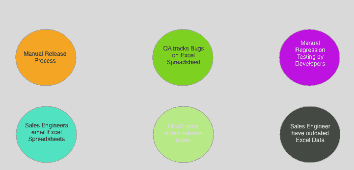
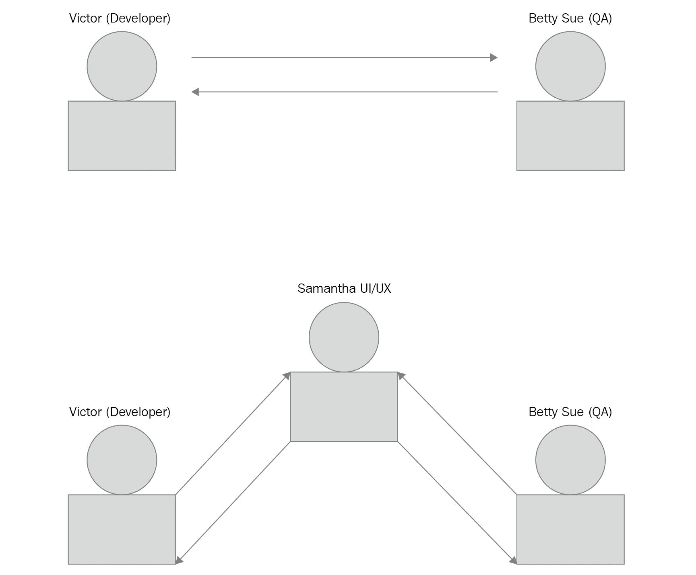
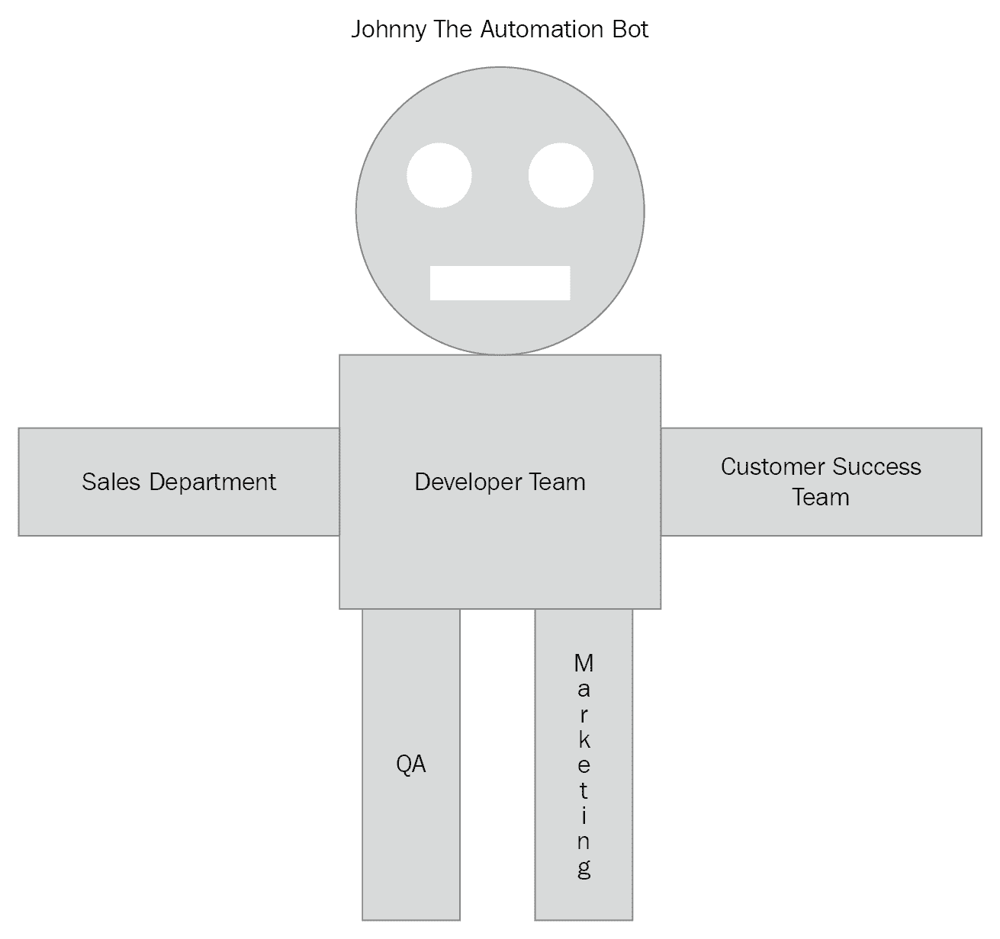
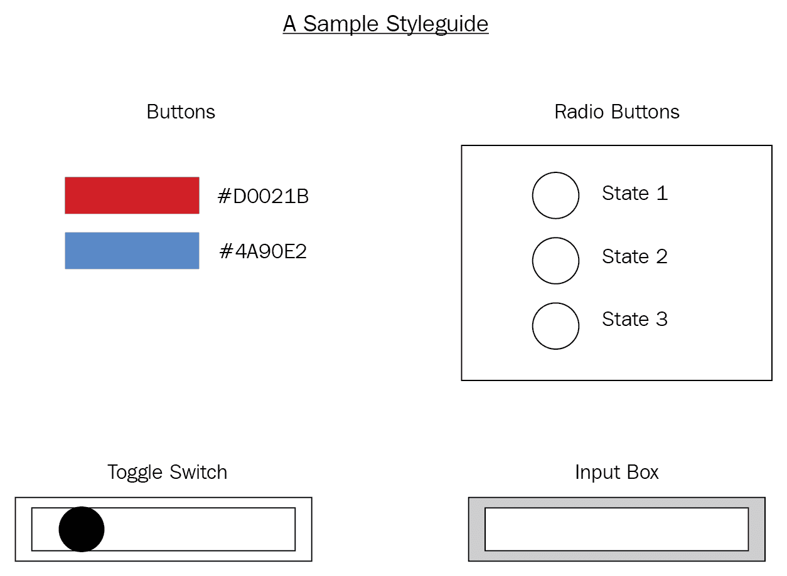

# 一、CI/CD 自动化测试

在本书中，我们将了解**持续集成** ( **CI** )和**持续交付** ( **CD** )的概念，并使用 Jenkins、Travis CI 和 CircleCI 等工具应用这些概念。我们将编写许多实践脚本，并将探索真实世界的 CI/CD 自动化脚本和场景。本章将通过解释一家名为比利·鲍勃的机器零件的虚构公司的当前实践来帮助说明自动化的概念。Billy Bob 的《机器零件》有很多手动流程，并且**质量保证** ( **QA** )和开发团队之间存在一些紧张关系，因为软件发布只由首席开发人员完成，所有 QA 测试都是手动完成的。

本章将涵盖以下主题:

*   手动流程–一个假设场景
*   员工沮丧
*   引入自动化
*   开发人员生产力
*   打破沟通障碍
*   创造合作的环境

# 业务场景

本章将描述模拟手动过程以及手动测试和手动过程中固有的缺陷，并将解释如何使用 CI/CD 来大幅提高开发人员的工作效率。在这个场景中，每个成员都设置了一组手动流程，完成这些流程非常耗时。此外，如果质量保证在最新版本中遇到问题，必须再次执行这些步骤。

我们将在我们虚构的公司中跨多个部门查看不同的场景。一些场景将关注开发团队、质量保证团队、客户成功团队和销售团队的痛点。我们将构建可能发生在这些团队中的场景，确定适合自动化的领域，以及这些团队之间的沟通如何揭示可以通过自动化大大改进的领域。

下图显示了一些业务场景:

# 手动流程–一个假设场景

贝蒂·苏是比利·鲍勃机器零件公司质量保证部门的一员。在比利·鲍勃的机器零件公司，有一个中等规模的开发团队。首席开发人员 Eric 在本季度末的周四上午开始手动发布流程。埃里克需要两天时间来完成发布周期。不幸的是，他是开发团队中唯一能做发布的人。Eric 在他的本地工作站上运行所有测试，并在必要时集成紧急补丁。一旦埃里克完成了，他会给质量保证部门的贝蒂·苏发一封电子邮件。

贝蒂·苏有几个质量保证工程师，周一早上开始新版本的手动测试周期。贝蒂通知埃里克，她已经在最新版本中发现了几个问题。贝蒂准备了一个 Excel 电子表格，记录了最新版本引入的问题。在周末，Betty 已经将最新版本的问题列表分解成关键的、高优先级的、中等优先级的和低优先级的错误。

A software bug is a flaw in a software product that is not behaving as intended.

在发布周期中，当问题得到解决时，埃里克和贝蒂都会重做每一步。Eric 必须重新打包所有软件组件，并在他的本地工作站上重新运行所有测试。贝蒂不得不重做测试周期，因为她必须检查回归，并确保最新的修复不会破坏软件组件中现有的功能。

团队中的初级开发人员 Michael 也在做手工流程。迈克尔从埃里克那里得到一个问题列表，并开始处理列表中更高优先级的 bug。Michael 试图解决和修复每个 bug，但是没有编写任何回归测试，确保较新的代码没有破坏现有的功能。当迈克尔完成后，他告诉埃里克他这边一切都好。不幸的是，当 Eric 在他的本地工作站上运行所有测试时，他看到了测试失败。埃里克告诉迈克尔，他在修复 bug 列表上的问题时需要更加小心。

质量保证部门的成员狄龙开始测试新版本的部分内容，并告诉贝蒂该版本有几个问题。他创建了一个问题清单，并将其发送给贝蒂。不幸的是，狄龙所做的一些工作被贝蒂重复了，因为他们在两个不同的清单中突出了相似的项目。贝蒂告诉狄龙，质量保证需要确保没有重复的工作。狄龙回去，并强调了他将测试的部分版本。

珍妮弗领导着**客户成功团队**，当质量保证部门准备向客户开放新版本时，她会收到通知。Jennifer 开始准备最新版本特性的视频，并随后就新版本的变化向 QA 提问。

Bobby 是客户成功团队中经验丰富的成员，他开始制作关于最新功能的视频。当发布视频发布到公司博客时，QA 意识到一些视频错误地陈述了仍在测试版发布时间表中的功能。Jennifer 现在很快就让客户成功团队紧急行动起来，并要求 QA 在将一些特性发送给客户成功团队之前，将其明确标记为 beta 版。

销售团队一直在通过电子邮件发送销售工程师在与潜在客户会面时记录的笔记。桑迪手写了每个潜在客户的详细记录，并使用电子表格对重要的销售信息进行分类。不幸的是，销售团队通过电子邮件向销售部门发送 Excel 电子表格的新更改。有时，由于销售工程师会打开一个旧的 Excel 文档，并错误地将过时的信息提供给其他销售工程师，从而导致混乱。

用户界面/UX 团队倾向于使用大量的实体模型和线框。通常，在原型阶段，用户界面/UX 工程师会将注释嵌入到模型中，并附上详细说明验证状态和页面交互的过渡注释。Victor 在其中一个线框中看到一个注释，并意识到线框中嵌入了重要的页面逻辑。Victor 询问 UI/UX 团队，这些笔记是否可以与开发团队共享。用户界面/UX 团队还与艺术板一起工作，并为每个功能作品创建 ZIP 文件。例如，Sandy 被分配了功能 x 的工作，并且一直在为新页面的 UI 交互做详细的笔记。用户界面/UX 团队的许多工作倾向于高度可视化，颜色意味着不同的东西。工作的视觉方面倾向于暗示在用户界面流程阶段应该发生的某些动作。开发人员倾向于处理更具体的项目，因此自然流应该发生的情况并不总是显而易见的。比如删除一个项目，*是调出一个模态*，这是一个确认的小窗口，还是*只是立即删除一个项目*？提交表单时，*用户界面是否以某种颜色显示错误，以另一种颜色显示警告*？*验证应该放在*什么位置？有时，用户界面交互流程没有详细描述，开发人员必须在用户界面/UX 之间来回切换。在决策文件中记录决策的原因很重要。

# 员工沮丧

贝蒂·苏给维克多发了一份按优先顺序分类的问题清单。优先级较高的问题必须先处理，而优先级较低的问题必须后处理。Victor 获得最新版本的问题列表，并通知开发团队，他们必须立即停止正在进行的新特性工作，并开始修复新版本的问题。大卫是团队中的一名高级开发人员，他很沮丧，因为他的节奏很好，现在正忙着用一个月前的工作来重新定位自己。

迈克尔是团队中的初级开发人员，还不熟悉代码库，他担心列表中有一个优先级更高的问题。Michael 匆忙解决了更高优先级的问题，但是没有考虑编写任何回归测试用例。迈克尔很快为他的高优先级票证写了一个补丁，并将他的补丁发送给维克多。Victor 用 Michael 的补丁很快找到回归和破碎的测试用例。迈克尔不知道他应该编写回归测试用例来确保没有回归。

发布一个新补丁的过程没有被正确地记录下来，像 Michael 这样的新开发人员经常创建破坏现有工作的回归。Victor 教 Michael 回归测试的概念，Michael 很快用回归测试用例编写了一个软件补丁。

一旦维克多准备好了所有新的软件补丁，他就可以开始一个热修复版本，并在他的本地机器上重新运行所有的测试。贝蒂获得了一个最新版本的新 ZIP 文件，并再次开始手动测试过程。质量保证部门正在手动测试产品的各个部分，因此测试产品的所有部分是一项耗时的任务。贝蒂在最新版本中发现了更多的问题，并向维克多发送了一个较小的列表，以便在本周晚些时候开始工作。

大卫突然被维克多阻止，并被告知放弃他的新功能工作，因为最新的变化有缺陷。大卫花了接下来的两个小时试图用新版本中的问题来重新定位自己。一旦确信自己已经跟踪到了问题，他就花一下午的时间进行修复。大卫通知维克多，最新的变化已经准备好接受测试。Victor 开始在他的工作站上运行测试，并立即看到由于最新的更改，一些集成测试现在正在失败，并通知 David 必须解决这些问题。大卫现在很沮丧，一直工作到深夜，想再解决一个问题。第二天早上，维克多运行了所有的测试，一切都通过了，所以他给贝蒂发了一个新的 ZIP，用于最新的热修复。贝蒂第二天开始手动测试过程，不幸的是又发现了几个小问题，并在下午让维克多知道最新版本仍然有一些问题。

维克多，无可否认此时感到沮丧，他把所有的开发人员都召集到一个房间里，说在所有的问题都解决之前，任何人都不能离开。在办公室呆了一个漫长的晚上后，所有最新的问题都被解决了，维克多让每个人都回家。第二天早上，维克多打包了最新版本，并给贝蒂发了一个新的 ZIP 文件。贝蒂在最后一个测试周期后有点担心，她很高兴所有的错误都被解决了，并给了质量保证部门批准的印章，让维克多知道最新的版本已经准备好了。开发团队和质量保证团队都用公司赞助的午餐庆祝工作周的结束，并回家过周末。

当质量保证测试热修复时，一些质量保证团队成员有重叠的工作。狄龙很沮丧，因为他的一些工作与贝蒂的工作重叠。QA 部门没有自动化到位，所以不管是补丁还是常规版本，每个版本的所有工作都是手工完成的，QA 必须重新测试 UI 的所有部分。质量保证团队的新成员内特问狄龙，是否有比手动测试更好的工作方式，但被告知质量保证部门已经有了这些做法。

客户成功团队的成员托尼对新版本感到沮丧，因为他花了很多时间为客户 *X* 创建新视频，并被告知他的一些视频无法发布，需要放在储备库中。质量保证部门在最后一刻决定暂停功能 *Y* ，但没有将此信息传达给其他部门。

首席销售工程师之一维克多正在做公司演示，并向潜在客户展示导出 PDF 功能。在演示过程中，维克多点击导出 PDF 功能，得到一个明显的错误信息。维克多很快转向产品的另一个方面，说这是一个暂时的小故障，他将在另一个演示中展示这一点。Victor 发现其中一个开发人员在一个后端服务中做了一个简单的更改，并在生产环境中破坏了导出 PDF 功能。Victor 发现潜在客户已经决定采用另一个软件解决方案，现在明显心烦意乱，因为他指望这个新客户获得他的年终奖金。

用户界面/UX 团队的成员萨曼莎被告知，她的一个模型缺少验证流程。萨曼莎在功能 *Z* 的原型制作阶段寻求澄清，并被告知该页面不需要任何验证，但大卫认为需要验证流程。萨曼莎明显心烦意乱，决定休息一天，现在大卫已经落后于专题《T2》的计划:

There is two-way communication between Betty Sue from QA and John in the developer team. Communication is of the utmost importance when finding areas to help with automation. As the number of interactions between parties increases, so does the involves parties' awareness of manual processes. Manual processes stay hidden until more parties, such as marketing, sales, customer success, and the developer team, start collaborating more often. Developers are especially suited to finding manual processes, as it not always apparent to non-developers that a process is manual and is capable of being automated.

# 引入自动化

这里有一个名为 **Johnny The Automation Bot** 的插图，用来描绘一个公司中不同的部门。Johnny 身上的每一个分支都代表着公司的不同部门:

自动化机器人是可以从自动化过程中受益匪浅的领域的一个例子。自动化可以被认为是一种程序或系统，机器借此完成人类通常会做的工作。自动化需要知道哪些手动流程正在进行，与其他部门沟通，并发现哪些流程正在手动进行。正如我们将在本书后面看到的，CI 和 CD 是大大提高公司生产力和流程的流程，因为它们删除了开发人员的假设和特定的环境设置。

Each limb on Johnny The Automation Bot has an area that is ripe for automation. The sales department is emailing Excel worksheets at the moment to the sales team, and is having a hard time keeping the sales information up to date with changes that other sales engineers are making. Johnny The Automation Bot suggests that the sales engineers have an easy way to upload sales information to a company intranet that can better keep sales information on track. Johnny suggests the developer team writes an Excel integration where the sales engineers can easily upload new sales data to a company intranet. For instance, a menu option that hooks into a company API endpoint could be added that would automatically upload new Excel changes to a company intranet page that has the latest sales information.

质量保证部门正在手动测试产品，手动测试是一项耗时且容易出错的活动。Johnny 建议 QA 部门开始使用 **Selenium WebDriver** 编写验收测试。Selenium 是一个浏览器自动化工具，QA 部门可以使用 Python 等语言编写验收测试。Johnny 说，用 Selenium 编写自动化测试的优势在于，它们可以被编写一次，并被一次又一次地重用。这将有额外的好处，即这些测试可以连接到CI/CD管道中，我们将在本书的后面部分看到。

质量保证部门的贝蒂发现，客户成功团队正在制作一组视频，在每次构建中向客户传授更新的功能。客户成功是通过文件传输协议上传视频，一些客户成功团队每天花很大一部分时间上传文件。自动化机器人约翰尼建议这个过程通过脚本实现自动化。该脚本应该足够直观，客户成功团队的任何成员都可以运行它，并且如果在上载过程中出现任何网络延迟，它应该执行上载和重试上载的工作。Betty 分享了 QA 编写的一个脚本，它可以自动完成这个过程，并被调用作为后台进程运行。

Tony 是客户成功团队的一员，现在他已经在工作日中腾出了数小时的工作时间，可以专注于工作中更重要的方面，例如通过创建精彩的视频来帮助客户获得成功。托尼已经开始与质量保证团队合作，并将开始发布视频，并对部分产品进行用户验收测试。质量保证现在能够更好地测试特性，因为手动测试已经委托给客户成功团队。质量保证侧重于用一个更新的库来自动化端到端测试套件，这将帮助他们更快地编写测试，并反过来通知开发团队损坏的功能。

营销团队一直在 PowerPoint 幻灯片中嵌入注释，有时注释会在演示或公司演示过程中丢失或被覆盖。Johnny 建议开发团队创建一个脚本，可以将 PowerPoint 幻灯片转换为减价文件，然后可以对减价文件进行版本控制，因为减价文件只是文本文件。这将有额外的好处，营销可以与销售团队共享信息，以创建更具说明性的图表。

维克多已经意识到手工过程正在破坏生产力，并且手工过程有明显的缺点。Victor 可以在发布周期中引入一个自动化系统，该系统可以由团队中的任何开发人员通过一键部署按钮运行。不是像 Victor 目前在本地工作站上运行所有的测试，而是可以将每个软件构建推送到 GitHub 这样的版本控制系统上，所有的测试都可以在 Jenkins 这样的 CI 环境上运行，并且可以自动通知开发人员测试是通过还是失败。例如，Bruce 是团队中较新的开发人员，他可以快速阅读开发人员文档，并在很少或没有指导的情况下开始下一个版本。自动化机器人约翰尼对这个练习竖起了大拇指。

贝蒂也有机会自动化手动测试过程。使用**浏览器**等工具，贝蒂可以编写一系列测试脚本来测试产品的每个部分。在一个小时内，Betty 可以在测试环境中运行一套验收测试，并让 Victor 知道版本中的最新问题。Victor 可以开始将问题分配给开发团队，并开始编写回归测试用例，以确保当前构建中没有回归。维克多相信最新的变化会如预期的那样起作用，他可以给贝蒂一个新的网址，让她下载最新的软件版本。Johnny The Automation Bot 指出，创建 ZIP 文件并通过电子邮件发送的旧做法不是一个好的做法，因为它每次都需要额外的步骤，如果发送了错误的 ZIP 文件，可能会容易出错。约翰尼建议质量保证部门有一个专门的网址，所有最新版本都在那里，每个版本都要有版本，并说明特定的信息，如修补程序。例如，最新的修补程序可能是`v5.1.0-hotfix 1`，因此，对于每个修补程序，质量保证部门将有一个包含最新版本和说明符的压缩文件，如修补程序。如果这个建筑是普通建筑，那么它可以被命名为`v5.1.0`。

维克多发现质量保证部门有一个浏览器栈帐户。浏览器栈提供了对整个浏览器和移动客户端套件的访问，这有助于自动化用户界面的负载测试。负载测试是使用开发团队用于特殊场景的定制服务器来完成的，例如负载测试。自动化机器人约翰尼建议要么使用像浏览器栈这样的服务，要么拥有一个定制服务，可以提供必要的资源来进行负载测试。

Victor 发现 QA 团队在测试开发团队编写的电子邮件服务时遇到了问题。自动化机器人约翰尼建议开发团队确保质量保证有任何脚本可以帮助电子邮件服务。Victor 告诉 Betty，新的电子邮件服务正在代理 **SendGrid** 服务，开发团队已经编写了一系列 QA 可以使用的脚本。这些脚本有助于编写测试电子邮件，并可以帮助质量保证部门测试在失败情况下会发生什么。

UI/UX 团队正在将模型上传到**Sketch**——Sketch 是一个原型工具——并在页面中嵌入关于可能的验证状态和流程的注释。这些注释非常详细，在公司 sprints 中开始特性工作时，对开发团队非常有帮助。自动化机器人约翰尼建议开发团队编写一个插件，可以帮助用户界面/UX 团队轻松共享这些信息。Victor 决定创建一个 Sketch 插件，创建一个带有嵌入注释的 PDF，用户界面/UX 团队可以在原型制作完成后通过电子邮件发送给开发团队。这个插件对于 UI/UX 团队来说很容易安装，因为他们只需要双击文件，插件就会自动安装。对 PDF 和嵌入注释的访问将帮助开发人员理解新特性的用例和用户界面流程。

首席销售工程师文森特(Vincent)向开发团队表示，他需要了解产品的流程变化，尤其是在与潜在客户谈论公司路线图上的新功能时。自动化机器人 Johnny 建议开发团队利用 Git 提交日志，其中有关于最新特性变化的详细信息。Victor 已经编写了一个脚本，可以抓取 Git 提交日志，并用所有最新的特性工作编写一个漂亮的降价文档。反过来，客户成功团队可以与开发人员团队合作，使用 markdown 文件在公司博客上创建一个漂亮的博客条目，详细介绍所有最新的功能。

There is a common theme here. Communication between departments is the key to both finding manual processes and creating partnerships that help automate processes. Automation cannot occur unless manual processes are known and, at times, the only way for automation to take place is for specific pain points to be communicated by other departments.

让我们重申一些通过开放协作实现自动化和增强的流程。Victor 通过提供开发团队创建的脚本，帮助 QA 自动化了电子邮件测试服务问题。质量保证通过共享上传视频的脚本和重试逻辑，帮助客户成功实现视频上传任务的自动化。销售部门表示需要更好地了解产品的新功能；这导致开发团队编写了一个脚本，该脚本从 Git 提交日志中抓取信息以生成一个减价文件，客户成功团队使用该文件在公司博客中编写一个漂亮的博客条目。UI/UX 团队现在有一个插件集成到他们的 Sketch 应用中，他们只需点击一个按钮就可以生成一个 PDF 文档，其中包含原型阶段的笔记，这反过来又可以帮助开发团队开发更新的功能。开发团队发现 QA 正在使用一个名为 BrowserStack 的工具，并开始使用它对产品进行负载测试。营销团队现在拥有营销幻灯片的版本副本，并且正在将这些信息共享给销售团队，以便为公司演示创建更新的图表。

UI/UX 团队决定创建一个风格指南，开发者可以在其中寻找软件产品中常见的 UI 模式。UI/UX 团队发现许多不同的风格被用于不同的页面，这给许多客户带来了困惑。例如，“零件供应”页面在一个页面上有一个蓝色的大保存按钮和一个红色的取消按钮，但是在“供应商详细信息”页面上有一个红色的大保存按钮和一个蓝色的取消按钮。客户点击了错误的按钮，因为用户界面没有普遍使用颜色。有时，页面使用确认模式来添加和删除项目；其他时候，没有确认模态。用户界面/UX 团队已经开始着手设计风格指南，并在公司内部网中创建一个特殊的网址，供实时风格指南使用。其目的是明确创建并列出页面所有可用的十六进制颜色，设计产品中的所有按钮，并决定表单在页面上的外观和行为。

此外，还有一个特殊的小部件页面，其中嵌入了产品中所有专用小部件的 HTML 标记和样式:

This style guide has hexadecimal color values and has embedded some HTML elements and a toggle switch, which is a specialized widget that has an off state and an on state. The intent of the style guide is for the developers to be able to simply right-click and copy both the HTML markup and the CSS, and to establish a uniform UI presentation. This is a form of automation because developers can simply reuse existing markup and styles and not have to manually create HTML and custom styles where uniformity is best used. Any time users of a product have to guess what to do, you surely invite disaster.

# 开发人员生产力

由于 Victor 在构建中实现了 CI/CD 管道，许多耗时的活动现在被归入自动化管道。每当软件被推送到一个**版本控制系统** ( **vcs** )如 Git 时，一个自动化的构建在 Jenkins 中被触发，运行所有的单元和集成测试。开发人员可以很快知道他们编写的代码是否引入了缺陷。请记住，Victor 必须合并所有软件补丁，并在他的本地工作站上手动运行所有测试。这是乏味的，耗时的，不必要的。

由于所有软件都被推向上游，Victor 已经为发布分支设置了代码截止日期，并且已经开始对软件发布二进制文件进行版本控制，以便 QA 可以更清楚地描述每个构建。Victor 立即变得更加有效，因为他可以开始将发布周期委托给团队中的其他开发人员。任何开发人员都可以在发行版中记录发行周期中遇到的任何问题。Victor 现在有更多的时间开始规划下一个软件周期，并指导团队中的初级开发人员。大卫现在很高兴，因为他可以将他的最新更改推送到源代码管理，并在 CI 环境中运行所有测试，并且更有信心他的更改按预期工作。

Betty 已经建立了一整套验收测试来检查软件产品的每个部分。产品中的任何回归都会立即出现在配置项环境中，并且所有测试都可以每天运行。质量保证正在运行的测试比开发人员团队的测试更加耗时和耗费资源，因为它们是端到端的测试，但是质量保证团队的优势是所有的测试都是每天运行的，质量保证每晚都会收到一份详细说明任何测试失败的报告。Betty 编写了一个页面对象集合，帮助 QA 团队中的其他成员重用其他测试脚本，减少测试周期。Betty 现在有时间在 QA 周期中指导 QA 部门的新成员测试实践，以及如何为开发团队正确标记问题，以便他们知道问题在最新版本中的位置:

The bolt here symbolizes processes in place; in this case, the release processes that are in need of automation.

大卫现在可以开始帮助维克多指导团队中的初级开发人员，开发人员团队已经开始做一个午餐和学习系列，其他开发人员可以通过这个系列在整个团队中分享知识。开发团队很快意识到这些午餐和学习会议也适用于质量保证部门。在一次午餐和学习会议中，质量保证向开发团队提出了关于协调质量保证和开发团队之间发布的变更。通过这种合作关系，发布周期从一周缩短到 3 小时。开发团队轮流发布工作，这样团队中的每个开发人员都可以学习如何发布。值班开发人员确保质量保证有一个可供质量保证开始测试的构建，并且这个构建可以使用配置项系统自动触发，例如Jenkins、Travis或 CircleCI。在这些配置项环境中，您可以设置在指定日期和时间运行的生成触发器。质量保证部门将发布中的任何倒退通知给开发团队，每当开发团队准备好推进一个热修复时，构建就用下面的模式清晰地描述出来— `vMAJOR.MINOR.PATH-[hotfix]-[0-9]*`。为了清楚起见，这里有一个例子— `v6.0.0-hotfix-1`。这描述了主要版本`6`，次要版本`0`，补丁版本`0`，以及热修复号`1`。该命名方案有助于质量保证部门区分常规版本和`hotfix`版本。

客户成功团队已向开发团队传达，一些客户在使用比利·鲍勃的机器零件**应用编程接口** ( **应用编程接口**)服务时遇到问题。客户成功团队询问开发团队是否有任何方法可以帮助新的第三方应用编程接口消费者。需要澄清的是，应用编程接口消费者是使用现有应用编程接口的人，而应用编程接口提供者是维护实际应用编程接口服务的人；所以在这方面，Billy Bob 的 Machine Part 是 API 提供者，它提供了一个运行的 API 供第三方开发人员使用。开发人员团队告诉客户成功团队，他们一直打算创建一个开发人员门户，这将帮助应用编程接口消费者轻松使用应用编程接口。然而，开发团队很难说服高层管理人员相信开发人员门户的价值，因为没有人要求这个特定的特性。客户成功团队很快说服高层管理人员，开发人员门户将是比利·鲍勃的机器零件应用编程接口消费者的巨大资产，应用编程接口消费者可以开始使用来自应用编程接口服务的数据构建漂亮的仪表板。

在一次开发者会议上，发现营销团队正在使用谷歌文档共享文档，但很难找到上传的内容，因为你必须知道你在寻找什么。Victor 很快意识到开发人员团队可以帮助构建公司内部网，销售和营销团队可以在其中以更一致的方式共享数据。几个月后，公司内部网被曝光，销售和营销团队兴奋地提到，公司内部网帮助他们实现了文档共享过程的自动化，过去销售和营销部门之间的许多会议在试图找到某些文档时都浪费了无数时间。公司内部网公开了一种过滤机制，通过这种机制，可以使用标签系统快速找到文档。公司内部网启用的另一个功能是销售和营销团队编辑共享文档的能力。

销售团队现在有一个很好的工具可以与公司博客一起使用，展示新产品特性。Victor 现在可以查看公司博客，了解产品的最新功能。这一切之所以能够实现，是因为 Victor 编写了一个脚本，该脚本从 Git 提交日志中抓取提交消息，然后发布一个漂亮的减价文件。该脚本用于每个版本，并列出所有已处理的项目，开发人员团队将新创建的降价文件发送给客户成功团队，然后他们编写一个漂亮的博客条目，讨论基于该降价文件的最新版本的所有细节。

质量保证团队开始处理零件限制导致特定用户界面错误的问题。特别是，如果客户在产品详细信息页面上有超过 10，000 个零件列表，则产品详细信息页面会崩溃，并且没有任何有用的指示。开发团队发现 QA 团队正在新产品页面手动创建新产品。开发团队帮助质量保证团队，让质量保证意识到一个以编程方式创建语音邮件的管理端点。开发团队帮助编写了一个以编程方式生成新部件的脚本，从而使质量保证团队避免了手动创建部件的耗时任务。

# 打破沟通障碍

为了实现自动化，团队之间必须打破沟通障碍。有时，不同的政党可能会认为他们在同一页，但实际上他们在谈论不同的事情。

为了消除误解，开放沟通渠道非常重要:

有趣的是，在发布周期内仍然有更多的自动化空间。维克多问贝蒂一些源代码控制中的验收测试。Victor 意识到他可以将验收测试集成到 CI 环境中，并创建一个二级构建，在那里所有的验收测试每天晚上都要运行，QA 每天早上都会收到一份详细说明最新故障的报告。然后，质量保证部门可以在每天早上检查失败的验收测试，并通知开发团队特性 *x* 已经损坏，例如，零件供应页面，开发这个新特性的开发人员需要重新检查新的业务逻辑。

David 开始与 UI/UX 团队交谈，发现新公开的 API 端点和新页面的构建之间存在瓶颈。前端开发人员正在嘲笑这些页面中的数据，并不断对意想不到的 JSON 负载感到惊讶。前端开发人员有时会等待几周的时间来发布应用编程接口端点，而不是袖手旁观，他们开始嘲笑数据。这产生了意想不到的后果，他们开始假设数据模型是什么样子，这反过来又使得更改页面更加困难。David 让 Victor 知道，有一些工具可以快速构建端点的数据模型，并为前端开发人员提供 API 端点的当前数据模型。大卫开始使用斯瓦格，这是一个应用编程接口设计框架，作为在应用编程接口服务中构建更新的应用编程接口的工具。Swagger 有助于减少开发团队和 UI/UX 团队之间的摩擦，这种摩擦是不必要的，因为 UI/UX 团队正在等待数据模型。Jason 是一名高级 UI/UX 开发人员，他现在可以快速开始构建更新的页面了，因为他完全知道从更新的 API 端点可以期待什么类型的负载。

作为质量保证团队的一员，阿曼达已经开始与客户成功团队合作进行负载测试和用户验收测试。在用户验收测试周期中增加了验收测试，暴露了核心产品中 UI/UX 可以改进的地方。客户成功团队现在有了测试新页面和暴露可能的用户界面问题的额外责任。验收测试有利于测试快乐路径场景，这意味着当一切都按预期完成时，但是用户验收测试可能会在用户界面中暴露非直观的工作流。例如，拉里开始在“零件供应”页面测试一个更新的过滤器功能，并发现为了让过滤开始工作，您需要点击一个复选框。Larry 问 QA 为什么默认情况下不能进行过滤，为什么需要一个复选框；然后开发人员开始默认添加过滤:

The diagram depicts no checkbox but simply a page that uses an input box and, whenever a user types *Enter*, comma, or *Tab*, a new filter is applied and then the page is filtered automatically. If there are no results to display, then the text No Results Found is shown.

客户成功团队的成员贾斯汀问质量保证团队的成员弗朗西斯，他是否可以借用质量保证部门测试的一个新功能的视频。贾斯汀意识到质量保证团队有一组非常有价值的视频，客户成功团队可以利用这些视频来教客户如何使用最新的功能。Francis 为客户成功团队创建了一个内部门户，供质量保证部门发布更新的视频时使用。客户成功团队一直在为新客户制作入职视频，并设计了一个知识门户，解释如何设置新的零件供应页面等。

销售团队一直在通过电子邮件向个人电子邮件帐户发送与客户和潜在客户讨论的记录。维克多发现，销售经理哈利最近丢失了一些有价值的笔记，因为他不小心删除了他在与一个潜在客户共进午餐时记下的笔记。维克多告诉哈利，有一个新的公司内部网，还有一个项目页面，里面有你可以创建的卡片，所以销售团队可以为每个潜在客户创建一个销售平台。哈里为一个潜在客户创建了一个新的销售平台，并与首席销售执行官吉姆分享。吉姆表示非常兴奋，因为他也意识到公司内部网也可以用来创建图表。Jim 使用以下图表向首席销售官展示最新的销售线索:

The sales team can create a project deck for each prospective client. The company intranet is helping integrate more teams within the company because team members are breaking down communication barriers.

开发人员团队发现，客户成功团队一直将用户界面用于非常耗时且容易出错的流程。首席开发人员 Victor 发起了一项创建**命令行界面** ( **CLI** )的计划，客户成功团队可以使用该界面来自动化其当前工作流程中有手动流程的许多部分。开发人员团队解释了命令行界面如何为客户成功团队节省无数时间，以及它如何帮助应用编程接口消费者更好地使用应用编程接口服务。命令行界面可用于快速为用户界面植入重要的页面数据。由于每个新版本可能会公开更新的端点，因此开发人员团队创建了一个计划，向 CLI 添加额外的命令来使用更新的 API 端点。

命令行界面应用将与开发人员门户计划协同工作，并将促进应用编程接口消费者的采用。与此同时，开发团队决定启动一个**软件开发工具包** ( **SDK** )的计划，消费者可以利用该工具包与应用编程接口一起工作。一个软件开发工具包可以极大地改善和增强第三方对应用编程接口提供者的采用，从而提高应用编程接口的采用。软件开发工具包特别有用，因为开发人员和质量保证人员使用不同的编程语言。机器零件应用编程接口的开发人员正在使用 Golang 编程语言，而质量保证人员在大部分工作中使用 Python。该软件开发工具包将支持许多编程语言，并将帮助应用编程接口消费者快速启动和运行，因为他们可以选择一种语言与应用编程接口服务一起工作。

为了使手动过程自动化，组织内的不同组之间必须有通信。在一个组织的所有团队中，必然会有手动流程。开发领导、质量保证领导、客户成功领导和用户界面/UX 领导每月召开一次会议，讨论新的实践，并开始寻找公司内需要自动化的其他手动流程。

手动流程本身并不糟糕，**用户接受度测试** ( **UAT** )在公司中仍然有效，可以帮助暴露自动化测试找不到的问题。UAT 特别有助于测试自动化测试有时无法发现的边缘案例场景，如前面所示的示例所示，客户成功团队测试了一个更新的功能，发现“零件详细信息”页面仅在复选框被选中时才启用过滤。

营销、销售和客户成功团队通常利用电子表格应用(如 Excel)来计算数字，利用演示应用(如 PowerPoint)来创建图表。通常，在 Excel 电子表格中计算的数字会保存在修订版中，但团队成员必须通过电子邮件将副本发送给其他团队成员。开发人员可以要求营销、销售和客户成功团队在 Excel 中以**逗号分隔值** ( **CSV** )形式导出值，这是一个文本文件，更容易处理。这具有额外的价值，即公司内部网可以使用数据可视化工具来创建精美的 HTML 图表和演示文稿。像 D3 这样的库可以用来创建许多不同类型的可视化，这些可视化非常强大。

# 创造合作的环境

为了让团队开始合作并公开讨论问题，必须存在一种开放的精神。团队很容易被孤立，这意味着他们与其他团队正在做的事情脱节。开发团队也可以轻松地选择与质量保证部门保持联系。这样做的问题是，沟通是团队之间暴露手动流程的最重要的元素。没有沟通，团队将独立完成他们认为重要的项目。

不同团队一起参与的社交活动可以帮助打破障碍，建立友好的环境。通常，开发人员喜欢参加会议只是为了与其他开发人员互动的社交方面，并且通常有一个走廊通道，开发人员站在外面，简单地相互交谈，而不是参加会议中的活动会话。

公司可以赞助社交活动，并帮助任命不同团队的代表，帮助打破团队之间的僵局。例如，在公司的保龄球活动中，人们可能会被故意安排到不同的团队，而不是他们习惯的工作。小型保龄球团队可以由开发人员、客户成功团队成员、质量保证团队成员、营销团队成员和销售团队成员组成。这可以激发一种工作关系，在这种关系中，团队成员相互了解，并公开交流他们在公司活动之外遇到的问题。

比利·鲍勃机器零件公司安排了一次棒球活动，首席开发人员维克多和首席质量保证成员贝蒂与几名营销团队成员、销售团队成员和客户成功团队成员一起工作。为棒球赛事组建了两个团队，比赛结束后还安排了一次公司烧烤，这样人们就可以一起吃饭聊天了。

鼓励积极合作的另一种方式是改变公司平面图，使其更加开放。许多软件公司一直采用开放式平面图，因为它们消除了小隔间在人们之间造成的自然分割。这个想法是，如果你有一个开放的平面图，你更有可能接近不同的团队，因为你可以很容易地走到不同的人面前，而不会觉得你侵犯了他们的空间。

# 摘要

沟通是找到手动流程的关键，为了自动化这些手动流程，找到手动流程非常重要。正如我们用各种业务场景说明的那样，手动流程往往容易出错且耗时。这就是自动化的作用，例如实现配置项构建和编写脚本来自动化手动过程。开发人员和质量保证可以帮助开发自动化脚本，这些脚本可以使许多不同的部门受益，例如销售、营销和客户成功。在本章中，您已经了解了自动化相对于手动流程的优势以及开放式沟通的价值。

在下一章中，我们将学习 CI 的基础知识。

# 问题

1.  什么是手动流程？
2.  什么是自动化？
3.  为什么开放部门间的沟通很重要？
4.  CI/CD 代表什么？
5.  自动化脚本为什么有用？
6.  公司内部网的价值是什么？
7.  为什么其他部门要共享数据？

# 进一步阅读

要获得更多关于CI的介绍并使用流行的CI/CD工具，请考虑阅读
*学习与Jenkins的持续集成–第二版*([https://www.amazon.com/dp/1788479351/](https://www.amazon.com/dp/1788479351/))*Packt Publishing*。