# 五、Jenkins 的安装和基本知识

本章将帮助您在 Windows、Linux 和 macOS 中安装 Jenkins。我们还将了解 Jenkins 用户界面的基础知识。

本章将涵盖以下主题:

*   Windows 安装有我们的第一个版本
*   Linux 安装
*   macOS 安装
*   在本地运行 Jenkins
*   管理 Jenkins

# 技术要求

本章是关于将 Jenkins 用于 CI/CI 流程。在本章中，我们将不讨论 CI/CD 概念，因为我们正在设置环境以使用 Jenkins。

# Windows 安装

安装 Jenkins 有一些初步的步骤。

# 安装 Jenkins 的先决条件

您需要确保安装了 Java，并且从 Jenkins 2.54 开始。Jenkins 现在需要 Java 8。

# 查找您的 Windows 版本

单击开始窗口图标，在搜索框中键入`system`，然后在程序列表中单击系统。

现在打开系统小程序，标题为查看您的计算机的基本信息，找到位于大的 Windows 徽标下的系统区域。

系统类型可以是 64 位操作系统或 32 位操作系统。

# 安装 Java

要安装 Java，请前往 Java 下载页面([http://www . Oracle . com/tech network/Java/javase/downloads/index . html](http://www.oracle.com/technetwork/java/javase/downloads/index.html)):

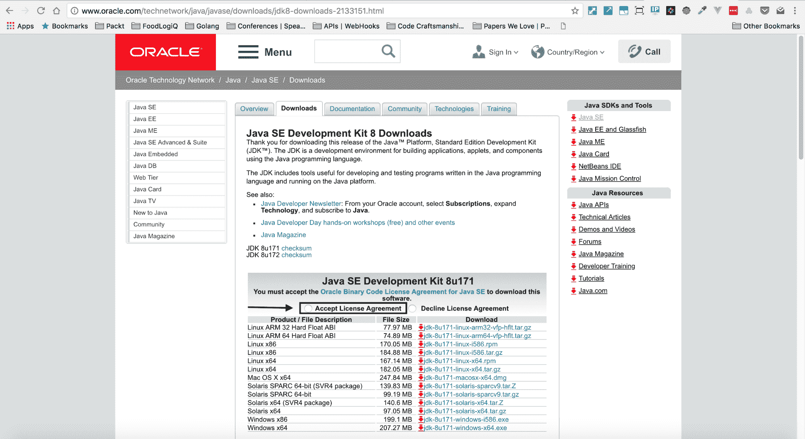

确保单击“接受许可协议”单选按钮，然后单击“Windows 下载”，并确保选择正确的体系结构；即 32 位或 64 位操作系统。

然后使用安装程序在 Windows 中安装 Java。

# Windows 安装程序

在 Windows 操作系统中安装 Jenkins 相对容易；只需转到 Jenkins 下载页面([https://jenkins.io/download/](https://jenkins.io/download/)):


如果滚动到页面末尾，您将看到一个操作系统列表，根据当前版本，您可以在其中安装 Jenkins:

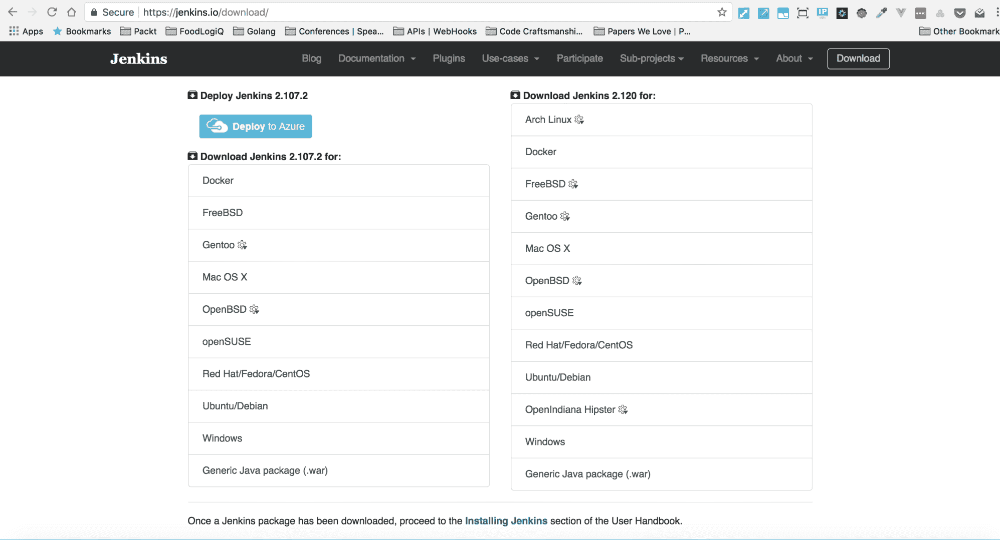

# 在 Windows 中安装 Jenkins

我已经从 Jenkins 下载页面下载并解压了 Jenkins 文件，如下图所示:


# 在窗口中运行 Jenkins 安装程序

以下屏幕截图显示了窗口中的 Jenkins 安装程序:

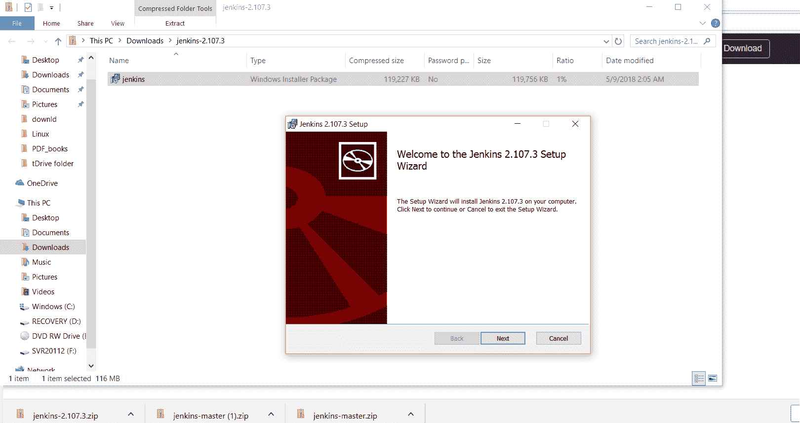

完成安装程序中的所有步骤后，您将看到以下屏幕:


点击**完成**后，可以在网页浏览器中进入`http://localhost:8080`，会看到如下截图:


# 用巧克力包装管理器安装 Jenkins

巧克力的安装说明可以在[chocolatey.org/install](https://chocolatey.org/install)找到。

您可以在以下命令的帮助下使用`cmd.exe`安装巧克力:

```
@"%SystemRoot%\System32\WindowsPowerShell\v1.0\powershell.exe" -NoProfile -InputFormat None -ExecutionPolicy Bypass -Command "iex ((New-Object
```

```
System.Net.WebClient).DownloadString('https://chocolatey.org/install.ps1'))" && SET "PATH=%PATH%;%ALLUSERSPROFILE%\chocolatey\bin"
```

一旦安装了巧克力，你可以简单的运行`choco install jenkins`通过巧克力安装 Jenkins。

# 在命令提示符窗口中启动和停止 Jenkins

点击**启动**按钮，输入`cmd`，点击*进入*。这将打开命令提示符会话。

接下来，您可以在命令提示符下输入以下命令:

```
cd 'C:\Program Files (x86)\Jenkins'
```

然后，您可以使用以下命令:

```
$ C:\Program Files (x86)\Jenkins>jenkins.exe start
$ C:\Program Files (x86)\Jenkins>jenkins.exe stop
$ C:\Program Files (x86)\Jenkins>jenkins.exe restart
```

您也可以利用`curl`并使用以下命令:

```
$ curl -X POST -u <user>:<password> http://<jenkins.server>/restart
$ curl -X POST -u <user>:<password> http://<jenkins.server>/safeRestart
$ curl -X POST -u <user>:<password> http://<jenkins.server>/exit
$ curl -X POST -u <user>:<password> http://<jenkins.server>/safeExit
$ curl -X POST -u <user>:<password> http://<jenkins.server>/quietDown
$ curl -X POST -u <user>:<password> http://<jenkins.server>/cancelQuietDown
```

# Linux 安装

我们将在 Ubuntu 16.04 数字海洋微滴上安装 Jenkins 请按照 Jenkins 下载页面([https://jenkins.io/download/](https://jenkins.io/download/))的按钮链接上的说明，在您的特定 Linux 发行版上安装 Jenkins。您可以点击 Jenkins 官方支持的 Linux 发行版之一，但是，出于本节的目的，我们将考虑在数字海洋小滴上的 Ubuntu 操作系统上安装 Jenkins。

# 在 Ubuntu 上安装 Jenkins

运行以下命令将存储库密钥添加到您的系统中:

```
wget -q -O - https://pkg.jenkins.io/debian/jenkins-ci.org.key | sudo apt-key add -
```

增加按键后，系统会返回`OK`。

接下来，我们将通过运行以下命令将 Debian 包存储库地址附加到服务器的`sources.list`中:

```
echo deb https://pkg.jenkins.io/debian-stable binary/ | sudo tee /etc/apt/sources.list.d/jenkins.list
```

接下来，我们需要通过运行以下命令来更新系统中的存储库:

```
sudo apt-get update
```

确保安装 Java，因为它是 Jenkins 要运行的依赖项，所以运行以下命令:

```
sudo apt install openjdk-9-jre
```

接下来，我们将 Jenkins 安装到 Ubuntu 上:

```
sudo apt-get install jenkins
```

# 在 Ubuntu 中启动 Jenkins 服务

最后，我们需要通过以下命令启动 Jenkins 服务:

```
sudo systemctl start jenkins
```

现在我们需要确认 Jenkins 已经开始没有问题:

```
sudo systemctl status jenkins
```

您应该得到如下输出:


# 打开网络流量防火墙

默认情况下，Jenkins 运行在 HTTP 端口`8080`上，因此我们需要确保该端口允许流量:

```
sudo ufw allow 8080
```

您将获得以下输出:

```
Rules updated
 Rules updated (v6)
```

接下来，我们需要查看规则的状态:

```
sudo ufw status
```

您将看到如下输出:

```
Status: inactive
```

# 首次登录时解锁 Jenkins

第一次在“数字海洋微滴”中运行 Jenkins 时，您将看到如下所示的屏幕:

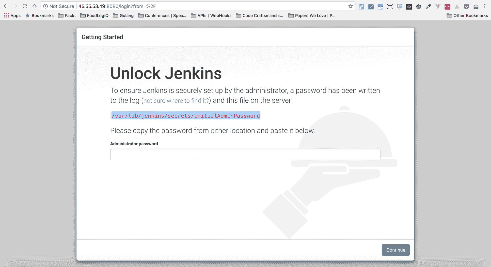

在 Ubuntu 终端会话中运行以下命令:

```
cat /var/lib/jenkins/secrets/initialAdminPassword
```

将打印成标准输出的密码复制到系统剪贴板，然后将此密码粘贴到初始登录屏幕，然后单击继续按钮。

接下来，您将看到这样一个屏幕，您可以在其中安装建议的插件或选择要安装的插件:


这个屏幕一开始并不是 100%必须运行的，所以你可以点击屏幕右上方的 X:

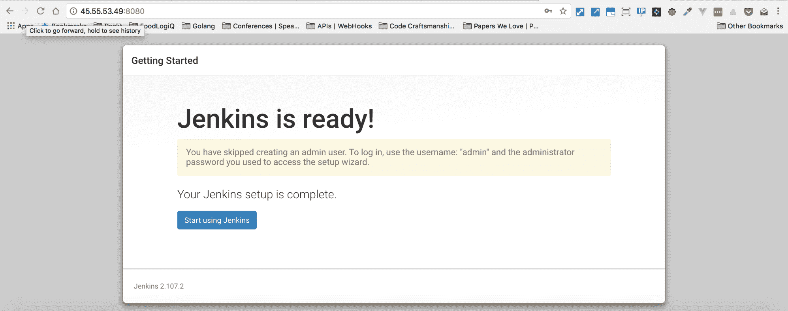

单击 X 并决定启动 Jenkins 后，您将看到此屏幕:

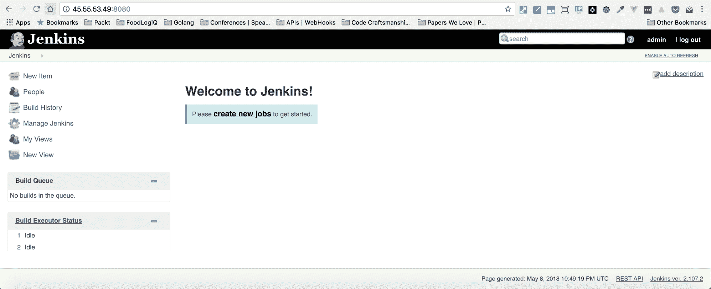

# macOS 安装

在 macOS 中安装 Jenkins 相对容易，您可以通过两种方式来实现。

# Jenkins 下载包

在本节中，我们将介绍如何使用 Mac 软件包安装程序(`.pkg`)文件安装 Jenkins:

1.  前往 Jenkins 下载网址([https://jenkins.io/download/](https://jenkins.io/download/))。
2.  滚动到页面底部，您应该会看到可以安装 Jenkins 的操作系统列表。
3.  点按“Mac OS X”按钮链接，您应该会进入如下页面:


4.  单击浏览器窗口底部的`.pkg`文件，或者双击下载文件中的 Jenkins`.pkg`文件:


5.  请注意，右下角有两个名为“返回”和“继续”的按钮。只需点击继续，您将进入下一个窗口，这是许可协议。
6.  单击继续，并确保单击同意按钮:

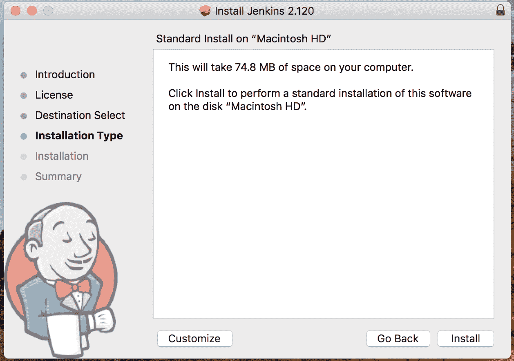

7.  通常，您可以只单击“安装”按钮，但是如果您想要自定义，您可以选择不安装文档，其中包括:


8.  除非您担心磁盘空间，否则通常只需单击标准安装，然后单击安装:


9.  安装脚本运行完毕后，您将看到以下屏幕:


10.  单击关闭，Jenkins 应该在您的本地机器上运行。

# 首次登录时解锁 Jenkins

第一次在主机上本地运行 Jenkins 时，您将看到如下所示的屏幕:


如果 Jenkins 在主用户帐户中运行，请在 Mac 终端中运行以下命令:

```
pbcopy < /Users/jean-marcelbelmont/.jenkins/secrets/initialAdminPassword
```

这将把初始管理员密码复制到系统剪贴板上。也有可能您的初始密码正在`Users/Shared/Jenkins`中运行，如果是这种情况，请尝试以下命令:

```
pbcopy < /Users/Shared/Jenkins/Home/secrets/initialAdminPassword
```

接下来，将此密码粘贴到初始登录屏幕，然后单击继续:

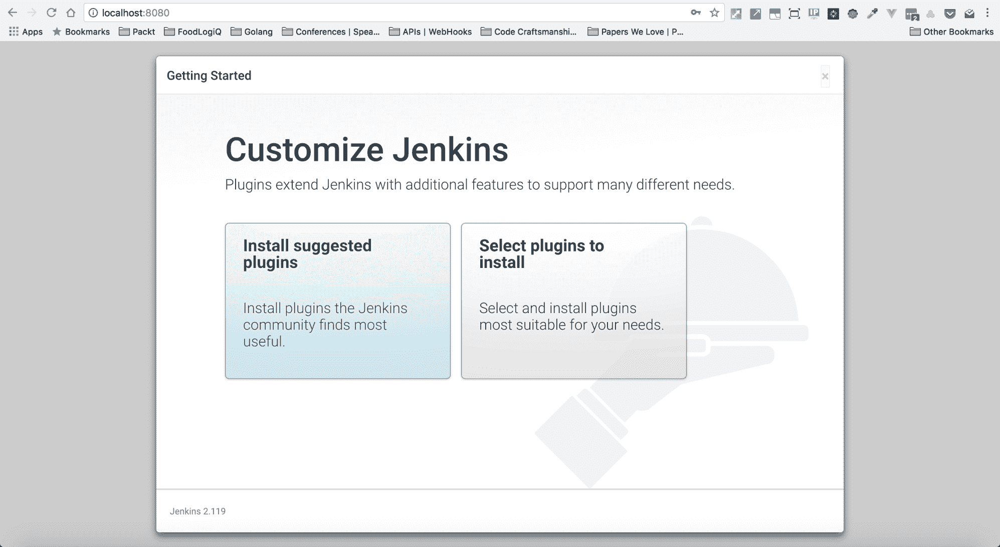

这个屏幕一开始并不是 100%必须运行的，所以你可以点击屏幕右上方的 X。单击 X 并决定启动 Jenkins 后，您将看到此屏幕:

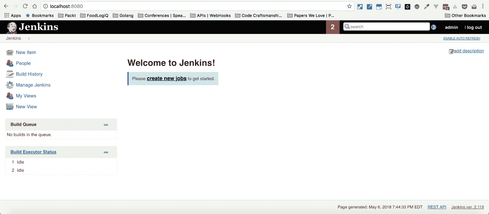

# 通过家酿安装 Jenkins

您也可以通过 macOS 中的自制软件包管理器安装 Jenkins。

如果你没有安装家酿，那就先去家酿页面([https://brew.sh/](https://brew.sh/))。

安装自制程序相对容易。点击 Mac Finder 按钮打开终端应用，按*Ctrl*+*Shift*+*G、*然后进入`/applications`，点击 Go 按钮。确保双击`Utilities`文件夹，然后双击终端应用图标。

只需将自制安装脚本粘贴到终端应用提示中:

```
/usr/bin/ruby -e "$(curl -fsSL https://raw.githubusercontent.com/Homebrew/install/master/install)"
```

自制程序成功安装后，只需在终端应用中运行以下命令:


一旦安装了 Jenkins，您可以通过向终端应用发出命令来启动 Jenkins 服务:

```
brew services start jenkins
```

运行此命令后，您只需访问`localhost:8080`，然后就可以按照我们在*解锁 Jenkins 首次登录*部分运行的相同步骤进行操作。

# 在本地运行 Jenkins

以下是 Jenkins 主仪表板页面的截图。我们将详细检查每个项目:


# 创建新项目

在下面的步骤中，我们将创建一个自由式项目作为一个新项目，但是根据安装的插件，可能会有更多的项目需要添加:

1.  如果单击“新建项目”链接，您将转到以下页面:


2.  我们没有安装任何插件，所以我们唯一可以使用的项目类型是自由式项目。
3.  让我们输入自由式项目的名称，然后单击“确定”:


4.  您将看到以下屏幕来配置您的自由式项目:

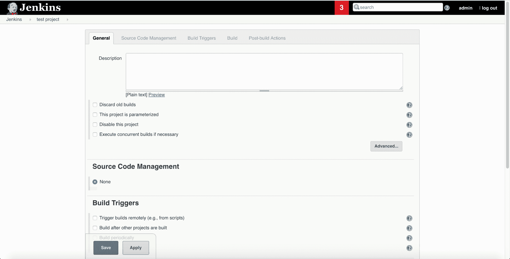

5.  让我们为 Jenkins 创建一个简单的构建，打印出`Hello World`:


6.  确保单击添加构建步骤按钮，然后选择执行外壳。
7.  最后，单击保存，您将返回到项目仪表板屏幕。
8.  接下来，确保单击“立即构建”按钮来触发构建，您将看到一个文本弹出窗口，显示“已计划构建”:

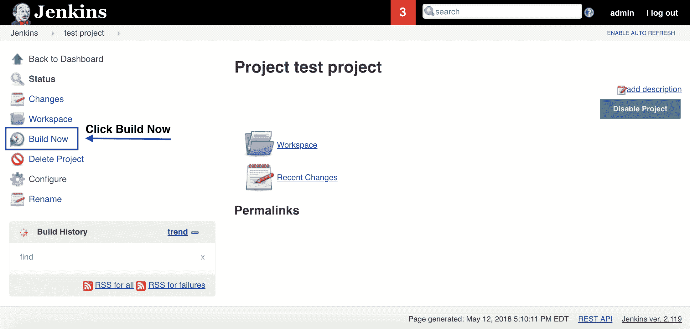

9.  请注意，在下面的截图中，我们的第一个构建在构建历史部分标记为#1:


10.  请注意，我们现在有一个构建历史部分，您通常希望转到控制台输出来查看构建的日志信息。

# 控制台输出

以下是 Jenkins 中典型的**控制台输出**屏幕:


这是一个极其简单的屏幕，我们只在屏幕上打印出`Hello World`。

# 管理 Jenkins

登录 Jenkins 后，您只需单击管理 Jenkins 链接:


然后确保单击管理插件链接:


然后，您将进入插件页面，如下所示:


请确保单击“可用”选项卡，您将看到您可以安装的可用插件列表。

我们将安装 Go 插件(您可以使用过滤器输入框快速找到插件):


请注意，我们在过滤器输入中键入了`golang`。然后，您可以单击“不重启安装”按钮或“立即下载并重启后安装”按钮。我们将使用“不重启安装”按钮。

单击按钮后，您将看到以下屏幕:


我们将点击返回首页**按钮。**

让我们回到 Jenkins 仪表板，单击管理 Jenkins，然后单击管理插件。

确保在过滤器输入框中输入`git`:


现在我们将单击“立即下载并在重启后安装”按钮。

现在如果你点击重启 Jenkins**标志**，Jenkins 将重启，然后系统会提示你登录。

接下来，确保单击“返回仪表板”链接:


# 配置环境变量和工具

现在我们将看看如何在 Jenkins 仪表板中添加环境变量。确保点击管理 Jenkins，然后点击配置系统 **:**

然后，您需要向下滚动到全局属性:


然后确保配置所有的工具，比如添加 GitHub 和 golang 的路径。

# 配置轮询 GitHub 版本控制存储库的作业

请确保单击“新建项目”按钮，现在请注意，我们已经添加了一个附加项目。

现在我们将创建另一个名为**戈朗项目**的 Jenkins 构建作业:


您可以进一步向下滚动或单击源代码管理选项卡:


现在，如果您向下滚动，您将转到构建触发器部分:


在这里，我们使用 Jenkins 配置轮询，并指定 cron 计划。cron 作业显示如下:分钟、小时、天、月和工作日。

您可以在 Linux 手册页([http://man7.org/linux/man-pages/man5/crontab.5.html](http://man7.org/linux/man-pages/man5/crontab.5.html))下阅读更多关于 Crontab 的信息。

然后，我们添加以下配置:


我们将创建另一个 shell 脚本来执行测试。

确保单击“立即构建”按钮:


然后确保单击内部版本号，然后单击控制台输出链接:


请注意，控制台输出会打印出 Jenkins 正在执行的每个步骤。

# 摘要

本章讨论了 Jenkins 的安装和导航 Jenkins 用户界面的基础知识。下一章将详细介绍 Jenkins 仪表盘和用户界面。

# 问题

1.  我们在 Windows 中用来安装 Jenkins 的包管理器叫什么？
2.  要安装 Jenkins 需要安装哪些先决条件？
3.  说出一种在 Windows 操作系统中重启 Jenkins 的方法。
4.  在 Linux 中，我们用来打开网络流量防火墙的命令是什么？
5.  我们在 macOS 中用来安装 Jenkins 的包管理器叫什么？
6.  你去哪里安装插件在 Jenkins？
7.  在 Jenkins 中，要去哪里配置环境变量？

# 进一步阅读

请查看帕克特出版的*与 Jenkins 学习持续整合-第二版*([https://www.amazon.com/dp/1788479351](https://www.amazon.com/dp/1788479351))。