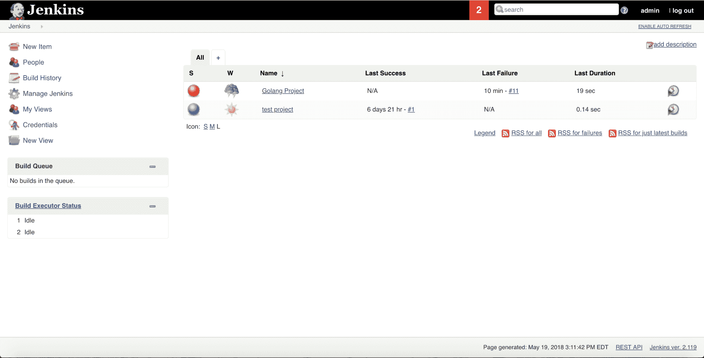
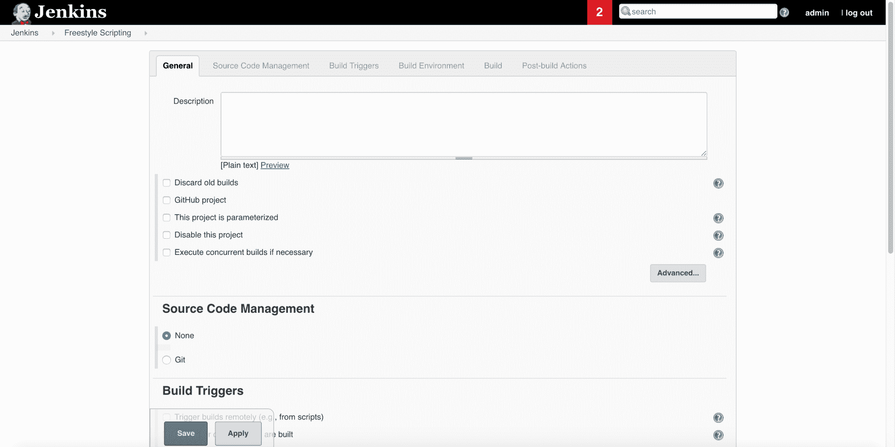
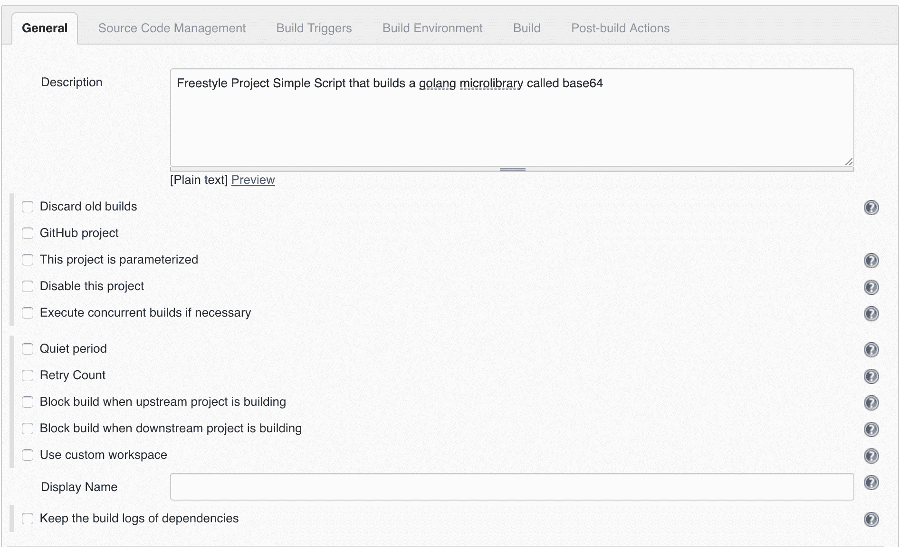
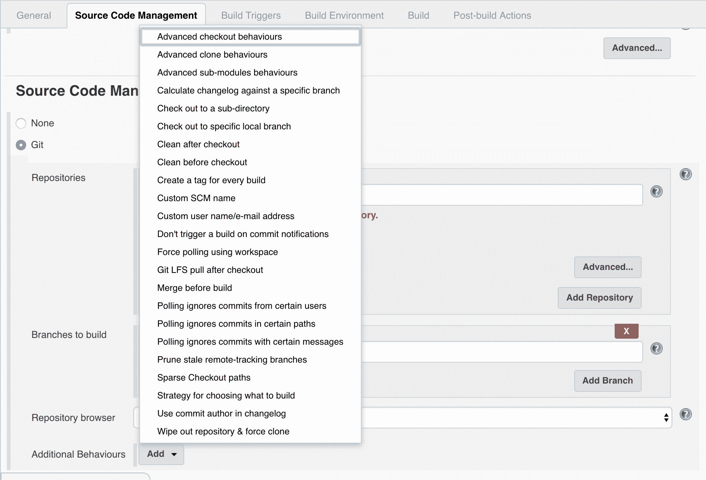
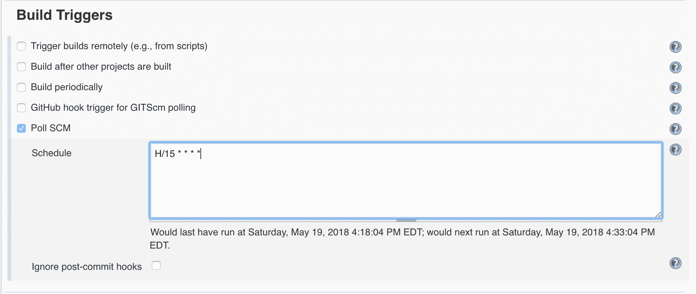
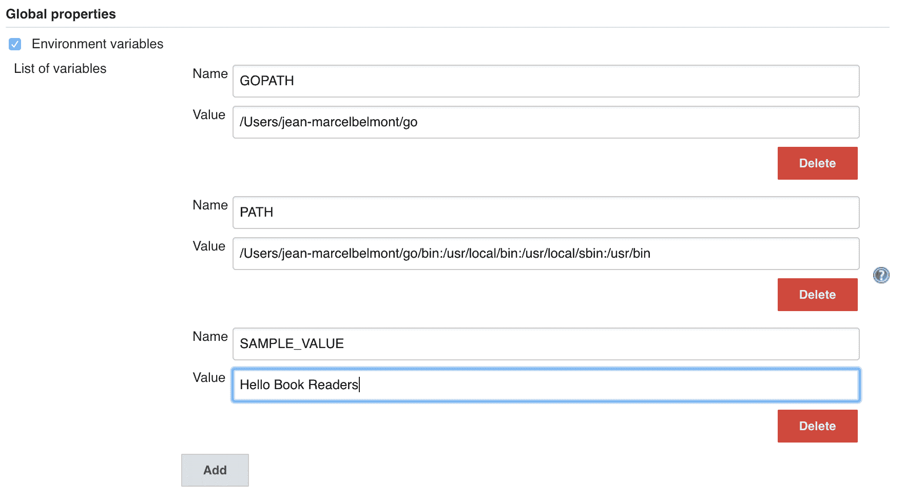
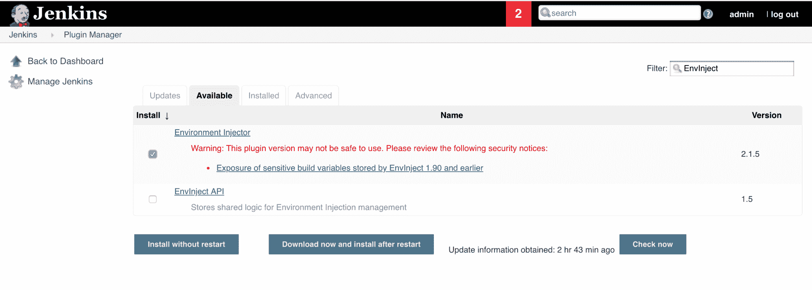
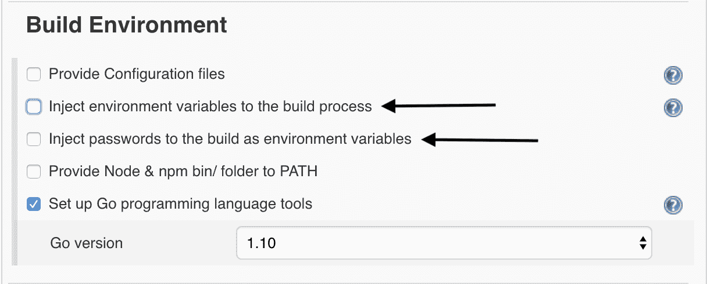

# 六、编写自由式脚本

本章将详细介绍添加新的构建项、配置构建作业、全局添加环境变量以及项目级环境变量。您还将学习如何使用自由作业调试问题。

本章将涵盖以下主题:

*   创建一个简单的自由式脚本
*   配置自由作业
*   添加环境变量
*   用自由作业调试问题

# 技术要求

这一章是关于使用 Jenkins 创建简单的自由式脚本。您应该对 Unix、Bash 以及环境变量的含义有一个基本的了解。

# 创建一个简单的自由式脚本

在本章中，我们在 Jenkins 中创建了一个简单的自由式脚本，但是我们将快速回顾一下设置自由式脚本项目需要做什么。

# Jenkins 仪表板导航

如果您按照[第 5 章](05.html)、*Jenkins 的安装和基础知识*中的说明进行操作，那么您应该在本地计算机上安装和/或运行 Jenkins 服务。如果 Jenkins 没有在本地运行，那么请重温 [第 5 章](05.html)*Jenkins*的安装和基础知识，并阅读与您的操作系统对应的章节。

# Jenkins 登录屏幕

如果 Jenkins 在本地运行，您应该会看到一个登录屏幕。

输入您的用户和密码信息，然后单击登录按钮。

# Jenkins 仪表板

登录后，您应该会被路由到 Jenkins 仪表板，如下所示:



# 添加新的生成作业项

在 Jenkins 仪表板中，有一个名为 New Item 的链接；确保单击它以添加新项目:


单击“新建项目”后，您将进入以下屏幕:


现在，根据您已经安装的 Jenkins 插件的数量，您会在这个屏幕上看到更多或更少的构建项目。为了本章的目的，我们将输入`Freestyle Scripting`的名称，但是您可以为构建作业选择任何您喜欢的名称。输入名称后，确保单击“自由式项目”按钮，然后单击“确定”按钮。

# 构建配置选项

每当您在 Jenkins 下创建新项目时，您都会看到以下屏幕:



根据您已经安装的 Jenkins 插件，您可能会在构建配置中看到更多选项卡或项目。

# 配置自由作业

请注意，构建作业配置有多个选项卡。您可以滚动到选项卡中的每个部分，也可以单击选项卡本身。每个选项卡都有不同的功能，您可以在 Jenkins 构建作业中进行配置。

# 一般

“常规”选项卡包含您正在创建的 Jenkins 版本的基本信息，例如描述和其他常规版本信息。查看常规选项卡信息:



通常由您决定要打开哪些选项；你可以点击问号符号来获取信息。让我们看看静默期选项的含义:


要删除详细信息，只需再次单击问号符号。

# 源代码管理

“源代码管理”选项卡是您指定正在使用的版本控制管理系统类型的地方，例如 Git、SVN 和 Mercurial。出于构建作业的目的，我们将单击 Git 单选按钮并指定 GitHub 存储库 URL:


请注意，分支说明符默认为*/主分支，但是您可以通过单击添加分支按钮来指定任意数量的分支。我们不会添加凭据，因为我们在本地工作，但是如果您单击带有密钥的添加按钮，您将看到以下覆盖屏幕:


您可以通过单击“种类”输入框来选择不同类型的凭据:


您还可以单击源代码管理选项卡底部的添加按钮，您将看到您可以添加的其他行为:



您可以配置许多高级配置选项，如子模块。

# 构建触发器

“生成触发器”选项卡配置部分处理何时配置生成作业触发器。这可能包括配置一个 GitHub 钩子触发器，每当您向 GitHub 中的主分支推送一个提交时，它就会触发；每当构建另一个项目时，当您定期构建时，或者当您轮询您的版本控制系统进行更改时，它会触发一个构建:



我们检查了轮询配置管理选项，在我们的例子中是 GitHub，并利用 cron 语法在特定的时间和日期运行 Jenkins 作业。在我们的例子中，我们将触发轮询作业每 15 分钟运行一次。通过单击问号符号，您可以了解更多关于语法的信息。

Later on, we will discuss how to use GitHub and Bitbucket to trigger jobs in Jenkins whenever you push code up to your remote repository, which is better than polling for changes.

# 构建环境

根据您安装的 Jenkins 插件，本部分将有或多或少的环境选项可供使用。在我的例子中，我安装了 Golang 和 Node.js 插件，但是你可以有任何数量的环境，比如 Clojure 和 Ruby:


由于我们正在构建一个 Golang 微库，因此我们在此配置部分选中了“设置 Go 编程语言工具”复选框。

# 建设

“构建”部分是您指定如何构建项目的地方:


如果单击添加构建步骤按钮，您将看到以下选项:


我们将点击 Execute shell 选项，它将为我们提供一个可以使用的 Unix shell 脚本环境。

请注意，我们现在有了一个文本区域，可以在其中添加 Unix 脚本命令:


我们将在这个 shell 脚本中添加以下命令:`go test`。

# 构建后操作

在此构建部分，您可以指定在成功构建后要运行的任何操作，例如运行代码覆盖率和生成 JUnit 报告:


如果单击添加后期生成操作按钮，您将看到以下选项:


您将看到更多或更少的选项，这取决于您安装的特定 Jenkins 插件。

对构建配置满意后，单击“应用”按钮保存当前配置选项，或单击“保存”按钮保存选项，然后导航到新配置的构建项目:


构建后操作部分很有价值，因为您可以调用其他服务，例如报告和收集成功构建的度量。

# 添加环境变量

您可以通过多种不同的方式在 Jenkins 中添加环境变量。

# 全局环境变量配置

在 Jenkins 仪表板中，单击管理 Jenkins 按钮:


单击管理 Jenkins 按钮后，您需要单击配置系统按钮:


然后，您将导航到“配置系统”部分，并能够使用“全局属性”部分添加环境变量:



请注意，这里我添加了一个名称`SAMPLE_VALUE`，值为`Hello Book Readers`。现在，这个全局属性可以作为 shell 环境变量中的环境变量使用。在本节中，您可以根据需要添加任意多的环境变量。请注意，这个全局属性现在对每个作业都可用。

# 注射外挂程式

您还可以为每个特定的构建项选择更精细的环境变量设置。

通过执行以下步骤，安装环境检测插件([https://wiki.jenkins.io/display/JENKINS/EnvInject+Plugin](https://wiki.jenkins.io/display/JENKINS/EnvInject+Plugin))。单击 Jenkins 主仪表板链接:


确保单击 Jenkins 链接，您将被路由到 Jenkins 仪表板。然后单击管理 Jenkins 按钮，就像您添加全局属性一样。

接下来单击管理插件按钮，如下所示:


现在，您将进入以下屏幕:



请注意，我们单击了可用选项卡，然后将`EnvInject`放入过滤器框。确保单击所需的 Jenkins 插件，然后单击“不重启安装”或“立即下载并重启后安装”按钮。

请注意，我们现在在构建配置区域的构建环境部分有几个新的构建选项:



如果您单击将环境变量注入到构建过程中，则可以添加新的环境变量，如下所示:


请确保保存您的更改。需要注意的一点是，这个环境变量只针对这个特定的构建项；它不像我们之前设定的那样是全球性的。

# 用自由作业调试问题

每当您在 Jenkins 中为构建项运行构建时，您都可以通过单击您想要查看的特定构建作业来查看构建的所有细节。

# 生成项目视图

以下是您需要关注的构建历史:


现在，如果您点击一个实际的构建，您将进入以下屏幕:


如果单击控制台输出链接，您将看到一个详细的配置项构建日志，其中显示了配置项服务器执行的所有步骤。记得我们写了一个自由式 shell 脚本。我正在添加 shell 脚本的内容，供您查看:

```
echo "$SAMPLE_VALUE"
echo "$ANOTHER_SAMPLE_NAME"
go test
```

请注意，这里我添加了我们之前定义的两个不同的环境变量，我只是将它们发送到标准输出。

现在，如果您查看构建作业的输出，您将看到以下输出:


请注意，Jenkins 通过以当前登录用户的身份运行来启动作业。接下来，EnvInject 插件运行并注入我们在项目中指定的任何环境变量。然后 Jenkins 从 GitHub 存储库中获取最新的更改。然后环境测试插件再次运行，并注入任何必要的环境变量。

最后一个操作是 shell 脚本的实际执行。在前面的截图中需要注意的一点是，shell 脚本中的每个命令都被打印为标准输出，因为在 Jenkins 中启用了执行跟踪。请记住，执行跟踪只是意味着您在 shell 脚本中运行的每个命令都将显示，以及命令本身的输出。例如，值为``echo "Hello Book Readers"``的``echo "$ANOTHER_SAMPLE_NAME"``命令被打印到标准输出，然后消息`Hello Book Readers`被打印。最后要注意的是版本中有文本 **PASS** ，文本以 **SUCCESS** 结束。

# 自由式脚本的调试问题

请注意我们是如何注销包含简单信息的环境变量的。如您所料，有时在配置项环境中没有设置值，而这正是将值记录到标准输出非常有用的地方。使用 EnvInject 插件的一个好处是，它可以屏蔽您在构建作业中输入的密码，这样您就不会意外地记录机密或机密信息:


请注意，在前面的截图中，我们已经检查了将密码作为环境变量注入到构建中，并为环境变量指定了名称和密码。如果你在构建工作中不小心做了`echo $SecretName`，它会屏蔽`$SecretName`的值，这样你就不会在构建中泄露机密信息。

# 摘要

在本章中，您了解了更多关于 Jenkins 仪表板的信息。您了解了添加构建作业项和配置自由构建作业的所有部分，如何向 Jenkins 作业中添加环境变量，以及如何在自由构建作业中调试问题。

下一章将介绍如何构建一个 Jenkins 插件，并将具体介绍构建过程，包括编写 Java 代码和使用 Maven 构建工具。

# 问题

1.  为什么在构建配置中单击问号符号有用？
2.  如果您想在构建触发器部分轮询您的版本控制系统，您会编写什么类型的语法？
3.  在构建环境中可以使用多种编程语言吗？
4.  自由式脚本在什么类型的环境中运行——是 Unix 环境吗？
5.  全局属性和项目级环境变量有什么区别？
6.  你认为 Jenkins 为什么对控制台输出使用执行跟踪？
7.  构建配置中的构建后操作部分有什么价值？

# 进一步阅读

请查看帕克特出版的*与 Jenkins 学习持续整合-第二版*([https://www.amazon.com/dp/1788479351](https://www.amazon.com/dp/1788479351))。