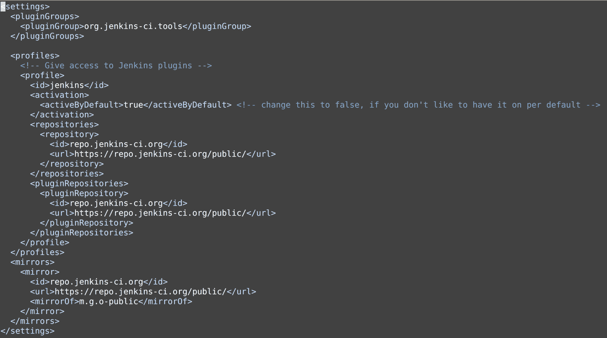
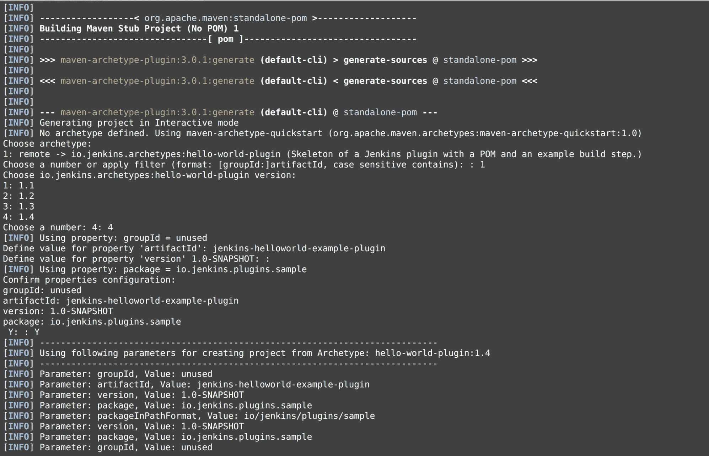
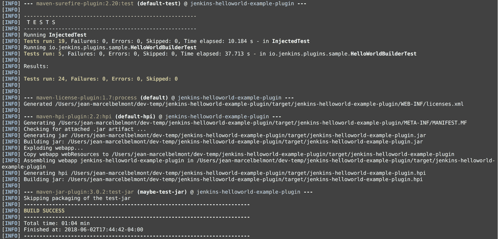
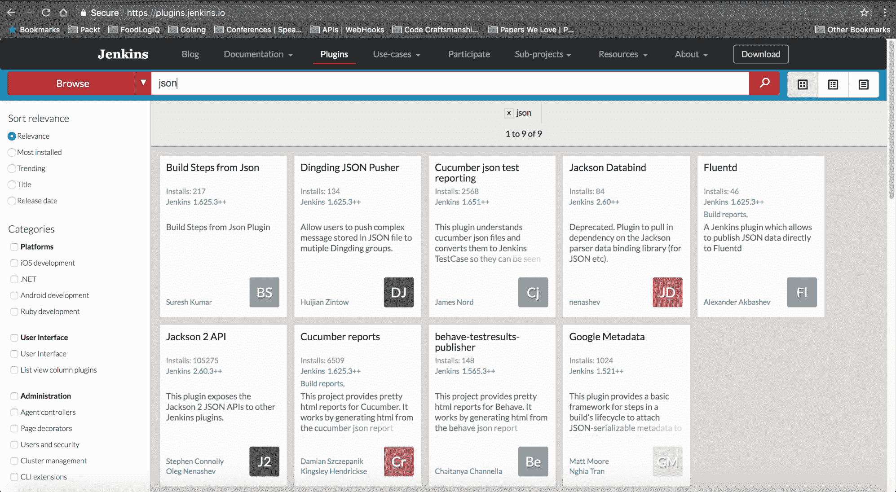

# 七、开发插件

本章将详细介绍 Jenkins 中的插件，我们将首先了解如何在 Windows、Linux 和 macOS 中设置 Maven。然后我们将通过为 Jenkins 创建一个`Hello World`插件来研究插件开发，然后我们将简要地研究 Jenkins 插件站点，以及如何导航和使用它来找到各种各样的插件。

本章将涵盖以下主题:

*   Jenkins 插件解释道
*   构建一个简单的 Jenkins 插件
*   Jenkins 插件开发
*   Jenkins 插件生态系统

# 技术要求

这一章是关于在 Jenkins 中构建插件的，您需要对 Java 编程语言有一个基本的了解，并理解像 Maven 这样的构建工具的目的。

# Jenkins 插件解释道

Jenkins CI 已经提供了某些功能，包括构建、部署和自动化软件项目。Jenkins 中的大型插件生态系统通常会提供您想要从 Jenkins 中获得的任何额外行为。

# 为什么插件有用？

软件中插件/扩展的目的是给软件组件添加特定的功能。像 Chrome 这样的网络浏览器有扩展浏览器功能的扩展，火狐有和 Chrome 中的扩展一样的附加组件。在其他软件系统中也存在插件，但是我们将特别关注 Jenkins 中的插件。

# Jenkins 插件文档

转到插件索引，找到您需要的任何插件，我们将在本章的后面一节讨论这个问题。如果您访问 Jenkins 维基中的插件教程，您将获得创建 Jenkins 插件的完整说明。Jenkins 维基之外也有你可以使用的教程。你可以去 Jenkins 原型回购`Hello World`插件的例子。

# 在 Jenkins 安装插件

您需要导航到 Jenkins 仪表板中的管理 Jenkins 链接:


单击管理 Jenkins 链接后，您将被路由到以`manage`结尾的网址路径，如`http://localhost:8080/manage`，或其他某个域，具体取决于您是否在本地运行 Jenkins。您需要单击“管理插件”链接，然后确保单击“已安装”选项卡和/或筛选您想要安装的任何插件。我们之前已经讨论过这个问题，但是我们会像安装其他 Jenkins 插件一样安装我们自己的 Jenkins 插件。

# 构建一个简单的 Jenkins 插件

创建 Jenkins 插件有几个先决条件。您将需要安装 Java，如果您一直这样做的话，应该已经安装了。您还需要安装 Maven 软件项目管理工具([https://maven.apache.org/](https://maven.apache.org/))。

# Java 安装

您需要确保安装了 Java 1.6 或更高版本，如果可以的话，我建议您安装 Java 1.9。要安装 Java，请前往 Java 下载页面([http://www . Oracle . com/tech network/Java/javase/downloads/index . html](http://www.oracle.com/technetwork/java/javase/downloads/index.html)):


确保单击“接受许可协议”单选按钮，然后单击“窗口”。下载并确保选择正确的架构；即 32 位或 64 位操作系统。

安装 Java 后，只需使用以下命令验证安装:

```
java -version
```

这应该会返回已安装的当前版本的 Java。

# Maven 安装说明

要安装 Maven，请转到 Maven 安装页面([https://maven.apache.org/install.html](https://maven.apache.org/install.html))并确保遵循给定操作系统的说明。

# Windows 安装

您可以在 Windows 上以几种不同的方式安装 Maven，但请确保至少安装了 Windows 7 操作系统和 Java **软件开发工具包** ( **SDK** ) 1.7 或更高版本。如果您已经学习了[第 5 章](05.html)、*安装和 Jenkins 的基础知识*，那么您应该已经安装了 Java。

# 通过巧克力包管理器安装 Maven

如果您已经在巧克力安装([https://chocolatey.org/install](https://chocolatey.org/install))上安装了巧克力包管理器，那么您可以简单地运行以下命令:

```
choco install maven
```

您也可以从 Maven 安装页面([https://maven.apache.org/install.html](https://maven.apache.org/install.html))下载 Maven 二进制可执行文件，并且您还需要找到 Java 环境变量的值。您可以通过在命令提示符下运行以下命令来找到这一点:

```
echo %JAVA_HOME%
```

然后，您需要通过执行以下操作来运行将这个 Maven 二进制可执行文件添加到窗口路径:

1.  右键单击我的电脑
2.  单击属性
3.  点击高级系统设置

4.  单击环境变量
5.  点击新的用户变量，添加 Maven_Home 值`C:\apache-maven-3.5.3`
6.  用`%Maven_Home%\bin`将其添加到路径变量中
7.  打开命令提示符，在桌面上询问`mvn -version`

# 通过 Maven 源代码安装 Maven

首先确保您已经安装了 Java SDK，您可以在命令提示符下确认:

```
echo %JAVA_HOME%
```

这将打印出您已经安装的当前版本的 Java。接下来，从 Maven 源代码存储库中([https://gitbox.apache.org/repos/asf?p=maven-sources.git](https://gitbox.apache.org/repos/asf?p=maven-sources.git))下载 Maven 源代码，然后在您的 Windows 操作系统中的合适位置解压缩 Maven 源代码。

`C:\Program Files\Apache\maven` is a possible location that you could use.

# Windows 操作系统的环境变量设置

您需要使用系统属性将`M2_HOME`和`MAVEN_HOME`变量添加到您的 Windows 环境中，并且您需要将环境变量指向您的 Maven 文件夹。

通过添加 Maven `bin`文件夹`%M2_HOME%\bin`来更新 PATH 变量，这样您就可以在系统的任何地方运行 Maven 可执行文件。

要验证 Maven 是否正确运行，请在命令提示符下运行以下命令:

```
mvn --version
```

该命令应该显示当前的 Maven 版本、Java 版本和操作系统信息。

# macOS 安装

您需要确保 Java SDK 安装在 macOS 操作系统中。如果你在 [第 5 章](09.html)*安装和 Jenkins*基础部分跟着学，那么你应该已经安装了 Java。

# 通过自制软件包管理器安装 Maven

首先，通过在 Mac 终端应用中运行以下命令，确保安装了 Java:

```
java -version
java version "1.8.0_162"
Java(TM) SE Runtime Environment (build 1.8.0_162-b12)
Java HotSpot(TM) 64-Bit Server VM (build 25.162-b12, mixed mode)
```

您需要在系统上安装 Java 1.7 或更高版本。

接下来，如果您安装了自制软件包管理器([https://brew.sh/](https://brew.sh/))，那么您可以通过在您的 Mac 终端应用中发出以下命令来轻松安装 Maven:

```
brew install maven
```

确保在`.bashrc`或`.zshrc`文件中设置了以下环境变量:

```
export JAVA_HOME=`/usr/libexec/java_home -v 1.8`
```

通过在您的苹果终端中运行以下命令，确保已经正确安装了 Maven:

```
mvn --version
Apache Maven 3.5.3 (3383c37e1f9e9b3bc3df5050c29c8aff9f295297; 2018-02-24T14:49:05-05:00)
Maven home: /usr/local/Cellar/maven/3.5.3/libexec
Java version: 1.8.0_162, vendor: Oracle Corporation
Java home: /Library/Java/JavaVirtualMachines/jdk1.8.0_162.jdk/Contents/Home/jre
Default locale: en_US, platform encoding: UTF-8
OS name: "mac os x", version: "10.13.4", arch: "x86_64", family: "mac"
```

注意这里`mvn`二进制可执行文件打印出了安装的 Maven 版本、Java 版本和特定于操作系统的信息。

# Unix 安装

我们将在 Ubuntu 16.04 数字海洋小滴上安装 Maven，但是您应该能够在其他 Linux 发行版上运行类似的命令。请按照说明在您的特定 Linux 发行版上安装 Maven。

# 通过 apt-get 包管理器安装 Maven

确保您的 Linux 发行版中安装了 Java，您可以通过在终端外壳中运行以下命令来进行检查:

```
java -version
openjdk version "9-internal"
OpenJDK Runtime Environment (build 9-internal+0-2016-04-14-195246.buildd.src)
OpenJDK 64-Bit Server VM (build 9-internal+0-2016-04-14-195246.buildd.src, mixed mode)
```

如果尚未安装 Java，则运行以下命令:

```
sudo apt-get update && sudo apt install openjdk-9-jre
```

接下来，通过在终端应用中运行以下命令来安装 Maven:

```
sudo apt-get install maven
```

接下来，您需要确保您的`JAVA_HOME`环境变量已经设置。由于我们在 Ubuntu Linux 操作系统中安装了 Java 1.9，我们将运行以下命令:

```
export JAVA_HOME=/usr/lib/jvm/java-1.9.0-openjdk-amd64/
```

The directory that you use could be different, but if you do not set this environment variable, then Maven will report this as a warning.

通过在终端应用中运行以下命令，检查 Maven 是否已正确安装:

```
mvn --version
Apache Maven 3.3.9
Maven home: /usr/share/maven
Java version: 9-internal, vendor: Oracle Corporation
```

```
Java home: /usr/lib/jvm/java-9-openjdk-amd64
Default locale: en_US, platform encoding: UTF-8
OS name: "linux", version: "4.4.0-127-generic", arch: "amd64", family: "unix"
```

Notice here that the Maven binary executable printed out the current Maven version installed, the current Java version installed, and OS-specific information, just like the Windows and Mac operating systems.

# Jenkins 插件开发

Jenkins 插件的设置、运行和安装需要几个步骤。

# Maven 设置文件

根据您当前的操作系统，您需要创建/编辑`.m2/settings.xml`文件。

Windows 用户在命令提示符下发出以下命令，即可找到`settings.xml`文件:

```
echo %USERPROFILE%\.m2\settings.xml
```

Mac 操作系统用户可以在`~/.m2/settings.xml` *中编辑/创建`settings.xml`文件。*

The settings element in the `settings.xml` file contains elements used to define values that configure Maven execution in various ways, such as `pom.xml`, but should not be bundled to any specific project, or distributed to an audience. These include values such as the local repository location, alternate remote repository servers, and authentication information.

将以下内容放入`settings.xml`文件:



请注意，我们在这里输入了与 Jenkins 插件相关的特定信息。

It is highly encouraged that you set your `settings.xml` file to get your Jenkins plugins working correctly!

# HelloWorld Jenkins 插件

为了创建一个 Jenkins 插件，你将需要使用 Maven 原型，你可以在这里阅读(https://Maven . Apache . org/guides/introduction/introduction-to-prototes . html)。

为了生成 Jenkins`Hello World`插件，我们将发出以下命令:

```
mvn archetype:generate -Dfilter=io.jenkins.archetypes:hello-world
```

下面是我创建插件时运行的一个示例会话:



注意这里我输入了`1`作为原型，然后我选择了一个插件版本的`4`，并且定义了一个值`jenkins-helloworld-example-plugin`，然后点击*输入*作为默认值:


If all goes successfully, you should get the output of `BUILD SUCCESS` in Command Prompt.

您需要确保可以构建您的 Jenkins 插件，因此请确保在命令提示符下运行以下命令:

```
// First go into the newly created directory
cd jenkins-helloworld-example-plugin
// Then run the maven build command
mvn package
```

`mvn package`命令将创建一个`target`目录，并将运行您在该目录中创建的任何测试:



Notice here that the Jenkins archetype actually created some tests for our `Hello World` Jenkins plugin example.

# 文件夹布局说明

以下是新创建的`jenkins-helloworld-example-plugin`目录截图:


`src`目录包含 Jenkins 插件的源文件以及插件的测试。

目标目录是用`mvn`包生成的。还有一个`pom.xml`文件，是 Maven 在我们运行原型子命令时创建的。

A **Project Object Model** (**POM**) is the fundamental unit of work in Maven. It is an XML file that contains information about the project and configuration details used by Maven to build the project. It contains default values for most projects. Examples for this include the build directory, which is `target`, the source directory, which is `src/main/java`, and the test source directory, which is `src/test/java`.

# Jenkins 插件源代码解释

正如我们前面提到的，`src`目录包含 Jenkins 插件的源文件。为了在 Jenkins 中构建插件，您需要用 Java 编程语言编写。教授 Java 编程语言超出了本书的范围，但是我们将简要讨论 Maven 为我们创建的一些文件。

请注意，Maven 创建了一个相当长的目录结构，这很常见，因此`helloworld`插件的目录结构是`./src/main/java/io/jenkins/plugins/sample/HelloWorldBuilder.java`。测试文件本身在`./src/test/java/io/jenkins/plugins/sample/HelloWorldBuilderTest.java`。

我在这里包含了`HelloWorldBuild.java`类的源代码:

```
package io.jenkins.plugins.sample;

import hudson.Launcher;
/* More Import Statements Here */

public class HelloWorldBuilder extends Builder implements SimpleBuildStep {

    /* Rest of methods in Github Source */

    @Override
    public void perform(Run<?, ?> run, FilePath workspace, Launcher launcher, TaskListener listener) throws InterruptedException, IOException {
        if (useFrench) {
            listener.getLogger().println("Bonjour, " + name + "!");
        } else {
            listener.getLogger().println("Hello, " + name + "!");
        }
    }

    @Symbol("greet")
    @Extension
    public static final class DescriptorImpl extends BuildStepDescriptor<Builder> {

        /* Rest of the source in Github */
}

```

注意`HelloWorldBuilder`类扩展了`Builder`类，是一个 Jenkins 核心类；还要注意，我们正在使用一个名为`BuildStepDescriptor`的类，这也是一个 Jenkins 类。这个文件的源代码可以在我的 GitHub 资源库`HelloWorldBuilder.java`([https://GitHub . com/jbelmont/Jenkins-plugin-example/blob/master/src/main/Java/io/Jenkins/plugins/sample/helloworldbuilder . Java](https://github.com/jbelmont/jenkins-plugin-example/blob/master/src/main/java/io/jenkins/plugins/sample/HelloWorldBuilder.java))文件中看到。

对于`HelloWorldBuilderTest.java`、中的测试用例，我们使用 JUnit，这是一个流行的 Java 编程语言的单元测试库。

```
package io.jenkins.plugins.sample;

import hudson.model.FreeStyleBuild;
/* More Import Statements Here */

public class HelloWorldBuilderTest {

    @Rule
    public JenkinsRule jenkins = new JenkinsRule();

    final String name = "Bobby";

    @Test
    public void testConfigRoundtrip() throws Exception {
        FreeStyleProject project = jenkins.createFreeStyleProject();
        project.getBuildersList().add(new HelloWorldBuilder(name));
        project = jenkins.configRoundtrip(project);
        jenkins.assertEqualDataBoundBeans(new HelloWorldBuilder(name), project.getBuildersList().get(0));
    }

    /* More test Cases in this file. */

}
```

前面的 Java 测试文件有注释，如`@Rule`、`@Override`、`@Test`和`@DataBoundSetter`，它们是元数据的一种形式，提供关于程序本身以外的数据。注释对它们注释的代码的操作没有直接影响。这个文件的源代码可以在我名为`jenkins-plugin-example`的 GitHub 存储库中的`HelloWorldBuilderTest.java`文件中看到([https://GitHub . com/jbelmont/Jenkins-plugin-example/blob/master/src/test/Java/io/Jenkins/plugins/sample/helloworldbuilddertest . Java](https://github.com/jbelmont/jenkins-plugin-example/blob/master/src/test/java/io/jenkins/plugins/sample/HelloWorldBuilderTest.java))。

# 构建 Jenkins 插件

为了构建一个 Jenkins 插件，你需要在插件目录中运行`mvn install`命令。

`mvn install` 命令将构建和测试 Jenkins 插件，更重要的是，创建一个名为`pluginname.hpi`的文件；或者，在我们的例子中，它将在`target`目录中创建一个名为`jenkins-helloworld-example-plugin.hpi`的文件，我们可以用它来部署到 Jenkins。

我在下面的截图中附上了一个示例安装运行:


Notice that this run finished by installing our Jenkins plugin into several locations, which we will use to install our Jenkins plugin.

# 安装 Jenkins 插件

现在，为了安装新构建和安装的`HelloWorld`示例插件，我们需要转到 Jenkins 仪表板|管理 Jenkins|管理插件视图，然后单击高级选项卡。如有必要，请参考*环境测试插件*部分的[第 6 章](06.html)、*编写自由式脚本*了解更多详细信息。也可以通过转到`scheme://domain/pluginManager`直接转到插件部分；或者，如果你在本地经营 Jenkins，就去`http://localhost:8080/pluginManager/`。

然后确保点击高级选项卡或进入`http://localhost:8080/pluginManager/advanced`:


然后，您需要转到*上传插件*部分:


点击选择文件，然后找到我们新创建的`Helloworld`Jenkins 插件，应该在目录中:

```
jenkins-helloworld-example-plugin/target/jenkins-helloworld-example-plugin.hpi
```

然后确保单击上传按钮。

以下是新安装的`Helloworld`示例插件的截图:


# Jenkins 插件生态系统

Jenkins 有各种各样的插件，你可以在 Jenkins 插件网站([https://plugins.jenkins.io/](https://plugins.jenkins.io/))找到完整的列表。

# 可用插件列表

下面的截图显示了在 Jenkins 中与 JSON 相关的插件搜索:



请注意，除了这个默认视图之外，Jenkins 插件站点还有多个视图可供您使用:


请注意，我单击了中间的图标，但是您也可以单击最右边的图标来获得一个小的轮廓视图。搜索默认为相关的搜索项目，但您可以选择不同的搜索标准，如“安装次数最多”、“趋势”和“发布日期”。

# 摘要

在本章中，您学习了 Java 的 Maven 构建工具，以及如何为 Windows、Linux 和 macOS 安装它。您还学习了如何使用 Maven 构建工具创建 Jenkins 插件，我们简要讨论了一些 Java 语法，以及如何使用 Jenkins 仪表板中管理插件 UI 中的高级选项安装 Jenkins 插件。我们还研究了 Jenkins 插件生态系统。

# 问题

1.  我们用来创建 Jenkins 插件的构建工具是什么？
2.  在 Windows 操作系统中，我们使用了哪个包管理器来安装 Maven？
3.  在 macOS 操作系统中，我们使用了哪个包管理器来安装 Maven？
4.  我们在`HelloWorld`插件中简要讨论的配置文件的名称是什么？
5.  为了在 Jenkins 管理插件，我们可以直接导航到的网址是什么？
6.  在 Maven 中，我们用来构建和安装 Jenkins 插件的命令是什么？
7.  Maven 为我们创建了什么类型的文件，以便我们可以安装一个 Jenkins 插件？

# 进一步阅读

请查看扩展 Jenkins([https://www . Amazon . com/DP/b015 cybp2a/ref = DP-kindle-redirect？_encoding=UTF8 & btkr=1](https://www.amazon.com/dp/B015CYBP2A/ref=dp-kindle-redirect?_encoding=UTF8&btkr=1) ，作者:Packt Publishing，了解更多关于 Jenkins 插件的信息。