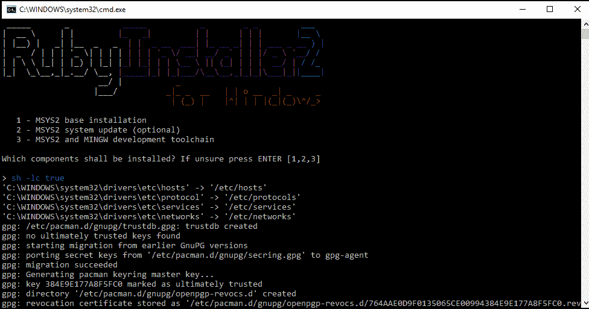
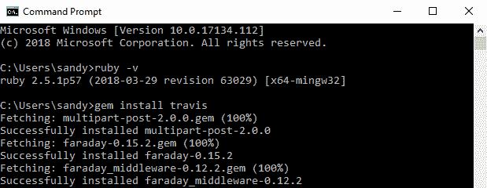
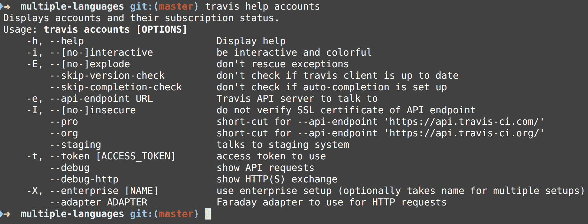
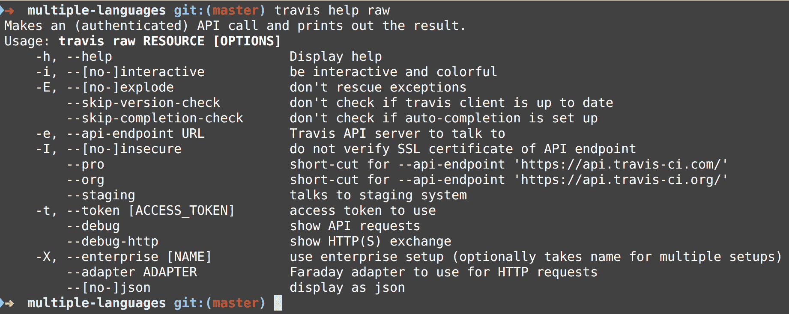
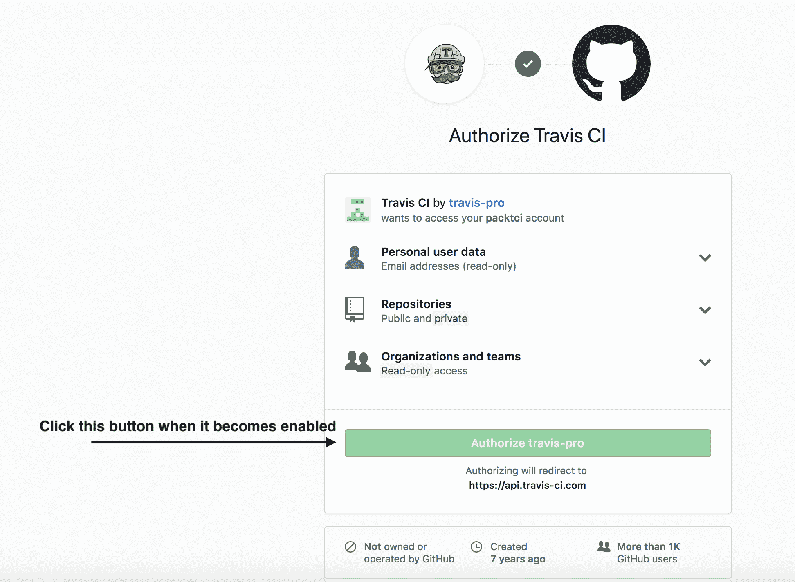
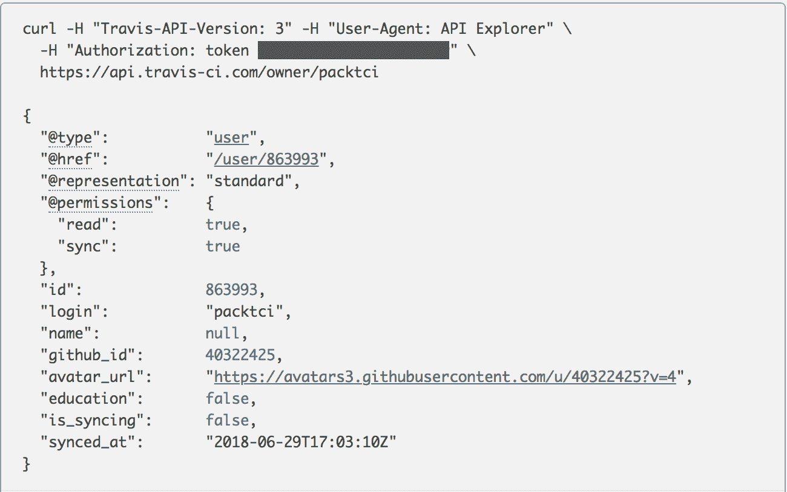
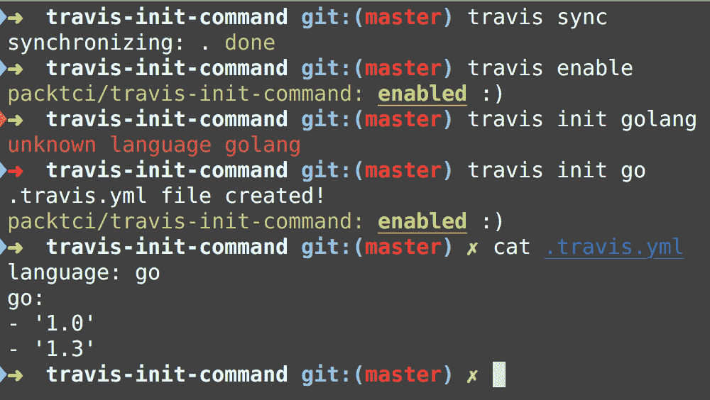
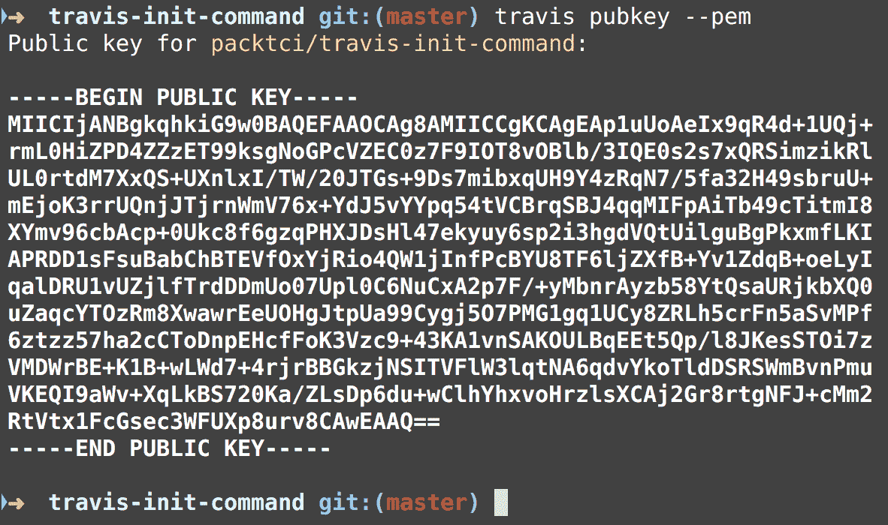

# 十、Travis CLI命令和自动化

在前一章中，我们向您展示了如何在软件项目中配置 Travis CI，并解释了如何使用 Travis CI 的基础知识。本章将帮助您在操作系统上安装 Travis CLI，我们将介绍 Travis CI 中的所有不同类型的命令，例如通用 API 命令、存储库命令等。我们将讨论 CLI 命令可以使用的不同选项，还将详细讨论每个命令的含义。我们还将研究通过使用我们的访问令牌和 curl REST 客户端直接使用 Travis API。我们也将简要地看一下Travis专业版和企业版。

本章将涵盖以下主题:

*   Travis命令行界面安装
*   Travis命令行界面命令

# 技术要求

本章将需要一些基本的 Unix 编程技能和关于使用命令行终端应用的知识。如果您在 Windows 操作系统中，则考虑使用命令提示符或 PowerShell 应用。如果您在 macOS 操作系统上，则使用默认情况下为您安装的终端应用。如果您使用的是 Linux，那么您应该已经安装或提供了终端。

# Travis命令行界面安装

安装 Travis CLI 的第一个先决条件是在您的操作系统上安装 Ruby([https://www.ruby-lang.org/en/documentation/installation/](https://www.ruby-lang.org/en/documentation/installation/))，并确保它是 1.9.3 版或更高版本。

您可以通过在命令外壳或终端中运行以下命令来检查是否安装了 Ruby:


# Windows 安装

位于[https://github.com/travis-ci/travis.rb#windows](https://github.com/travis-ci/travis.rb#windows)的 Travis CLI 用户文档建议您使用 RubyInstaller([http://rubyinstaller.org/](http://rubyinstaller.org/))在 Windows 操作系统上安装最新版本的 Ruby。

我们需要在 RubyInstaller 下载站点挑选 Ruby Devkit 版本 2.5.1，然后确保接受许可协议，然后为安装选择合适的选项。确保安装开发工具链。

当安装程序窗口关闭时，将会打开一个命令提示符，您需要选择一个选项；您只需按 enter 键即可在系统上安装所有三个选项。安装过程可能需要一段时间才能完成。我的更新 GPG 密钥和安装 Ruby 编程语言所需的其他依赖项花费了大约 20 分钟:



正如我们所料，我们的系统上安装了 Ruby 2 . 5 . 1 版:


在这一步中，我们在 Windows 命令提示符下安装 Travis RubyGems:



在这最后一步中，我们验证 Travis CLI RubyGem 是否安装在我们的系统上；它报告版本`1.8.8`:


# Linux 安装

Linux 操作系统有多个不同的包管理器，因此如何在系统上安装 Ruby 取决于您特定的 Linux 操作系统。我们将在一个数字海洋服务器中的 Ubuntu 14.04 上安装 Ruby 和 Travis 命令行界面:

1.  要在 Ubuntu 上安装 Ruby，请运行以下命令:

```
sudo apt-get install python-software-properties
sudo apt-add-repository ppa:brightbox/ruby-ng
sudo apt-get update
sudo apt-get install ruby2.1 ruby-switch
sudo ruby-switch --set ruby2.1
```

2.  接下来，通过运行以下命令来确认 Ruby 已安装:


3.  接下来，我们需要使用以下命令安装 Travis CLI RubyGem:

```
gem install travis -v 1.8.8 --no-rdoc --no-ri
```

4.  最后一步是检查Travis命令行界面是否安装了以下命令:

```
travis version
1.8.8
```

# macOS 安装

您需要安装 Xcode 命令行工具，可以使用以下命令来完成:

```
xcode-select --install
```

If you already have the Xcode Command Line tools installed, you will see the following information displayed in the Terminal: 


Ruby 预装在当前的 macOS 操作系统上，因此您只需运行以下命令即可安装 Travis CLI:


Here I used `sudo` because I needed elevated administrator privileges to install RubyGem.

如果您在终端中看到以下消息，您将知道 Travis CLI 已安装:


Here that I am using Travis CLI version `1.8.8` but your particular version could be different.

# Travis命令行界面命令

Travis CLI 功能全面，GitHub 中有 Travis API([https://github.com/travis-ci/travis-api](https://github.com/travis-ci/travis-api))，并且有以下三种不同形式的 CLI 命令:

*   **非 API 命令**:
    *   非 API 命令文档([https://github.com/travis-ci/travis.rb#non-api-commands](https://github.com/travis-ci/travis.rb#non-api-commands))
    *   这些命令包括`help`和`version`，不直接命中 Travis CI API
*   **通用 API 命令**:
    *   通用应用编程接口命令文档([https://github.com/travis-ci/travis.rb#general-api-commands](https://github.com/travis-ci/travis.rb#general-api-commands))
    *   这些命令直接命中 Travis API，并从非 API 命令继承所有选项
*   **储存库命令**:
    *   存储库命令文档([https://github.com/travis-ci/travis.rb#repository-commands](https://github.com/travis-ci/travis.rb#repository-commands)[)](https://github.com/travis-ci/travis.rb#repository-commands)
    *   这些命令具有常规 API 命令所具有的所有选项，此外，您还可以指定要与之对话的回购所有者/名称

Travis CLI 库是用 Ruby 编程语言编写的，如果您想直接与它交互，请准备好在 GitHub([https://github.com/travis-ci/travis.rb#ruby-library](https://github.com/travis-ci/travis.rb#ruby-library))的 *Ruby 库*部分阅读更多内容。

我们将使用在[第 9 章](09.html)、*中创建的`packtci`GitHub([https://github.com/packtci](https://github.com/packtci))用户，以及在*创建 GitHub 帐户*部分创建的`packtci` Travis CI 帐户，以及在[第 9 章](09.html)、*Travis CI 的安装和基础知识*中创建的*Travis CI 帐户*部分。*

# 非应用编程接口命令

非 API Travis命令行界面命令包括`help`和`version`命令。这些命令不会直接命中 Travis API，而是打印出关于 Travis CLI 的有用信息。

# 打印帮助信息

`help`命令将显示特定命令采用的参数和选项。

在下面的截图中，我们在命令行终端中运行`travis help`命令:


如果你想获得特定命令的帮助，那么你只需要使用`travis help COMMAND`。

以下是 Travis 中`whoami`命令的更多信息截图:


# 打印版本信息

`version`命令显示系统上安装的当前Travis命令行界面客户端。以下截图显示了Travis命令行界面的当前客户端版本`1.8.8`:


# 应用编程接口命令

应用编程接口命令直接命中Travis应用编程接口，有些命令要求您有一个适当的访问令牌，您可以使用`travis login`命令获得该令牌。

# 登录到TravisCI

`login`命令通常是您需要使用的第一个命令，以便使用Travis应用编程接口，因为它使用Travis应用编程接口对您进行身份验证。

`login`命令会询问您的 GitHub 用户名和密码，但不会将这些凭据发送给 Travis CI。相反，它使用您的用户名和密码创建一个 GitHub API 令牌，然后向 Travis API 显示该令牌，然后运行一系列检查以确保您是您所说的那个人。然后它会给你一个Travis API 的访问令牌作为回报，最后Travis客户端会再次删除 GitHub 令牌。一旦您成功运行`travis login`命令，所有这些步骤都会在引擎盖下进行。

下面的截图显示了我们尝试运行`travis accounts`命令的地方，它通知我们我们需要登录:


在下面的截图中，我们运行`travis login`命令并提供 GitHub 用户名和密码:


现在我们已经成功登录到 Travis CI 系统，Travis CI 已经向我们颁发了访问令牌。

# 显示当前访问令牌

`token`命令对显示当前访问令牌很有用。出于安全目的，屏幕截图中有一个访问令牌已灰显:


# 注销Travis CI

`logout`命令会将您从 Travis CI 中注销，并移除您的访问令牌。

请注意，在下面的截图中，当我们启动`travis logout`命令后，`travis token`命令显示我们需要重新登录:


我们需要重新登录Travis CI，以便再次获得令牌。在下面的截图中，我们重新登录到 Travis，然后获得另一个访问令牌，这样我们就可以向 Travis API 发出命令:


# 显示帐户信息

`accounts`命令用于列出您可以为其设置存储库的所有帐户。请记住，当我们之前运行此命令时，Travis 通知我们需要登录 Travis 才能执行此命令。在下面的截图中，Travis 通知我们，我们在 Travis 中订阅了四个不同的存储库:


# 显示 Travis 命令的帮助信息

请记住，通过运行以下命令，我们可以在 Travis 中找到特定命令的所有选项:

```
travis help
```

在下面的截图中，我们运行`accounts`命令的`help`命令:



有一个名为`--debug`的选项，我们将使用它来调试向 Travis API 发出的 HTTP 请求。在下面的截图中，我们获得了关于向 Travis 发出的请求的附加信息，例如端点命中`GET "accounts/" {:all=>true}`以及其他信息:


# 交互式控制台会话

`console`命令将您带入一个交互式 Ruby 会话，所有实体都导入到全局名称空间中，并确保您已经通过 Travis 的身份验证，并且您的设置是正确的。在下面的截图中，我按下了*选项卡*，并在控制台会话中自动完成:


还要注意，当前登录的用户是`packtci`。

# 打印应用编程接口端点信息

`endpoint`命令打印出我们正在使用的 API 端点。请注意，我们在截图中使用的是 Travis API 的免费开源版本:


Travis 的 PRO 版本在[https://api.travis-ci.com/](https://api.travis-ci.com/)使用以下端点。

# 对当前正在运行的所有配置项构建进行实时监控

`travis monitor`命令将对登录帐户中的所有配置项构建进行实时监控。在下面的截图中，目前 Travis CI 中没有发生任何活动:


让我们为`puppeteer-headless-chrome-travis-yml-script`repo([https://github . com/packtci/puppeter-headless-chrome-Travis-yml-script](https://github.com/packtci/puppeteer-headless-chrome-travis-yml-script))添加一个单元测试用例，然后将这个变更推送到 GitHub 版本控制系统中。在下面的截图中，我们将一个变更推送到存储库中:


现在，如果我们回到 Travis 监视器正在运行的终端会话，我们将看到构建已经启动，然后它被传递:


We have a build job of `2.1`; in the `.travis.yml` file we did not specify any other build jobs so Travis CI bundled all of the build jobs into one build job.

你可以在[https://docs.travis-ci.com/user/build-stages/](https://docs.travis-ci.com/user/build-stages/)T2 阅读更多关于 Travis CI 构建阶段的内容。

# 启动TravisCI应用编程接口调用

您可以使用`travis raw RESOURCE`命令启动对Travis应用编程接口的直接应用编程接口调用。请记住，我们总是可以使用`travis help COMMAND`来了解如何在Travis命令行界面中使用特定的命令。在下面的截图中，我们为`raw`命令运行了`help`命令:



现在我们已经知道如何运行`raw`命令，让我们向 Travis API 中的这个端点发出一个请求:

```
GET /config
```

如果您想查看 Travis API 的开发人员文档，那么您需要访问位于[https://developer.travis-ci.com/](https://developer.travis-ci.com/)的以下网址。

确保登录并授权 Travis CI 作为 GitHub 的第三方应用。在下面的截图中，我们为`packtci` GitHub 用户授权了 Travis CI:



然后，您可以在以下网址查看TravisCI的应用编程接口文档:[https://developer.travis-ci.com/](https://developer.travis-ci.com/)。在下面的截图中，我们向`/config`端点发出 GET 请求，并在`raw`命令中使用以下两个不同的选项:

*   `--json`
*   `--debug`


在不久的将来，Travis应用编程接口计划放弃 V2 应用编程接口，只有 V3 应用编程接口将得到官方支持。您可以使用应用编程接口资源管理器对 V3 应用编程接口进行 REST 调用:

```
GET /owner/{owner.login}
```

在下面的截图中，我们使用`API Explorer`对下面的端点进行 REST 调用:



你可以通过以下网址进入应用编程接口浏览器:https://developer.travis-ci.com/explore/。然后在输入框中输入资源，如下所示:


# 带 curl 的 API V3 REST 调用

我们将发出`travis token`命令，以便将访问令牌复制到系统剪贴板:

```
travis token
```

接下来我们将运行`travis endpoint`命令并复制网址:

```
travis endpoint
API endpoint: https://api.travis-ci.org/
```

我们将以以下方式提出`curl`请求:

```
curl -X GET \
 -H "Content-Type: application/json" \
 -H "Travis-API-Version: 3" \
 -H "Authorization: token $(travis token)" \
https://api.travis-ci.org/repos
```

请注意，在这个 curl 请求中，我们使用了`travis token` cli 命令，该命令将为这个特定的 HTTP 头返回一个有效的令牌。这个 HTTP 请求将返回一个 JSON 响应负载，我们将使用它来复制一个特定的回购标识，以进行下面的 REST 调用来查找`functional-summer`回购([https://github.com/packtci/functional-summer](https://github.com/packtci/functional-summer))的所有环境变量:

```
curl -X GET \
 -H "Content-Type: application/json" \
 -H "Travis-API-Version: 3" \
 -H "Authorization: token $(travis token)" \
https://api.travis-ci.org/repo/19721247/env_vars
```

在这个`GET`请求中，我们从`functional-summer`存储库中获取所有的环境变量，并接收如下的 JSON 响应:

```
{
  "@type": "env_vars",
  "@href": "/repo/19721247/env_vars",
  "@representation": "standard",
  "env_vars": [

  ]
}
```

让我们请求向`functional-summer`报告添加一个环境变量:

```
curl -X POST \
  -H "Content-Type: application/json" \
  -H "Travis-API-Version: 3" \
  -H "Authorization: token $(travis token)" \
  -d '{ "env_var.name": "MOVIE", "env_var.value": "ROCKY", "env_var.public": false }' \
  https://api.travis-ci.org/repo/19721247/env_vars
```

现在，当我们对环境变量提出`GET`请求时，我们看到我们有一个名为`MOVIE`的环境变量，它已经被设置:

```
curl -X GET \
 -H "Content-Type: application/json" \
 -H "Travis-API-Version: 3" \
 -H "Authorization: token $(travis token)" \
https://api.travis-ci.org/repo/19721247/env_vars
{
 "@type": "env_vars",
 "@href": "/repo/19721247/env_vars",
 "@representation": "standard",
 "env_vars": [
 {
 "@type": "env_var",
 "@href": "/repo/19721247/env_var/1f64fa82-2cad-4270-abdc-13d70fa8faeb",
 "@representation": "standard",
 "@permissions": {
 "read": true,
 "write": true
 },
 "id": "1f64fa82-2cad-4270-abdc-13d70fa8faeb",
 "name": "MOVIE",
 "public": false
 }
 ]
}
```

# 打印出重要的系统配置信息

`report`命令打印出重要的系统配置信息，如下图所示:


# 列出当前登录用户有权访问的所有存储库

`repos`命令将列出存储库是否处于活动状态，并有多种可用选项。在下面的截图中，我们使用了`-m`选项来匹配`packtci` GitHub 用户的所有存储库:


# 为 GitHub 中任何新的或过时的存储库启动与 Travis CI 的同步

`sync`命令帮助您更新关于用户和 GitHub 中任何新的或修改的存储库的信息。让我们向 GitHub 添加另一个名为`functional-patterns`([https://github.com/packtci/functional-patterns](https://github.com/packtci/functional-patterns))的存储库。在下面的截图中，我们使用`sync`命令让 Travis CI 知道新的存储库，然后使用`repos`命令确认它出现在我们有权访问的回购列表中:


`sync`命令可以替换我们在[第 9 章](09.html)、*Travis CI*的安装和基础中采取的步骤，我们单击同步帐户按钮来同步我们帐户中的所有存储库信息。

# lint - a Travis YML 脚本

`lint`命令非常有用，因为它检查您的 Travis YML 脚本中是否有正确的语法。让我们在刚刚添加到 GitHub 的`functional-patterns`存储库中([https://github.com/packtci/functional-patterns](https://github.com/packtci/functional-patterns))创建一个 Travis YML 脚本。我们将为`.travis.yml`脚本添加以下条目:

```
language: blah

node_js: 8.11
```

现在让我们运行`lint`命令来检查语法。在下面的截图中，Travis 通知我们，我们使用了一个非法的值`blah`，它将默认为`ruby`作为语言:


让我们将语言条目修复为使用 Node.js，然后再次运行`lint`命令:


`lint`命令报告我们现在在`.travis.yml`脚本中有了有效的语法。

# 获取组织或用户的当前构建信息

`whatsup`命令让您看到最近在Travis发生的活动。当我们运行这个`whatsup`命令时，它给出了Travis CI 中最近的活动:


在`packtci` Travis 帐户中，只有一个用户，但是您可以在一个 Travis CI 帐户中拥有多个用户，因此使用`whatsup`命令只查看您的存储库可能会更有用。请记住，我们可以使用`help`命令来查找特定命令的更多选项。作为练习，使用`help`命令找到仅显示您自己的存储库的选项。

# 查找当前登录的用户信息

`whoami`命令对于查找Travis CI 帐户的当前登录用户非常有用:


如我们所料，`whoami`命令报告`packtci`。

# 存储库命令

存储库命令具有应用编程接口命令所具有的所有选项，此外，您可以使用`--repo owner/name`选项指定您想要使用的特定存储库。

# 显示 Git 版本控制中每个分支的最新构建信息

`branches`命令显示版本控制中每个分支的最新构建信息:


运行此命令时，可能会显示更多分支。

# 列出所有存储库的缓存信息

`cache`命令可以列出存储库中的所有缓存:


# 删除给定存储库的缓存信息

如果您使用`-d`、`--delete`选项，则`cache`命令也可以删除存储库中的缓存:


我们收到一条红色警告消息，要求我们确认删除缓存。

# 在Travis配置项中启用存储库

`enable`命令将激活您的 GitHub 存储库中的 Travis CI:


`enable`命令有助于取代我们在[第 9 章](09.html)、*Travis CI 的安装和基础知识*中采取的手动步骤，以激活 Travis CI 中的存储库，我们单击 Travis web 客户端中的滑块按钮来激活存储库。

# 禁用Travis配置项中的存储库

`disable`命令将使您的 GitHub 存储库中的 Travis CI 处于非活动状态:


# 取消Travis CI 的最新版本

让我们使用以下命令启用`functional-patterns`回购:

```
travis enable
```

现在，让我们使用以下命令将提交推送到存储库:

```
git commit --amend --no-edit
```

先前的`git`命令允许您重用先前使用的`git commit`命令，但是您需要发出以下命令:

```
git push -f
```

让我们看看 Travis CI 中存储库的当前状态；构建可能需要一段时间才能在 Travis CI 中正式创建:


在前面的截图中，我们发出`whatsup`命令来查看构建的当前状态，并注意到`packtci/functional-patterns`开始了作业号`1`。然后我们发布了`travis cancel`命令，并提供了一个`1`的论点。这并不是完全必要的，因为这是当前版本，所以我们可以直接发出`travis cancel`命令。当我们运行`travis whatsup`命令时，构建被取消。

# 加密环境变量或部署密钥

`encrypt`命令允许您加密存储在环境变量和/或部署密钥中的秘密值，您不想公开这些秘密值:


# 在 Travis CI 中添加环境变量

我们将在`env`块的`.travis.yml`脚本中添加这个条目。您可以在 https://docs.travis-ci.com/user/environment-variables的文档中阅读更多关于在 Travis CI 中使用环境变量的信息。一般来说，可以通过在`.travis.yml`脚本中添加一个名为`env`的块来添加环境变量。

我在`.travis.yml`脚本中添加了一个示例片段:

```
env:
    DB_URL=http://localhost:8078
    global:
        secure: "DeeYuU76cFvBIZTDTTE+o+lApUl5lY9JZ97pGOixyJ7MCCVQD26m+3iGLCcos0TbvjfAjE+IKTKZ96CLJkf6DNTeetl3+/VDp91Oa2891meWSgL6ZoDLwG8pCvLxaIg2tAkC26hIT64YKmzEim6ORQhLdUVUC1oz9BV8ygrcwtTo4Y9C0h7hMuYnrpcSlKsG9B8GfDdi7OSda4Ypn4aFOZ4/N3mQh/bMY7h6ai+tcAGzdCAzeoc1i0dw+xwIJ0P2Fg2KOy/d1CqoVBimWyHDxDoaXgmaaBeGIBTXM6birP09MHUs2REpEB9b8Z1Q+DzcA+u5EucLrqsm8BYHmyuPhAnUMqYdD4eHPQApQybY+kJP18qf/9/tFTyD5mH3Slk60ykc/bFaNCi7i4yAe7O8TI/Qyq3LPkHd1XEFDrHasmWwp/4k3m2p5ydDqsyyteJBHMO/wMDR7gb6T6jVVVmDn0bmurb4CTmiSuzslBS9N5C9QRd5k4XFUbpqTAHm+GtNYOOzRFTTyVH3wSKBj8xhjPLGZzCXeUxuW72deJ+ofxpTgKs7DM9pcfUShk+Ngykgy6VGhPcuMSTNXQv2w7Hw5/ZOZJt36ndUNXT0Mc9othq4bCVZBhRiDGoZuz9FSfXIK/kDKm2TjuVhmqZ7T//Y4AfNyQ/spaf8gjFZvW2u1Cg="
```

我们使用`global`块添加了一个名为`DB_URL`的公共环境变量和一个全局变量，然后将条目粘贴到其中。

如果需要，您可以使用`--add`选项自动添加条目，尽管您在`.travis.yml`脚本中的任何注释都将消失，间距也将消失，因此在运行`--add`选项时请注意这一点。

# 加密文件

`encrypt-file`命令将使用对称(AES-256)加密对整个文件进行加密，并将秘密存储在文件中。让我们创建一个名为`secret.txt`的文件，并在其中添加以下条目:

```
SECRET_VALUE=ABCDE12345
CLIENT_ID=rocky123
CLIENT_SECRET=abc222222!
```

现在让我们加密我们的秘密文件:


所以现在我们将把这个条目添加到我们的`.travis.yml`脚本中:

```
before_install:
    - openssl aes-256-cbc -K $encrypted_74945c17fbe2_key -iv $encrypted_74945c17fbe2_iv -in secret.txt.enc -out secret.txt -d
```

然后它可以为我们解密秘密文本文件中的值。

# 列出环境信息

`env`命令可以列出为存储库设置的所有环境变量:


We don't have any environment variables set for this repository.

# 设置环境变量

`env`命令也可以从存储库中设置环境变量:


我们设置了一个环境变量`API_URL`，它现在显示为多语言存储库的环境变量。

# 删除环境变量

`env`命令也可以从存储库中删除环境变量:


The `travis env` list command now reports that we don't have any environment variables set for the multiple-languages repository which is what we expect.

# 清除所有环境变量

`env`命令可用于清除存储库中已设置的所有环境变量:


# 列出最近版本的历史信息

`history`命令显示存储库构建历史:


The `history` command will by default only display the last 10 builds, but you can limit or extend the number of builds by using the `--limit` option.

# 在项目上初始化Travis命令行界面

`init`命令将通过为您生成一个`.travis.yml`脚本来帮助您在项目中设置 Travis CI。我们在 GitHub 建立了一个名为`travis-init-command`([https://github.com/packtci/travis-init-command](https://github.com/packtci/travis-init-command))的新项目。我们将使用`init`命令在该存储库中设置 Golang:



流程中的步骤如下:

1.  第一步是使用`sync`命令，以便 Travis CI 知道这个新的存储库
2.  接下来，我们将在 Travis CI 中启用这个新的存储库
3.  接下来我们将尝试用 Golang 创建一个`.travis.yml`脚本，但是注意到它没有被识别，所以我们用 Go 再次尝试，它成功了
4.  最后，我们打印出新文件的内容，并注意到它将语言设置为 Go，并使用了两个不同版本的 Go

# 打印配置项构建日志信息

`logs`命令将为存储库打印出 Travis CI 日志的内容，默认情况下，它将打印出最新构建的第一个作业。在这里，我们在最近创建的存储库中运行`logs`命令；但是，它不会通过配置项构建，因为存储库中还没有任何可构建的 Go 文件:

```
travis logs

displaying logs for packtci/travis-init-command#1.1
Worker information
hostname: fb102913-2cd8-41fb-b69b-7e8488a0aa0a@1.production-1-worker-org-03-packet
version: v3.8.2 https://github.com/travis-ci/worker/tree/c370f713bb4195cce20cdc6ce3e62f26b8cf3961
instance: 22589e2 travisci/ci-garnet:packer-1512502276-986baf0 (via amqp)
startup: 1.083854718s
Build system information
Build language: go
Build group: stable
Build dist: trusty
Build id: 399102978
Job id: 399102980
Runtime kernel version: 4.4.0-112-generic
...
The command "go get -v ./..." failed and exited with 1 during .

Your build has been stopped.
```

请注意`build`失败了，正如我们前面提到的，因为没有任何要构建的 Go 文件。也可以给`logs`命令一个特定的构建号来运行，也可以给它们一个特定的分支来运行。运行`travis help logs`命令获取更多选项。

# 为项目打开Travis网络界面

`open`命令将在 Travis CI 网络客户端中打开存储库:

```
travis open
```

在`travis-init-command`存储库中运行`travis open`([https://github.com/packtci/travis-init-command](https://github.com/packtci/travis-init-command))会将我们带到以下位于[https://travis-ci.org/packtci/travis-init-command](https://travis-ci.org/packtci/travis-init-command)的网址。

您可以使用`--print`选项打印出网址，而不是像默认情况下那样将其打开到特定的项目视图。运行`travis help open`命令获取更多选项。

# 打印出存储库的公钥信息

`pubkey`命令将打印出存储库的公共 SSH 密钥:


出于安全考虑，我删除了公钥信息。您也可以以不同的格式显示密钥。例如，如果您使用`--pem`选项，您的按键将显示如下:



运行`travis help pubkey`命令，显示该命令的更多选项:


# 在Travis配置项中重新启动最新的配置项构建

`restart`命令将重新启动最新的构建:


# 在Travis配置项中打印出当前的构建请求

`requests`命令将列出Travis CI 收到的任何构建请求。我们将在刚刚为`travis-init-command`存储库触发的构建上运行`travis requests`命令:


构建仍然失败，因为其中还没有任何可构建的 Go 文件。

# 打印出特定的存储库设置

`settings`命令将显示存储库的存储库设置:


请注意，减号(`-`)表示禁用，而加号(`+`)表示启用。

`travis settings`命令也可用于启用、禁用和设置设置:


# 配置Travis配置项加载项

`setup`命令帮助您配置 Travis 加载项:


您可以在 Travis CLI 用户文档([https://github.com/travis-ci/travis.rb#setup](https://github.com/travis-ci/travis.rb#setup))中看到更多可用的 Travis 加载项。

# 显示当前配置项构建的一般信息

默认情况下，`show`命令显示最近配置项构建的一般信息:


第一个命令`travis show`显示了最近的构建，在下一次运行中，我们提供了一个特定的构建编号。

# 在Travis配置项中列出 SSH 密钥

`sshkey`命令将检查是否设置了自定义 SSH 密钥:

```
travis sshkey
```

This command only works with Travis's Pro version, and if there is no SSH key it will report that no custom SSH key is installed. 

您可以在用户文档([https://github.com/travis-ci/travis.rb#sshkey](https://github.com/travis-ci/travis.rb#sshkey))中阅读该命令的更多选项。

# 显示当前版本的状态信息

`status`命令输出关于项目最后一次构建的一行消息:


# 专业版和企业版的 Travis CI 选项

默认情况下，通用 API 命令会命中`api.travis-ci.org`端点。Travis专业版有一些普通Travis帐户没有的附加功能和选项，例如使用`sshkey`命令等。您可以阅读用户文档([https://github.com/travis-ci/travis.rb#pro-and-enterprise](https://github.com/travis-ci/travis.rb#pro-and-enterprise))中的更多选项。

# 显示专业版信息的选项

如果您在通用应用编程接口命令中使用`--pro`选项，那么您将在`https://api.travis-ci.com/`点击Travis专业端点。例如，如果我们使用`--pro`选项发出以下请求，我们将点击 Travis Pro API:


注意这里的主机是`travis-ci.com`，也就是 Travis PRO。

# 显示企业版信息的选项

如果您已经设置了 Travis Enterprise，那么您可以使用`--enterprise`选项，以便找到您的企业域所在的位置:


We don't have Travis Enterprise set up, but if you did then you would enter your domain here.

# 摘要

在本章中，我们已经讨论了如何在 Windows 操作系统、macOS 操作系统和 Linux 操作系统上安装 Ruby 和 Travis CLI RubyGem。我们详细研究了每个 Travis CLI 命令，并讨论了使用每个命令的各种方法以及每个命令采用的一些选项。我们还向您展示了如何使用 curl REST 客户端直接调用 Travis API。最后，我们看了Travis专业版和企业版的一些功能。

在下一章中，我们将讨论一些更高级的技术来注销值并使用 Travis CI 进行调试。

# 问题

1.  根据 Travis 文档，在 Windows 操作系统上安装 Ruby 的推荐方法是什么？
2.  您应该使用什么命令来打印出当前安装的 Travis 版本？
3.  在 Travis CLI 中，您使用什么命令打印出有用的信息？
4.  如何获得访问令牌来使用 Travis CLI 中的通用 API 命令？
5.  使用 Travis API 版本 3 需要使用什么 HTTP 头？
6.  如何打印出系统配置信息？
7.  什么命令可以检查 Travis YML 脚本的语法？
8.  什么命令可以帮助您在项目中设置 Travis？

# 进一步阅读

您可以在用户文档([https://github.com/travis-ci/travis.rb](https://github.com/travis-ci/travis.rb))中进一步探索 Travis CLI 选项，还可以在 API 文档([https://developer.travis-ci.com/](https://developer.travis-ci.com/))中阅读更多关于使用 Travis API 的信息。