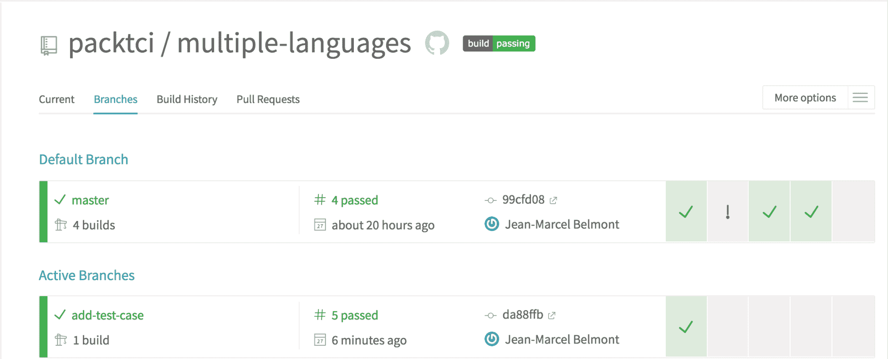
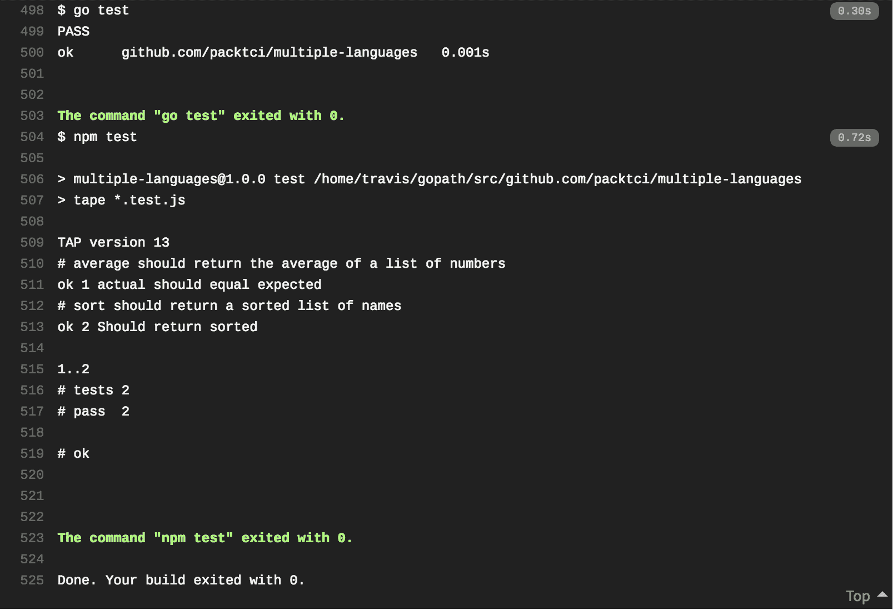
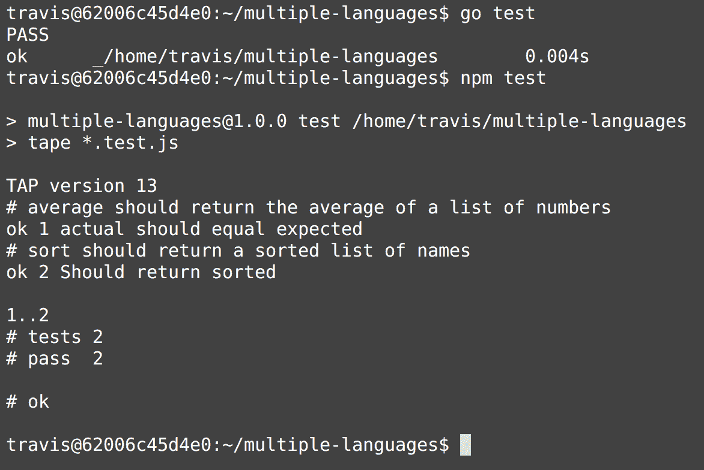
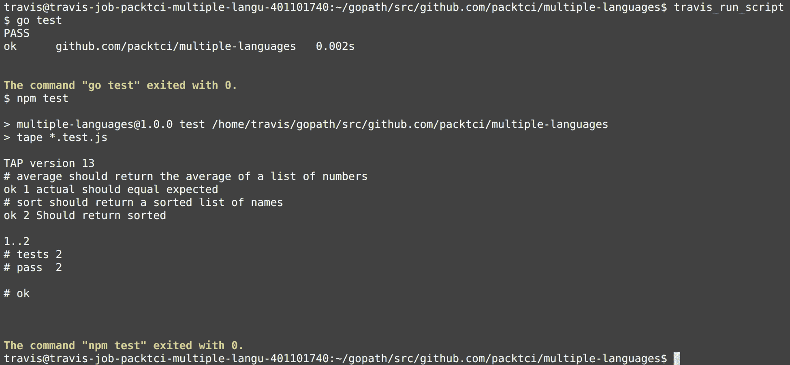
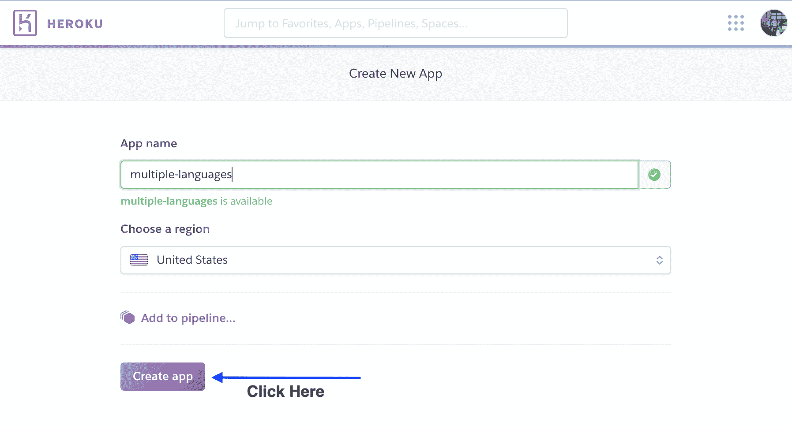
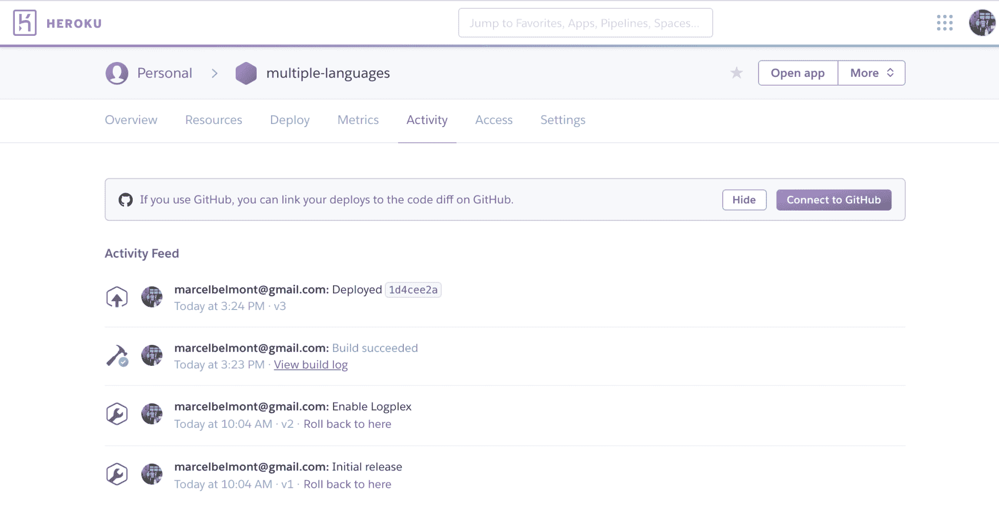

# 十一、Travis配置项用户界面日志和调试

本章将概述 Travis 作业日志以及作业日志中的各个部分。本章还将解释如何以几种不同的方式调试 Travis 构建作业，包括使用 Docker 在本地构建，然后在调试模式下运行构建。我们将讨论获取作业标识的所有不同方法，以及如何在公共存储库中启用调试模式，然后使用Travis应用编程接口在调试模式下启动构建。我们将解释如何使用 **tmate** ，这是一个终端多路复用器，然后我们将讨论在 Travis Web Client 中记录环境变量。最后，我们将介绍如何使用 Heroku 在 Travis CI 中进行部署，以及如何调试部署失败。

本章将涵盖以下主题:

*   Travis 网络客户端概述
*   使用 Docker 在本地调试构建
*   在调试模式下运行生成
*   Travis网络用户界面日志
*   Travis CI 部署概述和调试

# 技术要求

本章将需要一些基本的 Unix 编程技能以及一些 bash 脚本知识。对如何调用 RESTful API 有一个基本的了解会有所帮助，因为我们将使用 curl 作为 REST 客户端来调用 Travis API。对 Docker 和容器也有一个基本的了解会很有帮助，因为我们也将使用 Docker 运行本地构建。

# Travis 网络客户端概述

我们在[第 9 章](09.html)、*Travis CI 的安装和基础知识*中简要地浏览了 Travis CI 的网络仪表盘，但是让我们再看一下 UI 的不同部分。

# 主仪表板概述

TravisCI网络客户端有几个不同的部分需要理解:


在左边分开的部分，您可以单独点击您感兴趣的每个存储库。此外，您可以按名称搜索存储库，因为您或您所属的组织可能拥有许多存储库。还要注意，这里有关于项目中运行的最后一次构建的详细信息，以及它是通过还是失败，还有关于持续时间和最后一次构建运行时间的构建详细信息。

在右边分开的部分，你会发现Travis网络客户端的主要导航组件。请注意，这里有几个导航链接，例如当前版本，这是当您转到存储库时打开的默认链接。如果单击分支链接，您将看到所有不同分支中触发的所有构建，包括拉取请求。让我们推送一个新分支，并在`multiple-languages`([https://github.com/packtci/multiple-languages](https://github.com/packtci/multiple-languages))存储库中创建一个拉取请求，并查看一个正在运行的新构建:



请注意，Travis CI 为我们推送的新分支创建了一个名为`add-test-case`的新构建:


此外，您打开的任何拉取请求也将触发 Travis CI 的新构建:


当您将一个拉取请求合并到另一个分支时，就会在 Travis CI 中触发另一个 CI 构建。

# 作业日志概述

Travis CI 中的作业日志从构建系统配置信息开始:


注意这里构建语言设置为`go`，构建操作系统为 Ubuntu Trusty 14.04:


Travis CI 克隆了`multiple-languages`存储库的一个新副本，这是持续集成的一个重要方面。请记住，配置项构建应该在每个构建上构建一个新副本，并且不应该有假定的环境变量:


注意 Travis CI 为我们设置了一些环境变量，包括`GOPATH`和`PATH`环境变量。Travis CI 运行`go version`命令来验证配置项构建中是否安装了 1.10 版本:


在配置项构建的这一步，我们安装我们的二级编程语言 Node.js。这是可选的，但是请注意 Travis CI 在`before_install`的右侧有一个构建标签，这是我们在*构建定制*部分的[第 9 章](09.html)、*Travis CI 的安装和基础知识*中讨论的构建步骤之一。另外，请注意在`before_install`和`install`的构建生命周期标签的右侧，有一个时间戳，表示构建步骤实际花费了多长时间，该时间戳以人类可读的格式表示为`2.55`秒和`2.88`秒，表示`before_install`和`install`生命周期事件:



注意这里没有脚本构建生命周期的构建标签，因为这是配置项构建的主要部分。

任何其他生命周期事件，如`after_success`和`after_script`生命周期事件，都将有一个构建标签和一个时间戳。

# 使用 Docker 在本地调试生成

您可以通过下拉文档链接“Docker 映像中的本地故障排除”中的 Docker 映像来本地调试版本。您可以在此链接中找到安装 Docker 的说明([https://docs.docker.com/install/](https://docs.docker.com/install/))。

1.  下拉“待办事项”图像:

```
docker pull travisci/ci-garnet:packer-1512502276-986baf0
```

请注意，我们运行`docker pull`命令来实际下拉 Docker 图像

2.  启动交互式 Docker 会话:


请注意，我们在分离模式下运行了一个交互式 shell 会话

3.  在运行容器中打开登录外壳:

```
docker exec -it travis-debug bash -l
```

该命令使用一个 Bash shell 启动与正在运行的 Docker 容器的交互式 shell 会话

4.  切换到Travis用户:

```
su - travis
```

在这个命令中，我们切换到 Travis 用户，而不是默认的根用户

5.  将`multiple-languages` Git 存储库克隆到主目录中:

```
git clone --depth=50 --branch=master https://github.com/packtci/multiple-languages
cd multiple-languages
```

该命令将我们的`multiple-languages`存储库本地克隆到 Docker 容器中，然后更改到该目录中

6.  签出我们要在本地测试的 Git 提交。

运行`git log`命令，在本地找到我们想要签出的提交。最有可能的是我们将检查的顶级 Git 提交:

```
git log
git checkout 2a663fc233d3ae3986fd99efc510369ded92ba94
```

在这一步中，我们希望确保只测试与我们想要测试的变更相对应的变更。

7.  安装库依赖项和辅助编程语言:

```
NODE_VERSION="6"
nvm install $NODE_VERSION
npm install
```

在这一步中，我们通过使用**节点版本管理器** ( **nvm** )安装 Node.js 作为辅助编程语言，然后运行`npm install`命令来安装我们所有的库依赖项

8.  运行脚本构建步骤。

在下面的截图中，我们运行`go test`和`npm test`命令来模拟本地 Docker 容器中的脚本构建生命周期事件:



# 在调试模式下运行生成

调试构建时问题的另一种技术是在 Travis CI 中运行调试构建。您需要通过电子邮件`support@travis-ci.com`为公共存储库打开此功能，而私有存储库默认启用调试模式。这样做的原因是，任何人都可以看到包含 SSH 访问的日志，然后可以连接到虚拟机，然后可能读取机密环境信息，如客户端标识、机密等。

# 从配置文件页面获取应用编程接口令牌

要通过应用编程接口在调试模式下重新启动作业，您需要向作业的调试端点发送`POST`请求。需要通过将您的 Travis CI API 令牌添加到授权头来验证此请求。您可以在公共项目的Travis配置文件页面中找到您的应用编程接口令牌。

你需要访问一个网址，比如[https://travis-ci.org/profile/packtci](https://travis-ci.org/profile/packtci)。然后，您需要在配置文件页面中复制您的 API 令牌，如下所示:


接下来，您将需要通过使用带有 API 令牌的 REST 客户端来命中调试端点。

# 使用Travis命令行界面访问令牌

您可以通过运行以下命令，使用 Travis CLI 获取访问令牌:

```
travis token
```

# 从构建日志中获取作业标识

您可以通过展开`Build system information`选项卡，然后查找标签`Job id`来获取作业标识。在下面的截图中，有一个箭头指向`Job id`:


# 从“查看配置”按钮中的网址获取作业标识

如果您单击查看配置按钮，网址将会改变，您可以从网址复制作业标识。在下面的截图中，我们单击了视图配置按钮，如下所示:


然后网址改成了这个配置:[https://Travis-ci . org/packtci/多语言/作业/401101740/配置](https://travis-ci.org/packtci/multiple-languages/jobs/401101740/config)。

该网址中的作业标识为`401101740`。

# 通过对/builds 端点的应用编程接口调用获取作业标识

您也可以通过调用Travis应用编程接口中的`/builds`端点来获取作业标识。您需要发出`GET`请求并提供有效的访问令牌才能进行 REST 调用。以下是使用`curl` REST 客户端的请求示例:

```
curl -s -X GET \
 -H "Content-Type: application/json" \
 -H "Accept: application/json" \
 -H "Travis-API-Version: 3" \
 -H "Authorization: token $(travis token)" \
 -d '{ "quiet": true }' \
 https://api.travis-ci.org/builds
```

这将获取与存储库相关联的所有构建，这可能是一个很大的 JSON 负载。您可以使用**jq**([https://stedolan.github.io/jq/](https://stedolan.github.io/jq/))命令行 JSON 处理器过滤掉作业标识信息。下面是同样的 REST 调用，它将 JSON 有效负载传送到`jq`命令行实用程序中，只过滤出对应于构建的作业标识:


# 在调试模式下启动构建作业的 API 调用

只要您有有效的访问令牌，就可以使用任何 REST 客户端来调用 Travis API。

以下是对`40110174`作业标识的调试端点的示例 REST 调用:


请注意，在此截图中，我们添加了`Authorization` HTTP 头，并使用 Travis CLI 通过使用 Bash 字符串插值打印出我们的访问令牌，如下所示:

```
Authorization: token $(travis token)
```

还要注意，我们使用的是 https://api.travis-ci.org 的公共Travis端点。

# 获取调试模式的 SSH 会话

如果您返回 Travis web UI 并查看当前的作业日志，您将看到以下内容:


现在，您只需进入命令提示符或终端会话，并输入`ssh`命令，开始与当前版本的交互式调试会话:


调试模式 SSH 会话将只保持活动状态 30 分钟，然后您需要进行另一个 API 调用来启动另一个调试会话:


# Travis 调试模式便利 Bash 函数

以下是可用的便利 Bash 函数列表:

*   `travis_run_before_install`对应于安装前生命周期事件
*   `travis_run_install`对应于**安装**生命周期事件
*   `travis_run_before_script`对应于脚本生命周期事件之前的
***   `travis_run_script`对应**脚本**生命周期事件*   `travis_run_after_success`对应于成功后的**生命周期事件*****   `travis_run_after_failure`对应于失效后的**生命周期事件*****   `travis_run_after_script`对应于**后 _ 脚本**生命周期事件******

 ******在下面的截图中，我们运行了`travis_run_before_install`功能:


请记住，这是在运行`before_install`生命周期事件中指定的内容，该事件在`multiple-languages`存储库中有以下内容:

```
before_install:
 - nvm install $NODE_VERSION
```

现在我们将运行`travis_run_install`便利 Bash 函数，该函数安装 Travis `install`生命周期事件中指定的库依赖项:


我们在`multiple-languages`存储库中的`install`生命周期事件中有以下条目:

```
install:
 - npm install
```

请注意，这正是运行`travis_run_install`便利功能时运行的内容。

接下来，我们运行`travis_run_script`便利函数，该函数运行 Travis `script`生命周期事件中定义的任何脚本:



我们在`multiple-languages`存储库中的`script`生命周期事件中有以下条目:

```
script:
 - go test
 - npm test
```

如果我们指定了任何其他的生命周期事件，我们就可以使用剩下的便利 Bash 函数。

# tmate 外壳会话操作

SSH shell 会话使用 tmux([https://github.com/tmux/tmux](https://github.com/tmux/tmux))的分叉，这是一个名为 tmate([https://tmate.io/](https://tmate.io/))的终端多路复用器程序，使用它，您可以打开窗口、滚动历史记录等。

*   如果您按下 *Control-b* [，您将能够上下滚动您的命令历史


*   要退出历史滚动模式，只需按下字母 *q* 。
*   如果您按下 *Control-b c* ，您将创建一个可以使用的新窗口。

*   如果按下*控制-b [0..9]* ，然后您可以在您创建的任何新窗口之间切换。请注意，这里括号的意思是，例如，Control-b 0、Control-b 1 等等，用于切换窗口会话。

# Travis网络用户界面日志记录

您当然可以注销 Travis CI 中的一些环境变量，但要注意不要注销日志中的机密信息。

# Travis CI 为保护您的环境特定变量而采取的步骤

默认情况下，Travis CI 将隐藏任何变量，如令牌和环境变量，并简单地在它们的位置显示字符串`[secure]`。

如果您转到构建# 3[https://Travis-ci . org/pack ktci/puppeter-headless-chrome-Travis-yml-script/builds/398696669](https://travis-ci.org/packtci/puppeteer-headless-chrome-travis-yml-script/builds/398696669)，您将看到以下条目:


请记住，我们在[第 10 章](10.html)、 *Travis CI CLI 命令和自动化*中在此存储库中添加了以下加密环境变量:

```
travis encrypt SECRET_VALUE=SuperSecret12345 --add
```

请注意，该命令将以下条目添加到 Travis YML 脚本中:

```
env:
 global:
 secure: 
WLiuzi0CTx/ta5zuoU5K2LeZgzrAhWATUjngx++Azz7Tw4+XqbxeHZ/6ITymE1YLDRMxdIh8hItvkoNCbPmJ6q1To6bdirloWZq2rlZ5BPGYfVY3cuoUuxTAz1uhhfnngkqd76eJfB4lBUfOIVNAg2rpI7QFAQr1aiIKxjthiTms57fR4dusEi/efVO90I7yzFtyxEa0tLTgW9x+dPSt2ApmJ0EP9tftk7M7Uw/F2Gm1/AzWpM1Blklm/iEHF3ZY6Ij/V+ZG2SCpfrF88m50a8nJF1a+KttZz/TTbwqA58dXNokxcD30HB468/oaGMTJxYLFmG3QMfbXuP2wUkuinIEWQxGBEDh3uw11ZhypCGVNvE6vbRpdIIzywcVcX95G1px+Dgcil+c8AebO1wbWlDXMuWNQHC7JjdQspvLUtsLeyyei3LKshTY7LktvhJEG/+sgd5sejeqnzFmLmC9TdbCazLMFWzqhl+SBcmQtFNVuqAGBlMFlT1l54zFnZl7mixetVeBziuS7xGG3XXm0BsYIQnkcJYxNGv8JrFMSoqBTdQV4C20UyyXAw8s+5lu6dGziiMPSUK4KUSVPJ3hyeNiGhLTBsJn4bnTPiJ5ilVdyNM8RD8X2EJRImT3uvGvuFqHraCBrBuZVaW4RtbGX0JYYtMMMr/P84jKrNC3iFD8=
```

请记住，Travis 作业日志只显示了字符串`[secure]`来代替这个环境变量。

# Travis CI 部署概述和调试

我们在*第 3 章“持续交付的基础知识”*中讨论了软件部署，但是概括地说，部署是由开发人员创建的软件的最终产品，您的最终用户将使用它。部署通常在成功的CI/CD管道结束时完成。请记住，CI/CD 管道可以由提交阶段组成，在提交阶段构建任何二进制文件并运行单元测试套件，然后是第二阶段，在第二阶段可以运行集成测试，然后可能是第三阶段，包括负载测试和/或安全测试，最后是第四阶段，包括验收测试套件。如果配置项/内容分发管道的所有阶段都成功完成，则应该启动部署管道。

在 Travis CI 中部署相对容易/请记住，您可以使用 Travis CLI 在 Travis CI 中轻松设置一些部署工具。

# TravisCI中受支持的提供商

以下是一些受支持的提供商，您可以将其与 Travis CI 一起用于部署:

*   AWS 代码部署([https://docs.travis-ci.com/user/deployment/codedeploy/](https://docs.travis-ci.com/user/deployment/codedeploy/))
*   AWS 弹性豆茎([https://docs . Travis-ci . com/user/deployment/Elastic 豆茎/](https://docs.travis-ci.com/user/deployment/elasticbeanstalk/) )
*   AWS Lambda([https://docs.travis-ci.com/user/deployment/lambda/](https://docs.travis-ci.com/user/deployment/lambda/))
*   AWS S3([https://docs.travis-ci.com/user/deployment/s3/](https://docs.travis-ci.com/user/deployment/s3/))
*   蔚蓝网络应用([https://docs.travis-ci.com/user/deployment/azure-web-apps/](https://docs.travis-ci.com/user/deployment/azure-web-apps/))
*   bluemix cloud foundry([https://docs . Travis-ci . com/user/deployment/bluemix cloud foundry/](https://docs.travis-ci.com/user/deployment/bluemixcloudfoundry/))
*   厨师超市([https://docs.travis-ci.com/user/deployment/chefsupermarket/](https://docs.travis-ci.com/user/deployment/chefsupermarket/))
*   cloud foundry([https://docs.travis-ci.com/user/deployment/cloudfoundry/](https://docs.travis-ci.com/user/deployment/cloudfoundry/))

*   GitHub Pages([https://docs.travis-ci.com/user/deployment/pages/](https://docs.travis-ci.com/user/deployment/pages/))
*   GitHub 发布([https://docs.travis-ci.com/user/deployment/releases/](https://docs.travis-ci.com/user/deployment/releases/))
*   谷歌应用引擎([https://docs . Travis-ci . com/user/deployment/Google-App-Engine/](https://docs.travis-ci.com/user/deployment/google-app-engine/))
*   谷歌云存储([https://docs.travis-ci.com/user/deployment/gcs/](https://docs.travis-ci.com/user/deployment/gcs/))
*   谷歌 Firebase([https://docs.travis-ci.com/user/deployment/firebase/](https://docs.travis-ci.com/user/deployment/firebase/))
*   heroku([h](https://docs.travis-ci.com/user/deployment/heroku/)T2】ttps://docs . Travis-ci . com/user/deployment/heroku/)
*   open shift([https://docs.travis-ci.com/user/deployment/openshift/](https://docs.travis-ci.com/user/deployment/openshift/))
*   NPM([https://docs.travis-ci.com/user/deployment/npm/](https://docs.travis-ci.com/user/deployment/npm/))
*   浪涌(https://docs.travis-ci.com/user/deployment/surge/)

有关支持的提供商的完整列表，请访问Travis用户文档([https://docs . Travis-ci . com/user/deployment/# Supported-Providers](https://docs.travis-ci.com/user/deployment/#Supported-Providers))。

# Travis CI 中的英雄库设置

我们可以使用 Travis CLI 来帮助我们在`multiple-languages`([https://github.com/packtci/multiple-languages](https://github.com/packtci/multiple-languages))存储库中设置 Heroku([https://www.heroku.com/platform](https://www.heroku.com/platform))。

我们需要做的第一步是确保我们使用 Heroku CLI 登录 Heroku，您可以在[https://devcenter . Heroku . com/articles/Heroku-CLI #下载安装](https://devcenter.heroku.com/articles/heroku-cli#download-and-install)下载安装。登录后，我们将获得一个可以使用的访问令牌:


Notice here that we used the  `heroku auth:token` command to print out our access token.

现在我们只需要使用`travis setup`命令进行设置:


Notice that we did not have to provide an access token as we already logged into Heroku and the `travis setup` command is smart enough to grab it for us.

`travis setup`命令使用 Heroku 提供者信息自动更新我们的 Travis YML 脚本，现在我们的 Travis TML 脚本如下所示:

```
language: go

go:
 - '1.10'

env:
 - NODE_VERSION="6"

before_install:
 - nvm install $NODE_VERSION

install:
 - npm install

script:
 - go test
 - npm test

deploy:
 provider: heroku
 api_key:
 secure: ueVMBom+3LHS4xhXXi9hbPR8FIIS/z01Z7NW4hngea4WRHq3gU8AY70xz25w/FshMPtaHeCUdZ90eDDvLF5/hwI+9zup/XI4gONiTTOpxpiY3EyHkP2frra0sdSQhYBHETsq4hEQxODE83ClQjx2jCKM3LOTdzI6wrKXpI5UtoD73yIa7AbKCxl8IXGIeNePImyLe6Wl7ovfxq1zcXz5c6Tu6uIqO2VwkvILrQKB41Id6VQN1MpfY1kQMASuRwaiJQ8HCmi0NP8A067v0s83OM9bNVK+KXDTLsVyrovnpidUnVS/Gk2QDNz0Or5xEIM2iXCsQDoa8jGNSCNfPcXq3aYtl2hjgDSVnz28EoxYRBmx365UxzwRVpsgdf1b+sCfd9FBJge7xZqTCGwimoBJvrQH0qvgYzQ855EvmtEyBU5t0JRmU8x/Z74KryO24YHD/hSY0a1REPCnZqjBkBS5FHQprIJm5XQabwU/IOqPMdM1KvMYj34N+dxK0X92sf0TLSAv3/62oquQ7Lkhjl4nAsEa05v+kQNMQdLemYFBZi8/Qf6a4YQPNmLXmKwis1FLTzicccwPE8qJ2H3wPQRQUUZVYQxgjUkh5ni6ikqCkxmZRnNJgCbTWhw3ip1xaWjmm6jtvMhiWiUr6vDgIbvbty120ySBIe3k2P5ARW77fOA=

 app: multiple-languages
 on:
 repo: packtci/multiple-languages
```

# Travis YML 脚本调试失败

如果我们看一下`multiple-languages`项目的 build 8.1([https://Travis-ci . org/packtci/多语言/jobs/403102478#L548](https://travis-ci.org/packtci/multiple-languages/jobs/403102478#L548) )，我们可以看到它出错了，正如截图所示，因为我们在 Heroku 中实际上没有一个名为多语言的应用:


我们只需要在 Heroku 中创建一个名为`multiple-languages`的应用，如下所示:



现在让我们使用`travis restart`命令在 Travis 中重新开始构建:


现在，让我们再次查看构建 8.1 的作业日志:


现在，如果我们查看 Heroku 仪表板，我们可以确认我们的应用已成功部署到 Heroku:



# 摘要

在本章中，我们概述了 Travis 作业日志，并解释了作业日志的不同部分。我们研究了使用 Docker 在本地运行构建，并学习了如何通过使用 Travis API 在调试模式下启用构建。然后，我们查看了 Travis CI 在工作日志中保护您的机密和密钥所采取的步骤。最后，我们看了如何通过使用 Travis CLI 在 Travis CI 中部署应用，然后看了如何调试构建失败并在 Travis CI 中成功部署。

在下一章中，我们将解释如何在软件项目中设置 Circle CLI，然后复习 Circle CI UI 的基础知识。

# 问题

1.  当你在 GitHub 中合并一个请求时，另一个构建会被启动吗？
2.  在脚本生命周期事件中运行任何脚本时，Travis 作业日志是否显示标签？
3.  我们如何在本地调试Travis CI 中的构建？
4.  公共存储库可以使用调试构建模式吗？
5.  您将如何使用Travis应用编程接口来获取工作标识？
6.  在调试模式下运行构建时，可以为 before_install 生命周期事件使用的便利 bash 函数是什么？
7.  您会使用什么 Travis CLI 命令来设置诸如 Heroku 之类的附加组件来进行部署？

# 进一步阅读

您可以在 Travis 用户文档中进一步探索调试选项和更高级的配置信息:[https://docs.travis-ci.com/](https://docs.travis-ci.com/)。******