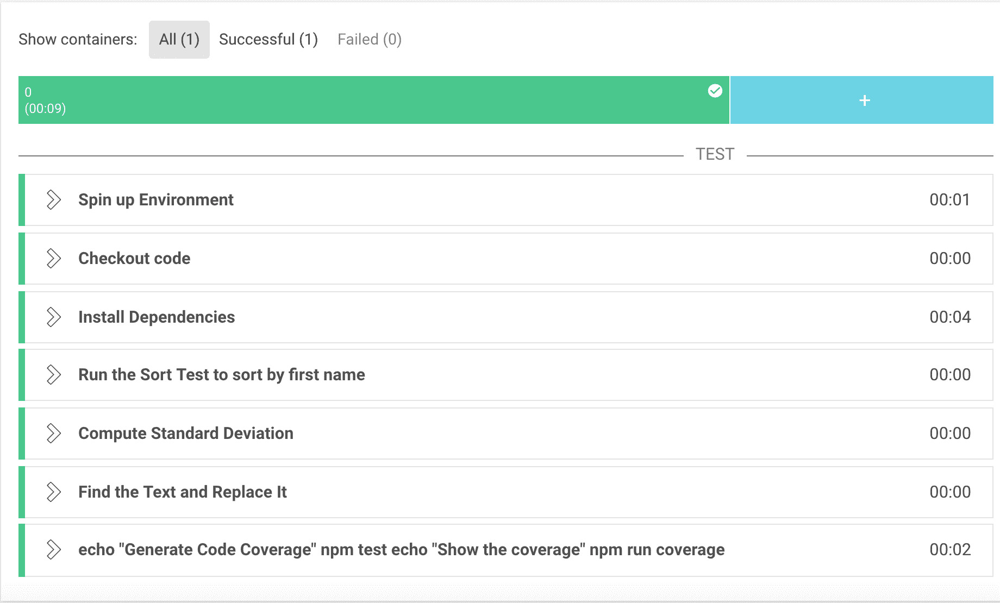
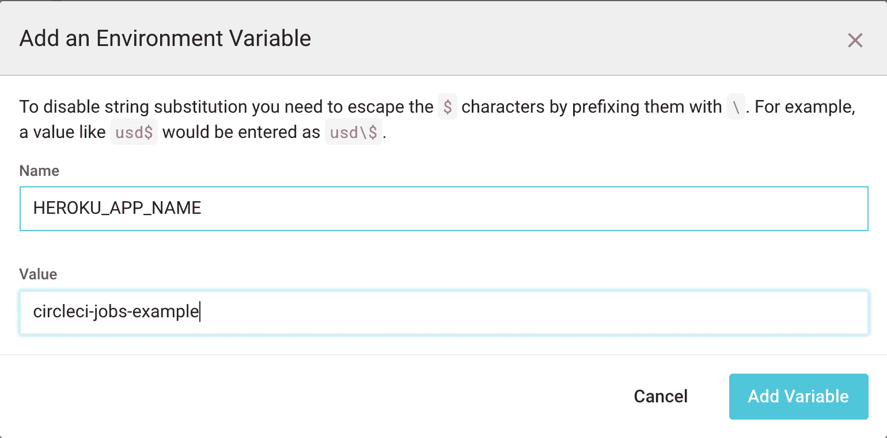
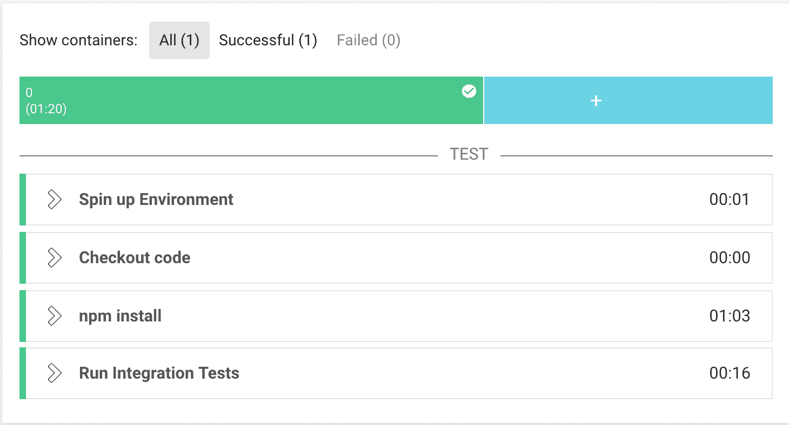
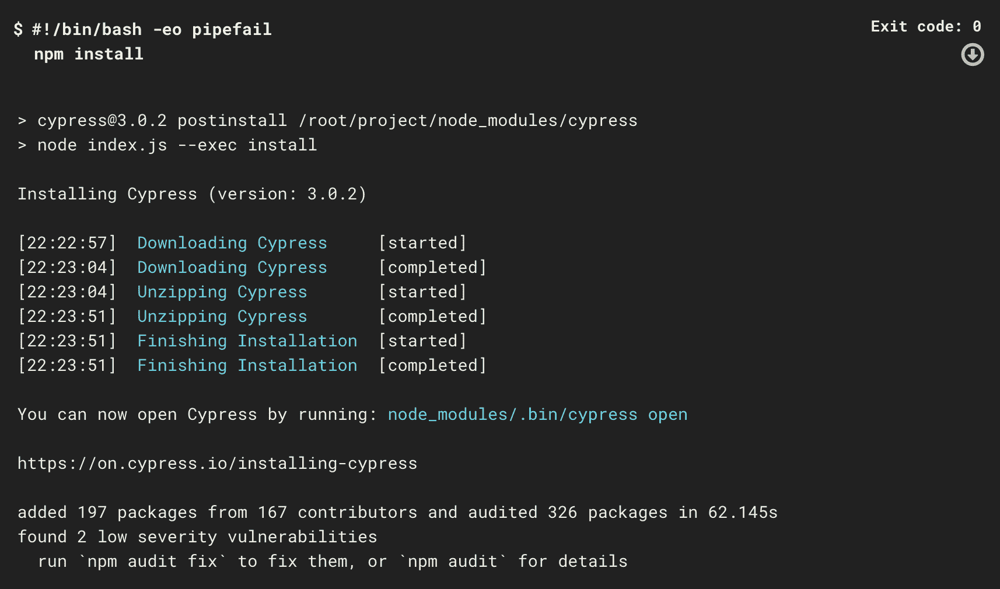
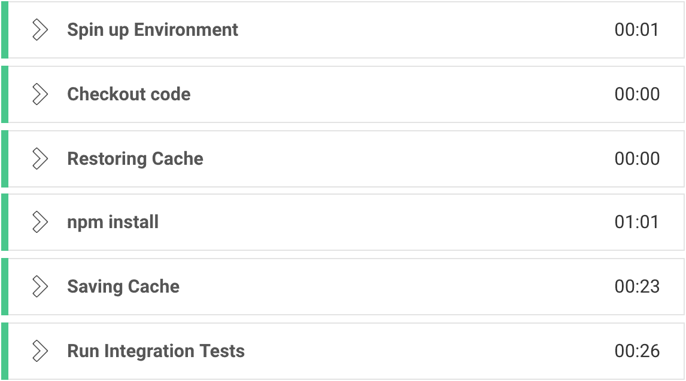
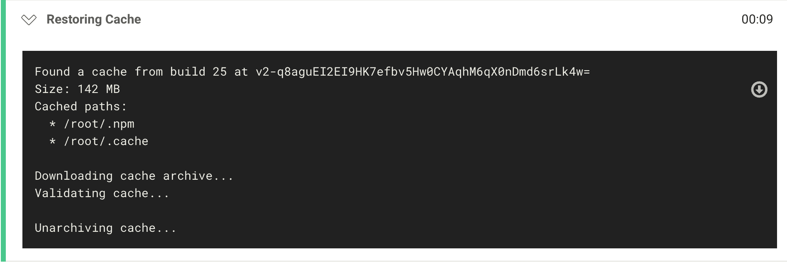

# 循环界面记录和调试

在前一章中，我们深入介绍了 CircleCI CLI 命令，并向您展示了一些在 CircleCI 中自动执行任务的技术。在本章中，我们将深入介绍作业日志，并更详细地解释运行步骤。我们将解释工作流概念，并向您展示如何使用 CircleCI 应用编程接口来查找项目的最新版本。我们将研究如何通过在构建中实现缓存来调试一个缓慢的作业，最后将使用一些故障排除技术来运行一个带有本地配置 YML 脚本的构建。

本章将涵盖以下主题:

*   作业日志概述
*   在 CircleCI 中调试缓慢的构建
*   日志记录和故障排除技术

# 技术要求

在本章中，我们将介绍一些关于使用 RESTful APIs 的概念，并将使用`curl`实用程序进行 REST 调用，因此了解什么是 API 以及如何使用像`curl`这样的 REST 客户端会很有帮助。对 Unix 编程环境有一个初步的了解也是有帮助的，了解什么是脚本以及什么是 Bash 环境也是有好处的。

本章的代码文件可在以下链接中找到:

*   [https://github . com/packageci/circular-jobs-example](https://github.com/packtci/circleci-jobs-example)
*   [https://github . com/packtci/go-template-带圈示例-ci](https://github.com/packtci/go-template-example-with-circle-ci)

# 作业日志概述

CircleCI 中的作业日志与 Travis CI 中的不同，因为每个作业中的每个步骤都在单独的非登录 shell 中运行，并且 CircleCI 为作业中的每个步骤设置了一些智能默认值。

# 使用默认生成作业运行作业中的步骤

我们将创建一个新的存储库来演示默认构建作业中的多个作业。存储库将被称为`circleci-jobs-example`([https://github.com/packtci/circleci-jobs-example](https://github.com/packtci/circleci-jobs-example))并且在构建作业中将有多个运行声明。出于演示的目的，我们将使用 Node.js 作为我们选择的编程语言。请记住，我们需要将新项目添加到 CircleCI 中，以便它能够知道我们的项目。在前面的章节中，我们使用 CircleCI web UI 添加了项目，但是让我们使用 CircleCI API 将新项目添加到 CircleCI 中。

# 通过应用编程接口向 CircleCI 添加项目

我们在[第 13 章](13.html)、 *CircleCI 命令行界面命令和自动化*中学习了如何使用 CircleCI 应用编程接口，因此请阅读该章的*使用 CircleCI 应用编程接口*部分，了解使用该应用编程接口的更多详细信息。如果您已经阅读了这篇文章，那么您已经有了一个可以使用的 API 令牌。circle ci([https://circleci.com/docs/api/v1-reference/#follow-project](https://circleci.com/docs/api/v1-reference/#follow-project))上新项目要遵循的 API 端点显示，您需要发出`POST HTTP`请求，并将您的 API 令牌添加为查询字符串参数。

# 将 curl 用作 REST 客户端

我们已经在整本书中使用`curl`作为 REST 客户端，所以你现在应该已经熟悉如何使用它了。我们将向以下端点`https://circleci.com/api/v1.1/project/:vcs-type/:username/:project/follow?circle-token=:token`发出`POST`请求:

```
curl -X POST "https://circleci.com/api/v1.1/project/github/packtci/circleci-jobs-example/follow?circle-token=$CIRCLECI_API_TOKEN_GITHUB"
```

这里我们使用了一个名为`CIRCLECI_API_TOKEN_GITHUB`的环境变量，它是在我们的本地环境中设置的，我们从 API 中得到如下响应:

```
{
  "following" : true,
  "workflow" : false,
  "first_build" : {
    "compare" : null,
    "previous_successful_build" : null,
    "build_parameters" : null,
    "oss" : true,
    "committer_date" : null,
    "body" : null,
    "usage_queued_at" : "2018-08-04T21:36:26.982Z",
    "fail_reason" : null,
    "retry_of" : null,
    "reponame" : "circleci-jobs-example",
    "ssh_users" : [ ],
    "build_url" : "https://circleci.com/gh/packtci/circleci-jobs-example/1",
    "parallel" : 1,
    "failed" : null,
    "branch" : "master",
    "username" : "packtci",
    "author_date" : null,
    "why" : "first-build",
    "user" : {
      "is_user" : true,
      "login" : "packtci",
      "avatar_url" : "https://avatars3.githubusercontent.com/u/40322425?v=4",
      "name" : null,
      "vcs_type" : "github",
      "id" : 40322425
    },
    "vcs_revision" : "abc2ce258b44700400ec231c01529b3b6b8ecbba",
    "vcs_tag" : null,
    "build_num" : 1,
    "infrastructure_fail" : false,
    "committer_email" : null,
    "previous" : null,
    "status" : "not_running",
    "committer_name" : null,
    "retries" : null,
    "subject" : null,
    "vcs_type" : "github",
    "timedout" : false,
    "dont_build" : null,
    "lifecycle" : "not_running",
    "no_dependency_cache" : false,
    "stop_time" : null,
    "ssh_disabled" : true,
    "build_time_millis" : null,
    "picard" : null,
    "circle_yml" : {
      "string" : "version: 2\njobs:\n build:\n docker:\n - image: circleci/node:8.11.3\n steps:\n - checkout\n - run:\n name: Install Dependencies\n command: npm install\n - run:\n name: Run the Sort Test to sort by first name\n command: $(npm bin)/tape sort_test.js\n - run:\n name: Compute Standard Deviation\n command: $(npm bin)/tape standard_deviation_test.js\n - run:\n name: Find the Text and Replace It\n command: $(npm bin)/tape find_text_test.js\n - run: |\n echo \"Generate Code Coverage\"\n npm test\n echo \"Show the coverage\"\n npm run coverage\n "
    },
    "messages" : [ ],
    "is_first_green_build" : false,
    "job_name" : null,
    "start_time" : null,
    "canceler" : null,
    "platform" : "2.0",
    "outcome" : null,
    "vcs_url" : "https://github.com/packtci/circleci-jobs-example",
    "author_name" : null,
    "node" : null,
    "canceled" : false,
    "author_email" : null
  }
}
```

# 从 JSON 响应中解析 build_url 属性

让我们通过在终端外壳会话中使用 cat 实用程序将这个响应保存到一个新文件中，我们称之为`circleci-jobs-example-follow.json`，如下所示:

```
cat > circleci-jobs-example-follow.json
# Paste the JSON Content from System Clipboard
# Press Enter
# Finally Press enter
```

现在让我们使用`jq`([https://stedolan.github.io/jq/manual/](https://stedolan.github.io/jq/manual/))并在 JSON 有效负载中找到`build_url`属性:

```
cat circleci-jobs-example-follow.json | jq '.first_build.build_url'
```

此命令返回以下构建网址:`https://circleci.com/gh/packtci/circleci-jobs-example/1`。

现在，您可以打开浏览器并粘贴此网址，也可以使用操作系统上可用的命令行实用程序。我们将在 macOS 中使用`open`实用程序，如下所示:

```
open https://circleci.com/gh/packtci/circleci-jobs-example/1
```

前面的命令将在 macOS 中打开默认浏览器，并使用您提供的 URL。在 Linux 中，您可能能够使用`xdg-open`、`gnome-open`或`kde-open`，这取决于您已经安装的操作系统。无论哪种方式，您都可以简单地打开浏览器并粘贴构建 URL 的条目。

# CircleCI 网络用户界面作业日志分析

当我们打开通过应用编程接口触发的新作业的网址时，用户界面的第一部分如下所示:


请注意，顶部显示了基本信息，如提交 SHA 哈希、参与者信息和其他背景信息。如果您在作业日志中进一步向下滚动，您将看到在作业的每个部分运行的步骤:



构建花了 9 秒钟完成，这里注意到构建中的每一步都有自己方便折叠的部分。您只需单击每个部分即可获得该步骤的详细信息。每个步骤的名称对应于配置 YML 脚本中的`name`字段。

Notice that the name of the multi-line command used the name of the full command as its name.

这是多行命令的条目:

```
...
- run: |
    echo "Generate Code Coverage"
    npm test
    echo "Show the coverage"
    npm run coverage
```

如果我们展开其中一个步骤，我们将看到以下条目，它们是相同的:


**Shebang** 行`#!/bin/bash -eo pipefail`为非登录 shell 设置了一些合理的默认值。

Bash 选项`-e`意味着如果语句返回非真值，脚本应该退出。Bash 选项`-o  pipefail`意味着使用第一个失败的错误状态，而不是管道中最后一个项目的错误状态。您可以执行以下操作，而不是在 Shebang 行中添加这些选项:

```
#!/usr/bin/env bash

# Exit script if you try to use an uninitialized variable. 
set -o nounset 
# Exit script if a statement returns a non-true return value. 
set -o errexit 
# Use the error status of the first failure, rather than that of the last item in a pipeline. 
set -o pipefail
```

如果我们看一下工作中的另一步，我们会发现同样的事情已经完成:


CircleCI 在工作的每一步都这样做，因为它可以帮助我们解决编写 shell 脚本时出现的问题，并且有助于推广编写 shell 脚本时的最佳实践。

下面是一个可能失败的命令示例，当使用 Unix 管道时，该命令会在错误的构建位置报告错误:

```
docker ps -a | grep -v "busybox:latest" | awk '{ print $1 }' - | grep -v "CONTAINER"
```

在这个管道中，我们列出了由于某种原因正在运行、退出或终止的所有容器，然后将其导入`grep`实用程序，排除任何包含文本`busybox:latest`的条目，然后将其导入`awk`实用程序，并只打印第一列。我们最终把这个管回到`grep`中，排除文本`CONTAINER`。这个管道可能在管道的任何一个链上失败，但是因为我们使用了选项`set -o pipefail`，脚本将在返回非真选项的第一个命令上失败。这很有帮助，因为默认行为是报告管道中的最后一项。

运行声明命令的另一个方面是，默认情况下，它们是使用非登录外壳执行的。这意味着您必须显式地将任何隐藏文件(如**点文件**)作为正在运行的命令的一部分，否则您将面临环境变量不能如您预期的那样随时使用的风险。

这里有一个例子来说明这一点:

```
# We source some environment variables here that we need 
source ~/project/.env

npm run security-tests
```

另外，请注意，退出代码是为右上角的每个运行声明打印的:


您还可以在右上角看到一个有用的按钮，它会将您进一步向下滚动到您感兴趣的特定跑步步骤。

# 环境变量安全使用的最佳实践

重要的是不要在`.circleci/config` YML 脚本文件中添加秘密。如果你这样做了，你可能会泄露工作日志上的秘密信息，这些信息可能是公开的。在 CircleCI 上可以访问您的项目的开发人员可以看到`config.yml`的全文，因此请将您的机密和/或密钥存储在 CircleCI 应用程序的项目或上下文设置中。在配置中运行脚本可能会暴露秘密环境变量，因此在运行步骤中使用`set -o xtrace / set -x`时要小心，因为它们可能会暴露环境变量。

One thing to note is that all environment variables are encrypted using Hashicorp Vault ([https://www.vaultproject.io/](https://www.vaultproject.io/)) and environment variables are encrypted using AES256-GCM96 and are unavailable to any CircleCI employees.

# 使用工作流运行作业中的步骤

根据**工作流**([https://circleci.com/docs/2.0/workflows/](https://circleci.com/docs/2.0/workflows/))上的 Circle CI 文档，工作流是一组用于定义作业集合及其运行顺序的规则。工作流支持复杂的作业编排，使用一组简单的配置键来帮助您更快地解决故障。

我们将使用工作流来将我们的工作分成更合适的部分，然后利用一些脚本彼此独立并且可以单独运行的事实。我们可以通过使用 CircleCI 中的工作流来加快构建过程。

现在，让我们考虑一下在我们的构建过程中可以分成不同步骤的工作部分。我们可以将依赖步骤分解成构建的一个独立部分，然后我们可以将为三个测试运行的各个步骤折叠成一个名为 test 的步骤。请记住，配置 YML 脚本中的步骤如下所示:

```
...
- run:
 name: Run the Sort Test to sort by first name
 command: $(npm bin)/tape sort_test.js
 - run:
 name: Compute Standard Deviation
 command: $(npm bin)/tape standard_deviation_test.js
 - run:
 name: Find the Text and Replace It
 command: $(npm bin)/tape find_text_test.js
 - run: |
 echo "Generate Code Coverage"
 npm test
 echo "Show the coverage"
 npm run coverage
...
```

在最后一步中，我们有命令`npm test`，该命令引用了`package.json`文件中指定的以下命令:

```
"scripts": {
    "test": "nyc tape *_test.js",
    "coverage": "nyc report --reporter=cobertura"
}
```

请注意，该命令已经运行了所有测试，然后使用纽约代码覆盖率实用程序报告覆盖率。最后一个命令生成一个 Cobertura XML 报告，我们将在本章后面使用。我们现在将把这一系列步骤改写成他们自己的领域`test`，看起来是这样的:

```
test:
 docker:
 - image: circleci/node:8.11.3
 steps:
 - checkout
 - run:
 name: Run Tests and Run Code Coverage with NYC
 command: |
 echo "Generate Code Coverage"
 npm test
 echo "Show the coverage"
 npm run coverage
```

Notice here that I gave a more appropriate name to the collapsed command and also notice that we can use a multi-line command in the `command` field itself using the pipe (`|`) operator.

我们将像在[第 13 章](13.html)、 *CircleCI CLI 命令和自动化*中一样添加一个部署部分，它将我们的应用程序部署到**Heroku**([https://dashboard.heroku.com/apps](https://dashboard.heroku.com/apps))中。如果您不明白 Heroku 是什么，那么请阅读[第 11 章](11.html)、 *Travis CI UI 登录和调试*，详细内容请阅读 *Travis CI 部署概述和调试*部分。

# 向配置 YML 脚本添加工作流部分

我们将把`workflows`部分添加到我们的配置 YML 脚本的底部，但是我们也可以把它添加到我们的配置 YML 脚本的开头。以下是更新后的配置 YML 脚本:

```
...
workflows:
    version: 2
    build_test_and_deploy:
        jobs:
            - build
            - test:
                requires:
                    - build
            - deploy:
                requires:
                    - test
```

一旦我们完成了配置 YML 脚本的更新，我们应该通过使用 CircleCI CLI 来确保我们的配置 YML 脚本仍然有效，如下所示:


第 19 行的配置 YML 脚本似乎有问题:

```
...
- run:
    name: Run Tests and Run Code Coverage with NYC
    command: |
    echo "Generate Code Coverage"
    npm test
    echo "Show the coverage"
    npm run coverage
```

这实际上是我们的配置 YML 脚本中的一个微妙的错误，因为我们没有正确地缩进多行命令，所以 CircleCI 不知道我们的多行命令从哪里开始。下面是更新后的配置 YML 脚本部分:

```
...
- run:
 name: Run Tests and Run Code Coverage with NYC
 command: |
 echo "Generate Code Coverage"
 npm test
 echo "Show the coverage"
 npm run coverage
```

现在让我们再次运行 CircleCI 命令行界面验证:


我们的配置 YML 脚本是有效的，所以现在让我们通过发出以下命令将它提交到源代码控制中:


请注意，这里我们给出了一个描述性的提交消息，如果您正在使用的任何东西都有一个特定的标签，比如 JIRA，那么在版本控制中这样做是很好的做法；例如，您可以这样添加它:

```
git commit -m '[PACKT-1005] Update config yml script to different jobs and use workflows.'
```

# 使用 CircleCI 应用编程接口查找最新的构建网址

我们当然可以使用 CircleCI web 应用程序，并单击`workflows`部分，找到我们最近的构建，但是让我们改用 CircleCI API，并使用`jq`来解析 JSON 响应负载，就像我们之前对其他 API 端点所做的那样。

这里有一个命令，它将把输出从`/recent-builds` API 端点传送到`jq`，并从对象数组中返回第一个`build_url`，这将是最近的构建，然后将它传送到系统剪贴板。我们可以在[https://circle ci . com/docs/API/v1-reference/#近期-构建-项目](https://circleci.com/docs/api/v1-reference/#recent-builds-project)文档中看到 JSON 的形状:

```
curl -X GET \
 --header "Accept: application/json" \
 "https://circleci.com/api/v1.1/project/github/packtci/circleci-jobs-example?circle-token=$CIRCLECI_API_TOKEN_GITHUB" | jq '.[0].build_url'
```

这会将以下网址返回到终端:[https://circleci.com/gh/packtci/circleci-jobs-example/6](https://circleci.com/gh/packtci/circleci-jobs-example/6)。

现在让我们转到这个网址，看看最近的构建；我们会注意到构建失败了:


构建失败，因为我们没有设置配置 YML 脚本引用的必要环境变量，即`HEROKU_API_KEY`和`HEROKU_APP_NAME`。我们在[第 13 章](13.html)、 *CircleCI 命令行界面命令和自动化*中介绍了如何设置项目级环境变量，但是我们只需要复制项目级环境变量。如果环境变量相同，CircleCI 有一个简单的方法:


单击导入变量按钮，然后输入要复制的项目，如下所示:


请注意，我只检查了`HEROKU_API_KEY`环境变量，我将手动设置`HEROKU_APP_NAME`，因为它对于`circleci-jobs-example`([https://github.com/packtci/circleci-jobs-example](https://github.com/packtci/circleci-jobs-example))项目会有所不同:



现在，设置了这些环境变量，让我们使用重试构建来重试相同的构建，返回新构建的概要[https://circleci.com/docs/api/v1-reference/#retry-build](https://circleci.com/docs/api/v1-reference/#retry-build)应用编程接口端点。我们将使用`curl`对端点进行如下调用:

```
curl -X POST https://circleci.com/api/v1.1/project/github/packtci/circleci-jobs-example/6/retry\?circle-token\=$CIRCLECI_API_TOKEN_GITHUB | jq '.build_url'
```

现在，我们可以通过复制返回标准输出的`build_url`值来验证构建是否已修复，该值是[https://circleci.com/gh/packtci/circleci-jobs-example/7](https://circleci.com/gh/packtci/circleci-jobs-example/7):


# 在 CircleCI 中调试缓慢的构建

在 CircleCI 中，由于各种各样的原因，构建可能会很慢。我们来看一个`go-template-example-with-circleci`([https://circle ci . com/workflow-run/533 ee47 a-a990-4679-826 B- 7b 24221 f2ca](https://circleci.com/workflow-run/533ee47a-a990-4679-826b-7b24221df2ca))的工作流示例:


特别要注意的是，集成作业花了一分多钟才完成，部署作业也花了一分多钟才完成，这使得构建需要 3 分 20 秒才能完成。如果我们单击集成作业，我们会在作业中看到以下步骤:



注意这里`npm install`用了 1 分 3 秒完成。让我们打开运行步骤调用`npm install`了解更多详细信息:



我们唯一的依赖是`cypress.io`，但是我们没有缓存这个依赖，所以它每次都会运行这个步骤。CircleCI 有一种方法，我们可以利用两个名为`save_cache`([https://circle ci . com/docs/2.0/configuration-reference/# save _ cache](https://circleci.com/docs/2.0/configuration-reference/#save_cache))和`restore_cache`([https://circle ci . com/docs/2.0/configuration-reference/# restore _ cache](https://circleci.com/docs/2.0/configuration-reference/#restore_cache))的字段声明来缓存我们的节点依赖关系。让我们更新配置 YML 脚本，以便在集成构建中使用这种缓存策略:

```
integration:
    docker:
        - image: cypress/base:8
            environment:
            ## this enables colors in the output
            TERM: xterm
    steps:
        - checkout
        # special step to restore the dependency cache
        - restore_cache:
            key: v2-{{ checksum "package.json" }}
        - run: npm install
        # special step to save the dependency cache
        - save_cache:
            key: v2-{{ checksum "package.json" }}
            paths:
                - ~/.npm
                - ~/.cache
        - run: 
            name: "Run Integration Tests"
            command: npm test
```

请注意，我们将`restore_cache`步放在了`npm install`步之前，然后将`save_cache`步放在了`npm install`步之后。我们还在两个字段中使用了一个关键字段。键值是不可变的，我们使用`v2`作为前缀来版本化我们的缓存键值，然后获取`package.json`文件的校验和。如果我们想对任何更改使缓存无效，我们可以简单地将缓存值增加 1，例如`v3`。还要注意，我们有一个路径字段，我们将路径指定为`~/.npm`和`~/.cache`目录。赛普拉斯测试运行程序希望将二进制文件保存到这样的目录中，否则会抛出一个错误。让我们将这一更改推送到源代码管理，并触发新的构建，然后查看作业日志。现在，让我们使用对最近构建的 API 端点的调用，并复制 URL，看看构建进行得如何:

```
curl -X GET \
 --header "Accept: application/json" \
 "https://circleci.com/api/v1.1/project/github/packtci/go-template-example-with-circle-ci?circle-token=$CIRCLECI_API_TOKEN_GITHUB" | jq '.[0].build_url'
```

我们需要复制打印到标准输出上的`build_url`条目，并将该网址粘贴到浏览器中。`build_url`将打开当前构建，在此页面中，我们可以通过单击类似如下的链接轻松导航到该特定作业的工作流:


我们可以点击工作流标签下的`build_integration_and_deploy`链接进入工作流。我们现在在集成构建中有以下步骤:



如果我们展开恢复缓存下拉列表，我们可以看到以下内容:


Notice here that no cache was found, which is expected since this is the first run of the build with this step added.

如果我们展开保存缓存按钮，我们可以看到以下内容:


Notice here that a cache archive was created and stored in the `node_modules` path as we specified the paths field in the config YML script.

让我们在`README.md`文件中进行一个简单的文本更改，并提交该更改以触发新的构建。我们将像以前一样使用 API 找到最新的版本。现在让我们看看集成作业的新作业日志:


请注意，构建从 1 分 20 秒变为 33 秒。如果打开恢复缓存下拉列表，我们会看到以下内容:



现在让我们看看保存缓存步骤:


Notice here that it skipped the cache generation as it was able to find the cache that we saved from the previous build.

# 日志记录和故障排除技术

我们可以排除一个有问题的配置 YML 脚本的故障，而不必使用 CircleCI 应用编程接口进行 Git 提交。我们可以做的一个技术是创建另一个文件夹，并将我们的配置 YML 脚本的副本放入其中，然后使用这个 YML 脚本作为我们的调试脚本。一旦我们能够验证 YML 脚本工作正常，我们就可以更新原始的 YML 脚本。这很有用，因为我们不会用故障排除提交来阻塞 Git 历史，而是直接使用 CircleCI API。

# 使用本地配置 YML 脚本运行构建以进行故障排除

假设我们想尝试存储构建工件，比如项目的代码覆盖率。目前，我们正在生成一个覆盖率报告，但是它并没有在构建过程中被保存下来供我们查看覆盖率报告。这是一个很好的用例，创建一个单独的配置 YML 脚本来测试这个新功能。让我们存储来自`circleci-jobs-example`([【https://github.com/packtci/circleci-jobs-example】](https://github.com/packtci/circleci-jobs-example))项目的覆盖工件，并且让我们也更新测试作业来缓存节点依赖项，就像我们在上一节中学习的那样。

运行此命令复制`.circleci`目录的内容，并在 shell 中创建新目录:

```
cp -r .circleci store_and_cache_experiment
```

现在我们将使用`store_and_cache_experiment`文件夹来运行我们的本地配置 YML 脚本实验。以下是我们将对`store_and_cache_experiment`文件夹中的配置 YML 脚本进行的更改:

```
test:
    docker:
        - image: circleci/node:8.11.3
    steps:
        - checkout
        # special step to restore the dependency cache
        - restore_cache:
             key: v2-{{ checksum "package.json" }}
        # special step to save the dependency cache
        - run:
             name: Install Dependencies
             command: npm install
        - save_cache:
             key: v2-{{ checksum "package.json" }}
             paths:
                 - ~/.npm
                 - ~/.cache
         - run:
             name: Run Tests and Run Code Coverage with NYC
             command: |
                 echo "Generate Code Coverage"
                 npm test
                 echo "Show the coverage"
                 npm run coverage
         - store_artifacts:
             path: coverage
             prefix: coverage
```

我们增加了`save_cache`和`restore_cache`申报变更，也增加了`store_artifacts`申报变更。让我们使用`circleci config validate`命令来验证配置 YML 脚本是否仍然有效。现在，为了在我们的本地配置中测试这些变化，而不必进行 Git 提交，我们可以使用 CircleCI 应用编程接口，并在我们的请求正文中提供我们的本地配置 YML 脚本，并引用最近的 Git 提交。我们可以通过运行以下命令获得最新的 Git 提交:


现在我们有了一个修订号，可以用于我们将要进行的 API 调用。下面是我们将用来调试新配置 YML 脚本中的更改的命令:

```
#! /bin/bash

curl --user ${CIRCLECI_API_TOKEN_GITHUB}: \
    --request POST \
    --form revision=09a95cb11914fe8cf4058bfe70547b0eec0656bc \
    --form config=@config.yml \
    --form notify=false \
    https://circleci.com/api/v1.1/project/github/packtci/circleci-jobs-example/tree/master | jq '.build_url'
```

第一个选项`--user`取我们保存在环境变量中的 API 令牌，然后是后面的`:`，表示后面没有密码。下一个选项`--request`，是我们正在指定的`HTTP POST`动词。`--form`版本的下一个选项是我们把之前得到的 Git 版本号放在哪里，然后在下一个选项中我们指定`config.yml`脚本。我们为 notify 指定一个 false 的表单值，然后提供 URL。这里我们先指定 GitHub 的版本控制系统提供者，然后是我们的`packtci`用户名，接着是项目名称，然后是树，最后是我们的分支名称。然后我们把它导入`jq`实用程序并解析出`build_url`。为了清楚起见，这里是应用编程接口端点:

```
POST: /project/:vcs-type/:username/:project/tree/:branch
```

在我们进行 REST 调用之后，我们应该会得到一个 JSON 响应，它给了我们一个构建 URL 供我们查看，下面是我们得到的构建 URL:[https://circleci.com/gh/packtci/circleci-jobs-example/8](https://circleci.com/gh/packtci/circleci-jobs-example/8)。如果我们在 CircleCI Web UI 中查看这个新的构建，我们会看到它通过了:


让我们删除故障排除目录和配置 YML 脚本和 shell 脚本，并将配置 YML 脚本复制到`.circleci`目录，如下所示:

```
cp store_and_cache_experiment/config.yml .circleci
rm -r store_and_cache_experiment
git add .
git commit -m 'Cache and Store artifacts.'
git push
```

现在，如果我们点击当前的构建，然后转到工作流链接，我们将看到上传工件步骤被添加到作业中；这是它的样子:


我们现在可以向上滚动并单击工件选项卡，看到工件已经保存在构建中，如下所示:


如果我们点击`index.html`，我们将被重定向到一个漂亮的报道报告，如下所示:


# 摘要

在本章中，我们深入介绍了作业日志，并向您展示了如何使用 CircleCI API 添加项目。我们向您展示了如何分析作业日志，并更详细地解释了什么是 CircleCI 中的工作流。我们研究了如何使用 CircleCI 应用编程接口来查找最新的构建。然后，我们研究了如何在 Circle CI 中调试缓慢的构建，最后向您展示了如何使用本地配置 YML 脚本对 CircleCI YML 脚本进行新的更改。

在下一章中，我们将研究一些持续集成/持续交付的最佳实践，并研究一些配置管理模式，特别是机密管理，并在软件公司实施 CI/CD 时提供一些清单。

# 问题

1.  在 CircleCI 中，我们用来跟踪新项目的 API 端点是什么？
2.  cat 实用程序可以用来创建新文件吗？
3.  如何在 CircleCI 配置 YML 脚本中运行多行命令？
4.  在 CircleCI 中使用`set -x`或脚本中的执行跟踪时，是否存在安全漏洞？
5.  我们用来验证配置 YML 脚本的命令行界面命令是什么？
6.  可以从 CircleCI 中的其他项目导入环境变量吗？
7.  我们用什么声明来缓存 CircleCI 中的依赖关系？

# 进一步阅读

要了解更多关于调试和故障排除的信息以及其他有用的信息，请阅读 CircleCI 官方文档:[https://circleci.com/docs/2.0/](https://circleci.com/docs/2.0/)。