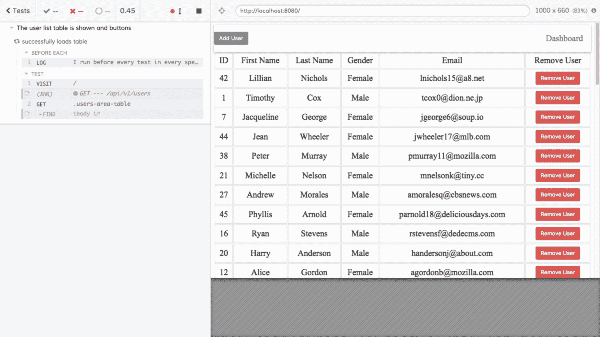
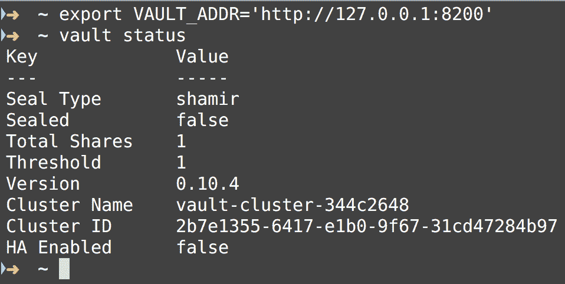
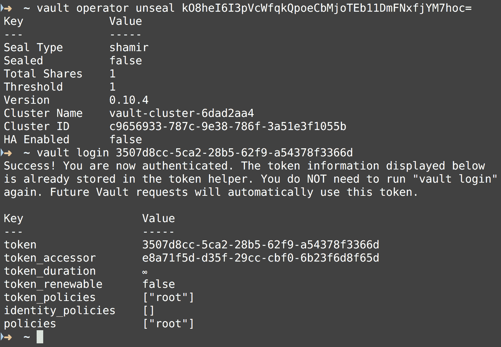
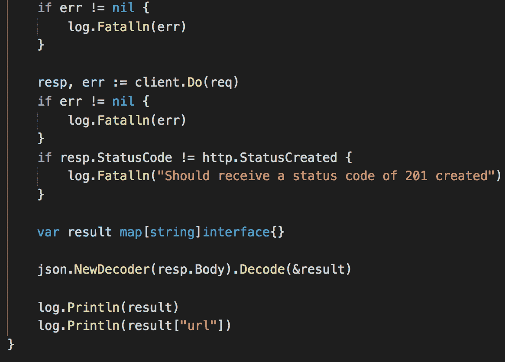

# 十五、最佳实践

在最后一章[第 14 章](14.html)、 *CircleCI UI 日志记录和调试*中，我们介绍了使用 CircleCI 的更高级的调试和日志记录技术，并详细介绍了使用 CircleCI API 的更多选项。在本书的最后一章，我们将讨论不同类型测试的最佳实践，例如单元测试、集成测试、系统测试和验收测试。我们将讨论密码管理的最佳实践，并以保管库库为例。最后，我们将回顾CI/CD中部署的最佳实践，并编写一个定制的 go 脚本来创建 GitHub 版本。

本章将涵盖以下主题:

*   CI/CD 中不同类型测试的最佳实践
*   密码和机密存储的最佳实践
*   部署中的最佳实践

# 技术要求

本章将需要一些基本的编程技能，因为我们将在部署脚本和单元测试示例中讨论一些特定于编程语言的材料。熟悉一下 Unix 编程和什么是 Bash shell 会很有帮助。

# CI/CD 中不同类型测试的最佳实践

在[第 3 章](03.html)、*持续交付的基础*中，我们回顾了验收测试，并简要地讲述了验收测试套件如何作为回归测试套件。在本节中，我们将讨论您可以进行的不同类型的软件测试，并针对每种类型的测试制定一些最佳实践。我们将检查以下类型的测试:

*   烟雾测试
*   单元测试
*   集成测试
*   系统试验
*   验收测试

# 烟雾测试

冒烟测试是一种特殊的测试，有助于验证应用中的基本功能。烟雾测试将假设一些基本的实现和环境设置。冒烟测试通常在测试周期开始时运行，在开始一个完整的测试套件之前，它表现为一个健全性检查。

冒烟测试背后的主要思想是在软件系统中开发新功能时发现明显的问题。烟雾测试并不意味着详尽无遗，而是意味着运行非常快。假设一家软件公司遵循敏捷软件开发实践，并且有两周的冲刺时间将新特性添加到产品中。当一个新特性被合并到版本中时，这意味着软件的主干，冒烟测试失败，这应该会立即发出一个危险信号，表明新特性可能已经破坏了现有的功能。

当在系统中测试新功能时，您可以创建特定于上下文的冒烟测试，该系统将采用一些基本假设，并且可以断言满足了需求。您可以创建冒烟测试，这些测试在完成任何集成测试之前和为分段环境完成任何部署之前运行，并且这些冒烟测试将检查每个分段环境上的不同条件。

# 烟雾测试示例

我们将使用我构建的一个现有应用，它在一个表中显示用户列表。该应用名为`containerized-golang-and-vuejs`([https://github.com/jbelmont/containerized-golang-and-vuejs](https://github.com/jbelmont/containerized-golang-and-vuejs))，它显示了如何使用容器、Golang 和 Vue.js 作为参考。我们要做的第一件事是确保应用使用名为`make dev`的`makefile`任务运行。该命令执行以下操作:

```
docker-compose up frontend backend db redis
```

总而言之，这个命令旋转了四个 Docker 容器，当它启动并运行时，我们应该能够点击`http://localhost:8080`。现在，在现实中，烟雾测试会击中一个正在运行的应用，但这只是烟雾测试的演示目的。我们将使用一个名为**赛普拉斯**([https://www.cypress.io/](https://www.cypress.io/))的端到端测试库，但我们也可以很容易地为此使用另一个库。

我们将使用 JavaScript 编写以下简单的烟雾测试:

```
describe('The user list table is shown and buttons', function () {
    it('successfully loads table', function () {
        cy.visit('/')
        cy
        .get('.users-area-table')
        .find('tbody tr')
        .first()
        .screenshot()
    })
})
```

你可以在入门([https://docs . cypress . io/guides/入门/writing-your-first-test . html #](https://docs.cypress.io/guides/getting-started/writing-your-first-test.html#))文档中阅读更多关于 Cypress 的内容，但这个测试本质上是验证页面是否加载了数据，Cypress 会截图，这样我们就可以直观地验证页面。

以下是赛普拉斯图书馆拍摄的截图:



对于这个简单的应用，我们可以确定应用大致工作正常，但是更完整的冒烟测试可能会通过登录屏幕，然后执行应用预期要执行的基本操作。

Another nice feature of Cypress is that it can take videos of the tests showing all the steps that the test is taking, which can further verify that the application is meeting the basic requirements.

# 单元测试

单元测试可以被认为是软件测试的基础，因为单元测试测试单个代码块，如函数或类/对象。通过单元测试，您可以独立测试函数和/或类的功能。由于这个事实，单元测试通常会剔除或模仿掉任何外部依赖关系，以便测试可以完全集中在有问题的函数和/或类上。

单元测试是根据单个组件行为的正确性来测试系统的基础。事实上，单元测试在这方面是有限的，这意味着更容易隔离缺陷发生的地方。单元测试通常用于测试代码分支以及函数如何处理不同类型的输入。单元测试通常是开发人员将在构建中运行的第一个测试，而质量保证工程师可能会先运行冒烟测试，然后再进行任何单元测试。

在向版本控制项目(如 GitHub)提交变更之前，个人开发人员将在他们的工作站上运行单元测试。话虽如此，持续集成服务器，如 Jenkins、Travis CI 和 CircleCI，将在运行任何集成测试之前运行单元测试，正如我们在前面几章中看到的那样。

# 单元测试示例

我们将看一看以前的一个名为`circleci-jobs-example`([https://github.com/packtci/circleci-jobs-example](https://github.com/packtci/circleci-jobs-example))的项目，它有几个单元测试，这些单元测试是为了测试单个函数而编写的。在存储库中，我们有一个名为`sort.js`的文件，其中有以下功能:

```
/ Takes an array of objects and sorts by First Name
function sortListOfNames(names) {
    return names.sort((a, b) => {
        if (a.firstName < b.firstName) {
            return -1;
        }
        if (a.firstName > b.firstName) {
            return 1;
        }
        if (a.firstName === b.firstName) {
            return 0;
        }
    });
}
```

该函数获取一个对象数组，并根据`firstName`属性对对象进行排序。对于我们的单元测试，我们只是想测试`sortListOfNames`函数会按照字母顺序对名字进行排序。这是我们在`tape.js`([https://github.com/substack/tape](https://github.com/substack/tape))测试库中编写的单元测试:

```
test('Test the sort function', t => {
    t.plan(1);

    const names = [
        {
            firstName: 'Sam',
            lastName: 'Cooke'
        },
        {
            firstName: 'Barry',
            lastName: 'White'
        },
        {
            firstName: 'Jedi',
            lastName: 'Knight'
        }
    ];
    const actual = sort.sortListOfNames(names);
    const expected = [
        {
            firstName: 'Barry',
            lastName: 'White'
        },
        {
            firstName: 'Jedi',
            lastName: 'Knight'
        },
        {
            firstName: 'Sam',
            lastName: 'Cooke'
        }
    ];
    t.deepEqual(actual, expected, 'The names should be sorted by the first name.')
});
```

您可以在这里看到，单元测试只能隔离和测试`sortListOfNames`函数的行为，这非常有用，因为如果`sortListOfNames`函数有任何问题，我们可以快速隔离回归发生的位置。现在，假设这个函数非常基本和简单，但是您可以看到单元测试在持续集成构建捕捉软件回归的工作中起到了重要的作用。

# 集成测试

集成测试将测试软件组件组，因为它们相互协作。虽然单元测试有助于独立验证代码块的功能，但是集成测试有助于测试代码块之间的交互。集成测试很有用，因为它们可以帮助捕捉软件组件交互时出现的不同类型的问题。

虽然单元测试可以在开发人员的工作站中运行，但是集成测试通常是在代码签入源代码控制时运行的。配置项服务器将检查代码，执行构建步骤，然后进行任何冒烟测试，然后运行单元测试，然后进行集成测试。

由于集成测试是更高层次的抽象，测试软件组件之间相互作用，它们有助于保护代码库的健康。当开发人员向系统引入新特性时，集成测试可以帮助确保新代码能够按照预期与其他代码块一起工作。集成测试可以帮助确保系统中的新特性可以安全地部署到环境中。集成测试通常是在开发人员工作站之外完成的第一类测试，有助于显示它们是否可能是环境依赖关系的破坏，以及较新的代码是否与外部库和外部服务和/或数据一起正常运行。

# 集成测试示例

我们将查看一个公共的 API，比如 CircleCI，并编写一个集成测试，该测试将命中 API 端点，并验证状态代码和请求的主体是否是我们所期望的。这通常是您正在使用的本地应用编程接口，并且需要验证正确的行为，但是，作为一个示例，我们将仅出于说明的目的访问 CircleCI。我们将使用我们的`packtci`用户在 GitHub 中创建新的存储库，并将其称为`integration-test-example`([https://github.com/packtci/integration-test-example](https://github.com/packtci/integration-test-example))[。我们将使用几个库，包括`supertest`(](https://github.com/packtci/integration-test-example)[)https://github.com/visionmedia/supertest](https://github.com/visionmedia/supertest))，一个 Node.js 库，`baloo`([)https://github.com/h2non/baloo](https://github.com/h2non/baloo))，一个 Golang 库来命中 API 端点，最后只剩下`curl`和`bash`。使用哪个库并不重要；我使用这些库只是为了演示。

# 使用超级测试节点库的应用编程接口测试示例

在这个集成测试示例中，我们击中了 CircleCI 中的`GET /projects`([https://circleci.com/docs/api/v1-reference/#projects](https://circleci.com/docs/api/v1-reference/#projects))端点。下面是测试这个端点的代码:

```
'use strict';

const request = require('supertest');
const assert = require('assert');

const CIRCLECI_API = {
    // List of all the projects you're following on CircleCI, with build information organized by branch
    getProjects: 'https://circleci.com/api/v1.1'
};

describe('Testing CircleCI API Endpoints', function() {
    it('the /projects endpoints should return 200 with a body', function() {
        return request(CIRCLECI_API.getProjects)
           .get(`/projects?circle-token=${process.env.CIRCLECI_API_TOKEN_GITHUB}`)
            .set('Accept', 'application/json')
            .expect(200)
            .then(response => {
                assert.ok(response.body.length > 0, "Body have information")
                assert.equal(response.body[0].oss, true);
            });
    });
});
```

这里，我们测试端点返回一个`200` HTTP 响应，并且它有一个主体，并且在`oss`的对象数组中有一个属性。

# 巴洛戈朗库的应用编程接口测试示例

在这个集成测试中，我们在 Travis API 中找到了`GET /user`([https://developer.travis-ci.com/resource/user#User](https://developer.travis-ci.com/resource/user#User))端点。下面是测试这个端点的代码:

```
package main

import (
    "errors"
    "net/http"
    "os"
    "testing"
    "gopkg.in/h2non/baloo.v3"
)

var test = baloo.New("https://api.travis-ci.com")

func assertTravisUserEndpoint(res *http.Response, req *http.Request) error {
  if res.StatusCode != http.StatusOK {
    return errors.New("This endpoint should return a 200 response code")
  }
  if res.Body == nil {
    return errors.New("The body should not be empty")
  }
  return nil
}

func TestBalooClient(t *testing.T) {
    test.Get("/user").
    SetHeader("Authorization", "token "+os.Getenv("TRAVIS_PERSONAL_TOKEN")).
    SetHeader("Travis-API-Version", "3").
    Expect(t).
    Status(200).
    Type("json").
    AssertFunc(assertTravisUserEndpoint).
    Done()
}
```

在这里，我们测试响应是一个`200`，并且身体有值。

# 使用 curl、bash 和 jq 的 API 测试示例

在这个集成测试示例中，我们将点击`GET: /project/:vcs-type/:username/:project`([)https://circle ci . com/docs/API/v1-reference/#最近的构建-项目](https://circleci.com/docs/api/v1-reference/#recent-builds-project)，这是 CircleCI API 中最近的一个构建端点。下面是测试这个端点的代码:

```
#! /bin/bash

GO_TEMPLATE_EXAMPLE_REPO=$(curl -X GET \
    --header "Accept: application/json" \
    "https://circleci.com/api/v1.1/project/github/packtci/go-template-example-with-circle-ci?circle-token=$CIRCLECI_API_TOKEN_GITHUB" | jq '.[0].author_name' | tr -d "\n")

if [[ -n ${GO_TEMPLATE_EXAMPLE_REPO} ]]; then
    echo "The current owner was shown"
    exit 0
else 
    echo "No owner own"
    exit 1
fi
```

在这里，我们测试我们从端点接收到了一个`author_name`属性，该属性应该在 JSON 负载中返回。

# 系统试验

系统测试通常是扩展集成测试的更广泛的集成测试。系统测试将聚集应用中的功能组，因此范围比集成测试更广。系统测试通常在集成测试之后运行，因为它们测试的是应用中较大的行为，并且运行时间较长。

# 系统测试示例

系统测试可以包括:

*   **可用性测试**:测试系统易用性和系统满足其建议功能的整体能力的一种测试
*   **负载测试**:一种在真实负载下测量系统行为的测试
*   **回归测试**:一种测试类型，每当向系统添加新特性时，检查系统是否正常运行

还有其他类型的系统测试，但我们只包括一些常见类型的系统测试。

# 验收测试

我们已经在整本书中讨论了验收测试，但是，重申一下，验收测试是对应用行为的正式验证。验收测试通常是您将在 CI/CD 管道中编写的最后一类测试，因为它们运行时间更长，并且总体上更涉及验收测试的验证方面。

验收测试也可以作为回归测试套件，因为它们提供了应用正常运行的保证。有些库使用一种正式的特定领域语言**小黄瓜**([https://docs.cucumber.io/gherkin/reference/](https://docs.cucumber.io/gherkin/reference/))。这有具体的文件，写下了所谓的**验收标准。**这些规定了新特性需要做什么，对于软件公司来说，编写一个验收测试并不罕见，该测试在冲刺之初是失败的，并且当特性被正确实现时，一旦满足验收标准，该测试就会通过。

# 验收测试示例

我们可以在我的存储库中查看一个非常简单的验收测试示例，名为`cucumber-examples`([https://github.com/jbelmont/cucumber-examples](https://github.com/jbelmont/cucumber-examples)，它有一个小黄瓜文件，用于检查我们的验收标准是否符合一个简单的计算器程序:

```
# features/simple_addition.feature
Feature: Simple Addition of Numbers
  In order to do simple math as a developer I want to add numbers

  Scenario: Easy Math Problem
    Given a list of numbers set to []
    When I add the numbers together by []
    Then I get a larger result that is the sum of the numbers
```

请注意，这里的小黄瓜语法是人类可读的，应该理解为新功能的声明列表。在这里，我们声明，我们希望能够做一个简单的数学加法运算，然后提供一个场景来实现这一点。下面是实现该功能的代码:

```
const { setWorldConstructor } = require('cucumber')

class Addition {
  constructor() {
    this.summation = 0
  }

  setTo(numbers) {
    this.numbers = numbers
  }

  addBy() {
    this.summation = this.numbers.reduce((prev, curr) => prev + curr, 0);
  }
}

setWorldConstructor(Addition)
```

这个文件是一个做简单加法的 JavaScript 类，这里是另一个有一个场景列表的类，它添加了一个数字列表:

```
const { Given, When, Then } = require('cucumber')
const { expect } = require('chai')

Given('a list of numbers set to []', function () {
    this.setTo([1, 2, 3, 4, 5])
});

When('I add the numbers together by []', function () {
    this.addBy();
});

Then('I get a larger result that is the sum of the numbers', function () {
    expect(this.summation).to.eql(15)
});
```

This is a very simple acceptance test but it is meant to illustrate the fact that an acceptance test is a formal verification that the new feature is behaving as it is should be.

# 在CI/CD管道中运行不同测试的最佳实践

我们在[第 3 章](03.html)、*持续交付基础*中描述了以下阶段:

1.  配置项/内容分发管道的第一阶段通常包括构建和提交阶段。这是您构建管道其余部分所需的任何工件并在构建中运行您的单元测试套件的地方。第一个阶段意味着非常快速的运行，因为开发人员需要有一个短的反馈循环，否则您会冒着开发人员绕过这个阶段的风险。
2.  CI/CD 管道的第二阶段通常会运行集成测试，因为它们是运行时间较长的测试类型，可以在管道的第一阶段运行并通过之后运行。第二个阶段是一个保证层，保证任何新的功能已经破坏了系统的集成组件。
3.  CI/CD 管道的第三阶段可能包括一套负载测试和/或回归测试和/或安全测试，并且运行时间比 CI/CD 管道的前两个阶段长得多。
4.  第四个阶段可以是运行验收测试的地方，尽管我个人见过一些公司在集成测试的同时运行验收测试套件，因此他们的 CI/CD 管道中只有三个阶段。我们在本章中列出的阶段并不是硬性的规则，而只是一些建议，因为每个应用的行为都是独特的。

# 密码和机密存储的最佳实践

正如我们在涵盖 Jenkins、Travis CI 和 CircleCI 的章节中所看到的，每个持续集成服务器都有一种方法来存储安全信息，如密码、API 密钥和机密。在 CI 服务器中运行某些操作是很危险的，比如使用 Bash 中的`set -x`选项用 Bash 进行执行跟踪。最好使用配置项服务器的功能来安全地存储密码和机密，例如 CircleCI 中每个项目的上下文设置，除了项目所有者之外，任何人都不能看到这些设置。您也可以使用工具，如**保险库**([https://www.vaultproject.io/intro/index.html](https://www.vaultproject.io/intro/index.html))来安全地存储您的密码，这些密码可以使用 RESTful 应用编程接口或使用类似**亚马逊密钥管理服务**([https://aws.amazon.com/secrets-manager/](https://aws.amazon.com/secrets-manager/))的东西来检索。我们将简要介绍在本地开发环境中使用 Vault 来满足密码需求，并调用 Vault 的 RESTful API。

# 保险库安装

安装保险库([https://www.vaultproject.io/](https://www.vaultproject.io/))可在安装保险库([https://www . Vault project . io/intro/入门/install.html](https://www.vaultproject.io/intro/getting-started/install.html) )链接完成。下载 Vault 后，您需要将单个二进制文件移动到您的操作系统能够找到的`PATH`中。这是我在本地计算机上运行的一个示例:

```
echo $PATH
## This prints out the current path where binaries can be found

mv ~/Downloads /usr/local/bin
```

最后一个命令会将名为`vault`的二进制文件移动到我路径中的`/usr/local/bin`目录中，现在我应该可以运行`vault`命令并看到如下帮助菜单:


注意这里`vault`命令有`Common commands`和`Other commands`可以运行。

# 启动保管库的开发服务器

我们需要运行 vault 服务器`-dev`命令来启动开发服务器:


请注意，这里我们得到了一个设置本地开发环境的说明列表。

Keep in mind that this is just for demonstration purposes and that the dev mode is not meant for a production instance.

# 检查保管库服务器的状态

在下面的截图中，我们检查了 dev Vault 服务器的状态:



我们做的第一件事是在一个新的 shell 中导出`VAULT_ADDR`环境变量，因为我们将使用这个命令，然后我们检查了我们的 dev Vault 服务器的状态。

# 在保管库中设置应用编程接口秘密

在下面的截图中，我们设置了一个 API 秘密，然后用 Vault 检索它:


我们也可以这样列出金库里的所有秘密:


# 使用保管库 RESTful 应用编程接口

请记住，我们正在运行一个 dev Vault 服务器实例，因此我们可以将`curl`作为 REST 客户端运行到本地机器上的 Vault API。让我们运行以下`curl`命令来检查我们的保管库实例是否已经初始化，此时应该已经初始化了:

```
curl http://127.0.0.1:8200/v1/sys/init
```

我们需要创建一个名为`config.hcl`的文件，以绕过具有以下内容的保管库的 TLS 默认值:

```
backend "file" {
 path = "vault"
}

listener "tcp" {
 tls_disable = 1
}
```

我们需要解封保管库并登录，如下图所示:



请注意，我们在这里获得了一个令牌，这是我们使用以下 HTTP 头向 RESTful API 发出请求所需要的:`X-Vault-Token: 3507d8cc-5ca2-28b5-62f9-a54378f3366d`。

# Vault RESTful API 端点 GET/v1/sys/raw/逻辑

以下是对端点的示例`curl GET`请求:


请注意，在这里，我们使用了在运行保管库登录`ROOT_KEY`命令后从标准输出中打印的令牌。该端点返回给定路径的键列表，在本例中为`/sys/raw/logical`。

# 机密管理的总体最佳实践

正如我们之前在整本书中所述，将原始密码和机密提交到源代码控制中并不是一个好的做法，在运行 CI/CD 管道时，您需要有一种方法来安全地检索密码。您可以使用配置项服务器本身来存储密码和机密，然后使用环境变量检索它们，也可以使用保管库等服务来安全地存储您的密码。请记住，在 CI 环境中的 shell 脚本中使用执行跟踪可能是不安全的，因此在调试构建和在 Bash 中使用`set -x`标志时要小心。

# 部署中的最佳实践

在[第 3 章](03.html)、*持续交付基础*中，我们讲述了什么是部署，解释了部署管道，并谈到了部署管道中的测试门。我们还谈到了部署脚本和部署生态系统。

在进行部署时，让我们强调一些其他的好策略:

*   创建部署清单
*   释放自动化

# 创建部署清单

每个公司都有独特的约束条件，因此不可能创建一个满足每个公司约束条件的部署清单，但总的来说，这里有一些可能对所有部署都有帮助的指导原则。

# 开发人员和运营部门之间的协作

开发团队和运营部门之间应该有沟通，以适当地协调部署。这一点至关重要，因为通信错误是必然会发生的，因此在部署期间应该进行密切的通信，以避免中断和数据丢失。

# 释放自动化

手动过程容易出错，因此部署应该尽可能自动化，以避免人为错误。随着部署变得更加复杂，手动流程不可重复，也不可持续。最好有自动化脚本，将人为错误排除在外。

# 部署脚本示例

关于软件可以部署在哪里，有许多不同的选择。这样，根据项目是开源的、私有的还是企业的，部署脚本会有很大的不同。许多开源项目只是为每个新版本创建一个 GitHub 版本([https://help.github.com/articles/creating-releases/](https://help.github.com/articles/creating-releases/))，并通过使用 Bash 脚本来自动化这个过程。一些公司可能会使用**Heroku**([https://devcenter.heroku.com/start](https://devcenter.heroku.com/start))作为他们的提供商，或者一些公司可能会使用**AWS CodeDeploy**([https://aws.amazon.com/codedeploy/](https://aws.amazon.com/codedeploy/))但是，最终，您希望自动化您的部署过程，以便有一个标准和自动化的方式来部署您的软件。拥有一个部署脚本也很好，它将整理版本控制提交，并能够显示每个软件版本中的新特性和错误修复。

# 自动化 GitHub 发布示例

我们将使用 GitHub API 中的以下端点来自动化发布策略:`POST /repos/:owner/:repo/releases`。这个端点的文档可以在[找到。我们将在`multiple-languages`(](https://developer.github.com/v3/repos/releases/#create-a-release))GitHub 存储库中创建一个 Golang 脚本，该脚本将创建一个新的 GitHub 版本。

# Golang 脚本示例

我们将使用 Golang 发出一个 HTTP 请求，并给 Go 脚本一些命令行参数。这些将用于形成以下`request`物体，该物体将具有以下形状:

```
{
 "tag_name": "v1.0.0",
 "target_commitish": "master",
 "name": "v1.0.0",
 "body": "Description of the release",
 "draft": false,
 "prerelease": false
}
```

以下是部署脚本的第一部分:


在脚本的这一部分，我们声明了我们的`main`包，然后获得了一些命令行参数，我们将需要这些参数来发出我们的 HTTP 请求。我们需要解析它们并检查它们是否被设置，这就是`main`函数调用`checkArgs`函数时所做的，如下图所示:


现在，在脚本的第二部分，我们在我们的`main`函数中，这里我们解析命令行参数，然后调用我们的`checkArgs`函数。接下来，我们创建一个匿名结构，用来创建我们的`request`体，然后我们设置 HTTP 请求和我们的 HTTP 头。在脚本的最后一部分，我们提出请求并打印出发布网址:



让我们展示这个部署脚本在终端会话中的运行:


请注意，我们在`go run deploy.go`之后提供了四个命令行参数，脚本在最后打印出了一个发布网址。

让我们转到`multiple-languages`([https://github.com/packtci/multiple-languages/releases](https://github.com/packtci/multiple-languages/releases))存储库中的“版本”选项卡，并单击我们的新版本，如下所示:


# 部署脚本的最佳实践

为消费者发布新软件时，最好自动化部署过程。没有必要像我们在这里所做的那样创建一个定制的部署脚本，因为它们是很棒的库，您可以使用它们，它们比我们编写的这个小脚本更加结构化，功能更加丰富。例如，您可以使用**GoReleaser**([https://goreleaser.com/](https://goreleaser.com/))自动化发布脚本，该脚本非常适合围棋项目。有许多特定于语言的库以及 CI 提供程序(如 TravisCI)中的选项，可以将您的软件部署到提供程序，如谷歌应用引擎(https://docs . Travis-CI . com/user/deployment/Google-App-Engine/)等。

# 摘要

在最后一章中，我们介绍了 CI/CD 管道中不同类型测试的最佳实践，包括单元测试、集成测试、系统测试和验收测试。我们提供了代码示例，并展示了如何使用 Node.js、Golang 和 shell 脚本测试 API 端点。我们介绍了密码管理的最佳实践，展示了如何使用保管库库安全地管理机密，并展示了如何使用保管库应用编程接口。我们通过展示一些关于部署的最佳实践来结束这一章。我们讨论了部署清单、发布自动化，并在 Golang 中编写了一个定制的发布脚本来创建 GitHub 版本。

这是本书的结尾，我希望您已经了解了很多关于 CI/CD、测试和自动化以及使用 Jenkins CI、CircleCI 和 Travis CI 的知识。

# 问题

1.  为什么将集成测试与单元测试分开很重要？
2.  什么是提交阶段？
3.  说出一种系统测试。
4.  我们使用的密码管理工具叫什么名字？
5.  为什么要小心 shell 脚本中的执行跟踪？
6.  说出我们在部署清单中提到的一个项目。
7.  我们提到的 Golang 部署工具的名称是什么？

# 进一步阅读

您应该查看 Packt Publishing 出版的名为*持续集成、交付和部署*([https://www . packtpub . com/application-development/Continuous-Integration-deliver-and-Deployment](https://www.packtpub.com/application-development/continuous-integration-delivery-and-deployment))的书籍，了解更多关于 CI/CD 的最佳实践。