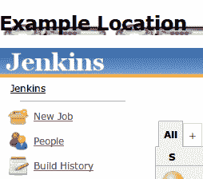
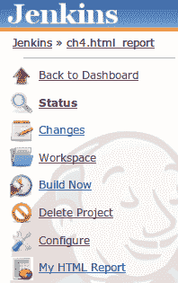
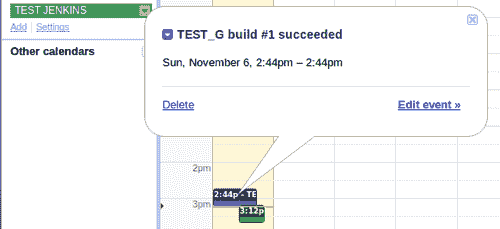
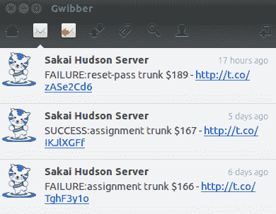
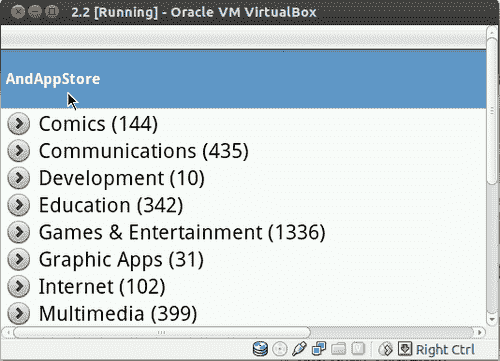

# 四、通过 Jenkins 来沟通

在本章中，我们将介绍以下食谱:

*   用简单主题插件剥皮 Jenkins
*   使用 WAR 覆盖对 Jenkins 进行剥皮和供应
*   生成主页
*   创建 HTML 报告
*   视图的有效使用
*   使用仪表板插件节省屏幕空间
*   用 HTML5 浏览器制造噪音
*   接待区的极致景观
*   使用谷歌日历的移动演示
*   发推给全世界
*   安卓和 IOS 的移动应用
*   通过谷歌分析了解你的受众

# 简介

本章探讨通过 Jenkins 的沟通，认识到有不同的目标受众。

Jenkins 是一个有才华的沟通者。它的主页显示了所有工作的状态，让您可以快速做出决定。您可以轻松设置多个视图，自然地对信息进行优先排序。Jenkins，带着它的大量插件，通过电子邮件、推特和谷歌服务通知你。它通过移动设备对你大喊大叫，在你走过大屏幕时辐射信息，用 USB 海绵导弹发射器向你开火。

主要受众是开发人员，但不要忘记希望使用正在开发的软件的更广泛的受众。这一章包括帮助你接触到更广泛的观众的食谱。

当创建一个连贯的通信策略时，有许多 Jenkins 特有的细节需要配置。本章将考虑以下几点:

*   **通知:**开发者需要快速知道什么时候有东西坏了。Jenkins 有很多插件；你应该选择几个符合团队精神的。
*   **移动友好插件:**通过在 Twitter 等知名社交媒体上触发通知，它确保了无需在移动设备上执行额外的安装任务即可访问全球受众。
*   **页面装饰:**页面装饰器是为每个页面添加内容的插件。通过添加您自己的样式表和 JavaScript，您可以廉价地生成企业外观。
*   **叠加 Jenkins:**使用 **Maven WAR** 插件，你可以在 Jenkins 上叠加你自己的内容。您可以使用它来添加自定义内容和提供资源，如主页，这将增强企业的外观和感觉。
*   **优化视图:**首页视图是显示在选项卡中的作业列表。读者可以利用首页快速决定选择哪份工作进行审核。插件扩展了视图类型的选择，优化了信息消化。这潜在地避免了进一步观察的需要，从而节省了宝贵的时间。
*   **通知驱动:**在大型显示器上，辐射信息的极端视图在视觉上看起来很棒。如果你把显示器放在接待处或咖啡机等喷水孔旁边，路人会吸收工作状态变化的起伏。这种观点崇高地暗示了贵公司的专业精神和产品路线图的稳定性。
*   **跟踪你的受众:**如果你是公开交流，你应该跟踪使用模式，这样你才能改善服务。考虑将您的 Jenkins 页面连接到谷歌分析或开源分析应用 Piwik。

### 类型

**颠覆知识库**

从本章开始，您将需要一个 Subversion 存储库。这将允许你以最自然的方式使用 Jenkins。如果您还没有存储库，可以在互联网上注册一些免费或半免费的服务，例如[http://www . straw-dogs . co . uk/09/20/6-free-SVN-project-hosting-services/](http://www.straw-dogs.co.uk/09/20/6-free-svn-project-hosting-services/)。

或者，可以考虑在本地设置 Subversion，例如[https://help.ubuntu.com/community/Subversion](http://https://help.ubuntu.com/community/Subversion)。

# 用简单主题插件剥皮 Jenkins

这个食谱通过主题插件修改了 Jenkins 的外观和感觉。

简单主题插件是一个页面装饰器；它用额外的 HTML 标签装饰每个页面。这个插件允许你上传样式表和 JavaScript 文件。然后可以通过本地网址访问这些文件。然后，每个 Jenkins 页面都用超文本标记语言标记来修饰，这些标记使用网址来拉进你上传的文件。虽然简单明了，但如果制作得当，视觉效果是强大的。

## 做好准备

安装[https://wiki . Jenkins-ci . org/display/JENKINS/Simple+主题+插件](http://https://wiki.jenkins-ci.org/display/JENKINS/Simple+Theme+Plugin)上提供的主题插件。

## 怎么做...

1.  在 Jenkins `userContent`目录下，创建一个名为 `my.js`的文件，内容如下:

    ```
    document.write("<h1 id='test'>Example Location</h1>")

    ```

2.  在 Jenkins `userContent`目录下创建一个 `my.css`文件，内容如下:

    ```
    @charset "utf-8";
    #test {
    background-image: url (/userContent/camera.png);
    }
    #main-table{
    background-image: url(/userContent/camera.png) !important;
    }

    ```

3.  浏览[http://openiconlibrary.sourceforge.net/gallery2/](http://openiconlibrary.sourceforge.net/gallery2/)并查看免费提供的图标。下载一个图标并添加到 `userContent`目录，将图标重命名为 `camera.png`。例如，考虑下载[http://openicon library . SourceForge . net/gallery 2/open _ icon _ library-full/icons/png/128 x128/徽记/徽章-camera.png](http://openiconlibrary.sourceforge.net/gallery2/open_icon_library-full/icons/png/128x128/emblems/emblem-camera.png)
4.  访问 Jenkins 主配置页面 `/configure`。在**主题**部分下，填写 CSS 和 JavaScript 文件的位置:
    *   **主题 CSS 的 URL:** `/userContent/my.css`
    *   **主题 JS 的 URL:** `/userContent/my.js`
5.  按**保存**。
6.  Return to the Jenkins home page, and review your work.

    

## 它是如何工作的...

简单主题插件是一个页面装饰器。它将以下信息添加到每一页:

```
</script>
<link rel="stylesheet" type="text/css" href="/userContent/my.css" />
<script src="/userContent/my.js" type="text/javascript">

```

JavaScript 用 `id='test'`在生成的页面顶部附近写一个标题。级联样式表通过 CSS 定位器 `#test`触发一个规则，将相机图标添加到背景中。

图片的尺寸不适合屏幕顶部；它们被浏览器修剪。这是一个你以后可以通过实验解决的问题。

第二个 CSS 规则是为 `main-table`触发的，这是 Jenkins 生成的标准首页的一部分。全摄像头图标显示在那里。

在参观 Jenkins 的其他地方时，你会注意到相机图标看起来断章取义，而且尺寸过大。您将需要时间来修改 CSS 和 JavaScript 以生成更好的效果。通过精心设计和定制代码，您可以让 Jenkins 符合您的企业形象。

### 类型

**CSS 3 怪癖**

浏览器类型和版本之间对各种 CSS 标准的支持有一些奇怪之处。有关概述，请访问以下页面:

[http://www.quirksmode.org/css/contents.html](http://www.quirksmode.org/css/contents.html)

## 还有更多...

这里还有几件事需要你考虑:

### CSS 3

CSS 3 有许多新功能；要在 JavaScript 生成的标题周围绘制一个按钮，请将 CSS 文件的 `#test`部分更改为:

```
test {
width: 180px; height: 60px;
background: red; color: yellow;
text-align: center;
-moz-border-radius: 40px; -webkit-border-radius: 40px;
}

```

使用 Firefox，CSS 规则生成了以下按钮:


### 注

不耐烦的可以在 Smashing Magazine 网站下载一份 CSS 3 小抄:http://coding . smashingmagazine . com/WP-content/uploaimg/css3-小抄/css3-小抄. pdf

### 包含 JavaScript 库框架

Jenkins 使用 **YUI** 图书馆([http://developer.yahoo.com/yui/](http://developer.yahoo.com/yui/))。在每一个 HTML 页面中修饰，核心的 YUI 库 `yahoo-min.js`被拉进来准备重用。然而，许多 web 开发人员已经习惯了 jQuery。您也可以通过安装 jQuery 插件([https://wiki.jenkins-ci.org/display/JENKINS/jQuery+Plugin](https://wiki.jenkins-ci.org/display/JENKINS/jQuery+Plugin))来包含该库。您也可以考虑通过 WAR 覆盖将您最喜欢的 JavaScript 库添加到 Jenkins `/scripts`目录中(参见下一个食谱)。

### 信任，但验证

权力越大，责任越大。如果您的 Jenkins 部署仅由少数管理员维护，您很可能会相信每个人都添加了没有有害副作用的 JavaScript。但是，如果您有大量使用各种 Java 库的管理员，您的维护和安全风险会迅速增加。请考虑您的安全策略，至少添加一个审计插件来跟踪操作。

## 另见

*   *使用 WAR 叠加对 Jenkins 进行剥皮和供应*
*   *生成主页*

# 使用 WAR 覆盖对 Jenkins 进行剥皮和供应

这个配方描述了如何将内容覆盖到 Jenkins 战争文件上。有了 WAR 覆盖，你可以改变 Jenkins 的外观和感觉，为企业品牌和主页的内容供应做好准备。使用添加您自己的自定义 `favicon.ico`(网络浏览器地址栏中的图标)的基本示例。它需要名义上的努力来包含更多的内容。

Jenkins 将其版本作为依赖项保存在 Maven 存储库中。您可以使用 Maven 拉入 WAR 文件，展开它，添加内容，然后重新打包。这使您能够调配资源，如图像、主页、地址栏中称为 favicon 的图标、 `robots.txt`(这会影响搜索引擎浏览您的内容的方式)等。

小心——如果 Jenkins 的结构和图形内容不会随着时间的推移而发生根本变化，那么使用 WAR 覆盖会很便宜。但是，如果覆盖层确实破坏了结构，那么在您执行详细的功能测试之前，您可能不会发现这一点。

你也可以通过 WAR 叠加考虑最小的改变，也许只改变 `favicon.ico`，添加图像和 `userContent`，然后使用简单主题插件(见前面的食谱)来做造型。

## 做好准备

为该配方中的文件创建一个名为 `ch4.communicating/war_overlay`的目录。

## 怎么做...

1.  浏览到 Maven 存储库，[https://maven.glassfish.org/content/groups/public/](http://https://maven.glassfish.org/content/groups/public/)，并查看 Jenkins 依赖项。
2.  创建以下 `pom.xml`文件。请随意更新到较新的 Jenkins 版本。

    ```
    <project xmlns= "http://maven.apache.org/POM/4.0.0" xmlns:xsi= "http://www.w3.org/2001/XMLSchema-instance" xsi:schemaLocation="http://maven.apache.org/POM/4.0.0 http://maven.apache.org/maven-v4_0_0.xsd">
    <modelVersion>4.0.0</modelVersion>
    <groupId>nl.uva.berg</groupId>
    <artifactId>overlay</artifactId>
    <packaging>war</packaging>
    <!-- Keep version the same as Jenkins as a hint -->
    <version>1.437</version>
    <name>overlay Maven Webapp</name>
    <url>http://maven.apache.org</url>
    <dependencies>
    <dependency>
    <groupId>org.jenkins-ci.main</groupId>
    <artifactId>jenkins-war</artifactId>
    <version>1.437</version>
    <type>war</type>
    <scope>runtime</scope>
    </dependency>
    </dependencies>
    <repositories>
    <repository>
    <id>m.g.o-public</id>
    <url> http://maven.glassfish.org/content/groups/public/ </url>
    </repository>
    </repositories>
    </project>

    ```

3.  访问一个 `favicon.ico`代网站，如[http://www.favicon.cc/](http://www.favicon.cc/)。按照他们的指示，创建自己的 `favicon.ico`。或者，使用提供的示例。
4.  将 `favicon.ico`添加到 `src/main/webapp`位置。
5.  创建目录 `src/main/webapp/META-INF`并添加一个名为 `context.xml`的文件，内容如下:

    ```
    <Context logEffectiveWebXml="true"path="/"></Context>

    ```

6.  在您的顶级目录中，运行以下命令:

    ```
    mvn package

    ```

7.  在新生成的目标目录中，会看到 `overlay-1.437.war`文件。查看内容，确认您已修改 `favicon.ico`。
8.  (Optional) Deploy the WAR file to a local Tomcat server, and verify and browse the updated Jenkins server.

    

## 它是如何工作的...

Jenkins 通过中央 Maven 存储库公开了其 WAR 文件。这允许您通过标准的 Maven 依赖管理引入特定版本的 Jenkins。

Maven 使用约定。它希望在 `src/main/webapp`或 `src/main/resources`找到要覆盖的内容。

`context.xml`文件定义了网络应用的某些行为，例如数据库设置。在本例中，设置 `logEffectiveWebXML`要求 Tomcat 记录应用启动的具体信息([http://tomcat.apache.org/tomcat-7.0-doc/config/context.html](http://tomcat.apache.org/tomcat-7.0-doc/config/context.html))。该设置是在 Jenkins Wiki([https://Wiki . Jenkins-ci . org/display/Jenkins/Installation+via+Maven+WAR+Overlay](https://wiki.jenkins-ci.org/display/JENKINS/Installation+via+Maven+WAR+Overlay)中推荐的。该文件被放在 `META-INF`目录中，因为 Tomcat 无需重启服务器就可以在这里获取设置。

`<packaging>war</packaging>`标签告诉 Maven 使用 WAR 插件进行打包。

你在最终叠加战争的名称中使用了与原始 Jenkins 战争版本相同的版本号。如果 Jenkins 版本发生变化，就更容易发现了。这再次强调了使用约定有助于可读性并减少出错的机会。从验收环境部署到生产环境时，应该删除版本号。

在 `pom.xml`文件中，您将[https://maven.java.net/content/groups/public/](http://https://maven.java.net/content/groups/public/)定义为查找 Jenkins 的存储库。

Jenkins WAR 文件是作为类型为— `war`和范围为— `runtime`的依赖项引入的。 `runtime`范围表示依赖关系不是编译所必需的，而是执行所必需的。有关作用域的更多详细信息，请参考。

关于 WAR 叠加的更多细节，请参考[http://maven.apache.org/plugins/maven-war-plugin/](http://maven.apache.org/plugins/maven-war-plugin/)。

### 类型

**逃避工作**

为了限制维护工作，最好安装额外的内容，而不是替换其他地方或第三方插件可能使用的内容。

## 还有更多...

如果你想完全改变 Jenkins 的外观和感觉，你需要涵盖很多细节。以下部分提到了一些细节:

### 可以替换哪些类型的内容？

Jenkins 服务器部署在两个主要位置:

*   第一个位置是核心应用
*   第二个位置是工作区，它存储变化的信息

要更全面地了解内容，请查看目录结构。Linux 中一个有用的命令是 `tree`命令——它显示目录结构。要在 Ubuntu 下安装，请使用以下命令:

```
apt-get install tree

```

对于 Jenkins Ubuntu 工作空间，使用以下命令生成工作空间的树形视图:

```
tree -d -L 1 /var/lib/Jenkins

```

*   **指纹:**这是一个存储校验和的目录，用于唯一识别文件
*   **作业:**该目录存储作业配置和构建结果
*   **插件:**这是插件部署和大部分配置的目录
*   **工具:**这是部署 Maven、Ant 等工具的目录
*   **更新:**这个目录包含插件更新的信息
*   **用户内容:**该目录的内容在 `/userContent]` 下提供
*   **用户**—该目录包含 `/me` 下显示的用户信息

webapp 的默认 Ubuntu 位置是 `/var/run/Jenkins/war`。如果您是从命令行运行 Jenkins，那么放置 webapp 的选项是 `webroot`。

*   **CSS**—这是 Jenkins 样式表的位置
*   **可执行文件**—用于从命令行运行 Jenkins
*   **favicon . ico**—这是我们在这个食谱中替换的图标
*   **帮助**—本目录包含帮助内容
*   **图像**—该目录存储不同大小的图形
*   **META-INF**—这是生成 WAR 的清单文件和 `pom.xml`文件的位置
*   **robots . txt**—这个文件用来告诉搜索引擎他们可以在哪里爬行
*   **脚本**—这是 JavaScript 库位置
*   **WEB-INF**—这是 WEB 应用的 servlet 部分的主要位置
*   **winstone . jar**—这是 servlet 容器；更多信息，请参考[http://winstone.sourceforge.net/](http://winstone.sourceforge.net/)T4】

### 搜索引擎和机器人. txt

如果您要添加自己的自定义内容，如用户主页、公司联系信息或产品详细信息，请考虑修改顶级文件— `robots.txt`。目前，它将搜索引擎排除在所有内容之外。

```
# we don't want robots to click "build" links
User-agent: *
Disallow: /

```

你可以在[http://www.w3.org/TR/html4/appendix/notes.html#h-B.4.1.1](http://www.w3.org/TR/html4/appendix/notes.html#h-B.4.1.1)找到 `robots.txt`文件结构的全部细节

谷歌使用更丰富的结构，允许以及**不允许**搜索引擎发现内容；参见[。](http://https://developers.google.com/webmasters/control-crawl-index/docs/robots_txt)

以下 `robots.txt`文件允许谷歌爬虫访问目录 `/userContent/corporate/`。这是一个开放的问题，如果所有的网络爬虫将遵守的意图。

```
User-agent: *
Disallow: /
User-agent: Googlebot
Allow: /userContent/corporate/

```

## 另见

*   *用简单主题插件*剥皮 Jenkins
*   *生成主页*

# 生成主页

用户的主页是表达组织身份的好地方。你可以创造出一致的外观和感觉来表达你的团队精神。

该食谱将探索在 `/user/userid`目录下找到的主页的操作，并由用户通过 Jenkins `/me`文件夹路径进行配置。

## 做好准备

安装头像插件([https://wiki.jenkins-ci.org/display/JENKINS/Avatar+Plugin](https://wiki.jenkins-ci.org/display/JENKINS/Avatar+Plugin))。为用户创建一个 Jenkins 账户 `fakeuser`。您可以使用多种身份验证策略来配置 Jenkins 该选择将影响您创建用户的方式。一个例子是使用基于项目的矩阵战术，这在*通过自定义脚本[第 2 章](2.html "Chapter 2. Enhancing Security")、*增强安全性*中的*配方审查基于项目的矩阵战术中有详细说明。

## 怎么做...

1.  浏览位置[http://en . Wikipedia . org/wiki/Wikipedia:Public _ domain _ image _ resources](http://en.wikipedia.org/wiki/Wikipedia:Public_domain_image_resources)获取图像的公共域来源列表。
2.  在[http://commons.wikimedia.org/wiki/Main_Page](http://commons.wikimedia.org/wiki/Main_Page)搜索开源图片。
3.  Download the image from [http://commons.wikimedia.org/wiki/File%3ACharles_Richardson_(W_H_Gibbs_1888).jpg](http://commons.wikimedia.org/wiki/File%3ACharles_Richardson_(W_H_Gibbs_1888).jpg), by clicking the link **Download Image File: 75 px**.

    ### 注

    **注意:**如果图像不再可用，请选择另一个。

    

4.  以 `fakeuser`身份登录您的牺牲型 Jenkins 服务器，并在 `http://localhost:8080/user/fakeuser/configure`访问其配置页面。
5.  Upload the image under the **Avatar** section.

    

6.  Review the URL `http://localhost:8080/user/fakeuser/avatar/image`.

    ### 注

    **注意:**你现在可以随时使用这个已知的网址来显示你的头像。

7.  在工作描述中添加以下文本:

    ```
    <script type="text/JavaScript">
    function changedivview()
    {
    var elem=document.getElementById("divid");
    elem.style.display= (elem.style.display=='none')? 'block':'none';
    }
    </script>
    <h2>OFFICIAL PAGE</h2>
    <div id="divid">
    <table border=5 bgcolor=gold>
    <tr><td>HELLO WORLD </td> </tr>
    </table>
    </div>
    <a href="javascript:;" onClick="changedivview();">Switch</a><p>

    ```

8.  访问 `/user/fakeuser`页面。描述中会有一个链接，名为**切换**。如果点击链接，**你好世界**内容将出现或消失。
9.  将 `fakeuser`的用户目录复制到目录 `fakeuser2`中，例如/var/lib/Jenkins/user/fakeuser 2。
10.  在 `fakeuser2`目录中找到的 `config.xml`文件中，将标签`<fullName>`的值从 `fakeuser`更改为 `fakeuser2`。将`<emailAddress>`值更改为 `fakeuser2@dev.null`。
11.  以 `fakeuser2`登录，密码与 `fakeuser`相同。
12.  访问主页 `/user/fakeuser2`。请注意电子邮件地址的更新。

## 它是如何工作的...

化身插件允许你上传一张图片给 Jenkins。图像的网址位于固定位置。您可以使用简单主题插件重用图像来添加内容，而无需使用 WAR 覆盖。

有大量的公共领域和开源图片可以免费获得。在生成自己的内容之前，值得回顾一下互联网上的资源。如果你创作内容，考虑捐赠给一个开源档案库，比如[http://archive.org](http://archive.org)。

除非你对 HTML 标签和 JavaScript 过滤描述(见[第三章](3.html "Chapter 3. Building Software")、*建筑软件*中的配方*通过建筑描述*展示信息)，否则你可以使用自定义的 JavaScript 或 CSS 动画来为你的个性化 Jenkins 添加眼中钉。

您的 `fakeuser`信息存储在 `/user/fakeuser/config.xml`中。通过复制到另一个目录并稍微修改 `config.xml`文件，您已经创建了一个新的用户帐户。该格式可读性强，易于构建成模板，用于创建更多的帐户。您创建了 `fakeuser2`帐户来证明这一点。

通过使用 WAR 覆盖方法并添加额外的包含自定义 `config.xml`文件的 `/user/username`目录，您可以控制 Jenkins 用户群，例如，从中央供应脚本或在第一次登录尝试时，使用自定义授权脚本(参见[第 2 章](2.html "Chapter 2. Enhancing Security")、*增强安全性*中的*使用脚本领域身份验证进行供应】。*

## 还有更多...

您可以通过使用模板 `config.xml`来加强一致性。这将加强更广泛的统一结构。您可以将初始密码设置为已知值，也可以将其保留为空。只有在从创建用户到首次登录的时间非常短的情况下，空密码才有意义。你应该认为这是一种不好的做法；等待发生的问题。

描述存储在描述标签下。内容存储为网址转义文本。例如，`<h1>Description</h1>`存储为:

```
<description>&lt;h1&gt;DESCRIPTION&lt;/h1&gt;</description>

```

许多插件也将它们的配置存储在同一个 `config.xml`中。随着 Jenkins 服务器中插件数量的增加，这在您了解产品时是很自然的，您将需要偶尔检查模板的完整性。

## 另见

*   *用简单主题插件*剥皮 Jenkins
*   *使用 WAR 叠加对 Jenkins 进行剥皮和供应*
*   *通过自定义脚本*查看基于项目的矩阵战术，在[第 2 章](2.html "Chapter 2. Enhancing Security")、*增强安全性*

# 创建 HTML 报告

首页左边的工作菜单是有价值的房地产。开发者的眼睛自然会扫描这个区域。这个食谱描述了如何从一个自定义的 HTML 报告添加一个链接到菜单，让报告更快地被注意到。

## 做好准备

安装 HTML 发布者插件([https://wiki . JENKINS-ci . org/display/JENKINS/HTML+发布者+插件](https://wiki.jenkins-ci.org/display/JENKINS/HTML+Publisher+Plugin))。我们假设您有一个提交了 Packt 代码的 Subversion 存储库。

## 怎么做...

1.  创建一个自由风格的软件项目，命名为 `ch4.html_report`。
2.  在**源代码管理**部分，点击**颠覆**。
3.  在**模块**部分下，将 `Repo/ch4.communicating/html_report`添加到**存储库网址**，其中 `Repo`是您的 Subversion 存储库的网址。
4.  在**后期构建操作**部分，勾选**发布 HTML 报告**，增加以下详细信息:
    *   **要存档的 HTML 目录:** `target/custom_report`
    *   **索引页:** `index.html`
    *   **报告标题:** `My HTML Report`
    *   勾选复选框**保留过去的 HTML 报告**
5.  按**保存**。
6.  Run the job and review the left-hand menu. You will now see a link to your report:

    

## 它是如何工作的...

您的 Subversion repo 包含一个 `index.html`文件，该文件被拉入作业的工作区。该插件像广告一样工作，并添加了一个指向 HTML 报告的链接。这使您的受众能够高效地找到您定制的信息。

## 还有更多...

示例报告如下所示:

```
<html>
<head>
<title>Example Report</title>
<link rel="stylesheet" type="text/css" href="/css/style.css" />
</head>
<body>
<h2>Generated Report</h2>
Example icon: 
</body>
</html>

```

它引入了主 Jenkins 样式表 `/css/style.css`。

当您在应用中更新样式表时，在您清理浏览器缓存之前，您可能看不到浏览器中的更改。Jenkins 以一种巧妙的方式避开了这个延迟问题。它使用一个带有唯一号码的网址，该号码随每个 Jenkins 版本而变化。例如，对于 `css`目录，您有两个 URL:

*   `/css`
*   `/static/uniquenumber/css`

大多数 Jenkins 网址使用后一种形式。考虑为您的样式表这样做。

### 注

**注意:**每个版本的唯一编号都会改变，所以每次升级都需要更新 URL。

在 Maven 构建中运行站点目标时，会生成一个本地网站([http://maven.apache.org/plugins/maven-site-plugin](http://maven.apache.org/plugins/maven-site-plugin))。这个网站在 Jenkins 的工作中有一个固定的网址，你可以通过**我的 HTML 报告**链接指向它。这使得测试结果等文档触手可及。

## 另见

*   *视图的有效利用*
*   *使用仪表盘插件*节省屏幕空间

# 视图的高效使用

Jenkins 容易上瘾，这有助于创造大量就业机会。这增加了暴露给开发者的信息量。Jenkins 需要通过有效利用浏览器空间来避免混乱。一种方法是定义最小视图。在本食谱中，您将使用**下拉工具栏**插件。这个插件删除了选项卡视图，并用一个选择框替换它们。这有助于更快的导航。还将向您展示如何使用脚本生成的简单 HTML 表单快速提供大量作业。

### 注

**警告:**在本食谱中，您将创建大量的视图，稍后您可能想要删除这些视图。如果您正在使用 VirtualBox 映像，请考虑克隆该映像，并在完成后删除。

## 做好准备

从[https://wiki . JENKINS-ci . org/display/JENKINS/DrOp+ViewsTabBar+Plugin](http://https://wiki.jenkins-ci.org/display/JENKINS/DropDown+ViewsTabBar+Plugin)安装 DropDown ViewsTabBar 插件。

## 怎么做...

1.  将以下 Perl 脚本剪切并粘贴到名为 `create.pl:`

    ```
    #!/usr/bin/perl
    $counter=0;
    $end=20;
    $host='http://localhost:8080';
    while($end > $counter){
    $counter++;
    print "<form action=$host/ createItem?mode=copy method=POST>\n";
    print "<input type=text name=name value=CH4.fake.$counter>\n";
    print "<input type=text name=from value=Template1 >\n";
    print "<input type=submit value='Create CH4.fake.$counter'>\n";
    print "</form><br>\n";
    print "<form action=$host/job/ CH4.fake.$counter/doDelete method=POST>\n";
    print "<input type=submit value='Delete CH4.fake.$counter'>\n";
    print "</form><br>\n";
    }

    ```

    的可执行文件中
2.  从 Perl 脚本的输出创建一个 HTML 文件，例如:

    ```
    perl create.pl > form.html

    ```

3.  在网络浏览器中，以管理员身份登录 Jenkins。
4.  创建工作 `Template1`，添加任何你想要的细节。这是您的模板作业，将被复制到许多其他作业中。
5.  将 `form.html`加载到同一个浏览器中。
6.  点击所有**创建 CH4 .假**按钮。
7.  访问 Jenkins 的首页，确认作业已经创建并且基于 `Template1`作业。
8.  使用随机选择的作业创建大量视图。回顾头版，注意混乱。
9.  访问配置屏幕， `/configure`。从**视图选项卡**栏选择框中，选择**下拉视图工具栏提供了一个下拉菜单，用于选择视图**选项。
10.  In the subsection **DropDown ViewsTabBar**, check the **Show Job Counts** box.

    

11.  Press the **Save** button.

    

## 它是如何工作的...

一旦您以管理员身份登录到 Jenkins，就可以创建作业。您可以通过图形用户界面或发送开机自检信息来实现这一点。在本食谱中，我们将名为 `Template1`的作业复制到以 `CH4.fake`开头的新作业中。

```
<form action= http://localhost:8080/createItem?mode=copy method=POST>
<input type=text name=name value=CH4.fake.1>
<input type=text name=from value=Template1 >
<input type=submit value='Create CH4.fake.1'>
</form>

```

您使用的 `POST`变量是 `name`，表示新作业的名称，以及 `from`，表示模板作业的名称。 `POST`动作的网址是 `/createItem?mode=copy`。

要更改主机名和端口号，您必须更新在 Perl 脚本中找到的 `$host`变量。

要删除一个作业，Perl 脚本生成的表单带有指向 `/job/Jobname/doDelete`的动作(例如 `/job/CH4.fake.1/doDelete)`)。不需要额外的变量。

要增加表单条目的数量，您可以更改 `$end`变量的值。

## 还有更多...

Jenkins 使用订书机([http://stapler.java.net/what-is.html](http://stapler.java.net/what-is.html))将服务绑定到网址。插件也使用订书机。当你安装插件时，潜在动作的数量也会增加。这意味着你可以通过类似于这个食谱的 HTML 表单激活很多动作。您将在[第 7 章](7.html "Chapter 7. Exploring Plugins")、*探索插件*中发现，向订书机编写绑定代码只需要很少的努力。

## 另见

*   *使用仪表盘插件*节省屏幕空间

# 使用仪表盘插件节省屏幕空间

在前面的方法中，您发现可以使用 DropDown ViewsTabBar 插件节省水平选项卡空间。在本食谱中，您将使用仪表板视图插件来压缩水平空间的使用。压缩水平空间有助于有效地吸收信息。

仪表板视图插件允许您配置视图区域，以显示特定功能，例如，作业的网格视图或显示失败作业子集的视图区域。用户可以拖放屏幕周围的区域。

### 注

**注意:**开发人员已经让仪表盘变得易于扩展，所以期待以后有更多的选择。

## 做好准备

安装仪表板视图插件([https://wiki.jenkins-ci.org/display/JENKINS/Dashboard+View](https://wiki.jenkins-ci.org/display/JENKINS/Dashboard+View))。要么手工创建一些作业，要么使用在前面的食谱中提供作业的 HTML 表单。

## 怎么做...

1.  作为 Jenkins 管理员，登录到 Jenkins 实例的主页。
2.  点击屏幕顶部第二个标签中的 **+** 号，创建一个新视图。
3.  选择**仪表盘视图**。
4.  在**工作**部分，选择几个你的假工作。
5.  将**仪表板门户**保留为默认设置。
6.  点击**确定**。现在，您将看到一个空白的视图屏幕。
7.  在左侧菜单中，点击链接**编辑视图**。
8.  在视图的**仪表板 portlet**部分，选择以下选项:
    *   **将仪表板门户添加到视图顶部:** `Jobs Grid`
    *   **将仪表板门户添加到视图底部:** `Unstable Jobs`
9.  At the bottom of the configuration screen, press the **OK** button. You will now see the dashboard view.

    

    ### 注

    **注意:**您可以使用箭头图标扩展或缩小功能区域。

    

## 它是如何工作的...

仪表板插件将屏幕分成多个区域。在仪表板配置期间，您可以选择作业网格和不稳定的作业 Portlets。其他仪表板 Portlets 包括作业列表、最新版本、从属统计、测试统计(图表或网格)、测试趋势图等。随着插件的成熟，会有更多的选择。

与其他视图相比，**作业网格** portlet 节省了空间，因为显示的作业密度很高。

### 注

**警告:**如果你也在使用多视图选项卡(见上一个食谱)，有一点小故障。单击仪表板标签时，将显示原始视图集，而不是选择框。

## 还有更多...

仪表板插件为其他插件开发人员创建仪表板视图提供了一个框架。这种用法的一个例子是项目统计插件([https://wiki . JENKINS-ci . org/display/JENKINS/Project+Statistics+Plugin](https://wiki.jenkins-ci.org/display/JENKINS/Project+Statistics+Plugin))。

## 另见

*   *创建 HTML 报告*
*   *视图的有效利用*

# 用 HTML5 浏览器制造噪音

该方法描述了当事件(如成功构建)发生时，如何向 Jenkins 用户的浏览器发送自定义声音。您也可以在任意时间发送声音消息。这不仅对喜欢被著名演员喊、唱给他们听的开发人员有好处，对正在大型服务器场中寻找计算机的系统管理员也有好处。

## 做好准备

安装 Jenkins 声音插件([https://wiki . Jenkins-ci . org/display/Jenkins/Jenkins+声音+插件](https://wiki.jenkins-ci.org/display/JENKINS/Jenkins+Sounds+plugin))。确保你安装了兼容的网络浏览器，比如说当前版本的火狐或者 Chrome。

### 注

有关浏览器中 HTML5 合规性的更多详细信息，请考虑查看[http://en . Wikipedia . org/wiki/Comparison _ of _ layout _ engines _ % 28 html 5% 29](http://en.wikipedia.org/wiki/Comparison_of_layout_engines_%28HTML5%29)。

## 怎么做...

1.  以 Jenkins 管理员身份登录，在 `/configure`访问**配置系统**屏幕。
2.  在**Jenkins 声音**部分，勾选**通过启用 HTML5 音频的浏览器**播放。
3.  按下**保存**按钮。
4.  选择 Jenkins 主页上的**工作创建**链接。
5.  用作业名 `ch4.sound`创建一个**新作业**。
6.  选择**构建自由风格的软件项目**。
7.  按**确定**。
8.  在**后期构建动作**部分，勾选**Jenkins 声音**选项。
9.  Add two sounds: `EXPLODE` and `doh`.

    

10.  按**保存**。
11.  点击**立即构建**链接。
12.  成功后，您的浏览器将播放 `EXPLODE.wav`文件中的声音。
13.  编辑您的作业，使其失败，例如，通过添加不存在的源代码存储库。
14.  再次构建作业。失败时，您的网络浏览器将播放 `doh.wav`文件。

## 它是如何工作的...

您已经成功地将作业配置为根据构建的成功或失败来播放不同的声音。

您可以通过配置哪些事件转换会触发声音来进一步优化插件的反应。例如，如果以前的构建结果是失败的，而当前的构建结果是成功的。这在复选框的**上一个构建结果**集合中定义。

该插件作为页面装饰器工作。它添加了以下异步轮询新声音的 JavaScript。您的浏览器完成了大部分工作，释放了服务器资源。

```
<script src="/sounds/script" type="text/javascript">
</script>
<script type="text/javascript" defer="defer">
function _sounds_ajaxJsonFetcherFactory (onSuccess, onFailure)
{
return function()
{
new Ajax.Request("/sounds/getSounds", { parameters: { version: VERSION }, onSuccess: function(rsp) { onSuccess(eval('x='+rsp.responseText))
},
onFailure: onFailure
});
}
}
if (AUDIO_CAPABLE) {
_sounds_pollForSounds (_sounds_ajaxJsonFetcherFactory);
}
</script>

```

## 还有更多...

声音插件还允许您将任意声音流式传输到连接的网络浏览器。这不仅对于针对您的分布式团队的恶作剧和激励性演讲有用，您还可以执行有用的操作，例如在重新启动服务器之前的十分钟警告警报。

你可以在[http://www.archive.org/details/opensource_audio](http://www.archive.org/details/opensource_audio)找到一些不错的声音收藏。

例如，您可以在[http://www.archive.org/details/OpenPathMusic44V2](http://www.archive.org/details/OpenPathMusic44V2)找到“每个孩子一台笔记本电脑”音乐库的副本。在收藏中，你会发现 `shenai.wav`。首先，将声音添加到互联网上可以找到的地方。一个好地方是 Jenkins `userContent`目录。要在任何连接的网络浏览器上播放声音，您需要访问以下地址(将 `localhost:8080`替换为您自己的地址):

`http://localhost:8080/sounds/playSound?src=http://localhost:8080/userContent/shenai.wav`

## 另见

*   *通过火狐*[第一章](1.html "Chapter 1. Maintaining Jenkins")*与 Jenkins 保持联系维护 Jenkins*

# 接待区的极景

敏捷项目强调沟通的作用，而不是记录的需要。**信息辐射器**帮助快速返回反馈。信息辐射器有两个主要特征:它们随着时间的推移而变化，并且呈现的数据易于消化。

极限反馈插件是信息辐射器的一个例子。这是一个高度可视化的 Jenkins 视图。如果布局的格式一致，并显示在大型显示器上，则非常适合该任务。也可以把这看作是你发展过程中的一个正面广告，你可以把它展示在你的接待处后面，或者经常光顾的社交场所，比如咖啡机旁或者项目室。

在这个食谱中，您将通过描述中的 HTML 标签添加 eXtreme Feedback 插件并修改它的外观。

## 做好准备

安装 eXtreme 反馈插件([https://wiki . JENKINS-ci . org/display/JENKINS/eXtreme+反馈+面板+插件](https://wiki.jenkins-ci.org/display/JENKINS/eXtreme+Feedback+Panel+Plugin))。

## 怎么做...

1.  创建一个具有描述性名称的作业，如**黑板报 PRD Access** ，并添加以下描述:

    ```
    <center>
    <p>Writes Blackboard sanity reports<br>
    and sends them to a list.
    <table border="1" class="myclass">
    <tr><td>More Details</td></tr>
    </table>
    </center>

    ```

2.  创建名为 `eXtreme`的新视图(`/newView`)。检查**极限反馈面板**。
3.  按下**确定**按钮，选择 6 到 24 个已经创建的作业，包括之前在该配方中创建的作业。
4.  将**列数**设置为 `2`。
5.  刷新时间(秒)至 `20`。
6.  点击**显示职位描述**。
7.  按**确定**。
8.  Experiment with the settings. Optimizing the view depends on the monitors used and the distance from the monitor that the audience will view.

    

## 它是如何工作的...

设置和运行这个信息辐射器很简单。结果为您的软件过程动态提供了一个漂亮的渲染视图。

将刷新率设置为 20 秒是有争议的。更新之间的长时间延迟会降低观众的兴趣。

你写了一个部分格式化的描述。你可以看到信息区比其他项目更容易消化。这强调了需要按照内部惯例，在一定长度下编写一致的描述，以自然地适合屏幕。更长、更具描述性的作业名称有助于查看者更好地理解作业的上下文。

## 还有更多...

信息辐射器很有趣，有各种各样的形状和形式。从大显示器上显示的不同视图，到 USB 海绵导弹发射，再到著名演员的谩骂之声(见*用 HTML5 浏览器制造噪音*食谱)。

Jenkins 的一些电子项目范例值得探索:

*   **熔岩灯**——[https://wiki . JENKINS-ci . org/display/JENKINS/熔岩+灯+通知器](https://wiki.jenkins-ci.org/display/JENKINS/Lava+Lamp+Notifier)
*   **USB 导弹发射器**——[https://github.com/codedance/Retaliation](https://github.com/codedance/Retaliation)T4】
*   **红绿灯**——[http://code.google.com/p/hudsontrafficlights/](http://code.google.com/p/hudsontrafficlights/)T4】

记住，我们在外面要小心。

## 另见

*   *使用仪表盘插件*节省屏幕空间
*   *用 HTML5 浏览器制造噪音*

# 使用谷歌日历的移动演示

Jenkins 插件可以将构建历史推送到不同的知名社交媒体服务。两个主要服务是**谷歌日历**(用于议程)和**推特**。现代安卓或 IOS 移动设备已经为这两种服务预装了应用，降低了采用的障碍。在这个食谱中，我们将配置 Jenkins 使用谷歌日历。

## 做好准备

下载安装谷歌日历插件([https://wiki . JENKINS-ci . org/display/JENKINS/Google+Calendar+Plugin](https://wiki.jenkins-ci.org/display/JENKINS/Google+Calendar+Plugin))。确保你有一个 Gmail 的**测试**用户账户。

## 怎么做...

1.  登录 Gmail，访问**日历**页面。
2.  在**我的日历**部分下创建一个新日历。
3.  添加日历名称 `Test for Jenkins`。
4.  点击**创建日历**。默认情况下，新日历是私有的。暂时保密。
5.  在**我的日历**部分，点击**Jenkins 测试**旁边的向下箭头图标，选择**日历设置**选项。
6.  Right-click on the **XML** button; copy the link location.

    

7.  查看**部分嵌入此日历**。它描述了如何将日历添加到网页。剪切并粘贴提供的代码到一个空的 HTML 页面。保存并在网络浏览器中查看。
8.  以管理员身份登录 Jenkins。
9.  创建一个名为 `Test_G`的新作业。
10.  在**发布构建**部分，勾选**将作业状态发布到谷歌日历**。
11.  将您从 XML 按钮复制的日历详细信息添加到**日历网址**文本框中。
12.  Add your Gmail login name and password.

    

13.  按**保存**。
14.  建立你的工作，确保它成功。
15.  Log in to Gmail and visit the **Calendar** page. You will now see the build's success has been published.

    

## 它是如何工作的...

通过在谷歌中创建一个日历，并且只使用三个配置设置，您已经向谷歌日历公开了选定的 Jenkins 作业。通过相同的配置，您可以将大多数现代智能手机和平板电脑连接到日历。

## 还有更多...

在 `plugins`目录下，在 Jenkins 工作区下，你会发现一个 HTML 文件，用于帮助配置 Google 插件，名为 `/plugins/gcal/help-projectConfig.html`。

将内容替换为以下内容:

```
<div>
<p>
Add your local comments here:
</p>
</div>

```

重启 Jenkins 服务器后，访问插件配置 `/configure`。您现在将看到新内容。


这个例子是反模式的。如果您需要根据本地需求更改内容，最好与社区合作，添加到 Jenkins SCM 中，这样每个人都可以看到并改进。

你会立即被告知你的内容没有国际化。它需要被翻译成 Jenkins 本地支持的语言。幸运的是，在每个 Jenkins 页面的底部，都有一个链接，志愿者可以用来上传翻译。翻译工作只需要最少的启动工作，并且是从开源项目开始的简单方法。

### 注

有关如何在 Jenkins 中使用属性文件进行国际化的更多开发细节，请阅读[https://wiki . Jenkins-ci . org/display/JENKINS/国际化](http://https://wiki.jenkins-ci.org/display/JENKINS/Internationalization)。

## 另见

*   *推文世界*
*   *安卓和 IOS 的移动应用*

# 推文世界

开源代码是可延展的；您可以下载、修改、提交和审查代码，并对其质量形成自己的判断。推特频道对经理们来说是一个很好的机会，他们可以看到成功和失败的历史，因为他们试图形成一个关于产品路线图是否现实的观点。大多数现代社交设备，如安卓或 IOS 移动设备，都内置了推特应用。唯一需要的配置是您的用户帐户信息。这个食谱概述了如何让 Jenkins 发推。

### 注

**Sakai** 是一个开源学习管理系统，被全世界数百万学生使用，包括我工作的阿姆斯特丹大学。酒井利用 Jenkins 建立其各种子项目；见 `@sakaibuilds`。

## 做好准备

安装推特插件([http://wiki.hudson-ci.org/display/HUDSON/Twitter+Plugin](http://wiki.hudson-ci.org/display/HUDSON/Twitter+Plugin))并从同一个维基页面下载 `auth.jar`。

## 怎么做...

1.  从命令行运行:

    ```
    java jar auth.jar

    ```

2.  查看输出，类似于:

    ```
    [Thu Nov 10 15:54:49 CET 2011] Will use class twitter4j.internal.logging.StdOutLoggerFactory as logging factory.
    [Thu Nov 10 15:54:49 CET 2011] Will use twitter4j.internal.http.HttpClientImpl as HttpClient implementation.
    Open the following URL and grant access to your account:
    http://api.twitter.com/oauth/authorize?oauth_token=DlztJbtlOzjNL5Fv7g5otrQEdBW3WvRxxNQWwmhLnk

    ```

3.  登录 `twitter.com`，按照你输出中提到的链接(从 `http://api)`开始，复制 PIN 号。
4.  在命令行输入您的个人识别码。现在，您将在 Jenkins 中看到两个需要配置的令牌，命令行输出类似于:

    ```
    access token:136212584-Mhql5s0kJopUJ31HOMt4S5Lm0lffKci8nErpTddJ
    access token secret:igfGaJaf5iSVJpCc5wK31hKZsyP6SFWMvWoWhOEZ80

    ```

5.  访问 Jenkins 配置系统页面 `(/configure)`。
6.  Under **Global Twitter Settings**, update **Token** and **TokenSecret**. Check both **Only Tweet on Failure or Recovery** and **Include the Build URL in the Tweet**.

    

7.  按下**保存**按钮。
8.  创建一个名为**推特**的新工作。
9.  在**后期构建操作**部分，查看**推特**。
10.  在新的**高级**部分，设置**只在故障或恢复时发推？**到 `No`。
11.  点击**保存**。

## 它是如何工作的...

我们使用**推特 OAuth API** 进行认证([https://dev.twitter.com/docs/auth/oauth/faq](https://dev.twitter.com/docs/auth/oauth/faq))。

### 注

OAuth 是一种身份验证协议，允许用户批准代表他们行事的应用，而无需共享他们的密码。

你需要能够提供凭证，以便你的插件可以发送推文。该插件使用**带外协议**，称为 **oob** 。你可以在推特开发网站[https://dev.twitter.com/docs/auth#oob](http://https://dev.twitter.com/docs/auth#oob)上找到 oob 工作的确切细节。

在这个食谱中，你下载了一个使用推特 4J 的 JAR 文件，一个标准的推特 Java 框架([http://twitter4j.org](http://twitter4j.org))。要创建凭据，您需要在适当的时候填写个人识别码。然后，您将返回的令牌信息添加到插件中，启用加密以便可以开始发推。你配置了插件来在推文中提供尽可能多的信息。构建信息的网址是一个很小的网址，这可以节省空间，使推文尽可能方便移动。

## 还有更多...

几乎所有现代智能手机都有一个推特应用；然而，如果你想和一个免费的比较，那么**Uber social**([http://ubersocial.com/](http://ubersocial.com/))是一个不错的选择。这款应用运行在黑莓、IOS 和安卓系统上。

你也可以配置 Ubuntu 桌面和大多数 NIX 桌面通过 Gwibber([http://gwibber.com](http://gwibber.com))接收推文。



## 另见

*   *使用谷歌日历的移动演示*
*   *安卓和 iOS 手机应用*

# 安卓和 iOS 的移动应用

有许多丰富的移动应用可以通知 Jenkins 的工作状态。这个食谱会把你指向他们的主页，这样你就可以选择你最喜欢的。

## 做好准备

您将需要一个可以从互联网访问的 Jenkins 实例，或者您可以使用[http://ci.jenkins-ci.org/](http://ci.jenkins-ci.org/)，一个最佳实践的优秀例子。我们还假设您有一个移动设备。

## 怎么做...

1.  作为管理员，访问**配置系统** ( `/configure`)屏幕。
2.  查看 Jenkins 网址；如果它指向 `localhost`，请更改它，以便可以从互联网访问您的服务器链接。
3.  访问以下应用页面，如果兼容，请安装并使用它们:
    *   **Jenkins 莫比:**T2【http://www . Jenkins-ci . mobiT4】
    *   **blamer:t1】[http://www . andidzoom . com/Android _ applications/tools/blamer _ bav qz . html](http://www.androidzoom.com/android_applications/tools/blamer_bavqz.html)[https://github . com/mhussain/blamer](https://github.com/mhussain/Blamer)**
    *   **Jenkins 心情小工具:**T2【https://wiki . Jenkins-ci . org/display/Jenkins/Jenkins+心情+监控+小工具+for+安卓 T4】
    *   **Jenkins 移动显示器:**T2【http://www . androidzoom . com/Android _ applications/tools/Jenkins-Mobile-Monitor _ BMI BM . htmlT4】
    *   **Hudson Helper:**T2【http://wiki . Hudson-ci . org/display/Hudson/Hudson+Helper+iPhone+和+iPod+Touch+AppT4】
    *   **哈德森莫比:**T2http://www.hudson-mobi.com/
    *   **Hudson 2 go Lite:**T2【http://www . androidzoom . com/Android _ applications/tools/Hudson 2 go-Lite _ nane . htmlT4】
4.  在你的移动设备上，搜索谷歌应用市场或 iTunes，安装任何新的 Jenkins 免费应用，并有积极的用户推荐。

## 它是如何工作的...

大多数应用使用 Jenkins 的 RSS 源获取信息，如`/rssLatest`和`/rssFailed`，然后通过移动网络浏览器加载链接的页面。除非 Jenkins 网址配置正确，否则链接将断开，浏览器将返回 404 页未找到错误。

你很快就会注意到，在你的应用的刷新率(可能会产生太多通知)和及时接收信息之间存在微妙的平衡。

JenkinsMobi 应用运行在安卓和 IOS 操作系统中。它使用带有 XML 的远程 API(http://www . slide share . net/lucamilanesio/jenkinsmobi-Jenkins-XML-API-for-mobile-applications)而不是更原始的 RSS 源来收集数据。这一选择让应用作者增加了广泛的功能，使其成为集合中最引人注目的应用。

## 还有更多...

这里还有几件事需要你考虑:

### 安卓 1.6 和哈德森应用

Jenkins 最近从哈德逊的源代码中分离出来，原因是关于哈德逊名字([http://en.wikipedia.org/wiki/Jenkins_%28software%29](http://en.wikipedia.org/wiki/Jenkins_%28software%29))商标的争论。大多数开发人员转而与 Jenkins 合作。这使得许多第三方哈德逊代码要么得不到支持，要么被重新命名为 Jenkins 代码。然而，哈德森和 Jenkins 有一个很大的共同基础，包括 RSS 提要的内容。随着时间的推移，这很可能在细节上有所不同。对于较旧的安卓版本，如安卓 1.6，您将不会在谷歌应用市场中看到任何 Jenkins 应用。请尝试寻找哈德逊应用。他们主要研究 Jenkins。

### VirtualBox 和安卓-x86 项目

运行安卓应用有很多选择。最简单的方法是通过谷歌应用市场将它们下载到移动设备上。但是，如果你想在你的电脑上的沙盒中玩安卓应用，可以考虑下载安卓软件开发工具包([http://developer.android.com/sdk/index.html](http://developer.android.com/sdk/index.html)，使用仿真器和工具如**ADB**([http://developer . Android . com/guide/developing/tools/ADB . html](http://developer.android.com/guide/developing/tools/adb.html))来上传和安装应用。

还可以通过 VirtualBox、VMware player 等运行虚拟机，安装 x86 镜像([http://www.android-x86.org](http://www.android-x86.org))。这种方法的一个显著优势是安卓操作系统的原始速度和将虚拟机保存在特定状态的能力。但是，您不会总是预装谷歌应用市场。你要么自己为某个特定的应用找到 `.apk`文件，要么添加其他市场，比如 slide me([http://m.slideme.org](http://m.slideme.org))。不幸的是，二级市场给你的选择少得多。



Windows 7 安卓模拟器[http://bluestacks.com/home.php](http://bluestacks.com/home.php)大有可为。它不仅是一个模拟器，还提供云服务，将应用从移动设备移入和移出模拟器。这有望成为一种有效的发展方式。但是，如果您选择使用此模拟器，请在安装过程中仔细检查您同意的许可。BlueStacks 希望获得有关您的系统的详细信息，以帮助改进他们的产品。

## 另见

*   *使用谷歌日历的移动演示*
*   *推文世界*

# 通过谷歌分析了解您的受众

如果你有一个将你的构建历史或其他信息，比如主页，推给公众的政策，那么你会想知道观众的习惯。一种方法是使用谷歌分析。通过谷歌分析，你可以实时观看访问者到达你的网站。详细的报告提到了一些事情，如总流量、浏览器类型、移动应用是否正在访问您的网站、入口点、国家/地区等。这一点特别有用，因为您的产品达到了路线图中的关键点，并且您希望深入了解客户的兴趣。

在本食谱中，您将创建一个谷歌分析帐户，并在 Jenkins 配置跟踪。然后你将观看交通直播。

## 做好准备

安装谷歌分析插件([https://wiki . JENKINS-ci . org/display/JENKINS/Google+Analytics+Plugin](https://wiki.jenkins-ci.org/display/JENKINS/Google+Analytics+Plugin))。

### 注

**警告:**如果您不是您的 Jenkins URL 的所有者，请先请求许可，然后再创建 Google Analytics 个人资料。

## 怎么做...

1.  使用您的 Gmail 帐户登录谷歌分析([http://www.google.com/analytics/](http://www.google.com/analytics/))。
2.  在**新建账户**页面填写以下详细信息:
    *   **账户名称:** `My Jenkins Server`
    *   **网站网址:**这将与 Jenkins `/configure`屏幕上的 Jenkins 网址相同
    *   **时区:**从下拉框中选择正确的值
    *   **数据共享设置:**选择**不共享我的谷歌分析数据**选项
    *   将**用户协议-您的国家或地区**设置为正确的值
    *   查看**条款和条件**框— **是的，我同意上述条款和条件**
3.  按**创建账户。**
4.  You are now on the **Accounts** page for your newly created profile. Copy the **Web Property ID**, which will look something like `UA-121212121212121-1`.

    ### 注

    跟踪状态说明如下:

    **跟踪未安装**

    您的网站主页上未检测到谷歌分析跟踪代码。要使分析发挥作用，您或您的网站管理员必须将代码添加到您网站的每个页面。

5.  打开第二个浏览器，以管理员身份登录到 Jenkins。
6.  在 Jenkins**配置系统**屏幕(`/configure`)上，添加您从谷歌分析**网站属性标识**复制的 `Profile ID`，并将**域名**设置为您的 Jenkins 网址。
7.  按下**保存**按钮。
8.  访问 Jenkins 的主页，以便触发跟踪。
9.  回归谷歌分析；你应该还在**追踪码**标签上。按下页面底部的**保存**。现在，您将看到关于跟踪未安装的警告已经消失。

## 它是如何工作的...

该插件用一个 JavaScript 页面跟踪器装饰每个 Jenkins 页面，其中包括 `domain`和 `Profile ID`。JavaScript 通过从谷歌分析主机中获取来保持新鲜。

```
<script type="text/javascript">
var gaJsHost = ( ("https:" == document.location.protocol) ? "https://ssl." : "http://www."); document.write(unescape("%3Cscript src='" + gaJsHost + "google-analytics.com/ga.js' type='text/javascript'%3E%3C/script%3E"));
</script>
<script type="text/javascript">
var pageTracker = _gat._getTracker("TEST_ID"); pageTracker._setDomainName("TEST_DOMAIN"); pageTracker._trackPageview();
</script>

```

谷歌分析有能力深入到你的网络使用的细节。考虑浏览 Jenkins 并查看通过**实时报告**功能生成的流量。

## 还有更多...

谷歌分析的开源版本是**Piwik**([http://piwik.org/](http://piwik.org/))。您可以在本地设置一个服务器，并使用等效的 Jenkins 插件([https://wiki . Jenkins-ci . org/display/Jenkins/Piwik+Analytics+Plugin](https://wiki.jenkins-ci.org/display/JENKINS/Piwik+Analytics+Plugin))来生成统计数据。这样做的好处是将您的使用数据保持在本地并在您的控制之下。

正如您所料，Piwik 插件是一个页面装饰器，它注入了与谷歌分析插件相似的 JavaScript。

## 另见

*   *生成主页*