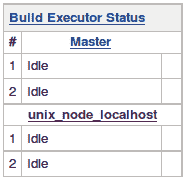
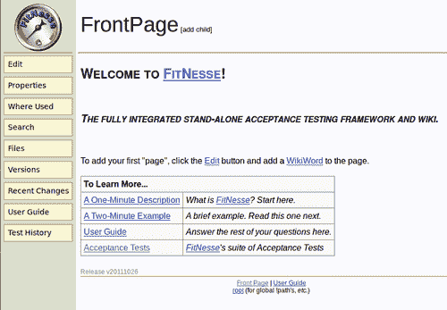
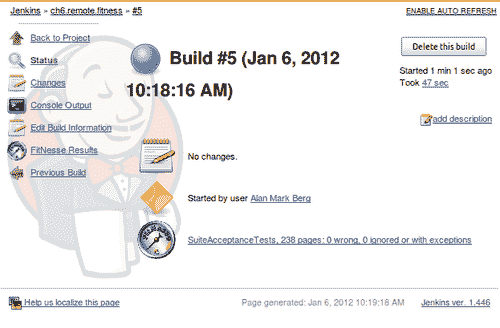
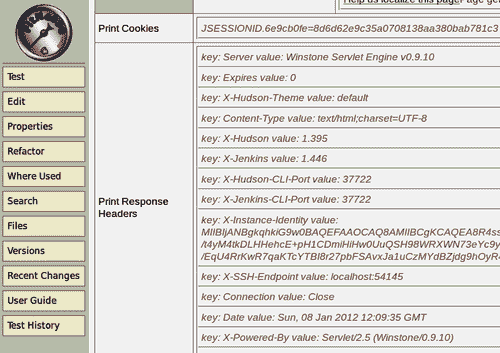
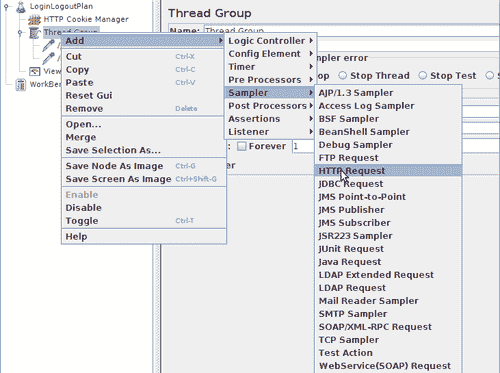
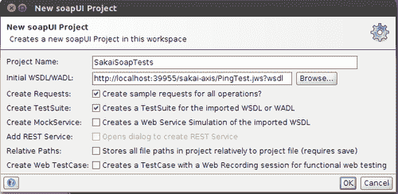
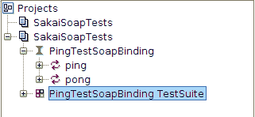
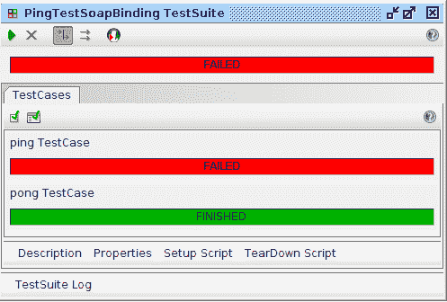

# 六、远程测试

在本章中，我们将介绍以下食谱:

*   将 WAR 文件从 Jenkins 部署到 Tomcat
*   创建多个 Jenkins 节点
*   符合性测试
*   激活配件 HTMl 单元夹具
*   运行硒集成开发环境测试
*   使用硒网络驱动程序触发故障安全集成测试
*   创建 JMeter 测试计划
*   报告 JMeter 性能指标
*   使用 JMeter 断言的功能测试
*   启用酒井网络服务
*   用 SoapUI 编写测试计划
*   报告 SoapUI 测试结果

# 简介

到本章结束时，您已经对 web 应用和 web 服务运行了性能和功能测试。包括两种典型的设置方法。首先是通过 Jenkins 向应用服务器部署一个 `war`文件。第二个是创建多个从节点，准备将测试的繁重工作从主节点转移出去。

通过 Jenkins 进行的远程测试大大增加了基础设施中的依赖项数量，从而增加了维护工作量。远程测试是特定于问题领域的，减少了可以编写测试的受众规模。

这一章强调了让大量读者能够接触到测试写作的必要性。拥抱尽可能多的受众提高了测试捍卫应用意图的机会。

强调的技术包括:

*   **Fitnesse:** 是一个运行不同类型测试的服务器。测试是以维基格式编写的。拥有一种类似 wiki 的语言来动态地表达和更改测试，给了功能管理员、顾问和最终用户一个表达他们需求的地方。您将看到如何通过 Jenkins 运行 Fitnesse 测试。Fitnesse 也是一个框架，您可以在其中扩展 Java 接口来创建新的测试类型。测试类型称为**夹具**。有许多固定装置可用，包括数据库测试、从命令行运行工具以及 web 应用的功能测试。
*   **JMeter:** 是一个流行的开源压力测试工具。它还可以通过使用断言来进行功能测试。JMeter 有一个图形用户界面，允许您构建测试计划。然后，测试计划以 XML 格式存储。JMeter 可以通过 Maven 或 Ant 脚本运行。JMeter 非常高效，一个实例通常足以重创您的基础架构。但是，对于超高负载场景，JMeter 可以触发 JMeter 实例的数组。
*   **硒:**它是 web 应用功能测试事实上的工业标准。有了硒集成开发环境，你可以在火狐中记录你的动作，以 HTML 格式保存它们，以便以后重放。使用硒**远程控制**，可以通过马文重新运行测试。使用不同操作系统和浏览器类型的 Jenkins 从机来运行测试是很常见的。另一种选择是使用**硒栅**([http://selenium-grid.seleniumhq.org/](http://selenium-grid.seleniumhq.org/))。
*   **Selenium Webdriver 和 TestNG 单元测试:**程序员专用的功能测试方法是使用 TestNG 框架编写单元测试。单元测试应用了硒网络驱动框架。Selenium RC 是一个控制网络浏览器的代理。相比之下，网络驱动程序框架使用本机应用编程接口调用来控制网络浏览器。你甚至可以运行 **HtmlUnit** 框架，消除对真实网络浏览器的依赖。这支持独立于操作系统的测试，但无法测试特定于浏览器的依赖关系。Webdriver 支持许多不同的浏览器类型。
*   **SoapUI:** 它简化了 web 服务功能测试的创建。该工具可以读取由网络服务发布的**网络服务定义语言(WSDL)** 文件，使用这些信息生成功能测试的框架。图形用户界面使理解过程变得容易。

# 将 WAR 文件从 Jenkins 部署到 Tomcat

部署 web 应用进行集成测试的三种主要方法如下:

*   在一个容器(比如 Jetty)中本地运行这个网络应用，这个容器在 Jenkins 的一次作业中被激活。应用数据库通常在内存中，并且存储的数据不会在作业结束后保持不变。这节省了清理工作，并消除了对基础架构不必要的依赖。
*   创建了一个**夜间构建**，在这里通过调度程序定期重建应用。这通常发生在没有人使用基础设施的晚上，因此得名。不需要轮询配置管理器。这种方法的优势在于，分布式团队能够准确地知道新构建何时以及在哪个固定网址存在。这些信息简化了部署脚本的编写。
*   部署到应用服务器。首先，在 Jenkins 中打包 web 应用，然后将其部署到应用服务器。它现在已经准备好由第二个 Jenkins 工作测试。这种方法的缺点是，您正在动态替换应用，并且主机服务器可能不会总是稳定响应。

在本食谱中，您将使用**部署**插件将一个 `war`文件部署到远程 Tomcat 7 服务器。这个插件可以跨一系列服务器类型和版本范围部署，包括 Tomcat、GlassFish 和 JBoss。

## 做好准备

为 Jenkins 部署插件安装部署插件([https://wiki.jenkins-ci.org/display/JENKINS/Deploy+Plugin](https://wiki.jenkins-ci.org/display/JENKINS/Deploy+Plugin))。下载最新版本的 Tomcat 7 并打开包装([http://tomcat.apache.org/download-70.cgi](http://tomcat.apache.org/download-70.cgi))。

## 怎么做...

1.  使用以下命令行为一个简单的 WAR 文件创建一个 Maven 项目:

    ```
    mvn archetype:generate -DgroupId=nl.berg.packt.simplewar -DartifactId=simplewar -DarchetypeArtifactId=maven-archetype-webapp -Dversion=1.0-SNAPSHOT

    ```

2.  将新创建的项目提交到您的 subversion 存储库中。
3.  在 Tomcat 根目录下，编辑 `conf/server.xml`，将默认连接器端口号改为 `38887`。

    ```
    <Connector port="38887" protocol="HTTP/1.1" connectionTimeout="20000" redirectPort="8443" />

    ```

4.  从命令行，启动 Tomcat。

    ```
    bin/startup.sh

    ```

5.  登录 Jenkins。
6.  创建一个名为 `ch6.remote.deploy`的 Maven 2/3 项目。
7.  在**源代码管理**部分，勾选 **subversion** 单选框，将自己的 subversion 资源库 URL 添加到**资源库 URL** 中。
8.  在**构建**部分，为**目标和选项**添加 `clean package`。
9.  在**后期构建操作**部分，选中**将 war/ear 部署到容器**，添加以下配置:
    *   **WAR/EAR 文件:** `target/simplewar.war`
    *   **容器:** `Tomcat 7.x`
    *   **经理用户名:** `jenkins_build`
    *   **经理密码:** `mylongpassword`
    *   **Tomcat URL:**t0]
10.  点击**保存**。
11.  运行构建。
12.  构建将失败，输出如下所示:

    ```
    java.io.IOException: Server returned HTTP response code: 401 for URL: http://localhost:38887/manager/text/list

    ```

13.  编辑 `conf/tomcat-users.xml`，在`</tomcat-users>:`

    ```
    <role rolename="manager-gui"/>
    <role rolename="manager-script"/>
    <role rolename="manager-jmx"/>
    <role rolename="manager-status"/>
    <user username="jenkins_build" password="mylongpassword" roles="manager-gui,manager-script,manager-jmx,manager-status"/>

    ```

    前增加以下代码
14.  重启 Tomcat。
15.  在 Jenkins 中，再次构建作业。构建现在将成功。查看 Tomcat 日志， `logs/catalina.out`，将显示类似如下的输出:

    ```
    Jan 06, 2012 1:31:39 PM org.apache.catalina.startup.HostConfig deployWAR INFO: Deploying web application archive /xxxxx/apache-tomcat-7.0.23/webapps/simplewar.war

    ```

16.  With a web browser, visit `http://localhost:38887/simplewar/`.

    

## 它是如何工作的...

在撰写本文时，部署插件部署到以下服务器类型和版本:

*   Tomcat 4.x/5.x/6.x/7.x
*   JBoss 3.x/4.x
*   GlassFish 2.x/3.x

在这个食谱中，Jenkins 打包了一个简单的 WAR 文件，并部署到一个 Tomcat 7 实例中。默认情况下，Tomcat 监听端口 `8080`，Jenkins 也是如此。通过编辑 `conf/server.xml`，端口被移动到 `38887`，避免冲突。

Jenkins 插件调用雄猫管理器。由于出现 `401 not authorized`错误([http://www.w3.org/Protocols/rfc2616/rfc2616-sec10.html](http://www.w3.org/Protocols/rfc2616/rfc2616-sec10.html))导致部署失败后，您在中创建了一个具有所需角色的 Tomcat 用户。事实上，新用户拥有比部署所需更多的权力。用户有权查看 JMX 数据进行监控。这有助于您以后进行调试。

在生产环境中部署时，请使用 SSL 连接，以避免通过网络发送未加密的密码。

## 还有更多...

启动时，Tomcat 日志提到缺少 Apache Tomcat 本机库。

```
INFO: The APR based Apache Tomcat Native library which allows optimal performance in production environments was not found on the java.library.path: /usr/java/packages/lib/i386:/usr/lib/i386-linux-gnu/jni:/lib/i386-linux-gnu:/usr/lib/i386-linux-gnu:/usr/lib/jni:/lib:/usr/lib

```

该库提高了性能，并且是基于 **Apache Ansible 运行时项目**的努力([http://apr.apache.org/](http://apr.apache.org/))。

可以在 `bin/tomcat-native.tar.gz`找到源代码。构建说明可以在 `http://tomcat.apache.org/native-doc/`中找到。

## 另见

*   *为集成测试配置 Jetty】、[第三章](3.html "Chapter 3. Building Software")、*构建软件**

# 创建多个 Jenkins 节点

测试是一个繁重的过程。如果您想要扩展您的服务，那么您需要计划将大部分工作转移到其他节点。

Jenkins 在组织中的一条进化之路是从一个 Jenkins 大师开始。随着乔布斯数量的增加，我们需要把更重的工作，比如测试，推给奴隶。这就给主人留下了更轻、更专业的汇总结果的工作。

本食谱使用**多从配置插件**([https://wiki . jenkins-ci . org/display/JENKINS/Multi+slave+config+插件](https://wiki.jenkins-ci.org/display/JENKINS/Multi+slave+config+plugin))在本地安装一个额外的 JENKINS 节点。它是 Ubuntu 特有的，允许 Jenkins 通过 SSH 安装、配置和命令从机。

## 做好准备

在 Jenkins，安装多从配置插件。您还需要有一个 Ubuntu 的测试实例，如配方*中所述，使用一个牺牲的 Jenkins 实例*、[第 1 章](1.html "Chapter 1. Maintaining Jenkins")、*维护 Jenkins*。

## 怎么做...

1.  从牺牲的 Jenkins 实例的命令行，创建用户 `jenkins-unix-nodex`。

    ```
    sudo adduser jenkins-unix-nodex

    ```

2.  使用空密码短语为 Jenkins 生成私钥和公钥证书:

    ```
    sudo -u jenkins ssh-keygen -t rsa
    Generating public/private rsa key pair. Enter file in which to save the key (/var/lib/jenkins/.ssh/id_rsa): Created directory '/var/lib/jenkins/.ssh'. Enter passphrase (empty for no passphrase): Enter same passphrase again: Your identification has been saved in /var/lib/jenkins/.ssh/id_rsa. Your public key has been saved in /var/lib/jenkins/.ssh/id_rsa.pub

    ```

3.  创建 `.ssh`目录，将 Jenkins 公共证书复制到 `.ssh/authorized_keys`。

    ```
    sudo -u jenkins-unix-nodex mkdir /home/jenkins-unix-nodex/.ssh sudo cp /var/lib/jenkins/.ssh/id_rsa.pub /home/jenkins-unix-nodex/.ssh/authorized_keys

    ```

4.  将所有权和集团 `of authorized_keys`变更为 `Jenkins-unix-nodex:jenkins-unix-nodex:`

    ```
    sudo chown jenkins-unix-nodex:jenkins-unix-nodex
    .ssh/authorized_keys

    ```

5.  Test that you can log in without a password as `jenkins` to `Jenkins-unix-nodex.jenkins-unix-nodex`.

    ### 注

    您需要接受主机证书。

    ```
    sudo su jenkins ssh jenkins-unix-nodex@localhost
    The authenticity of host 'localhost (127.0.0.1)' can't be established. ECDSA key fingerprint is xx:yy:21:zz:46:dd:02:fa:1w:15:27:20:e6:74:3e:a2\. Are you sure you want to continue connecting (yes/no)? yes Warning: Permanently added 'localhost' (ECDSA) to the list of known hosts.

    ```

6.  通过 Jenkins 网络界面登录。
7.  访问**管理 Jenkins** ( `localhost:8080/multi-slave-config-plugin/?`)下的**多级配置插件**。
8.  点击**添加从机**。
9.  将 `unix-node01`添加到**通过用空格分隔的名称**创建奴隶。
10.  点击**继续**。
11.  在**多从机配置插件添加从机**屏幕中，添加以下详细信息:
    *   **描述:**T0】
    *   **#执行人:** `2`
    *   **远程 FS 根:** `/home/Jenkins-unix-nodex/home/jenkins-unixnodex`
    *   **设置标签:** `unix dumb functional`
12.  选择**启动**方式**通过 SSH** 在 Unix 机器上启动从代理，增加了以下细节:
    *   **主持人:** `localhost`
    *   **用户名:** `Jenkins-unix-nodex`
    *   **私钥文件:** `/var/lib/Jenkins/.ssh/id_rsa`
13.  点击**保存**。
14.  Return to the main page. You will now see **Build Executor Status** include the **Master** and **unix-node1**.

    

## 它是如何工作的...

在本食谱中，您已经在本地将一个节点部署到一个 `*NIX`框中。使用第二个用户帐户。该帐户配备了 Jenkins 用户的公钥，以便于管理。Jenkins 现在可以不用密码使用 `ssh`和 `scp`。

多从配置插件免去了部署从节点的苦差事。它允许您从一个模板从属复制并部署多个节点。

Jenkins 可以通过多种不同的方式运行节点。使用 SSH，主机运行自定义脚本或通过 Windows 服务([https://wiki . JENKINS-ci . org/display/JENKINS/Distributed+builds](https://wiki.jenkins-ci.org/display/JENKINS/Distributed+builds))。最可靠的方法是通过 SSH 协议。这种方法的优势是多方面的。

*   SSH 的使用很受欢迎，这意味着对于大量观众来说，学习曲线很小。
*   SSH 是一项可靠的技术，已经历经几代人的时间，久经沙场。
*   大多数操作系统都有 SSH 守护程序，而不仅仅是 `*NIX`。一种选择是在 Windows 上安装带有 SSH 守护程序的**Cygwin**([http://www.cygwin.com/](http://www.cygwin.com/))。

### 注

如果您想让您的 UNIX 脚本在 Cygwin 下的窗口中运行，请考虑安装 Cygpath 插件。该插件将 UNIX 风格的路径转换为 Windows 风格。有关更多信息，请访问:

[https://wiki.jenkins-ci.org/display/JENKINS/Cygpath+Plugin](http://https://wiki.jenkins-ci.org/display/JENKINS/Cygpath+Plugin)

配置的节点分配了三个标签: `unix, dumb`和 `functional`。创建新作业时，检查设置**限制此项目可以运行的位置**并添加其中一个标签将确保作业在具有该标签的节点上运行。

主节点根据优先级列表计算运行作业的节点。除非另外配置，否则只有主服务器时创建的作业仍将在主服务器上运行。默认情况下，较新的作业将在从机上运行。

**一致性孕育可靠性:**当部署一个以上的 Jenkins 节点时，如果您与他们的环境结构保持一致，就会节省精力。考虑从相同的基本映像集开始使用虚拟环境。**云蜂**([http://www.cloudbees.com](http://www.cloudbees.com))是以部署虚拟实例为中心的商业服务的一个例子。

## 还有更多...

从 1.446 版本([http://jenkins-ci.org/changelog](http://jenkins-ci.org/changelog))开始，Jenkins 内置了 SSH 守护进程。这将减少编写客户端代码的工作量。命令行界面可以通过 SSH 协议访问。您可以通过 Jenkins 管理网页设置守护程序的端口号，或者让端口号保持浮动。

Jenkins 使用 `X-SSH-Endpoint`的报头信息发布端口号。要亲自查看，请 telnet 进入 Jenkins 并获取登录页面。Jenkins 返回带有其他报头信息的端口号。例如，对于命令行中的 `*NIX`系统，请尝试以下操作:

```
telnet localhost 8080
GET /login

```

Jenkins 的回答将类似于以下内容:

```
HTTP/0.9 200 OK Server: Winstone Servlet Engine v0.9.10 Expires: 0 X-Hudson-Theme: default Content-Type: text/html;charset=UTF-8 X-Hudson: 1.395 X-Jenkins: 1.447
X-Hudson-CLI-Port: 51485 X-Jenkins-CLI-Port: 51485 X-Instance-Identity: MIIBIjANBgkqhkiG9w …. X-SSH-Endpoint: localhost:48781

```

## 另见

*   *使用牺牲 Jenkins 实例*，[第 1 章](1.html "Chapter 1. Maintaining Jenkins")，*维护 Jenkins*

# 符合性测试

**Fitnesse**([http://fitnesse.org](http://fitnesse.org))是一个完全集成的独立维基和验收测试框架。您可以在表中编写测试并运行它们。用维基语言编写测试扩大了潜在测试作者的受众，减少了学习新框架的初始努力。



如果测试通过，表格行显示为绿色。如果失败，它将以红色显示。测试可以被维基内容包围，这些内容在与测试相同的位置传递上下文信息，例如用户故事。您也可以考虑在测试旁边的 Fitnesse 中创建 web 应用的模型，并将测试指向这些模型。

该配方描述了如何远程运行 Fitnesse 并在 Jenkins 中显示结果。

## 做好准备

从[http://fitnesse.org/FrontPage.FitNesseDevelopment.DownLoad](http://fitnesse.org/FrontPage.FitNesseDevelopment.DownLoad)下载最新稳定的 Fitnesse JAR。从[https://wiki.jenkins-ci.org/display/JENKINS/Fitnesse+Plugin](http://https://wiki.jenkins-ci.org/display/JENKINS/Fitnesse+Plugin)为 Jenkins 安装 Fitnesse 插件。

### 注

用于测试该配方的发布号为 `20111026`。

## 怎么做...

1.  创建目录 `fit/logs`，并放入拟合目录 `fitnesse.jar`。
2.  从命令行运行 Fitnesse `help`，并查看选项。

    ```
    java -jar fitnesse.jar help
    Usage: java -jar fitnesse.jar [-pdrleoa] -p <port number> {80} -d <working directory> {.} -r <page root directory> {FitNesseRoot} -l <log directory> {no logging} -e <days> {14} Number of days before page versions expire -o omit updates -a {user:pwd | user-file-name} enable authentication. -i Install only, then quit. -c <command> execute single command.

    ```

3.  从命令行运行 Fitnesse，并查看启动输出。

    ```
    java -jar fitnesse.jar -p 39996 -l logs -a tester:test
    FitNesse (v20111026) Started... port: 39996 root page: fitnesse.wiki.FileSystemPage at ./FitNesseRoot logger: /xxxxx/fit/logs authenticator: fitnesse.authentication.OneUserAuthenticator html page factory: fitnesse.html.HtmlPageFactory page version expiration set to 14 days.

    ```

4.  使用网络浏览器，访问 `http://localhost:39996`。
5.  点击**验收测试**链接。
6.  点击**套件**链接。这将激活一组测试。根据您的计算机，测试可能需要几分钟才能完成。直接链接是 `http://localhost:39996/FitNesse.SuiteAcceptanceTests?suite`。
7.  点击**测试历史**链接。您需要以用户测试者身份登录，密码为 `test`。查看 `fit/logs`目录中的日志。再次运行该套件后，您现在将看到类似于以下内容的条目:

    ```
    127.0.0.1 - tester [06/Jan/2012:09:44:53 +0100] "GET /FitNesse.SuiteAcceptanceTests?suite HTTP/1.1" 200 6086667

    ```

8.  登录 Jenkins，创建一个名为 `ch6.remote.fitnesse`的自由式软件项目。
9.  在**构建**部分，从**添加构建**步骤中选择**执行适应性测试**选项。
10.  检查选项 **Fitnesse 实例已经在运行**，并添加以下详细信息:
    *   **fitness Host:**T0】
    *   **fitness Port:**`39996`
    *   **目标页面:** `FitNesse.SuiteAcceptanceTests`
    *   查看**目标是套房吗？**选项
    *   **HTTP 超时(毫秒):** `180000`
    *   **fitnesse XML 结果文件路径:** `fitnesse-results.xml`
11.  在**后期构建操作**部分，勾选**发布 Fitnesse 结果报告**选项。
12.  将值 `fitnesse-results.xml`添加到输入**路径，以符合 xml 结果文件**。
13.  点击**保存**。
14.  运行作业。
15.  Review the latest job by clicking on the link **FitNesse Results**.

    

## 它是如何工作的...

Fitnesse 有一套内置的验收测试，它用它来检查自己的回归。Jenkins 插件调用测试，并要求使用带有以下网址的 **HTTP GET** 请求以 XML 格式返回结果: `http://localhost:39996/FitNesse.SuiteAcceptanceTests?suite&format=xml`。结果如下所示:

```
<testResults>
<FitNesseVersion>v20111026</FitNesseVersion>
<rootPath>SuiteAcceptanceTests</rootPath>
<result>
<counts>
<right>103</right>
<wrong>0</wrong>
<ignores>0</ignores>
<exceptions>0</exceptions>
</counts>
<runTimeInMillis>94</runTimeInMillis>
<relativePageName>CopyAndAppendLastRow</relativePageName>
<pageHistoryLink>
FitNesse.SuiteAcceptanceTests.SuiteFitDecoratorTests .CopyAndAppendLastRow?pageHistory&resultDate=20120106102754 &format=xml </pageHistoryLink>
</result>

```

Jenkins 插件然后解析 XML 并生成一个报告。

默认情况下，在 Fitnesse 页面上没有启用安全性。在这个配方中，用户名和密码是在启动时定义的。但是，我们没有更进一步，而是在页面上定义了安全权限。要激活，您需要转到页面左侧的**属性**链接，并检查**安全测试**的安全权限。

您也可以通过文本文件或**Kerberos/活动目录**中的用户列表进行身份验证。更多详情，请查看[http://fitnesse.org/FitNesse.UserGuide.SecurityDescription](http://fitnesse.org/FitNesse.UserGuide.SecurityDescription)。

还有一个为 LDAP 认证贡献的插件:[https://github.com/timander/fitnesse-ldap-authenticator](http://https://github.com/timander/fitnesse-ldap-authenticator)

### 注

考虑深度应用安全性:通过 Fitnesse 服务器上的防火墙添加 IP 限制会创建额外的防御层。例如，您可以在维基前面放置一个 Apache 服务器，启用 SSL/TLS 可以确保密码加密。阿帕奇的一个更薄的替代品是 http://wiki.nginx.org T2。

## 还有更多...

Fitnesse 并不是唯一一个开源讲故事的人。故事的另一个选择是**xPlanner**([http://xplanner.codehaus.org/](http://xplanner.codehaus.org/)，[http://www . project magazine . com/reviews/76-software/98-用 xPlanner 进行极端思考)](http://www.projectmagazine.com/reviews/76-software/98-thinking-in-extremes-with-xplanner))，这是一个基于网络的项目规划器，以迭代故事为基础。

不幸的是，在撰写本文时，上一次发布是在 2006 年，因此不要期望很快会有任何软件更新。

## 另见

*   *激活 Fitnesse HTMl 单元夹具*

# 激活 Fitnesse HTMl 单元夹具

Fitnesse 是一个可扩展的测试框架。可以自己编写称为**夹具**的测试类型，并通过 Fitnesse 表调用新的测试类型。这使得 Jenkins 可以运行替代测试。

本食谱向您展示了如何使用 **HtmlUnit** 夹具集成功能测试。同样的方法也可以用于其他设备。

## 做好准备

该配方假设您已经使用 Fitnesse 配方进行了测试。

## 怎么做...

1.  访问[http://chrispederick.com](http://chrispederick.com)，下载并打开 `HtmlFixture-2.5.1`。
2.  将 `HtmlFixture-2.5.1/lib`目录移到 `FitNesseRoot`目录。
3.  复制 `HtmlFixture-2.5.1/log4j.properties`到 `FitNesseRoot/log4j.properties`。
4.  开始健身。

    ```
    java -jar fitnesse.jar -p 39996 -l logs -a tester:test

    ```

5.  在网络浏览器中，访问 `http://localhost:39996/root?edit`，并添加以下内容，将 `FitHome`替换为您的 `fitnesse serverome:`

    ```
    !path /FitHome/FitNesseRoot/lib/*
    !fixture com.jbergin.HtmlFixture

    ```

    家的完全合格路径
6.  访问 `http://localhost:39996`。在左侧菜单中，点击**编辑**。
7.  在页面底部，添加文字 `ThisIsMyPageTest`。
8.  点击**保存**。
9.  点击新的**thismypage test**链接。
10.  点击左侧菜单上的**编辑**按钮。
11.  在以 `!contents:`

    ```
    |Import| |com.jbergin| '''STORY''' This is an example of using HtmlUnit: http://htmlunit.sourceforge.net/ '''TESTS''' !|HtmlFixture| |http://localhost:8080/login| Login|| |Print Cookies|| |Print Response Headers|| |Has Text|log in| |Element Focus|search-box|input| |Set Value|ch5|| |Focus Parent Type|form|/search/||

    ```

    开始的行后增加以下内容
12.  点击**保存**。
13.  Click on **Test**.

    

14.  在 Jenkins 中，在**新作业**下，将现有作业/副本从 `ch6.remote.fitness`复制到名为 `ch6.remote.fitness_fixture`的作业。
15.  在**构建**部分，在**目标**子部分下，将**目标页面**文本 `FitNesse.SuiteAcceptanceTests`替换为 `ThisIsMyPageTest`。
16.  取消勾选**目标是套件吗？**
17.  点击**保存**。
18.  运行作业。它失败了，因为结果发送了额外的调试信息，混淆了 Jenkins 插件解析器。
19.  访问测试页面 `http://localhost:39996/ThisIsMyPageTest?edit`，将测试表内容替换为如下:

    ```
    !|HtmlFixture| |http://localhost:8080/login| Login| |Has Text|log in| |Element Focus|search-box|input| |Set Value|ch5| |Focus Parent Type|form|/search/|

    ```

20.  再次运行 Jenkins 作业；现在将解析结果。

## 它是如何工作的...

夹具是用 Java 编写的。通过将下载的库放在 Fitnesse `lib`目录中，您可以访问它们。然后，您在根页面中定义了夹具的类路径和位置，允许在启动时加载夹具。有关完整的详细信息，请查看自述文件 `HtmlFixture-2.5.1/README`。

接下来，您使用 wiki camelcase 符号创建了指向不存在的**thismypage test**页面的链接。然后添加了一个 HtmlUnit 夹具测试。

首先，您需要导入其库路径在根页面中定义的夹具。

```
|Import| |com.jbergin|

```

接下来，添加了一些示例描述性维基内容，以表明您可以在不影响测试的情况下创建一个故事。最后，添加了测试。

表格的第一行 `!|HtmlFixture|`定义了要使用的夹具。第二行存储要测试的位置。

打印命令，如 `Print Cookies`或 `Print Response Headers`，返回对构建测试有用的信息。

如果您不确定可接受命令的列表，则故意犯语法错误，命令将作为结果返回。例如:

```
|Print something||

```

`Has Text`命令是一个断言，如果在返回页面的文本中找不到登录，该命令将失败。

通过关注一个特定的元素，然后 `Set Value`，你可以添加输入到一个表单。

在测试期间，如果您想要显示特定请求的返回内容，那么您需要三列；例如，具有三列的第一行显示返回的页面，而具有两列的第二行不显示。

```
|http://localhost:8080/login| Login||
|http://localhost:8080/login| Login|

```

将 HTML 页面作为结果的一部分返回给 Jenkins 插件需要解析的结果增加了额外的信息。这很容易失败。因此，在*步骤 19* 中，您删除了多余的列，确保了可靠的解析。

该夹具的完整文件可在[http://htmlfixtureim.sourceforge.net/documentation.shtml](http://htmlfixtureim.sourceforge.net/documentation.shtml)找到。

## 还有更多...

Fitnesse 有潜力增加 Jenkins 可以执行的远程测试的词汇量。下面列出了一些有趣的装置:

*   【REST 服务的 REST fixture:
*   **使用硒进行基于网络的功能测试的网络测试夹具:**[http://sourceforge.net/projects/webtestfixtures/](http://sourceforge.net/projects/webtestfixtures/)T4】
*   **DBfit，可以测试数据库:**[【http://gojko.net/fitnesse/dbfit/】](http://gojko.net/fitnesse/dbfit/)

## 另见

*   *配合测试*

# 运行硒 IDE 测试

Selenium IDE 允许您在网页内记录您的点击，并在火狐中重放它们。这有利于功能测试。测试计划以 HTML 格式保存。

这个食谱向你展示了如何使用马文和 Jenkins 自动重放测试。它使用内存中的 X 服务器**Xvfb**([http://en.wikipedia.org/wiki/Xvfb](http://en.wikipedia.org/wiki/Xvfb))这样 Firefox 就可以在一个没有头的服务器上运行。Maven 使用 Selenium RC 运行测试，然后它充当测试和浏览器之间的代理。虽然我们用火狐记录，你也可以用其他浏览器类型运行测试。

讨论**硒网格**([http://selenium-grid.seleniumhq.org/](http://selenium-grid.seleniumhq.org/))超出了本章的范围，除了注意到硒网格允许您跨多个操作系统并行运行硒测试。

## 做好准备

安装**硒 HTML 报告插件**([https://wiki . JENKINS-ci . org/display/JENKINS/硒 HTML 报告+插件](https://wiki.jenkins-ci.org/display/JENKINS/seleniumhtmlreport+Plugin))和**Environnect 插件**([https://wiki . JENKINS-ci . org/display/JENKINS/Environnect+插件](https://wiki.jenkins-ci.org/display/JENKINS/EnvInject+Plugin))。Xvfb 和 Firefox 也是必须的。要在 Debian Linux 环境下安装 Xvfb，运行 `sudo apt-get install xvfb`。

## 怎么做...

1.  从命令行，创建一个简单的 Maven 项目:

    ```
    mvn archetype:generate -DgroupId=nl.berg.packt.selenium -DartifactId=selenium_html -DarchetypeArtifactId=maven-archetype-quickstart -Dversion=1.0-SNAPSHOT

    ```

2.  在新创建的 `pom.xml`文件中，在`</project>`标签前添加以下 `build`部分:

    ```
    <build>
    <plugins>
    <plugin>
    <groupId>org.codehaus.mojo</groupId>
    <artifactId>selenium-maven-plugin</artifactId>
    <version>2.1</version>
    <executions>
    <execution>
    <id>xvfb</id>
    <phase>pre-integration-test</phase>
    <goals>
    <goal>xvfb</goal>
    </goals>
    </execution>
    <execution>
    <id>start-selenium</id>
    <phase>integration-test</phase>
    <goals>
    <goal>selenese</goal>
    </goals>
    <configuration>
    <suite>
    src/test/resources/selenium/TestSuite.xhtml
    </suite>
    <browser>*firefox</browser>
    <multiWindow>true</multiWindow>
    <background>true</background>
    <results>./target/results/selenium.html</results>
    <startURL>http://localhost:8080/login/</startURL>
    </configuration>
    </execution>
    </executions>
    </plugin>
    </plugins>
    </build>

    ```

3.  创建文件 `src/test/resources/log4j.properties`，内容如下:

    ```
    log4j.rootLogger=INFO, A1
    log4j.appender.A1=org.apache.log4j.ConsoleAppender
    log4j.appender.A1.layout=org.apache.log4j.PatternLayout
    log4j.appender.A1.layout.ConversionPattern=%-4r [%t] %-5p %c %x - %m%n

    ```

4.  制作目录 `src/test/resources/selenium`。
5.  Create the file `src/test/resources/selenium/TestSuite.xhtml` with the following content:

    ```
    <?xml version="1.0" encoding="UTF-8"?>
    <!DOCTYPE html PUBLIC "-//W3C//DTD XHTML 1.0 Strict//EN" "http://www.w3.org/TR/xhtml1/DTD/xhtml1-strict.dtd">
    <html  xml:lang="en" lang="en">
    <head>
    <meta content="text/html; charset=UTF-8" http-equiv="content- type" />
    <title>My Test Suite</title>
    </head>
    <body>
    <table id="suiteTable" cellpadding="1" cellspacing="1" border="1" class="selenium">
    <tbody>
    <tr><td><b>Test Suite</b></td></tr>
    <tr><td><a href="MyTest.xhtml">
    Just pinging Jenkins Login Page
    </a></td></tr>
    </tbody>
    </table>
    </body>
    </html>

    ```

    该 HTML 将呈现以下输出:

    

6.  Create the test file `src/test/resources/selenium/MyTest.xhtml` with the following content:

    ```
    <?xml version="1.0" encoding="UTF-8"?>
    <!DOCTYPE html PUBLIC "-//W3C//DTD XHTML 1.0 Strict//EN" "http://www.w3.org/TR/xhtml1/DTD/xhtml1-strict.dtd">
    <html  xml:lang="en" lang="en">
    <head profile="http://selenium-ide.openqa.org/profiles/test- case">
    <meta http-equiv="Content-Type" content="text/html; charset=UTF-8" />
    <title>MyTest</title>
    </head>
    <body>
    <table cellpadding="1" cellspacing="1" border="1">
    <thead>
    <tr><td rowspan="1" colspan="3">MyTest</td></tr>
    </thead>
    <tbody>
    <tr><td>open</td><td>/login?from=%2F</td><td></td></tr>
    <tr>
    <td>verifyTextPresent</td>
    <td>log in</td><td></td>
    </tr>
    </tbody>
    </table>
    </body>
    </html>

    ```

    该 HTML 将呈现以下输出:

    

7.  从命令行运行 Maven 项目，验证构建是否成功。

    ```
    mvn clean integration-test Dlog4j.configuration=file./src/test/resources/log4j.properties

    ```

8.  运行 `mvn clean`，然后将项目提交到您的 subversion 存储库中。
9.  登录 Jenkins，创建一个名为 `ch6.remote.selenium_html`的 Maven 2/3 作业。
10.  在**全局**部分(配置页面顶部)，选中**为作业**准备环境，为**属性内容**添加 **DISPLAY=:20** 。
11.  在**源代码管理**部分，勾选 **Subversion** ，将你的 subversion URL 添加到**资源库 URL** 。
12.  在**构建**部分，在一行上，添加到**目标和选项:**

    ```
    clean integration-test Dlog4j.configuration=file./src/test/resources/log4j.properties

    ```

13.  在**后期构建操作**部分，勾选**发布硒 HTML 报告**。
14.  将文本 `target/results`添加到**硒检测结果位置**的输入中。
15.  检查**如果在解析结果文件**时出现异常，则将构建结果状态设置为失败。
16.  点击**保存**。
17.  Run the Job, and review the results.

    

## 它是如何工作的...

创建了一个原始的硒集成开发环境测试套件，包括两个网页。第一个 `TestSuite.xhtml`定义了包含测试的 HTML 链接的套件。我们在 `MyTest.xhtml`中只定义了一个测试。

该测试点击本地 Jenkins 的登录页面，并验证登录文本是否存在。

`pom.xml`定义启动和拆除 Xvfb 服务器的阶段。默认配置是 Xvfb 在**显示屏 20 上接受输入:**

Maven 假设已经安装了 Xvfb 二进制文件，并且不会试图将其作为依赖项下载。火狐浏览器也是如此。这使得特定于操作系统的配置变得脆弱。在复杂的 Jenkins 环境中，最有可能失败的就是这种类型的依赖。自动功能测试必须有显著的优势，以抵消增加的维护工作量。

当测试在他们自己的火狐窗口中运行时，选项**多窗口**被设置为**真**。选项**后台**设置为**真**，这样 Maven 在后台运行测试。结果存储在相对位置 `./target/results/selenium.html`中，供 Jenkins 插件解析。有关硒微型插件的更多信息，请访问[http://mojo.codehaus.org/selenium-maven-plugin/](http://mojo.codehaus.org/selenium-maven-plugin/)。

Jenkins 作业将**显示**变量设置为 `20`，以便火狐在 Xvfb 中渲染。然后它运行 Maven 作业，生成结果页面。然后 Jenkins 插件解析结果。

提高自动功能测试可靠性的两种方法是:

*   使用 HtmlUnit，它不需要特定于操作系统的配置。但是，您将失去执行跨浏览器检查的能力。
*   运行网络驱动程序，而不是硒钢筋混凝土。Webdriver 使用更可靠的本机 API 调用。与 Selenium RC 类似，Webdriver 可以针对多种不同的浏览器类型运行。

下一个食谱将展示使用 Webdriver 和 HtmlUnit 的单元测试。

## 还有更多...

在我开发的 Jenkins Ubuntu 服务器上，运行这个食谱的作业崩溃了。原因是硒的 Maven 插件中的依赖项不喜欢由自动更新脚本安装的火狐新版本。问题的解决方案是在 Jenkins `home`目录下安装 Firefox 3.63 的二进制文件，直接指向 `pom.xml`中的二进制文件，替换为:

```
<browser>*firefox</browser>

```

用:

```
<browser>*firefox Path</browser>

```

其中 `Path`类似于 `/var/lib/Jenkins/firefox/firefox-bin`。

问题的另一个原因是需要为 Firefox 创建一个自定义配置文件，其中包括帮助插件来阻止弹出窗口或拒绝自签名证书。更多完整信息，请查看[http://seleniumhq.org/docs/](http://seleniumhq.org/docs/)。

### 注

使用火狐作为浏览器的另一种选择是 Chrome。有一个 Jenkins 插件可以帮助跨 Jenkins 节点调配 Chrome(https://wiki . Jenkins-ci . org/display/Jenkins/Chrome driver+插件)。

在 Maven `pom.xml`文件中，您必须将浏览器更改为 `*chrome`。

## 另见

*   *用硒网络驱动程序触发故障安全集成测试*

# 使用 Selenium 网络驱动程序触发故障安全集成测试

对于程序员来说，单元测试是防止代码倒退的一种自然方式。单元测试重量轻，易于运行。编写单元测试应该像编写打印语句一样容易。**JUnit**([http://www.junit.org/](http://www.junit.org/))是 Java 流行的单元测试框架；**测试**([http://testng.org/doc/index.html](http://testng.org/doc/index.html))是另一个。

这个食谱使用 Webdriver 和 HtmlUnit 结合 TestNG 来编写简单且自动化的功能测试。使用 HtmlUnit 而不是真正的浏览器有助于稳定的操作系统不可知测试，尽管不测试浏览器兼容性，但可以发现大多数功能故障。

## 做好准备

创建项目目录。

## 怎么做...

1.  创建 `pom.xml`，内容如下:

    ```
    <?xml version="1.0" encoding="UTF-8"?>
    <project  xmlns:xsi="http://www.w3.org/2001/XMLSchema-instance" xsi:schemaLocation="http://maven.apache.org/POM/4.0.0 http://maven.apache.org/maven-v4_0_0.xsd">
    <modelVersion>4.0.0</modelVersion>
    <groupId>nl.uva.berg</groupId>
    <artifactId>integrationtest</artifactId>
    <version>1.0-SNAPSHOT</version>
    <build>
    <plugins>
    <plugin>
    <groupId>org.apache.maven.plugins</groupId>
    <artifactId>maven-compiler-plugin</artifactId>
    <version>2.3.2</version>
    </plugin>
    <plugin>
    <groupId>org.apache.maven.plugins</groupId>
    <artifactId>maven-failsafe-plugin</artifactId>
    <version>2.10</version>
    </plugin>
    </plugins>
    </build>
    <dependencies>
    <dependency>
    <groupId>org.testng</groupId>
    <artifactId>testng</artifactId>
    <version>6.1.1</version>
    <scope>test</scope>
    </dependency>
    <dependency>
    <groupId>org.seleniumhq.selenium</groupId>
    <artifactId>selenium-htmlunit-driver</artifactId>
    <version>2.15.0</version>
    </dependency>
    </dependencies>
    </project>

    ```

2.  通过添加文件 `TestIT.java`创建名为 `src/test/nl/berg/packt/webdriver`的目录，文件内容如下:

    ```
    package nl.berg.packt.webdriver;
    import org.openqa.selenium.WebDriver;
    import org.openqa.selenium.htmlunit.HtmlUnitDriver;
    import org.testng.Assert;
    import org.testng.annotations.*;
    import java.io.File;
    import java.io.IOException;
    public class TestIT {
    private static final String WEBPAGE = "http://www.google.com";
    private static final String TITLE = "Google";
    private WebDriver driver;
    @BeforeSuite
    public void creatDriver(){
    this.driver= new HtmlUnitDriver(true);
    }
    @Test
    public void getLoginPageWithHTMLUNIT() throws IOException, InterruptedException {
    driver.get(WEBPAGE);
    System.out.println("TITLE IS ==>\""+driver.getTitle()+"\"");
    Assert.assertEquals(driver.getTitle(), TITLE);
    }
    @AfterSuite
    public void closeDriver(){
    driver.close();
    }
    }

    ```

3.  在顶层项目目录中，运行 `mvn clean verify`。构建应该会成功，输出如下所示:

    ```
    TITLE IS ==>"Google" Tests run: 1, Failures: 0, Errors: 0, Skipped: 0, Time elapsed: 4.31 sec Results : Tests run: 1, Failures: 0, Errors: 0, Skipped: 0

    ```

4.  将代码提交到您的 subversion 存储库中。
5.  登录 Jenkins，创建一个名为 `ch6.remote.driver`的新 Maven 2/3 项目。
6.  在**源代码管理**部分，勾选**颠覆**。
7.  在**模块/存储库网址**下，添加您的本地 subversion 存储库的位置。
8.  在**为**目标和选项**创建**部分，添加 `clean verify`。
9.  点击**保存**。
10.  运行作业。成功构建后，您将看到**最新测试结果**的链接，其中详细介绍了功能测试。

## 它是如何工作的...

Maven 使用**故障保护插件**([http://maven.apache.org/plugins/maven-failsafe-plugin](http://maven.apache.org/plugins/maven-failsafe-plugin))来运行集成测试。如果插件的集成测试阶段包含失败，它不会导致构建失败。相反，它允许集成后测试阶段运行，允许拆卸任务发生。

`pom.xml`提到了两个依赖项:一个用于 TestNG，另一个用于 HtmlUnit 驱动程序。如果您打算使用真正的浏览器，那么您将需要定义它们的 Maven 依赖项。

有关故障保护插件如何与 TestNG 框架一起工作的更多详细信息，请参见[。](http://maven.apache.org/plugins/maven-failsafe-plugin/examples/testng.html)

Java 类使用注释来定义代码将在单元测试周期的哪个部分被调用。 `@BeforeSuite`在测试套件开始时调用 Webdriver 实例的创建。 `@AfterSuite`测试运行后关闭驱动程序。 `@test`将方法定义为测试。

测试访问谷歌页面并验证标题的存在。HtmlUnit 注意到返回的 Google 页面和资源的样式表和 JavaScript 中有一些错误；然而，断言成功了。

示例测试的主要弱点是未能将断言与网页导航分开。考虑为每个网页创建 Java 类([http://code.google.com/p/selenium/wiki/PageObjects](http://code.google.com/p/selenium/wiki/PageObjects))。页面对象返回其他页面对象。然后，测试断言在单独的类中运行，将返回的页面对象的成员与预期值进行比较。这种设计模式支持更高程度的可重用性。

### 注

Groovy 中支持页面对象架构的一个优秀框架是**Geb**([http://www.gebish.org/](http://www.gebish.org/))。

## 还有更多...

大脑处理的所有感官信息的 80%是通过眼睛传递的。一张图片可以保存一千字的描述性文字。Webdriver 具有截图功能。例如，以下火狐驱动程序代码将截图保存到 `loginpage_firefox.png:`

```
public void getLoginPageWithFirefox() throws IOException, InterruptedException {
FirefoxDriver driver = new FirefoxDriver();
driver.get("http://localhost:8080/login);
FileUtils.copyFile(driver.getScreenshotAs(OutputType.FILE), new File("loginpage_firefox.png"));
driver.close();
}

```

最显著的限制是屏幕拍摄不能与 HtmlUnit 驱动程序一起工作:[http://code.google.com/p/selenium/issues/detail?id=1361](http://code.google.com/p/selenium/issues/detail?id=1361)。

## 另见

*   *运行硒 IDE 测试*
*   *激活 Fitnesse HTMl 单元夹具*

# 创建 JMeter 测试计划

**JMeter**([http://jmeter.apache.org](http://jmeter.apache.org))是一个开源的压力测试工具。它允许你可视化地创建一个测试计划，并根据该计划来锤系统。

JMeter 可以发出多种类型的请求，称为**采样器**。它可以对 HTTP、LDAP、数据库、使用脚本等进行采样。它可以直观地向听众报告。

### 注

一本初学 JMeter 的书是 *Apache JMeter，Emily H. Halili* ，Packt Publishing([http://www.packtpub.com/beginning-apache-jmeter](http://www.packtpub.com/beginning-apache-jmeter))。

在这个食谱中，你将编写一个测试计划，用来测试那些网址被定义在文本文件中的网页。在下一个配方*报告 JMeter 测试计划*中，您将配置 Jenkins 运行 JMeter 测试计划。

## 做好准备

下载并打开 JMeter 的现代版本(http://jmeter.apache.org/download_jmeter.cgi)。JMeter 是一个 Java 应用，因此将在任何正确安装了 Java 的系统上运行。

## 怎么做...

1.  创建子目录计划和示例。
2.  创建一个 CSV 文件 `./data/URLS.csv`，内容如下:

    ```
    localhost,80808,/login
    localhost,9080,/blah

    ```

3.  运行 JMeter 图形用户界面；例如 `./bin/jmeter.sh`或 `jmeter.bat`，具体取决于操作系统。图形用户界面将启动一个新的测试计划。
4.  右键点击**测试计划**，然后选择**添加/线程(用户)/线程组**。
5.  将**线程数(用户):**改为 `2`。
6.  右键单击**测试计划**，然后选择**添加|配置元素| CSV 数据集配置**。添加以下详细信息:
    *   **文件名:**CSV 文件的完整路径。
    *   **变量名(逗号分隔):** `HOST,PORT,URL`
    *   **分隔符(制表符使用' \ t):**`,`
7.  右键单击**测试计划**，然后选择**添加|配置元素| HTTP cookie 管理器**。
8.  右键单击**测试计划**，然后选择**添加|监听器|查看树结果**。
9.  Right-click on **Thread Group**, then select **Add | Sampler | HTTP request**. Add the following details:
    *   **名称:**T0】
    *   **服务器名称或 IP:** `${HOST}`
    *   **端口号:** `${PORT}`
    *   在**可选任务**下，勾选**从 HTML 文件**中检索所有嵌入资源。

    

10.  点击**测试计划**和**文件|保存**。将测试计划保存到 `examples/jmeter_example.jmx`。
11.  按 *CTRL+R* 运行测试计划。
12.  点击**查看结果树**，并浏览响应。
13.  将此项目提交到您的 subversion 存储库中。

## 它是如何工作的...

JMeter 使用线程并行运行请求。每个线程应该大约模拟一个用户。

测试计划使用了许多元素:

*   线程组定义运行的线程数量。
*   Cookie 管理器跟踪每个线程的 Cookie。如果您想在请求之间跟踪 cookies，这一点很重要。例如，如果一个线程登录到 Tomcat 服务器，那么需要为每个线程存储唯一的 Jsessionid。
*   CSV 数据集配置元素解析 CSV 文件的内容，将值放入主机、端口和网址变量中。为每个线程读取 CSV 文件的新行，每次迭代一次。变量通过使用 `${variable_name}`符号在元素中展开。
*   查看结果树侦听器在图形用户界面中将结果显示为请求和响应树。这对于调试来说很好，但是应该在以后删除。

一个常见的错误是假设一个线程相当于一个用户。主要区别在于线程的响应速度比普通用户快。如果您不在请求中添加延迟因素，那么您真的可以用几个线程来敲打您的应用。例如，对于阿姆斯特丹大学的在线系统来说，每次点击延迟 25 秒是很典型的。

### 类型

如果您希望解决应用中的多线程问题，请使用随机延迟元素，而不是恒定延迟。这也是对典型用户交互的更好模拟。

## 还有更多...

考虑将用户代理和其他浏览器头存储在一个文本文件中，然后通过 CSV 数据集配置元素为 HTTP 请求提取值。如果返回到网络浏览器的资源(如 JavaScript 或图像)依赖于用户代理，这将非常有用。JMeter 然后可以在用户代理中循环，断言资源存在。

## 另见

*   *报告 JMeter 性能指标*
*   *使用 JMeter 断言的功能测试*

# 报告 JMeter 性能指标

在本食谱中，您将看到如何配置 Jenkins 来运行 JMeter 测试计划，然后收集并报告结果。还将解释变量从**蚂蚁脚本**到 JMeter 的传递。

## 做好准备

假设您已经运行了最后一个配方*创建 JMeter 测试计划*。您还需要安装 Jenkins 性能插件。

## 怎么做...

1.  在 JMeter 中打开 `./examples/jmeter_example.jmx`，保存为 `./plans/URL_ping.jmx`。
2.  选择 **CSV 数据集配置**，将**文件名**更改为 `${__property(csv)}`。
3.  在**文件**菜单下，点击**保存**。
4.  在项目顶层创建一个 `build.xml`文件，内容如下:

    ```
    <project default="jmeter.tests">
    <property name="jmeter" location="/var/lib/jenkins/jmeter" />
    <property name="target" location="${basedir}/target" />
    <echo message="Running... Expecting variables [jvarg,desc]" />
    <echo message="For help please read ${basedir}/README"/>
    <echo message="[DESCRIPTION] ${desc}" />
    <taskdef name="jmeter" classname= "org.programmerplanet.ant.taskdefs.jmeter.JMeterTask" classpath="${jmeter}/extras/ant-jmeter-1.0.9.jar" />
    <target name="jmeter.init">
    <mkdir dir="${basedir}/jmeter_results"/>
    <delete includeemptydirs="true">
    <fileset dir="${basedir}/jmeter_results" includes="**/*" />
    </delete>
    </target>
    <target name="jmeter.tests" depends="jmeter.init" description="launch jmeter load tests">
    <echo message="[Running] jmeter tests..." />
    <jmeter jmeterhome="${jmeter}" resultlog="${basedir} /jmeter_results/LoadTestResults.jtl">
    <testplans dir="${basedir}/plans" includes="*.jmx"/>
    <jvmarg value="${jvarg}" />
    <property name="csv" value="${basedir}/data/URLS.csv" />
    </jmeter>
    </target>
    </project>

    ```

5.  将更新提交到您的 subversion 项目。
6.  登录 Jenkins。
7.  用名称 `ch6.remote.jmeter`创建一个新的自由风格的作业。
8.  在**源代码管理**下，勾选 **Subversion** ，将你的 Subversion 库 URL 添加到**库 URL** 中。
9.  在**构建**部分，添加构建步骤**调用蚂蚁**。
10.  在新的**调用蚂蚁**子部分中，按**高级**，添加以下属性:

    ```
    Jvarg=-Xmx512m
    desc= This is the first iteration in a performance test environment Driven by Jenkins

    ```

11.  在**后期构建操作**部分，勾选**发布性能测试结果报告**。将 `jmeter_results/*.jtl`添加到**报告文件**输入中。
12.  点击**保存**。
13.  运行几次作业，查看在**性能趋势**链接下找到的结果。

## 它是如何工作的...

`build.xml`文件是一个设置环境的 Ant 脚本，然后调用库 `/extras/ant-jmeter-1.0.9.jar`中定义的 JMeter Ant 任务。JAR 文件作为标准 JMeter 发行版的一部分安装。

在 `plans`目录下找到的任何 JMeter 测试计划都将运行。将测试计划从 `examples`目录移动到 `plans`目录会激活它。结果汇总在 `jmeter_results/LoadTestResults.jtl`中。

蚂蚁脚本将 `csv`变量传递给 JMeter 测试计划，其中 `csv`文件 `${basedir}/data/URLS.csv. ${basedir}`的位置由蚂蚁自动定义。顾名思义，它是 Ant 项目的基础目录。

您可以使用结构 `${__functioncall(parameters)}`在其元素内调用 JMeter 函数。您已经将函数调用 `${__property(csv)}`添加到了测试计划 CSV 数据集配置元素中。该函数引入了 Ant 脚本中定义的 CSV 值。

Jenkins 作业运行蚂蚁脚本，蚂蚁脚本又运行 JMeter 测试计划并聚合结果。Jenkins 性能插件然后分析结果，创建一个报告。

## 还有更多...

为了快速构建复杂的测试计划，可以考虑使用 jmeter 内置的透明代理([HTTP://JMeter . Apache . org/user manual/component _ reference . html # HTTP _ Proxy _ Server](http://jmeter.apache.org/usermanual/component_reference.html#HTTP_Proxy_Server))。您可以在本地计算机上的给定端口上运行它，将 web 浏览器中的代理首选项设置为匹配。记录的 JMeter 元素将让您很好地了解捕获的请求中发送的参数。

另一个选择是**坏小子**([http://www.badboysoftware.biz/docs/jmeter.htm](http://www.badboysoftware.biz/docs/jmeter.htm))，它有自己的内置网络浏览器。它允许您以类似于 Selenium IDE 的方式记录您的操作，然后保存到 JMeter 计划中。

## 另见

*   *创建 JMeter 测试计划*
*   *使用 JMeter 断言的功能测试*

# 使用 JMeter 断言的功能测试

这个食谱将向您展示如何结合 Jenkins 作业使用 JMeter 断言。JMeter 可以用断言测试对其 HTTP 请求和其他采样器的响应。这使得 JMeter 无法通过基于一系列 JMeter 测试的 Jenkins 构建。当从 web 应用的 HTML 模型开始时，这种方法尤其重要，因为它的底层代码正在快速变化。

测试计划登录和退出 Jenkins 的本地实例，检查登录响应中的大小、持续时间和文本。

## 做好准备

我们假设您已经执行了*创建 JMeter 测试计划*和*报告 JMeter 性能指标*的方法。

### 注

食谱需要在 Jenkins 创建一个用户 `tester1`。请随意更改用户名和密码。一旦不再需要测试用户，请记住将其删除。

## 怎么做...

1.  用密码 `testtest`在 Jenkins 创建一个名为 `tester1`的用户。
2.  Run JMeter. In the **Test Plan** element, change **Name** to `LoginLogoutPlan`, and add the following details for **User Defined Variables:**
    *   **名称:** `USER`；**值:** `tester1`
    *   **名称:** `PASS`；**值:** `testtest`

    

3.  右键单击**测试计划**，然后选择**添加|配置元素| HTTP cookie 管理器**。
4.  右键单击**测试计划**，然后选择**添加|监听器|查看树结果**。
5.  右键点击**测试计划**，然后选择**添加|线程(用户)|线程组**。
6.  Right-click on **Thread Group**, then select **Add | Sampler | HTTP Request**.

    

7.  将以下详细信息添加到 **HTTP 请求采样器:**
    *   **名称:**T0】
    *   **服务器名称或 IP:** `localhost`
    *   **端口号:** `8080`
    *   **路径:** `/j_aceqi_security_check`
8.  在**随请求发送参数**一节下，添加以下详细信息:
    *   **名称:** `j_username`；**值:** `${USER}`
    *   **名称:** `j_password`；**值:** `${PASS}`
9.  右键点击**线程组**，然后选择**添加|采样器| HTTP 请求**。
10.  将以下详细信息添加到 **HTTP 请求采样器**。如有必要，拖放新创建的元素，使其位于 `/j_acegi_security_check`之后。
11.  将以下详细信息添加到 **HTTP 请求采样器:**
    *   **名称:**T0】
    *   **服务器名称或 IP:** `localhost`
    *   **端口号:** `8080`
    *   **路径:** `/logout`
12.  将测试计划保存到 `./plans/LoginLogoutPlan_without_assertions.jmx`位置。
13.  将更改提交到本地 subversion 存储库中。
14.  在 Jenkins 中，运行先前创建的作业 `ch6.remote.jmeter`。请注意，在**性能报告**链接处， `/j_acegi_security_check` HTTP 请求采样器成功。
15.  复制 `./plans/LoginLogoutPlan_without_assertions.jmx`到 `./plans/LoginLogoutPlan.jmx`。
16.  在 JMeter 中，编辑 `./plans/LoginLogoutPlan.jmx`。
17.  右键单击 JMeter 元素 `j_acegi_security_check`，选择**添加|断言|持续时间断言**。
18.  在新创建的断言中，以毫秒为单位将**持续时间**设置为 `1000`。
19.  右键单击 JMeter 元素 `j_acegi_security_check`，选择**添加|断言|大小断言**。
20.  在新创建的断言中，以字节为单位设置**大小:**到 `40000`，检查**类型的比较**到`<`。
21.  Right-click on the JMeter element `j_acegi_security_check`, selecting **Add | Assertion | Response Assertion** with the following details:
    *   在**应用于**部分，只检查**主样本**
    *   在**测试响应字段**部分，勾选**文本响应**
    *   在**模式匹配规则**部分，勾选**包含**
    *   对于要测试的**模式**，添加`<title>Dashboard [Jenkins]</title>`

    

22.  保存测试计划并提交到您的本地 subversion 存储库中。
23.  在 JMeter 中运行( *Ctrl+R* ，查看**查看结果树**。注意**尺寸**和**响应**断言失败。
24.  在 Jenkins 中，运行先前创建的作业 `ch6.remote.jmeter`。请注意，在**绩效报告**链接中， `/j_acegi_security_check`也失败了。

## 它是如何工作的...

之前食谱中的脚手架没有改变。任何在 `plans`目录下找到的 JMeter 测试计划都会在 Jenkins 作业运行期间被调用。

您用两个 HTTP 请求采样器创建了一个新的测试计划。第一个采样器通过变量 `j_username`和 `j_password`发布到登录网址 `/j_acegi_security_check`。响应包含一个带有有效会话标识的 cookie，它存储在 cookie 管理器中。在 HTTP 请求登录采样器下，还添加了三个断言元素作为子元素。如果任何断言失败，那么 HTTP 请求结果就会失败。在 Jenkins 中，您可以根据可定义的阈值将作业配置为失败或警告。

这三个断言对于测试计划来说是典型的。这些是:

*   对返回结果大小的断言。大小不应大于 40，000 字节。
*   持续时间的断言。如果响应时间太长，那么您有一个性能回归，您需要进一步检查。
*   最有力的断言是检查文本模式。在这种情况下，查看关于返回标题的详细信息。JMeter 元素还可以根据常规模式解析文本。

## 还有更多...

JMeter 有能力处理请求。200 个线程，每个线程每秒触发一个请求，大约相当于 5000 个用户同时登录一个应用，每 25 秒点击一次。一个粗略的经验法则是，一个网站大约 10%的会员在一年中最忙的时候登录到一个应用。因此，200 个线程每秒命中一次对于总共 50，000 个用户来说是很好的。

对使用模式的理解也很重要；你对你的系统将如何使用了解得越少，你必须建立的安全边际就越大。计划 100%的额外容量并不罕见。额外的容量很可能就是你去不去度假的区别。

### 注

为了扩展其负载创建能力，JMeter 能够运行许多 JMeter 从节点。有关此主题的官方教程，请查看[http://jmeter . Apache . org/user manual/jmeter _ distributed _ testing _ step _ by _ step . pdf](http://jmeter.apache.org/usermanual/jmeter_distributed_testing_step_by_step.pdf)。

## 另见

*   *创建 JMeter 测试计划*
*   *报告 JMeter 性能指标*

# 启用酒井网络服务

酒井 CLE 是全世界数百所大学使用的应用。基于超过一百万行的 Java 代码，CLE 酒井允许学生与在线课程和项目网站进行交互。它使教师能够轻松创建这些网站。

在这个方法中，您将启用 web 服务并编写自己的简单 ping 服务。在下一个食谱中，您将为这些服务编写测试。

## 做好准备

你可以在[下找到最新下载的链接。从](http://sakaiporject.org.http://sakaiproject.org)[http://source.sakaiproject.org/release/2.8.1](http://source.sakaiproject.org/release/2.8.1)下载并解压酒井 CLE 2 . 8 . 1 版。

## 怎么做...

1.  编辑 `sakai/sakai.properties`包括以下内容:

    ```
    webservices.allowlogin=true
    webservices.allow=.*
    webservices.log-denied=true

    ```

2.  对于*NIX 系统，从根文件夹 `./start-sakai.sh`运行 Sakai 对于 Windows，从根文件夹 `./start-sakai.bat`运行 Sakai。如果 Jenkins 或其他服务正在端口 `8080`上运行，Sakai 将因以下错误而失败:

    ```
    2012-01-14 14:09:16,845 ERROR main org.apache.coyote.http11.Http11BaseProtocol - Error starting endpoint java.net.BindException: Address already in use:8080

    ```

3.  停止使用酒井 `./stop-sakai.sh`或 `./stop-sakai.bat`。
4.  修改 `conf/server.xml`将端口号移动到 `39955`；例如:

    ```
    <Connector port="39955" maxHttpHeaderSize="8192" URIEncoding="UTF-8" maxThreads="150" minSpareThreads="25" maxSpareThreads="75" enableLookups="false" redirectPort="8443" acceptCount="100" connectionTimeout="20000" disableUploadTimeout="true" />

    ```

5.  从根文件夹 `./start-sakai.sh`运行 Sakai(对于 NIX 系统)或 `./start-sakai.bat`运行(对于 Windows)。
6.  在网络浏览器中，访问 `http://localhost:39955/portal`。
7.  以用户管理员身份登录，密码为 `admin`。
8.  注销。
9.  访问 `http://localhost:39955/sakai-axis/SakaiScript.jws?wsdl`。
10.  通过向 `./webapps/sakai-axis/PingTest.jws:`

    ```
    public class PingTest { public String ping(String ignore){ return "Insecure answer =>"+ignore; } public String pong(String ignoreMeAsWell){ return youCantSeeMe(); } private String youCantSeeMe(){ return "PONG"; }
    }

    ```

    添加以下内容，创建一个简单的未经身份验证的 web 服务
11.  要验证服务是否可用，请访问 `http://localhost:39955/sakai-axis/PingTest.jws?wsdl`。
12.  要验证 REST 服务是否可用，请访问 `http://localhost:39955/direct`。

## 它是如何工作的...

Sakai 包是独立的，有自己的数据库和 Tomcat 服务器。其主要配置文件为 `sakai/sakai.properties`。您对其进行了更新，以允许从任何地方使用 web 服务。在实际部署中，IP 地址受到更多限制。

为了避免与本地 Jenkins 服务器的端口冲突，修改了 Tomcat `conf/server.xml`文件。

酒井既有 REST 也有 SOAP 网络服务。您将在 `/direct`网址下找到 REST 服务。 `many`服务在 `/direct/describe`描述。服务向下一层提供。例如，要创建或删除用户，您需要使用 `/direct/user/describe`中描述的用户服务。

REST 服务使用 Sakai 框架向 **Entitybroker** 注册。Entitybroker 确保服务之间的一致处理，节省编码工作。Entitybroker 负责以正确的格式提供服务信息。要查看 Sakai 认为您当前是谁的 XML 格式，请访问[http://localhost:399955/direct/user/current . XML](http://localhost:399955/direct/user/current.xml)，要查看 JSON 格式，请将 `current.xml`替换为 `current.json`。

SOAP 服务基于 Apache **AXIS 框架**([http://axis.apache.org/axis/](http://axis.apache.org/axis/))。要创建一个新的基于 SOAP 的 web 服务，您可以在 `webapps/sakai-axis`目录下放置一个扩展名为 `.jws`的文本文件。Apache AXIS 在第一次调用代码时会动态编译代码。这允许快速的应用开发，因为调用者可以立即看到对文本文件的任何修改。

**平考**包含一个没有套餐的班级。类名与删除了 `.jws`扩展名的文件名相同。任何 `public`方法都变成了 web 服务。如果访问[http://localhost:39955/sakai-axis/sakaiscript . jws？wsdl](http://localhost:39955/sakai-axis/SakaiScript.jws?wsdl) ，你会注意到 `youCantSeeMe`方法没有宣传；那是因为它有一个 `private`范围。

大多数有趣的 web 服务都需要使用方法 `login`通过/sakai-axis/SakaiLogin.jws 登录 Sakai，将用户名和密码作为字符串传递。返回的字符串是一个 **GUID** (一个由字母和数字组成的长随机字符串)，需要传递给其他方法作为身份验证的证据。

要在事务结束时注销，请使用方法 `logout`，将 GUID 传递给它。

## 还有更多...

酒井 CLE 不仅是一个学习管理系统，也是一个使开发新工具变得简单的框架。

新酒井开发人员的程序员咖啡馆可以在以下网址找到:

[https://convergence . sakaiproject . org/display/BOOT/Programmer % 27s+Cafe](http://https://confluence.sakaiproject.org/display/BOOT/Programmer%27s+Cafe)

基于程序员咖啡馆的训练营定期在酒井会议上或通过咨询活动进行。引导营引导开发人员使用 Eclipse 作为首选的标准 IDE 创建他们的第一个 Sakai 工具。

另一个相关产品是酒井**开放学术环境(OAE)** ，在[http://sakaiproject.org](http://sakaiproject.org)也有提到。酒井 OAE 建立在酒井 CLE 的优势上，并使用混合模式与酒井 CLE 很好地合作。混合模式允许两个系统共享课程。

您可以在以下网址找到《酒井 CLE 课件管理:官方指南》一书的描述:

[http://www . packtpub . com/sakai-cle-课件-管理-电子学习-研究/图书](http://www.packtpub.com/sakai-cle-courseware-management-for-elearning-research/book)

## 另见

*   *用肥皂写测试计划*
*   *上报皂水检测结果*

# 用 SoapUI 编写测试计划

**Soapui**([http://www.soapui.org/](http://www.soapui.org/))是一个工具，允许功能、性能和安全测试的高效编写，主要针对 web 服务。

在这个配方中，您将使用 SoapUI 创建一个基本的功能测试，该测试针对上一个配方中创建的 Sakai SOAP 网络服务。

## 做好准备

如前一份食谱中所述，我们假设您有酒井 CLE 在港口 `39955`运行，并且 `PingTest`服务可用。

要下载并安装 SoapUI，请按照安装说明访问[http://www.soapui.org/Getting-Started/](http://www.soapui.org/Getting-Started/)。

为了让 Linux 包与 Ubuntu 11.10 一起工作，您可能需要取消对 SoapUI 启动脚本中以下行的注释:

```
JAVA_OPTS="$JAVA_OPTS -Dsoapui.jxbrowser.disable=true"

```

## 怎么做...

1.  启动 SoapUI。
2.  右键点击**项目**，选择**新皂水项目**。
3.  Fill in the dialog box with the following details:
    *   **项目名称:** `SakaiSoapTests`
    *   **初始 WSDL/WADL:** `http://localhost:39955/sakai-axis/PingTest.jws?wsdl`

    

4.  勾选**创建测试套件**。
5.  点击**确定**。
6.  点击**确定**进入**生成测试套件**对话框。
7.  点击**测试套件的**确定**创建**。
8.  In the left-hand side navigator, click on the **+** icon next to **PingTestSoapBinding TestSuite**.

    

9.  点击 Ping 测试用例 T3 旁边的 T0+T1 图标。
10.  点击**测试步骤(1)** 旁边的 **+** 图标。
11.  右键点击 **Ping** ，选择**打开编辑器**。
12.  At the top of the editor, click on the **Add assertion** icon.

    

13.  选择**断言不包含**，点击**确定**。
14.  添加内容**不安全答案= >？**，点击**确定**。
15.  在左侧导航中，右键点击 **PingTestSoapBinding 测试套件**，选择**显示测试套件编辑器**。
16.  In the **Editor**, click on the **Start tests** icon.

    

17.  查看结果。由于断言，**乒乓测试用例**失败，**乒乓测试用例**成功。
18.  创建名为 `src/test/soapui`的目录。
19.  Right-click on **SakaiSoapTest**, then save the project as `SakaiSoapTests-soapui-project.xml` in the `src/test/soapui` directory.

    

## 它是如何工作的...

SoapUI 免去了为 SOAP 服务制作测试套件的繁重工作。SoapUI 使用 PingTest WSDL 文件来发现服务的细节。该文件包含位置信息，允许的参数用于 PingTest 服务。

从 WSDL 文件中，SoapUI 为 `Ping`和 `Pong`服务创建了一个基本测试。您在 `Ping`服务下添加了一个断言，检查文本 `Insecure answer =>?`在 SOAP 响应中不存在。由于文本确实存在，断言失败了。

SoapUI 可以强制执行各种各样的断言，包括检查 Xpath 或 Xquery 匹配，以及检查由自定义脚本测试的状态代码或断言。

最后，该项目以 XML 格式保存，准备在下一个配方中的 Maven 项目中重用。

### 注

**WSDL** 代表**网络服务描述语言**([http://www.w3.org/TR/wsdl](http://www.w3.org/TR/wsdl))。WSDL 文件是一个支持服务发现的 XML 文件。

## 还有更多...

SoapUI 不仅仅是对 web 服务进行功能测试。它通过检查边界输入来执行安全测试。它还有一个用于压力测试的负载转轮。

另一个重要特性是它能够从 WSDL 文件构建模拟服务。这允许在 web 服务还在开发的时候在本地构建测试。测试的早期创建减少了达到生产降低成本的缺陷数量。你可以在[http://www . soap ui . org/Service-嘲讽/嘲讽-soap-services.html](http://www.soapui.org/Service-Mocking/mocking-soap-services.html) 找到一个很好的模拟服务介绍。

## 另见

*   *启用酒井网络服务*
*   *上报皂水检测结果*

# 报告皂水测试结果

在这个配方中，您将创建一个 Maven 项目，运行上一个配方中创建的 SoapUI 测试。一个使用**xuit 插件**([https://wiki.jenkins-ci.org/display/JENKINS/xUnit+Plugin](https://wiki.jenkins-ci.org/display/JENKINS/xUnit+Plugin))的 Jenkins 项目将解析结果，生成一个详细的报告。

## 做好准备

安装 Jenkins xUnit 插件。运行*启用酒井网络服务*和*用肥皂*配方编写测试计划。现在，您将运行酒井 CLE，并准备好一个 SoapUI 测试计划。

## 怎么做...

1.  创建项目目录。在项目的根目录下，添加一个 `pom.xml`文件，内容如下:

    ```
    <project  xmlns:xsi="http://www.w3.org/2001/XMLSchema-instance" xsi:schemaLocation="http://maven.apache.org/POM/4.0.0 http://maven.apache.org/maven-v4_0_0.xsd">
    <modelVersion>4.0.0</modelVersion>
    <name>Ping regression suite</name>
    <groupId>test.soapui</groupId>
    <artifactId>test.soapui</artifactId>
    <version>1.0-SNAPSHOT</version>
    <packaging>jar</packaging>
    <description>Sakai webservices test</description>
    <pluginRepositories>
    <pluginRepository>
    <id>eviwarePluginRepository</id>
    <url>http://www.eviware.com/repository/maven2/</url>
    </pluginRepository>
    </pluginRepositories>
    <build>
    <plugins>
    <plugin>
    <groupId>eviware</groupId>
    <artifactId>maven-soapui-plugin</artifactId>
    <version>4.0.1</version>
    <executions>
    <execution>
    <id>ubyregression</id>
    <goals>
    <goal>test</goal>
    </goals>
    <phase>test</phase>
    </execution>
    </executions>
    <configuration>
    <projectFile>
    src/test/soapui/SakaiSoapTests-soapui-project.xml
    </projectFile>
    <host>localhost:39955</host>
    <outputFolder>
    ${project.build.directory}/surefire-reports
    </outputFolder>
    <junitReport>true</junitReport>
    <exportwAll>true</exportwAll>
    <printReport>true</printReport>
    </configuration>
    </plugin>
    </plugins>
    </build>
    </project>

    ```

2.  确认您已经在 `src/test/soapui/SakaiSoapTests-soapui-project.xml`正确放置了 SoapUI 项目。
3.  从命令行运行:

    ```
    mvn clean test

    ```

4.  登录 Jenkins。
5.  创建一个名为 `ch6.remote.soapui`的 Maven 2/3 项目。
6.  在**源代码管理**部分，勾选**颠覆**，添加你的**存储库网址**。
7.  在**构建**部分，在**目标和选项**下，添加 `clean test`。
8.  在**后期构建操作**部分，勾选**发布测试工具结果报告**。
9.  点击**添加**按钮。
10.  选择 **Junit** 。
11.  在 **JUNIT 模式**下，添加 `**/target/surefire-reports/TEST-PingTestSoapBinding_TestSuite.xml`。
12.  点击**保存**。
13.  运行作业。
14.  Click on the **Latest Test Result** link. You will see one failed and one succeeded job.

    

15.  你会在 `http://localhost:8080/job/ch6.remote.soapui/ws/target/surefire-reports/PingTestSoapBinding_TestSuite-ping_TestCase-ping-0-FAILED.txt`找到失败的全部细节。

## 它是如何工作的...

Maven 项目使用 **maven-soapui 插件**([http://www.soapui.org/Test-Automation/maven-2x.html](http://www.soapui.org/Test-Automation/maven-2x.html))。由于该插件在一个主要的 Maven 存储库中不可用，您必须将其配置为使用 `eviwarePluginRepository`存储库。

SoapUI 插件被配置为从项目文件 `src/test/soapui/SakaiSoapTests-soapui-project.xml`中提取其计划，并保存相对于 `project.build.directory`的结果，T1 是工作空间的根。

设置的选项有:

```
<junitReport>true</junitReport>
<exportwAll>true</exportwAll>
<printReport>true</printReport>

```

`JunitReport`设置为 `true`告诉插件创建一个 JUnit 报告。 `exportwAll`设置为 `true`意味着导出所有测试的结果，而不仅仅是错误。此选项在调试阶段很有用，除非您有严重的磁盘空间限制，否则应将其设置为 on。 `printReport`设置为 `true`确保 Maven 向控制台发送一个小的测试报告，输出类似如下:

```
SoapUI 4.0.1 TestCaseRunner Summary
-----------------------------
Total TestSuites: 1
Total TestCases: 2 (1 failed)
Total Request Assertions: 1
Total Failed Assertions: 1
Total Exported Results: 1
[ERROR] java.lang.Exception: Not Contains in [ping] failed;
[Response contains token [Insecure answer =>?]]

```

`ping`测试用例失败，因为断言失败。 `pong`测试用例成功，因为服务存在。因此，即使没有断言，使用 SoapUI 的自动生成功能也允许您快速生成一个确保所有服务都在运行的支架。随着项目的发展，您可以随时添加断言。

Jenkins 职位的创建很简单。xUnit 插件允许你引入许多类型的单元测试，包括从 Maven 项目创建的 JUnit 测试。位置在*步骤 10* 中设置为 `**/target/surefire-reports/TEST-PingTestSoapBinding_TestSuite.xml`。

### 注

**自定义报告**选项是获取您自己的自定义数据并在 Jenkins 内显示其历史趋势的另一种方式。它通过使用自定义样式表解析插件找到的 XML 结果来工作。这为您添加自己的自定义结果提供了很大的灵活性。

## 还有更多...

`Ping`服务是危险的，因为它不过滤输入，输入通过输出反射回来。

许多 web 应用使用 web 服务将内容加载到页面中，避免重新加载整个页面。一个典型的例子是，当你输入一个搜索词时，替代的建议会立即显示出来。有了一点社交工程的魔力，受害者最终会向 web 服务发送一个包括脚本的请求。返回响应后，脚本在客户端浏览器中运行。这绕过了同一原产地政策([http://en.wikipedia.org/wiki/Same_origin_policy](http://en.wikipedia.org/wiki/Same_origin_policy))的意图。这被称为**非持久攻击**，因为脚本没有持久存储。

网络服务比网页更难测试 XSS 攻击。幸运的是，SoapUI 将测试过程简化到了可管理的水平。你可以在[上找到关于 SoapUI 安全测试的入门教程。](http://www.soapui.org/Security/working-with-security-tests.html)

## 另见

*   *启用酒井网络服务*
*   *用肥皂写测试计划*