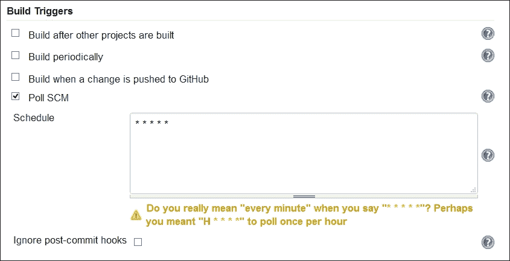
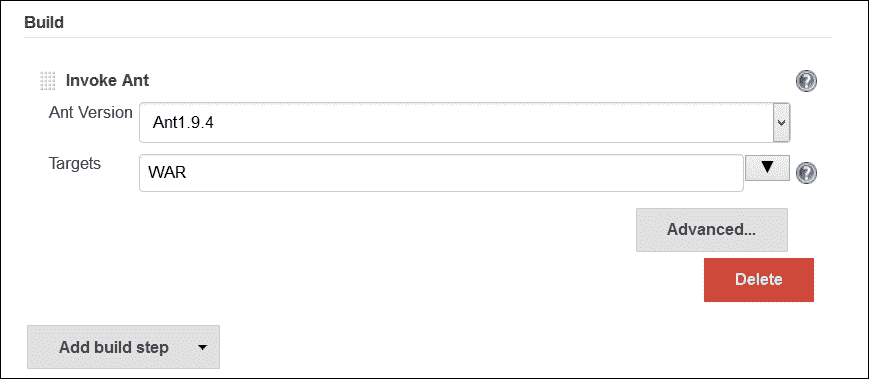
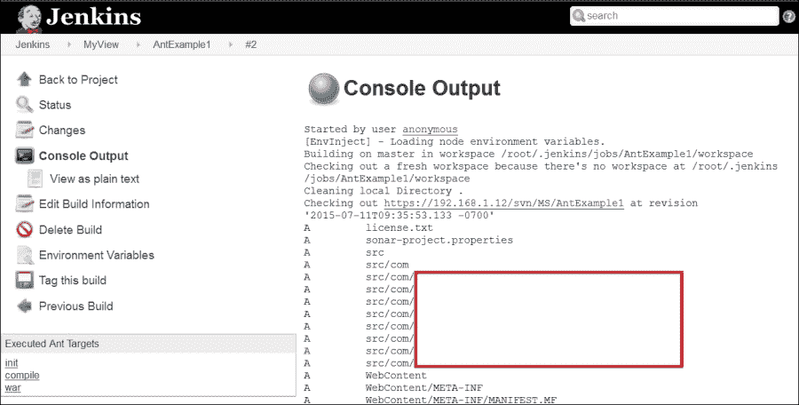
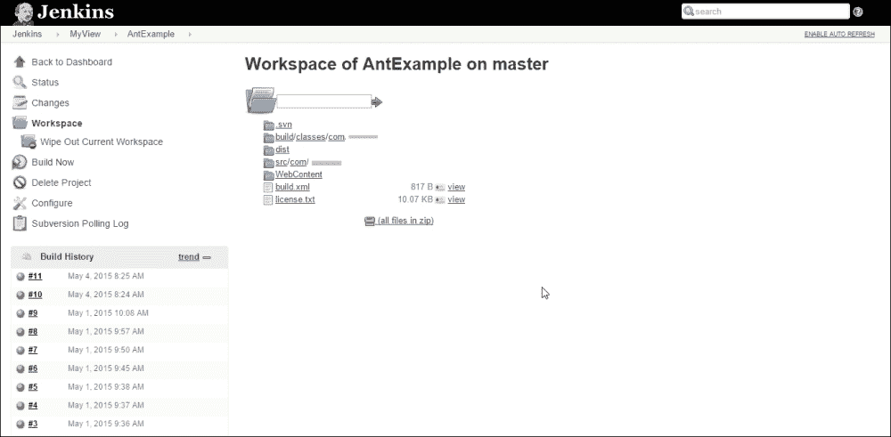
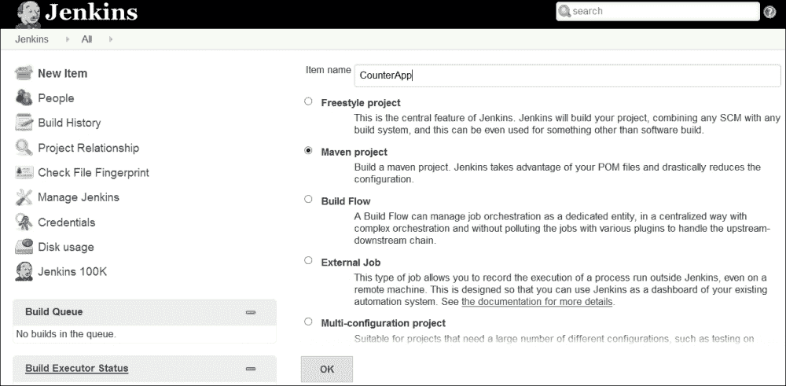
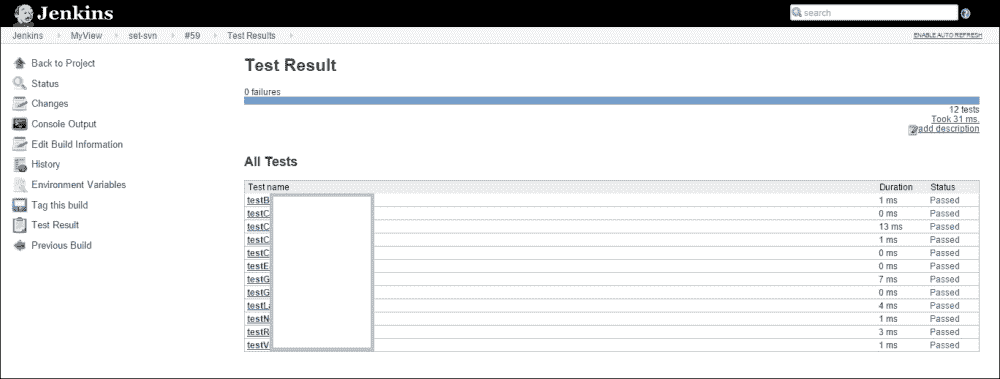
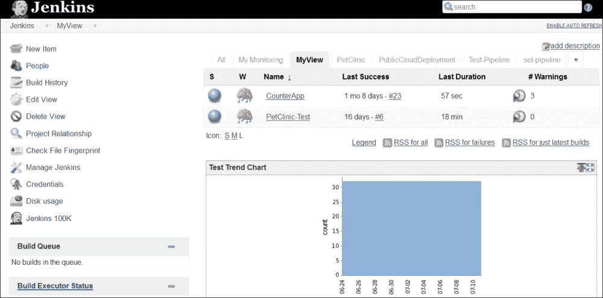

# 三、SVN Jenkins 和构建工具的集成

|   | *“改变的障碍不是太少牵挂；它太复杂了”* |   |
|   | - *比尔·盖茨* |

我们已经看到了如何设置一个环境来使用 Jenkins 进行持续集成，我们还在 Jenkins 中配置了构建工具。Eclipse 与 SVN 的集成将帮助开发人员轻松地在存储库上执行操作。

现在，我们已经准备好为持续集成创建我们的第一个构建工作。本章详细描述了如何使用构建工具(如 Ant 和 Maven)为 Java 应用创建和配置构建作业；如何运行构建作业，单元测试用例。它涵盖了运行构建以创建用于部署的分发文件或`war`文件的所有方面，以及提供基于首选项的构建作业和测试结果的定制显示的仪表板视图插件。本章包含以下要点:

*   使用 Ant 为 Java 应用创建和配置构建作业
*   使用 Maven 为 Java 应用创建和配置构建作业
*   用测试用例构建执行

# 使用 Ant 为 Java 应用创建和配置构建作业

在为 Java 应用创建和配置构建作业之前，我们将安装一个 Dashboard View 插件来更好地管理构建，并显示构建和测试的结果。我们已经在[第 2 章](02.html "Chapter 2. Installation and Configuration of Code Repository and Build Tools")、*代码库和构建工具*的安装和配置中看到了如何创建基本作业。

## 仪表板视图插件

这个插件提供了一个新的视图，为 Jenkins 构建作业提供了一个类似门户的视图。从[https://wiki.jenkins-ci.org/display/JENKINS/Dashboard+View](https://wiki.jenkins-ci.org/display/JENKINS/Dashboard+View)下载。它有利于展示结果和趋势。此外，它还允许用户以有效的方式排列显示项目。在 Jenkins 仪表盘上，进入**管理 Jenkins**链接，点击**管理插件**安装仪表盘视图插件。点击**已安装**选项卡，验证安装情况。

在 Jenkins 仪表板上，单击加号按钮创建新视图。提供一个**视图名称**并选择视图类型；在我们的情况下**仪表盘，**然后点击**确定**。

提供一个**名称**，选择需要包含在视图中的**作业**，如下图截图所示:

在视图配置中，点击**将仪表板 Portlet 添加到右栏**，选择**测试统计网格**。添加**测试统计表**。这将以测试结果的统计和图表表示的形式显示测试结果。

## 为 Java 应用创建和配置构建作业

单击仪表板上的**新项目**上的，为使用蚂蚁作为构建工具的 Java 应用创建一个新的构建。进入**项目名称**，选择**自由式项目**。点击**确定**。

它将打开新构建作业的配置。在**源代码管理**中，选择**颠覆**。提供**存储库网址**和**凭证**。在[第二章](02.html "Chapter 2. Installation and Configuration of Code Repository and Build Tools")、*代码库和构建工具的安装和配置*中，我们安装了 Subversion，还将源代码添加到了 SVN。

提供您在浏览器中用来访问源代码存储库的网址。

如果**凭证**在框中不可用，点击**添加**按钮。提供**范围**、**用户名**、**密码**和**描述**，点击**添加**使其在构建作业配置中可用的列表框中可用。**范围**确定凭证可以在哪里使用。例如，系统范围将凭证使用限制在与凭证关联的对象上。它提供了比全球范围更好的保密性。全局范围凭据可用于与该凭据关联的对象以及该对象的所有子对象。

在构建作业配置中，转到**构建触发器**部分，并选择**轮询配置管理**单选按钮。在 *** * * * *表格**中提供时间表详情，如下图所示。它将每分钟轮询存储库，以验证开发人员提交到存储库中的更改。

**时间表字段遵循 cron 语法，分钟小时一天一个月一天一周。**

 **例如，H * * * *每小时轮询一次，H/15 * * * *每十五分钟轮询一次。

一旦**构建触发器**和**源代码管理**配置完成，我们需要提供构建工具相关的细节，这样一旦构建被触发，Jenkins 就可以使用它们来执行。点击**添加构建步骤**并选择**调用蚂蚁**。从下拉菜单中，选择 Ant，在[第 2 章](02.html "Chapter 2. Installation and Configuration of Code Repository and Build Tools")、*代码库和构建工具的安装和配置*中配置，并为**目标**提供您想要从构建中执行的名称。

点击**应用**和**保存**按钮完成配置。点击 Jenkins 仪表盘上的**立即构建**按钮。它将根据安装 Jenkins 的机器上的本地工作区，检查源代码库中所有最新的可用代码，如下图所示。在特定作业的**构建历史**部分，点击**构建编号**，然后点击**控制台输出**。

一旦签出过程完成，基于目标的构建文件执行将开始，并且如果构建执行所需的所有依赖项和文件在本地工作区中可用，则构建执行将成功，如下图所示:

要验证本地工作空间，请转到您创建的视图，选择**构建作业**，然后单击**工作空间**。验证源代码库提供的所有文件和文件夹都可用。

# 使用 Maven 为 Java 应用创建和配置构建作业

点击仪表板上的 **【新项目】**为一个使用 Maven 作为构建工具的 Java 应用创建一个新的构建。输入**项目名称**，从列表中选择 **Maven 项目**。

它将打开新构建作业的配置。在**源代码管理**中，选择**颠覆**。提供**存储库网址**和**凭证**。在[第二章](02.html "Chapter 2. Installation and Configuration of Code Repository and Build Tools")、*代码库和构建工具的安装和配置*中，我们安装了 **Subversion** ，并将源代码添加到了 SVN。

在构建作业配置中，转到**构建触发器**部分，并选择**轮询配置管理**单选按钮。以 *** * * * *** 形式提供进度明细，如下图所示。它将每分钟轮询存储库，以验证开发人员提交到存储库中的更改。添加 Maven 构建步骤。提供生成文件的名称；默认为`pom.xml`。提供**目标和选项**，如果保持为空，则执行默认目标。

点击**立即构建**到执行构建作业或将更新的代码提交到存储库，构建将根据我们在**构建触发器**中的配置自动执行。

它将对照安装了 Jenkins 的机器上的本地工作区，检查源代码库中所有最新可用的代码，如下图所示。

一旦签出过程完成，基于目标的构建文件执行将开始，并且如果构建执行所需的所有依赖项和文件在本地工作区中都可用，则构建执行将成功，如下图所示。

# 用测试用例构建执行

Jenkins 允许在仪表板上发布 JUnit 格式的测试结果。我们不需要为此安装任何特定的插件。如果我们已经用 JUnit 编写了测试用例，那么执行它们是很容易的。确保在构建文件中为测试用例的执行创建一个目标或任务。在构建作业配置中，点击**构建后操作**，选择**发布 JUnit 测试结果报告**。提供**测试报告 XMLs** 文件的位置，并保存构建作业配置。

点击**立即构建**执行构建。构建完成后，点击仪表板上的**测试结果**链接。

单击包链接，在摘要页面上获得详细的测试结果。

点击班级链接，在页面上获得详细的测试结果。

验证所有测试名称、持续时间和状态，如下图所示:

通过单击 Jenkins 仪表板上每个测试用例的单独链接进行验证。

我们已经配置了仪表板视图插件来显示测试统计图表和测试趋势图表。

验证成功、失败或跳过的测试数量，以及自定义视图中的百分比，如下图所示。

验证仪表板视图上的测试趋势图。

# 自测题

Q1。安装仪表板视图插件的目的是什么？

1.  为 Jenkins 构建作业提供门户一样的视图
2.  运行与 Jenkins 构建作业相关的测试用例
3.  显示生成结果

Q2。哪些字段可用于为 SVN 创建凭据？

1.  **范围**、**用户名**、**密码**、**描述**
2.  **范围**、**用户名**、**密码**
3.  **用户名****密码****描述**

Q3。在构建触发器部分的**时间表中* * * * *是什么意思？**

1.  每天轮询供应链管理
2.  每小时轮询供应链管理
3.  每分钟轮询单片机
4.  每秒轮询单片机

Q4。Ant 和 Maven 中的构建文件分别叫什么名字？

1.  `pom.xml`、`build.xml`
2.  `build.xml`、`pom.xml`
3.  `pom.xml`、`root.xml`
4.  `ant.xml`、`maven.xml`

# 总结

我们又到了这一章给我们成就感的部分。在本章中，我们已经介绍了如何自定义 Jenkins 仪表板，并根据仪表板上的构建作业显示测试结果。我们还为一个示例 Java 应用创建了第一个构建作业。我们使用诸如 Ant 和 Maven 这样的构建工具来执行构建和创建工件。最后，我们已经看到了如何执行测试用例，以及如何在 Jenkins 门户上显示结果。

在下一章中，我们将直接从 Jenkins 将应用部署到应用服务器，我们还将介绍在 Amazon Web Services 上部署应用。**