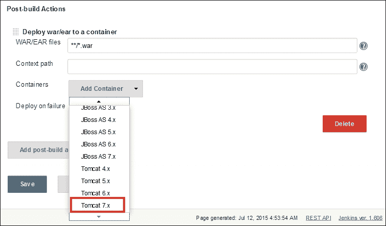
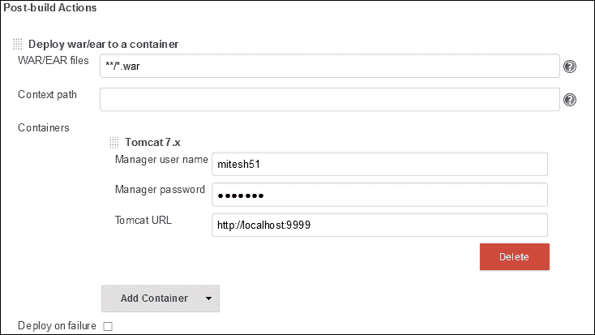
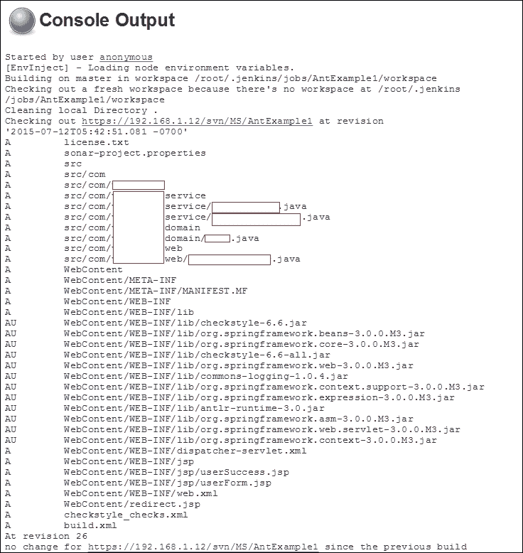
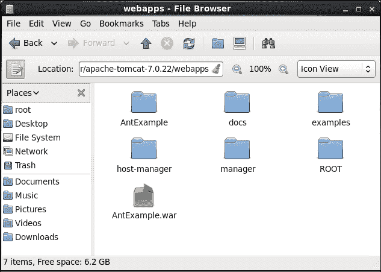
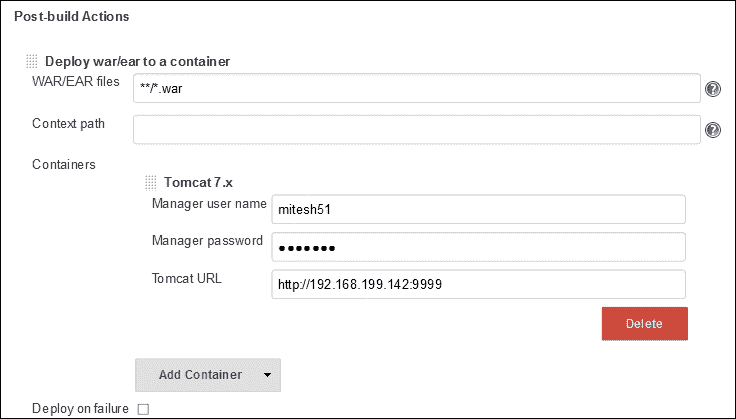

# 第四章。实施自动化部署

|   | *简单是可靠的前提* |   |
|   | *Edsger Dijkstra* |

我们已经介绍了持续集成的概念，我们也知道如何使用 Jenkins 实现它。现在是进入应用程序部署管道的下一步的时候了，即自动化部署。在自动部署到 Tomcat 应用服务器之前，我们将首先了解连续交付和连续部署的概念。

本章将通过在本地或远程应用服务器中部署工件，在部署管道中向前迈出一步。它将深入了解自动化部署和持续交付流程。

*   持续交付和持续部署概述
*   将文件从 Jenkins 部署到 Tomcat 服务器

# 持续交付和持续部署概述

持续交付是持续集成实践的延伸。应用程序工件以自动化的方式为生产做好了准备，但没有在生产中部署。持续部署是持续交付的延伸，应用中的变更最终部署到生产中。持续交付是 DevOps 实践的必要条件。让我们在接下来的部分中了解如何使用 Jenkins 部署应用程序工件。

### 注

有关持续交付和持续部署的更多详细信息，请访问:

[http://continuous delivery . com/2010/08/continuous-delivery-vs-continuous-deployment/](http://continuousdelivery.com/2010/08/continuous-delivery-vs-continuous-deployment/)

[http://martinfowler.com/books/continuousDelivery.html](http://martinfowler.com/books/continuousDelivery.html)

# 安装雄猫

Tomcat 是由 **Apache 软件基金会** ( **ASF** )开发的开源 web 服务器和 servlet 容器。我们将使用 Tomcat 来部署网络应用程序。

1.  去[https://tomcat.apache.org](https://tomcat.apache.org)下载 Tomcat。将所有文件解压到系统中的相关文件夹。
2.  将`conf/server.xml`中的端口号从`8080`更改为`9999`。

    ```
     <Connector port="9999" protocol="HTTP/1.1" 
     connectionTimeout="20000" 
     redirectPort="8443" />

    ```

3.  Open the terminal or Command Prompt based on your operating system. Go to the `tomcat` directory. Go to the `bin` folder, and run `startup.bat` or `startup.sh`. The following is an example of `startup.bat` on Windows.

    

4.  Open your browser and visit `http://localhost:9999`. We can also access the Tomcat home page by using the IP address `http://<IP address>:9999`.

    

# 将战争文件从詹金斯部署到雄猫

我们将使用[https://wiki.jenkins-ci.org/x/CAAjAQ](https://wiki.jenkins-ci.org/x/CAAjAQ)提供的部署插件将 `war`文件部署到特定的容器中。

部署插件获取`war` / `ear`文件，并在构建结束时将其部署到正在运行的本地或远程应用服务器。

它支持以下容器:

*   Tomcat: 4.x/5.x/6.x/7.x
*   JBoss: 3.x/4.x
*   Glassfish: 2.x/3.x

要在`Websphere`容器中部署`war`文件，请使用[https://wiki.jenkins-ci.org/x/UgCkAg](https://wiki.jenkins-ci.org/x/UgCkAg)提供的部署 WebSphere 插件。

要在`Weblogic`容器中部署`war`文件，请使用位于[https://wiki.jenkins-ci.org/x/q4ahAw](https://wiki.jenkins-ci.org/x/q4ahAw)的 WebLogic 部署器插件。

1.  On the Jenkins dashboard, go to the **Manage Jenkins** link and then click on **Manage Plugins** and install **Deploy plugin**.

    

2.  Wait until the installation of **Deploy Plugin** is complete.

    

3.  转到 Jenkins 仪表板并选择任何构建作业。单击所选构建作业的**配置**链接。
4.  Click on the **Add post-build action** button on the configuration page of the relevant job and select **Deploy war/ear to container,** as shown in the following figure.

    

5.  It will add **Deploy war/ear to a container** in the **Post-build Actions** section. Provide a **war** file path that is relative to the workspace, and select **Tomcat 7.x** as the container from the available list box, as shown in the following figure.

    

6.  提供**经理用户名**和**经理密码**；在`tomcat-users.xml`中，取消注释以下内容:

    ```
    <!--
      <role rolename="tomcat"/>
      <role rolename="role1"/>
      <user username="tomcat" password="tomcat" roles="tomcat"/>
      <user username="both" password="tomcat" roles="tomcat,role1"/>
      <user username="role1" password="tomcat" roles="role1"/>
    -->
    ```

7.  在未注释部分添加如下:

    ```
    <role rolename="manager-script"/>
    <user username="mitesh51" password="*********" roles="manager-script"/>  
    ```

8.  Restart Tomcat, visit `http://localhost:9999/manager/html`, and enter a username and password. Use the same username and password in Jenkins for Manager credentials.

    

9.  Click on **Build Now**.

    

10.  Once the build is complete, verify the console output of the deployment of the application in the Tomcat application server.

    

11.  Verify the `webapps` directory in the Tomcat installation directory.

    

12.  Verify the Tomcat manager, and check the status of an application in the Tomcat application server.

    

13.  If the Tomcat server is installed on a remote server, then use the IP address in the Tomcat URL, as shown in the following figure:

    

我们只需要在远程部署的情况下更改 Tomcat URL。

# 自测题

Q1。持续交付和持续部署是一样的。

1.  真实的
2.  错误的

Q2。如何启用 Tomcat 管理器访问？

1.  启动 Tomcat
2.  修改`server.xml`
3.  修改`tomcat-users.xml`
4.  修改`web.xml`

# 总结

干得好！我们在这一章的结尾；让我们总结一下我们所涵盖的内容。我们已经理解了持续交付和持续部署的概念。我们在这里介绍的主要概念是在构建成功后在特定的应用服务器中部署应用程序工件。

在下一章中，我们将学习如何在云上管理詹金斯，并查看一些案例研究。