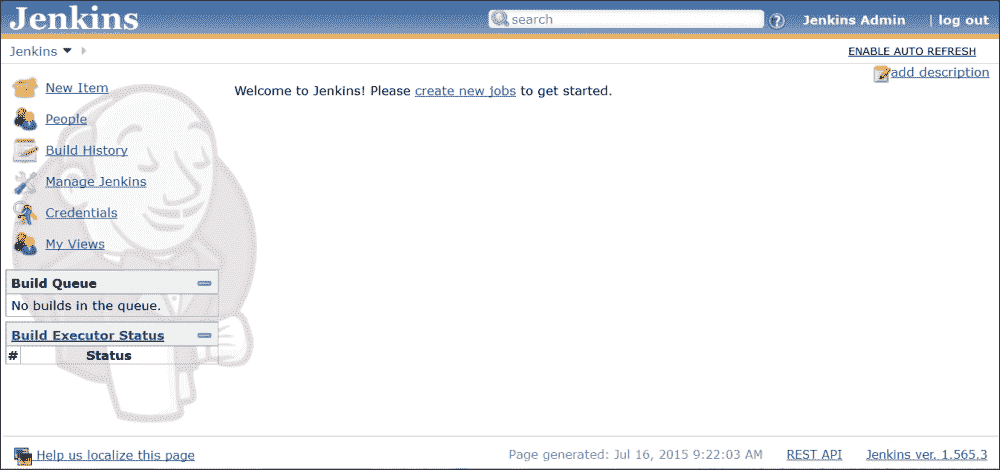
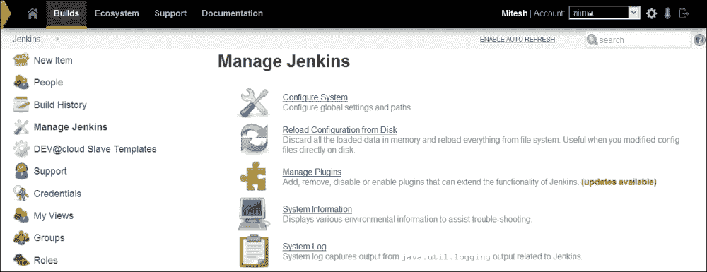
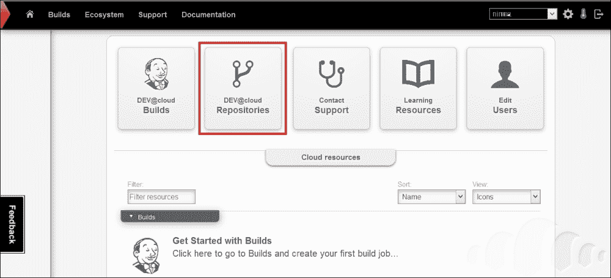
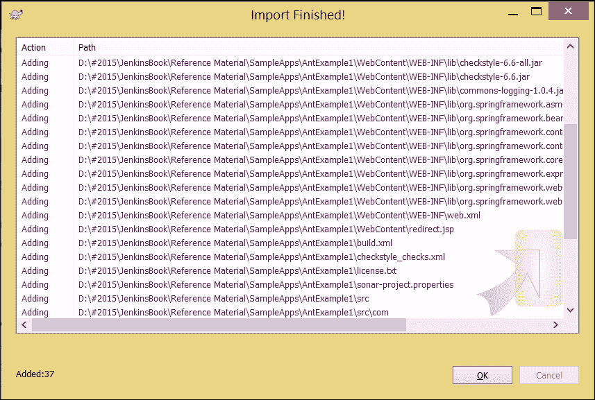
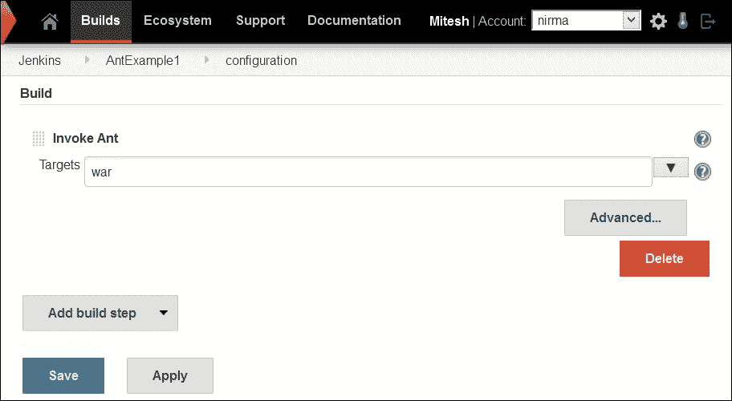

# 五、托管Jenkins

|   | *“生产力就是能够做你以前从未做过的事情”* |   |
|   | - *弗朗茨卡夫卡* |

我们已经理解了持续交付和持续部署的概念。我们也看到了如何将`war`文件从 Jenkins 部署到 Tomcat 服务器。现在，我们将看看如何利用托管Jenkins。不同的服务提供商提供Jenkins即服务。我们将看到 OpenShift 和 CloudBees 如何为用户提供 Jenkins。

本章详细介绍了如何使用托管的 Jenkins，它是由流行的 PaaS 提供商提供的，例如 Red Hat OpenShift 和 CloudBees。本章还详细介绍了各种客户如何根据他们的需求使用 Jenkins。本章将详细探讨如何在 Jenkins 中使用与云相关的插件来有效使用 Jenkins。我们将在本章中讨论以下主题:

*   探索 OpenShift PaaS 中的Jenkins
*   探索云中的Jenkins——云蜜蜂
*   云蜜蜂企业插件概述
*   来自 CloudBees 的Jenkins案例研究

# 探索 OpenShift PaaS 中的Jenkins

OpenShift Online 是来自红帽的公共 PaaS——应用开发和托管平台。它自动化了应用程序的调配和取消调配、管理和扩展过程。这支持命令行客户端工具和网络管理控制台，可以轻松启动和管理应用程序。Jenkins应用程序是由 OpenShift Online 提供的。OpenShift Online 有一个免费的计划。

1.  To sign up for OpenShift Online, visit [https://www.openshift.com/app/account/new](https://www.openshift.com/app/account/new).

    

2.  一旦注册，您将在[https://openshift.redhat.com/app/console/applications](https://openshift.redhat.com/app/console/applications)获得欢迎屏幕。
3.  Click on **Create your first application now**.

    

4.  Choose a type of application, in our case, select **Jenkins Server**.

    

5.  Give **Public URL** for your Jenkins server, as shown in the following screenshot:

    

6.  Click on **Create Application**.

    

7.  Click on **visit app in the browser**.

    

8.  Access the Jenkins in the web browser. Then, log in with the provided credentials in the OpenShift dashboard.

    

9.  The following is the screenshot of the Jenkins dashboard:

    

# 探索云中的Jenkins——云蜂

DEV@cloud 是 CloudBees 管理的安全多租户环境中的托管 Jenkins 服务。它运行Jenkins的特定版本，以及该版本支持的插件的选定版本。所有的更新和补丁都由的 CloudBees 管理，并且可以进行有限的定制。

1.  Go to [https://www.cloudbees.com/products/dev](https://www.cloudbees.com/products/dev) and subscribe.

    

2.  Once we complete subscription process, we will get the dashboard of CloudBees, as shown in following screenshot. Click on **Builds**.

    

3.  We will get the Jenkins dashboard, as shown in the following screenshot:

    

4.  Click on **Manage Jenkins** to configure and install plugins.

    

    ### 注

    在配置构建作业之前，我们需要将应用程序的源代码存储在 CloudBees 提供的存储库服务中。点击**生态系统**，然后点击**存储库**。

    

5.  Click on the subversion repositories or **Add Repository**, and get the URL of the repository.

    

6.  Click on the application folder to import it into the subversion repository provided by CloudBees. Use TortoiseSVN or any SVN client to import the code.

    

7.  Provide the URL of a repository we copied from CloudBees, and click on **OK**.

    

8.  Provide authentication information (the username and password are same as our CloudBees account).

    点击**确定**。

    

    根据源文件的大小，导入过程需要一些时间。

    

9.  Verify the Repository URL on the browser, and we will find the recently imported project in it.

    

10.  Verify the Jenkins dashboard after the successful import operation.

    

11.  Click on **New Item** on the Jenkins dashboard. Select **Freestyle project**, and provide a name for a new build job. Click on **OK**.

    

12.  The configuration page will allow us to configure various settings specific to the build job.

    

13.  Configure the **Subversion** repository in the build job.

    

14.  Click on **Apply**, and then click on **Save**.

    

15.  Click on **Build Now**.

    

    验证控制台输出。

    

    然后，它将编译源文件，并基于`build.xml`文件创建一个`war`文件，因为这是一个基于蚂蚁的项目。

    

16.  Verify the Jenkins dashboard for a successful build.

    

# 云蜜蜂企业插件概述

以下是一些重要的云蜜蜂企业插件:

## 工作流插件

管理软件交付管道是一项复杂的任务，开发人员和运营团队需要管理可能需要几天才能完成的复杂工作。工作流插件支持复杂的管道。该插件将 Groovy DSL 用于工作流，并且它还提供了暂停和重新启动作业的功能，以避免主故障和从故障。

欲了解更多信息，请访问[https://www . cloud bees . com/products/cloud bees-Jenkins-platform/team-edition/features/workflow-plugin](https://www.cloudbees.com/products/cloudbees-jenkins-platform/team-edition/features/workflow-plugin)。

## 检查点插件

让我们考虑一个场景，其中一个长时间运行的构建作业几乎在其结束阶段失败。这可能会妨碍交货进度。检查点插件提供了在检查点重启工作流的功能。因此，它消除了由于主机和从机故障造成的延迟。此外，它还可以帮助Jenkins和基础设施故障中幸存下来。

欲了解更多关于的信息，请访问[https://www . cloud bees . com/products/Jenkins-enterprise/plugins/check points-plugin](https://www.cloudbees.com/products/jenkins-enterprise/plugins/checkpoints-plugin)。

## 基于角色的访问控制插件

认证和授权在安全方面起着重要作用。授权策略可以帮助有效地控制对 Jenkins 作业的访问。在项目级别和可见性上设置权限也很重要。CloudBees 提供的 **基于角色的访问控制** ( **RBAC** )插件提供了以下功能:

*   定义各种安全角色
*   将规则分配给组
*   要在全局或对象级别分配角色
*   将特定对象的组管理委托给用户

要了解更多关于基于角色的访问控制插件的信息，请访问[。](https://www.cloudbees.com/products/jenkins-enterprise/plugins/role-based-access-control-plugin)

## 高可用性插件

由软件或硬件导致的 Jenkins master 停机影响整个产品团队。迅速培养Jenkins大师至关重要，这需要很多小时。高可用性插件通过保留多个主设备作为备份，消除了主设备故障导致的停机。当检测到主设备出现故障时，备份主设备会自动启动。这个插件使故障检测和恢复成为一个自动的过程，而不是手动的。

欲了解更多信息，请访问。

## VMware ESXi/vssphere 自动扩展插件

让我们考虑一个场景，其中您需要在现有基础架构中运行多个 Jenkins 从机，以利用基于 VMware 的虚拟化基础架构中未充分利用的容量。VMware vCenter 自动扩展插件允许您创建在基于 VMware 的虚拟化基础架构中可用的从属计算机。可以配置具有相同和多个虚拟机的虚拟机池。

虚拟机上允许以下操作:

*   通电
*   断电/暂停
*   恢复到最后一个快照

欲了解更多信息，请访问[。](https://www.cloudbees.com/products/jenkins-enterprise/plugins/vmware-esxivsphere-auto-scaling-plugin)

要了解 CloudBees 提供的所有插件的详细信息，请访问[https://www . cloud bees . com/products/Jenkins-enterprise/plugins](https://www.cloudbees.com/products/jenkins-enterprise/plugins)。

# 来自 CloudBees 的Jenkins案例研究

我们将介绍一些来自 CloudBees 的案例研究，其中 Jenkins 被有效地使用。

## Apache jclouds

Apache jclouds 是一个开源的多云工具包，提供了管理多个云上工作负载的工具。它是在 Java 平台上创建的，提供了使用云平台特定功能创建和管理应用程序的完全控制。它提供跨各种云平台的无缝Ansible性。Apache jclouds 支持 30 家云提供商和云软件栈，如 Joyent、Docker、SoftLayer、Amazon EC2、OpenStack、Rackspace、GoGrid、Azure 和 Google。Apache jclouds 拥有 CloudBees、Jenkins、Cloudify、cloudsoft、Twitter、Cloudswitch、enStratus 等卓越的用户基础。

### 挑战

jclouds 社区使用 Jenkins CI 进行持续集成。日复一日，管理和维护Jenkins变得越来越困难，这是一件代价高昂的事情。管理Jenkins是一项耗时且乏味的任务。大多数时候，开发人员都参与了 Jenkins 的管理，而不是编写代码来提高 jclouds 的效率。

### 溶液

jclouds 团队探索了市场上可用的 PaaS 产品，并考虑了 CloudBees，这将帮助他们消除基础架构管理和维护。jclouds 团队认识到，很容易将 Jenkins CI 工作转移到 DEV@cloud，并立即从开发人员那里获得生产力收益。Jenkins的维护活动每周节省了近 4 个小时。

### 福利

*   100%专注于软件开发，消除服务器重启、服务器规模调整、软件更新和补丁等活动，因为这些活动是在 CloudBees 服务内自动执行的
*   开发人员生产率提高 33%
*   云蜜蜂为JenkinsCI问题提供技术支持

欲了解更多关于本案例研究的信息，请访问 https://www.cloudbees.com/casestudy/jclouds T2。

## 全球银行

全球银行是全球顶级金融机构之一。它提供企业和投资银行服务、私人银行服务、信用卡服务和投资管理。它有大量的国际存在。

### 挑战

全球银行的现有流程正遭受碎片化的构建流程、未经批准的软件版本以及缺乏技术支持的困扰。有一个中央控制或管理库，以及过程的标准化。构建资产不是一直都可以访问的。对于具有审计功能的应用程序构建服务，需要安全的自动化流程。Jenkins 提供了标准化以及集中管理的其他好处，包括健壮性和有用插件的可用性。在使用开源 Jenkins 之后，该金融机构面临着开源 Jenkins 中没有的其他挑战。审批、安全、备份和审核需要更多功能。

### 溶液

为了克服现有的挑战，环球银行评估并选择了 CloudBees Jenkins Enterprise，考虑了用于高可用性、备份、安全性和作业组织的额外插件，以及获得开源 Jenkins 和开源 Jenkins 插件技术支持的能力。全球银行利用云蜜蜂的技术支持建立了云蜜蜂Jenkins企业。

### 福利

*   RBAC 插件提供安全性和额外的企业级功能。文件夹插件提供版本控制，并确保只共享批准的软件版本。
*   通过消除监视每个应用程序的本地构建实例的需要，每个应用程序节省了半天的开发时间。
*   技术支持能力的可用性。

欲了解更多信息，请访问 https://www.cloudbees.com/casestudy/global-bank T2。

## 服务流程

服务流提供在线集成服务，以连接组织和各种利益相关者使用的不同的信息技术服务管理工具。它提供了自动创建票证、票证信息交换和票证路由的功能。它拥有许多 ITSM 工具的适配器，如 ServiceNow 和 BMC，以及微软服务管理器富士通、Atos、Efecte 和 Tieto。

### 挑战

服务流希望构建自己的服务，而不使用任何通用的集成工具来实现敏捷性。服务流有几个要求，比如关注敏捷性，这需要一个快速开发和频繁增量更新的平台，支持 Jenkins，控制数据，可靠性和可用性。

### 溶液

服务流使用云蜜蜂平台来构建和部署其 ITSM 集成服务。DEV@cloud 已经通过建立版本控制存储库、编写第一批 Java 类、设置一些基本的 Jenkins 作业、运行单元测试、执行集成测试和其他质量检查得到了利用。服务流服务位于云中，通过使用云蜜蜂平台添加新功能，客户群迅速增长。

### 福利

*   开发时间缩短 50%，三个月内量产
*   每周部署多次更新，不会造成服务停机
*   在生产中实现了 99.999%的可用性

欲了解更多信息，请访问 https://www.cloudbees.com/casestudy/service-flow。

更多案例研究，请访问[https://www.cloudbees.com/customers](https://www.cloudbees.com/customers)。

# 自测题

Q1。云蜜蜂提供的工作流插件是真的吗？

1.  暂停和重新启动作业，往返于主故障和从故障
2.  管理软件交付管道
3.  它将 Groovy DSL 用于工作流
4.  上述全部

Q2。云蜂提供的 RBAC 插件有什么特点？

1.  定义各种安全角色
2.  将规则分配给组
3.  要在全局或对象级别分配角色
4.  上述全部

Q3。云蜜蜂提供的 VMware ESXi/vssphere 自动扩展插件可以执行哪些操作？

1.  通电
2.  断电/暂停
3.  恢复到最后一个快照
4.  上述全部

# 总结

一章结尾的有趣之处在于:每一章的结尾都会引导你走向一个新的开始。我们知道如何在云服务模型上配置、管理和使用 Jenkins，例如 PaaS、RedHat OpenShift 和 CloudBees。我们还介绍了 CloudBees 中一些有趣的企业插件，它们增加了很多灵活性和价值。在最后一节中，我们都提供了各种案例研究的详细信息，这些案例研究证明了 Jenkins 对许多组织的益处，以及他们如何利用 Jenkins 的功能来获得竞争优势。