# 第七章。管理和监控Jenkins

|   | *“初跌+常跌+学会快速恢复=上市时间更快”* |   |
|   | - *匿名* |

在上一章中，我们学习了 Sonar 与 Jenkins 的集成、静态代码分析插件的概述以及构建状态的通知。现在，是时候关注Jenkins的管理和监控了。

本章深入分析了 Jenkins 节点的管理以及使用 Java Melody 对它们的监控，以提供关于资源利用的详细信息。它还涵盖了如何管理和监控构建作业。本章详细描述了 Jenkins 中提供的基本安全配置，以实现更好的访问控制和授权。以下是我们将在本章中介绍的主题列表:

*   管理Jenkins主节点和从节点
*   Jenkins用 JavaMelody 监控
*   管理磁盘使用
*   使用构建监视器插件构建特定于作业的监视
*   管理访问控制和授权
*   维护角色和基于项目的安全性
*   管理管理员帐户
*   审计跟踪插件—概述和使用

# 管理Jenkins主节点和从节点

主程序代表 Jenkins 的基本安装，并处理构建系统的所有任务。它可以满足所有用户的请求，并且有能力自己构建项目。从系统是为了减轻主系统构建项目的负担而建立的系统，但是委托行为取决于每个项目的配置。委托可以专门配置为构建作业。

1.  On the Jenkins dashboard, go to **Manage Jenkins**. Click on **Manage Nodes** link. It will provide information on all nodes, as shown in the following screenshot:

    

2.  To create a slave node, click on **New Node**.

    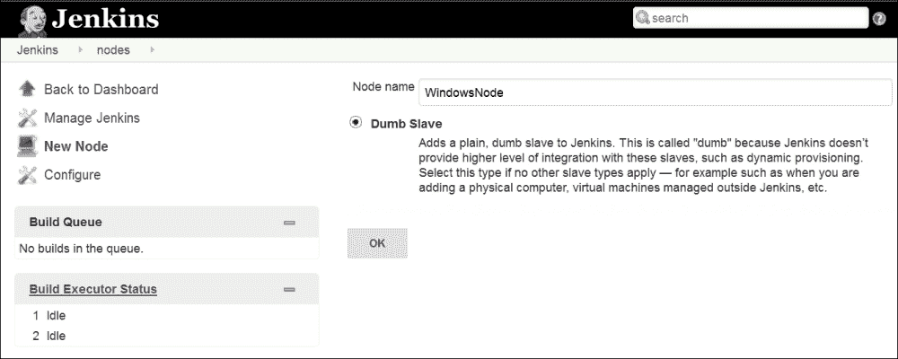

3.  Provide **Name**, **Description**, **Labels** and so on. Select **Launch slave agents via Java Web Start** as **Launch method**. Provide **Labels**; in our case, it is `java8`:

    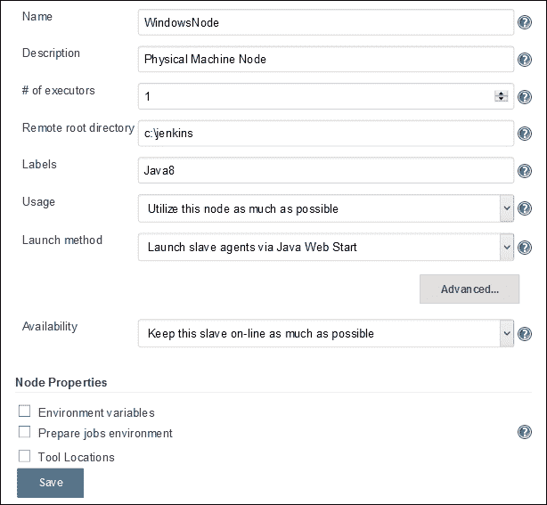

4.  Click on **Save**. It will open a page that gives details on how to launch the slave node.

    

5.  Open terminal on the Windows machine and run `javaws http://192.168.13.128:8080/computer/WindowsNode/slave-agent.jnlp`.

    

    将打开对话框下载应用。

    

6.  Run **Jenkins Remoting Agent**.

    

    Jenkins奴隶代理的小窗口将会打开。

    

    从窗口将通过 JNLP 代理连接。

    

7.  On the Jenkins dashboard, go to **Manage Jenkins**. Click on the **Manage Nodes** link. It will provide information on all nodes, as shown in the following screenshot. Verify both the nodes in the **Build Executor Status** section of the leftmost sidebar.

    

8.  If we want to run a selective build job on to a specific node, then we can configure it build job-wise, as shown in the following screenshot. Check **Restrict where this project can be run** and provide **Label Expression** given to the specific node on the job configuration page.

    

9.  Click on **Build Now** to execute build. Verify the console and find building remotely on WindowsNode we configured in the preceding section.

    它将检查从属节点上的代码，并且只在特定节点上执行操作。

    

当我们希望在特定的运行时环境中运行构建作业时，这种配置非常有用，在特定的节点上可以使用。

# Jenkins用 JavaMelody 监控

监控插件通过 JavaMelody 提供对Jenkins的监控。它提供了中央处理器、内存、系统负载平均值、HTTP 响应时间等图表。它还提供了 HTTP 会话、错误和日志、垃圾收集操作、堆转储、无效会话等的详细信息。从Jenkins仪表板安装监控插件。

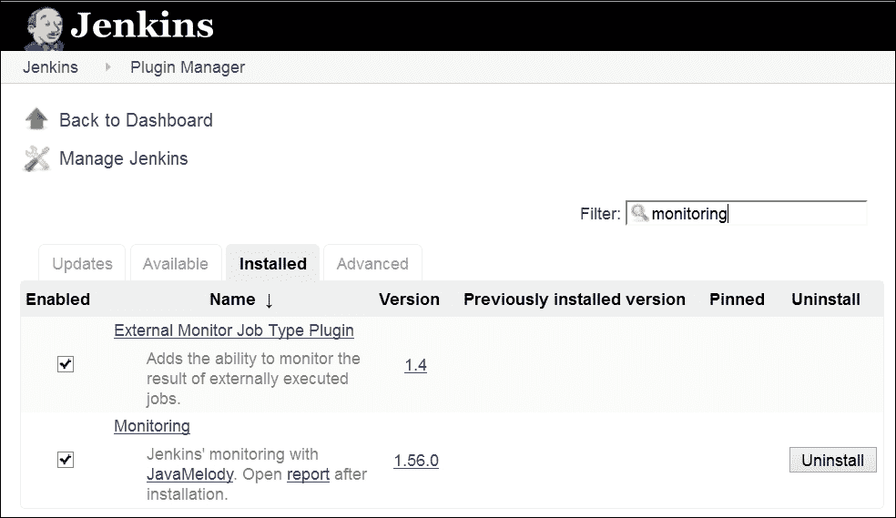

1.  On the Jenkins dashboard, click on **Manage Jenkins**. Click on **Monitoring of Jenkins master**, as shown in the following screenshot:

    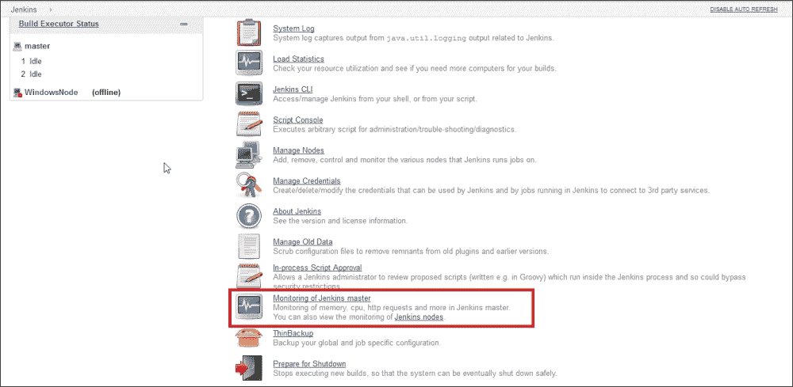

2.  It will open the statistics of JavaMelody monitoring, as shown in the following screenshot. Observe all statistics:

    

3.  Scroll down the page and we will find **Statistics system errors logs**.

    

4.  To get more information, click on the **Details** link of any section. Statistics of HTTP are as shown in the following figure:

    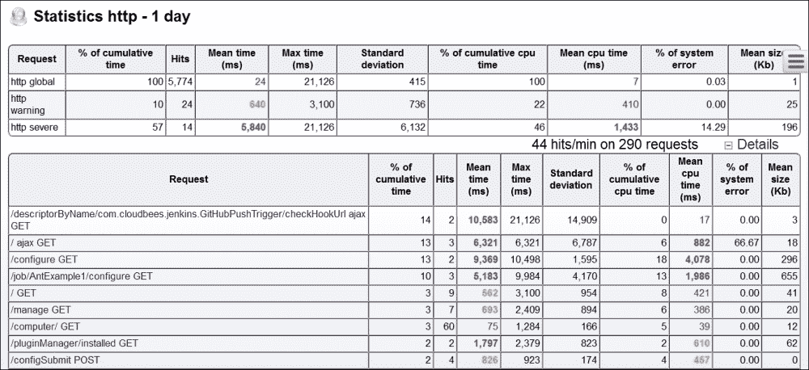

5.  在[https://wiki.jenkins-ci.org/display/JENKINS/Monitoring](https://wiki.jenkins-ci.org/display/JENKINS/Monitoring)进一步探索以获得关于监控插件的更多细节。

# 管理磁盘使用情况

1.  Disk Usage Plugin records disk usage. Install **Disk Usage Plugin** from the Jenkins dashboard.

    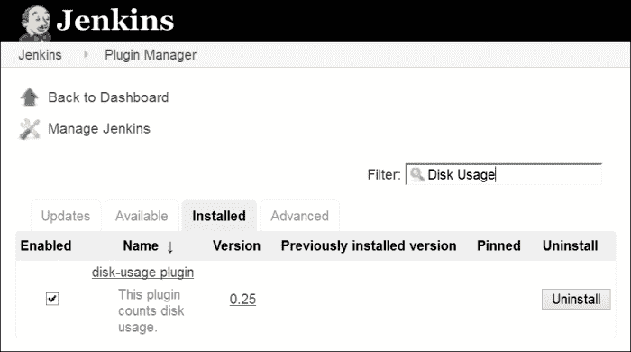

2.  Once the plugin is successfully installed, we will get the **Disk usage** link on the Manage Jenkins page, as shown in the following screenshot:

    

3.  The Disk Usage plugin will show project-wise details for all jobs and all workspace. It will also display **Disk Usage Trend**.

    

欲了解更多关于磁盘使用插件的详细信息，请访问[https://wiki . JENKINS-ci . org/display/JENKINS/Disk+用法+插件](https://wiki.jenkins-ci.org/display/JENKINS/Disk+Usage+Plugin)。

# 使用构建监视器插件构建监视

**构建监视器插件** 提供所选Jenkins作业状态的详细视图。它提供所选作业的状态和进度，以及可能负责“破坏构建”的人员的姓名。这个插件支持声明插件、查看作业过滤器、构建失败分析器和云文件夹插件。

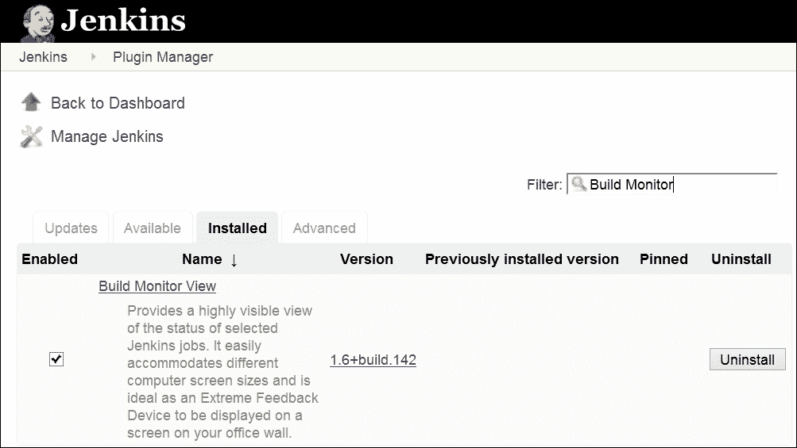

1.  The Dashboard View plugin will be used for creating a view that provides details on build job-specific monitoring. Create a new view and select **Build Monitor View**.

    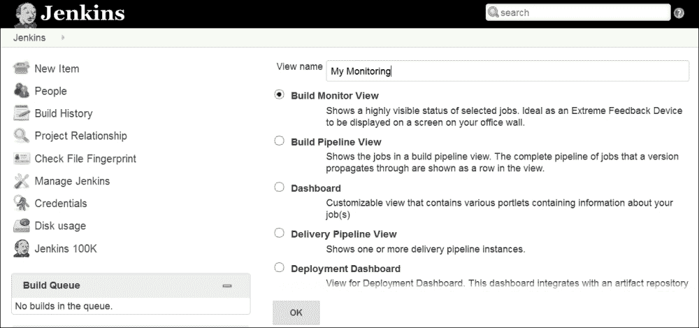

2.  Select **Jobs** and save the details.

    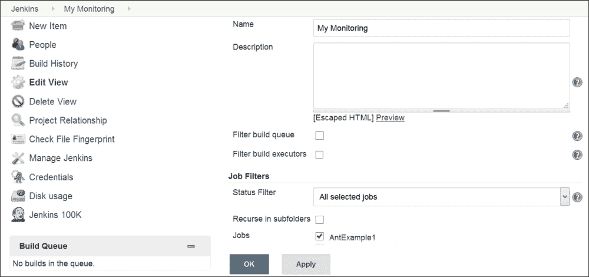

3.  Click on the newly created view, and we will get a similar type of screen as given in the following screenshot:

    

欲了解更多插件详情，请访问[https://wiki . JENKINS-ci . org/display/JENKINS/Build+Monitor+Plugin](https://wiki.jenkins-ci.org/display/JENKINS/Build+Monitor+Plugin)。

# 管理访问控制和授权

Jenkins 支持几种安全模型，可以与不同的用户库集成。

1.  进入Jenkins仪表盘，点击**管理Jenkins**，点击**配置全球安全**。
2.  Click on **Enable security**.

    

    启用安全性后，所有选项都将可见，如下图所示:

    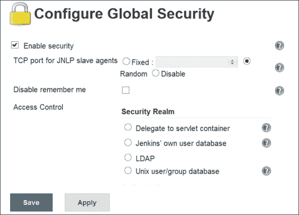

3.  Click on **Jenkins' own user database**. Click on **Save**.

    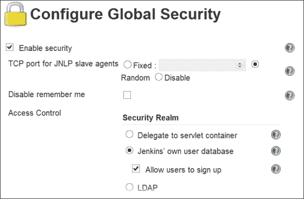

4.  Now, click on the **sign up** link on the top-right corner. Provide **Username**, **Password**, **Full name**, and **E-mail address**.

    

5.  Click on the **log in** link on the dashboard.

    

    我们将获得右上角带有用户名的Jenkins仪表板。

    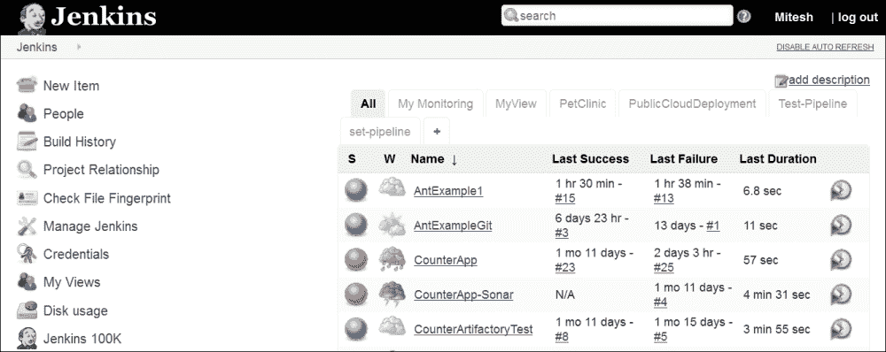

6.  Click on **People** to verify all users.

    

7.  On the Jenkins dashboard, click on **Manage Jenkins**. Click on **Manage Users**.

    

    我们可以在同一页面上编辑用户详细信息。这是用户的子集，也包含自动创建的用户。

# 维护角色和基于项目的安全性

授权方面，我们可以在 **配置全局安全**页面定义**基于矩阵的安全**。

1.  添加组或用户，并根据不同部分配置安全性，如**凭证**、**从机**、**作业**等。
2.  Click on **Save**.

    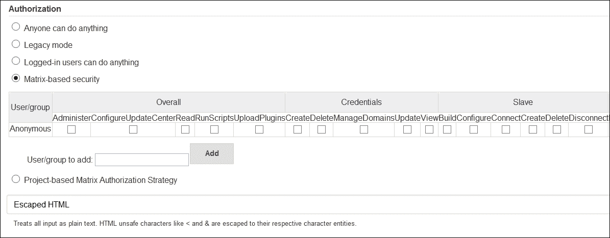

    我们可以使用多个用户进行基于矩阵的安全，如下图截图所示:

    

3.  Try to access the Jenkins dashboard with a newly added user who has no rights, and we will find the authorization error.

    

4.  Now provide overall read rights; build, read, and workspace rights for job for newly added users.

    

5.  Log in with the newly added user and verify that we can see the dashboard. We can't see the **Manage Jenkins** link as we have provided those rights.

    

6.  Click on any build job. The build link is available as we have given rights but the configure link is not available as rights were not given for it.

    

7.  We can also set **Project-based Matrix Authorization Strategy**.

    

8.  Go to a specific build jobs' configuration and **Enable project-based security**.

    

9.  Assign rights to different users and log in with the specific username to verify whether authorization strategy is working or not.

    

10.  Verify the build details also, as shown in the following screenshot:

    

我们已经在 Jenkins 中介绍了安全配置的基础知识。探索更多关于其他选项的练习。如果授权设置不正确，可以通过编辑`config.xml`进行修正。就当是自学吧。

# 审计跟踪插件–概述和使用

审计跟踪插件保存执行特定Jenkins操作的用户的日志，例如配置作业。这个插件在主Jenkins配置页面中增加了一个**审计跟踪**部分。

安装 **审计跟踪插件**。

在Jenkins配置中，配置**记录器**，如下图截图所示:

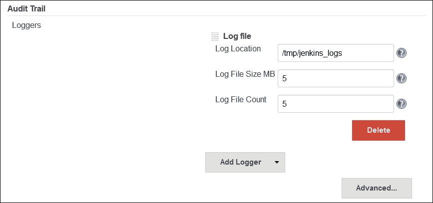

停止Jenkins服务器并重新启动。运行任何生成作业并打开日志文件以验证日志记录。

欲了解更多详情，请访问[https://wiki . JENKINS-ci . org/display/JENKINS/Audit+Trail+Plugin](https://wiki.jenkins-ci.org/display/JENKINS/Audit+Trail+Plugin)。

# 自测题

Q1。从节点上线有哪些不同的方式？

1.  从从属服务器上的浏览器启动代理
2.  从命令行运行`slave-agent.jnlp`命令
3.  运行`java -jar slave.jar`
4.  上述全部

Q2。Jenkins监控提供哪些选项图表？

1.  中央处理器
2.  记忆
3.  系统平均负载
4.  HTTP 响应时间
5.  上述全部

Q3。Jenkins的安全领域有哪些选项？

1.  委托给 Servlet 容器
2.  Jenkins自己的用户数据库
3.  轻量级目录访问协议
4.  Unix 用户/组数据库
5.  上述全部

# 总结

无论我们创造了什么好东西，最终都会造就我们。在本章中，我们介绍了主节点和从节点的概念，如何监控构建作业，以及使用管理功能报告统计信息。我们还了解了如何通过使用基于角色的安全性，利用身份验证和授权配置来保护 Jenkins 环境的安全。我们看到了审计跟踪插件如何在 Jenkins 中存储审计细节。

在下一章中，我们将介绍一些对 Jenkins 有重要价值的重要插件。在我们说再见之前，让我们享受最后的旅程。