# 配置Jenkins

在本章中，我们将学习如何执行一些基本的 Jenkins 管理任务，如下所示:

*   更新/安装/卸载/降级Jenkins插件
*   手动安装Jenkins插件
*   执行Jenkins备份和恢复
*   在各种平台(Windows/Linux/servlet)上升级 Jenkins
*   升级在 Docker 容器中运行的 Jenkins
*   在Jenkins创建和管理用户
*   学习Jenkins的各种认证方法
*   在 Jenkins 中配置各种授权方法

Jenkins带来了一堆要配置的项目。安装的插件越多，需要配置的就越多。在本章中，我们将只介绍Jenkins中的基本管理任务。我们将在接下来的章节中了解更多关于Jenkins配置的信息，其中我们将尝试向Jenkins添加更多插件，以实现**持续集成** ( **CI** )和**持续交付** ( **CD** )。

# Jenkins插件管理器

Jenkins的大部分力量来自插件。Jenkins插件是安装后增强Jenkins功能的软件。安装在 Jenkins 内部的插件在 Jenkins 作业或 Jenkins 系统配置中显示为参数或可配置项，或者在代码片段生成器下显示为事件(如果它与*声明性管道语法*兼容)。

下面的截图显示了Jenkins系统的配置。这是一个配置 SonarQube 工具(静态代码分析工具)的设置。只有在为 SonarQube 安装了 Jenkins 插件后，相应的配置才可用:

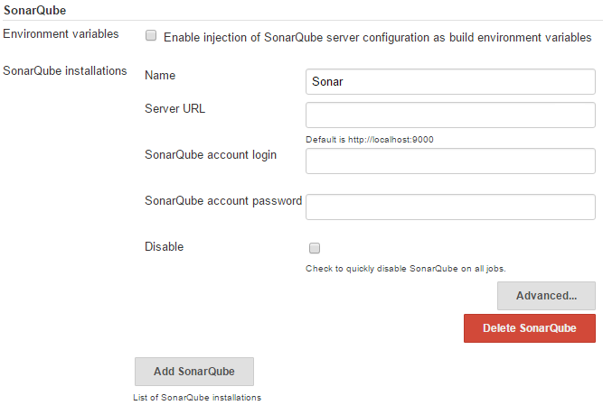

SonarQube settings inside Jenkins system configuration

Jenkins内部有一个特殊的部分来管理插件。在本节中，我们将学习如何使用Jenkins插件管理器管理插件:

1.  从Jenkins仪表盘点击**管理Jenkins**。
2.  进入管理Jenkins页面后，点击**管理插件**。您也可以使用`<Jenkins URL>/pluginManager`链接访问相同的Jenkins插件管理器页面。

3.  您将看到以下四个选项卡:更新、可用、已安装和高级。

# 更新Jenkins插件

**更新**选项卡列出了所有需要更新的插件，如下图所示:

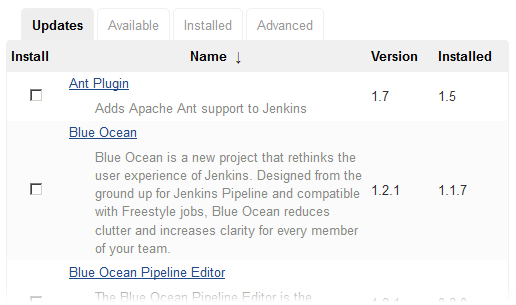

Updating Jenkins plugins

要更新插件，点击相应的复选框选择它，然后点击**立即下载并在重启后安装**按钮。

要更新所有在**更新**标签下列出的插件，点击**全部**(在页面底部提供)。这将选择所有插件。然后，点击**立即下载，重启后安装**按钮安装更新。

在**更新**选项卡上，在页面底部，您将看到一个名为**立即检查**的按钮。点击它刷新显示在**更新**标签下的插件列表。这将检查插件更新。

# 安装新的Jenkins插件

**可用**选项卡列出了Jenkins可用的所有插件。Jenkins实例上安装的插件不会在此列出。

下面的截图显示了 Jenkins 可用插件的列表:

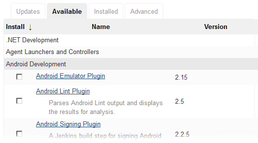

The plugins are grouped based on their functionality

要安装一个插件，点击相应的复选框选择它。然后，在页面底部点击**不重启安装**按钮(立即安装插件)或**立即下载并重启后安装**按钮(名称不言而喻)。

就像**更新**标签一样，在这里你也会看到一个名为**的按钮现在检查**。点击它将刷新**可用**标签下的插件列表。

# 卸载或降级Jenkins插件

**已安装**选项卡列出了当前安装在您的Jenkins实例上的所有插件。如下图所示，你可以看到有一个卸载插件和降级插件的选项。

在插件更新后，如果您的 Jenkins 实例变得不稳定或您的 CI/CD 管道表现不佳，您可以随时选择降级插件:


List of installed Jenkins plugin

# 在 Jenkins 中配置代理设置

在**高级**选项卡下，您将看到一个名为 HTTP 代理配置的部分。这是您配置代理设置以允许 Jenkins 从互联网获取更新的地方:

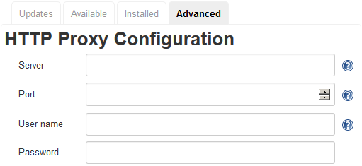

HTTP Proxy Configuration settings

如果您的 Jenkins 服务器不在任何防火墙后面，并且可以直接访问互联网，请将这些字段留空。

当您尝试安装或升级 Jenkins 插件时，Jenkins 会使用 HTTP 代理配置详细信息。它还使用此信息来更新“更新”选项卡和“可用”选项卡上可用的 Jenkins 插件列表。

要测试代理设置，请执行以下操作:

1.  在 **HTTP 代理配置**部分，点击**高级…** 按钮。
2.  在**测试网址**字段添加一个网址，点击**验证代理**按钮。
3.  您应该会看到一条消息:成功，如下图所示。
4.  点击**提交**按钮保存设置:


Checking the proxy settings

# 手动安装Jenkins插件

在**高级**标签下，就在 **HTTP 代理配置**部分之后，你会看到另一个名为**上传插件**的部分。它为您提供了安装或升级Jenkins插件的工具。

当您的 Jenkins 实例没有互联网访问权限，并且您需要一个新插件或需要升级一个现有插件时，此功能非常有用。想象一个场景，你有一个 Jenkins 实例在局域网内运行，但是不能访问互联网，或者我们应该说 Jenkins 在线插件库。在这种情况下，您将首先从在线 Jenkins 存储库中下载所需的 Jenkins 插件，然后使用可移动介质将其传输到 Jenkins 主服务器。最后，您将使用**上传插件**部分来安装所需的Jenkins插件。

让我们按照给定的步骤尝试手动安装插件:

1.  从一台可以上网的机器上，打开网站:[https://updates.jenkins-ci.org/download/plugins/](https://updates.jenkins-ci.org/download/plugins/)。

2.  前面的站点包含了 Jenkins 可用的所有插件列表，如下图所示:


Jenkins plugin index

3.  在下面的例子中，我们将安装一个名为`logstash`的插件。
4.  在索引页面，搜索`logstash`并点击。
5.  您将看到相应插件的所有可用版本。点击你需要的(我选择安装最新的):


List of versions available for a plugin

6.  这会在你的系统上下载一个`.hpi`文件。
7.  当你下载一个插件时，下载它的依赖项(其他Jenkins插件)也很重要。
8.  在安装所需插件之前，必须安装所有依赖项(Jenkins插件)。
9.  将此`.hpi`文件(`logstash.hpi`)复制到您的Jenkins服务器或任何可以访问您的Jenkins仪表板的机器上。

10.  现在，登录到你的Jenkins服务器。从Jenkins仪表盘，导航至**管理Jenkins** | **管理插件** | **高级**。
11.  在**高级**选项卡的**上传插件**部分，执行以下操作(如下图截图所示):
12.  单击文件字段下的浏览…按钮。
13.  从结果窗口，上传下载的`.hpi`文件。
14.  完成后，点击**上传**按钮:

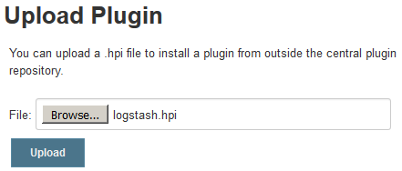

Manually uploading a Jenkins plugin

15.  Jenkins现在将继续安装插件。

# Jenkins备份和恢复

如果有人不小心删除了重要的Jenkins配置，会发生什么？虽然使用我们将在*用户管理*部分看到的严格的用户权限可以避免这种情况，但是想象一下，在Jenkins配置中工作的某个人想要恢复到以前稳定的Jenkins配置。

从我们目前所了解到的情况来看，我们知道整个 Jenkins 配置都存储在 Jenkins 主目录下。是`C:\jenkins` (Windows)、`/var/jenkins_home` (Apache Tomcat)、`/var/lib/jenkins` (Linux)。在下一节中，我们将学习如何使用一个插件，即定期备份插件来备份和恢复Jenkins配置。

# 安装定期备份插件

按照给定的步骤安装定期备份插件:

1.  从Jenkins仪表盘，点击**管理Jenkins** | **管理插件**。
2.  在**插件管理器**页面，点击**可用**选项卡。
3.  使用**过滤**选项，搜索`Periodic Backup`，如下图所示:

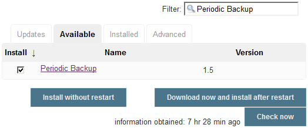

Installing the Periodic Backup plugin

4.  从项目列表中选择定期备份，点击**不重启安装**。你只需要蓝色海洋，其他什么都不需要。

# 配置定期备份插件

在我们开始使用它之前，我们需要告诉定期备份插件备份什么，备份到哪里，以及备份的频率。遵循给定的步骤:

1.  从Jenkins仪表盘转到**管理Jenkins** | **定期备份管理器**。
2.  首次访问定期备份管理器时，您将看到以下通知:

定期备份插件尚未配置。单击此处进行配置。

3.  点击**点击这里配置**链接。
4.  您将进入“定期备份管理器”页面，您会发现许多选项需要配置。让我们一个一个来看(如下图截图所示)。
5.  根目录`<your Jenkins home directory>`是你的Jenkins主目录。
6.  临时目录字段应该是位于您的 Jenkins 服务器机器上的目录。顾名思义，该目录用作在备份/恢复过程中执行归档/取消归档操作的临时位置。它可以是任何目录，应该在 Jenkins 主目录之外。
7.  备份计划(cron)字段是您定义备份时间或频率的地方。不要将此字段留空。请注意，该字段接受 cron 语法。例如，要在每天午夜进行备份，请使用以下不带引号的 cron 语法:`0 0 * * *`。
8.  “验证 cron 语法”按钮用于验证您在备份计划(cron)字段中输入的 cron。
9.  “位置中的最大备份数”字段告诉 Jenkins 不要存储超过此处所述数量的备份。
10.  存储不早于(天)字段告诉 Jenkins 删除任何早于此值的备份。
11.  在文件管理策略下，您有两个选项可供选择:仅配置和完整备份。如果选择“仅配置”选项，Jenkins 将备份 Jenkins 主目录中的所有`.xml`文件和所有作业的`config.xml`文件。但是，如果您选择完整备份，那么 Jenkins 将备份整个 Jenkins 主目录。
12.  在存储策略下，您有三个选项可供选择:空存储、TarGzStorage 和 ZipStorage(支持多卷)。你可以选择适合你要求的。
13.  在“备份位置”下，您可以添加多个备份位置来存储备份。为此，点击**添加位置**按钮并选择本地目录。接下来，在备份目录路径字段下，添加您希望 Jenkins 存储备份的位置。另外，不要忘记勾选**启用此位置**复选框。您可以选择多个位置并启用它们。

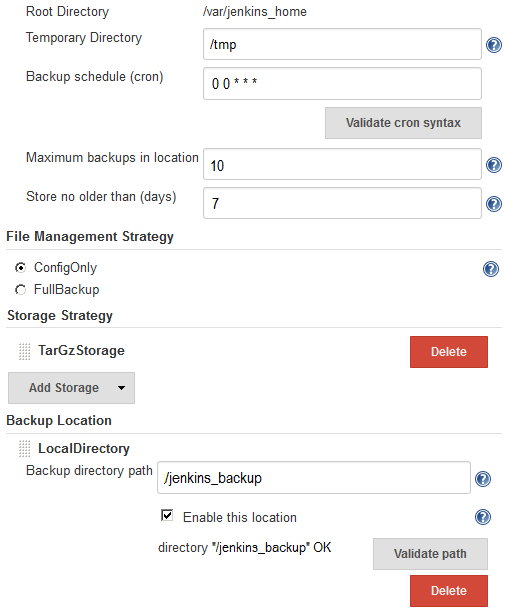

Periodic Backup configurations

# 创建Jenkins备份

现在我们已经配置了定期备份插件，让我们运行一个备份来测试我们的设置。为此，在定期备份管理器页面上，单击立即备份！左侧菜单中提供的链接。

当备份正在进行时，您将在“定期备份管理器”页面上看到通知“正在创建备份...”。

备份完成后，您将看到它列在同一页面上，如下图所示:


List of backup

# 正在恢复Jenkins备份

现在让我们测试恢复Jenkins备份。但是在此之前，让我们进行一些配置更改，看看恢复操作是否有效。为此，我们将在“配置系统”页面上进行一些配置更改:

1.  从Jenkins仪表盘，点击**管理Jenkins|配置系统**。
2.  在**配置系统**页面上，更改以下字段的值。
3.  将“执行者数量”字段的值从`2`更改为`5`。
4.  将安静时段字段的值从`5`更改为`10`。
5.  点击页面底部的**保存**按钮。
6.  现在，让我们将Jenkins还原到上述变化之前的某个点。
7.  从Jenkins仪表盘，点击**管理Jenkins|定期备份管理器**。
8.  在结果页面上，选择我们在上一节中创建的备份，并点击**恢复所选备份**按钮。
9.  您将看到以下消息:

正在恢复备份…

10.  刷新页面，从Jenkins仪表盘点击**管理Jenkins|配置系统**。
11.  您会发现“执行者数量”字段的值为 2，“安静时段”字段的值为 5。

# 查看备份和恢复日志

您可以看到关于 Jenkins 备份和恢复的整个日志。要查看详细信息日志，请执行以下步骤:

1.  从Jenkins仪表盘，点击**管理Jenkins|系统日志**。
2.  在日志页面的日志记录器部分，点击`org.jenkinsci.plugins.periodicbackup`。
3.  您将在这里找到备份和恢复操作的完整日志，如下图所示:

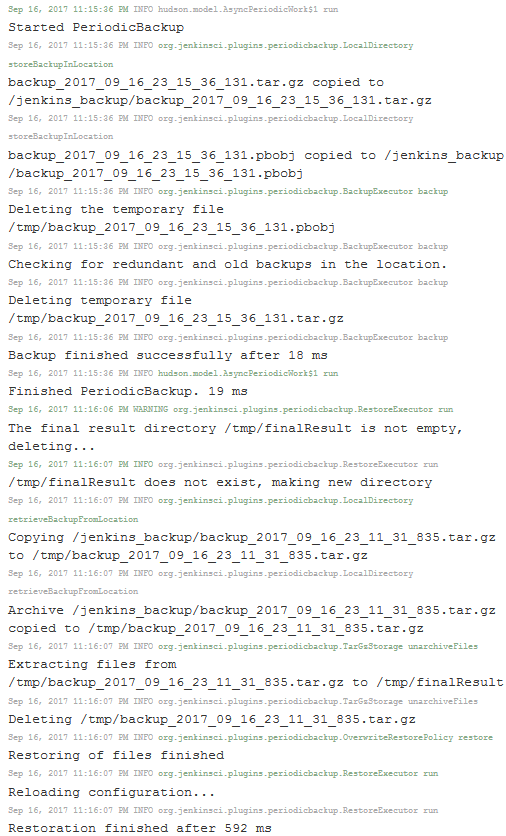

Jenkins Periodic Backup log

# 升级Jenkins

Jenkins发布有两种: *LTS 发布*和*周发布*。*Jenkins每周发布版*包含新功能和错误修复，而 *LTS(长期支持)* *发布版*是被认为在 12 周内稳定的特殊发布。建议您始终为Jenkins服务器选择一个 *LTS 版本*:

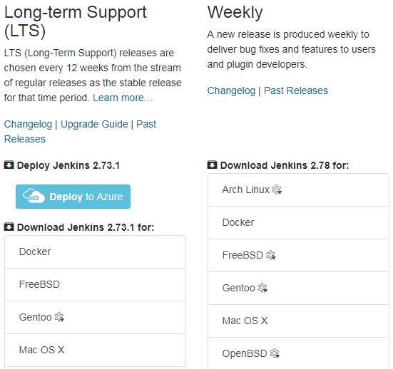

Jenkins download page

Jenkins 会在有新版本可用时自动通知您(前提是您的 Jenkins 服务器可以访问互联网)，如下图所示:


Jenkins notification about the availability of a new version

# 升级运行在 Tomcat 服务器上的 Jenkins

在下一节中，我们将学习更新 servlet (Apache Tomcat)中运行的 Jenkins。遵循给定的步骤:

1.  以超级用户身份登录您的 Apache Tomcat 服务器。
2.  使用以下命令在`/tmp`目录下下载最新(LTS)版本的`jenkins.war`:

```
 cd /tmp 
 wget http://mirrors.jenkins.io/war-stable/latest/jenkins.war
```

To download a specific version of Jenkins (LTS), go to the following link: [http://mirrors.jenkins.io/war-stable/](http://mirrors.jenkins.io/war-stable/) and choose the desired version of Jenkins (for example, [http://mirrors.jenkins.io/war-stable/2.73.1/jenkins.war](http://mirrors.jenkins.io/war-stable/2.73.1/jenkins.war)).

To download a specific version of Jenkins (Weekly), go to the following link: [http://mirrors.jenkins.io/war/](http://mirrors.jenkins.io/war/) and choose the desired version of Jenkins (for example, [http://mirrors.jenkins.io/war/2.78/jenkins.war](http://mirrors.jenkins.io/war/2.78/jenkins.war)).

3.  在我们升级Jenkins之前，备份我们的`jenkins_home`目录是很重要的。请参考*创建Jenkins备份*部分。

在升级Jenkins之前，请始终运行Jenkins的备份。

4.  现在，使用以下命令停止`tomcat`服务:

```
 systemctl stop tomcat
```

5.  接下来，转到当前`jenkins.war`文件所在的位置。在我们的案例中，是`/opt/tomcat/webapps`:

```
 cd /opt/tomcat/webapps/
```

如果您选择仅使用 Tomcat Server 运行 Jenkins，您可能会在`webapps`目录下找到`ROOT.war`而不是`jenkins.war`。请参阅第 2 章、*安装Jenkins中的*在 Apache Tomcat 服务器上单独安装Jenkins*一节。*

6.  备份您现有的`jenkins.war`或`ROOT.war`，并将其放在`webapps`目录之外的某个地方(例如，`/tmp`目录):

```
 cp jenkins.war /tmp/jenkins.war.last.stable.version
```

或者:

```
 cp ROOT.war /tmp/ROOT.war.last.stable.version
```

7.  现在，删除 webapps 目录中当前的`jenkins.war`或`ROOT.war`文件:

```
 rm –r jenkins.war
```

或者:

```
 rm –r ROOT.war
```

8.  接下来，将您从`/tmp`目录下载的新`jenkins.war`移动到`webapps`目录。如果您使用 Apache Tomcat 服务器只是为了运行 Jenkins，那么将`destination.war`文件重命名为`ROOT.war`:

```
 mv /tmp/jenkins.war /opt/tomcat/webapps/jenkins.war
```

或者:

```
 mv /tmp/jenkins.war /opt/tomcat/webapps/ROOT.war
```

9.  现在，使用以下命令启动 Tomcat 服务:

```
 systemctl start tomcat
```

10.  登录到您的Jenkins实例。要确认Jenkins版本，请查看您的Jenkins仪表板的右下角，在那里您会发现一个新的Jenkins版本号。

# 升级运行在 Windows 上的独立Jenkins

在 Windows 上升级独立的 Jenkins 服务器是一项简单的任务。遵循给定的步骤:

1.  从[https://jenkins.io/download/](https://jenkins.io/download/)下载最新`jenkins.war`。或者，如果您正在寻找想要升级到的特定 Jenkins 版本，请从以下链接下载:[http://mirrors.jenkins.io/war-stable/](http://mirrors.jenkins.io/war-stable/)。
2.  在我们升级Jenkins之前，备份我们的`jenkins_home`目录是很重要的。参考*Jenkins备份和恢复*部分下的*创建Jenkins备份*部分。

在升级Jenkins之前，请始终运行Jenkins的备份。

在Jenkins独立实例(运行在 Windows 机器上)上，`jenkins.war`文件存在于`jenkins_home`目录中。因此，备份`jenkins_home`目录就足够了。

3.  接下来，停止Jenkins服务。为此，从窗口运行中执行`services.msc`。这将打开窗口服务页面。
4.  搜索Jenkins服务(通常名为Jenkins)。停止 Jenkins 服务，如下图所示:

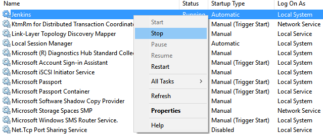

Stopping a Jenkins service

5.  或者，您也可以使用以下命令从 Windows 命令提示符(以管理员身份运行)停止 Jenkins 服务:

```
 net stop Jenkins
```

输出如下:

```
 The Jenkins service is stopping.
 The Jenkins service was stopped successfully.
```

6.  接下来，用新下载的`jenkins.war`文件替换`C:\Program Files (x86)\Jenkins\`下的`jenkins.war`文件。
7.  替换`jenkins.war`文件*后，*从服务窗口启动 Jenkins 服务，如下图截图所示:

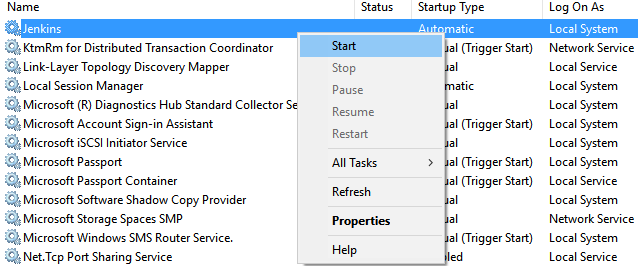

Starting a Jenkins service

8.  或者，您也可以使用以下命令从 Windows 命令提示符(以管理员身份运行)启动 Jenkins 服务:

```
 net start Jenkins
```

输出如下:

```
 The Jenkins service is starting.
 The Jenkins service was started successfully.
```

9.  登录到您的Jenkins实例。要确认Jenkins版本，请查看Jenkins仪表板的右下角，在那里您应该会看到一个新的Jenkins版本号。

# 升级运行在 Ubuntu 上的独立 Jenkins

在下一节中，我们将学习如何更新运行在 Ubuntu 上的 Jenkins。遵循给定的步骤:

1.  以超级用户身份登录到您的 Jenkins 服务器。

2.  使用以下命令，在`/tmp`目录下下载最新(LTS)版本的`jenkins.war`:

```
 cd /tmp 
 wget http://mirrors.jenkins.io/war-stable/latest/jenkins.war
```

要下载Jenkins(LTS)的特定版本，请访问以下链接:[http://mirrors.jenkins.io/war-stable/](http://mirrors.jenkins.io/war-stable/)并选择所需版本的Jenkins(例如，[http://mirrors.jenkins.io/war-stable/2.73.1/jenkins.war](http://mirrors.jenkins.io/war-stable/2.73.1/jenkins.war))。

要下载Jenkins的特定版本(每周)，请访问以下链接:[http://mirrors.jenkins.io/war/](http://mirrors.jenkins.io/war/)并选择所需版本的Jenkins(例如，[http://mirrors.jenkins.io/war/2.78/jenkins.war](http://mirrors.jenkins.io/war/2.78/jenkins.war))。

3.  在我们升级Jenkins之前，备份我们的`jenkins_home`目录是很重要的。参考*Jenkins备份和恢复*部分下的*创建Jenkins备份*部分。

在升级Jenkins之前，请始终运行Jenkins的备份。

4.  现在，使用以下命令停止`jenkins`服务:

```
 systemctl stop jenkins
```

5.  接下来，转到当前`jenkins.war`文件所在的位置。在我们的案例中，是`/usr/share/jenkins/`:

```
 cd /usr/share/jenkins/
```

6.  备份您现有的`jenkins.war`并将其放在`jenkins`目录之外的某个地方(例如，`/tmp`目录):

```
 cp jenkins.war /tmp/jenkins.war.last.stable.version
```

7.  现在，删除`jenkins`目录中的当前`jenkins.war`文件:

```
 rm –r jenkins.war
```

8.  接下来，将您从`/tmp`目录下载的新`jenkins.war`文件移动到`jenkins`目录:

```
 mv /tmp/jenkins.war /usr/share/jenkins/jenkins.war
```

9.  现在，使用以下命令启动`jenkins`服务:

```
 systemctl start jenkins
```

10.  登录到您的Jenkins实例。要确认Jenkins版本，请查看您的Jenkins仪表板的右下角，在那里您会发现一个新的Jenkins版本号。

# 升级运行在 Docker 容器上的 Jenkins

在下一节中，我们将学习如何更新在 Docker 容器中运行的 Jenkins 实例:

以下部分仅适用于使用`jenkins_home`目录的数据卷运行 Jenkins 实例的情况。参见[第 2 章](02.html)、*安装Jenkins*中的*在 Docker 上运行Jenkins、使用数据卷运行Jenkins容器*部分。

1.  登录到您的 Docker 主机。
2.  使用以下命令查找正在运行的 Jenkins 容器:

```
 sudo docker ps --format "{{.ID}}: {{.Image}} {{.Names}}"
```

输出如下:

```
 d52829d9da9e: jenkins/jenkins:lts jenkins_prod
```

3.  您应该会得到类似于前面代码片段的输出。注意Jenkins容器的名字，在我的例子中是`jenkins_prod`。
4.  我们将使用以下 Docker 命令停止并删除正在运行的 Jenkins 容器。但是，在停止并删除 Jenkins 实例之前，请确保 Jenkins 服务器上没有正在运行的作业:

```
 sudo docker stop <your jenkins container name>
 sudo docker rm <your jenkins container name>
```

5.  使用以下命令列出 Docker 主机上可用的 Docker 映像。你可以看到我们有一个Jenkins·多克的图像:`jenkins/jenkins:lts`。然而，这已经不是最新的了:

```
 sudo docker images
```

输出如下:

```
 REPOSITORY        TAG      IMAGE ID        CREATED             SIZE
 jenkins/jenkins   lts      6376a2961aa6    7 weeks ago         810MB
 hello-world       latest   1815c82652c0    3 months ago        1.84kB
```

6.  使用以下命令下载最新的 Jenkins Docker 映像:

```
 sudo docker image pull jenkins/jenkins:2.73.1
```

上述命令可能需要一段时间来下载Jenkins Docker 映像。

在撰写本章时，2.73.1 是最新的 Jenkins 版本(LTS)。通过修改命令选择所需的Jenkins版本。

7.  下载完成后，再次执行`sudo docker images`命令，如下图所示。请注意新的Jenkins·多克图像。在我的例子中，是`jenkins/jenkins:2.73.1`:

```
 sudo docker images
```

输出如下:

```
 REPOSITORY          TAG     IMAGE ID       CREATED             SIZE jenkins/jenkins     2.73.1  c8a24e6775ea   24 hours ago        814MB jenkins/jenkins     lts     6376a2961aa6   7 weeks ago         810MB hello-world         latest  1815c82652c0   3 months ago        1.84kB
```

8.  现在让我们使用新下载的 Jenkins Docker 映像启动一个新的 Jenkins 容器(我们将重用旧的 Jenkins 容器名称):

```
 sudo docker run -d --name jenkins_prod \
      -p 8080:8080 -p 50000:50000 \ 
      -v jenkins-home-prod:/var/jenkins_home \
      jenkins/jenkins:2.73.1
```

9.  下表解释了我们之前使用的 Docker 命令:

| `docker` | 用于调用 Docker 实用程序。 |
| `run` | 这是一个运行容器的 Docker 命令。 |
| `-d` | 该选项在后端运行容器。 |
| `--name` | 该选项为您的容器命名。 |
| `-p` | 此选项用于将容器的端口映射到主机。 |
| `jenkins/jenkins:2.73.1` | Docker 映像的名称及其用于创建容器的版本。`jenkins/jenkins`是 Jenkins Docker 图像，`2.73.1`是该图像的特定版本。 |

10.  登录到您的Jenkins实例。你应该看到你所有的工作/设置完好无损。要确认Jenkins版本，请查看您的Jenkins仪表板的右下角，在那里您会发现一个新的Jenkins版本号。

# 用户管理员

让我们看看Jenkins在用户管理领域能提供什么。在Jenkins仪表板中，单击管理Jenkins|配置全局安全性以访问配置全局安全性页面。

您也可以使用`<Jenkins URL>/configureSecurity/`链接访问配置全球安全页面。

在下一节中，我们将继续讨论与用户身份验证和权限相关的选项。我们将在接下来的章节中查看其他安全选项。

# 在 Jenkins 上启用/禁用全局安全性

在“配置全局安全性”页面上，您将看到“启用安全性”选项已经启用。启用安全选项应始终打开；禁用它将使任何拥有Jenkins网址的人都可以访问Jenkins，没有任何限制。

# 启用/禁用计算机来记住用户凭据

当用户尝试访问 Jenkins 时，会为他们提供一个选项，让他们在各自的计算机上被记住，如下图所示:


Remember me on this computer option

默认情况下，此行为处于启用状态。要禁用此功能，请勾选“配置全球安全”页面下的**禁用记住我**选项。

# 认证方法

Jenkins 提供了多种身份验证方法可供选择。以下是可用选项的列表:

*   委托给 servlet 容器
*   Jenkins自己的用户数据库
*   轻量级目录访问协议
*   Unix 用户/组数据库


Jenkins' authentication methods

默认情况下，Jenkins自己的用户数据库选项处于启用状态。我们在 Jenkins 设置向导中创建的初始用户都存储在 Jenkins 自己的用户数据库中。没有任何类型的实际数据库，所有用户信息都保存为 XML 文件。让我们快速了解一下每种身份验证方法。

# 委托给 servlet 容器

仅当您从 servlet 容器(如 Apache Tomcat 等)运行 Jenkins 服务器时，才能使用此选项。启用此选项将允许 Jenkins 使用 servlet 容器的领域对用户进行身份验证。

例如，在第 2 章、*安装Jenkins*、的*在 servlet 容器*内运行Jenkins子部分*中，我们修改了`tomcat-user.xml`文件来创建用户和访问。这就是`UserDatabaseRealm`的一个例子。*

这意味着，如果您的 Jenkins 服务器运行在 Apache Tomcat 服务器上，并且您已经配置了`UserDatabaseRealm`*，那么`tomcat-user.xml`文件中定义的所有用户都将能够访问 Jenkins。*

 *参考以下网站查看 Apache Tomcat 支持的所有类型的领域:[http://Tomcat . Apache . org/Tomcat-8.0-doc/Realm-how to . html # Standard _ Realm _ implements。](http://tomcat.apache.org/tomcat-8.0-doc/realm-howto.html#Standard_Realm_Implementations)

# Jenkins自己的用户数据库

默认情况下，此选项处于启用状态。在该方案下，Jenkins 将所有用户信息存储在 XML 文件中。这个选项对于小型组织或者如果您正在探索 Jenkins 并且还没有使它成为您的组织的一部分，是很好的。

还有一个选项允许用户在登录页面注册。要启用它，勾选Jenkins自己的用户数据库下的**允许用户注册**选项。

这将在 Jenkins 登录页面启用名为**的链接创建账户**，如下图所示:


Allow user to sign up option

作为新用户，当你点击**创建账户**链接时，系统会要求你填写一些关于自己的基本信息，比如用户名、密码、邮箱、全名等等。一旦你填写完必要的信息，你将被允许进入Jenkins。

作为新用户，您在 Jenkins 上被允许看到/做什么取决于 Jenkins 内部的**授权**设置。我们将在本章后面了解**授权**设置。

# 轻量级目录访问协议

这是大多数组织中使用最广泛的身份验证方法之一。如果您没有看到**访问控制** | **安全领域**部分下列出的 **LDAP** 选项，请检查 **LDAP 插件**。

如下图所示，以下选项允许 Jenkins 使用 LDAP 服务器对用户进行身份验证。联系您组织中的信息技术管理团队，提供 LDAP 服务器的详细信息(如果您的组织使用 LDAP)。

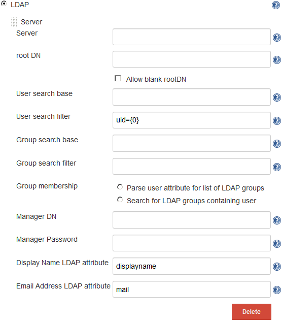

For more information about the LDAP configuration, refer to the LDAP plugin page: [https://wiki.jenkins.io/display/JENKINS/LDAP+Plugin](https://wiki.jenkins.io/display/JENKINS/LDAP+Plugin).

# Unix 用户/组数据库

如果 Jenkins 安装在 Unix/Linux 机器上，则以下选项有效。启用后，Jenkins 会将身份验证委托给底层操作系统。换句话说，在底层操作系统上配置的所有用户/组都可以访问 Jenkins。

您不需要在 Jenkins 内部配置任何东西来使这个选项工作。但是，底层操作系统上的所有用户都应该可以访问`/etc/shadow`文件*。*

使用以下命令使所有用户都可以访问`/etc/shadow`文件:

```
sudo chmod g+r /etc/shadow
```

# 在Jenkins内部创建新用户

以下部分仅适用于使用 Jenkins 自己的用户数据库作为身份验证方法的情况。执行以下步骤将用户手动添加到您的 Jenkins 服务器。

1.  从Jenkins仪表盘，点击**管理Jenkins|管理用户**。
2.  在**管理用户**页面，从左侧菜单，点击**创建用户**。
3.  在结果页面上，您将被要求提供一些关于用户的基本信息，如下图所示:

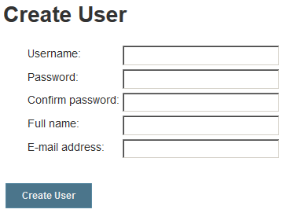

Creating a user in Jenkins

4.  用适当的值填充字段，并点击**创建用户**按钮。

仅当您使用 Jenkins 自己的用户数据库作为身份验证方法时，“管理用户”链接才可用。

# 人物页面

“人员”页面显示有权访问 Jenkins 服务器的所有用户，如下图所示:

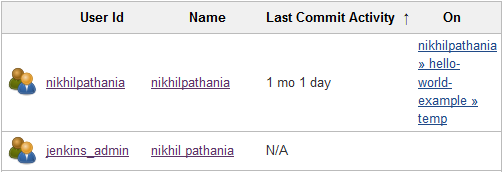

The Jenkins People page

# Jenkins中的用户信息和设置

单击任何特定的用户标识或名称(请参见下面的屏幕截图)以获取相应用户的信息。您将进入用户的状态页面，如下图所示:

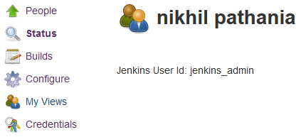

The users' Status page

在用户状态页面，您将在左侧菜单上看到以下选项:**状态**、**构建**、**配置**、**我的视图**和**凭证**。让我们详细探讨其中的一些:

*   **构建**页面将显示当前用户运行的所有 Jenkins 构建的信息。
*   **我的视图**页面将带您进入当前用户可访问的视图。如果没有为当前用户配置视图，那么**我的视图**页面将显示默认的全部视图(Jenkins仪表盘)。
*   凭证链接将带您进入**凭证**页面。但是，“凭据”页面将显示与当前用户相关的附加信息，如下图所示:


Jenkins credentials scoped to a user

# 授权方法

Jenkins 提供了多种授权方法可供选择。以下是可用选项的列表:

*   任何人都可以做任何事
*   传统模式
*   登录用户可以做任何事情
*   基于矩阵的
*   基于项目的矩阵授权策略

默认情况下，已登录用户可以做任何事情选项处于启用状态。让我们快速了解一下每种授权方法。

要访问Jenkins授权设置，从Jenkins仪表板导航至**管理Jenkins|配置全球安全|访问控制**。

# 任何人都可以做任何事

当您选择此选项时，Jenkins 不会执行任何授权。任何可以访问 Jenkins 的人都可以完全控制，包括匿名用户。不建议使用此选项。

# 传统模式

当您选择此选项时，Jenkins 的行为方式与 1.164 版之前相同。简单来说，Jenkins 将寻找名为`Admin`的用户(不考虑您使用的身份验证方法)*。*该`Admin`用户将被授予管理权限，其余用户将被视为匿名用户。同样不建议使用此选项。

# 登录用户可以做任何事情

这是Jenkins在安装和设置新的Jenkins服务器时附带的默认身份验证设置。名称不言自明，即登录用户默认为管理员。同样，不建议使用此选项。

在“登录用户可以做任何事情”字段下，有一个名为“允许匿名读取访问”的选项(默认情况下禁用)。勾选(启用)此选项后，任何有权访问Jenkins网址的人都将立即被带到Jenkins仪表板，对所有Jenkins职务具有只读访问权限。但是，您需要登录才能编辑Jenkins作业或查看Jenkins的配置。

# 矩阵安全

这是Jenkins最广泛使用的授权方法之一。让我们通过执行以下步骤来详细探索它:

1.  通过选择启用基于矩阵的安全授权方法。您将看到以下矩阵:


Matrix-based security configurations

2.  从前面的截图中，您可以看到列代表 Jenkins 中的各种项目，行代表各种用户。在矩阵的底部有一个添加用户的选项。
3.  让我们添加一些用户，并为他们提供一些权限。
4.  要添加用户，在**用户/组添加**字段输入用户的确切用户名，点击**添加**按钮。
5.  从下面的截图可以看到，我已经添加了四个用户(参考*人物页面*部分，可以在这里看到可以添加的用户列表)。如果您使用的是 Jenkins 自己的用户数据库，那么创建一些用户(参考*在 Jenkins 内部创建新用户*部分):


Adding users to the matrix

6.  现在，让我们通过选择适当的复选框给他们一些权限。从下面的截图可以看出，我已经给了用户`jenkins_admin`完全的访问权限。用户`jenkins_developer`和`jenkins_tester`被授予读取和执行 Jenkins 作业的权限，`jenkins_user`用户被授予只读权限:


Providing permissions using the Matrix

7.  保持其余设置不变，点击页面底部的保存按钮。
8.  要检查配置，请以每个用户的身份登录，并确认您在 Jenkins 仪表板上看到的内容。

# 基于项目的矩阵授权策略

在前一节中，我们看到了基于矩阵的安全授权特性，它为我们提供了对用户和权限的大量控制。

但是，想象一下这样一种情况，您的 Jenkins 服务器已经发展到包含数百个 Jenkins 作业和许多用户的地步，您希望在作业级别(项目级别)控制用户权限。

在这种情况下，我们需要基于项目的矩阵授权策略:


User permission at job level

让我们学习如何配置基于项目的矩阵授权策略。请执行以下步骤:

1.  要访问Jenkins授权设置，从Jenkins仪表板导航至**管理Jenkins|配置全球安全|访问控制**。
2.  选择基于项目的矩阵授权策略选项。您将看到以下矩阵:


Project-based Matrix Authorization Strategy configurations

3.  现在，添加一个用户并授予其完全权限。要添加用户，请在要添加的用户/组字段中键入用户的确切用户名，然后点击**添加**按钮。

4.  从下面的截图可以看到，我已经添加了拥有完全权限的用户`jenkins_admin`:


Adding users to the matrix

5.  保持其余设置不变，点击页面底部的**保存**按钮。
6.  接下来，在Jenkins仪表板上右键单击任何Jenkins作业，并选择**配置**。
7.  在“作业配置”页面上，一直向下滚动到“启用基于项目的安全性”选项并将其启用。
8.  启用基于项目的安全性后，将出现一个矩阵表，如下图所示:

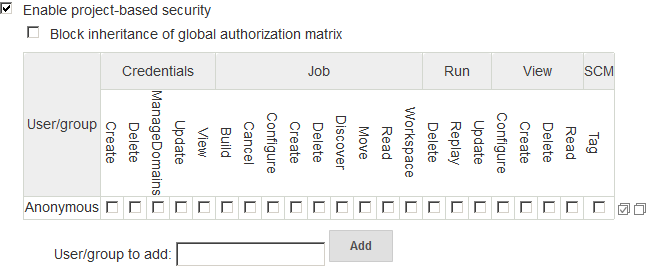

Project-based security configurations inside Jenkins job

9.  让我们添加一些用户，并为他们提供一些权限。
10.  要添加用户，请在要添加的用户/组字段中输入用户的确切用户名，然后点击**添加**按钮。

11.  从下面的截图中可以看到，我已经给用户`jenkins_developer`添加了一些权限:


Providing permissions using the Matrix

12.  完成后，点击页面底部的**保存**按钮。
13.  现在以您刚刚授予相应 Jenkins 作业权限的用户身份登录(在我们的示例中为`jenkins_developer`)。
14.  您会发现用户只能看到它有权访问的 Jenkins 作业。
15.  同样，您可以在 Jenkins 中创建的每个作业上配置用户权限。

# 摘要

在本章中，我们看到了如何在 Jenkins 中配置一些基本但重要的元素，所有这些都借助于一些实际的例子。Jenkins升级、Jenkins备份和Jenkins用户管理是我们在本章中学到的一些重要内容。

下一章是关于Jenkins主从架构和Jenkins*分布式构建系统*。*