# 分布式构建

Jenkins 的主从架构使得在多个从机之间分配工作变得很容易。这一章是关于跨不同平台配置 Jenkins 从机的。以下是我们将讨论的主题:

*   詹金斯节点管理器概述
*   在独立的 Linux 机器上安装詹金斯从机
*   在独立的 Windows 机器上安装詹金斯从机
*   安装和配置 Docker 插件，用于创建按需詹金斯从机

# 分布式构建和测试

在下一节中，让我们稍微了解一下分布式构建和测试。假设你有一个非常胖的单元测试或集成测试套件。如果你能把它们分成小部分，那么你就能并行运行它们。要并行运行它们，您需要构建/测试机器的多个克隆。如果您使用 Docker 或其他机制将它们安装到位，那么剩下要做的就是让它们成为 Jenkins 从代理。

下图显示了詹金斯构建、单元测试和集成测试管道如何利用詹金斯的分布式构建/测试场。您可以看到，我们有两类詹金斯从代理:用于构建和单元测试的独立詹金斯从代理，以及用于集成测试的独立詹金斯从代理。

单元测试分布在用于构建和单元测试的三个 Jenkins 从代理上(类别 1)，集成测试分布在用于集成测试的两个 Jenkins 从代理上(类别 2)。

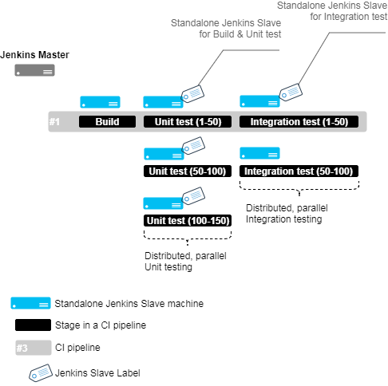

Distributed build and testing farm using Jenkins standalone slave agents

詹金斯从属代理使用**标签**进行分类。我们将在接下来的部分中了解更多关于标签的信息。

使用 Docker 按需生成詹金斯奴隶也更好更容易。如下所示是我们之前讨论过的相同概念的 Docker 版本。在这里，詹金斯从动件是使用 Docker 图像按需创建的。

您可以在下图中看到，我们有两种类型的 Docker 映像:用于构建和单元测试的 Docker 映像，以及用于集成测试的 Docker 映像。Docker 从代理使用这些 Docker 映像创建。单元测试分布在用于构建和单元测试的三个 Docker 从代理上(类别 1)，集成测试分布在用于集成测试的两个 Docker 从代理上(类别 2)。

同样，这里 Docker 从属代理使用标签进行分类。我们将在接下来的章节中了解更多关于标签的信息:

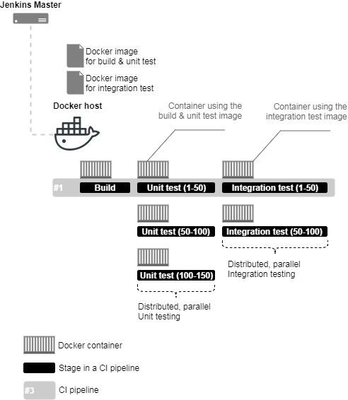

Distributed build and testing farm using Jenkins and Docker slave agents

# “詹金斯管理节点”页面

在下一节中，我们将查看詹金斯**管理节点**页面:

1.  从詹金斯仪表盘，点击**管理詹金斯** | **管理节点**。
2.  在左手边，你会看到一个菜单；选项如下图所示:

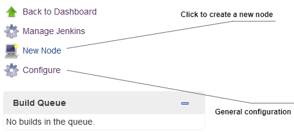

Jenkins Manage Nodes page

3.  在右侧，您还会看到一个显示可用 Jenkins 从机列表的表格，如下图所示:


List of available nodes

4.  由于我们还没有配置任何 Jenkins 从机，列表(如前面的截图所示)只包含一个条目:即 master。
5.  除了节点的名称，该表还显示了有关该节点的其他有用信息，如其体系结构、可用磁盘空间量和响应时间。
6.  要启用/禁用显示的每个节点的信息量，请单击配置链接(参见*詹金斯管理节点页面*截图)。这将带您进入下一页，如下图所示:

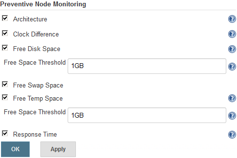

Preventive Node Monitoring options

7.  取消选中/选中相关选项以禁用/启用它们。“可用空间阈值”选项很重要。如果可用磁盘空间和可用临时空间的数量低于指定值(默认设置为`1GB`，则节点脱机。这可以防止 Jenkins 管道在磁盘空间不足的从机上运行并最终失败。

# 添加詹金斯从机–独立的 Linux 机器/虚拟机

在下一节中，我们将尝试添加一个独立的 Linux 机器作为 Jenkins 从机。确保你即将成为詹金斯的从机上安装了 Java。遵循给定的步骤:

1.  从詹金斯仪表盘，点击**管理詹金斯** | **管理节点**。
2.  从左侧菜单中，点击**新建节点**。在结果页面上，您将被要求提供节点名称并选择类型，如下图所示:

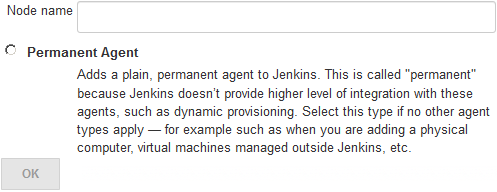

Adding a name and choosing the agent type (type of slave)

3.  在**节点名称**字段下添加一个有意义的名称，并选择代理类型。目前，只有一种类型的代理可供选择:即永久代理。这些类型的代理主要是物理机和虚拟机。
4.  点击**确定**按钮继续。

5.  在结果页面上，您将看到以下要配置的选项，如下图所示:

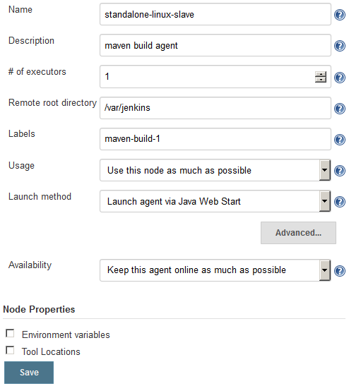

Jenkins slave configuration

让我们一个一个来看:

1.  我们已经使用名称字段为我们的詹金斯奴隶命名。
2.  使用描述字段添加一些关于 Jenkins 从机的注释:例如，目的、类型、它可以构建或测试什么以及安装的工具。
3.  executors 的数量字段用于描述一个 Jenkins 从(代理)被允许运行的并行构建的数量。选择一个大于`1`的值，比如`3`，将允许詹金斯从机并行运行三个构建。这也可能导致每次构建花费比平时更多的时间。明智地选择。

4.  远程根目录字段用于定义 Jenkins 从机上的目录路径，该路径将作为 Jenkins 执行构建活动的专用工作区。
5.  标签字段是最重要的。您可以向 Jenkins 从机添加多个标签(用空格分隔)。为了在特定的从机上运行管道，您将使用它的标签，如前面的截图所示。我们添加了一个`maven-build-1`标签，上面写着它是詹金斯的奴隶来构建一个 Maven 项目。
6.  “使用情况”字段用于定义詹金斯计划如何建立在此节点上。它包含两个选项，如下所示:
    *   尽可能多地使用此节点:这是默认选项。该模式使当前的 Jenkins 从机对所有尚未配置为在特定 Jenkins 从机上运行的管道开放。
    *   仅构建具有与此节点匹配的标签表达式的作业:在此模式下，当项目被限制为使用标签表达式的特定节点，并且该表达式与此节点的名称和/或标签匹配时，Jenkins 将仅在此节点上构建项目。
7.  “启动方法”字段描述了詹金斯如何启动这个詹金斯从机。它包含四个选项，如下所示。在下面的例子中，我们将使用 SSH 方法来启动我们的 Jenkins 从机。参见*通过 SSH* 启动詹金斯从机部分:
    *   通过 Java Web Start 启动代理:这允许使用 Java Web Start 启动代理。在这种情况下，必须在代理机器上打开一个 **Java 网络启动协议** ( **JNLP** )文件，该文件将建立到詹金斯主机的 TCP 连接。如果您已通过“配置全局安全性”页面启用安全性，则可以自定义 Jenkins 主机监听传入 JNLP 代理连接的端口。
    *   通过在主机上执行命令来启动代理:这通过让 Jenkins 执行来自主机的命令来启动代理。当主机能够在另一台机器上远程执行进程时，例如通过 SSH 或**远程 shell** ( **RSH** )使用此选项。
    *   通过 SSH 启动从代理:这通过安全的 SSH 连接发送命令来启动从代理。从机需要可以从主机访问，并且您必须提供一个可以登录到目标机器的帐户。不需要根权限。
    *   让詹金斯作为一个窗口服务来控制这个窗口从机:这通过一个内置在窗口中的远程管理工具来启动一个窗口从机。适用于管理 Windows 从机。从机需要能从主机到达。

8.  可用性字段定义了詹金斯如何启动、停止和使用詹金斯从机。它有以下三个选项:
    *   尽可能保持该代理在线:在此模式下，Jenkins 将尽可能保持该代理在线。如果代理脱机，例如，由于临时网络故障，Jenkins 将定期尝试重新启动它。
    *   在特定时间使该代理联机和脱机:在此模式下，Jenkins 将在计划的时间使该代理联机，并在指定的时间内保持联机。如果代理在计划联机时脱机，Jenkins 将定期尝试重新启动它。在此代理程序已在线达“计划正常运行时间”字段中指定的分钟数后，它将离线。如果选中了在构建运行时保持联机，并且代理计划脱机，那么 Jenkins 将等待任何正在进行的构建完成。
    *   在有需求时使该代理联机，在空闲时使其脱机:在此模式下，如果有需求，即如果有符合以下标准的排队生成，Jenkins 将使该代理联机:它们在队列中至少已存在指定的需求延迟时间段
    *   它们可以由该代理执行(例如，具有匹配的标签表达式)

如果出现以下情况，此代理将脱机:

# 将环境变量传递给詹金斯奴隶

按照给定的步骤传递环境变量:

1.  您将看到名为“节点属性”的部分。使用这些选项，您可以将预定义的环境变量传递给 Jenkins 从属和工具位置。
2.  如下图所示，您可以将环境变量传递给 Jenkins 从机。可以传递多个环境变量(通过点击**添加**按钮)。詹金斯管道在执行过程中可以使用这些环境变量:


Passing environment variables to the Jenkins slaves

随着詹金斯中*管道作为代码*功能的出现，可以在詹金斯管道代码(管道脚本/詹金斯文件)中定义和使用环境变量。因此，定义环境变量的选项(如前面的截图所示)变得不那么重要了。

# 把工具的位置传给詹金斯的奴隶

如下图所示，您可以在 Jenkins 从机上指定某些工具的位置，覆盖全局配置:


Passing tools' locations to the Jenkins slaves

# 通过 SSH 启动一个詹金斯奴隶

要通过 SSH 启动从机，请执行以下步骤:

1.  当您选择“通过 SSH 启动从属代理”选项时，您会看到一些选项，如下图所示。
2.  主机字段是您可以定义詹金斯从机的 IP 地址或主机名的地方。
3.  “凭据”字段允许您选择保存在 Jenkins 中的相关凭据来验证 Jenkins 从机。要创建新凭据，请单击凭据字段旁边的添加按钮(创建以下类型的凭据:带密码的用户名):

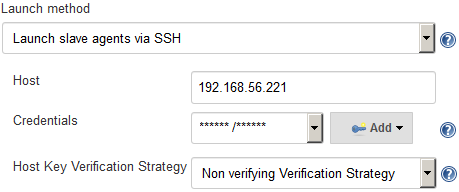

Configure Launch slave agent via SSH properties

您用来验证 Jenkins 从机的用户应该对远程根目录字段下定义的目录路径具有读/写权限。

4.  最后一个选项，主机密钥验证策略，定义了 Jenkins 如何在连接时验证远程主机提供的 SSH 密钥。此选项仅在使用以下类型的凭据时有效:带私钥的 SSH 用户名。有以下四种选择:
    *   已知主机文件验证策略:这将检查用户 Jenkins 正在执行的`known_hosts`文件(`~/.ssh/known_hosts`)，以查看是否存在与当前连接匹配的条目。该方法不对`known_hosts`文件进行任何更新，而是将该文件用作只读源，并期望对 Jenkins master 上的适当用户帐户具有适当访问权限的人根据需要更新该文件，可能使用`ssh hostname`命令启动连接并适当更新该文件。
    *   手动提供密钥验证策略:这将检查远程主机提供的密钥是否与配置此连接的用户设置的密钥相匹配。
    *   已知的可信密钥验证策略:这将检查远程密钥是否与当前标记为此主机的可信密钥相匹配。根据配置，第一次连接将自动信任密钥，或者要求授权用户批准密钥。授权用户需要批准远程主机提供的任何新密钥。
    *   非验证验证策略:这不会对远程主机提供的 SSH 密钥执行任何验证，允许所有连接，无论它们提供的密钥是什么。
5.  完成所有选项的配置后，单击保存按钮。

# 更多关于活跃的詹金斯奴隶

在下一节中，我们将看看我们刚刚添加的 Jenkins 从代理的各种其他可配置选项。詹金斯还提供了许多关于它的奴隶的一般信息，我们将在这里看到。请遵循以下步骤:

1.  在詹金斯仪表板中，单击管理詹金斯|管理节点。
2.  在右侧，您还会看到一个表格，显示了可用的詹金斯奴隶列表。新加入名单的将是我们新增加的詹金斯奴隶。
3.  单击 Jenkins 从名称以访问其配置和元数据。

4.  在结果页面(Jenkins slave Status 页面)的左侧菜单中，您将看到几个选项，如下图所示:

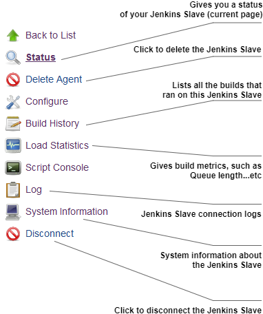

Jenkins slave page

5.  前面的大多数链接(来自前面的截图)都是不言自明的。然而，让我们详细看看其中的一些。
6.  日志链接是您可以找到关于詹金斯奴隶的所有日志的地方。添加詹金斯从机后，如果它没有上线，日志就是你需要查看的地方。这里列出了连接到詹金斯奴隶时的身份验证问题、许可问题以及其他所有问题。请看下面的截图:


Jenkins slave logs

7.  系统信息链接将向您显示有关各个 Jenkins 从机的大部分系统信息，例如系统属性和环境变量。参见前面的截图。你不会经常来这里。尽管如此，当调试由系统工具、环境变量等引起的构建错误时，它还是很有用的:

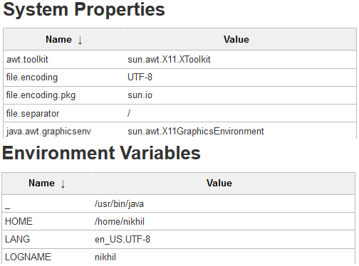

Jenkins slave System Information

8.  构建历史链接将向您显示在各个詹金斯从机上执行的所有构建的时间线。
9.  在“詹金斯从属状态”页面上，您将看到附加到各个詹金斯从属的标签，以及与以下詹金斯从属相关的项目信息。请看下面的截图:


Jenkins slave Status page

10.  通过点击标记此节点暂时离线按钮，可以选择使詹金斯从机暂时离线。当您点击该按钮时，系统会要求您在将 Jenkins 从机离线之前添加一条注释(可选):


Making a Jenkins slave offline

11.  要使脱机节点重新联机，请在“Jenkins 状态”页面中，单击“使该节点重新联机”按钮:


Bringing a Jenkins slave online

# 添加詹金斯从机–独立的 Windows 机器/虚拟机

在下一节中，我们将尝试添加一个独立的 Windows 机器作为 Jenkins 从机。确保你即将成为詹金斯的从机上安装了 Java。遵循给定的步骤:

1.  从左侧菜单中，单击新建节点。在结果页面上，将要求您提供节点的名称并选择类型，如下图所示:
2.  从詹金斯仪表盘，点击**管理詹金斯** | **管理节点**。

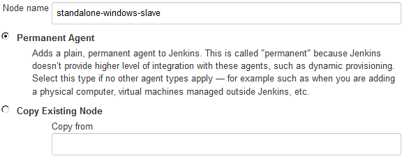

Adding a name and choosing the agent type (type of slave)

3.  在节点名称字段下添加一个有意义的名称，并将代理类型选择为永久代理。这些类型的代理主要是物理机和虚拟机。此外，还有一个克隆现有詹金斯奴隶的选项。为此，请选择复制现有节点选项，并在复制自字段下，输入 Jenkins 从属源的名称。
4.  但是，在下面的示例中，我们将选择永久代理选项。
5.  点击确定按钮继续。

6.  在结果页面上，您将看到以下要配置的选项，如下图所示。我们已经见过他们了:

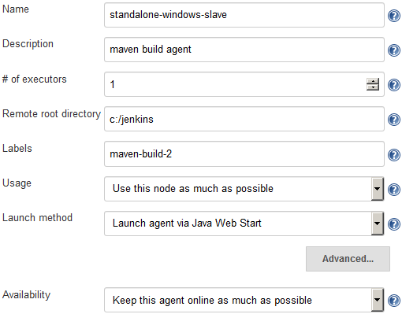

Jenkins slave configurations

7.  由于这是一个 Windows 构建代理，我们有两种方法可以启动 Jenkins 从机，如下所示:
    *   通过 Java Web Start 启动代理:这允许使用 Java Web Start 启动代理。在这种情况下，必须在代理计算机上打开一个 JNLP 文件，这将建立到 Jenkins 主机的 TCP 连接。如果您已通过“配置全局安全性”页面启用安全性，则可以自定义 Jenkins 主机监听传入 JNLP 代理连接的端口。
    *   让詹金斯作为一个窗口服务来控制这个窗口从机:这通过一个内置在窗口中的远程管理工具来启动一个窗口从机。适用于管理 Windows 从机。从机需要能从主机到达。

# 通过 Java 网络启动启动一个詹金斯从机

在下一节中，我们将学习如何使用 Java Web Start 方法在 Windows 上启动一个 Jenkins 从机。

1.  在启动方法字段中，选择通过 Java 网络启动启动代理。
2.  点击保存按钮。
3.  从“詹金斯管理节点”页面，单击詹金斯从属名称。在我们的例子中是`standalone-windows-slave`。
4.  在结果页面(詹金从机状态页面)上，您将看到以下选项，如下所示:


Jenkins slave connection method (Java Web Start)

5.  在詹金斯服务器上什么也不做。
6.  现在，登录到您未来的詹金斯从机(窗口)并打开詹金斯仪表板。
7.  在詹金斯仪表板中，单击管理詹金斯|管理节点。
8.  从“詹金斯管理节点”页面，单击詹金斯从属名称。在我们的例子中是`standalone-windows-slave`。
9.  现在，要么运行命令，如下图所示，要么单击启动按钮。

10.  如果您选择单击启动按钮，您将看到以下弹出窗口，如下图所示:

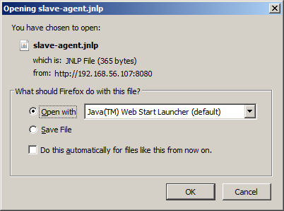

Opening the slave-agent.jnlp file

11.  选择 Java 网络启动启动器(默认)选项作为打开选项，然后单击确定按钮。
12.  您将看到另一个弹出窗口，要求您确认是否要运行此应用程序。点击运行，如下图所示:

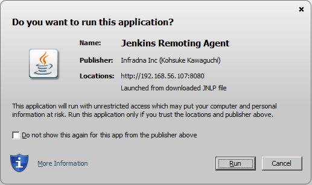

Running the Jenkins Remoting Agent

13.  最后，您将看到一个小窗口，显示 Jenkins 从连接状态为 Connected，如下图所示:

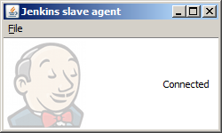

Jenkins slave agent window

14.  您的詹金斯从机(窗口)现在已连接。要使其成为 Windows 服务，请单击文件(上一张截图)，然后选择安装为服务。
15.  打开运行实用程序，并给出命令`services.msc`打开窗口服务实用程序。在服务列表中，您会发现 Jenkins 从代理服务，如下图所示:


Jenkins slave listed as a Windows service

16.  右键单击詹金斯从属窗口服务，然后选择属性。

17.  在属性窗口中，转到登录选项卡。在“登录身份”部分下，选择“此帐户”选项，并提供管理员帐户详细信息(在 Jenkins 从机上具有管理员权限的用户)，如下图所示:

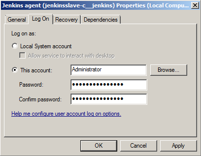

Jenkins slave service properties

18.  你的詹金斯从机(在视窗系统上)已经安装好了。

# 添加詹金斯奴隶-码头集装箱

在下一节中，我们将学习如何安装和配置 Docker 插件，该插件将允许我们从配置项管道中生成按需詹金斯从属(Docker 容器)。Docker 容器由 CI 管道启动，一旦构建完成，它们就会被销毁。在下一节中，我们将只看到配置部分。在下一章中，我们将看到这一过程的实施。

# 先决条件

在我们开始之前，请确保您已经准备好以下内容:

*   运行在以下任何平台上的 Jenkins 服务器:Docker、独立、云、VM、servlet 容器等等。(参见[第二章](02.html)、*安装詹金斯*)。

*   你的詹金斯服务器应该可以上网。这是下载和安装插件所必需的。
*   你的詹金斯服务器可以使用 GitHub 插件与 GitHub 对话。(参考[第 3 章](03.html)、*新詹金斯*中的*在詹金斯*和*中添加 GitHub 凭据，在 GitHub 上配置网络钩子)。*
*   您可能还需要在 Jenkins 服务器上配置 Java、Git 和 Maven。(参考[第 3 章](03.html)、*新詹金斯*的*全球工具配置页面*部分下的*新詹金斯管道作业*小节)。
*   Docker 服务器。

# 设置 Docker 服务器

要安装 Docker，您需要一台具有以下任何一种 Ubuntu 操作系统(64 位)的机器:Yakkety Yak 16.10、Xenial Xerus 16.04 或 Trusty Tahr 14.04。确保`curl`也已安装。按照给出的步骤设置 Docker 服务器。

# 设置存储库

按照给定的步骤设置存储库:

1.  执行以下命令，让`apt`使用存储库:

```
 sudo apt-get install apt-transport-https ca-certificates
```

2.  使用以下命令添加 Docker 的官方 GPG 密钥:

```
 curl -fsSL https://yum.dockerproject.org/gpg | sudo apt-key add -
```

3.  使用以下命令验证密钥标识是否准确`58118E89F3A912897C070ADBF76221572C52609D`:

```
 apt-key fingerprint 58118E89F3A912897C070ADBF76221572C52609D
```

4.  您应该会看到类似的输出:

```
 pub 4096R/2C52609D 2015-07-14
 Key fingerprint = 5811 8E89 F3A9 1289 7C07 0ADB F762 2157 2C52 609D
 Uid Docker Release Tool (releasedocker) docker@docker.com
```

5.  使用以下命令设置一个稳定的存储库来下载 Docker:

```
 sudo add-apt-repository \
        "deb https://apt.dockerproject.org/repo/ubuntu-$(lsb_release -cs) \
        main"
```

It's recommended to always use the stable version of the repository.

# 使用 apt-get 安装 Docker

现在您已经设置了存储库，请执行以下步骤安装 Docker:

1.  使用以下命令更新`apt`包索引:

```
 sudo apt-get update
```

2.  要安装最新版本的 Docker，请执行以下命令:

```
 sudo apt-get -y install docker-engine
```

3.  但是，如果您希望安装 Docker 的特定版本，请执行以下命令:

```
 apt-cache madison docker-engine
```

4.  这将为您提供可用版本的列表:

```
 docker-engine | 1.16.0-0~trusty |
        https://apt.dockerproject.org/repo
        ubuntu-trusty/main amd64 Packages
 docker-engine | 1.13.3-0~trusty |
        https://apt.dockerproject.org/repo
        ubuntu-trusty/main amd64 Packages 
```

The output of the preceding command depends on the type of repository configured in the previous section, *Setting up the repository*.

5.  接下来，执行以下命令来安装 Docker 的特定版本:

```
 sudo apt-get -y install docker-engine=<VERSION_STRING>
```

示例:`sudo apt-get -y install docker-engine=1.16.0-0~trusty`

6.  `docker`服务自动启动。要验证 Docker 是否已安装并正在运行，请运行以下命令:

```
 sudo docker run hello-world 
```

7.  如果前面的命令运行没有任何错误，并且您看到一条`hello world`消息，则表示 Docker 已安装并运行。

```
 Hello from Docker!
 This message shows that your installation appears to be
        working correctly.
```

# 使用. deb 包安装 Docker

由于某种原因，如果无法使用前面的存储库方法安装 Docker，可以下载`.deb`包。

1.  从[https://apt . dockerproject . org/repo/pool/main/d/docker-engine/](https://apt.dockerproject.org/repo/pool/main/d/docker-engine/)下载您选择的`.deb`包。
2.  要安装下载的软件包，请键入以下内容:

```
 sudo dpkg -i /<path to package>/<docker package>.deb
```

3.  通过运行以下命令验证您的 Docker 安装:

```
 sudo docker run hello-world
```

4.  如果前面的命令运行没有任何错误，并且您看到一条`hello world`消息，则表示 Docker 已安装并运行。

```
 Hello from Docker!
 This message shows that your installation appears to be
        working correctly.
```

# 启用 Docker 远程应用编程接口

Jenkins(通过 Docker 插件)使用 *Docker 远程 API* 与 Docker 服务器通信。Docker 远程 API 允许外部应用程序使用 REST APIs 与 Docker 服务器进行通信。Docker 远程 API 也可以用来获取 Docker 服务器内部所有正在运行的容器的信息。

为了启用 Docker 远程 API，我们需要修改 Docker 的配置文件。根据您的操作系统版本和您在机器上安装 Docker 的方式，您可能需要选择正确的配置文件进行修改。如下所示，是在 Ubuntu 上工作的两种方法。

# 修改 docker.conf 文件

按照以下步骤修改`docker.conf`文件。这些配置对于 Jenkins 与 Docker 主机进行通信非常重要:

1.  登录您的 Docker 服务器，确保您拥有`sudo`权限。
2.  执行以下命令编辑`docker.conf`文件:

```
 sudo nano /etc/init/docker.conf
```

3.  在`docker.conf`文件中，转到包含`DOCKER_OPTS=`的行。

You will find the `DOCKER_OPTS=` variable at two places inside the `docker.conf` file. First, in the pre-start script section, and next in the post-start script section. Use the `DOCKER_OPTS=` variable under the pre-start script section.

4.  将`DOCKER_OPTS`的值设置如下:

```
        DOCKER_OPTS='-H tcp://0.0.0.0:4243 -H unix:///var/run/docker.sock'
```

5.  前面的设置将 Docker 服务器绑定到 Unix 套接字，以及 TCP 端口`4243`。`0.0.0.0`，这使得 Docker 引擎可以接受来自任何地方的连接。

If you want your Docker server to accept connections from only your Jenkins server, then replace `0.0.0.0` with your Jenkins server IP.

6.  使用以下命令重新启动 Docker 服务器:

```
 sudo service docker restart
```

7.  要检查配置是否有效，请键入以下内容:

```
 curl -X GET http://<Docker server IP>:42img/json
```

The preceding command will list all the images present on your Docker server, if any.

# 修改 docker.service 文件

按照给定的步骤修改`docker.service`文件:

1.  执行以下命令编辑`docker.service`文件:

```
 sudo nano /lib/systemd/system/docker.service
```

2.  在`docker.service`文件中，转到包含`ExecStart=`的行。
3.  如图所示设置`ExecStart=`的值:

```
        ExecStart=/usr/bin/docker daemon -H fd:// -H tcp://0.0.0.0:4243
```

4.  前面的设置将 Docker 服务器绑定到 Unix 套接字。此外，在 TCP 端口`4243`上。`0.0.0.0`，它让 Docker 引擎接受来自任何地方的连接。

If you want your Docker server to accept connections from only your Jenkins server, replace `0.0.0.0` with your Jenkins server IP.

5.  执行以下命令，让 Docker 守护程序注意到修改后的配置:

```
 systemctl daemon-reload
```

6.  使用以下命令重新启动 Docker 服务器:

```
 sudo service docker restart
```

7.  要检查配置是否有效，请键入以下内容:

```
 curl -X GET http://<Docker server IP>:42img/json
```

The preceding command will list all the images present on your Docker server, if any.

# 安装 Docker 插件

为了动态创建 Docker 容器(构建代理)，我们需要为 Jenkins 安装 Docker 插件。为此，请遵循给定的步骤:

1.  从詹金斯仪表板中，单击管理詹金斯|管理插件|可用选项卡。您将进入詹金斯管理插件页面。
2.  在过滤字段输入`Docker Plugin`，如下图所示:

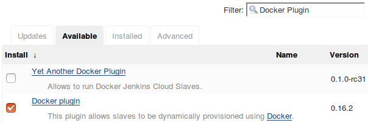

Installing the Docker plugin

3.  从列表中选择 **Docker 插件**，点击**不重启安装**按钮。
4.  如果需要，重启詹金斯。

# 配置 Docker 插件

现在我们已经安装了 Docker 插件，让我们配置它:

1.  在詹金斯仪表板中，单击管理詹金斯|配置系统。
2.  进入“配置系统”页面后，一直向下滚动到“云”部分(参见下面的截图)。

3.  单击添加新云按钮，并从可用选项中选择 Docker。
4.  在结果页面上，您会发现许多需要配置的设置。
5.  使用名称字段为您的 Docker 服务器命名。
6.  在 Docker URL 字段下添加您的 Docker 服务器 URL。
7.  单击“测试连接”按钮，检查 Jenkins 是否可以与 Docker 服务器通信:

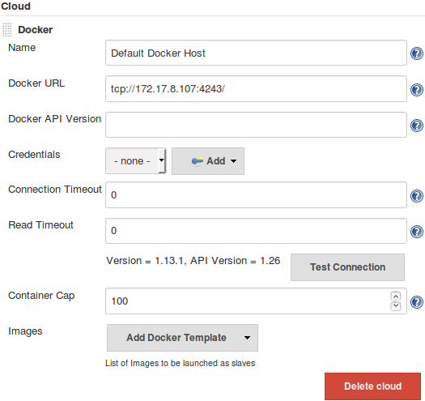

Configuring the Docker plugin to talk to the Docker server

8.  在页面的最后，点击**应用**和**保存**按钮。我们稍后将回到这里进行进一步的配置。

# 创造一个码头工人形象——詹金斯奴隶

启用 Docker 远程 API 使詹金斯和 Docker 服务器之间的通信成为可能。现在我们需要 Docker 服务器上的 Docker 映像。詹金斯将使用这个 Docker 映像动态创建 Docker 容器(詹金斯从机)。为此，请按照所示步骤操作:

1.  登录到您的 Docker 服务器。给出以下命令来检查可用的 Docker 映像:

```
 sudo docker images
```

2.  从下面的截图中，您可以看到我们的 Docker 服务器上已经有两个`docker images` ( `ubuntu`和`hello-world`):


List the Docker images

3.  如果您的 Docker 服务器是新备份的机器，那么此时您将看不到任何图像。
4.  我们将从`ubuntu` Docker 图像构建一个 Docker 图像供我们使用。为此，使用以下命令下载`ubuntu`的 Docker 映像:

```
 docker pull ubuntu
```

You can find more Docker images for various OSes at [https://hub.docker.com/](https://hub.docker.com/).

5.  一旦拉动完成，再次发出`sudo docker images`命令。现在您应该看到 Ubuntu 的 Docker 图像，如前面的截图所示。

6.  我们现在将升级我们的 Ubuntu Docker 映像，以运行我们的构建所需的所有必要应用程序。它们如下:
    *   爪哇 JDK(最新)
    *   饭桶
    *   专家
    *   登录到 Docker 容器的用户帐户
    *   `sshd`(接受 SSH 连接)

7.  执行以下命令，使用 Ubuntu Docker 映像运行 Docker 容器。这将创建一个容器，并打开它的 bash 外壳:

```
 sudo docker run -i -t ubuntu /bin/bash
```

8.  现在，像在任何普通的 Ubuntu 机器上一样安装所有需要的应用程序。让我们从创建一个`jenkins`用户开始:
    1.  执行以下命令并遵循用户创建步骤，如下图所示:

```
 adduser jenkins
```


Creating a user

```
 su jenkins
```

9.  通过输入`exit`切换回根用户。
10.  接下来，我们将安装 SSH 服务器。按顺序执行以下命令:

```
 apt-get update
 apt-get install openssh-server
 mkdir /var/run/sshd
```

11.  接下来，我们将使用以下命令安装 Git:

```
 apt-get install git
```

12.  使用以下命令安装 Java JDK:

```
 apt-get install openjdk-8-jdk
```

13.  使用以下命令安装 Maven:

```
 apt-get install maven
```

14.  接下来，通过键入`exit`退出容器。
15.  我们需要保存(`commit`)我们对 Docker 容器所做的所有更改。
16.  通过列出所有不活动的容器，得到我们最近工作的容器的`CONTAINER ID`，如下图截图所示:

```
 sudo docker ps -a
```


List of inactive containers

17.  注意`CONTAINER ID`，并执行`commit`命令提交我们对容器所做的更改，如下所示:

```
 sudo docker commit <CONTAINER ID> <new name for the container>
```

18.  我们已经命名了容器`maven-build-slave-0.1`，如下图截图所示:


Docker commit command

19.  一旦您提交了更改，就会创建一个新的 Docker 映像。
20.  执行以下 Docker 命令列出图像:

```
 sudo docker images
```


List the Docker images

21.  你可以看到我们新的 Docker 图片，名字是`maven-build-slave-0.1`。我们现在将配置我们的 Jenkins 服务器，使用 Docker 映像来创建 Jenkins 从机(构建代理)。

# 在詹金斯中添加 Docker 容器凭据

按照给定的步骤在 Jenkins 内部添加凭据，以允许它与 Docker 对话:

1.  从 Jenkins 控制面板中，导航至凭据|系统|全局凭据(无限制)。
2.  点击左侧菜单中的**添加凭证**链接，创建一个新的凭证(见下面的截图)。
3.  选择一种**类型**作为带密码的用户名。
4.  将“范围”字段保留为默认值。
5.  在用户名字段下为您的 Docker 映像添加一个用户名(根据我们的示例，`jenkins`)。
6.  在密码字段下，添加密码。
7.  在标识字段下添加一个标识，在描述字段下添加一些描述。

8.  完成后，单击确定按钮:


Create credentials inside Jenkins

# 更新詹金斯内部的 Docker 设置

按照给定的步骤更新 Jenkins 内部的 Docker 设置:

1.  在詹金斯仪表板中，单击管理詹金斯|配置系统。
2.  一直向下滚动到云部分(见下面的截图)。
3.  在云部分下，单击添加码头工人模板按钮，然后选择码头工人模板。
4.  您将看到许多需要配置的设置。然而，为了使这个演示保持简单，让我们坚持重要的设置:
    1.  在 Docker 映像字段下，输入我们之前创建的 Docker 映像的名称。在我们的例子中，是`maven-build-slave-0.1`。
    2.  在“标签”字段下，添加一个标签。您的詹金斯管道将使用此标签识别 Docker 容器。添加一个`docker`标签。
    3.  启动方法应该是 Docker SSH 计算机启动器。
    4.  在**凭证**字段下，选择我们为访问 Docker 容器而创建的凭证。
    5.  确保“拉”策略选项设置为“从不拉”。
    6.  将其他选项保留为默认值。
    7.  完成后，单击应用，然后保存:

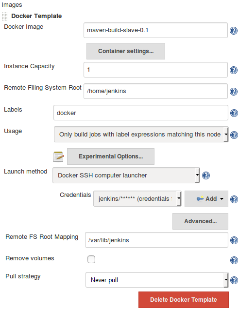

Configuring the Docker plugin settings

5.  现在，您的詹金斯服务器全部设置为使用 Docker 按需创建詹金斯奴隶。

# 摘要

在本章中，我们学习了如何在独立的 Windows 和 Linux 机器(物理/虚拟机)上添加和配置 Jenkins 从机，使用了两种广泛使用的方法:通过 SSH 启动 Jenkins 从机和通过 Java Web Start 启动 Jenkins 从机。我们还学习了如何为詹金斯安装和配置 Docker 插件，该插件允许我们为配置项创建按需 Docker 容器(詹金斯从属)。

在下一章中，我们将学习如何使用 Jenkins 实现连续集成，并且我们将利用使用 Jenkins Docker 容器(Jenkins 从容器)的分布式构建场来执行我们的 CI。