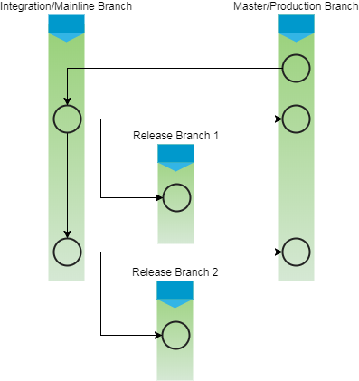
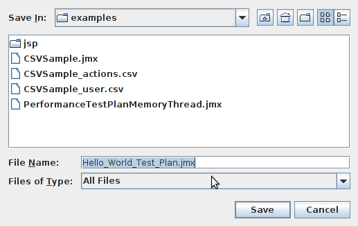
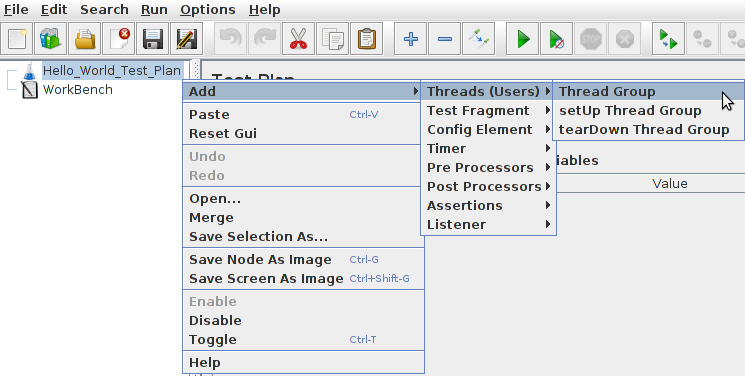
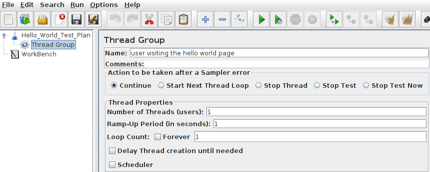
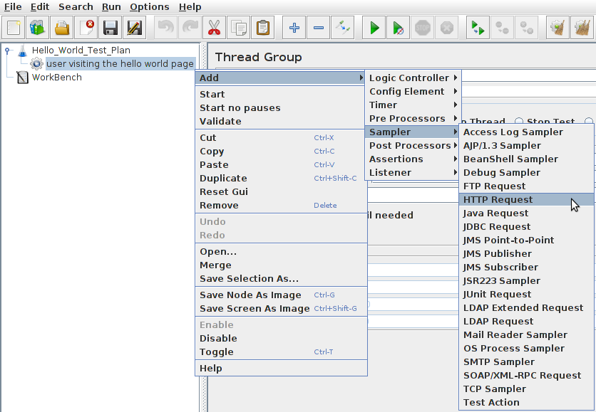
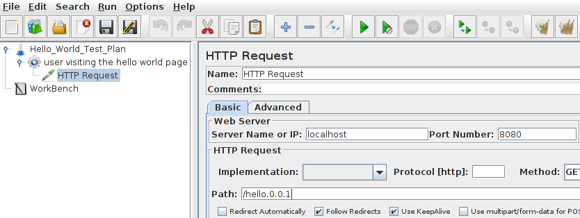
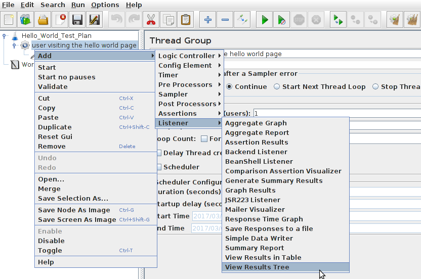
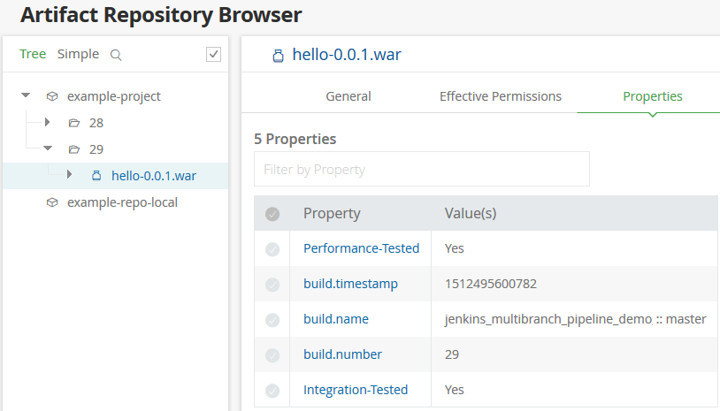

# 使用Jenkins的持续交付

我们将从持续交付设计开始本章，该设计涵盖以下领域:

*   分支策略
*   持续交付工具列表
*   Jenkins管道结构

**持续交付** ( **光盘**)设计将作为一个蓝图，指导读者回答光盘是如何、为什么以及在哪里实现的。该设计将涵盖实现端到端光盘管道所涉及的所有必要步骤。

本章中讨论的光盘设计应被视为实现光盘的模板，而不是完整的最终模型。所有使用的工具都可以修改和更换以适应目的。

# Jenkins光盘设计

在本节中，我们将介绍一个非常通用的光盘设计。

# 分支策略

在第 7 章、*使用Jenkins*进行持续集成中，我们遵循了 CI 的分支策略，包括以下内容:

*   主分支
*   整合部门
*   特征分支

这个分支策略是 *GitFlow 工作流*分支模型的精简版本。

虽然配置项可以在集成/开发分支或特性分支上执行，但配置项只能在集成和发布分支上执行。

# 发布分支

一些团队采用了发布分支的策略。在成功测试的代码从主分支投入生产(分发给客户)后，会创建一个发布分支。创建发布分支的目的是支持各个版本的错误修复:



Branching strategy

# 光盘管道

我们现在是裁谈会设计的核心。我们不会创建新的管道；相反，我们将在Jenkins现有的 CI 多分支管道的基础上进行构建。新的光盘管道将有以下几个阶段:

1.  通过推送事件(CI 管道初始化)从**版本控制系统** ( **VCS** )获取代码。
2.  构建和单元测试代码；发布关于Jenkins的单元测试报告。
3.  对代码进行静态代码分析，并将结果上传到 SonarQube。如果缺陷的数量超过质量门定义的阈值，则管道失败。
4.  执行集成测试；发布关于Jenkins的单元测试报告。
5.  将构建的工件以及一些有意义的属性上传到 artifacts。
6.  将二进制文件部署到测试环境中。
7.  执行测试(质量分析)。
8.  在 Artifactory 中推广该解决方案，并将其标记为发布候选。

前面的 CD 管道的目的是自动化持续部署、测试(QA)和提升二进制存储库中的构建工件的过程。每一步都有失败/成功的报告。让我们详细讨论这些管道及其组成部分。

在现实世界中，质量保证可能包含多个测试阶段，如性能测试、用户验收测试、组件测试等。为了简单起见，我们将只在示例光盘管道中执行性能测试。

# 光盘工具集

我们正在实现配置项的示例项目是一个简单的 Maven 项目。因此，我们将看到Jenkins与许多其他工具密切合作。

下表列出了我们将看到的所有内容中涉及的工具和技术:

| **工具/技术** | **描述** |
| Java 语言(一种计算机语言，尤用于创建网站) | 用于编码的主要编程语言 |
| 专家 | 构建工具 |
| JUnit | 单元测试和集成测试工具 |
| Jenkins | CI工具 |
| 开源代码库 | 血管收缩剂 |
| 声纳员 | 静态代码分析工具 |
| 手工工厂 | 二进制存储库管理器 |
| Apache Tomcat | 托管解决方案的应用程序服务器 |
| Apache JMeter | 性能测试工具 |

# 创建 Docker 映像-性能测试

在本节中，我们将为我们的**性能测试** ( **PT** )创建一个 Docker 映像。Jenkins将使用这个 Docker 映像来创建 Docker 容器，我们将在其中部署我们构建的解决方案并执行我们的性能测试。遵循给定的步骤:

1.  登录到您的 Docker 服务器。给出以下命令来检查可用的 Docker 映像:

```
 sudo docker images
```

2.  从下面的截图中，您可以看到我的 Docker 服务器上已经有三个 Docker 映像(`ubuntu`、`hello-world`和`maven-build-slave-0.1`):


Listing the Docker images

3.  我们将使用 Ubuntu Docker 映像构建一个新的 Docker 映像来运行我们的 PT。
4.  让我们用运行测试所需的所有必要应用程序来升级我们的 Ubuntu Docker 映像，如下所示:
    *   爪哇 JDK(最新)
    *   Apache Tomcat (8.5)
    *   Apache JMeter
    *   登录 Docker 容器的用户帐户
    *   OpenSSH 守护程序(接受 SSH 连接)
    *   卷曲

5.  执行以下命令，使用 Ubuntu Docker 映像运行 Docker 容器。这将创建一个容器并打开它的 bash 外壳:

```
sudo docker run -i -t ubuntu /bin/bash
```

6.  现在，像在任何普通的 Ubuntu 机器上一样安装所有需要的应用程序。让我们从创建一个`jenkins`用户开始:
    1.  执行以下命令并遵循用户创建步骤，如下所示:

```
adduser jenkins
```


Creating a user

```
su jenkins
```

7.  通过输入`exit`切换回`root`用户。
8.  接下来，我们将安装 SSH 服务器。按顺序执行以下命令:

```
apt-get update 
apt-get install openssh-server 
mkdir /var/run/sshd 
```

9.  按照给定的步骤安装 Java:
    1.  更新包索引:

```
apt-get update
```

```
apt-get install default-jre
```

10.  安装 Tomcat 8.5 的最佳方法是下载最新的二进制版本，然后手动配置:
    1.  移动到`/tmp`目录，使用以下命令下载 Apache Tomcat 8.5:

```
cd /tmp 
wget https://archive.apache.org/dist/tomcat/tomcat-8/v8.5.11/bin/apache-tomcat-8.5.11.tar.gz
```

```
su jenkins 
mkdir /home/jenkins/tomcat
```

```
tar xzvf apache-tomcat-8*tar.gz \
-C /home/jenkins/tomcat --strip-components=1
```

11.  通过输入`exit`切换回`root`用户。
12.  Apache JMeter 是执行性能测试的好工具。这是免费的开源软件。它可以在图形用户界面和命令行模式下运行，这使得它成为自动化性能测试的合适候选:
    1.  移至`/tmp`目录:

```
cd /tmp
```

```
wget https://archive.apache.org/dist/jmeter/binaries/apache-jmeter-3.1.tgz
```

```
mkdir /opt/jmeter
```

```
tar xzvf apache-jmeter-3*.tgz \
-C /opt/jmeter --strip-components=1
 chown -R jenkins:jenkins /opt/jmeter/
 chmod -R 777 /opt/jmeter/
```

13.  按照给定的步骤安装`curl`:

```
apt-get install curl
```

14.  按照给定的步骤保存我们对 Docker 映像所做的所有更改:
    1.  通过输入`exit`退出容器。
    2.  我们需要保存(`commit`)我们对 Docker 容器所做的所有更改。
    3.  通过列出所有非活动的容器来获取我们最近工作的容器的`CONTAINER ID`，如下图所示:

```
sudo docker ps -a
```


Listing inactive containers

```
sudo docker commit <CONTAINER ID> <new name for the container>
```


Docker commit command

```
sudo docker images
```


Listing the Docker images

# 在Jenkins中添加 Docker 容器凭据

按照给定的步骤在 Jenkins 内部添加凭据，以允许它与 Docker 对话:

1.  从 Jenkins 控制面板中，导航至凭据|系统|全局凭据(无限制)。
2.  点击左侧菜单中的**添加凭证**链接，创建一个新的凭证(见下面的截图)。
3.  选择**种类**作为带密码的用户名。
4.  将“范围”字段保留为默认值。
5.  在用户名字段下为您的 Docker 映像添加一个用户名(根据我们的示例，`jenkins`)。
6.  在密码字段下，添加密码。
7.  在标识字段下添加标识，在描述字段下添加描述。

8.  完成后，单击确定按钮:


Creating credentials inside Jenkins

# 更新Jenkins内部的 Docker 设置

按照给定的步骤更新 Jenkins 内部的 Docker 设置:

1.  从Jenkins仪表盘，点击**管理Jenkins** | **配置系统**。
2.  一直向下滚动到**云**部分。
3.  在云部分，点击**添加码头工人模板**按钮，选择**码头工人模板**。
4.  您将看到许多需要配置的设置(见下面的截图)。然而，为了使这个演示保持简单，让我们坚持重要的设置。
5.  在**码头工人图像**字段下，输入我们之前创建的码头工人图像的名称。我的情况是`performance-test-agent-0.1`。
6.  在**标签**字段下，添加一个标签。您的Jenkins管道将使用此标签识别 Docker 容器。我已经添加了`docker_pt`标签。
7.  **发射方式**应该是 Docker SSH 电脑发射器。
8.  在**凭证**字段下，选择我们为访问 Docker 容器而创建的凭证。
9.  确保“拉”策略选项设置为“从不拉”。
10.  将其余选项保留为默认值。

11.  完成后，点击**应用**，然后**保存**:


Creating a Docker Template for integration testing

# 使用 JMeter 创建性能测试

在本节中，我们将学习如何使用 JMeter 工具创建一个简单的性能测试。上述步骤应该在您的本地计算机上执行。以下步骤是在带有 Ubuntu 16.04 的机器上执行的。

# 安装 Java

按照给定的步骤安装 Java:

1.  更新包索引:

```
sudo apt-get update
```

2.  接下来，安装 Java。以下命令将安装 JRE:

```
sudo apt-get install default-jre
```

3.  要设置`JAVA_HOME`环境变量，首先获取 Java 安装位置。通过执行以下命令来完成此操作:

```
sudo update-alternatives --config java
```

4.  复制结果路径并更新`/etc/environment`文件中的`JAVA_HOME`变量。

# 安装 Apache JMeter

按照给定的步骤安装 Apache JMeter:

1.  移至`/tmp`目录:

```
cd /tmp
```

2.  从[http://jmeter.apache.org/download_jmeter.cgi](http://jmeter.apache.org/download_jmeter.cgi):下载`apache-jmeter-3.1.tgz`或者最新的稳定版本

```
wget https://archive.apache.org/dist/jmeter/binaries/apache-jmeter-3.1.tgz
```

3.  我们将在`/opt/jmeter`目录中安装 JMeter。为此，在`/opt`内创建一个`jmeter`目录:

```
mkdir /opt/jmeter
```

4.  然后将归档文件提取到其中:

```
tar xzvf apache-jmeter-3*.tgz \
-C /opt/jmeter --strip-components=1
```

# 正在启动 JMeter

按照给定的步骤启动 JMeter:

1.  要启动 JMeter，请移动到 JMeter 安装目录，并使用以下命令运行`jmeter.sh`脚本:

```
cd /opt/jmeter/bin 
./jmeter.sh
```

2.  JMeter 图形用户界面实用程序将在新窗口中打开。

# 创建性能测试用例

默认情况下，您将看到一个示例测试计划。我们将通过修改现有模板来创建新的测试计划:

1.  将测试计划重命名为`Hello_World_Test_Plan`，如下图截图所示:


Creating a test plan

2.  点击菜单项中的保存按钮或点击 *Ctrl* + *S* 将其保存在`examples`文件夹中，如下图所示:



Saving the test plan

# 创建线程组

按照给定的步骤创建线程组:

1.  添加线程组。为此，右键单击`Hello_World_Test_Plan`并选择**添加** | **线程(用户)** | **线程组**:



Creating a thread group

2.  在结果页面中，为您的线程组命名，并按如下方式填写选项:
    1.  选择**继续**选项**在采样器错误后采取行动**。
    2.  添加**线程数(用户)**为`1`。
    3.  将**上升周期(秒)**添加为`1`。
    4.  添加**循环计数**为`1`:



Configuring a thread group

# 创建采样器

按照给定的步骤创建采样器:

1.  右键点击`Hello_World_Test_Plan`选择**添加** | **采样器** | **HTTP 请求**:



Adding a Sampler

2.  适当命名 HTTP 请求，并填写如下选项:
    1.  添加**服务器名称或 IP** 作为`<IP Address of your Testing Server machine>`。
    2.  添加端口号为`8080`。
    3.  添加**路径**为`/hello.0.0.1/`:



Configuring a sampler

# 添加侦听器

按照给定的步骤添加侦听器:

1.  右键单击`Hello_World_Test_Plan`并选择**添加** | **收听者** | **查看结果树**:



Adding a Listener

2.  什么都不做；让所有的田地保持原样。
3.  点击菜单项中的保存按钮或点击 *Ctrl* + *S* 保存整个配置。
4.  从*复制`.jmx`文件。*
5.  在你的 Maven 项目下，在`src`目录中创建一个名为`pt`的文件夹，并在其中添加`.jmx`文件。
6.  将代码上传到 GitHub。

# 光盘管道

我们拥有所有必需的工具，Docker 映像也已准备就绪。在本节中，我们将在Jenkins创建一个管道，描述我们的光盘过程。

# 为光盘写Jenkins文件

我们将在之前创建的配置项管道上进行构建。让我们首先重新审视我们的配置项管道，然后作为光盘过程的一部分，我们将向它添加一些新的阶段。

# 重新审视配置项的管道代码

以下是配置项的完整组合代码:

```
node('docker') {
  stage('Poll') {
    checkout scm
  }
  stage('Build & Unit test'){
    sh 'mvn clean verify -DskipITs=true';
    junit '**/target/surefire-reports/TEST-*.xml'
    archive 'target/*.jar'
  }
  stage('Static Code Analysis'){
    sh 'mvn clean verify sonar:sonar -Dsonar.projectName=example-project
    -Dsonar.projectKey=example-project
    -Dsonar.projectVersion=$BUILD_NUMBER';
  }
  stage ('Integration Test'){
    sh 'mvn clean verify -Dsurefire.skip=true';
    junit '**/target/failsafe-reports/TEST-*.xml'
    archive 'target/*.jar'
  }
  stage ('Publish'){
    def server = Artifactory.server 'Default Artifactory Server'
    def uploadSpec = """{
      "files": [
        {
          "pattern": "target/hello-0.0.1.war",
          "target": "example-project/${BUILD_NUMBER}/",
          "props": "Integration-Tested=Yes;Performance-Tested=No"
        }
      ]
    }"""
    server.upload(uploadSpec)
  }
}
```

# 隐藏构建工件的管道代码

Jenkins管道使用名为`stash`的特性在节点间传递构建工件。在接下来的步骤中，我们将`stash`一些我们希望传递到`docker_pt`节点的构建工件，在这里我们将执行我们的性能测试:

```
stash includes: 'target/hello-0.0.1.war,src/pt/Hello_World_Test_Plan.jmx', name: 'binary'
```

在前面的代码中:

*   `name`:藏匿点的名称
*   `includes`:要包含的逗号分隔文件

# 生成一个 Docker 容器——性能测试

首先，让我们创建一个管道代码，它将使用`performance-test-agent-0.1` Docker 映像创建一个 Docker 容器(Jenkins slave)，用于性能测试:

```
node('docker_pt') {
}
```

其中`docker_pt`是`performance-test-agent-0.1` Docker 模板的标签。

我们希望在`docker_pt`节点上执行以下任务:

1.  启动 Tomcat。
2.  在测试环境中将构建工件部署到 Tomcat。
3.  执行性能测试。
4.  提升 artifacts 内部的构建工件。

所有上述任务都是我们的光盘管道的不同阶段。让我们为它们中的每一个编写管道代码。

# 启动 Apache Tomcat 的管道代码

在性能测试代理上启动 Apache Tomcat 的管道代码是一个简单的外壳脚本，它将运行 Tomcat 安装目录中的`./startup.sh`脚本:

```
sh '''cd /home/jenkins/tomcat/bin
./startup.sh''';
```

将前面的步骤包装在名为`Start Tomcat`的`stage`中:

```
stage ('Start Tomcat'){
    sh '''cd /home/jenkins/tomcat/bin
    ./startup.sh''';
}
```

# 部署构建工件的管道代码

部署构建工件的管道代码分两步进行。首先，我们将取消隐藏我们从前一个节点 Docker 块中隐藏的二进制包。然后，我们将未隐藏的文件部署到测试环境中 Tomcat 安装目录内的`webapps`文件夹中。代码如下:

```
unstash 'binary'
sh 'cp target/hello-0.0.1.war /home/jenkins/tomcat/webapps/';
```

将前面的步骤包装在名为`Deploy`的`stage`中:

```
stage ('Deploy){
    unstash 'binary'
    sh 'cp target/hello-0.0.1.war /home/jenkins/tomcat/webapps/';
}
```

# 运行性能测试的管道代码

执行性能测试的管道代码是一个简单的 shell 脚本，它调用`jmeter.sh`脚本并将`.jmx`文件传递给它。测试结果存储在`.jtl`文件中，然后存档。代码如下:

```
sh '''cd /opt/jmeter/bin/
./jmeter.sh -n -t $WORKSPACE/src/pt/Hello_World_Test_Plan.jmx -l $WORKSPACE/test_report.jtl''';

step([$class: 'ArtifactArchiver', artifacts: '**/*.jtl'])
```

下表给出了前面代码片段的描述:

| **代码** | **描述** |
| `./jmeter.sh -n -t <path to the .jmx file> -l <path to save the .jtl file>` | 这是执行性能测试计划(T1 文件)并生成测试结果(T2 文件)的`jmeter`命令。 |
| `step([$class: 'ArtifactArchiver', artifacts: '**/*.jtl'])` | 这一行代码将存档所有扩展名为`.jtl`的文件。 |

将上一步放入名为`Performance Testing`的`stage`中:

```
stage ('Performance Testing'){
    sh '''cd /opt/jmeter/bin/
    ./jmeter.sh -n -t $WORKSPACE/src/pt/Hello_World_Test_Plan.jmx -l $WORKSPACE/test_report.jtl''';
    step([$class: 'ArtifactArchiver', artifacts: '**/*.jtl'])
}
```

# 在 artifacts 中提升构建工件的管道代码

我们在 artifacts 中提升构建工件的方法是使用属性(键值对)特性。所有通过性能测试的构建都将被应用一个`Performance-Tested=Yes`标签。代码如下:

```
withCredentials([usernameColonPassword(credentialsId: 'artifactory-account', variable: 'credentials')]) {
    sh 'curl -u${credentials} -X PUT "http://172.17.8.108:8081/artifactory/api/storage/example-project/${BUILD_NUMBER}/hello-0.0.1.war?properties=Performance-Tested=Yes"';
}
```

下表给出了前面代码片段的描述:

| **代码** | **描述** |
| `withCredentials([usernameColonPassword(credentialsId: 'artifactory-account', variable: 'credentials')]) {``}` | 我们使用Jenkins内部的`withCredentials`插件将 Artifactory 凭证传递给`curl`命令。 |
| `curl -u<username>:password -X PUT "<artifactory server URL>/api/storage/<artifactory repository name>?properties=key-value"` | 这是`curl`命令，用于更新 artifact 内部构建工件的属性(键值对)。`curl`命令利用了 Artifactory 的 REST API 特性。 |

将上一步放入名为`Promote build in Artifactory`的`stage`中:

```
stage ('Promote build in Artifactory'){
    withCredentials([usernameColonPassword(credentialsId: 'artifactory-account', variable: 'credentials')]) {
        sh 'curl -u${credentials} -X PUT "http://172.17.8.108:8081/artifactory/api/storage/example-project/${BUILD_NUMBER}/hello-0.0.1.war?properties=Performance-Tested=Yes"';
    }
}
```

# 组合光盘管道代码

以下是将在`docker_pt`节点内运行的完整组合代码:

```
node('docker_pt') {
  stage ('Start Tomcat'){
    sh '''cd /home/jenkins/tomcat/bin
    ./startup.sh''';
  }
  stage ('Deploy '){
    unstash 'binary'
    sh 'cp target/hello-0.0.1.war /home/jenkins/tomcat/webapps/';
  }
  stage ('Performance Testing'){
    sh '''cd /opt/jmeter/bin/
    ./jmeter.sh -n -t $WORKSPACE/src/pt/Hello_World_Test_Plan.jmx -l
    $WORKSPACE/test_report.jtl''';
    step([$class: 'ArtifactArchiver', artifacts: '**/*.jtl'])
  }
  stage ('Promote build in Artifactory'){
    withCredentials([usernameColonPassword(credentialsId:
      'artifactory-account', variable: 'credentials')]) {
        sh 'curl -u${credentials} -X PUT
        "http://172.17.8.108:8081/artifactory/api/storage/example-project/
        ${BUILD_NUMBER}/hello-0.0.1.war?properties=Performance-Tested=Yes"';
      }
  }
}
```

让我们将前面的代码与配置项的管道代码结合起来，得到完整的光盘管道代码，如下所示:

```
node('docker') {
  stage('Poll') {
    checkout scm
  }
  stage('Build & Unit test'){
    sh 'mvn clean verify -DskipITs=true';
    junit '**/target/surefire-reports/TEST-*.xml'
    archive 'target/*.jar'
  }
  stage('Static Code Analysis'){
    sh 'mvn clean verify sonar:sonar -Dsonar.projectName=example-project
    -Dsonar.projectKey=example-project -Dsonar.projectVersion=$BUILD_NUMBER';
  }
  stage ('Integration Test'){
    sh 'mvn clean verify -Dsurefire.skip=true';
    junit '**/target/failsafe-reports/TEST-*.xml'
    archive 'target/*.jar'
  }
  stage ('Publish'){
    def server = Artifactory.server 'Default Artifactory Server'
    def uploadSpec = """{
      "files": [
        {
          "pattern": "target/hello-0.0.1.war",
          "target": "example-project/${BUILD_NUMBER}/",
          "props": "Integration-Tested=Yes;Performance-Tested=No"
        }
      ]
    }"""
    server.upload(uploadSpec)
  }
  stash includes: 'target/hello-0.0.1.war,src/pt/Hello_World_Test_Plan.jmx',
  name: 'binary'
}
node('docker_pt') {
  stage ('Start Tomcat'){
    sh '''cd /home/jenkins/tomcat/bin
    ./startup.sh''';
  }
  stage ('Deploy '){
    unstash 'binary'
    sh 'cp target/hello-0.0.1.war /home/jenkins/tomcat/webapps/';
  }
  stage ('Performance Testing'){
    sh '''cd /opt/jmeter/bin/
    ./jmeter.sh -n -t $WORKSPACE/src/pt/Hello_World_Test_Plan.jmx -l
    $WORKSPACE/test_report.jtl''';
    step([$class: 'ArtifactArchiver', artifacts: '**/*.jtl'])
  }
  stage ('Promote build in Artifactory'){
    withCredentials([usernameColonPassword(credentialsId:
      'artifactory-account', variable: 'credentials')]) {
        sh 'curl -u${credentials} -X PUT
        "http://172.17.8.108:8081/artifactory/api/storage/example-project/
        ${BUILD_NUMBER}/hello-0.0.1.war?properties=Performance-Tested=Yes"';
      }
  }
}
```

# 裁谈会在行动

对 GitHub 代码进行一些更改，或者只需从 Jenkins 仪表板触发 Jenkins 管道:

1.  登录Jenkins，从Jenkins仪表板点击你的多分支管道。您应该会看到如下内容:


Jenkins CD pipeline in action

2.  登录到 Artifactory 服务器，查看代码是否已使用属性上传和升级，如下所示:



Build artifacts being promoted inside Artifactory

3.  让我们看看我们在Jenkins蓝海的光盘管道。为此，请导航到您的Jenkins多分支光盘管道(<`Jenkins URL>/job/<Jenkins multibranch pipeline name>/`)。
4.  在管道页面上，单击左侧菜单上的开放蓝色海洋链接。
5.  您将进入蓝色海洋中的多分支管道页面，如下图所示:


6.  单击主分支查看其管道。您应该会看到如下内容:


# 摘要

在本章中，我们学习了如何创建一个端到端的 CD 管道，该管道在推送事件时被触发，执行构建、静态代码分析和集成测试，将成功测试的二进制工件上传到 artifact，将代码部署到测试环境，执行一些自动化测试，并在 artifact 中升级二进制文件。

书中讨论的光盘设计可以修改，以适应任何类型项目的需要。用户只需要确定可以与 Jenkins 一起使用的正确工具和配置。

在下一章中，我们将了解连续部署，它与持续交付的区别，等等。