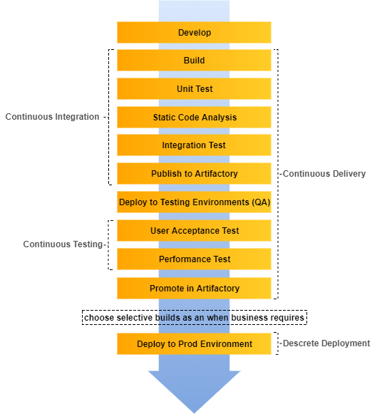
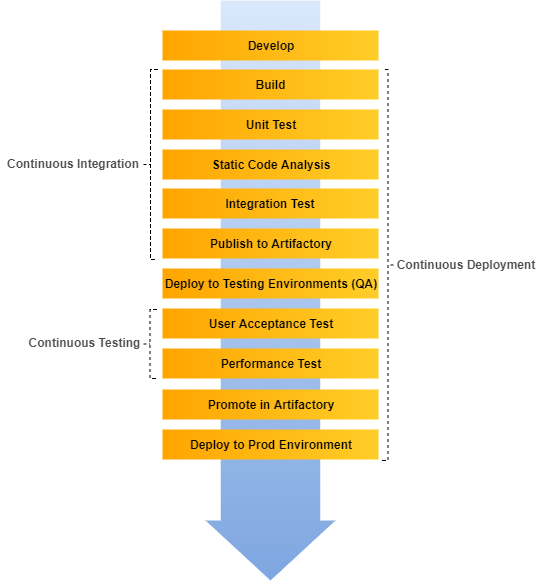
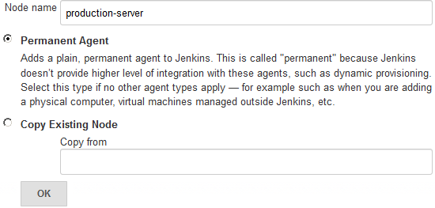
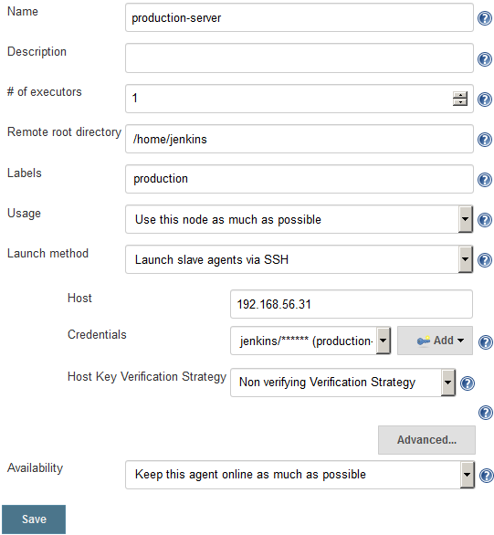

# 九、使用Jenkins进行持续部署

本章首先定义和解释连续部署。我们还将尝试区分连续部署和持续交付。连续部署是持续交付管道的一个简单的调整版本。因此，我们不会看到任何重大的Jenkins配置变化或任何新工具。

本章将涵盖以下主题:

*   创建生产服务器
*   在生产服务器上安装Jenkins从机
*   创建Jenkins连续部署管道
*   行动中的持续交付

# 什么是持续部署？

将生产就绪特性持续部署到生产环境或最终用户的过程称为**持续部署**。

整体意义上的持续部署意味着，*无需任何干预即可立即启用生产就绪特性的过程*。这包括以敏捷的方式构建特性，持续地集成和测试它们，并不间断地将它们部署到生产环境中。

连续部署在字面上的意思是，*在任何给定的环境中连续部署任何给定包的任务*。因此，将包部署到测试服务器和生产服务器的任务传达了连续部署的字面意思。

# 持续部署与持续交付有何不同

首先，开发特性，然后它们经历一个周期，或者持续集成，或者通过各种测试。任何通过各种测试的东西都被认为是生产就绪的特性。然后，这些生产就绪特性在 Artifactory 中进行标记(本书中未显示)，或者与非生产就绪特性分开保存。

这类似于制造生产线。原始产品经历了修改和测试阶段。最后，成品被包装并储存在仓库中。从仓库，根据订单，它被运送到不同的地方。产品包装后不会立即发货。

我们可以放心地称这种做法为持续交付。下图描述了**持续交付**的生命周期:



Continuous Delivery pipeline

另一方面，**连续部署**生命周期看起来有点像下图所示。部署阶段立即开始，没有任何中断。生产就绪功能会立即部署到生产中:



Continuous Deployment pipeline

# 谁需要持续部署？

人们可能会想到以下问题:*我如何在我的组织中实现连续部署*、*我需要整合和自动化多少测试，可能会遇到哪些挑战*、*？*列表继续。

然而，技术挑战是一回事。更重要的是决定我们是否真的需要它。我们真的需要持续部署吗？

答案是，*并不总是，也不是在所有情况下*。因为，根据我们对连续部署的定义和对前一主题的理解，生产就绪型功能可以立即部署到生产环境中。

在许多组织中，是业务部门决定是否进行功能直播，或者何时进行功能直播。因此，将持续部署视为一种选择，而不是强迫。

另一方面，持续交付；这意味着以连续的方式创建生产就绪的特性，应该是任何组织的座右铭。

# 创建生产服务器

在下一节中，让我们创建一个生产服务器，它将托管我们的 *hello world* 应用。我们稍后将扩展我们的持续交付管道，以便在我们的生产服务器上自动部署完全测试的二进制工件。

在下面的例子中，我们的生产服务器是一个简单的 Tomcat 服务器。让我们用游民创造一个。

# 安装游民

在这一部分，我们将在 Ubuntu 上安装游民。确保您以`root`用户或具有根权限(`sudo`访问权限)的帐户的身份执行这些步骤:

1.  打开一个终端，键入以下命令下载游民:

```
wget https://releases.hashicorp.com/vagrant/1.8.5/vagrant_1.8.5_x86_64.deb
```

或者，您也可以在[https://www.vagrantup.com/downloads.html](https://www.vagrantup.com/downloads.html):流浪网站下载最新的流浪包


Vagrant download webpage Use the latest version of Vagrant and VirtualBox available. Using an older version of Vagrant with a newer version of VirtualBox or vice versa may result in issues while creating VMs.

2.  下载完成后，您应该会看到一个`.deb`文件。
3.  执行以下命令，使用下载的包文件安装游民。系统可能会提示您提供密码:

```
sudo dpkg -i vagrant_1.8.5_x86_64.deb 
sudo apt-get install -f
```

4.  安装完成后，通过执行以下命令检查已安装的游民版本:

```
vagrant --version
```

5.  您应该会看到类似的输出:

```
Vagrant 1.8.5
```

# 安装 VirtualBox

游民需要 Oracle VirtualBox 来创建虚拟机。然而，它不仅限于甲骨文虚拟盒子，您也可以使用 VMware。按照给定的步骤在您的计算机上安装 VirtualBox:

要使用 VMware 或 AWS 运行游民，请访问[。](https://www.vagrantup.com/docs/getting-started/providers.html)

1.  在`/etc/apt`目录中的`sources.list`文件中添加以下行:

```
deb http://download.virtualbox.org/virtualbox/debian \
xenial contrib
```

根据您的 Ubuntu 分布，将`xenial`替换为`vivid`、`utopic`、`trusty`、`raring`、`quantal`、`precise`、`lucid`、`jessie`、`wheezy`或`squeeze`。

2.  使用以下命令下载并注册密钥。这两个命令都应该有一个输出:`OK`。

```
wget -q \
https://www.virtualbox.org/download/oracle_vbox_2016.asc -O- | 
sudo apt-key add - 
wget -q \
https://www.virtualbox.org/download/oracle_vbox.asc -O- | 
sudo apt-key add –

```

3.  要安装 VirtualBox，请执行以下命令:

```
sudo apt-get update 
sudo apt-get install virtualbox-5.1
```

4.  执行以下命令查看已安装的 VirtualBox 版本:

```
VBoxManage –-version
```

5.  您应该会看到类似的输出:

```
5.1.6r110634
```

Ubuntu/Debian users might want to install the `dkms` package to ensure that the VirtualBox host kernel modules (`vboxdrv`, `vboxnetflt`, and `vboxnetadp`) are properly updated if the Linux kernel version changes during the next `apt-get upgrade`. For Debian, it is available in Lenny backports and in the normal repository for Squeeze and later. The `dkms` package can be installed through the Synaptic package manager or through the following command:
`**sudo apt-get install dkms**`

# 使用游民创建虚拟机

在下一节中，我们将生成一个虚拟机，它将使用游民和虚拟盒子作为我们的生产服务器。

# 创建一个流浪文件

我们将创建一个游民文件来描述我们的虚拟机。遵循给定的步骤:

1.  使用以下命令创建名为`Vagrantfile`的新文件:

```
sudo nano Vagrantfile
```

2.  将以下代码粘贴到文件中:

```
# -*- mode: ruby -*-
# vi: set ft=ruby :
Vagrant.configure(2) do |config|
config.vm.box = "ubuntu/xenial64"

config.vm.define :node1 do |node1_config|
node1_config.vm.network "private_network", ip:"192.168.56.31"
node1_config.vm.provider :virtualbox do |vb|
vb.customize ["modifyvm", :id, "--memory", "2048"]
vb.customize ["modifyvm", :id, "--cpus", "2"]
end
end
end
```

Choose the IP address, memory, and number of CPUs accordingly.

3.  键入 *Ctrl* + *X* ，再按 *Y* 保存文件。

# 使用游民生成虚拟机

在本节中，我们将使用刚才创建的`Vagrantfile`创建一个虚拟机:

1.  键入以下命令，使用前面的`Vagrantfile`生成虚拟机:

```
 vagrant up node1
```

2.  流浪者需要一段时间才能把机器发动起来。完成后，执行以下命令登录新虚拟机:

```
 vagrant ssh node1
```

输出如下:

```
Welcome to Ubuntu 16.04.2 LTS (GNU/Linux 4.4.0-83-generic x86_64)

 * Documentation:  https://help.ubuntu.com
 * Management:     https://landscape.canonical.com
 * Support:        https://ubuntu.com/advantage

 Get cloud support with Ubuntu Advantage Cloud Guest:
 http://www.ubuntu.com/business/services/cloud
0 packages can be updated.
0 updates are security updates.

ubuntu@ubuntu-xenial:~$
```

3.  我们现在在虚拟机内部。我们将使用运行应用所需的所有必要应用来升级虚拟机:
    *   爪哇 JDK(最新)
    *   Apache Tomcat (8.5)
    *   登录到 Docker 容器的用户帐户
    *   打开 SSH 守护程序— `sshd`(接受 SSH 连接)
    *   卷曲
4.  现在，像在任何普通的 Ubuntu 机器上一样安装所有需要的应用。让我们从创建一个`jenkins`用户开始:
    1.  执行以下命令并遵循用户创建步骤:

```
adduser jenkins
```

输出如下:

```
Adding user `jenkins' ...
Adding new group `jenkins' (1001) ...
Adding new user `jenkins' (1001) with group `jenkins' ...
Creating home directory `/home/jenkins' ...
Copying files from `/etc/skel' ...
Enter new UNIX password:
Retype new UNIX password:
passwd: password updated successfully
Changing the user information for jenkins
Enter the new value, or press ENTER for the default
 Full Name []: Nikhil Pathania
 Room Number []:
 Work Phone []:
 Home Phone []:
 Other []:
Is the information correct? [Y/n] Y
```

```
su jenkins
```

5.  通过输入`exit`切换回根用户。
6.  接下来，我们将安装 SSH 服务器。依次执行以下命令(如果`openssh-server`应用和`/var/run/sshd`目录路径已经存在，则忽略):

```
sudo apt-get update

sudo apt-get install openssh-server

sudo mkdir /var/run/sshd
```

7.  按照给定的步骤安装 Java:
    1.  更新包索引:

```
sudo apt-get update
```

```
sudo apt-get install default-jre
```

8.  安装 Tomcat 8.5 的最佳方法是下载最新的二进制版本，然后手动配置:
    1.  移动到`/tmp`目录，使用以下命令下载 Apache Tomcat 8.5:

```
cd /tmp

wget https://archive.apache.org/dist/tomcat/tomcat-8/v8.5.11/bin/apache-tomcat-8.5.11-deployer.tar.gz
```

```
mkdir $HOME/tomcat
```

```
sudo tar xzvf apache-tomcat-8*tar.gz \
-C $HOME/tomcat --strip-components=1
```

9.  在终端中输入`exit`退出虚拟机。

# 在 Jenkins 内部添加生产服务器凭据

为了使 Jenkins 与生产服务器通信，我们需要在 Jenkins 内部添加帐户凭据。

我们将使用Jenkins凭证插件来实现这一点。如果您已经遵循了 Jenkins 设置向导(在本章开头讨论)，您将在 Jenkins 控制面板上找到凭据功能(参见左侧菜单):

遵循给定的步骤:

1.  从Jenkins仪表板中，单击凭据|系统|全局凭据(无限制)。
2.  在“全局凭据(无限制)”页面的左侧菜单中，单击添加凭据链接。
3.  您将看到一堆要配置的字段。
4.  在“种类”字段中选择带密码的用户名。
5.  为范围字段选择全局(Jenkins、节点、项目、所有子项目等)。
6.  在用户名字段下添加用户名。
7.  在密码字段下添加密码。
8.  通过在“标识”字段下键入字符串，为您的凭据提供唯一的标识。
9.  在描述字段下添加有意义的描述。
10.  完成后，单击保存按钮:


Adding credentials inside Jenkins

# 在生产服务器上安装Jenkins从机

在本节中，我们将在生产服务器上安装一个 Jenkins 从机。这将允许我们在生产服务器上执行部署。执行以下步骤:

1.  在Jenkins仪表板中，单击管理Jenkins|管理节点。
2.  在“节点管理器”页面上，从左侧菜单中单击“新建节点”。
3.  为您的新 Jenkins 从节点命名，如图所示:



Adding a new Jenkins slave

4.  在结果页面上，您将看到大量选项。让我们一个一个来看。
5.  对于远程根目录字段，添加值`/home/jenkins`。
6.  对于标签字段，添加值`production`。
7.  对于“用法”字段，选择“尽可能使用此节点”。
8.  对于启动方法字段，选择选项通过 SSH 启动从属代理。
9.  在主机字段下，添加生产服务器的 IP 地址。
10.  在“凭据”字段下，选择我们在上一节中创建的凭据。

11.  让剩下的选项保持原样。
12.  完成后，单击保存按钮:



Configuring the Jenkins slave

# 创建Jenkins连续部署管道

在下一节中，我们将扩展我们的持续交付管道来执行部署。

# 光盘流水线代码的再探讨

以下是光盘中完整的组合代码:

```
node('docker') {
  stage('Poll') {
    checkout scm
  }
  stage('Build & Unit test'){
    sh 'mvn clean verify -DskipITs=true';
    junit '**/target/surefire-reports/TEST-*.xml'
    archive 'target/*.jar'
  }
  stage('Static Code Analysis'){
    sh 'mvn clean verify sonar:sonar -Dsonar.projectName=example-project
    -Dsonar.projectKey=example-project
    -Dsonar.projectVersion=$BUILD_NUMBER';
  }
  stage ('Integration Test'){
    sh 'mvn clean verify -Dsurefire.skip=true';
    junit '**/target/failsafe-reports/TEST-*.xml'
    archive 'target/*.jar'
  }
  stage ('Publish'){
    def server = Artifactory.server 'Default Artifactory Server'
    def uploadSpec = """{
      "files": [
        {
           "pattern": "target/hello-0.0.1.war",
           "target": "example-project/${BUILD_NUMBER}/",
           "props": "Integration-Tested=Yes;Performance-Tested=No"
        }
      ]
    }"""
    server.upload(uploadSpec)
  }
  stash includes:
   'target/hello-0.0.1.war,src/pt/Hello_World_Test_Plan.jmx',
  name: 'binary'
}
node('docker_pt') {
  stage ('Start Tomcat'){
    sh '''cd /home/jenkins/tomcat/bin
    ./startup.sh''';
  }
  stage ('Deploy '){
    unstash 'binary'
    sh 'cp target/hello-0.0.1.war /home/jenkins/tomcat/webapps/';
  }
  stage ('Performance Testing'){
    sh '''cd /opt/jmeter/bin/
    ./jmeter.sh -n -t $WORKSPACE/src/pt/Hello_World_Test_Plan.jmx -l
    $WORKSPACE/test_report.jtl''';
    step([$class: 'ArtifactArchiver', artifacts: '**/*.jtl'])
  }
  stage ('Promote build in Artifactory'){
    withCredentials([usernameColonPassword(credentialsId:
     'artifactory-account', variable: 'credentials')]) {
      sh 'curl -u${credentials} -X PUT
      "http://192.168.56.102:8081/artifactory/api/storage/example-project/
      ${BUILD_NUMBER}/hello-0.0.1.war?properties=Performance-Tested=Yes"';
    }
  }
}
```

# 生产Jenkins从机的流水线代码

首先，让我们为 Jenkins 从服务器(生产服务器)创建一个节点块:

```
node('production') {
}
```

其中`production`是生产服务器Jenkins从节点的标签。

我们希望将构建工件部署到`production`节点上的生产服务器上的 Tomcat。

让我们为它编写管道代码。

# 从 Artifactory 下载二进制文件的管道代码

要从 artifacts 下载构建工件，我们将使用文件规格。文件规格代码如下所示:

```
"files": [
    {
      "pattern": "[Mandatory]",
      "target": "[Mandatory]",
      "props": "[Optional]",
      "recursive": "[Optional, Default: 'true']",
      "flat" : "[Optional, Default: 'true']",
      "regexp": "[Optional, Default: 'false']"
    }
  ]
```

下表描述了使用的各种参数:

| **参数** | **描述** |
| `pattern` | `[Mandatory]`指定应上传到 artifacts 的工件的本地文件系统路径。您可以通过使用通配符或由`regexp`属性指定的正则表达式来指定多个工件。
如果使用`regexp`，则需要使用反斜杠`\`转义表达式中使用的任何保留字符(如`.`、`?`等)。自从 2.9.0 版的 Jenkins Artifactory 插件和 2.3.1 版的 TeamCity Artifactory 插件以来，模式格式得到了简化，并对包括 Windows 在内的所有操作系统使用相同的文件分隔符`/`。 |
| `target` | `[Mandatory]`以以下格式指定 Artifactory 中的目标路径:`[repository_name]/[repository_path]`如果模式以斜线结束，例如`repo-name/a/b/`，那么`b`被认为是 Artifactory 中的一个文件夹，文件被上传到其中。在`repo-name/a/b`的情况下，上传的文件在 Artifactory 中被重命名为`b`。为了灵活地指定上传路径，您可以以`{1}, {2}, {3}...`的形式包含占位符，这些占位符由括在括号中的源路径中的相应标记替换。更多详细信息，请参考位于[https://www . jfrog . com/converge/display/RTF/Using+File+Specs # Using filespecs-Using 占位符](https://www.jfrog.com/confluence/display/RTF/Using+File+Specs#UsingFileSpecs-UsingPlaceholders) **的*使用占位符*文档。** |
| `props` | `[Optional]`以分号(`;`)分隔的要作为属性附加到上传属性的`key=value`对列表。如果任何键可以取几个值，那么每个值用逗号(`,`)隔开。比如`key1=value1;key2=value21,value22;key3=value3`。 |
| `flat` | `[Default: true]`如果`true`，工件被上传到指定的精确目标路径，并且它们在源文件系统中的层次被忽略。
如果`false`，工件被上传到目标路径，同时保持它们的文件系统层次。 |
| `recursive` | `[Default: true]`如果`true`，还会从源目录的子目录中采集工件进行上传。
如果`false`，只上传源目录中特定的工件。 |
| `regexp` | `[Default: false]`如果`true`，该命令将把描述要上传的工件的本地文件系统路径的模式属性解释为正则表达式。
如果`false`，该命令将模式属性解释为通配符表达式。 |

以下是我们将在管道中使用的文件规格代码:

```
def server = Artifactory.server 'Default Artifactory Server'
def downloadSpec = """{
  "files": [
    {
        "pattern": "example-project/$BUILD_NUMBER/*.zip",
        "target": "/home/jenkins/tomcat/webapps/"
        "props": "Performance-Tested=Yes;Integration-Tested=Yes",
    }
  ]
}""
server.download(downloadSpec)
```

将前面的步骤包装在名为`Deploy to Prod`的`stage`中:

```
stage ('Deploy to Prod'){
  def server = Artifactory.server 'Default Artifactory Server'
  def downloadSpec = """{
    "files": [
      {
        "pattern": "example-project/$BUILD_NUMBER/*.zip",
        "target": "/home/jenkins/tomcat/webapps/"
        "props": "Performance-Tested=Yes;Integration-Tested=Yes",
      }
    ]
  }""
server.download(downloadSpec)
}
```

将`Deploy to Prod`阶段包裹在`production`节点块内:

```
node ('production') {
  stage ('Deploy to Prod'){    def server = Artifactory.server 'Default Artifactory Server'
    def downloadSpec = """{
      "files": [
        {
          "pattern": "example-project/$BUILD_NUMBER/*.zip",
          "target": "/home/jenkins/tomcat/webapps/"
          "props": "Performance-Tested=Yes;Integration-Tested=Yes",
        }
      ]
    }""
    server.download(downloadSpec)
  }
}
```

# 组合连续部署管道代码

以下是组合的连续部署管道代码:

```
node('docker') {
  stage('Poll') {
    checkout scm
  }
  stage('Build & Unit test'){
    sh 'mvn clean verify -DskipITs=true';
    junit '**/target/surefire-reports/TEST-*.xml'
    archive 'target/*.jar'
  }
  stage('Static Code Analysis'){
    sh 'mvn clean verify sonar:sonar -Dsonar.projectName=example-project
    -Dsonar.projectKey=example-project
    -Dsonar.projectVersion=$BUILD_NUMBER';
  }
  stage ('Integration Test'){
    sh 'mvn clean verify -Dsurefire.skip=true';
    junit '**/target/failsafe-reports/TEST-*.xml'
    archive 'target/*.jar'
  }
  stage ('Publish'){
    def server = Artifactory.server 'Default Artifactory Server'
    def uploadSpec = """{
      "files": [
        {
          "pattern": "target/hello-0.0.1.war",
          "target": "example-project/${BUILD_NUMBER}/",
          "props": "Integration-Tested=Yes;Performance-Tested=No"
        }
      ]
    }"""
    server.upload(uploadSpec)
  }
  stash includes:
   'target/hello-0.0.1.war,src/pt/Hello_World_Test_Plan.jmx',
  name: 'binary'
}
node('docker_pt') {
  stage ('Start Tomcat'){
    sh '''cd /home/jenkins/tomcat/bin
    ./startup.sh''';
  }
  stage ('Deploy '){
    unstash 'binary'
    sh 'cp target/hello-0.0.1.war /home/jenkins/tomcat/webapps/';
  }
  stage ('Performance Testing'){
    sh '''cd /opt/jmeter/bin/
    ./jmeter.sh -n -t $WORKSPACE/src/pt/Hello_World_Test_Plan.jmx -l
    $WORKSPACE/test_report.jtl''';
    step([$class: 'ArtifactArchiver', artifacts: '**/*.jtl'])
  }
  stage ('Promote build in Artifactory'){
    withCredentials([usernameColonPassword(credentialsId:
     'artifactory-account', variable: 'credentials')]) {
      sh 'curl -u${credentials} -X PUT
      "http://192.168.56.102:8081/artifactory/api/storage/example-project/
      ${BUILD_NUMBER}/hello-0.0.1.war?properties=Performance-Tested=Yes"';
    }
  }
}
node ('production') {  stage ('Deploy to Prod'){    def server = Artifactory.server 'Default Artifactory Server'
    def downloadSpec = """{
      "files": [
        {
          "pattern": "example-project/$BUILD_NUMBER/*.zip",
          "target": "/home/jenkins/tomcat/webapps/"
          "props": "Performance-Tested=Yes;Integration-Tested=Yes",
        }
      ]
    }""
    server.download(downloadSpec)
  }
}
```

# 更新Jenkins文件

Jenkins多分支光盘管道利用Jenkins文件。在这一部分，我们将更新我们现有的Jenkins文件。遵循给定的步骤:

1.  登录您的 GitHub 帐户。
2.  导航到分叉存储库*。*
3.  进入知识库页面后，点击`Jenkinsfile`。接下来，在结果页面上点击编辑按钮编辑您的`Jenkinsfile`。
4.  用以下代码替换现有内容:

```
node('docker') {
  stage('Poll') {
    checkout scm
  }
  stage('Build & Unit test'){
    sh 'mvn clean verify -DskipITs=true';
    junit '**/target/surefire-reports/TEST-*.xml'
    archive 'target/*.jar'
  }
  stage('Static Code Analysis'){
    sh 'mvn clean verify sonar:sonar
    -Dsonar.projectName=example-project
    -Dsonar.projectKey=example-project
    -Dsonar.projectVersion=$BUILD_NUMBER';
  }
  stage ('Integration Test'){
    sh 'mvn clean verify -Dsurefire.skip=true';
    junit '**/target/failsafe-reports/TEST-*.xml'
    archive 'target/*.jar'
  }
  stage ('Publish'){
    def server = Artifactory.server
      'Default Artifactory Server'
    def uploadSpec = """{
      "files": [
        {
           "pattern": "target/hello-0.0.1.war",
           "target": "example-project/${BUILD_NUMBER}/",
           "props": "Integration-Tested=Yes;
             Performance-Tested=No"
        }
      ]
    }"""
    server.upload(uploadSpec)
  }
  stash includes:
   'target/hello-0.0.1.war,src/pt/Hello_World_Test_Plan.jmx',
  name: 'binary'
}
node('docker_pt') {
  stage ('Start Tomcat'){
    sh '''cd /home/jenkins/tomcat/bin
    ./startup.sh''';
  }
  stage ('Deploy '){
    unstash 'binary'
    sh 'cp target/hello-0.0.1.war /home/jenkins/tomcat/webapps/';
  }
  stage ('Performance Testing'){
    sh '''cd /opt/jmeter/bin/
    ./jmeter.sh -n -t $WORKSPACE/src/pt/Hello_World_Test_Plan.jmx
    -l $WORKSPACE/test_report.jtl''';
    step([$class: 'ArtifactArchiver', artifacts: '**/*.jtl'])
  }
  stage ('Promote build in Artifactory'){
    withCredentials([usernameColonPassword(credentialsId:
     'artifactory-account', variable: 'credentials')]) {
      sh 'curl -u${credentials} -X PUT
      "http://192.168.56.102:8081/artifactory/api/storage/
       example-project/${BUILD_NUMBER}/hello-0.0.1.war?
       properties=Performance-Tested=Yes"';
    }
  }
}
node ('production') {  stage ('Deploy to Prod'){    def server = Artifactory.server 
     'Default Artifactory Server'
    def downloadSpec = """{
      "files": [
        {
          "pattern": "example-project/$BUILD_NUMBER/*.zip",
          "target": "/home/jenkins/tomcat/webapps/"
          "props": "Performance-Tested=Yes;
             Integration-Tested=Yes",
        }
      ]
    }""
    server.download(downloadSpec)
  }
}
```

5.  完成后，通过添加有意义的注释提交新文件。

# 行动中的持续交付

对您的 GitHub 代码进行一些更改，或者从 Jenkins 仪表板中触发 Jenkins 管道。

登录Jenkins，从Jenkins仪表板点击你的多分支管道。您应该会看到类似以下截图的内容:


Jenkins Continuous Deployment pipeline in action

# 摘要

这标志着持续部署的结束。在本章中，我们学习了如何使用 Jenkins 实现连续部署。另外，我希望持续交付和连续部署之间的混淆是清楚的。本章中没有主要的设置或配置，因为在实现持续集成和持续交付时，所有必要的东西都在前面的章节中实现了。

我真的希望这本书能成为你走出去和Jenkins进行更多实验的一种手段。

直到下次，干杯！