# 应用程序和网络的安全强化

对于任何有安全意识的努力来说，安全强化是最明显的任务。通过努力保护系统、应用程序和网络的安全，可以实现多个安全目标，如下所示:

*   确保应用程序和网络不受损害(有时)
*   使得妥协很难长期隐藏
*   默认情况下的安全保护可确保网络某一部分的危害不会传播得越来越远

围绕安全的自动化的简单思维方式非常适合自动化安全强化。在本章中，我们将介绍可用于构建行动手册的安全基准和框架，这些行动手册将允许我们做以下事情:

*   保护我们的主映像，以便一旦应用程序和系统成为网络的一部分，它们就能提供良好的安全性
*   执行审核流程，以便我们可以定期验证和测量应用程序、系统和网络是否符合组织要求的安全策略

这绝不是一个新想法。在这一领域开展了大量工作。我们将关注像 dev-sec . io([http://dev-sec.io/](http://dev-sec.io/))这样的项目，这些项目可以让我们从应用程序和网络的安全强化开始变得简单。

本章涵盖的主题如下:

*   以基准进行安全强化，如**互联网安全中心**(**CIS**)**安全技术实现指南**(**STIG**)**国家标准技术研究院** ( **NIST** )
*   使用 Ansible 自动化网络设备的安全审计检查
*   使用 Ansible 自动化应用程序的安全审核检查
*   使用 Ansible 的自动修补方法

# 使用 CIS、STIGs 和 NIST 等基准强化安全性

基准测试为任何人获得对其个人安全工作的保证提供了一个很好的方法。基准测试由全球安全专家创建，或由安全成熟的政府部门(如 NIST)领导，涵盖一系列系统、配置、软件等。

强化安全性主要归结为以下几点:

1.  就什么是安全配置的最小配置集达成一致。这通常被定义为强化基准或框架。
2.  对该配置涉及的系统的所有方面进行更改。
3.  定期测量应用程序和系统是否仍符合配置或是否有任何偏差。
4.  如果发现任何偏差，采取纠正措施来解决。
5.  如果没有发现偏差，记录下来。
6.  由于软件总是在升级，所以掌握最新的配置指南和基准是最重要的。

我们讨论的三个重要基准/框架是:

*   独联体基准
*   STIG 导游
*   NIST**国家核对表项目** ( **全国大会党**)

这些 CIS 基准通常表示为 PDF 文档，任何想要了解其系统与 CIS 专家的想法相比有多安全的人都可以使用。

CIS is a not-for-profit organization with not-for-profit standards for internet security, and are a recognized global standard and best practices for securing IT systems and data against attacks. CIS Benchmarks are the only consensus-based, best-practice security configuration guides both developed and accepted by the government, business, industry, and academia. For more information, visit [https://www.cisecurity.org/cis-benchmarks](https://www.cisecurity.org/cis-benchmarks).

STIG 与美国政府名为 **DISA** 的部门的信息系统配置有关。

The STIGs contain technical guidance to **lock down** information systems/software that might otherwise be vulnerable to a malicious computer attack. For more information, visit [https://iase.disa.mil/stigs/Pages/index.aspx](https://iase.disa.mil/stigs/Pages/index.aspx).

NIST 维护一个清单程序，该程序以遵循**安全内容自动化协议** ( **SCAP** )的文件表示。软件工具可以读取这些文件来自动化配置更改和审核运行配置。

SCAP enables validated security tools to automatically perform configuration checking using SCAP-expressed NCP checklists. For more information, visit [https://www.nist.gov/programs-projects/national-checklist-program](https://www.nist.gov/programs-projects/national-checklist-program).

# 使用 Ansible 行动手册强化基线操作系统

到目前为止，我们已经创建了多个行动手册来执行某些操作。现在，我们将了解如何使用社区中现有的行动手册( **Ansible Galaxy** )。

强化框架是德国电信的一个项目，旨在管理数千台服务器的安全性、合规性和维护。该项目的目标是创建一个通用层，以便轻松强化操作系统和服务。

If your organization is using chef or puppet tools as configuration management tools, the concepts are completely the same. You can find related cookbooks and details at [http://dev-sec.io](http://dev-sec.io).

以下行动手册提供了多种安全配置、标准和方法来保护操作系统免受不同的攻击和安全漏洞。

它将执行的一些任务包括:

*   例如，配置包管理，只允许签名的包
*   删除存在已知问题的包
*   配置`pam`和`pam_limits`模块
*   影子密码套件配置
*   配置系统路径权限
*   通过软限制禁用核心转储
*   限制超级用户登录系统控制台
*   设置 SUIDs
*   通过`sysctl`配置内核参数

从 galaxy 下载和执行 Ansible 行动手册非常简单，如下所示:

```
$ ansible-galaxy install dev-sec.os-hardening
```

```
- hosts: localhost
  become: yes
  roles:
    - dev-sec.os-hardening

```

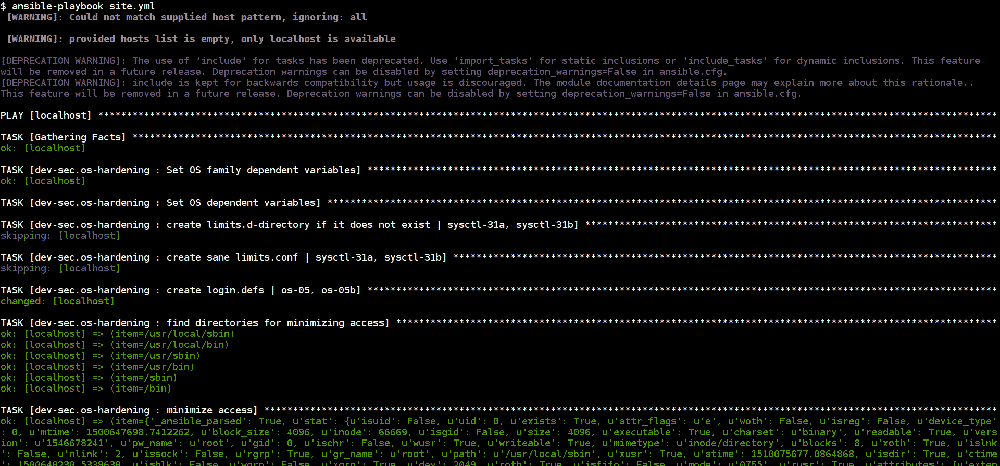

The dev-sec.os-hardening playbook in execution

前面的行动手册将检测操作系统，并根据不同的指导原则执行强化步骤。这可以根据需要通过更新默认变量值来配置。关于剧本的更多细节，请参考[https://github.com/dev-sec/ansible-os-hardening](https://github.com/dev-sec/ansible-os-hardening)。

# STIGs 在 Linux 主机自动安全强化方面的可替代角色

OpenStack 有一个很棒的项目，名为**可变形强化**([https://github.com/openstack/ansible-hardening](https://github.com/openstack/ansible-hardening))，它根据 STIGs 标准应用安全配置更改。关于 Unix/Linux 操作系统的 STIGs 基准测试的更多细节可以在[https://iase.disa.mil/stigs/os/unix-linux/Pages/index.aspx](https://iase.disa.mil/stigs/os/unix-linux/Pages/index.aspx)找到。

它为以下域执行安全强化:

*   `accounts`:用户账户安全控制
*   `aide`:高级入侵检测环境
*   `auditd`:审计守护进程
*   `auth`:认证
*   `file_perms`:文件系统权限
*   `graphical`:图形化登录安全控件
*   `kernel`:内核参数
*   `lsm` : Linux 安全模块
*   `misc`:其他安全控制
*   `packages`:包经理
*   `sshd` : SSH 守护进程

`ansible-hardening`行动手册支持多种 Linux 操作系统

*   CentOS 7
*   Debian jessie
*   软呢帽 26
*   openSUSE Leap 42.2 和 42.3
*   红帽企业版 Linux 7
*   SUSE Linux 企业版 12(实验)
*   Ubuntu 16.04

有关项目和文档的更多详细信息，请参见[https://docs.openstack.org/ansible-hardening/latest](https://docs.openstack.org/ansible-hardening/latest)。

使用`ansible-galaxy`从 GitHub 存储库本身下载角色，如下所示:

```
$ ansible-galaxy install git+https://github.com/openstack/ansible-hardening

```

剧本如下。与之前的行动手册类似，可以通过更改默认变量值根据需要进行配置:

```
- name: STIGs ansible-hardening for automated security hardening
  hosts: servers
  become: yes
  remote_user: "{{ remote_user_name }}"
  vars:
    remote_user_name: vagrant
    security_ntp_servers:
      - time.nist.gov
      - time.google.com

  roles:
    - ansible-hardening
```


An Ansible-hardening playbook in execution CentOS-7 for STIGs checklist

前面的行动手册是在 CentOS-7 服务器上针对 STIG 核对表执行的。

# 使用 Ansible Tower 对 OpenSCAP 进行持续的安全扫描和报告

OpenSCAP 是一组安全工具、策略和标准，通过遵循 SCAP 对系统执行安全合规性检查。SCAP 是 NIST 维护的美国标准。

SCAP 扫描器应用程序读取 SCAP 安全策略，并检查系统是否符合该策略。它逐个检查策略中定义的所有规则，并报告每个规则是否得到满足。如果所有检查都通过，则系统符合安全策略。

OpenSCAP 按照以下步骤在您的系统上执行扫描:

*   安装 SCAP 工作台或 OpenSCAP 底座(更多信息，请访问[https://www.open-scap.org](https://www.open-scap.org))
*   选择策略
*   调整您的设置
*   评估系统

下面的剧本将安装`openscap-scanner`和`scap-security-guide`软件进行检查。然后，它将使用`oscap`工具根据给定的配置文件和策略执行扫描。

可以看到，变量`oscap_profile`是使用可用配置文件列表中的配置文件，`oscap_policy`是选择扫描系统的具体策略:

```
- hosts: all
  become: yes
  vars:
    oscap_profile: xccdf_org.ssgproject.content_profile_pci-dss
    oscap_policy: ssg-rhel7-ds

  tasks:
  - name: install openscap scanner
    package:
      name: "{{ item }}"
      state: latest
    with_items:
    - openscap-scanner
    - scap-security-guide

  - block:
    - name: run openscap
      command: >
        oscap xccdf eval
        --profile {{ oscap_profile }}
        --results-arf /tmp/oscap-arf.xml
        --report /tmp/oscap-report.html
        --fetch-remote-resources
        /usr/share/xml/scap/ssg/content/{{ oscap_policy }}.xml

    always:
    - name: download report
      fetch:
        src: /tmp/oscap-report.html
        dest: ./{{ inventory_hostname }}.html
        flat: yes
```

查看[https://medium . com/@ jack price/ansi ble-open scap-for-compliance-automation-14200 Fe 70663](https://medium.com/@jackprice/ansible-openscap-for-compliance-automation-14200fe70663)处的剧本参考。

现在，我们可以使用此行动手册，使用 Ansible Tower 连续执行自动化检查:

1.  首先，我们需要在 Ansible Tower 服务器中创建一个目录，以便以`awx`用户权限存储该剧本，从而添加自定义剧本。
2.  在 Ansible Tower 中创建一个新项目，以执行 OpenSCAP 设置并根据检查进行扫描:

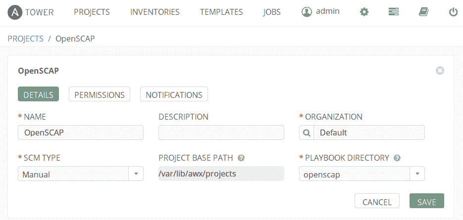

3.  然后，我们必须创建一个新的作业来执行剧本。在这里，我们可以包括主机列表、登录凭据以及执行执行所需的其他详细信息:

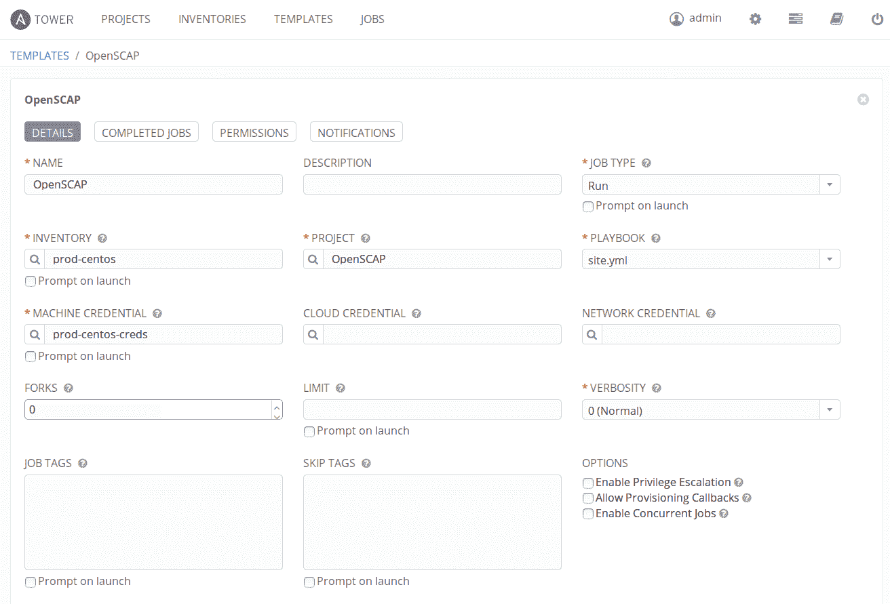

4.  可以计划频繁执行此审核。在这里，您可以看到我们每天都有计划，这可以根据合规性频率进行修改(安全合规性要求经常执行这些类型的审核):

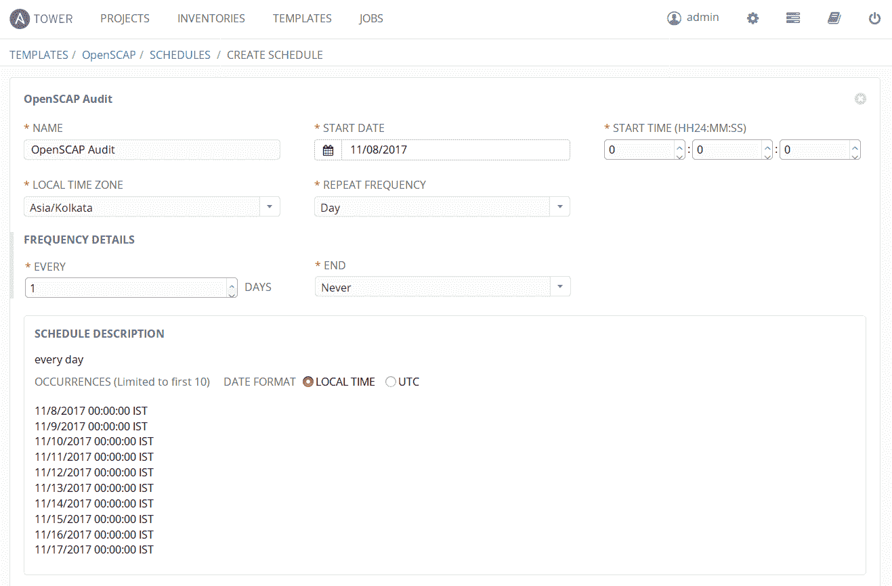

5.  我们也可以在需要时按需启动这项工作。行动手册的执行如下:


6.  剧本的输出将生成 OpenSCAP 报告，并将其提取到 Ansible Tower。我们可以在`/tmp/`位置访问该行动手册。此外，如果需要，我们可以将此报告发送到其他集中式报告服务器。


7.  我们还可以根据行动手册的执行结果设置通知。通过这样做，我们可以将此通知发送到各个渠道，如电子邮件、slack 和 message。


# 独联体基准

CIS 为不同类型的操作系统、软件和服务制定了基准。以下是一些高级类别:

*   桌面和网络浏览器
*   移动设备
*   网络设备
*   安全指标
*   服务器–操作系统
*   服务器–其他
*   虚拟化平台、云和其他

在[https://www.cisecurity.org](https://www.cisecurity.org)阅读更多关于 CIS 基准的信息。

# Ubuntu CIS 基准测试(服务器级)

CIS 基准 Ubuntu 提供说明性指导，为运行在 x86 和 x64 平台上的 Ubuntu Linux 系统建立安全的配置姿态。该基准测试面向计划开发、部署、评估或保护包含 Linux 平台的解决方案的系统和应用程序管理员、安全专家、审计员、服务台和平台部署人员。

以下是作为 CIS Ubuntu 16.04 LTS 基准测试一部分的六个高级领域:

*   初始设置:
    *   文件系统配置
    *   配置软件更新
    *   文件系统完整性检查
    *   安全启动设置
    *   附加加工硬化
    *   强制访问控制
    *   警告横幅
*   服务:
    *   油漆服务
    *   特殊用途服务
    *   服务客户
*   网络配置:
    *   网络参数(仅限主机)
    *   网络参数(主机和路由器)
    *   IPv6
    *   TCP 包装器
    *   不常见的网络协议
*   日志记录和审核:
    *   配置系统记帐(`auditd`)
    *   配置日志记录
*   访问、身份验证和授权:
    *   配置 cron
    *   SSH 服务器配置
    *   配置 PAM
    *   用户帐户和环境
*   系统维护:
    *   系统文件权限
    *   用户和组设置

以下是分别适用于 14.04 LTS 和 16.04 LTS 的行动手册:

*   https://github . com/ogya/cis-Ubuntu-14-ansable
*   [https://github . com/grouppoverta/cis-Ubuntu-ansable](https://github.com/grupoversia/cis-ubuntu-ansible)

```
$ git clone https://github.com/oguya/cis-ubuntu-14-ansible.git
$ cd cis-ubuntu-14-ansible
```

然后，更新变量和清单，并使用以下命令执行行动手册。变量并不是必需的，因为这是针对不同的配置项检查执行的，除非，如果我们想要根据组织定制基准:

```
$ ansible-playbook -i inventory cis.yml
```


CIS Ubuntu Benchmarks Ansible playbook execution

前面的剧本将针对 Ubuntu 服务器执行 CIS 安全基准测试，并执行 CIS 指南中列出的所有检查。

# AWS 基准测试(云提供商级别)

AWS CIS 基准测试为配置 AWS 子集的安全选项提供了说明性的指导，强调基础的、可测试的和体系结构不可知的设置。它面向计划在 AWS 中开发、部署、评估或保护解决方案的系统和应用程序管理员、安全专家、审计员、服务台、平台部署和/或 DevOps 人员。

以下是高级领域，它们是 AWS CIS 基准测试的一部分:

*   身份和访问管理
*   记录
*   监视
*   建立工作关系网
*   额外的

目前有一款基于 AWS-CLI 命令的工具名为**潜行者**([https://github.com/Alfresco/prowler](https://github.com/Alfresco/prowler))用于 AWS 账户安全评估和加固。

该工具遵循 CIS 亚马逊网络服务基础基准 1.1 的指导原则

在运行行动手册之前，我们必须提供 AWS 应用编程接口密钥来执行安全审计。这可以使用 AWS 服务中的 IAM 角色来创建。如果您已经有一个具有所需权限的帐户，则可以跳过这些步骤:

1.  在您的 AWS 帐户中创建一个具有编程访问权限的新用户:


2.  从 IAM 控制台中的现有策略为用户应用安全性审核策略:

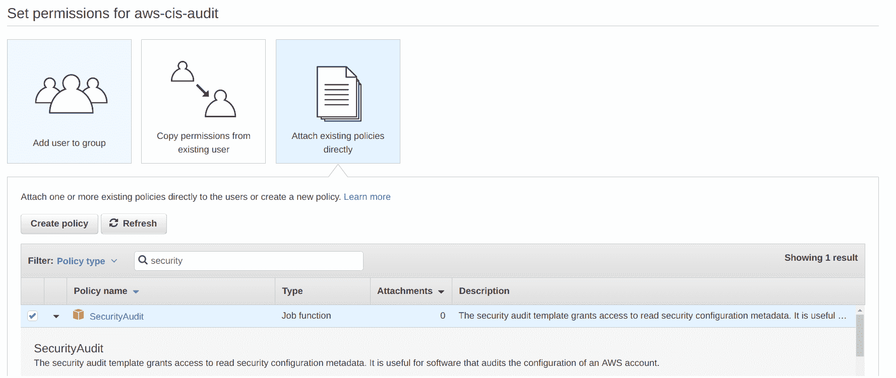

3.  然后，按照以下步骤创建新用户。确保您安全地保存了访问密钥标识和秘密访问密钥以备后用:


4.  以下是使用潜行工具设置和执行检查的简单操作手册。提供前面步骤中的访问和密钥。

5.  以下剧本假设您已经在本地系统中安装了`python`和`pip`:

```
        - name: AWS CIS Benchmarks playbook
          hosts: localhost
          become: yes
          vars:
            aws_access_key: XXXXXXXX
            aws_secret_key: XXXXXXXX

          tasks:
            - name: installing aws cli and ansi2html
              pip:
                name: "{{ item }}"

            with_items:
              - awscli
              - ansi2html

            - name: downloading and setting up prowler
              get_url:
                url:         https://raw.githubusercontent.com/Alfresco/prowler/master
        /prowler
                dest: /usr/bin/prowler
                mode: 0755

            - name: running prowler full scan
              shell: "prowler | ansi2html -la > ./aws-cis-report-{{         ansible_date_time.epoch }}.html"
              environment:
                AWS_ACCESS_KEY_ID: "{{ aws_access_key }}"
                AWS_SECRET_ACCESS_KEY: "{{ aws_secret_key }}"

            - name: AWS CIS Benchmarks report downloaded
              debug:
                msg: "Report can be found at ./aws-cis-report-{{         ansible_date_time.epoch }}.html"
```

6.  行动手册将使用潜行工具触发 AWS CIS 基准的设置和安全审计扫描:


7.  cruiser 生成的 HTML 报告如下所示，可以根据需要下载不同格式的报告，也可以根据需要配置扫描检查:


更多关于工具的参考可以在[https://github.com/Alfresco/prowler](https://github.com/Alfresco/prowler)找到。

# lynis–用于 Unix/Linux 系统的开源安全审计工具

Lynis 是一个开源的安全审计工具。由系统管理员、安全专业人员和审计人员用来评估其基于 Linux 和 Unix 的系统的安全防御。它运行在主机本身上，因此它比漏洞扫描器执行更广泛的安全扫描。

支持的操作系统:Lynis 运行在几乎所有基于 Unix 的系统和版本上，包括以下系统和版本:

*   [计]高级交互执行程序（Advanced Interactive Executive）
*   FreeBSD
*   惠普用户体验
*   Linux 操作系统
*   苹果电脑
*   NetBSD
*   OpenBSD
*   Solaris 和其他

如[https://cisofy.com/lynis](https://cisofy.com/lynis)所述:

"It even runs on systems like the Raspberry Pi, or QNAP storage devices."

剧本如下:

```
- name: Lynis security audit playbook
  hosts: lynis
  remote_user: ubuntu
  become: yes
  vars:
    # refer to https://packages.cisofy.com/community
    code_name: xenial

  tasks:
    - name: adding lynis repo key
      apt_key:
        keyserver: keyserver.ubuntu.com
        id: C80E383C3DE9F082E01391A0366C67DE91CA5D5F
        state: present

```

```
    - name: installing apt-transport-https
      apt:
        name: apt-transport-https
        state: present

    - name: adding repo
      apt_repository:
        repo: "deb https://packages.cisofy.com/community/lynis/deb/ {{ code_name }} main"
        state: present
        filename: "cisofy-lynis"

    - name: installing lynis
      apt:
        name: lynis
        update_cache: yes
        state: present

    - name: audit scan the system
      shell: lynis audit system > /tmp/lynis-output.log

    - name: downloading report locally
      fetch:
        src: /tmp/lynis-output.log
        dest: ./{{ inventory_hostname }}-lynis-report-{{ ansible_date_time.date }}.log
        flat: yes

    - name: report location
      debug:
        msg: "Report can be found at ./{{ inventory_hostname }}-lynis-report-{{ ansible_date_time.date }}.log"
```

前面的剧本将设置 Lynis，对其运行系统审核扫描，最后在本地获取报告:


Lynis system audit scan playbook in execution

以下截图是最近一次审计扫描的报告:

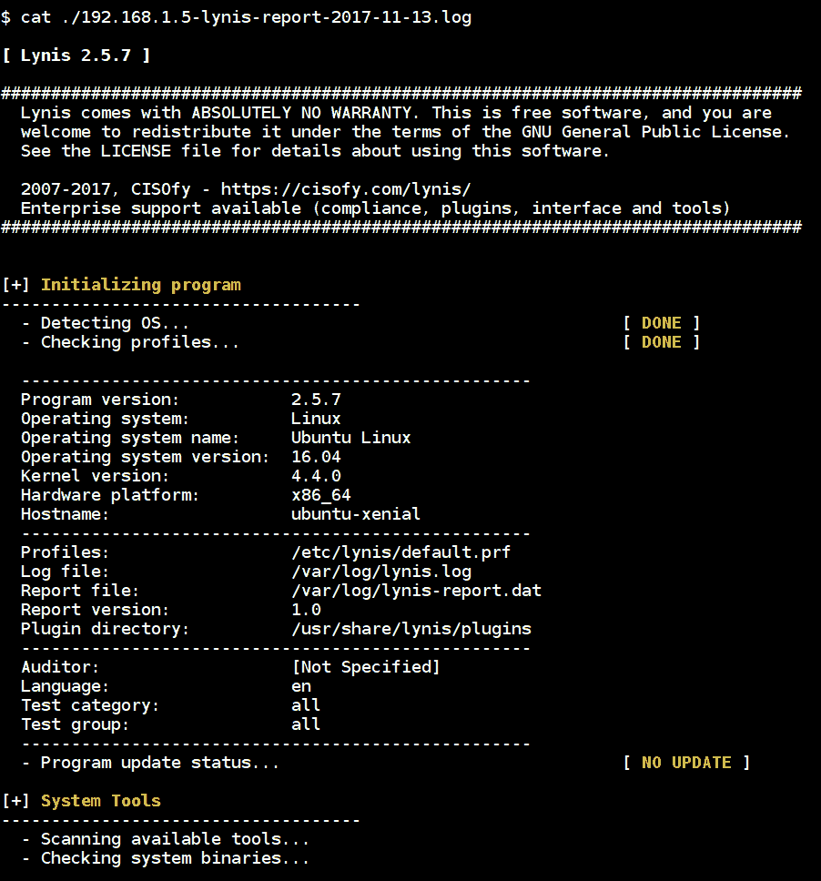

Lynis system audit scan report

这可以通过 Ansible Tower 和其他自动化工具运行，以使用 Lynis 对系统执行定期检查，从而进行审核扫描。

# Lynis 命令和高级选项

Lynis 有多个选项和命令，可用于执行不同的选项。例如，我们可以使用`audit dockerfile <filename>`来执行 Dockerfiles 的分析，使用`--pentest`选项来执行与扫描相关的检测。

>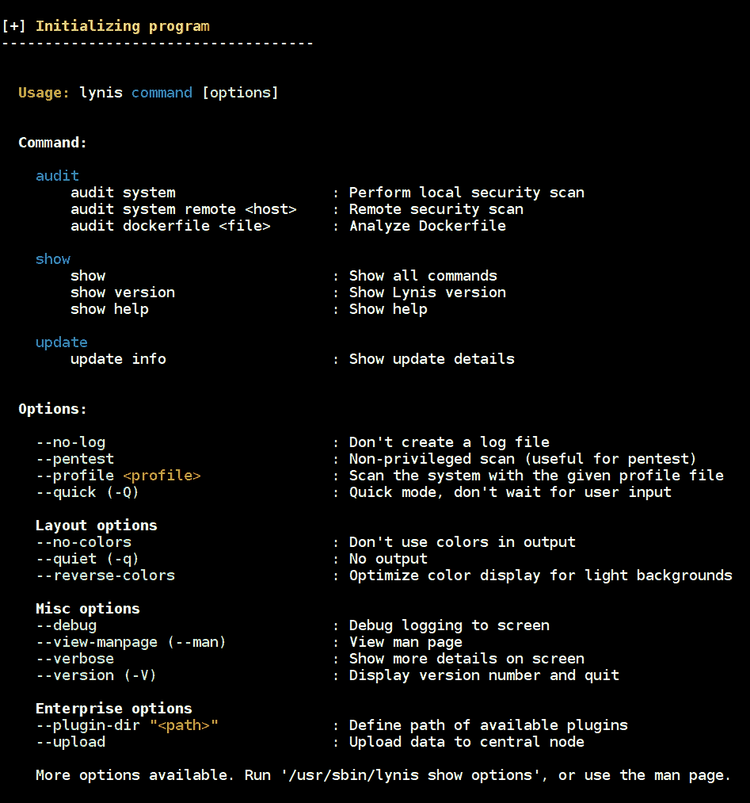

# 使用 Ansible 行动手册进行 Windows 服务器审核

大多数企业使用 Windows，通过使用活动目录类型功能的组织来集中管理其策略和更新。此外，保护和检查组织中的安全问题也是一项非常重要的资产。我们知道，Ansible 支持 Windows 操作系统使用 WinRM 执行配置更改。让我们看一些使用 Ansible 行动手册为您的 Windows 服务器增加安全性的示例。

# Windows 安全更新行动手册

以下剧本简单参考了位于[https://docs . Ansible . com/ansi ble/develop/windows _ usage . html # installing-updates](https://docs.ansible.com/ansible/devel/windows_usage.html#installing-updates)的 ansi ble 文档:

```
- name: Windows Security Updates
  hosts: winblows

  tasks:
    - name: install all critical and security updates
      win_updates:
        category_names:
        - CriticalUpdates
        - SecurityUpdates
        state: installed
      register: update_result

    - name: reboot host if required
      win_reboot:
      when: update_result.reboot_required
```

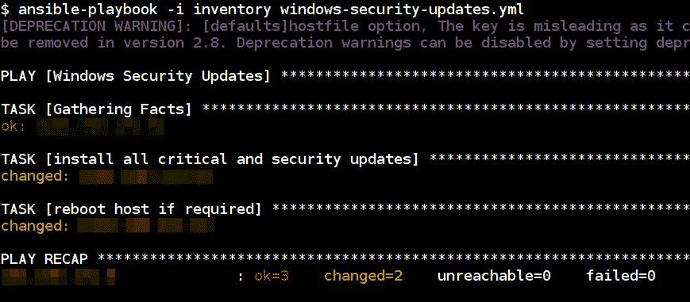

Windows updates playbook in action

前面的行动手册将执行关键严重性的自动 Windows 安全更新，并在需要应用更新的更改时重新启动计算机。

# Windows 工作站和服务器审核

以下 Ansible 行动手册是基于[https://github . com/alarenouf/Windows-工作站-服务器-审核，](https://github.com/alanrenouf/Windows-Workstation-and-Server-Audit)创建的，它将对系统进行审核并生成详细的 HTML 报告。这是我们如何使用 PowerShell 脚本执行审计的一个示例。这可以通过添加更多检查以及添加其他安全审计脚本来扩展。

剧本如下:

```
- name: Windows Audit Playbook
  hosts: winblows

  tasks:
    - name: download audit script
      win_get_url:
        url: https://raw.githubusercontent.com/alanrenouf/Windows-Workstation-and-Server-Audit/master/Audit.ps1
        dest: C:\Audit.ps1

    - name: running windows audit script
      win_shell: C:\Audit.ps1
      args:
        chdir: C:\
```

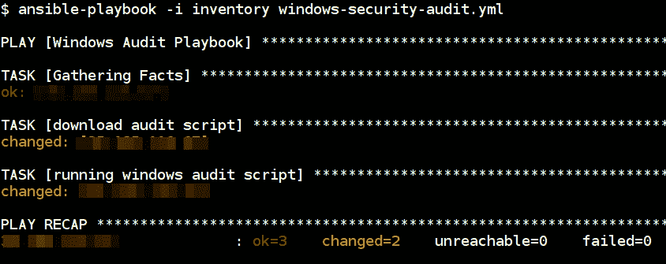

Windows Audit Playbook in Action

剧本执行完成后，我们可以看到 HTML 格式的输出报告，其中包含有关运行服务、安全补丁、事件、日志记录和其他配置详细信息的详细信息。


# 使用 Ansible 自动化网络设备的安全审计检查

我们已经看到，Ansible 非常适合与各种工具配合使用，我们可以利用它对网络设备进行安全审计检查。

# Nmap 扫描和 NSE

**网络映射器** ( **Nmap** )是一个免费的开源软件，用于执行网络发现、扫描、审计和许多其他操作。它具有各种功能，如操作系统检测、系统指纹识别、防火墙检测和许多其他功能。 **Nmap 脚本引擎** ( **Nmap NSE** )提供高级功能，如扫描特定漏洞和攻击。我们还可以使用自己的自定义脚本编写和扩展 Nmap。Nmap 是笔测试人员(安全测试人员)和网络安全团队的瑞士军刀。

Read more about Nmap at [https://nmap.org](https://nmap.org). Ansible also has a module to perform the inventory using Nmap [https://github.com/ansible/ansible/pull/32857/files](https://github.com/ansible/ansible/pull/32857/files).

如果 Nmap 不可用，以下行动手册将安装 Nmap，并使用指定的标志执行基本网络端口扫描:

```
- name: Basic NMAP Scan Playbook
  hosts: localhost
  gather_facts: false
  vars:
    top_ports: 1000
    network_hosts:
      - 192.168.1.1
      - scanme.nmap.org
      - 127.0.0.1
      - 192.168.11.0/24

  tasks:
    - name: check if nmap installed and install
      apt:
        name: nmap
        update_cache: yes
        state: present
      become: yes

    - name: top ports scan
      shell: "nmap --top-ports {{ top_ports }} -Pn -oA nmap-scan-%Y-%m-%d {{ network_hosts|join(' ') }}"
```

*   `{{ network_hosts|join(' ') }}`是一个名为**过滤器参数**的 Jinja2 特性，用于解析由空格分隔的给定`network_hosts`
*   `network_hosts`变量保存使用 Nmap 执行扫描的 IP、网络范围(CIDR)、主机等的列表
*   `top_ports`是从`0`到`65535`之间的数字。默认情况下，Nmap 选择通常打开的顶部端口
*   `-Pn`指定如果 ping (ICMP)也不起作用，则扫描主机
*   `-oA`获取所有格式的输出，包括 gnmap(可编译格式)、nmap 和 XML
*   有关 nmap 选项和文档的更多详细信息，请参见[https://nmap.org/book/man.html](https://nmap.org/book/man.html)


Nmap basic port scan playbook execution

运行基本 Nmap 扫描的行动手册输出如下:


Figure: Playbook scan output in 3 different formats

执行后的行动手册按照 Nmap 支持的格式创建了三个报告:

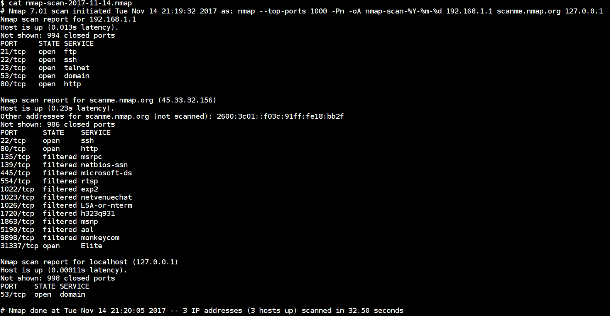

Figure: Playbook scan output in nmap format

通过查看`.nmap`文件的输出，我们可以很容易地看到 Nmap 扫描到底发现了什么。

# Nmap NSE 扫描行动手册

下面的剧本将使用`http-enum`对流行的网络应用程序和服务器使用的目录进行枚举，并使用 Nmap 脚本找到使用`http-methods`的 HTTP 服务器支持的选项。

More about Nmap NSE can be found at [https://nmap.org/book/nse.html](https://nmap.org/book/nse.html).

以下剧本将对港口`80`和`443`的`scanme.nmap.org`进行`http-enum`和`http-methods`扫描:

```
- name: Advanced NMAP Scan using NSE
  hosts: localhost
  vars:
    ports:
      - 80
      - 443
    scan_host: scanme.nmap.org 

  tasks:
    - name: Running Nmap NSE scan
      shell: "nmap -Pn -p {{ ports|join(',') }} --script {{ item }} -oA nmap-{{ item }}-results-%Y-%m-%d {{ scan_host }}"

      with_items:
        - http-methods
        - http-enum
```

以下行动手册将使用 Ansible 行动手册执行 Nmap NSE 脚本，以进行 HTTP 枚举和方法检查:

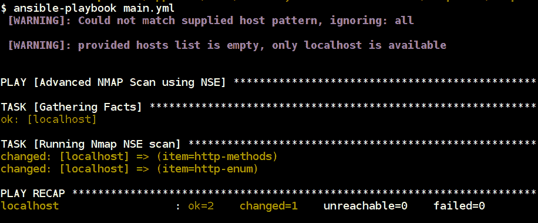

Nmap NSE Playbook execution

当我们运行一个简单的 NSE 脚本时，剧本的输出如下:


Nmap NSE scans output in .nmap format

`http-enum`脚本针对检测到网络服务器的网络端口运行附加测试。在前面的截图中，我们可以看到脚本发现了两个文件夹，另外还枚举了所有支持的 HTTP 方法。

# 使用童子军 2 进行 AWS 安全审计

Scout2 是一个开源的 AWS 安全审计工具，它用于使用 AWS Python API 评估 AWS 环境的安全态势。扫描输出将会以 JSON 格式存储，而 Scout2 的最终结果将会制作成一个简单的 HTML 网站，其中包含 AWS 云安全态势的详细信息。它基于现有的规则集和测试用例执行扫描和审计，这可以基于我们的定制脚本和场景进行扩展。

More details about the tool can be found at [https://github.com/nccgroup/Scout2](https://github.com/nccgroup/Scout2). This tool requires AWS IAM credentials to perform the scan; refer to [https://github.com/nccgroup/AWS-recipes/blob/master/IAM-Policies/Scout2-Default.json](https://github.com/nccgroup/AWS-recipes/blob/master/IAM-Policies/Scout2-Default.json) for user policy creation.

使用以下行动手册，安装 AWS 童子军 2 非常简单:

```
- name: AWS Security Audit using Scout2
  hosts: localhost
  become: yes

  tasks:
    - name: installing python and pip
      apt:
        name: "{{ item }}"
        state: present
        update_cache: yes

      with_items:
        - python
        - python-pip

    - name: install aws scout2
      pip:
        name: awsscout2
```

配置了多个规则来执行审核，以下代码片段是 IAM 密码策略规则的示例:

```
# https://raw.githubusercontent.com/nccgroup/Scout2/master/tests/data/rule-configs/iam-password-policy.json
{
    "aws_account_id": "123456789012",
    "services": {
        "iam": {
            "password_policy": {
                "ExpirePasswords": false,
                "MinimumPasswordLength": "1",
                "PasswordReusePrevention": false,
                "RequireLowercaseCharacters": false,
                "RequireNumbers": false,
                "RequireSymbols": false,
                "RequireUppercaseCharacters": false
            }
        }
    }
}
```

以下行动手册将执行 AWS 童子军 2 扫描，并以 HTML 格式返回报告:

```
- name: AWS Security Audit using Scout2
  hosts: localhost
  vars:
    aws_access_key: XXXXXXXX
    aws_secret_key: XXXXXXXX

  tasks:
    - name: running scout2 scan
      # If you are performing from less memory system add --thread-config 1 to below command
      command: "Scout2"
      environment:
        AWS_ACCESS_KEY_ID: "{{ aws_access_key }}"
        AWS_SECRET_ACCESS_KEY: "{{ aws_secret_key }}"

    - name: AWS Scout2 report downloaded
      debug:
        msg: "Report can be found at ./report.html"
```


AWS Scout2 report high-level overview

前面的截图是一个高级报告，详细报告如下:


AWS Scout2 report detailed results for IAM section

# 使用 Ansible 对应用程序进行自动化安全审计检查

现代应用程序可以很快变得相当复杂。能够运行自动化来完成安全任务几乎是一项强制性要求。

我们可以进行的不同类型的应用程序安全扫描范围如下:

1.  对源代码运行CI/CD扫描(例如，RIPS 和 brakeman)。
2.  依赖性检查扫描器(例如，OWASP 依赖性检查器和 snyk . io([https://snyk.io/](https://snyk.io/)))。

3.  部署完成后，运行 web 应用程序扫描器(例如，Nikto、Arachni 和 w3af)。
4.  特定于框架的安全扫描器(例如，WPScan 和 Droopscan)以及许多其他安全扫描器。

# 源代码分析扫描仪

这是将应用程序投入生产时的安全风险降至最低的第一种常见方法之一。源代码分析扫描器也称为**静态应用程序安全测试** ( **SAST** )将通过分析应用程序的源代码来帮助发现安全问题。这种工具和测试方法允许开发人员在**持续集成/持续交付** ( **CI/CD** )的过程中反复自动扫描其代码中的安全漏洞。

有多个阶段我们可以引入这些工具来有效地识别安全漏洞，比如与 IDE 集成(代码编辑器，如 Eclipse、Visual Studio Code 等)和集成在 CI/CD 流程工具中(Jenkins、Travis CI 等)。

源代码分析是一种白盒测试和查看代码。这种测试方法可能无法找到 100%的安全漏洞覆盖率，并且还需要手动测试。例如，发现逻辑漏洞需要某种用户交互，如动态功能。

市场上有许多开源和商业工具可以用来执行静态代码分析。此外，有些工具是特定于您正在使用的技术和框架的。比如你在扫描 PHP 代码，那么 RIPS([http://rips-scanner.sourceforge.net/](http://rips-scanner.sourceforge.net/))；如果是 Ruby on Rails 代码，那么就是 brake man([https://brakemanscanner.org/](https://brakemanscanner.org/))；而如果是巨蟒，那么就是班迪特([https://wiki.openstack.org/wiki/Security/Projects/Bandit](https://wiki.openstack.org/wiki/Security/Projects/Bandit))；等等。

For more reference, visit [https://www.owasp.org/index.php/Source_Code_Analysis_Tools](https://www.owasp.org/index.php/Source_Code_Analysis_Tools).

# 布雷克曼扫描仪–铁路安全扫描仪

Brakeman 是一个开源工具，用于对 Ruby on Rails 应用程序进行静态安全分析。这可以应用于开发和部署过程的任何阶段，包括试运行、质量保证、生产等。

针对我们的应用程序执行 Brakeman 的简单剧本如下所示:

```
- name: Brakeman Scanning Playbook
  hosts: scanner
  remote_user: ubuntu
  become: yes
  gather_facts: false
  vars:
    repo_url: https://github.com/OWASP/railsgoat.git
    output_dir: /tmp/railsgoat/
    report_name: report.html

  tasks:
    - name: installing ruby and git
      apt:
        name: "{{ item }}"
        update_cache: yes
        state: present

      with_items:
        - ruby-full
        - git

    - name: installing brakeman gem
      gem:
        name: brakeman
        state: present

    - name: cloning the {{ repo_url }}
      git:
        repo: "{{ repo_url }}"
        dest: "{{ output_dir }}"

    - name: Brakeman scanning in action
      # Output available in text, html, tabs, json, markdown and csv formats
      command: "brakeman -p {{ output_dir }} -o {{ output_dir }}report.html"
      # Error handling for brakeman output
      failed_when: result.rc != 3
```

```
      register: result

    - name: Downloading the report
      fetch:
        src: "{{ output_dir }}/report.html"
        dest: "{{ report_name }}"
        flat: yes

    - debug:
        msg: "Report can be found at {{ report_name }}"
```


Brakeman Playbook in Action against Rails goat project

布雷克曼报告概述是:


Brakeman report overview at high level

以下是布雷克曼的详细报告:


这是包含代码和问题级别的详细报告。

Reference about the Brakeman tool and options can be found at [https://brakemanscanner.org](https://brakemanscanner.org).

# 依赖检查扫描仪

大多数开发人员在开发应用程序时使用第三方库，在他们的代码中使用开源插件和模块是非常常见的。许多开源项目可能容易受到已知攻击，如跨站点脚本和 SQL 注入攻击。如果开发人员不知道他们使用的库中存在的漏洞，这意味着他们的整个应用程序会因为一个坏库而变得容易受到攻击者的攻击。

因此，依赖关系检查将允许我们通过扫描 CVE 和 NIST 漏洞数据库中的库，在应用程序代码中找到使用具有已知漏洞(OWASP A9)问题的组件。

市场上有多个项目用于执行这些检查，其中一些包括:

*   依赖检查
*   snyk . io([https://snyk . io/](https://snyk.io/)
*   退役. js
*   [:]来源清除和许多其他

# 依赖检查

OWASP 依赖检查是一个开源工具，用于检查 Java 和。NET 应用程序为主。还支持 Node.js、Python 等其他平台作为实验分析器。这也会产生误报，并且可以配置为根据需要微调扫描。

该工具还可以通过多种方式运行，如 CLI、构建工具(Ant、Gradle、Maven 等)和 CI/CD (Jenkins)流程。

More details about the project can be found at [https://www.owasp.org/index.php/OWASP_Dependency_Check](https://www.owasp.org/index.php/OWASP_Dependency_Check).

以下代码片段用于在易受攻击的 Java 项目上使用 OWASP 依赖项检查工具设置和执行扫描:

```
- name: OWASP Dependency Check Playbook
  hosts: scanner
  remote_user: ubuntu
  become: yes
  vars:
    repo_url: https://github.com/psiinon/bodgeit.git
    output_dir: /tmp/bodgeit/
    project_name: bodgeit
    report_name: report.html

  tasks:
    - name: installing pre requisuites
      apt:
        name: "{{ item }}"
        state: present
        update_cache: yes

      with_items:
        - git
        - unzip
        - mono-runtime
        - mono-devel
        - default-jre

    - name: downloading owasp dependency-check
      unarchive:
        src: http://dl.bintray.com/jeremy-long/owasp/dependency-check-3.0.2-release.zip
        dest: /usr/share/
        remote_src: yes

    - name: adding symlink to the system
      file:
        src: /usr/share/dependency-check/bin/dependency-check.sh
        dest: /usr/bin/dependency-check
        mode: 0755
        state: link

    - name: cloning the {{ repo_url }}
      git:
        repo: "{{ repo_url }}"
        dest: "{{ output_dir }}"

    - name: updating CVE database
      command: "dependency-check --updateonly"

    - name: OWASP dependency-check scanning in action
      # Output available in XML, HTML, CSV, JSON, VULN, ALL formats
      command: "dependency-check --project {{ project_name }} --scan {{ output_dir }} -o {{ output_dir }}{{ project_name }}-report.html"

    - name: Downloading the report
      fetch:
        src: "{{ output_dir }}{{ project_name }}-report.html"
        dest: "{{ report_name }}"
        flat: yes

    - debug:
        msg: "Report can be found at {{ report_name }}" 
```

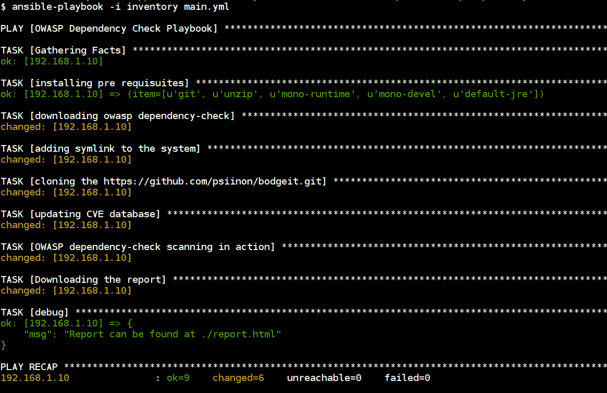

OWASP Dependency-Check scan against Bodgeit project using Ansible playbook

高级依赖检查报告:

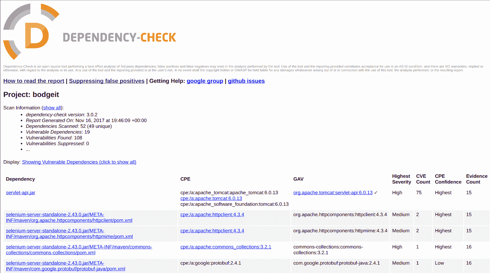

High-level report of OWASP Dependency-Check tool

以下是包含漏洞、修复和参考的详细报告:


A detailed report with vulnerability, fixes, and reference

报告格式在高级别上如下所示:

*   **依赖关系**:扫描的依赖关系的文件名
*   **CPE** :找到任何通用平台枚举标识符
*   **GAV** :马文组、神器和版本(GAV)
*   **最高严重度**:任何相关心血管疾病的最高严重度
*   **CVE 计数**:关联的简历数量
*   **CPE 置信度**:依赖性检查对 CPE 被正确识别的置信度排名
*   **证据数**:从依赖关系中提取的用于识别 CPE 的数据量

More detailed documentation can be found at [https://jeremylong.github.io/DependencyCheck](https://jeremylong.github.io/DependencyCheck).

# 运行 web 应用程序安全扫描程序

这是应用程序进入质量保证、阶段(或)生产的阶段。然后，我们希望像攻击者一样执行安全扫描(黑盒视图)。在此阶段，应用程序将应用所有动态功能和服务器配置。

这些扫描结果告诉我们，在将复制副本拷贝释放到生产环境之前，服务器配置得有多好，以及任何其他应用程序安全问题。

在这个阶段，大多数扫描仪只是在某个水平上工作。而且我们需要把一些人工测试用人脑去发现逻辑漏洞和其他安全扫描器和工具检测不到的安全漏洞。

正如我们在其他部分看到的，在开源和商业世界中，市场上有许多工具可以为您完成这些工作。其中包括以下内容:

*   没有人
*   蛛形纲动物
*   w3af 的
*   Acunetix 和许多其他产品

# nikto–网络服务器扫描仪

Nikto 是一个用 Perl 编写的开源 web 服务器评估工具，使用其要扫描的项目清单来执行安全配置检查以及 web 服务器和应用程序扫描。

Nikto 进行的一些检查包括以下内容:

*   服务器和软件配置错误
*   默认文件和程序
*   不安全的文件和程序
*   过时的服务器和程序

Nikto 设置和执行 Ansible 行动手册如下所示:

```
- name: Nikto Playbook
  hosts: scanner
  remote_user: ubuntu
  become: yes
  vars:
    domain_name: idontexistdomainnamewebsite.com # Add the domain to scan
    report_name: report.html

  tasks:
    - name: installing pre requisuites
      apt:
        name: "{{ item }}"
        state: present
        update_cache: yes

      with_items:
        - git
        - perl
        - libnet-ssleay-perl
        - openssl
        - libauthen-pam-perl
        - libio-pty-perl
        - libmd-dev

    - name: downloading nikto
      git:
        repo: https://github.com/sullo/nikto.git
        dest: /usr/share/nikto/

    - name: Nikto scanning in action
      # Output available in csv, html, msf+, nbe, txt, xml formats
      command: "/usr/share/nikto/program/nikto.pl -h {{ domain_name }} -o /tmp/{{ domain_name }}-report.html"

    - name: downloading the report
      fetch:
        src: "/tmp/{{ domain_name }}-report.html"
        dest: "{{ report_name }}"
        flat: yes

    - debug:
        msg: "Report can be found at {{ report_name }}"
```


Nikto Playbook in action

下载、安装和运行 Nikto 的行动手册，报告输出如下:

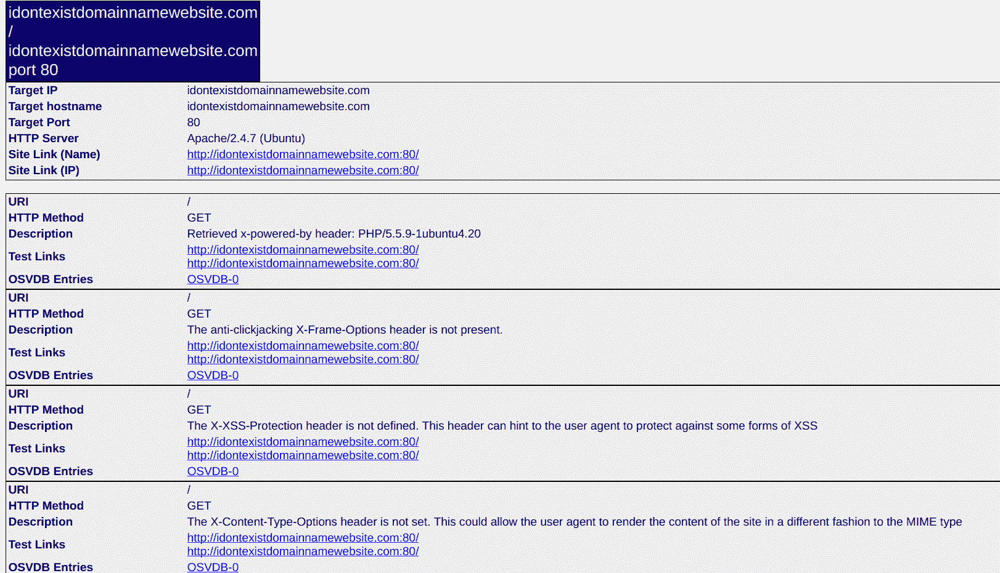

Nikto HTML scan report Read more about Nikto options and documentation at [https://cirt.net/Nikto2.](https://cirt.net/Nikto2)

# 特定于框架的安全扫描器

这种检查和扫描是针对特定的框架、内容管理系统和平台执行的。它允许通过针对多个安全测试用例和检查进行验证来获得更详细的结果。同样，在开源和商业世界中都有多种工具和扫描仪可用。

一些示例包括以下内容:

*   使用 WPScan 对 WordPress CMS 进行扫描:[https://github.com/wpscanteam/wpscan](https://github.com/wpscanteam/wpscan)
*   使用 Retire.js 扫描 JavaScript 库:[https://retirejs.github.io/retire.js](https://retirejs.github.io/retire.js)
*   使用 Droopescan-[https://github.com/droope/droopescan](https://github.com/droope/droopescan)和许多其他工具扫描 Drupal CMS

# WordPress 漏洞扫描程序–WPScan

WPScan 是用 Ruby 编写的黑盒 WordPress 漏洞扫描程序，使用 WPScan 漏洞数据库([https://wpvulndb.com](https://wpvulndb.com))对 WordPress CMS 执行安全扫描和漏洞检查。

它进行的一些检查包括但不限于以下内容:

*   WordPress 核心
*   WordPress 插件和主题
*   已知漏洞的旧软件
*   用户名，附件枚举
*   暴力攻击
*   安全配置错误和许多其他问题

以下行动手册将根据给定的域执行 WPScan，并生成包含问题和参考列表的扫描报告。

根据行动手册的要求更新`domain_name`和`output_dir`值。此外，以下行动手册假设系统中已经安装了 Docker:

```
- name: WPScan Playbook
  hosts: localhost
  vars:
    domain_name: www.idontexistdomainnamewebsite.com # Specify the domain to scan
    wpscan_container: wpscanteam/wpscan
    scan_name: wpscan
    output_dir: /tmp # Specify the output directory to store results

  tasks:
    # This playbook assumes docker already installed
    - name: Downloading {{ wpscan_container }} docker container
      docker_image:
        name: "{{ wpscan_container }}"

    - name: creating output report file
      file:
        path: "{{output_dir }}/{{ domain_name }}.txt"
        state: touch

    - name: Scanning {{ domain_name }} website using WPScan
      docker_container:
        name: "{{ scan_name }}"
        image: "{{ wpscan_container }}"
        interactive: yes
        auto_remove: yes
```

```
        state: started
        volumes: "/tmp/{{ domain_name }}.txt:/wpscan/data/output.txt"
        command: ["--update", "--follow-redirection", "--url", "{{ domain_name }}", "--log", "/wpscan/data/output.txt"]

    - name: WPScan report downloaded
      debug:
        msg: "The report can be found at /tmp/{{ domain_name }}.txt"
```


WPScan Ansible playbook execution

下载、执行和存储 WPScan 扫描结果的行动手册输出:


WPScan output report with issue details and references

这些扫描可以集成到我们的CI/CD管道中，并在部署完成后执行，以根据安全检查和配置检查进行验证。此外，该扫描可以根据需要基于 WPScan 进行自定义；更多参考请参考 WPScan 文档[https://github.com/wpscanteam/wpscan](https://github.com/wpscanteam/wpscan)。

# 使用 Ansible 的自动修补方法

修补和更新是每个必须管理生产系统的人都必须处理的任务。我们将考虑以下两种方法:

*   滚动更新
*   BlueGreen 部署

# 滚动更新

假设我们在一个负载平衡器后面有五个 web 服务器。我们想做的是对我们的 web 应用程序进行零宕机升级。使用 Ansible 中可用的某些关键字，我们可以实现这一点。

在我们的示例中，我们希望实现以下目标:

*   告诉负载平衡器 web 服务器节点已关闭
*   关闭该节点上的 web 服务器
*   将更新的应用程序文件复制到该节点
*   在该节点上打开 web 服务器

我们首先要看的关键词是`serial`。让我们看看 Ansible 文档中的这个例子:

```
- name: test play
  hosts: webservers
  serial: 1
```

示例来自[http://docs . ansi ble . com/ansi ble/latest/playbooks _ delegate . html #滚动-更新-批量](http://docs.ansible.com/ansible/latest/playbooks_delegation.html#rolling-update-batch-size)。

这确保了剧本的执行是串行进行的，而不是并行进行的。因此，我们之前列出的步骤可以一次针对一个节点完成。负载均衡器将流量分配到运行节点上的网站，我们实现滚动更新。

除了给序列号一个数字，我们还可以使用百分比。因此，该示例如下所示:

```
- name: test play
  hosts: webservers
  serial: "20%"
```

示例来自[http://docs . ansi ble . com/ansi ble/latest/playbooks _ delegate . html #滚动-更新-批量](http://docs.ansible.com/ansible/latest/playbooks_delegation.html#rolling-update-batch-size)。

我们可以选择向 serial 提供百分比值或数值。在这种情况下，游戏将针对 1，然后是剩余节点的 20%，最后是所有剩余节点。

```
# The batch sizes can be a list as well
- name: test play
  hosts: webservers
  serial:
    - "1"
    - "20%"
    - "100%"
```

示例来自[http://docs . ansi ble . com/ansi ble/latest/playbooks _ delegate . html #滚动-更新-批量-大小](http://docs.ansible.com/ansible/latest/playbooks_delegation.html#rolling-update-batch-size)。

A great example for this way of doing updates is given in the following link

*Episode #47 - Zero-downtime Deployments with Ansible*: [https://sysadmincasts.com/episodes/47-zero-downtime-deployments-with-ansible-part-4-4](https://sysadmincasts.com/episodes/47-zero-downtime-deployments-with-ansible-part-4-4)

# BlueGreen 部署

蓝绿的概念是由马丁·福勒提出的。一个很好的参考就是这篇文章[http://martinfowler.com/bliki/BlueGreenDeployment.html](http://martinfowler.com/bliki/BlueGreenDeployment.html)在上面。想法是将我们当前的直播制作工作量视为蓝色。现在我们要做的是升级应用程序。因此，蓝色的副本出现在同一个负载平衡器的后面。基础架构的副本具有更新的应用程序。

一旦它启动并运行，负载平衡器配置就会从当前的蓝色切换到绿色。蓝色继续运行，以防出现任何操作问题。一旦我们对进展感到满意，我们就可以拆掉老主持人。以下剧本以非常简单的方式展示了这一点:

*   第一部剧本提到了三位主持人。在负载平衡器后面运行 nginx 的两台 web 服务器
*   第二个行动手册将活动内容(蓝色)切换为绿色

# 蓝绿色部署设置行动手册

下面的剧本将设置三个节点，包括负载平衡器和两个 web 服务器节点。遵循 https://www . upcloud . com/support/haproxy-load balancer-Ubuntu 创建行动手册。

以下片段是`inventory`文件:

```
[proxyserver]
proxy ansible_host=192.168.100.100 ansible_user=ubuntu ansible_password=passwordgoeshere

[blue]
blueserver ansible_host=192.168.100.10 ansible_user=ubuntu ansible_password=passwordgoeshere

[green]
greenserver ansible_host=192.168.100.20 ansible_user=ubuntu ansible_password=passwordgoeshere

[webservers:children]
blue
green

[prod:children]
webservers
proxyserver
```

然后，`main.yml`剧本文件如下，描述了在哪些节点和流程上执行哪些角色:

```
- name: running common role
  hosts: prod
  gather_facts: false
  become: yes
  serial: 100%
  roles:
    - common

- name: running haproxy role
  hosts: proxyserver
  become: yes 
  roles:
    - haproxy

- name: running webserver role
  hosts: webservers
  become: yes 
  serial: 100% 
  roles:
    - nginx

- name: updating blue code
  hosts: blue
  become: yes 
  roles:
    - bluecode

- name: updating green code
  hosts: green
  become: yes 
  roles:
    - greencode
```

每个角色都有自己要执行的功能；以下是在所有节点上执行的常见角色:

```
- name: installing python if not installed
  raw: test -e /usr/bin/python || (apt -y update && apt install -y python-minimal)

- name: updating and installing git, curl
  apt:
    name: "{{ item }}"
    state: present
    update_cache: yes

  with_items:
    - git
    - curl

# Also we can include common any monitoring and security hardening tasks
```

然后，代理服务器角色如下所示来设置和配置`haproxy`服务器:

```
- name: adding haproxy repo
  apt_repository:
    repo: ppa:vbernat/haproxy-1.7

- name: updating and installing haproxy
  apt:
    name: haproxy
    state: present
    update_cache: yes

- name: updating the haproxy configuration
  template:
    src: haproxy.cfg.j2
    dest: /etc/haproxy/haproxy.cfg

- name: starting the haproxy service
  service:
    name: haproxy
    state: started
    enabled: yes
```

`haproxy.cfg.j2`看起来如下，它具有执行设置所需的所有配置。这可以根据我们想要添加(或删除)的配置进行改进，例如 SSL/TLS 证书和公开`haproxy`统计信息等:

```
global
  log /dev/log local0
  log /dev/log local1 notice
  chroot /var/lib/haproxy
  stats socket /run/haproxy/admin.sock mode 660 level admin
  stats timeout 30s
  user haproxy
  group haproxy
  daemon

  # Default SSL material locations
  ca-base /etc/ssl/certs
  crt-base /etc/ssl/private

  # Default ciphers to use on SSL-enabled listening sockets.
  # For more information, see ciphers(1SSL). This list is from:
  # https://hynek.me/articles/hardening-your-web-servers-ssl-ciphers/
  # An alternative list with additional directives can be obtained from
  # https://mozilla.github.io/server-side-tls/ssl-config-generator/?server=haproxy
  ssl-default-bind-ciphers ECDH+AESGCM:DH+AESGCM:ECDH+AES256:DH+AES256:ECDH+AES128:DH+AES:RSA+AESGCM:RSA+AES:!aNULL:!MD5:!DSS
  ssl-default-bind-options no-sslv3

defaults
  log global
  mode http
  option httplog
  option dontlognull
        timeout connect 5000
        timeout client 50000
        timeout server 50000
  errorfile 400 /etc/haproxy/errors/400.http
  errorfile 403 /etc/haproxy/errors/403.http
  errorfile 408 /etc/haproxy/errors/408.http
  errorfile 500 /etc/haproxy/errors/500.http
  errorfile 502 /etc/haproxy/errors/502.http
  errorfile 503 /etc/haproxy/errors/503.http
  errorfile 504 /etc/haproxy/errors/504.http

frontend http_front
   bind *:80
   stats uri /haproxy?stats
   default_backend http_back

backend http_back
   balance roundrobin
   server {{ hostvars.blueserver.ansible_host }} {{ hostvars.blueserver.ansible_host }}:80 check
   #server {{ hostvars.greenserver.ansible_host }} {{ hostvars.greenserver.ansible_host }}:80 check
```

以下代码片段将服务器添加为负载平衡器的一部分，并在用户请求时提供服务。我们还可以添加多个服务器。`haproxy`还支持 L7 和 L4 负载平衡:

```
server {{ hostvars.blueserver.ansible_host }} {{ hostvars.blueserver.ansible_host }}:80 check
```

web 服务器是非常简单的 nginx 服务器安装程序，用于安装服务并将服务添加到启动过程中:

```
- name: installing nginx
  apt:
    name: nginx
    state: present
    update_cache: yes

- name: starting the nginx service
  service:
    name: nginx
    state: started
    enabled: yes
```

最后，下面的代码片段分别是`blue`和`green`服务器的代码:

```
<html>
    <body bgcolor="blue">
       <h1 align="center">Welcome to Blue Deployment</h1>
    </body>
</html>
```

```
<html>
    <body bgcolor="green">
        <h1 align="center">Welcome to Green Deployment</h1>
    </body>
</html>
```

以下截图是整个设置的行动手册执行参考:


行动手册完成后，我们可以在负载平衡器 IP 地址查看生产站点，查看蓝色部署:


# 蓝绿色部署更新行动手册

现在，开发人员已经更新了代码(或者)服务器正在修补一些安全漏洞。我们希望通过绿色部署部署新版本的生产站点。

行动手册看起来非常简单，如下所示，它将更新配置并重新加载`haproxy`服务以服务于新的生产部署:

```
- name: Updating to GREEN deployment
  hosts: proxyserver
  become: yes 

  tasks:
    - name: updating proxy configuration
      template:
        src: haproxy.cfg.j2
        dest: /etc/haproxy/haproxy.cfg

    - name: updating the service
      service:
        name: haproxy
        state: reloaded

    - debug:
        msg: "GREEN deployment successful. Please check your server :)"
```


然后，我们可以再次检查我们的生产站点，通过导航到负载平衡器 IP 来查看更新部署:


现在，我们可以看到我们的生产站点正在运行新的更新部署。HAProxy 中有多个高级选项可用于执行不同类型的更新，并且可以根据需要进行配置。

# 摘要

本章涉及应用程序和网络安全的各种用例。通过将各种工具与 Ansible 行动手册的强大功能相结合，我们在该领域创建了强大的安全自动化工作流。根据需求，您可以使用基准来实现安全默认或定期检查合规性并满足审计要求。我们还研究了允许我们对 AWS 云做同样事情的工具。从应用程序安全扫描程序到以安全配置驱动的方式进行软件更新和修补的方法，我们试图涵盖各种各样的任务，这些任务通过 Ansible 自动化变得非常强大。

在下一章中，我们将关注 IT 和运营领域最令人兴奋的新兴领域之一，即容器。Docker 与容器同义，已经成为开发人员、系统管理员广泛使用的技术，也是现代软件开发和部署管道的核心部分。让我们探索一下 Ansible 有什么可以使用 Docker 容器。